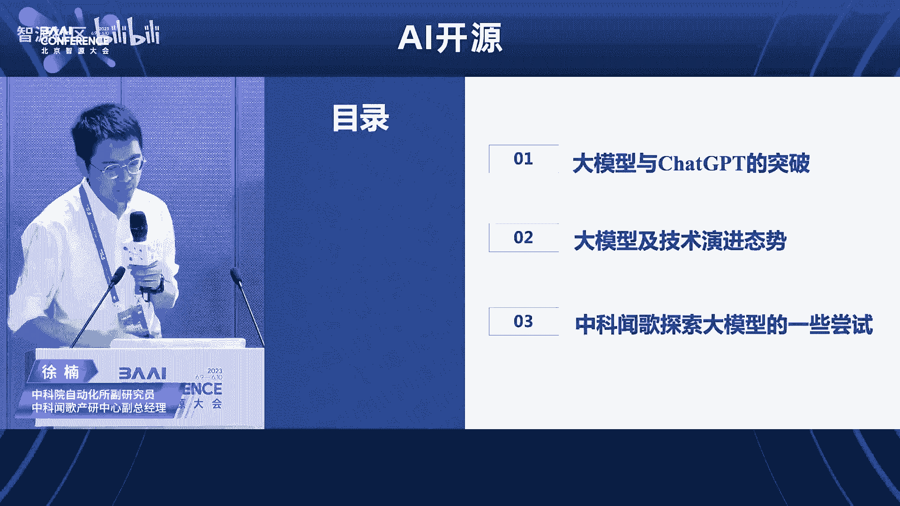

# 2023北京智源大会-AI开源论坛 - P1 - 智源社区 - BV1jo4y1K74N

🎼尊敬的嘉宾、女士们、先生们，大家下午好。非常欢迎大家来到2023北京资源大会AI开源论坛。我是今天的主持人杨轩啊。

我来自lin foundation亚太区呃简单呃讲两句就是呃lin foundation是全球最大的开源呃组织啊非盈利组织呃。

而呃LFAI and data这个是lin foundation下边专职的是人工智能这个领域的这个基金会。同时呢LI and data呢也是呃全球最大的AI领域的呢开源社区。

啊现今呢AI开源呢已经成为人类呃超大规模智力的智力协同的一个最佳的一个组织方式，可以说呢没有开源，就不会有今天AI的这个呃成就。呃，现在呢AI呢已经成为了。😊，这个人类这个开源创新的一个主战场啊。

今天呢我们有幸呢请到了非常多的呃AI领域的专家一起探讨呢呃从这个AI与数据的开源到大到大模型的这一些的机遇与挑战。啊，希我们希望呢这次的这个大会呢能够对待大家的未来的这个发展呢，有呃呃有所帮助啊。

工作上啊或者是呃事业上有所帮助。另外呢我们也希望我在这里也在呼吁一下呢，就是说希望能够有更多的朋友能够加入到AI开源的社区的行列。啊，我们在LI data这边呢，我们有大概440到50个这个开源项目。

这些呢也都欢迎大家来去呃使用参与这些项目。今天呢我们就是有请呢我们今天这个第一位嘉宾，这是呃我们有请LAI andda呃董事会呃主席杜俊平老师为我们带来。主题演讲AI与数据开源挑战以机励有请啊杜老师。

也感谢主办方资援和研院和这个林老师的邀请。那么今天给大家啊介绍一些这个关于AI和数据领域开源的一些挑战和机会。那么借着这个场合呢，我首先介绍一下这个FAN data基金会啊。

那么FANdata data基金会呢是个开源的软件基金会，它是一个非盈利组织。但是它啊托管了在AI和这个数据领域最重要的全球最重要的一些啊开源的项目。那么同时呢在呃我们当前的基金会里面。

大概有全球有50个啊左右的这个member啊，包括像咱们呃国内大家熟悉的一些大企业，甚至包括资源研究机构也在里面。

同时呢我们全全球呢托管了大概有46个啊这样一个关键的这种technical project。啊，也有啊超过啊接近2万名的这种开发者，为我们的这种AI和数据类的这种项目，开验项目在持续的贡献。

那么这个这张图呢能看到FANda作为一个大的这个基金会的社区大的开源社区啊，它的这个开发者的规模，它的呃技术的这种成呃这个飞速的发展。过去的5年呃成长的大概5倍啊，53031%的这个成长。

一方面这个也反映了当前这个在AI这个领域的开发的这个趋势，就是更多的开发者更多的呃开源的这个公呃公司呢投入到这个AI这个领域也涌现到这个开源这个领域。

那么同时呢我们也希望借着这样一个平台能够更好的这个拓展我们的啊这个让技术更好的发展。啊，同时这里面的这些关键的这个project呢，包括一些这个深度学习框架，包括这种onex啊。

这样的一个框架之间的翻译的平台，包括这harwood在这种分布式的这种学习框架，甚至包括啊项目资源也有这个flag AI啊，在这个在这个里面。然后这些top的这种organization呢。

就是大家耳熟能详的。像这个啊亚马逊啊微软啊啊这个meta啊等等。像国内的华为啊、百度啊、阿里啊啊，都在这个我们的这个组织里面，或者是或者是member吧，或者是包括推管了一些关键的项目。

那我们的这个基金会它的运作呢是呃主要是分就是相当于是一个分层治理的架构。那么有governning board呢，就负责这个董事，就整个基金会的一个层面的治理。

那么另外我们有technical呃这种cordation呢，就是type meeting。呃，我们的TAC technicalnicalad，它是专注在啊技术层面的治理。那个包括我们整个。

🎼开源社区这些项目，它的这种life circle从这个sbox到incubate到graate它是一整套的一个啊相当于一个毕业的演进流程。

那么我们 typically认为sbox阶段是项目的一个开源项目，它的总阶段。在这个阶段里呢，更多的我们会关注啊他的这种开发者的生态，更多的这种开源的呃开发者能够加入当中到这个项目当中。

那么到了incub呢就是更多的它是开始拓展自己的用户，就它已经有足够的开发的，有些完整的功能能够适应在一些场景之上。然后再往前走呢，它就是一个graduate的状态，就是它的呃功能比较完善。

它的生态比较丰富，用户也也积累积累的比较丰富，它可以进行一些规模化的落地啊，这就是它整个完整的呃这个开源项目的这种life circlecle。那么回到我们今天的正题啊。

就是我们在呃看看这个当前我们说是属于属于的时代。实际上呃当前我们的时代在不管是工业界还是学术界，大家的认知都是一致的。就是我们认为这是属于AI的技术爆炸的的这个起点时刻啊，就是我们在通样陆续在。

在这个关键时刻走向这个人通用人工智能。那么现在的一个。很多这种bussword就是说啊从前几年的我们mine learning啊，deep learning AI framework是吧？

慢慢的现在更多的大家听到的都是这个呃transformer，然后attention呃AIGCLALA large language model这些啊这些词其实这些都。看到这这两年每隔每隔一年或者两年。

它的这个焦点都不一样。尤其是当这个去年底对吧？这个chGBT出来之后，其实上引爆了一个核弹。呃，快速的走向这个呃。呃，让这个AI的这个生态啊快速的这种啊能够能够蓬勃的发展。那实际上呃业界呢把这些模型。

就现在我们看现在应该是一个模型飞速发展的时代。那么业界把这些模型呢从这个小模型到中模型，中等的模型，大型的模型跟超大的模型啊，每个每个来某某一个模型的，它的能干的事情也看的比较清楚，是吧？

一些小模型呢可以做一些简单的一些阅读理解啊，包括这种debugging的工作是吧？然后中中型到大型的这种模型。啊，类似于GPT3GPT呃3。5之类的呃。

它可以做一些啊这个GR包括GPT4可以做一些这种GRE层次的这种阅读理解，甚至包括一些对于这种类比啊比喻啊。还有一些这个呃包括这个逻辑的推导啊，一些这个生成代码的生成啊，我们的这个。

在这个ghas上的一个 pilot这些啊其实很很。就是很很大程度上其实提高了我们啊在这种啊开发生成这些文档啊，包括这种写代码开发的这个效率。其实未来呢我们看到随着这个我们的这个模型会越来越呃这个发发展。

可能会有些进进进一步的一些。呃，功能会被开发出来啊，包括他有一些初步的一些呃更。更这个更强的一些自我的意识啊，或者更复杂的一些工作，甚至是一些呃一些这个argument他都可以去做啊。

这就是一个我们这个时代的继承，就是它是一个飞速发展的过程。那么实际上去年呃两周前我们看到dybreaks发了一个报告，就是在2023年的这个呃，他认为这个state of data加AI。呃。

有些有趣有有意思的这个呃数据。那比如说。就AIGC这个呃就是拆GPT发布之以来的几个月，这实际上大家用呃用这个API的模式，或者是这种呃模型工具链的这种模式会成为这个主流。

在这之前大家都是啊美公司自己可能训一些，或者是用依赖于一些这个啊开源的开放的一些一些模型。那么在这之后呢，可能直接我们就开始用这个API去访问这些模型。那么这短短的这个半年时间。

从去年底到啊今年的5月份，这半年时间呢，这种直接对于API的这个层次的这种访问量的吧升了1310，也就是13倍。那么同时呢，现在在NLRP的这个领域呢，在整个呃这种。呃，科学计算呃。

在在整个这个呃python的这种data science这个领域啊，它占的这个比例啊已经得到大概大概占到了这个50%左右啊，就非常的popular，也占用大量的这种。啊，这种。

M型 learningning和这个个学计算的这种任务。那么同时呢。嗯，还有一个意思就还有一个有趣的现象，就是企业对于模型的重要性也是越来越呃越来越有更强的认知。那么在过去的一年当中啊。

模型上线的在生产中上线的模型啊，实际上翻了400%啊，甚至包括在这个过程当中，大家的成熟度，使用模型的成熟度也提高了。与以前的一年之前。大概是每5个模型，就是在测试阶段，最后呢变成一个生产模型。

那么现在呢这个比例是3比1，就是每三个啊处于这个测试阶段的模型呢，就啊就有一个进进入生产。实际上这种比例的变化也也意味着我们在AI这个infer或者是整个呃这个行业的应用当中慢慢的走向成熟。

一方面是我们认为这个大模型的生态是发现在发展的是欣欣向荣啊，但是从另外一个层面，我们看到冰山下的部分呢永远是数据。那某种程度而言。啊，模型只是数据的一个一个转化品或者衍生品，它是一个。

呃呃这个模型是数据的，在某一个切面上的一个投影啊，或者是一种折叠，或者是一种压缩。所以一个高高质量的这个数据集呢，实际上是可以啊训练出这个不同的维度的这个多个高价值的模型的。那么作为这个冰山之下的部分。

这个数据的重要性呢，就是大家一直在强调啊，一直在呃在在提。但是始终呢大家都觉得哎这块可能。有很多各种各样的挑战。那么今天我们待会儿也会去啊更多的去讨讨论一下有哪些挑战啊。其第一个就是。呃。

从训从这个模型训练的角度来说，这个数据从来就没有够过啊，这个够体现在一个是质量，一个是数量啊，我们需要更高的质量，然后更多的这个数据等等。啊，不管在整个这个模型的这种产生，诞生，从训练阶段是吧。

到后面的调优阶段的后面的这个推理到啊生成之后的这种prom engineering，其实它都离不开这个不断对它进行这个数据的一个投位。所以就是如果我们说大模型就像一个这个贪吃的贪吃蛇或者一个贪吃的怪兽。

那么就是他一直吃不饱，那始终是啊有更好的这个需要更多的数据和更高质量的数据。那么同时呢很多的企业呢初步初步已经感受到这个模型的power之后呢。

下一步就是说如果能如何能够更好的提升我的这个呃模型的这个能力和质量。也是在呃数据这块层面做很多工作。就是所谓的这个啊datacentric的的工作。那么实际上当前的这些数据呢，来源无非就是三个来源。

那么第一个来源呢就是自己啊去这个呃去收集一些数据，去扒取一些数据。那么第二个呢就是。从第三方去购买是吧，或者是呃获得一些数据。那么第三个呢就是通过public valuable的方式啊。

找一些公开的数据集啊，类似于我们的hing face啊，在在这个之上去获得一些。但是这三个层面上呢，多多少少还都是有一些挑战的哈。第一个从主动收集领域。

其实很多我们发现现在的数据呢呃很多的公司还是在管个公司，它的这个啊私域属于在这个私域之中啊，很难从外部去获得。而且是一种合规合法的这种方式去获得，是是比较难的。那么另外一个层面呃上讲呢就是。呃。

对于这种第三方的呃购买或者交易的这些数据呢，实际上也是有很多挑战。因为啊这个数据的定价格如何定义是吧？然后这个数据啊如何定义它的质量，或者是它的对我的这个外部的公司，外部的企业，它能够真正产生益处。

所以这个所以有很多的这种啊数据交易市场。国内我们也有一些海外的也有一些在云，甚至在一些云服务上啊，云服务场上，包括这种呃这种数据的这种呃production。

或者数据的saras service上都有这样相应的market。但是目前来看的它的交易量和本交易的数量和规模其实还没有完呃，没有达到这个理想的状态和要求。那么第三个呢，实际上是在呃。

这种公寓就是public available的这种数据。那实际上我们现在看到很大量的数据集还是不是一种完全开源的状态，它可能还是在。呃，商用啊或者是方面有很多的限制，就你可能做做研究可以是吧？

但是你不允许相应相应推发，或者是当你训练完了之后，你的这个这个预训量的模型，或者将来的数这个AI的模型的产品啊，不允许有各种各样的限制。

那么实际上这也使得我们的可用的商业可用的这些数据集都是啊很有的限制。我认得这个是一个很重要的挑战。在三种渠道上各有各自的这种挑战需要去去做。那么另外呢，还有就是看到这个数据的这个。呃。

quality还是quity啊，大家会有很多不同的。呃，这个要求和纠结现在基本上达成大家达成一个共识，就是quality over quantity，就是数据的这个质量可能优于它的。

它的这个呃这个quity。因为其实质量呢它决定了这个模型是吧，是否精确，是否是相关，是否啊会不会有一些buers，会不会有一些就就是不公平啊等等。但是 quantity呢它实际上也是有用的。

它包括你大量的数据训练出来的模型的，它会有更强的这种泛化能力啊，包括它有更强的这种robust能力。他不会说呃觉得过于依赖某一部分的这种数据。然后同时呢他看到一些这种。呃。

没有见过的传情况的这种case，他能够很好的这个处理。所以quity和 quality这种呃经常是也是有企业会去纠结的。那么我们认为就未来的方式呢就是。呃，可能在数据在保证数据质量的情况下。

那个我们更更高的更多的获取数据。然后同时用一些，比如说现在当前是用人工的方式去打一些标签，对吧？或者是做一些相应的这种工作，未来可能会更多的自动化的标签，或者有相应的开发出相应的模型啊。

自动的会给我们的这个啊数据啊贴上各种各样的这种标签。那么可以更好的训练我们的。我们的这个模型。然后同同时呢，在这个data set的治理层面，其实有很多啊很多的这种问题。其实原数据的治理呢一直在。

在业界就是一个问题。包括我们看到很多企业内部大的公司内部啊，不同的team，不同团队其实互相之间的因为啊一些沟通的问题，或者是啊部门强的一些问题，其实没有办法啊很好的共享数据。

哪怕这些数据呢对啊在公司内共享是很有价值的。那么第一个难点就就卡在这个数据法源数据的发现，就是我们能不能有一套这个原数据的标准，很好的定义不同的呃不同的这个。呃，这个数据注意集他在做什么事。

那我们其实看到比如说以这个hing为face为例，其实。都同样是文本数据是吧？MDB的这个数据集和这个wiki就是还是有些差别。那么对于。呃，对于我们这个普通大众来说，他的认知还好，还是能够理解。

但是一旦这个是牵扯到企业不同的不同的业务，它的业务逻辑在里面的时候，这个呃互相之间就很难去达成一个一致。所以在这个层面上啊数据级的这种medada是需要一个标准。我觉得在这个领域。

其实FANda基金会可以做的更多。我们可以做更多的啊这种相应的开源的标准的这种工作。那么从另外一个层面，其实从治理的层面。实际上呃当前的很多时候在强调这个data的这个governance。呃。

这种data governance设施包括一些原数据，包括一些数据的呃血缘。但实际上在当前来看，除了数据这块需要治理。

其实在整个呃motion型 learninging某型 learning pipeline上有很多更复杂的东西，包括我们从数据的这个处预处理之后呢，会有特涉及到特征特征工程，对吧？

在后面的model training，啊，包括这个managementserv。到后面现在还有这个pro engineering。所以这里面有很多大量的东西啊。

你有很多从从数据data set到这个feature的映射，从feature到。model映射model到后面的一些prom的一个映射，这个形成了很多这种网站的关系。啊。

但当前现在是没有一个很好的一个治理的产品或者治理的一个框架来去。呃，来去这个完善。那么我们认为这个是市场上这个急需的一些啊一些方向。那么刚才说到的这些挑战呢，其实还有一个很关键的。

就是在于我们看到在呃更多的挑战其实还来自于来自于这个包括我们的数据的全球的这个分布啊，然后多区域多云造成的这个新数据孤岛的问题。我们看到现在很多这种致力于开展国际化业务的公司。

其实面临着呃越来越这个这个严苛的一些数据的监管。那么怎么样去兼顾啊以合规的前提啊，就是兼顾监管的要求。但同时呢从全局的角度，从业务的角度，他需要一个全局的视角。

全局的视图能看到啊这个不同的地域它的这个业务策略和数据驱动的这些策略。其实这里面其实有一个很强的一个gap。那么这样的话，如何统一啊去做这个数呃数据的分析治理、训练推理，就是在呃当前越来越成为各个。

大公司或者是有国际化业务，有这种订购业务的公司，它的一个很大的一个。呃，难点。那么近年来其实像如果我们关注像berkeley啊，他们也提出了这个skycomp一个云联邦的架构。

某种程度上在IS这个层面啊，解决了缓解了这个多云带来的这种复杂性呃和这种性能问题。但是要解决彻底解决这样一个啊多云造成的这种数据割裂数据孤岛的问题。啊，且或者模型的鼓导问题。

其实还需要这个更颠覆性的产品和技术出来。但是虽然这里面讲了很多的问题啊，就是很多挑战。但我觉得这里面其实更意味着更多的机会。那很多这些机会很多这些问题呢就潜就是之前是隐藏在水下。

那么现在随着这一波的啊这个大语模型的这种蓬勃发展呢，实际上我们有更多的可能性。我们的问题更多了。但是同时我们的这个手段，我们的能力，包括我们的这个聚焦的资源也很多了。那么现在有很多聪明的工程师。

包括很多的资源多的快速涌向这个AI这个领域和数据这个领域。我觉得我对未来我们快速这个领域快速的这种发展充满了信心。那么我们现在正在做的这个啊这个我的一个初创的公司呢。

也在以开源的方式来解决AI和这个开源呃和数据开源碰到的各种各样问题。啊，这个用开源的方式解决啊这个AI和领域和数据领域的这些啊最尖端的痛点问题，一直是我的这个啊这个秉持这个我的这个啊理想。

也是我的啊一个公司未来的一个愿景。那么也希望啊更多的小伙伴可以跟啊跟我们一起啊，就是在这个领域探索啊，创造一些伟大的技术，创造伟大的产品。好，谢谢大家。😊，啊，感谢杜老师的精彩分享。

接下来有请智源研究院副院长兼总工程师林永华老师。智源研究院自然语言多模太祖负责人刘广老师呃，带来主题分享。智源open呃flag open大模型技术开源体系，开启大模型时代新linux生态建设啊。

掌声有请。🎼谢谢哈，等会呃这个这个session呃由我还有呃我同事留管，等会呃会把他请上来哈。嗯，那呃首先我还是想借今天的这个机会哈，感谢那个杜俊平老师。

还有感谢lin基金会AI AI data基金会对我们支援大会的支持，以及组织了这么好的一个AI开源的论坛。我看到后面大家都已经这个站站站都站站了哈，包括坐在楼梯上的这个小伙伴们。呃，前面其实还有座位哈。

大家可以这个也可以做那个嗯开源其实是很重不好意，我拿一下那个翻业的。😊，开源很重要，包括在这一次呃智援呃，我们发布大模型其实我们很重要很重要的一个keyword，就是开源啊。

所以为什么说AI开源论坛也是这次呃，其实历届智援大会都是很重要的一个话题。呃，这个这个就不说了哈，今天说了太多了。这个好，我发现那个用用的这个图跟读老师的图一样啊。😊，但的确就是说看到了。

实际上虽然现在从去年下半年到到现在哈很火热的，例如像AIGC文生图，例如像GPT大家其实看到的冰山上的部分。啊，但嗯水面之下大家看到的的不一样哈，从资源来看，这个数据大然是以以很重要一部分。

还有很重要的是它整整个冰山水面下的技术站。那这里头的技术站，包括了各个重要的基础模型，包括语言视觉图文文声图等等。也包括了我们这些数据集以及做数据集很多的重要的工具，还有大模型的评测的方法。

另外还有就是支撑整个大模型，高效训练的AI的系统技术。那这里头也是很多，包括框架的并行优化平台的调度算子优化，甚至AI异构芯片技术啊，这也是为什么我们其实是说AI系统。

就是今天上午们特别也是有一个专门的论坛啊去讨论。😊，那呃对资源本身来说，呃，正因为看到这个水面之下最重要的这个技术站。所以这是我们的定位。就是说我们需要把帮助整个产业科研这个产业。

把这个技术站整一个打造出来。嗯，那这里头就包括我们的一系列的基础大模型啊，从昨天早上我们的整一个这个呃全体会议的时候，呃announce的我们开源出来的几个大的这种包括语言视觉跨模态的大模型啊。

也包括我们自己的数据及工具。呃，AI基础大模型评测，这是等一下下一个session介绍这个由我们杨西杨博士介绍那个flyev啊呃去介绍。然后还有我们的整一个九鼎的智算平台。

那呃首先我我我也想趁今天这个机会啊来说一下为什么我们资源要走大模型开源开放的道路。其实很简单就是说两个原因。第一个是说推动整个社会资源的合理使用，包括数据和算力。其实基础模型。如果我们这个基础模型。

它不是一个行业性，而是一个通用性的话，其实它去构造这个基础模型所使用的东西是很类似的，都是需要我们有一定比例的这个呃互联网数据加高质量的数据，也需要海量的这个算力。所以其实大家是想就是说如果基础模型。

其尤其是通用性的基础模型不没有开源出来，也进一步没有能够是以商用的版本开源出来。那势必找只能够逼的各家企业自己去重复性的去造这个轮子。而这个轮子很高昂，很昂贵。

呃我在昨天的那个呃我们新发布的那个呃天鹰大模型的时候。我第一页就是说为什么我们认为基础大模型就像这个就类比AI中造1个CPU第一个原因就是它贵呀，那贵是贵成什么样？这资源是什么样子。

当时我就我们就至少是小几千万到大几千万这样的一个量级。而另外一个就是说哪怕是金钱不是问题。但算力以及推动算力运载算力背后的能源也是很重要一个问题。要知道。

大家要知道说现在我们实际上付给去租用这个GGPU服务器，哪怕是英伟达这样子的，它在能耗比上面已经算是做的很不错的。其实我们很多很很很重要的一部分钱就是付给了这个电电费啊。

所以没有必要真的没有必要重复大家去造这个轮子，而这个轮子都是通用性的是吧？何不就是有人能够把这个东西开源出来，并且它是商业可用。但当然重要一个是可以保证这个版本可以持续的往前迭代。那第二个很重要的是。

它这个基础大模型。今天它已经不是只是个理解，它是一个能力的生成。并且它是一个认知对外输出价值观对外输出的东西。那因此它对社会可能带来的影响是巨大的那因此我们在训练这些这个基础模型里的时候。

所使用的预训练的数据也是相当的考究啊，那这个可能大家也能留意是说，前阵子这个国家网信办也有一个征求意见搞出来。其实有很大一部分也是在探讨这个数据的安全的问题嗯。

那呃其实支源我们最近哈也对持续的关注check，我们在在今年那个1月份到5月份全球开源的这些通用的通用的语言大模型的统计。那这里头是有一些数字哈，未必完全准确哈这个总数。

国外开源的语言大模型一共有39个，其中可以商用，并且并不是使用copy left的协议的大模型有16个。那为什么这两个东西很重要。因为我们来看科研是一个问题，但现在最重要是怎么推动这个AI产业落地。

产业落地必须我们要符合产业的游戏规则。而产业的游戏规则是说你要用的东西必须是带有可商用的版本。非商用版本其实是对企业未来的发展，它的使用是有ris的那另外一个copy left的协议。

这个因为在座都是对开源可能就已经从事很多年，就知道例如像类似。GPL这种类似的license的话，呃，现在我们也看到有一些模型开源也用了类似这种copy的协议。

那那种这种协议它定义了是说只要在这个模型上面 further的con training的模型，以及它的呃微调的模型都必须开源。

那这个实际上对于很多企业的商业的利益的保护是很很很有弊端的这也是为什么其实咱们看整个开源界，它使用的版本也是越来越多的开源的代码呃，使用像阿帕奇啊MIT啊这种呃BSD这种copy。

就是不是copylic。呃，所以这是一个。那另外咱们回归到看咱们国内开源的发布了发布的大模语言大屏模型有28个开源的数量只有11个。那其中我们同样也是去看它这个开源可商用的版本的模型。

目前只有一个就是ba里的一个小的一个基于b的一个指定微调的对话模型。所以这里头可见是说，为什么这一次致援我们在发布我们的呃这个天鹰大模型的时候，直接很干脆的使用这个可商用的license。

以避免企业的一个呃顾虑。那支援我们这一次开源的整一个就是我们的大模型数。但实际上最重要的是底层的这个基础的大模型。在这里头我就不多花时间。那开源开放，使得我们可以站在前人的基础上去前行哈那因此。

这个呃这是为什么智源刚才说我们打造的是冰山水面以下啊，这些对于咱们构造大模型应用很重要的技术的部分。而我们实际上在今年的2月28号就全面开源啊，发布出来。这里头包括了最核心的fAI大模型算法开源项目。

这里头呃会包含我们智源最新呃发布的呃。天鹰大模型也是放在这个里头去进行发布。这个等会刘广博士会给大家介绍呃哦by the way我要强调这个大模型算法开源项目，我们去年6月份正式第一个开源出来的时候。

就第一时间给lin基金会内到I and data这是因为我们希望是说以这样一个决心来促进呃咱们在中国签呃呃主导。但是全球可以开放使用的这样一种合作的氛围。

那bes这个fI我们还有f data这个主主要是做数据工具的开源。另外还有f这个大模型评测开源项目这个等工和第二个top会讲。还有最后是说下面一个我们对AI系统开源的评测。

那说一下这个AI呃异购它是其实有点对标那个Mf但是Mf的话，它实际上呃主要还是比较tradition的work作为而进入我们大模型时代。实际上我们需要新的一批大模型的来牵动我们易购芯片的发展。呃。

同时我们希望是说在这个呃用来帮助做系统性评测芯片性能评测的时候，不要只有一种一种一种框架。我们也是积极的去跟这些国内的框架合作，呃，使得是说大家对芯片的评测，可以也基于多种的框架结构。

那下面呢我们很高兴也获得了这个呃不同的包括天数天数智星昆仑星，包括华为升腾的等等芯片厂商的支持，陆续的把他们的一些呃呃相应的部分也加到我们这个评测的开源系统里头。那我们希望打造的是说。😊。

帮助我们芯片异购芯片的用户，可以很快拉起一个完整的测试。呃，这个因为等会会讲，我就sip掉。那呃这个是我们那个呃fd dataf data实际上是它是一个呃工具的开源，那包括了数据清洗统计分析等等。

其实这是智源一直在过去3到4年做这个大模型预训练数据的时候积累的工具嗯。然后。哎，等一下，我看这个是不是有点哦，好，不好意思哈，那个我我我我要讲的部分已经呃讲完了。然后在此我邀请那个刘广刘博士。

刘博士是我们呃自然负责这个自然语言处理和呃多模态生层的研究组的负责人。😊，哦，同时他也在，是咱们fAI的负责人。谢谢谢谢林老师的介绍。对。😊，呃，首先就是接在林老师后面演讲是非常有压力的。

然后我觉得是呃给大家呃简单先介绍一下我们flagI做的一些事情。首先我认为坚定的去开源肯定是会推动和降低整个大模型的门槛。我们也希望能够通过开源这种方式。

让更多的小伙伴们一起加入到这个大模型这个行业发展中来。然后呃虽然看到这个曲线，它的star并不是特别多啊，因为还等待大家各位的一些帮帮助，然后投入。呃，但是我们想做的事情是说。

我们希望打造一站式的高效应用灵活的大模型的算法与工具，去解决刚才上一页PPT中讲到的那个些问题。😊，就是呃现在我们训练了qui，然 diusion等等这种大模型。在这个训练的过程中。

我们面临了很多的问题。首先第一个是说，现在有很多开源的加速的呃各种模型并行，数据并行的一些开源框架。但是呢这些框架特别的就是开源技术特别的呃复杂，然后呢，标准不太统一。

在这种情况下去学习和使用某一种开源框架进行大模型的开发是比较困难的。当然如果你坚定的只选择一种，然后坚定的去为这一种框架去排坑是可以的。像我们之前一样去一步一步把这个坑都汤完也是可以的。

但是这个时间周期会比较长。第二个是说各种不同的加速技术，然后去呃他们复杂的交接在一起的时候，组合在一起的时候，会影响到整个系统的稳定性，导致你训练不收敛，或者是导致你训练的效果不达预期。

在这种过程中怎么样去呃解决这种兼容性差的问题。所以说这个是呃技术比。复杂一个点。第二个点是说，现在有很多开业模型，我不呃就是大家可以通过很方便的一些方式得到一些开源模型。但是开业模型它的质量怎么样。

它能达到一个什么效果。其实我们是在真实应用的场景中是很难去去去感知或者去体会到或者评价，得到一个一个比较好的一个结果。我们需要投入大量的时间和工程的呃人员去把这个算算法复现，然后下载下来。

然后去做一些对齐，在我们的那个真实的业务数据中去做一些验证。所以这个成本非常高，花了大量的时间验证了很多我们不用的模型。第三个是说，除了这除此之外，大模型是一个新兴的领域。这个新领域有新的技术。

有新的研究点，有新的问题。那么我们在这么一个复杂的过程中，怎么样去让更多的人去接触和加入到大模型的这个行业中，推动这行业的发展，是我们希望能够做到的事情。所以说在这么一个时间成本。

人力成本和精成本非常高的一个大模型开发的这么一个问题和前景。呃，这个行业中，我们希望通过开源的方式来来来做一些贡献。对我们提出了一个叫flagI的大模型开源的框架架构。

我们的c模型和之前很多呃视觉和多模态的模型都是在这个框架下进行训练推理，然后开源出来。然后呃在这个过程中，我们有很多坑已经蹚过了。所以说大家可以很方便的基于我们踩到我们肩膀上继续前行。

我们这呃之前的话就是用的bM券对变M券进行的技术进行了升级，然后提高了它的训练的稳定性和提提高它的训练效果。同时我们把微调的loura推理加速大文件的处理等等。呃，甚至于国产芯片服务器的一些支持。

我们都做了很做了很多很多工作。近期我们也是准备把F就是的FDP这种技术做个集成做个加入。所以说整个如果需要去做一个大模型的新手的入门，甚至到中级，你要训拟一个中等或者是大规模的一个大模型。

都是已经完全可以满足需求。所以说大家可以去试用，然后然我们也可以在开源设区中空过去讨论，去探索怎么样的一个更好的技术，能够发展，或者是去训练更好的一个大模型。对，呃。

因为因为我们现在还是在一个呃因为我们的人力肯定是有限的，所以说希望能够利用开源的力量，让大家一起来加入到这个开源社区，通过扫码，然后加入我们的群里面。然后我们一起去讨论，一起去交流。

然后能够共同的去推动不只是flag AI，甚至是整个我们中国或者是整个世界开源的一个项目的一个发展。对我要讲的这么多，谢谢各位嗯。😊，好，谢谢谢谢。好呃，感谢啊呃林老师啊，刘广老师的精彩分享啊。

接下来有请啊北京呃智源人工呃智能研究院。😊，技术平台智能测呃智能评测组负责人杨希老师。好呃，杨希老师将会为我们带来这个刚才其实李老师刚才已经讲过了啊，叫flag e well。😊，呃呃。

大模型评测开源项目OK啊，掌声有请。哦。好呃，大家下午好啊，呃，我是呃资源研究院的杨希。然后呢，我今天代表我们资源研究院跟大家分享一下，我们最近发布出来的flag e天秤啊。

大模型的开源呃开源评测体系以及相关的那个呃平台。那首先来说的话呢，大家都知道大模型其实是一个呃一个快速发展的这样的一个领域。早在2021年的时候，其实IDC它就有了已经有了一个呃一个报告。

当时他就预测说呃超大规模的这个大模型的它它的这个发展将会引领一个新的一个潮流。那当时的人们就会觉得它是一个呃会会在产业以及学术界会有非常大的一个发展。

那么所以的话呢就是说在各大企业以及高水平的一些研究机构上面都会在大模型上面去做一些发力和布局。那我们也可以看到，特别是从。啊，拆GPT出来之后，引发了一波一波更更大的一个一个热潮。那那最近的一段时间。

不管是模型的数量，还是说大模型所处的领域，也都会越来的越多，可以说是到了一个百花齐百花齐放的这样的一个呃11一个境地。那。啊，那那那首先来说的话呢。

其实是说技术模型大模型它在LRP领域的话是首先爆发的那但是呢它的这个爆发的话，对于我们评测来说，其实就带来一个非常新的一个挑战。那难点他这个这些难点在于是说首先大模型，特别是大的大大语言模型。

它的潜力其实是很难刻画，很难评价的那也就是说我们的大语言模型它是规模大啊，然后结构复杂，它具有非常大的待开发的潜力。但是呢我们很难捕捉或者是说刻画到它的这个潜力，它具体的一个形式以及上限是什么？

那我们如何能够捕捉到它的一个上限以及它的这个能力，其实对我们评价来说，其实是一个比较大的挑战。就直观上来说，例如说我们有有一个赛车，有一个公交车。那我们用传统的方法来说的话，他们其实是都可以呃达。

到一种完成一个任务，就是说达到我们想要的一个指定的一个地点。但是呢其实这种评价或者是这种任务并不能够体现出F一赛车它的这种速度啊，也不能体现出公交车它的一个载客的这样的一个能力。

所以是说我们要怎么去刻画大模型的这种潜力，或者是它的能力，其实是我们要关注的一个点。啊，第二个点是说，在我们传统的这个评测上的话，其实是以任务为先的那这种的话呢，就是说传统小模型的时代的话呢。

是说我有一个任务。然后我在这任务上有一个好的表现。那我这个模型其实就是呃就会比较好，我就可以去商用，可以去落地。但是大模型的话呢，它其实具备了很多的通用的能力。

那它已经突破了单一的这种任务层面的一个限制。在很多的下游水下游任务的过程中的话呢，它可以完成很多的这种下游任务。因此的话呢就是说从任务的这个维度再去评价的话，其实还是远远不够的。

另外的话就是传统的一些基于任务的这种啊评测方法以及评测的基准，其实在对大模型的这个评价上面其实已经有失效了。那这里边呢有举出来一个例子，这个是啊斯坦福大学，他们对大语言模型提出来的一个hel框架。

在它这个框架里面，它就提出来说，在传统的一些例如summarization这样的一个。任务上来说，传统的ground truth所谓的ground truth就是人写的这种参考答案。

其实从质量上来说已经不如大模型它输出的这种答案。那同样的话，基于这种呃ground truth来做出来的。例如说round two这样的一些指标，它其实也失效了。所以对于大模型来说的话，怎么去评价。

以及它的评价的指标是什么？其实也是一个需要探讨的问题。那第三点的话就是原有的一些，我们可能更关注的是，例如说在准确性上面的这样的一些指标去评价。但是呢大模型的出现，那我们可能要考虑到会更多。

例如说鲁棒性啊，例如说它的一些不确定性。例如说它的一些效率。那那这些的话都会呃影响大模型的它本身的一个呃会对大模型的它的整体的一个发展，提供很好的一些帮助。

那我们也希望能够更全面的一些有指标化的体系去评价大模型。那第四点的话是大家都知道啊，训练一个大模型非常的难。那它的成本算力成本，人力成本都非常的高。那就我们自然而言的话。

为了训练大模型一天的就是一个语言模型，一天的他的一个成本大概是在10万元以上。那如果我们在训练的过程中，不能够及时的看到呃看到模型存在的一些问题，以及模型的发展的一个趋势。

我们就放任模型自动化去让他让他去跑，让他去run。这个的话会造成极大的资源浪费。同时的话是说除了是说算力人力以及经济上面的这些浪费以外的话，它会带来的这种环境的影响也其实也是巨大的。所以的话呢。

在这个过程中的话，就需要评测与训练相结合，希望的是说通过为群这个通过评测，为训练过程能够提提供及时的反馈，去提供及时的监测。那如何去去去把两者去结合起来，其实也是一个比较大的问题。

最后的话呢是说其实大模型目前而言的话，嗯缺少权威的中立的一个评测的榜单。那helme的话呢就是塞坦福大学出来的那个helme榜单，其实给我们呃指了一个比较好的方向。但是它仅仅的话是呃支持英文。

它不支持中文。那在我们中文世界上面的话，其实并不是很友好。那这个榜单的意义在于是说，不管是对于科研团队而言，还是对于企业界的，想要去做大模型相关的一些落地的企业而言的话。

他们在选型上面其实都存在一些问题。因为大模型他想要去评测需要的算力和人力的成本其实是巨大的。对于有有一些团队的话，想要把所有的这些模型都做一遍评测的话，其实呃其实没有没有没有这么多的一个成本。对。

所以因此的话呢我们呃就是基于上面的几几个考虑，我们致援的话呢，在科技部2023的一个重大的项目的一个支持下，我们就要开发了一个flag e啊开源的这样的一个呃评评测的平台。

那我们期望的是说能够在这个平台上覆盖全领域覆盖整体呃整个的呃模型的它的一个生产的一个生命周期。那呃并且的话支持多芯片，特别是国产芯片的一个框架和呃框的芯片和框架。所以呢我们这个目前的话呢。

这个开放平台的话呢，第一期推出来了三大人呃三种呃评测的一个方法。一个是说我们对大语言模型的，它从能力任务指标这个三维的话，我们做了一个整体的一个拆解。另外的话，对于多模态以及文声图上。

我们开发开放了一些相关的一些评测工具。啊，大家有兴趣的话，可以到我们flag e的呃平台或者是工具呃那个呃gitthub上面去看一下。顺便给我们点几颗星。😊，对。

那从呃从刚刚我们提到了说大语言模型的它的整体的一个评测的呃能力来说的话呢，我们其实是呃考虑到在传统的上能力任务指标其实是混在一起的，没有进行个好的拆解。

所以的话呢我们把模型的能力任务呃指标做成了一个三维的一个评价体系。所谓的能力的话呢，其实就是刻画这个语言模型，它的整体的一个能力的边界。它能为我们做什么？它能达到一个什么样的程度。

那另那我们怎么来探测呃，这它的能力在哪呢？那就要用我用到我们的任务。那我们用不同的任务去探测不同的能力。

或者是说在一个能力上用不同的呃任务去探测都是去可都是可以的那我们这样的话就把能力和任务进行了一个拆分。那具体的话要我们如何用呃量化的去刻画它的这个呃在呃的大模型的能力。所以的话呢。

我们又提出来了四大的呃。呃，四大指标。所以这样下来的话，我们一共可以做600多个维度的全面的一个语言模型的一个评测。那到目前为止的话呢。

我们现在是呃整个也是包含了22个主客观的这样的一个评测数据集8万多道的这个题目。当然这些的话可能还并不足够。我们还需要去做进一步的探索。而且我们在做能力评测的这个框架的时候。

我们还特意一定也把安全以及相关的价值观的评测，作为一个非常重要的部分啊放在了里边。但是呢这一部分的研究还是属于一个起步的阶段。我们还需要在这上面有很长的路要走。具体的话，我们是说呃要去怎么评测。

肯定还是离不开数据，离不开任务。那那我们一期发布出来的这些呃一共包含了55项任务啊。中英文分开算的话，特别有中英文的选择问答，中英文的文本分类，还有一个中文的开放问答。那这些数据的话。

其实来源于主要来源于两两个方面，一个是呃开现有的一些开源的一些数据集，一方面是我们致源与像北京大学等等这些共建单位一起合作的共建的共建的数据集。

那这些数据集呢其实就是为了要弥补一些一些我们能力上面评测的一些空白。那对于一些开源的那个数据集的话呢，我们是做了一些做了适应性的调整之后，把它做的统一化的处理之后，才放到我们平台上面去进行的评测。

然后呢，现在的整体的所有的数据集几乎可以包呃可以覆盖我们刚刚建立的那个呃能力。体系的评测。对于评测的方法而言的话呢，我们其实采用了两呃呃采用了两种方式，一种是呃客观评测，一种是主观评测。

那这两种方式的话呢，它各自有各自的一些目标以及它的特点。那从客观上来是客观评测的话，也就是说呃他的这个任务主要是以呃客观的这种任务也就是说有标准答案的这个任务为主。那它的评价方式的话呢。

我们是以一个 context的一种方式。那我们可能给他一些通过pro给他一些fe shot或者是 shot的一些提示，让他去完成相应的任务。那在这个评测过程中的话，我们需要注意的其实是为了保证公平性。

我们对于数据对于算力，都都对于各个模型的话都需要进行统一的处理。那它的整体的一个特点是说他的评测的数据量很大。那快速非常快。那他适合的话是方便对我们的模型进行快速的一。验证。

但是呢它的缺点在于是说它能评测的这个能力其实是有限的啊，它能评测的维度是几是是比较有限的那我们的一个资源来自于是说有丰富的一些现成现有的一些Bnchmark以及一些自动化的一些工具。

可以支撑我们去做快速的客客观评测。那仅有客观评测还不够。我们需要做一些主观性的一些评测，特别是对于这种对话的模型。那所谓的主观评测的话，指的就是没有客观标准，就或者是说就是没有标准答案的这样的一些试题。

那这些试题的一个评价的话，还是要以人为主义呃，这种形式的话就是以这种对话，就shop接 shot的这种形式去进行的一个一个评价。

那我们的评价的话是严格按照呃严格遵循着这种背靠背的这个整体的一个这个标注去去去进行的。而且我们的标注人人员一定是非经过了多轮的呃评测的这种标准的一个培训，大家都对于标准比较的熟悉且对齐。嗯。

但这种主观评测的一个特点是说它的能够评测的数据量其实是有限的啊，然后速度是比较慢。但是呢它的优点就是说它评测的能力的维度会非常的丰富。而且我们可以及时的发现啊，模型的一些特点。那目前的话呢。

我们支源的话已经建立了一个比较非常的有。经验的这样的一个标志团队来支撑我们做人工的评测。那对于回到模型而言的话呢，我们对于模型进行了两种拆呃拆解成了两种。一种是基础模型。我们认为是一个基座的模型。

那对于这种基座的模型的话，不太适合用主观的评测方法去进行评测。所以我们使用的是客观的一个评测方呃评测的方式去去评测。这个里边的话还特意加了一些特呃提示学习的这种评测。也是要看这种大的模型。

它在什么样的程度的时候是可以涌现出in contexttex learning的这种能力的。那对于微调的，也就是大家呃，例如说现在的一些对话的这种模型啊，这种的模型的话呢。

我们是除了用客观的像呃跟呃基础模型一样的评测方法进行评价以外，那我们又加了一些主观的评测。那主观的评测的话也分为大概两种，一种是说呃人工全人工评测啊，全人工评测就是多人评测加加仲裁，得到最终的一个结果。

那或者是人机评测。因为人工评测的这种呃时间周期以及它的这个呃工作量确实是很大的。所以呢我们尝试着使用了GPT4来辅助我们进行一个评测。当然，但是GPT4的结果也一定会和人进行一个呃进行一个对齐嗯。

那在我们呃支援的话，本身是有Q拉的这个模型的。嗯。啊呃智源本身的话是有大模型的一个训练的那在这个训练的过程中的话呢，我们的评测的话是有相关的自动化的评测机制啊，也有一个自适应的评测机制。

那在这个整体的一个自动化评测的机制的过程中的话呢，我们的主客观的话，是完成了整体的一个自动化的一个流水线的这样的一个评测。那我们可以做做到一个全自动的一个衔接。那对于各项的一些效率。

就这种评测的效率也是有逐步的一些提升。我们使用了很多的。比如说推理服务的并行啊，并行化，还有评测的各个阶段以及评测数据不同的一种变行化的一些处理，提高了这个评测的效率。另外的话呢。

我们也做了一些适应性的一些评测。那根据模型的这个类型啊，还有它的这种呃状态啊，选择不同的不同的评测的一个策略，最最终是形成了一个结呃做整合成一个最终的一个评测的结果。

那我们在评测的开始以及结束以及它的整个生命周期，我们如果发现会有一些错误的时候，那我们都会把做写成一个自动化的通告。那相关的这些这些告警的这些机制的话，也会同步给各呃相关的一些同事。

那这样的话极大的提升了我们在训练过程中呃的这样的一个衔接的效率。那也就解决了我们刚刚说大模型呃，就是开头呃这个大船南调头的这样的一个问题。最后的话呢我们现在flag的话目前支持多芯片多框架的一个评测。

也就是说上来的这个模型，我们不局限于是说它一定要是在呃在英伟达的芯片上训练的，也不局限于它一定是要我们其实是要积极的去推动国内的芯片以及框架的相关的一些一些发展。

那目前的话呢从AIAI的这个框架上来的话，我们目目前是支持呃拍和这两种。后边的话我们会继续的去扩充。然后芯片的话呢从平台平台上面现在已经集成了像武纪昆仑新，还有升腾。

就是那个鹏程云脑的那个升腾的集群相关给我们提供了相关的算力，支持我们进行相关的大规模的这种评测。那最后的话呢是说我们现在在对开源的一些小规模的语言上的语言模型上进行了一个评测。那目前的话呢。

我们的Q chat是目前支持中英双语，并且性能最优，并且它的开源是商用协议许可的一个对话的模型。那我们其实是。大家可以看一下，就是说呃我们。呃，我我们整体的一个就是那个数数字的第一列。

就是min的主观加客观的那一列。我我们是已经达到了所有模型当中是最最好的。特别是在中文的中中文的这个客观和主观的领域都是所有的模型当中是最好的。

特别需要提到的一点是我们的b模型只用了不到600B的 token。然后我们的SFT的数据只用了的只用到了14万，和同类同级别同量级的这个模型来比的话，我们使用到的数据是非常少的。

所以是说我们用了很少少相对少量的这种呃优质的数据就可以可以训练出一个呃比其他的那些呃多的多数据训练出来的那些呃那些模型还要好的一些效果。不过当然的话，我们在英语上的话，确实还是有一定的差距。

这个也跟我们使用的数据数据的这个呃这个构成是有。关的我们在我们的整个的500多B不到600B的这个token当中的话，英文占了呃不到一半。所以是说能达到这样的一个水平，也是很很了不起的。呃，目前的话呢。

天鹰模型的话，现在已经在呃已已经在flag AI就刚刚刘广博士推那个介绍的那个项目里边已经集成进去了，欢迎大家去使用去下载。然后我们的开源协议都是最宽松的。那最后的话呢，就是说我们大模型的评测。

刚刚我们也提到了有面临了很多的问题，很多的困难。我们现在虽然有一些初步的探索和初步的成果，但是呢其实还有很长的路要走。那那首先是说我们会要后边的话是说要集成和字眼很多的维度的呃评测的数据以及评测的工具。

那我们要覆盖更多的啊例如说多模态视觉呀，语音啊领呃领域的这种呃大模型的这种评测的能力，我们也需要去进一步去提升。另外的话呢是说从语言模型而言的话呢，其实我们现在的呃评测。

其实仅仅是触碰到了语言模型的很表层的一个部分，并没有呃有很多本质的问题并没有完全的能够去解答。例如什么它是不是具备智能，它是不是有心智，它的它是否有真的是有认知能力，以及它的认知能力到底是什么？

其实这些问题这。一些本质性的问题还没有真正的去刻画和完成。那我们希望在接下来的一个工作中，能够与很多，例如说呃呃例如说社会学，例如伦理学，例如心理学这样的社会学科。那跟我们一起去探讨。

那怎么样的话能够把大模型的这个评测做的更加的全面，更加的科学啊，然后呢这里边这这这边是我们上线的一个那个呃上线的平台，欢迎大家注册那边是我们flag的一个开源的工具，也欢迎大家去去下载。

去去给我们提相关的一和PR啊，期待跟大家有进一步的合作嗯。谢谢。😊，啊，以上就是我的报告，嗯，谢谢大家。😊，好呃，谢谢啊杨希老师的这个精彩分享。呃。

接下来有请hugging face机器学习工程师黄静雅为我们分享主题演讲AI快速增长年，来自hgging face开源社区的新进感，掌声有请。😊，嗯，好，谢谢杨老师的介绍。

今天也非常高兴能够参加呃志愿大会的AI开源论坛。然后有机会为h face开源社区在去年一年做出的一些进展，做一个非常简单且快速的汇报。😊，那首先。介绍一下我自己呃，我叫黄静雅，呃。

我是hugging face的一名machine learning机器学习工程师。然后我在hugging face的主要工作是一些针对硬件方面的呃对开源模型训练和推理部署的优化的工作。

然后同时我也是hin face开源呃模型提速库opim的维护者。呃，首先什么是gging face？我相信在座的大家可能或多或少已经了解hgging face，或者使用过我们的平台我们的工具。

或者是看到过我们对呃机器学习知识传播做出的一些分享。那对于还不太了解什么是gging face的朋友这里简单的做一个关于gging face的介绍。那hgging face呃对于hin face。

我们的理念非常简单，我们的目标就是我们想要民主化好的机器学习。那这就意味着四点。首先第一点就是开源透明是我们的信条。第二点就是我们非常注重呃去开发高质量且非常易用的工具。

来帮助大家更快的去推动机器学习的工作，同时降低机器学习的门槛。那第。三点就是呃我们知道今天的这个机器学习的doomain是一个非常快速发展的一个呃一个doomain。

然后呃所以我们希望通过合作的方式和不同的organization以及社区的贡献者能够快速的迭代我们的工具，使他永远保持在前沿。然后最后的最后也是最重要的一点。

就是呃人工智能的道德标准永远是指导我们整个开源开发过程中的一个很重要的信念。那这就是呃hing face。呃，那接下来就进入今天汇报的正题，那就是在过去的一年当中， face做了些什么。呃。

这是一个非常简化版本的 face的开源生态，在去年的今天与今天的一个对比。我们看到我们在去年的一年当中，我们有了新的合作。呃新的模型。然后新的开源的数据及新的开源工具。

包括我们发现去年的很大程度上AI的浪潮，其实是由一些应用去来掀起去推动的那我们在应用层面上也做出了我们的一些尝试。包括我们也持续在呃机器学习道德伦理风险管控上持续我们一直以来的一些工作。

其中包括参与一些呃机器学习道德伦理标标准的讨论以及制定。那接下来让我们把时间倒回。去年的今天来看一下我们当时的开源工具的一个情况，包括我们的开源库，以及我们的开源平台h face hub。

让我来快速的过一下。首先是我们的transformer呃工具。呃，我想可能利用 face呃这个平台，然后去做开发的朋友很多都是通过它来首先认识到那我们一切故事开端就是从我们的fo开了版本的开始。

然后后面一路我们的贡献者去拓展transformer库，然后形成了我们今天的一个开源社区。那今天在transformer上面已经支持超过100种模型结构，可以让使用者可以快速的训练和使用。呃。

我们 face上面成千计的模型。那同时我们也支持多种的 learning的框架，包orflow以及google的ja。呃，接下来再快速的谈一下我们的taet库和evalu。那数据和模型评估的重要性。

刚才几位老师已经讲了非常多了，也不需要我再强调了这两个库也是希望可助大家更方便的完成数据的获取和准备以及模型的评估工作。那taet库呢就是为了让使用者能够快速的获取以及分享数据集。

而evaluate则是实现了一些模型评估的希望能够建立呃一些模型评估的标准。那当然在呃大语言模型流行的今天，我们知道很多可能evalu里面的me对大语言模型已经不再试用了。那呃我们也做出了一些新的尝试。

比如说后面会提到在space上面有一个 leader我们采用的就是当然指。他的选取是一个非常值得探讨的问题。然后不同的朋友也会有不同的意见。那对于hugging face来说，呃。

我们去做这样的一个leaderboard或者是这种leader board文化。一方面是我们希望去评估这些大语言模型的真实真实的能力。那从另一个角度来讲，今天有那么多的开源模型。

使用者可能更多的是希望我能够快速的去通过某一些指标。哪哪怕它并不全面去对比比较这些模型。那leaderboard可能更多是从这个角度出发，希望给我们社区的开发者一些参考。

那在evaluate的这个问题上面，其实我们内部也在做一些工作，也希望呃能够更好的帮助大家去标准化这个evaluation的问题。然后后面也可能会后面也会开源出来，欢迎大家持续的关注我们。

那上面提到的工具，大家已经可以去利用他们去做完成一个呃machine learning比较完成完整的那个workflow了。那in face作为一个开源社区，呃。

很多朋友们说我们是machine learning界的gi。那确实我们确实也有gging face hub这样的平台。在上面我们的社区成员可以找到超过20万的预训练或者是微调过的模型。

里面也有包括有3万家的开源数据集等等。那inface hub主要有三个模块。呃，一个是模型数据集，还有一个就是spaces，也就是我们的demo。呃，关于模型，我们开源的模型呃，多种多样。

包括了自然源处理computer visionaudio以及一些多模态的模型。同时在垂直领域，我们也有过也有非常多的呃微调过的模型，比如说针对生物医药金融数据等等。

那我们的社区成员可以通过t呃我们的t和以及下游的任务来很快的检索到他们所需要的模型。同时和giub一样，我们呃你也可以在 face上面提交p request，然后不停的更新迭代一些模型。

然后我们也有呃dicussion这样的模块，帮助开发者能够和其他的开发者共同讨论。但与。gi不太相同的是 hub作为 learning的gi它对机器学习做了一些优化定制。

比如说我们可以通过model card模板快速的上传呃你的开源模型的介绍。同时在 hub上面，你也可以快速的上传你的模型评估的。然后并且关联到自己相关的一个demo。

同时呃关于 set的这个呃 hub上面的呃开源也是和model相相似的概念。啊这里就不多讲了。那第三个模块可能大家了解的相对来说会少一点。

那就是spacespaces其实就是希望能够在大家开源了自己的模型和数据集之后，能够快速的做一个demo。首先我要介绍的一下的是我们的gradio开源库。

那gradio的开发团队其实是在2021年的12月份成。为了huin face工程师团队的一员。那通过gradio库只需要仅仅几行代码，我们就可以快速的搭建一个可以交互的demo。

并且在huin face space spaces当中快速的呃展示你的模型或者是数据集。这是一个例子。那我们刚才已经提到了非常完整的相对完整的一套工具了。

那接下来我们的需求可能就会从如何让我们的模型跑起来训练起来到如何会有更高的需求，也就是对速度对吞吐量等等的需求。那我们有两个通过两个不同的库来满足这方面的大家这方面的加速需求。

首先是acelrate accelerateelrate是一个简化分布式训练和推理的库。通过acelrate，其实大家只需要插入几行代码，就可以完成包括数据并行呃，等等的一些feature。

然后同时我们也集成了deep speed实现的。比如说zero redundancy optimize这样的 featureature，以及呃M对呃tenor并行提供的一些 feature。

那另外一个库olopim同样是希望能够达到速度上的优化，但它的实现的角度呃。和acelary不同im为了提高呃训练速度减少推理的响应时间，我们更多的是从硬件的性能出发。

比如说我们和微软的onex runtime团队合作，通过图算融合高效内存管理等方式，在CPU和vidia的GPU上面实现了加速。同时我们也加入了对模型量化的知识。

包括动态的量化静态的量化以及量化感知训练等等。然后我们也还和一些专用的AI芯片厂商合作，让他们的硬件可以无缝的去接入到face的生态系统呃，去克服AI编译器的一些限制，降低这些专用芯片的使用门槛。

那好的，我终于讲完了，就是2022年之前hin face以及已经存在的一些开源工具，以及他们在今天的一些形态。那现在我就来讲一下，在2022年到2023年，我们又出现了哪些新的开源的工具。

以及一些新的模型。😊，呃，在这里我选择了三个时间节点来标记去年的时间线，一个是stable diusion的开源，一个是chatGPT。然后就像刚才杜老师说的，它是呃去年这个AI浪潮的一枚核弹。

然后以及拉ma的开源。那在chatGPT3的时代，其实hggingface发起了一个叫做big science的项目。我们集结了来自全世界60多个国家的reearer，然后去研究大语言模型。

我们利用法国的zz呃超级计算机去，希望去能复现呃GP three。然后我们训练了一个呃17000亿参数的bown模型，并且在2022年的7月把它开源。然后它的license也是可以商用的。呃，很可惜。

我们在当时在evaluate完之后，我们发现他们并没有能达到GPT3的一水准。但是呃它作为一个可商用的大语言模型，它其实为后面的许多工作做了一定的基础。包括今天我们可以看到非常多的高质量的大语言模型。

其实也是以bom and为基座模型去完成的。而在8月份，我们就迎来了一个呃可以说是AIGC的去年浪潮的一个序幕，也就是tabletable diusion模型的开源。

那这个模型其实是基于慕尼黑大学和海德堡大学的学者的laten diusion这样一个工作去完成的那face也开源了一个新的库，用于训练，以及使用这些预训练的扩散模型，包括文声图文声音频。

甚至是文声呃3D的分子结构。呃，这里举一个例子，大家可以看到，比如说用这样的几行代码，然后我们其实就可以调用runway呃ML的stable diffusion的模型节点，然后完成文字到视频的生成。

那接下来在open AI在2022年的11月底则发布了chatGPT它可以说是街棒stabletable diffusion掀起的AIGC浪潮，进一步的推动了大语言模型训练的呃开源。

我们在今年的2月初的时候，然后metta fair也开源了lama模型。transformer library也是第一时间其实就加入了lama模型的结构。

同时 face也发布了LLM的一个leaboard它用的是usI的 language evaluation harness呃，就像我刚才谈到的呃刚刚在讲eval的时候谈到的。

其实我们更多的是希望从某一些角度某一些指标能为使用者提供一些模型的比较的参考。那同时在呃应用层面，我们则做了一个叫做tt作为t g的一个替代品呃，同时在 chat的这个 uI的代码。

其实我们也是开源的这意味着什么呢？就是t它其实背后目前用的是open assist模型。但是大家可以利用chat u的这个代码，然后调用任意的上的呃开源模型快速的搭建一个tboard。

那除了刚才谈到的big science，其实face在今年和service now也是共同合作发起了另外一个呃大语言模型的项目，叫做b code项目。

并且我们在上个月的时候发布了代码的大语言与训练模型star那star其实是利用呃来源于gi的上面的许可数据训练了一个15亿参数，并且支持超过8000个 token上下文 context的一个大语言模型。

在数据集方面，我们同时也开源了用于训练呃b code star的呃数据集，并且还提供了一个叫做op out的工具。呃op out工具是什么呢？

这意味着大家可以在利用这个op out工具检索自己的代码是否在b code的数据集当中。当你不想要你的代码在保持在这个数据集当中的时候，你可以选择就是提交 issue，然后让我们删从。

这个数据集中删除你的代码，并且不再用于下一轮的训练。而就在前天的时候呃，我们是在5月初的时候发布了star code base。然后在前天的时候。

我们在它的基础上利用falcom的呃refin web数据即又微调了我们的star code，发布了star code plus的版本，让star code进一步的提升了呃通用大语言模型的能力。

而且star code plus其实也是呃完全开源可商用的。这里我们也做了一个叫做star chat是一个编程助手。它的阿法版本是基于star codestar code base。

而beta版本则是新一版的star code plus。欢迎大家去测试，用它去写代码，然后并且给我们一些反馈。哦，太好了，我终于讲完了。呃。大家可以看到我刚才以一种非常快的速度过了一遍整个的生态系统。

因为呃主办方跟我说的是让我讲一下新一年的进展。其实新一年做了非常多的工作，我并没有办法在20分钟的时间内很快的去过掉所有我们的工作。然后所以有非常多不详尽的地方。

也希望大家可以到我们的生态系统中去使用这些库，使用这些模型，然后进一步发现更多的一些开源的工具。那在最后的最后，因为今天是一个AI的开源论坛。我更希望可以在最后分享一点，我在做AI开源工作的时候，呃。

产生的一些小小的思考。那第一点就是我觉得AI开源很重要的一点就是需要每个人都可以参与进来。😊，嗯，这是为什么呢？首先从比较小的落脚点出发，想要构建一个非常活跃的一个开源生态。

我们必须要让每一个人能够有参与感互动感。这样可以增加大家对于这个开源工具的粘性，然后让我们的开源工具能够获得更好的发展。因为对于hinface来说，其实我们并不希望说我们的开源工具的发展。

和我们在上面去maintain这个库的工程师的数量是一个线性增长的关系。我们希望可以和通过合作，包括调动呃社区贡献者的力量，然后一起去完成呃这些工具的完善。那从更大一点的角度出发。

就是为什么每个人都应该去参与到这些呃开发工具的这些开源工具的开发。其实我们可以看到，可能去年还没有这个感觉。但今年我们可以明显的感觉到，虽然AI他没有马上把我们带到一个新的时代。

但是他已经开始在我们生活的方方面面去重塑我们的生活了。包括现在呃全世界的很多不同的地区和国家，他们已经开始去制定一些AI监管的规则去限制AI因为这个AI对人类的冲击实在是太大了。

那对于这样一个新世界规则的制定。我们所希望的是其实不仅仅是行业的工作者，其实每一个人都应该参与这个规则的制定。那在开发一切工具的时候，我们的落脚点都是一定要易用易入门。包括大家如果去读过我们的代码的话。

就会发现它非常的简洁，而且以及扩展性非常的强。其实我们希望的就是大家能够很好的去上手，甚至你不需要是这个领域的专业人才，也可以快速的去扩展，增加自己的需求，并且进入了解这个领域。呃，第二点时间不太够。

那我就赶赶赶赶紧讲讲我的第二点思考。那就是我对开源工作的思考。呃，过去年是AI发展非常快速的一年，我们可以看到每天几乎都有新的工作发表。然后每个星期会有非常优秀的大模型发表。

那每个人可能都会觉得非常的应接不暇。包括呃我的很多同事其实也是这样的。我的一个同事叫做nathan，他写了一篇文章叫做behind feels like to work in aI now。

里面就提到了呃学者们现在对快速跟进AI发展，其实也是有非常多压力的。因为有时候有很多噪音会影响到我们的专注力。呃，对于我来说，作为开源工具的开发者，我也会遇到同样的问题。

那我觉得最重要的就是一定要去享受这个过程。因为我觉得。😊，开源最重要的一件事情就是。Have fun。好，谢谢大家。😊，好呃，非常感谢啊黄景雅的精彩分享啊。

这个黄景是刚刚是特意从法国飞过来来支持了我们的大会的，是不是啊，非常感谢对。😊，好嗯，接下来我们有请华为mine book开源生态总监胡小曼呃，带来主题演讲AI大语言模型开源生态发展与大模型平台构建啊。

掌声有请啊，有请小曼。非常多的人，我现在前面可能还看不太到，后面基本上都已经占满了。那今天非常荣幸的跟大家来去分享这个AI大模型开源生态，以及我们做的生大模型平台。在这一块的开源的实践。😊，呃。

我今天分享的主题是呃包括三个方面。第一块是会跟大家分享一下关于AI大模型整个开源的生态。第2块是华为AI大模型的全景的架构。第3块是我们在做生思大模型平台的一个平台技术的架构以及相关的技术的分析。呃。

其实在AI这一块，从1956年的达特毛斯达特毛斯的会议到现在啊恰GPT发展。其实他经历一个非常长的一个时间，他也不是一直都是直线上升，或者是指数级的上升的这么一个趋势。

那么从过去的感知世界到现在的生成创造的世界啊，从我以前做基器学习工程师到现在做生态这一块，会发现它有非常多的一个变化。我们过去的话可能更加偏向于从数据做数据挖掘，做啊数据清洗特征提取。

再到现在的啊这个生成创造世界之后，我们会发现很多啊我们我们传统的可能就已经跟啊之前的训练的方式，就已经发生了一些变化。😊，那么大语言模型它其实是从一个量变到质变的一个过程。

我们其实在恰GPT和更多的实验当中发现。当这个语言模型的规模超过了一定的阈值之后，它产生了一些非常超出我们预期的一个能力。可能大家也都啊体验过，包括AI作画以及GPT等等。

我们现在体验的这个AI它能生成的效果，跟我们过去啊使用AI训练模型生成的效果可能已经完全不一样了。那么增大模型容量呢有几个有效的方式，这个就不太在赘述了，包括增加模型的参数。

增加训练的数据以及增加训练的轮数等等。那么其实从我们看到GTG one啊G two到现在的啊从G oneG two到G我们可以看到它的参数量，其实其实是一个成指数型的发展。

它不是一个说我今天个G发表的参数是1。17亿。我下一次就是2亿或者3亿，而是我G的时候，这个参数量已经到达了15亿G已经到达了1750亿。

所以这个发展的话跟我们以前可能看到的啊加一定的这个数据集扩充数据集，然后再去训练得到的这个模型的参数的这个发展已经完全不一样了。我们可以看到GPT它成功的关键呃，给大家总结了一下。

当然这个可能也只是我们各呃自己叫什么各自己自家的这个看法。首先第一个它一定是需要一个庞大的算力的。那么可以看到他在训练这一块就用了992块的GPU那在训练一次就需要高达40060万美元。

总的训练成本是超过1200万美元的。所以对于现在的整个大模型的生态来看的话，如果不具备相当足够的算力，以及足够的这个人工标注的数据，是很难处是很难去训练得到出这么一个大的大的这个语言模型的。

那从技术的角度来看的话，GBT它的一个非常过人之处是它引入的RHF就是人类反馈的强化学习。我们以往的话通常会啊比如说标注数据，标注数据之后，通过人工啊标注，然后再放到这个模型训练里面去训练。

那么呃在模型上线之后，可能需要通过啊大家去测试，得到这个back case，再把这个back case拿到模型里面再去训练。那么现在GPT他引入了人工反馈的强化学习之后强化比较强化优化了这个数据集。

就能够让它模型的效果更优。所以我们整体可以看到GBT如果想要在国内商业化或者说其他的以各家为代表的这种大模型，想要在国内商业化。其实对于算力，对于集群软硬件都是有一个非常大的一个挑战的。呃。

下面的这几个模型呢，其实可以看到这个模型的它所需要的算力，基本上是超过超过这个1000块的卡。那么在这一块呢，我们会看到，如果想要做一些关于大模型的商业模式的话，我们大概分了三类。

第一块呢是云服务的变现。这个可能大家会比较常见，包括百度云、华为云智能，还有其他的云等等。第2块是业务升级。比如说我把传统的这个搜索的模式啊，比如说像并它结合了这个GPT像百度，它引入了文心一言等等。

啊，再把这个传统的业务进行升级。那第3块是模型和数据的解决方案。因为现在看到的这些大语言模型，它还是更加偏向于一种通用的模型。那么这种通用的模型，你要用到各个不同的行业，尤其是锤类里面。

怎么样让他得到更好的更加精细的运用。所以这一块呢是有很大的想象空间的。那从这个AI的发展到现在呢，我们把这个整个产业链拆解成3块啊，第一块是数据供给，第2块是模型的定制。第3块是这模型产生了之后。

我们怎么样通过这个模型产生的结果来进行内容的分发。所以可以看到，其实整个上下游的各个赛道都是百花齐放的。而且大家都在探索各种各样不同的这个商业模式。从最上游的数据的标注数据的供给数据的生成等等。

已经跟以往都发生了天翻地覆的变化。那么在中游的话，包括内容的设计内容制作的工具啊，以及其他的，甚至你拿着这些内容来去在版权许可的情况下去做周边内容的售卖等等啊，以及下游的这个各个内容的创作及分发的平台。

其实现在在我们生活当中，以及各个app里面都有非常广泛的运用。那大概也梳理了一下整个呃目前我们看到的国内或者说海外做大语言模型相关的一些公司，嗯，这个可能看的不太清楚啊。其实可以看到基础层基础层的话。

基本上都是头部公司再去做。因为你没有这个足够的算力，没有足够的基础设施的这个架构这个人员，包括啊这块技术架构的一些规划，也是很难把这个基础设施做的啊非常好，或者说跟或者说非常有竞争力。

那么在中间的这个啊中间层的话，你看像包括呃各个高校他们做的啊这些大语言的模型以及这种中间型的应用等等。那么在应用层的话，这块其实初创就非常非常多了。不仅仅是包括CV领域NLP领域。

然后语音领域推荐领域等等。其实每一家都会根据啊已有的开源的大语言模型或者是自研的一些大语言模型来去做相关的一些应用。那么到第二部呢第二部分来给大家讲一下这个华为AI的大模型全景的一个架构。

那么在最底层的话是我们的升腾硬件。那么除了这个啊我们常见的升腾的啊那个叫什么那个升腾的这个芯片，我们还有这个升腾的集群来去支撑这个大大规模的这个模型的训练。

那么在中间这一层呢是我们现在负责的这块的AI的框架I框架啊其实大家也都应该非常熟悉在海外的话是有这个google代表的flow然后facebook发这个发布的当拍已经捐赠了，他可能不太属于某一个公司。

那么在基于这个框架之上，我们又开发了一些相应的工具，比如像这个大模型的一些开发套件啊，包括微调组件部署的工具等等。那么在最上面一层的话，我们就做了一个大模型的统一的服务平台。

因为我们会想到我们开发的这么多大模型怎么样去用怎么样让开发者甚至企业甚至不同的行业能够做到非常好的去运用。😊，这是对很多企业或者说对一些头部厂商一个非常痛点的问题。因为训练一个大模型。

实际上是非常耗人力和非常耗金钱的。那么怎么样把这个钱或者说把这个利润收回来。这个RY怎么能够让你训练这个模型是值得的。那么在工具和平台上这块是非常值得花功夫来去做的？那么在升腾这块呢。

我们现在已经发布了包括CVNLP多模态、语音等等各种不同的这个领域的大模型，以及包括呃科学计算这块的大模型。那么刚刚其实提到了很多关于大模型这块，那么大模型你肯定是要用框架去训练。

传统的话一般是用tensorflow或者拍拖会训练的比较多。那么今天为什么要单独去提一下框架这个概念呢？其实很多时候或者说很早以前我们最开始运用的大部分都是开源框架。比如像现在可能已经废弃了的C啊。

包括像后来的car等等，这些我都用过。然后再到后面的tensorflowflow一点几二点几拍拓等等。那么框架的发展一定是随着我们的数据集的发展，算力的规模的发展，同样的去产生能力的进化。

那么在去呃my是2020年3月份开园的。那么从呃2020年到现在差不多有3年半的时间。那么这三年半的时间，我们现在整个份额已经达到了全球的top3国内的top one那么在学术生态的份额的话。

在去年Q4的时候，在pa code就这个是收纳啊基于某个框架去写的这个论文。那么在这个学术的份额这块，去年Q4是超过了teorflow达到了top个第二的这个位置。然后仅次于。

当然今年的话我们在学术这块也会持续的发力。所以整体来看，AI框架它现在发展的话是经历了4个阶段，可能早期是偏向于我们自己工程师啊，简单的去写一写代码去跑下这个demo。然后再他后面的学术科研比较领先。

所以产生了这个拍拖，然后以及拍拖生拍拖的生态持续的快速的发展。到现在的话，如果这个框架它很难或者说没有办法去支持大规模的啊这个模型去训练的话，那么啊。他被抛弃，或者说他的这个生态的这个示威是显而易见的。

那么回到这个刚刚说的啊m是2020年3月份开源的。那么在2020年9月份，我们就发布了1。0的版本。那么在现在的话，我们已经发布了m2。0的融合框架。那么在这个现在的融合框架，我们包含这么几个能力。

第一个是他是三方框架兼容的。因为我们联合起社区开发的一个叫做MS adapt这个工具能够非常方便的去帮助你把拍拓的模型转化成m模型。因为很有可能很多人他并没有接触过这个框架，它要去上手的话。

还有一定的成本。但是你们之前可能训练的模型是拍拓起来训练的。那么这个时候我们可以直接用这个工具，非常方便的先帮你转化，转化了之后，先看一下m到底训练的效果怎么样，是不是足够的啊方便上手等等。

那呃加上这个生腾910的芯片能够快速的去提升你的这个模型的性能的话，就能够可以帮你去啊非常快速的方式去看到m的能力。😊，那么截止到现在呢，我们整个下载量已经达到了480万。

然后在gityAI的开源的项目综合排名是top one，已经服务了5500多家企业。现在已经发布了400多个模型和600多篇的顶会的论文。然后有在整个开源生态这块有1。3万的贡献者。

然后有30多个不同领域的这个C个组，也非常欢迎大家和开发者来去加入。在框架这个层面上呢，我们可以看到呃动静态图的转化，这个能力实际上是非常重要的。如果这个框架它还是只停留在静态图的话。

那么在我们再去做学术科研去实现最新的论文的时候可能会发现不如这个支持动态图的这个拓写的框架好用。但是静态动静态图它之间可能会有一些应用性上啊或者是性能上一些损失。那么在这一块呢。

我们在动静态图的能力上进一步的提升。尤其是在典型的一些网络上，比如说像101这个动态执行的性能提升了33%等等。那么在开发态这块，我们的编程的门槛进一步降低啊。

整个API的完备的幅度呢也大幅的降升降大幅的这个提升。我们新增了400多个接口，然后已经覆盖了90%的拍拓写的技术和数据类的API。并且m是啊能够延伸的去支持大模型的训练推理全流程的技术闭环啊。

在开发和训练这一块，那除了它能够非常高效的去支持分布式的训练，我们也同样提供了两个非常关键的工具。一个是当这个现在已经集成到了生模型平台里面。

大家可以非常方便的去用里面基本上包含了我们现在最主流的一些预训练的这个模型，包括GBT这个bom，还有这个ma等等。然后ion呢是啊现在主流的一些扩散的模型。

大家可以直接去调用这个里面的预训练模型来去再去做学习等等。在微调里面，我们也提供了mad这个微调的工具。但这个微调的工具，它目前能够支持多种的低参的调餐，低参的微调的算法。但在部署这块。

我们还有这个m for light，这个可以帮助你在呃服务端训练完的模型之后，可以非常方便的转化成各种不同终端终端的模型去识别到各种不同的这个硬件上面去。但除了是原生的能够支持大模型以外。

我们还能够去支持科学计算。在科学计算这一块呢，其实我们做了非常多的工作。第一个是包括啊在生物计算这块，比如说像m sp。

这块其实是和昌明实验室以及呃深圳湾实验室以及北大的高琴老师的团队一块联合开发这么一个套件。这个套件其实是主要是用来计算分子蛋白的分子的模拟就是。啊，我慢点说，蛋白质的分子结构模拟啊。

那这个的话比他们原本的做生物，做化学这块领域的人手动的去计算它的效率能够提升10倍。第2块是msport flow啊。第3块是mport elect，分别是针对于电磁仿真和流体力学等等不同的领域。

所以刚刚提到了一些比较主流的啊开发训练部署以及A计算的这些套件啊，除了这些套件的话，我们还有其他的一些套件。比如说像m flow啊，比如说像这个m oCRmV以及LLP等等。这些套件的话。

它是能够集它已经集成了主流的so塔的模型，然后提供了一些非常易用的数据和模型的接口，大家可以直接去使用这个套件，能够达到开箱即用的目的。😊，那这个就是刚刚给大家提到的啊。

我们开发的一个工具叫做MS adapt，它能够支持第三方的框架，能够非常方便的去实现大家做到低成本的迁移。

所以我们和中科院的啊中科院自动化所子动中科院自动化所的王金桥老师团队联合发布了子动泰出的多模态的大模型。去年的时候是发布的1。0的版本，然后在WAIC上获得了最呃世界人工智能最高奖。

那么今年我们又发布的2。0的版本。啊，这个可以提一下。嗯，大家也知道之前的话，前段时间新冠确实还是非常影响大家生活的。

那么这个我们联合鹏程实验室发布的鹏程神农是能够预测下一个可能出现的啊那种类似于新冠的病毒的分子的结构。我觉得这个对于呃对于整个人类社会上来说，都是还是非常有远大的这个意义的。

然后这个也当时呢也入围了啊哥伦贝尔的新冠特别奖。啊，这个就是我刚刚说的啊，联合抗病抗病实验室做了两个非常大的创新场景的应用啊，包括抗体的血液设计以及动态蛋白结构的解析。

那么我们在做了这些啊不同的大模型之后，怎么样去支持行业的客户呢？嗯，我们联合的头部银行去开发了一些支持他们行业领域的数据的这个小型化的模型，包括他们能够啊这些小型化的模型部署在他们行内的话。

可以做包括票据识别OCR通用识别，以及他们去用AI作画这种方式去生成他们想要的金融领域的这种图片，或者说海报，能够去支撑他们行内啊日常的这些去通过啊设计师来去生成的这些海报，极大的去节省他们的人力。

那我们整个生色的生态啊，全年大概有200多场活动，包括我们的首届峰会啊，不同类别的MSE的城市型、校园型等等，也非常欢迎大家来去参与。那么第3块是讲到这个大模型平台，但是我就有3分钟了。

可能不能给大家讲的这个特别的详细嗯。😊，算力我就不用这个重要性我就不用多说了。我重点说一下，我们为什要做这个平台。其实这个平台也是呃我们去年我们前年9月份的时候就构思要做这个平台。

因为当时会发现大模型确实有很多东西都出来了。但是呢很难去得到非常广泛的运用。那么做这个平台的目的呢是一是简化大家的这个应用成本。第二个是能够帮助大家去做更好的部署。

加上你们的行业数据可以做更好的迁易学习。那么这个是在当时陆奇今年的他的演讲里面，我们摘取的两个我觉得比较重要的PPT这个这个这个信息吧。他讲的这个平台这块呢，有4点我觉得是必须必备的。

如果大家要做一个平台的话，第一个是这个平台一定要有非常有效的算力。第二个是大规他能够支持大规模的训练。第3块是他有足足够完备的开发的工具链。第4块是他有非常丰富的开源的模型数据集等等。😊。

那么整个平台它能够提供的功能。第一个一定要完整，它能够做到开箱即用。如果说在你这个平台上还得非常费劲的去使用，你的使用成本还非常高的话，那大家完全没有必要去使用你这个平台。第二个是你的商业模式要清洗。

因为平台确实非常就在大公司里面可能我们还能够呃让这个平台活一段时间。但是如果是初创去做平台的话，实际上是如果没有想清楚商业模式是会很得不偿失的。第三点是要有杀手机的应用程序。

所以依托于啊我们在全国各地大概30多个城市部署的生腾的AI计算中心啊，通过这个AICC的算例，我们做了生死大模型平台。那么在这个平台上，我们现在能够。啊，不仅包括数据的前期准备。

包括模型的预训练下游任务的微调模型的转化部署等等。我们都有相应的工具，能够去支持你们把啊这个数据集上传，或者是我们去做私有化的部署，能够非常方便的去做这个模型的下游任务的应用。

那么刚刚给大家也提到这个form呢其实上一位这个face黄同学也讲到他们有有一个trans那form呢其实也是类似于trans一个类似的工具。那我们在form里面集成了非常多的预训练的啊模型。

那这个模在这个把这个套件呢又放在jupyter里面。那大家直接在jupyter里面去调用form里面的预训练模型。不知道这个大家会不感觉很绕啊。但是直观点来说就是我们把这些工作都做好了。

大家只用直接在这个模型这个平台上去体验就可以非常方便的去使用。😊，那这个。那这个平台上呢，我们现在啊依然也提供了一些其他的应用性的工具，包括AI实验室。

那左下角的这个也要再感再次感谢一下facegra的团队。我们也同样把这个grad的这个工具集成到了我们这个平台上，非常方便的去做这个可视化。

那中间这个AI作画呢是现在我们有一个呃悟空画画的AI作画的开源的大模型。这些都是用户他输入不同的这个提示词之后生成的这个作画。😊，那除了像面向于开发者这一块啊，我们提供了这么多应用性的工具。

面对行业客户，尤其是我们最近和一些头部的金融公司头部的国企头部的一些集团合作的一些项目里面，我们也会发现啊，在有了这些大模型之后，他们很难去做一些落地的应用。那么我们平台可以跟他们去共建垂直行业的专区。

我们可以对他做私有化的部署。同时他们在数据不出网，保持数据安全合规的情况下，也能够去做到啊行业的大模型，部署到他们的内网，去做啊实际的应用，解决他们的生产力的问题。

那么现在我们已经有电力、工业、医疗和人文几个不同的这个行业的专区。后面的话我们也会新增，包括金融、石油等等其他的一些专区来去帮助他们做行业的落地。好，那今天就是我的分享的整体内容。

非常欢迎大家关注我们的公众号，我们会提供最新的技术的资讯以及最新的活动。😊，好，结束。好呃，感谢小曼精彩分享。😊，🎼呃，接下来呢我们有呃有请这个any skill呃m呃，龚俊来给我们带来。

🎼an open array and open source framework for distributed mL啊，原本这个环节分享的这个呃这个ray data的团体经理呢。

这个苏成呢因为因病来不了，希望他能够早日康复了啊好。我来啊再讲一个，早上我在那个AI system已经介绍过瑞啊但是那个ta可能更注重的是在呃呃这个机器学习嗯N to end的那个workflow上啊。

然后这个我想主要介绍一下呃，我们在open source最近的一些啊工作。然后我其实昨天晚上才知道我要cover这个事情。所以如果大家觉得有一点准备不充分的话，啊，敬请原谅啊。

嗯。OK然后。开源项目嘛一开始就是。大家就讨论这个这个gethub store的事情嗯。嗯，我也不知道为什么，刚刚我看hing face的那个那个图上也是拿那个spark和卡夫卡做对比。

然后我们这个图也是用的嗯。spark kafka呃就。从呃到上个月为止吧，到23年5月份为止，我们的那个呃star数量已经超越了卡夫卡现在正在朝着这个park方向接近。嗯。

我们可以说这个community的还是不错。嗯然后也正好是借助这个大模型的这个蜂潮吧。an skill一直的就是说嗯这个model这个呃继续学习的这个模型的呃增长速度应该是远大于这个物理硬件的增长速度。

呃，所以我们一直觉得就是说嗯你要你要从从单机走向那个多机啊，从单机的训练走向这个分布式的训练是一个不可避免的事情。这个也是整个compan的sis，然后嗯最近由于大模型的出现。

这个速度好像愈发愈发加快了。所以所以我们看到它的这个op的这个增长还是不错。然后也很幸运的吧，因为呃因为他们的创始团队还算是比较有啊分量。

所以我们有很多的那个呃open source的 user和partner啊和我们一起呃共同建设这个这个library。然后其中其实呃蚂蚁一直都是从很早的时候就是一个呃非常大的支持者。

然后也给了很多的工作和帮助。嗯我可能待会会嗯 come back to these some of the use cases。OK然后。还是一样的介绍一下这个re的这个呃嗯产生发展的这个历程。嗯。

re其实一开始的时候是在呃博伯克利的一个叫rise lab的嗯一个嗯computer labs。然后我们的两个 founder当年都是做那个家乡学习的呃博士。呃，然后他们做家乡学习的时候，就会发现。

就是说你做家乡学习的时候，其实家乡学习的部分啊倒相对简单，这个算法也并没有那么复杂。然后它的ski也比较小。然后他们就是在不停的写那个呃分布式计算的code嗯。

老是在那边跑那些物理的那个模拟啊什么之类的。啊，老是用那个GRPC去那些啊。呃，从从那个呃远端的机器上去把那个呃training data给他 fetch过来，然后做training。

然后他们就说要不就去写一个framework，然后把这件事情搞得简单一些。嗯，这个就是整个嗯ray这个这个library的开始呃，也是为什么就是说这个。作为一个分布式的这个嗯。呃，框架。

然后他们第一个做的这个library居然是一个家乡学习的 library，这个是很奇怪的一件事情。但是 historicallystoricallytheres a reason behind it。

然后家乡学习这件事情，其实如果你做过话，就会知道他这个啊是出了名的不稳定，然后也很难用啊，你如果做家乡学习的话，这个hyperpre tuning就是第一件要做的事情。

以他们写完了re之后就就接着写了一个这个hyperpri tuning的这个reune library。嗯。然后做完这两个libbra之后。

他们就很很快就意识到就是说呃他们写的其实是一个很通用的这个呃分布式计算的一个框架。呃，可以使用在家庭学习以外的很多地方。呃，所以那个时候就会呃就就an any skill就诞生了。

然后呃an skill就成为了这个呃re背后的这个商商业化的公司。啊，然后在在此之后就再增加了嗯deep learning啊啊呃也补全了那个呃。呃。

inference和那个嗯data ingetion的那些呃那些部分。呃，如果你现在今天去看的话，嗯，其实re这个 ecosystemstem已经是涵盖了啊端到端所有你是嗯。呃。

机器学习需要用到的嗯最最最重要的那些部分，包括呃数据的预处理嗯输入，然后呃深度学习。呃，模型的这个部署呃呃超餐的这个不好意思，有些但是不是很熟啊。呃。

呃超餐的那个调调调调整和那个呃和一些workflow的那个呃呃逻逻辑。呃，这个就是我们其我们想要做到的事情。

就是你如果看那个呃mine learning这个open source的这个cosystem的话，其实呃现在是处于一个百家争鸣的状态啊。

也并没有说哪一家独大或者嗯整个整个整个整个行业consoli到哪个地方。啊，所以嗯我们就想就是说用一个整完整的cos ecosystemstem，使得他们这个呃库和库之间的这个交流会呃结合会会更好一些。

呃， userer用起来的话会更呃流畅一些。呃。然后简单介绍一下这个ra呃设计的思想。嗯，这个其实也是我当年为什么。选择加入这个公司，我觉得嗯他们的设计理念还挺呃。

叫什么ele他们就是把那个呃pyython的那个一些概念，把它映射到那个分布式计算里边。比如说那个pyython的 function，其实你可以把它想象成一个呃一块计算，对吧？

然后你如果把这个functionate一下之后，你这块这个计算就可以被移到其他这个远端的机器上去执行啊，然后想象这个呃microserv或者说你一个deeploy service啊。

其实就是一个actctor的概念，就是这个他把map到那个thon的 class上每一个这个class instance啊mray就会自动帮你deloy成一个啊一个serv。嗯。

然后有了这两个piece之后，他们就再buil了一个sed memoryory space嗯， calledobject store。呃。

这样的话就是handle这个这个嗯嗯分布计算中间的这个嗯通信的问题。呃，然后他还可以顺便就是说去优化呃这些数据的流向，嗯。

帮帮你节省就是不必要的那个数据的传输和那个呃seilization和desilization。嗯，这个其实是整个这个ra thesis，就是这么一点。嗯，它的API其实还是蛮。简单的就是说比如。

比如像现在这里的两个function，嗯，然后你有一个pyython class。然后all you need to do就是你只你只需要加这么几个嗯decorator呃，read到 remove。

然后突然之间他们就变成了一个在源端执行的一个呃一个一个service和一个嗯一个compation。然后你你instead就说你本来你要写很多的那个er play code呃，对吧？

然后现在你都你都直接他们就帮你呃藏在那个pyython的那个呃source code的背后。呃，然后你想要做的事情。

其实就是instead of calling这些呃这个这个这个function直接去call这个 function，你你你做到remmo。然后这个时候啊，你其实是在一个远端机器上执行了这段这段code。

然后你拿回来其实也是一个future，就是说你不会直接把这个数据拿回来。in case如果你下一个competition还是在远端那个机器上的话，那这样你中间就不会incur那时候呃多余的那个呃通讯。

呃。that's the idea其实啊然后我觉得这个还是蛮umele的，呃，也也比较 generic。呃，然后他 handle了一些呃。

就我我们我们kind of我我们一直说这个read这个obion个obstruction嗯感觉是在一个呃right level上，它可它是 generic enough。

但是hide enough of the the pain points。嗯，然后for use case wise嗯就是我你如果看那个 openen source的呃。使用的情况来看的话，呃。

最最常见的一种做法是呃体量相对较大的公司会拿我们的那个开源的部分，在他们的公司内部就搭一个平台。然后这个平台作用就是使得他们公司里边的那个呃数据工程师，或者是他们的机器学习工程师就。

就是他们他们只需要去考虑这个pyython side of things，他们就是只写pyython code，也只跑pyython code。

然后相对的相同的pyython code可以在嗯本地机器上嗯调试，也可以直接就sit给那个呃read cluster，然后就可以被deloy成一个很大的那个comput。

然后这样的用法其实包括spotify cruise Shopify，他们其实都发过那个呃block post啊，如果有兴趣的话，可以读一下。然后更加相对重磅一点的嘛，其实就是嗯open AI因为。嗯。

他们其实那个开发GBT four的时候，其实是在那个readd那个class上开发的嗯。呃，feedback是说这个呃开发的效率会高很多。然后嗯他们的ski也比较吓人。我们经常给他们。

Haack hack things wrong。呃，然后如果你看那个。嗯。benefi wise就是说这一张图是instacar share给我们的。嗯，他们在没有用ray之前。

他们的那个ubernet的那个cluster utilizationil一直都不高。然后因为有了这个ray比较灵活自由的那个啊调度之后，嗯那c最高的时候就啊真正在被人使用的时候是可以到百分之八九十这样。

呃，另外一件比较有意思的这个呃开源。活动最近发生的是呃我们的co team上有一个ber克利的那个博士生。然后他的博博士 thesis其实跟re也很相关。然后他在re上做了一个bench，他就是。呃。

terabyte sword这个好像是他们这种大规模。呃，并行计算的人一个比较重要的那个bench，就是看你可以用多少钱去sort100个teraby的 data。呃，然后用ray来做的话。

我们是第一个。把这个cos的做到1块钱以下啊，每TB的那个呃呃框架。这个还是而且它的code其实是很很简单。

就是说嗯因为ray天生就比较适合做这种嗯这个这个这个控制和运行无数的那个呃小小的那个那个计算的这这件事情。所以。嗯，所以我觉得可以拿来在这里提一下。呃。

然后另外一件比较有意思的事情是呃我们最近做了很多的这个对read data赛做了很多的优化。data赛本来的用处是给那个嗯机器学习做呃做输入有的。

就是data loading和data ingestion。然后我们在调优的时候发现它跟市场上其他的那个嗯solution比还是有一定的优势啊。呃，因为首先它是呃pyython native嘛。

然后它build ray的话，嗯，对这种比较啊大量细索的这个这个工作，它就有一定的嗯天生的优势。然后也是一样的，我们做了一些呃bench。呃，和比如说sage make的那个。

batch influence比它就快了大概有十七八倍。嗯，然后和哪怕和park的那个。呃，调优过的spark cluster比我们都快了大概3倍左右。嗯，究其后面的原因。

其实这个也是一篇嗯就是发布的block post，你们也可以去呃看一下究其原因里边主要的原因就是因为你这个ine learning的时候，这个model都是t在那个thon。然后sk其实是在java。

所以spar在做这件事情的时候，它的数据在thon和java之间不停的在那边seization和ization来来去去啊，外加park对那个呃不同stage的那个fusing。嗯，做的有一点不好。

就是他会很ag的把所有的stage都在一起。这样的话，如果你有一个GPU的t，它是包在那里的话，你的CPU就不能 fully utilize。

但是ra就稍微呃ray在那个ex plan上就稍微呃自自由一点。呃。对，然后另外一个事情就是我们最近呃上个月吧呃上个版本就把这个re data set的那个execution mode变成了那个streaming mode by default。

这样的话就是我们经常发现就是你在帮一些呃大的用户来调的时候，他们的呃data injection经常就会wo啊。

因为这种呃大型的deep learning那个d size基本上你很难凑到说这么这么多多量的那个呃CPU memoryory去去hold it。嗯，所以我们自从把它改成streaming之后。

就解决彻底解决了这个问题啊，ray data会自动的去就是apply back pressure，然后m sure你的这个CPU和GP是pro的情况下，它就尽量的帮你去prefe足够的足够的数据。嗯。

最后讲讲这个geneativeVI的事情嗯。呃，geneary其实瑞嗯参与的也比较早了，大概一两年前就有很多的合作，像那个cohere和。和那个open aI的ta都是发生在去年的那个re上面上了。嗯。

然后more recently就是最近的话嗯在刚刚结束的那个GTC就是Nvidia的那个conference上，我们也有一个talk，就是elpa的那个performance嗯做的其实也很好。

然后alpa整个的那个tion就是它这个大模型的这个呃执行，它是bu在上的。嗯，然后基于这些吧，我们最后最近在最近的那个2。4版本里面也发布了嗯很多的那个呃of the shelf的这个嗯事例。

告诉大家怎么在ra上面跑那些大模型的事情。呃，然后我们take的一个稍微有一点不一样的角度。就是说呃我们在做这些事情的时候，发现这个其实现在。高端的那个嗯GPU卡是很难找得到。

所以嗯我们就就是说利用re的这个特性，所有的事例都是呃让这些大模型跑在呃。多个小的那个note，用小的那个GPU来确一个很大的啊很大的模型。然后有的时候这样做到，反而在成本上也有呃也有优势。啊。

大家如果有兴趣的话，不妨去呃看一看。然后。然后for serving，我们其实也做了一些呃工作来增强它的那个scalability和那个streaming support for这个大模型的那个use case。

呃，然后就在上个礼拜，反正我已经在中国了，然后他们呃在美国团队，他们发布了一个叫aviliary的东西，其实有一点像是炫技的感觉。

就是我们claim说我们有这个reer这个library是可以sve大模型的。然后他们就发了一个。嗯，算是样板吧，就告诉你我们不但可以 serveve一个，我们还可以 serve很多个大模型啊。

你可以一起跑，然后那些东西都是会自动的sscale up，s down的。嗯，根据你的traffic，然后嗯如果你有一个re cluster在呃跑的话，嗯。

你可以试一下这个基本上就可以拿来servve嗯sve open source model了。😊，呃，然后我加了一个ro map的slides啊，其实这个是我今天早上自己加的，我也不知道准确不准确哈嗯。

😊，从从re的角度来说，我们这个cosystem因为比较广，它cover了很多很多不同的事情。嗯，所有的这些东西都在不同的呃tage里边。co的话，他们的最主要的问题还是呃增强这个稳定性。

还有就是大模型的时代，你必须要把这个sability做强。然后data set因为呃相对较心，他们里面有很多那个。呃， performanceformance的 optimization可以做。呃。

也会是接下来的重点。然后Rlab的话有一点奇怪，因为Rla一直都是以呃包罗万象各种各样的这个alrithm就拿起来随手就用。然后我们最近发现其实这个。对呃研究者的支支持不是很好。

就是说因为呃research的同志们，他们使用阿类的方式一般都不是你现在写在里面的，他们都是脑洞大开。嗯，这个这个这个改改的地方都基本上嗯都不是特别的of the shelf。

所以我们的方向是要把搞的modularize一点。这样的话你可以把它的piece pick出来，然后去build你自己的al。呃，servve基本上就是为大模型服务了啊。

因为inference是一个很重要的那个大模型的use case。呃，trink tune的话，其实我们的go是在嗯今年的30，也就9月份之前想要把这个API stabilizebilize下来啊。

因为有些地方感觉还是嗯不是特别舒服。然后最后也是要做个广告，因为为呃。呃，是完整开源的这个项目。其实呃公司也很小，都是靠大家帮衬啊，请大家。Contribute。呃，就是这样。啊，感谢龚俊的精彩分享啊。

接下来我们有请张军啊，百度非讲框架产品负责人开放原子基金会TOC委员来给我们分享产业产业级深度学习开源开放平台非讲及其开源社区。好，有请。😊，🎼一強よ。🎼喂。很荣幸参加智源大会。

参加这个AI开源的这个论坛。呃，到现在这个时间下午3点半，我看大家可能有点困了。其实我跟大家一样，也多少有点困了。那今天呢听了很多关于AI的东西，尤其是很多大模型相关的东西。那我的PP里面也一样。

既有AAI的部分也有开源的部分。但是呢呃考虑到大家现在比较困了，所以我准备多讲点开源的地方，少讲点AI的东西。那因为呢开源就像刚才face的小姐姐分享的一样，开源可以让大家开放，这是开源最重要的部分。

那嗯这今天所有的会听下来，感觉嗯。😊，讲大模型的东西讲的特别特别多。那呃这一切的开始，其实就是从呃open AI呃，当然大家现在可能很多人吐槽他，因为它不够open了。

因为open AI开始把很多东西他都闭原了，不开始开源出来了。那从他们的cheGPT开始。那呃他们出了che的GPT之后呢，那嗯。😊，呃，google做了一个bar的也是一个开也是一个大模型。

当然也没有开源。国内的大模型也是非常非常的火。国内最早那呃做了一个嗯就是百度做的是一个呃大模型的一个产品。因为现在应该有不少人已经拿了他那次账号已经可以开始测试了，叫呃文心一言，可能有不少的的人听说过。

呃呃我今天要分享的部分呢，其实是呃训练出来文心一言的。我们的一个开源的深度学习平台叫分享。呃，当然了那个呃。😊，文心语言出来之后，其实国内很多的公司也在做这些大模型的产品和服务。那阿里有一个叫通一千问。

那有点像是那种你出上联，我出下联的感觉。那你出了一个微心语言，那我的下联就是通一千问听起来还挺对账的，是不是那呃其实在呃深度学习框架和平台这方面呢也一样的是国内一直是做了很多很多的事情。

那可能很多人在知道说是在训练大模型的时候呢，用的是一个呃叫呃叫to很火的一个深度学习框架，包括像face的呃生态里面有非常大量的模型是用的拍to训练出来的那呃国内呃其实也一样。

也有很多现在开源出来深深度学习框架。刚才华为的的小姐姐分享了，叫华为的max4那那其实max pro也有个上联去拍ddle拍ddle。paddleped是国内最早我们开源出来的这个深度学习的框架。那嗯。

首先先跟大家简单汇报一下，其实百度一直在AI的开源啊，尤其甚至在开源领域，我们做了很多很多的事情。那呃从最早我们去contribut一些很有名的一些开源的项目，像像大数据领域的。

那呃到后来我们呃开源了呃深度学习平台ddle。那同时呢我们也是很多呃很知名的这些这些呃开源的基金会的这些成员。呃呃在整个AI开源上面呢。

其实也是有一系列的这些开源的动作的那最下面其实今天是今天我要给大家介绍的是是开源的深度学习平台paddleddle那呃他有一个中中文名字叫飞讲。那呃这在这事上呢。

其实我们有很多基于飞讲做的呃全面通用一些AI的能力，包括视觉呃自然源处理，还有语音技术。这些。其实这当中我们。很早很早就开源了很多的这些模型。

我们的最早的算法库里面大概有600多个是算法都已经开源了出来。当然那当当当然当然因为那时候还没有像现在这个大模型，大家一说好像你搞模型算法都必须得是非常大的模型一样。因为因为在这里顺便呃嗯稍微提一下。

因为大家可能知道如果训大模型的话，其实是需要有很多很多的东西的。首先算力，那一个大的模型是需要有一个大概呃上千张卡的这样一个集群，你才能训得了的那要有数据，这些数据呢可能一些呃互联网上的这些数据。

可能还是比较容易能拿到的。尤其用来训 model。但是SFT阶段，包括后来的RRL呃HF那部分呢也是需要非常多标注的这些数据。那同样还需要很多这个呃很专业的人才算法。

还要很重要的基础设施就是深度学习的这些框架和平台。所以。对需要这么大投入的情况下，其实各家如果把大模型开源出来是有很大的这个顾虑的。包括国外大家可以看到的开源出来的一个模型呢。

那那最大的现在公认的比较好用的就是facebook那个拉ma模型，它是1个65B的模型。那最近呢可能很多有些人知道中东有个土豪，有有一个土豪的机构放出来一个大模型。据说它只有40B。

但是据说呢比那个拉马还要好用。那今天听说是智源也放出来一个一个呃中文领域很牛的一个大模型。那那这样那我是感觉呃智源在做一件非常非常了不起的事情。那呃。

那回过来呃我们看看如果训练大模型的一个深度学习框架和平台到底是什么。其实呢首先是一个开源的开源的项目。那最早我们现在在组织上有90多个开源仓库。那也有很多这通过或者就是跟我们讨论的一些贡献者。

那有两个数据啊呃其实第一个是国内的有一个项目活跃度是是我们在保守。然后第二个其实是我们是也是去年才注意到基金会下面的N他会做一个统计，这上面它有一个榜单是很荣幸上了这个这个榜单。

虽然我们是排名是比较靠后，但是也是很荣幸在那个榜单上世界上很多很知名的开源项目像编程语言开源项目一起在这个榜单上那同时呢大家知道在深度学习框架和平台上其实开源的东西很多。那有的人可能会问说是。😊。

那你这个飞讲到底跟那个拍有什么差异呢？其实我们一直以来有一个很重要的一个价值主张。其实飞讲是一个源于源于产业实践的深度深度学习平台。所以不光有是开源出来，深度学习框架，我们也有很多的产业级的这些模型库。

为了让很多的用户他真正把AI落地的它的应用场景，说我们也有一系列的这个开发套件和工具的组件，这里呢有一个呃大概的一个全景图，那呃从跟刚才其实介绍的也比较类似，从下面的核心的框架。

它上面的工具组件其实都是开源出来的。当然最上面的两个不是开源的。因为那是呃要商业要卖钱的。但是下面这一大大头的东西都是开源出来的嗯。😊，发展的历程呢其实是比较早的。

因为最早呢其实做非讲就是在百度公司内部，为了能够让很多的工程师能够很好的使用一个共性的一个呃平台和一个算法啊，因为最早如果没有这些深度学习框架和平台这样工具的话，那你如果做一个深度学习算法。

要从大科呢开始写起。那你你你你你你你有可能说是我的前项计算写对了。但是我这个就算错了，会很头疼。那所以才有了这些这些这些工具。那百度也是在当时内部建设了，很早是12年就开始建设这样的平台。

那16年的时候开源出来，到现在其实还是一个比较成熟的一些深度学习框架。百度内部几乎所有的业务都在使用非讲。所以这里面也是一个呃百度的文心语言跟其他一些大模型不一样的地方。

百度的文心语言这个大模型呢是用ddle训练出来是我们自己的呃开源的一个深度学习平台。那有哪些呃就是我们自己觉得比较有优势的地方呢。第一个其实还是一个开发便捷的深度学习框架。

如果你用呃ddleddle去呃写一个模型的话，有可能你会觉得代码长得怎么跟那个非常非常像的。甚至有的人开玩笑说是我是不是呃呃port，然后你就可以直接把那代码跑起来呢。

那呃可能对一些简单的模型是可以这么做到的，但是稍微复杂一些可能还是还还是做不太到。因为框架有他自己本身下面那些技术设计的差异会导致你前端的几些接口的交互可能也会有不一样的地方。

第二个呢其实是在呃我们超大规模深度学习模。😊，训练技术我们其实是一直以来比较自豪的。因为其实在呃呃在在今天这个时代有大模型这些技术出来之前呢那。已经在很多地方已经在用大模型解决很多的问题了。

只不过那些模型呢可能跟现在大家今天谈到那些大模型可能还有有些区别。比如说是在呃百度自己的搜索这些业务上其实最早就用的是是大模型。但是他的模型跟现在的呃大家看到这类的可能还比较大的区别。

比如说是我如果用呃百度搜索上的我的模型的conex不用那么长。因为很少有用户说输入一个很长很长的query，你在百度里面搜词的时候，可能你输入十几个字也就差不多了。但现在的这类模型。

它的conex甚至现在可以达到32K这样的长度。那那同样的在搜索领域，我们的那个词表可能会非常非常大大概大大概一两百万的这词表也是有可能的。但是现在的大模型，现在的大的语言模型可能不需要那样大的。

但是但但他们背后的技术有很多是相似的那呃飞讲的是呃通过在百度自己业务实验上。😊，积累了很多的插大规模深度学习的模型训练的技术。第二第三个呢其实是呃在很多很多场景下，它是可以推理的。因为呃一个一个呃模型。

它不光是在云上的服服务器当中可以进行推理。那同样在边缘设备和手机上也要能够推理。那最后一个其实我们是是我们的一个比较大的差异，其实是我们开源了很多的模型库。这些模型的size呢。

可能不像现在动辄说一个模型，你的那个模型大小，你如果没有一个百亿的模型放出来，感觉都不像是大模型，不像在开源模型似的。当然还有很多的模型模模型其实像视觉领域的可能模型。

它其实可能目前真正在产业当中落地使用的时候，它它它那些传统的那些的那些算法，那些算法或者sg的那些算法。那那些模型虽然没有那么大，但是在产业当中使用的时候呢，还是需要这样一个开源的这模型库。

他直接拿来可以用的。那嗯。到底谁在使用飞桨呢？那首先呢百度公司内呢？有基于飞桨的计算集群呢，每个月大概20万个训练的任务。那还有很多推理的服务，飞桨所有的搜索啊推荐啊这些业务都在使用飞桨啊。

这个PPT里面可能忘了加上文心一言也在用飞桨。那同时公司外呢，因为我们一直以来的价值主张是做产业级的深度学习平台。所以很多的这些产业当中，那他可以用深度学习的模型去解决他整个产业当中的实际问题的时候。

他们也会选择用飞桨啊，那这里面有一些具体的例子。比如说是呃中国商飞，我们刚很自豪的自己的大飞机呃，飞行的的那家公司。那他们使用飞桨去做这些呃同像损伤的检测。

那比如说是工商银行用飞桨去做卡证的这个电子的这种识别。呃，接下来的部分呢呃是呃说作为一个开源项目，到底哪些人为飞讲paddleddle做了contribution，尤其是代码上的contriion。

那可能有些人可能会会会觉得说那你是不是就是你们百度的这些工程师在做呢。这当然是很重要的一方面，因为从2016年开源到现在这么长的时间，百度其实一直在这上面为做这个开源的项目有非常非常大投入。

当然这当中最主要的其实研发的投入。我们有专门的研发部门去做飞桨飞讲这个项项目。当然另外一个很重要的呃对paddle做contribut的部分呢是corpoerate contribution。

那呃尤其是飞讲为了能够运行的很多这些硬件上，这些来的硬件公司的很优秀的工程师在con to，那就包括像英伟达英伟达在我们组国的宝岛台湾有专门的工程师在做。😊。

那intel的intel呢呃中当然中间发生过一些变化。那最早是上海的团队，后来呢是波兰的一个团队，就相面中间这部分很可爱的工程师在做pa。当然最近为了更加local的合作呢。

其实是把这部分工作是转到了呃intel上海的的团队。那还有像很多的硬件硬件的公司。像啊像百度自己的昆仑新，还有寒武纪，还有等等很多硬件的公司公司的工程师在为papa做contri。

另外很多很大一部分其实过去这一两年，我们看到呃的。😊，为paddlepaddle做contri很重要的一部分，来自于呃高校的学生和企业的工程师，这些individual contribution的。

他们占的比例也会非常非常大。尤其最近我们观察到他们的比例一直在持续的持续的增长。那呃当然也会有些社区的一些技术交流的活动。我我们一般把它叫做线上的m up。那开会的有一个截图。那呃。😊。

做这样一个ddle这样一个呃开源项目呢，那有些最近呢有这么多社区的个人开发者的参与呢，其实也是看到国内的这些开源的环境越来越好。所以有很多的这些呃工程师他们可以呃贡献到开源里面来，这是一个很重要的部分。

因为大家不太可能说是我们所有的东西都去关注到说是那些大模型领域上去大模型所需要这些基础设施基术软件其实是现在我们非常需要的那如果能给ddle做贡献呢，对很多的社区个人的开发者，他们参与的动力。

我们观察到的是首先是技术上的提升。第二是来自于社区的呃认可。这是我们在做非这样一个开源社区的时候，观察到很重要的部分。那也有很多的社区的个人开发者跟着我们去一起去去成长。

当然那个做ddle这样一个深度学习的呃平台呢，其实呃对于很。社区的个人开发者来说，有一个很大的挑战，他可能自己没有那个呃GPU的这些开发环境。我们也提供了一些线上的GPU的开发环境。嗯。

这是去年的一个呃一个呃社区开发者做的一些项目的一些选集啊。那从比较简单的一些呃一一些呃codeb maintenance的一些工作，到很难的一些变像升级网络编译器的算算开发，都有社区开发者在做。

那整个社区呢其实去年我们做下来是有很多的社区活动。那比如说是呃我们有飞黑客这样一个呃用来做编程挑战的这些活动。那它的呃难度还是比较大的。

然后还有稍微呃轻松一些呃主要是欢迎做一些firs good一手这类开源贡献的一些活动，我们把它叫做快乐开源活动。当然一些社区的这些meet up。嗯，那如果谈到开源呢，呃，其实今天是AI开源的。

尤其是在中国作为1个AI开源的社区，到底跟国外有哪些不一样呢？正好前两天我我我看了一本书，它是讲那个开源的。它里面提到了一个说是如果你作为一个开源社区，最应该避免的事情是什么？最不好的一个工工具是什么？

最不好的一个工具，那上面是说是微信。可能很多人都会这么说。那因为老外呢就说我们所有东西尽量要open，尽量用在me list来讨论。但是呢如果国内做开开源。

没有哪家说不用微信的那这是我们跟国外很大不一样的地方。等于我们有自己的loc的这些特色。那我们做下来呢是觉得做飞展开源社区呢，其实我自己总结了一个词啊，叫国际化的思考本地化的行动。国际化的思考是说。

一个开源项目，你很难说是离开国际上这些优秀的开源项目，你能自己能够独立独立生存的，你不可能忽略了那么多的那些开源的项目。所以就拿pedddleddle来说呢，首先我们要融入到整个开源的生态当中。

所以pedddleddle的 distribution的时候，我们要去兼容这些呃下面的硬件，比如说哭大不同的这个版本，那上面的python的不同的版本。

像python其实如果大家注意到python最近几个版本，他们一直在致力于python本身性能的提升，甚至最近thon有一个计划是要去掉。😊，IL那这些都是很重要的一个工作要不同的OS发行版本。

那要能够跑到很多的AI去。然后呃如果是做inence的话，那型式其他的通也，跟M也要有通。那同在模型上，其实我们也一起做了一些事情在也也有一些模型。

那如果但是呃如果开源这个本身因为社区的参与者都是本地的话，很多本地化比较自己有特色的的事情。那所以在开源社区的运营上，其实我们也有己很多本地化的一些一些不一样的有特色地方。那比如说是包领航团活动。

还产业实践做智动升级的话，很多企业去跟里面的工程师一起去去做的。呃，很很多的AI解决方案上面的一些探讨。那同样的是跟呃一些呃硬件伙伴呢，也是从最开始我们先聚到一起。

然后呢呃先一起做一些呃适配上的优化上的事情，然后再看怎么样去拓展跟硬件公司一起去去去拓拓拓展硬件上的这些生态。这当中就包括开发基于跟pa跟硬件公司一起做一些课程，模型库啊，还有案例这些事情。

我就不展开讲了嗯。对，是呃，这一页是吹牛的啊，我我就不不讲了。那个我们另外一个比较有意思的是那个呃S studio的学习和实训社区。那这上面呢也是有有有有有专门的教学培训，还有开发生态，还有企业的实训。

😊，嗯。对，这是在教育上的我们做的一些事情。因为如果让很多人用到用起来paddlepaddle呢，我们观察的一个很重要的现象是可以先让学校里面同学们先学起来怎么用paddlepaddle。

因为呃大家在学习AI的阶段，如果就已经接触到paddlepaddle，他大概留在后面还能还能会一起一直持续用我们的paddlepaddle。所以我们也也也也相应的也会有一些呃课程和和比赛的一些资源。那。

呃，也有一些书呃，也有一些案例。那。嗯，这是整个吧，就是呃我们从下面是深度学习的平台，然后有维新的大模型。

然后跟企业啊跟技术伙伴一起去做基于非讲非讲非讲的这个呃呃的一个深度学习AI的这个生态嗯那最后这页呢呃这是公司要加的公司的使命。那这页多少还是跟大模型有点关系的。

因为这张图是用呃我们的大模型文心一格画出来的那呃训练出来文心一也维心一维心一格这个呃大模型的呃平台呢是飞讲paddle拍ddle，也是希望通过今天我的这个简单的介绍呢。

能够让大家知道说啊我们有这样一个深度学习的平台拍ddle拍ddle在国内，我们也可以用来做很牛的这些像维心一言这样的大的模型。嗯。我的这部分就到这里，谢谢大家。😊，好啊，感谢张军的这精彩分享啊。

之后下一个我们有请zeice合伙人及呃产品总监郭仁通。😊，带给我们向量数据库，面向AIGC的海量记忆体OK。啊，OK今天看前面的主题主要都是这个聚焦在大模型啊，然后这块呢换一个话题。

希望也是给大家这个调解一下啊，今天主要想跟大家聊一聊这个大模型和向量数据库结合的这一块。那我们Z团队呢其实在全球范围内是最早做限量数据库的一支团队。那在这个限量数据库的这个领域呢。

也是深耕了有超过5年的时间了。那近期呢像AIGC啊拆GBT啊，还有像这个咱们国内很多国产大模型的话呢，都非常的火。那呃也带火了另外一个这个数据库领域，这个新的品类啊，叫做限量数据库。

那今天呢就是想借着咱们大会这个机会呢，和大家聊一聊这个AI大模型和限量数据库这个结合的点位。😊，呃，简单做一下我呃自我介绍啊，我叫郭仁通，然后呢是Zli的合伙人，现在负责整个公司的产公司的产品。

那在呃在此之前呢，我主要是负责技术和研发的工作。😊，呃，在前面呢就包括像这个有有有一些主要的工作啊，包括像呃向量数据库的这个分布式原生的架构设计。呃，还有像这个toy这个项目。

主要是解决非机化数据ETL的这个工具框架这样的一个问题。呃，我自己的这个兴趣领域工作领域呢，主要是在AI和这个数据的呃基础软件这一这一部分。😊，O先给大家做一个background的啊。

就是说讲一讲非结构化数据，然后向量以及向量数据库这么几个概念和他们之间关系。那我们知道说最早的时候呢，这个数据主要是以结构化的这种数值为主。然后呢面向这些数据呢，我们有一个数呃数据库生态啊。

主要是以这个结构化数据C那一套生态为主。那呃再后来呢2000年左右这个文本这个数据都上来了，文本成为这个信息的主要载体。那对应的我们的数据库生态呢，又呃有一套新的内容。

包括比如说这个比较火的像ES啊mongoDB啊，这些都是在这个生态里面。那现在的话呢我们的数据的主要载体呢是以非结构化为主啊，包括我们常见的图像视频音频或者领域内的。

比如说前面这个几位老师讲过的这个呃我的呃生物制药相关的呃化合物结构啊，蛋白质结构啊，还有像比如说自动驾驶领域的点云啊，这些都是属于这个非结构化数据。那对应的话呢，我们要把这些非机构化数据。😊。

应用起来产生价值，那也是需要有一套数据库系统生态的那向量数据库呢就是在这个大的背景下，就是以非计化数据为这个主要的呃数据基础。然后呢是以AI的能力去作为这个数据的这个分析和应用的主要手段。

这样一个大的背景下面的这个数据库生态的一个核心的位置。😊，OK呃，再讲讲技术层面啊，就是说大概这个过程是呃怎么样子呢？我们的非计化数据本身它的这个主要的语义是蕴含在这个数据内部的。

其实很难去以一个比较低的成本，对这些数据直接的做理解分析和这个应用。那做法是我们首先通过这个典型的通过像呃神经网络模型的能力，把这个蕴含在非机化数据内部的这些语义呢，先去提取出来。

然后编码成一个高维的向量。那等于是说我们把这些非计化数据都映射到一个高维的这个向量化的语义空间。然后在这个右边的限量化语语义空间里面去完成对这些数据的呃理解分析查询这样的一些任务。😊，呃。

OK那这个是讲到了非计化数据和向量数据库。那和这个AI大模型有什么关系呢？啊，这里我呃列了一个一个一个问题啊，这是我头一阵子去问的拆GPT这是4。0啊呃，问了一个问题。

就是说拆GPGPT four你你来给我讲讲你自己的这个局限性是什么啊，这第一条就是他讲的很清楚就是说我的能力呢边界完全呃取决于我的训练数据，我见过的东西，我能回答好。见就是没没见到的呢。

这些呢基本上就很难回答。而且很有可能这部分内容是我生成了，但是这部分内容说实在的就是一本正经活说八道。但是这个事呢，我自己又不知道啊，这是他最大一个问题。那对应下来呢。

就是说因为咱们呃国内很多包括北呃这个北美地区呢大家去做数据应用。那这个数据应用的话呢，就有两点非常大的挑战了。一个是我本身我的业务内呢是有很多的这个。😊，或者思域的内容的啊。

这些数据显然是不会出现在这个大模型的训练数据里面。还有一个呢就是说呃我的实时的数据信息，因为大模型本身它去训练的时候，不管是频率还是成本都是比较高的。

很难说把这些实时信息都会去整合到它大模型的这个呃参数里面。本质上来说就是说呃我们去把所有的这个训练数据呢，然后这些呃自然语言的它的信息或者叫做自然语言，它的这个分布呢编码到这个大模型里面，大模型里面去。

但是业务上面来说呢，这些数据呢又很难出现在数据集去造成的这样一个问题。😊，OK那呃像open eye的话呢，他们在很早就意识到这个问题了。就呃一个直接解决方案，就是说大模型搞不了的话，我去做这个外挂啊。

那在今年上半年的时候呢，open eye做了一个非常大的动作，就是结合他的GPT这些模型周边去做一个插件系统。那其中有一部分呢就是这个向量数据库插件。也就是说我通过向量数据库。

然后把所有的这些语义知识性的内容呢，去向量化之后呢，呃给这个通过插件给我的这个大模型呢提供一个知识库的能力。这样呢就解决刚才说呃你垂语也好，或者是实时信息也好。

去呃支撑这个大模型去完成这样任务的一个能力。😊，那我们呃Z这家公司呢是有两套内容啊，在在下面啊就是一个是我们的开源的mususe向量数据库。

这里呢近期应该在get up上面会超越有2万个star这样一个热度。那还有呢就是近期我们呃提供的一套这个呃向量数据库的产品。这这两套开源的和商业化的呃这个能力呢。

在第一批里面已经是被集成到这个open eye的这个插件系统里面去了。😊，OK呃，那从这一点出发的话呢，其实是对于我们现在的这个数据构建的范式呢呃提供了一个新的框架啊，这里我我自己总结就是MVP的框架。

M呢这就指的是这个大语言模型。V的话呢是线量数据库。P的话就prot。那大语模型呢更多的是解决呃这个分析和推理的能力，以及说很重要一点就是呃以这个。😊，自然语言为基础，呃，做这个语言对接的能力。

那限量数据库呢呃就是为这个前面大语言模型提供一个呃long term的meory以及知识库的这样的一个能力。那prompt呢是在结合在两个前两个基础上呢呃完成一个解决一个这个我大语言模型加知识库。

像呃具体的业务适配和对接的能力。😊，OK那这里面其实呃像包括我我观察我观察到就是国内啊，还有北美也好，就是大家其实呃在知识库的构建上面，这一套架构已经有一些落地了。那这里呢有一个思考。

就是呃我们的大模型和这个向量数据库。说白了就是我的这个分析和推理单元，还有我的这个外存，我的记忆体之间的关系的事情。😊，那呃现在我看到就是说不管是全呃呃咱们国内北美或者全球化去做这个大模型的这个竞争。

其实还是在沿着呃一个传统路线。就是说我要去尽可能的把我的这个数据质量做高。然后呢呃训练数据啊，训练数据的质量做高，然后训练数据的规模做大。😊，然后呢，我要找到更好的这个模型结构。

把这些语言的这些分布呢去编码到模型里面，还是这条路。那呃刚才讲到了，就是说这条路其实有很多的局限性。然后另外呃就是我们可以想象一下，就是说其实人的话人脑呢本身的这个参数要比现在大模型要多得多。

但是呃人脑并不会选择，我把全世界的信息都编码编码，然后呢记录这个死记硬背到我的脑子里面。也就是说现在大模型OK能力是很强。

但是我们观察到就是说大量的这些参数都被用在记忆这些这种常识或者是一些这种可以被检索到的信息里面。然后呢呃这些信息其实是可以外推到向量数据库的。也就是说如果我们有一种手段把限量数据库里面。

这些死记硬背的内容，大量死记背死记硬背的内容推到向量数据库这一部分。那我就有更多的参数可以去支撑更强的这个分析和推理能力。😊，ok。😊，呃，另外一点的话呢，就是我等会会讲啊，就是说关于整个端到端的效果。

因为我们现在看，比如说我自己用拆GPOK其实在工作中呢，更多的是一个语言层面的。就比如说我写了一段话，他可以帮我把这些文字写的更好。但是在业务层面的话呢，其实是很难端到端的完成内容。那像国内。

不管是我们知识库还是问答系统或者是什么呃。😊，个人助手等等等等这样的一些应用。其实大家业务上面关心的是更多的是关心我端到端的业务效果啊，那也就是说。

如果我们把这个注意点从只是从这个从只是这个关注这个大模型单一的能力到呃关注三个维度，也就是一个是大模型本身的能力。还有一个就是我的知识库的能力，还有一个就是大模型去应用知识库的能力。

这三个维度去做的话呢，是极有可能在这个业务端到端效果上面超过一个单维度的大模型的能力的。😊，OK呃，这里面是关于我们呃开源和商业化的一些工作啊。因为今天这个时间也比较有限。

我就快速讲一下这里面我们现在典型的呃这个开源项目呢有这么4个啊，就ms的话呢是解决这个呃限量数据库的内核能力。😊，呃，toy的话呢是解决非计化数据的一条的这个框架工具的能力。

像GPT catch呢是解决一个就是线量数据库到这个呃大言模型的一个适配这部分的工作。那阿图呢是解决上面所有的这些生态的一个包括线量数库的一个呃管控的能力。😊，那像呃这个今年的话呢，我们2。

0已经进入了一个呃m2。0呢已经进入一个分定呃非常稳定的一个状态。呃，到今年应该是这个月左右，在gitub上热度，应该会超过2万个star。呃，这里就不展开讲。如果大家去呃这个关心我们项目的话。

可以到我们的这个项目的git upub上面去了解更多的信息。然后呢，另外一个就是toy这个项目是这个解决的是一个的问题啊，就是从最早的非化数据业务那边。然后呢呃ETL，然后再做再进到线量数据库。

然后最后呢把所有的这些大模型啊，向量数据库啊，这些连接到一起。😊，呃，值得一提的是，我们呃今年呢在6月份就会在国内提供这个线上数据库的sas和pass服务。

像在在此之前呢呃比较靠谱一点的这个现上数据服务主要集中在北美。呃，我们会在今年6月份登录像阿里云，然后百度智能云腾讯云，还有这个金山云这样几个主要的云厂商都会去呃，大家可以用到我们的服务。😊，呃。

时间是时间是6月底，然后我们现在呢其实也呃陆续开启了就是呃企业用户的这个申请试用的阶段。所以这一块不管是呃生态合作伙伴，还有就是企业用户的话呢，也可以开始联系我们去呃做这个线下数据库的试用了。😊。

OK呃，现在呃到目前我们重要的一些合作伙伴，包括像英美达呀，还有呃北美这边的这个大的模型的厂商，还有国内的像百度文心言mini maxax，这些都是我们的合作伙伴。那呃云的话呢，刚才讲过。

就是除了北美的AWSGCP以外呢，我们今年也会覆盖呃国内的主要的这个公有云。😊，O。呃，对，这个广告部分说回来，我们再跳回来啊，调到这个。😊，呃。

这个MVP啊就是大模型加向象输加pro engineering这一部分。那这里呢我们在这个呃框架下面做了一个小的项目。这个项目也是为开源的社区做的一个事情啊，这个事大概是理念是什么呢？

就是说现在的每一个开源社区，它的这个知识其实散落在各个地方啊，比如说我有我的文档啊，我做了一个开源项目会有文档会有在scle flow上面大家提的问题或者是我自己的for。

还有就是说像slack或者是企业微信里面大家去交流的问题。😊，等等等等。这些问题。那我对于一个这个项目的成员来说呢，我想去呃了解到这个项目里面的知识。

那这个项目呢就是说把刚才这些各种各样途径的这些内容都为每一项目呢去构建一个知识库。那这样呢每一个呃开源项目的成员，他都可以以对话的形式对这些开源项目，以一种呃。这个问答的方式去获取有史以来所有的知识。

OK。这里举一个例子啊呃这里是问的是GPT four啊，就说唉这个这个ms系统里面TTL是干什么用的？你能不能帮我解释一下啊，这个这个里面就是典型的它出现这个一分钟就胡说八道这个问题。

就说前面一段我们看还是对的对吧？就是这个time to leave这个事呢，前面解释挺好。然后接下来呢他会给一段这个代码告诉你怎么写。但是下面其实大家如果了解ms系统的话，是属于纯发挥的内容啊。

其实按照这个下面去做的话呢，都是错误的啊，但是这个大模型的本身是不知道的。这是GPT four去做。😊，OK然后接下来的话呢，呃我们在这个系统内部其实是拿GPT3。5。

然后呢加上一个结合一个知识库去支撑这样一个任务。那我们可以看到说他对于这个任务实际上呃回答的非常好啊，反过来呢其实证明了我刚才说这个事，就是说呃我拿这个限量数据一个知识库外挂的知识库。

然后去增强一个弱一点的大语言模型。其实面向业务效果来说是可以干得过这个最好的这个比如GPT four的这个大语言模型的。😊，OK这里面这个是这个系统，整个系统架构，我们就不展开讲了。😊，然后呢。

接下来这个实间希望呃跟大家分享另外一个有意思的工作，就是GPTc。😊，就大家用GPT的话呢，会或者其他大语文语言模型会有这么几个问题。就是说呃GPT for非常好。

或者是这些付费的这些大语言模型都非常好。但是它是按token收费的啊，非常贵。😊，然后呢，整个我如果是拿这个东西去上面支撑业务的话呢，呃他throughput其实也跟不上，latency都跟不上。

一个字一个字往外蹦嘛。😊，那不管是成本还是性能来说呢，都是一个比较大的问题。那我们这个项目呢就是解决这个问题。呃，GP开他的思想主要思想是这样，就是说我在这个大元模型上面再加一层。😊。

那一方面呢就是说OK这个图可能看的更清楚一点，就是说我对外用户来了问题，来了问题之后呢，我先去查我的缓存系统。如果缓存系统命中了。然后呢就是缓存系统直接这个结果就出去了。如果缓存系统没有命中。

然后呢再走下面的比较昂贵的大语言模型啊，这个架构呃思路比较简单，跟传统的这个缓存没有任何区别。但这里面还是有些tck。就是说像传统的缓存系统其实呃举个例子，我想是一个KV的那key呢是完全匹配。

我是拿出来是对的。但这里面的话呢呃同样一个问题它可以有不同的说法，或者是相关的话呢，这个问题对应的答案，它不一定是对的。所以这里面我们对于大语言模型返回来之后，缓存系统上面呢。

是要再加一个这个小的模型的啊，在这一部分加上之后呢，等于说是。😊，这个故事变成这样了。我在上游呢用户问了很多问题，然后呢，我把呃高成本的这些拿回来答案积累到缓存层。😊，然后我在缓存层里面呢。

再内置一个开源的或者成本相对低的这个小的模型。那这个时候呢，如果说我在上面的小的模型加上。大语言模型提取之前拿到的知识，这两部分加起来能够支撑这个问题的话。

那我就可以以一个非常低的成本去完成一个大言模型的任务，而且效果是基本是一致的。😊，啊呃。这个可能可能有点绕啊，就。😊，就等于说是大圆模型，我们去呃不停的去问，然后拿到的答案。

这些答案对于上层的这个缓存层的小模型来说，它是一个外挂的知识库。啊，然后我们拿这个知识库再加上一个开源的模型，就可以提供一个成本非常低廉的在缓存层飞提呃提供成本非常低廉的这个问答的能力。😊，OK。呃。

对，时间差不多啊，主要呃分享的就是这些内容。然后这里呢是我们的开源的项目地址，还有公众号。如果大家对于这个我们在做的事情比较感兴趣的话，可以欢迎下来去交流。嗯，好，谢谢。😊，好啊。

感谢郭文通精彩精彩分享啊。下边呢我们有请啊黄世宇。第四范是强化学习科学家open rL lab负责人来给我们分享open rL呃，通用的开源强化学习框架。OK。😊，うん。呃，大家好。

然后感谢这个杜老师的邀请。然后我叫黄世宇，是来自这个第范式的强化学习科学家，然后也是这个open lab的负责人。然后我们这个呃open的话主要就是一个强化学习的研究团队。

然后我们主要就是做这个强化学习研究和一些强化学习技术的开源。然后我们现在团队人数还不大，所以的话也欢迎各位对强化学习感兴趣的同学加入我们。那后我们这个组织的话就是一个是可以去做这个开源。

然后去做这种社区建设。然后对如果对算法感兴趣了，也可以来我们做这里做强化学习算法的研究，然后去发论文。然后我们公司的话也会也有这种强化学习相关的一个业务。

所以的话如果对这个实际业务感兴趣的同学也可以去做这个强化学习的这些业务。然后这个左边这个二维码是我们的这个repo，就是我们这个open这个强化学习框架的repo，然右边是我们这个QQ交流群。

然后欢迎大家能够进群进行交流。然后。嗯。我不懂。嗯。然后今天主要讲三部分，就是第一个是简单介绍一下这个强化学习。还有我们为什么做这个强化学习框架。

然后第二个的话就是去介绍我们这个强化学习框架的这个主要的功能和特点。然后三个的话就是我们这个强化学习框架的呃未来的一些呃工作。呃，首先是对我们这个强化学习，还有我们框架的介绍就。嗯。

首先是什么是强化学习？呃，强化学习可能大家听过很多，然后强化学习是目前是这个既学习三大训练范式当中的呃一个。那么我们做强化学习也是为了最终的目标是为了去实现这个通用人工智能，也就是强人工智能。呃。

为什么我们会觉得这个强化学习是实现这个通用人工智能的一个工具呢？因为在我们的这个现实生活中啊，我们这个其实训练不是监督学习训练的，都是大部分是通过这种反馈，基于奖励反馈的这种训练。比如我们训练一个小狗。

让他去呃这个讲我们这个扔出去的东西，那么一般是如果他捡回来这个东西，我们会给他一个奖励。所以的话包括人我们人这个也是通过我们的金钱，通过我们一些成绩去给我们做一些这种物质啊，金钱上的反馈。

然后让我们去提升自己。所以的话强化学习是一个更加通用的一个学习范式。🎼呃，这是一个例子，就是一个小小的游戏，然后又可以用小学去训练。然后就是我们把这个数字出去，我后这小辉就可以给。🎼把这个数枝减过来。

然后这个后面补这个小狗的时候，算然法是可以通过情况学习训练的。🎼，然后呢，这个强化学习。呃，除了做这种游戏，可能以前大家看看的比较多的是做这个游戏。但强化学习应该还有很多其他实际的用处。啊。

比如说这个机器人。呃，机器人的话就是比如说这是openI他们嗯19年做了一个控制手机械手臂去完成这个魔方的这个呃。求解的这样一个机器人。然后右边的话是一个自动驾驶的模拟器。

然后我们可以用强化学习在自动驾驶模拟器里面去训练我们的自动驾驶算法。Okay。然后另外的话还有强化学习可以用在这个工业设计里面。呃。

比如说这个英伟达和这他们是通过这个就去年用这个强化学习去去训练他们去学习他们芯片的设计。然后还有包括谷科的这个TPU也是用了强化学习去做他们那个placement的这个设计。

然后另外的话还有这个包括这个股票的买入买出，也可以通过强化学去训练。嗯，然后就是回到这个最近大火，包括前面几个top，全是做全是说这language model呀。

所以这个强化学习在这个language model里面也是非常非常重要的一环。嗯，嗯其中一个点啊，就是为什么要用强化学习这个里面的原因很多。我说一个比较简单的一个点。

就是当我们比如说现在GPD4它的那个ken的长度能达到8000。如果我们要去通过监督学习去训练这个大模型的话，我们要准备一个8000的response。

就是800长度的countent的一个response。那如果我们要专家去写这个response，这个需要非常厚非常的多的那个资源的。😊，然后但是我们强化学习只需要啥，只需要reward。

那我们让机器人或者机器呃模型，他给出了这个response过后，我们让人去标个reward就可以了。好与不好就可以了。

这直接把一个需要准备一个8000的token的这个长度的一个数据变成了只用准备一个reward model，或者只用准备一个reward，它大大降低了我们这个训练嗯大模型的这个难度。

提升了我们这个训练的效率和这个标注的效率。嗯。另外的话，强化学习还涉及到多智能体，还有这个对抗强化学习。多智能体的话就是说我们有多个呃智能体相互配合。现在我们前面讲的不管是大语言还是什么的。

它只有一个智能体是吧？训练的时候，也只有一个智能体。但是我们可能在我们社会生活当中，它是有人与有多个智能体相互的交互，然后包括多个智能体的相互竞争的。呃后所有上面这些呃环境可以看到是多种多样的。

然后我们做了一个这个opR的话，就是一个通用的一个强化学习的算法框架，就是它不仅能支持单智能体啊，不仅能还能支持多智能体，还能支持这个soplay。呃。

另外的话我们也是支持这个大语言模型的这个RHF的训练。所以的话我们是一个呃把环境进行了一个抽象的，抽象成一个模拟器的一个这样一个呃强化学习算法框架。然后它能更加的通用。另外的话。

强化学习本身它是有非常非常多的算法。首先按照大类非就有很多的分法呃，单质人体多质人体。然后ofpoli还是呃onpoli是valueue based的，还是还是那个poli的。

还是还有这个model free还是mod base的。你看这个按照大类，它就能分出一堆来。然后如果切分到特别细小的这个算法的话，它更是特别特别多的这个强化学习算法。

所以的话呃我们的话就是说我们的框架就提供一个抽象，就是我们对强化学习算法进行抽象。然后所有的这种小这种算法，其实就是我们其中一种实现而已。然后强化学习的话还涉及到这个分布式与非分布式。一般在学术界的话。

大家用的都是单机多卡或者单机单卡的这样一个训练方式。然后可能在工业界又涉及到要分布式的进行训练。比如说你RHF，你可能必须要上多机多卡进行训练。那多级多卡的话。

就涉及到首先你有一堆actctor去这个在一个集群里面去收集这个root数据，然后收集好了这个数据过后，你要发送到一个呃data server里面去存储你的数据。

然后你有一个就是你的那个训练你lo的一个模块，然后要去这个 server里面去拉取这个呃数据。然后拉取了数据过后进行学习，学习完过后，他再把这个模型又把它分发到集群里面去收集数据。那怎样这这一个路的话。

其实呃是一个比较底层的一个呃数据流的一个实现。但是可能对于上层的算法工程师来说，他并不关心你这个是怎么样的。所以的话我们希望是提供一个呃比较统一的接口，就是说他对呃单机单卡训练和多机分布式的训练。

他都是呃对于算法工作人员来说，他就是调用一个同样的接口。然后我们去提供这样一个底层的能力帮他完成这个分布式。那我们的话去年也是去做了这种分布式的这种东西，然后能让科研人员。

他实现代码过后能够立刻在单机单卡上进行。测试，然后又能切换一个perameter，然后在单机多卡上进行测试，然后又能切换一个perameter，然后到多机多卡进行测试。

这样的话就不需要呃科研人员去改任何的代码。它只要算法设计好了，它就可以从单机到多机的这样一个简单的适配。然后我们的这个framemework是长什么样的？我就是这个左边这个样子。呃。

就是环境肯定是要有的，不管你做MOP还是做什么，首先你要一个环境吧。然后环境我我们肯定需要一个网络。然后就第二行这个就是我们要去初始化一个网络。

第三行就是我们要去初始化一个ag然后ag初始化稿好过后我们就agent点就可以开始训练了。然后训练好了，我们下面就是怎么去测试，就是agent点act，然后输入你的observ。

然后你就可以去输出这个a需要的动作。然后我们所有的这个编程模式都遵循这个这个简单的一个模式。不管你是训NOP还是训训任何多智能体单智能全都是这个样子。然后我们OPR的话就是去统一了就是各种各样的环境。

各种各样的呃算法。不管是呃ofpoli，就是离线的强化学习，也是通过这一套去训练，然后还是单智能体，多智能体se play还是分布式的，还是单机的。我们都是去通过这样一个呃简单的调用接口去实现。然后。

接下来主要是讲一下我们这个open I它的一些呃功能和一些特点。然后open I的话，它是一个python实现的一个强化学习算法框架。然后后面的话主要是基于派取的。嗯，首先是就是我们这个框架的话。

因为作为一个开源框架，我们希望有更多的同学能够来使用我们的框架。所以的话第一个做的就是要足够的简单。嗯，在简单性的方面，我们呃第一个它是就安装这个我们是python的库。

所以的话你很简单的pi store openI就可以装了。啊，然后呢，如果对docker或者KPS使用的比较多的同学也可以直接通过这个拉取这个docker镜像。

我们的我们为大家准备了基于GPU的和没有GPU的镜像。然后另外的话呃用onna康da同学也可以通过conda进行安装。还有还有这个如果大家又不想完全不想装，就想浏览器看一下这个能不能用，就可以。

我们也提供这个google的呃collaboratory这个这个方式，大家可以去试用。然后装装好过后的话，大家就open out，我们提供一个命令行工具。

能够快速的去验证你装好过后能不能run或者runrun的怎么样。然后我们提供了一个colleport的一个例子。然后在大家的这个普通的笔记本上啊，只需要几秒钟，这个就可以训练好。嗯。

然后这是我们这个刚才col的一个例子，就是这这两段不像刚才那个我们是给了伪代码，这个是我们实际调用我们opL训练的一个代码。呃，就很简单，就就make通过我们的make函数。

你就可以去呃得到你的这个vironment，然后在ronment里传入这个你要的vironment训练的就是并行的数量。然后后面就说话经网络和这个agent，然后就可以开始训了。

就是嗯然后其他更加复杂了，可能需要做一些定制化，但是也是遵循了这样一个呃编程的范式，能够让大家非常快速的去呃使用我们的这个框架。然后另外的话，作为一个国产的这个强化学习框架。

我们是提供非常详细的这个中文文档，还有这个呃手把手教学的这个tutuial。嗯，刚才那个是为了给这个呃初级用户。但是如果你说你是个科研人员或者是一个强袭的专业人员。

那我们也给这个专业人员去提供了足够的呃足够的这个定制化的能力。因为我们也是基于我们这个框架去做一些研究。我们也要去不断修改一些代码网络啊什么的。所以的话我们也会去考虑到这方面。呃。

首先就是我们提供了这个配置，就是我们自己训的时候需要不断去调餐啊，还有C的呀这些东西。然后包括我们去LOP的时候，需要加载哈上的模型啊，或者数据啊，我们都可以通过一个压文件去搞定所有这些配置。

然后具体怎么去使嗯，这个使用也很简单啊，只是我们就是我们嗯命令行传入这个压模就可以了。然后大家再可以在文档里面去找到具体的这个使用方式。然后另外的话就是我们可以定制化的去呃输出我们的log的信息。

大家大家不需要去改我们底层的这个这个强学习算法的强学习框架的代码啊，只需要去继承我们一个叫的一个类。然后在类里面去定义好自己需要输出的这些训练的时候的信息。

然后就可以去完成这个呃这个one上的一些log的输出。还有这些同它也会同步输出输输出在你的这个tmin里面。然后我们也可以一键切换到这个tenorboard。如果大家不喜欢用oneDB的话。嗯。

然后的话刚才那个呃瑞同学讲了一下，就是那个呃R为什么大家用的科研空科研人员用的不太多。因为他没有做很好的这个呃抽象和这个模块化的这个设计。后我们的话也是就是做了很好这个抽象模块化的设计。

首先就是re model呃以前的强化学习框架可能没有做太多这块的这个抽象设计。嗯，因为环境里面就自带了reward model。后来我们在做研究的时候，我们做的时候。

发现这个reward model是需要做re需要通过另外一个模型去改的。然后包括我们做OP的时候，这个reward也是通过一个模型生成的。所以的话我们单独把这个re model做了一个抽象化。

后大家只要继承我们的这个re的 model的这个呃积累，然后就可以去实现自己的一个 model，然后去。呃，给出任意的这样一个网络呃，这个reword。然后其他的关于poliice和这个Vdwork。

还有这个agrim，我们也是做了这个抽象和模块化。然后这样就可以这样是对这个科研人员比较友好。因为科研人员主要就是去改这些算法呀，还有这个模型啊这些东西。

另外的话呃还有就是一些强化学习比较高阶的一些使用方式。比如说这个呃dictionaryob，就是我们的强化学习输入不可能不只是向量或者是图片，我们可能是一些混杂的。然后我们也是支持的。嗯。

然后还有这个是创新和并行的环境，就是强化学习训练的时候，我们需要这个大量的并环境并行。但是如果环境一开始就并行的话，它是很难调试的。所以的话我们支持这个并行和创新的一键式的切换。

然后这个切换然后我们也是保证了它这个呃环境的这个随机性是完全一样的。然后我们也是支持多种多样的，就RN和这些transform这些结构。然后我们也是支持这个MP的这种混合精度的训练。

然后还有就是我们在这个做这个roout的时候，收集数据的时候，我们需可能并不需要特别高精度的一个网络去进行数据收集。因为它收集数据的时候，本来就会去主动的去引入一些随机性。

所以说话我们也支持这个半精度的这个呃这个act。嗯，还有就是强化学习，可能呃和language model一样，我们也后面也需要站在别人的肩膀上，利用别人的模型，别人的数据。

所以的话我们也是支持从ha interface上去导入模型和导入这个data set的。然后我们也提供了这个gallery，就是我们不是只是把这个代码啊，这个框架代码给大家。

我们也是提供了这个gaery。然后通过这个gallery大家可以实际的去了解到我们怎么去用这个这个框架。我们这个gaery里面有有单质人体的多智人体的连续动作了，离散动作了。然后还有LOP的例子。

还有图片的例子啊，都是都是大家可以去找得到了。然后通过这些例子，大家可以知道我们这个框架该怎么用。然后我们实际上这个框架也会关注它的这个performance。呃，首先它要够快。然后我们刚才也说了。

我们这个cardpo呃，在普通的笔记本上不需要GPU只只需要几秒钟就可以训出来。然后还有就是对一些ngo model的训练，我们也是有呃17%的这个加速能力。

然后还有话就是我们也是去做了一些实际的一些任务。我们在那个foot的那个这个一个比较难的一个多政题任务上，也是当时也是排第一名。通过我们框架寻出来的。

然后还有是去呃我们在这个language model上这个对比的是和super learning区比。然后最高的话，这个指标能达到就通过RHF区量能达到这个43%的这个性能的提升。

然后未来的话最后讲一下我们未来的工作。就未来的话我们是去面向一个更大scale的一个强化学习训练。一个是更大的模型。我们现在其实我们最大模型我们采用到了那个G。

所以的话我们未来会用更大的上B的模型或者几十的几百B的模型去训练。然后我们现在正在接入的就是的就是说也是我们后面会开源给大家用的就是加上的我们这强化学习框架能够去做非常大一个模型的训HF的训练。

然后还有就是更大的这个cluster。呃，因为啊大模型的训练涉及到这个超大规模的集群，然后我们后面也会去集成这个瑞和这个K8S去在这个大规模的这个集群上进行强学训练。还有这个。

这个更大的这个population的训练，就是我们也是这个库是可以训练多智人体和这个splay的。嗯，多智人体的话。

我们去年的工作就是能在呃首先我们是第一个在这个gogle food全场游戏上这种多智人体呃完成这个训练的工作的团队。然后另二一个。

我们是第一个在50个智人体上完成这个多智人体深度学习强化学习训练的一个团队。然后所以的话我们未来会在更大的一个呃智能体的构数上进行深度强强化学习的训练。然后我们也会去更加去去注重这个开源的建设。

然后包括是把我们讯好的模型的讯号的模型放在hin face上啊，还有我们的代码，我们的demo也会放在同步发生在我们的git hop上。然后还有这个一些实验结果，我们也会通过那个oneDB分享给大家。

然后这是我们的这个呃report啊，然后这是我们是5月份刚开园啊，没有没有多久啊，但是也是已经是成为这个强化学习。呃，这方面前期增长最快的这个一个reple了。嗯，最后谢谢大家。好啊。

感谢黄世宇的精彩分享。呃，刚才我看到就是大家对这个啊非常呃非常受欢迎啊，跟大家这个卖个广告了。就是说呃包括，还有这个迪范事呢都是LI data基金会的最活跃的核心成员啊。

这个的创始人的星爵呢是上一任的 data基金会的这个董事主席呃，这个我们这个呃刚刚讲刚刚跟大家分享的这个迪斯范事呢同样呢也是董事会成员，应该相信不久呢就会呃登陆这个香港股市了。

今年之内大概就会看到登录香港的tchan了。另外呢在LI data呢。其实我们还有这样子非常有潜力的这个开源公司。啊，有好多不少这个呃刚才我看到这下边呢有很多这个在这个投资投资的这个有兴趣的呢。

其实我们以后会有很多这样子的交流的活动啊。😊，这个希望大家来这多参与。好，那下边呢我们就有请徐楠这个呃中科院自动化所副研究员呃，中科文革产业中心副总经理啊，给我们分享呃浅谈大模型及眼进技术的发展应用。

好，有请徐楠。那个下面我就分享一下我们在这个大模型方面的一些工作。那个主要是这三个方面，包括我们对TGPT和未来大模型趋势的一些看法，及最后分享一下我们中控文哥在这个大模型方面的一些探索。

以及我们在开源方面做的一些工作。

那其实所大家都在接触那个chaGPT啊，就是GPT相关的这个大模型给社会啊带来最大的一个变化，就是让这个知识的获取和调用越来越简单成本越来越低。那这个我就不展开了。

那回归整个GPT大模型的这个技术可以看到，其实嗯到GPT4它所用到的所有的一个呃算法以及相关的这些技术啊，其实都是呃过去呃半个世纪以来呃积累的这些技术是一个极大成的一个呃突破。

是一个工程实践的一个里程碑。包括用到的像对抗大模型以及强化学习等等。其实都是其他公司产生。那所以呢chGPT呢就把呃这些技术做了一个大的一个集成。那这张图可能我我又提到这张图，就是今天已经第三次出现了。

那其实对于目前来看，我们对于chGPT的理解啊，还是一个呃黑盒。就是它为什么能做呃各种任务啊，然后它的涌现啊等等，大家都是去猜测嘛。但是它呃虽然是一个黑盒，但是它给我们带来的一些启示。

包括对于这种统一知识的一个表征推理，以及对于世界知识的这种认知和建模，这些问题的探索，给了我们一条路，就是这个大模型的这条道路。那呃整个chtPT它的一个突破啊，其实人工智能的三个要素啊。

就是算法算力和数据。那么呃chatGPT它其实也是在这三个方面呃发挥到了极致。那刚刚也一直提到的它的算法其实是一个技术密集型的工程。那算力就不不说了。在这块的整个训练投入的是相当多的GPU的资源。

以及它在数据方面的这个搜集和相关的这个积累。那未来我们针对这个呃从不管是从企业界还是学术界，我们研究就是接下来在大模型发展的几个趋势。第一个就是信息技术应用和创新生态的一个新的范式。那目前来说呃。

大模型，我们可以看作四个阶段，那每个人基本现在都在使用大模型，不管是从个人企业。那从最早的这个创开始上手。包括后续的我们结合一些pro的构造。运用一些工具。

以及把这些嗯相关的这个固化的工作流打造成一些工具。比如说chatPDF等等，以及最终的形态，结合大模型和相关的这在行业以及领域方面的应用去做一些大模型的生态。比如说这个微软啊。

百度正在做这个第四阶段相关的这个工作。那第二个趋势呢，就是也是大模型本身的演化趋势，就是从最早的chat。

自然语言那个交互到GPT4实现这个dooma态以及近期的用大模型和一些机器做一些人机交互的那当然未来我们甚至可以猜测，当然我我比较乐观啊，可能猜测未来GPT4呃。

未来的GTX甚至可能会真的产生一些情感或者交互意识等等，甚至可能通过这种广义的这种图灵测试。所以其实它的这个呃进化速度也是越来越快越来越智能。那最后第三个趋势呢，就是呃从企业或者从应用这个角度来看。

那未来还有另外一个趋势，就是大模型它是面向这种更加呃领垂直领域，或者说是往更加轻量化小模型这个方面也是一个发展的个趋势。这里目最近呢也有很多在领域以及青量化有很多开源的这个工具。那目前不据不完全统计啊。

当然这个是4月份陆奇博士的这个统计啊，就是目前国内啊已经有数十家那个大模型的这个机构和包括公司主要企业界啊学术界都有那也有上千家依托于大模型去构建自己的应用和以大模型生成的这些公司啊。

那么呃其实国内外现大模型，其实是一个呃井喷式爆发的一个趋势。那么呃我们中科文哥为什么还要去继续去做一个呃专属的大模型，或者说面向企业的一个大品呢，其实我们也呃包括发布的这些通用的基础大模型。

那我们想去做一个什么呢？呃做为一个面向领域的垂直的一个呃大模型。另外呢就是我们要去探索能够让用户可用的安全的，能够本地化部署的一个大模型。所以。那就是我们自己推出了我们的个呃雅逸的一个大模型。

那我们重点就是去面向领域，然后提供一些安全可靠的一个大模型以及相关的工具链。那我们这个大模型呢在6月3号正式的这个推出。

当时呃这一周刚刚到现在一周的时间也是受到这个央视啊、新华网、环球、凤凰等多家媒体的这个报道。呃，说明我们在这个领域探索这条路上得到了这个主流媒体的这个关注和认可。

那么呃雅印模型目前我们主要聚焦的就是领域深耕领域。那么提提供了包括呃领域知识问答复杂场景信息抽取等五大的核心能力。那提供了上百种领域的这种特色的技能。

那呃第一个其实就是大家经常考虑的就是大模型在呃回答问题过程中，它的一些幻觉的问题。那解决幻觉问题最大的一个呃方式或者工具就是通过互联网去做一些呃相当于是一个呃实时的这个数据的这个接入。

那么我们举个最简单的例子啊。那个智源也是在这个中关村论坛一系列的这个系列，那我们就问一下这个呃今年中关村论坛的一个主题。那通过搜索引擎，就可以精准的找到。那今年是开放合作。那共享未来。

那开放一直是整个中关村系列，包括我们今天这次论坛的一个呃主旨。那么接下来那我们真的面到一些呃领域，比如说我们在做呃新闻媒体方面，那我们可能借助大模型不是去问他一些通用的知识。那我们可能真的就关心呃。

比如说这两天高考也刚刚结束啊，那我们就问询问通过。雅意去询问高考的热点信息，那他就会呃排列了这个根据互联网的结果，找到了这个十篇高考相关的热点新闻。当然我们还做了很多工作。

包括呃针对某个新某个热点去询问他的摘要，询问他相关的这个呃网民以及不同媒体客户对于这些事件的一些观点。这这我就不再不再展开了。那第二阶段其实是我们在这块做的一个重要的一个探索，就是呃领域的知识问答。

那其实大模型刚才提到了，就是嗯他在目前已经开源的这些都是通用方面的这个基础的能力。那真正把它运用到领域运用到实际的业务生产线上。那接下来需要怎么做呢？就是我们也在这块做了很多这个插件和能力的这个训练。

那呃第一个方面就是我们在金融金融领域的一个探索。那比如说我们在财经投研方面，我们很关心企业的一些风险原因风控这些。那我们就是把我们的模型和一个非常高质量的一个领域知识库进行了一个深度的一个对接。

这是我们的合作伙伴财联社。那目前是国内财经领域的一个呃非常top的一个机构，他们的一个高质量的金融问答的一个相关的知识融合在雅翼模型的交互中。那我问他相关的硅谷银行啊。

去年今年3月份硅谷银行倒闭相关的它的倒闭的原因产生的影响，都可以通过雅翼模型进行一个精准的回答。那第二个呃领域知识问答就是刚才其实向量数据库的那位呃老师也介绍了。

就是关于这种离线的长文本怎么和预训练模型进行一个呃融合。那我们其实在做的就是长文本的问答。那这一块呢就是面更多的就是面向那种私域数据的客户企业政府他们有很多内部的数据。比有比如说银行比如说内部的呃政府。

他们的数据是第一没有在互联网出现。2、也不可能通过呃open eye的接口，通过互联网进行一个传递。那么这个时候呢就需要大模型具备它阅读它内部文档的一个能力，怎么实现这些能力呢，这里呢我们做了很多插件。

包括相量数据库ES搜索排序等等。结合我们的雅印模型，比如说这个是我们基于两篇的这个呃一个是。那个人AIGC的一个白皮书200多页，还有一个关于腾讯研究院关于数字人的1个呃PPPT的1个PDF的文档。

那我们就可以根据雅力大模型进行一个交互。然后一次就可以阅读上百页的PP当然这个演示系统只是支持部分。那后台其实可以实现百万级的这种文档的这个接入。那整个回答都是在几秒以内就可以进行一个回答。呃。

接下来就是真的我们把模大模型运用到我们实际的这个具体的场景和我们工作流上，它带来的一些工作带来的一些抽取。那呃我们第一个就是面向这个复杂场景的信息抽取。这里我举一个例子就行。

这是我们面向每舆情安全领域的一个应用。那我们每天互联网有很多新闻的报道。那我们作为一个呃舆情分析师，作为一个安全人员。那我们可能关注的是这些新闻，它的一些呃关键信息的这些要素来方便我做下一步的重点分析。

那这个就是针对。嗯，针对一个美国的一个枪击事件，他我们通过亚翼进行抽取它发生的这个事件的地点，事件的详情，人员的伤亡事故的原因的一个总结性的一个概述。那然后就是精准的抽取了它相关的这些信息。

当然我们肯不止这一个呃要素抽取。还有更多的能力和大模型进行持续跟他交互，就可以在呃十0分钟的时间就可以写出一份非常完整的舆情报告，涵盖上百篇新闻文稿的一个集合。

当然都是通过模型和这个互联网搜索引擎与我们的知识库多次的一个交互完成。这是我们在领域上的一个探索。接下来就是在多语言方面的一个，我们知道是模大模型在本身就具备天然的这种多语言的这个能力。

因为在预训练的阶段，他也使用了很多多语言的这个数据。那我们继续在领域上的探索，就是因为可能不关心的是呃翻译传统的翻译的能力。那可能真的是嗯我们的呃我们的一个合作，就是我们的一个客户。

他在嗯他每天都要看全球的各种新闻数据。那么那大模型本来就在这个多语言能力上就有很多这个鲜艳的这个优势。那我们可能是嗯这是一篇俄文的报道啊，报道的是那样呃。那个北京举办的这个世界环境日的一个相关的新闻。

那可能就是需要快速的总结这种多语言新闻。它的这个概述事件发生的原因，以及产生的结果影响等等。都是通过我们在这个多语言训练之后，在这个视力方面做了一些解析。

它也精准的找到了这个事件的这个概要等等一系列信息都可以支撑我们舆情分析师在这个海外媒体使用过程中的一个多语言的这个场景。那另外就是我们针对这个嗯金融客户，他们对于企业对于舆情负面这些方面的这个嗯影响。

那经常企业他很关注自己的产品，在互联网这些媒体报道这种满意度。那我们的模型在这块的应用，主要是针对去直接抽取他关心的这些呃相关的新闻，对于他的产品的这个介绍，还有他的是否满意。

从情感情感原因以及意见方面的一些抽取。这个是我们在直接抽取，然后并按照着jason的格式直接送到他的业务线上进行一个抽取的一个任务。那。接下来就是在这个多模态内容生产。

因为本身大模型它的这个生成能力是它天然的这个优势啊。那我我们在这一块的这个重点的优化和训练，更多的是面向企业直接产生生产力的这块的一个一个方面的探索。那这是我们在金融方面的一个一个问题。

就是嗯每天会那各家互联网各家公司啊都会有在他的平台和一些公开的这个渠道上发布自己的这个快报。那作为一个财经投研的客户，或者说用户它需要快速的消化这信息，并生成一份快报。那这个就是呃我们上线以后啊。

就是直接应用在各大的这个企业企业平台上生成这种持续不断的这种业绩报告啊。然后那个呃股股价的报告等等，都是可以通过我们的雅翼模型进行一个快速生成。过去这个过程可能需要呃10分钟半个小。

现在只需要呃部署上线之后，几秒就可以快速生成这个报告。那当然这个诗歌创作这些都是正常的这个能力，这个我就不展开了，包括去调用一些AI绘画的插件，包把刚才那个诗歌做一些绘画啊。

以及我们把整个呃雅翼模型作为一个智能问答对话的大脑，以及各种AI类插件的一个大脑。我们和虚智能的这个虚拟人进行一个实时的交互的互动，都是通过我们的雅翼模型，那进行一个呃交互和体验。

那接下来呃这是我们在雅意模新的一些能力。那其实呃提到了这个今今天的这个论坛的主题，就是AI的开源嘛。那我们也是希望能够呃在这块做一些贡献啊。

这这个是今年那个5月份科技部最新发布的这个中国人工智能大模型的地图研究报告。它显示了就是目前啊其实已经有国内超过一半的这个大模型都是实现了这个开源。

但是这其中有那个主要的开源的主力还是来自于高校和科研机构。那目前中国大模型开源影响力前十有8家来自于这个高校和机构啊比较代表性的像GM复旦大学的这个mo斯等。那目前国那企业在这块呢就是影响力。

那还算还需要持续不断增加影响力。那目前前十的里有两家大模型，一个是百度的这个文心，还有贝壳的belly。那呃中科文哥作为那个一家科技企业，那我们也是呃坚持这个开源开放的情怀。

也愿意为这个社区在大模型这条路上贡献我们的这个经验和数据。所以呢就是呃我们也在那个把我们刚才展示的这个雅意的这个大模型进行了这个全面的开源。包括我们的代码模型，以及在面向领域。

包括金融媒体安全运行等等这些领域的这些高质量的数据进行了这个开源。那我们希望通过我们把大模型的开源这个路。那为这个中文预训模型的社区贡献我们自己的一份力量。那呃针对我们本次开。

当然我们发布会6月3号已经实现了开源。那当然已经放到get和那个face上了。我们整次开源的是我们的70亿参数的这个版本啊啊。

它也是在这个也是我们也是基于一个预训练模型的这个权重通过在这个百万级的这种领域任务上微调得到的那当然在这个呃迭代的过程中。

我们也有数百名用户的这个持续不断的这个测试内测也是持续增加了它的这个呃忠实性和这个安全性。包括我们也把我们面向这些嗯媒体啊，金融啊，舆情等等这些数据也进行了全面的这个开源。那7月份呢，我们。

同时会进一步增加模型的这个呃是那个到这个150亿这个规模。那继续强化它在这个多轮对话逻辑推理方面的能力，并增多增加更多的这种插件和这个多么态这些能力。然后到7月底呢。

我们也相关的这些公开我们在雅印模型整个训练过程中，详细的这个基术报告，以及我们相关的评测的数据以及相应的这个评测工具。那当然未来我们还继续会探索个通用的这种基础的模型。当刚才那个也是那个林林院也提到了。

就是呃智源的这个基础模型。其实我们还是希望在基础模型能力上面去通过大规模的资金的训练。那以及选用更加安全可靠的这种中文的这种数据来去做这个呃一个基座的这个能力。

那这是我们模型在这个呃评测的我们自己搜集的一些。当然不是很全面。当然主要是为了做一些领域和基础能力的一个评测的数据。那我们也是邀请了多位领域专家在这块作为我们那个人工评测啊当然在这个呃对比的几个模型。

包括主流的这些来自于企业的T啊文心言通益星火以及一些开源的这些像GMmo等等。那结果在这个领域方面，我们确实因为我们主要还是面向领域去做垂直训练嘛，取得了一些呃不错的性能。当然在基础能力层面呃。

目前我们也算是呃刚刚开始啊在68个模型里边，目前我们的雅翼排在第六位。当然这只是当然雅翼的只是一个初期的模型啊，就是我们在这个面向领域大模型的构建过程中。

也刚刚开始我们也希望通过雅翼的开源就是在未来进一步。提升它的性能，共建这个雅翼以及大模型中文社区的一个生态。那最后介绍一下我们公司。那呃中科文哥。

那是一家那个来自于中科院自动化所的一家企业的呃那个人工智能和大数据的一个企业。那我们核心团队其实都是来自于自动化所。那我们呃成立至今5年的时间，主要就面向这个社会计算，做一些媒体安全舆情方面的一些领域。

那目前我们是在全国已经有6家分公司，总共是有超接近800人的一个规模。那最后还是想就是说这是我们这个相关的这个扫码，都可以直接获取我们这个雅艺的这个模型。然后也是希望就是刚好借助这次大会。

也是宣传一下我们的一些工作。那大家未来有有兴趣，或者说是呃呃对于我们这个都可以多多多参与或给我们提一些意见。我们也希望通过他的开源，在这个面向领域这一条度上啊继续走下去。好的。好呃。

感谢啊徐南先生的精彩分享。那现在呢我们就到了今天的这个压轴环节啊，圆桌讨论AI与data开源的趋势与展望。那我们首先呢有请今天的这个主持人李晨啊，那李晨李晨呢是ze开发者关系及市场运营负责人啊。

交给你啊，李晨。😊，谢谢杨先总，谢谢。😊，呃，大家好呃，今天非常荣幸啊，然后嗯能够。😊，🎼在这边跟大家以一个圆周来结束我们最后的AI和开源的这个分论坛啊。啊，今天整体的议题也是非常精彩分层啊。

然后到现在为止都留了非常多的同学在这边，非常感谢大家的一个热情啊。😊，🎼好，给我们工作人员几分钟的时间，咱们布置一下场地啊。🎼，今天的这几几位嘉宾呢也是我们开源技术圈。

还有AI大数据圈的一些呃专家和老师们。啊，今天我们也准备了非常多的跟我们热门话题相关的一些话题，帮助大家更好的去了解我们处于的这个时代。OK了。🎼好，那有请这几位老师吧。首先邀请我们胡俊平老师。

孟伟老师。🎼布林老师。🎼菲谢老师。🎼还有杨轩总。🎼呃哦，他那个。🎼没有对应的，那大家随便做吧。😊，🎼对对对对。🎼都是老朋友，大家随便做吧啊。😊，🎼O这个很很尖峰的对话，其实。

🎼很难聚齐这这几位大咖同时在一个台上去做啊。那简单的开个场吧。其实今年啊今年早些时候随着GT横空出世啊，让全世界的目光再度聚焦到我们的人工智能的一个领域。呃，李开复更是提出了，这是1个AI2。

0的一个概念。整个技术圈创业圈和投资圈迅速达成了共识，并快快速的进行了一个布局。我相信2023势必是一个AI全面开启商业化的一个大年。今天在座的各位嘉宾都是开源技术圈的一个老兵。

也是我们大数据和AI领域的专家。因此今天非常荣幸，请大家坐在一起交流。在这个历史性的节点，我们一起探讨一些大家关心的问题。那么先请大家给我们现场的观众朋友做一个自介绍。从从您开始。😊，好，大家好。

我刚才呃给过一个演讲，关于AI数据方面的开源。所以我是大概在十呃有十几年在数据和AI领域的啊这个研发开源和业务的经验。然后我现在在A这个领域在创业做一个初创公司。

那么我也同时在F基金会是去年和今年的这个啊，我在这个我是很早之前的项目的comitM啊等等等等吧。开源这个圈子数据这个的AI这个圈子大概耕耘了年。谢谢九斌总。哎，好的。大家好嗯。呃，我叫孟伟。

我是来自那个中兴通讯。呃，我本人除了在那个中兴通讯负责那个呃开源工作以外，也同时在那个LFAI andda呃，也董事会里面担任一些职务，呃，同时呢在2018年F data成立的时候，呃。

当时叫deper learning啊，也是当时呃我们几家那个包括几家中国公司，也是那个在呃帮助这个linux基金会成立了这样的一个基金基金会。呃，所以呢也是能够非常荣幸在这里跟大家分享一些观点。嗯。

大家好，我是赵菲菲。呃，我是中科院自动化所的副研员，也是中科文科的创始合伙人。呃，我们这个团队呢一直是在科学院体系做做大数据呃，做人工智能这个方向的。然后成立的公司中科文科以后呢，刚才我同事也介绍到了。

我们主要是专注于做领域的啊这个中模型。我们不要大模型啊，7B啊、15B啊，20B。对，就这样的呃，然后呢也很高兴能够在这里跟大家分享我们的一些呃就是观点吧。好，谢谢大家。😊，大家好，我是杜林啊。

贝赛科技的创始人和CEO啊，贝赛科技啊起源于呃数据标注行业啊，但是我们在呃5年前就开始了我们的产品化和开源的历程啊。

我们这个发起了我们这个我们面向整个多模态的全球首个的开源的训练数据平台X string one啊，并且在今年把它捐献给了lininux基金会。同时贝赛科技也是linux基金会的成员之一啊。

很开心今天在这里和大家有机会交流。呃，大家好，我是杨轩啊，我来自linndaC金会啊，亚台区呃，我主要负责的是呃。这个其中我主要的一个负责领域呢就是在人工智能这个领域呢的社区的生态的发展。啊。

包括了这个L data这个社区了，也包括了我们马上要开始这个推动的这个基金会的这个社区的中国区的社区的建设。呃，我们希望通过我们在这个中国这个社区的这个开源社区的这个呃推动开源社区发展的这个方向努力啊。

希望让中国的这个更多的这个AI的公司，能够呃走出走向全世界影响全世界啊啊，我我为这个L data个小再卖一个小广告。 data呢本身呢他现在是全球最大的一个开源的AI的生态。

在我们而中国区我们中国区的会员呢是在在里边有很大的这个话语权，我们有一半的这个董事会成员呢都是我们的包括我们的主席了都。我们的这个中国区的这个会员。

所以呃呃实际上我们现在是一个呃站在一个非常有利的一个位置啊，呃不仅是说能够让我们中国区的这个项目，中国区的这个公司走向全世界。同样呢我们能够把全世界的整个开元社区生态的这些专业人才专家呢。

整个这个开源社区呢能够为我们中国的项目服务。所以我们也我也通过专加活动，我也非常希望这呼吁大家来加入我们OK好。好，那我再打个广告。呃，我是Zence的呃市场运营和生态的负责人啊。

刚才我们的郭仁通博士也讲了一下我们做的一个产品，非常感谢大家的热情啊。现在郭仁通博士还在外边被困住的对，非常感谢大家对限量数据库的一个支持啊。如果大家有什么想了解的，也可以来跟我一起去探讨啊。

那我们快速开始。今天因为今天的整个圆著的话题还是离不开我们现在最流行的这个大模型和我们的数据啊，这2块可能因为很多专家都在提，在这个时代算力算法和数据是最关键的几个要素啊。那我们先来谈谈。

因为现在大模型之争是非常的火爆，也是愈演愈烈啊。呃，有业界观点认为开源大模型才是未来。那各位老师和专家怎么看待目前的一个整体的一个竞争的一个格局。而开源又会在其中起到什么样的重要的推动作用呢。

那我们先从从俊明总开始。😊，好的，我先抛个砖吧。因为现在确实我感觉像这个大家不管是在美国还是中国是吧？大家在这个进入了一个大量模型的时代，所以基本上。每个公司不管有没有必要，大家都为了修肌肉。

或者是真的有看到了这样的机会，都会啊去练自己的大模型。那我觉得这个是个好事是吧？因为从这个open AI从chHBT这里，我们看到模型给我们实际的这种呃环境，我们的业务，我们的应用。

包括日常的生活都带来了极大的一种便利性。那么所以这个需求市场都是真实存在的，也是科技革命的一个一个一个引爆点。所以呃所以我们看到现在即便它现在是一个啊春秋战国时期，对吧？那种感觉。

但是仍然大家觉得很有价值。但是我们认更更加认为就是开源一定是一个未来。因为大模型更某种程度更像是啊早年的操作系统。就最早的时候你可能写一个应用，那么就直接跑了。

但是这个应用之间呢很难有这些被共享被复用的东西是吧？那那到后面为什么会有操作系统，就是它有一个common的组件。那么这个common的组件能够更好的去支持我们的这种各种应用。

那同时呢这个操作系统早前它可能是必远的是吧？然后慢慢的他也会走向开源原因就是在开源的这个世界里面大家可以更好的协同起来，可以更好的去支持啊上面的应用层中间层，刚刚我们也看到它会分这个模型层是吧？

中间层上面的应用层。啊，一个开放的生态，显然是更有利于这个生态的发展。但是实际上我们从另外一个角度也看到模型开源它有它的困难的地方。那它困难的地方，相对于传统的这种开源在于它比较难协同协作。

我比如说你如果是一个一个一个代码的这种开源你的。代码质量高还是低啊，一个有经验的程序员他他是可以看出来的是吧？我可以判断你的外面的这些代码到底可到底是好还是坏。但是我一个比如说一个确好的一个模型。

一个高质量数据集。那在这个新的数据外部的这种数据集的这种呃fin tuning之下，它到底是变好还是变化。其实这个是不确定的啊。

这个很多时候呃这种开源的这种匿名性或者公开性开放性跟他模型本身它的一个对数据的要求，对这种呃算力的要求的这个壁垒，其实它有点冲突或者矛盾的点。所以我觉得这个业界现在没有看到说每个模型社区非常非常活跃？

大家都基本上都是比如说拉ma从拉ma的角度是给他改过来，拿过来啊，然后衍生一个什么其他的模型，而没有看到说这个某一个某一个社区这个拉ma他可以比开开源出来之后，其他的组织进来之后。

让他在原有的主干上去迭代像我们传统的这种开源的这种方式。我觉得这种可能逐步的我们要去解决它，这样的话可能充分的释放开源的在模型这个事情上面的潜力啊，这是一些个人观点。OK孟老师哎，好的。

刚才那个杜老师抛了砖，我这边再隐个喻啊。那个是这样，就我这么理解的，就是首先这个刚才主持人那个观点就是说开元大模型是未来。我觉得这个我是赞同的。首先那个我先摆明自己的观点。

然后那个从那个就是大模型这一块来看的话，就是我们又看到历史惊人的相似的一幕就是什么呢？就是碧园的老大哥是吧？在那边吃肉。是满汉全席。这个时候哎老二老三带着一帮老四不干了，就把这个我我们来做开源。

把这桌子给掀了。我觉得这个是一个非常那个很多这个历史上有相似的这一幕啊，就是很多人会说就是说那个嗯拉ma这一块开源之后啊，不管拉嘛还是辣妈还是羊驼啊，这开源之后，这个。

就是大家认为这个这个这个这个大模型的这个安卓的时代到来了。安卓时代到来了。但是我我是这么认为，就是其实现在那个因为大模型这一块还是有一些有一些问题的嘛，就是有开源这一块，有些问题啊。

比如说那个拉ma这一块呢，他其实不管是羊驼还是羊驼的子子孙孙，他们其实其实它的商用商用性，其实不是非常强，就是很很多很多时候就是我们把这个拉ma拿过来之后，我们是不可以去商用的。那个这存在一个问题。

就是就是就是什么呢？就是说我我们这个技术多先进，但是对它这个商用其实没有帮助。我觉得这个是一个非常大的一个问题。就比如说我我我一个那个二维码，扫二维码去那个付款是吧？这其实是一个非常简单简单的一个东西。

但是它商用性非常强。我觉得这个这个从商商用性的角度来讲，嗯，我觉得这个呃拉ma这一块虽然是好用是吧？嗯，嗯拉ma这这个好用到一个程度，就是说我我用拉ma非常爽，一直用一直爽，但是就是不能拿拿拿出去商用。

所以这个会存在一个问题。那么现在能商用的一些开那个开源的大模型，比如说什么什么刀利啊这些，但是它的那个可用性就用的爽的程度又不如那个就是就是羊头这一块。

所以所以我觉得呢这个因为也是大模型这个一个初始的阶段吧，所以我觉得呃从开源的角度来讲，我们只要继续给他一点时间，我相信这个开源在未来的这个。呃整个一个技术的一个生态发展里面。

肯定会有一个非常一个呃美好的一个未来好。菲菲嗯，好，嗯，就是像像前两位我们的老师说的，这个也是阡魔大战的这么一个时代哈。嗯，因为从我们看来呢，就我一一家之言啊。

我觉得现在大模型大概分成呃就是基础型的叫通用型大模型。然后另一呢就是另一种呢叫领域型的这个大模型。大家现在开源的很多的一大部分都还是说这个通用型的这个模型啊，我我因为开源这块在通用型的模型之上。

我认为它是非常非常好的。就像之前咱们的很多老师讲的。第一，因为大模型的这个算它是一个算力密集型啊啊这个这个数据密集型或者说人工密集型的这么一个大的投入的这么一个呃这样的一个工作。

所以如果我们通用型的大模型能够开源，能够让别人能够让我们的生态伙伴，或者我们的很多厂商能够站在巨人的肩膀上再去做进一步的领域的这个模型的工作，我觉得这个是未来的一个很好的一个方向。

那说到领域大模型的这个开源呢，我觉得可。😊，可能会遇到很多很多的这个问题啊，包括你这个领域里面的你喂养它的数据啊，包括喂养的这个模型的这个情况。我觉得其实这这个问题未来可能还没走到啊。

可能还大家在领域大模型开源这块，可能呃有一些比如说医疗的等等，刚有所尝试。包括我们中科文哥发布的雅医模型也是在啊媒宣就媒体宣传，在舆情，在社会治理啊等等方面做了一些尝试，但是呢真的深入的应用。

我们觉得还有很长的路要走。包括在开源这虽然我们也开源了。啊，但是也希望大家多关注吧，多提意见。嗯，好，谢谢大家。😊，哎，杜总。呃，分享呃三个呃我个人对于这个整个大模型开源的一些粗浅的认知吧。

就是第一我觉得呃就是现在的这些闭源的大模型，其实也是起源一些开源的技术啊，所以说在未来我是相信这个依然会有两个很大的阵营，就是闭源阵营和开源阵营，并且开源阵营会随着它的这个开放啊。

和更多的这些贡献者的加入啊，而变得这个生态非常的丰富啊呃第二个呃认知就是我觉得这个整个的开源和闭源的这个演进方向。

极有可能会变成这个闭源的会面向更多的这to C的领域啊啊这个因为它可以有比较呃直观的这些通用的解决方案或者是大模型，对于C的这些体验非常的友好啊这些呃这些开源的这些呃模型。

基于一些呃历史场景的这些数据的 tune啊，包括这个这个这个一些呃面向to B的一些垂直应用啊，可能会有更多的这种繁荣的机会啊。第三。嗯我觉得啊最终其实现在目前更多的这个开源可能还是一些底座的开源。

或者是这个训练方法的一些开源啊，或者训练工具链的一些开源。但其实我认为最终整个大模型生态真正核心的开源啊，只有走到数据层面的开源。我想才能是整个从模型层面的真正的开源。

就是最终其实大家觉得就是训练方法也好，或者算法也好，都是一些基础的东西。但更核心的其实是这些数据啊。呃，我我就做一个简单的我自己的一个预测。O呃，首先呢刚刚我们大家都呃都都在讨论了。

就是说为什么开源对吧？这个我觉得开源是一个已经是一个呃呃现在是讲就是一个通用应该是一个就是开发者的一个创新的一个模式啊我觉得呢这个大家都在讲大模型。

我觉得呢其实我觉得就是是属于一个呃我自己认为是一个初始阶段的啊，就是说他打开了一个门，打开了一扇窗户，打开一个领域，但是呢通用型的这个大这个模型呢，它注定它解决不了太多的这个生产的实际的环境的问题。

对吧？就像是我自己我很喜欢用这个但是我只能把它当成一个秘书来用对吧？但是呢就像今天刚才那个呃国通来分分享的一样，对吧？他可以睁着眼睛说瞎话，因为没有那个数据。

所以我个人认为啊未来的大模型应该说每一个企业不不是个led应该说每一个企业他可以都有。😊，自己大模型，他其实基于自己的企业，基于自己的服务，基于自己产品，他建大模型呢是用来服务自己的客户。

他可以大极大的降低自己的运营成本。所以我觉得数据呢都不是问题。现在问题是什么？是工具，开源的工具，可信的工具能够让你呃呃能够让你去产生。😊，可信的结果的一个工具，包括了平台。

为什么我们说呃呃投资者这么青睐涌向那些开源工具的厂商AI工具厂商，因为未来的大模型一定是以企业为单位的这个是我的预测啊，这是我的认为的。所以这个这个一定是有一个极大的蓝海在等着。

等着我们所有开源厂商再再去再去一起来共建的。OK好，谢谢。OK呃，为了解决大模型幻觉，可以用大模型加向量数据库的方式。来解决大模型的幻觉，或者说你私有领域知识。

包括知识增强的这些领域啊啊又又打了波广告啊，很舒服啊。接在杨总后边说话很舒服。OK其实刚才杜总包括很多嘉宾也提到过数据的问题啊，那我们就必须在聊聊数据。

大家知道数据对于大模型目前的训练是非常非常重要的啊，而其他的开源的大模型，或者说其他的像这种infr这一层的工具啊，或者说未来的这些生态项目更加是需要建立在这个开放的数据集之上的啊。

那么大家认为数据的开源对人工智能发展有哪些重要的意义？然后又会在后边大模型发展过程当中催生出哪些机遇和挑战呢。😊，睇住边度。对，这块呃其实我刚早前第一个分享就在讲这个数据对于呃这个AI和模型的重要性。

这某种程度而言，呃，数据是呃应该是低性的是吧？相反是这个模型是在呃数据的一个一个投影在一个屏切面上的投影。然后你可以你有高质量数据能产生很多的模型。但是反之不成立的。当然你可以说你足够的模型往前回推啊。

你可能能把全量数据能够推导出来，但是这会很难很很难受，很辛苦。所以数据的重要性显然不言而喻。但是呢从另外一个层面上，数据呢去共享或者开源也是一个很大的难点。因为现在很多的数据呢隐私数据敏感数据。

它是人类活动的一个一个投影，或者是人类的业务或者企业它的业务的一个投影。所以这个时候大家都天然对这部分就是很很有很强的这种保护性。所以我觉得更多的是未来我们看看怎么样探索一个呃就是说现在的私域数据。

公益数据中间有没有一个呃有一个灰度的空间。那这个灰度的空间呢，就是绝对敏感的。你比如还在思域里面是吧？然后完全开放的，就是呃现在的这种开放开源的或者开放的数据集。

那么其中还有一部分是可以比如说可以被交换，可以被啊这个租用对吧？这样的模式可以去呃去推广的。我就认为这个可能是未来呃拓展啊，从拓展数据可用性上的一个一个一个可能性和尝试，这是一个。第二个。

从另外一个层面上通，本身从开源的角度来说，就哪怕我们现在能用到的这些开源的数据集或者开放的。其实本质上它是个开放的数据集。因为很多时候它不能商用啊，或者是什么各种各样的许可证条款。前段时间呃。

一直反正一直以来都有各种各样的数据集的问题。从最早的那google的imagenet开始是吧？就不能大家都有很多的这种商用条款的限制。那我认为从某种程度而言，就是我们要在这个数据在开放数据这里面去探索。

就是为什么就是它的商用的边界在什么地方。因为这个如果不能用于商用，只能用于科研啊呃实际上很多的这种呃我们的这种技术的突破是吧？尤其是这种技术突破之后的呃应用都会产生产生一定的问题。

那么反反过反过来我们会去想，哎，为什么这些数据啊，不能开源啊，开源到底有哪些风险，仅仅只是商业上的风险吗？还是这里面会有这个伦理上的风险。反过来我们要去反思，不是说大家因为稳妥啊，所以我不能商用是吧？

但是实际上呃这种不能商用的一个早期的一个简单的选择，其实会影响后面很多的这个事情啊。对我我能想到的这大概是这些点吧嗯。王老师。嗯，刚才杜老师说的其实还是蛮详细的啊，就是我这边嗯简单的补充一下。

就是数据要素的流通这一块，其实呃不必多说了。现在国家各个层面都已经在鼓励这个数据要素流通这样的一些一些工作。那么其实就数据要素的流通过程中，不管是内部还是外部，其实涉及到的问题啊。

其实跟我们的那个开放源码，包括开放模型都不一样。嗯，就是因为它涉及到不仅仅是说他这个风险程度也不一样。它不仅仅是涉及到我把我把我的代码开放出去，那什么都O了是吧？它里面我选个许可证。

不管是奇还是选一个那么这个数据这一块，那我把它开出去之后，那我一个贡献者和使用者拿这个数据去用，那其实这个里面还是还是有非常大的一个风险的。我们都知道前段时间那个某个那个社交公司是吧？被欧洲罚了。

7个亿到了呃欧元啊 euro其实很多公司在这方面其实还是蛮蛮注重这个这个数据这个就是共享啊，或者是说流通这方面的一些一些事情呢。所以呢就是说就像我们买房子哈，是呃也是一个非常有风险的事情。

我们很少有人是买一个房子，我自己跟房东就直接跑到房产公司那个去那个那个那个房产局去去去成交去了。一般都会去找一个一个专业的一个中间的一个机构去去去那个去去去成交这个这个房产。那么我们这个整整个数据流通。

不管它是是开源的数据还是必缘的。那我们是不是未来也会也要有这样的一个有第三方能够承担起这样的一个规避风险的这样的一个职能啊，这是我的一个思考。嗯，好，嗯。

我也是非常非常赞同刚才这位老师说的这个呃数据的开源，其实面临的问题不像代码开源或者框架开源一样那么简单。这里面嗯就是涉及到的问题有很多嗯。

因为像现在说政府也是在做这种数据的大数大各地方的大数据教育中心啊，教育所呀去去做这方面的工作，实际上里面涉及到像数据的确权，你的质量的管控审核是否合规，咱们的数据安全法里面。

未来是不是把大模型的这个数据也会放到那个立法里面，这些都是未来要待解决的问题。嗯，所以嗯可以把伴随着这个的解决，我觉得可能这个问题会会有所解决。

未来也有可能啊咱们大数那个大模型数据的这个交易放到教育所里面，我觉得也是一种啊方式啊，这是例所以啊从前面的各位老师这个总结。我觉得啊未来的私有化的这个专属大模型还是挺大的一个方向的。啊。

因为很多数据的问题解决不了。他必须但是又想做。😊，比如说企业或者政府内部，他需要大模型的助力，他需要啊去啊让自己转型升级啊，提高效率，降本增效。那怎么样？那只能说哎做一个私有化的大模型嗯。好，谢谢。😊。

对，其实我我觉得从数据的角度来看，我觉得可能最后这个行业会划分成两种阵营的数据吧，就是一种还是一种公域可以获取的这些数据，或者是一些偏开放性的一些呃数据啊。

这一部分的数据可以通过这种开源数据级的方式或者是一些第三方这种啊平台的一些方式啊，或者政府来去促成的一些方式去实现他的一种交易或者交换啊，我认为这是这一类。

然后另外一类呢呃可能更关心到这些企业内部的一些核心的业务数据啊，或者涉及到一些真正的这些个人用户的隐私数据。这部分的数据啊，我是持着比较保守的态度。我觉得可能很长的一段时间。

他都很难做到这种真正的交易或者是交流啊，这这其实是呃确实是这个对于企业来讲或者对于这些数据的真正的这些pricy的 ownerer来说，这是他们非常在意的东西啊，这是他们的核心的价值。

我就没有什么补充了，我觉得任何的这这这种数据开源的讨论呢，我觉得都可以放到呃在开源社区为我们创的阳光下一起来讨论的。我觉得是这样子。嗯，对，其实我本来还准备了下一个问题。但是我觉得在大家聊的过程当中。

把这块已经聊的很全面。确实数据对于一个企业来讲的话是非常非常重要的一环呢。你让企业的私有数据去开源这件事情就变得更加困难重重了。无论是从信息安全啊，包括提到的伦理的方面，道德方面。

这些可能都会产生非常大家的问题。那我们也希望有更多的借助于开源社区的这种公开共享的这种方式，大家更多的去探讨一个边界感啊，然后找到一个更合理的方式建立一定的规则和标准，甚至是立法啊。因为伴随着大模型。

我们对数据确权和隐私，肯定会更加的关注啊，从而想办法去激励或者鼓励大家把这个东西能拿出来，然后贡献给我们的社会，让更多的人去受益。这个跟我们开源的无论是代码还是框架这块的理念是不谋而合的啊。

但是在这个过程当中呢，我们现在其实是有解决方法。就比如说在私域数据把数据放到。数据库里边是不是这个方式我觉得还是OK的。就可能在这个过程当中，我们需要一个这样的一个方式，中间方式去过渡啊。

帮助我们去找到最终的一条非常好的一个道路啊。😊，OK那嗯我们在聊开源的项目，聊到最后都要去聊到一个商业化的一个话题啊。在这个过程当中，最容易引起争议的其实就是开源许可证啊。

这个是我们经常会有一些热点事件啊，在这块也是最容易翻车的一件事情啊。其实呃刚才有专家提到过那个。😊，f的那个那个新的那个项目啊，他在h face上面，然后去开源了，然后也也号号称是史上最强的大模型。

它参数虽然没有拉ma那么大，但是说性能效果都比他要好很多。然后他开源了，这是一个很振奋人心的消息啊，但是呢他有一个事情让他骂上了热搜啊，就是说他模改了啊2。0，你要仔细读呢。😊，他又遵循了他又没遵循。

在你商业化的时候，他又给你加了一些小tricks在里边啊，小心思在里边啊，所以他迅速的就被骂上了热搜。然后说他这个不是纯纯的开源精神，违背了开源精神，甚至是亵渎了阿巴奇基金会。

然后亵渎了阿巴奇基金会多年的一个品牌啊，也造成了非常大的一个争议啊，那面对着许可证，这样子在开源圈经常翻车的这样一个重灾区。那各位专家站在这个大模型的这个时间点是怎么看待这件事情的。

然后对未来的我们做开源大模型这块的呃同道中人有哪些建议呢？哎，杜老师。😊，好的，其实还是回到那个问题，就是模型的开源和数据的开源跟传统代码开源还是不太一样的。那么代码的开源我们。

传统上可能会更加开放是吧？包括我的各项权利都是比较简单的。你你有没有权利去再分发，有没有权利去再啊修改是吧？还包括你的这个其他的一些权利相对是比较比较简单。但是像模型像。尤其数据数据集是吧。

你能不能够呃这个数据被篡改之后还能不能再分发？其实他有的时候不是不是一个简单的是呃一个个人行为或者一个商业行为。他后面其实有各种各样的影响的，他会给他的这个原创者或者原来的贡献者其实带来很多的这种风险。

所以也不能简单的说这些加上了许可证，加上限制的这些条款，他初衷一定是坏的，我觉得可能也不一定。首先他比至少比没有开放出来的这些模型也好或者数据级也好会更加的开放？是觉得这首先是一个要肯定他好的一面。

那第二点呢，他就是在这个领域呢，确实他也做了一些一定程度的创新，也比如说他他说他他有个约定是吧？当你当你的收入在多少多少之前，你是免费差不多。但是到了某一个商业的结算点的时候。

好像要跟他要有一些利益的分成。我觉得这个也是蛮有意思的一个一个一个想法吧。因为这个事情呃不是坏事，因为呃好像他们最后又改回来了，我看那个最新的进展，好像又改回到这个比较纯粹的2。0。呃。

但是我觉得在这个呃开源和商业化，尤其在模型和数据这种新情况，新问题之上，我觉得呃有效的就适当的这样的探索。这个探索在于一个是探索大家的这个商业的边界。

一个是探索大家心理上对于开源的这个道德或者伦理的这种边界到底在什么地方。我认为都是一个比较有意思一有意思的话题。我觉得大家也别就一就是一下一棍子打死或者一棍子拍下去。因为在完全开放和完全封闭之间。

其实还是有一些灰度的地带。而且灰度地带还是也是有价值的嗯。好，这是我的观点，谢谢。好，下面我说一下我对这件事的一个看法，就是嗯前段时间也是这个事情闹得沸沸扬扬。

其实网上其实在开源圈子里面嗯骂的人还是非常多。这个因为因为从我的了解，就是因为我我也做开源出身嘛，就是。嗯。

就是很多这个开源人的这个脑子里面都有一种就是乌托邦啊那种那种理想主义的这样的一个一个一个理念在这边。但是我尝试从另外一个角度去想这个问题。嗯，就是我我们在想，就是说企这个企业为什么要开源。

就是企业的本质是要是干嘛的？企业的本质是要生存的。那个这个这个其实是一个很现实的问题，尤其是这个疫情过后这几年，其实大家日子都都不太好过，对吧？那么那么企业的钱也不是大风刮来的。

那么投资人钱也不是大风刮来的是吧？你你肯定要跟企业说明你你开源这个东西对企业的一个回报是什么？那么那么那么那么focom他就采取了一种就是简单粗暴的这种方式啊，就相对来讲就简单粗暴，直接哎。

我你你用我这个东西O没问题。那达到了一定的规模之后，你就得给我交份子钱，交交买路费是吧？这个这个确实简单粗暴了一点，但是那个怎么讲呢？其实其实我从这个从企业这个角度来讲，其实我倒是蛮能理解。

就是企业它当时就是。在这个呃乌托邦这个理想的状态和他企业生存状态的这种情况下在挣扎过，他做做了这么样一个妥协。然后结果扔出去之后还是被网上一片骂。所以所以在这里呃我也抛一个问题。

可能也也值得大家思考一下，就是说我们做开源这个事情。当然我们是一个理想主义者，对吧？那么他和企业的生存之间，他他怎么产生一个平衡。

我觉得这样这也是一个就是嗯也也一直是困扰我也是也一直我估计大家也是经常能够呃想到的一个问题，今天反正借这个机会，也也再一次抛给大家吧。大家也可以和我们一起思考一下。对，这个事儿其实我也是听说啊。

也没有那么详细的了解，我就觉得呃可能是在现在的这个环境下，针对模型的开源，也对我们的开源组织啊提出了一个新的课题跟问题。就大家需去解决这个问题啊，尤其是就说企业说刚刚这位老师企业为什么开源。

企业除了要品牌啊，要盈利。其实他其实咱们这组织开源的组织，或者说我们整个社区能够让企业鼓励他愿意去做这件事情啊，希望跟大家探讨。好，谢谢。我我对这个事看。

我觉得就是其实呃方控这个其实设了一个是很好的里程碑。我觉得在此之后应该就再也没有这种状态的这个license的出现了啊，因为这个它本身是破坏了这种这种开源的最最本真的那一套秩序和规则啊。

然后这个也是承受了很大很大的压力都改回去。整个事件我都从头到现在还在follow他们，就是他们现在是特别的这个拥拥堵这个呃这个开源和这个开放的这个生态。所以我觉得就是还是发自本心吧，就是如果要是做开源。

那就是就是真正的全打开啊。如果要是做商业化，那就是这个去专心的做商业化啊，这里面我觉得是可以存在这种共存的生态的。但绝对不是这种通过改license的方式来去做这些取巧的事情啊。

他这个问题其实杨总最适合回答哈。来来来，我我总讲我我觉得啊这个我坦白说，我我从呃我觉得这个呃呃license是人家的选择。他有这个权利，但是呢就是不要产生这个误会，就是让大家觉得你是72。0。

因为大家可能做了一个assumption啊一个前前提假设你是这个开源的模式，你是应该是免费。但我希望就是说呃我们所有使用开源的人，我们用开源的不要做这种假设，因为那是人家的权利，人家人家的心血。

他就刚我们说他用来用来生成这个这个用来去赚钱的。这个我觉得是是对他投资人的一个一个11一个尊重啊，是天经地义的。那个呃但是呢就是说呃就是江督总刚才说的就是说你如果你是利息要开源。

你你有的东西我们事先要做清清楚楚的，不要给。一个模糊的概念啊，这个我觉得非常重要，你可以自己另立一个license啊，就你可以不叫这个apartache，你你可以叫一个自己的，这个没问题啊。

这在开源领域，这是很正常的对吧？你可以自己自己做一个而避免了这类事情，大概就不会有人骂你了。这个事情我我随是支持啊，就开源不是做公益，开源是一种商业模式啊。

就是呃嗯不没有人说你做开源就一定要免费的这个这个是这样子的。😊，O好。然后我觉得杨总最后一句话说特别好啊，就是开源并不是代表着做公益去免费啊。其实像这种就是day one去开源的公司啊。

我们也面临到从商业化的开始。其实你你我们也是阿巴奇 two这样子对其实也在这个商业化过程当中看到市面上有有一些人拿你这个东西自然而然的去和你去竞争。对其实你看到了之后。

你是会有点就会回想我当时做这个决定到底是不是错的啊，但既然我们前期吃了开源的红利，那我们就会坚持着走下去，然后帮助社区里面的更多人去受益啊，这个也。也去遵循我们自己的一个开源的一个初心吧。

还是把这个事情去做好。但是面临到商业化的平衡。可能我们唯独就是只有一个办法，就是做到商业化产品比开源更好。然后给我们的企业用户提供更加有价值的服务，提供更加企业化的一些服务。

这样的话可能才能做出一方面不辜负社区一方面又不付信任我们付钱的客户。对，其实这个中间的点还是挺难平衡的。我其实不太喜欢网上那些键盘侠啊，抓住一个东西啊，你原来免费，你现在为什么不免费。

或者你还是有条件的免费，你干嘛不不不直接就这样，其实这群人往往可能他们没有真正做过开源，也没有自己去去去run一个开源项目，甚至是在这上面去付出了更多的精力。他不知道那些人的艰辛是怎么样子的。

去怎么样去维持这样一个大的一个系统去很好的去运转。呃，但是其实开源的初心一定是利他的。我觉得一定是利他的对，但是后来有。😊，就这样那样的方式。所以我特别同意开是一种商业模式，大家保持一种好的心态就好了。

OK。啊，其实时间也差不多了。然后我们今天可能话题也比较多，也没有办法很透彻的去聊完啊。然后呃。我们这也是一个最后一个环节，其实两天的志愿大会非常的精彩，也非常欣慰的是呃，今年的线下活动越来越多了。

其实对于我们做技术人来讲的话，能坐在一起，能够去聊天，能够去沟通，是一件非常幸福的事情啊。然后这场盛宴也马上就要落幕了，非常感谢还能坐在这里的一些朋友们啊。

然后呃那就请各位专家最后用几句话的时间来总结一下你们这两天呃参会的一些经验。然后包括未来的一些感悟吧。😊，对，这嗯。在这两天那个资源的会反正还是呃，我觉得规格还是很高的。

基本上应该算是呃国内乃至全球这个范围。大家。

呃，呃人工智能这个领域做的最先进的这公司也好，或者是这个科研机构啊，其实大家都都都到齐了。我觉得是一个很好的一个技术的盛宴，或者是一个大的一个这个呃这个技术的一个party啊，我觉得蛮蛮好的。

就是这个完美的印证了。其其实我们现在。整个业界的这个。趋势热点确实在往在AI啊模型这个领域啊在推动。我觉得随时随之而来的是我很期待在未来的。几年里看到这个我们所一直所说的这个起点到底是怎么怎么发生的。

那么未来当我们啊进一步变老的时候，我们回过回过头来再看一看，哎，会想到这个起点之前的那个那个时代跟我们之后的时代啊，好像完全不一样，有这么一条明显的界限。

我想我我我认为这个明显的界限可能就是在啊今年和明年这么一个点。我觉得还是我们非常幸运的去见证这样一个时刻。谢谢，我们一同期待吧。来，孟老师呃，我是那个今天下午才参加这个论坛啊，但是我参加这个论坛论坛。

呃，之后呢就是刚开始听一两个之后，我就有点后悔了，我应该提前两天过来来参加这个会。呃，当然这个这个时光也不能倒毁，那只能在后面看看那个那个视频了。呃，有有那个视频的那个吗？录像吗？有是有哦，那行行。

那行，那我心里现在心里面舒服多了已经。那个呃最后总结一下吧，就是。这个这个我今天下午虽然只参加了半天啊，就是给我的感觉就是耳目一新，刷新了我的认知。好，谢谢大家。对。

我我是觉得这个办的这个会真是一个头脑的这个盛宴啊，让人感觉啊受益匪浅。然后也预祝未来咱们这研究院的这个会越办越好。然后我们一同为人类AI这个方向做一些啊这个推动跟贡献吧。呃，我是昨天晚上赶回的北京。

然后这个幸运的是我这个昨天在这个那个那个这个直播，我倒看了很多场啊，确实是这次的规格真的是特别的高，而且受到了很多启发啊。最后这个我觉得在点题一下我们的开源吧，我还是相信就是通过开源的方式啊。

这个一个两点，一个是汇集所有人的力量啊，这个让每一个人都能都能够有机会参与到这一次变革中。然后第二就是他的这种呃transparency，就是它透明性。

让每个人可以在这个整个开源的开放的这种体系内去贡献，并且让别人能看到你的贡献，保证了整个的这种可控和安全。我相信啊这个整个的开源会成为。未来这个在大模型领域里面，是整个人工智能的进程或者AI的进程里面。

一个绝对会爆发的一股大力量啊，我们一起期待。呃，我觉得大家看到了这个叉GDP的这个表象，就是呃AI人工智能突然之间成了全球最炙手可热的科技。呃，很多说未来G叫这啊将会成为我们的这个操作桌面的操作系统啊。

门户类。但是呢我另外我我其实想让大家呢更更多的去呃关注的就是这个AI的这个底层技术，开源社区，我们有很多非常好的这个开源项目跟开源的这个底层技术，我希望有更多的能够呃加入到这个开源的行业。

加入到我们这个开源的这个呃软件的生态。只有掌握了底层的技术啊。今天我们其实开会大家听到了很多这个呃开源项目，包括华为的这个例如？这这一系列的这今期大家听到了很多。其实这个才是我觉得这个才是我们中国开。

🎼能够强大的根本啊，这个我希望大我在这里就是希望大家能够更关注的就是我们这些开源项目，开源的技术。好，谢谢。好，开发者强泽中国讲大家都处在AI2。0时代的这个划时代的节点上面，希望大家积极参与进来。

那参与呃AI和数据开源最好的方式就是开源啊，希望大家呃多多支持以后FAI的活动，多多支持智源的活动，多多支持我们这样AIinfr的公司。好，谢谢大家今天顺利结束了，谢谢大家谢谢还留在现场的各位朋友们啊。

看到你们的笑脸，真的好开心，谢谢。😊。