# 2023北京智源大会-基础模型前沿技术论坛 - P1 - 智源社区 - BV1hu411h74n

大家下午好啊，我是自我介绍一下啊，我是来自清华大学的刘志远。然后非常欢迎大家来参加到咱们今天下午的啊这个基础模型的啊这么一个主题的论坛。啊，那么呃因为前面给了我5分钟的时间，然后来做开幕啊。

那个因为我们今天的所有的嘉宾，然后我们在后面都会邀请他们来做特邀报告。那么我就不一一的不一一的介绍他们了。那我只是想表达一下我自己的这个个人的一些啊这个呃来到这个会场的一些啊自己的感受。

那么实际上其实非常的感慨啊，就是在今天这么一个特殊的时刻。然后在我们支援大会啊，然后来去呃这个举行这么一个基础模型的主题的一个论坛。啊么呃实际上是回想起来，我们应该是在2020年。

然后在呃这个支援研究院的支持下，然后开始的国内的最早的。😊，大模型的一些啊这个相关的研发和研究的工作。那么实际上是在过去的啊两年里呢，我们在志援大会上，然后都进行过啊这个相关的大模型的啊这么一些发布啊。

那么实际上是在啊一直到这个去年底之前啊，实际上是大模型的，更多的还是在学术界在这个产业界，然后啊引起一些从业者的关注。那么呃到了今天呢实际上是在chaGPT的这么一个影响下。

那么我们啊实际上是有更多的啊这个人士啊认识到了啊大模型，然后这个为代表的人工智能技术，然后在这个各个方面的啊存在的这么一个巨大的潜力。那我们一个方面是感受到啊。

我们啊这个以资源为代表的啊这个国内的研究院，然后在这种技术上的探索的啊这么一个啊这个潜瞻性。那么同时呢我们也能够感受到啊在这个技术的浪潮上，我们的一个相关的。啊。

这么一个机遇和挑战并存的这么一个啊这么一个趋势啊。那么今天啊来到2023年啊，实际上是我们可以看到啊，无论是呃全世界还是在国内，然后我们都已经陆续的涌现出来了非常多的啊和大模型有关的一些创新的技术。

还有一些这个创新的应用。那么我们也相信呢啊这个以资援为代表的啊国内的这些啊这个大模型的先行者啊，也能够在我们啊最新的这次啊这个人工智能的革命中，然后能够啊这个发挥重要的作用。

那么我我想我我认为呢支援大会应该是咱们国内啊最早的比较系统的啊去推动大模型技术的啊这种普及和推广的这么一个啊这么一个论坛啊，那么我们今天的话呢，我们就以这个基础模型。然后作为啊我们的主题。

然后来邀请了啊国内外的非常啊啊这个一线的专家，然后来给大家介绍啊这个大模型。啊相关的一些啊比较前沿的一些技术。那么今天啊其实我们后来在这个啊跟讲者进行交流的时候，还啊看到啊。

就我们今天邀请的四位特邀讲者啊，都是女性啊。其实我们也是觉得是一次啊非常这个有意义的巧合。那么我们也是希望能够啊这个啊希望啊我们更多的啊这个啊女性工作者。

然后能够加入到咱们的这个大模型的人工智能浪潮中来。那么我们接下来就啊首先啊这个欢迎我们的第一位特邀讲者啊，是来自于智源人工智能研究呃智源人工智能研究院的副院长啊，兼总工程师林永华老师。

然后来给大家介绍基础模型啊，基础大模型工程化打造AI中的CPU的啊主题报告。那么大家欢迎。

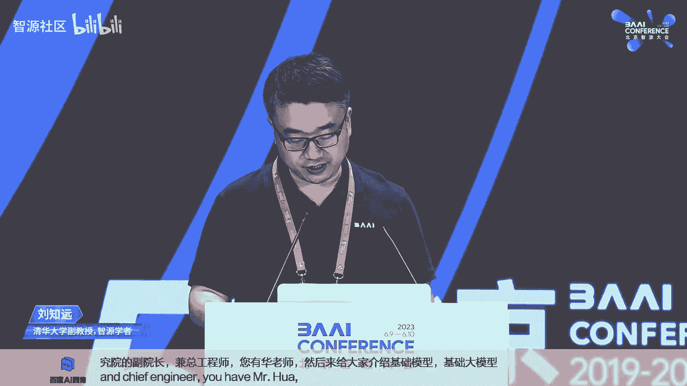

好，谢谢。喂喂呃，有声音吧。喂，好，那个呃呃谢谢谢谢这个刘老师的介绍哈。那今天呢嗯今天上午可能我们的整个大会的 kickickoff的时候，呃，大家也看到了呃智源发布了这个天鹰大模型。

所以我也趁今天这个报告的机会，一方面想跟大家大大家分享一下我们在打造大模型的过程中，为什么认为是说需要以工程发化的方式来打造大模型。

并且为什么他就像AI中的CPU同时呢也利用这样一个top给大家介绍一下天音大模型。呃，但在这里头我想先说一点哈。就是说呃因为我们的ta report还没有出来。

所以有点抱歉的是今天的整个toplk一些具体的指标的数字，可能都不会呃呃跟大家那个往外去去说啊。😊。

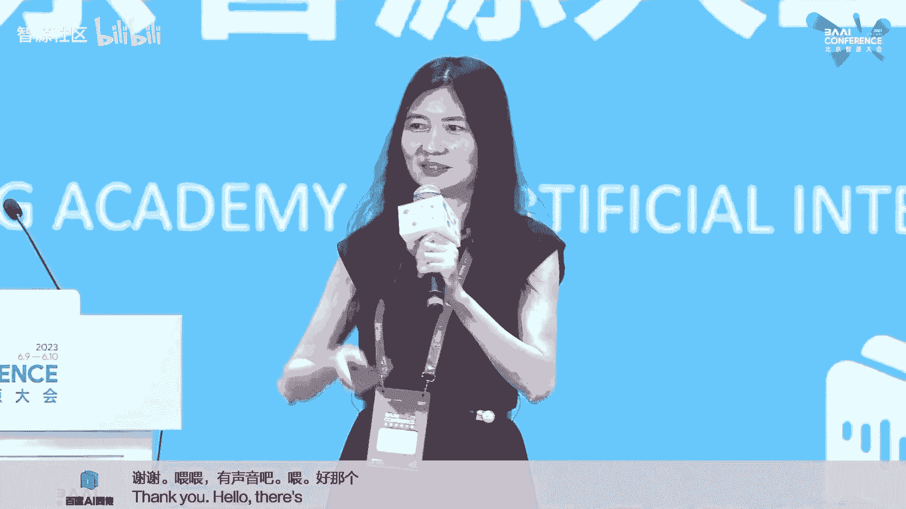

那个可以期待我们的ta克 report。等一下啊。好，那首先是说为什么呃我们会认为哈基础大模型它去打造它的时候，就像打造AI中的CPU。😊，实际上首先我觉得第一个最重要的是说。

它的一个单一产品的投入是巨大的，已经成为了整个AI里头。如果我们说是一个基础的大模型，百亿甚至千亿规模的大模型。呃，它的成本是很高的那在这里头呢呃给大家分享一下哈。

这是我们的一些呃呃具体用我们具体的practice以及去预估的一些数字，因为有一些东西不好disclose出来，所以大家就是主要是看这个比例。那首先大家可以看到是说对于几百亿的模型呃。

蓝色的是我们的用于训练部分，所有的我们需要的呃呃蓝色是数据训练数据。因此，我们为训练数据所需要花的人力，我们的计算，我们的处理等等，这些加进去是多少。那灰色的是我们的训练部分呃，包括里头包括人力。

也包括我们的机器的花销。那还有橘色的部分是评测的部分，也是包括人力和花呃和和算力。那。看大家可以看到，对于几百亿的模型，它的用于数据上的投入跟训练时候的投入已经可以相当。所以从一个侧面说。

为什么数据很重要那另外一块也是想提起大家的注意是说评测很重要啊。但这里头有一些东西是没包括进去。例如是说我们因为去ex一个新的模型的架构而要做的很多的创新，那那些是没加进。

因为我们认为那些how我还是可以去分摊到我的不同版本的模型，那这里头就说sing版本，它的一个分布是这样子。那对于330亿这样这样子的模型，它的成本大概是在2000万这样的人民币的一个投入。

那后面如果是说我们把这个拓展到1300亿这样子模型。那在这个成本上面就不一样了哈。那这个还是keep我们以一个T的 token这样子的量来说，那这个的投入的量。呃，是另外一个数字，我就不具体说了哈。

大家只是看这个量。那如果是说我们对于一个一呃千亿模型，一个T的数据不够，我希望让它的数据量变成2个T以上。那大家可以看也可以看到它对于我们的数据的成本和和训练的成本也是有不一样的一个高。

所以总体来说想说的是说，对于我们语言模型来说，它的开发成本是十分高昂啊，但这也值得。因为今天大家也越来越意识到语言模型，它不是仅仅是一个语言模型。它真的会成为我们未来AI中的大佬。😊。

那第二个从第二个角度来说，为什么它是AI中的CPU这么重要哈？因为基础模型它很大的程度决定了后续模型的能力和产业落地的因素。首先是说能那个嗯能力和知识。

其实呃最近那个 metata有一篇文章是讲那个limma啊，具体不说，但里头他的一个SHSAH的一个假设，我是很认同。😊，其实我们。在大模型，尤其是基础模型里面。

所有的能力和知识都是在基础模型这一部分所获得的。所以如果我们在基础模型这一块，没有把它的能力训练好，把它的知识能够训练进去的话，其实对我们后面再做怎么做SFT等等，其实是会面临很大的一个制约。

所以这是第一从能力和知识上，它决定了我们后续呃去持续训练，还是做微调训练的能力。那第二个很重要一点是合规性和安全性。因为训练模型，它的数据的一个干净程度。

尤其是它的合规程度很很很重要的会影响我们的AIGC的应用。毕竟咱们这个语言模型很大程度是会生成内容。那在这里头给大家举一个例子哈。嗯。

 commonmon core可能是很多人都很熟悉的一个全球的一个这个。呃，数据集里头我我们关心一下他那个中文数据集的情况。这是我们把里头的100万条中文带有中文的数据拿出来去分析他的站源情况。

发现是说。来自中国大陆的站源仅仅只占17%，有83%的站源是来自于海外的中文网站。所以在这里头就是说从内容的合规性上，从内容的一些的安全性上，这个是有一个很大的一个呃风险在这里头。

而当我们把用很多的用这样子的数据去训练我们的基础模型的时候。呃，其实对我们未来的微调后的模型是具有一定的风险。当然大家可能会说，那我在最后模型的输出或模型的输入，我加一些安全的风控。

但要知道这个不是所有的安全的风控都能够防得住所有的生成。例如是说我们有时候可能会问是说啊中国发生的时间大事。那这种的问题不能不让人问吧。但是他在产生这10个不同的事件的时候。

有可能就会存在一些嗯不安全的一些的输出。那另外呃因为本身哈呃对于我们来说呃，不单我们要考虑这个模型是否可以呃拿出来给更多的学术界的去使用。我们还要考虑怎么可以让产业更宽广的去使用。

所以在这里头呃会考虑这个版权和商用许可。那到底这个基础模型，它是可商用许可还是非商用许可。它的使用的许可，是copy left还是copyright的一个许可，是否具备这种开源的一个污染性。

这些都是我们需要很仔细去考虑的。那这个是从今年1月份到5月份啊，所有在国内国外发布的这些语言模型，我们做了一个简单的统计。多 far在国外发布的语言模型哈，我们记录了有39个。其中可商用。

并且非 copypy left的协议的大模型大约有16个。那这里头例如拉玛，我们也很熟悉，知道它其实是一个非商用的。那意味着我们所有基于拉码去进行做continue train和SFT的模型。

实际上都不能够合法商用的那还有一些是使用了copy left协议的模型。意味着我们通过这种copy left的模型的协议的模型去进行呃 further develop。

例如这个持续训练或微调所得到的模型也必须开源，这是copy left的协议。所以这个势必对产业，如果是企业正规企业要要落地产业，其实是到会造成很大的限制。那国内的情况是什么样呢？其中这个语言模型呃。

我们统计了28个，开源的语言模型有11个，其中直接使用开源可商用的语言的大模型只有一个呃，并且是这只是一个进行了指令微调的对话模型。所以我们看到在基础模型上面。

尤其是来自于咱们国内的啊呃完全开源可用的商用的中英双双语商用的，其实是呃很缺乏。所以这里头就是。我们寻找的实际上是说能第一能支持中英双语知识，这个知识不是只是翻译。

所以这意味着我们需要把大量的咱们中文语言所表达的知识要放到这个预训练数据。第二，我们期待它是支持商用的许可协议，没有copy left的限制。第三是符合国内数据合规的需要的。

所以这个就是我们打造这个ac天鹰呃，悟道天鹰这个语言模型的一个目标。首先第一个就是这个我们希望为产业打造。像刚才所说的具备双语能力，并且是以商用许可协议的开放源代码及模型的系列。第二个嗯。

我们实际上是在设计之初就定下了一个高层的一个设计。我们希望这个语言大模型它有怎么样的一个能力的框架。这个能力框架其实很重要。这个能力框架决定了我们后面所寻找的数据以及我们的评测的方法。最后一点是说。

我们越来越觉得重要的是为整个语言模型的打造，并且是持续打造，需要有一个端到端可持续循环的整一个模型的生产的流水线，打通从数据训练到微调到评测再回环回数据这么一个畅通的链路。所以接这样的一个呃目标。

我们呃今天也是呃开放了这些的一些模型哈。那这里头其实就包括了呃30330亿的和70亿的呃中英双语的基础模型啊，基于这两个基础模型，我们的对话模型，以及呃基于我们70亿参数的代码模型。😊。

其实在这里头哈对我们来说，对话模型和代码模型更多的是一个例子。就给大家看到是说基于这样的基础模型，我们可以怎么进一步的去打造通过SFT去打造我们所需要的对话模型，或基于持续训练。

去训练出我们需要的代码模型。其使用者可以基于他自己的应用需要去重新去做这样子的fin tu。😊，那呃介绍这个模型的时候，首先我想还是给大家介绍一下这个训练数据。

那呃致援我们的中文数据实际上是持续一直在积累。那在这里头也给大家分享一下，我们呃大家可以看一个右边的这个图哈，我们是接近30%多的数据是中文，60%多的数据是英文，这是目前的一个比例呃。

不排除后续我们会有一个调整。嗯，那呃另外第二个大家可以看到这里头的这个分布啊，这个我就不说了。但我想给大家呃强调是说中间其实最重要的，首先是互联网数据，它的一个呃质量。呃。

我们呃整一个的这个中文的互联网的数据呃，检查了所有的它的来源，其中99%以上的是国内的站源。所以这是我们很重要的一个基础，是说它的一个内容的一个安全性和干净的程度。😊。

那第二个呢嗯无疑大家可能做过中英双语模型的一个研发或调研的比较过这个数据集都知道。comparere我们的英文的开源数据集，其实中文数据集图最缺的是第一开源的高质量的文献的paper的中文的数据集。

第二个是我们的开源可呃就可用的这种的书籍的数据集。那在这里头，志远也是得益于国内的一些数据机构跟我们的合作。他们愿意去把他的呃中文的文献数据，还有中文的书籍数据贡献到这样一个模型的训练里头。

那我想这也是因为我们这个模型是以一种完全公益的形式呃，以商用许可的方式再回馈给整个一产业。所以他们愿意跟我们一起来做这个事情，也很在此也很感谢这些呃机构哈。

那当前我们已经积累了超过一点4T token的训练数据。然后并且我们还持续正在增加更多高质量多样性的数据集，也在源源不断的把它训练到的这样一个基础模型里头的训练中。😊，那。这个基础模型啊。第呃第一呢。

他在技术上承接了这个那个像GPT3，还有拉马这些的架构设计的优优点。那另外呢嗯我我想提一下是并行训练哈呃，我们使用了BM train哈，这个来自于刘老师团队呃很好的一个工作哈。

那我们升级了PM chain里头的这个并行的训练方法。😊，呃，他目前能够达到的直接呃可以对标的，例如像mze two呃，以及我们实测是可以在一个具备一个大规模并行范围里头可以达到8倍的训练效率。

那可能大家会说为什么我们不跟zero three比，因为0有有bug。这个给大家贴一下哈，这是我们团队。😊，大概两三周前，因为我们这个训练比较早就开始了哈，两三周前呃呃。

提提交给那个d team的fix了，最后fix了这个zero three的bug啊。😊，那嗯另外呢嗯下一个就想给大家分享的是我们SFT数据的打造。因为这一次我们除了基础模型。

我们也开源了这个我们的对话模型。这也是大家可能在实际用的时候经常会用到的模型。就可能对于更多的一些爱好者或者是更多的下游的一些呃应用企业。可能呃。😊，会直接用到这样子的模型。

那我们在整个SFT数据打造里头是分了四个阶段哈数据采集。然后第二个阶段是根据这个数据的分布进行呃数据分布的分析，并行进行调整。第三个是进行这个SFT模型的测试，以驱动我们的一个数据的迭代。

最后是包括这个重要指令的添加啊，在这里头给大家稍微分享一下。那。😊，呃，不同的团队有不同的数据的采集的方法。那呃智源这边我们是首先我们为了这个数据采集哈，指定数据的采集。

因为它我们可以预见它是一个长久性的东西。嗯，那因此我们特意打造了一整套叫open label这样一套呃。😊，指令数据采集的工具。但实际上它后来已经不单是我们的指令数据的采集和生成的工具。

也包括我们在去reward model的时候，利用来做那个排序标注啊等等的这些工具集嗯。那呃我们使用了就是说包括我们自然内部的有一个呃固定的一个数据标注的团队。

也包括呃向外面啊发起这个数据标注的公益活动，我们叫数据飞轮。呃，我们在3月份的时候发起这个外部公益者这个数据飞轮的活动。我们当时是说等我们储储备到了1万条。

我们就把这个所有的这个在通过公益公益公益呃活动，他们来贡献这个数据呃标注的部分，把这个全部开源出来，整理好，全部开源出来。那正好其实是在昨天我们就把这一部分开源出来1万条。

坦白说这个时间有点比我想象的要慢。我当时就觉得是说一个月就能够至少能够这个通过外部的公益活动能够标注够1万条。但发现其实这个东西不是那么容易哈嗯。😊，但我们会持续去做这个事情嗯。那第二个呢。

很重要的是整个数据分布的分析以及调整。呃，前面说到了，其实我们定义了整一个的大模型，认为我们认为语言模型的能力架构呃，能力的分布。那这个图实际上是对应前面那个图，我们会分析是说我们的。指令微调数据集。

它对于我们那个需要的能力分布来说，它从指令数据的角度，它的分布是不是能够对应上的。嗯，这不是我们目前的这个这个图哈，这个是稍微比较早期的一个分布图。那当时我们出了这个分布之后。

我们就会看哪一些的方面的能力的数据偏少啊，那因此我们需要增加那一部分的数据的能力。嗯，实际上我们一直有一个理念是说SFT的数据集不是越大越好。其实合理的，应该是说我们的基础模型很强。

然后我们只需要少量高质量的SFT数据来让这个模型发挥很好的它的知识的一个执行能力。所以我们一直实际上在控制着我们这个指令微调这个数据集的大小。啊，这一点其实是很重要啊。嗯。

松发实际上我们一直控制到今天为止，大概就是十几万指令这样子。然后我们比过我们因为本身我们也有一个几百万甚至1000万的一个指令微调的数据集。啊，包括有一部分也开源出来。比过是说到了今天为止。

用这个数据集来翻就同一个基础模型，已经超过了用1000万或500万那个数据集来翻进这个基础模型了嗯。那再往下一步，就是说。我们持续的需要去构造这样一个迭代的过程。

当我们呃这个呃SFT指定微调这个模型出来之后，我们会经过人工评测，看到它的不好和好的。然后呢，不好的那些case，我们会在一个很大的其实也就是1000万条的那个数据大的指定指令的数据的铺那个池子里头。

通过检索方法把一些能力吻合的一些数据拿出来来呃进入到我们的下一个版本叠加到下一个版本。所以大家可以看到这个呃微调数据及呃，前一个版本是蓝色，上面一个版本是红色。其实我们持续的这样子去自动迭代。

就除了人工来评测那个SFT的那那部分会会会是人工，剩下的就会是自动的。去呃调整我们的微调数据集。那最后一个呢，对我们也是很重要的一块，就是一些重要的指令的添加。那在这个过程中，首先是左边这块。

就所有的我相信今天呃要放出来的对话模型都必须要做的是安全安全的这个的安全伦理等等的这样子的一个评测呃检测。那自然本身我们是有一个专门有一个re team。我们把它称之为re team哈。😊，嗯。

他们专门是帮助我们去评这个backcase，并且我们这个read team的选择是他既不是我们做前面就等我说到那个每天做这个评测的那些评测人员，也不是我们做数据集的人。

他是完全一个separate team啊，然后不好的那些问题肯定要有重写这个答案，让他呃放回到我们的指令微调里头啊。

那另外一个呢是呃我们在这一次也定义了这个去构造连接一些应用或连接一些其他模型的指令数据。呃，很简单的定义了这个格式啊。然后因此他可以帮助我们去很好的去链接其他的模型。例如在这里头有两个例子。

一个是文声图的例子啊，上面说请画一只戴眼镜的狗，然后他就可以自动的去生成。呃，这样子的response哈，其其实这个response里头前面半句话是说我作为一款文生文本生成模型，我没有这个能力啊。

那后半句话它就真正的输出。如果我们要真的未给一个例如diffffusion的模型，那它就直接生成一个格式，一个特殊的字符的格式，以及后面需要用到的promp。😊。

那我们这一次实际上是集成了两种不同的模型，这其实是一个范例。呃，所有人如果用这个的模型，也可以用自己的方法来去同样的格式，就可以扩增自己要接的更多的模型和工具。

那这个呢是今天呃上午如果有看到这个呃黄老师他呃的demo哈可以看到的嗯。

第一个第一个实际上就是呃我我再放一遍哈，是这个但其实其实这个飞机这个是一个多轮对话，是一个多轮对话的。嗯，然后呢在下面呃这个这个还是一个多轮对话的一个场景嗯。😊，然后这一个是高考作文。

其实我们这一篇高考作文大概800字左右，生成的时间那个不不到10秒钟嗯。其实这没有什么magic，其实这得益于说我们这个demo里头用的仅仅是我们的这个70亿参数的模型。

那这个就是我们通过刚才那个指令啊，来能够在同一个语言模型里头去应对呃用户说要画图的这样子的一个。然后背后实际上是调用的是我们的al diffusion啊，在这里头呃。

其实我们放了这个我们的demo放在外面的demobo。呃，甚至大家先那里头是放video哈。大家到时候如果看到我们的同事在那可以要求他们去给你实操哈，其实我们是可以实操了。在那呃。

我们在这个上面其实也可以用不同的语言，包括韩语，包括西班牙语，包括法语等等。我们支持18种语言的文声图。正好就跟我们这个语言模型，他其实也已经具备了多语言的能力进行一个结合。

就是用不同的国家的语言去输入给 chat，然后让他生成相应的图。😊。

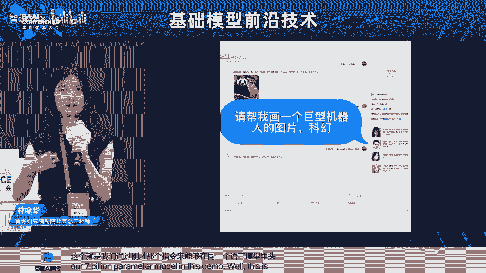

那最后这个是一个呃。把一个复杂的一个人脸编辑的指令啊，自动的划生成呃好几个step，然后背后是调用了我们新出来的一个叫instruct face的这样一个模型啊。那至于这部分的工作，大家可以留意。

明天上午呃AIGG就是内容生成呃生成模型的那个呃workshop，我们会有介绍嗯。

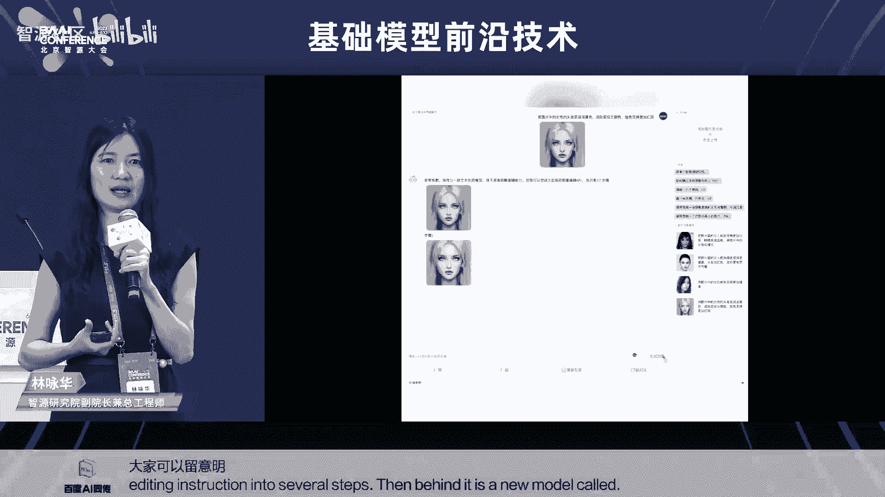

好，那下一个呢是说嗯我们这次发布里头其实也给大家提供了那个代码模型。那我们认为其实代码模型它会扮演着未来，尤其是面对企业应用，企业用户场景很重要的一个角色。那这次我们的确是说首先我们用的数据集。

我我觉得我们也比较lucky哈。当我们刚开始想做这个事情去try我们的acque base的这个模型的能力的时候，happen。😊，the stack这个数据集出来了啊。

这个是就是那个b cold的那个团队啊，m呃由haenface来牵头的那个b cold的这个项目团队开源出来的。这个数据集的好处是说他所有的代码数据。都过滤干净他的版权，他去掉了所有没有版权声明的数据。

只留下有版权声明的数据。他去掉了所有copy left的数据。因为如果一旦有copy left的数据，在我们的预训练数据里头。很难说以后出来的，我们给人家用户生成的数据。

你是不是也得follow copypy left的这个规范，现在没有法律去规定，但是有这个风险。所以我们倾向于是说只保留有版权说明，并且只有copyright的这个数据集。但我觉得我们是比较新运。

刚好他们开源了这个数据集。那我们对里头也是做了很多高质量的过滤。那在这里头我们啊在这里头我们也是做了另外一个很重要的。

就是说在我们训练这个数据训练做我们拿我们其中比较早期的一个ac base的一个7B的模型来做持续训练，就已经达到很好的一个代码生成的效果。那同时我们除了在英伟达平台上。

我们还在天数至星的这个呃咱们国内的另外一家呃GPGPU架构的一个平硬件平台上做了1个32台服务器，一个classlast上面进行训练。呃，这个整个训练下来的还是相当稳定哈。😊。

所以这次这也是去想说的一下，是说国内实际上咱们一些国内的芯片收发目前呃，除了在芯片吞吐量上的确还不如英伟达。但是呃当我们push去解决一些更多的算子优化的问题之后，其实是可用的。

例如在这次我们把东西买贵到天数的平台上。我们也帮助他一起买enable了像fsh attention这样子的最新的加速算子在他的平台上。好，下一个是说评测呃，评测我是认为相当相当的重要。首先为啥重要？

咱们如果要训至少这种像我们这种百亿以上的几破300亿的模型，每天要花的训练成本是超过10万的。所以在这个过程中，我们认我认为哈就是说训这种很大的模型，它真的是大船难以调头。

我们如果是说不每一天盯着这个评测，每一天看他这里头有什么问题，你真的是放手让他训一两周，有可能出了出现了什么问题之后，那已经可能有可能这一两周就已经过去了。这中间所耗的成本是很让人心疼哈。

那所以我们在整个过程中都必须关注所有的细节，用来对训练的策略进行及时的调整。然后甚至对训练的数据也要进行及时的调整。另外是说嗯实际上本身大模型的能力是很复杂的。

我们肯定不能够只依赖去看training loss和 validation lost。根本他们这两个lo不能代表一切。那在传统的下游适配这种评测的任务。呃。

又有现在新的像ham为代表的这种incont learning的方式来进行评测。其实他们是用于模型在不同的一个训练阶段啊。那另外因为毕竟咱们这里头是一个生成模型。我们还需要去盯这个生成模型。

它的主观评测。之后，它的生成能力。另外模型的SFT这种微调的能力也是很重要的，需要考虑的部分啊，所以。这个是我们认为就是说整一个评测，正因为这个模型很复杂，训练成本又很高昂。

所以我们需要很紧密的去通过评测来盯着他的所有的性能。那在这里头给大家看到是说我们这个模型。真的是整一个回还，我我就不说了，因为时间关系。那这是天音我们目前啊就是说执行的，就是说按分钟和小时算的。

可能是像这种每天至少两个point来做任务的评们里头已经ex了所有的中原来只有英文我们exend中文的部分啊中英都能评测。然后每天至少有一个point要做主观评测优选的模型。

我们甚至会进入我们的评测那整个评测体系实际上是呃依赖于我们这个叫天秤也是今天发布的那这里头不花时间介绍。明天下午在AI开源论坛，我们有专门有这个评测体系开源评测体系的介绍。啊，这个我也不说了哈，对。😊。

嗯，我们在这个评测体系，其实它也是一个很重要的系统工程啊，要自动实现自动化的评测，实现边训练边测啊，包括我们实现要实现评测结果，可以支指导我们的模型训练。还有需要对各阶阶段进行那个优化。

就用更少的并行的一些机器来去支撑好我们高效的一个评测。那另外呢呃对我们很重要的无疑是下面的这套这个infrastructure。这次我们是基于智源本身就有的九鼎这个呃专门为大模型训练开发呃打造的平台。

那我们在整一个里头其实是across了几个数据中心。但是每一个classlastster都很tpical的，都有它的训练的集群，微调的集群，以及它的这个评测的集群。呃，这几个集群必须要放在一起。

否则中心与中心之间光传每天传几个trypoint的时间，可能都要花好几个小时。那嗯这里头说法可能最最后一两页了哈。😊，嗯，首首先我们认为哈这个基础大模型为什么回到这个这个CPU的这个说法？

因为我们希望是说以CPU方式借助像tkt这样的方式来构建大模型一个周期性发展的路线图。就我们希望从资源的角度，我们不是今天只是发了一个模型就就就就完事了。

我们希望是说可以去定义未来可预见和不可预见的创新来构造我们后面的ro map所以大家可以持续的关注说我们未来啊不断的去更新我们的模型的版本啊。

我们会这个这个时我们会源源不断的把我们的预训练的海量数据继续往里头去压那个模型。呃，我们可应该是今天或明天就全部开源出就就就会开源出来。但是这个开源的版本不是我们的最终版本。

我们觉得这个模型的能力是需要被持续提升的啊，所以这个是可以被期待的。同时各种大模型的新技术，甚至。😊，产业的需求也都会源源不断的加到新的版本的模型中。所以我们觉得是说打造整一个可持续往前走。

包括从数据到训练到评测，以及它的回环，是目前我们看到基础大模型，它的一个发展很重要的一个基础设施。

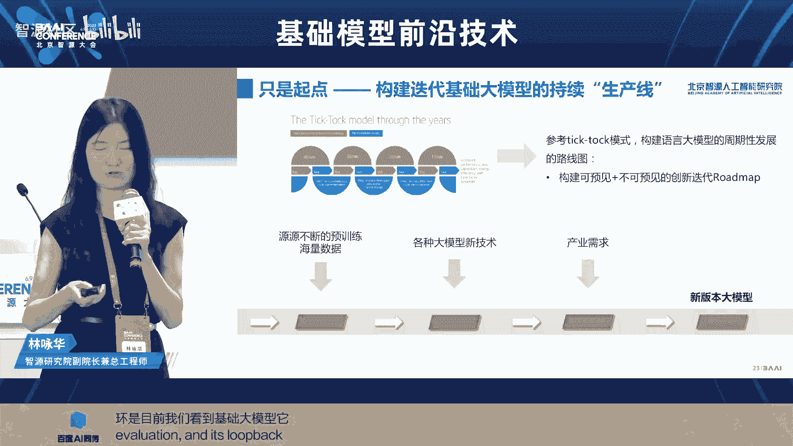

那最后说一下，就是说呃支源悟道3。0哈，今天也全面发布了。有我们从去年年底开始发布，一直到今天。那这个是给大家看，我们呃认为的整个大模型。我们说话资源悟道里头的模型数的确是说没有基础模型的生根。

带不来枝繁叶茂，最重要的是其实是得先有最下面的这些越往下越重要。这些基础模型。😊，好，这个是开源仓库的地址。然后大家如果感兴趣，建议大家可以扫一下这个二维码。这是我们这个呃。😊，呃。

这个f AI我我我们的这些开源的模型都会放到f AI里头。那这个是我们的这个呃这个开发者群。然后希望呃自然可以帮助通过我们的持续创新，持续迭代，持续的产出，可以帮助推动大模型的发展。谢谢大家。😊，好。

那感谢永华老师啊，那个非常精彩的介绍。啊，这个没想到这个现场已经座无虚席，而且站了这么多同志啊，那就辛苦大家了。那我们接下来啊就有请我们的下一位讲者啊，是刘印涵女士。

他现在是啊rch AI的核心创始人和CTO。那么在呃创业前啊是这个facebook AI research的啊研究员。那么他呃非常著名的作品应该是大家耳熟能详的啊这个robota，还有bart啊。

那应该是我们啊这个非常重要的几个啊这个预训练模型哈，早期的预训练模型。那我们接下来就欢迎啊这个刘女士来给大家啊带来他的精彩报告。😊，可以。

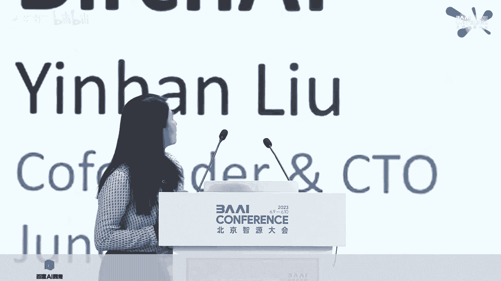

首先非常感谢志远啊，给我这次机会站在这里和大家一起讨论一下大语言模型。我先做一个简单的自我介绍，我叫刘艳涵，我来自天津，现在居住于下雅图，几年前。

我跟我的几个朋友一起创建rch AI我们致力于开发一种ss产品。啊，tget的客户群是医疗工作者。所以我们我们的产品主要是聆听医疗工作者和客户的对话，这里的客户很多时候都是病人。

然后进行文呃进行他们对进行对他们的对话进行梳理，然后写入客户的数据库或者病人的病例。呃，这样的话呢，医疗工作者可以更加啊把时间用在和呃病人怎么讨讨论病情或者解决客户的问题。

而不需要用过多的时间去document这些nose。所以这就是我们刚开始创始的目标产品。那我做一下在在开在。😊，创建boch AI之前呢。

我在facebook AI research做啊自然语言自然语言处理啊，就像刚才介绍的一样，我发过的 paper里包括有robotabart和Mbart啊。

所以今天呢我想跟大家讨论一下reinment learning with human feedback。在过去的一段时间呢，大语言模型风靡全球，尤其在research领域。

大语言模型主要从arma到appacca这种pretre到f tune。但是呢我觉得大家过多的过多的注重这个pre和翻 tune而忽略了一项非常重要的内容。

就是reinforment learning with human feedback。那我今天呢想从不同的角度来讨论一下这个reinment learning with human back human feedback的重要性。

这是今天的da。首先呢我们从产品的角度来讨论一下，为什么我们需要大语言模型。之后呢，我们再讨论一下，我们怎么样利用搭建这样1个AI产品，让大语言模型更好的发挥其价值。

然后这里呢就运用到了reinforment learning with human feedback。之后呢。

我从技术的层面去讨论一下reinforment learning with human feedback啊，在大圆模型中是怎么实施的。最后呢，我们回过产品的角度去展望一下我们在大圆模型当中还可以做什么。

让他更多的发挥价值。好，那谈到产品，那无非就两种产品，一种呢是面对消费者的。另外一种呢是面对企业用户的那面对消费者的话。很重要的一点就是我们需要产生的文字是消费者想要的那在此之上呢。

是产生一种个性化的文字，是能发挥呃消费者更大的个性化。那举一个通俗一点的例子，我有一个朋友，他呢是一个职业的演讲者。他每年都会被邀请到世界各地去演讲。然后自从GPT出来以后呢。

他就会试图用拆GPT去写他的演讲稿。但是不管他是用什么样的prom得出的演讲稿总是开头是lad and gentlemenman这种文绉周的气势磅礴的一个开头。

但是其实他所需要的是一个更加接地气的一个更温柔的一个开头。所以呢他每次都会进行大量的修改，同时呢他有一些特别的个人经历，他总会写在自己的演讲稿中，还有他个人的一种呃幽默感写的讲讲稿中。

所以呢他每次在chGP产生的文件当中都要进行一个很多的修。不改然融入他的个人风格。所以对于呃个人用户，其实每个人的演讲风格，每个人的写作风格是很少发生变化的。所以如果我们能更好的收集这些客户的个人风格。

那这样呢下次让客户再使用这种大原模型时候产生的东西，就是更贴近于他们所需要的东西，这样我们可以减少他们的编辑，提更好的提高他们的效率。好，那我们现在讨论一下，面对企业用户大语言模型。

现在的大语言模选所所稀缺的东西。第一点呢是了解特定的语言环境啊，举一个例子，因为我们是一个医疗产品。所以我们的客户大多数都是医疗工作者。那有一个 phraseze叫做术modifications。

在我们的日常生活中，这句话的意思呢，就是改一下鞋跟从高跟改成低跟或者矮跟这种，但是呢在医疗行业其实这个是一个啊tment是一个治疗方案，是治疗怀腕关节的一种治疗方案。

所以呢现在这种非常通用的大语言模型很难了解到这种特意特殊的语义。那那还有一种呢就是公司的内部的政策和呃和policy和nledge。那举一个再举一个通俗一些的例子。比如说沃尔玛的退货原则呢。

就是30天无条件退货。但是呢costco呢只是15天无条件退货。那沃尔玛呢是可以退货。只能退货成一个coupon的代金券，你下次可以使用。但cosco呢是可以退货退回到你的信用卡或者是现金退货。

那这种特别的公司内部才知道的nledge和policy政策。大一个通用的大语言模型就很难做到了解。所以这个时候我们就有意义去搭建一个个性化的模型，来满足不同客户的需求。那怎样加建这个个性化的模型呢？😊。

我们现在来讨论一下啊，这s呢就是建立一个实时的AI系统。那我们这是一个非常重要的啊一点。因为这个实时的AI系统可以更有效的接收客户的使用啊feedback。那我们。我想在座的各位都应该很同意一件事情。

就是AI现在不能取代人类，这就是我们现在存在在这个地球上的意义。那我们具体的讨论一下，为什么他不能。😡，首先第一点，我觉得AI更像是一个小小小帮手小助手。比如说我需要写一篇500字的做高考作文。

那AI可能10秒钟就写完，我需要用20分钟或者是更多的时间对它进行修改，采纳其中的某一些段落，然后对另外一些段落进行修改，然后体现我自己想要的这个作文风格和文采。那这个呢是AI现在做不到的。

是因为人他不了解人到底需要什么，人是最后做做决定的，最后决定是否采纳，最后决定我提交什么。然后呢，所以这是一个人和机器共存的时代。现在所以习器更是一个小助手。那这个时候呢，我们就发现了一个很有趣的现象。

那就是人类到底是怎样编辑这些文件。然后最后提交的那比如说我用AI写了一篇500字的文章。然后呢，我删掉了重写。那说明AI产生的东西根本不是我想要的那也有可能我用AI写一篇500字的文章。

我只改了10个字，我只加了一句话，那就说明这个AI产生的东西就是客户想要的，或者中间呢我改了200字，in the middle。

所以呢这个时候我们就发现啊这个信息其实是一个很好的评估系统能了解AI的performance，因为大家都知道genrative AI最重要的一点。

就是这个performance matrix是一个非常主观的。因为有的人每个人每个不同的人都有不同的tste，不同的品位和不同的偏写，所以它很难量化。那这个时候如果我们有这样的一个实时的AI系统。

我们就可以量化的。😊，收集到客户的信息，然后以客户做个多少修改来评测我们所产生的文件是不是用户喜欢的想要的需需要的那这样的话呢，我们就建立个很好的一个评测体系。正像我刚才说的，我们主要面对是企业用户。

那企业用户中有一个很重要的特点，相比较个人用户，那就是企业用户的员工一般都是受过训练的。他们了解公司的策略，他们了解公司的nledge和policy。

所以对于这些企业用户的feedback是具有更高价值的。아。但是即便如此，我们还需要建立一些filter fu掉一些没有意义的意义的低质量的feedback。

那这个这个fil这个filter是一个非常case by case的情况。那我一会儿呢会举一个具体的例子。然后呢，大家可能更好的啊了解到。我们这个filter怎么建，我一会会提到更详细的信息。😡，好。

那我现在收集到一个非常重要的信息，就是用户的使用信息，用户的编辑信息和用户最后提交的信息。那用这个信息，我就有足够的数据量去训练一个reward model。

那这里我有一个非常非常strong的 hypothesispo。这 hypothesispo就是用户最后提交的信息。是一个更高质量的用户更想要的信息，相对于大语言模型最初产出的信息。

所以这是一个自然而然浑然天成的training data set，非常的高质量。那当我们得到这个training data set的时候，我们就可以去训练一个很高质量的reward model。

最后呢运用强化学习不停的提高我们大语言模型的质量，让它既越来越产生人类想要的答案。😊，所以在不远的将来有一天，AI或许可以取代人类，这是一个让我们既兴奋又值得呃担忧的问题。

但是我们现在先呃更紧重愿这份兴奋，然后把担忧留给以后。所以今天呢我在这里讲的是大语言模型的应用和价值。希望不久的将来有一天，我站在这里来讲人类存在的意义和价值。😊，好，那我们现在举一个例子。

具体的例子啊，这个是我们刚刚部署的一个客户的一例子很像，但是不能不完全一样。那我们在这里来讲一下怎么运用大原模型，怎么运用人类的反馈信息，搭建一个实时的系统来收集反馈信息，然后去处更好的model。

那这是一个呃很贴近生活的例子。那一个客户呢打电话说啊，我4月份的时候。😊，买了一个printter，然后呢，现在降价了。然后呢，这个时候这个接话员呢就会做两件事。第一件事，我要调出这个客户的信息。

确定他确实在4月份购买了这样的一个一个打印机。然后呢，我要看我这个客户，他是一个什么样的客户，他每他的消费频率是什么。他是不是会员，他每次消费的额度是是什么。当我确定哦这是一个非常非常高价值的客户。

我想让他开心，我想留住他，我想让他持续的在这消费。然后第二件事呢，这个接线员要去查一下公司内部的政策。那公司他的退款的政策是什么？他可能是60天内60天内降价可以退款。但是如果60天以后就不可以退款。

那结合这两款两者信息，接线员做出最后的决定，那就是告诉这个客户，首先先抑后扬告诉这个客户嗯，60天的退款政策已经过了，所以我们现在不能退款。但是你呢是一个非常非常有价值的客户，你非常的特别。

我们为了你愿意跟。😊，更改政策，所以我们决定给你一个代金券，你可以下次使用。那这个在这种情况下，大语模型可以做到怎样的应用呢？首先大语言模型有聆听这段对话。然后呢，他做了很重要的第一点是。

虽然客户有说我4月份买了一个打印机，但是呢现在降价了，他没有提到一个词，就是退款。但是大语言模型可以以上理解他客户打这个电话的目的是退款。然后呢，他会收收集公司的退款政策。

那找到OK60天内是可以退款的。但是60天后是不可以的。同时呢他又走到客户的他又走到呃客他又走到dabbase去找到客户的信息，然后觉classify这个客户是一个高质量的客户是一个呃是hiy6的客户。

然后结合这两种信息。大语言模型推荐给了接话员一个回应，那就是可以可以给一个con，给可以给一个啊代金券下次使用。那我们的接训言呢是很聪明的。他们受过专业的训练。他们知道怎样说才能让客户更开心。

那接线言呢采采纳了大语言模型的推荐，就是哦OK我可以我不可以退款，但我可以给一个cupon。但是呢他用了一种其他的方式，更好的更愉悦的传达出这份信息，让客户更开心，听起来因为客户会觉得哦，我很我很白手。

我很特别。😊，那这个时候呢，大语言模型。就在后面收集到了这份信息，然后他就学会了。好，我去我下一次去训练一个排序模型。我下一次的时候我会用这种方式去说，让这种方式可以让客户更开心，更满意。

这个时候他会进行强化学习，收及到这个信息。那回到我们刚才说的futer的问题。那不是每一个接线员都很优秀，总有一些人是销冠，总有一些人卖不出去，总有一些人会惹动客户。所以呢这里很重要的一点。

就是大语言模型，同时还会监督去查找这个客户，下一次有没有使用这个消费，有没有对这次谈话进行满意。如果满意度很高的话，然后下次进行更多的消费，那说明这是一个很好的agent，这是一个很好的客服。

那我会给一个更更高的权重来学习你的话术。那如果这个客户就toto的diappear，再也没有出现过。😊，那就证明这个客服可能说的话术并不好，不是客不是用户想要听到的呃话术。

那这是一个分这是一个非常不好的数据，那我就会把它filter掉。所以呢所以大语言模型会很聪明，然后再进行强化训练一段时间后，那大语模型的target就变成销冠。😊。

这是一个很 ambitious的 goal。😡，好，那既然我们已经讲过了嗯大言模模型和reinforment learning with human feedback在啊日常在产品角度上的应用和重要性。

还有搭建这个实时的嗯。系统的重要性。那我们现在讲一下到技术层面去讲一下这个是如何实现的。呃，首先这幅图是引自于open eye去年3月份发的instructGPT的 paperper。

那我们清楚看到这里有三步。第一步呢是open eye收集了客户呃，收集了用户使用pro的信息。然后他们进行了人工的标注，然后训练了一个SFT model。

我想大在座的各位都对SFT modelel非常非常的了解。所以我今天就不在这啊得多过多的讲述SFT model，但请大家记住这个词SFT我们后面会用到啊一个监管的微调。😊，那第二步呢，就是他们做了一个。

第二步，第二层次的标注，然后作为一个reward model。他们的标注呢是每个用户给的这个prom X，然后不同的model会generate出不同的Y。然后他们有请啊标注源去标注，为了保证质量。

他们的engineer也进行了标注，他们标注了一个排序，就是这个model产生的X比另外一个model产生的呃，这个model产生的Y一比另外一个model产生的Y2质量要高。

那就是Y一大于Y2这样的一个排序标注。那回想我们刚才讨论的AI的呃实时的一个系统。那我们刚才有说了一个非常重要的hypo。

那这个Hpo就是我们觉得用户最后修改过的提交的文本是更有价值的是用户更想要的文本，相对于大原model，最初产生的文本。所以我们就浑然天成的运用了这一个排序。所以我们的用户其实在为我们标注数据。

而且我们的用户是专业训练过的用户，他们更了解。他们的数据。那好，我们谈到谈到这个reward model之后，我们走到第三步。第三步呢就是用reforment learning啊。

这种强化学习去improve这个大语模型啊，我们可以看一下啊，它首先呢先给了一个prom X这个时候这个policy这个policy就是经过强化学习啊，训练过的一个中间量的一个大语模型。

它比最初的大语言模型稍微聪明一点点。然后呢它进行了一个generation，然后产生了一段话。然后产生完这段话之后，人类进行呃然后reward model对它进行一个评估。然后评估完之后。呃。

根据它的output之后做一个back proag，然后去更新这个policy。所以我们看到啊reinforment learning顾名思义它是。它不是一个supervise的 training。

它不是一个监管的训练。所以在整个的训练当中的havy lifting是reward model的值。所以reward model的质量是最至关重要的。啊，回到刚才我们说的搭建一个实时的AI系统。

所以我们的reward model对训练值是我们客户客户使用的数据集。所以啊所以我所以搭建实时的AI系统是非常重要的。

也是一个非常聪明的方式去收集这样的一个high quantity的 data set。好，那我们现在具体的讲一下什么是reward model。那reward model通俗一点的去讲啊。

就像一个高考作文题一样，X就是prom就是作文的题目。Y呢就是不同的考生写出的作文。那fin呢当pri是fi的话，就是它的啊参数是fi的话，那我们就可以想象成不同的老师去评估这个作文。

所以reward model其实就是一个评估体系。它的它的输出就是一个评估体系。它可以简单成为一个人为的评估，就是一个老师当给定一个高考题目的时候，对一个学生的作文进行打分。那我们讲一下啊。

就是reward model去怎么modeling它。那最简单的方法就是用一个enco only的一个mod一个model，比如说b啊或者是robo这种把X和Y在一起。

然后呢用CO token上的inbedding做一个proion，然后呢产生了一个。所以这里很重要的一点ward model的输出值是一个数，就是比如说你的作文是个98分97分这样的数，而不是一个向量。

那openI呢，他们用了一个deder only呃，很类似啊，就是X和Y在一起，然后用EEOS token做了一个proion，然后呃输出个一个last之后输出个一个slar。

就reward model的值。😊，好。那我们回顾我们刚才说了，reward model，它标注的数据集是一个排序的数据集。也就是说我们有说Y一大于Y2这篇作文写的比那篇好，根据所给的题目。

那这个去modeling这个的话，一个非常著名一个非常常用的model呢就是呃bray modelel，它是一个啊概率的数据概率的model呃，它往往就是predict一个派re哪个更受喜欢。

哪个呃质量更高。所以他的数学表达式呢。我们用PIG相当于呃YI大于YG的可能性。也就是说，当给另一个高考作文题X的时候，考生II写的作文比考生J写的作文好的一个概率。

那它的数学公式是PIG除以1减PIG的G等于这两篇评分的差。那我们把这个公式稍微转化一下，我们就可以看到。PIG这个概率I作文I好于作文J的概率，就相当于作文I的分数减去作文J的分数的一个函数。

那么讲一下它的al function呢，那就是我们尽可能的当我们的标注是I作文I比作文J的分高的时候，作文I好于作文G的时候，我们让这个概率尽量的大，所以非常简单，也非常直观。Yeah。好。

我们现在讲的是啊PPO啊 reinforceinment learning with human feedback里最重要的一点就是PPO嗯，首先呢这是2017年open AI发表的一篇paper。呃。

他在reinforment learning中扮演了非常重要的角色。但是非常遗憾的是。至今没有一个任何一个大公司。

有开源他们的reinment learningning with human back是怎么实现的。所以呢我们只能去猜。呃，在这里呢，我们有rch自己有imment这套系统。

而且我们确实得到了一个比初始SFT更好的policy。我们有进行评估。aga，我们的评估人就是我们的用户，我们用户确实的告诉我们，他们觉得现在输出的结果是他们更想要的结果。

那好我们先讲讲一下最简单版本的reinance learning with human feedback。啊，所以这个有在这里有两个gs，一个是cep，一个是value。

那原始的open add paper呢，还有一个antropy啊instruct gPT呢还有另外一个 term。但是我们有我们的 implementation只有这两个 term，我们发现结果会更好。

那是不是加上 entropy和其他的grading average会更好呢，我们不知道我们没有试，所以我们今天因为时间有限，先讲这个简单的。😊，好，那clip的定义这个非常的复杂。

而且这是reinment learning，所以是强化学习跟我们大元模型关系不是很紧密。所以我今天先粗略的概括一下这里如果大家感兴趣的话。

具体的公式需要重新回到2017年open去具体的理解一下它它是怎么样实施的。首先这里呢有两个变量啊和一个primeter参数，那变量是A advantage，然后还有变量rac。

然后参数呢是eponon在这里我们用的是0。2，我们foopen eye呃2017年的paper用的0。2。那我们可以看到啊这是一个clipc呢就是啊在rac ratio是一的情况下是什么意思呢？

就是我的更新之后预测的每一个token的pro和以前的以前没有SF的预测的每一个token的 probability是相同。😊，红豆。那这个时候racial就是一，也就是说我的model没有更新。

所以呢。😡，它这个clip就是相当于advantage是正值的时候，那我们的clip到一加apson就是1。2。如果advanage是负值的时候，那它c之后是0。28。

也就是说我让它的更新永远在一个范围内不会过度的走的非常的狂野，所以只在一个reagion内进行更新。这就是他这个clip的意义所在。

那我们讲一下racial和adage advantage呢是reward value减去value。然后reward呢和我们刚才调到的reward还不是完全一样。我后面有讲具体reward的定义。

那我现在讲一下value啊value和reward关系。那reward呢相当于就是啊一篇作文整体的分数。那value呢相当于每一个词输出的分数。所以我这篇文章洋洋洒洒，我里面有很多词是非常细节的描写。

每个词都很优美。那这样的话我的value高，我的reward有也很高。但是我也有一种文章就是我的文章整个利义非常非常的标心，就是我的文章整个每个字看着平淡如水。但是呢如果你去深挖的话。

它这些平淡如水的文字联系在一起，却产生了非常深刻的意义。那这种文章呢，它的reward可能很高。但是它的value并不高。所以这个时候tage就是表他们俩之间的差，但是advanage具体的。😊。

ation要比这个复杂了很多，这只是一个简化的一个概念上conceptual的一个理解。那如果想要真正去明白advanage是怎么定义的，还需要走到啊走到2017年的那篇paper里，还有具体的定义。

我们的in implementationation有 for2017年的paper。😊，那像我刚才讲到的racial racial就是相当于我现在这个policy相比较以起始的SFT到底做出了多大的变化。

那如果我啊变化非常大的话，那我rac就会非常的大racial的绝对值会非常的大。那我几乎没有变化。那么raial就是一。好，那我们现在回到这个大R，这个大的re是怎么定义的？

这个大R呢是reward value，这个reward value就是我们刚才讲到的啊，给个一个高考作文题，然后呢，一篇高考的文一篇作文的文章，然后被一个老师做出了评估得到的一个值。

然后第二个 term就是KL diverg。那第二个特目存在的意义是。😡，PPO就是我当前的policy，然后refer就是啊SFT model。那我们往后退一步来讲这是一个什么意思？

那我就相当于1个0到100的一个变化。那翻ning就相当于一个10per散的微调。那PPO其实相当于一个。two percent的一个微调微微调。所以我们叫它微微调。那在我们实施PPO的时候。

我们其实只有最后两层layer有进行更新，其他的layer我们全都freeze掉。也就是说它真的是一个微微调。所以这KL diverg的意思就是我尽可能小的改变我的参数。

然后得到一个尽可能高的reward value。😡，之所以这一项之所以KL diverg在这里，它存在的意义是在很多时候AI是非常聪明的，他会学会怎么作弊。他有时候会写出非常非常不好的文字。

但是呢却拥有很高的reward成绩。所以这个时候KL dive就可以限制这种情况的出现。😊，那我们在这里引用一个 face的图啊，当我们给出一个prom x的时候，啊。

刚开始的model就是SFT我们刚才提到的那幅那那一套啊pri，然后呢PPO是一个微微调过的一点的一个model啊，像他所说的我们fr。然后这个时候呢它输出稍有变化，不是很大的变化。

这个时候啊我们进行每一个token的的，然后进然后进行做他们俩的ra，然后根据ra去决定KLrg，然后加上我PPO出来的啊X的reward value，然后加在一起做grad。😊。

然后再重新去更新我的PPU我的policy model。这就是整个1个PPO存在的意义。好，我们讲一下这个KL，这也是一个很著名的一个公式。那就是呃moto cover pro of KLrg。

所以我们用的是prob的 ratio减去一减去log probability ratio呃，减去呃 ratio。所以呃这里不是用这里不是这里这个呃公式也是2017年非常经典的一个公式。

如果大家感兴趣的话，可以回到最初始的reinment learning的paper里去找一下。好，那我们现在讲一下这个valueu function。😊，就像我刚才说的。

value function就是对于一个每个字的评估。那reward呢是对于整个一段话或整个一篇文章的评估。那这个时候我们这个 term的意义就是minimum square。

所以我们让每一个字更有价值。😡，当我们的整个文章的价值固定。那举一个简单的例子啊，40分钟的脱口秀那。我们更想要的是在这40分钟的脱口秀中，金剧频出，而不是有刚开始有一个5分钟非常高潮的段子。

之后后面30分钟非常bo，让大家想睡觉。所以第一种情况是这个PPO model更想要的情况。所以呢我们加上这个加上这个min square，就是限制一篇文章，它仅仅有个别字非常出彩。

而整体整体非常呃无聊。所以他是想要每个字都很出彩。所以这就是整体的1个PPO。😡，嗯。好，那我们讲过技术，那我们回归到产品。我们大语言模型的未来的展望。然后想想我们大语言模型能做什么。那这产品的角度呢。

我想引用我们客户说过的一句话。😡，现在的genative AI只是一个point solution。我们真正要搭建的是一个平台。那这回到我们刚才讲过的一个例子，就是客服的例子。

那么当大元模型决定我们的decision是我们可以我们不可以退款。在这因为你已经超过60天。但是呢我可以给你一个代金券，你可以下次使用。当大语模型做出这个决定的时候。

他不仅仅给客服这样的一个啊指定让客服去去去把他呃传达给消费者，而他同时呢可以一术这个refound的，同时呢可以给消费者发邮件，这样的话，客服其实什么都不需要做。

他只需要做在那里去读大元模型告诉他要怎样做。然后大语模型会给他采取所有的fo up options。那这样呢才能更有效的节省人类的时间，更有效的代替人类。😊，那我们再举一个日常生活中的例子啊。

比如说我开一个会，然后我这个会呢大概是啊一个小时，我和我的engineers在一起讨论我们下一个月要做什么啊，主要focus在什么领域。那大源模型呢有聆听我们这一个小时的会议。然后他呢写出个会议的章程。

但是呢。但是现在的大语言模型只到这一步，包括微软，它的呃teams，他现在只能写到会议。但是呢真正有意义的事情是我塞给我每一个每一个队员，我每一个engineer一个canendder。

那我两个星期之后呢，要和他们在一起重新me，然后去看一下有没有完成这些任务。然后赛给他们新的任务。甚至大语言模型在有朝一日可以代替我的engineer去完成这些任务。这就是大语言模型。

对今后今后的一个生活的一个改变。所以他更是一个平台，一个生态系统，而不仅仅是一个文本的输出。嗯。大家有什么问题吗？好，那再次感谢呃印涵女士，然后给大家带来的呃这个报告啊。

其实就是RLHF应该说是呃opI。然后这个chGPT引入的一个非常重要的去改善他的这个呃包括这个follow我们人类的伦理啊等等的这么一个技术。那么印涵女士的这个报告呢，其实可以让大家看到啊。

他能够在行业的这个应用中，然后其实也能够非常好的去把这个用户的一些反馈的信息能够考虑进来。那其实是具有非常好的这个inside。那我们接下来应该还有几分钟的时间。那我们接下来要不啊看现场。

大家对这个报告有什么问题，然后我们可以进行一个交流啊，那个呃请我们工作人员啊这边。😊。

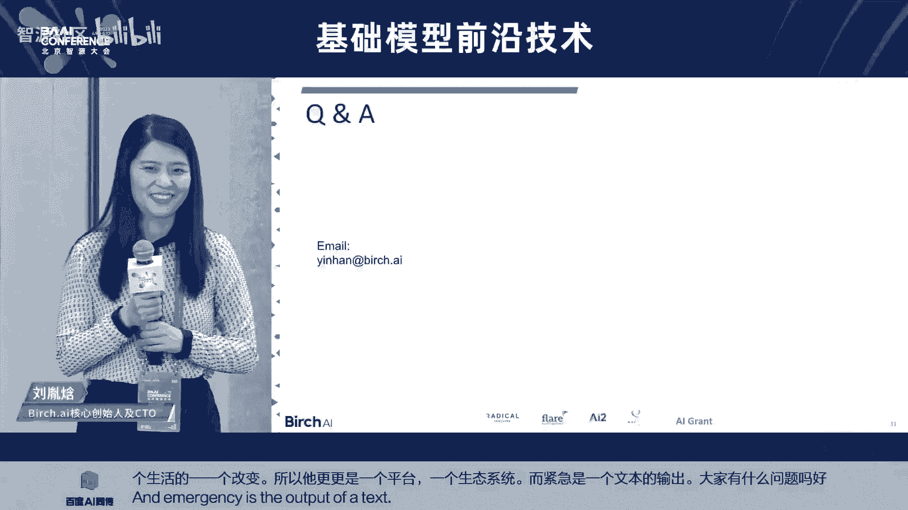

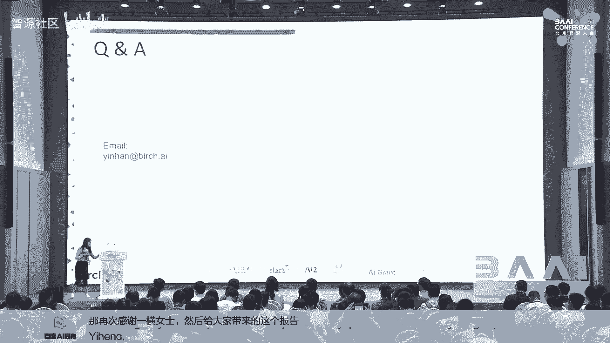

对。呃，我我认为呃，现在NLP的底层的技术还没有突破。呃，我觉得就是东方文明的呃最底层的应该是基于呃语义类的。而西方文明的底层应该是基于一种神学。所以我觉得东方文明的底层。

如果他能够真正做出来的最终的NLP的。呃，就是语言类的这种产品，它应该能够更好的呃获取我们人类心底的那种答案。呃，所以你的问题是什么？还是你是是一个简单的comments啊。

这个这个是我一个是我的个人看法。然后我是觉得呃这个如果NOP的底层技术出现以后的话，我觉得。😊，呃，大模型一定是专用的。嗯，好，那谢谢你的反馈哈，那另外一个。呃，一涵你好，我有一个技术上的一个问题啊。

就是那reinment learning by human feedback这边这边hello你好你好，讲的非常精彩。

就是我想说的是 reinforceinment learning by human feedback是 fine的一种op？

然但是其他的比说啊比通过这种参数微调就是我们在商业场景里面想要这个的 performance那就是我什么时候选择用 human feedback么时候选择用其他的种 option就有什么建议？

pro是它不会改变你的 model你y model不会被改变。但是 reinforcement learning会更新一个这个会取代原有的然进行改变。

且像我们产生的例子啊其实客户不会去try不同的pro尤其对企业用户客户一般不会去 try一个不同的pro。😊，prom是一个fix的。啊。

所以说呃更新啊用reinforment learning更新PPO用PPO policy，然后去更新这个model的位是一个一劳永逸的方法。哎，那个我这个稍微想要那个交流一下。

就是呃刚才这个问题我觉得挺有意思的。就是呃在我来看，就是RLHF也好，还是SFT也好，其实它主要是一种啊一种任务。

就是相当于他希望把某一个目的来达到而而这pri efficient learning它其实更多的是一种技术。

是不是就是LHF其实也可以把它学到这个pri efficient的这个ning的这个啊这这么一个小的参数里面是可以的吗？有这个可能性。OK好啊，我就稍微澄清一下这个问题。好，那我们应该还有还可以嗯。

那那个前排嗯。哎，哎你好，我有个问题啊，就是刚刚我们在您举的那个例子当中，呃，就是关于那个客服他可能选择呃那个回复作为更好的嘛。就您认为这个是一个更好的一个天然的个例子。

然后我的问题其实说就是假如我们现在已经有一个SFT的这个model。然后呃选就是利用这种天然的数据去进行这个强化学习这个过程呃，就是强化学习得到的这个模型，他对于相比于这个SFT这个模型。

它的提升有多大。以及第二个问题就是说呃其实可以呃直接取这个呃就是呃客服直接发送的这个文本去进行SFT嘛。然后我理解可能如果要再去让用那个强化学习去提升呃，最终我们大模型的效果的话。

可能是不是这个过程中强化学习所需要的这个数据可能还需要再次的二次的人工的标注去提升一下。呃，首先这个问题很好。然后这个问题我恰好也有答案。因为我们有特别的关注这一点呃。

re human feedback相当于是零门一角就是说SFT到达一个范围内，它其实它是上不去的。但是这个呢恰好能把这一把它提高一个很好一个很小的微调，却能把它完全更好的满足客户的需求。那这是一点。

然后呢既然你已经提到我们这个产品中的应用。那我们回到我们产品中的啊产品当中，其实人呢是一个很多变性的，就是说他刚开始有看到这个SFT的一个output。那其实他的思想是在改变的。就比如说你想说一句话。

但是呢你看到大屏幕上打出一句话，那你的思想其实比你刚开始想说这句话时候是有所微调的也有所改变的。所以说在这种情况下，当当啊我们的这个SFT有输出的时候，人看到这句话时候，他会人和机器会共存的。

所以说这样的话，人出来的结果反而其实是更有效的能帮助reinforment呃with human feedback修更人一个更好的model。嗯嗯，谢谢谢谢。然后这个除此之外。

还有另一个就是您刚刚提的这个过程中，呃，其实就是包括您刚刚讲的那个过程，就说大模型可能不太会理解。就是他说降价了。

但是其实他可能背后的意思可能想想退款或者是补一些差价这种类似的东西就是其实我在想是不是说历史的一些过程中，就是历史天然的这个客服跟用户的对话过程中，因为他们肯定也存在这种补差价这种行为。

以可能是是否SFT这个阶段就已经足够，或者说换一个换种换种方式来，就是这个强化学习提升的那个点，就是您刚刚说那个提升非常微小那个点它究竟是指在哪一个点或者说他是更容易被客服选择？

还是还是什么样首先我们depy modelel就是一个已经是SF的mod，不是一个原始的model就是呃你客户看到的这个推荐这个in model包括你说的已经是一个SFT的model它是出在过去一年的。

😊，客服的信息上。所所以所以我的理解就是其实根据用户的反馈，你到底是学到SFT还是学用HF其实取决你的这个反馈的这个形式是吗？对我做一个体一个小小的就是说在之前。

我们有一年的后我们已经了个 model那我们把这个S model到这个I实性的I产品当中。然后进行进行对进行进行监管实收集客户到底是怎么样的然后个月之后呢。

我们了一个新的 model去取代之前的个后也就是说这三个月的时间其实就是收集 human model实就已经是不是 model那抱歉由那个时间关系这个这个环节就先到这。后面。还会有一个圆桌的讨论的环节。

咱们可以到那个地方再跟我们的啊这个特邀讲者再做交流。那我们再次以掌声，然后欢迎啊这个感谢啊英涵女士啊。😊，好，那我们就接下来进入到下一个报告。那么呃特邀讲者是来自于中科院自动化所的研究员刘静啊老师。

那么呃呃刘静老师，我其他的背景的信息就不多做介绍。那么他啊是我们国内哈这个多模态大模型，这个叫子动泰出的主要作者。那么大家也应该知道哈，就是在国内啊。

我理解子动泰出应该是最早的啊这个跨三模态的这么一个啊这么一个大模型哈，那么也有非常深远的这个影响力。那么接下来我们就有请刘静老师来给我们带来多模态的啊相关的介绍。大家欢迎。😊，啊，非常非常感谢刘老师。

还有支援的邀请，让我们站在这里给大家分享。我们在多模胎啊多多模胎与训练模型相关的一些嗯我们做的一些一点点的工作，以及我嗯我们这个组团队对这个方向的一些认识和一些思考。😊，我。我现在开始。

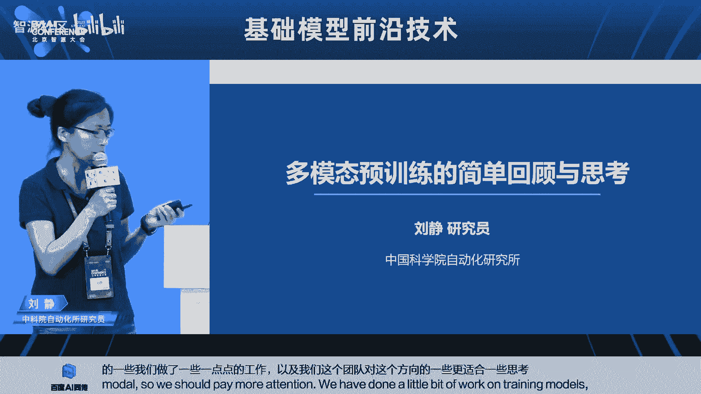

好行，我今天报告其实主要想带大家去看，因为多模胎育训练现在越来越越被大家关注。所以我今天报告主要分为以下三方面来展开。首先来介绍一下，就是多模胎，就是我们为什么要去关注多膜胎育训练。

然后讲讲一下这个多模胎育训练当前大家都是怎么做的。也就是说从其实这个方向呃并没有太久的这样基本上在019年底开始，到现在其实也就不过有3年多的研究时间啊，就整个学界都是这样的一个研究。

就这样一个三年多的这样研究历程。所以我给大家来带着回顾一下。然后接下来就是说会讲一下未来怎么做。啊。😊，那首先一个大背景，就是说我们知道在过去的十多年，其实以深度学习为核心的这样的一个人工智能技术。

已经渗透已经渗透到了我们各行各业啊，我们可以看到，无论是人脸啊、车辆识别，确实已经服务到我们的大众生活中但是其实也让我们越看越来越看到，其实AI的落地应用遇到了它的一个应用瓶颈啊。

可以表现在说传统的AI技术落地，都需要大量的人工标注数据，然后需要针对特定的场景进行定制化的开发啊，那在其实大模型就是在这样的一个背景下，然后被提出来的。

那么大模型其实被我被被我们认为是最有望突破上面说的这种应用瓶颈的一个技术。那么大模型其实它开启了我们所谓说大数据啊大模型的这种新范式。然后让我们可以从这种大规模的无监督数据中去挖掘信息来进行模型的学习。

那么简单来看，其实我觉得大模型技术跟传统的，或者说跟过去十多年的AI技术相比，我觉得主要有三点不同啊，首先就是从原有的这种基于。😊，全监督的这样的一个有限基于这种有限人工标注样本的全监督学习。

转变为这种基于大规模无标注训练样本的自监督学习。因为我可以去做这种不需要依赖于人工标注。因此我就有大量的数据可以用于模型的学习。因此我就可以学习更大规模具有更大参数的这样的一个模型。

那因此我们的模型规模也从专用的小模型走向了这样一个具有通用和泛化能力的大模型的研发。那么在接下来就ch出现，就从去年底出现之后，让我们更多的看到了大模型从基本的这样的一个数据驱动的范式。

又进一步去走向了这种人机交互的学习。去使得大模型的这样的一个能力，更好的去跟人类的意图对齐，成为一个以人类与人类意图对齐的这样的一个基础性模型。那也确实在这样过去的这样的335年中，其确实我们可以看到。

无论是学界还是企业界都有非常非常多人涌入到这样一个大模型的研发赛道。基本的方式就是让我们看到，就大家通过不断的去堆高数去增大数据的规模，不断去增大模型的参数规模。

然后也让我们见证到了在这样的一个语言语音视觉啊这样一个通用领域以及像无人车呀、生物医药等等这样的专用领域，都带来了这样性能的非常显著的提升啊。

也也当然也出现了像GP这样非常非常引人关注的这样一些大模型的应用。😊，所以我觉得觉真的是将大模型技术引入到了大众的这样的眼中，让我们全民都在关注大模型。

那我们也用下面用两页PP来简单的介绍一下是什么实际本是一个基于这一个大语言模型，后通过这种人类反馈学习然后得到了这样一个对话生成大模型。但他已经不是简单的像小兵啊样个简单闲聊机器人。

而他是让我们感受到可以用自然语言作为AI交互的这样的一个新的语言处理平台。以我觉得可能这就更强的这样一个时代的意义。

那他也带给我们非常强的这样一个交互体验现在有非常通用的意图理解他聊天的过程中你会发现他特别懂你我问什么他都知道还有强的这种连对话能力度也在不断的增长2直到1。😊，增强。

就提升了大大提升了它连续对话的能力啊，以智能交互修正能力，还有较强的逻辑推理能力等等。这样都让我们见证到了说chGPT很强，它具有类人的智能。

也被我们认为说chGPT可能是未来通已经开启了通用唉通用人工智能的这样一个大门，也因此才得到了大家对他如此的关注。那我们来看拆GPT其实它它并不是一个简单的技术的创新。

它更多的是一个众多技术和成果及大成者的。更多我们可以认为它是一个产品级的创新啊，它的核心实际上就是大模型技术，或者说自监督学习技术和人类反馈强化学习技术的一个融合。

让我们实现了这种AI能力人类的这样个意图对齐的这样一个展示。那我们来看到我们今天主题就其实从公公司成立之初。

他们就是要走向这种通用通用I那么其在这条路上终它的终点其实向了这个GPT思维代表了多模对话大模型。那因此就回到了我今天的报告的主题。就我们觉得其实大模型从单模态迈向多模将是一种必然。

了说我觉得可能现在业内越来越形成这样的一种共识。那我们是怎么来分析这个就我们所在开发动出的时，我们一开始的定位就是我们要去做图文音这样的多模的大模型。那其实我们的考虑有两点，一方面就是我们的数据。😊。

多模台数据是无处不在的。我们知道我们无论我们我们手机上，我们的电脑上，其实我们大量的信息，不过每天浏览的网页都是这样的，大量的都是一种多模台信息存在的这样一种形式。

那再一块就是说我们知道拆GPT它实际上是个语言大模型。那实际上我们人类有文字记载的历史，其实只有5000多年的历史。但是我人类的历整个人出现人类历史，其实有300多万年前。

那也就是说在在5000多年之前的这样一个人类存在过程中，实际上人类没有文字，照样可以去交流，可以去表达。也就说我们人类其实更多的表达方式或更常用的表达方式，就是通过我们的就是通过我们的这种。😊。

通过我们的去看去听去想，然后通过一样的这样一种这种可不一定用文字记载，这种口语，用一种语言的这种方式去来表达出来的那因此我们觉得我们大模型去解决什么，我们就是要解决通用为I。

我们去希望实现类人的这样的一个认知能力。因此我觉得我们从这样点，我们认为大模型要从单模台走向多模要多多模台。要像人一样去听去看，去想啊，去看我们的周围的世界。证因这样。

所以我们其实一直在从从支从这个大模型开始入手之期，也是从1从19年底我们开始就着手于去做多模胎大模型。那接下来我会对这个多模态大模刚才说过嘛。

基本上从19年底这个就这个这个整个学界或企业才开始研究多模态大模型。所以我会接下来用企业PPT来回顾一下多模态大模型这个领域，大家都在大概是怎么做的。最开始又是怎么来研究这个问题的。

那么首先我们来看多模态与训练要解决什么问题。那它既然是一个大模型技术。那我觉得它首先要具备最基本的就大模型需要具有这种强大的监督学习，会有通用知识迁移能力。有时我们对大模型最基最最希望它具备的能力。

就是具备这样一个通用泛化这样的一个能力啊，那我觉得多模域训练也是同样需要的那么作为多模训它特有的东西，我觉得要更多的去关注多模态的融合表征以及模之间的这样的一种转化，或者说语关联。

而更好的去服务于多模态融合理解和跨模转换生成这样的一些下游任务。😊，那我们来看就是我们来分析说大家来怎么做这个领域的时候。首先我觉得我们来看一下整个预训练模型到底它有哪些核心的这样的一些模块。

那我们知道就做预训练的人，做大模型都知道，其实他有很核心的两个阶段，对？个是预训练阶段一个是模型微调阶段。那么在预训练阶段，其实我们最希望模型去学习的。

就是要去针对这样的大规模的无标注样本通过设计合理的监督学习算法，然后来实现使模型具备这种与任务无关的这种通用知识，就是我预训练模型的目标。那因此在预训练模型里面。

其实我们最需要关注的就是我们的训练数据是什么样子的我们的模型架构是什么样子那现在模型架构所有大模型基本上都是trans作为一个积木块，然后堆起的一个大楼对吧？

那么再一块就是学习机制是怎样的有了数据有了模型们用什么样学习机制。那么再一个就是有有了这样的预训练模型。那么接下来怎么更好的服务下游应用。

这就会设及到模型的这种下游下下游就我们也叫模型微调以及下游任务适配等等这样。😊，方面的研究。接下来我也会针对这样的四个模块来展开对多模台预训练方面的一个一个回顾。那首先讲一下多模肽与训练数据集。

这个可能和文本不一样的，就是我们知道文本所有虽然文本质量也没有说想象的那么理想，但是其实相对多模态数据来说，它其实要干净的很多了。因为毕竟所有的文本语料都是人来编辑的。

是人文字本来就是人类来用记用来记录知识的这样的一个一个符号。而图文，而多模态其实就不一样了。多模态我们的获取，就是我他需要现在的获取图径基本上都互联网上去爬取，对吧？比如说图文数据。

那我爬取的方式就是要去网页上爬取图片以及图片的相关文本信息作为它的文字描述啊，这样一个过程。那其实我们知道在这个爬取的过程中，其实图文之间的关联是非常弱了。它噪音也是非常大的。😊。

这也是我们在多模参与训练里面，其实大家不得不考虑的一个问题。那么我除了去做图文的数据，我还可以做这种视频和文本的数据，以及说做音频文本的数据，就是任意任意任意两种模态或任一种模台的数据。

其实都可以服务于我多模参与训练模型的训练。嗯，那么这边实际上这里给出了就是我们现在所有能开源拿得到的这样的一个多模胎与训练数据集。那基本上上上面这一行的话就是图像的啊，上面这行就是图像图文数据。

下面这行就是视频文本数据。现在业内基本上我觉得作为学界其实这样的一个数据就完全是够用的那作为企业界的话，基本上也是用这些数据打底。

然后再加上自己企业的自有数据来去做对应的研发的但我觉得这个其实基本上已经可以就现在能拿到的多模态数据集，其实已经到了这样一个几十亿的规模，数据量是非常大的。但这个数据的噪音也是非常大的。

所以怎么能把这么大数据，这么大规模并且是弱关联的数据能用好，可能也是多模胎训练这个领域非常需要值得去关注的一个。😊，那么再一块就是我们刚才说transform模型，对吧？

我觉得现在所有的大模型技术其实都是在用transformer啊。那transformer其实从它2017年提出来到现在，其实大家一直在用它的最基本的架构。

因为我们可以看到transformer这个基本架构什么上有2块最核心的东西，一个就是transform部分，一个就是code部分对吧？那现在所有的现在所有的这个在多模态领域。

其实也可以看到大家无大家搭出来的模型架构，无非也就是说要么是基于它的编码器，要么基于解码器，以及编解码结构相融合的这样的一种架构去来设计我的多模态与训练大模型的一个基础模型。😊，那我们知道就这两大类。

一类，我们说是这种编编码器啊抵code呃这种encode这种架构。那么其实我我觉得在最早学职业其实在做多模态与训练的时候，基本上都是在关注incode。

也说因是多模态最初的任务更多的是在做一些分析理解任务。而基于这种t为主的这样的一个架构可能更适合来做理解任务。

所以早期的一些工作都是基于t的那当然可能我们觉得未来在看可能大家更多的会采用这样的一个生成式模型，或者说是采用inco加decode的这种架构起来更好的去实现在对多模态任务。

多模态特征理解的基础上在进一步进行生成来去做多多任务的这样的一个泛化能力啊。😊，那我们来简单来回顾一下。

就说在所其实这几天工作这基本上都代表了就是在多模台与训练这个领域最呃最开始的几个这样的工作可以看到他发表年份都在2020年，但出来基本上都在2019年出来的工作。那么这几个工作其实。😊。

其实看似其实非常简单，它基本上就是套用了bt的架构，然后把brt是一个纯文本的模型，然后相当于把它输入到不同，用用把各个模台也去去做不同的toking化，然后来进行了这样模型的输入。那么简单来看。

采用编码器的结构的话，又分为两大类啊，一类我们叫单流模型，叫单塔模型，或者是双塔模型，叫这种双流模。那么c模型就是我们最常见的叫双塔模型。那么其实这两类模型，我觉得它各有它的优势啊，尤其在多模台。

因为其实我们做多模台。我们刚才说过，我们更重要的就是要解决模台之间的关联。那我们去设计无论是设计单流还是双流实都是希望去更好的建模模台之间的这种关联。

那么单流网络实际上以看到它在它在网络的最底它相当于是图文图文信息实际上一起ken化之后输入到同一个trans除了同一个上去的。那么也就说它可以通过级别的这种不同模台的关联。那因此在建立模台关联之的话。

它的力度将会更加精细。而可以看到模型实际上它是个它只是在最通过这一个对比学习的损失。然后实现了不同模的关联。那么也就说它的关联力度上来讲的话，单塔模型肯定是要粗一些。

那它的优势就在于说它可以去离线的对文本和对应的或对应图像去做离线的编码。那么可能在一些检索任务上，者大家纯粹用它。😊，视觉编码上可能它就有更大的优势啊。

所以大家可以在不针对不同的应用去选择不同的这样的一个结构。啊，那再一类就是这种der的结构啊，那包括咱们最早支源这边做的实上就是采用了这样一个deder的方式来实现了图像以文生图这样的任务啊。

早期其实做以文生图都是基于这样的一个der的架构。那么现可能更多是用扩散模型那无论像也也好，其实它基本上都是就是采用了当时基本上都是基于GPT的这样一个架构。

然后相当于把然后把图像进行了这样的一个离散量化编码，然后通对应成些码字，然后相当和文字一样去输入到这个生成式模型，然后再去生成对应的码字。

然后从码字再回重构回原来的图像空间实现了这样的一个图像的这样一个生成方式。😊，刚才有了编码，有了解码，很容易想到，就是我可以去做incoder加deder。

说采用类似于像这样的一个像像transformer最基础的这样一种架构的方式。那么它的decodeder加入主要是因为我现在图像很多就大家知道就我很多任务其实最终都可以归结成是一个用文本来表述的任务。

就是我无论是caption也，QA也好，实际上我输入图像我最终都可以用文本来表达。那么其实它一般都会接一个文本的der因为所以大家会采用这加的架构。

那这种架构其实又分为两大类一类就transer样就可以理解成是一个和串行的结构，就是把co的输出通过一个交叉注意力，然后接到deder上。那么再一类方式可以理解成是der和是似于是并行的一个结构。

就可以共享同一个trans通过多任务的学习，实现了这样一个der这样一个同时编码能力。😊，那么再一块就是刚才前面我们讲了数据，然后讲的模型。

那那我觉得可能最那另外一个重要的环节就是怎么来去优化这样的一个模型。那我们就需要去设计合理的自监督学习的这样的一个算法去来更好的去建模所谓的跨模台的这样的一种关联。

那么现在基本上呃我觉得就是呃业内能看能能想象到的这样的一个或者大家用到的这种自监督学习方式，实际上应该基本上就是我这里面归出来的这样几大类啊，一类就是通过研码学习。像Bt一样的这种研码方式，对吧？

我可以去做模首先是模台内部的像Bt一样，就是我可以去研码出。😊，在任意一种模台内部去做自己模台内部的这样的一个掩码，然后去构建这种模台的这样的一种上下文特征的表征。那么再一种就是做模台间的掩码。

就说我可以通过maskm文本然后通过视频通过它的视觉信息来去把它的文本去做一测，这样就通过这样的一种掩码学习去建立不同模台之间的关联。那么再一类我们叫模台间的匹配学习，这个也比较比较容易理解。

就我们说自监督学习其实我更认为它是一种有监督，但它的监督信息不是来源于人工标注，而是来源于我从我的数据中去挖掘潜在的这样的监督信息来进行学习。那么匹配学习其实一个最典型。

它其实比如说我既然我不知道什么是正样本副样本，那其实我可以自己去找自己的正样本，比如图像我可以做各种变化之后啊，我当前图像做各种变化，还是那它仍然做我的正样本。那其他样本作为副样本？

这是我们的模台视觉内部的这样的一种匹配学习，那如果模台间的，那其实也比较好理解。比如说我有一个图文匹配对那任意。😊，不匹配的那就是它的副样本，然后来进行对应的学习。那么匹配学习又分为两大类。

一类就是我通过正负样本，按照通过二分类的方式来实现。那么再一类呢，就是通过这种对比学习的方式来实现这种模台间的匹配啊。😊，那么有了啊那接下来前面就通过大规模的数据。

然后通过基于这种transform架构的这种基础模型，再通过这样的一个呃自监督学习，使这样的一个模型具备了具备了非常好的这种通用性以及模台之间这种关联能力。那么接下来其实我们大模型最终要能服务于应用。

其实我们更重要的环节就是要去做模型的适配与微调啊那这个环节其实我觉得研究又分为几方面，一个就是要怎么合理的让让模型去迁移或者适配我对标的下游任务。那么这里面的研究方式。

我觉得又分为几个阶段从最早期的大家去基于这样的一个加也就说我通过我下游任务的这样的一个全监督的少量样本的这种监督学习，然后来实现这样的一个全参数的微调。那么随着模型规模越来越大，对吧？比百亿千亿万亿。

那我其实在少量的这样的下游任务数据其实已经很难全参数去微调这样的模型。那因此业内大家就想怎么能够去更高效更低代价的去微调这样的模型。变为非常重要的一个方向。那因此业内又不断的去提出，包括pro啊。

包括这种适配器的方法，以及现在这种lava的方法，其实都都希望去实现这种低代价的这样的一种增量式的微调。希望模型在微调的过程中，既不要忘记它大模型该具备的能力，同时又能够很好的去适配下游任务。

然后去实现这种增量的学习。那么再一块，其实我觉得多模胎啊在多模胎这个下游任务多模胎这个任务里面，其实它的下游任务其实可想象的空间也是非常大的。因为其实我们除了图文。

其实我们还可以不断的去范化我们的模台形式。那么实际上这种不同模态的组合，就会组合成不同的这种下游任务。那因此我们可以去想象这个怎么去让我们有了这样一个多模胎的基础模型之后。

我们怎么去更好的去想象出更好的可能的这种下游任务，使得我的模型更好的去对它服务。那么简单来理解，其实所有的下游任务都是生成类和理解类两大类，对吧？

那么生成类实际上又包括这种文本的生成语音的生成视觉的生成等等。那么理解类任务主要是说我们相当于是语义的这种理解，怎么去做问答。

怎么去做推理那其实我们可以真围绕这样的生成和理解两大类去来设计我们合理的这样的一些下游任务，使得我大模型能更好的去赋能于不同的应用。😊，那么在呃在这个研究过程中，除了像面上面在大家在几个基本环节里面。

大家去做各种各样的创新的算法。那我觉得其实要那既然是大模型，其实我觉得在这个里面大家其实怎么去把一个模型堆大做强，那可能是大家一直在努力方向。这里其实列出了几个业内典型的这样的一个大模型啊。

那他们其实基本上。😊，都是通过几个方向去来做大模型，怎么去把模型做大。你说怎么把参数量堆大，对吧？那其实大家无非的努力方向，一个就是用更强大的这样的一个语言模型啊。

比如现在可能未来可能让我们能看到的就是以大语言模型为基准的为核心的这样的一个多模态模型，可能会成为一个非常重要的一个一种研究范式啊。那再一个就是怎么去更大的这视觉模型或更大的音频模型。

就是更大的单模态模型怎么去做大。那其至少因为我觉得在文本里面可能不存在这个语音鸿沟的问题。但是在视觉和这个音频里面，其实语音鸿沟一直是以来一直几十年大家都在解决的一个问题。到现在也没有把它解决好。

因此我就说这种单模态就像视觉视觉这种音频其实是需要强大的这样的一个单模态的去来帮助他去跨越鸿沟。所以怎么去建立这样一个更好的这种单模态这种编码其实也是非常重要的啊，那再一个就是说用更多的数据，对吧？

其实现可能大家我去。😊，呃，大厂可能更多的去嗯怎么来比拼数据也是很重要的啊，一方面数据规模要大。另外一方面数据的质量也要高啊。那再一个就是像那更多模台形式的数据啊，除了图文音。

其实我们可以泛化到说去做红外去做雷达，去做去做等等啊，去做去做听觉，去做触觉等等。就说我通过更多模台的信息，是不是可以带来整个能力的这样的一个涌现。这边右边其实我给出了这样一个图。

就是用一个多模台一个典型的下游任务，也要视觉问答任务。那这个任务的这个任务的设置是说我给定一幅图片，然后我给提用文本提一个问题，然后让你用文本去做作答。

那么因此这是大家来验证多模态与训练模型的一个基础能力。大家最常用的这样的一个最常用的这种下游任务。我们其实通过右边的这样一个曲线可以看到就是。😊，这个红色部分就是在预训练模型之前，大家的一些研究的性能。

其我本人其实也是从151415年那时候我们就在做为人甲langu的这样一些任务啊。就那个时候其实我们感觉这个方向已经做不动了。但是其实你可以看到蓝线部分就预序练模型出来之后。

大家那时候其实只需要把问题就是问题部分就因是文本输入把问题部分替代成是我用t去替代一下，我都会发现性能就会做一个非常强的提升。再通过去把问题和图像去做简单的这样的一个多模态的这样一个关联建模。

发现性能会得到进一步的提升。也如说蓝线部分基本上是基于t架构的一些相对规模比较小的这样一些多模预训练模型的方法来可以看到在VQ这个任务的性能提升那再进一步去到绿色的这样一个曲线。

这基本上都是大模型通过对更大的用更多的数据然去见证说VQ能力的提升以看到它经现可以很好了。但不管怎样这条线。😊，说其实在出来之，包括我自己其实也认为多训练这个领域想很难。

就是因为感觉就像刚才说的就这个领域的数据很这个数据很据互联网10%的据保留不。我保留下1保它质量特。数据任务一直得在这个领域里可能想微调拼性很难。所大家基本上在这条线上的发展基本上都是都是拿微调任务的。

但到那个红心出来之让我们看到把语言模型非常强。核心再重新解务，它的就相当超过了所有的这个蓝线的区域。因此我觉得可能对未来的这个多领域就提出了一个挑。大家再训练，我相信都应该是比。😊。

因为我有了这样的一个，就可以站在这个非常强大的语言模型的肩膀上去来做这个事情。所以我觉得未来的能力将会变得更强，泛化性也会变得更强。😊，啊，接下来我会用几页PPT来介绍一下我们自己的工作啊。

这个其实我觉得业内更多的做多模态的模型，基本基本上都在做图文这样的一个都在做图文多模态模型。那我们所其实从从2020年启动这个项目开始，我们就一直瞄准要做图文音。因为我们人其实我们不光有眼睛。

我们还有耳朵，对吧？我们要需要去听要去看，我们才能去我们一个健全的人的对世界的认知和一个这种有残缺的人的离职肯定是不一样的。所以我们觉得要去构建这种图文音的大模型。

那么其实做这个领域其实我觉得就是当然无论我们在数据上和在模型上都做了非常多的工作。因为毕竟图文图文就很难了，图文音关联的数据局可能收集起来，代价就会更高啊。

所以我们其实也是我们可能近期会发布一个这种千万级规模的图文音多模态数据集。而且我们的音不简单的是现在大家业内理解的spech，我们还会把声音，就整个我们的世界的声音都会收集进来啊。

spech去来去做这样的更好的理解。😊，然后我们的模型就是我们有了这样的一个在图文音这样的一个大模型。三模台大模型的一种加持下，我们其实可以看到我们在这种传统的这种量任意两模台的任务上。

也去得到了更好的性能。无论是在图文啊文音啊或者是视频理解任务上，我们通过去加持这样的图文音三模台的关联建模，我们的性能都可以刷到当前，就在当现在已经在20多个这样的下游任务上都已经刷到了so它的性能。

😊，那我们其实这个工作我们为其依依托我们大模型也拿到了很多竞赛的奖，以及国际的这种奖项啊。那另外其实我们觉得就刚才我刚才说，我觉得未来的大模型肯定是要以语言大模型为核心。

然后来实现多模态的融合和多模态的融合感知与多任务的统一。我们也其实也做了这样的一个工作，希望说能够去呃以语言为以语言为中心，然后将各种模态都对齐到语言上，然后更好的让大家用语言的方式来去接触。

来去感受到这种多模态AI的这样的一个能力啊。😊，你们也提供了一些功能，就是我们既可以来做这样的一些嗯围绕视频去做一些细力度的问答啊，就比如说可以去，我不单我不单可以去问视频，简单给一个标题。

我还可以对视频里面的内容去做更细力度的这样的一些一些111一些这样了解。比如说我可以问这视频里面。嗯。能播视频是吗？就这样吧，就是就就我们可以去问里面的声音是什么。

以及可以问里面的声音出现在具体的视频的什么位置，我还可以去围绕里面的声音或者是里面的这种人运动的主体，然后来做对应的提问。

那么同时我们可以用对话的方式去来做这样的一个视频或者图像的这种生成编辑我们还可以做一些非常有意思的工作。就比以一幅图片，给一个给一个声音然后我可以去围绕这个图片和声音。

然后去来做一些能力的这样去做一些问答。比如像这样场景，我给他一个两个小孩踢球的这样一个场景，同时给他一个欢呼和掌声，我会问他你可以去分析一下结合图片声音分析下场景的氛围是怎么样的。

那我还可以去给他一个这个一个这种图书馆的图片，就给他这样种场景，给他一个气笛鸣笛可以去问他这个声音会不会出现这种场景下，他都会基于这样语言模型的这样一个认知能力。

然后来对这种多模态信息去做更强的这样一个理解和分析。我们还可以去比。😊，角两个视频里面的共同点是什么啊，然后。就可以共同共同点，或者他的差异是什么？比如这哎这个是放不了视频是吧？

就是其实上我们这边右边的一个视频里面可能就是这下面是两个视频啊，就是右边的视频可能是一个一个车在快速的移动。然后左边左边呃呃左应该左左边是快速的移动。右边的实际上是个慢速移动。

其实他可以通过对这两个视频细力度理解，可以来做这种深度的这样的分析啊。😊，我们同时还可以写写故事，就是我们不单可以看图写话，我们还可以给你一幅图片，给你一个声音，同时给你一个视频啊。

给给这个最右边其实是个视频。那其实我可以让他去根对这样的一个多模台的这样的一个对不同模态的这样一个理解，然后去通过他的一个语言的这样的一个组织能力，然后来给大家去讲一段流畅的故事。

也就是说其实我们当有了不同模台的信息。通过构建了这种图文音的这样的一种深度深层次细腻度的关联之后，其实我可延伸出来的多模台应用其实非常丰富啊。😊。

那同时我们这个模型其实我们不单呃不单算法上数据上我们都做了非常多的工作。同时我们作为就是呃大模型的这样所为中科院嘛，中科院为背景这样的一个国家队。

其实我们也希望把我们的大模型能够做到这种全站的国产化部署。那我们现在目前已经可以在这个华为的生腾平台，以及像曙光这样的一些硬件平台上都去可以做到这个全链的这样的一个呃模型的训练，然后推理和部署。

那么同时我们的这个泰出大模型，也在很多领域得到了一些推广的应用。😊，最后讲一下，就是我说多模态预训练模型的几点思考吧。就是以后该怎么做。那首先我觉得按照我们刚才说的这个对吧？

我们知道大模就是大数据啊大模型虽然很简单粗暴，但是至少我觉得肯定还是一条有效的路，对吧？未来肯定就至少现在我们还没有看到镜头，就通过对数据堆模型，我们还是可以性能得到进一步的提升。

但我们想这条路肯定并不是适合所有的人来走，特别是我们作为学界来去做这个问题的时候，一味的去追大，肯定不是我们能不是不是我们的长处啊。所以我觉得我们怎么能去通过另外一个方向去把它做基因才做到性能更好。

那我觉得从数据上来讲的话，我们如果做不大，那我们就要把质量做高。就像刚才我们说的就是多模胎多模态的数据其实是非常脏的。就是我如果能够你如果有非常好的方法，就无论是通过这样的一种规自动规则的这样那种过滤。

还是说通过这种模型加数据混合去来去做数据的清洗。我觉得如何用一个高质量的数据，可能都是非常重要的啊。😊，那再一块就是我觉得其实如何引入知识去来过滤数据。特别是当我们人去在执行很多任务的时候。

其实我们我们带着不同的目标。其实我们的信息的这种过滤能力是信息的过滤方式是不一样的那所以我们其实怎么就把知识或者任务的这样的一些一些一些一些目标性的东西放入到里面，去帮我们过滤数据。

可能也是要值得去思考的。那再一块就是我们说模型结构，对吧？我们其实现在我们看到transformer已经做到了大一统，对吧？无论是在图文音，大家都觉得它是最好的那其实再往后往再往前推。

再往前推五年推几年，那可能大家觉得CN是视觉领域N就是最好的吧在语音领域可能MN是最好的那我觉得其实这个模型就大家其实现在也知道trans本身确实有它的问题。比如它的自主义机制计算的冗余性等等啊。

所以我觉得可能怎么去研究更新的这样的像transformer一样的这种基础架构高效模型可能也是非常就非常值得学界去不断的去探索的再一个就是我们要把模型做大，对吧？我们最终肯定要我们要去做到百亿千亿。

特别是做到千亿的时候，那我们就要涉及到说怎么去做模型并行。么高效做数据并行流水并行等等。这个可能都是值得去就整个大模型的这种分布式并行训练，可能也是非常值得去探讨的一个方向。😊。

那么再一块就是我觉得我们大模型我们说了嘛，最好做完了，最终是要服务于下游任务。那么怎么设计一个合理的大模型，能更好的兼容更多更强的这样的下游任务。

可能我们也可以在这个模型基础设计上也可以去考虑这个问题啊。那再一个就是说关联键模次监督学习。那其实就像刚才我说，就像我们做多模态与训练，我们做图文音，但我们也不是只用。

不是必须要用到图文音三模态关联的数据。我们只是说需要用到。但是其实你图文的文音的纯图像的纯文本的。我们的模台我整个大模型的训练其实都是有的。

也就是说实际上我的训练要能支持单模态部分模态以及全模态的混合训练。这样才能更好的去利用全网的数据来使你的大模型做的更好啊。😊，那再一块就是我说模型的下游任务应用和迁移能力，对吧？

怎么去做对应的模型的蒸馏推理加速，然后为特定场景提供可能。就我们落地应用不可能用一个就如果是特别是到终端上，不可能用一个大用一个这种百亿千亿的大模型，对吧？我可能顶多几百兆或者几十兆的模型。

那这个时候怎么把大模型的能力蒸给蒸给小模型，对吧？我们到底是用数据蒸馏还是模型蒸馏还是参数蒸馏等等。这个可能都要去做更多的设计。

总之我觉得可能更多的研究创新算力数据可能都会使多模台与训练做的更好更快更强。那再一块其实我简单讲一下，就是说拆GP时代是说我们可能要重新审视说AI到底要做什么。

其实我觉得简单来理解就三大类工作一类就是研究大模型一就利用大模型。那最后就是治理大模型。那我觉得研究和利用就不用多说了。其实大家都非常清楚，那其实治理大模型，我觉得这个话题其实虽然被提了很多次。

但我觉得其实在大模型时代治理大模型可能会变得更加重要，就是因为我们知道这样的一个大这样一个完全数据驱动的黑盒子，对吧？

我们怎么更好的更安全更可信的服务用下游应用我们必须要打开它不知道它的原理不知道它我对它的生成不可控，那其实我很难去安全可信放心的去用它。所以我觉得可能在大模型时代，我觉得治理大模型可能会得非常重要。

我怎么使我大模型的发展更加安全可信可控，可能是需要我们去思考的那最后一页PPT啊，就是我来讲一下，就说。😊，多模台大模型就后就后差的GP1多模台大模型我们要做什么。

那我觉得最基本的就是我们我们刚才说我们要对标AGI我们就是要去做大模型。那么更那未来发展必然就是要去做多模台大模型。我们就是要去实现人类的这样类人的这种智能。那人类的智能就是多模台协同的智能。

所以我觉得最根本的目标就是要对标AGI去实现这种高效协同的多模台智能啊，那再一块就说多模台大能它在做什么，就多模胎到底会比单模台多什么。我相信不同的模台。

其实它会有它既有它自己的这样的一个可能具有模台之间的共有的东西，也有模台之间所特有的东西。那其实我们更希望从多模台之间去学习更多的知识。我们希望通过不同模台之间实现他们的种知识迁移。

以及相互补全和相互验证，去来做到一个更通用更更鲁棒的这样的一个大模型啊，那最后再就是说我们大模型的目标嘛，就是要去建立通用安全可信的这种多模态大模型。那最后一个方面就是说。😊，我觉得大模型怎么用？

至少现在其实我们可以看到，就特别是这个出来之后，开源了这么多大模型。这种通过积木拼搭式的这样的一种大模型的应用已经特别特别多层出不穷。那么其实在哪些领域。

我还可以其实我们可能还有更多更多尤其在多模态领域，还有更多可尝试的这种排列组合的方式去来拼插出一些更有意思的这样的一些多模应用。那么其实我这里简单的总结了几方面的这样的应用啊。

其实我觉得可能未来更值得去关注，特别是可能作为我们学界觉得更值得去关注的话，就是这种多模态感知决策一体化的这样的一种多模态智能吧。因为我觉得其实现在大模型更多的更多的在解决感知问题。

也就是说相当于我可以给机器人其实已经可以给他长了脑子？我怎么把他的眼睛，他的耳朵把他的手他的他的脚怎么更好的把他的感官和他的执行的这样一个部件去更好的协同起来。

那我去做这样的一种多模感知认知或者决策一体化的这种大模型。我觉得可能是未来。😊，更值得大家去往前走的这样的一个方向。那么落地的应用就可以看到更新一代的这种机器人，对吧？

可能不光是一个类人的这样一个聊天对话平台，可能更多的是可能未来有可能一个一个机器人坐在我们身边，就能提供像人一样的这种各种服务，各种各种这种种解答啊，所以可确实我觉得大模型给我们带来很多想象。

我们可以看到很多很多，我们可以做很多很多事情啊。😊。

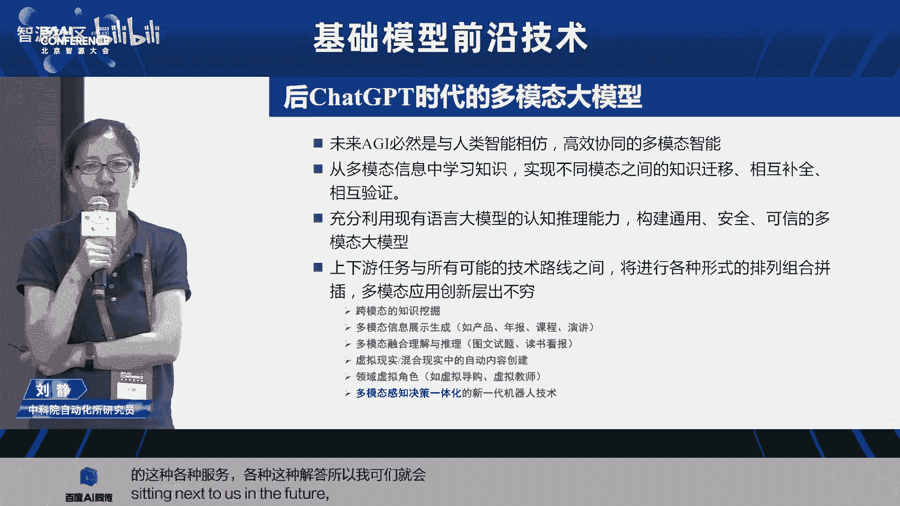

好的，谢谢大家嗯。😊。

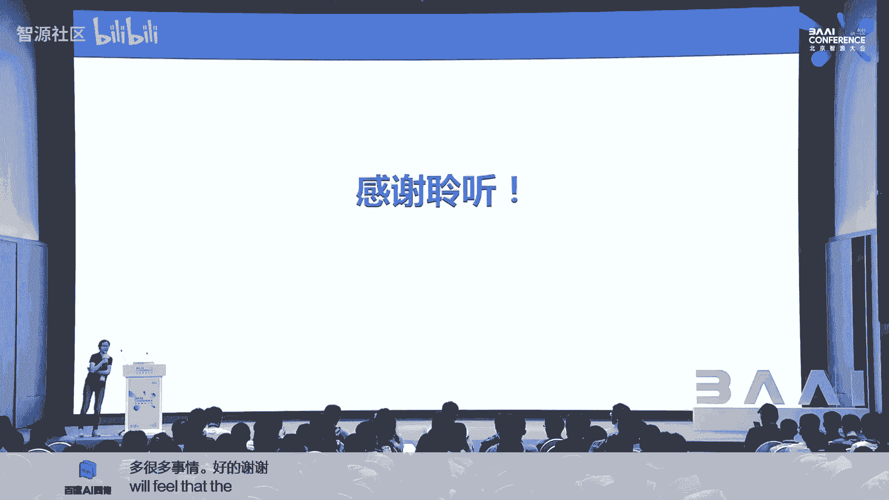

好，感谢刘老师啊，这个报告信息量非常大。这个刘老师自带这个二倍速的这个加成的这个特效哈那个那我们应该还有10分钟时间，然后我们可以再做一个呃这个简单的交流。然后那个有提问的请举手。😊，嗯，那个第一排嗯。

谢谢刘老师的分享。然后有两个想两个关于多模态的一个挑战的问题吧，想问请教一下刘老师。那第一个问题是说，我们多模态的数据的标注这一块可能成本要比我们单模态的标标成本会更大一些。

那对于中小型企业想要做基于一个成熟的多模态大模型做自己的做自己的微调的时候，怎么去降低自己数据标注的一个成本有没有什么更好的一个办法。这是第一个问题。

那第二个问题的话是关于算力的那我们看我们GB4即使是openI他也并没有说在他的官方对公众开放它的那个读图是图的个能力。那重新的现有的信息来看的话，还是我们多模态的推理。

对于算力的要求是非常非常高的那未来像泰书这样的集合了三个模态的大模型，后续经营推理的时候，怎么去降低它的算力成本有没有这样的个后续的一个方向，谢谢刘老师。😊，好的，谢谢你的问题啊。

首先我来回答第一个问题，就说数据的问题。首先我觉得就是刚确实我觉得多图文音或者说图文等等这种多模态的这种数据它的呃质量。因为它更难确实难度收集更大但是我们怎么来去做到高质量。

我觉得现在完全靠人工标或者是说这肯定是不现实的所以我们更多要去想一些这种自动的方法。觉得现在大家我们现在常用的一种就是通过模型。比说图文数据质的就是我要有一个图以及对这个图像的一个描述。

那这样一个图文的匹配那实际上我的模型我在做的事情本身我就可以训练一个caption可以训练一个文本描述器。那实际上我就可以用我自己的模型对所有的数据做清洗。

然后就这去得到我的这样个类似不断的去我自的数据有一个更强的模型去来清洗我的数据。那再一块我以考虑的就是么用现这样强大的语言模型做文字的这样一个修正和润色，其实也是可以去考虑的一个方向。😊。

而且我觉得未来就是。😊，就是我们说语言模型，大家说2025年可能就已经枯竭了，可能就已经用完了。那实际上我觉得可能未来在大模型这个研究道路上。

我觉得可能怎么多怎么更好的用大模型或怎么更好的用模型来生成数据，也是非常值得去探讨的一个方向。就是我们怎么用模型去来生成图片用图片再去生成文本文本再怎么就来形成闭环。

就是可能我觉得未来可能百分之二三十的数据可能是来自于生成的，未必是要来自自己去收集的啊，而特别是当您对标下游应任务应用的时候，那我觉得怎么把大模型的能力。

其实我觉得更多大模型怎么去通过数据蒸馏去蒸馏出能够服务于您对标应用的这样小领域的这种数据，可能我觉得是非常值得去去去探讨的。就怎么用大模型帮就大模型有时候到说到下游任务上。

可能就你直接想把一个千亿万亿的参数想把蒸馏成是一个这种几百兆的这样参数其实不现实。但是我觉得确实你可以让大模型去帮你蒸馏一个很好的。😊，样的高精度的高质量的数据集。

然后用这个数据集相当于是把大模型的能力赋予了你。你可以在你还有你领域的小模型。但是我的数据会比你原来好，数据多质量高，那同样可以得到更好的性能。所以我觉得可能怎么去用大模型去来嗯帮我们蒸馏数据也好。

帮我们生成数据也好，可能也是值得去值得去探讨的啊。另外您说的第二个问题就是算力的问题。那其实我觉得我刚才我刚才也引出来说，我觉得可能未来。😊，未来多么太大模型，真的是要以语言大模型为为一个基础的基座。

然后来去呃来去构养。就是相当于语言大模型，就像人的一个认知大脑。我有了这样的一个通过通过这种不断的这种文字学习。其实我的我已经有了一个基础的认知能力。然后我再再赋予大模型。

也就是其实我的语言大模型很就是语言大模型的这样的一个基础能力，我要很好的保持。就说我其实。😊，我可能未来多模态与训练这一块，可能我百分之七八十的参数都来自于语言模型。而这块模型的参数。

实际上我可以在真造大多模态大模型这个领域上可以固化掉不学习。😊，就因为语言大模型现在确实已经发展的非常好了，就是让我们看到他能力已经蛮强的。那再一块就是其实正是为什么我要去做多模态。

我们去想到说我们通过这种多模态之间的这样的一个呃对知识的补全，这相互的验证。我们觉得它可能会大大降低我们对任意一种模态的这种呃数据的需求。就我通过这种多模态的这种融合验证。

可能我会降低我对其单一同样做同样一件任务，你只用图像数据和我用图文音数据去来做的时候，我可能会我的效率会更高啊，所以我当用更多模态的数据的时候，我可能会带来一些能力的涌现。

这也是这这也是要也是非常有意义的。😊，不知是不是满意。好，那个要不我们给后面的同志机会，最后面一排。嗯。嗯，听不清。testing testing，我想问一下老师，之前呃我看过一篇论文。

关于用模型去生成数据导致的模型探索，还有数据危害的问题。呃，对于这个问题的话呃，你们有没有什么其他见解去解决这个问题？当然这种生意成这种这种数据生成肯定是要呃你要定义场景，定义好你的规则。

并不是说这种这种自由的生成啊，就是肯定要定义好场景。你要就像我们说我们要用大语言模型，你一定要定义好你的pro是什么？你这个才能去更好的去服务它的生成结果才能更好的服务你应用。

就如果是说通用大模型的这个这个训练，我倒觉得可能用这种生成式生成式的东西，可能只只是文字可能更多的润色。你用这个但是我觉得这种到特别对标到下游应用的时候，我觉得生成，你要结合你的应用的需求。

然后去写合适的pro，然后去来做对应的生成。😊，好，那那个由于时间关系，我们最后一个问题，然后呃那个要不第一排第一排那边。不行。嗯。下午好，我是赵子金，从宾西法尼亚大学来的。

嗯I it O if I ask you this question in English。O。I was just wondering as we progress towards more advanced multimod generation and training。

 whether the main advantage would come from increasing specialization and specification within certain modes or the systematic allocation of resources and dedication of resources towards development of increasingly advanced large language models。

啊，我我没有听得很清楚。嗯，就是呃抱歉，我中文真的说的不太好，用中文说，但是呃我试一试嗯，就是在我们这个嗯多模型的这个多多模态的这个模型的发展呃 journey里面呃，我们走向这个多模态的时候。

我们是应该呃在任一个某个模台里面嗯，ddicate更多的时间，把它更specialize做的更perfect，还是说。😊。

overall的这个大模型呃underlying foundational的这个LLM把它做的最好，而且其他的 application can come later。我觉得这个都很重要。

就是我觉得要想把多模台模型做好。就是我觉得未来的架构肯定就是刚才我说基础架可能就是加可能就是分别有不同模的有多模再去接一这种架构。

那其实每一个环节都会非常重要性能的提升所以我觉得其实做大模型不是简单的一两篇work堆出来的工作。它一定是大家就是在每一个环节论是数据还是模型还是说我最后的这样一些工程的部署。

可能最终才能一起造就出一个非常好性能性能好的大模型。那我觉得整个就说模型这个环节你论是文本还是语音还是视觉这个单一模的单一模编码好了好了，肯定对你最后的这贡献非常的。

但如果只是单一模建了你的多模之的关联建那就真多大模型。所以我觉得每一个环节可能都会非常重要。难说哪个环节不重要。我觉得大模型真的是一个。😊，就是这种集成公关的任这样的一个一个任务。

不是简单的说我们靠一个算法就能就能堆出一个工作的这样的一个东西。那如果说抱歉，在呃 additional一个小问题，就是说如果一个产业。

一个entterprise要develop他们在某个项目的上的能力。他们应该focus在一个specialize area，他们自己的doomain，还是说能把这个大模型push forward。

我觉得作为企业来说，你有明确的这种呃明确的应用场景。那我觉得肯定是应该想好怎么把现在的大模型怎么更好的赋能应用的场景。我觉得这个是很重要的。而且我觉得未来大模型做基础基做的可能不需要太多。

但是我觉得能锤化去发展的可以可根对不同的领域去做各种各样的垂化的发展。我觉得作为企业特别是有明确这种应用场景的，我觉我觉得还是要更多的去去定去去聚焦自己的场景。因为我觉得其实现在大模型你比如语言大模型。

包括一些基础基础的这样多模态，无论是生成，还是说我们做种多模态理解，其他基础能力都还可以了。但未来怎么针对说真正落地能赋能应用，更需要锤化的方式去怎么去把每一步你的数据怎么去做，对？

你的你的这个模型怎么去构建你的下任务是怎么来定义的。以及说现在大家我说未来可能不简单的是一个纯数据去动还去怎么去人类的反馈种人类的交互学习。可能这些环节都是对。😊。

你这个最终你的这个模型能不能产生价值是是更为重要的啊。好，多谢您。好，那呃再次感谢各位提问。那也再次感谢呃刘呃这个刘老师给大家带来的多么太的精彩报告。那大家嗯再次鼓掌啊，感谢。😊，好。

那我们接下来就进入到今天的最后一个特邀报告，是来自于google的呃研究科学家周燕琪女士。然后她呃要给我们讲的是skiing large language models from power law torsity。

那么呃周燕琪女士呢本身啊呃应该也不做多做介绍哈，它是我们应该所有的呃这个预训练语言模型啊，预训练模型里面啊，另外一个非常重要的呃这么一个呃这一个模型叫T five啊，她是这个T five的呃作者之一。

那么接下来我们就欢迎啊周女士给大家带来报告，大家欢迎。有。

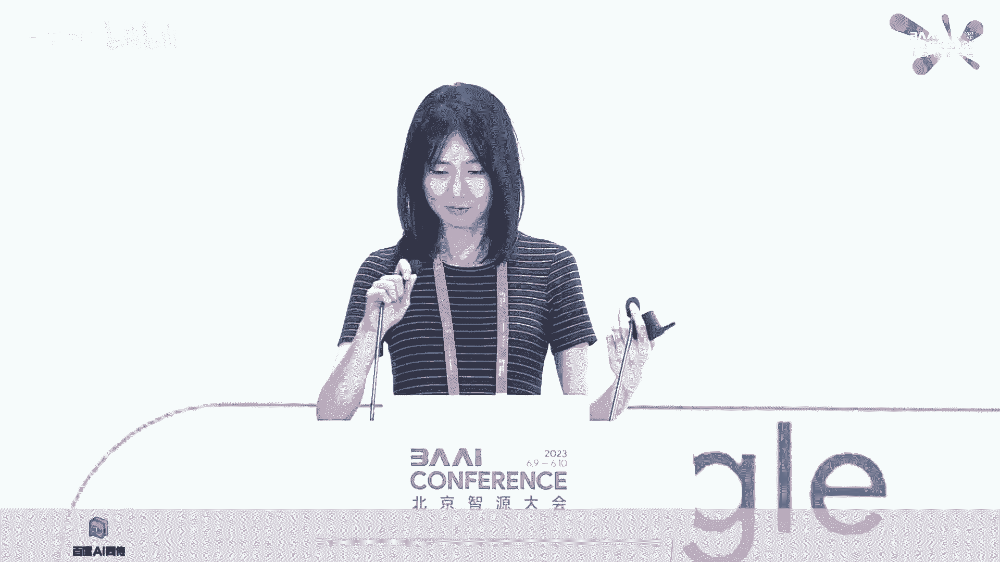

啊，大家下午好嗯，我是周艳琪，来自google的de mind嗯，我是一名research scientist嗯，我在google嗯做了很多关于large language model的工作。

最开始的工作是关于做了一些这个input building，然后做了一些 fine的一些工作。然后在往后的一些lan model的rearch里面呢做的关于ity以及sing large language model的一些工作。

然后呢，和刚才那位同学有一个一样的问题啊，我的这个中文呃讲这个technical的东西非常差。所以呢这个talk我就还是用英文来讲，然后我可能尽量的这个语速放慢一点。

然后能方便大家能够更好的理解这个呃s里面的内容。然后如果大概大家那个有什么问题的话，我们可以线下接着交流。😊，Okay， let's get started。

I'm going to talk about larger language scaling， from power law to sparsity。

And then here's today's agenda。 We will have four separate sections。

 The first section will be around more law and power law in deep learning。 and later。

 I will talk about my research work at Google Bra ranging from T 5 unified text text transformer and several recent work on M O E architecture and more advanced M O E techniques we developed this year in IC M O paper。

And at first， more slow and power law。If， if people know deep learnings development。

 we might get a sense that deep learning is actually thriving because of the development of hardware and modern accelerators。

Jrdan Moore actually postulated that the number of transistors on a fixed areas of a chip processor will be doubled every two year or every every one year。

 one or two year。 and that actually fundamentally provides the stress and drive of developing large deep learning models and recent large language models。

However， more recently， we all know that we are hitting the end of scaling more slow。

 That means the number of transistors we could pack on a fixed area of chip is pretty much fixed these days。

 Therefore， we cannot get the free lunch we got from the past。

 We cannot freely scale the deep learning models for free。 And of course。

 we all know that the chip performance are not just bounded by the number of transistors on chip。

 but also bound by the the memory bandwidth around the chip。 That's what we call memory wall。

And for other reasons。 so given the end of Moores law in in the past few years why I was still working at Baidu。

 our colleague， Joel actually had a very important paper about deep learning empirically predictable the performance is predictable。

 given the size of the model and given the total training data of the model。 So at that point。

 it could be like very groundbreaking research work， but it was not very like wellknow at that point。

 and a few years later， open AI had its its own very systematic paper around scaling law on large language models。

 and they have like more systematic results based on scaling the computation resources。

 scaling the data size and scaling the total number of parameters in the model。

 and we could find uniformly， you could get this linear scaling curve by。

Finacially scaling all these parameters or each of the parameters。

That fundamentally provide our the incentives to all the major big tech companies to develop their big models。

 and more recently， the larger language models。Yeah。And in this session。

 I'm going to talk a little bit details about the T 5 work we had at Google。

And one of the greatest contribution teeth I had is to formulate each N L P task as a unified tax to tax problem。

 So， for example， you could create a tax tax problem for translation task for sentimental analysis task for classification task and also for like a question answering task like what。

 what we this days care most about。😊，And another significant contribution is the C4 data。

 which was open source with the T 5 model together a few years ago。

 and this data actually benefit the entire research community a lot。 and observe that many。

 many follow up papers are based on top of T5 model architecture and the C4 data and more particularly C4 is a web crowd data。

 we basically do like scraping from the Internet data and do some data filtering preprocessing to create clean data。

 So more particularly we could remove the redundant sentences。

 remove short lines remove the lines with bad phrases and by doing those。

 we create a very clean data of around 700 50 gig of clean English data and a little portion of multilingual data is also released with the C4。

Or that's why actually， the translation results on T5 model is not so great because it contains very little multilingual data compared to the web crowd data set。

And in general， as we know， theres a transfer learning the concept in the title。

 So transfer learning is very different from what we currently care most about which is in context few short one short learning in G3 G4。

 So transfer learning means that you pretrain a large language model and using web crowd data set and using the knowledge from the world。

 while you you create the generation capability of this model so that foundationally。

 the model is very good at the word knowledge at the linguistic in general， However。

 for all the downstream task， you need to do another round of a fine tuning to actually find tune the model with glue super glue translation。

 etc。 to make the model really excel on the downstream task。And in Hai。

 we particularly make all the parameters very simple so that people can reproduce easily。

And the objective in T P similar to Bt， we use a mask language modeling loss， which basically。

 you given the input， you you， you randomly carve out sound of the tokens and you let the model predict the carved out tokens and the loss is just a cross entropy loss between the target and your generated tokens。

And this slide covers some basic concepts of encoder decoder based model。

 which is what the Tfi propose and a language model and a prefix language model。

 So basically in encode decoder model is a very general model。

 encoder will encode embedding of your input a good representation while doing in the encodecoding stage。

 all the tokens can be attending to all the other tokens。

 So the attention mask is a full fully visible attention mask。

 while in the decoder you start the generation like the translation or question answering you need to generate the target。

 and doing the auto regressiongressive generation， there is a causal masking applied。 Therefore。

 all the tokens can be only to the past tokens， not the future tokens。 similarly。

 in the language model。 it doesn't have the encoder part。

 That means all the tokens has like a causal masking。 Therefore the generation is。

It's causal auto regressive through the entire sequence， including the input and the target。

 and prefix L M improves language model a little bit by providing the the the prefix part being fully visible。

 That means you can do like full attention in the prefix part and do the causal attention in the generation part makes the model slightly more capable than than the the language model。

At in T5， we picked a bird style mass language modeling loss with a 15% corruption ratio。

 That means you carve out 15% of the tokens from the entire sentence and let the model predict the corrupted tokens。

And a very interesting， actually phenomenon the Tfi observed is that for4 x compute。

 how we should allocate the compute resources。 And according to the results is very interesting。

 We noticed that you could allocate the 4 x resources to either your training data。

 your training time， your batch size or the total number of parameters。

 It doesn't really matter the model would like pretty much uniformly scale linearly in terms of log complexity during training。

 And that finding is actually very important。 I think it's actually the foundation of the later chininilla paper where the chinilla paper develop some theory around the compute efficient model scaling。

 I think that paper is actually a follow up work from the Tfi theory。

And T5 at that point was ranked number one， a bunch of leaderboards like glue silver glue。

 except translation test。 like I mentioned the reason it doesn't have a much multilingual data。

 That's why it's not good at translation。 but it ranked number one of the leader board at 11 billions of parameters。

赵。Since the inception of P5， we've been seeing this computation across all the big companies generating newer and newer version of a large language models。

 So in the same year of T5 open AI built a much larger model called G3。

 which use int decoder only model use in text few short learning。

 So instead of doing this additional around fine tuning it cares more about the generalization capability of the model by doing purely next token prediction during training and doing evaluation is just use like in context a few short learning。

 it generates a few examples of the task and the model follow the example and generates the answer for like a new question。

 So basically that's how G3 works。 and G works really well。

 and the word notice that the decoder only model works really well。

 especially for the generalization。without fine tuning perspective， However， later two year later。

 Google had a new model called Palm model with over 500 billions of parameters。

 And that was considered the biggest model at that point。

 It's super capable and super expensive to train。嗯， however。Even like one year later。

 we don't really have like officially announced dance model above 500 billions of parameters， right。

 If you check， if you check， chat GT， it's actually fewer than500 billions of parameters。

 If you check G4， it's not even a dance model。So it comes to my next topic about efficiently scaling larger language models with mixture of expert。

Our first paper on sparsely gated large language models at Google， which has over 1。

2 trillionth of total parameters。 but with a slightly smaller number of activated parameters than G3。

 So activated parameters means that we only dynamically switch on sub ratio of the sub portion of the to the neurons for each of the input。

 that means your model is is actually sparse。And some more details about Gam。

 It's a decoder owning model like G3。 It use in text of fuion learning the same as G 3 difference is that model architecture level。

 it has a sparsity。 So it has sparsely activated FFM layer that makes the model super scalable and super efficient。

And like I mentioned， the total parameters is 1。2 trillionth of parameters with 97 billions of activated parameters。

 If you check the results on the the table。The zero shop one shot fee shot compared to G 3 is way better。

 even with a fewer number of activated parameters， which means fewer flops per token。

 And if you check the cost on the top row， the training energy is reduced by over 60% compared to G3。

So looking into the details of a gl model， it's a sparsely activated model。

 but we don't build an M O E for every layer。 We make the dance layer and M O E layer in like interleaved fashion on purpose。

 because we want to， whenever we introduce more experts。

 we wanna only sublinely increase the total number of parameters。

 not linearly increase the number total number of parameters。

 which might require too many slices of machines。嗯。And comparing the few short results with G3。

 So at every single activated parameter size， gl outperform G GP T3 in natural language generation task and natural language understanding task pretty much uniformly。

And here is the decomposition of the results。 You can see that the the gap between gl and G3 is actually big。

 And if you track the right most color， it's comparing the TPU years means how many TP U years we need to train a certain sized model and gl actually provides even bigger game compared to G3。

Yeah。Yeah。However， even with this more efficient gl model。

 we still notice the token based M O E can be very limited。 for several reasons。

 One of them is that it creates some loading imbal problem。

 that's because the the token based routing have the token picking experts using the routing function。

 However， that can create hot experts and code experts， especially in the beginning of training。

 So that's a big problem。 Some experts will be underut。 Some experts will be overutized。

 and the the latency can be increased even due to the hot experts。So to mitigate that。

 we propose a new routing algorithm， we call it expert choice routing。 This is a paper in New 2022。

 So instead of having the token picking experts， we have the expert with fixed buffer capacity picking token So the buffer capacity actually can be precomputed given the capacity factor of the model。

 which is the sparsity of the model。 So the programmer can define beforehand the sparsity of the model and then precomp what is the buffer site and then use expert choice to route the token using expert choice routing and which creates perfect load balancing you don't have to add a auxiliary loss。

 which might hurt the training using cost entrepreneur laws and also tokens can be received by a variable number of experts。

Which essentially creates hydrogengeneity in resource mapping。

 Some important tokens can get more resources， while some less important tokens can get fewer parameters。

And this figure shows the， the gather stage of expert choice。

 Basically a router select tokens send the tokens to each of the expert。

 And after the gather function， we needed to still run the scatter function to gather the tokens to its original temporal order。

 which is very critical for the following attention layer。Yeah。And comparing to gl， the spae。

 the best sparse model at Google， the the model with expert choice routing is2 x more efficient in terms of a training convergence and in terms of a step time iss 20% faster than the gl baseline。

 So basically， expert choice is faster because it removed actually removed the load imbalance issue entirely。

 So all the experts are evenly balanced that actually reduce the critical path of the run time。

And comparing to glam and switch transformer， which use top two routing， top 2 ro top  one routing。

 Both are token based routing。 expert choice consistently outperform switch transformer and glam in various scales in the largest scale。

 A B 6，4 E setting our model even outperform 11 B T 5 dance model in the super gluelu score。

And having the， the more advanced routing algorithm。

 we think about how to improve the M O E method even more。

By creating an even novel M O E architecture。 So we call it brainform。

 So the purpose is to create a model that is if as efficient as a human brain。

That is more like dynamically using dynamic conditional computation is spa and is highly specialized into different regions。

So we propose brainformer， which is essentially a non uniform model architecture。

 rooted from the the fundamental low rank multi expert primitives and a brainformer demonstrate  two x faster training and5 x faster step time compared to Glen。

So how do we derive the search space？ How can we decide what kind of operators to put in the search space？

 So instead of combining purely combining all the recent work from the word like the xform different formss we actually started from like very fundamentals using two different basic compression methods。

 One is a low rank and the other is multi expert。 So by low rank。

 we could decompose a big matrix modification into two vertically stack one， smaller one。

 which reduce the fls by half and multi expert means you could vertically horizontally split the matrix modificationplication operation and also split your input into two parts and route your two parts of input two different experts。

And also， by stacking those two methods together， we could create even higher compression ratio。

As demonstrated in the， in the right figure。And very interesting。

 if you insert a mixture layer across the bottleneck part of the model。

 the model starts looking very similar to transformer。 And actually。

 if you use a attention layer in that bottleneck part， it becomes a multi expert transformer layer。

 So that actually our the search space help us understand the transformer model architecture even more。

😊，And we decide to build a search space on top of those very fundamental primitives by varying the operator types of each of the layer and hyper parameters of each of the layer and routing algorithm capacity factors。

 sparsity of the model， each layer。And create a search space out of this。 And during the search。

 we first sample a block architecture from the search space and build a proxy model of size 100 million parameters and a total 32 experts And we train the proxy task。

 Get the validation accuracy and create a reward road function。😊。

And we pick the top K models and scale models to different size，1， B，64 E and A B。

64 E and evaluate different models at a different scale。

And our search objective is a compute efficient search objective。

 which is actually taking inspiration from the chininchilla paper。

 We want to build something that is not just flwise very small or memory wise very small。

 We want to build something that can run really， really fast on TPU。😊，Therefore。

 our search objective is to minimize the validation loss of the architecture while meeting a inference time constraint compared to your baseline vanillana transformer。

 and your search space is the previously mentioned blockwise architecture search space。And here。

 comparing the results， brainformer is in the right figure。

8 B scale is more than two x faster in training convergence compared to gl architecture and five x more like faster in step time or inference time。

So this table shows more details around the training efficiency。 looking at the last row。

 you can see with a fewer activated parameters and。

It gets a lower perplexity and a5 x faster than than the gl baseline。

And we also compare the downstream task performance using fine tuning and using in tax fu learning and a brainformer can beat both the primary 1 B dance model and the Glen 1 B6。

4E spae model on various NP task。Yeah。So after finding this model architecture。

 we start thinking about how to effectively train the model。 As we know。

 training large language model can be very expensive。

So there are actually a bunch of use case at Google。 We needed to improve。 First。

 is we have a temporal data at Google。 So basically， we。

 we collect new samples from the world in like a very constant fashion。 We get a new search data。

 new foreign data， dialogue data， Wikipedia data， Github data。 The data is changing every day。

 So how can we make the language model updated。And another question is。

 we wanted to adapt the foundational model， let's say a pretrained G4 a upon model to some target downstream task domain。

 So for example， we wanted the model to do really well on conversational task like chatbot or like the model doing really well on translation。

 So therefore， we needed to create like a second round of a fine tunening of training using the mixture of a downstream task data set。

However， if you do this additional round of training， it's also very time consuming。

 And it has a significant issue of forgetting。 So whenever you train a very different data distribution than the previous one。

 you forget on the previous data distribution。So here explains the problem of forgetting。

 So when you train on your original C 4 or G 4 data。 and later。

 you wanted the model to do really well on medical images。

 The model gets really well on medical images， but forgets what is previously learned。

 So that's the issue of forgetting。So here we wanted to create a method that can make the model can efficiently incrementally learn the new training data while retaining the old knowledge。

So here is our proposed progressive lifelong learning on mixture of expert。😊，So basically。

 for every new， drastically new data distribution created， you wan to add a bunch more experts。

 which sublily creates more parameters in your model。

 And you only to fine tune the newly introduced experts with the new data while frozen freezing majority of the old parameters。

 And by adding a loss， you could make sure that the model actually deviates very little from its original data distribution。

So that's how this method work。 So basically， we create a three data distribution。

 A its created using Wikipedia web search data。 that is very super helpful for question answering task in general。

 and the second B dataset is a noneng data， which can be benefiting the translation task really And the C is a dialogue data。

 which can benefit the conversational task really well。

 And we add a lifelong like learning without forgetting laws to regular that the new the newly introduced model parameters would not change the prediction on the old data very much。

So this figure shows how it works exactly。 So we have originally have the gray part。

 which is the old expert that is pre traineded on data distribution A。

 So whenever you introduce a new data distribution， you add a bunch of experts。

 And while freezing the old experts， you add a recognizing laws by generating two predictions。

 one using the old experts and the other using the new the new new experts plus the old experts。

 and you make sure the difference iss very small。😊，In the regulation laws。

And comparing to the baseline without learning without forgetting loss。

 And we can see that our method retains the knowledge really well。

 So when you have a very drastic change of data distribution from A to B。

 the baseline actually got a deep drop on its performance on distribution A。 However。

 our method retains the knowledge relatively well。And you compare the numbers on the task scores。

 Surprisly， lifelong learning M O E actually is better than the the dance oracle。

 D Oracle is a dance model counterpart with multitask learning。 So well。

 multitask learning has a full access to all three data sets。😊，However， in this setting。

 lifelong learning M O E， while having limited access to like a stream of data。

 don't have access to the old data actually can outperform the dance oracle。

And this slide will summarize my today's talk。 So basically， we。

 we know that we can no longer substantially sustain scaling dense large language models。

 by simply doubling the parameters or doubling the tokens It's a veryeff， less sustainable way。

 and we need a more sustainable way scaling large language models。

 That's why we developed various forms of M E technology as Google Google。

 And we we first we built a routing algorithm called expert choice。

 And then we create a nonuni architecture。 We we call it brainform that is a5 x more faster than the gl baseline。

 and then we investigated how to train the model efficiently in a very scalable fashion。

 and in the lifelong learning M E paper。 We defined a method that we could sub nearly increase the number of parameters while。

Uing new training data and adding a regular loss so that the model would not forget on the previous trained data sets。

 And that would summarize my today's talk。 Thank you very much。 Any question。

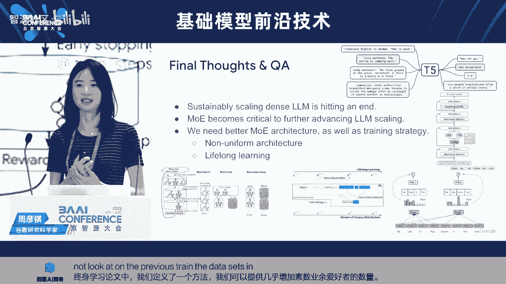

好，那个呃应该我们还有非常多的时间啊，那感谢呃这个呃给我们提供的这个机会。那我们来做一下，要不请请你来点一下。😊。

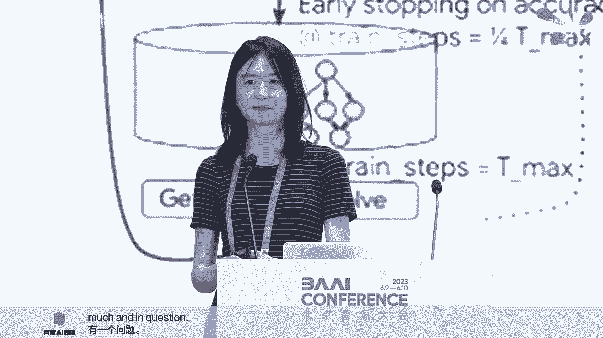

啊，这个同学嗯这个。Yeah。嗯，谢谢。刚刚您听到的那个spaparity，我觉得是非常好的一个事情。然后你刚刚也稍微透露了一句说GPT4，它并不是一个dance model，是真的吗？啊。

就是这个我我也不方便说这个信息源是哪里，但是就是多方信息源就是说明它是一个se的 model。好的，非常感谢。😊，啊，那个女同学。就是那就你那个第二排的女同学。Thanks， Yan Chi。

 for sharing。 I have a question about the computing like the US and China， you know。

 on large language model， because， you know， China has obstacles from the cheap side。

 We don't get in ind a 100 and H 100。 I want to know whether you think like computing wise computing power wise。

 whether China is in a disadvantaged position。 Thank you so much。

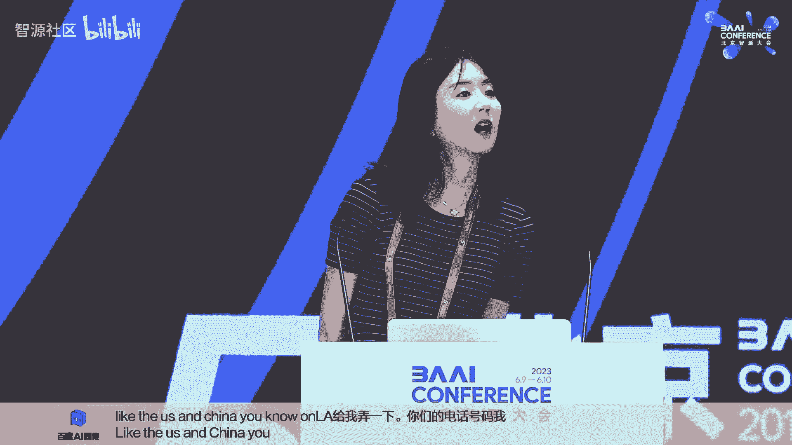

嗯。I， I might not fully get the question。 Can you， Can you repeat the question。I wonder， you know。

 whether yeah， I want to ask about， you know， the computing power side because China is disadvantaged in the chip side。

 like Chinese companies cannot get chips like in100 and H 100 this may be put。

 you know the startups and Chinese companies in bad position when you know。

 developing large language models， which the training is very expensive and require a lot of computing resources。

 I want to know how how do you see this Yeah that is a very great questions。

 So actually we're thinking about whether to start a company in China， right。

 a very big concern for me is whether we could get enough computational resources from China。

 as we know theres like a ban from NV from US government how how many chips we could export to China each year。

 that might be a limitation restriction of how many。

GPUs we could get from in Nvidia。 So that's a big disadvantage for Chinese startup companies。

 But actually， I think that provides us a more incentives to build more like chip companies to actually to be able to compete with companies like Nvidia A M D。

 etca。 that would also requires a bunch a bit more collaboration and between the US and and China。

 So we don't we cannot be very like a。Create such kind of a closeness culture anymore。

 We needed to like exchange the knowledge， information more so that we could have a Chinese owned chip company that could eventually compete with Nvidia and build a very powerful accelerators。

 So that's the fundamental thing we could address。 we should be addressing in the future。

At another maybe short pass my， my thinking is that maybe a short pass for the startup companies is to try to get some resources from the major cloud vendors like Amazon。

 cloud， Google cloud， etc cea。 So recently， I know Google purchased the 26000 H 100。

 So Google doesn't really just use TU。 It also provisions GPU as the option to the yeah， cloud users。

够吗？嗯呃，这个同学那个戴口罩的同学。Okay thanks for a great talk about scaling anity。

 And and you have introduced the different architectures of Russian only models like encode only deco only and encode decoder。

 And then you display the scales of these models。 And I noticed that only deco only model can scale up to like 100 billion scale。

 but other models like the T 5 deco model developed by Google is is not scale up by scale up to 100 billion by Google themselves rather instead instead they they scale up a deco only model to hundreds of billion scale。

 So we we we don't know why this case。 So can you show some insights about why only deco only model can scale up to the large scale。

 Yeah Thank you。 Yeah， that's that's a very。😊，Good question。

 So I think I guess the key point is not the encoded decoder model cannot scale。

 So I still believe that encode decoder model can scale。 but as a matter of fact。

 T use pretrain fine tuning based method， which might not be very suitable for the other players to adopt like for those companies who don't have many。

 many TP G like Microsoft Google， they cannot do a fine tunening on like giant model of 500 billions of parameters。

 So that fundamentally limits how far we could go with T。

 So I guess that's why later we we we actually think really highly of G3 G4。

 where there is no fine tuning stage required。 Well like any reasonable size the company could actually fine tune instruction fine tune their model using the deco only model。

OK哎 thank you。啊，也。啊啊，后面的听不到，要不还是麦克风嗯。嗯。呃，我刚来好，不知道您前面的那个呃讲述里面有没有回答这个问题。就是我想问一下，对于谷歌来讲的话。

未来我们在做多模态这块的话呢，我们的方向和路径哈。因为现在来讲的话，可能大家也呃不太清楚，GB4它的这个多模态的能力哈，到底是说我重新训练了一个一个大模型，还是说我就是在自然语言模型的这个基础上。

我用MOE的方式是吧？然后做一个协同，然后不知道您您这个是怎么看啊。😊，说句实话我也不知道如如果我们知道的话，应该很快就有一个可以这个的模型出来了，对吧？

就是我们也真的不知道这个 four它的这个ec recipe是什么。我们只是说多方的信息知道它就它是一个就不一定是 check但是我也不是十分的确定因为我们目前也有他在做一些一些一个工作。

就是说基于我们已的 check可以 check这工作也是有的但是我们体不楚的是一种方法一下我歌内这两条路是同步进行的？或者块人组还资源分块路线概个设计业不用。😊，啊，这这这这个可能就有点设计机密了。

但是我我觉得就是呃两个方向呃reseer都有都有在进行，就是都有去探索。我们有这样的paper，就是两个方向都有paper嗯，正在进行。好好，谢谢嗯。😊。

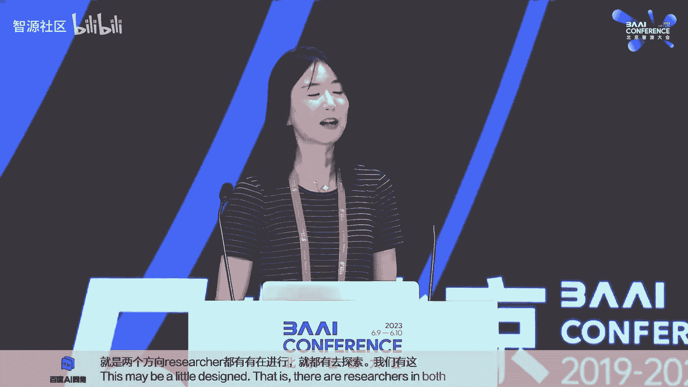

呃。要不你帮我点一个吧，我可能也没有，要不我们给后面的机会吧，最后一排的嗯。啊，好像又是你。Ha。😊，testing testing testing呃呃，我想问一下。

关于你刚才说的MOE那如果我有一个任务是在MOE的几模块里边没有的那对于这个任务，这是OOOD问题吗？它的表现相比于一些dance的的model来说，它有什么优势或者劣势吗？

对我觉得你说的是一个我们目前也正在handle的一个问题。很多同学他会 complainplain说我这个finning完这个ME好像比dance model还差，就是为什么呢？

因为多时候大家在ning候用到的这个数据集train的数据集非大。你可基比基于你想让他的这个ning更加到 human面比的这个 human reinforce数据集。

那么你这个数据集和你的training数据集相差甚远，对吧？你直接做一个ning然后在你一个巨大的模型的参数下面。

那其实是它的之所有都没有见过练数据那么是没有任ulate一个新的所呢你就需要一个新的不是就纯粹的去学怎么去。很有可能学出来的是一个 garbage的一个。

然后这个ext是一个更差的为什么我说ME会更差呢？因为ME它是一个呃 expert上面的ialization就每一个它不是一个是ize一个去。

所以呢你你你一 mapping可能个d modelpart为d model是一个的一个这是我对这个时理解。但但是我们这个这个lifelong learning就是很好的解决了这个问题。

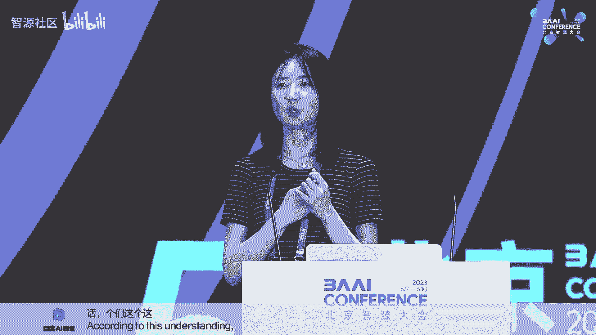

好，那呃我因为我们马上要进入到这个后面的圆桌的环节。那我们先请周女士到到台下来跟大家互动一下。然后我们先请我们工作人员先布置一下啊这个台上的会场那。

那我们要不再请大家再看有什么问题跟周女士来来来来进行交流啊，那我们选一位中间的人士。哎，有有话筒。啊，有有人有话筒到这边吗？没人没人。嗯，好，那边嗯。Yeahな。哎，周女士你好。

就是呃我之前看过您的履历，就是我感觉您是有那个硬件这一块的经验，对吧？应该是接触过硬件的设计，还有che的设计。那我们现在其实除了这个呃哭的这个GPU我们其实还有这个TPU那实际上在美北美地区。

还有其他地区有更多的芯片，那我们现在有一个问题，在我们在T5和更多的模型，我们真正的把模型去到这个超过1万，超过1000的这样的一个呃芯片的或者机器的经验。

其实它跟我们过去在达J叉上看到这种呃基于8台机器优化的NVlink。其实应该是完全不同的一个场景。那在这个场景过程中，你们就是完全的是脱离了这个J叉的这个一些优化的时候，你们再去开发的时候。

你们有会发现你们提出了什么诉求。你们对这个软件，还有芯片有发现有一些什么样的这个新的这个呃。一些想法，我特别关心哈，谢谢O啊，这这是一个非常好的ion。然后我也涉及到了我最近在google的一些工作。

就是MOE codesign with那我们这个在这个上面的研究，它可能总体上来的一个感觉是我们过去的这个芯片设计。

包括GPU和P它都是针对一个gene的这这个verycomp intensive的这些 work做的一个ization那么他对这种你你你有很多很多的这个这种算非常非常高效。

但是在trans这个模型底下这样的硬件设计不一定是最高效的。因为它去over这个 unit它的这个comp power但是呢没有去的这个mication这之ication这就是为什么这个最近的这个H1它主打了一个我对这个。

😊，做了一个优化啊，我我这个模我的这个H100对这个MOE的这种模型是非常非常高效的，比之前的HA one hundred0的要10倍的高效。那么他们之所以能有这样的claim。

是因为他们做了一个非常快的这个 to chip，然后基本上是一个M by end的一个cro的这样的一个这个 to。

那么在我们传统的这个架构里面是不会用到这种 by inter communication。因为它非常非常贵。你们可以想象现在的一块H10的芯片，它卖到了特斯拉一样的一个价钱。

就是我们在几年前可能都不能想象，对不对？😊，对吧那有有没有可能未来一片什么Z hundred者的可能要卖到北京一套房的价格，这这也是有可能的对吧？

所以呃我觉得就是针对这个呃transformer的模型和针针对未来这个呃这个叫什么呃混合专家的这个模型，我觉得会有更多更多的specialize的芯片和系统去对他们做一些优化。😊，好，结束了。OK好。

那我们再次感谢啊周女士给我们带来的精彩的报告，大家鼓掌。😊，好，你可以先休息一下。那嗯你再请。好，那我们接下来就进入到圆桌的环节啊。那我们圆桌的环节的话呢，我们除了现场的三位呃讲者之外。

我们也邀请到了呃这个复旦大学毕业。然后在CMU做博士后，然后现在是回到上海交通大学做啊助理教授的刘鹏飞老师，然后在线连接啊，是不是可以切到他的啊，还有这个你是在海南吗？😀Yeah。😊，哎喂嗯，能接到吗？

可以可以，谢谢刘刘老师。好的好的，那我们现场就有请我们的三位讲者，然后到台上就落座。然后咱们开始我们的圆桌环节。那为了防止大家的呃防止大家的这个谦让，咱们就按照这个讲者顺序。

然后从从啊这个从第二个位置开始啊，我来占第一个位置。😊，好，那大家欢迎三位老师上台。哎，你再说遍。嗯。好呃，我说句实话，我没有提前给他们准备任何的问题啊。所以我我今天问的问题全都是突然袭击啊。

然后呃那为了呃让我们的这个呃讨论更加的有信息量哈。所以我我我会呃就是尽量少的去问几个问题。然后我们把更多的时间留给呃现场的观众，然后来给各位然后进行交流。那呃我不知道大家有没有感受到哈。

就是我们今天的呃这个三位讲者，其实给我们带来的呃这个报告呢，其实是分别代表了啊我们现在来看大模型非常重要的三项前沿的技术哈，然后分别是这个ILHF还有这个多模泰。

然后以及这个呃就是sing up这个model size的这个sparity的这个技术。那我想这个呃今天我们也是远程啊这个请刘鹏飞老师，然后来连线。那我们要不要啊我想把第一个问题。😊。

就给这个刘鹏飞老师，你能不能啊比较快的，然后介绍一下。就是在你来看你认为啊这个大模型啊，你比较关注的最关键的技术是什么？然后以及为什么，然后能不能大概用啊两三分钟左右时间，然后给大家分享一下你的观点。

然后我们再开始这个group的 discussions，好吗？好呃，我声音清楚吗？呃，这这个问题其实我觉得很有可能会呃到个人的一些研究的ex。对我来说，我觉得我觉得最重要的呃。

第一个肯定还是过程中如何把数据进行更的结构问题。其实像我们之前前面老师也说过，像这些工作其实验证了在S阶段很多时候只是在一个form或tyle上或者是这个形式上进行一个学习。

很多很重要的知识像数学推理这些东西大概率还是要放到pre这个阶段的。这个阶段其实像自然语言或者文本语言这些数据到最后还是会被穷尽了。

所以我觉得未来的重要的是不仅是这 data应该重这种 information相当于文本数据就这么多。然后其他模态数据也这么多。如何把它的结构信息也放进去。这样的话你会不会在数据比较穷尽的时候能。

更多数据可以用这个结构可以非常的丰盛。比如是不是之前我们是一个比较简单的一个tex到后可不可以变成一个M或者成一个jason而这个东西对应的另外一个原则就是我一直非坚一个事之以有糟糕的过就因模型在个存储的问题数据的存储。

而pro的是一个数据的读取。而我们就是因为过过度的依赖一些黑盒的模型，我们不知道预训的时候数据是怎么存呢。

才导致我们读取的候用pro去的才尝试各种各样去猜它去存的格式以未来数据进行结构化过程如果越来越透明的话，多问题都会得更加容易。而且型可能这据结问题。我一直得能重点重可能质量。

现在也会有更多的人去尝试研究一些RHF的平替方法。不管是像con learning或者unluck这些东西的引用。但是我觉得呃对如 model能够到怎么样高的一个质量应该是重要。

在我看是最的更都是最终的形态，可能最后应变成一个生成的的形式，还有很多的好处而这种模式可能是让我们以把 model skill可以加上去的一个东西比的型我看比小如果是更大的模型那时可能就不是一个事情总之 model应该有很多我觉得比较这种ecre一些东西探究也是我目前比较感兴要这块好的鹏飞我接下来就进入到第第二个问题啊。

希望每一位这个嘉宾都能回答其实我觉得今我们在邀请讲者。的时候其实还是考虑到了大家的这个背景的差异啊，其实大家可以看到我们的四位嘉宾啊，其实他们分别来自四个不同的背景。然后包括来自创业公司来自这个研究所。

然后来自高校，还有来自于啊我们传说中的这个大厂。那其实呃我们可以看到啊就是这个大模型，其实是对呃整个这个行业啊，所有的这个学科的这么一次非常大的浪潮啊。

所有人不管是主动的被动的都要去啊进入到这个浪潮之中。那么呃我就希望啊每一位呃这个嘉宾能不能从你自己的这个呃背景，呃，也就是说你是创业公司，然后你是研究所，然后你是这个大厂，还有就是啊这个高校。

那么呃你你感你感觉就是从你的角度啊，从你的这个背景，然后你从事这个大模型的研究或者是创新的应用。然后呃这个你你能够。呃，认为发挥的这个优势，然后可能存在的一些短板，然后以及未来。

然后呃你从事这个啊你从这个角度去进行切入。然后你觉得应该走的路径啊，可能是什么？因为我相信在座的所有的呃这个听观众，然后包括在线的同志们应该呃很大程度上是分布在这几个方面啊，除了那些投资人之外，对吗？

啊，所以呃还是想听一下我们每一位啊这个嘉宾，然后你既然选择了现在的这个呃这么一个背景，那么啊你你认为你你应该怎么能够更好的在这么一个呃这个角切入的角度，然后来发挥你的优势啊。

我想呃可能会对呃在座的所有的观众可能会比较的呃能有一些收益哈。那要不先请银行开始啊。好，谢谢啊，我想从我的两段经历来讲述我对这个大模型的一个态度。

第一段经历呢是我当时在facebook AI research那个时候呢是啊19。年和20年初那个时候嗯刚开始的时候先是谷歌出现个bot，这是鼻祖，这是呃很久很久的第一代大模型。

后来呢我们facebook呃团队做做出了，后面又做出t，后面还有一个inggo的t啊，这是我参与的的三个pro啊，对于这三，但是后面我后面很明显啊，就后面啊facebook又出现了OPT。

后面直到现在最新的啊拉马呃相比较而言，就在我在facebook的那个时代啊，所有的leadership所有的领导层都对大语言模型非常感兴趣，主打一个字就是大因为首先research是不计成本的啊。

多少钱都没有关系，没有一个budge尤其fire这种专注于open source它其实我们可以看到啊facebook真正运用成呃大语言模型商业化，其实几乎没有做。啊。

相反op openen eye并不open，他们其实是真正把大语言模型商业化啊谷谷歌在逐渐的闭环。所以呢facebook的理念一直就是不计成本。啊，我想知道大语言到底能做到什么样。

所以当时呢我们就是大元模型，在19年和20年的时候就已经在就在research行业，就是大家就不停的在讨论sing up ，sing up，sing up。但是呢后来我开始了我开始做个star up。

我的观念就有很大的改变。我觉得首先要理性的去看待这个大语言模型。尤其呢我们是专注一个非常小的segment，就是health care。我们只做housealth care。

我们所有的customer都是housealth care。那其实我们我们的使用者很多都是啊cardiologist啊，像这种年薪非常高的医生，他不需要了解怎么去处理一个啊ATNT的考。

他不需要去处理怎么去帮助用户重新去定一个啊f去改一个 hoteltel，他不需要关心这些，他只需要关心这个cardiologist，他这个用户的心脏心脏图EKG。是怎样的一个情况？

然后这个用户下一次的呃治疗方案是什么？用药方案是什么？所以呢一个通用大语言模型其实在一个呃垂直的领域，在一个啊像我们这种star up的领域其实是没有必要的。所以这是第一点，第二点呢。

专业性反而是很有必要。第二点呢就是一个实际的应用。那比如说我们一天其实要handle8 million的。那如果用一个大语言模型的话，那其实这个traic非常大。这个的整个成本非常的高。

因为而且像我刚才呃有讲到的，我们是实时的，我们必须要在几秒钟内完成scription就是ASR的一个scribe。然后呢通过大语言模型实时呃输出。

然后呢human group然后这些cardiologist去读这个大语言模型读到东西，然后进行修改提交最finalize所以这些其实需要在一秒到。两秒钟完全完成。

所以大言模型几乎不可能在如今在在现在这个情况，而且还要考虑成本，我们不能用A100去做inference。我们不能用A100去做啊product因为太了。

其实我们product只用T4这的小的GPU完成。所以说大语言模型它很酷很性感。但是呢在实际的应用中，尤其在starup在这种真正handle traffic这种s up的情况下呢。

其实它没有那么的实用。相比较而言，一个中等型号的，然后一个更专注的模型其实更有价值，更有实用价值。当然我现在所代表的观点只能到今天2023年可能在接下来的几年内恩伟达在不停的啊出现新高。

不停的inpri我们A100的价格可能只像像T4的价格一样。那后面的日后面的情况呢就很难预计。但是如今的情况呢，大语言模型在实际的production中啊没有那么。xi。好。

谢谢印行带来来自这个既有大厂的。然后也有这个star的这个经验。那刘晶老师看关于研究院做些什么谢谢我是代表这个学界，就来自研究所和高校的这种代表。我觉得其实作为一个研究单位。

无论做科研还是高校我们是科研的使命，就是要去做这种创新有用的研究。那我相信我们做大模型也是这样觉我们就要去做创新引领，也要去做有用，能能踏实服务于应用的研究。那从创新上来讲。

我觉得我们的优势就是我们有源源不断的这种学生而且大家的长我们会有一个对学生的培养是一个长期的培养。不像企业去做事情的时候，他可以去他可能需要一年见效两年见效，可能我们对学生的规划。

可能是希望你两三5年去瞄准一个问题，然后去来解决这个问题，所以我觉得我们可能就是学生的资源，以及我们整个我们的这个目标的规划，我们可以我们可以更限定一个稍微长远的目标，我们可以。😊。

有一个稳定的这样的一个不断创新的这样的研究力量的补充。所以可以这就需要我们去选择。那作为这个研就就于像我们作为这种就是我们更重要的是要有一个非常好的眼光去来做一个真正能做到创新引领的方向。

能够去呃呃让这帮研究力量更好的去发挥，不断的去引领这个呃这个领域的发展。比如说在大模型里面，其实我觉得有很多方面还是值得去探讨的对吧？比如说我们可以去做更强的这种自监督学习算法。

我们可以去做更好的这种数据清洗，我们可以去做怎么去用小模型去来解决大模型的能力，对吧？大家现在去做这种怎么把大模型的针给小模型，怎么通过小模型的协同，去实现大模型的能力。

就是主就是就说我们怎么去发挥我们的优势来呃这个来来不断的引领这个前沿。但我觉得我们的劣势可能就真在于说大模型最需要的这种大算力，大数据，可能都是我们有所欠缺的那这块我们怎么去补齐这个劣势。😊。

那我觉得可能我们我们就要去去去跟企业去做合作，对吧？我们去我们的优势来补可能我们的优势刚好可能是企业的呃一部分的劣势啊。因为其实他们可能确实要短期见效，所以我们可能在前沿前沿已经得到一些成果。

可以投入到他们的应用中可以去赋能他们，所以我觉得怎么去跟跟企业去做更好的合作，然后去实现这种优势的互补。可能我觉得是作为学界就是作为我们创新这块更重要的那做有用的。

就是我们要选择的方向肯定就要有用的对吧？就像我刚才说的，就是大数据大模型这条路径还没有看到镜头往后走大厂肯定是要瞄着这个目标去走的，要去做更多的数据要做更大的模型，那这显然不是我们学界的优势。

那我们去瞄准什么方向。我们想的就是说怎么用小而小的高质量的数据，然后怎么用小的模型去去获得对吧？这种大模型相当的这种能力，可能是这样才能然后更好的服务于应用。然后真正到落。😊，地端能够有这样一些技术。

使得大模型更好的落地，这去做有用的可能这是我们去去可以去做的那另外一块，我觉得AI for science现在应该也是大模型做的比较小，大家比较关注的那这个可能也是更适合学界来做的事情。

比如现在我们其实也在探讨说去跟生命啊，去跟去跟脑科学啊去做一些这种探索性的研究。我觉得这些I for science的这种研究，可能也是比较适合科研单位来去来去探讨的。嗯，好，谢谢好。

谢谢刘老师带带来来自于这个研究所的这个呃这么一些思考。那接下来请那个燕奇，然后带来来自大厂的这个这个思考。好，那我可能就是分享一下我在google这么些天。

然后经历了这个插GBT这么一波热点这的这个几个月的一些主观感受吧。就是可能外界有一种impression觉得啊google这个落后了，落后了，就要挨打了这个openI就是将会成为未来的google。😊。

那我个人呢我是一个就是做系统背景的这样的一个reer，对吧？我最近的可能56年在做人工智能方向的一些科研。

那我的感受就是说呢我并没有觉得我一分钟都没有觉得google哪里落后了这个 openen aI对不对？我觉得google它关注的是更长期的一个问题。

它是关注的是更能sustainably去用使用 language model更去使用 language model对吧？

去解决去进去干预性的解决一些啊这个 language model里面存在的一些问题，就比如说它是一个autoregressivegenative的一个model。他会在每一个token生成的时候。

他都有一定的概率出错，对吧？那么作为一个我们做in信息in其家的这样一个公司我们有责任说提供给用户的这个数据是sa的是这个没有 hallucination的是是是标准的是安全的是factual的。

所以我们就是干预性的尽早的去解决去试图解决这个问题。还有一个问题呢是。😊，比这个google的体量和openI的体量。

gogle是8 billion的这个DA open是one billion的1个U对吧？目前啊目前也没有说涨到10个 billion。

所以我的感觉是with difference volume difference我们尽早的太过早的操起了我怎么把这个 language model到产品里面去能在google的体量上面去服务我们gle的用户可能我们尽早的想诸如此类系列的问题。

以至于我们没有花精力去release个一个爆款，所以我从我个人的这体验来得我觉得google它的它有一个非gle有一个很的世界上我不知道跟是不是世界上最大的但是ogle世界上可以说是最大的这个gogle cloud的这P。

😊，储备和GPU的储备都是非常非常的大。然后呢我们有这个战略s的战略就是从我们这个做gogle search的这个这个体验上来讲，对吧？

如果你现在用ogle search个它的基本上延时是在0几个微秒以内的？以说你基本感受不到这里面有一个延时但是的用一个生成模型一个今天要飞旧金应该哪趟飞机给你生成秒觉得是没有一个用户是以ency而且我也个人感觉在未来的几个月几年以内。

我们没有办法把这个 language modelencygle search是我的一个个个主观的一个体验然后呢我确实是一个是gle做了我们超大规模的能够py的这种体量的用。😊。

我觉得这这个在系统层面层面上面，在软件层面上面，我们没有去依赖像英伟达这样的supercomputer。我们用一些非常便宜的机器，然后做到了这么大的scale的一个serving。

而且是for free，对不对？所以我觉得google是一个呃google应该说是一个世界上最为大大的公司，没有之一。然后我不觉得openI在未来几年内能够超过google，好吧。😡，我在这想插一句啊。

我真的是对google这个企业文化刮目相看，他能培养出这么优秀的员工，对有这么强烈的自豪感。因为我家属也在google工作，然后我没有感受到那点。但是今天我在这个舞台上强烈的感受到了这一点。

google真的是一个伟大的公司。😊，对，能感受到这个战略数力啊。好，那要不那个鹏飞作为新进的教授，然后讲讲你在高校的感受啊。好好，尤其是刚过来刚回国组队我觉得其实还是有很多想法的。

尤其在新的人深市人工智能这一我觉得主要是几一点，一个就是我觉得自己要承担起能作为学者的一些一些责任。对我来说第一点可能就是尝试去揭示出一些没有被说出来的秘密。

尤在整个技术战过程中就类似于就open open如果的open的话，能不能帮助他得更加open一些事情。你比说像各种的各种的或者或者是H到底他们不同技术细节中所演的重要性。

就这件事其实都可以耐耐心的去琢磨的可能未必是愿意花太多时间去去去研究的学术界实就可以很多时间在这方面进行一些反思去个。😊，比较正确的路，这第一点就接触出一些没有被说出来的秘密。第二点我觉得就是学术界。

包括我自己非常感兴趣，就是相当于梳理一下呃各方发展的一些战场。这各方其实包含了学术界包含了工业界包含了啊VC我自其实在VC在包括那个就这几方面能不能啊高效的人相当于站出来去去梳理一下。

然后每个人应该承担了怎样的角色，告诉这个领域，像大家各司其职，把这个领整体做的更好。这第二点，第三点我觉得就是相当于从学术上面来看，可以呃帮助整个领域去找到一些科学进步的方向。

因为我之前觉得好像科学只要只要大家一直往前走，学术论文一直往前发，就一定是对的，最可能会发现有些东西其实是走的是错的。有可能这个错误会一年或两年。但是如果有个比较好的方式，你愿意或敢说。

然后这个东西可能会有些不一样的观点，也许经过几几轮的Q就产生一种更加准确一个方向。这个东西最明显就体现在评估的方式。可能我们在做大模型评估的时候，到底怎样是一个可靠的啊比较公正的这样一个评估。

能帮助我们找到真正的准确的找到模型的优点和缺点。这个其实对未来大模型真实的发展方向，有利的发展方向，就避免走弯路还是非常有价值。学术界在做这件事情可靠安全都会有比较大的优势。

那最后一点我觉得学术界应该承担责任，就是培养学生啊深圳是人工智能这一波，其实这个人才确实是很大的。我觉得更其实我自己的感受其实并不需要真的有非常天赋异禀的学生去做这件事情。

更重要是他们知道怎样的一个一个一个一个一个一个成长路径。其实作为se的个reer或者是profe其实有义务把这个东西告诉他们带他们一起往前。大概这感受好，谢谢鹏飞，那我们第一轮问题已经结束啊。

那我接下来进入到第二轮问题。这一轮问题问完了，咱们就开放交流啊。那个希望咱们各位都尽量简短，就两句话就可以。回答呃呃，第一个就是希望你能给大家讲一讲，你现在在这个大模型的这个行业里面呃。

每天最让你天天在想的一个问题是什么？就到底是大模型的一个什么问题在困扰着你啊，你需要找出一个技术方案，也就是说你现在在在在关心的这个技术的一个难题是什么？

然后我相信这个问题应该是大家啊可能是一个非常好的一个啊研究或者是创新的这么一个选题。那这是第一个。第二个是说啊如果给你足够多的预算啊，就是没有没有什么限制。

那你认为啊这个大模型未来你希望去突破它在哪个方面的啊这么一个特别大的想象空间啊，就是你觉得比如说5年以后十0年以后，然后我们通过做什么事情，然后可以啊可以做到一个啊你觉得特别理想的一个状态。

就是有一个什么东西是你特别来想想做的，就是一个是特别短期的，一个是特别。长期的我想是不是每一位可以share一下啊，你的这个想法，应该呃应该肯定我我相信每一位应该都在平时考虑过啊这个问题啊。

那我我相信在座的也应该都想听一下大家的想法要不还是从你还开始，我想第一个问题的答案就是我最想要的就是一个非常高质量的数据集啊，数据永远是远远大于architecture的。对于我们来讲啊。

我当然我在做research的时候，数据也是远远大于architect的那条永远是第一位的ect的话transformer啊或者是加上其他的一些training tricks。

其实它的结果的impro是是微调，甚至微微调。那第二个问题呢，我觉得我在我讲的时候有有提到过，我觉得大语言模型应该做成一个生态，而不是仅仅一个point solution就是它始于文字。

但是最后要超出文字啊，比如说。我在今天的会议里提到一些东西，然后呢，他除了记录之下这个会议之后，他会有所有的action item全部一键到达。

那比如说啊我提到我今天的对话里也有提到啊我需要更高质量的数据集。那大语言模型住了我这个需求。那在日常当中我需要这个东西或者是啊他在我的日常生活中发现哎这个可以是高原的啊高质量数据集的时候。

他会自动帮我col这些in，然后发送给我，然后让我进行下一步。所以他就是像一个贴身小秘书一样啊，24小时工作啊，不间断C叫C到，而且非常聪明。好，谢谢啊，这个非常有想象。😊。

我我觉得我短期想做的就是真的想把图文音的。比如说多模态的对话能做到像大家像拆的GPT这种感受。如果大家能够去图文音，然后来去做自如的对话，来去做这种各种多模态能力的感受。那如果说长远来看。

那我真的是希望有一天真的一个机器人，他能用他的眼睛看，能用他的耳朵去听，然后能用他的手和脚去走去去触摸世界，能去跟我交互交流。谢谢。😊，啊。

可能我更想做的一件事情是说在这个啊大公司的体量上面去更好的去servve large language model，然后用到一些呃conditional computation的一个方法。

可能我想做的是一个超级大的一个分布式系统，然能够有效去 model把这个降到和google search差不多一样的个。

就是我可能长短期想做的一个东西长期我很想明白的一个问题是就是为什么现在咱们这个gen是一个auregress我不是做算法的专家，对吧？但是我很想理解这个问题。

为什么我们不能in parallel去这个东西如果说我们未来有了更强的这个力我们有了这个量子计算机gle在做这个量子计算如有了量子计算机能不能 parallel去生成我们的这个t和种种好，这个好像是。

😊，是科幻小说里面有过这样的一个设定啊。好，那鹏飞。好，比说短期其实每天都在考虑的问题就是非常简单，就是如何把数学解题做的像OI啊GD4一样好，或者是甚至更好啊，到底是什么ecre什么样的一个re去做。

然后如果给我另外一个问题，如果给我1000张卡或者是1万张卡了，我非常想做的事情就是自己走一遍把自己对数据的理解方式应该处理的方式走一遍。呃，觉得会更好。😊，完了。

那你的这个长远目标好像有点好像很快可以实现是吧？好，那个呃其实大家应该能感受到我们四位嘉宾，他的短期目标和长期目标感受上，其实跟他们现在的经历，其实都都会非常非常的匹配啊。

所以其实我觉得呃在座的所有的观众，然后其实都呃都在呃都在参与，或者是将要参与大模型的呃这个呃这么一个工作。那那么我们会认为哈大模型应该是未来人工智能的呃这么一个必然的这么一个技术路径。

所以其实你今天的决定其实是决定了你未来的这个你的路径啊，所以其实还是希望大家能够积极的去拥抱这个时代。那我就完成了我的使命了，就我去呃通过两个问题做了一下预热。那我们接下来就把这个呃我们的呃提问。

然后交给我们现场的观众，然后呃我们要不要那个呃好像。😊，我们找一位呃请这个已经提问过的，就把手放下，让我们看看没有提问的同学，然后可以呃要不站着的那位同学。站着的那位。呃，那个请所有的提问的呃。

同学都呃，都告都明确说一下，你是希望所有的嘉宾回答，还是你希望指定一位嘉宾来回答。我问一下刘老师，就是刘老师觉得就是那种机位两位。啊，两位呃中中间中间中间刘刘静老师嗯，对。

就是刘老师觉得那个机器人就是我们啊我们能像就是像猜的G地猜猜的GPT那样，就是机器人就是呃我们让他干什么，他就干什么，就是我们比如说猜的GPT，我们问他一个问题，他就能回答。但机器人我们如果给他说。

你去给我端一个水杯，他是不行的。就是我们要想完成这么一个功能，就是难点在哪里。😊，这里面就要打通很多要打通感知到决策，就是首先他得能看到水杯，然后能定位到水杯，然后他的手在能去执行这个任务。

那其实现在我觉得就现在大家做拖用大模型多模胎。其实还是我被动的提交一个图片，提交一个文本。其实这个他和我们真正智能体看到的到不一样。

人在环境中就是我我们会结合我们看到的听到了然后来去提问题来执行在当前环境下的东西，所以我觉得可能首先的一个变化，就是我的感知信息感知信息源变成了第一视角的吧？我已经是智能体自身的这样一个多模胎的融合。

然后这是感知层，就我相当于拿杯子的我要知道前面哪里有水杯具体的位置是定位之其实我就要去指挥我的手来执行这个动作，那其实这里面那去执行这就相当于是要到决策层对？要要道状态该怎么去付。

那另外还有在这个过程中还有一个问题，可能万一这个他不知道什么是杯子对？他不知道杯子在哪里这个时候他其实又需要去有。😊，一个交互的过程，比如说他可以去问，对吧？就像我们的问答一样。

就是可能他不知道杯子的时候，他可以去问你杯子旁边有什么，这个杯子是什么颜色的，他可以去问各种各样的问题，然后来帮助他更好的理解，更好的定位。所以我觉得这个里面其实要真的要把做到机器人上，机器人像人一样。

我觉得其实很多东西还是要去还要很多东西去做。但是其实范式上有多么还要感现在也有感知大模型，也有决策大模型，只是真正感知角策现没有完全打通。但其实现在我觉得路线上是大家是通的。

只是现在还没有大家没有做出一个特别好的这样的东西出来。但我觉得未来肯定会很多人往这个方向去走。😊，可以写的，谢谢老师。嗯。hello好，下一个嗯呃，我算是那个刘志远老师在清华的师弟啊，我就不问刘老师。

我我毕业之后呢，先在中科院做科研，然后你问谁，你问哪位？😊，呃，我分分别问三位三个问题。OK呃，你因为我先是在中科院做科研，然后我也高批入职做大厂，然后我也自主创作业。

所以我要分别问三位可能有点挑战的问题吧。先从右到左吧。呃，先是大厂的同学。😊，我在美国的师兄baavid way，他当时很很早就facebook就 met VP了，对吧？他一度也很执着。

但是最近两个月他告诉我，他也离职创业了。所以我想问右边的同学有什么样的机会会促使你离开google去创业？😊，对你你可以思考一下。然后问中间的这一位呃，就是我当时离开中科院，很重要一个原因。

就是张洪江老师当时跟我花一个上午跟我聊过，他极地劝我从中科院出来跟他创业。他说，如果你在体制内呆久了，我都不敢用你了。所以我当时才决定离开中科院。😊，然后来创业的同学呃。

我我觉得吧就是虽然我们创业都是AI大数据的公司，看起来很高大上，但是在。😊，甲方面前我们其实都很卑微，对吧？那么。😊，你是用怎样的心态来应对你的？甲方？尤其是中间那位同学。

他说到他可能希望呃去赋能一下我们工业界，对吧？你觉得你会有机会被赋能吗？谢谢。😊，所以你冷落了我们的鹏飞老师是吧？😊，谢谢嗯。😊，我先吗啊是什么契机会让我决定去创业啊。

就是就是n to be honest我在google的时候有有几个非常frus的，就是每当我觉得很不顺利的时候，我就会想哎呀，我还是自己出去开个公司吧。

后来呢我就是经过好几次这样的一个思考可能有时候会说真正遇到困难的时候，我会反问我自己就说你现在遇到了这个困难。你在google这么好的环境里面都没有办法解决这个困难，对吧？你凭什么说你能在一个创业公司。

在那么lim这下面你可以去解决更好的去解决问题，更好的去发挥你的这个才能，就我觉得这个是可能就是让我一直在这个大厂ush我这个现这么做做这个方向的这个原因，然后我觉得呢未来如说要需要创业的话。

我觉得大的原因可能是我在gle可能觉得有有一件我特别想做的事情。但是在我做不成只能在创业公司能够做成。😊，啊，这个事情可能就是说也许是buil一个像GPT一样的这种爆款的产品。

这个我觉得可能在短期以内就是以我个人的力量在google是很难deli的。所以可能如果我心之所念，就是想的产品。那我会很快选择离开google去做的产品。

但是呢因为我个人本的re是comp system这个面就我觉得google它是一个很好的能够发展我才能的这样一个地方，就目前为止。

我没有觉得它gogle它局限了我做rese所以我觉得目前为止我还O但是未来说不定可能我觉得我我想出去buil一个更好的computer或什么的那我觉得有可能会出去创业迎你联系我。😊，好，那刘老师。

我来说一下，我觉得其实研究所对有很多人出去创业啊，当然有很多人一直在坚守自己的科研岗位。我觉得首先就是你做的这个事情，就是我觉得要坚持自己想做的事情。

而且可能这个东西本身也确实是有有一些动态的这种这种特性。有的时候就是我我是觉得可能有的人适合创业，有的人适合做科研。当然有的人在他做科研的路上发现他的东西越来越啊越来越能赋能越来越能落地的时候。

可能这个时候他实际到了也可以去创业。但我觉得这个可能确实根据每个人不同的特性去来做吧。我觉得大模型这个事情就是比如说我们现在在做的。我们从一开始就业内在做大模型，大家都在做语言大模型的时候。

其实我们在做多么太大模型，到现在我们也不觉得我们的多么太大比企业做的差。就我觉得我们现在在很多视视频理解的任务上，其实我们我觉得我们做的一点也不差，然后后来在未来再说我就刚说未来如果要去做机器人的话。

那我觉得像这种前沿的东西大厂可能就是可能企业他不一定去投资去做这个事情。😊，但是我们作为如果做K单，我可以去大胆的去做这件事情。就所以我觉得可能每个人都有自己适合的路，在不同的时期都有自己适合的路。嗯。

谢谢，谢谢你好，意涵。😊，呃，他的问题是怎么服务甲方是？甲方心态以及你是否觉得需要被写受界付呢？那我用啊九个字来形容吧，卑微呃呃，不是9个字，1二个字，可能卑微到尘埃，有求必用，随觉随到。

呃好共勉共勉好，那个我们因为可能还有不到半个小时的时间啊，然后我们为了能够更加增进交流，那接下来还是请我们所有的问题尽可能的简短，所有的回答，尽可能的简洁。那那请我们的那个工作人员找呃这个选一位啊。

行吧。呃，感谢各位老师的分享。我想问一下刘鹏飞老师怎么看待呃带语言模型做reasoning这件事情。因为看到很多呃学术界研究，包括工业界都在尝试用拉 language model做。

尤其是做mathematic reasoning这种事情。当然也有一些研究反对者说语言模型就不应该做数学题这种事情。我们可以用调用to就是工具呃，hing gPT这种方式。呃。

想问一下老师怎么看待呃拉 language model做reaing这这个事情，谢谢。😊，啊，你好很好的提问。其实我觉得这个问题，大家心中可能都会有一些答案。

确实你说的两种方式或者更多种方式都会反复被被被提及。我觉得终极的我自己的觉得一个终结答案可能就是大大于训练语型做matic基本盘。

然赋能其他的工具一个不管是外挂还还是插件还是工具其实也是必要的不可能会缺少的。所以一个比好的事情我开始来做的话可能先去梳理一下所有的matic到底是有哪些类型不同类型你觉得最合适的解方式是什么？

前两天那个ogle放出来的。他们说相当于给了那个一个一个可以调用外部工具的机会的时候，他们整体的解数学的性能能提30%相当于这个东西最终gle也会把它放个事情去做所以其实调用工具还是还是用用大训练去最应该是都需要做。

😊，只是最前者反倒更难。只是调用工具的话，无非就是把这东西转化成一个啊如何更好使用工具，然后如何更好生成code的东西的时候。可是当你有个非常复杂的一个问题，有多步推理。

然后转化成一个形式化数学问题的时候，这个是靠的就是大于言语言模型。嗯，有些东西是个编程语些东西就要靠那个那个rason那个券，就需要大于文型来生产。总之啊比较理解好这不同的数学场景。

然后呃分析好到底是更适合用什么去解决，然后用大玉片模型去或者是工具选择更更适更适合的场景。然后再做比较好的切换，我觉得应该就是最最终的归宿了，就是不要否定任何一个。

然后那个但但是我担心预片有模型可能是更靠前的一个对。呃，谢谢谢谢。好，那请我们工作人员尽快的帮着找一位这个提问者嗯。😊，啊想问一下那个周艳琪老师在google训练大模型的过程中。

克服模型的ucination啊，就有什么很好的pracice。如果有涉密的话，对吧？也可以介绍一下业界里面要设计什么样的数据集可以很好的克服模型的ucination谢我觉得可以借助大的语言模型去一个一个mod对吧？

就比如说那个最近的re它是做了一个RLI吧用了一个更大的的个语言模型。 tune这个语模型去做一些class就比如说让这个更大的模型去判断这个小模型生成的数据是不是是不是有 hallination就是他可以用这个大语模型去做一个标注的这样的一个事情。

然后还有一个呢我是觉得可以结合gle search或ing的这种办法，就是你每。😊，成的一个东西，你都生成一个索引，就是一个tation。你这个你这个东西的源头来自于哪，对吧？

然后你你如果有了一个很好的源头，你就可以这个user就可以check，我的这个生成是基于这一段文字后我去查这一段文，后看这段文字不能够值得信赖。

后有有有没有就是如是一个很很的一个一个ublish我可能就源头就是我觉得一个比的一个是一个classification的一个model可能这个classification model是基于更大的模型更power的型。

后还有是可基于 search种这种mod。好，下一个问题。几位老师好，我现在是目前在工业界，然后用大语言模型解决我我们一些业务问题。现在遇到一个比较大的问题，就是呃我现在大语言模型的话。

基本上它的那个序列长度基本上都是2000或者4000左右。比如说要处理更长的文本的话，几位老师有没有一些比较好的一些方向和建议，谢谢。😊，看哪位老师能回答这个问题。啊，我们有用sidingwin。

我用sling windowdow在不同的window里做generation，然后再ag整个呃出来的东西，再做一次generation，就是不同的window之间差异会大吗？就是会。呃。

你要保证你的training data要额爱好，就是说你training data如果只有前半端，你做个的话，那你吹出来的model结果就会差很多。那如果你training data本身就有中间端。

有后面端，有前面端，然后它是AI好的，在标注的时候，那它吹出来的结果就会呃质量高很多。啊，谢谢。好，周老师有。你有有有有我可以我可以分享一下这个经验啊。

因为现在这个呃GP four已经把这个sequence lens卷到了32K的这个s lens这个是非常就是的。然后google肯定也要做类似的这种工作。然我大家都知道这个我们当个更了之后。

他的这个算的最大的瓶颈是at是那么理所当然的我们应该用更的个at去取代这个 attention后我们如果大家读了那个早期的那个他用了一个就是他有一个 attention就他用了一个 attention方法就是和我之前提的方法有一点类似。

然后呢我觉得大概率他们就用了这个 attention机制，这是我的一个个人的推测然后呢我们现在也是。😊，在做一些相关的工作。

就是further scale这个ten layer to over100 k sequence lens这种工作。对好好，下一我有个问题问一下那个周女士老师。

然后那个我们就知道那个大模型也是现在有出现很多幻觉。那这个MOE的这个模型，他有没有对这个知识啊，他有没有更显示的这种存储啊，或者说用MOE有没有更好的方法来解决这个幻觉的问题。

我我觉得可能就是有一个可以做的方向，可能是说我create了一个就是更safe的这样的一个expert。然后呢。

这个expert它可以基于这个呃我有一个个一个 check它可能基于这种AIed的这种classifier。然后呢去对这个呃这个专家模型去做一个。然后呢这个专家模型它可以说我非常非常精准。但是呢我很。

我能保证我说话是99。9999999 accurate。但是呢我我说的话很，你们要不要选我就是我觉得可以一个非常 corner的 case就是create这样的一个非常fual的 expert。😊。

但是他说话说的话不是非常creative，就是我觉得这是一个短期内可以做的一个东西，用MOE做的东西。好。哎，那个我想请教一下飞老师，就是关于那个模型推理这块就是呃模型推理和数学计算。

我们在实际优化的时候，可能先去要把模型推理这个呃逻辑关系要去理清楚，然后再去做下一步的数学计算。那实际我们在，如果说是在一个小模型上去做一些这种优化。因为拆T或者说是内一些大模型的话。

其实在这方面表现都不是特别的好。所以这个地方如果说是用小模型做一些优化的这种方向的选择的时候，数据集。第一个是我们怎么样去构建一个数据集。第二个针对这个数据集的话。

我们怎么样去做一个比较sor一个评估吧。然后第三个是针对这个小模型的优化。因为阶段的话，其实成本比较高针对小模型的这种优化的思路是不是可以合理的到我们在这大模型的这个阶段。

O其实我我首先首先先先分享一个观点，就是我觉得做这种复杂推理觉得呃一定不只是S某一个单独阶段的事情是一个非常全甚至加后面影响能包的选择先不说大小模型这些大模型可能如果做的比较好的话，也有这几个阶段。

至少基本的推理的一些概念。比如像最公约数这些是么意思都不道的话，根本理构造关的料可以到的。放进。然再说我觉得还没有一个重的事情能构造的就是就是这种东西其实模永远。😊。

根据历史信息到下一个词数学这种东西怎么可能呃就是那么简单的就可以预测呢？以对于数学或者多步推理这个东西一定要把中间的推理步都给展开。

永远不支是不只是一个Q和展适得不管模型还模型够构造质量然后转很舒服的去下一个的测就很舒的去抓它的ence个重要的事情。这个过概放阶根你想去做的不同的场景，然后去设计出你想解的就当就。忽略多步推理要。😊。

是这样，当这个东西做好之后，我觉得再考虑啊小模型小小模型如果你有比较好大模型之后，大家可以直接进行knowledge的一些一些，但也可以尝试着在一个至少我之前尝试的一些经验，就是很小的模型。

包括13B或30B以内的。如果直接去做啊会比较难的获得一个非常好的性能。我觉得我自己非常尝想尝试能不能在一个比较大的模型上，先把它啊正常的技术路线给export出来，然后再往小的去走。对。嗯，好。

谢谢好，下一个问题。各位老师好呃，请我们工作人员呃，这个把这个话筒尽量的这个各位老师好，我有两个问题想问一下，就是第一个问题就是呃问全体老师的，就是我们现在所已知的大模型啊，基本上都是被动响应式的。

比如说你问一个问题，他给一个答案。那么未来他有没有可能变成主动式的。比如说针对一个具体的任务，然后他可以一步一步引导我们去搞定这个问题。然后第二个问题是想问一下创业界的这个印涵女士。

就是对于一个特定行业而言，我们呃如何去也收集一个高质量的这个数据群呢？呃，我两个问题一起答吧，先答第二个问题呃，用户data其实是用户create data是最高质量的data。

尤其企业用户cate的 data是是非常高质量的data，因为我们个人用户来讲，我们可以很随意的去做一些事情。但企业用户他们他们的用户他们是被企业发放工资所以有配就mo。

有 motivation就是qu啊，这是第二个问题。第一个问题是什么能重复一下，第一个问题就是我们现在的模型基本上都是被动响应式的嘛？就是你问一个问题他答一个答案。

那么未来我们有没有可能把这个模型调成主动引导型的。比如说针对一个具体的任务而言，他可以引导你一步一步的去搞定这个问题啊，这这是一个非常好的创业方案，我觉得呃如果能把它真正bu成产品。

当然我觉得ro map还是挺清晰的那他非常非常的attract这。如果我有钱，我会投这个想法。好，谢谢用户粘性会很高。嗯，好，下一个问题。哎喂，我我我这边有个有个问题就问一下那个印涵女士啊。

就是就是你在哪个位置在在在能在这O，就是我们在现在做 to的我们可以认为的那个算法服务对吧？不管我们用大模型还是怎么样的就是我们你你现在我们现在dever这个模型的时候是啊客户定制的嘛啊。

这是第一个问题。第二个事情是我们的交付成本这样Y如何因为做算法交付，尤其是做就是他不是所见即所得嘛，对吧？所以这里面我不知道现在我们在这个交付上面啊，有没有遇到一些就是成本怎么样啊。

然后第三个事情就是从你刚开始创业到现在就是模型已经发生了一些变化，尤其是这样的一些技术的出来那这些这样的一些产品啊，如果我们。😊，拥有这样的一个一个一个一个我们直接接GT four的话。

是否能够降低你的那个交付成本啊。第第四个事情就是啊我们用大模型去做那个公平起见，你能不能不用问那么多问题。好的，好，三个问题，谢谢啊，那我尽量一起回答吧。

第一个就是用户呢呃企业用户是一定要有自己的模型的。而且很多时候很多时候企业用户需要自己的模型存在自己的infer上，因为这是一个安全性能问题。因为企业用户可能把他的。数据发给你。

然后让你去服务其他的数其他的客户，他的竞争对手。那比如说啊世界最大的呃 medicalical device公司是我们现在的客户。在我们签协议的第一天。

他就说我们的数据不可以用我们数据是不可给我们comp这这个是写在tract这个非常重要。所以没有啊任何企业数据企业用户目前是用 model至少我们的企业用户啊，这是第一个问题。第二个问题。

你问的是G4的问题是吧就根据我刚才讲的我的那个lk里有讲我们的非常简单就是我们原先在没有I的我们的这些用户用多久提交答案或者是反馈给用反给他们的客户有了我们的mod的度有多这个就是我们其实我们有re他们的75。

howwork啊，所以这个ROI很高的。也就是说他以前写需要10分钟，那他现在由我们用我们，然后再去改，只需要2。5分钟。啊，第三个最后一个问题是GPT4是吧？GP4它有一个很大的隐患问题。

就是你需要把你的数据发给他，发到他的serv端。这个在任何一个注重数据隐私的公司都是不可能的。尤其像这种非常 data是不可能发到G的。所以GP4像是一个更啊是是一个更科研的。

然后或者是个人用户的一个东西。至少我不会把我个人的信息发送给GPT4嗯，好，那个因为我们还只有不到9分钟时间，所以我们再保留两个问题。问一个问题。

就各位老师现在那个pro engineering已经比较火了。国外已经出现提示工程师的职位，我想问问各位老师怎么看提示工程师作为一门职业或者说提示工程作为一门工程学科的发展。好，谢谢。呃。

你是希望每个老师都都回答吗？还是呃我我想听听就大家谁有想法，我者想想问一下，就想听听各位的意见。对啊，我觉得就是这个呃这个叫什么pro tuning工程师，这个职位会比世界上任何一个职位都更早的消失。

这是我的一个一个判断。这个因为那个曼好像他自己都说了这个职位可能很久不久的将来就已经不需要了。因为我们现在目前有一个什么work叫soft prompt tuning就是promp你可以用一个gre的形式去直接去oft去这个pro你就不需要去人工的就是说我觉得在不久的未来我们可以就是matic这个pro啊不是说需要人工的去做这样的一个tning对。

😊，哎，赵老师。呃，还其他几位我觉得我的想法也差不多。我觉得这个可能是短期大短期有效。但实际上我觉得作为一个长期的职业或者作为一个方向去做，我觉得可能价值不是特别大吧。呃，周老师你好，就是我有一个问题。

就是我在您的那个介绍里面看到了一个就是关于大模型的一个连续学习的问题。就想问就是在大模型的未来的发展当中，他的评价体系中，是否可以把连续学习的这种能力作为他的评价标准之一呢？呃。

我觉得应该就是我们的这个benching里面，应该有一个这种持续学习的这样的一个能力。因为如果如果不推，如果不不这个encourage大家去推进这个能力的这个实现的话，嗯。

这个training large language model将会变成一个大厂之间的这种恶性竞争。因为大厂它拥有这个世界上绝大多数的这种计算资源，它可以去重复的每两年甚至每一年去训练一个更大的语言模型。

但这个这个资源是不是所有其他的公司或者是学校具备的。所以我觉得呃这个可以把它作为一个benching的一个标准来以后去推进。嗯，好像好像大家进展比较快。那我接着往下回接着好然后我问周姐好。

我这里有几个关于那个你问谁，你明确一下周姐对。就是关于的几个小问题啊，就是第一个就是我们都知道那个一个power的，它其实对于我们一直往上去以后。

它其实会变得非常ient然后也就是我在想会不会有一些新的工作或者大家会去讨论就是这个power会不会可以被break如说成个甚至成一个就是以比如说在这个data的这个维度。

比如通过一些数据选择之的方法可以让他得对就是可以就不要依赖于数据power的增加能的增加，这样就有不太好。对我看到有斯坦福他们有做了一个工作。

但是它是一个非常后个上做的一个但是我不知道就是在大大厂里面对这一个非ment的问题有没有就是在真正的实实践中的上做过一些探索。😊，对，这是第一个。

第二个就是我看到您是出于这个sing law所以去做的MOE的这个模型。MOE确实我们知道它相对来讲推理的时候，data就是会会pri efficient一。但是我之前看到过也是deep的。

就是他们做过那个MOE的scal了，他其实也是一个power的。所以那我们到最后会不会就变得我们MOE也会面对同样的这样的一个sing up的问题。我觉得这个同学的观点非常好呃。

你说的那个power law我我觉得就是可能有两个方面，我们目前的power law主要指的是这个预训练这个阶段就用这种unsupervisedtrain这的里power law然后我并不觉得有什么的方法可以就是去power law因为我觉得这个这个是这个是很多过去的这些理论的paper都已经证明过的就是我们为了去实现这个 skill这我们需要在模型ac上面去一个ex个这是我觉得面这么就是你没法去这个但是你可以去shift这个我觉得做的一个事情。

就是这个让他它有一个改得更陡峭一这个意思我还有一个小问，就是。😊，呃。🤢，就是我最近看到有一些工作啊，他们认为说那个大模型在训练的时候，当他比如说超过6。7B以后，他就会出现很多特别大的值。

然后很多的其他值会变得越来越趋向于0，少量的会变得特别大。然后这个可能也是他更好的泛化性的一个来源。也就是说就是即使是dance的 model，它在训练的过程中也会出现spa structure。

然后这样会不会导致这个dance的模型也会逐渐变得有一些MOE的特性，以至于他俩最后可能会分不开。😊，对对，你说的非常对。

就是我们现在也有很多re是不是基于我们这个m of expert因为m它是c for这种像PU这样的这种这种结构。

这个你没有一个很好的种ity比你刚说的种模型词mod里具ity这是我可以很好这个我 system里面有il我我们基的是所以我们没有法好的种前为止没有没有很好的法去这种structureity以这是在歌我选这种混合模型ularmod行多补充一下这问题的回答就是实我们在年的时候做过类似的。

😊，这种发现就是你基于这个transformer架构的模型啊，你是它的确是会自动的出现这种悉数激活的现象。你是可以去把它转成1个MOE架构的。只有这个是是可以做到的嗯。

就如果有兴趣可以看我们当时发的论文也可以啊，就这个没问题的，就是你你的这个inside是对的嗯，好，那那个我们只有两分钟了，要不把这个机会交给别的同学。啊，我问一个问题啊，就是呃我也是re。

然后学了一年的计算机，然后现在有点迷茫，就是想问问各位老师会给现在的学生一些什么样的建议呢？呃，刘鹏飞老师。哦，我我觉得可以先呃呃我之前常说的就是呃主要是先认清目前整个大时代发展的趋势。

因为在这个趋势下做事情会事半功倍。还有一个就是都尝试发现一下你自己最独特的那个优势是什么。然后把它和这个大大趋势发展到一起，或者个技术结合到一起。这个时候你更容易在这个领域做的很好。对。😊，呃。

我稍微想补充一点，就是呃我是觉得你其实已经选择了这个方向的话，我是觉得你首先要感到非常的幸运。你比这个世界上的绝大部分人都正都更加接近这一次的技术的革命哈。所以你只要意识到这一点。接下来不管吃多少苦。

你都觉得应该是值得的啊，加油，谢谢谢谢老师。😊，好，我们还有一分钟的时间啊，最后一个问题嗯。呃，我想问一下这个叶航女士，这边这边啊。啊，好，你好呃，我想问你的问题。

就是这个嗯小模型怎么会呃怎么样不被这个大模型淹没啊。那么就说基于我这个多年做NRP的这个经验，那么之前做了很多年，那么这个。下了GPT出之后。

那么之前的GPT的呃之前做的这个自然语言处理的相关的工作就基本上都。都这个失去意义了，或者是没有没有多的作用了。呃，那么现在这里的问题就是呃同样的嗯。我们做这些小模型。他的一些这个。功能。

比如说我们这个GPT4或者GPT5出来之后，比如说像叶涵女士，你们做的这个。不去，那么他在哪些性，比如说性能或者是一些功能上面，会不会被GPT5啊或者是其他的大模型给他们这个表现的更好。呃。

另外一个就是能快一点吗？因为我们时间。好的好的，我就是也是这个问题的啊，也是这个问题的。那么就说同样另外一个除了性能，另外就是这个数据隐私的问题。那么现在这个GPT4。

他们这个plus用户已经就是说对用户的数据，他不会收集啊，然后还有那么说我们会不会有一些其他的这个。😊，中间层呃来进行这个数据隔离。那么这样的话，我们是不是就说不是需要所有这。呃。

业务都去建立一个小模型，那么会不会这个大模型通知啊，谢谢啊，其他老师如果嗯好谢谢呃，首先我明确一点，我们也有很大的模型，我们有80G的模型，但是我们的模型只是不是实时性的，我们更是的对于这种大模型。

我们不仅仅只用小模型，这是第一点。然后第二点呢，回答你的问题，就是当你f tune的 data足够多的时候，如果你的finune data side能到达10 million的话。

其实小模型的performance应该是和大模型一样的甚至更好。因为大模型在une时有不稳定的因素，那小模型非常的快。啊，这是第二点。然后第三点是用户隐私的问题。

那这个它收集不收集用户去mod是一个问题。还有另外一个更重要的问题，是reponsibility的问题。当用户的隐私被泄露的时候，谁负责，我想啊open eye它是有免责的，就是他不用你的。

他不收集你的数据，但他同时不保护你的数据。如果有hacker就hick了你的数据，导致你的数据在网上能被所有人doload的话，open eye是免责的。好，谢谢谢谢。好，那呃这个我们时间已经呃超时了。

那但是我想最后呃我们今天下午的这个时间过得非常的快。但是我我其实还是想最后呢不能免俗，然后呃希望我们四位嘉宾呢，最后利用最后的机会。啊，因为我觉得在座的人士啊。

应该说绝大部分的应该都都是呃刚刚进入这个大模型的领域。那么各位然后作为大模型这个领域，已经呃这个呃耕耘已久的。那么对于这些刚刚进入的呃这些呃，无论是同学还是说从业者还是说投资人啊。

就你对大家加入到这个大模型的这么一个方向啊，你对他们最大的这个呃这个这个呃忠告或者是建议是什么？然后你能想到的马上然后能够给大家分享的一句话，好吧，然。😊，哦，那咱们就用这个每一位，然后说一句话。

然后我们来结束我们今天的这个论坛。好吧，那要不我们首先还是从银行开始，我可能说三句话吧。已经说一句啊，我本科学的是化工，然后呢，后来自学的呃计算机，然后有幸进入做research。

发表了一些呃NOP的东西。现在呢在创业，所以呢没有任何一样东西是恒定的，没有任何一样东西是一直popular，一直风靡全球的，但是总会有新的东西到，所以stay tuned。啊，不停的去改变自己。

迎接新的东西，找到自己喜爱的方向，不能追逐也呃追逐自己的梦想，但是不能随波逐流。好，谢谢银恒。😊，我觉得我差不多的意思啊，就首先要坚定。我觉得至少在未来的35年，我觉得大模型确实会颠覆很多领域。

再一个就是坚持坚持做你自己认为你觉得有价值的东西。最后我觉得真的是不要盲目追风啊，谢谢好。😊，可能我的建议就是对对这个媒体啊或者是投资人啊，或者是同学啊啊一样的。

我的建议是对大模型保持这个caiously optimistic。就是我们要认识到他的一些局限性和危害性。然后呢，我们在做事情，在做科研的时候，可能更放眼于未来。

就不要说我们解决的就是未来三个月或6个月的这个事情。我们可能做科研的时候，更要考虑的是未来5年十年，我们要解决一个什么样的问题。就是你带着这样的一个预测去做科研。

可能可能就是说对未来这个社会也能做更大的贡献。嗯，好，要高瞻远瞩嗯。很像呃前伟讲者的一个观点。我觉得很类似像比尔盖茨之前也曾经说过，其实做人工智能要很需要有责任心。就是你最终的目标是什么？那个够。

我觉得那个Von如果是可以推动全人类更好的话，我觉得你做每一件事情都不太会有错。对，大概。好。好，那这个时间呃总是过得很快。那我们呃今天下午这个技术模型的前沿技术论坛，然后就到此结束了。

那再次感谢我们所有的线下线上的这个啊观众。然后也再次感谢我们啊，应该说在座的四位嘉宾，然后以及我们呃刚刚离开的这个啊我们的这个林永华老师。那再次感谢大家。好，谢谢主持人。😊。

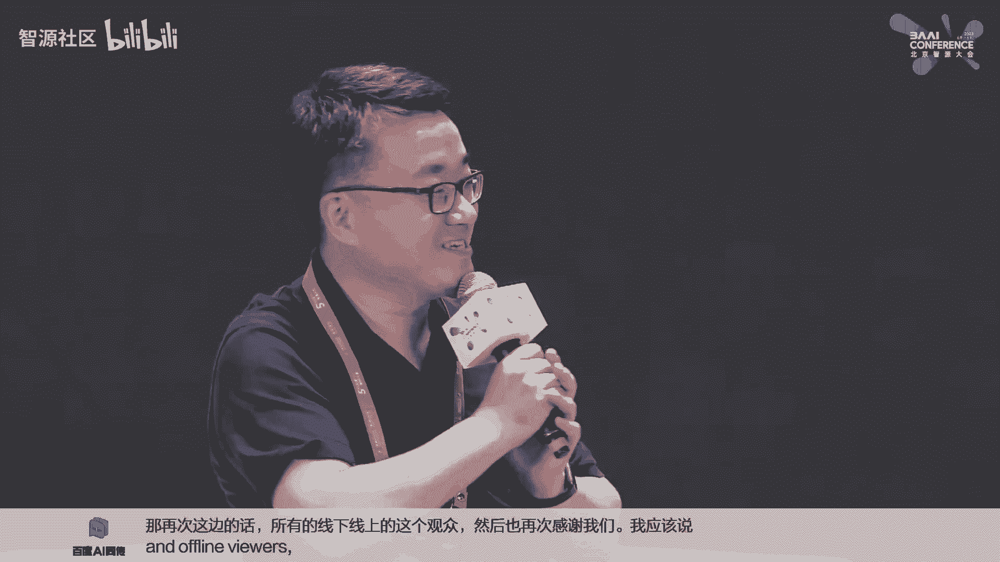