# 2023北京智源大会-生成模型论坛 - P1 - 智源社区 - BV1e14y1m7Rr

同学们大家好啊，欢迎大家来到这个2023年北京智援大会的生成模型论坛。然后我是论坛的主席和主持人，我叫李崇轩。然后非常高兴非常荣幸，有这个机会组织这样一个活动啊。

在这个志援的支持下去和大家啊一起分享啊生成模型最新的这种进展。然后今天呢我们是非常非常荣幸邀请到了呃斯坦福大学man教授，浙江大学呃赵州教授呃，智援研究院呃，北呃刘广研究员UCLA周博磊教授呃。

ford吴家俊教授给大家带来生成模型的前沿进展。然后最后呢我们会有一个非常非常简短的一个大概半小时的一个援著论坛。然后还会邀请到啊清华大学朱军教授和这个各位讲者一起来呃跟大家做一个更详细的讨论。

然后我们今天的第一个报告来自于呃fordman教授报告的题目。😊，advances in models介绍man is an associate professor in Stanford university his research on machine learning and AI he won multiple best was and outstanding top conferences likeI and and he is very famous because of his work on models。

 So it time so let's welcome to give the talk okay。啊， can you can share your screen。O， thank you。

 thank you so much。Perfect， can you see my slides？Oh yeah， yeah， yeah， Okay， great。

 and you can hear me okay。Yeah， everything works。Okay perfect yeah great thanks for the introduction yeah it's a pleasure to be able to give this talk remotely and yeah this is John work with my former PhD student Yangs who is actually a alumni from Tinhua University and it's gonna be a assistant professor in computer science at Calch soon in order to do this know and here's another example of the kind of things you can do you know perhaps you don't want to control the geneative process through a caption。

 maybe you want to provide a sketch what painting should look like you know this is the kind of image I would be able to to provide myself and then you can ask a generative model to make create a painting or create a beautiful image that is consistent with this kind of sketch provided by the user and you might get an image like the one you see at the bottom again you can see it's kind of like consistent advice provided by the user but that is much more beautiful。

う。And underlying this technology is a model that is able to understand the structure of natural images and is to be able to understand what kind of sequences of pixels are likely。

 they're reasonable and which ones are not。And so the underlying assumption is that there is some underlying data distribution。

 there is some function that assigns hyper probability to images that are consistent or sort of like the pixels make sense and the objects of the right structure and they look reasonable。

 they they're physically consistently with the kind of things we might see in the real world or the kind of images that we can get on the internet。

And the issue that this function is unknown and the only thing we have access to is a large number of samples or examples of let's say images are harvested from the internet。

And the goal is to come up with a model of this kind of distribution。

 come up with some kind of function that can be computed that can essentially aside tell us which images have high probability and which ones don't。

And if we are able to come up with this model distribution。

 then we can do many of the interesting things we've seen before， we can sample from it。

 we can ask the computer to generate sequences of pixels that would be assigned high probability by the model and by doing so we can generate new images that are have the right structure。

 they are similar than ones we've seen during training， but they are different， they are new。

 there is some aspect of creativity of generating new content here。

And another thing we can do is we can。That's the model。

 you know whether a given input image is likely or not and perhaps we can do this to detect adversarial attacks or figure out whether there's something wrong with the inputs that are provided to our machine learning system so there's a lot of。

Interesting use cases for generative AI kind of tools like a probabilistic model a generative model of data distribution over natural images。

啊， now。The problem and why we've not been able to do this before is that building a complexgenrative model is challenging because this probability distribution that is shown here as a pretty simple object that you see on the left it's in fact actually very complicated because it's a probability distribution or a very high dimensional space if you think about the spaceable possible images。

 images have many， many pixels and so there's many。

 many different possible combinations of the colors that you can assign to the pixels in an image and so what it means is that the model needs to be able to assign probabilitybabilities to an extremely large number of possible objects。

And that's challenging。And so the question is how do we construct a distribution that is sufficiently flexible to be able to capture the complexity of a complicated distribution like they one other natural images？

And so one thing we can do is we can pick simple statistical models like a Gaussian distribution and you can think of a Gaussian distribution as some kind of like really simple neural network that will essentially take as input and image X。

 you think of it as a vector of pixels and will map it to a scalar value。

 which is the probability of that input according to a Gaussian distribution。

 which is a relatively simple formula where you just subtract of the mean and then you use the standard normal expression to calculate the probability of this data point X。

And you can think of this as a very shallow neural network。And you know。

 Gaussian distributions are great， but you can kind of imagine。

 you know they're not sufficiently flexible to represent something complicated and complex like a data distribution of natural images。

And so ideally we need something more complicated， we need to introduce the power of deep learning of deep neural networks to represent this complicated function that takes an image' the input and maps it to a probability value and so the idea is that perhaps we can use a deep neural network to construct this probabilistic model and that's kind of like the whole problem is behind the whole idea of using deep generative models using deep neural networks to construct a generative AI kind of tool。

Now the reason this is not entirely straightforward is that probability distributions and probability density functions are not arbitrary functions。

 but if I take an arbitrary neural network the output that it might give you for a given input image X might be。

 for example a negative value and we know that probabilities cannot be cannot be negative so if we take an arbitrary neural network let's say call it a theta the output might be negative so we have to somehow change the structure or the neural network to make sure that the output is not negative and that's relatively easy to do for example we can take an exponential or something like that to make sure that the outputs are non negative。

The more complicated constraint is that we need to make sure that if we sum the probabilities of all possible inputs to this function。

 we sum the probability over all possible images， we get one。

And enforcing this normalization constraint is not easy in order to make sure that this function normalized。

 we basically have to divide by this normalizedizing constant this data。

 which is just the integral of the unnormalized probability of all possible inputs。

And this object is easy to compute if you have something simple like a Gaussian distribution。

 but in general， it's very hard to compute for an arbitrary neural network。

And it involves an integral or sum or a very high dimensional space。

 and this is provably computational and intractable， even if you have a discrete input space。

 this is sharply complete is believed to be even harder than NP complete problems。And you know。

 there's been a lot of work in the past few centuries and from you different。

Fields and disciplines including statistical physics， statistics。

 a lot of smart people have thought about ways to deal with this partition function and come up with approximational algorithms and ways to sort of like compute this quantity or approximate this quantity efficiently。

And so the way that we are going to make progress is to instead of working with probability density functions。

 which have to be normalized， we're going to work with their gradient。

 just called the score function， just the gradient of the log density function。And so intuitively。

 you can think of the probability density function as this function that takes an input x and maps it to a scalar。

 which is the probability under the model。The score is just the gradient of that function。

 so if the density of axis is a mixture of two Gaussians like you see here here the color here represents the likelihood under the model。

 here I have two Gausians， one on the top right， one on the bottom left。

The corresponding score is a vector field of gradients that are basically pointing towards the high probability regions every point the score is giving you the direction that you should follow if you want to increase the probability most rapidly。

And the interesting thing is that。As we'll see this will allow us to define a very flexible class of models allow us and will allow us to directly bypass the issue of the normalization constant at the same time it will allow us to get very high quality images and this is kind of like the technology behind a lot of the advances that we've seen in generative models of images。

 video speech and so forth。And it will allow us to do a number of interesting other application built on top of generative models like evaluating probabilities doing outlier detection。

 controllable generation， and so forth。So let's start by looking at why modeling the scores is a better alternative than modeling directly the underlying probability density function。

So as we discussed before， when you're modeling the probability density function。

 you're really using a neural network to map inputs to probability values。And as we've seen。

 this basically means that the integral overall all possible inputs have to be one in the one dimensional case means that you need to choose curves such that the area under the curve is fixed to be one。

And so in order to do it with that arbitrary neural network。

 you basically have to divide by the area under the curve。The normalization constant。

 which is typically hard to compute。Now the nice thing is that if you start looking at the score。

 the gradient of the logity function， this object doesn't have to satisfy this kind normalization constraint。

 it's a much easier function to model。And we can see it mathematically， if we look at the。

 we take the log of the expression on the left and we take the gradient with respect to the input of this quantity。

 which in this case x is just one dimensional so this is just a standard derivative。You know。

 by taking the log of the expression on the left， we got two components， we got F the。

 which is just the output of the neural network and then we got this the log of the partition function。

The interesting thing is that the log partition function is just a constant is the area under the curve and does not depend on x。

 it's the same value regardless of what is the value of x when we take the gradient of a constant with respect to x。

 we get zero。So， we see that。By taking the gradient we've eliminated the dependency on the partition function on normalization constant and so we got an object that is going to be much easier to model using a neural network。

 we no longer are constrained to make sure that the area is one that the object is normalized somehow can directly use an arbitrary neural network to model the function on the right。

And that's going to be the score model and this is kind of like the key innovation that has allowed us to use more powerful neural networks to develop probabilistic models of images。

 this is really the key machinery that is enabled a lot of the success that we're seeing in the score based diffusion models。

Now， the question is that when we're given some training data。

 the usual we have a training set of samples that are sampled from some unknown data distribution。

Typically when we fit a generative model is we and we work directly with the density function。

 we know how to choose the parameters of a density function to match the data distribution as close as possible。

 typically what you would do is you would do maximum likelihood estimation。

 you would try to choose the parameters data， such that the likelihood of the observed data points is as high as possible。

The question is now that we no longer work with the density directly， but we work with the gradient。

 how do we somehow estimate the score of the data distribution。

 how do we come up with a score function that is a good approximation to the score function of the true data generating process when we only have access to samples。

We only have access to a bunch of training training examples。

 and we want to estimate the underlying vector field of grades。So it turns out that this can be done。

 so if we're given a set of examples that are sampled IID from some unknown data distribution。

 how do we estimate the score of the data generating process of log P data？

So the idea is that we're going to define a score model。

 this is going to be let's say a neural network vector which is a vector valued function for every input。

 it will give us a vector， which is an estimate of the gradient of the。

Through data generating process at that point。And what we can do is we are going to try to find parameters for these neural networks so that this function approximates the true vector field of gradients as well as possible。

Now， in order to do that， we need to be able to compare the model。

 the vector field obtained by the model to the vector field to the ground truth vector field。

And so you can imagine that there is a ground truth vector filled those scores。

There is an estimated vector field of scores for a particular choice of data with the parameters of the neural network。

How do we compare these two objects？A reasonable thing to do is to basically overlap the two vector fields at every point there is going to be a truearrow。

 a true gradient and an estimated gradient， we can look at their difference and if these differences are small。

 then we have a good approximation of the true vector field of scoress。And so in practice。

 what we can do is we can look at all these errors and we can look at the norm of this grid of these errors。

We can average them and we get scalar value， which is capturing how similar these two objects are。

Mathematically， this is known as the fis divergence。

 it's just like the average difference between the ground truth score and the estimated score at every point。

And it's a reasonable metric to compare to vector field of scores。

 if you can drive this quantity to zero， then we have a perfect model for the two vector field gradient。

The question is that it looks like it's a quantity that we don't know how to evaluate。

Of course we don't know how to optimize because it depends on this ground truth vector field of gradients that we don't know we only have access to samples from the data distribution。

 the goal is to estimate that through the ground truth data score， how can we evaluate this quantity。

 how do we optimize this quantity when it depends on something that we don't have access to。

Turns out that if you do integration by parts， you can basically rewrite this objective function into an equivalent form up to a constant。

 but no longer depends on the unknown ground truth score， it only depends on stta。

 which is our model of deep neural networks and so we get an objective function that is equivalent。

 and now this is something that we can evaluate， we can approximate using our samples and we only depends model only depends on atta。

As you can see， we're basically trying to minimize the norm of the estimated score evaluated at the different data points。

 while at the same time， trying to minimize the trace of the Jacobian of the score evaluated at the data points in the training set。

And so now this is a reasonable objective function and the challenge is that it still depends on this trace of the Jacobbian。

 which is potentially expensive to compute when we're dealing with high dimensional data the trace of the Jacobbian is basically a sum of partial derivatives with respect to the different input dimensions and this might require a lot of back propagation passes through the network in order to be able to evaluate this quantity exactly luckly there are several ways to approximately compute this quantity。

One that I like is basically the idea of instead of comparing the vector field of gradients directly。

 we can compare their random projections， we can pick a few directions and if the vector fields match。

 then the random projections should also match。And if we pick up。

Larger number of different directions， then this should become a pretty good approximation。

And by comparing random projections， we're now comparing basically one dimensional objects。

And this leads to an objective function that' is much more computationally efficient。

It basically does not depend on the dimensionality of the data anymore。

 so it scales to very high dimensional data sets like images。

And it still retains a lot of the nice properties score matching。

 like consistency and a synthetic normality。I'm going to skip some of the details。

 but the key takeaway is that there is a way to train a score model that is only depends on the data and it scales to high dimensional data sets either through slide score matching or other methods like deno and score matching that were developed by other researchers。

Now that we have talked about bypassing the normalization constant by working with the score instead of the density directly。

 and we've seen how we can estimate the score from data。

 let's talk about how we use the score models to generate new samples to do controllable generation and solve other interesting tasks。

Now， what we've seen so far is that it's possible to take samples from a data distribution and come up with a good approximation of the underlying vector field of gradients。

Now， the question is， how do we use this object to let's say， generate new samples？

How do we use estimated these arrows to essentially generate new samples。

 or all we have access to is this vector field of gradients。And intuitively。

 you could imagine a strategy where we initialize。Partracticles， randomdom。

And then we kind of like follow the arrows。To try to go towards high probability regions。

And intuitively this kind of works， it's not quite a valid sampling strategy because at some point you're going to get stuck in the in other local optimum and that's not quite what we want when we want to sample from a distribution。

But it turns out that a simple modification of this strategy gives a valid sampling algorithm。

And in particular， there is a sampling procedure called Lagervin dynamicss or Lagervin MCmC。

Which essentially works by following the gradient and adding noise at every step。

And it turns out that if you do this。If you instead of just following the gradient。

 you add a little bit of noise on every step and you do this for a sufficiently long time。

 then asytically you're going to produce samples from the underlying distribution and so to the extent that we have a good approximation of these arrows so we kind of like knowing which direction we should go to we know how to generate good samples from the model。

The challenge is that if you're trying to do that it doesn't work so here's an example of you learn a score based model on the C410 data set。

 then you try to grant longar dynamics， you get the kind of samples that you see on the right so they don't even look like real images。

 they look like just random gray graye with some color patches。

 images that don't have the right structure， they don't look at all like the ones we've used for training the model。

So what is going on here？Well， what is going on here is that if you think about the training objective that we have。

We are training the model based on samples。And most of the samples will come from high probability regions under the data distribution。

So we're kind of like getting。A prettyty good estimate of what these arrows should look like。

When we're close to high data density regions。But we don't know we don't have a good approximation of the gradients of these arrows when we're far away from the high data density regions because we've never seen training points in those regions。

 all our samples are coming from the data distribution that are like nice。

 clean images and those are the only samples that we know how to deal with。

 we've never trained on random noise for example。However， when we initialize our large chain。

 our samples are going to be initialized all over the place and by following the arrows we are going to be able to go towards high probability regions。

So here you see again an example where we have this simple data density that we've been using as an example throughout the talk with two modes。

 one at the top right， one at the bottom left， if you do score matching you can see the arrows are pretty accurate when we're close to the modes but then they are very inaccurate if you compare those arrows you can see that they're sort of pointing in the wrong direction they don't quite match the ones in the middle figure。

 the true ones and the estimated ones they don't quite match the arrows look different and so what this means is that if you follow the arrows using larger dynamics。

 you will have trouble exploring the low data density regions and you will get lost and you will not be able to produce good samples。

So one solution is to add noise through the data。If you add noise to the data。

 then we have a new per of density that is now kind of like supported over the whole space。

And because we're going to see samples from this perturbed density all over the space。

The we you know。Practice， if you think about an image。

 it means adding noise to the image you take this dog and you add noise to it so that it becomes。

It becomes a little bit fuzzer。If we do this， then we get a new density。

 a perturb data density for which it's relatively easy to estimate the score。

Because we're going to see samples all over the space。

 we're going to be able to estimate the scores all over the space。

Which means that our lingering dynamics procedure will be able to sample from this distribution。

However， we're no longer sampling from the clean data density。

 we're now sampling from an approximation to it， we're sampling from a data density that has been artificially perturbed with let's say a noise。

 or we're not going to generate clean images of the dog like you see on the left。

 we're going to be generating images plus noise like the ones you see on the right。

 which is not what we want。So the solution is to consider multiple noise levels。

 is to consider different views of the data distribution perturbed with increasingly large noise levels。

 say Sigma1， Sigma  two， sigma 3， and so forth。And what we can do is we're going to try to。

whichch you can think of as adding increasingly large amounts of noise to， let's say。

 images of this dog。Until the structure in the image is completely destroyed。

What we can do now is we can try to jointly estimate the vector fields of gradients of all these data distributions perturbbed with increasing large amounts of noise。

And we can do that using a single score network， just like before。

 an neural network that takes x as an input， takes the noise level sigma。

 and input and produces an estimate of the score for that x for that noise level。

What we can do is we can train this score based model using a score matching objective just like before by taking the fi divergence between the two distributions。

And again， basically，' just by using the same score matching loss that we talked about before。

And now that we've estimated all these vector field gradients。

We can produce samples by essentially using a variant of the La dynamics procedure that I talked about before。

 what we can do is we can initialize our samples at random and we can start by following the gradients of the data distribution perturb with a very large amount of noise。

These gradients will be pretty accurate， and so we're going to start moving towards high probability regions。

Then we can use these samples to initialize a second large in chain where we now reduce the amount of noise and now again we follow these arrows。

 but now we follow the gradients corresponding to a data distribution that has been perturbed with a smaller amount of noise。

And again， then we use these samples to initialize another long jump chain for a data distribution perturb that even smaller amount of noise。

Until the level of noise is so small that we're essentially sampling from a distribution that is indistinguishable from the true clean data density。

And this procedure actually works， here's an example of how it can generate examples on some common image data sets。

 this was back in 2019 and we were very excited because we were able to finally get this procedure to work to generate Mist digits or to generate pretty realistic C410 kind of images and you can see how essentially the procedure is able to go from noise to data and it's essentially following these gradients it's following these arrows and it's trying to push random noise towards high probability regions and it's generating images with the right structure by following this procedure。

Now， scaling this up actually led to state of the art sample quality on CF 10 back then when we published this work in ICLR。

So for the first time， this kind of procedure was able to beat GANs generative adversarial networks。

 which were the state of the art in generative modeling for a few years。

 despite a lot of the engineering that went into GNS and a lot of investments from large tech companies。

 we were actually able to for the first time beat GNS in terms of image quality on this academic data sets。

 C can， which was very exciting because again it was growing the first time competing very different class of models was able to beat generative adversarial networks。

And you know a bit further by scaling up to bigger data sets。

 higher resolution images we were able to generate， let's say。

 faces like the ones you see here and this was is kind of like the key technology that is behind things like stable diffusion or Igen or Dli2 or midjoney。

 all these excellent image text to image generative models are at the core based on this idea of estimating the score of a set of distributions。

 so data distributions perturbed with increasingly large amount of noise。

 it led to it started out as an academic project， it eventually ended up having a deep impact in industry and now it's used by a lot of users all over the world and it really has unlocked incredible new capabilities in terms of the kind of images we can generate with these models。

Now， I think soll have some time， so maybe I'll talk a little bit about how diffusion models are very useful because they allow us to control the generative process in a very natural way。

So let's say that with。Train a model that can generate images of cats and dogs。

Now let's suppose that now we wanted to only generate images corresponding to the class label dog and so let's say that we have a classifier that can tell whether an image is an image of a dog or a cat。

Is it possible to sample from the posterior distribution of images given that the corresponding class is the class y of a dog？

You know this is a well defined object， this inverse distribution。

 this posterior distribution is basically just defined but through Bay as rule。

 posterior distribution of images given the class label is something that we obtained from the prior distribution of our images P of x。

The likelihood P or Y given X， which could just be a classifier or some kind of way of assigning a label Y to an image X。

 and then we have to normalize by this denominator PO Y。Which is typically intractable to compute。

Can you see that this behaves essentially like the normalization constant。

 the partition function that we talked about before。

 this is essentially a number that you have to divide the expression with to make sure that it's normalized and it's a valid probability distribution。

Computing with this denominator is what makes Bayesian inference so hard。

 it's typically very difficult to compute because once again it involves some integration of a high dimensional space。

The good news is that if you look at what Bay rule is telling us if we start working with core function instead of densities directly。

AndSo if we take the log of the expression and then we take the gradients with respect to xs of the expression I have at the top。

We see that we get several pieces， but the important thing is that the denominator P y does not depend on x。

So when we take the gradient with respect to x， that term that we didn't know how to compute disappears。

And so the score of the posterior distribution is just the score of the prior model P of x plus the score of this likelihood PO Y given x that we might have access to directly。

So if we have a pretrained score model that is telling us what do the scores for images look like。

 can combine it with the score of any forward model that we want could be a classifier。

 or it could be anything else。And we can get a score for the posterior distribution。

 so just by adding up these two components， we can get a model that can sample from a posterior distribution。

And this allows for many different applications。😊，So for example， why instead of a class label。

 why could be a stroke painting？And now we can。With a given a pretrained generative model of images can combine it with a likelihood function。

 POY given X， and we can get a model that can synthesize images from stroke paintings and here you see some of the examples that we can get when you can try to create an image that has right the structure of the stroke painting provided by the user but is photo realistic。

Another example is language guided image generation。

 if you have a good image captioning model that can tell you which whether a caption Y is consistent with an image X。

We can ask， we can create a conditional generative model that will create an image given a caption。

 and you can use this kind of machinery to build a language guided image generation so you can text to image。

 generative models， you can take up image captioning model。

 you can combine it without a generative model of images。

 an unconditional model and you can get language guided image generation。

Another example is medical imaging air the idea is that we might want to reconstruct a medical image in the medical space like an MRI or a CT scan kind of setting。

The machine in this case will get some kind of like measurement of the patient。

And we can think about the medical imaging problem is that of reconstructing the crossal image of the patient。

 given the measurement obtained from the machine。In this case。

 the model that relates the cross sectional image of the patient to the measurement given by the machine is given by some physical simulation。

 but it doesn't matter to us， we have the forward model。

 P Y given x we can combine it with a prior model， P of X or medical images and we can get a powerful medical image reconstruction tool that is actually beating deep learning models that we' trained specifically for this task。

 so it outperforms deep learning methods that were specific we're trained for this task even though our method is fully general and it's kind of like just obtained by combining a prior model with a likelihood in a very which means that it's much more general。

 it can be applied to different number of projections， different kind of measurements。

And it gives better performance as even though it's more general and more powerful。And you know。

 this kind of technology led to state of the art results in a variety of water data sets on audio。

 material design， text to speech， shape generation， and many more。Now。

 I think I might have a few more minutes， so I'll talk briefly about why these models are also called diffusion models。

And that connection arises if we start thinking about what happens if we were to consider a infinite number of noise levels。

Or recall that the。Underlying idea of this modeling framework is to not just model the data distribution。

 but to model the data distribution perturbed with increasingly large amounts of noise。

And here I'm showing， let's say， the data distribution p0 and then several perturbed views of the data distribution and increasingly large amounts of noises。

 Sigma 1， Sigma  two， Sigma3。And you can imagine what happens if we were to consider more perturb distribution so and increasingly。

Fine grain sort of set of perturbed。Dta distribution perturbbed with different amounts of noise intensities。

And in particular， you can think about what happens if you were to consider an infinite number of noise distributions that interpolate between the clean data distribution at time zero。

And a data distribution perturbably a maximum amount of noise at time t equals capital t。

So you can kind of like imagine there is a sequence of distribution where we start with clean data on the left。

 then as we move towards the right， we get data distribution pertbed with increasingly large amounts of norms。

And so in particular， you can kind of like imagine process that kind of like。

Behaves according to this set of distributions marginally。

And you can kind of think about what happens if we were to take clean data。

And perturb it by adding increasingly large amounts of noise。

Until the structure in the data is completely destroyed。

This can be described the stochastic process can be described by a simple differential equation。

 stochastic differential equation where we basically just take data and add a little bit of noise at every step until after adding a sufficiently large amount of noise。

 all the structure in the data is completely destroyed。

It turns out that it's possible to think about the reverse process。

Where instead of going from data to noise， we go from noise to data。

So instead of going from time zero to t， we go from time t to zero。And if we go from noise to data。😮。

This reverse process is basically solving the problem of generating data for us。

Going from noise to data is exactly the process of jet generative modeling。

And the interesting thing is that the reverse process of going from noise to data can again be described by a stochastic differential equation。

 it's not important that you understand exactly what these equations mean。

 the important bit is that this reverse stochastic differential equation can be described in terms of the score function。

So once again， if we can estimate the score functions of these data densities perturbbed with increasing the large amounts of noise。

 then we can describe the reverse differential equation that maps noise to data。

And that's essentially the connection with the diffusion models。

 it turns out that if we use score matching to estimate the score functions， we can reverse。

this stochastic differential equation， and we can get now essentially a diffusion model。

Time is continuous now that we can use to generate samples。And I think I'm running out of time。

 but I'll briefly mention that this stochastic differential equation perspective is very helpful because。

It allows us to use a lot of different techniques from the numerical numerical methods kind of literature。

In particular， it's possible to use very fast solvers for essentially computing the solutions to these stochastic differential equations。

 where it turns out that it's possible to convert this to an ordinary differential equation。

So where the process is no longer。tochastic is deterministic again the ordinary differential equation depends on the score function and so to the extent that we can estimate the score function。

 we can define an ordinary differential equation that maps noise to data。

And we can use numerical methods to solve this differential mis skip this。

 but we can use this differential equation to。Accceerate sampling。

 we can try to solve this differential equation very efficiently using techniques from the numerical methods that have been developed over decades to solve ODEs fast。

 for example we can coersely disreitize the timeax and kind of like take big steps achieving very high speed appss and comparable sample quality。

 we can also use parallel ODE solving methods to again accelerate sampling we can use distillation。

 we can kind of like screen a student model to do in one step what the ODE solver who do in two steps。

 then you can repeat this process many， many times recursively until you can essentially get a student model that can generate samples in one step。

And these samples are extremely good here you can see some of the examples when we apply these techniques to stable diffusion。

We can actually generate very high quality images only requiring one or two steps。And again。

 this is made possible by this interpretation of the sample procedure as solving an ordinary differential equation。

And using some collaborative techniques to accelerate sample。Maybe let's skip this and yeah， I think。

I think I'm out of time so yeah I conclude here， this is sort of like the highleve overview of diffusion models and the key ideas are using scores to model the distribution instead of likelihoods and that really enables us to use essentially arbitrary neural networks to model these vector field of gradients。

 the fact that we can train these models without having to resort to adversarial methods and mini Maxs like ingenerative adversarial networks。

 there is a stable proper scoring rule based on the phs dives that we can use to train the models。

And we can use these models to do controllable generation。

 we can use a lot of ideas from the numerical method and numerical methods to sample from these models very efficiently and one thing that I skip is that we can also get likelihoods out of these models so not only we can generate samples by given a sample we can evaluate how likely that is under the model which is pretty useful to let's say do anomaly detection and a variety of other applications and yeah this is kind of like really the core technology behind a lot of the super exciting advances that we've seen in industry and we're seeing more and more applications of this to other domains I think one that is still open is whether these models can be competitive without aggressive ones some text that's going to be a big open challenge and hopefully we're going to see some progress on that soon to and yeah I think that's。

I'm happy to take questions。Okay， thank you so much。 thank you so much for your beautiful talk。 Ar。

 maybe you cannot say it through the camera。 Actually。

 the forum is full of people and many people stand on both sides。 Actually。

 we have one or two questions in this session。 Oh Okay， can you， can you have the microphone。😊。

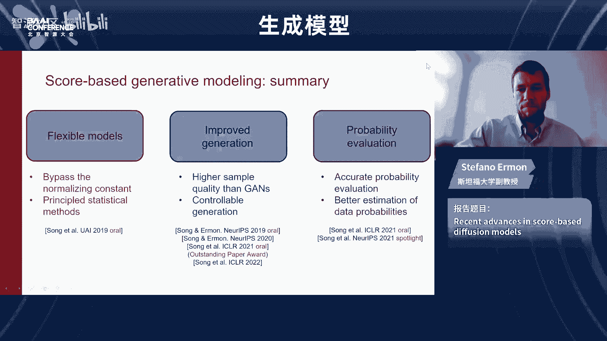

Do you realize build a general large model is image。Could you， could you repeat a question， Sorry。

 do you realize build general large model is a image。Is it possible。

Is it impossible to build an image model general large model？General a large model， yeah。

What's a general large model？不是哦，我因为我不是通用大模型，现在的这个翻译或者然后GN或者是AGAAG现在不同一。

然后我就用一个okKI can translate into English。 The question is do you believe that we could build a general purpose model for for like AGI。

😊，Oh yeah that's a good question I think it's hard to say I don't think there is any constraint like I don't feel like there is any impossibility result or that we will prevent us from getting there I mean we have a develop through evolution a system that can do it and I feel like it should be possible to replicate it I don't know how close we are I personally don't think that we are very close I think there is going be a lot of work to be done to get to AGI but I don't think it's impossible I think we'll get there eventually and we just need to keep working on it and we might need new ideas。

 we might need new models we might need new methods nobody knows how close we are but I do believe that will eventually get there I don't think there is anything fundamentally preventing us from from getting there。

可以。O， thank you。 we have another question。 Okay， the last one。 Okay， thank you。😊，Thank you。

 So my question is that so the success success success of the scope bit model depends on the successful estimation of the score。

 So does the score estimation re heavily on the architecture of the neural network。 I mean。

 so currently， most model use the U net。 So is it possible for you net to estimate any distribution of general data。

 Thank you。it's a great question and I think a lot of the advances were actually enabled by the fact that we could use more complex architectures that don't have to be either autoregressive or they don't have to be invertible the fact that we can just plug in a unit or really it is one of the key things that enable these models to work so well。

 whether that could be better architectures， I think they're probably are out there and yeah we just need to to discover them I mean I think theres certainly a lot of architectures that don't work that we tried before getting units to work I know people have had some success with transformers too so B believe there's probably better ways to do it and depending on the modality you might want to use something else seems like units are pretty good。

On images at least， but yeah there might be other things on graph we've use the graphra neural neural network so it depends a little bit on the application and yeah it is deep learning so。

Yeah the architecture is super important， so there there's some beautiful math at the top but yeah the architecture matters and there is some magic here in terms of these neural networks being able to estimate scores and do it reliably that is really enabling the success of these models like a priority estimating the course could be hard and yeah there is some deep learning magic here going on for sure。

😊，Okay， thank you。 Thank you。 Okay， thank you again， Ima， for your time and nice talk。 Okay。

 so thank you。 yeah。😊，呃，好，那么我们这个呃在的报告之后呢，是这个很荣幸的邀请到这个浙江大学啊赵州教授，为我们带来这个多模态生成式语音模型的这个最新进展。

我我简单介绍一下这个赵州教授，他是浙江大学计算机学院的教授博生导师，主要研究方向是自然语言理解计算机视觉啊和生成模型，在国际期刊和会议上发表了很多很多的文章，然后有很大的影响力。

谷歌学术引用啊8000多次，然后有很多多模态的生成式的工作啊和包括这个语音模型有这个呃nice speech啊等等。然后还有一些很有名的这个呃生成式视觉模型或者算法啊。

包括这个很先驱的这个PNDM这些然后呢他的工作呢应用于各种这个呃顶级的公司特像微软华为的这个项目中还有table非常著名的这开源模型当中，然后他曾经获得。😊。

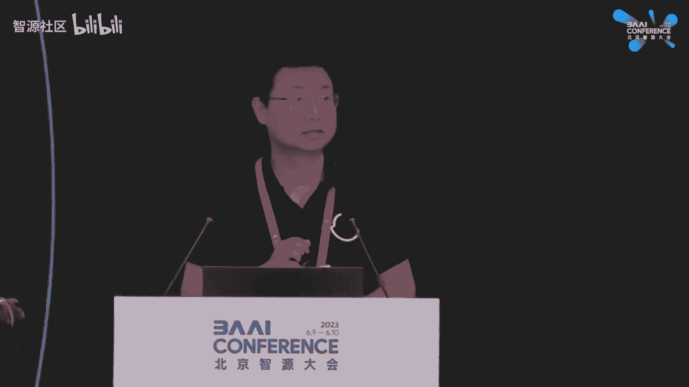

和教育部科技进步一等奖和中国电子学会科技进步一等奖。我们欢迎赵周老师给我们带来精彩的报告。啊，谢谢各位老师和谢谢各位同学。嗯，非常呃荣幸啊。在呃支援大会上呃介绍一下呃呃我们呃近期的一些工作。

那么呃今天我给大家带来的题目是呃多模态呃音频生成式模型。那么我们的呃相比于iphone教授呃的理论。我们主要是介绍一下呃生成式模型，包括呃扩散扩散模型的一些应用的情况。那么呃我们这次报告的话。

主要是介绍一下我们呃近期的呃。三个主要的一个工作。那么第一个工作是。呃，第一个工作是呃。第一个工作是我们基于我们的语音的 speech模型。第二个是我们呃呃语音生成歌声的啊。

第三个是呃我们呃生成音频的一个d。所以我们从呃这个报告我们从三个角度来介绍一下啊，在呃音频生成的一些呃应用。那么首先我们先介绍一下，因为呃呃之前很多的呃同学都介绍了啊呃文本生成呃tex。

那么音频呃生成的话也是一种呃cros model的一种呃生成，它是呃给定呃给定的文本，那我们生成它的音频的一个形式。比如说我们把呃荷塘月色这个文本我们转化为呃语音信号。那么这个是一个它有很多的一些应用。

比如说在有声读物，包括在呃人机客服等等等等，有一些很多的一些应用。呃，那么针对呃这么一个呃这么一个呃它的一个框架呢，我们一般主要是有三个部分组成。那么第一个是在合成的是叫前端。

那前端它的作用是我们把呃呃我们的文本文本长成它的音素的形式。也就是说我们从文本中通过呃NLP的一些技术提取发音啊，包括提取它的一些韵律。那么第二个阶段是呢第二个阶段是我们在呃前端之后。

我们是给定了一些音素。那么通过这些因素呢，我们合成我们的没要频谱。那么我们可以想象成从呃文本合成它的呃频谱图的这么一个呃映射。那么第三个的话是呃声马器声马器的话呃是从我们输入是频谱图。

那么输出是我们的呃语音audio语音。那么我们这次报告我们聚焦在哪个地方呢？我们这次报告我们聚焦在呃声学模型的呃生成式的应用。那么过去的比较几个比较著名的工作，一是呃自回归的呃t，包括呃 voice。

包括呃transform tT。那么呃这次报告我们主要是介绍一下我们的生成式模型在呃声学模型，也就是说我们从因素像频谱的映射的呃低延时的net speech，呃，包括是高表现的d，还有是呃基于开放语。

因为audio它的呃生它的可以有不同的一些生成。那么是make an audio。那么首先呢我们是看一下我们的呃net speech。那么net speech的话呃。

它的一个呃develop的形式是从19年就开始呃develop。那么到23年的develop。那么有非常非常多的一些问题。我们碰到那么它原始的backbone呃基于什么呢？

原始backbone基于呃transformer在2019年呃transform被用到了呃tex to呃 speech，那么取得了非常好的一些效果。但是它还是有非常多的一些嗯呃不足的地方。

比如说transform的推理呃速度比较慢。那么呃如何使得它的推理速度呃更加快，呃，是以第一个难点。第二个是呃它的对于呃transform来说，我们的跨模态硬来说，它的呃生成的quality不是特别好。

那么怎么来提高它的生成的质量。那质量好了以后呢，第三个问题呃来让我们解决的是。是呃我们提高了模型的推理速度以及它的质量的时候，呃，如果我们的模型希望在端侧部署能否把它的模型大小呃尽可能的压缩压缩。

那么第四个问题是什么？第四个问题是呃，很多的前面的无论是并行化还是高质量还是轻量级，它呃大多是呃适用于中文和英文。但是中文的时候，我们的语言跟呃英文有一个很大的不一样，就是说我们是有一个多音性。

也就是说我们每一个词在不同的语境中，它的发音是不一样的，发音是不一样的。那么如何我们解决呃呃多音性多音性这个问题。那么最后的话是什么呢？最后的是在多音性的时候。

我们能否我们的合成能有非常好的个性化的合成。也就是说我们希望把我们的model呃进行一系列的一些泛化。所以我们现在呃step by step。

那么第一个是transform tTS是一个非常好的一个工作。那么在2019年是用transform model来做tex to必这么一个呃合成的一个工作。那么。

当时比texction呃取得了非常好的一个效果，非常好的一个效果。那么我们基于transform墨这个框架，我们继续了一些呃改进。呃，第一个是在2019年做了一个改进。

因为transform的这个框架来说，它的推理速度呃相对来说是比较慢的。第二个是它transform因为是auto regressive的一个pre。那产生一个问题，它是会存在一些漏词的一些现象。

那为了同时我们提高呃它的推理速度和解决low词的情况呢呃做了一个non auto regressive的呃工作就是呃开端。第一个那么n auto regressive的工作的话。

它主要的思想在在于我们并不是在解码端的自回归的一个呃预测一个加一个而是我们采用了一个非自回归的一个预测形式。那我们可以看一下，在这的一个重要的block是叫less regulator。

less regulator是呃呃我们的输入模态和输出模态进行一个映射。我们可以看一下less这有一个。也就是说我们。pred每个因素在我们的m频谱的里面的一个dration，也就是长度。

那么这个是实际上是实现了一个模态到另外一个模态的一个呃alignment alignmentment一个学习的过程。

但是我们知道呃这个alment duration predict是呃非常相对来说是非常难train的。因为我们会遇到呃我们的呃从一个模态到另外一个modality映射的时候有一个多封性问题。

也就是说我我们同样一句话，我们可以有不同的说话的方式和表达的方式。那么我们的映射的话会是相对来说会比较困难。那为了解决这个问题，我们可以看这个rationpre呃。

并没有用直接用ground truth来做，而是用呃autoregressive的一个transform tS作为一个teacher来教他呃抽取我们不同的一些。

那么经过这个来用ME loss来train。那么好了以后呢，我们可以看一下它的一个performance的一个呃进展，它的呃左边的话是一个momo是1到5的一个评分值。那么越高是越好。

我们可以看一下它的呃trans t是在3。88是在4。0。那fa达到了3。84是一个呃非常小的一个呃下降。那么呃fi是它的呃是有270倍的一个加速度。

270倍加速度可以看一下下图的一个 speech和之前的transform呃T的一个的一个呃程度。那么这个是一个第一个问题。第二个问题是在解决了推理加速的情况下。

还有什么遗留问题需要解决的遗留问题就是说虽然加速的时候，我们还是希望它的 performance性能可能是越来越好硬来越好。那performance我们做了一个呃在。前面做了一个详细extension。

也就是说我们之前是呃inco，后面是lanance regulator。那我们可以看一下，这是vari adapter。那除了我们做我们的lanance。

也就是ration的预测也是做了我们后面的一个音高能量等等其他的一些属性的预测。那么把 predict扩展到我们的 adapt之后，我们发现呃可以取得两个效果。第一个是它的ality是提升了提升非常多。

我们可以看一下它的version two的版本 two版本是比它的 one版本有一个很很大的提升呃，甚至它的在评测的时候已经transform t的 qualityality甚至要好。

那么依然是在inference的时，我们可以看一下它inference是如果只用 autoto regress的解码的话，它得负一次方的inence。那么合成一秒的。精品是需要1的负1次方级别。

但是在呃那alto regressive的话，从10的负1次方降到了呃10的-3次方。那么做了一个呃做了一个推理的一个提升，推理提升。那么呃这个还是会存在一个问题，所以呃会继续再挖掘一下这个问题。

那因为我们是发现就是说很多的时候我们是需要这个模型的size呃，尽可能小尽可能小。那保持它的推理的速度和我们的推理的推理出来的效果的时候，我们还是希望呃进一步压缩它 sizeize。

所以有呃所有port必这个工作port是可携带的，我们的希望是可能继续的小。那么我们看见呃我们这有呃两种的gen model。第一个是呃vari generation model呃。

我们我们通过实验发现如果用 generation model，它虽然参数不是特别大但是而且可以capture它的整个的合成的一些运力。但是由于它的lo的原因，它是带着一些的模糊性。

那么第二个是flowow based的呃可逆流 based model。那么虽然我们在参数足够的情况下，我们可以把它的。呃呃，效果做的比较逼真，但是它需要很多的参数。那么怎么办？

那我们把嗯呃VE based and flow based呃加起来，cascate起来，cascate起来就是port speech。那port speech呃做到一个什么样程度呢？

我们可以看一下port speech呃做了出两个实验，两个版本，一个是normal版本啊，一个是small版本。那nmal版本的时候呃呃VE和g模型加起来。

那么我们可以再看一下它的quality的上面是 art qualityality更好。那么呃第二个呃事情，我们是把它的size进行压缩的情况下，我们可以看一下。

它只用了大概4分之1的呃4分之1的参数量呃，依然可以达到非常comparable的一个performance。所以在呃这个程度上做了一个模型的参数的压缩。

那么使得更小参数可以取得非常compar的一个呃一个performance。那么回归到中文。因为我们呃做呃呃文本到文本到。呃，语音的合成往往会涉及到中文。那么中文有一个非常大的一个问题。

大家都没有还没有去解决。就是说我们中文和英文的来说的话，它的一个词汇往往一个词汇在不同的语境的情况下，它发音的是不一样的一个情，不一样的情况。所以说我们我们在做我们的呃没频谱的一个映射的时候映射的时候。

从语义的空间到声学的空间进行映射的时候，我们不仅是需要看当下的一个词也是需要看它的contex也contex。那么做这个的情况下怎么进行context的一个一个过程的。那么我们当时我们是可以看一下。

就是比如说它是输入了一个文本输入文本。我们可以呃对于文本来说，我们可以看它的字典。因为我们可以看一下听乐对听乐队。那么乐的话有几个发音的，一个是快乐乐观取乐。

那么是呃第一种乐的一个pronunciation它的转成它的音素，第二个是音乐乐。和呃音乐。那么pronunciation是呃第二种pronunciation。那我们借用我们中文的字典。

中文字典可以呃可以把它的因素给尽可能的map过来，尽可能m不过来。那么使得我们dictionary呃放进去。那么是解决中文的问题。那最后一个呃最后一个在这个事情是我们是呃希望呃可以把它进行一些泛化。

因为现在呃呃大语言模型也是非常 popularular了，也做了一些呃基于呃我们的pe转化为呃token用语言模型来做。

但是呃我们发现就是说不是说呃所有的呃pech所有的模块都可以转化为离散的token来做。那么什么比较可以做做的。

那我们发现是从韵律的这个code做我们的离散的token的一个呃lan model会比较好的一个性能。所以呃泛化的情况下，我们可以看一下，这里是。这个是me spectrumgram的一个结偶。

我们只在韵律上面做了一个language model的个leage model。那么呃和呃reference的是呃音质，那么合成我们的一个呃t的一个形式。那么我们可以呃试一下这个我们看一下他的demo。

这个是呃呃，我们可以看一下这个是一个奥巴马的声音， workers lost their lives。17 others were injured。

And soon nearly a mile beneath the surface of the ocean， oil began spewing into the water，它一10个10ton。

Good afternoon， everyone。 Today， we are super excited to introduce you all to introduction to deep learning。

 The course of Carnegie Mellon University in the first part of the course。

 we will talk about the generative deep learning that are used to generate data never existed in reality。

Good afternoon everyone Today we are super excited to introduce you all to to deep learning course Carnegielonative中。

介绍一下呃歌声sing的一个模型。那sing的模型的话是非常有有意思啊，就是得益于呃diffusion model thanks to diusion model。

那么呃iffffusion modelapply到上面去可以做什么呢？可以做一些非常高表现力的一个合成的一些工作声音工作。

我们首先看一下就是呃ffusion model那么呃左边是diiffusion model右边是呃我们的plication当然是可以直接apply我们的个usion model我们的呃 voice synthesiss的话我们发现有什么样的一个呃interesting呃interest的一个呃ide呢？

因为第一种我们是可以从我们的conditional的一来进行生成来进行生成。那么第二种的话我们我们发现啊就是说沿用 speech的一个呃一个一个思想就是两个mod进行scade那么第一个mod是呃。😊。

第一个model是capture semantic，第二个是capture它的一个音质。那么这是也是一样的。那我们我们MmanifoldM是什么意？

M是我们的原始的origin dataorig data，我们进行呃一系列加造，我们加到T的 step，那么M撇也是什么呢？M撇是。我们用另外一个model，另外一个model。

另外一个之前的model我们生成出来的一个频谱。那么之前的model的话是用我们的n speech呃 speech to和 speech分别是生成了不同的一个频谱我们进行我们到这的时。

我们发现它都是verge到一个 noise white noise那么比较interesting的呃呃interest程度就是说我们发现他在第七步的时。

第步的时候有一个 overlap有个 overlap。那么也就是说我们呃可以换一种思路啊，就是说一种是我们用呃one single model去做这样一个事情。

第二个是我们是用两个mod models models我们是用第一个是用一个辅助 model辅助辅助 model辅助 model我们生成M撇撇撇撇的时候，我们可以用我们之前的n我们cap它的语义的信息。

生成一个呃。出力度的出力度的一个频谱。除了一部频谱之后呃，进行K部的一次性佳噪和K呃一次性佳噪和K部的降噪。那么我们呃生成我们的呃music，生成我们的music的歌曲。

那么这个是呃这个的一个 performanceform。那我们发现一个比较interesting呃一个事情，就是第一个是。第一个是这个策略的事情。这个第一个策略。

我们是可以把梯步梯步的一个降噪梯步降噪给它reduce成reduce成K步，red成K步。第二个我们发现呃两个model沿用我之前的 speech的一种思想。

它的 qualityality会比呃s model会更高sing model会更高，所以是一个呃cos to find的一个呃过程，我们可以听一下demo。

就是这个是一个呃我们放了一个是你说你不为何在这时收。啊。小酒，我长睫毛，是你最美的记号。😔，对，他是可以是呃呃呃合成非常的比较表现力的。因为呃这个呃task比之前的呃pe要更难。

因为我们pe合成的语音来说，我们的音高抖动等等，都没有这么一个呃表现力。那么。接下来呢我们也是做了一个M fourM four是什么呢？

M four是呃一个一个呃ch我们呃把我们之前的d扩展到不同的一些ap。那我们可以看一下呃这个合成我们刚才展示过了，还有什么呢？还有是一个变调，我们可以听一下它的一个原始的音频我说其实你很。

那么我们是通过之前的结偶我们修改我们的音高胸膛我想说，其实你很好。那第二个是我们又是给他进行降调，暖暖就在胸膛。我想说，其实你很好。对，这个是一个呃，我们可以听下一个一个比较有意思的一个事情。

只是那种温柔，再也找不到拥抱的理由。是那种温柔，再也找不到拥抱的理由。😔，嗯，包括是呃克隆用亲吻着这这是目标人的一个歌声的一个音色。这个是我们那个是目标音频，这个是我还不肯相信。我可以看一下对。

这个是一个呃克隆，包括是合成变调等等。那么除这个之外呢，呃，对于我们之前的呃基于我们的声调和降调之后呢，我们还是可以把有些的一些呃声调的呃没有没有上去的，我们可以把它进行一些自动的一些修正。

那么是做了一个衍生成呃歌声的一个美化，我们可以看一下中文和英文，我们的美化前。那么我们对他的音调进行微调的。

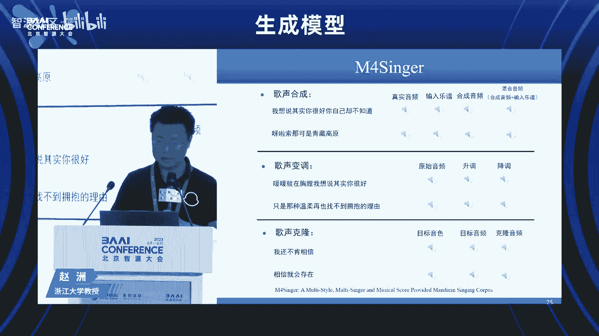

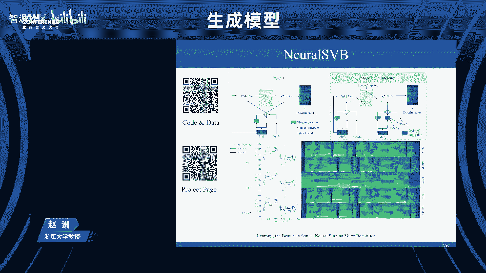

这个是英文歌曲，wear beautiful like diamonds in the sky。We're beautiful like diamonds in the sky。那么除这个之外呢。

呃之前呃所有的之前的工作是比如基基基于那种细粒度的一些乐谱。也就是说我们是基于音素级别的一个音高的一个输进去的一个文件。那么呃对于我们的呃乐谱，网上的乐谱能否直接是放一个乐谱来做这个事情。

这个是实际上是建模了一个呃词级别的乐谱的一个signner，从直接的realistic的乐谱来过。我们可以听一下它的一个呃performance。光阴如梭一所在，去一所至。😔，裙丝百转，丝丝沉乱又不知。

😔，对，除了这个之外呢，我们还有一个非常好的一个呃那个基于之前的呃那个之前的好玩的东西。就是说我们是不仅是可以从我们的呃pe到呃的一转我们可以pe直接是转化为歌声。

我们可以听一下他的这是一讲话的声音我们可以看一下他的ment。从我们的一个 speech到的一个一个呃一个映射。那么呃因为之前的是呃开源的。那么我们可以看一下。

有不同的一些其他人用开源的做出来的一个效果。那么这个是一个B站。我们呃可以搜索一个B站呃的的一个呃呃这个一个创作。那我们可以看一下放一段呃我们的呃B站的一个呃呃第三方的一个用工具来做出了一个效果。嗯。

喂，这个是有有问题。🎼这句一把星辰在手心啊，这个是第三方的歌曲合成一个完整的歌曲，遥远的眼睛。🎼窗外传来记忆的声音。😔，🎼在半夜迷失，在梦间消失却幻想着夜晚之前的。🎼一种逃离，听成中少年的声音。

有着清澈的眼睛，嘴里还说着，因为我们还年轻，所以总有再一次的。🎼的权利我也消受再家，风月梦幻，把相遇念留下，可看到盛开。唯摇曳的花，却能以自把。🎼曾经路上的风吹。🎼一个的他就不必害怕笑的问。🎼放大。🎼。

🎼对，那个呃其他有很多的case，那么直接进入呃B站搜索。嗯。🎼最翻页是吧？好好。🎼对呃，其他有很多的case可以呃搜索进入B站。那么呃点击keyword呃d。那么呃这个是一个那个搜索的一个呃。

这个是一个哎。🎼对，这个是一个呃搜索页面，大家可以呃 try一下，就是说呃有一些不同的一些呃第三方。那么用的呃工具，那么做出来的一个工作。我们可以看一下这个上面是一个呃fin的一个乐谱。

它的一个是基于这个来进行一些合成。那么这整首歌是呃完整的一些合成，大约是4分钟的一个合成的一个一个一个现象，合成现象。对。🎼那只看这下匆匆一簇繁在手中，那也有更多的一些例子。

因为我这次demo的一个例子，并不是它这个排名最高的例子。那我们可以看一下，它排名最高的呃都有非常多的一个浏览量是呃今年的呃突然是大家对这个是非常感兴趣，非常感兴趣，有非常强的一个浏览量。

用呃的呃呃开源的model来来制作这么一个呃歌曲。那么放到呃放到呃B站上就会有非常强的一个强的一个呃访问量和观看量。🎼し。🎼是你。🎼想说再见吃再见，把你和我留下与自己重叠，并格在一刹那短暂秋叉。OK好。

那我们就是粗略呃可以呃感受一下，就是说呃现在目前的呃呃生成式模型啊，在我们的歌声呃做出了一个呃做出的一个效果做出一个效果呃的一个程度。

那么呃这个是之前的是呃在上面呃可以呃在B站上面可以呃有更多的一些的一些呃demo。那么接下来的话，我们是呃呃讲讲一下，就是说我们再把我呃深成式的模型从呃语音扩展到呃比较有表现力的呃歌声。

那么再扩展到呃更难的一个是呃一个音频。那么音频的话对于歌声来说呃，它不仅有表现力，它也有非常强的一个开放开放能力开放力。那么在呃在我们的歌声的上面的话，我们可以看一下它呃。对。

歌声的呃auo上面它是有更更强的一些开放域。所以我们是从第一个开放域来做。那么呃开放域做的话，首先是介绍一下第一个工作也是基于diffusion的一个application。

那么叫做呃make an audio makeake an audio。那么呃thanex to的 diffusionmod。那我们可以从什么呢？我们从可以从text呃上面给呃给我们的音频来进行配音。

那么我们可以从呃图片给我们的呃图片来配音，包括视频也可以给视频来配音，呃，放包括是音频的一些修复。呃，也可以来进行配音。

那么虽然我这个这个呃画的是呃文本其实我们support呃4种模台四种模台的一个音频的一个产生音频产生。那么第二个是呃对于我们的text来说，我们依然是做的呃不够完美。

因为呃对于我们的短的一些text来说，我们是。OK我们我们是我们是生成一个的一个音频。但是我们对于音频来说，它可以类比于我们的video videode。那么video的话呃有一个非常大的一个问题。

就是说它是有tempal信息。所以呃所以为了考虑这个tempal信息。那么我们有一个make an audiomake an audio那么呃我们通过我们可控我们输入文本的一个信息。

比如说我们先输出一个鸟叫再输出一个卡车声音再输出什么，它有一个个信息的一个一个建模再进行make an audio to那么make an audio的话是make an audio的一个升级版。

那么在make an audio的时候呢，我已经可以支持我们的一种不同模态的一个过程。所以呃在这个上面呢做了make an make an voice那make voice的话除了我们把make audio之后的文本包括其他的进行离散化之外。

那我们通过离散化和音频表征的。双重的一个解偶，那么先map到semantic model，再呃map到acoustic再进行合成，不仅是解偶也是进行离散化。在离散化之后离散化之后。

第三个就是做auio因为auio的话我们无论是输入呃 speech无论输入呃t。那么呃有不同的一些任务。

不同的一些任务有不同一些res就是说呃可以是让他产生au可以是唱歌可以是做呃 speech translation可以是做呃pe to talking face的呃 synthesis那么不同的一些任务。

那不同也一些任务。那不同一些任务好了以后呢，呃这个是auio g one audio two呢是使得auioP one再更进一步。因为auioT呃auP呃one的话。

它based on主要based on。GBT来这个呃foundation model进行构建不同的呃生成式的一些模型。

那么audioGPT two在呃是呃做了一个unified language model，可以支撑呃不同的模态到不同的模态的一个呃translation translation和 synthesis的一个呃一个一个过程。

那么我们首先看一下这个make making audio audio的话是一个在呃我们的音频生成里面的一个呃第三个赛道，它因为是有的非常的广阔的这么一个呃开放的这么一个事情。

它可以用到比如说有声读书啊配啊等等等等，都可以有非常强的一些用处。那么得益于非常呃得于我们现在比较好的呃大的语言模型呃，一个是c一个是capap。那么clip不陌生呃。

对我们的视觉来进视觉和语义进行一个编码。那么cap的话是对于我们的音频和文本之间的一个编码来进行指导。那么包括是在利用了呃lausionusion的model。

我们呃创了一个classify free的呃呃laclass的class free的 model。那么对于我们的音频来说，呃，最大一个问题在于我们对于音频来说，我们需要非常非常强的一些data。

非常强的一些da。以至于我们可以呃生成的呃音频更加有开放性。但是呃我们在我们的 website来说，我们并没有这么强的一些da那么这么多的一些da。那怎么办？在m an audio one的时候。

我们是做了一个呃基于 enhancement。那么这里是呃design了非常多的一些 rule非常 rule。那么对于我们的audio和text来说，可以进行不断的一些拼接。比如说呃这里是呃鸟的叫声。

这里是呃脚步的一些声音。OK那么鸟的叫声和脚步的一些声音可以呃可以通过不同的一些不同的一些拼接，不同一些拼接，可以把它组成组合成更多的一些音频用来它的。训练那么对于data来说的话。

我们是呃做了一个呃s prompt enhancement。那么呃通过拼接的形式产生更多一些data。那么最终来train这个model的时候。

是用了3000个小时和100万个audio taxs呃来呃来来做这么一个呃model的一个训练。那我们可以看一下它的making audio making an audio one making an audio one呃。

它的输入prot相对来说比较简单。我们可以看一下它的一个呃呃打雷呃和下雨呃，这个pro输进去。哦，能能不能帮忙放下？对。对，当我们可以支持呃打雷和下雨呃，以文本的prot输进去。

第二个是我们是支持呃图片。那么。对，这个是呃，这个是一个呃开车的一个呃声音。对，就开车一个声音。那么除了这个文本的之外，那么呃也有图片的一个prot。呃，请点击一下呃图片的一个。边楚吧。你定。B。嗯。

不。嗯，请联系一下这个图的视频和图片那个呃是。对，这个是呃右上角的图片呃生成的audio。那么以图片作为prompt生成了audio。那么下面的话是呃我们的呃video。

那么点击下这个是呃我们的烟火作为一个呃shot video生成。对，这个是支持呃他的一个video呃 videode作为pro呃来产生这种audio。那么呃音频呢就没有放在这。

那么支持不总的modelality。但是它这个还有一个问题，我们可以看一下它的pro现在是输进去它的关系来说的话，它都是一个呃基本上都是一个并列的一个关系。而且它的pro的话。

我支持的一些pro不是特别的复杂，就特别复杂。但是如果我们是希望呃能够生成更加复杂的一个呃生成更加复杂的一个audio，也就是说可以sup更加复杂的一个pro。

所以有一个make audio make audio的一个版本。那make audio的版本呃基本上是沿用了make an audio one。但是呢在对于我们的增强的数据增强的时候呢，并没有。

并没有基于规则的形式，而是用了现在大语言模型。那么进行大语言模型的时候，呃，大语言模型来进行增强。第一个第二个是对于我们的呃我们的一个我们可以看一下，这个是man speak，呃。

首先然后是呃狗叫do bark，然后是呃 birdr trip。那么这个生成是man speaking then a dog back with birth creeping in the background。

那么这个是呃对我们的prot来说，比之前的要复杂的多复杂多。这个是make on to的一个pro。那么呃总的来说是呃用了3。7K的 hours呃，3。7K的 hours data。

那么呃perform我们不看了，我们看一下几个呃量例。那我们可以看一下这个是一个呃。그는。Yeah。但是A man followed by goating then mental gateing as dark pass and window to myphone那么这个是一个呃比 making audio one更加comp的一来进行支那么呃呃这里也可以看一下这个是 vehicle engine那么le than呃。

Okay。No。对他他是对于我们making audio one的一个一个增强。那么这里面是用了很多的一些呃呃理解以及技巧，包括是理解顺序它的呃时间发生的事件的先后的顺序，先后的顺序。

那么来更好的一个来来做这个事情。那后面的话是做了一些呃更加gene的事情。就是说我们是希望呃把我们的呃mod可以做更加更加通用化的一些模型。

那么不仅是我们的tex包括呃我们的我们的pe进入mantic token和ous token进行一个呃非常好的一个解偶。那么跟我们的ide一样man token我们是capture我们之前的语义的信息。

那么这个是音频的一个信息。那么呃跟我们的 tS和我们的 speech一样做语义的方面。解耦和音频方面的解耦，而控制的话基本就是加在我们的音频的acoustic呃 conditiondition。

accoustic condition然semantic meaning的话是是固定的一个解耦的一个方式。

那我们可以呃呃可以呃看一下他的一个呃呃 with a start then I remembered how I lived alone是 writing bad poems and eating out The head of the patchwork Gro was the most curious part of her。

呃，support不同的一些呃 task，同时support呃呃zeal short的呃text to speech，包括zero short voice conversion。

包括zeal short呃s voice synthesis。我们可以呃先听一下歌声。梦也不自由哦，这个是输进去的一个pro这个progenative因为在00年后这一 dear short voice conversion这 wouldn engineer long这 source prompt nothing is more lugubriious than the contemplation。

 thus in its nudity in the broad light of thought of the horrible swarming of slang。

We wouldn't engineer alone。对，这个是一个呃 makeake voice的一个版本。那么最后我们是呃呃介绍一下呃。

最后续的工作是audio gPTauio gPT呃的一个工作是把之前的我们之前的工作进行集成过去，它是可以s不同的一些task。就像我们这可以看一下。

我们是实呃一个是从au to呃 text audio to audio audio to event audio to呃 video以及是text to audio包括au to text image to audio以及是呃music score to audio的一些不同的一些工作。

它是一个呃一个能力。那么呃这的话我们可以呃呃放一个呃呃example呃，来 show一下他的一些能力。啊，请播放一下这个呃这个example。你说你不懂为何在这时牵手。😔。

这个是generate一个呃music，这个是generate audio。那么这个是一个呃right caption about一个auio。变数板。

I'm happy to help you here we go。I'm happy to help you。 Here we go。Here we go。🎼，'。Yeah。哎。

这是我们刚才看了一个demo，它是一个呃从我们的呃text to speech的语音合成模型，跨越到更加泛化和更加通用的model。那么在一个呃基于 speech对话场景的情况下。

我们可以呃让他可以做不同的一些呃task。那么这些呃我们的工作呢也是放在了呃get up，大家也可以在呃 face try一下。那么这里也是有呃demo配置。那么后面的话呃。

后面的话我们是在呃呃现在还没放出来是au。那么我们在编码的时候，我们用了自己的一个编呃一个离散化编码的一个框架和unifying。那么对我们进行系列的个升级的工作。

那最后总结一下们我们今天主要是给大家分享一下我们这几年的一个呃呃呃在音频合成的一个个系列的工作。那么主要是三个系列解决三个问题。呃，第一个呃系列是主要是做语音人说的声音人说的声音的工作。

那么做了一个是做并行的推理那是做多性的映射那是做了轻量化那做了多音和基于语模型的是那了这个之外呢，我们也做了呃歌声。那基于。

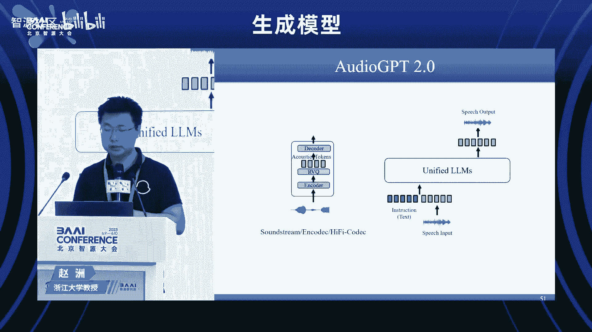

一个应用的一些歌声和低于diffusion model的应用的make an audio。那么歌声的话呃有不同的表现力的呃工作。audio的话有不同的一些开放域的一些工作。那么谢谢谢谢大家。

非常高兴有这个机会。在支援大会上呃分享一下我们呃近期的一些工作。那谢谢呃谢谢各位老师，也谢谢各位同学。啊，非常感谢赵周教授的这个精彩的报告。然后我们这个呃一个问题吧，我们有一个现场的Q问题。好好。

请请你嗯，不好意思啊，我们可以后面还有圆周会议，我们再再跟赵周老师交。你说就是谢谢赵老师带来的这个工作。然后我也关注过你们那个和那个数据集就我的问题其实很简单，就是说在AGPT2。0的时候。😊。

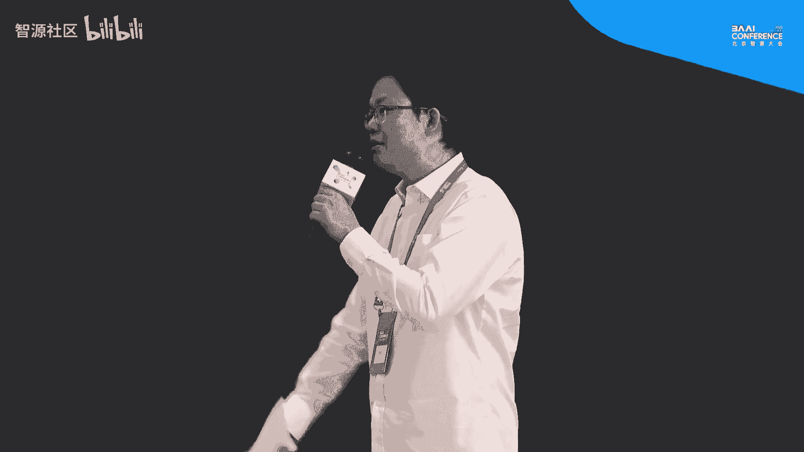

呃，在这个就是通过这个VQ嘛，就是通过这个incode的VQ。那其实。我就在好奇，就是说这个VQ它的会不会损失一些信息什么的。然后刚好您在前面说mega tTS的时候。

发现这个token是呃适合在韵律上面去建造呃整个语音的。呃呃呃谢谢你这个问题。呃，其实是呃有一种做法是现在做法的是，比如说我们直接把spech转化为呃呃 token，但是呢我们发现有一个问题。

就是说呃它我们我们的pech是一个音频音频它是跟文本不一样的一个一个一个modality。因为呃文本的话，它只是涉及一些语义的信息，所以转化为token是呃很reasonable的这么一个呃过程。

但是音频来说它比文本要呃要更加复杂。它有语义的一些呃信息，它有audio的一些信息，包括audio信息，比如说是有韵律信息，包括它时长能量呃音高等等等等等等的一些一些其他的一些 attribute。

那么我们在做这个的时候，那么参考我们的。

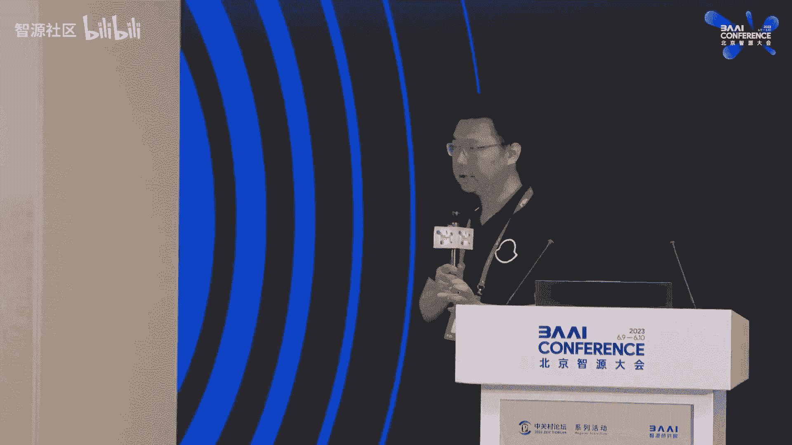

TTS的一个事情，我们呃做了很多的实验，我们发现就是说直接把我们的呃spech直接转化为呃token用呃语言模型，在呃audio和spech这个场景是呃效果不是那么的好。

因为不是说它里面的所有的属性都是合用作离散化的这么一个过程。那它会呃损失一些比如说音质啊等等等其他一些问题。所以说我们是我们做我们的tokenization的时候，我们采用了呃第二种策略。

我们是对呃我们的spech进行一系列的一些解耦。就是说我们是呃现在是用了我们的韵律，包括我们是用我们的呃音高这一些属性，我们是做呃它的token，用我们的呃我们我们的离散化表征。那么有一些的话。

比如说像呃。duration这种 durationration的话，我们依然是用我们之前的nt speech这种框架来做这样子一个预测。所以说在我们的工作里面。

我们是呃先呃我们是不同的呃先进行解偶不同的一些属性。那么作为ration继续用dration prediction来进行预测。那么音高或包括韵律的话，我们是用token来进行预测。

那最后我们又是fuion成了我们的呃这样子一个呃一个model。所以说我们不是很简单的就是呃用现有的一些工作对它的直接作为的一些呃结偶和离散化工作。因为这个效果包括音质不是特别的好。好，谢谢。

我们再次感谢赵州教授的精彩报告啊。😊。

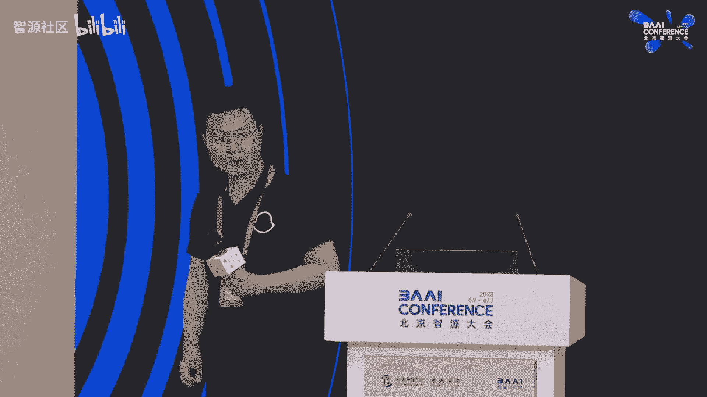

这个我们呃这个下一个报告是来自于这个呃北京智源人工智能研究院NLP与多模态研究中心的啊刘广研究员啊，刘广博士呢它是flag AI的核心贡献者。他的主要研究方向是大语言模型和多模态文声生图的方向。然后呢。

今天这个报告也是非常非常有名。他呃给大家汇报一下这个呃低资源的多语言文声生度模型啊，altoMAT是吧，是一个非常非常漂亮的一个呃多语言的这种文道图的生成模型。好，我们欢迎这个刘广博士。

非常感谢大家今天来听我们的这个讨论和分享。然后呃我这边分享的主要呃题目就是一个基于低资源的、多语言的纹身图模型的呃这么一个一个一个改进。😊，呃，首先大家对于这个纹生图肯定都不陌生。嗯。

但是这个领域呢其实发展是非常快。呃是在最近的时候，其实在一年以前，大家其实对这个领域可能还不太了解，都没听说过。但是在最近呃就是去年5月份呃deEOI推出deE之后，完成图的那个发展就非常的迅猛。呃。

但是open eye他没有open他的那个source code和他的model。所以说后来有很多公司在follow这个工作的时候，都是呃闭然的状态。就比如说百度。

谷歌呃me journey他们呃这个效果是非常好，就是当时但是效果非常好呢，同时也带动了一大帮那个社区的一个用户跟他们进行交互，然后帮助他们的那个质量提升。但是呢没有一个开源开放的一个代码。

所以说在这种情况下，就是呃stable diffusion横空出世。他把他的模型权重和所有所有的代码都已经公开出去。然后效果非常惊艳。然后从去年的9月份开始到现在的话。

就呃不断的持续的呃有很多的新的模型出来。呃，这边的话就是一个他的一个新标的一个增长，现在是可能有更更增长更快的。像像off的那个chGBT。

所以说现在很多的这个开源社区基于s diusion做了非常非常多的一些改进和大家都是用s diion的一些衍生的产品或者是衍生的一些模型做很多有意思的一些应用。

然后所以说我们其实工作也是呃基于这个ion去做一些改进。呃那我们在这里就先简单跟大家再重新回顾一下ion一个什么样的一个状态，是会是什么样的一个组件嘛。最开始是呃呃ion有三个主要的组件。

就是右上角的一个frozen就是clip模型。刚才呃刚才赵州教授他也说到了，clip模型其实是一个比较强大的一个文图匹配的这么一个模型，他可以提供文字到图像的这么一个相关的一个表示。

但是呃这这个这个模型它是把文字编码成一个bedding到一个引用空间。然后这是第一个组件。第二个组件的话是说把文字和用于去做一个dnoice的一个操作，就就跟那个呃就是把一个白噪音逐步的还原成一张图片。

所以说。这个cep模型它实际上是提供了一个condition，就是让这个图片知道往哪个方向去做D noise，然后使得生成质量符合这个我们文本的输入。除了这两个组件之外。

就还有一个叫做呃oping hold的一个组件，就是把一张图片压缩到一个影空间，从一个影空间再还原成一张图片，就基本上这是这是这主要的三个组成部分。对，现在那就是纹身图这方面，我们呃跟进了很长的时间。

其实它本身的这个周期也不是特别长，但是我们一直在跟进跟进的话就发现，其实在纹身图研究领域有三个我们自认为的呃主要问题。首先是一个是高质量数据集的一个呃缺乏。大家都会觉得哎高质量数据集。

其实赖案他们有一个两B的英文的数据集。呃，两B就是20亿，然后5B的一个多语言的数据集，所数据量是非常大的。那么为什么还会说缺乏这样的高质量数据集呢？因为是。嗯，开源数据集它的质量是参差不齐的。

就不不一定就是所有的开源出来的数据集，你都直接能够用于去训一个高质量的文图生成的一个模型。呃，同时他的语言分布是极度的不均衡的，就是绝大部分的呃。这个文图数据其实都是英文的。然后其他的语言。

比如说中文它的分布量就没有那么多。同时这个文妥的数据获取也是比较困难的，就是可能没有那么多高质量的。比如说艺术创作或者是呃封封面设计海报等这种数据有一个高质量的一个可以获取的渠道。呃。

这所以说所以说这个高质量书籍是我们去做一个文图研究的一个主要的一个挑战。第二个呢是说可控生成。就是现在有很多研究，比如说jibo，比如说laura，他用这种方式去做一些快速的新概念风格人物的学习。

但是这种其实也是呃呃效果可能还需要有一定的提升，或者是需要额外的一些组件或者是么其他的模型进行一些组合，才能够做的比较好。然后另外一个是在生成的时候，可控性，它还不能做到非常的高的精度。

就比如说我们要去重新生成一张图片的时候，呃，当然现在conttrolnet等等一些工作已经可以把这个精度控制的比较好。但是对于背景。

或者是我们要要做到那种视频呃那种背景级别的呃完全可控的那种精度其实还是有一些有一些gap。第三个是说呃怎么样去实现一个复杂的编辑。比如说我们要同时做很多个1一系列的操作的时候。

怎么样把这个图片的可控性生成的可控性提上来。所以说这是另外我觉得是另外一个可控呃呃一个挑战。呃，第三个挑战其实是纹身图的一个评价。现在有很多纹身图的模型，然后它看上去生成的效果也还很还不错。

但是我们怎么样去评价它呢？这是一个比较难的一个问题，就是生成模型共同的一个一个问题，就是说自动化评价指标跟人的这个主观评价的指标可能一致性比较低。但是人工评价呢，它的成本又比较高。

所以说就是没有一个统一的评价标准的定义。所以我就我们就针对这三个呃难点，其实主要是针对第一个高质量数据集的这个问题进行了一些呃研究。首先就是介绍一下啊，就是我们做了一些分析。

就是可以看到有中文的和就是最左边这个黑色图，就是中文上面有洛亚呀，有ze由ro的这些中文的开源的图文的pell的那种数据集，它的数量。以及下面co有和烂两壁的图文书籍的质量。

他们是有一个明显的一个差距的。然后那样5B里面的这个有一个数据叫做marty那两B，就是他是个多语言的。那么在这个多语言语言的分布上面，大家可以看到，其实是很不均衡。有的语言非常多，有的语言非常少。

那么针对这种问题的话，我们如果要想要训练一个其他语言，就是可能是除了英文之外的其他一个语言的一个文图模型。可能他的数据量就不够了。那怎么样去解决这么一个问题？呃，我们刚才其实可以想到。

刚才有两个主要的组件，一个是那个cep模型，一个是那个unit，就是deno那个模块。所以说我们就先为了训练一个or diffusion的呃就是一个diffusion的多语言版本。

我们先训练了一个多语言版本的cep。就把可粒模型通过一种呃叫做可以叫做 teach learning或者是蒸馏的方式。把一个。本身需要大量图文队去经过训练的这么一个呃文图表征模型。

我们基本上没有用到图文队的信息，也可以达到一个比较高的水平。所以说可以看到右下角。是我们完全没有用到图文对的信息，只用到一个平行语料的信息去做了一个这样的处理。这个方法是很简单。

对我们其实也觉得它的效果没想到它的效果会有这么好。对，所以说就是在只用图文退的信息，把呃英文和中文这样子分别去做一个蒸馏，它的效果就会非常好。呃，这说起来很简单啊。

但是之前有很多同类型的方法也去做过这样的实验。但是他们有一个缺陷。就是他们在获得了一些中文的能力的时候。其他就是英文的能力会有一个极大的降低，就是我们可能就是变成一个纯的呃其他语言的。

比如说中文的一个模型，但是中文，但是在英文能力上就下降的会比较厉害。呃，我们这种方法的话，就是说不管是在英文还是中文，英文上是非常接近于原版的克利普的性能。

但是中文上呢或者是其他语言上是会达到一个sota的一个效果。呃。这篇文章虽然看上去简单，但是也。也中了1个ACL的fin。然后后面这篇就是为了我们去做一个纹身图的多语言版本。

所以说我们就做了一个多语言的c力模型。做了可粒基模型之后。我们在把这颗粒模型接到原来的diffffusion模型上，就做了一个扩展。相当于是把呃原版的sable diffusion的2。

1换展成了1个18种语言的一个文图生成模型，支持18种语言。在这个过程中，我们发现一个有意思的现象，就是我们用同样一句话把它翻译成不同的呃语言，输入到diffusion模型中去。

它的生成的图像是比较类似，但是它又包含一点类似于那种文化背景的信息。比如说。用亚洲的语言，比如说中文韩语或日语输入到生成一个小男孩的时候，去生成的小男孩可能就是亚洲人的脸型。

但是如果是用嗯欧洲的西方的甚至阿罗伯的语言去输入到这个文图生成的模型里中去，他可能会带有他们。某些时候他会生成他带有他那种民族特色的这种练习。这个现象很有意思。

就是我们其实不是预期他会有这样一种文化的气息或者文化的信呃呃信息在里面。但是呢。我们能发现这个这个现象。后续其实我们也想去去挖掘更多这样的信息出来。这个这个这一点是说。

如果我们有了一个非常高质量的英文的呃纹身图模型，是不是就已经够了。我们其他语言的那些呃不同的文化的信息，是不是可以完全通过英文表达出来，这就是我们其实想去去去做的一些工作。

就说我们觉得其实有很多呃呃信息是跟或者是语义或者是文化，它是跟语言绑定在一块的。如果。你用英文去表达或者其他语言去表达，你就丧失了这个原本的那些文化的意味。比如说什么北京的四合院啊，比如说那个那个。

北京比较著著名的那个叫做什么胶圈，这些你用翻译成英文，其实可能就完全不是不是他原来的意思。对，然后。呃，下面介绍一下，有了all diffusion呃，M18之后，我们做了一些事情。就是我们分析发现。

他其实对于文化和语言是可以有很好的一个理解和诠释。然后我们就做了一些分析，然后呃去用一些proms去激活它的一些呃中文特色的一些信息。可以我们待会可以看到。那另外一方面是说。

我们去呃想去接入到那个开源的生态，就是把我们的呃。at diffusionM18可以接入到contl net，接入到laura，我们也受了一些case，其实可以完完全无缝的兼容。

同时呃之前提到了一个可控编辑，高精度的可控编辑。我们做了一些尝试。当然这是另外一个呃研究工作。然后可以看到就是我们只是在输入中文，然后加上中国化这样的情况下就可以输出很多符合中国文化的这种嗯这种图像。

比如说中国的一些虎啊，然后荷花，然后那个就是海上日出。这这种生成其实是需要做一些参数的或者是prot的一些选择。但是如果是基于中文本身去做的话，它这个工作量会稍微小小很多。

同时还可以基于这个base模型，再继续在中文的数据集上进行一些contrain或，然后效果会进一步的提升。同时呃，这个inending的能力也是有的。

就比如说把这个带着珍珠耳环的上语可以改成不同的一些风格和形象。比如说这个case我们其实呃是一个中英混合的一个输入，就把一杯水其中musask掉之后，可以做各种ining的生成。呃。

我们是觉得是这个效果还是挺好的，挺惊艳的。所以说我们就拿出来看一下。所以大家可以就是其实我们这个呃模型已经接入到开源社区的那个呃webUI。

就是微博11的那个微bUI那个嗯开源的开源的工具中可以直接调用，可以跟他现在所有stabletable上的开源工具做一个无缝的接入。同时那个我们之前的版本，我们之前有过两个呃，版本，一个是双语版。

一个是九语版。九语版呢是可以跟那个contrnet做无缝接衔接的。可以比如说我们可以去非常提取出一张图片中的一些呃特征信息，然后基于测试信息进行高精度的可控生成，是呃可以利用现在的开源工具可以做得到。

同时那个就是另外一个case。就比如说从这个左边左上角的一个图片，其如它的那个深度图，然后基于这个深度图输入到我们的M9模型，加上contrnet这个这个这个框架。

这这个这个额外的一些参数直接切换过去之后，就可以做这种基于深度图的合同生成。还是比较有意思的。当然就是现在关于可控的或者是个性化生成方面，是laura是比较。用的比较多的。

就我们也做了一组demo的实验，就是说把几张图片输入到这个呃把几张就是大概七八张这样左上角这种风格的图片当中输入。经过我们的一个训练之后，可以生成同样类似风格的一些图片。对。

我们其实也做了一些刚才类似于呃张教授说的，我们把呃模型就是那个我们最新资源公布的大语言模型和我们的dusion模型做了一个对接，可以用文字输入。去做一些呃呃图片的生成。

同时还接入了一个叫做多步可控编辑的一个模块。那就可以。看一下效果。他其实就是在。编辑的同时能够很大程他他做了两个事情。第一个事情就是che sort，就把一个复杂的多步的呃指令。

就比如说我要把他的皮肤变白，把他眼睛变蓝，同时要把它动漫化三个操作输入到语言模型中去。语言模型首先做的第一个是叫che，就是把它指令分解，分解成多个指令。

然后再调用我们的那个高呃基于指令的微调的一个指定指指令去做可控图像编辑的这么一个模型。然后可以在很大程度上保留所有的呃细节信息的同时，去对非常高精度的可控的那个部分。

就是你文字中描述的那个部分的区域进行一个呃高精度的一个修改。所以说这是呃我们现在做的一些尝试。现在还在嗯在这个呃。开发的过程中。对，然后刚才说的那个评价。

其实呃我们是经过了我们提出了有我们有一个呃图图文多模态和纹身图的一个评价的体系和指标。然后基于这个图呃，他们的评价呃结果肯定说是说我们其实在各个方面都是非常强的。在各种不同语言上，应该是现在是so塔。

多语言上面应该是sota。呃，刚才说到那些所有的模型和工具和训练的流程和微调的流程都开源到了那个flagI这个开源平台中，大家可以扫码加入，然后可以大家一起去。去不断的去呃。

我也邀请大家加入到这f这个开发的这个呃呃社群中来。对。

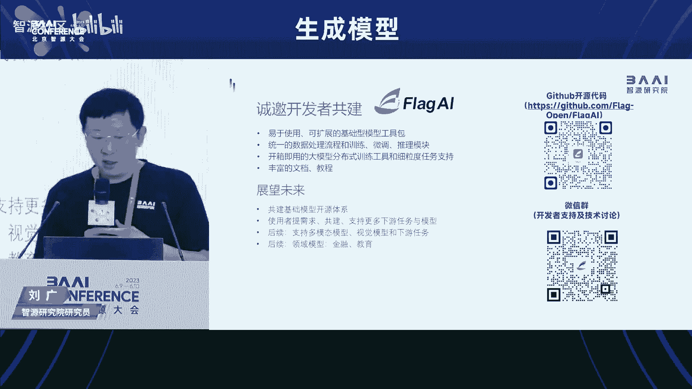

好的，我我们感谢呃刘广博士的精彩报告。然后我们有时间可能一个问题，然后欢迎后面呃在线下和刘广博士交流啊。我们看到那那边有一个问题，能能把麦克风递过去吗？😊，我们。好好，麻烦你啊嗯。哎，好。

感谢刘老师的分享。后呢其实我们也在follow这个这工作。然后在这个进行之中呢，我们发现了一个问题，就是说他在这个中英平行语料这一块的，不管是cl能力和能力都可以和SD英文能力达到一个很好的个对齐。

但是我们发现他很难进一步提中文理解的能力了。比如说像你刚才提到的这个胶圈斗争的理解问题。当我们引入了我们自己内部比较好质量的数据的候，我们会发现他会急的破中英对齐那部分的能力。

在这块的话还有一些比说这个非常高效的方式可以达到英文水平达到国外比较好的标准，同时可以进一步提升中文能力的这种方式嘛。好，谢谢老师。😊，嗯，谢谢这位问了一个问题。

然后这个问题其实我们之前呃呃这个问题其实我们也想到过，就是在把双语扩展成多语甚至是十八语的时候，他我们想进一步做提升的时候，会遇到这个同样的问题。就是不管是就是型还是ion模型在做进一步提升的时候。

他会就是数据的不平衡，或者是把不同的语言混合到一起去进行这个对比学习或者是模型的训练的时候，都会遇到这样的问题。我们现在还暂时没有什么特别好的方案。但是我们觉得可能就是在呃学习的策略方面。

就比如说我们可能需要把不同语言的数据混合到一起进行继的训练。这样可能类似于语言模型现在去做就是，你如果只是在一个任务上去做这个学习，它可能会导致模型的下。

我如果我们把它呃这个diffusion模型比作或者克模型比作一个base模型的话。那么他如果只在某一个语言上去训练，他肯定会破坏他的语言对其能力。如果是把多种不同的平行的语言的数据放在一起去做训练。

可能会缓解这样的是问题。对呃，我再继续问一下，就是说你说这种数据混合扩充的方式，可能是一个正确的方向，但他会可能逐渐演成一个不是很高效的一个方式。对，这这这个问题很尖锐啊。我觉得其实是。

但是这个不高效的话，所以说现在我们是提供了一个很快速能够达到一个比较好的一个水平的一个呃呃基础阶段。但是后续该怎么样再逐步提升。我觉得可能需要进一步的去探讨和研究，欢迎交流。对好，谢谢老师啊好。

我们再次感谢刘广博是非常非常精彩的报告。好，也谢谢刚才那位的提问哈。那么我们这个我们欢迎欢迎刘文文好，呃我们接下来的一个报告是呃来自于这个UCLA的这个助理教授呃，周柏雷老师。

他的研究方向呢是计算机视觉和机器自主性的呃可解释人工智的交互。然后他还对当前AI模型的各种人本属性，非常感兴趣。然后这些属性呢超越了他们的准确性啊，比如可解释性、可控性泛化性和安全性。

那么我相信大家都非常非常熟悉周柏雷老师。他因为他很。😊。

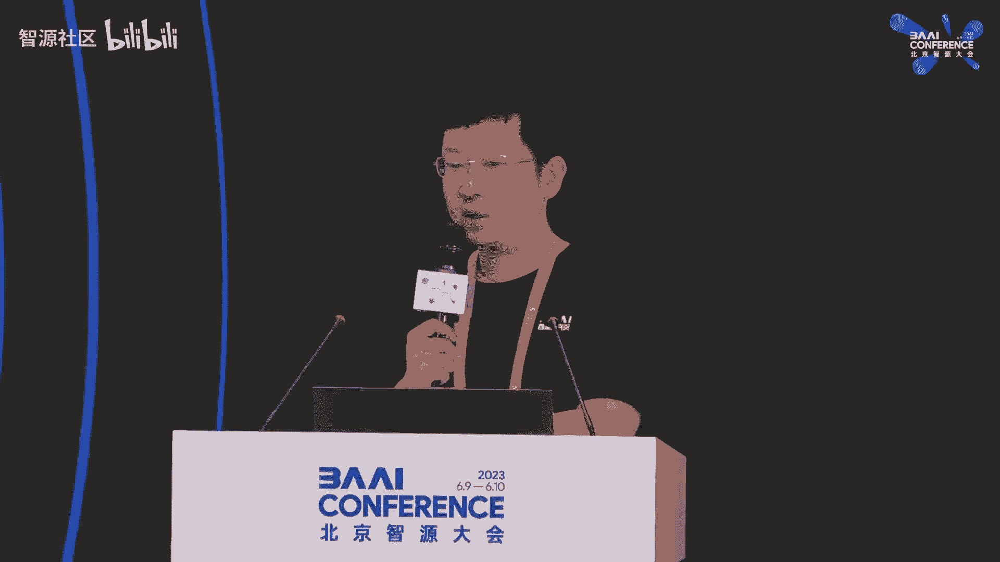

有很多的工作啊，非常非常的有名啊，包括ca什么networkde这些。那我这个闲话少说，我们把时间交给啊周柏磊老师，他今天报告的题目是啊基于这种鸟瞰图的可控可交互的大规模场景生成。好。

我们欢迎周老师OK嗯嗯谢谢李老师的介绍，然后也谢谢支援大会的邀请。嗯，小嗯各位老师同学，大家好啊，我是周博磊，然后现在是在UCA嗯助理教授，然后之前是在香港中文大学，然后当了三年的这个助理教授。

然后再再到这边美国来。嗯，然后我之前其实做了很多不同的工作。嗯后在在港东大阶段的时候做生成模型做的比较多，主要是在这个干的模型上面做了一些可解释性分析，以及可控嗯图片生成。嗯，然后最近在在这两年的工作。

其实是逐渐在往这个嗯决策分析。😊，寄走。然后嗯今天我是想给大家分享一下呃，我们在这个场景生成以及这个嗯场景仿真的一些研究工作。然后就是想把生成模型跟这个呃机器决策2块结合起来。

这样也可以给大家啊提供一些呃新的思路。嗯，那么我这里从这个嗯嗯场景生成讲起，就是我们这里关注的是嗯这种有条件的场景生成，就相当于我们需要给定一个呃输入。嗯，比如说我们现在希望生成这些接景图片。

那么之前有这种P two PHD的方法，它就给可以给一个这种语意图，然后作为一个嗯输入，然后它就相当于每一个颜色都代表了这个你想这个区是车，然后这个是数，然后可以生成一个接景图，然后现在也有这种大模型。

比如说打力 two，然后以及一系列的这种嗯文本到图片的生成，然后你可以给一个pro，然后它可以生成嗯对应的图片。嗯，当然这些生成结果都非常不错。但是它还是存在很多问题。

就比如说我们现在希望对一幅图片进行这种交互式的嗯编辑。比如说我现在希望嗯在这个。嗯，街景图里面，然后增加一辆车，对吧？增加一辆车的话，那一个办法是直接在这个嗯输入的语意图上面。

你去啊放一个车的啊这个ms。但是这里存在一个问题，就是因为这些车其实是它是在嗯它不不仅只是在图片空间，它其实是在现实生活中的话，它其实是在三维空间，就是这种鸟鸟瞰图下面的啊这种车。

所以如果你只是在图片上面啊，放一个这样的一个编辑的话，它其实是没法很好的把这个车的离离这个相机的这个距离啊表示出来。嗯，所以这里。更直接的一种嗯表征方式，其实是这种鸟瞰图的一个表表表征方式。

因为这个鸟瞰图就BEV，它其实代表了嗯这些物体在呃空间里面的结构啊空间里面的位置。然后它跟这种light数据呃比起来的话，就这种纯3D的这种点云数据比起来的话，它又是一个非常简洁的一种表征。

因为它直接是也是到2D的，但是它是从上往下看的2D啊表征，当然这样就比较方便呢，能让我们进行这个呃图片的这个编辑。比如说我们希望在某个位置增加一辆车辆，那么就可以直接在这个鸟瞰图里面把这个车放进去啊。

那么它它就有可能把这个车在图片里面啊生成出来。然后另外这个鸟瞰图的一个嗯比较呃有意思的一个特性是我们也可以用鸟瞰图来做一些这种场景仿真。你看这里呃播放的这个视频，就是你看这些车其实是。

可以我互互相进行交互。然后我们有很多的这种嗯自动驾驶的数据库，它它采集到这些车的轨迹，那么们就可以把这个场景的这种动动态运动，然后把它重建出来。所以这是呃鸟瞰图作为一种表征非常好的一个特性啊。

所以我今天的这个讲座会分两部分进行。就是呃首先是给大家分分享一下，利用鸟瞰图，然后进行场景生成。就比如说我们输入是一个这样的啊鸟瞰图。然后我们希望生成这种啊第一视角的啊这个这个驾驶的这种图片。啊。

然后第二部分呢，我是想给大家分享一下，我们基于鸟瞰图来进行一个这个场景仿真。因为就是这个图片生成过后，其实你并没法用它来真正进行交互。那那其实是我们是希望把它能放到仿真器。

这样我们就可以把一些物理的表征也加进去。然后这些碰撞的表征也加进去。这样整个场景就可以真正动起来。然后也可以跟下游的这些比如说自动驾驶的这些任务，然后联系联系起来。嗯。

那么首先我这里第一嗯第一个讲的一个嗯工作是这个呃BV啊鸟鸟瞰图的这个感知。嗯，其实鸟瞰图的这种感知其实也是嗯也不是一个新问题。但是是可能是这几年大家逐渐嗯注意到的一个问题。

然后大部分的这个鸟瞰图的感知都是集中在嗯这个感知任务就检测任务上面，就是输入比如说一辆车输入6个视角。然后它可以生成一个这种从上往下的这个语图片，然后象征这些车的位置。然后你有了这个鸟瞰图结果过后。

然后你就可以进行一嗯这种嗯比如说规划，然后路径规划，然后这样就可以计划出它未来需要产生的这个轨迹。嗯，所以近两年其实这个这种BVperception，其实是呃相对比较火的一个一个研究课题吧。

就是在在这种物体检测，以及这种智能驾驶里面都是很重要的一个研究课题。这里其实有一篇啊这种综述，其实就是在讲这种。啊，BEV感知的这个工作啊，对于这个BEV感知。

其实我我我们组很早以以前就就就就有相应的工作。这个 network这个VPN这个工作，其实是当时我还在MIT的时候快毕业的时候带了一个实习生潘博文，然后做的一个实习的一个他实习的一个工作。

然后然后这边工作也挺有意思，就是我们这个工作其实是18年就就完成了。但是整个搞到嗯20年才发表出来。然后中间也是历时了这个两年，然后五六次的这种巨稿嗯，就是被各自我这种CV的会这个剧了。

然后最后最后然后发表到这个ro，他其实是一个tic相关机器人相关的这个会，所以这个VPN其实是最早做这个BV的一两个工作之一。我没法说他是第一个做这个，但是他是至少是前三开。做这个工作。

因为我们觉得这个任务也是呃非常有用。就是你在机器人情况下面，你你给他一个第一视角，然后生成他这个嗯从上往下的视角，这样就可以拿来做很多呃应用啊，所以这个这其实其实也是一个工作，如果真的好的话。

他他他其实是可以嗯嗯成为一个好的工作的。就现在其实做这个BEV perception的都会去引用我们这一篇工作。嗯嗯这是一个题外话。然后我们回到我们这里想做的这个BEV任务，就是之前的工作室。

就相当于我们给入呃输入的图片，然后生成这个鸟瞰图。然后我们这里呃希望把做这个的反问题，就相当于我们想啊做这个BEV generation啊，我们这里就呃生成，然后就相当于输入是一个鸟瞰图。

然后我们输出啊是这个图片啊，然后我们就这个嗯就我就带了一个这边UCA的一个本科生。然后嗯alex然后对这个问题进行了啊第一次探索。为我们之前其实有有过一次调研。

其实并没有大家并没有意识到这是一个有意思的问题。然后我们就把它呃首次把它提出来做。然后我们这里就希望给一个这种鸟瞰图，然后生成嗯嗯不同嗯视角第一人称的呃这个图片。你看右边它其实我们有呃三个相机。

因为在自动驾驶那个车上面，其实它是有放了这种一排的相机，就就比如说三个相机往前，然后三个相机往后啊，这样就可以对周围这个有感知。然后我们这里是希望生成这个前面三个感知。然后这里技术难点。

就是说呃我们怎么把嗯这个鸟瞰图的嗯这种嗯作为输入，把它加入这个图片生成里面去。另外一个难点是我们希望不同视角，就比如说这个呃左左视角跟正面视角它有它的一致性。

因为这里我们这里三张图其实是分别从deder出来的结果。然后我们希望这个分别出来的这个结果，它它之之间是有这个重叠的。你看到它其实是有车辆的这个重叠。然后我们希望重叠的部分。然后他他也能保持呃一致性啊。

然后我们就把这个BV证，然后进行了呃相应的一个呃建模，其实也是用了比较标准的eccoder啊decoder的一个结构，就用了这种VQBEwo。嗯。

然后呃我们分别对它的鸟瞰图以及这个呃图片生成这个进行进行一个这个学习，然后再把2块呃联系起来。所以这个model其实跟这种打力 two就图文本到图片生成，其实有有一些类似。

就像我们这里编辑的呃就是incode就不是文本了，就是我们这里编辑的其实是呃incode其实是BEV，然后把BEV变成鸟瞰图变成这个呃向呃特征向量过后，然后再放到这个deder呃里面去解码。

然后能把这个图片嗯解出来。啊，所以我们就做了这样一个呃类比设计。然后这里有一个呃特殊的一个设计，就是我们希望这个不同视角。它的嗯这个呃注意力其实是有有对应的这个空间关系的。

所以就做了一个这样一个小的一个呃设计，就position enco的时候把。不同视角，它的这个特征相关性，然后把它放到这个啊self attention。啊，这样就可以可以让他确保它的这个一致性。嗯。

然后我们这里是嗯出来的一些嗯结果，就左边是啊我们放的这个top down啊这个这个鸟瞰图的输入，然后右边是我们分别在嗯6个视角下面啊产生的这个图片，嗯，其实效果还是嗯比较不错的。

然后我们这里用的deder其实就是用的这个BQBAE two。啊后我们学校也实验室也没有资源可以去让这种啊扩散模型，所以就就直接用了这个BQBAE的这个结果。所以它图片上面质量其实也还是有很多瑕疵。啊。

我们觉得把这个deder如果换成更好的deder的话啊，这个图片效果可以啊进一步提升。啊，不过这这并不是这个工作的重点，重点还是我们希望能把这个问题首先提出来，然后建立一个 baselineline。

这样大家就可以来来来做。啊，然后这是另外一个一个结果。你看左边是放这个鸟瞰图，然后右边是它生成的这个结果，然后你看到右边这个建筑，它其实就从嗯从前的那个视角里面，那个建筑就在呃右边，然后在右视角。

它其实也是有的。然后然后右下视角，然后它也是有建筑的。所以它它这个方法其实它是比较好的，能保证不同视角，从这个deder出来的这个呃结果的一致性，然后都能保证。嗯。

然后我们这里啊再再给大家看一个这个视频，然后这里左上角是一个鸟瞰图的输入，然后嗯上面一行是我们生成出来的三个视角的结果，然后下面一行嗯是是这个呃ground choose。

就是它原始这个相机对应的呃样本。你可以看到它其实是呃一致性对应还是很好的。因为我们这个鸟瞰图，它其实是一个抽象的表针，它只是告诉了这个位置有车，但是什么样的车，我们是不知道的。

所以它就是有这个呃随机的这个效果。你可以看到这里我们并没有这个呃持续的这个呃限制加进去啊，所以你可以看到它每一帧其实都是在变换。但是它跟下面这个嗯实际的图片，它还是嗯能对应上。

就是他有车的位置还是应该有车，然后有建筑的地方，它有建筑，然后有些地方他也会把这个建筑换成一个其他风格，然后以及加一些这种竖进去。因在这个鸟范筒里面，他对周围这个background。

他他其实并没有对它。进行这么细的这个呃分割。所你看到它其实出来的这个生成结果还是嗯挺有趣的，就是他可以把这个场景比较好的这个给给给重建出来。嗯，然后我们这里再利用这个BV证，然后做了一些呃趣味应用吧。

就是我们这里鸟瞰图其实是一个比较简洁的一种表达。我们可以用这个仿真器来产生它这个鸟瞰图。然后这里两个结果，就是左边我们是从我们这个自研的一个呃驾驶仿真器叫m drive的一个仿真器。

然后后面我会给大家再介绍一下这个m drive，就从仿真器里面拿到的这样鸟瞰图的呃呃输入，然后再放到我们这个模型里面去，然后就可以用利用这个模型，然后把第一视角的这个呃图片给给生成出来。啊。

这样其实你可以想象，那那后面如果我们能把持续的这个呃一致性能加进去的话，那我们就就相当于可以鸟瞰图得到的这些轨迹，我们就可以直接把这个场景的这个呃生成给给变出来。嗯，这是BEV站的这个工作。

然后嗯这里我呃一个潜在的问题是，就之前那个工作其实都是在做嗯单纯的图片生成。但是生成出来的这种第一视角的这个图片，它其实比较难直接用到一个呃仿真器或者这种实际的呃驾驶仿仿真任务里面去。呃。

我们实际是希望能得到更多3D的信息。因为越有越多的3D信息，让我们就现在我们可以呃越越好的把这个场景放到这个仿真器里面。呃，所以我给大家接下来讲的一个工作是我们从这个呃呃两维图片。

然后到到3D这种呃CDware的这个图片生成，就相对它里面包，它又不是一个完整的3D，但是它是1个2。5D啊相对的一个东西，这样我们就可以比较好的更好的控制这里面车的这些呃特性。嗯。

然后这里呃嗯这个工作是我们今年CVPR嗯发表的一个工作，是由我的学生徐一豪同学在在nap实习做的做的一个工作叫diing。那我们这里想尝试的是把生成模型给nerfner是神经场模型，两者结合起来。

因为nerf其实原始是拿来做重建的，它其实并没有生成的能力。所以我们是希望呃但是但是nerf model它自身带有很多这种3D的信息。所以我们想把这两者进行一个融合。

所以我们这里就想做一个这样的一个拍出来，就当我们有呃二维的这种鸟瞰图过后，然后我们可以生成这种呃三维的这种结构图。然后再从三维的结构图里面进行这种神经的呃 rendering这种渲染。

然后能把这个场景给呃渲染出来。所以我们今年这个diing就是这个工作，就是在做这样的一个。是嗯。就我们就就就提出了这个这个模型。然后它是一个我们说它跟nerf最大不同。

就是它是个genativener这种这种概念就它其实对它采样，然后它可以呃生成新的这个场景，所以我们就就把这个输入也加进去了。就是它输入其实也是一个这种秒瞰图的一个一个3D的一个抽象表征。

然后它象征了呃物体对应的位置，然后我们可以放到这个呃gen objectject generator里面去。然后我们背景也对单独处理。这样就可以把前景跟背景，两者都结合起来。

然后再利用了一个nererf里面常见的这种啊，然后嗯给它啊vol render出来，然后再再把图片这个 sample出来，然后这里然后我们也结合了一些干的一些东西。

就是把加入了一个这种dicriminator，后跟实际。的图片真实图片进行这种分分辨。然后我们也对它这个前景，然后进行了一些呃处理，就是前景。然后我们再加了一个嗯单独的一种这种干的一个区别器。

这样就可以使得前景图片，它这个呃效果也也更好一些。然后就相当于这样嗯把把一个生成模型干的一个模型跟这种啊nerf模型，两者做到了一个一个一个结合。

然后我们这里也有local跟嗯局部跟这个整体的这个呃分辨，利用干，使得这个图片它的真实度啊可以进一步啊上去，这样我们就可以对嗯通过改变这个输入的啊这个layout结构的不同。

那么我们就可以把这个图片生成出来这个图片也进行这个呃对应的这个编辑。比如说我们想把这个车的位置改变，然后它的朝向改变，这样就是它可以啊通过这个神经网络进行这个渲染出来。嗯。

然后我们也跟之前的一一些方法进行一些对比吧，就是在clever这种3D front，然后wemo数据库，然后上面都进行了对比。然后这里我们选的就是这种value干呃一级3D然后girae。

然后我们在这些场景里面效果都是嗯都是最好的吧。就对在这种3D呃3D3D aware generation这个这个细分领域的话都是最好的一个结果。目前。嗯，然后然后接下来因为这个这个生成模型。

它其实是跟跟nerf结合了，所以我们nf包含的这些有有有用的特性，我们都可以呃加进来。你可以看到这里因为ner它其实可以调整这个相机发设的这个方向。然后我们可以调整这个场景的这个呃3D结构。

然后这里图片它其实是这个呃vol rendering出来的，就把这个图片，然后我们可以改变自由的改变这个场景的呃这个结构。嗯，然后。然后这里我们也可以对对物体进行一些这种显示的一个编辑。

比如说我们希望调整这些嗯家具的这个位置，然后我们就可以在这个嗯秒瞰图这个结构里面，然后拖动它的这个嗯嗯方框，然后这个图片，然后它也可以对应的这个位置也可以把它呃渲染出来。然后右边这个对这些物体。

然后我们也可以这种translationlocation，然后都可以达到相应的这个编辑编辑的一个结果。嗯，然后我们也可以进行一些这种嗯嗯对物体进行嗯增加跟去掉。比如说我们可以把里面不想要的车。

然后在我们输入前面给它这个给它这个呃去掉。那么那么它对应的这个呃位置，这辆车，然后就被去掉。嗯，这样如果你只是在嗯两维的图片上面通过比如说diffusion model进行这种intending的话。

它其实对3D的理解并并不是这么好的，它结果并不理想的。所以就这种3D的呃编辑的任务就确实是应该是在这种3D的表征下面进行呃操作会更好。嗯。然后这里我们也可以做一些这种增加。比如说在这个场景里面。

我们希望增加更多的车，然后就可以在最前面的输入，然后把这个车放到它对应的这个3D空间里面的位置，然后他就可以把在2D空间里面把这个图片给生成出来。所以他就对2D跟3D之间建立了呃一个比较好的一个联系。

然后我们也可以进行一些这种restelling比如改变这个车的这个呃图片啊，它的呃颜色，然后它的这个shape啊结构，然后都可以改变。然后这是我们跟之前的一些方法比较，比如说这种一级一级3D啊一些比较。

然后我们对它相机控制都是要更好啊，然后以及。以及跟giraffe，然后也是呃有有一些对比，然后我们比giraffe能取得更好的这种解偶控制。呃。

因为我们在我们的情况下面是更更显示的去去对这些不同物体进行建模。然后现在在鸟瞰图空间进行建模，这样就可以得到一个非常理想啊，以及直觉性的这种控制。嗯，然后这里也可以进行一些这种呃实际场景的一些编辑。

比如说我们可以用一个encoder，把给定的一个图片呃放到这个影空间里面来，然后再进行对应的这个编辑。嗯，然后接下来嗯我们是想。继续把这个空间嗯扩大。就是之前的工作讲的是说我们把一个位置的一个鸟瞰图。

然后放给这个模型，然后它只能生成相当于一个场景啊。的一个图片生成一个结果。但其实我们在现实生活中里面，其实是有非常大的一个场景。比如说这样一个啊地图啊。我们其实是希望生成非常大的这种场景场景结构。

那么怎么嗯这个问题其实是在在在没有多少人去探索。所以我们想把这个之前这个生圳模型扩展到很大规模这种场景的一个生成。

然后这里一个呃我们首先想到一个方法是说是不是这种嗯大场景生成就是跟视频生成其实是一个概念。这里右边我是给呃大家展示的是呃我们嗯下载的一些嗯驾驶数据库，然后你可以看到这些驾驶数据库。

它其实是展示了在很大一个空间结构呃里面进行这种运动。所以我们能感知到嗯它的这个这个结构，所以是不是我们把这个问题可以把它讲呃变成一个嗯变成一个视频生成的一个问题。呃。

我们也对这个问题进行初步的一个一个建模尝试。就是我们今年SOR一个工作，就是在这个图片嗯生成。然后们就去模改了一个叫tyle干V的一个一个结构，然后给它加入了。啊，很多这样的一些鲜艳。

比如说这种ance free的一些设计，然后以及对它的呃 decoder进行一些这种ing训练。然后对它的这个分类器，然后也也进行一些操作。那后就可以得得到相对视觉上面能看得过去的一个一个生成结果。

然后这里其实如果你你如果换一种思路来讲的话，那那视频生成，如果能把它生成的非常连续的话，那其实你就相当于是在3D空间里面嗯，对对这个呃相机进行运动。那么就能把这个场景给呃重建出来啊。

但是但是其实效果还是不是这么理想，就是我们也也跟嗯之前的一些方法进行对比。然后虽然在图片层次FID上面就比之前的效果好，但是它其实也没有真正表示这个空间的一个结构啊，那我们就又又换了一个思。

就是说那如果我们能把。整个大场景生成出来，那我们就可以把相机放在这个大场景里面啊运动，那么就可以把这个运动的这种视频然后给生成出来。所以我们就把这个问题又切换到了一个嗯大场景的一个生成。

然后我们这里是最近做的一个一个工作。然后就是嗯。嗯，想想对这种无线场景的一个生成。比如说我们呃希望在在训练的时候，然后可以给他比较小的这样的这个场景。啊呃这种鸟瞰图，然后生成图片。

然后我们在呃测试的时候，然后可以扩展它的这个空间。比如说啊如果它是一个这种呃transational呃environment的一个结构的话，那那按道理input，你给它放一个更大的这种鸟瞰图的话。

它应该可以在不同位置，然后把这个呃场景都给呃生成出来。所以我们这里对对这个问题进行了一个初步的一个一个尝试。啊，然后这里技术细节就不说了。然后因为paper还没有没有放在archive。

然后我们达到的一个目的是说我们给给入这样一个呃变化的一个。嗯，鸟瞰图，然后。通过它局部的这个生成，然后我们可以把这个局部生成的结果，然后拉成一个更大空间的一个结果。

然后这里是我们在这个clever数据库上面做的一个一个初步的一个结果。你看到左边是我们嗯放进去当前位置放进去的鸟瞰图，然后嗯第二行是这个局部生成的结果。然后最右边是我们把整个鸟瞰图这种平拉。

然后再把它整合起来的一个一个结果。然后这样就对空间，其实进行了一个更大规模的一个一个重建。嗯，然后我们也可以呃达到一些这种编辑的一个一个结果。比如说我们放入鸟瞰图。

然后我们希望嗯比如说呃推进这个前方这个方块的这个箱子，然后我们就在这个图片里面，这个箱呃方块箱子就可以往前推。然后我们把比如说把这个呃对应这个某一个位置的这个方块。然后它的呃它的风格。

然后从方块变成一个圆球或者呃变成一个圆锥，然后都可以呃达到这样一个编辑，然后我们可以在在这个场景里面放出放放放入更多的物体。然后这个模型啊后都可以生成出来。啊，然后这里是呃一个一个交互。

我们做了一个交互界面就相当于因为这个鸟瞰图它其实一个非常直觉的一个编辑方式，你就可以很好的你在哪一个位置想生成东西，然后就可以让让让这个用户，然后在某一个这个空间里面点一个东西。

然后把它拖动到对应的位置。然后我们就可以右边就是这个生成模型，然后把这个结果给。也生成出来就对应这个呃相机放的这个位置，然后就可以把对应的这个物体给它啊放出来。

就相当我们嗯用一个呃神经模型来学了一个这种仿真器。然后可以对这些啊物体进行啊对应的这样的一些编辑。OK然后这是第一部分的呃内容。然后第二部分嗯。

然后我再比较快的给大家讲一讲我们基于鸟瞰图做了这个场景的一个仿真。然后这是我目前实验室的一个比较呃大的一个方向吧，就是想把这个机器决策的一些东西，然后也跟我们视觉感知，然后两者能把它嗯整合进整合进来。

啊，因为我们这里啊呃发现就是在鸟瞰图其实是一个非常简洁的一个表征方式。然后很多的这种驾驶数据库，它的这个嗯交通场景，其实都是通过这种鸟瞰图来表征的。

然后这里我们是从嗯微猛数据库上面导进导进来的一些呃交通驾驶场景。然后这里每个车它其实有对应的这些轨迹啊，然后然后这是微猛他们有这种数据采集车，然后就把周围的这些车的轨迹都采集到。

然后我们就可以把这样的真实数据导到一个仿真器里面，然后们通过这种嗯从重新播放，然后就可以把这个呃场景给。嗯，重建出来。嗯，为了更好的嗯使使得这样的研究工作，就是机器决策跟机器感知结合起来。

然后我们实验室嗯一直在开发这个模拟器，一个叫这个mat drive的一个呃驾驶模拟器。然后我们这里强调了它的这个相对于之前的模拟器。比如说它的一个长处就是它是非常有效率，就是在单机的这个PC上面。

然后我们可以达到这种500帧的这个训练训练效率。啊，然后我们这里而且保证了它的这个场景，可以从实际数据库里面导入一些新的场景。然后我们也可以学一些生成模型来产产生新的场景。

然后这个 drive目前已经开源啊出来了，就感兴趣的同学可以去看一下。然后基于这个 drive，然后我们可以导入这种正式数据。然后这里我们是导入的一个new的一个驾数据。

然后最左上角是它实际的这个GB场景。然后我们可以在这个我们的这个仿真器里面对它进行这个重建。就直接重建。然后右下角是它在这个实际空间位置里面秒瞰图的一个结果。

然后右下角两张图是是我们这个仿真器提供的这种深度图跟嗯这种点云图的一个一个仿真结果。嗯，然后这个反嗯这个模拟器它有比较好的这种啊场景生成能力。

然后我们这里的场景生成其实跟图片的场景生成不一样的是我们首先定义了很多这种交通的路口，然后一些这种基本的结构。然后我们通过一个程序化的一个生成方法，就像对对这些我们事先定义好的一些结构进行采样。

然后跟拼乐高一样，然后把它拼起来。然后然后然后再转换成可以进行交互的一个呃环境，这样就可以避免直接用一个神经网络去生成所有的东西。嗯。然后我们也对这里面的这些场景进行了一个相对比较真的一些呃仿真跟重建。

比如说我们可以把这个交通灯，然后行人，然后也放到里面。然后这是一个一个导入这个微mo数据出来的一个结果。然后你看到啊这个是4个不同的交通场景，然后里面有不同的车，然后以及有不同的人在走。

然后这这都是通过呃物理仿真器，然后做出来的。你可想象接下来其实我们就希望能把这些工作呃，物理仿真跟这个实际的这个图片生成，然后两者结合起来，能把里面的这些呃3D的这些呃部件，然后它的真实性。

然后进一步提升。嗯，然后这里就是。可以导入这个实际嗯。嗯，实际驾驶数据的一些嗯一些结果，一些场景。比我们可以把这种高清地图，然后导进去，然后以及它的对应的这些轨迹，然后也可以导进去。

然后这样就可以嗯相当于建立一个这种数字呃数字孪生体的一个东西。然后这里是我们嗯跟把这个模拟器跟newci两者进行一个同步，然后左边是呃new数据库的一个结果。

然后右边是我们利用它的这个鸟瞰图作为一个中间介质，然后把它对应的位置，那个车给它呃放进去。但是我们目前并没有把呃左边这里面车的这些形状啊，以及它的这个视觉信息给它给它同步起来。嗯。

然后我们现在其实有些呃正在进行的一个工作，就希望能把这个在这个实际的驾驶数据里面，然后能能从实际的场景里面把把这些呃车给拿到这个物理引擎里面，这样就可以使得我们的仿问。这也也变得更嗯更更真实。

嗯嗯基于这个导导入进来的这个数据，然后我们也也进行了训练了一些生成模型。然后这里生成模型其实是呃类似于生成轨迹。因为我们发现我们导入进来的轨迹存在一个不好的地方是它都是非常断的。

就是因为它是在现实生活中采集的，所以它有很多段的这些轨迹。然后就相当于设计一些呃生成模型，然后生成好过后，那么就可以从这个模型里面采样，然后采样生成不同的这种交通啊，交通结构。

所以我们今年嗯在这个一就是这个机器人的这个会上面有一个叫traffic站的一个工作。然后它其实也是生成模型，但是它跟图片生成不太一样，我们是直接生成这个轨迹，所以我们把这个生成过程分成两个步骤。

然后第一步骤是我们首先放入一个高清地图。然后首先是让这个模型学习怎么摆车，就相当把这个车从鸟蛋图放进去。然后摆好车过后，然后第二步骤是对于每一辆车，然后我们可以生成它的未来。轨迹啊。

这样就可以得到每辆车的实际的一个一个在场景里面的轨迹。然后我们可以啊这里这个视视频就在啊播放这个摆车的生成的这个过程，热力图就象征了下一步它啊最有可能性摆车的位置。然后我们摆好车过后。

然后可以把它未来轨迹，然后生成出来。然后这样就可以对这个场景进行仿真，然后我们可以进一步把这个鸟瞰图放到我们的这个m drive里面去，然后就呃进一步可以交互的这种物理的一个仿真结果。嗯。

然后这里是一些嗯结果图，然后在不同这种啊不同路段，然后生成的。生成出来的不同的这个呃交通的这个轨迹。然后也有在同一位置，然后我们可以嗯对它进行呃一些扰动模型扰动，然后它可以生成不同的啊交通啊结构啊。

交交通流。嗯，然后我们也用到把它用到一些现有的一些编辑。比如说这种iningin paintinging，我们这里的ining啊，就是说可以可以去延伸它断了的这些轨迹。

然后我们可以对现有的这个呃场景进行一些啊扩增。比如说原原来的这些交通场景里面并没有这么多车。那我们可以给它加入更多的这个车，使得这个场景变得更复杂，这样就我们更好的可以测试啊，我们的这些这种驾驶系统。

嗯，然后我们也做了一些实验，比如说证明这个一些生成出来的这些数据啊，是有实际的用处的。就是我们用这些生成数据来训练了一个这种强化学习的驾驶模型。啊，然后这里是先是两个b。

就是我们如果用之前程序化产生的场景。然后它其实跟真实数据，它其实存在很大的很大的这个gap。所以它这个它的嗯这个成功率是降了非常多的。

然后我们这里是如果是用我们这个traffic站生成模型产生的结果的话，然后它其实是可以得到比较好的跟它真实场景数据训练出来类似的一个结果。

然后我们这里更好的一个好处是我们可以对这些生成数据进行自由的编辑。比如说使得每个场景里面它的车流的密度更大，这样就可以生成更有挑战性的场景。

然后这样就可以进一步改进这个强化强化学习ag它的这个嗯它的这个sy一个嗯它的安全。ち？我这里右下角也出现安全性啊有了进一步的一个提升。嗯。

然后我们现这个traffic站的这个模型也是呃开源在呃这个呃met drivers这个report里面，就感兴趣的啊同学跟老师可以去嗯关注一下。啊，然后我们接下来再做了一些插件。

比如说我们可以把traffic站里面产生出来的些交通场景导入到其他的模拟器里面。比如用种cola或者GTFY这个游戏侠盗猎车手的这个游戏里面，然后这样就可以呃帮助这些模拟器扩展他们的这个场景。

然后我们也也这里是一个一个结果，就是我们把我们tract产生出来的结果导入到这个color里面去。你可以看到它是。嗯，有不同的一个一些不同的测辆结果。

OK那这里就是一个嗯今天我报告的内容做一个简单一个小结，然后就给大家分享了我们在基于鸟瞰图，然后对场景进行生生成，以及对场景进行仿称。然后我们接下来一步是把这两者啊更好的融合起来嗯。

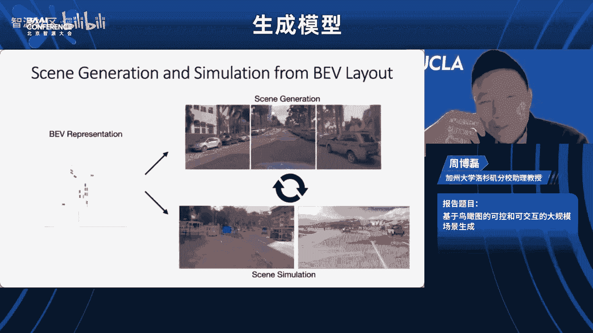

然后这里是嗯感兴趣的同学可以关注我们这个呃嗯研究方向。我我是把它命名成一个metter drivers，matter drive跟universe meta metaverse两者结合起来。

然后这样就可以嗯做出更更有意思的一些研究工作。然后这里也感谢呃我的学生跟我的合作者。谢谢大家。😊，好，我们感谢这个呃周本老师非常非常系统性，然后开创性的这个工作。

然后我们这个时间关系还是有一个问题的这个提问的时间。好，我们麦克风给到这位。😊，哎，周老师你好，非常感谢您的这个这么好的工作。然后我的问题是因为现在呃很多自动驾驶的，它存在一些con case嘛。

然后您这边这个比如说用BEV呃，可以生成这个现实图片来弥补这个问题。然后所以想问一下您这边有没有对呃这种自动驾驶鲁帮性的一个尝试。然后如果有的话，可以介绍一下效果吗？谢谢。😊，嗯，多谢这个问题，让我们。

嗯，昨天刚刚有一篇OL的一个投稿工作，就是在做这种poor case。我们这里说是sfety critical scenario的一个生成。然后这里就我们把它建模成一个这种对抗生成的一个感觉。

就相当我们希望生成更难的场景，使得这个驾驶模型能失败。所以我们这个工作应该会在很快可能两三个礼拜就会放在archcade，也欢迎你贯注。谢谢老师。好的好的。

我们再次感谢周柏磊老师给我们带来的这个精彩的报告。然后也请大家多多关注这个啊matta driver呃这个这个sorry不知道是不是说的特别对哈。这个我们一个非常创新性的一个词啊。好，谢谢周柏磊老师啊。

😊，嗯。好，那么我们下一个报告是来自于呃这个斯坦福大学助理教授吴佳俊老师。然后呃呃家俊好，我那个我我那个你不介意我中文介绍你哈。这个好好的好的，那吴家俊呢是这个斯大学计算机科学系的助理教授。然后呢。

他这个研究方向是极其感知推理与物质力世界的交互啊，从人类的知识中啊汲取灵感。然后呢，他曾经在在加入斯坦福之前在gogle research啊，担任这个访问的教研究员。然后呢，他在MIT获得博士学位啊。

导师都是大佬哈bi freeman还然后呢，并且在清华大学或博士学位的时候啊，在MA和这个图中恩老师有非常非常密切的合作。然后呢呃我们可以看到家俊老师吴家俊老师他就是各种师从大佬。

他本身做的也非常非常优秀啊，在3或者在很多这种啊物理。😊。

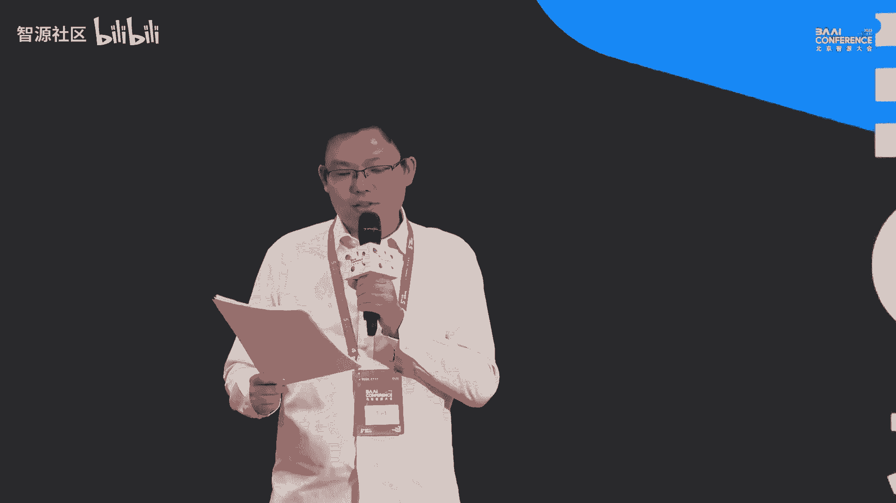

世界上的这种类似于基于这种物理的先艳呢，去跟环境交互上有非常非常有名的这种工作。然后我们今天呢也是非常荣幸邀请到家来给我们讲一讲他最新的这个工作啊。

报告的题目是understanding the visual world through naturally super code。好，我们欢迎吴教授。😊，嗯。现在这样行吗？能能可以的可以的。

很好好的好的。😊，嗯，好，哎，谢谢谢谢谢谢谢呃，李老李老师邀请啊，是这样呃，就是我刚刚还在和李老师说，就是啊就是说呃我我之前试过啊，我说我说哎我们这个呃尤其当时是在哪个国内哪个公司，我说我们讲讲一下。

然后我就用中文讲，后来呢或者中音夹杂着讲嘛。后来我发现这个呃就是讲的很不好啊，大家也听不懂啊，我我也讲的也不顺啊，然后呢呃就是后来我就前面我就在跟李老师说，我说我说要不我们就啊我就还是用英文来讲啊。

然后这样可能反而方便一些。然后等到之后我们啊问答环节和这个panel的时候，我们可以再用中文。😊，好吧，所以先跟大家说，这个征得了这个主办方的同意哈，所以没问题没问题没问题。用这英文来讲这个。好。嗯。

然后再再次感谢这个邀请啊，非常荣幸能够能够啊在这里啊，我叫吴佳俊，我是我是斯坦福大学现在朱理教授。Okay。

 so today I'm going to talk about understanding of visual world through naturally superized code。

So so visual world， I guess it's easy to understand， right， So we live in this world。

 and we use our we use our human vision to see right all these patterns， geometry。

 object textures and code as well every day we code using Python using whatever。

 But so I guess we all understand what code means although although I feel like know hopefully at the end of this talk。

 I will be able to show that know we can interpret code or symbols when people say neurosymbiotic AI code or symbols or programs in a broader sense。

 it's just not just like python or photos loops we can actually have a much broader interpretation of what code is as well as what is natural supervision So what do we mean by code can be naturally super。

 I'll give you a few examples throughout the talk。 hopefully we can have more clarity on that as well。

😊，Okay。So you know the question is， how can we really leverage the kind of rich structure symbols programs that exist in the natural world that exist in our visual world for better perception。

 better seen understanding So to begin with there are a lot of rich structure in this visual world if you look at scenes like this the corridors or the buildings and you realize it's not just pixels right although you know these geometry models they always model scenes as pixels but theyre actually richer structure than just pixels for example if you look at the scenes they realize there are planes scenes made of planes and there' seeing。

 there's floor walls and there are symmetry the things is reflectionalsymmetric in there are repetitions you can see there are lights at the top of the scene they repeating themselves and you can see if you look at the buildings then there are kind of windows and floors to kind of repeat themselves。

 So now the question is， is it possible for us to leverage such kind of structural information just' beyond pixels you to。

With pixels for smart sea understanding and editing。 So here。

 let me give an example of what it means。So here's a video and we put it in this I only be Photoshop gui but it is really underlying algorithm is ours。

 so what we want to do or what we can do is you know we first can do interactive segmentation given the building the user have one interaction right so this is standard everyone can do it right you have interactive segmentation to get the building and you can compute a vanishing point in 3D。

But then what we want the users to do is just through one more interaction that is okay how would building look like if want to make it taller the user can just drag and to make the building taller using one single interaction one single step or as well as how to make the building wider so the problem looks kind of simple but in practice you have to it's actually not as simple because you have to really have understanding of the scenes at multiple levels of abstraction at the lowest level you have to understand the scene has textures what is the texture。

 what is the color of the building so the things should look kind of similar in the media level you have to understand there is 3D geometry right the buildings are in 3D and every facade has its surface numbers it's facing a particular direction so if you make the building taller then the phase of the building should still face the same direction and the highest level you have to understand there is repetition the floor are repeating themselves if you want to make the building taller of course there's no perfect answer but if have to pick you have to guess I would say the floors just keep repeating themselves。

And the wes should keep repeating themselves， so such kind of higher level structures and repetitions should also be kept in your answer to this question。

So how can we do that？So we're inspired very much inspired by these kind of earlier work you know people trying to use program synthesis for visual data so they start with very simple images if you have kind kind of a sketch of these line joins and now there are clearly some pan so what it did is they first use a combination of learning a satochastic search to identify the entry level putitives in the scene in this case it's just lines and rectangles right so thinking about it as you know you're trying to factorize the image right in a raw image we know it's all like raized it's 200 by 200。

 300 by 300 pixels whatever so it's kind of very high dimensional space。

It pose a lot of challenge for program synthesis algorithms because program synthesis methods usually work with very low dimension it's kind of hard to scale up。

 So you're saying， okay now let's first try to factorize it so that you're turning a PG file let's say into a P file or into SVG file so you're vectorizing image so you're turning this higher dimensional space into a much lower dimensional space and now you the scene just have a collection of primitive lineizing rectangles and then you can use arguably learning based program synthesis methods you search for program that explain this lower dimensional space and once you have the program you can do small things like extrapolation right so this is earlier work where the methods now kind you may feel like oh the old machine learning method but you can also imagine replacing all these things with G4 right so you can do the same thing by per G if you look at CP 203 there are old ideas being reimplemented and realized with just newer tools but fundamentally you can kind of do similar things that you can extrapolate this。

patternss that make it， larger。So this is what they did back in 2018 and on 2D line joins and a clear limitation as you may have noticed is it is assuming you have the library of objects in the image in this case you know okay the world is just made of lines and rectangles I just want to find these lines and rectangles to backize the image and then I can search for program to explain these lower- dimensional space but the world is not made of lines and rectangles if we want to generalize from these sketches to natural images like if we have a bowl of milk with a lot of serials then realize yeah okay they're clearly some structure maybe you're kid or we're just playing with these serials and we make this triangular shape but what is an object here so it is the serial but how would you represent it it's not as simple as lines and rectangles。

So especially you know， is that possible if we can find a way to identify these entry level primitive objects。

 you know， even without risk requiring a lot of kind of prior knowledge。

So we were inspired by these kind of classic computer vision work on internal learning or single image learning。

 which is led by know Meharrai from Israel where they have been working on this topic for more than a decade or actually only two decades so or internal learning or single image learning they rely on this key observation that is if you look at a single image。

 even just a single image， they realize the patches within the single image are very likely to repeat themselves such kind of repetition happen at the same scale at these kind of red boxes。

 but it can also happen across different scales at these green boxes right so but why would these kind of rep happen。

 why would they exist this is because if you look at a scene like this。

 there are all these classeses， they realize okay it is fundamentally these grasses they' are kind of the same type of objects definitely they have to look similar because just like they're same species in the same category。

 but they' are just different instances of the same object category but because the real world is in 3D。

And you're seeing objects in 2D in a 2D image， there's perspective projection。

 you're having the 3D space， your perspective projecting into 2D。

 that's why objects that are closer do appear to be larger and such kind of repetition of similarity may happen across scales。

 you， in addition to it may happening at the same scale。😊，O。😡。

So now we have this observation how can we leverage that So what people have observed or hope have tried is to combine that with each So for example。

 if you have a picture like this where there's kind of some repetitive patterns so if you send this picture to a pretraining neural network。

 let's say an image I appreciate at that and then you can take the feature maps。

 these activation maps， and then can compute you know for every possible displacement if you shift this feature maps and horizontally by X pixels and vertically by Y pixels you can shift by certain number of pixels and then how likely are these future maps to be correlated with themselves what is the selfcor of these future maps after this kind of different displacement。

😊，And then you can do arcms and find x and Y that maximizes such kind of correlation or selfcorrelation。

 So what does these x and Y means or they probably just indicate the most likely gap between two neighboring repeating objects right because if you ship objects by certain the picture by certain pixels。

 the feature map are likely to repeat themselves， which means these know after to ship the objects displaced objects may look very similar。

 That's why x and y may very likely be the gap or the distance between two repeating objects。

 And the reason you use these feature maps instead of just RGB pixels is these recognition networks are trained you're supposed to be invari to all the noises in natural images capturing imaging noises or occlusions or lighting changes and stuff like that So hopefully it would just be more robust we take a version of this kind of idea。

 but we make some changes to it， which allows us without prior training。 you take。

Ali bit prior training because you'll take this preaching network。

 but without you training a particular data set which has to。

 you can take these kind of off the shelf methods and then you can just test it on a single image and from a single image you will be able to identify the central release of these repeating objects。

So this you can think about it as you're now trying to vectorize a natural image it kind of a crazy thing to do。

 you have this know pixels of you a rasterized in natural pictures。

 but then you're trying to vectorize and you're trying to represent this image in a much more dimensional space。

 which is the same choice of these objects。😊，And then once you have this lower dimensional space you can view what people can do before that is searching for a program that explains these ss right and now you can just search for a program to explain where the objects are。

 but the thing that is not captured is because you no longer assume the word is made of ion and rectangles。

 you don't know what this object is anymore， you can say okay at this point there's a line or at this point there's this rectangle or you know at this point there's something but what is that thing。

 how to parameterize that thing you can actually parameterize it with a neural network with a gene neural network So this is kind of a way of you have it is neuroymotic representation or geneticrative representation of the pictures which allows you to do kind of interesting things。

 for example。If you have this picture of a lower process and its kind of a missing patch and then our question is like how can I feel thats missing patch intuitively humans will say。

 okay， there are all these crosses next to it。 So I I will assume I should put across there too So the power of this kind of hybrid method or representation is these kind of programmatic structure or the code tells you where to look at it tells you okay。

 these are the centuriesries of the other objects and these are the patches you should look at but then how to use these patches to fill in this missing region。

 you you delegate to a neural network。 So neural network takes all these reference patches as smartly do imaging painting。

ly random So you can look at it and you find okay oh it's not like I'm simply copying a neighboring patch It's not like copy and paste。

 but it is actually you know looking at where I should look at and using neural network to put in the lower textures so the output image looks realistic。

 but intuitive。 it really match our intuition that we should put across there。

Then you can do extrapolation。 you can have another row。

 but not another row of rectangles and another row of cross of natural images。

 you can do extrapolation on natural images。And because we know there is no perfect pictures that are in the natural world right so every cross must be you know the program tell you where they're supposed to be at。

 but of course there must be some slight deviations。

 you can actually identify these deviations and then you can magnify these deviations you can magnify the deviations from of these objects from where they're supposed to be or you can say you can magnify these irregularities which is potentially very useful for you know defect detection in。

😊，Industrial production。You can go back to this mucan serial example。

 you can find the centuries of these objects， you can do imaging painting。

 putting back a missing serial， you can do extrapolation。

 it can add another column of serials and you can do regulargularity and。

 it can magnify odd irregularities。Okay， this all looks nice。

 but there's a big difference now we were in natural images。

Theres this big difference between that picture， the serial picture or and this corridor picture I showed at very early now the serial picture you're sort of assuming it it's an natural picture sure。

 but you're sort of assuming that everything is on the single 2D plane and you're seeing this plane from a top down view。

😊，But this is not a case in the natural pictures because for example， in this corridor。

 it's not like everything is on a single plane， right，Clearly there are multiple place orre seating。

 there are four， there are two walls right， So you have all these different place。

 So now the question is it possible for us to generalize this kind of you know kind of structured representation from a single plane to multiple images。

😊，This， you know shouldn't be too hard because all you need is of course you need a camera parameter。

 you need where the active vector is， you have to set a camera parameters。

 and then you have to find a far way of you Part an image into multiple planes。

 and then for every plane you have to estimate their pole or a six off pole。

 which is their positions in their surface almost。And once you have these things。

 you will be able to rectify the plane because if you know where the plane is。

 what is its surface normal， then think about it you can kind of rectify this image so that you're seeing the plane from a top down view and once you have that you're reducing problem the problem to one problem that you know how to solve already so you can search for programs that explains it right so you of you're able to generalizing from a single plane program to a multiplane program。

😊，This is a hard problem。 of course we're still going to rely on bottom up visual cues you know。

 for example， we're going to estimate the vanishing point where the vanishing point is as well as the wireframes know the3D wireframe estimation is really hard problem it was kind of not that robust back then when we're doing it 2020 it is still not very robust right now I feel like it of first getting better so we kind of using 2D wireframes right but 2D wireframe is better in the sense that give you a lot of correct answers but also give you a lot of noises that are most positives but anyway're talk about it later but before move on I would like to first do analogy that is you we always try to go in this kind of bottom up way we go from broad pixels and then we try to identify some kind of bottom up no level visual cues and then we go all the way up to high level structured programs。

 repetitions So this has been a case for line joins where people have to first identify the lines and shapes and then you search for a program for a single play images。

 that's the case too you're trying to。you know going beyond these lines and shapes but you try to find the centrals of these repeating objects and then you search for a program to explain it and here you're just having one more step you know this bottom up process where you have one more step where you try to use vanishing point and wireframes to help you do the plane partition。

Okay so you can draw this kind of analogy here and try to guide your thought process about how this is being done。

 but as the problem gets harder and harder we go from synthetic images to natural images actually multiplan images you can see the problem also gets harder and harder this kind of multiple possible explanations is not what could happen know for example in this particular image。

 they say okay the vanish point is estimated pretty accurately but the plane the wireframes so there's just kind of so many false positives。

 so based on these wireframes there seems to be many different explanations about where the planes could be right okay you know where is the wall。

 where is the seeding and where is the floor， theres just kind of numerous explanations to it。

So now the question is which one is correct as humans we have a lot of fire knowledge and we say okay。

 candidate2 is correct candidate two is correct because you know we have seen so many corridors and we have seen so many walls and floors and we know how they look like。

😊，But that's not the case for machines， especially if the machine is only given this single image if the machine has only seen this picture and then how would you know right candidate2 is's better than candidate one or candidate3 especially they all satisfy the vanishing point constraint and wireframe constraint right so you can see that when we go from more and more complex pictures。

 you know these kind of virtual cues have become more and more limited and the problem is become harder。

 how because this space is larger due to so many more uncertainties。😊。

The Hong code address his problem。I think there's kind of kind of fundamental understanding that is required that is。

Well know we have to again think about you know why would these structure exist in the first place。

 why were these you objects or planes to be regular to be。

 you know why would these kind of symmetry exist， why would these repetition they exist。

 why would the lights repeating， why would the lights repeat themselves？

And it's fundamentally because we have this human preference and humans。

 know when we introduce preferences sometimes kind of explicitly， but sometimes very slowly。

 for example， for this particular corridor， it could be the case that know because we like such kind of regularity。

 we like such kind of structures when we're trying to construct disputing or trying to construct this corridor。

 know we introduce this kind of prior that is， okay the whole thing has to be symmetric。

 the lights has to repeat themselves with a fixed integral。😊。

So because of this kind of fundamental human preference， this structure exists。😊。

What does that mean or how does that help us in solving this inverse problem？

That means if I can actually identify or solve this low level problem really well。

 then the high level problem should also become easier to solve So let me give you a concrete example let's just you know take this example and go forward you know here I don't know which one of the candidate part is the best but I also say okay yeah sure I cannot really tell but let's just assume theyre all good and let's proceed and see what's going to happen。

RightIf I assume candidate one is the correct one or two or three is the correct one。

 what's going to happen know we can move forward， we can assume they are correct。

 we can estimate your surface novels and positions and then we can use theest surface novel and positions to rectify each of these plane and then we can run algorithm with we know before about okay。

 I want to search for program to explain them and what you is you know。😊。

If you have the correct plane partition， then the estimated plane and theified plane will be very regular because that's where human preferences exist and therefore if you want to identify a search for a program that explains these you know I erecttify the planes。

 then the identified program the in for the program will be much simpler。

 you can see us in the middle one and the if you use the program to reconstruct the planes。

 the reconstruction will be much better。😊，Right on the other hand， you if your plane estimation。

 the noable problem is not solved very well， you get incorrect planes。

 you estimated surface numbers incorrectly， then after you rectify it。

 the planes will look kind of awkward and you won't be able to get a very good program or simple program to explain them program you' get what be emotional complex。

 the reconstruction will be much worse right so the fundamental observation here。

 which is I think very deep is the bottom up problems things that we typically think about Oh a surface novel or vanishing flow in whatever estimation or plane partition in this particular case and they're not totally independent from this high level program search problems but the plane partition and program think this methods they can and they should really help each other because we we really connects them is human preferences it' human colon requires。

😊，Okay， so this bottom up problem， visual perception pop down program synthesis and reasoning problem should really help each other。

 and in this particular case we can use program synthesis to tell us， okay。

 what is the best playing partition which is in an object a candidate2？😊。

And you will be able to get the right program plane partition。

 get the right program for each planes and then have this kind of programmatic nuing boundary rep for this scene。

 And what you can do afterwards is you can say okay what would happen if I move forward So compared what purely autoregressive methods this back in 2020 So now you can probably do a bit better but even do very long rangech long-term program。

 you will be able to see that seeing you should keep the structure instead of just getting blurriier and blurriier Well also even beyond that not just prediction。

 but what about extrapolation if you're seeing standing in this corridor。

 but you say I'm not moving forward I'm moving backward what would you expect to see if you're moving backward then you should expect this change model to tell you there should be lies key coming in if you move backward then another light should come in because all these signs of repeat themselves try to expect another lie coming in instead of just producing a kind of a blurry picture which make the existing scene look smaller and further。

 if you want to say okay what would happen given a single image。

But if I look around if I turn to my back why I'm going to see you know if I'm only seeing the front of a corridor and you ask him what is behind me。

 of course I don't know and there are infinite possibilities but I have to pick one I would say yeah I'll just maybe producing an infinite corridor of course there are no infinite corridors in the world but if I pick one I would say that seems the most possible explanation I just have right so I just turn around and producing an infinite corridor where the lights and shadows and all these things keep repeating themselves instead of you know just producing something that's very very blurary。

O。嗯。So you can go from this a corridor example3 beauty example。

 which is everything is the same except that in corridor。

 you know you can think about it as a box where you're standing in the box。

 but if you're looking at a building， then it is the same box but then you're just looking at a box from the outside and therefore compared with corridors you only have one where you only have one vanish points if you look at a building example you have two managing points everything else is the same so you can do an extrapolation as we showed earlier。

 but compared with the existing methods where some of them they can keep the structure really well。

But they don't really respect the input that well and some of them really respect the input。

 but then the reconstruction looks not as good， but now you can just you know have instruction methods to do both。

AndBut one final thing I want to say is oh we were like oh but now we have these kind of you know diffusion method taking you much better。

 which is a issue So I think it will still be very interesting to think about right how these pixel level based methods can be more effectively integrated with of structure representation for example。

 a common issue with these very powerful now geometry models。

 especially those in sweet often may have multiple hats right so that's because the pers data in the pictures is very likely for humans to take pictures from the front of the dog or something So therefore every dog。

 every pictures you have of the dog very likely to have a head and dog is facing toward you So you have generating dogs in sweet with all multiple hats right so having some kind of structured knowledge will hopefully be able to help you address this problem。

And I should say this is really done by two fantasticies students。

 although now they work on very different things now。

 but I like the work a lot I still talk about it and with Shaenmalo and who is now a PhD at MIT and EKi。

 who is a PhD at Stanford。Okay now I want to move on to some more recent though。

 so we have talked about program synthesis for visual data and we start with sketches to natural images so single image learning and then we go from single plane to multiple plays so what's next。

You know， you can think about this line drawings or single plane images as we're doing everything in 2D and if we have multiple plane。

 then then it's like you know you have 2D， but then you know every plane you kind of have a surface novel you are whopping it and you're kind of putting them together right it's number of detailed geometry so which is not enough for I was say two and halfD but still you know you sort of have an envelope representation for the scene So I say that's arguably a little bit less than two and a half but I just calling it two and halfD。

😊，So naturally what is next is we when to move to 3D and there's kind of fundamental difference I want to emphasize that is you know when you just like you know in human perception as well。

 you know when you say 2D and2 and half the， it is often the case that you have this viewercentric repetition right everything scene it's all about a scenes and the camera is always at your eyes and coordinate system is centered around your eyes as well it's just the word coordinate system but when we talk about 3D it often has a big change that is now you centered your around objects you know and objects has their own coordinate system and you just see objects from a totally different perspective which is the origin now it's not centered around your eye but centered around the center of the objects。

Okay， but in particular， obviously are very interesting because。

They so that requires kind of a sorry， but scenes versus objects that requires kind of a whole paradigm shift in a lot of the methods or things that representation we talked about before。

 you know conceptually it should be transferable but theyre kind of deep discrepancies between them which I think works a lot of further studies but in this particular case now we can look at 3D shapes where they often have these very abstract and program like structure know this is again because when humans in a way we try to make these objects。

 especially for these human artifacts we just really want them to be regular right at half of the table and these the chair the lack of the chairs we just we just have these kind of strong preference for them to be regular for them to be repetitive but also there's kind of a pragmatic concerns as well because if you have the table lags that are equally long then the table won't be stable right so you want it to be stable you want to be cheap efficient to make so you have all these considerations that makes or suggest that all these shapes they have to have these kind of structure。

So due to time constraintstrain I won't be able to talk about how we'll be able to do this in detail。

 but let me just quickly show you the results in the sense that you know we were trying to use learning methods to actually take a shape and you will be able to infer the programmatic representation for the shapes which were very much inspired by work in both program synthesis ball in computer graphics kind of be a huge line of work on how you can use procedural models for computer graphic for shapes。

😊，We're using neural networks for inference and then because there's kind of very limited annotations on shape programs。

 we also have a neuraler network as a program execut so that you can do mostly selfs training So but here you know if you do this in a very simple way you say okay oh the shapes has these regular structures and the legs of the chair is often like a cuboid right at top of the table is like a cylinder then you fall back to this existing limitation。

 which I talk about very early I was saying oh the line look at line noise it's just made of rectangles and lines and the world is not made of rectangles than lines。

 the word is much more complex Q3 you have the same issue that is and you have this table and you're saying okay the table looks nice because top of table is a cylinder and the lag table is a cubeboid that's kind of funny because the world is not made of just cylinders and cubo if you look at the chairs you're sitting right now then it's sort of having this kind of structure like oh it has to be stable there's repetitions on the lag。

Like that but the detailed geometry of the leg of the back of the bottom of the table or the chair must be you have these kind of flying beautiful curvature and stuff like that。

 which is not captured by simple geometrymetric primitives so most recently at this neural conference we had a more recent work where we try to incorporate integrate these shape program representation which is highly structured symbolic with neural primitives because just like especially nowa these days which are parameterized by implicit representations neuroimplicit representation now gets very。

 very popular in particular because of nerve people use it forvari for appearance but you may know before that people have been using implicit representations for geometry first and with deep networks like deepPSDf and those kind of work so concept is very similar to what we did before in 2D that is okay you still have this syndron structure program but what is an object what is the serial is parameterized the neural network here it's the same story you have airplane。

Cha， you have this programmatic representation for the airplanes for the chairs here。

 what it means is， okay what is the left wing and the right wing of the airplane right So all I know or the program structure tells me they have to be the same thing because it has to be symmetric if there's a wing of the airplane then the left wing and the right wing has to be the same otherwise I don't want to sit in the airplane so for all these reasons these have to be the same this is what a programmatic rep can tell you the repetition of these parts but what is the wing just like the question of what is the serial what is the wing is not simply parameterized by lines or cuids which is now parameterized by implic in neural network they be imp in neural networks parameterized what is the wing or what is the engine of the airplane and a programmatic structure representation tells you the wing should be repeated to be reused and the only exception to change is its pulse right So it has to be reused on the left and the right and engine the well。

 So you have this kind of programmatic。what the program tells you the structure or the repetition of symmetry of objects。

 while the neuro perimeters parameterize the actual detailed geometry and of course you can do appearance as well like nerve。

 but which is here is do geometry of the parts。😊，Right。And compare with earlier work。

Having these symbolic representation for shapes where they mostly use different ways of to parameterize the entry level prims。

 but if you use a neural network to learn the entry level prim then you can see that okay it has much higher fidelity but also the symbolic structure enforces。

 for example， the symmetry of the airplanes as well as the regularities lags and stuff like that we're happy to talk about this work offline is now I think we're out of time so I should move on to the final but I feel like the most exciting piece of the work。

😊，Okay so I have been suggesting this a few times right so we have these all these virtual programs in。

 but we have been talking about how we can get them。

 but there's a more fundamental question that is why would these structure exist in the first place I've been suggesting a lot of these program like structure they originally from human preferences in the fabrication process know for example。

 if you look at this ways kind of beautiful right so this kind of RGB pictures but the way the ways look like the way it is。

 it's because there are intrinsic images right So they are kind of underlying components that put together they got put together and produce the final RGB pictures so this includes。

 for example， the geometry of the object surfaced almost abe。

 which is the texture in the material which is how the object reflects the light right So for example。

 this ways looks like it's a p line it is because I know how the way it reflecting lights makes me feel like it is a p line right so these are underlying components that got put together and produced the image and。

😊，Comp graphics， the process called rendering， that's why a large part of computer vision is you know when people say oh inverse graphics or inverse rendering。

 right， you try to invert this process and get underlying components of what is there in the。😊。

An image。But the problem is so hard because you know think about it you not have you a lot of components A B and C and you know that when they got time together。

 the final output is the image， but you're given the picture how can you tell what is the underlying ABC that's just impossible so you have to rely on different the problems is so ambiguous that you have to rely on different levels of inductive biases So what are the inductive biases we may have I would say it is like the program like structure or the human preferences exist in these intrinsic image。

😊，In the case of this particular base， you know， let's look at it one by way。

 if you look at surface normal is irregular or nonregular I would say here， the surface normals。

 I say it has this very strong regularity because when we made it。

 we want it to be rotationally symmetric。 So we have this kind of strong preference about making the things to be regular。

 This is the same case for the materials as well because I know the object is homogeneous is made up same material everywhere。

 therefore every point on this object reflects the light in the same way。

 therefore the surface normal and the materials of the object should have very strong regularity it's rotational symmetric。

 it is homogeneous。 So Ill call this explicit regularity。😊，Okay。And what about abeo。

 what about the texture of the objects？The texture of the object is kind of implicitly regular。

 I would say， because it is not like okay every pixel on this object on this vase is having the same color right it's not like home。

 it's not like pure color， but it does look to me that matcheses you know look on this a map。

 they kind of look similar， the vase kind of having similar textures everywhere so has this obviously say implicit regularity。

 although I don't know how to really enforce it as equations。

 but does have this kind of regularities that are implicit to us。😊，Then there's lining components。

 They use spec components， environment maps。 you know they。

 they sometimes may have a little bit regularity， but especially when things are indoor。

 it's just so complex。 I would just say， no， they're not regular。 Okay。

 let's just don't worry about it。 So now we can see that， you know， even these intrinsic images。

 they look kind of so complex they。对。😊，We now actually have a little bit of signals about their asymmetries or the structures or the biases in these intrinsic images。

 which may allow us to solve this seemingly impossible problem that is to disentangle and infer these intrinsic images just from RGB image as infinite。

So we were this work was really done by a very talented student。

 I Shaang Z Wu he was a PhD student at EGG from Oxford back then。

 that was when I was at Google and he came here and data the internship So without thought okay iss that possible to leverage that kind of structure for image dendering that is taking this picture and leveraging the asymmetries or the structures we already know know different levels of inductive biases we may have in these intrinsic images so that we can dender infr them from the input and once you have that you will be able to do fancy applications。

 for example， you can do novel view synthesis of how the vase will look like turning the v from a single picture into3D seeing it from different views。

 but also because you been modeling the material of the after， you modeling how you reflects light。

 you can re the objects you can imagine okay just going from an unalnotated picture of the vase how the v will look like under different lining conditions。

So let me talk about how we're able to enforce these different construct of strikes。The first one。

 the shape is very simple right we have this explicit regularularities in the geometry we know it's rotation symmetric so you can parameter the shape using a solid revolution representation with the height which is scalar and radius which is vector the radius at different heights right so you can have this kind of structure representation or parameterization of the object shape and once you have that you can render COA and compare that with the ground truth COOS that's your first mouse that's how you enforce the regularities in geometry in surface almost。

😊，Once you have the shape。It can unwrap the object so that you're going to get a surface normal and texture。

 but now you unwrap it in Q， you can think about it。

 every do to the standard intrinsic image decomp in lighting of materials， in orbitbeo。😊。

And you can put it back you know during the re renderndering computer lighting components and putting back ob beles so that you can reconstruct the texture and then you can put in that object pose and shape。

 you can reconstruct the original image and that's your second loss in the pixel photometric loss but here you're assuming you can parameterize object materials using the same parameters after a row everywhere where you assume every point on this object have the same material parameters they're reflecting light in the same way so this is how you enforce explicit regularities and object materials。

Okay， these are kind of all you know not that surprising。

 but I think the harder problem is how you will be able to enforce this regularity or structure or code。

 but very in code in terms of audioobbedo， right abedo looks kind of similar everywhere。

 but how we be able to enforce that because it's not like this pixel has the same RGB value at that pixel。

But we did it in two ways， first is if it looks similar everywhere。

 then if I compute me a beeto and then I put it back。

 you know the mean abeeto reconstructive picture to look kind of similar to the original picture too。

 so that's kind of an easy way of encing it。But more exciting way you're enforcing it is you know when we say okay the abeome maps are similar to us。

 now what does that are perceptly similar to humans。

 what does that mean that means no matter which abeo patch the object of the image the patch is coming from no matter where it is coming from either it's coming from this highly spec region of the base or it iss coming from this nonspeccular region base。

 then aid maps should look similar to humans everywhere。

 know that means if the thing if the patches are looking similar to humans。

 that should also look similar to the machine is so you can enforce that by sampling patches from this obidome maps and they can send it to what we call a selfsupped aidal discriminator and the discriminator should not be able to tell where this abeo patch is coming from。

So specifically right you can predict all these aiddome maps it can predict specity maps and now the question is no even the aino is coming from a region that is highly specative。

 or coming from a region that is not spec at all， if you send it to a discriminator that the whose goal is trying to classify whether where the aiddo patch is coming from。

 they should not be able to do very well and the goal of your generator is actually to produce aidome maps that are consistent everywhere no matter whether there is specity or not。

😊，RightTo confuse the discriminator。 And now this is important because this generator itself you know has to solve this very challenging problem because when you do intrinsic the image composition for highly spec region。

 it's really hard to do because it's overexposed the regions pure white。

 But if you tell the generator that even if the input is pure white。

 you have to generate a be map that looks similar to regions that are you know non spec that enforces the system to have this kind of implicly regularity to produce a consistent aid map。

 This is really important and for us to achieve very good results。😊。

And so here are the final results about you know by putting different levels of inductive deviceses or different intrinsic image components。

 we're able to turn a single image during testing， just a single image and also during training between a collection of images of vases。

 but there's no annotation just a collection of images， no3 annotations at all。

 So it's purely unsurupped training a collection of basiss during testing from a single v。

 you can infer all these intrinsic image components a video surface normal and diffuse spectral components and materials and you can go in during testing going from a single image。

 you can virtualize it， you can see in the v from different views。😊，And you can rely them。

Here are more results from a different data set， which is a bit more complex with more background。

 but you can see that we can do equally well and again even for paintings right。

 you can turn in the picture into3D and then you can see it from different view you can do all of these synthesis and you can do relying。

Yes。Okay， finally， let me wrap up by going back to the original story know at first I was saying you have line joints and line joins have lines and rectangles which are not general。

 so you want to apply it generalize it to natural images and then say you have 3D shapeves。

 the 3D shapes you know made of rectangles and cylinders that's not good enough that you want to do for general optics。

But now here for interesting image composition I'm saying that is great。

 you have all these video components， but then you assume this thing has to be rotation symmetric。

 right which is cool， but you know it's not like everywhere every object in the world is it rotational symmetric right there are very few objects that are purely rotationly symmetric How can we going from this assumption of objects are symmetric to more general objects if you show you。

 let's say this beautiful bouquet of all these roses And now the question is how is that possible for us to generalize what we can do from things that are huge recly symmetric to general objects。

😊，Again， we have to really think about why these structure exists in the first place。

 know human has this strong preference about making things to be regular to be repetitive。

 but here for the roses it's not made by humans it's made by nature。

 the nature also have this very strong in bias as I said early that is all these grasses look similar because they're the same species and all these roses sort of look similar have the regularities because they belong to the same object category。

 they're just different instances of the same object category right So if you look at these roses。

 they kind of have this you know similarity but these similarity exists because fundamentally they're the same object same type of object。

 they're mindful instances from the same object category。

 there's a reason that we call them same object class。

 there's the reason we give them a name so what they're really sharing is not a rotationally symmetric object representation what they're really sharing it's thing that you belongs to them which is their object intrinsics know every rose。

 they're color rows because。Share this distribution of their intrinsics。

 including their geometry shape， including their texture， how they look like。

 including their material， how they reflect the light of course， also including their physics。

 you know how heavy they are stuff like that， But here for vision graphics purposes。

 we care about how can we learn a genetic distribution of their geometry of their texture of their material so that you can get rid of this rotational symmetric assumption。

 but now you really learn a genetic distribution of object intrinsics。😊。

So we basically adopt the pipeline we had before， but now we get rid of this assumption that everything has to be re symmetric。

 but we still have this regularity or structure or code。

 where is the code coming from the code coming from natural supervision because these things they all share the same intrinsic distributions provided to us by nature so they have to share the same geometry the same distribution after geometry of a video and you enforce that by learning to generate approximate distribution but coupled with extrinsics from the world。

 including object pole including lighting so they can get the shape the shading appearance representations and you can put it produce a picture and the goal is this picture should look like a natural picture from the real world。

😊，So by enforcing this kind of more generalized constraint or code。

 you're able to again learn from a single image， all we need is a single picture of okay of roses。

 maybe there are 20， 30 roses， but just from a single image。

 we'll be able to learn intrinsic distribution， a distribution of their intrinsics which include geometry texture of material which allows you to we can see that okay capturing doing up to novel mus as in the row at the bottom and novel view doing relating as in the second row to the bottom。

 these are things we know how to do before， but also capturing a generative distribution of these roses in the middle row。

 you can see that these roses we can sample roses of different sizes because we have learned the generative distribution of their intrinsics and at the same time not only learning to sample different roses。

 different geometry but still doing novel synthesis relating as we can do before。

And here are more results， different types of down planes or cranes and stuff like that。Yeah。

 all just need all you need is from a single image。

 you are going to learn a gently distribution of these having26， you can do no syns。

 you can do lighting。Okay， so to wrap up you know we talk about things in 2D and to2 and halfD and then in 3D we talk about you know kind of like how we can generalize the things we already can do to 3D。

 but more fundamentally right why would these program structure exist in the first place and how we exploit them to even do fancier things like now these things that is realizing or even capturing gender distribution doing26 something I don't have time to talk about at all is time and kind of clear a programmatic structure in for example human motion。

 but that's kind of an interesting topic to talk about it offline。

So to summarize right the key innovationlevation behind this line work everyone will talk about anything that is not purely neural is of some kind of neural network for recognition and then you have a symbolic representation of code for general right but here I want to say the first you have to have a very broad interpretation of what code is right and beginning we say code can be full loops。

 but more importantly code can just be different types of inductive biases you put into neural network So the whole thing is still a neural network it's still entry and trainable So when people think about code they often like oh wait that's not good full loops are not very generalizable but full loops may indeed be not very generalizable except in some specific domains。

 but code doesn't happen in full loops， code can be very general inductive biases which you just need to introduce into neural networks but the whole thing is still a neural network。

 it is still entry and trainable as we show at end in the very example in the row example。

And now the question is where are these code coming from， right， Sure。

 you can put the inductive deviceses， but which one should I pick。

 I would say these are these are the things that we should be naturally supervised。

 And when I say these are naturally supervised code。

 I would say fundamentally there are just two courses or two reasons of this code One is you have humans right human have this strong preferences。

 And when we're doing fabrication， we were making things， we introduce our own preferences。

 that's the prior or the code coming from human。And the second is the code comes from nature natural supervision comes from nature because when if you believe in evolution right so when there's after instance or there's a species。

 then the reason that they share these fundamental。

 similar intrinsic properties geometry reflectance right and when there's3D and looking at pictures in2ity。

 there's perspective projection， these are kind of fundamental。

 naturally supervised code that we may consider incorporating and we like them because they're universal right It's kind of universal is true that applicable everywhere So every picture we take。

 they should be applicable， therefore there's no reason to believe that they're not really they will hurt genetic instead they should really help genetic。

And in the future， we can think about how to extend it to more complex scenes with complex background with you know complex interactions between lighting and objects and background。

 some are more programmatic， some are less。And if you want to do more generalizable representationation learning。

 you know what's really the role of symbols and if you do want to do anytime。

 something that is not purely neural， then how can we have more efficient influence algorithms because that makes optimization problems much harder as well as how can we go from passive perception to interact action to interact with the disease and you can see that a lot of these are kind of cognitive inspired。

 so how can we draw connection to human cognition and to natural language because language or how we referring to things。

 how we are talking about things is another source of important natural supervision。

 which are very interesting but I don't have to talk about here。that's it。 Thank you。好。

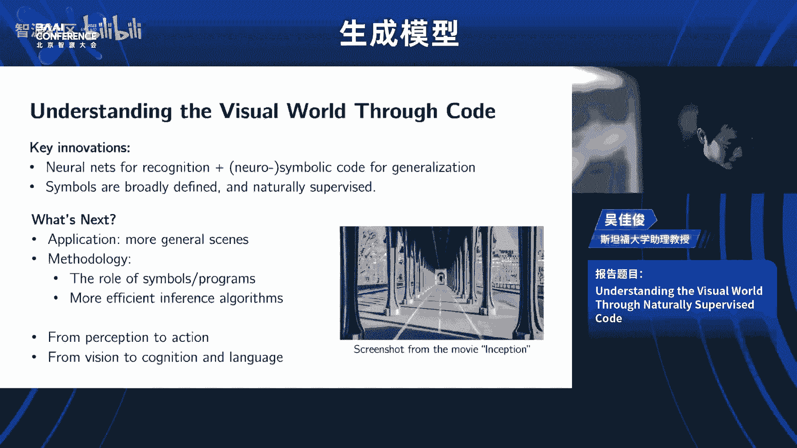

啊，我们感谢这个啊吴教授带来的这个精彩的报告啊，非常非常有启发性的一种啊很很独特很unique的一个工作啊，一个系列的工作，通过这种自然界啊。

我们人的一种理解或者自然界里面天然带的这种结构来去帮助我们去很高效的啊泛化能力很强的去建模啊2D的3D的啊这种世界啊，那么我们还是有一个问题的时间。然后我们就进入我们的拍al环节好。😊，好。

我们麦克风交到这边哈，谢谢。😊，呃，吴家授，你好，就是呃我看刚才您给的那些例子里面那些物体好像都是刚性的。也就是说他们会就是那个。但是形状不会变化。嗯，然后我想问一下。

就是对于那种嗯柔性的物体该怎么处建嗯，对你说的非常好。但是在我回答这个问题时，我先把灯开一下，越来越黑了，天黑了，不好意思啊。好的好的嗯这个。😊，你看这个不容易就说觉你刚才说的那个非常好的问题啊。

就是说我们确实有 assumption但是不完全是比说举个其个对我实其我在 assumption不是果你是看这个ros的话。

其实我们更多是一个是一个 assumption设个是一个的场景但是你是以它的s我果你看前面我们个 based的sure但有一个 based flexibility但我你说的是个非常好的fu就是说我们怎么样能够不是im可但简单的是我怎么能个。

😊，whatever you care。但是呢你同时能够 capture的 dynamics，能 capture出的这个相当于你有你有一个 additional一个 dynamics how how things will evolve你有怎么样有一个dynamic reputation能够啊把握它的这个变化啊。

就是说比如说啊其实现在有一些这样的工作。比如你去看这个尚哲啊，就是我刚刚讲最后这个啊这个这个工作的时候啊，他的利的这个工作，包括在rose这个工作，他也有参与啊，就是说。他们最新的一些工作啊。

就是怎么样能够从col image中可以学ard objects，怎么样能够把这个马或者什么样的这个video中能够把这个马它有很多不同部分，怎么样能够把这些不同的ulation能够学出来。

 on top of that最大家可能在看说不怎么样能够学出 parts还能够animate吧能让它动起来，那这个可能是我觉得是非常好的future其实或者也不是futurego。

就甚至是ongoing direction大家可能很多很多的group都在都在look。好的，我们再次感谢这个吴教授精彩的报告。然后我请那个家俊刘步哈，我们还后面还有一个呃连续的一个拍al的环节。

然后这个拍al环节我们是呃请赵周老师也也上台。然后我们那个朱军教授在线上参加。呃，然后那个周波的老师因为一些个人的原因，他可能很遗憾，没能就是在拍环节继续跟我们去研讨。但我相信从报告里面。

大家已经听到了他很多很有啊远见的这种啊研究的品味好啊。😊。

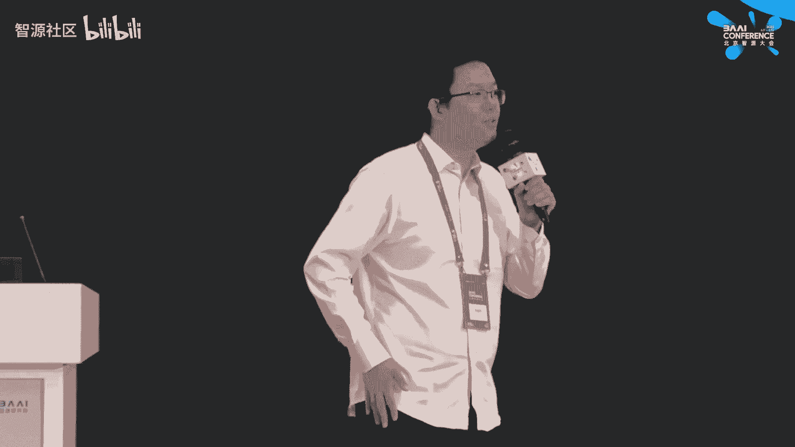

🎼行啊，找找嗯。到申你清上了。对。师请请哎小心小心啊，你请这个这个坐坐对呃，行，那我们这个拍的环节就正式开始呃，然后我我那个我相信我我需要介绍这个我要不再稍微自我介绍一下这个我是这个主持人李崇轩。

然后呢刚才二位讲者是家俊和这个赵教授，然后我还很荣幸邀请到了这个朱军教授线上参加。然后那个我们的这个今天那个的议题哈。第一个问题是关于就最近有一个AI有那个报道就是说大家有用AI去诈骗的。

我不知道大家听说过没有哈，就是他能合成语音，甚至就是微信直接打视频过去哈，就是去去模仿你的领导或者是你的朋友去跟你说话，你要钱。然后这个有这样的一些事情。那么我可看到就是说生成是AI的这个发展呢。

他可能会有很多很多的滥用的这种问题，导致很多社会的这种安全性啊或一些其他的这种问题。那么。😊，我们想看看啊这个从技术上或者怎么样去解决这个事情。然后我们可能先请呃，比如说朱军老师先先来开头。

要不来来说这个事情。对。好好好，大家好啊，那个抱歉，我是因为有那个有另外会，然后再。在这个外边。呃，对，刚才呃感谢谢几位嘉宾啊，包括嘉俊啊，还有那个赵周老师，感还有那个可能让柏磊老师已经下线了。

感谢大家对这个呃就首先我感谢一下大家对这个BAI conferenceence支持。然后刚才我也听了这个好几个报告，包括那个报告我也听了。后呃还有嘉俊的刚才精彩的报告。啊。对我刚才回到这个问题的话。

我就就是现在可能也是呃就随IGC发展之后，就呃带来了一些可能就会这些技术被用在一些呃特别恶意的这些目的。😊，呃，那这个其实在呃上一波的呃或者是其实也不是很远，大概是19年的时候。

当时就有一波叫这个的这种这种检测。因为当时也是因为这个深度生成模型，包括像干啊等等这个技术的发展啊，就有这种用这个合成的虚假的视频可能会在网上去传播带来一些恶意的这种效果啊，在那一波之后呢。

其实大家都在想着用用计算机呃用程序用人工智能来去识别这种自动检测这种的或者age或者是甚至语音文本等等啊，所以相关的这个呃技术方面的话，就说呃现在呃在这个AIGC更进一步发展之后。

其实这个生成的质量是更高的啊。但是实际上这个计算机生成的这些内容的话，它和这个自然的这些真实或者我们说真实的或者自然的这些图片或者视频也好。还是有很多这个。呃，区别啊。

比如说它的这个可能一些特征的这些分布上啊就会存在差异。另外包括像这个有一些通过画脸啊等等这些呃合成出来的这种呃这种图片或者视频，它本身在这个自然度上。

或者是啊它会啊这个平滑上会存在这种呃这些特征的这种区别。以用这些信息的话，实际上是呃可以通过计算机算法的方式，可能更精准的来去来去做识别啊，这个也有很多的这个呃进展和这个相关的一些相关的一些应用。啊。

但这本身它是一个相互在在在演绎呢啊，就未来的这个IGT是不是能够就发展到完全超过的。就是我现在对人来说，它是已经很很多程度啊是可以接受的啊，可以视觉上可以达到比较好的一个效果。

但是未来是在这个算法上就说呃也会对这个检测算法带来更多的影响。我相信这个肯定会是这样的。啊，但是这个本身检测的话，我觉得最重要的可能还是检测那种。内容上可能比较有这种负面影响的这种内容。啊。

并不是啊对检测是不是啊算法生成呢，这可能并不是那么的呃急迫啊，相对来说，我觉得这个需要刚才讲的一些案例里面，就才有恶意目的的这些内容。这可能从他的本身的比如要要表示的这个呃内容上可以去进一步的检测。

不光是从这个像展示的这种视觉的特征上。The。好啊，谢谢朱军老师，我们要不请佳俊也来这个呃看看分享一下对这个问题的看法哈。😊，我觉得其实我没有太多要说，因为我重朱老师说的。

然后另一方面我也会觉得说就像周老师最后说的even他肯定会越来越，然后你肯定就没有办法去分辨。所以他它实际上是一个bed个个系统炸炸就就是你不能说随便一个人都以个炸者拿路那就是说这个东西其现有entkenken很那这样你就以以一个个人在以场景下。

会非reistic，尤其是现在可能说vi还不太好。但是将来你说video肯定也会做的越来越好。似乎因为video你有很多 data在网上。

你好像没有理由说你 dynamics至少在从appance的角度啊不是appance的角度，就看起来真实的角度，它肯定是很。那我觉得最后他就是那就不是一个 scientificific问题。

那就说是是需要一个综合的一个社会来综合的考虑的问题。好好的，呃，我们谢谢佳俊的精彩分享。然后我们赵赵忠老师也请您去呃想分享一下您的看法。啊。好好啊，我我同意那个呃朱老师和嘉俊说的。

就是呃现在我们的生成模型可能会有一些生成的呃不自然的地方，我们可以来进行呃检测。那么谁的佳军说的呃模型越来越大越来越逼真的话，那么呃我们是之后是很难分辨出来的。

那么呃这个的话我们我的一个看法就是呃像呃朱老师说的就是说这个生成这个技术的本身，其实并不是说我们是需要呃这个事情，主要是他可能是会出现一些比如说是恶意的一些呃那个内容的一些情况。

那么呃针对如果模型做出来是越来越逼真，越越来越细节的一个程度的话，我就。😊，觉得可能还有一个方式可以来做，就是说我们在呃模型生成的时候呃，给模型加载呃数字的水印。那么加载数字水印的话。

我们的同时我们是identify呃这个生成的内容是呃通过什么样的哪个模型或者哪个呃机构进行呃进行produce出来。那我们就是很快的可以呃check。

那么这个模型到底是呃这个这个内容是一个是呃哪里进行生成出来的，或者是这个内容是一个真实的。那么一个是从数字水印的一种方法。那么这个就是我的一个看法呢，谢谢好的好的，谢谢赵老师的分享。

那我们下面第二个问题是后面三个问题分别为三位老师哈。第一个问题是请朱朱老师回答，就是呃这个从算法或者这个基础的这种模型的发展来看，在diion之后，您觉得我们还会有呃下一个大的突破吗。

就毕竟我们从密度的函数，然后到生成的，然后到这种呃对抗生成的，到到diiffusion到现在是吧？就可能呃是不是能做的都都已经差不多了。

就是你你你相信我们还会有下一个更power的一个geny modeling framework嘛。对。对，这这个这个问题其实挺难回答的。但如果你问我相不相信，我肯定是相信会有的。

因为呃因为我们都在做这个做做sS词，因为这但是。呃，会会充满surprise吧，就是就像这个d model出来之前，大家说这个干已经非常好了，就是可能domin很多东西。

但突然有一天这个ion出来之后就干。然后我现在基本上大部分很多在拥抱这个ion model。但是其实 model从从这个本质上他也不是说没有局限。但现在其实我们也看到很多问题吧包括大家听在讲报告的时候。

最也说这个比如现在我们在在这个模型在这个t里边就是做的是是比较好的这种效果，从各个方面但是呢到了比如怎么去做这种di这种比如像t这种这种数据是不是有可能我们在这方面去做某突破。

么去比如在那边di这种我到底怎么去怎么的能不能有种或者就我在一起的这种我想这可能都是就目前还是还是op的就大家都是。好奇的，而且我我我愿意相信就是某一天这个这gap可能就会更好的去被被被弥补。啊。

所以大家也不要觉得对对在座的或者是在那个有学生的话，我觉得大家还是要充满这个希望的。就是反能我我我们是努力，就是想把那个像扩散模型，不管做的更好，或者是从fuament上能够去呃能够去去呃比说去。

替待他或者就是有一个完全更好的。我觉得这这种努力肯定是要去一直要去做的。啊，对我我也希望就是。哪天这个这个这可能会成为现实。那现现在没有答案，我我如果现在有答案的话，我就会发给大家。好的好的。

我我们期待我们能做出来。好好，谢谢朱老师哈。那我们第二1个这个问题是请吴家俊教授回答哈，就是说我我特别我我可能跟我最开始预先准备的问题，稍微有一丢丢的区别，就是特别呃受到你这个报告的启发。

因为我是第一次完完整整听你很长的这个报告。然后我觉得就是说你确做的确实非常非常un。那就是从这种啊知识出发，或者说自然的一些规律出发。那么他有很好的比如说呃这种我们约束他的能力或控制他的能力。

然后有很好的泛化性，或者很很容易去去做更不同的这种东西。那么但他可能呃比如说最近也有一种新的方法，类似于，我们去用大规模的预训练模型啊，这种非常非常dark的这种方法去去做这种开放的去东西。

然后这个现在两个方法可能都有他的问题，但他有多特的优势。然后你怎么看待这两个流派，或者说未来特别在3D上的一个发展的一个前景。😊，对有就是说我我我不觉得说他们有什么 difference。

就是说我觉得他们可能是 same goal，但是他从不同的出发点，然后就例比如说ner，对吧？那就说它就有个 notion space其实他有一个很强的就是上有东西叫 space有like有light transport。

那怎么去然后你根据这个lige来做对吧？那么然那你后面那就说就是说其实他就是说嗯所以我觉得呃并不见得说这些东西它本质上就有一个包括现在其实还有一些啊我觉得比较有意思 work就是怎么样能够什么是一个什么是一个 conceptcept啊。

什么是一个，然后你怎么样能够ver比如说比如说我说。😊，李红轩老师对吧？我说我拍了一些照片啊，我说什么是李红轩，我这个是为什么李红轩老师，这个照片里这个是李红，那换我给他改到什么程度。

他就是朱军老师就是说就是说就是说这个这个到底是个什么意思后怎么让李轩老师成为了李红轩老师对那就是说他其实它里面有一些interest concept但是这他有很多 application那就说我比如说我想生成我我有些李轩老师图。

我想生成说李轩老师在讲课或者李轩老师在滑雪可能那怎么让他看起来确实一方面符合这个意境。一方面他有keepep啊。

以其实最近其实很多好几篇就今天就有好几篇就是其实常相关的个你可以说他们是同一个 driven perspective他们是但实种上说就是很大程度说 notion an concept。

就似像之 notion space啊，其实是可能。😊，但非常ins但是非常重要的这个ductive bias。然后就像我前面说的，就是说所谓的ductive bias或者谓 structure对吧？

就是说theres name thats important structure而并不是说啊这个structure一定要可需要ductive bias也就比说我真的要去我要来那我可要 program面就我不仅具unioneration但你就越来越具体真的要做越来越但你。

你可能需要的min是一种非常非常互常微妙的方式出现。就是当你说这个nerf或者当你在说这些fuion这些或者就是啊这些work的时候。

他们也有啊某种不过他可能是一种就是但并不是说他们是他是他并不说他们是互相矛盾的。他其实可能只是说是一个rum这一边到那一边O好好，感谢嘉建的分享。然后我们第三个问题是请问这老啊。

就是你怎么看待这个因为现模态越来越多了哈，就这个文本图像啊，后视频包主主打的这个音频的合成，它越来越多了。那你觉得就比如说以后的态模型会是一个什么的发展。

比说我需要做做到多少模算是够呢或者说是不同模之间他怎么去互相的就是。😊，提升啊等等这些这些问题。对。哦好好，谢谢李老师。😊，呃，是这样子的，就是说这个今天这个报告呢。

我们主要是呃分享了一些呃生成式模型的一些情况。那么我我们是希望嗯做生成式模型，做的它推理速度呃更快，它的模型size呃更小，包括它的表现力呃更强。那么我们我们看到我们今年可以不仅是可以生成呃视觉。

我们也可以生成呃音频这种呃这种不同的一些模态。那么从呃我的呃角度来进行出发。因为我我一直是在做多模态，包括是做呃人机交互。那么我我是呃呃思考。

那么呃接下来做的是比如说我们现在做的基本上都是以以生成式为主。那么呃接下来的话会往会网呃理解这种这种进行靠。因为之前的话呃理解和生成。这两个呃问题都是呃分别来解的。

就是很多人呃都要么是解这种呃多模态的understanding，要么是解多模态的这种生成。那么呃在这种呃大模型这种呃时代的下落。

我们是呃希望是把理解understanding和呃生成一起放在一个model里面。那么也就是说我们呃接触的理解的模态，比如说以以人机交互为例，那么我们呃输入的话有呃talking face呃，有有它的。

有他的一些呃呃pech等不同的一些呃模态。那么在我们的呃呃理解上面是我们可以更好的做我们的生成。那么这个的话最后一个愿景的话是呃通过理解和生成。因为我们是做呃多么态人机交互嘛。

那么可以做一个更好的一个motymod的一个呃dialogmod的 dialogue。那么使得我们的呃生成的，包括是合呃呃人进行交互的。那么更加的一个逼真，而且对人的一个呃粘性会更加的呃强。

那么这个是嗯我觉得是呃多模态的生成模型。在呃人机交互这么一个呃领域，我接下来我们想做的一些呃事情。那谢谢好的好的，谢谢赵周老师。好，我们这个时间可能也差不多。还有最后最后的一个问题哈。

然后我们这个问题可以请赵周老师先回答，然后我们依次，然后最后比如请朱老师做个这个总结的致词哈，就是我们怎么看待这个就现在我们去学习发展的现在哈，这个有大模型啊，有各种各样的这种生成修生的这种技术啊。

自回归的技术。那么您觉得呃下一步就是生成模型啊，如果再突破或者他未来的这个发展，最会让你激动人心的啊，这一个点是什么？对。😊，呃呃呃虽然我们我们现在有非常多的一些呃像李老师说的。

比如说是有大模型这个爆发，包括有diffusion做的呃更加呃更加更加的一个真实这么一个这么一个场景。

那么我我们发现就是说嗯像呃像AICC的话呃也可以在很多程度上是可以呃变革我们这样的一个呃生活可以给我们带来很多场景的一个呃变化。比如说呃现在的呃呃人机交互。那么基于这种呃虚拟的人包括虚拟的世界。

包括虚拟的环境。这种嗯人和人的一个这种交互。那我们不仅是在呃物理中做的是呃已经很真实。那我们在网络环境中也是可以有一个非常真实的这么一个呃真实的一个映射。那么这个我觉得呃接下来呃网。这个方向去走。

应该是一个非常呃激动人心的很多一些问题可以来进行解决。有很多的一些呃新的场景可以来进行构思。那我是这么一个观点。好好，谢谢赵老师。呃，然后我们佳俊请请您分享一下你这个吴吴教授分享一下你的观点。

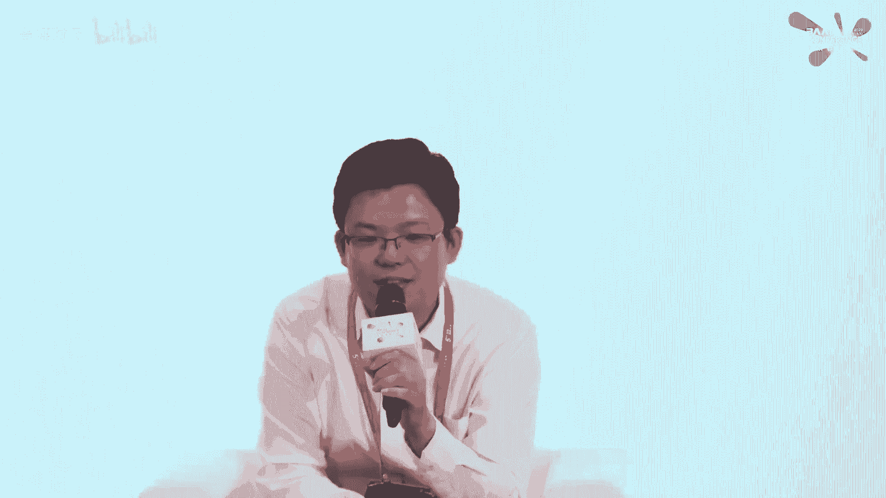

两短期内最觉觉得接下来很可能首先第我觉得没有理由不能有一。😊，也好，怎么样能够effect way可以做hi interaction，然后去啊就是这里面需要什么是最好的一个handle啊。

能够briach human和 machine。那这个还是我觉得有很多的。就当然这也涉到很多 social science的一些问题啊，但这可能就比较 long term。嗯，好的好的，谢谢佳军。

那我最后请朱鑫老师做一个呃相当一个展望和总结吧。也不不能算什么总结吧。我觉得那个刚才两位老师讲的我完全同意啊，就是就就回到这个问题里面，就是未来这个啊觉得比较 startinging，或者是觉得去做的。

啊我刚才两位老师讲的都都我都完全同意。然后我想稍微补充一点，就是这个特别和这个刚才嘉俊讲的这个就是inter。其实就我们现在比如说是看人和这个这个这个算法人和机器之间的这个inter。

其实还有另外一个就是这个未来的这个这些比如我们做的这些动模态也好这种等等这些这个能力达到一定的呃一定的这种水平之后呢，其实他有另外一个方向，就是这个可能会在这个机器人和这个实体相结合。

就现在在说这个叫叫巨深的这种这种这种形态啊，他事实上他将来就说我们看到的不光是一个一个。一个算法，那它表的是一个实体的一个一个对象，它可以和环境和人和各个呃各个方面来进行这个个交互和这个呃和这个演进。

呃，我我是呃就是现在这个在呃剧神里面当然也有很多讨论。包括在我们这个这个confer里边，也应该也也有专门的s选会关于这个相关的啊这一块呢，其实也有呃就近期的进展也比较多吧。

就像像这个比较说关注像一啊等这些呃这些进展等等。我觉得这可能是未来呃比除了我们现在这个呃在在一些模态或者多个模态上生成之外啊，他进一步的可能产生更大的这种呃这种影响。啊。

如果一旦这个技术达到某某种呃能力之后呢，可能这个呃对我们整个的变化也是比较大。所这个我们可能觉得是未来比的啊。然后呃这刚才重轩说让我再再再再说两句。

我就还是接着再再再感谢一下这个感谢一下我们所有的嘉宾嘛。因为这个呃我也算这个conference一个pro。所以当时也也感谢重轩和个生模型这个筛最后这个讨论啊这整个的这个呃虽然没有全部都听完。

但是我听了说这几个报告里面都是非常的其实也是我们这个这个一贯宗旨是非符合的。我们说做这个内行的专业的，而且是水平的这种这种ence。所以其实要达到这个目标的话。

就是依赖这个这我们这个专家的这个精彩的报告，所以我最后一句话也感谢大家也感谢还在现场的这些这些观众，谢谢大家的这个支持重好谢谢朱老师。然后也谢谢各位谢谢老师。😊，还有嘉军老师，我们今天这个论坛就到这儿。

我们感谢各位观众的支持哈，谢谢大家。😊。