# AI系统论坛 - P1 - 智源社区 - BV1eV4y117xF

OK啊，谢谢大家。😊，Okay， good morning。 Since we have the some invited， very important speaker here。

 and we have some foreigners here。 So allow me to give this opening in both the Chinese and English。

 because we don't have the automatic translation system for this。😊，Bshop， so let me do it by myself。

嗯，那个呃大模型时代哈呃。😊，当我知道要缺这个work时，我一直在想是说whats the important thing for the for the large large model and especially how what is the important topic for the AI system in this new very important new trend for the to support the model scale大模型时代到底 AI system在组织这样子的我们应该放什么样的top进来能够让 aI system更好支大模型的发展那 of i think the very important thing is the performance is the large scale system performance the training the training最重要的其实是这个怎么样很高能的去支撑这个训练系统。

And the other thing， I think， is。The what kinds of chipet。

 including the media chipet and including the the other architecture innovation to support the AI system。

另外一方面是底层我们有什么样子的 AI的 chipet，包括英伟达一代一代的新的 chipet，也包括我们很多新的呃芯片的架构。

And so that's why we have a arranged today's workshop。

 including the high performance parallel optimization for deep learning and different kinds of chipet architecture。

 so所以今我们很高兴邀请到了位专。😊，代表着我们的包括pyto，包括ray，也包包括vi这些的高性能的去优化我们的，尤其是训练的这个架构的性能。

同时也邀请到了呃几位代表芯片厂商的teco leader来介绍呃，在这方面他们的insight。But in between the our algorithm and the chip。

 very very important is thecompr AIcompr。但是大家要注意，其实对我们越来越复杂的大模型的算法和下面越来越设计的很高性能的我们的硬件的呃这个GPU或者的的呃架构。

很重要的是中间的AI的编译器啊。So today， I also are very glad that we can invite a very。😊，Very typical。

 very very famous compiler in AI including the P A P AI compiler and including the MO IR and also the the other maybe the next next generation aI compiler and also the some research for how to the things for the compiler今天也很高兴在 AI compiler这个重要的一个领域我们也邀请到了很有代表性的包括 touch的。

😊，编译器的 leader包括 MLIR啊呃 gogle啊 from gogle and还有可能是未来我们再去考虑下一代的 aI编译器包括我们来自于计算所中计算所代表的怎么用 automatic方法来优化 AI编译器O so today I don't want to spend a much long any longer time and just want to invite this speaker and because we have very very tight schedule and because so many so many so many things for the AI system today。

所以嗯那我们就不再花其他时间了。所以OK so let me啊 introducetrod the first。😊，Bpe。Alber Cohen， yeah。

 let me have a introduction for him。 Albert is a research scientist at Google。

 and he graduated from the University of Veia。😊，Sorry， I don't know if I pronounce it correctly。

 no matter。 And actually， hes I， I think more thing more he's now work for Google and a lot of things related to the M O I R。

 And， but he's the very active guide。 a lot of research and work for the G C before。 Yeah， actually。

 he is the very famous person in the compiler area。 So that's welcome。😊，谢谢。😊。

Thank you for the very introduction and invitation I'm very excited to be here。

 So I try to speak not too fast， but I have natural tendency to speak very fast。

 So we are talking about large scale models language models in particular。

 but I will talk about small things like mostly by making the most I mean。

 more like in the bottom of fashion。 So if you want to get the best possible performance at large scale。

 you have to start small from like the instructions at low level vectorization and the caches and optimizations for the that are very hardware specific。

 So that's what I'm talking about mostly today about and。😊。

It's not in my background as you already mentioned Yhu bit I've been working in compilers for more than 20 years。

 most likely you are aware of some of the work in the parallelizing and so-called polyheral compiler context if you have worked in the area but I don't want to to talk much about this today we are not into looking for parallel loops into legacy code anymore we have the chance that because of machine learning workloads parallelism is all over the place the question is how do you make good use of it how do you exploit all these degrees of freedom all these domainspec languages for ML and to extract the information you have put it into good use for reaching the best possible performance and in this space I've been working both on applying machine learning to compilers like。

15 years ago， and then I had a break， work on other things and then came back to using that again。

 ML in compilers， more like new type of ML， like deep learning。

 and also building compilers for ML more recently originally at InRa and Facebook。

 and then I joined Google more than four years ago。So that's a quick introduction。

 So why MLl and compiler， So you already say it， but if you want to get the best possible performance out of any like domain。

 you need some kind of compiler that will assist the translation of the abstraction of that domain to get the best possible performance of the hardware so let me give some concrete extremes or examples。

 Some people care mostly about。Some people mostly care about peak performance。

 like most of the people working on language models have to rely on some form of operators optimized。

P you optimize for given a piece of hardware and other people mostly care about performance portability。

 meaning that you want for example， the model developed on the data center to be easily portable to a mobile device and I took some kind of extremes here like the Waafer scale process of from cebras and edge TpU from Google there are many of course equivalent chips for mobile or edge devices So how do you get both typically how do you get the peak performancements you can for given chip and also how do you make it easier for programmers MLl programmers to port their models across all these different scales So that's what compilers are going to help you do and so this is tough because of this hardware diversity all these different scales but also on the software side things are not very nice although it's improving a little bit so there are many MLl frameworks of course tensorflow jackx by tor many other frameworks and also the model size and complexity。

😊，is really increasing very quickly so maybe some of you attended the presentation of my colleague Yan Chi yesterday on a mixture of experts。

 so the complexity of the models is growing with this typically the size of the data sets。

 the multimodalities and all the optimizations you may want to implement。😊。

Make the models more and more control intensive， so it's not only matrix product。

 but at the bottom you still have like matrix product anyway。

 but the complexity is increasing and that's really big difficulty for ML compilers as well。

So let's take a step back and try to understand what ML compilation really means in practice。

 So the state of the art is。As any compiler would look like so you have a high level language。

 in this case it's a domain specific language of standard operations， for example。

 a Python embedded the domain specific language like Pytch or JX and you have some methods to analyze graphs of some operation of these operations apply high level transformations like automatic differentiation。

 different ways of polyling， etc， and then there's some kind of magic thing underneath that's called a tensor compiler that will translate these graphs into efficient code that runs on CPUUs。

 GPUs， CPUUs all kinds of hardware。So that's a very rosy， very beautiful picture。

 but in practice it's not quite really that nice， it's not that glorious as I prefer to say。

 on some hardware compilers are really doing a big part of the work like on Google TPUs。

 there is no real like independent library。😊，Basically nobody can program it outside using the X compiler for TUs on GPUs from NviDdia。

 it's quite different， so you have lots of NviDdia engineers writing library code like coDNN that is actually doing most of the efforts if you're running like transformer models most of the time is spent on coDNN operators and heavily optimized attention layer for example。

 same thing for CPUUs and most hardware companies are spending quite some time writing hand optimized libraries so there's some level of automation usually but it's eventually very hand optimized code So what's the role of the compiler in this space if you're using libraries eventually so that's a real question and I'm kind of anticipating the next talk I'm sure that Penggu will tell you that compilers are great but。

Typically， most ML programmers will see it as a bonus。

 so if you can compile and get better performance with legal default。

 it's great I'm not going to waste your talk。😊，And so why is it a problem actually there are many reasons one reason is that it's difficult to implement fast neural network layers by hand。

 of course， as you can imagine， it's most practitioners don't know how to do that you need to be a high performance computing expert you need to know the platform very well and the benefits of doing that can be huge so if you write na code it can be10 times smaller than sorry slower10 times slower than like peak performance and so basically anytime you do research on a new model or trying to tweak an attention layer bit or conversion layers a bit doing some kind of custom fusion。

 you have to redo that， you have to implement again the lowle operators on your machine and that's very inefficient maybe some of you heard about the Triton project and language from open AI TVM or a library in that space and language in that space that's。

Succesful， so there is a lot of need for writing these kind of custom operations and optimizing them。

 but it's still very tedious and you would rather not go back to writing lowleve code if you had a good compiler for it so what about ML compilers today on this picture that was this ML compiler are still there for a reason and the main task that ML compilers are very successful at dealing with today is applying high level transformations so like automatic differentiation I mentioned so I'm mostly looking into JX in this example but also high level distributed computation automation vectorization and of course figuring out at which level you want to apply just in time compilation so if you're able to I'm actually hiding in the slide I remember if you can actually control at what function graularity you want to apply a Giit compiler like XLA in the case of JX you would typically do that with this type of low level sorry very high level。

Abstractions。 so that' that's great benefit because you don't have to think as an MLl programmer in terms of low level optimizations。

 everything is happening behind the scenes in these high levell transforms like Autod and in the Gi compiler。

 The problem is that this is still very high level。 You're only doing like tracing the computation。

 building syntax trees optimizing like building graphs recognizing graphs automatically and maybe iteratively trace and transform those graphs until you get to some cluster of operations that you can optimize together。

 and most of the magic is still happening down there。 if you want good performance。

 you need something to actually deliver good performance on the target。

 And this is not this big cycle of tracing and transformation that will do it。

 you need a library or you need the compiler underneath。 And that's what I'm focusing on here。😊。

So the type of benefits you can get from compilation are typically there are numerous but the main ones are getting rid of interpretation overhead。

 that's the most likely purpose of using a compiler way that you don't want to dynamically interpret and dispatch the logic for different operations。

 you can also use this for fusing operations the memory hierarchy like the caches。

 local memories have to be leverage in a way and that's typically through fusion that you can do that so avoiding roundtris to main memory or across device and host interfaces。

 you can also do a lot of optimizations at that level by looptyling unrolling vectorization etctera that will be necessary to leverage specific hardware and it's also very important for reducing the exable size。

 the code size， especially on embedded mobile devices。

 you can specialize the code to one very specific model， unlike libraries which have。

Provide operations for every possible model， basically。 So it's also used embedded space for that。

 and also a very important thing。 you can do auto tuning。 So with libraries。

 you have to think ahead of all the possible shapes。

 all the possible operations context like layouts， etc ceter。 When you are compiling。

 you can specialize on one particular shape and layout and the context in which an operation executes。

 So that also gives rise to interesting automatic tuning techniques。 But okay。

 I have to be very humble here because I've been working in the area for 20 years advertising for these great benefits。

 but we are still there。 I mean， are we making any progress here。😊。

And basically the like ML now is everything that what that's what paying the bill。

 but the problem still is still there， although we live in a more specialized world。

 So we have to we have to think twice。 and I want to briefly advertise these auto tuning efforts from some colleagues。

😊，Presented at a PA conference a couple of years ago。

 if you want to learn more about auto tuunning because this is a big part of our job。

 this is one great example of things happening in the space of XLA for Tpus。

 but we are also doing that for other targets just advertising for this piece of work led by my coding Wangpo and more generally if we want to make progress actually I'm coming here not to tell you how to do it I'm mostly coming here to ask for help and collaboration because after 20 years we are still there and so I'm going to ask a few questions like through some proposals in the rest of the presentation。

 So my first claim is I think we need to move from compiling for M into more and more M using completionil。

 So of course this is not new I worked on it like 15 years ago there was work before that。

 but it's still very much immature。 So there are not so many production compilers that actually use MLl techniques a little bit of auto tuning offline。

 but not so much when you are actually actively compiling code。😊。

The main reason is that it has been of course a difficult problem to optimize like and be complete problems or like scheduling。

 register allocation， et cetera， forever， but now we are dealing with very hardware specific optimizations that are even hard to model correctly。

 so we don't have a cost model we don't have an analytical means to reason about performance。

Typically， the only hope is that the machine itself can learn what is good， what is profitable。

 what has to be optimized for given operational graph operations。

 And one approach to do that is I would call it controllability。

 So you want the compilers to be more open in the sense that there are more gray boxes。

 So you want to intervene as an expert performance engineer into how the compiler generates code。

 So it's the exact opposite of what I was showing at the beginning。

 where you have a black box very abstract。 You said jet and it's magical。 In this case。

 it's not magical at all。 you want to intervene and say I know how to optimize this particular operation。

 Please do this for me automatically because otherwise I have to write triton code or could code or something So scheduling languages that have been popular for reason But on top of that。

 you still would like to automate those schedules So you want to infer basically you want to search basically what's the best possible schedule for a given machine and given shape etc ceter。

 And you want to also automatically build the schedules for you using machine learning techniques。😊。

So that's I think one very important thing and schedules。

 there are actually many different types ofs or scheduling languages in hyperfa computing actually even started even earlier。

 like in the early 90s there were some ideas or in that space in polyhedral compilers I worked on some of these techniques in like 15 years ago with language that we designed also with Nikcolola Lavaski at Facebook we had these tensor comprehensions work that also had schedules and now Heide and ProTVM you know are very popular in that space basically Heide change the rules of the game completely making these scheduling languages much nicer to use and much more embedded into domain languages so it's not new there are lot of work at NVDdia as well etctera in that space but。

And oh yeah， that's the one I was referring to 30 years back we already have this type of first。

 but I'm not expecting you to read that So why schedules the main reason people want schedules。

 as I said， is performance engineers want to be able to control what the compilers do because if they cannot they will never get the peak performance you want some kind of way to reuse the existing logic in the compiler without having to completely forgo the compiler and write lowlevel code code on a GPU and one typical example is when you have a clear optimization methodology in mind so in this case it's focusing on matrix product and conversions is the bliss methodology that is essentially sketching how product matrix multiplications are implemented on any acc or even CPUs these days and you have to decompose your computation into layers of tiling and at the bottom you have like some very optimized vectorized unroll code that will be very specific to your machine and actually I figured it。

top down way but the real way these methodologies are implemented is more like bottom up so you first write microchans of heavily optimized unroll loops and vectorized and vector instructions and then you slowly grow more like unclosing loops around these microcans to reflect the memory hierarchy and the partism hiarchy of the machine and so this is this b methodology that is quite popular we did some work in the area as well and realizing that in fact we can build search spaces we can build scheduling languages that have these kind of methodologies captured in a more specific way into the scheduling language and into the search base so that was a paper that I mean the tool was called Tit but it's not in the title that was joint work with In and colleagues from University of Utah in the US and we essentially showed that there are ways to automate the process a bit more than using TVM for example and I'm not going into details but in which。

TheHere is that。You can actually have more than one microcannel if you look at like one DNN library of Intel。

 the ML library of Intel on x86， you essentially have three microcannels written in assembly language if you look at coDNN or coubs and NDIS it's about 20 but you can have more than one microcannel that have to be generated automatically if you want to some level of portability or in the worst case you write them by hand。

 but you'd rather not do that but you select the best microcannels in this case you have this kind of cr shape of microcannels depending on the unrolling degree on the size basically of the microcannel and on top of that you can grow the rest of the stack completely automatically so I don't have time to go into details but let me skip that the scheduling language can be extremely simple in that case so you don't have to write very complex sequences of transformations you can only say I have like five basic primitives for organizing the computation above the microcannel I can decide on loop。

factors I can decide on what to vectorize like which dimension is it like row column et cetera vectorization。

 I have to figure out ti sizes like block sizes， if you're on a GPU， how many threads。

 how many blocks etc cetera you're going to have also and the rest is so you can yeah you have to generate the rest of the control flow this is this R construct and you have this fancy lambda thing at the bottom that is a way of sequencing channelss or microcanals so you need to accommodate for one very painful thing in hypophone computing which is that。

😊，All the data， all the sizes， all the shapes are not powers of two in practice。

 I mean actually in transformers more and more it's like powers of two。

 but on convols is definitely not powers of two， a very fancy thing like 34 or 17 or something like that not sometimes prime numbers even so you have to be able to compose multiple microcans until you reach the proper size so I'm sorry I'm going fast I'm not explaining those things in detail but but it makes the search space much easier to traverse at much smaller when you have such very specialized scheduling language and in this case in this graph we are comparing the TVM auto scheduler called Ans。

 which is the blue bass so blue graphs so TVM works by chunks of 64 runs like empiricalical evaluations on the machine and every 64 runs so this is log scale at the bottom but this is 64。

😊，It will try to select using cost model that is being learned， the scenario。

 best possible optimization using TVM schedules， and if you use our schedules which are more specialized and compressed you can you can very quickly converge like maybe 10 times less runs or even less than that。

Just a demonstration of working on the scheduling language helps if you want to reach the automatically the optimal solution。

So I like to make one proposal here and this is really again calling for help okay we see that there is some room for automation of schedules and writing more domain specific schedules。

 but there's still one problem that we are facing it's going beyond those static shape like specialization so when you know everything about the layout the shape it's great you can do this completely automatic search offline and you get the best possible implementation for one very specific operation but in practice you still like to bridge the gap with what libraries offer like coulddNN coubla etc they provide you with and one stop shop basically for all possible shapes and it's kind of frustrating that you have this libraries that have very generic on one side and these compilers that do automatic tuning for just one possible shape So I call it TLO tie level operations so Google doesn't have anything there we're just asking questions but we'd like to devise some kind of interface where instead of thinking of。

😊，The high level library of operations that are essentially the ones you would write in Numpy or in JX or whatever MLl framework。

 you have a library of operations that is automatically synthesized for given model and given hardware at the T level。

 so I would argue that the compiler is extremely useful。

As this bli methodology shows to generate optimal code at the tile level。

 like maybe on a block on the GPU or any code that runs on the L1 on or L2 cache size on the CPU。

 But you don't really need the compiler to orchestrate all the computation at the level of the full node it quite intuitive that you will have some kind of runtime system。

 some kind of dispatch logic at some point that is going to be interpreted。

 If you're close to the instructions， you need to compile。 Otherwise， it's too expensive。

 But if you add the level of like full operations， you don't really need a compiler。

 The dynamic dispatch can be fast enough。 So there is this kind of boundary between tile level operations that are compiled underneath。

 And above that boundary， you have interpret that can quickly dispatch。

Across these different operations， the challenge here is that you don't want those operations to be decided by an expert。

 you want those operations tile level operations to be automatically synthesized for a given domain。

 and I call it like a 2D paros surface so you want to trade basically preference for code size for specialization on a given domain So if you know exactly you're only going to run like large language models with this particular shapes it's no need for optimizing for like LSTMs you're only optimized for that particular shape and model architecture。

But still I think the problem is reasonably well definedfin。 there is no solution to do that yet。

 I mean a couple of papers are coming close but if you're interested， I can mention them offline。

 so briefly about MLAA since you mentioned MLA earlier so we are building infrastructure to address these issues likes scheduling compiler construction more portable reusable etc using the MLAya framework so I'm not going to give you a course on MLya we don't have time and there are plenty of resources online and maybe of you already know about it。

 but it's MLya has been designed for extensibility， so basically it doesn't do anything。

 but it's great framework for implementing compiler flows and also bridging frameworks for example。

 you may be aware of something called stablehel which is now being used by many frameworks including Pytch to communicate with with XLA and there is this recent open ExcelLA infrastructure initiative that is endorse by many companies which is not governed by Google anymore so it is a separate organization。

Of course Google was there to start it up， but it's a community really like LVM like MLR to build this next generation portable compilers for ML and so I'm skipping MLAR examples sorry just mostly to focus on one aspect of MLR which is extensibility but in extensibility in a very specific way about how do we build schedules in an extensible way。

 I told you schedules are very important for performance， very important research area as well。

 but we don't want to start from scratch， we don't want to implement a new scheduling infrastructure like TVVM from scratch and using MLR what we can do is that we can start from the baseline optimization flow that takes。

The intermediate representation of the graphs that you are optimizing some like handcoded optimization and uristics and generate code and you can extend it with the same syntax and the same logic and abstractions of MLAI with another IR which represents the transformations this time so for example。

 if you want to teach the compiler to do fusion of matrix product and softmax for attention layers you can explain those the logic of this fusion in terms of rewriting rules in terms of patterns in the AI itself and you can drive this this transform AR with either by an expert writing schedule by hand so it's very painful because it's an MLI logic but on syntax but you can of course use the DSL on top of it but so you can write this IR directly saying I want specifically to fuse this matrix product with this softmax or you can also embed a database of transformations that have that can be search automatically so you can add so some AI around it。

Some auto tuning logic that will automatically schedule this transformation。

 So you can make every thing， every component I was showing earlier with schedules and automatic scheduling。

As an extenible component of MLya and so this is something we are working on so there are also some extralog。

 maybe a little bit of C++ you have to provide for some transformations。

 but most of the time you don't have to do it。 and so if you're interested in this approach So MLya can help you do that like building your own scheduling languages。

 your own custom TVM if you want we call it the transform dialect and there was a great tutorial given by my colleague Alex X code with the main actually contributor of that project at the MLya at the LLVm sorry definitely last month so you can look it up and there is also a paper that was published recently So I don't have time to go into more detail I can conclude by just saying again we have problems to solve some of them we know well some of them have no clue so we are very interested in collaboration if you are in this room you already know that so that ML is not just about data models and compute but it's also about compilers otherwise ways you will not be in this room。

And it's also just the beginning so we have been working for 20 years and actually many more years on this type of hypo computing techniques。

 but now in the field of ML we have much more advanced ML techniques to use as well so we should really bring those into the compilers as well thanks for your time。

😊。

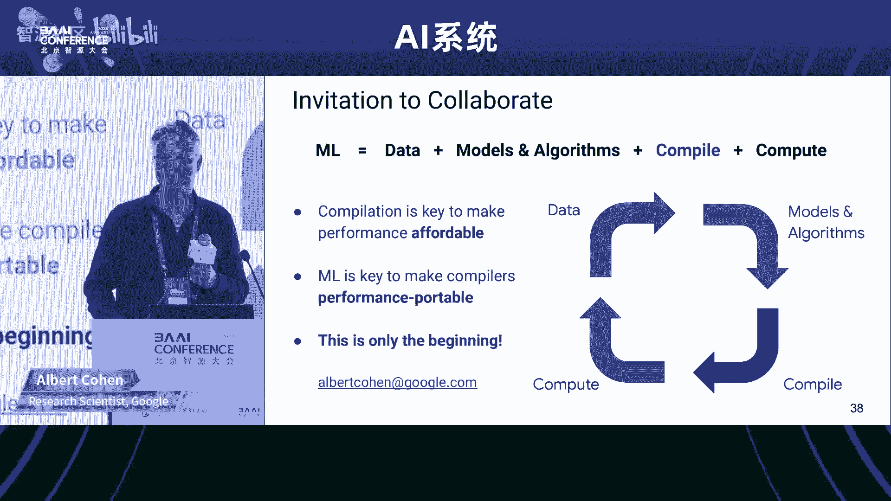

Okay。Okay， okay， thank you。Yeah， so because the very tight schedule。

 So I didn't arranged any Q a for this for today's any speaker。

 but welcomed for any of your questions of line。 Yeah， so next I want to introduce Peng Wu。 Yeah。

 actually， the one special thing I want to mentioned。

 and I don't know how many of you have watch the the launch of pie touch 2 dot0 that event actually I online to watch that and right after the touch2 dot0 and the first invited speaker at the some important tackle announcement the first one is Peng Wu and。

😊，And she announced the compiler dynamo for Py 2 0。 And at that time， I think， wow。

 Py have the compiler now。 So that's to be something the special or beginning things for P。 Yeah。

 So Peng actually， she have work for IBM research more than 10 years。 Actually。

 I also work for IBM research for the system for more than 18 years as well。😊。

And and she later was for I for Huawei and established Im the programming。😊，Lb， yeah。

 and work for Huawei for seven years。7 years。 And then she joined the matter and let the compiler part for matter for three years。

 Okay， let's welcome Pg yeah。😊，Alright。Okay， thanks for the introduction。

 You might notice on this agenda。 we have2 P towards 2。0。

Talks， I didn't realize thats the second one， but I want to qualify this one。

 So this one is focusing on how we are bringing compiler to the core of Pytorch。 And then later。

 the next talk， Michael is going to focus more on how Pytor 2。

0 is helping the large language model training。So you've already heard one compiler talk and I saw in the agenda there are more。

 So before I start， I want to give you a mental model of like not all compile M compilers are the same。

 So one basic way to differentiate is in my mental model is to differentiate between。

Machine learning framework compiler and machine learning Acccelerator or hardware compiler so。

Albas talkg is more coming from the bottom from like closer to the hardware。

 And because our compiler is called Pytorch compiler。 So we are more coming from the top。

 and the thinking is very different because as a framework compiler。

 what we are focusing on is how can we enable all these hardware vendors to bring Pytorch models to their hardware。

 So there are things we do we have to do and there are things that we want the vendors to do。

 So keep that question in mind on the thinking behind machine learning framework compiler。

So today I'm going to tell a story。 I know there are many people are building their own chips or even their own machine learning frameworks。

 I hope at the end of talk， you could get a glimpse of the thinking of how we are burning compiler to Pytor 2。

0， not for the interests of research ideas， really for making real models run faster。Alright。

 so this is the release note Earl this year， March 15， 2023。

 This is where we actually release the Pytorwar 2。0 binary。

 and it says that we want to offer the same eager mode development and user experience while fundamentally supercharge how Pytor operates at the compiler level under the hood。

 So let me just simplify the message。 I want you to remember two words。Graph mode and ease of use。

So it was long believed by the industry that you can either have graph mode or ease of use。

 but you cannot have both。 And in this Ptor 2。0 story， I'm gonna challenge that conventional wisdom。

 So essentially， I'm gonna show you how do we have the cake and eat it， too。But before I get to 2。0。

 let's。

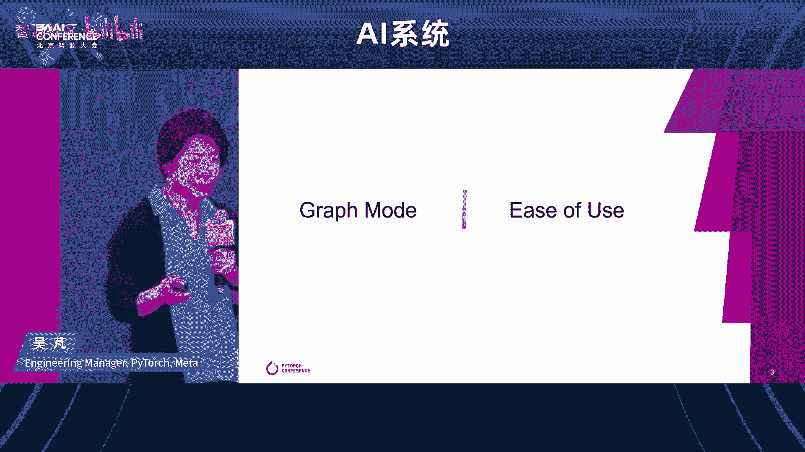

Roow back  five years to 1。0。 So Pytorch 1。0 is was announced almost exactly five years ago 2018 at the time。

 almost all the major industry backed machine learning frameworks or choosing graph mode because it was believed it's rightly believe so that with graph mode。

 you would have the ability to optimize using compiler and the performance leading would be a lot a higher。

 if you optimize one at the time。 So Pytorch is actually was actually a late comeer in terms of machine learning frameworks。

 And at the time， we made a critical， also risk a decision to。

Value ease of use above everything else。 The thinking is that we want to cater to machine learning researchers。

 and for researchers， they actually value more time to market than performance initially。

But with that work we actually don't know so what we did is actually we are one of the few probably just go all in with non graph mode and then we compensate on the performanceman side by working very closely with vendors to optimize at the library level and optimize whatever we could within the constraints of eager mode execution。

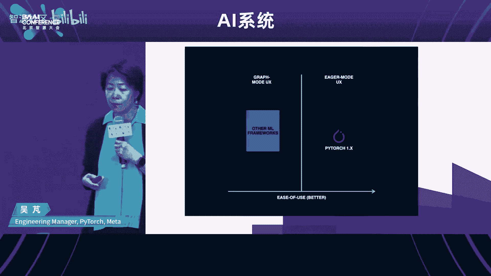

So。The data showed that this bet paid off。 so since the 1。0 announcement at the time。

 we were about 30% of researcher adoption。 and as you can see。

 the curve is going up and around two and a half years marked after the 1。0 release。

 we have passed the 50% mark and that essentially meant that were the number one machine learning framework used by machine learning researchers。

And you see a little bit of dip over there so actually I double clicked into that so this is based on same data source。

 but rendered in a different way。 so the middle session。

 the red part is a Pytorrch kind of researcher and market share and when you see the dip here is actually more about a few new up and coming machine learning framework and because this is in China so I want to highlight a few homegrown machine learning frameworks there is the mindsbo I believe here which sees a significant increase actually I used to work on the Minsb the accelerator compiler and then there is also the pal。

 the purple one let's see and Jas is this green one and then there are like a lot of other things and from this picture you would see that there are a lot of players over there but Pytorrch because of this ease of use is really。

Becoming the anchor of a lot of the kind of the framework of choice。For researchers。Alright。

 so now let's go to Pytor 2。0 what this talk would be focusing on one specific feature。

 but a fundamental feature of 2。0。 We introduced this very simple API Tor compile as the primary API for introducing graph mode。

And。What this does is remember ease of use and graph mode。

 So basically what you are when you are writing the model， you're still thinking in terms of eager。

 So this is very different from the traditional graph mode based MLl framework in those framework you have to think about graph and that's why researchers didn't like that。

 It's just not intuitive very hard to debug So here you write as if you are in eager。

 but you do an annotation just one line change to indicate to the compiler this is a part that we want to make it work under graph。

 So it's very， very simple right So does it work and actually in the Pytorrch conference announcement last December。

 This is a data we showed and we're showing over 170 models。 Tim is a vision model。

 torchbech is a bunch of highly popular research models and hugging phase is more like the today。

Former based models and the results are run on an media A100 and we combine results between AMP and flow 32 with more weights on AMP because that's more performing for training and all these data are for training so these are the geoamine performance speedups that we're reporting at the time and today the number has further increased。

Alright， so。You might wonder why do I make such a fuss about graph mode Almost all other machine learning frameworks use graph mode right so the problem is that because of Pytorch design for flexibility and expressiveness those good trades actually made it very hard to compile or to introduce graph mode with So if we look back on 1。

0 and 2。0 I could say that 1。0 is about a strategic decision of like who are we catering for and what are we giving up and what are we embracing for So that's 1。

0 for 2。0 it's really about actually the emergence of 2。

0 is really based on tech innovation So the moment we figured out how we can get the graph mode without sacrificing ease of use that's the moment that 2。

0 becomes real。And that moment is a torch dynamo moment。 Torch dynamo is an out of the box。

 G capture 4 pi torch。😊，So if you have followed about Pytorrch compiler， I mean。

 people didn't know about Pytorrch compilers maybe two。

 three years ago because we have too many of those so we have tried many times and our previous graph capture always require significant menu effort when you are trying to work with real models。

 So this menu effort ranges from either you have to change your graph or model to make it captureurable or you have to or if you are able to capture a graph。

 you have to make sure it is correct when you replay it。

 So torch scripts scripting effects tracing lazy tensor are all the previous generation graph capture mechanisms。

So how do we solve that problem， right， to make the graph capture reliably capturing the correct graph。

Basically， how do we make the mechanism both sound and alpha box。So let me give you some intuitions。

 so the first insight we have is that all the previous graph capture is aiming at capturing one graph model and that's where all the constraints are coming into play where what if there is something that the compiler didn't understand because Python is a very flexible language so what we decided is to allow capturing partial graphs so that whenever we encounter something that we didn't like。

 will just stop the graph graph break and fall back to eager。

And for its soundness because part of the graph capture is using tracing mechanism。

 so we introduced guards into the graphs， and this would allow us to record what's the valid condition for this graph to be correct。

And in order to use those guards at runtime， we need to check whether the runtime condition satisfy the guard condition。

 And if it doesn't， then will just in time recapture。

 So it operates almost like a just in time compiler。

So to give you one example for the previous example。

 this one I deliberate introduced one which requires a graph break。

 so if you print out the graphs to the right hand side of what we captured for this example。

 without if you didn't know about all the previous points。

 you might be surprised to see actually three graphs that are highlighted by the colored bar over there because there is a data dependent control flow B do sum depending on the value of B。

 it may or may not go into the if or else branch。And but there are other reasons that we graph break。

 so for example， if we have something that's like outside the Python a see extension。

 we don't know anything about it， we will graph break for soundless reasons。

 and there are some of these conditions actually where over the last couple of months we're gradually reducing the reasons for graph breaks。

 some are implementation limitations， some are just fundamental to the correctness of the program。

I talked about graph breaks， but I also want to show like we are supporting this torch dynamicyal graph capture we're really supporting a lot of very complex features of Python。

 so here's a list of the complex things， how do we handle function call。

 how do we handle comprehension and all these container types， loops control flow。

 Lambda and so on and so forth。So I want to give you a glimpse of what the magic under the hood so this picture the left hand side is a default C Python behavior so this is what happens when you use E mode and to the right hand side especially the dotted box here and there those are the new things we added number one it's actually we're very lucky we have a standard python C Python feature that allows us to add these extensions so that means you don't have to download the special version of C Python you just need to use a particular modern version of it and here with this boxes the thing we talked about capturing partial graphs break and then compile the graph into binary and then execute the compile code doing the run-time check going to a cache and recapture all of these things happen transparently behind the scene so that's why users just have to annotate one line of code。

In order to go into the graph mode。So these things seem to be plausible does it really work we actually run torch dynamo with a very simple backend that just basically fall back to eager to test the robustness of the partial guard graph capture mechanism。

 we run it over 14 k。GitHub Pytorch models with certain star level。

 So it's not just trivial examples。 And our pass rate is like 99% above。

I didn't talk about integration to Torch Nanobo， but actually that's a major design point we really want different backend or accelerate compilers to integrate easily with Torch dmo so I'm going to talk a little bit on the Pytorch native backend were building that's the one here but there are a lot of vendors since the Pytor 2。

0 announcement and release are engaging with us almost all major。

Beend compilers are trying to integrate with us and we didn't put the exact number there because it's changing and it also depends on the support levels that will label it as experimental or more more stable ones。

And finally， we already actually show the previous performance member。

 but what you want to show is that people might question whether partial graph would sacrifice performance for the backend compiler。

 what we observe is that even though we are capturing partial graph the graph is still large enough for a lot of the optimizations to kick in like fusion optimizations and because now we can almost funnel any Pytorch compiler through the graph mode so the widen coverage actually more than compensated on the smaller graph that the graph break is introducing。

 so we do see like quite significant every speedups on a wide side of benchmarks。

Okay so this is torch shineinmo I want to remind people that actually I think of as talk is all about like how do we optimize the actually generate efficient code so keep in mind that Torch dynamo is the breakthrough point for how 2。

0 exists but by itself capturing graph doesn't improve performance we just enable the backend compiler to connect with Pytorrch models so that magic for improving performance in the P2 stack is torch shineinammo to Kcrs is a Pytorrch native compiler actually I should say a Pytorrch native training compiler because there are a lot of compilers out there many are focusing on inference and there are a lot of compiler out there but fewer are designed for the Pytorrch IR and one of the reasons is because Pytorrch IR is very a Pytorrch offset is very large and complex has mutation all these unpleasant features that are convenient for library developed。

But not convenient for compiler。 So actually aiming for I design specifically for Pythtorch semantics is very important。

😊，I don't have time to go into the technical details on inductor。

 but I just want to highlight a few things that's unique in Inductor number one。

 Torch inductor actually， most of the PD2 stack is written in Python itself and it allows us to move really fast and make the things hackable because nowadays a lot more people know about Python than knowing about COC++。

And the second part is we started with instead of focusing。

ResNe or a few models demonstrate the value， we actually start with focusing on designing the framework to be general purpose to handle long tail apps first。

 and this is also very important for handle real models。

So that's the breast first approach and the last one is the IR design。

 so I would say that if there's one thing that you want to remember about torch inductor the unique aspect would be the PyTrch IR native design if you're interested in that or extend on torch inductor I would recommend you to look for more information online。

So just to give you a mental map of what torteinductor stack looks like。

 there are many boxes over here， a lot of the compiler researchers might be focusing on the cogen aspect which is the hardest part and what's interesting for us is being practical we actually didn't do the cogen ourselves we actually rely on Triton very early we are a very early adopter of Triton so one message here is like when you are building a practical M compiler stack from top to bottom you actually really want to have the whole thing working like the minimum viable product and there if you can leverage other components if they can do the job you don't have to build it yourself so that's what we adopted it for the GPU cogen we rely on Triton and that turned out to be a very。

Beenefficial strategic bad。 And then we also have a C plus plus backend right now。

 we're involving the Intel team developing the C plus parts backend， especially for the CPU。

So then theyre about already talked about like scheduling fusion so these are what typical machine learning optimizing compilers would do。

 so I wouldn't say anything about it， the very unique thing that make everything else work well from PyTtorch is actually our IR design so how do we lower how do we design the IR again don't have time to go into the detail。

 but I would if you were to design your own machine learning compiler to integrate with Pytort I would recommend you to look at how we are designing the Torduct IR。

All right， so I'm almost wrapping up my talk here， but I want you to take away with this picture in mind。

 the left hand side going from eager mode is the 1。 x。Execution pass。 this is eager mode execution。

 basically one operation at a time。And 2。0 with the Torchal compile interface is actually completely backward it's an optin interface。

 so it's completely backward compatible with 1。0 and what you will see is that we are trying to funnel the model with the same programming interface into the graph mode which is this part as much as possible and and the key technology in this is actually this part to made it possible because as I mentioned before what made Pytorrch beloved made it really hard to graph capture。

 so once we have this component figured out as an outer box experience is almost like turning on a faucet so the Pytorrch models just flow seamlessly into the graph mode and Torch inductor is the one that's developed in team which is I would say it's the best performing training compiler for Pytorrch today。

 but I also want you to remember that the role of a machine learning。

Where compiler is not to build everything ourselves。 And because we do understand like we have。

Resources to invest in say GPU。 But what about the other accelerators。

 So we do want to enable other vendors to hook their own compilers with this part。

 We don't want them to worry about this。 This is so hard and not very interesting for them to figure out。

 So here there are many other machine learning compilers。

 This figure is a little bit simplified because there are actually different integration point for a machine learning accelerator compiler to interface with Ptorrch。

 You could do it at this level like siblings of torch inductor。

You could actually add backends below toch inductor， for example。

 the Intel CPU backend is something integration here and increasingly we're seeing people actually integrate at the Triton level so for example we've seen AMDs investing their GPU cogen into Trident so if you are connected with Trident。

 this thing also flows naturally so I want you to keep in mind the lower in the stack you're integrate。

 the more you can reuse what we build and the less work for you if that integration point is suitable for your hardware。

All right， so。Let's see。 Okay， so I'm gonna escape here。

 but what I want to say if I reflect back on 2。0 I also had research background。

 I think the one thing， one theme is we're trying to define machine learning framework compiler that works for real models and we are trying to be very。

 very flexible that's all we're trying to do and a lot of decisions is to solve the hardest problems first and then try to reuse as much component as possible。

All right， so what's available now so if today you go to Pytorch Github nightD releasease you would already have a lot of the these are the core technologies that's already built in there and you have Tor compile as the compile mode API or G mode API it's a alpha feature you will have Torch inductor as a default backend for GPU you can use it for both inference and training you have dynamic shape as experimental feature but you have to use it with a flag on there's a lot of progress made on dynamic shapes since March and you can get the weekly updates from the dev development developer forum and we have three performance mode for Tor compile the default reduce overhead is for models where there is a lot of kernel launch so we made it work with Cgraph and other optimizations。

And Max also tuned this enables auto tuning。And what's coming next。 So for the。

Maybe before the next Pytororch conference， which is in October this year。

 we are still continuing to improve performance because we do believe we are just scratching the surface of what's possible and we are also improving the composably with other Pytororch features for example。

 quantization tensor subclassing and so on and so forth in the longer term beyond six months actually we are already doing a lot of work onto PD2 export this is the past where it requires a little of menu effort for you to export a whole model with guards resolved into a sable form and then you can carry this model to whatever runtime you have this is most recommended for if you have like embedded devices or inference in production where Python is not allowed。

And yes， we're talking about large models right so so far I have mainly talked about single GPU so now we are also heavily invested in P to distributed and in order to not。

😊，More than just optimizing for compute， We are trying to optimize communication as well。

And I think Michael probably would talk more about that。And to conclude， I just one message。

 get involved， actually， it's a tremendous effort to build。AMachine learning compiler by yourself。

 So I would highly recommend if your workload is using Pytor。

 try to integrate at certain points with P2 stack。 It really save you a lot of a lot of the work that's not necessary and there is still a very。

 very strong momentum for us continue to involve P2 stack so you can And also when you try P2。

 give us feedbacks if there's anything that's not working or to be the direct compute contributor to P2 stack。

 especially on the compiler side。All right， thank you。

Okay。Okay， thank you，朋g。Okay， so I think we have， yeah， we have two topic today。

 And so that's why I we organize the local deep learning framework topic like aal pal and mind into the session in this afternoon in the other AI open source forum not in this one。

 Okay， then let me introduce Michaelmin。 Yeah hes another old friend another old friend。

 He actually work for IBM for a long time and and hes the inventor of the cell processor aelerator side。

 Yeah， and I think some of you my still remember actually is almost the first general purpose the multi processor。

 but with the general purpose call and also the a called to accelerate the workload at that time。

 including the gaming name， those kind of things。 and many years。😊。

After now Michael he is now in matter and leading the acceleration Shen side for the pie 2 do0。

 I I think so we can see the change of the pie to and it good for the very simple to。

 to use very friendly to program。 And now it more focus on the performance。

 So that's why we also the very happy to have the Michael here to share this kind of things for pie 2 do0 and to share his things with us。

 Thank you。😊，してこか。Thanks for the kind introduction。嗯。

So I'm excited to be here today to talk about how we optimize by Tor Tudodo to。😊。

Be the workers for generative AI to be the environment of choice for developers in the generative AI field。

 if we look at。Genrative AI， we find that generative AI today uses artificial intelligence models that are able to generate new and original content across a range of modalities。

 images， text and music， and these models can produce realistic and creative outputs that have significant potential in a wide range of domains including art design。

 entertainment， etc， what we know about generative AI models today is they are the largest neural network models in use and as a result they create a unique set of requirements。

The most common generative AI model today， the largest models are the largest language models which are advanced AI models that excel in generating humanlike text responses and they have proven incredibly powerful for understanding in generating natural language and enabling models to interact more naturally with humans。

 an example of this is chatCT developed by open AI that's been trained on a very extensive corpusive text data so if we look at the language models size。

 we find that over the last five years， language models have grown in size by five orders of magnitude that's a factor of 10 every year my background this a chip design and their factor of2 x every 18 months was consideredck Bckne。

Speed and it has transformed society and technology， as we all know。

 that's why we are here compare that with 10 x in a year for AI models。

 What comes with that is also an incredible demand for processing power and for new capabilities to take advantage of the hardware and to make these large language models affordable。

 deployable and have the necessary。Speed to interact naturally with applications and with humans。

The second class of models are diffuser models or latent diffusion models LDMs。

 and they excel in producing。Media output in particular image images， video， and more。

 they use latent diffusion processes to create these high quality outputs， two common examples。

 well known examples are Dli2 and stable diffusion。

So when we look at all of these generative AI models today。

 we find three key requirements to make them performant。

 to make them deployable to make them affordable。 first and foremost。

 this speed and efficiency because these generative AI models are so computationally expensive to both train and query so efficient training and inference are。

Fundamentally important。For a widespread adoption of these models。When we look at these models today。

 we find that they're all transformer models based on attention mechanisms。 So this is in particular。

 a component that we want to optimize for to improve model performance and efficiency。And finally。

 large language models， large gene AI models are large。Surprisingly or not。

 And that means that they need distributed computing infrastructure to train， to make training。

Make the necessary progress to make training affordable and to fit all the parameters of a model into。

A device or a plurality of devices that are interconnected using distribution technologies。

So how do we solve that Well for speed and efficiency， Pang talked about torch compile。

 that's the work for accelerating models， big and small。

 and they offer a significant benefit to all of the generative AI models。

We optimize transformers with accelerated transformer implementations that we implement in PyTorch2O。

 and finally for distributed processing， we have PyTtororch distributed with data parallel and fullyarded data parallel training。

So let me turn to how we accelerate the Pytorch transformformer API。

 the standard API for transformers in Pytorch。So the PyTtororch API in general。

 including the Pytorch transformformer API are designed for flexibility and these of use that is what attracts developers to PyTtororch P talked about that before that flexibility。

 the ego mode execution and a number of options for each of the operators to create to create all types of neural networks with range with a range of choices whether that's doing normalization before the basic attention function or after using different types of activation functions and so forth。

 what all of that brings is a transformer implementation that requires many PyTtororch operators to implement and to。

Control the computational complexity。 These are executed in sequence。

And allowing for all the different options that might be present， so in a nutshell。

 the flexibility comes at the price of performance， usability comes at the price of performance。嗯。

With torch compile and with the accelerated transformers。

 we can optimize transformer implementations， on the one hand we use fused kernels to combine multiple operations and avoid materializing large arrays。

 large tensors that would introduce bottlenecks around memory access。

 one of the pans of existence of anybody who has tried to optimize models for accelerators or CPUs for that matter。

 and。They combine many operations， they fold the soft jamm into the matrix multiply。

 they fold two matrix multiplies into a single larger structure。That way。

 we can combine many of the operators and implement them with a single fused loop kernel。

The second optimization that we rely on is using a fast path architecture for inferencefr。

 where we optimize inference for where we capture common inference patterns and use kernels that are optimized to exploit variable input sequence length。

So if we look at the literature how to accelerate tension， computation。

 there's been steady progress starting with the paper in 2021， that's just two years ago。

That talked about how self-attention can be implemented without needing ON squared memory it introduced a concept of usingsing attention kernels to reduce memory usage。

 and then last year tried Dao and his colleagues from Stanford University published a paper called flash attention fast and memory efficient exact attention the Di A that's based on these insights that Robin Stts first published a year before。

The team from Stanford University provided an optimized coUuda implementation for this algorithm and it beat out Nvidious entries for MLPf Transformer training last year in 2022 in June。

啊。And finally， metata's own FA research labs developed exformas。

 which is similarly based on the observations by Robin Stotts with respect to optimizing for memory usage to speed up attention computation。

They released a package called Xformers that provides fast and memory efficient attention computation。

Functions that are domain agnostic and are widely used in the research community。

 envision the N LP and more。So if we look at flash attention。

 this this figure is taken from the flash attention paper， you can see the basic approach of。

Computing attention while reducing the memory usage， rather than materializing the end by N。

Mattrix from computing。Q， K T。The algorithm has an outer loop that loads sub blocks of the K and the B input into S RAM。

 and then in an inner loop iterates over a Q to compute。

A subset of the final result that is then written to HM to the high bandwidth memory on GPU cards。

 and then it proceeds to the next block， iterating again over the vector Q。

 the query vector of attention。The outcome is this huge。

 huge improvement of performance the authors of the F attentiontention paper report 7。

6 x speed up over the attention implementation in GT2。

Owing to folding all of these functions into a single kernel and if you look at these functions they all have in common that they take a large matrix as input and produce another large matrix as output and thereby bottleneck on memory excesses in each of the steps。

Let me turn briefly to Xformers Xforms is was developed by fair Metas research lab for AI and it consists of customizable blocks that are independent and can be used without the generic boiler plate code that comes with usual with。

A啊。APpiI is provided by Pytorch that office a brought set of options and flexibility。

 These components are domain agnostic and depend on researchers to integrate them and to combine them to use for vision N LP and many other modalities。

 This is a research first。Effort， research first package that contains bleeding edge components that are not yet available in mainstream libraries。

 Or that was the case last year。And these components are built for efficiency and in particular memory efficiency use to give researchers high speed of iteration。

 it uses its own ka kernels where necessary and otherwise dispatches to libraries like Holas that are available in the open source community today。

Here is a view of the speedups that can be obtained with Xformers showing a speed up up to 4 x for training and a significant improvement。

 up to 50% in memory efficiency。So。Both flash attention and Exers were new based on papers published in 2021 and came out in 2022 and to see the speed at which Pytorch developed。

 they launched in 2023， but Pytororch to thedo， one of the advantages of using an open source framework is the hackability。

 the pluggability of new ideas and making Pytorch the go to environment for researchers to integrate their own work to have the most impact and make it available to the largest community of users。

 TriD and his colleagues at Stanford had independently developed flash attention and。

Shortly before submitting the。Paper and the training results to the ML Perf benchmark competition。

 they approached meta about integrating this capability into Pytorrch and so。We。

Worked both with the flash attention。codeode， but also and its developers。

 but also with the Xform developers to integrate these new bleedinguting edge libraries into Pytorch and making them available out of the box for all developers we did that using a new operator scaletop product attention it's not only a new operator it's a new kind of Pytorch operator it's an operator that comes with multiple implementations that support different inputs and hardware models so before in Pytorch you had one implementation of each operator per hardware platform and that would cover the entire operating space this is different here but scale top product attention depending on different hardware types。

 even different types of inputs。Sizes， dimensions， ratios， data types， et cetera。

 it dispatches to different implementations。They all have a common interface。

 the app of the underlying SDPA operator， and the high levelve SDPA operator implements a selection logic that looks at the inputs that considers the current hardware platform and figures out which implementation to call this allows models to take advantage of optimized implementations depending on what hardware they run on and at the same time makes models portable across different models and hardware types and finally we've integrated SDPA into the Pyth API for multihead attention and transformers both encoders and decoders to accelerate training and inference for new models but also for existing models that were developed and even trained before。

I to the0 was released with its support for accelerated transformers。

 It goes hand in hand with forward and backward compatible weight formats。

 So you can train with the new operator with the acceleratedcc transformers and save the weights to use with the legacy model if that is deployed some place or conversely。

 you can use a previously trained model and fine tune or deploy for production using the accelerated transformer capabilities。

😊，So here is。How the scaled product attention plays out， the top level function。

iss implementation agnostic and then dispatches to one of three implementations for this is for NVDA GPUs in particular。

 there is a fallback kernel SDPA math that that implements mathematical description of the attention logic calling internally a sequence of Pythtorch operators。

 it is basically the legacy implementation and the fallback if no better implementation is available we have the SDPA flash attention kernel that provides a coupa implementation of flash attention for a100 and some other devices for 600 bit floating point data types and certain input common input sizes in cases where flashes available。

It's typically the fastest choice and because it is highly optimized for just these few operating conditions and uses in line PTX and all sorts of other performance enhancements and finally there's the SDPA memory efficient kernel that comes from the Xformer library that provides a coa implementation of memory efficient attention developed by Mes F Paris Research lab。

 we have another implementation that is Tritonbased that we can use in the future for hardware that cannot take advantage of the F or the memory efficient implementations that implements but implements a cogenerator for the Triton kernels。

So this chart shows explores how to optimize large language models with accelerated transfer。

Transformers using And Harper's open source nanoGPD implementation as example， so step number one。

 if you want good performance and efficiency is always enable to do compile there's really no excuse not to use it as Pg highlighted it has over 99% success rate。

 a cross a broad range of very broad range of。Models that are out there today， and。

Then the next step is we replaced the Python implementation of attention with the scale do product attention operator that improves overflow handling because the integrated SDPA operator distributes how scaling works to avoid overflows it delivers better runtime but memory efficient kernels being faster than the math implementation and flash offering a further improvement and it delivers slower memory usage which allows you to use a bigger batch size。

 finally for large language models patting the vocabulary size helps with Tensor core efficiency because downstream matrix multiplies can take advantage can take better advantage ditch of Tensor core Tensor cores when vocabulary sizes aligned so we see the improvement here。

We start with a baseline of about 250 milliseconds per batch training time when we enable torch compile it goes。

 it drops to 140 ish milliseconds is we replace the legacy Python attention implementation that was in nanogptT with the different kernels that we have in accelerated transformers we are able to get another significant reduction and then finally patting the vocabulary size to take better advantage of Tensor course offers yet another boost the other thing that you see here is that with the memory efficient attention implementations that's both flash and the Xformer implementation you can use much larger batch sizes because demo they make more。

fficient use of memory and that in turn is another boost in performance If you look at this here the 2X speed up。

 this plots the validation loss after one hour of training so flash attention by offering a faster iteration time offers。

Much better all loss。Regardless of batch size and you can see the distance between the two curves reflecting about 2x speed up between the python baseline and the flash and。

 so then if we extrapolate that out to the improved validation loss that we get from using larger batches。

 using larger batches in essence translates to another over 2x improvement in speedup。

 of course that depends on specific convergence behavior of your specific model。

We worked with hugging face to optimize decota models and we found that we got up to 70% inference speedup for diffuser models and for training LLMs we got 70% training speed improvement and about 20% inference speedup in addition we got over 110% memory savings in some instances plus more importantly the models did not o for for many cases so accelerated transformers enabled new capabilities so in addition we have。

The fast bath logic and that for inference and the biggest benefit out of fast path is taking advantage of nest tensors these are a subclass of tor the tensor that Pg mentioned earlier。

 and they allow to capture the variable length tensors。

 inputs that are common in NLP processing and that can deliver up to 4 x speed up on BRT style models and up to 2。

5x inference speed up on vision transformers。So。We have parallel training support and Pyth2。

0 with both data parallel training and fully sharded parallel training。

 I'll skip that in the interest of time and so I'll conclude with the。啊。

With with a summary that Pytor20 brings significant out of the box acceleration to Pytor transformer API and to models for training and inference that use transformers。

 we've integrated that in torch text， torch vision torch multimod far sake。

 And we've worked the hugging face to integrate as well。 and。By providing that library integration。

 we can get performance out of the box for a broad set of models that were developed even before Pythch Studiodo。

 finally Pythtorch Studiodo provides abstraction and portability using both Torch compile and the new SDPA interface that allows models to take advantage of new improvements that will come online both in the compiler and a new high performance kernels for transformers to deliver the best possible performance of models in the future。

 even devices that are not available today with that thank you for your attention and I'll conclude my talk。

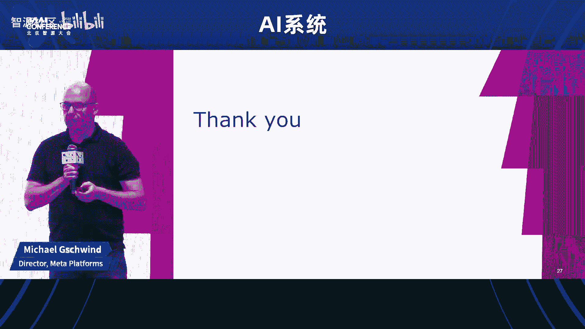

Thank you， Michael。 Thank you。 Yeah， Yeah， and it's amazing that a lot of good stuff is coming into the P touch2 dot O and not only to accelerating the inference side。

 but also the important for the training side， so。😊，Okay， so let me introduce our next speaker， yeah。

Actually， Jing， he is came from any scale。 any scale。

 I think people might heard about the Ray that is the another very good framework and especially for optimize the distributed training side。

 So today， I'm very glad can invite Jing。 he actually is leading the machine learning team at any scale and any scale is the company who is supporting the Ray very fast group。

 So let's welcome Jing，😊。

Yeah。YeahThanks for the kind introduction to yeah， very glad to be here I talking Bar Ray with the audience today。

 My name is June。 I let the I lead the machine learning team at any skill。

 which is the company that's behind the open source framework， Ray。😊，嗯。

So let me see if I can figure out how to use this thing。

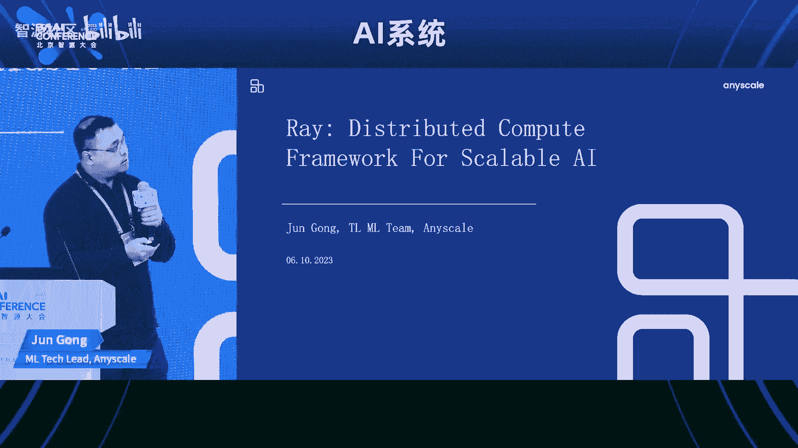

So I don't have the slides actually， but fortunately， Michael just show the chart。

 you know during the last talk， the scale of the machine learning workflows these days seems to be following some sort of exponential curve。

 and it seems to be actually accelerating even fuel by the large model generative AI stuff。

 So that's actually the reason we believe the folks at any scope believe why the framework of way sort of like catch a lot of attention and popularity gaining a bit of popularity lately。

 when you're talking about open source frameworks， people often use the GiHub star as a metric for measuring how popular the framework is So here's a quick chart to show that。

The red lines right， and we sort of have caught up to Kafka since the last month in like half of the time and we are marching towards the spark right now。

嗯。So a little bit of history of the framework， I think six， seven years ago。

 the two founders of any skill they were working on reinforcement learning at Berkeley。

 the reinforcement learning at those days are a little bit different from today where the computation is actually usually blocked on the simulation side instead of the training side because reinforced learning is essentially just like randomly exploring in some simulated physical world。

And。The founders actually just found themselves repeatedly stuck in this situation where they need to write a lot of GRPC and talk to like how these remote simulated environment collect the training sample the actual training of the policy。

 the reinforcement agent is actually pretty fast right。

 So all the computations are like all blocked on the simulation side。😊。

So they thought like let's write some framework， you know， to make it easier to to do GRPC and to do。

 you know， bandwidth efficient， you know， data movement and that kind of stuff。

 So this is how the framework starts。 and this is also how why if you look at Ray RL。

 which is like R reinforcement learning library that's built on top of Ray is one of the first library that's there。

 things like day1。And it's a little bit。Un， I say。And then they quickly realized that。

 you know this framework seems to be useful for not just reinforce learning。

 but other types of distributed computing as well。 and the abstraction seems to be， you know。

 nice and elegant， that's why they started the company any skill to you know try to commercialize Ray And since the companies founded we've added you know other libraries like Ser。

 which is to tackle the inference and serving use case of the。😊，Yeah。

 for for machine learning and also。Last year we launched Ray Air。

 which is sort of like this umbrella。You know， term to。

 to cover this end to end machine learning use case。 And also like more recently。

 there's actually also Ro data set， which I'm gonna talk about later。

I didn't realize there's animation for this guy。So this is like a picture of the native ecosystem today。

 So at the very bottom， you have physical computation， computing cluster and machines and all that。

 and rate core sort of sits on top of the the physical computing devices to to extract away the infrastructure side of things。

 And above rate core， you're pretty much just dealing with， you know， native Python。

 and you don't have to worry about GPS or CPU or memory and all that kind of stuff。

 And once you have rate core， then we build all these libraries， you know。

 rating for deep deep learning rating tune for hyperpermeter tuning and serve and data set to like cover the entire into an machine learning workflow。

😊，Okay， so。Now that we have a high level picture of what you know。

 the ray is and what the ecosystem might look like。

 what I wanted to do is to get into some of the more specific。嗯。Use cases of the the the the。

 the whole ecosystem。 I want to discuss the， the common pain points that we。

We see from our day to day life dealing with， you know。

 customers and users and also explaining a little bit of why how the real libraries are trying to tackle those and try to like make those things easier。

 The first thing is actually， so this is in like， you know， the workflow order。

 So the first thing I want to talk about is the data ingeesttion side of things and。And we this is。呃。

那个 funny你的 we build。Per the last like this is the most recent addition to the to the ecosystem where we introduced array data set。

 I think I think just yesterday， somebody was asking me， like。

 why do you guys want to build a data set， you know。

 Pytor has a data load they like hacking phase data has a data set the the answer was actually。

 you know， while we are dealing with， you know， helping users and customers debugging their workload and dealing with these practical matters。

 you actually found the the distributed data ingestion。

Is actually a little bit trickier than you than you think， right。

 Because these thing these things normally run zone CPU。

 like the the pre processing and data loading。Like there's multiple steps between you load the data and before they get to the GPU for training。

So that makes the， the cluster usually like a heterogeneous。

 meaning like you will have different shape of the machine。

 You will have different resources available on different nodes of the the machines。

 And also when you， when the， the， the， the scale of your data gets large， oftentimes people will。

Csh if you go like data loader requires you to load all the memory， all the data into into memories。

 I was actually always a little bit suspicious if somebody library tells me like I need to load all the data into memory at once。

 right， usually those things don't work。😊，And because of Ray and because of this。

 like shared memory space on top of multiple machines。 and within the cluster， the。

 the team felt like we can build a library to make these things a little better。😊，And。

Oh another important thing is if you actually go the bug people's machine learning workloads。

 you will realize like a lot to time times when they say the GPU utilization is pretty low。

 the problem is actually happening on the ingestion side， you know。

 some sort of like prefeion and stuff will solve those those cases。

So that's why we build a rate data set， which provides a distributed and resource of where。

Data transformation and ingestion， meaning， you know， if you have a cluster where you have three GPs。

 you know， doing the actual like data parallel training and you have 30 CPU that's doing image reading and transformation before they gets free to GPU data sets are actually aware of these resources and will dispatch your work to the right note。

 And then it's gonna try to like be smart and take you know， data locality into consideration。

 and you know。And make the whole thing like pretty efficient。And I think just last release。

 we also enable the streaming execution as default strategy， meaning。By default。

 we'll never try to load your data all into memory once like everything is is streamed from all the way from the the source device and we will apply proper back pressure so that。

Like your job is efficient， but we don't， you know。

The performance one degree into like barkinggestion， basically。Cool， so the next is batch inference。

 I， I mentioned this the the second， because although this is like the， the。

 the step after you get the model， I w to discuss this next because it's also handled by the dataset set instead of like just doing ingestion。

😊，A common thing that once you've trained the model is to actually use the model and run it over like a large set of data。

This we call it like battery infant。 you can think of， you know， for example。

 sometimes you have a large car of like tax data。 you want to run some embedding model to turn them into。

 you know， embeddings。That that task actually has a very similar characteristic as the the ingestion part。

 because you're still dealing with， you know， a heterogeneous cluster and the data loading will happen somewhere。

 like from， you know， S3 cloud storage。 but the model needs to round GPU， right。

 So that job is also handled we think the best by rate data set。 And。And I'm gonna show you。Actually。

 some benchmark that we did， you know， more recently。

 we were comparing using ray data set versus using， you know， the sage maker。

Batcher inferencing and also using spark to do， to do this like batch inferencing job。

 Sage maker is actually really about because it's more。

Like a wrapper around this online serving system， which is totally not fit for offline model inferencing。

 The more interesting part here is is the comparison comparison between radioius and and Spar。

 The team naturally spend a lot of time optimizing the spark。😊。

Job to make sure were like doing a fair benchmark comparison。 And in the end， we were be。

 we were able to roughly like outperform maybe 3 x compared with a multi spark cluster。

 The reason behind that is because Sp constantly switches between you know Python and Java。

 like these two words。 So your data gets serialized and decalized like really often between them。

 And also， I think Sp has less flexible。😊，Processing fusing， so。They tied to you like overfusing。

 you know， multiple steps together。 And you， if you have one step in between that like bottleneck on GPU。

 then all your CPU steps are like slower as well。 That's where ray tasks shines and like give you some extra performance。

 The funny thing about this is also， when we publish this benchmark， the。😊。

The folks at Databricks actually ping us and say。You know， we can optimize this better。

 This is not fair。 And they spend some time。 And they， they， in the end， they like， yeah。

 its something。We can do this rather than do this。诶。Okay， so about distributed training and tuning。

This is like a bread butter for any machine learning systems。

What we know this about distributed training is that。These days， the。

 the ecosystem for training is like extremely fragmented， meaning。You know。

 you just get like all kinds of frameworks that you can do this。 And also， things move so fast。

It's very hard to say which framework are wing or like right the industry is completely not consolidated onto any particular framework。

 especially like these days， you start to use， you know。

 on deep speed or like accelerate to do large model training。

 which totally wasn't the case three months ago。 So what we felt like we should do for distributed training is we want to make the you know options open。

 We want to make the system like very extensible So users don't get locked in to some single you know framework that。

They end up having to switch with a lot of effort。So the the Raing library is rather。You know。

 lieway， it basically provides a lot of integrations with the existing training frameworks out there。

 like Ptor lightning or D C or。Hgging face accelerate。

What we take care of is mostly the setting up the cluster。

 setting the wrong time environment part of it。The actual deep learning and the distributed。

 you know， communication is handled by the underlying。啊，library。

And that would allow that that basically like allow， you know。

 these machine learning engineers and data scientists to do this without worrying about the hardware。

 as long as you have a very cluster， like your job can be， you know， up and around。嗯。And also。

 we made it so that it's very easy to turn a training job into a help department training job。

 because。Rune is actually orchestrating the the all the work behind the in anyways。

 so you just need to like switch a few lines of Python code to do that。Yeah。

 rating is for some reason， is one of the most popular libraries。啊。That that Ray has。Cool。

 so about serving， you know， we talk about the offline batch inference。

 so in terms of online serving， what we see the users and customer Wang are auto skating because the GPUs are really expensive and the serving traffic is actually naturally like cyclic。

So so they want to scale down to like very few node you know during the night and scale up quickly。

 So the all of skin speed is actually very crucial for any like practical serving system and they also want thought tolerance we basically like putting a lot of work introduce highly available serving maybe since last year and now you get to enjoy like highly available cluster and the race service deployment with relatively ease one thing I also want to mention is that from day one。

 actually the selling point of race service because it's built on top of the Raycorps and the ray has this actor concept where you know you can write like a little microserv each thing using simple like Python class and that thing is actually backing all the。

model replicas， It made it very easy to do model composition。And for a lot of the use cases。

 actually， it's not about a single model。 You want to， you know。

 score something using a set of models in the like graph fashion。 that actually is a very。

It's like a pretty sweet spot for， for serve and the reason for lot people to use it。😊，And of course。

 more recently， because of the large models we introduced some features that's not important before。

 such as like streaming support， and we had to improve the scalability envelope the law just to be able to scale up the large model deployment。

Cool， so the answer is about generating VI。 I think the the talk these days will not be complete if you don't mention large model。

😊，嗯。The raise。Interaction with the the large model in general AI world is actually pretty early。

Even before I joined like maybe roughly around when I joined any skill。

 we were working with this open source team。They were trying to train this model called GBJ。

 which is a replica， tried to open source a replica of G3， I think。

And they got a lot of free credit from Google。 So they were training those things on TPU。

 And we were helping them to celebrate cluster on TP U so they can like have a reasonable， you know。

 developer experience。 instead of dealing with like a large cluster of TPU instances。😊。

So that's the when， this thing started。 We actually didn't。

Pay too much attention about this until very recently， when like data breakricks， they。

They fine tune dling on top of GJ。 everyone was surprised like， actually， the model is pretty good。

 You know， it's better than you think。And， and other people who are using， you know。

 a ray to do large model， including like cohere AI。 If you guys don't know， like the。

 the founders of cohere are the inventors of the， the transformer structure。

And also we recently got permission from Open to say like they actually use the right train record to train G4。

 So from our perspective， you know large model is not like a single kind of thing because there are model sizes that you can do with a single instance as long as you have a few GPU cards on the instance。

 you can do a reasonable sized large model training on that。 so from our perspective。

 we try to support the work for our customers and the open source communities by using by offering a spectrum of things。

 for example， if you're okay with like one you know computer node an a GPU cards。

 then we have these like off the shelf examples that you can just quickly wrong and your job will be running in no time and if you're trying to run these relatively smaller。

Scall， you know， large model training。 Then you can use the ecosystem， you know。

 the native ecosystem library。And then we take care of the hardware and you can train your job。

And if you're really， really hotcore， like a GP ableI and cohere， who， you know。

 who's trying to write your own custom training stack and optimize everything yourself。

 then they actually use， they just they don't use any libraries。

 but they use the rateco to to help with the developer and experience and also the iteration speed。

So that's， that's what I mentioned。 I think it's。It's useful thing to you know。

 share at this conference。Okay， so I was when I was writing these slides。

 I was looking at the some of our， you know， biggest open source and partners and and customers to see。

 you know， what are the the most common use cases they have for Ray。 aside from。

 you know the big model stuff。 surprisingly， actually the most common use cases they will build a internal rate cluster as their machine learning platform。

 So that their data scientists， the machine learning engineer can basically just submit the jobs。

 you know， to this cluster and they get the result， you know， without doing any。

 know Kubernetes stuff or some because the scientists data scientists。

 they get to interact with know Python， which is the thing that they use every day as super familiar that helps with their developer experience at law。

 we obviously， so I don't have time to mention or， but our is sort of this。The only， you know。

 of the shelf of choice， if you want to do production scale reinforcement learning and we actually have a pretty big users of of the library there。

 and obviously and actually a very big， you know， adopter of from day one。 and they are sort of our。

 you know。Colleague and they， they submitted a lot peers to the。To the code base。啊。Yeah， lastly。

 I would encourage， you know， raise completely open source。 You can， you know。

 please take a look at our Github and also the， the forum and try to get involved。

 We welcome all the contributions from it。😊，The community， the company is actually relatively small。

 We have very limited resource。 So a lot of times the the awesome things happen because of the community。

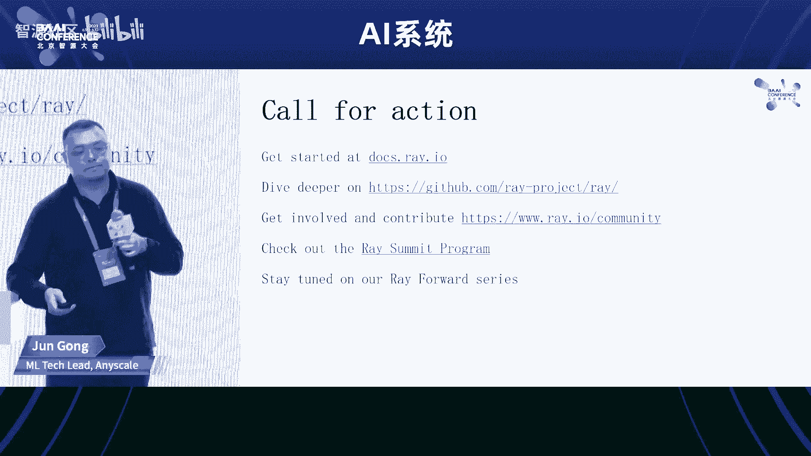

啊， that's it。Okay， thank you thanks share the Ray the and and those practice with those big name。

Next I want to introduce our next speaker doctor Tong Xinba。

 actually the AI compiler is very important and it not only important for the big model the large foundation model。

 but also to important to important to boost the boost the and adoption of the different architecture of the chips。

 especially for for for this local market so B A AI our institute start the AI compiler this kinds of research direction from last year。

 and so Tongin he is the leader for this direction。

 So today I am very honor to introduce Tongin and invite him to deliver his speech in this forum。

 Thank you。

I think to be fair， I'm going to use Chinese。

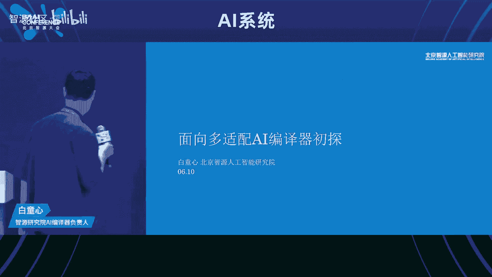

就今天我们给大家那个汇报一下，我们智源在那个AI编译器方面，就是主要是近半年呃，到一年这个时间的一些那个进展。现在只现在仍然是一个那个working progress的状态。对。对。

那个主要内容的话就是说我们先做一下那个背景介绍，就是主要是我们看一下，就是当前我们软硬件适配跟I编译器面临的一些呃痛点的问题。然后呢，我们一起跟这个厂商探讨一下现在的这个趋势，技术发展的趋势。

还有这个这个需求的趋势。另外就介绍一下我们那个智源编译器的整体的进展的情况。然后那个技术方面的话，就是说我们后面的主要的时间可能就是当然今天时间很少了。对，就是呃主要讲一下我们现在整体的这个设计思路。

还有还有几个这个关键技术点。对，后后面的话我们讲一下我们的那个展望和我们对未来的这个期望。对。呃呃是这样，就是说我们在做这个实际上我们是com，就是说我们智源主要是做这个模型跟算法之类的研究。

是我们去年开始，我们想深入去做这个系统的这个支持。对，因为我们觉得就是说有几个问题是要解决的。就是第一个就是我们国产很多这个专这个通用的GPU啊，还有这个面向这个模型训练加速器。但是到现在的问题的话。

就是说他可能就是支持这个上游框架的能力还相对较弱。然后我们想就是怎么样能够通过这个技术，尤其是compiler这个技术来去呃这个能让这个前端的这我这这个框架适配能更顺滑一些。对。

然后我们去年年底的时候呢，就是跟这个厂商，还有这个呃学术界的一些学者我我们做了一个简单的调调研问卷，就是主要是探讨一下现在的这个对编译器啊，还有软件适配的需求的问题。

然后那个呃我们稍微那个summarise这下，就是说一些。点问题集中在这儿，就是说对厂商来说，这个多框架的介入是一个比较头疼的问题。另外就是说AIBNG如何进行功能的泛化，性能的泛化。

兼容性也是一个安弄的这个这个问题。还有一些就是呃这个厂商对这个编器呃面向多种后端的优化能力，还是持一些这个就是有有一定怀疑态度。因为就是嗯不同的硬件的话，它的这个底层的架构啊。

还有结构都是不同的那你怎么样去设计一个这个这个通用的这个part技术还是挺困难的对。嗯，然由此的话可能会引出一些这个跟编辑相关的这个技术挑战。对。呃。

然后我我我我我也做了一个这个就是我画了一个这么一个图，就是让让大家预测，或者像评估一下现在这个呃不同的这个主流的这个AI编器现在的这个呃主要是面向试费的后端迁移性啊，还有扩展性如何。对。

另外就是说呃未来的发展趋势怎么样。假如说我们希望这个呃我们把图上这个这个技术向这个右上角去去推进的话，那呃对就是有哪些这个难点。对我做了一个这样的一个问卷。对，然后我们大家发现的话，就是我们简单看一下。

就是呃就是返回的这个意见吧。就是说正好看一下这个相对的位置是么样。但是这个并不是客观的我觉得他反映的主要是那个呃这个厂商还有学者对现在我们这个整个AIcomp生态的一些看法，或者或者主观的意见吧。对。

所以我们看一下就是说呃。总结下来是什么呢？就是说厂商就是这个呃当然我们从前面开始了，就是整个调研来说，就是厂商对前端设备的工作量呀，还有复杂性啊、不可控性有一定的焦虑。对，然后就是对这个从技术上讲。

就是对编译器的抽象能力，还有泛化能力有比较高的诉求。那么我们现在的这个state of的compilr的技术可能还没有完全达到这个这个这个厂商的要求。啊。

当然我我我我们也认识到就是多就是开发这种多后端的编译器是呃具有极大的这个技术挑战性的。最后就是我们通过那个那个那个调研的结果，我们看到就是呃我们普遍认为就是框架自带的这个编译器。

当然这个这个比如说这个toch加上triton对对对对，这这个刚才那个彭已经介绍了这个工作非常优秀的。然后那个应用性啊性能都非常优越。但是呢呃在迁移性和那扩展性。因为它主要面向这个pytoch呃。

这个自身的框架。所以在迁移性和那扩展性上可能还是存在一定的这个局限性的，或者至少大家呃感官或者说印象是这样的。嗯，就是呃另外就是这个呃这个面向这个可迁移性，还有扩展性的话。

就是呃我们主要主要的这个这个技术挑战性，就是如何设计更好的硬件抽象。对。OK就这实际上就是我们发现就是整个这个呃这个AI编译器技术还非常有挑战性的。然后那个呃我们也不可能解决所有的问题。

但是我们回过头来看呢，因为我们是有一个那个这个科技部的项目做支撑的有3年的这个计划。我们还是想从头来做一个稍微完整一点的这个编译器。然后我们的目标是什么呢？我们主要有三个目标。

第就是我们想去构建一个统一中立的这个下一代AI编译器的基础设施。然后呃比如说我们用通用的高层表示，然后用这个可扩展多层的抽象，这个有点像MR一样的对呃支持灵活的原编编译。

就是刚才那个ber介绍的这个我也是我非常喜欢MR最近的一个那的这部分。对这样就可以把这个这个呃编译器的优化跟这个ning啊，还有这个opposition可以解耦。对呃。

另外就是呃如果你想这个能够实现底层编译器跨平台的这个迁移的话，需要一个精准的。代价模型。还有就是我们现在MR也做的非常好，就是structure cogen这个是是。

也就说我们我们想去buil一个这种中立的下一代的AI变译器，而不是面向单一的这个这个前端的框架。然后第二个目标就是我们希望我们的这个I编译器的这个inrastructure。呃。

能够成为这个研究和产品落地的一个开源的平台。然后第三个目标就是说我们能希望他能真正的去帮助这个这个厂商去适配这个比如像大模型的这样的应用。对。呃，整个进展的话就是说我们去年主要是在这个调研。

还有这个立项的过程当中。对呃，包括这个去呃呃征集这个支援学者。对，然后我们正式的那个开发应该是从今年啊12月份开始的。对，然后现在的呃这个这个状态就是说呃我们这个我我们从这个pyto2。我们从py拖2。

0开始去支持。然后我们能lower到这个就是我们整个这个low框架是已经打好了。但是我们现在就是还没有完全实现这个后端。对对对对对。这样的一个状态啊，下面的话就是说由时间的限制。

就我们我们直接就是呃就深入到我们现在一些技术的细节。对，就是我们现在就是说因为我们想做一个稍微完整的一点的这样的一个编译器的架构。就是整体的这个思路的话啊。

还是建立在就是最近这几年的编译器整个的这个发展基础之上的。也就是说我们还是分成两个部分。第一个部分就是高层跟这个backend跟后端无关的这个那那我们前端的话。

当然我们通过像这个dynamo啊呃这个呃graphra capturing这样的技术。呃，或者是如如果是一个graphra framework哈，那我们也可以直接import它的这个graphra。

然后就是说我们可以有多个前端把不同的框架的这个呃这个模型或者是部分的计算图能low到我们的graphra IR上去。所谓的graphra I的话，就是呃用我们的这个这个中间表示表示的一个计算图。

然后我们在上面去做一些那个硬件无关的这个transs。嗯，最后的话就是说我们希望能够生成一个完整的一个相对完整的一个一个tensor这个penser计算中心的计算图。

然后之后的话我们会呃用这个就是说我们刚才说到的machine models cost models啊。我们去把它进行重新的这个算子拆分式融合，然后呢呃再把它lower到这个t级别这R上去那t生的话。

我们可能会会做一些这个进一步的这个面向代码生成的优化。但是可能会发现这个优化的效果不好。那我们会重新去进入这个优化的循一个非的这个循环。对这整体的一个那个是个架构的思路。

然后我们的那个所用的中间语言是我们现在我们自己重重新设计的一个中间叫ba basic step intermediatemedia language。它是一种比较简单的就是说一个轻量级的中间语言。

后面我会介绍一下。呃哦那我们这块，因为刚才那个是一个整体的一个一个一个通用的这个架构。对技术的架构。这个是我们呃现在这个 prototype就是说原形的这个面向0的一个这个是实现的一个架构那我们刚才就是我就用这个ygraph来做的前。

因为刚才彭经说到了，就是说呃其实有很多这个框架的那个功能是跟那个重序变相管就是说这个这个graph还有那个还有这个ization什么的这个是在这个框架的这个compr去完成的当然这个这可能不是在框架comp就是graph就是本身是一个一个一个一个变换的这个工具了。

然后出来之后呢，就是一个那我们的输入的话就是这个对然后我们把就是说我们上去对用loR来表示一个部分的计算图我们的locompr呢就是在。

helloR上去做一些这个这个SC基SC的这种data flow的优化。对，但是现在还还没有正式的开始。因为我们现在是我们阶段就是我们把这个这个hello已经实现出来了。

但是这个优化的部分还没有完全开始呢。对。那下一个阶段就是这sorry我这这个后面是有一些这个对，就是呃我们回头就看一下这个这个lower的过程，就是lower的过程的话。

其实跟这个呃呃我们还借助了FX的这个inrastructure也就是说我们生成的同样是一个个里面就看我这我个的子是吧？

那我 return个 node实际上是这个指向的一个函数是我们的buer function。然后我们再跑一这个就生成我们的的。

对因为我们的方我们的这个intermedia languagethon binding。好，那中间这段我们刚刚也说了。

就是这个是我们的呃这个中间表示那我们的comp实际上是用ra来实现的对那我我这个这是一个那个我们的一个小IR的一个前端的表示。

对我们会上面去做一些个前端的这这个S级别的这话后面的话我们还有一个就是说这个是比较的一个一个技术选择。

就是我们现在呃希望能够面对这个多种这个这个异硬件来来做一个这个呃通用的虚拟的这个runtime这一层。后他们只要去适配这些这个的话就能接受进来。对后面这个是我们现在我们打算开展呢。

就是我们现在还没做这个的IR这个今年的Q3Q的话，应该是主要的这个目标是这个这个R的应该是以个为中操作为中心的这个编的过程。对好，那就是主要的技术难点或者技术点的话，是这个R对我们希望他能够是提供一个。

稳定的这个上层框架接入的接口。然后它的抽象层次是跨越这个上层跟底层。这样我可以用它去实现这个high level的op和这个low level的这个code栈。对，好。

那我们整个这个fagIR就是说我们整个这个这个compiler就个端到端的项目，我叫fag IR就是它的技术路线我仍然是一个轻量级的层次化模块化的这么一个对呃一个设计。对。

然后bael本身的这个中间表示我们借鉴MR的这种层次化的这个设计。对，但就就是说这个后面我会因为时间的关系，我们会快一点介绍。对。呃，这这个是给大家看一下我们这个basil coreIR的这个情况。对。

因为我们这块看起来跟这个MR是有点相似之处的对。呃，但是我们我们相当我们强化了这个region payload。

就是说我们在这个呃这个呃cope capturing就是environment capturing上面，我们我们强调一下，就是region它是n capture的这个这个 payload。对的。

这个region的话是用这个双花块块表示的呃，单块的话是一个block blocklock的话，它会可capture它的 environmentviments。

所以我们可以用这个block来定义一个 function，一个closure都可以FN的话就是一个普通的一个一个一个operation。啊，那这个他就是呃简单的去看了它这个一个整个的这个IR的结构。

当当然我们这个上面是它的ide的这个语法，还有它的这个内部的结构。然后我们的这个表示的话，我们操作就是参测级别的操作的话。

我们是把它就是分类成这个不同类型的这个er这个类型的话就是说我们希望它是比这个像to，还有这个什么呃呃sableO稍微低一点的层次。但是比这个gene要稍微高一点的层次。对呃，那我们把它分成四类。

第一类的话就是只涉及到index map的这种view操作，再加上基于这个view的 copypy操作。第二个呢就是一个map类型的操作，然后是reduce类型操作专业类型操作为什么这么分呢？

就是说他们的实际上他们就是说呃他们的这个这个他们的计算的这个复杂性，还有这个存的这个特性是有明显的区别的，我我们把它分成这个四类。如果这呃就是以后如果有必要去这个设计新的这个类型。呃。

的这个这个操作的话也也是有可能。但是我们觉得现在的这个比如以转送为主的话，基本上都落到这几个里面去。嗯，然后举一个例子，就是说我们可以用这个view，就是view的话。

基本上就可以把这些这个tensor的这个index呃这个。呃，这个变换的之类的操作都一网打尽了。比如说transpose broadcastresha slice啊。

fe我们都是这个都可以用viewview来表示。然后呢，那个在view里面这个payload是用来做什么呢？就是这个payload定义了一个F find index map。那我们可以看最后一个例子。

比如说我们这view X是一个4乘5的一个一个一个tensor。然后把它这个呃比如像我们要做一个那个convolution的话，映射成一个四维的tenser。

那它的这个index对应关系实际上就是HIJK映射成H加J加呃那个I加K对。呃，map类型的话很简单，就是说他要么就是说它是没有输入的。

那么它的那个呃那表示就是说它的这个呃单位的就是说它的输出仅依赖最多每个输入的一个单个的单元的操作。这个叫map。那它有几个不同的这个操作啊，就是比如说这个这个ssper map。

那就是说它不需不去依赖任何的这个输入。但是呢它的输出单元的值跟只跟它的那个index相关。第二个呢就是我们定义了一个简单的这个map类型的计算。

对我们计算是先做了一个减法我做了一个exponential的计算。那这个payload实际上定义的是一个size之后的就map mapap是一个tensor计算。

那那个那个这个m接的这个它定义的个or之后的这个计把个5乘3的5乘3的，然后用一个这个这个函数来表示reduce的话就是我们用来去表示降维的这个操作。

对然后这个呃X reduce话就可以用来表示一系列的这种我只在第一维度去reduce加上加上这个size之操作。就我只在第一维度去我就以用这个 reduce一系列的这种非常通用的这个算融合的这个操作啊。

那那个jo的话实际上就是相当于是个或阵成操作的一个扩展。它表示什么呢？就是说我们在这当然我们有维度是不变的。但我们中间的话有些维度可能是需要这个交叉。对。

然后最低维度我们可以需要contra需要需要需要消去的。就这是一个这个也是一个比较通用的模式。然后它的这个实际上它的计算复杂度是比较高。而且它涉及到的data movement是比较复杂。

也是我们需要特别要注意的对然后这个针对这个jo的情况是这样这个例子里面可能就是一个矩战成的例子。然后他把一个就是100乘以5乘以1乘以3啊。

100乘以1乘以4乘以3到100乘以5乘以4这样的一个jo的操作的类型。那我们就用这个payload的3乘3到个sr来表示出来的。对，就是这这个刚才跟alber说的有点关系是什么呢？

就是说呃我们最终的这个就是外层的这个循环实际上是很容易解释出来的。但是内层的循环的话，比如在payload里面，这个我们叫s也也好，他可以用compr来去做深入的这个优化。对。

那里面如果再lower下去的话，我们可以用这扣栈的IR去来表示它。O呃下一步就是说我因为我们现在设计了高层的这个operation。那我们我们下一步就是说我们要去设计和实现我们code栈的部分。

对这部我们打算就是分成几个level去做就就最的话我们希望是一为中心这样一个示。对然后ex作为 class处理它在面可以 flow这这东西对对然后再往下这个降一的话呢。

我们就把显示的这个ism还有dastruction可以加上去。另外就是说在这一层我们去做 bufferization对第三层第三层就是level three的话。

我们是需要能够跟这个底的硬件能够做更紧密的映射关系，包括这个就是low level这样的这结构的比如个之的我都加加最后呢。来说只是一个这个这个后端的tart。

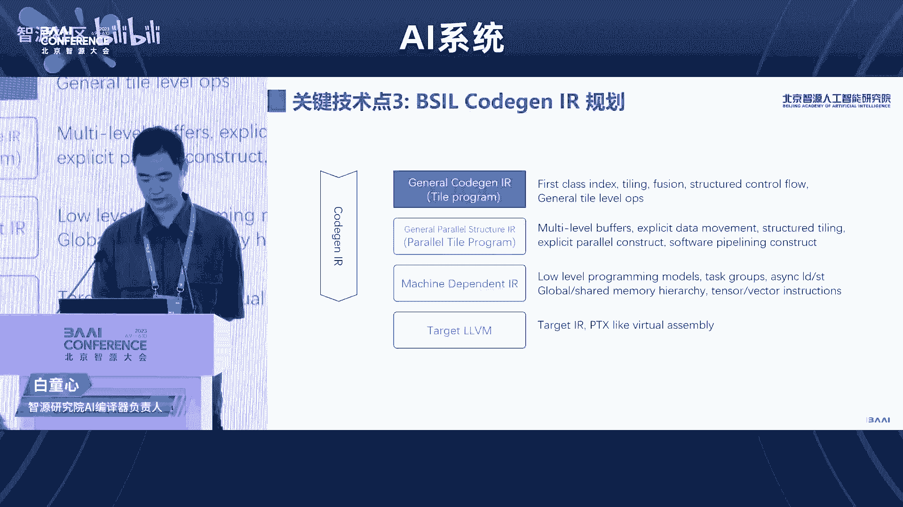

好，就这个现在是我们的working progress状态。因为我们现在没有还没有完全这个做完，所以没有这个performance的那个data给大家展示。

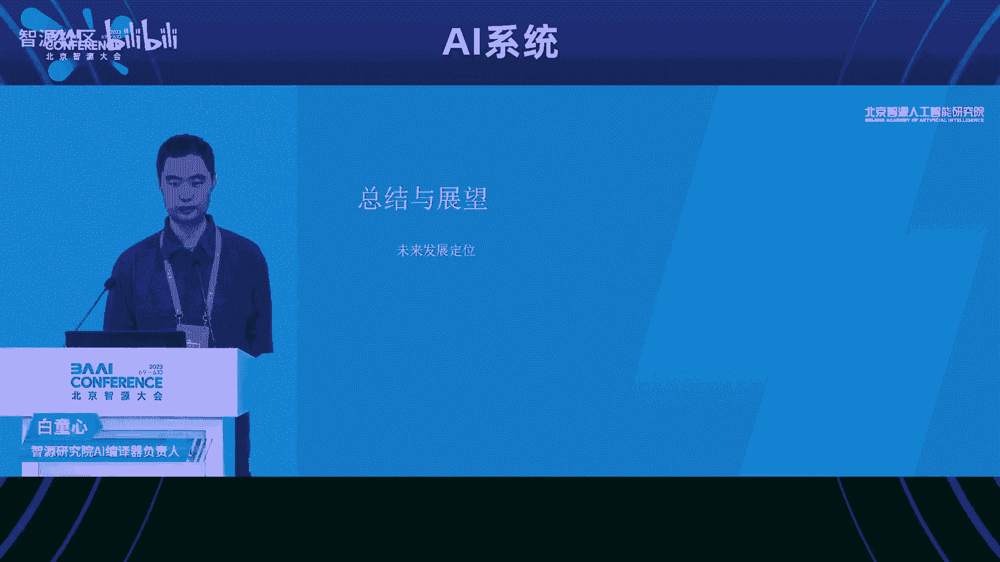

呃，我们未来发展定向呃，就是定位就是说我们希还是希望跟现在现有的这个这个开源的编译器有所区分。对，就是其实我们观察就是开源的编译器仍然存在大量的这个存存量问题。

我不觉得就是说我我们现在嗯就是说完全没有必要去开发一个新的这个编译器。我觉得完全是有这个容量的。就是说我们我们我们几个独立的编译器，然后去相互借鉴发展。这个完全是是可以的，没问题。对。呃。

然后就是就是当系统大到一定规模之后，就是完备度提高，就意味着易用性的这个可可靠性的下降。所以就是说呃我我们的目标也主要解决这易容性可靠性的这个问题。就易用性可靠性收益，可能不亚于这个性能的这个收益。对。

然后我们整体目标就是说仍然要保持轻量化，我们希望能够用10%的工作投入解决90%的问题就可以了。松耦合其实有有两点考虑。

第一个就是说我们不跟这个特定的这个这个呃理理论上我们不跟特定的这个框架来进行紧耦合。对呃，第二点就是说向下的话，我我们不希望能够烙聘到这个device这个设备商的这个生态里面去。

然后第三个就是我们要就是说这个Icomper就是跟传统compr不太一样，就是实际上这个自动优化的这个需求还是比较强的对，因为它里面涉及很多这个语编译的这个参数调优的这个问题。

我们希望能够结合这个自动调优技术来去改进这个这个性能。技术路线的话就是说我们仍然重点要放在这个杯的干高层的表示，重点表示简约可组合性。对，这样就为这种多多硬件的这个适配来提供这个条件。

然后第二点就跟实践相关的这个我觉得是我们一个我觉得是比较有意义的探索。就是我们要采用我们采用的是来开发这个编译基础设施。因为从长远看，我们觉得C加加的这作为这个structure的底层的语言。

它的codebase的可维护性安安安全性会带来很大的这个隐患。就是5年之后1年之后的话，我觉得C加加可能会逐渐退出舞台就是说它是基于这个兼兼容这个性能跟可靠加安全性的。我觉得目前来说是一个比较好的选择。

所以我们希望能够探索一下这个这个方向。现在有自己的那个 compile，比如说 lift的对吧？但是呢面向AI的这个就就是说我们说的这个acelerator compile现在没有先例。

我们希望能够在这儿做一些探索。呃呃生态合作这的话，就是说我们希望能跟厂商共同维护这个基础设施，还有后端代码生成。呃，同时也希望跟这个这个科研单位来合作探索这个编辑的前沿技术。

为什么。

う。好，谢谢白博。那个刚才白博呃介绍的这个呃智援在AI编译上的这个我们的那个我们的那个呃目标哈的确是挺ammb的那这对我们来说实际上是一个三年的rese项目也是一个教一个b bat。

那我们所以在从今年开始也会利用在智援大会的机会。每年都会给大家update一下我们的往前走的tage呃我们的状做到什么程度。或许我们到了明年也会有不同的方向上的，在编译器方向，我们该在这条路上该怎么走。

会大家更多的一些不同的思考。好呃呃我我我介绍呃呃下一位讲者是来自于呃昆仑新的呃罗航。😊。

诶， sorry。😔，是是。😔，哎等一下。😊，Whatject。Yeah， let me introduce our last speaker。 Mr。 Luo Luo。

 he's from the the the company called the Kunun chip chipet。

 And it's one of the major chip to do the AI acceleration。 And so less welcome。好，谢谢大家。嗯。

那我再用中文介绍一下我自己和这个昆仑新吧。那个我是来自昆仑新的研发总监罗航。那昆仑新呢是一家比较年轻的公司，在2021年拆分出来。但实际上呢，他已经有十年的一个历史。为什么呢？

是在原先是在百度的内部的一个部门叫智能芯片及架构部。那你看可以看到这个呃这个照片啊就是这个昆仑新二代芯片，我们现在主推的二代芯片的实拍图。所以这张图呢就是回顾了整个昆仑新的这个历史啊。

虽然说是才成立法法律意义上才成立两年的这个公司，但实际上这个技术和产品已经已经积累了10年。我们在2011年的时候就开始做这个FPG及FPG做这个AI加速器。啊，一直到2018年的时候，第一代芯片量产。

并且大规模推广。在2021年的时候，第二代芯片量产啊，现在主主推的就是第二代芯片。嗯。好，那进入正题就是呃这个第一part呢就是可能我会呃有一些这个带来一些一些这对计算产业发展的一个分享啊。

一个逻辑的分享。就是说呃大家可能近两年听这个AI芯片这个词就是听的比较多啊，有没有想过为什么近两年AI芯片啊，就突然火起来，为什么前两年没有啊，其实这个是带来我个人的一些思考。

就是我理解这AI芯片是新时代这个计算产业发展的一个必然趋势。这张图呢是从左到右是一个时间轴啊，那个重纵坐标是一个抽象的一个计算产业的一个系统架构啊。

那么从左到右我们可以看到从整个计算产业的发展趋势脉络来说，我们理解可以发可以大致划分为4个时代，最左边就是一个上古时代。这个上古时代面向的这个群体是科学家的群体。它的芯片。是定制化的处理器呃。

操作系统是unux。啊，这个这个上上面计算的任务呢，一般是。呃，这个实验室里面的一些科学计算对吧？然后到第二个时代，可能大家都比较熟知的，这个就是PC时代。

那我们PC时代可以看到芯片主流的芯片是叉86的芯片，操作系统是windows的操作系统。在这个时候，windows和叉86这两个强强联合形成了一个非常强大的wintail的生态。

在这个生态上诞生了非常多的。呃，丰很丰富的桌面的应用啊。比如说我们可能就是呃当时聊天工具QQ啊或者是浏览器啊，或者是一些单机路由器。这个时候这个时候的这个联网状态。

是一个呃呃还是规模比较小的一个有线局域网，对吧？嗯嗯，想想202000年2000年初的时候，网吧那个时候特别火嗯，就是对吧？就这个时候是PC时代的一个典型的一个现象，到第三个时代就是移动互联网时代。

现在我们人手一部手机，对吧？这个时代这个连接规模已经爆炸式的增长。它的典型的联网就是无线互联网。然后可以看到我们看也可以看到这个架构中间出了一。多了一条线，对吧？啊，可以看到这里多了一条线。

这条线代表什么？代表集团产业计团的架构代表出现了分化，为什么都会出现分化？是因为我们手持的这个终端设备，它必须要有一个低功耗的一个硬性的要求。而这个硬性要求是在上一个时代叉86基于叉86芯片做的这个。

这个价格我是没法满足的，所以它出现了结构的分化。而这个分化左边就是以ar为代表的低功耗的这个性处理器之上孕育出了安roid和IOSIOS这个生态。那右边还是呃中心侧啊，是就是或者是云端。

是叉86的芯片和linuxux构建的这个云端的生态。那这两这两套这个架构会呃也是在并行去发展。像比如说左边这个呃手持设手持设备上有各种各样繁荣的APP对吧？大家都可以体验到，实际上基本上生活呃。

这个这个呃线下和线下基本打通，都是通过APP去去去实现的。那在这个时代出现了一个很大的一个变化，就是因为我们手持终端的联网规模。报炸性增长之后，产生了大量的数据。这个数据有很大一批是非结构化的数据。

这种非企化数据它的一个重要的特征是。呃，向量化。这种向量化的数据，它是传统CPU处理过来，由此导致了什么呢？导致我们现在进入AI第四个时代，就是AI时代的时候，它分化更剧烈了。

就是CPU处理不过来的话呢，他一定需要有个特别擅长处理这非结构化数据的芯片啊，底层的这个架构运营而生。这就是为什么？右下角AI芯片在这个时代到来的的原因。

所以我们现在正在进入的是AI时代AI时代可以看到这个架构分化的越来越呃复杂啊。那基于AI芯片。之上，在相同城市，操作系统相同城市。诞生了呃，也不是说是因为AI芯片诞生了这两者深度学习框架。

AI芯片其实是其实并情发展的。它的他们之间的关系就很像呃这个CPU和操作系统的一个关系啊，对吧？所以为什么说深度学习框架就像是AI时代的这个操作系统。在这个之上呢。呃。

有很多大数据的应用以及各种各样的模型。现在讲了大模型对吧？大模型其实也是基于大数据炼炼单炼出来的一个模型嘛。那所以可以看到这个生态在AI时代的这个生态也分化出来越来越复杂。那这里我用两两句话来总结。

就是说呃呃呃借用这个对社会主要矛盾的一个表达啊，就是为什么会出现这样各种产业的一个。架构的一个迭代呢，主要就是人民群众日益增长的美好生活需求和计算系统的算力发展不平衡不充分之间的矛盾。这是。

计算产业架构迭代的第一驱动力。那每一次的这个。架构的变化或者是每一个时代的变化。就会有新的啊这个旧的生态会被的颠覆，新的生态就会涌现。那现在出现就会出现一个很巨大的一个机会。那这个巨大的机会。

重要一个表征是什么呢？可以看到。这张图是一个客观现实啊。这应该是一个研究报告上一张图，这张图表达的是什么？纵坐标是模型的参数规模。横坐标是时间轴啊，可以看到，其实是很明显的趋势就是模型的规模越来越大。

呈指数型的爆炸式增长。那前几年这个。bert在这儿300多兆的这个规模。bot当年推出的时候也是非常的精验啊，包打天下呃，霸榜很长时间，但是没几年。这个GPT3出来1751个参数。

那那大家也知道这个最近很火了，掐了GPT就是基于GPT3对吧？那这个规模指数型增长，那可以预见到未来规模模型的规模也会也会越来越大。这说明什么呢？其实就是说在AI时代。刚刚我说的这个旧的秩序被颠覆之后。

涌现出来的大量的新的机会就是大模型的机会。那大模型一定是对底层的大算力是有要求。那从我我看到一个研究，就是说模型的规模每增长1倍，模型的规模增长。跟算力需求的平方成正比。也就是说模型增长。

那算力增长更多啊，需求更多。所以可以看到这是一个很明显的趋势啊。那么从这个趋势来说，如果模型增长到一定规模，突破一个临近点的时之后会出现什么？这就是我们说的涌现。为什么大家呃。感受到这个叉GPT这么。

厉害。好像能理解人的这个自然语言，以及能够做很多这个思维的这个推理。为什么？嗯，现在学术界都把这个归结有归归结为涌县。那实际上涌县其实是一个很普遍的一个现象。在生物学中也有很多这个涌现的理论基础。

你比如说。最简单的就是我们的我们人脑为什么会产生意识？或许一直也是一个涌现的结果，对吧？这就这就如同我们。这有个GPT3为什么能够产生如此惊艳的效果？呃，我们不能理解这个为什么会产生如此经验效果。

就如同我们不能理解为什么我们的大脑会产生意识一样。我们可以把所有的归音都归一为涌现。那实际上这是有一个从生物学和AI研究来说是有是有一个一脉相承的一个理论基础的。可以看到右边这些图啊。

当模型增长到一定规模之后，哎，它的效果。有一个爆发式的增长，有个有个月迁。这就是涌线的一个效果。所以从这从从这从这些涌现的这个现象来说，也可以也可以呃在可预期的未来，也可以判断。

就是说模型越大可能它的效果会越好，对吧？所以所以这也这也就是一个大模型的一个趋势。未来模型可能会越来越大。随着跨模态多模态的一个模型的一个也呃一个1一个沉淀啊。

有更多更多的这个跨模态的知识沉淀压缩到一个模型中，这个模型规模是会越来越大。那于此运营而生的伴随着就是对AI算领的这个需求会越来越大。好。

这个第一part就是做了一些这个对计算产业的一个铺垫和趋势的一个一一些展望。那么。第二排我带来的这个分享就是那作为我们昆仑星，或者说在这个AI算利这个赛道的这些这些玩家来说，我们理解可能要经过产业化。

可能要必经三道窄门。第一道展呢就是量产。作为一个芯片公司，那量芯片的量产是。第一道咱们就是前提。就是说从芯片的设计构思一直到量产其实要经历很长的一个时间，周期差不多是两年的一个周期。

那如果没有跨越到这套展本的话，没法去覆盖前期的投入的巨大的一个成本。所以量产其实也是芯片企业。这个成熟和芯片稳定性，还有各种指标成熟度和和这个这个呃很重要的一个指标之一。第二个咱们就是生态。

其实本质上做芯片的公司是没法逃避生态和或者是没法逃避软件的。为什么呢？如果只做生态只做芯片，那上很多上层的应用，很多上层的客户，他根本业务根本用不起来。

那实际上每一个芯片公司都要去跨过第二道咱们去建设一个很完整的一个软件生态啊，这个软件生态可能包含很多技术站啊编辑器啊，甚至还有开发者社区啊，来帮助客户更好的用起这个芯片。

而事实上现在国国国内很多这个呃包括包括昆仑星自己啊，也都是在这个生态也在不断的完善中啊，好在昆仑新现在依托百度的这个这个整个AI的技术生态。百度在在AI的这个技术生态中也布局了十0年。

所以这块相对来讲还是相对比较完整一点。后面还有一个PPT会介绍的这一块。那第三个产呢就是产品化。那光做完生态，光光做了软件还远远不够，要把这个软件和硬件做成软硬一体的产品化的标品。这个产品换了标品。

有助于。这个芯片作为一个企业，能够形成这个业务的闭环和飞轮啊，做做项目实施和落地的时候，这个这个呃编辑成本才会更低。所以我理解这个这个做芯片的公司啊，可能不能仅仅只考虑硬件生态，还有产品化。

特别是软硬一体的产品化可能是很重要的一个。需要考虑的这个部分啊。好，第三趴就是那当然就是昆仑星在大模型这个行业有哪些实践？这个就是我刚才说的这个呃昆仑新结合百度的这个整个生呃整个AI的这个生态。

就是百度提出了。AI大理做这个概念。呃，包含4个四层框架，应该说是百度是国内首个全站自研，四层都自研的这个呃并且能够单独去交付的这个呃AI基础设施，就是四层架构啊。

是四层大底座最底层一层就是芯片这个在AI时代的。我们所说的算力都是AI算力啊，就芯片层科能心，中间就是非讲非讲就是深度学习框架啊，就是所谓的AI时代的操作系统。然后在这实上孵化运育出来这个文心大模型。

那文心大模型包含两类。一类是这个文心一言是NP的大语言模型。还有文心一个式这个大的这个呃文身图的这种这种CV的类的大模型啊。在这个大模型之上可以孵化出更多个的这样产业应用啊，基于大模型的产业应用。

那昆仑新在这样一个生态上，我们提出了大模型的解决方案是什么？就是底层。其实昆仑星主要关注的主要主要可以交付售卖的，主要还是底层的这个硬件和设施嘛。在这个硬件设施之上。

我们有各种各样形态的这个举证产品矩证啊，卡级的，还有服务器级的都有在这个之上，我们会提供昆仑星在支持大模型的呃这个昆仑新软件站，特别是叉FT这样我们会有一个大模型的加速库。

在这个之上会呃会有一些数据标注啊，所训练还有这个基于或者是其他的其他的开源的这个深度学习框架构建出来的这个框架级的生态以及之上的各种大模型大模型在上面在孵化很多应用啊，包括信对话沟通啊。

内容创作等等都可以都可以孵化出来。所以这个就是我刚才说的昆仑星主要推主要需要主要积累的这个核心的这个产品矩阵啊，可以分为这三个层次。那我们所说的大模型其实有多大到底有多大。

其实这个其实是一个是一个比较模糊的概念。我们这里划分了三个层次，从10亿到百亿的这个模型，可以在卡P标卡级上去做去做呃推理或者训练。那如果是百亿到千亿的这种规模，那我们建议就是在在这样一个呃呃服务器上。

这个服务器上面搭载了8颗芯片8颗芯片两两互联，它是OAM的这种模组，两两互联构建了是一个可以支持大不规模训练或者推理的这个服务器。如果在千亿级以上的这个这个呃模型啊。

比如说恰GBT这样1175亿个参数的这种恰GBT的话呢，就就就需要这种呃服务器组啊组呃这个组合成的这个集群。那经过我们实测呢呃推理的这个性能基本上相对于主流的呃这个150瓦这个产品啊。

GPU这种产品是有一定的加速的啊。啊，这我这里说的都是150瓦这个这个档次的。那这些技术指标我就不不一念了啊，大概就是说想说的是这种这种卡是P胎与标卡。现在主呃主推的这个P胎E标卡。

现在我们已经把所有主流的叉86的指令级的。呃，机型和arM指令机的机型全还有一些。呃，大规模的集群全做了适配啊，这这这是这是看才产品局中的这个表卡。还有类就是刚刚我们说我说的这个一体机一体机。

这个大概是6U的这个机器，这里面就是有有呃有一个窄板，上面有8颗8颗这个这个二代芯片。它通过这样一个top扑结构互联之后，可以达到比较好的一个并行训练啊一个效果。模型并形的效果。

那如果是多台机器组成的这个集群呢，我们同时可以提供。呃，集群纳管的一个框架啊，个高构建一个高可扩展的一个mas。那这里想说的就是昆仑新和百度的拍ddle拍le飞讲也做了很多很深度的这个技术优化。

比如说有这个啊呃数据并行，还有这个模型并行，还有分组切片等等流水线并行，还有这个参数的分级存储等等的各种技术的优化啊，这里这里我我就简单简单说一下这个参数分级存储什么概念。就是说。

那其实这个大模型很大参数和参数规模很大，可能可能卡上装不下。那装不下的话怎么办呢？就可能要分级存储，把热点数据装在卡上的这个有限的这个显存里，一些非热点呢可能装在装在host的内存里。

那更不热点的或者大模型的全量参数装在这个硬盘里，通过整体的一个协调，造成的呃使使这个这个整体的这个这个调度的这个成本的最低。同时我们跟智源这块也有非常非常深度的这个合作哈。

那比如说这个致源这里推出的这个大模型col大模型啊，我们也做了这个呃很好的一个适配，并且已经验证了大规模推推理的一个一个性能。😊，还有nex厂这个分分分布式的一个推理也支持了。

同时这里还有这个资源还推出了这个Eva系列的这个视觉大模型，我们也都做了全量的一个适配啊。这Eva系列呢它会我们在这个资源推出这个九鼎计算平台中也做了很完美的一个适配。所以在在这个9点9鼎这个平台中。

我们可以我们支持的这个呃这个依把这个系列模型这个视觉大模型的一个一个大模大规模的验证。同时资源不是在这里还有一个这个flag proof这样的一个测试框架啊，我们在这个测试框架中。

我们也支持了大部分的这个模型啊，保持10多个这个模型的评测生态。这个框架也提供了一个非常好的一个bechmark的一个测试标准。未来的话也会我们也会逐步的迭代这样一个模型。

会有这个把这个覆盖生生态覆盖做的越来越好。那这里举一些例子，就是在大模型应用可能会有哪些场景呢？就是这里说比如说。支持呃搜索和问答，这是非常这是很容易想到的非常典型的一个场景啊。像百度现在的这个搜索呃。

这个后台就很多都是昆仑星支持。昆仑星再加上百度的这个NOP大模型支持。同时还有一些场景，比如说能源行业，就电力行业的这个大大模型啊，他他们用在什么什么地方，就是说他们可能有很多规章制度非常非常庞大。

同时在这个设备的维护上非常非常繁琐。那通过大模型把这些知识都压缩到一个大模型之后呢，有助于提升到了这个效率。同时还有一些CV的场景的这个这个CVCV大模型啊，这里就呃就就就不不展开介绍了。

我们在这个智智慧工业的这个检测场景呢，我们也有使用这个CV大模型，能够很方便的让工厂的这个检测提升的这个效率啊，这个是这个智慧工业场景。我们的一个交构图。左边就是客户测的这个系统啊。

我们对它无侵入的改造啊，右边提供是整套这个大模型的可训练以及这个推理这个这个引擎。它只需要在应用层换一个调度引擎就就可以了。就所以对客户的侵入非常少。呃，再给我一点时间，好吧，有点点展望啊。

就是说这是带来我的个人那些思考啊，抱歉。😊，那实际上我们理解大模型对这个产业发生的这个范式发生了非常非常大的一个冲击，发生发生了非常大的变化啊。

呃原先是用各种各样小模型去解决各种各样分散的各种场景的问题。现在呢好了，大家有个大模型全部收敛了transform这样一个大模型的范之后呢。

可以通过大模型去去作为一个base做做为一个base line，然后去。😊，做呃少量数据的翻 two啊，去可以可以解决行业的一个垂类部署和问题。所以这个对产业的这个整个范式发生了变化。

所以我们理解未来可能大大模型这个产业会可能会分层最底层是有少数的大科技公司，以及有非常雄厚的资本的，一个非常雄厚的这个算力基础的这个公司去训练这样的一个一个非常庞大的一个大模型。

然后同时会有一些高科技公司处于中间层去在基于这样的这个大模型基础上去做行业的大行业模型的翻 two或者是落地啊，还有还有非常非常多的百花齐放的创业公司，基于很多大模型去做创业的这个应用。

这就是所谓的大模型原生的这个创业创业应用啊。所以这以未来可能可能很多创业公司要思考如何借用新来的大模型的技术去做一些创业。那OK还有最后一张图。

就是我们理解的这个最后的这个基于这个大模型这样一个趋势的发展啊，我们的这个产业终局会是什么样的？可以看到左边。左边我们可以理解是广义的1个IOT物联网，什么意思呢？

就是发挥捕捉现实世界中的所有信号的这个设备，我们都可以认为是物联网设备。比如说手机或者摄像头，对吧？好，右边是是承载这个AI芯片和AI大模型构建的是一个数字生命体的大脑。这里提出一个数字生命体的概念。

就是当未来大模型，还有大算力，再加上一个场景，还有若干的庞大的呃IUT设备组成了一个东西是什么？就很像很像越来越逼近人的智能。那也可以看可以看到人的大脑。

对吧人家大佬整个人封装的大脑封装的经验就是就是大模型啊，然后人的四肢就是这个这个感受世界万物的这个这个IOT。所以经过这个不断的迭代，这就是一个数字生命体。

这个数字生命体就可以应用在应用在企业或者企用用在国家啊。所以我们理解这个数字生命体，或许是或许是未来产业的一个终局的形态。好，谢谢大家。

呃，不好意思哈，前面那个没有特别控制这个时间哈，我们整个会已经delay了20多分钟啊，否则呃那个所以后面的session啊，每一个都请严格的遵守自己的时间，否则大家我担心我在刚才还在问说。

我们的午饭到几点，我担心大家没那个没机会吃午饭哈。这么多的呃听众今天加入。好，那呃我下面请出下一位呃讲者是来自于中科院计算所的郭琦郭博士。好，谢谢。😊。

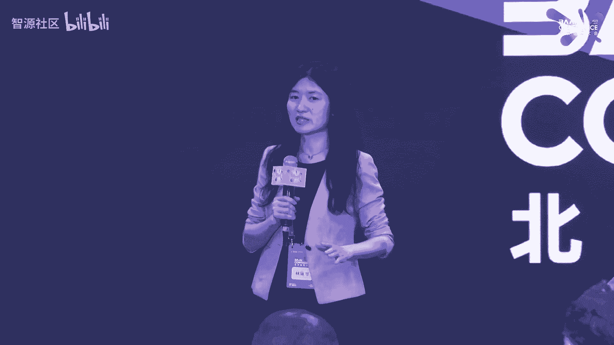

好，那个呃非常感谢林总的介绍和那个邀请啊呃，非常荣幸今天能来参加那个北京资源大会。然后呃我是来自中天计算所的郭奇。今天报告的题目是面向大模型的算子自动调优技术。呃。

也是我们在算子的自动调优和代码三层方面做了一些探索。今天也是在这边跟大家一块分享一下。呃，这是今天报告的一个主要的内容呃，首先是简单的一个背景的一个介绍。呃，然后呃深度学习算法模型的规模。

大家都知道也是在快速的这样的一个增长。然后为了支支撑这样的一个大模型的这样高效的运运行，其实目前也涌现出了大量的领域专用的这样的一些呃架构。但是如何充分发挥这些领域专用架构这样的一个运算的一个潜力呢？

其实也是当前AI系统面临的关键的挑战之一。呃，这是1个AI系统这样的一个大致的一个情况。然后高性能算子库实际上是连接算法模型和底层硬件算力的一个非常重要的非常重要的桥梁。呃。

因为它直接决定了上层算法的是否能够高效的运行。然后底层的那个硬件它的算力，因为算力也在不断的增长，它的算力能否充分的发挥出来。呃，也正是因为高性能算子库，它有非常重要的这样的一个作用。

所以实际上其实各大厂商也都推出了自己的这样的高性能算子库。像英特尔的MKLDN还有英伟达的酷Nus等等，这个大家应该都非常熟悉了。呃，但是现在的高清算子库它的实现呢。

实际上主要还是依赖于专家的手工的手工的优化。那一方面呢是要求呃开发人员他对上升算法有深刻的了解。然后另外一方面呢，实际上他对底层的硬件架构，包括编程模型，他也有深刻的理解。

他这也可能写出这样的一个高性能的代码。所以这也导致高清算子库，它的开发周期啊和开发难度都非常大。所以难以满足目前深度学习应用快速部署的这样一个实际的需求。呃呃，这是因为高性能算子库它本身非常重要。

同时开发的代价又非常大。我们认为算子的自动调优和自动的这样一个代码生成呃，是能够有效的提升整个高性算子库的开发效率和运行效率的。

然后这边给的这张图的话是那个基于TVM的这样的一个典型的算子调优的一个整体的一个框架。呃后其中呃最核心的是要有这样的一个探索的一个模块。呃，它本质上是以这样的算子的一个表达式作为作为输入。

然后在给定的一个调度的空间当中去做呃去做探索。那么为了提升这样的一个探索的一个效率的话，一般都会构建起一个呃性能预测的这样的一个代价模型。通过这个代价模型的话，它能够提升整个搜索的一个效率。呃。

那么在找到了一个最优的这样的一个调度优化的策略之后的话，呃，会通过代码的这样的一个代码生成器，然后生成最终的代码，核心的目的呢还是希望能够自动生成，达到或者超过呃手工优化代码的一个性能。😊，呃。

那么因为模型的规模也在不断增长，在这样的一个大模型时代，实际上算子的自动调优技术的话，也面临了一些呃新的一些一些挑战。首先第一个其实前面很多嘉宾也都提到了，就是硬件的异构程度，它会变得越来越高。

实际上现在很多的算子的自动调优技术的话，其实呃主要还是在包括在CPU啊还有GPU上开展的会比较多多一些。那么在一些领域专用架构上面，实际上算子自动调优它还有很大的一个提升的提升的空间。

那么第二个的话就是因为算子的规模也变得非常的大，所以调优开销实际上也是编译的这样一个开销也会也会变得很大。那么怎么对这样一个呃自动调优的一个过程，包括也是在编译的过程做一个加速，呃，也是关注的一个点。

那么第三个的话就是呃很多大模型，它都有一些稀疏动态的结构。这实际上对于构建一个高效，并且准确的一个代价模型也提出了一些新的挑战。呃，那么呃那么我们的话在前两个方面目前也做了一些工作。

那么们后面的话就简要的呃。😊，分享一下我们在这方面做的一些初步的探索。那么第一个是面向专用架构的一个算子算子自动调优的技术。呃呃呃就基于整个这样的一个呃搜索的一个框架。

那么整个搜索空间实际上决定了我们最终能够找到的这样的一个调度策略。它的性能就是最终能够找到的代码的性能，到底它的一个上限到底是什么样的。那么我们认为对于领域专用的硬件来说。

我们不仅仅是追求更大的一个搜索空间。更重要的是追求一个更高质量的一个搜索空间。呃，这主要还是因为呃专用架构，它实际上跟通用架构相比，它还是有很多在体系结构层面的一些约束的。比如说像在上面，它做举证乘法。

它都是在一些固定的规模上面去做。然后像里面的片上的存储需要memory可能有一些固定的一个约束。那么这是因为这些约束的存在，就导致我们去刻画一个专用硬件。

它的一个程序的一个搜索空间就很难去做一个准确的描述，就会导致我们刻画的一个搜索空间，它质量会很差。里面很多的程序都可能是非法或者是无效的一个比例。呃无效的一些程序。呃，就比如说在那个微G器上，那么。

那我们呃前期做了一些实验，那么autoTVM的搜索空间，它非法程序的比例可能会达到呃95%。那么正是因为这搜索空间质量很差。那么一些传统的搜索算法在这个里面去做搜索的话，它效率就会很低。

就大部分找到都是呃无效的解或者是一些低效的一些解。😊，呃，那么呃这核心的原因前面也提到了，主要还是因为专用架构和通用架构相比，它存在大量呃复杂多样的一些约束。呃，那么正是因为这些体系结构。

包括在编程编程模型层面的一些约束的存在。呃，就导致我们去刻刻画它一个程序优化空间，就需要一些额外的一些约束变量。呃，也也会有更多的一些约束的一些数目。呃，比如说我们去刻画一个举证乘法的一个算子。

要准确的描述它一个程序优化的一个空间的话，可能需要173个变量。那么对应的约束的数目也会300多个。那么随着算子的规模，包括算子的复杂程度的增加。

那么呃需要刻画的这样的一个约束变量和约束数目也会逐步的增多。呃，那么另外一个层面的话，就是如果我们没有办法对这个程序空间做一个准确的描述的话，呃，就会导致现有的一些优化的算法呀。

就很容易陷入到局部最优呃，就比如说在一个这样不规则的优化空间当中去做搜索的话，传统的像一些模拟退火的方法呃，包括。我像一些呃遗算算法，这个用的比较多的呃，它的一个表现的效果啊，可能跟随机的算法呃相比。

并没有太多的一些优势。呃，所以在当前的专用架构上面，算的条约，我们认为存在两个大的问题。第一个就是说在搜索空间当中有效解的比例呃非常低。第二个就是说呃对搜索空间进行探索优化的一个算法效率也也太低了。呃。

所以针对这两个问题，我们希望能够同时解决搜索空间的一个精确描述和呃高效探索的问题。呃，那么针对第一个问题，前面也提到，因为它的那个约束呃非常多，那么要准确的描述的话，就是人工去手写手写300多个约束。

甚至写3800多个约束，基本上是不可能的。所以我们也是希望呃我们就通过一些预定的规则，呃，对程序做分析，然后自动的生成这样一个精确呃带精确约束的一个搜索空间。那么有了这样一个精确的一个搜索空间之后的话。

在这样一个因为因为这个空间呃可能会非常的不规则。在这样一个不规则的空间里面，我们就继续提出一个保持约束的一个演化算法来对这个空间做一个高效的探索。😊，呃。

那么这个的话就是呃我们怎么去对这个搜索空间做一个继续的描述，就是提出了一个基于规则的约束空间的自动生成的方法。然后这个框图的话是我们整个的一个呃大概的一个流程。呃，那么对于一个给定的算子来说，呃。

主要是给出它的一个计算的一个描述。后我们能够得到它的一个运算的一个带个图。那么在这个带个图的一个基础之上，呃，通过预定的呃，我们有两两类预定的规则，一类的话是那个呃针对调度策略的一个预定的规则。

还有一类是针对呃调度约束的预定规则。呃，那么首先通过调度策略的规则，我们是自动的生成它调度的模板。那么在这个调度模板的基础之上，我们通过调度约束的规则，自动的生成它的约束，就是最右边那一栏。

就最右边那一栏所显示的。呃，这约束还是还是比较复杂的。呃，那么整个这个过程都是全自动的生成的，最终能够构建起一个带精确约束的程序搜索空间。呃，那么第二个的话就在有了这样一个搜索空间之后的话。

就是对这个搜索空间进行一个高效要的一个探索。那么这边的话我们是提出一个保持约束的演化的这样一个方法。因为传统的演化计算的方法，它呃本质上是呃无约束的。呃，所以如果用传统的GA的方法的话。

它就很容易在搜索的过程当中就跳出我们之前所定义好的一个这样的带约束的一个空间。呃，所以我们提出的这个方法能够保证在整个搜索的过程当中，约束始终可以被满足，从而找到最优的解。呃。

那么这个是我们整体的一个实验的一个效果。然后也是在那个呃在在在呃多个英伟达的平台呃，包括V100啊，T40和A100上有比较好的一个效果。同时在其他的一些呃那个呃DNA上。

包括DL boost和VTA上也取得比较好的效果。呃，然后这个工作的话，我们是发表在今年的Spro上。呃，然后第二个的话是呃大模型算子的一个自动条约的一个加速。呃，那么呃对于大模型而言。

一个前面也提到啊，搜索优化的时间可能是一个潜在的一个瓶颈。呃，最主要的原因还是因为它在整个搜索的一个过程当中是需要生成大量的候选程序。然后这些候选程序呢都需要在真实的硬件上面去执行。

那么这个执行的一一方面是因为它的数目很多。另外一方面它执行的开销很大。呃，所以它的整个的呃搜索的过程也会也会比较长。那么大模型的规模的话，呃，规模不断的变大，就导致它的搜索空间也更加的大。

所以一般会评估更多的程序。呃，比如说像在那个auM和 answerer上面可能都需要评估4000个程序，才能保证搜索得到比较好的一个呃搜索到得到一个比较好的一个性能的程序。呃。

那么为了解决搜索优化时间过长的问题，然后也有一些研究工作是呃基于预训练模型的这样的一个编译的呃编译的代价模型。那么核心的思路呢就是说提前通过预训练的方法，呃预训练的方式提前构建出一些代价模型。

这样的话在整个编译搜索的过程当中，呃，就直接可以利用这个代价模型来对它的性能呃去做预测，就代替大多数的硬件测量。呃，同时呃对于少部分测量的结果，我们还可以对这个代价模型做翻 tune呃。

使得这个模型更加准确。然后这里面的一个代表性的工作，就是呃呃就是tenet呃tenet它和不使用预训练模型的这样一个呃这样的一个搜索优化的方式相比，它在优化的时间上面减少了10倍。呃。

但是预训练模型方方法的这样的一个核心的问题呢，就是说它构建呃整个模型的过程当中，它的开销会非常的大。呃，比如说像tensor的，我如果要针对整个神经网络去构建其它的一个代价模型的话。

它首先要在整个网络当中去选择呃计算的一个纸图。然后对每一个计算纸图呃，去采样等价的程序来去做一个性能的一个测量。呃，这里面核心的开销，就是说在硬件上面呃做性能测量的时间，呃，大大概需要4000小时。呃。

因为包括里面的纸图的数目啊，还有每一个纸图里面需要测量的程序数目都非常多。😊，呃，那么我们呃做的一个初步的探索，就是重点关注怎么去降低这里面的每一个纸图需要测量的一个程序的数目。呃。

我们也观察到在构建预训练模型的过程当中，实际上采样到的程序的性能，它的分布是非常嗯不均衡的。因为本身里面一些高性能程序，它的比例就非常的低。呃，那么过多的我们去采样一些低性能的程序的话。

就会导致呃会有非常大的一个冗余。所以我们要均衡程序的一个性能的分布来降低呃采样就训练集当中的一些冗冗余。😊，呃，然后这里的话我们也是呃呃针对如何减少域训练模型的一个构建开销。

提出了一个基于基于主动学习的这样的一个呃预训练的方法。呃，核心是呃提出了基于多样性选择策略的主动学习方法来高效的构建域训练的代价模型。那么基本的一个过程就是左边那个框图，大概大概有有四步。

首先第一个是做那个程序的一个呃采样。呃，这里面的话会呃随机的先采样呃，并且测量一些性能，产生一些有标签的数据集。然后基于这些有标签的数据集去做模型的训练。呃，第三个过程是关程是最关键的。

就是选择具体选择哪些程序做一个测量。这边是采用了一个多样性的一个选择策略，呃，选择有代表性的一个程序做测量。呃后再把这个测量的程序加到标签的有标签数据集当中做模型的一个更新。呃。

那么我们也是使用ten试的5%的这样一个训练数据集，就获得了更好的一个预示的精度和优化的效果。那么预训练的开销也是降低了20倍。呃，那么这个工作的话，我们也是发表在今年的ICLR上。呃。

最后做一个简单的一个总结。呃，然后呃我们认为算子调优技术是提升高性能算子库开发和运营效率的非常有效的手段。呃，那么也是随着深圳学习大模型与领域专用硬件硬件的一个快速的发展。呃。

算子调优技术也面临一些新的挑战。呃，包括硬件的硬度呃异构程度变得越来越高。所以可能怎么去提升在专用架构上面的一些算子调优的技术，可能是值得关注的一个点。

然后另外一个就是说怎么去进一步减少算子调优的一个开销。啊，以上就是我报告的内容，谢谢大家。😊。

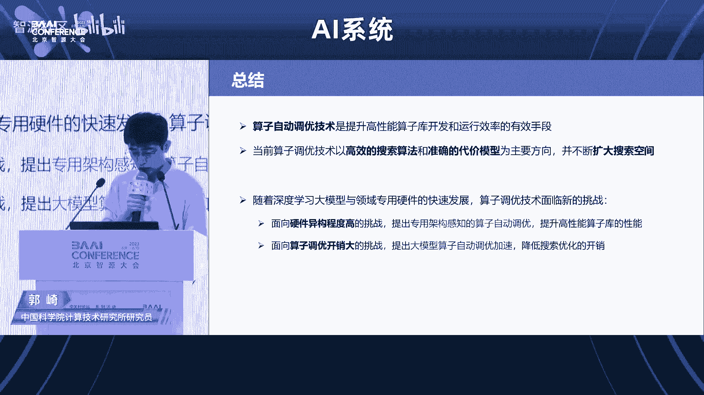

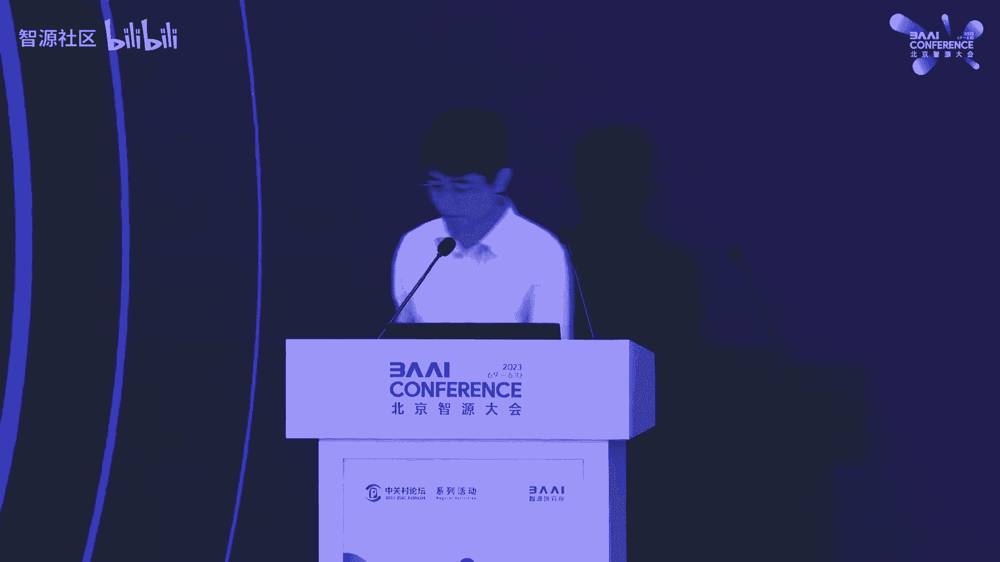

Yeah。好，谢谢谢谢谢谢郭琦博士。那个郭博士给我们s了111分1。😊，1分钟30秒呃，很快啊，两个很好的很好的工作。那个呃我觉得可能这个今天时间太短了哈。

下一次我们可能会利用我们那个智援自己本身的一些社区活动，可以有充足的时间，样样过不是再给我们更详细的去介绍这两个呃很不错的工作。那下一个那个呃是呃带来的是呃来自我们智源研究院啊。

负责整个我们呃AI平台研发的呃田验啊，田艳给我们呃介绍支援。我们是怎怎么样用搭建我们的整个九鼎平台来支撑大模型训练以及芯片的架构的多样性。好，谢谢。😊，Okay。嗯，大家好。

我是智源研究院AI系统组的田燕。很荣幸有这样一个机会能给大家汇报一下我们团队的工作，也请大家多多指点。

嗯，感一下啊。诶。OK我今天汇报的内容呢主要分为三个部分。第一部分呢是背景大模型到底需要什么样的基础设施。这块前面的各位老师已经讲过不少了，我会快一些。第二部分呢是关于我们九鼎平台的一个介绍。

九鼎平台呢是我们智源内部的这个人工智能各种科研工作的1个AI基础平台，它承载了很多类型的模型任务。由于内容比较多呢，这里时间又有限，所以我们只选取了三个大模型比较相关的部分来讲。

最后呢是对未来的一些思考算是抛个砖吧。那么首先是背景大家在前面讲的也比较多了。那我们从历史上看，这个大模型的三波浪潮，其实每一波的发展呢都是一个数据算法和算力的共同发展。

数据和算力能力呢有效的支撑了模型算法能力的不断的提升。但同时呢它也indiate了，在当时那个水平线下，我们的基础设施。智能达到的这个能力呢是模型算法能力的一个天花板。嗯，这块呢算法角度讲。

大模型会越来越大越来越大。这个用的数据呢也会越来越多去train这些模型的数据集的size在持续的增长。那么所需要的算力呢，也是有着非常大的需求。那么在这样的背景下呢，我们基础设施首先要解决的。

就是怎么去支撑上层的模型的workload，去不断的去推高模型算法能力，触到的那个天花板。那么从另外一个角度去看呢。我们呃我们大模型需要什么样的基础设施。还有一个问题要考虑的是说。

大模型的一个开发范式是什么样的传统的模型开发范式，大家可能都是比较都是比较熟悉的。但大模型呢目前大家公认的是两个阶段。我的基础模型的训练，用海量的通用数据来做基础模型发布之后呢。

下游的行业希望用少量的这个行业数据进行模型微调试配合推理的一个部署。这样呢我们希望能以极低的成本去降低AI大规模产业化的一个门槛。在这样的背景下，要想做一个新的AI平台去sport这块的话。

显然是要支持这个大模型的范式的。所以说总结起来呢，我们的AI基础设施干的呢是两大部分的工作。第一部分是怎么去sport上层的这个workload去极致的优化我们的算力能力去推高整个的模型算法这一块能touch到的天花板。

然后第二部分呢是说我们怎么去支持我们的。模型研发流程去提高模型的生产效率。那么首先我先讲一下这个MLops的部分，这个所谓的各种的ops呢，它其实上做的是。工作质量和效率的一个提升和保障。它的本质是说。

我第一要解决工作流程的抽象和这个持续的优化。第二点呢要解决我广义的数据资产的管理。比如说我的代码模型、数据集版本和血员的管理。第三点呢是一些资源的生命周期管理。比如说我底层的算力资源任务的分配和调度。

那么落到这个大模型这一块的话，大模型有这么几个挑战。一个是说它的新范式呢对平台的这个需求是在持续演进变化的。这点鹏友也提到了，我们要用发展的眼光去看问题，落到大模型这样一个新兴领域来说也是非常必要的。

那么在这个过程中呢，由于大模型它本身的训练成本很高。然后后面的微调模型的性能非常依赖于基础模型能力。所以在这个过程中呢，我们对模型本身的管理评测优化，发布这一块的能力要求会比普通平台要更高。

那么大模型第二点特点。是说我的训练时间非常非常的长，成本很高，中间任何一个环节出错，对整个的这个发布都是有影响的。所以这一块的话，我们所以这一块我们要注意每一个环节训练的效率和稳定性。

第三点呢是咱们在现在这个阶段去做平台的话，平台一定会面临着普通模型和大模型混跑的这个情况。这对平台本身的这个灵活度要求也会非常的高。所以这里解决方法呢，我算抛个砖吧。一个是在设计上面。

我们要把这个基础能力进行模块化，这样能保证我们的产品能有灵活的迭代性，高内聚低耦和，这个是非常必要的。第二点是。大家做这个平台的时候，一定是根据自身的业务场景需求。

以核模型为做做核心资产来去设计自己的这个全流程的。当然这个过程中要很注意模型评测这方面能力的建设。最后一点呢是由于大模型整个任务流程的复杂性。

我们要非常重视模型任务生产环境和数据集之间血缘关系的保存和维护。这个在传统的一些计算平台上面是相对比较弱的。这样我们可以做到整个链条的这个追溯和对比。🤧sorry呃，放到九鼎平台上呢。

我们九鼎平台的科研任务更多。所以日常情况下呢。会对呃模型训练本身的任务管理和。呃，训练效率的优化这方面要求比较高。但是在推理服务部署方面呢，诉求会少一些。

我们整个呢是以一个建设平台生态的思路来做这个事情的。数据方面呢有数据平台去完成数据的清洗标注和压缩。模型评测方面呢有这个。刚发布的flag来完成模型的多维度评测，我们也有model hub来发布模型。

在九鼎平台内部这一块的话，我们的大模型的m op现在是以两条线路来组织的首先是这个基础模型的开发训练和评测发布的阶段。这个过程中呢，我们可能会在一个大模型持续训练的过程中。

这个拉 checkpoint出来去做评测，也有可能会re到上一个版本去反复的去迭代。直到我们有一个满意的结果出来。那么下面呢会基于这个基础模型的发布呃基础模型呢去做一些训练微调。

同样也离不开 checkpoint保存和评测的这一个过程。那么以上呢就是我们在M op方面的一些对大模型的探索。第二部分呢是这个训练效率优化，这是个非常大的top。它会涉及到我们的底层的算子优化。

整个的资源调度任务管理和I框架的配合，涉及到一些。并行训练的优化方案这块呃涉及非常广。但是我这里呢只抽了我们平台做手动的性能分析和一些自动并行优化方面的工作来。给大家汇报。首先呢这个训练的优化呢。

它是个持续迭代的这样一个lo的过程，不可能是一一把搞完的。所以我们平台在这方面呢。嗯，是做了一定的这个支持的平台这块我们要想跑一个任务的话，首先要创建一个实验。

这个实验里面呢会管理一组相关的任务配置以及这些任务的运行记录。所以在创建这中间的某些任务的时候呢，我们就可以去那个红框框出来地方，我们可以 enable我们的这个新性能分析的采样。

我们支持的这个标准的接口，也支持一些自定义的数据采样分析。比如说我可以看到一个sstep里头各阶段的耗时是多少资源占用是多少。通过这些分析优化完成之后呢，我们会在平台启动新的这个训练任务。

能跟历史任务去做回溯和比对，也能看到这个任务的资源使用情况。那么这一块呢基本上都是大家要抓数据去做手动分析的部分。然而并行训练这一块的优化呢，其实上嗯复杂度非常非常嗯 sorryor复杂度非常。

这里我受一个简单的例子先给大家来看，这是我们那个一个语言模型的case baselineline呢是一个TP加zero two的大家可以从这个截图上看到，我在那个optimizer的阶段去做的时候。

其实耗时是非常长的通信也很密集。第二个呢是结当时结合那个代码我们也发现了一部分的冗余计算这个优化呢比较简单，我们增加了的 bucket size提高了一个数量级，然后呢优化代码去除了冗余计算。

这块是达到了一个1。17倍的性能提升。后面呢我们也其实探索了一些其他方案。这个图呢是在able了那个zero3的时候的情况。大家可以可以看到这两段的内容。😊，嗯反向计算。

后这个red sorryor投影可能有点糊。然后呢，接下来下一层的这个organge呃 backward和这个red这个红色的部分是完全可以放在提前来做的实现一个计算和通信的 overlap。

所以这块呢我们那个修改优化之后呢，是大家可以看到能做到一部分的这个over大约提升了10%的这个性能。嗯，这个呢是手动优化的一个案例。其实这一块的并行优化工作是一个特别复杂的事情，一旦节点规模上去了。

我的并行策略，怎么去拆。这是个很麻烦的问题。所以我们也和北大的崔斌老师和图团队这边合作在平台上集成了一个自动并行优化方案叫。然后他呢能够对我们的硬件环境和模型进行采样的评估。

然后进行自动的搜索生成并行策略。嗯拿这个策略来去做训练。那么这块的呢右边放了一个呃呃2G16卡的一个bot的实验效果。可以看到最右边的这个gar的这个性能还是比较有优势的。

那么以上呢就是我们这个在大模型训练方面优化的一小部分工作。最后呢我们这个平台其实支持了很多类型的异购芯片。嗯，在这个芯片上呢，我们也有一些这个工作来给大家report。像我们昨天发布的的 code模型。

其实上是在天数至新的集群上训练呢，我们跑了36级的扩展加速，能够连续稳定运行，并且在中间呢enableable了像flash attention这类的优化技术。

我们也同样做了性能的采样分析和一些优化工作。嗯么在昆仑新上面呢，我们跑了qui发昨天发布的语言模型的一些推理任务。像视觉模型这一块呢，我们在做性能的调优。

然后硬件拓普相关的优化部分已经进入了联调和测试的这个阶段很快应该能上线。那在这个寒武纪上面呢，我们其实也跑了视觉模型的预训练任务和一些检测分割模型的。微调。那么包括这个华为的升腾和寒武纪。

还有昆仑新呢一起支持了昨天发布的大模型评测的平台flag e这是我们在国产芯片上的一些应用。在这个过程中呢，我们其实是发现我们的国产芯片整个软硬件的能力是越来越好的。在这个过程中也积累了一些相关的经验。

所以我们也推出了一款这个开源开放开箱即用的一个一个呃芯片的评测软件flag proof这个是和天数百度昆仑新还有华为刚加进来m和升腾两个团队一起来共建的。它支持呃不同。

它支持标准的chmark这样硬件本身的适配成本会很低。然后我们也支持多框架多种类型的任务模型，并且目前为止呢有天数之星和昆仑新等这个硬件有很多个模型case的覆盖。我们在不断的增强这一块对于用户来说呢。

我们也提供非常好用的命令航工具。去支持像道口环境的管理。然后这个测试任务整个全生命周期的一些管理。actly这个项目呢是我们整个flag open飞智大模型这个技术开源体系中的一个就是一个小的项目吧。

这个大模型的技术开源体系呢，也是我们致援和。国内外很多家企业、高校以及科研机构一起共建的大模型的这个技术体系，包括了我们的模型算法的代码一系列的这个数据工具和模型评测工具。

所以非常欢迎大家这个现在拿起手机扫码加入我们的这个技术交流群能够获得很多这个开开发者的支持。这个呃而且我们的这个开源开源的这个license是非常宽松的。

所以呃希望将来能有全球的这个开发者和我们一起去共同探索，共同共同创新，也能有企业来一起base在这个上面去构建它自己的AI软件和商业软件。嗯。嗯，以上呢就是九鼎平台的一些工作。那最后呢关于未来的思考。

我简单抛个砖吧，也希望大家能指点，就是开头说了这个嗯基础设施的能力和上层业务发展的这个能力永远是一个相辅相成的关系。所以做底层最先要看的呢？是说我们上层有什么样新的训练方法，新的模型结构。

新的应用场景出来，它对底层到底有什么样的这个挑战和问题。比如说世界模型要拿出来搞的话，肯定不是现在的这个这个玩法。那么站在底层的角度看呢。

其实上我们认为这四个象限的单机的分布式的操作系统框架层面的这些东西呢，都是值得关注的。他们之间的协同的关系是什么样子。在哪个点可能取得突破会去颠覆整个现在infrra的这个结构是需要持续关注的。

最后需要关注的还有一点，其实上人工智能的能力呢，影响到了各个领域，也包括infrra本身。AFAI system这一块的一些呃在工业界的应用进展其实上还没有那么多。但是在未来的话。

我们也是非常看好这一块的嗯。嗯，以上就是我今天的这个内容。好，谢谢大家。也谢谢。那个嗯呃因为因为今天那个的确我们安排了太多好的这些top哈，所以呃导致我们的时间也很紧，相当紧。

给每个speaker的时间也很紧。那所以呢这就是那个呃可能等会我们会有稍微有一个上的调整，就是说呃本来我们最后还有一个小的。那呃当时准备了一个问题给我们每一位参与panel的这个企业的代表。

那我们在这里头呢就是说呃我们最后会把那个can就先取消，取而代之的是说呃后面每个企业上来的时候，他们可以呃利用他的speech的时间，把这个呃希望想说的，就嵌到他的spech里头这样可能大家共从容一些。

呃，好，那呃我我请出下一位啊下一位是来自于必认的丁总呃他给我们带来这个基于高性能通用GPU怎么打造国产大模型的训练系统，谢谢。😊，呃李老师嗯。好。

那个今天非常荣幸有机会在AI系统专题论坛和大家呃讨论交流。呃，我是来自避刃的丁云帆。避刃科技是那个国产的这个通用GPU的公司。呃。

那我之前在百度一直在从事这个AI系统和这个广告推荐领域的大模型相关的一些工作哈。😊，嗯。好嘞，那今天那个我们交流分享内容主要分这个三部分呃。

第一个是我们看看这个GPT这种大模型训练那个到底呃存在哪些挑战。那第二个是基于逼认的这个国产的GPU，我们怎么去解决这些问题，构建这个大模型的这个呃训练系统啊。

最后我们看一下目前这个我们大模型的产业生态的一些合作的一些进展。😊，呃，P我觉得引爆了这个新的一轮科技革命哈。那从我们这个致源的这个近期今天的这些会议，我们看到很多这个主题都是跟大模型相关的。呃。

所以整个行业现在也也处在一种百模针验的这种状态哈。我们看到国内外实际上有很多这种基础的这种大模型。那也有很多相关的一种释范的应用，对那GPT呢就是为什么能成功这么火爆对吧？

我觉得总结起来是工程和算法这样的一个协同的一个创新。呃，这里面就说有三大因素啊啊，从这个数据呃算法算力三个维度。呃，数据其实是这个燃料也是这个基础哈，我觉得也是现在很多呃大模型公司面临的第一道的难关。

对吧？这个数据从高质量的数据从哪来呃，那第二个是这个算法，实际就是行业之前也有一些这个这个讨论哈，就是说GPT一下火爆了，都它有什么创新吗？对那其实大家说。😊，呃，从算法的角度呃。

好像很多也是公开的算法，对吧？可能有的也是别的公司做的，那他为什么能成功了？我觉得除了一些公开的东西之外，还有很多呃其实就是炼单数，对吧？那这些细节其实是这个成功掌握在细节中。

那这里面有很多包括这个像比如说蝙F16呢，它其实就是跟芯片的这种特性呃非常紧密相关的。😊，嗯，那第三个是算力，我觉得大模型呃需要这个基本上需要数千张GPU卡。

这个也是这个大公司和这个呃有钱人的这个游戏哈。对，那所以这里面当然另外一个就是说大模型本身的这个就是特点就是超大功模参数需要存出。那也需要这种专用的训练框架啊，去提升这个性能和可扩展性。

所以它也不是简单的这个堆积这个算力呢，就能够啊去解决这个这个算力的问题。那必刃科技，我们作为一家这个GPU的厂商，我我们会聚焦在算力这个维度啊，去促进这个大模型产业生态的一个发展。😊，呃。

我们这个论坛就叫系统论坛对吧？所以其实整个AI尤其是大模型里域，我觉得它正是一个系统的一个工程，也是一个软硬件协同的这样一个工程。那从这个图上我们也看到话。

我们这个硬件的这个架构和我们软件的这个训练的流程，它其实是非常紧密相关的硬件上的这个存储，包括CPU内存这个GPU的算力，包括这个互联啊，跟我们软件上你看每一个流程其实都有一个非常紧密的对等关系啊。

所以那核心的就是在于这个前线和反向计算里面对算力的需求啊，另外一个在这种大规模分布式的场景的话，对这个这个参数协同梯度更新的这种要求对单机内部的互联和多机的互联呢都提了很高的一个挑战。

那另外一个我们说这个大模型训练也是一个算法和工程协同为什么这么说呢？因为在这个系统里面比如我们举一个例子，以 size为例，提升 size上是有利于提升这个计算的效率发挥新。😊。

的性能的同时它能够降低大部分训练场景这种通信和计算的这样一个比例。对扩展性是有帮助的。但是它也受到了我们这个比如说呃GPU这个显存的一个约束。那也可能会受到在算法层面对这个g收敛上的一些约束。

所以它也是一个算工程的一个协同啊，那么我觉得总结起来，在呃整个在计算机体结构的角度去看这个事情呢，从计算啊通信啊，包括存储这三个维度都有很高的要求。另外一个在这种大规模的集训里面。

对于这种啊从1到1024这种扩展的时候，你的线性加速比怎么样啊，包括这个大规的集群稳定性怎么样？刚才资源的这个同时也分享了对吧？就大规模集训，其实这些都是工程上要解决的问题。😊，呃。

那前面我们是从这个技术的角度去看一下解决的问题。那这里我们尝试从用户的视角来看啊，那么要解决哪些问题。我总结下了5个哈，呃，这个第一个是capacity，就是这个大模型，你首先要存得下对吧？

你能够跑先解决这个基础的这个温饱需求啊，那第二个说这个calability就说当你能跑的之后，你要为了去提升性能，你扩展更多的节点，那么你这个系统的一个加速比怎么样。

你的这个框架是不是能够比较好的这种提供这种扩展的能力。那第三个是说usability一使用，因为其实现在这个大模型的生态包括有很多模型，很多框架对吧？那你你这个从用户的视角，你这个策略，你的算法啊。

这个生态是不是说易于被用户接受。那最后两个其实是最关键的写在后面不是应该不重要啊，其实非常关键。那就说用户都希望获得我的速度够快啊，我的成本够低。

这是真正大模型在生产环境中能够落地的很重要的因素那我们今天。😊，可能会重点看前面两个就存得下和这个易扩展。因为前面两个问题解决完之后吧，其实后面的问题就相对的迎刃而解了。

那这里我们看大模型的这些常见的一些训练策略呢呃比较常见这一个这个tensor并行。它的好处就来说这个像trans的模型就是非常符合这种特点。

但是它呢会引入一些比较大的一些通信的开销在里面第二个是这个流水线并行这个也是比较好的起到这个人多力量大嘛，对吧？一人干一部分啊，所以对这个参数的规模实际上是比较好的扩展能力。

但是当然我们从这个图可以看到哈，就是些灰色的部分实际都是空洞。那么这空洞其就意味着你的计算效率是变低的啊，所以所以它有有有好处也有很大的一些弊端哈。

那么呃比较常见的我们将这个tensor并行和流水线并行结合起来，是可以比较好的提升这个参数的规模的那除此之外，我们像zero这个呃这个微软的这个zero在这种数据并行的维度啊。

去扩展了这种参数规模切分的能力。所以呢它非常好用，对吧？因为它正常就是一个数据并行不挑模型啊但。😊，他的通信开销呢其实也还是比较大的哈。😊，那为了在这种更少的资源，甚至在单卡层面能够去跑大模型。

让大模型变成一个这个这个普通老百姓，对吧？也能够去尝试的这样一个事情。那微软又推出了这个zero的offload啊，甚至是这样的技术。那么这种技术它利用这种这个GPU的这个显存。

包括CPU的内存中间的那最后以及这个高性能的这个大容量的这种存储介质。通过这样一种三级的异构的一个混合存储架构去解决这个参数规模的一个问题啊那这个工作实际上因为我之前在百度19年的时候。

我们在我们广告这个这个核心的这种业务场景，在这种吸收大模型里面已经把这种技术做起来了。那这个工作也引用了我们相关的一个论文。😊，呃，那前面讲的这些技术呢，实际上是可以相互组合的哈。

那比较常见的是这个3D并行。呃，就将我们前面讲的tensor并行流水线并和zero dP那个三者进行结合起来。呃，可以实现一个规模这个参数的规模和性能的一个一个好的扩展性。呃。

但是呢这里面其实还是有进一步优化空间的。我们可以想象啊，当你这个增加机器的数量的时候，你的所有的显存加起来，如果已经超过了啊你模型的选存的一个需求。这个时候如果你为了更进一步提升性能。

你会增加更多的机器。但是还是会进行参数的一个切分。那么这种切分实际上是不必要的。因为它会带来额外的开销，它会降低系统的一个性能的一个可扩展性啊，所以所以这里面。😊，那呃百度飞讲啊。

那个是针对这种场景又提出了这个4D混合并行的策略啊，它实际上在下定这个维度呢是跟0DP是有类似的功能。但是呢它和它的数据并行是可以分开配置的。

所以他可以做到就是说参数的这种啊规模的扩展和性能的扩展这种解耦啊，从这个右边右下这个图，我们看到哈这个512张卡这样一个例子呃。

4D混合并行的一个策略呢相比于前面两种3D的策略大概有10到20%的一个性能的提升。所以我们可以看见啊，即使在同样的资源的情况下啊，你通过整个大拇的策略其实也是能够提升很好的性能的。😊。

那我们将前面的这个刚才讲的这个策略，我们把它对比起来啊，从这个通信的模式，包括对这个硬件上这个通通信top啊带宽的要求，以及这个策略对降低显存的和性能提升的一个影响，包括它这个方案是不是好用。

那我们看看它适用哪些场景。那我们重点看一下流线并行和这or并行。流线前面讲的通信要求比较低啊，所以呢但是它的计算效率不是很好啊，所以这通信额这个计算点个有有有利啊。

但这种我一般是应用在这个呃就是链路带宽相对低的场景，一般是多机之间去做sor并行它的特点就是相对来说啊通信量是比较大的啊，所以它对一般在单机内部这种高速互联的场景去用。那么把这些策略用完之后。

我们再去集合的时候，基本上是在多机行做啊，那除此之外，我们像这个offload啊comp这技术呢，其实对这种降低这个就是说这个显存的一个需求的效果是非常非常好的。但是对性能影响也非常大。所以说在一个。

😊，实的业务场景里面，我们给定一个模型的规模，然后给定一个资源。那么怎么将这些策略能够组合起来，让他跑的呃进首先能跑起来。第二个怎么跑得更快，这实际上还是有很多这种策略在里面。

所以其实刚才志援的同事也分享到，以后再怎么去做这种自动的巡优，对吧啊？😊，好，那我们前面分享这个整个GBD大门训练的一些挑战呢。我们再看下基于啊B刃的国产GPU，我们怎么去解决这些问题。😊，呃。

所以整体我们感觉是一个系统工程。所以我们需要端多端的去打造一个整体的一个解决方案。那么从最底层这种高性能这种基础设施啊，基于避的高性能的GPU去解决算力的问题。同时我们匹配相对应的高能的存储互联的技术。

那在此之基础设置构建一套这种这种平台刚才像九鼎的这个算平台就属于这一类我们怎么去管理这么多的资源向用户提一个应用的平台，后同时保证这个过程中这个任务是稳定可靠的能够弹性伸缩。

向上还有加速库大模型场景很大的特点就是对通信的会非常高所以这里我们也构建这种像这个我叫的这种种组合能的通讯库啊那大模型场景还有很一个特点就是说需要超大规模的训练架这可能是基于普通更的决方案那讲适配了所以再上去承接这个型的应用目前。

😊，啊啊，我在编着的GP上，我们针对一下GPT系列的这种常见的大部分的训练呢，我们都是可以做都可以支持的。呃，那前面我们讲的第一层是这个算例啊，呃，所以这里面我们以B的BR104这个P这个产品为例啊。

我们可以看到的话呃，从这个LP32这个TTF32包B16啊这些常见的这种算力这个性能是非常高的啊同时也有这个相关的这种专用的这种互联的能力。那这是单卡的一个性能。

对我们大模型需要从1到100到1到1000的吧这个后展。所以我们看在这个呃系统层面比如说单机8卡为例的话，怎么去提升这个单机的性能。那这里我们举了两个例子。

这种拓扑哈第一个这种PC的这种标准形态的这种加速卡。那这种卡一般来说是没有这种专用互联的能力的那在这之上我们是做这个blink的技术个桥节卡是可以提供额外的这种高速互联能力。

所以这其实对大目积场景是非常有有利的啊那第二个是这种OM形态的这个加速卡。因为这种卡呢它相对来说它的功耗更高一些，可以去呃支持更多的一些互联的端口。😊，啊，所以整体在系统构建上面。

它可以提供一个呃更好的一个互垫能力。那这里比如说举个例子，像可以构建这种环形的top扑啊，甚至是这个全互联的top扑啊，提升这个单机内部的一个通信带宽。😊，那有从单卡到单机，对吧？还不够。

我们要怎么去扩展一个集群。那这里怎么去打造这千张卡这样的一个一个大功模的集群。所以整体这个集群的设计，我觉得有几个理念嘛。

第一个是说啊是这种二层的一个clo的网络能够去保证这个集群是这个网络是没有收没有没有收敛的哈对，然后第二个就是说在可以有很好的可扩展性。啊第二个点第三个点就是说我们这个网络设计要要有一定的这种可靠性。

所以基本上每个呃这个这个机器有多个网卡，从数据面上是可以更可靠。那同时呢它也可以提升多机的这样一个呃通信的一个带宽。那这是从硬件层面去看哈。但是实际这个系统里面不是说光有这样硬件就可以了。

我们在大模音做策略的时候，包括我们通讯库在通信的时候，你怎么去呃利用这种不同的网卡的这种并行加速能力，怎么去在集群里面避免这种链路的冲突啊，减少这个网络的一个影响。

其实跟调度啊跟这个通讯库其实都是非常紧密相关的啊。😊，啊那在这样一个基学习平台的过程中，我们管理数千张这样的GPU卡。如果一个集群里面有不同的任务。那这个实上会更复杂。

其实刚才这个9鼎的这个同事也分享过，对吧？当你平台的任务种类很多的时候，你怎么保证资源的一个效率，同时保证大模型任务的一个一个稳定性所以从效率我们希望说大模型的任务能够尽量的聚焦在这个同样的交换机下面去提升这个通信的效率。

但如果集群的任务很多的时候，小任务混杂在里面，这个目标就达不到。所以我们需要构建这种任务的这种迁移的能力啊，将小一些这个资源碎片啊去做一个整理让这个空闲的资源尽量集中在这个交换机一个交换机下面。

我们去便于调度大模型的任务。那同时我觉得大模型的任务其实OPT为例哈，就是他们内讲整个一个训练的过程中有35次手动重启100多次故障对？说故障力很高。那大模型任务就非常容易挂掉了。

所以这个你怎么说在任务出现问题的情况下我怎么去解决容错的问。😊，题。如果我能够去进一步的这种自动伸缩，那么从资源效率就能够提供很好的一个保障啊，所以这些其实在真正的生产环境中，在大规模集训中。

其实要解决很难的问题的。😊，好，那我们这里举个例子，比如说基于这个避认这个我们104P这个呃GPU哈，我们怎么去做这种千亿参数的这种大大模型的一个训练。那这里我们可以看到这个load零的这个特点。

单机8张卡。那我们在四卡层面去做tenser并行。为什么这么做呢？因为tenser并上对通信的要求是比较高的，通信量比较大。4卡我们这个互联是这个带宽是非常高的啊。

那在单机八卡层面我们去做两级的流水线并行，因为流水线并行对通信的要求相对会比较低那，这个可能在系统层面它其实是不会带来什么这个性能这样一个一个副作用，对吧？

就有效的避免这个就是可能的一些硬件上的一些不足吧。😊，那单机如果放不下这个参数的规模，我们需要通过多机啊层面去通过进一步利入线去做这个参数的切分。能把这个模型能够承载下来。那当我们把模型承载下来之后。

如果我们为了更进一步去提升这个训练的性能，我们肯定要增加更多的机器。这个时候可以选择DP或者说P进一步的去去这个提升性能，同时如果用0的话，它有个好处它可以进一步的去做这个参数的切分。

能够降低这个单卡的一个显存的一个需求。那如果我了显存呃这个可以需求降下来之后，我们可以提升 size。那么它又进一步可以提升的计算的效率。所以我们看得出来，其实整个系统中很多变量啊。

你怎么把这个变量在这个固定的资源和模型规模情况下怎么利用好，其实是对性能是有很好的一个帮助的啊。😊，呃，那大模型的一个产业生态合作，我们可以看到，其实前面讲从这个算例啊，从这个继续学平台包括框架啊。

以及这个上面的这个甚至大模型的框架还包括模型整个技术站实际上是比较厚重的哈。那所以这种呃想落地其实也是有难度的。所以我们在这里也是跟这个更多的合作伙伴一起去打造整体的一个解决方案。呃。

那这里呃我们跟智源研究院在刚才讲些flag open的这个呃大模型的技术开源体系里面，并竟也是深度参与进去的。我们依托这个呃这个科技部的这个相关的项目。

目前我们正在开展感谢呃前面讲这个AI编辑相关的一些工作啊。😊，那第二个我们也是在这个支援的这个AI开放实资源实验室里面去做这个国产这个芯片和大模型的这个一些适配啊和落地应用的一些这个工作。对呃。

那另外一个我们再跟呃百度文星这边也是个比较紧密的合作。呃，因为我我之前一直在百度哈，所以呃这种相对合作会比较紧密一点。像目前跟百度飞讲这些模型适配啊，包括文心的一些基础模型适配，我们都已经做起来了。

所以后面也会一起的这个开展这个呃行业的一些落地应用。😊，那呃除此之外，我们在一些产学沿用的生态们也做了一些工作。呃。

我们和这个上海交通大学和呃包括达摩院呢呃在这个科技创新203年的这个新一代呃人工智能的重大项目中，呃，这个项目是这个大小模型这个端云协同进化与系统。

那我们联合基于避刃的这个国产GPU去打造这个大模型的训练平台和这个相关的这个呃这个落地示范应用啊。😊，呃，呃当然了。

我们现在也还在跟一些这个啊最终的用户啊在呃一些战略合作伙伴在开展一些这个大模型的一些这个这个相关的适配和落地应用的合作。啊，当然我们也希望跟更多的合作伙伴啊能够一起这个共建这个大模型的一个产业生态。好。

谢谢。😊。

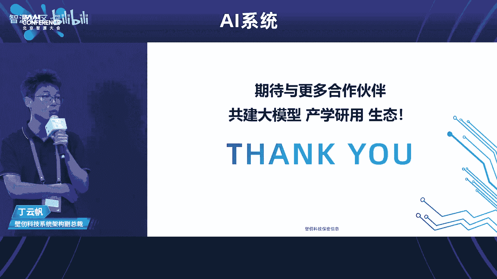

谢谢谢谢丁总。那呃我们呃下面请来呃下一位呃speaker，来自media的高级总监呃，赖俊杰、赖博士，谢谢。😊，大家好，我来自 NVDdia。

然后也会用中文介绍 but before my presentation in Chinese I would present in Chinese I want to share something interesting in English first because know some speakers mentioned some keywords like IBM cell and in area because I was doing my internship at Yonghua's team 15 years ago at IBM on sale on sale current optimization and everything and then I got my PhD job from I。

 In Han on NviDdia GPUs performance modeling and analysis then I got my job at NVDdia so。

This is I feel it's very interesting， you know how our lives cross together at today's forum， okay。行。

那接下来的话还是用用用中文介绍。然后我这边PPT比较少，一共8页啊，然后核心的话就一页，所以呢就是时间肯定应该来得及。呃，这一页的话就非常简单的介绍一下。

就是说呃那个大家就是呃比如说今天可能主要讲的就是我们如何能去更快的更方便的去训练出来这样的一些特别是一些大模型。但是呢就是刚才那个呃就是也有嘉宾也讲了，就是在实际的这样的一个工业场景里面的话。

其实有很多很复杂的一些问题。我举个最简单的例子，就是我们最近一段时间跟我们的很多客户在合作的一个事情，就是什么呢？就是呃那个比如说我们去跑一个1000卡，2000卡。

甚至更多卡的这样的一个一个一个一个一个大模型训练。那很有可能我跑着跑着就挂了，对吧？然后呢，就是呃就是甚即使是我们非常呃用我们的GPU也好。

用我们的这种呃就是很大的机器群去做这种模型训练的一些公司很大的互联网公司。他们在一开始的时候，就是可能在H出现之前，一般呢也没有那么大规模的这样的一些。😊，就是GPU去做这种分布式训练的一些经验。

那换句话说，就是可能从今特别是今年开始，我也发现呢，比如说我经常跑这样的一个很多量卡的任务的时候，可能我跑个几个小时啊，我这个这个这个这个这个这个任务就要重启这个就是中间遇到的问题可能是多种多样的啊。

有可能是比如说我们的所谓的GPU的卡掉了啊，有可能是比如说我们的网络这边的话，就是有有可能他一个link啊就坏掉了啊，有可能是我们的这个存储，甚至存储的这样的一个管理软件就是不响应了等等。

所以就是说实际的这样工业场景里面的话，它的问题会非常非常的复杂。然后呢就是我们呃就是刚才讲了，就是可能跟我们的很多这种呃那个工业界的客户合作的其实某种程度上第一件事情就是要花很多的这样的一些精力。

能让这样的一个大模型训练的任务的话，一个呃相对稳定。用的方式的话，运行足够长的时间。打比方说一个周啊，一个周的话，比如说我我遇到一次故障，或者说挂掉一次。

那我花个半个小时时间把这个job重新launch起来，还是比较能接受的。但是如果说你跑两个小时就要挂了，然后再花半个小时给它冲启这个工程上的话，就会就会非常的费劲嗯。那么就是呃甚至呢就是说呃。

还有非常非常简单的就是呃我我我比打比方说我这个任务挂了，你甚至要知道哪个地方挂了，都是一个问题，对吧？就是那么多的机器，那么多component，那么多的这样的一些部件，到底哪个东西坏了。

所以呢就是甚至是说像如何能够高效的就是用很多不同的软件，你要去监控的GPU要监控你的网络设备的，就用什么样的一些软件能够及时的发现到底它是什么样的故障。我这故障的话，是这个这个卡就是坏掉了。

我要去走一些这种换货的流程，还是说我把这个什么就是比说我的风扇速度调快点啊，就是让它温度尽量的控制在比如说70多度不要到达80多度这样的情况。

它就能继续稳定运行等等这样非常非常多的这常复杂的这工程上的问题。那么现在的话一般来说大家是怎么做呢？比如说举个例子，就是我们要跑1个124卡的这样一个部门训练的这样一个任务啊。

那么有可能呢我会去一个比如说1200块卡的这样一个池子。然后呢就是在。😊，开始的话我会去做一些alal check，就是让这些GPU去啊跑一些。

比如说一些memory intensive或者说comp intensive的这样的一些workload去看一下。比如说这就是先选出来1200张相对来说比较健康的这样一些卡。

然后呢我开始运行运行到20天之后有可能挂掉了啊，有可能这个任务挂掉挂掉之后，如说我要找到哪个地方坏了坏了之后，比如说假说是一个GPU的问题。

那么我把这几个呃GPU对应的这样的一个serv给他从这个池子里面1024这个子里面拿出去。从刚才的那个大的池里面还闲置那个点抓过来几个完了之后，从我的存储里面的话。

把我 checkpoint进来重启这样的一个任务啊，所以现在的话一般是这么干的。😊，呃，产品介绍我就不介绍了。然后呢就是这个地方的话稍微提那么一点点，就是大家可能就是呃就是可能用的比较多的。

或者说比较熟悉的是第一个就是那个M这个是一个开源的这样一个项目。就是那个就是也有很多其他的一些工作，借鉴了这样的一个开源项的一些思路。

然后呢就是当然就是这个这个开源项目的话也借鉴了很多其他的比如像等等里面的这样的一些一些工作。呃然后呢就是后面两个的话就刚才我说我不介绍了。

就是mo的话是我们的一个那个就是做自然语言语音的这样的一个呃开源的一个ki，然后最后那个东西的话就是叫mo framework就是这个的话是一个可以说是一个企业级的这样一个产品。

就是这个地方就是为什么稍微提一下呢，就是说还是那句话就是工业界的这样的一个实际的这样一个用户来讲的话，他不是说我有一个开源的项目放在那个地方啊，就可以了。就是他经常的问题是说。呃。

那比如说我甚至是我有一大堆的数据，我这些数据的话，该怎么去呃处理一下，清洗一下。然后呢变成我这个后面的这样的一些训练们可以呃用的这样的一个呃格式，甚至是这样的一些问题。

还有呢就是甚至问题是说啊我要去那个大模型，比如说那个40个 billion量还是多少的，我该买多少块GPU或者用多少服务器，我中间是用rocky还是用fin band。然后呢我这些超餐的话。

该怎么去设等等。这样的一些非常非常practical的问题。所以呢就是说这个产品里头就是对这种企业级客户的产品里头话。

会提供各种各样的这样的一些工具去帮助这些企业级客户去更好的去做这样的一些大家可能觉得比较傻瓜的这样的一些选择的这样的一些问题。😊，呃，NV linkN switchitch的话，我也就跳过去了。呃。

就是这一页的话稍微多花一点时间，就是可能是呃那个比较核心的这样的一个部分。就是说呃nemo里面的话一些呃呃呃nemo呃就是megaronLM或者说nemoron就是。呃，总之就是NV这边的话。

针对这种大模型，特别是这种transformer based的这样的一些呃大模型的话，在呃像各种各样的这样的一些并行策略的面一些核心的一些呃做法。呃，然后呢以及他的背后的一些想法或者说逻辑。

第一个的话就是最熟悉的最简单的就是数据并行。数据并行这边的话就是我也我也不讲了，就是说这个大家应该呃就是非常容易理解。就特别是呢在一开始我们所谓的去做呃开始的，别是开始一些CV的这种模型训练的时候。

那比说一块卡得比较慢。我用2块卡4块卡8块卡16块卡的时候，那最开始的大家肯定先奔着这个来的。然后呢就是特别是这种呃大模型的这些事情出来之后呢，就是逐渐发现的话，数据并行的话。

它它会有一些呃固有的这样不能说是缺陷啊，一些一些挑战或者问题。因为什么呢？就是说假如说你的数据并行的这样的一个你GPU也好或者说计算的这样的一个个一个节点也好比多了之它就意味着什么呢？

你要么是说你这样同一轮这个要非常非常的大，要么就是说那个我这个就global这个不变的话，你分到每一个GPU上的它这个这个这个的话就别。😊，小那么呃大家也都知道，现在的这样的一些处理器的话。

它处理能力比较强，里面有很多这样一些计算单元么之的。如果说这个太小的话，你这个GPU利用率就上不去。以呢就是为什么说像数据并行这条路的话。

开始的相就是就是用的卡也好这种这种服务器少的今的话就是光靠数据不才有了模型并这件事情是刚推出来的时候主要是做的第二个图这个工作。

就是刚才有嘉宾也介绍了就是像这各种各样横向的纵向的这样一些切分这个地值得提一下的就是刚才有一个图就是云帆这边那个就是那个个事情。就是模型的的话那最简单的逻辑就是这个网络纵向切就P放个放个就是中间。😊。

的话就是他肯定有个消息传递的这样一个过程啊，但是这样过程的话，就是那有那个那个图的话，大家稍微回忆一下，就中间会有一些灰色的这样的一些区域，就是就叫叫bubble。但实际上来说的话。

就是呃不管是那个microofIM还是其他的这样的一些呃做这种大部型分布式的这样一个框架，其实做了嗯就是比较嗯。😊，比较比较比较比较聪明的这样一些策略。然后呢就是来去呃就是尽量的让少一些。

打比方说是什么呢？就是我们最直观呃容易理解的就是说刚才说的比如说把0到3个放到PU上，然后呢就是4到7放到GPU1对吧？但是实际上来说的话就是说我们在就是说我去的候。

个PUU的放置的话并不是这样的一个就是呃从从最简从最低到高这样的一个线性这样切分的。实际上的话把它稍微打乱一下完了之后的话就是等等啊用这样的一些那个就是所谓的调度上的这样的一些策略能让尽量的让他那个灰色的区域一点。

然后呢就下面两个的话是NV这边就是比较新的一些工作。实际上去年的话就是才。那个那个发表的一些工作，就是呃那个呃就是一个是呃就是呃就是这两个的主要工作，它的主要目的是什么呢？就是说我们其实大家也都听到。

比如说有很多其他的工作，它的主要目的是说让GPU存或者GPU的量一定的这样的一个情况下，我能尽可能多的尽可能去训练更大的这样的一个模型。换句话说就是尽量的减少我这样的一个呃对于显存的这样的一个消耗。

或者是对显存的这样一个press。这两个工作的话主要也是做类似的工作。但是呢就是NV这边的这样的一个spoint是什么呢？就是说我在基本不影响我最后整体的compute efficiency的前提下。

我能够如何去减少对于GPU memory的 pressure啊，就是这两就是这个这个这个NV这边工作跟其他的工作最大的这样的一个出发点的不同。呃，然后呢就是呃sequence parallel。

它主要指的是什么呢？就是说我们那个transformer的。呃，一系列操作啊就是前面的模型并型的话，主要是在呃attention那些lay，还有那个MOP或者说那个前项的那几个 layer上面做的工作。

但是呢就是像 norm out这些东西的话，就是他对于计算的过程中前后显存消耗比较大。但是呢就是之前的就是你就是没有办法去做这样的一个模型并or parallel或说 parallel去做。

但是呢就是说我们现在是做的是的好处就是说你在sence的这样的一个方向上来看的话，实际上就是它一个sequence来看，它的这个计算是independent。

所以呢就是说sence是在sence这个这个维度上然再给他切几刀分成分给不同的几个PU它去并行了去算。呃，最后那个selective activation recomp是啥意思呢？

就是说呃先说那个activation recomp就是呃。为了减少对于呃就是activation，就是激活这些呃对于显存的占用呃，其中有的方法是什么呢？就是说。

我在呃一些呃就是我我我我我在显存里面保存呃一部分激活值。然后呢，就是呃比如说几层 layer，就是它的输入的那个那个激活。再算就是后项的时候，因为要用到所有的这样的激活值。那么我在做后项传播的时候。

我临时的去重新去算那些就是激活值呃就是这样子的话就是说它的核心的话还是那句话，就是说只保留一部分激活值。这我可以减少对于显存的这样的一个压力。但这样的问题显而易见的就是说我增加了大量的重复计算。

所以呢就是说NV这边的selective activation的话，它主要的区别就在于是说。我不是把就是不是这样非常粗暴的。

就是我我我就呃保留一部分就是某一些 layer的一一组 layer的这样的一个输入。而是呢看一看，就是我整个的这样的一个特别 transformformer这样的一个前项后项的计算过程中的话。

有哪一些 layer或者操作的话，它对于显存的占用比较高。但是它对于计算这块的需求比较少。呃，然后呢就是呃换句话说就是选择某一些特定的这样的一些层或者操作去做这样的一个呃activation的这样的一个事情啊。

这样子的话的好处是说我计省了一些显存。但是对于这种额外的计算的开销啊就比较少。那就是呃细节我就不讲了最后达到的一个效果是什么呢？就是大概就是我能省就是activation啊。

就是能省一多半的这样的一个activation的这样的一个显存的占用。但是呢对于计算的呃额外的开销的话，大概只有12这样的一个量级。所以呢就是说在这个地方稍微重复强调一下是什么呢？

就是NV这边的这样的一个stand或者做这些工作的一个核心的这样的一个点是什么呢？就是说我要去尽量的降低我整体的这样一个效率，尽量减少对显存占用。

但是一个前提是尽量的不减少整个计算系统的一个 efficiency。嗯，OK那个最后的话就是稍微做一个小的广告，就是我们这边在招人。然后大家的话如果有感兴趣的，就是说可以直接联系我们的那个呃那个HR。

然后呢，就是呃报一下我名字，应该能找到我这边。好，谢谢大家。😊，呃。I will comment the the early his beginning said his internship inI will comment that in the the the last session of thisO呃哎呃那我们今天呃请来呃下一位演讲者下一位演讲者是来自呃中国电信的李经李总。

谢谢。😊，嗯，大家好，我是最后一位。好消息呢，是等我讲完了之后，午饭就来了。但是不好的消息呢是大家必须要听我讲完，午饭才能来。😊，那个我呢是在中国电信呢一直从事云计算和计算平台。就是换句话说呢。

就是咱们大模型的底层的计算平台的构建的工作了。今天呢也是想跟大家在这个场合呢要聊一聊，就是基于大模型训练的这种高并发文件的一个访问的深度的一个优化。因为今天咱们在众多的演讲者中呢。

其实有不少同事都要提出来了，是说在我们如何在算子方面，在GPU方面，包括在模型方面，我们不断的去进行优化。其实最终的一个目的呢是说在模型越来越大的情况下。

那么我们如何能够高效的来提升我们的整个模型的效率达到一个更好的效果。呃，这个就不细说了，因为是整个大模型的发展趋势啊等等。其实大家都说的很多了。但是我在这里面其实想从另外一个维度来说的是说。

就是无论是说我们现在从通用大模型，然后到往后通过我们对一些特定场景，包括对数据的一些抽象来构建。面对某一些具体行业的这种行业模型，乃至于到这种特定的一些场景的模型。

乃至于说我们从最早期的这种单模态的模型，一直到现在随着客户的需求进入了多场景，多文件的引入以后，形成这种多模态的模型之后，其实我们发现在最底层呢，我们能够看到的是模型发展的趋势呢。

那就是它的参数的量级会成几何级数的增长。举了一个例子，在图的最最右下角吧，最左下角就是那种大模型从就是我们拿GPT来举个例子，可以看到它的参数量级呢，从GPTR一直到未来的GPT5。

的时候我们可以看到它的参数量级是乘几何级数在往上增长的。那么在几何级数往上增长的参数量级之下呢，我们看看会发生一些什么样的一些变化和对底层的存储等等这方面会产生一些什么样的需求。首先呢参数量级增长之后。

我们第一个能够看见的是它对参数量级的增长呢。那首先它是对我们训练数据的需求量就会越来越大。我们可以看到从几十个G一直到几百个几百个T，乃至于几千个P，类似于像这样的一个一个量级。

并且呢随着多模态的需求出现之后呢，我们可以看到呢，就是说原来我们都是从单一的文件。包括这种小文件，以及呢是类似于像这种那种结构化的数据，然后逐渐呢像类似于这种多模态的。

然后非结构化的数据的需求量会越来越大。那么再往下对底层的影响，我们就可以看到了。首先呢是原来我们。对底层呢用rom或者本地磁盘进行就能够进行存储。但是随着模型的参数量呢越来越增大呢，那么。本地的磁盘。

还有rom呢，其实永远是已经不能够支撑它了。那么从存储的量级上面，我们从T开始，可能后面一直要到。几十P上百P。那么我们对于这种存储的介质对它的要求就会越来越高。并且呢对它的带宽，以及呢对它的访问。

我们常说的IO这方面的要求呢也会越来越高。那么在这些变化之下，我们看到它的挑战是什么？我们大概总结归纳了一下，看看有几种挑战。一个呢就是对大容量存储的挑战。大容量存储的挑战呢。

我们现在可以看到呢就是从单模态走向多模态之后，对存储容量呢，它带动的就是我们的存储可能已经从本地的服务器开始要逐渐逐渐的走向专业的这种外部共享的一个存储。并且呢这种存储一定是要能够灵活的去扩展的。

一定是能够灵活的去扩展的这种方式。第二个呢就是高带宽和这种高IOPOS的这种IOPS这种挑战。因为在大模型的训练的过程中，需要更加快速的加载去种海量的小。文件的训练数据。

同时呢我们要因为GPU卡都很贵嘛，所以我们要降低成本，那么要尽量的去减少这种GPU卡的这种空载的等待的时间去提升这种算力的利用率。包括我们在看它在中间态的数据的时候。

他需要快速的去把这种中间态的数据去往存储里面去写。那么在这种情况下，一方面呢对带宽的需求，还有对那种高速并行的读写的需求的挑战会越来越大。最后呢就是还有这种可靠性。

因为前面也提到了存储介质的容量越来越大。那么在整个模型里面。存储接制的容量大了以后，像这样的存储，它的可靠性，其实直接决定了我们在模型在训练的过程中，它的一个效率和一个它的可持续性。

因为一块盘出存储的量大了以后，一块盘出了问题以后，它可能会对整个的数据的影响，就比以前那种小存储的影响会大很多。那么我们看到这几个挑战之后呢，我们看看。我们在实践的过程中，我们是如何去应对这些挑战的。

呃，中国电信呢是我们一直在致力于这种面向大模型训练的底层的支算平台的搭建。在这种搭建的过程中呢，就是我们可以看到这是一个技术的一个一个一个一个框架图。在这个框架图里面。

我们看到就是我们从几个方面去采用了一些实践中的一些措施呢来应对这方面的挑战。首先呢是应对这种大容量的存储的一个挑战。那么显然大容量存储，我们应对它的最好的方式呢，那就是。这种分布式的架构。

因为我们通过分布式的架构，可以把原数据呢往在我们的架构里面的多个节点里面去存储，而且呢可以通过类似于这种那个。积木式的这种扩容的方式。

就ing block这种方式呢来进行灵活的一个一个积木堆叠式的一个一种扩容。这样的成本呢就有一个极大的一个降低。目前呢可以做到的是能够达到了容量上达到1个10P这么一个一个量级。第二呢那就是针对高性能。

还有高并发性的这方面的一个挑战。在这里面我们通常呢是通过几个方式来去做几种措施吧，来去来去来去解决目前存在的问题。一个呢就是那个GDS，还有呢就是包括智能的预加速，还有那个类似于客户端的加速。

这个呢在后面的篇幅里面，我还会去说，在这里面是想说的呢是就是在网络层面上面在构建这种算力平台的时候，我们同时能够支持目前能够支持的是IB网络和roy的网络。我们通过这种高速带宽的网络呢，把这方面。

因为网络带宽导致的。瓶静的去极大的给它去降低。同时呢就是在最底层的时候，在存储介质上，我们现在广泛的在使用基于这种SSD的全闪的存储的方式。当然了，大家也知道就是这种方式的成本会比较高。

相信在未来的一段时间，随着成本的这方面的降低呢，我们为这种大模型的训练，它所提供的这种底层的架构的时候，那成本也会大幅的往下去降。那么在应对这种高可靠性的挑战方面。

HA的方式其实是一个相对比较目前看呢是比较成熟的这种这种方式。同时呢我们也通过这种类似于动态的纠缠码和缩列重构的这种方式来保证它的数据的一个可靠性和数据在丢失了之后的一个一个重构。

包括像硬盘的亚健康的管理。这个后面呢也会有一个详细的介绍。那除了刚才说的就是在硬件上面，还有带宽上面的一些应对性的应对性的措施和实践之外呢，那么说一下呢，就是从软件层面刚才也说了，在这个在这块呢。

我们要想讲的一下呢，就是说中间线现在我们也进行再进行开发呢，是什么呢？就是一个智能的预加载的一个方式。我们通过智能预加载和缓存加速这种结合的方式呢。

希望能够加速的是通过加速的是它的数据的一个提前的一个存取一个一个读取。因为我们也知道就是。就是就是我们想通过这种预加载的方式能够做到什么呢？是说。我们通过去观察和去学习在大模型，它去读取数据训练过程中。

它的行为方式，包括他哪些数据的经常读取的一个频繁度。我们通过这种方式呢来进行下一步的预测。我们去预测哪些数据，它能够会相对比较热门，在下一步的训练中，它能够会去读取。那么通过这种学习之后。

我们把大量的这方面预测的数据会提前抓到的系统的缓存里面去。抓到了缓存里面去之后呢，就是通过通过这种方式，显然呢你在模型有需求的时候，他发起了发起需求，它直接去向存储介质去读的时候，这个里面会产生。

在这种这种方式下面会产生一个延迟。那么这种延迟在数据量大的时候，其实这种延迟在整个系统里面的开销的时间，其实这是需要格外关注的。那么通过提前读取到缓存里面去之后呢。

其实某种程度上能够把这种延迟极大的去压缩。通过压缩之后，其实变相的也是提升了我们的训练的一个一个效率。另外呢就是在GTS方面，就是大家看这张图，呃，在传统的读取方面呢。

就是当GPU要去读取存储的数据开展训练的时候，通常的CPU是要参与到这里面的工作的。CPU要负责的是在数据的处理和数据的传输过程中，它都要分配资源，它进行控制。那么现在呢像英伟达呢。

现在它是把这方面的功能呢，它是做到了GPU的底层的芯片里面去。换句话说呢，就是GPU呢，它不通过要读取数据的时候它不通过它不需要通过CPU的干预来进行读取。

那么我们在开发中国电信的HPFS就是高性能的文件存储系统的时候呢，全面的去适配了这种GTS的能力。那么我们也是在HPFS的客户端。然后通过GDS的那个酷fi的库呢，然后实现了对。对。

请求端呢对GDS的一个支持，像GPU直接去发取发出那个调用的指令。然后在服务器端呢，我们通过这种RDMA的方式呢，然后通过它呢是实现了对GDS的支持之后呢，去直接形成了那个数据的一个读取。

通过这种方式呢，其实变相的也是能够增加了一方面呢数据的带宽。另外一方面呢降低了它数据读取的时延，同时还有一点好处呢，就是因为CPU不再参与这个读取的工作。实际上通过GDS呢，我们是绕过了主机的内存。

还有内核的协议站，通过这种方式呢，相当于是释放了一部分CPU的资源。那么释放出来资源干嘛用，在给其他的算力任务里面去给其他去给其他算力算力去去做资源的使用。

其实变相的我们也是降低了这个CPU的它的一个一个资源的一个使用。那么在它的稳定性方面，我们通过除了刚才说的措施之外呢，还有两个措施。一个呢就是通过动态纠缠码的方式，就是动态纠删码。大家都知道。

就是我们把数据在。海量的存储里面，我们切块，切完块之后，通过加入冗余的那个冗余的数据之后呢，我们通过合适的这种那个纠缠码的方案，我们把它分布在了各个节点上面去。

这样呢一旦某一块盘或者某一个数据丢失的时候呢，我们通过纠缠码的方式可以保证它数据的一个就是降低它的数据的一个丢失，并且能够保证一个数据的容错性。就是我们可以看到呢在3块盘丢失的情况下。

我们通过动态纠缠码的方式，可以把它对业务的影响的概率。就是如果要是比如说我们现在列出8个T的话，它影响的概率能够降到8。57乘10的-11次方，这个就已经很小了。

然后我们可以做到整个的系统的稳定性能够保持在12个9以上这么一个层面。并且呢在应用了这种缩列重构的方式之后呢，就是当我们某一个。比如说存储的集群里面某一块盘出现了问题之后。

那么我们去调整整个的它的数据片的大小，然后去重构这个串。那重构了串之后呢，相当于是这一块盘就退出了。然后通过通过重构串之后呢，数据呢，它一样呢是可以保持一个冗余，而且不间断，做到了一个不丢失。

而且就是即便丢失之后，我们通过其他的算法能够给它进行恢复。并且呢当这块盘恢复了之后，我们可以通过它自动重新进入到集群之后，我们再去调整它的。数据列的大小，让他加入到整个的集群里面去去恢复工作。

通过这两种方式呢，能够去保证我们整个的数据的一个安全的可靠性。然后还有呢就是因为前面也讲到了数据盘越来越多。数据盘多了之后呢，就是大家在使用这个数据盘的时候都知道，尤其使用时间长了之后。

数据盘的稳定性会降低，它经常会出现坏盘。一旦出现坏盘，并且就数据的介质越来越大的情况下，它出去坏盘。那么它会对整个数据的存储的质量会产生这种宏观性的影响。那么在这种时候。

我们也是开发了一套模型来进行训练。当然这个里面也很有意思嘛，就是我们通过训练的模型为模型的训练来提供来提供支持。那么它要做什么呢？它就是我们对所有的这里面的盘进行监控和检测，你包括它的温度，它的震动。

它的访问频率，它的IO等等这些来进行来进行检测和记录。这样呢现在能够做到对它的各种工况的读取之后进行综合分析。

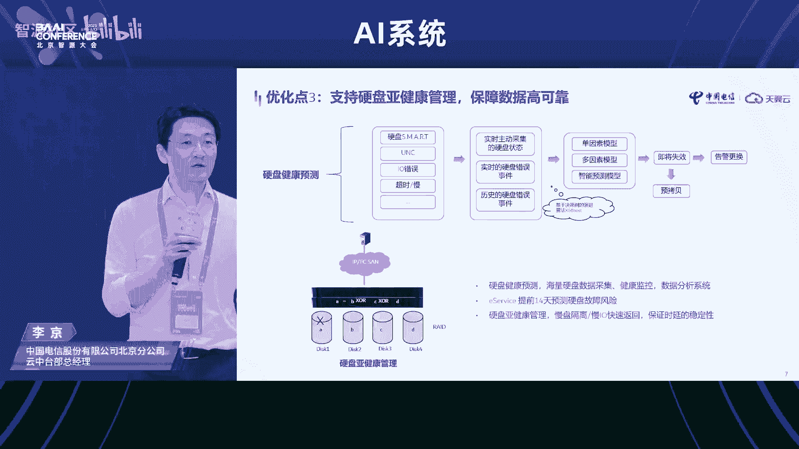

我们能够做到提前14天能够对这块盘未来的工作状况进行预测。当我们发现它的IO降下来了之后，通过分析，我们可以把这块盘这块慢盘从整个的集群里面给它隔离出来。相当于是我们做了一个宏观的调控。

把它隔离出来之后，这块盘出来之后，那同时就是刚才前面讲到的动态纠缠码和缩列重构的方式的机制又开始起动。这样形成了一个系统化的循环，来保证整个数据的一个高的一个可靠性。那么说到最后说到最后呢，就是。

在整个的内存，我们面向大模型的实践过程中呢，就是我们在提高存储的一个效率的工作中呢，就是我们完全依托的是中国电信开发的这个天翼云的云销计算平台来实现这一系列的措施。从这个框架可以看到呢。

就是通过云销的计算平台。我们在底层将计算存储网络等一系列的节点来进行封装。然后通过天云的操作系统和云销计算平台的这种调度系统。我们把它进行封装了之后。

面向客户能够一体化的来提供一体化的来提供类似于网络计算带宽。然后包括模型辅助，还有等等相应的一系列的工具，向客户来一体化的来提供来提供这方面的工作。然后也是希望呢就是后续有机会呢，大家能够来试用呃。

天翼云的这个云销的至算平台，因为时间限制呢，就是具体的功能就不介绍了。时间很短。其实在这里面呢有很多是可以深入展开来深入讨论的。也是希望呢就是后续有机会线下的时候。

我们一起来进行在这方面的一些技术层面的深入的一个一个沟通。呃，我想介绍的基本上就这些，谢谢。好呃，这个不是最后的一个speer啊，因为我们cancel掉了那个panel。

所以我们把panel呃前面没有讲的呃，天数至星的，我们还是邀请他上来做一个很简短的一个 share。😊，好，谢谢呃。😊，呃，很荣幸啊成为最后的呃压轴的speaker。

然后嗯耽误大家最后在呃7到8分钟的时间。然后呃简单介绍一下我们和智源在大模型上的一些合作，以及天数之星。在大模型上目前已经推出了一些呃solution的方案。😊。

那呃首先很感谢智就是天视心作为GPGPU的这样一个厂商，实际上和智源有很深的合作。呃，就像刚才前面白博，然后田老师所介绍的。我们在AI芯片AI的呃编译器，然后还有九鼎的评测平台以及大模型的训练上。

这际上做了很多的深入的工作。那这一次呢我们和智源实际上一起输出了一个呃的呃code7B的模型。那这个模型的话实际上是智源基于天数的呃BI100的呃集群。然后来进行训练的。

然后这个训练的数据参数呢大概是在100B的这个呃代码之上来进行全量的一个训练。然后做一个pre的工作。这个整个工作在19天的时间里头来完成。最后来输出了一个呃这样子的模型。😊。

整个模型的效果呢也能达到呃human evaluation at onepas at one的话大概能到呃19超过19这样一个数。实际上在同级别的模型尺寸上面呃是一个呃达到一个Sso的一个水平了。

那在整个的这个合作里头，我们会发现说在大模型的训练里头，实际上呃芯片作为国产芯片来说，作为呃计算卡来说，那么通用性，还有一0一性是第要第一重要的点。那我们在整个这个工作里头，实际上从支援从英伟达的集群。

然后我们来支持这个BMtrain，就底下的分布式系统用的是BM train这样一套方案，从英伟达的集群，然后迁到天数的集群里头，就迁移的时间其实就是一天的时间就跑起来了。那当然这迁移之后。

实际上我们会发现集群的性能并没有达到我们所期望的那样子一个能力。那这个时候就要需要做对attention的算子去做优化。在flash attentiontention上面。那我们可能。

基于我们的通用性和易用性，我们在呃ku大层面去做了这个算子优化，包括了一些呃底层的OP，减少一些reduce。就是在这样子的优化之后。大概一周左右的时间，那整个集群就完全的跑起来了。

实际上整个的工作大概是一个月的时间。大家会看到说通用性和易用性一迁一性在这个里面是占了很重要的作用，才能保证在一个月之内完成这样子一个大模型的呃训练，并且得到一个相对比较reasonable的一个结果。

😊，然后第二点，我们在这个大模型的整个训练过程里面，我们会发现说呃集群的可扩展性实际上是第二重要的点。刚才其实前面有很多呃speakker都讲提到了，那如何去做这个呃在一个算例，然后因那个网络拓扑。

然后并行文件存储。这样子一个系统里头，怎么能够在这些点之间找到一个平衡的一个sweetly point的点。这个point的点能够让集群的可扩展能力最大。因为毕竟呃国产芯片。

整个集群在单卡的算力上跟NV的主流卡还是有差异的那可能靠的就是多机的这样子一个堆叠来追赶这样子一个整体的性能。那在这个里面，我们实际上有一套天数之星有一套完整的方案，我们做到了一个什么事情呢。

就是在整个集群的可扩展过程里头，随着节点的增加，我们可以一直保持呃，这个集群的效能在95%以上，就是线性加速比在95%以上。呃，这是第二个很重要的点。第三个很重要的点其实就是稳定性。

大贸型的训练的周期很长，整个的呃权中间的就是要保存的权重很多。然后数据要加载的量也很大。那在这个训练的过程里头，实际上天数之星保证了一件事情，就是在19天的时间里头是没有任何一次掉卡。那保证这个。

整个模型的训练能够平稳有效的smooth的往前走。这个是我们在整个过程里面所看到的。呃，在大模型训练上，我们和居恩一起合作，能够做到的一些点。然后呃回过头来呢，从产品的角度来说。

其实天数之星因为已经发布了三款呃新新那个卡，所以基本而且是量产了。那在这种情况下，我们实际上已经覆盖了AI的训练推理，还有科学计算，整个这个领域。那在大模型的训练的角度上面，实际上我们有完整的方案。

这个方案可以覆盖pre train的工作，可以覆盖呃PFT的fin tune也可以覆盖p tuning的这样子一些简单的呃优化工作。那这个是然后同时由于我们能够支持。呃，不同的分布式框架。

就除了deep speed，然后BM trainclo AI，然后还有micac这样的一些框架。我们在底层能够支持这样框架。所以我们可以做到一个很重要的点是能够很灵活的从单节点扩到数百个节点。

这是我们已经可以支持的呃，这样的一些开源模型的一些训练的工作。然后在推理上面的话呢，我们实际上是呃能够支持，也这些是我们目前已经支持的一些主流的一些大模型的一些个情况。

那会看到最重要的一个点就是我们能够做到在。呃。因为推理的时头其实最重要的一个点，实际上是多轮任务的多人同时对话。那在这个里头。

实际上大家知道在attention里面其实很重要的一件事情是你要不就是怎么保持上下文，要不就是在attention status，你怎么把它保存下来。然后当发现发生了用户切换的时候。

最后这个这个前一个用户的呃session status还能保持住。那在这上面我们是有完整方案的。我们可以做到在这个完整方案上多用户呃高并发的情况下。

我们可以做到呃我们的一体机可以做到800 tokens每秒啊，这也是一个我们呃独特的一个地方。😊，呃，整个的在底层就是大模型的支撑上面，其实呃天数之星实际上是做了很多的呃不同的工作。

就呃从硬件到编译器到呃分布式文分布式的这个训练系统，然后再到上层的应用的优化，实际上是呃包含了很多的步骤。

然后特别是要提的就是像现在的flash小小个子ex transform这样子一些算子我们都已经支持了。而且这个支持的话，对于上层应用用户来说，你用来调用的时候，你是无感知的。呃，最后说一下。

我们可能对未来的一个展望，就是在大模型训练里头，我们也会发现，实际上会碰到呃新的一些问题。那第一个问题其实就是算子的优化的问题。

那其实昨天我听到一个就来自o一个研究的其实也也讲到了就没有任何官方的数据去说G是一个还是个模型但际上在那个会上也谈到了，其实它是个那整个的在这个计算里头实际上怎么在这个这个算子上能够做的更快。

特别是从硬件加速的角度。然后能够从指令级的角度能够怎么做起来，这个是非常重要的一个点。然后推理的话呢实际上大家也都知道现可能如果去压缩去做蒸馏，这是大的一个点。

然后第三个的话就是存储的成本存储成本了本身要存储的这些日志。然后checkpoint以，其实还有一个很大的点，现在有一个新的方案，我们也在做的，就是说我们怎么把VME用起来。么把就是在多个呃多轮。😊。

对话切换不同用户之间切换的时候，我们怎么能够不用每次都带上下文，而把中间的attention的state存到NVM去。然后在下一轮切换的时候，快速加载回来。

这样子来保证这样子一个实时性低延时大吞吐的这样的一个效果。这个也是目前未来要解决的就是要进一步去优化解决的地方，最后的话就是互联网成本了。现在今天所有的大模型都已经是有钱人的游戏。

那infin的交换交加上交换机整个成本是非常高的那rock的话优势是可以在带宽上解决。但是呃在延时上实际上是有很大差距的那在这个点上，那怎么利用呃。

然后利用这样的一些其他的方式s的方式能够把尽量的把这些延迟都隐藏到进一步隐藏到计算里面去。就是我们会和呃分布式的这个训练框架进一步去配合去优化的点，那以上这些呢就是我今天想。😊，呃。

介绍和分享的内容很感谢呃，大家的时间。好，谢谢。😊，Okay， allow me to spend just one or two more minute to close。

 And just like I said， I want to comment the the internship since I PMm。 And in this conference。

 I certainly noticed seven， including myself，7 of our speaker。😊，Actually。

 have worked for IBM as the researcher or internship or the product team for IBM system。

 And it's not by design， actually because the AI， large foundation model。

 we can have the chance to meet together again。 So that means that the system is so important for AI。

 especially for the large foundation model and large foundation model。😊。

Is have the chance to drive system research to NAda。 So no matter how our tech career change。

We feel happy that we can meet together again to discuss the new problem together and embrace the new challenge together。

 So again， in the last sentence is I want to appreciate all our speakers again。

 Thank you for but prepare such a wonderful speeches today。 And another thing is for our speaker。

 actually they flight a long way from US and French to hear。

 and have the face to face discussion with us。 And again， I want to thanks all our audience。

 stay such a long time until now。 So let's meet next year in next B AI conference。 Thanks。😊。

