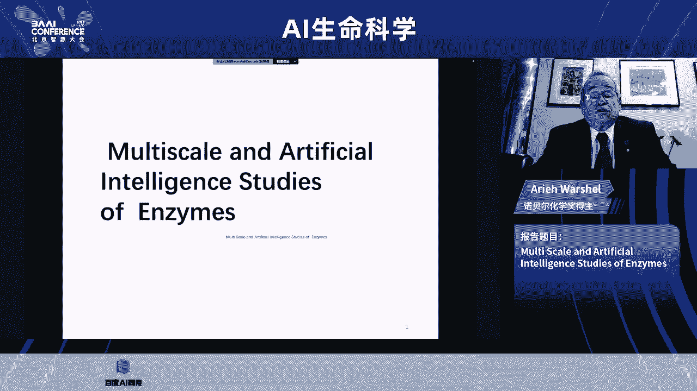
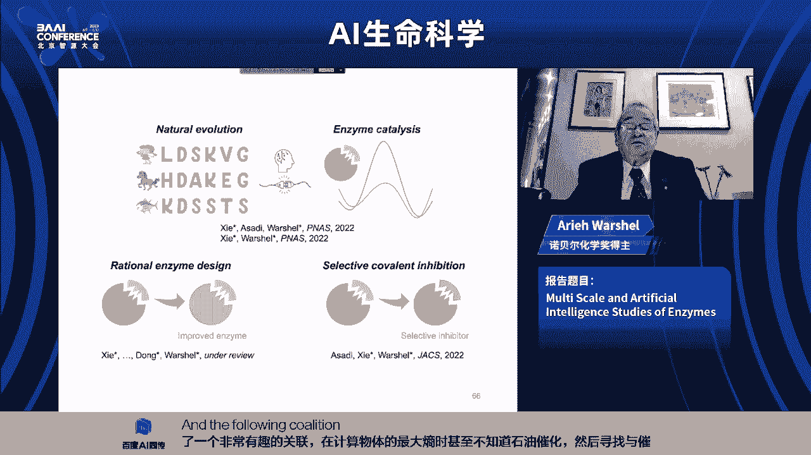
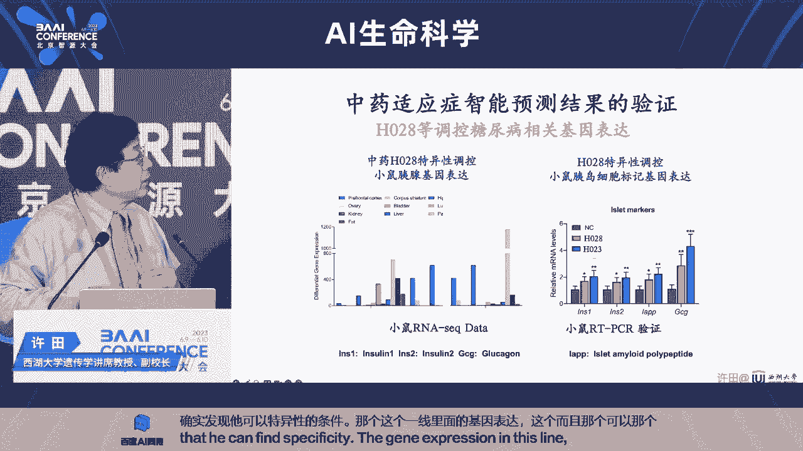

# [2023北京智源大会]AI生命科学 - P1 - Mercurialzs - BV1KV4y117m5

welcome to the symposiuai for life science，i'm sunny，i，thank the organers for giving me。

the honor to chthis，imposing，imposi，we have a change in the program。

unfortunately for personal reason，professor，baker cannot attend today's session will ask him。

next time joining us，online is professor，every wah the distinguished。

professor of chemistry of university of southern california。

twenty thirteen nobel laureate in chemistry here，we have professor，高一秦of peking university。

since we have echo associate professor of pha，quebec a i institute and uh e c montreal，tang jian。

professor，tg jian，and uh professor，xtvice，chancellor of westlake university and professor。

高歌pku from pku，we have a q and a session at the end，during，which the speakers can。

as each other questions，and will take questions from the audience。

but because of the time difference professor，washup will not attend the discussion session。

and and so we'll take a few questions after his first talk，难道不会死。

modern life science began with darwin's evolution theory，and mel's rules of inherence。

have evolved rapidly especially，since the discovery of the double helix structure of dna。

seventy years ago，largely due to the emergence of technologies for example structure，biology。

technologies for structure biology，molecular biology，genomics and computer simulations。

because of these tools，live science has changed from a data，poor science to a data reach science。

a qualitative science，a quantitative science of information science in recent years，advances in ai。

machine learning，have brought another revolutionary tool to life science。

which is signified by the aero two，success prediction of uh protein structure from their amino。

acid sequences，they have triggered a series of recent development。

manwhich would be exemplified by the falling lectures，so without further ado。

let me introduce the first speaker，the professor error washer is a bell chemist，who won。

the nobel prize in chemistry in twenty thirteen，he shared the price with a martin coupl。

and michael livid uh at hover and stanford university，respectively for developing multi scale。

models for the study of complex chemical systems，wah uh was born in israel，he obtained his。

bachelor's degree from israel institute of technology in nineteen，sixty six。

he then earned his master degree and pitty degree from vice。

man institute of sciences in nineteen sixty，seven，ninety，sixty nine respectively。

and his uh ph d supervisor，我是usher professor lifson，and he worked uh with michael livid uh。

during that time from nineteen seventy s to nineteen seventy two。

wah did postdocker research in martin couples lab，at harvard university。

my uh former lab at harvard union university was almost right。

next door in nineteen seventy two in returned to vice，mainstitute of science。

before moving to university of southern california in nineteen seven seventy six。

where he has worked ever，since besides the nobel prize professor。

wash up has received numerous owners，including international award in com bil chemistry and pharmer。

logically um pharmacology，and uh thomas meadow，he is a fellow of royal chemical society。

and a member of u s national academy of sciences，his title today is moi scale and artificial intelligence。

study of enzymes，all right looking forward，okay，thank you very much，a ki share，okay，so uh。

i will discuss multi scale and artificial intelligence。

studies of enzymes，i must confess that for a very long time。

i do not want to touch artificial intelligence，although in retrospect，my ph d where i fitted ffields。

using experimental to overtical，result a by lisquare was some type of artificial intelligence，so uh。

just to move the main subjects of this lecture，will be modeling enzymes by different approaches。

and as you see here enzymes，do chemical reactions like this。

parkman much much faster than the corresponding reactions in solution。

of course we want to understand why，and also to be able to exploit our knowledge。

so i enzymes are remarkable catalysis，they accelerator action。

sometimes up to ten to the twenty times，which is sometimes how to believe。

but this is relative to the corresponding chemistry in water。

and they do it mainly by making deactivation，barrier，the barrier to break bones for example。

much lower than the same value in solution，so uh，this lecture will focus on the understanding using computers。

and then on attempts to design，enzymes，now understanding a on the molecular level require computer。

since we have such a complex system uh with many many atoms，and it's hard to pit。

experimentally on the tommy level is a part with designed for it，okay，here。

i just list different type of enzymes，basically，any system with high valuing biology is manipulated by incepts。

so the main approach for physical，modeling of enzymes has been the combined quantum，mechanical。

molecular mechanics support，well the chemical power is model by one to mechanics，quantum。

chemistry in the rest of the system by molecular mechanics。

which mebolin spring type models with electrostatic coin，charge on different residu now。

there are many ways to implement，you are my map in the，you have to take into account。

speed and ecoacy，because especially when you want to deal with loud sequence space。

you want to be able to process in the computer，so our favorite approach and its present the strongest approach is。

what is called the ivy，and basically describe，chemical reaction is moving between different states。

the batistates，which you are mixing by a mixing term，which is fitted to experiment。

so here for example in model，the reaction of the ogane，we moderate by two states。

which are basically two false fields，but then we mix them by a mixing term that。

reproduce the analgetics in solution，and then we move to the enzyme by。

changing the introduction of the，environment with the two diabetic states。

this report is very powerful，and i will just st show you。

my standard demonstration did when we try to study，jptin like crosp，twenty one。

when it's bound to a parting，called gap that control the single transduction。

you want to understand the backage of the gdp to gdp，people as pose。

first fa very complicated chemical reaction，so you feel studied in water，by our initial calculations。

will the water are represented classically，uh，you see here the gdp and green magnesium。

and you study the potential surface after you gain enough knowledge。

you use the same surface in the protein，replacing the water，the pting aroms，let's see，what it is。

so this is typical simulation，well，water molecule attacks。

the first f the green autumn is the magnesium ion and eventually，the bone piece of breaking。

so you could model the dynamics of this process，but what you really want to do is to model the energetics。

because the activation valued determined，all，right in heal examples of studying of this。

russ gap system with the protein gus，it makes the actual fast in with different newtons。

this lead to concel，so with this type of approach，we study countless enzymes，we were able to model。

the difference between the reaction in water，which is in blue to the reaction in the enzyme。

and the this is going on basically，since the late seventies and more quantitatively。

since the beginning of the eighties，and we conclude that any case that。

we check the catalysis due to electrostatic，stablization of the transition state。

and it's not a simple electrostatic，it really changed in，what is called the reorganization energy。

because when you do chemistry in water for example in essen，two reaction。

will the minus move to the azi，disorant，molecule have to rearrange，and this is associated with。

what is called the organization energy，you have to pay for this。

dipoly arrangement on the other hand in a good enzyme。

the environment is partially all that you ienter to the right direction。

and you don't pay the organization and ergy，so in most of the case that we study uh。

we were able to show that this is the origin of qataris，it's a not simple concept。

so allocking biochemical community，uh don't still following it completely。

but it's what you find by computation，and it also makes sense。

so now we move to the main part of this lecture，which is could we use our knowledge。

not only to understand biochemistry，but to design ener uh，partially it is。

because people are more impressed from design uh，because it's kind of predicting something。

and people always are very enthusiastic，when they see a prediction like uh。

people start to buy the book of newton，principal after the highly comet appear，were highly predicted。

so it's not exactly a scientific reasoning，so we try to see with others。

if we could change enzymes in a predictive way，and if you just do it random read countless uh。

how we wrote twenty to the three hundred day，possibilities。

and this is not exactly the direction you want to go now。

this could be very useful for example in gene，everything if you could control with the enzymes at work there。

you control the afr，and of course with many technological issues，so what we could do about it。

and there are two ways，one is directed evolution，which is basically imitating。

what evolution is doing is trying，to let the system mutate random，rand picking every time。

the new generation of the faster inside，if you come from physical background。

you want to be able to predict the change，and of course，it's a very very hard challenge。

so we want to protect the fifth of mutations，and to do it correctly uh in princip。

if you want to follow physical principle，you could use the kemmm method，but it's not simple，i mean。

you could mutate residues，from one to another zle by fenergy perturbation。

it's very easy on the computer，but this does not guarantee the。

the result will be covered there are enormous problems of convergence，and other issues。

you must check，how will you produce experiments，now when we check on non mut in relatively simple mutton like。

this is the case with the ologous uh，we seem to do relatively good job，i mean not perfect。

but good job in predicting the effect of mutations uh。

one of the key challenge that we try to address，was to take campaiginals，which was enzymes。

it was generated artificially for nothing，and become the kind of place where different people compete on。

how well，we do with enzydesign，and you have to remember that this。

enzyme start from extremely bad enzyme，so it might not be so difficult to improve it。

uh failed with local a generation of mutations，it was generated by，don't delete dantelophic。

and we found the enzyme work，faster not like natural enzyme，which usually tried to make more。

polo environment at the transition state，essentially denum。

use a very simple and not small rix of this，stablizing the ground state。

which had are unable glutamic acid in this，make direction faster，this is a very bad strategy。

which is not used by evolution and in a lighter，generation，dhill vote did better by stablizing。

the transition states，we were able to reproduce，both phenomenal to understand。

what they are coming for uh，we did not predict it，but we reproduce，what is known。

basically will reproduce different mutations，we felt quite good about it，and then we try to see。

could we understand or compete with directed evolution，and so we took the enzymes that don hill，well。

designed by major，step in director revolution，e changes of many residues，and，okay，first first of all。

we succeed very nicely，when we knew the structure of the different step in the evolution。

but we did not do too，well，when we try to move from one structure to another，we basically hit a wall。

we kept failing，so we decided to move to a massive screening，we generate many many mutants。

allow them to relax and rotate，and we look in each case on the activation barrier。

and in some respect one，could say that we were okay，because，best ranking well，among the lowest das。

you mean the lowest value mutants，but it still was not it，still is not good enough。

so why i never leave a problem，we still working very hard on it。

but we decide to maybe try try to get some help from ai，again it was。

and it still is from the spiration，so what we try to do we try to look on sequences and to find。

how we could have better mut，we done it for several systems，which i will consider now。

and one of them will be in some qataris，this will be the main one uh。

then something about the beatles and something about lucifers，which is illuminary sets，so we first。

what we try to do in answer，we have enzyme catalysis，and we want to try to get benzymes by screening。

using some type of artificial intelligence，now，if we have a hint，because people use。

this uh maximum entropa proach to look for fitness，and basically to look。

how do our overall fitness for the task is there，and i want to do。

could be predicted or monitor by a by maximum entropy。

and we will will obsessed or still obsessed with enzyme，design，enzyme catalysis in。

what we try is in contrast to general question of fitness，what could we do about qataris。

and we did not use them，we are not using in our information，any knowledge about qataris。

so the approach is relatively strange，we don't look on many cutilies。

because it's not known for many system，but rather on the overall group group introduction。

which we could assess by maximum entropy，and one could do it，of course by azapproaches，so uben john。

who was the main pl，who pushed this project，calculate the maximum ental for many enzyme。

and start to look，what could we say about the energy associated with maximum entropy，uh。

we start with what we like with this diologous，and we found strange correlation。

between the calculated maximum entropy，which is basically capturing。

evolutionary requirement for putting folding，and so on and stability and coalities。

and we discover kind of remarkable correlation，uh，when the enzyme become more stable the catalysis increase。

i will discuss this direction later uh，we didn't start to do it very systematically，and。

here we use another example，again quite good correlation again，going downhill then。

we do it will n a d h again，nice correlation and overall we end up with very dense。

stable of the relationship between k cut and sometimes k cut over km。

and the energy of the maximum antopi，and we will later discuss，what it means。

but in all the yellow part the correlation was with minor s，and now if this is the correlation。

you could use it to try to design anthem，you just go and cross the line and try to move to sequencies with。

higher maximum，entropi in more and thus moguaris，so we're done。

one selection of mutin the ogas a the experimental group in the。

checkrepublic of julidbkit is working hard，because in this case，the right to toma state。

the right to termining steps that we are interested in，is really not the completely。

right determining of the reaction，we're interested in the，and two step in the other steps。

so they are working，how do it，and soon，we will have some results。

but we did establish a correlation between maximum，entropy two catalysts。

then we decide to go to artificially design，enzyme like camp liminals。

and here we found something else，we found，and so i forgot to say that in all of these cases，we found。

extremely good coordation，between the maximum entropy to the stability，uh，this is less challenging。

but it's useful and interesting，and will come up to it again，so now we went to artificially design。

anthem，they can preliminus，and we found，it's just a minute。

and now we found the the most stable is the most，the less table is the enzyme the faster is the action。

uh，which is invited relationship，between stability to activity，uh，it is something that today。

i consider already in nineteen seventy eight，because if you want to have reorganize active site。

you have to pay by folding energy and in fact uh，what you see this diagrams of landscape。

one directions，catalis，the other instability，and it go in a way that you increase catalysis。

by reducing catalities，however，this happens only in regions，near the active site。

when you go out the way，the story change，so maybe will move back，eso if we go for i mean。

what you see here，so is it a jump little in the，well，also experiment where people try to the。

goe of teresa head gold，don't try to change the catalysis by changing group。

which are fell from the active site in camelliminus in dee。

the correlation is such the the mole stable is the enzyme。

the faster is catholiciso one of the points that we made，which is very important that。

when you want to improve catalysis，uh，you have to look failed for the correlation for groups。

not to fall from the active site，no，i could live it to your question。

i want somebody to ask me at the end of the lecture，white walks，and i will try to tell you，why okay。

so the next systems that we work，while we are continuing。

of course on a regular enzyme is lucy for us，which have this like firefly in other systems。

it is a biologically loneliness，sense，enzyme，i use now a lot in biotechnology，in other industries。

so it's a subject of major，experimental attempts，and also some tivertical，we decide to start。

while we are working on it，by computation also to use artificial intelligence，and the again。

we look this separately on the contradictic center，and on the enzyme surface，and we found。

very promising correlation for the enzyme center with the。

point six nine correlation in less encouraging for the surface，and，this is another case。

well we try to look on，how you generate different colours again，there is a correlation。

but a little less good，but with our first attempt was mainly to try to get more，active lucifers and。

you have two aces here，the clock is may be removed，the other is to improve stability。

which is mainly plague with the surface，and of course we could also try to work on the color。

which we did so the remarkable results that we got is it，several of our，predicted mutants were found。

experimentally to be more efficient than the wild type，ining now people。

who do enzyme design from scratch，would not be impressed by it。

because the initial enzyme is a terrible enzyme，but here we have enzymes it was designed by extremely。

long time of evolutional cycles，and we succeed this。

may be the fails to one of the facase will you do something，which is better than the wild type。

and this is with almost three visof looking on maximum，ental opy in trying to。

choose the trend for increase creatis，we also done it for stability。

a stability is mark hill by thermometal，and also we got something bled than the wire type，so again。

very simple approach in very poor，a single results，now，the last system before。

i finish uh is trying to look on the drug design，mainly covalent drugs，so as you know kindness uh。

controlling a lot of the problem in signal signal production，it's a very very big industry。

and they do a very good good job，but the problem is selectivity，uh。

you could have a very good systems，it block kindness or activate kindness，but it's not selective。

because all of these kinders哦，very similar，i mean they bind eighty pete，the cal similar。

so if you find a good drug for one，kindness，there is a problem that it block。

kindness that you don't want to deal with，this is kind of shown here。

so i you want to look for selectivity and one of the system，we will mainly interaced is this。

provoting to this uh in a bit to，it's a coviolent in a battle for btk，which involved in different。

like lochemia and other problems，and you want to find a specific inhibitor for it。

so why we try to look on different in the bles，and to try to see，why，or what control the selectivity。

we look for different electrostatic elements，and so if and at the end of the day，so the move so fast。

ewe have this kind of table of selectivity in in in the hibitions。

and we found that we have with some mutan，very very lows activity，and we try to understand。

what happened，uwe concludes that，we are dealing with a visible in any bal，and we try to understand。

what control it speed，and the this require again，the cure，my meiip calculations，which show us。

how strong is the binding the visible one binds with huge automicity，well。

the regular words of kinetics of coviolent in the batles，do not work。

so we had to actually simulate the inhibition time，and we got better understanding of。

what control is innobles and perhaps，how to improve it。

but just to summarize a we combine physically based，multi scale modeling to try to understand chalis。

but we found out that it could be greatly advance by using，artificial intelligence。

and we found this very interesting correlation，between calculating the maximum。

entropy of the parting without even knowing on catalysis。

and then looking for the correlation with catalysis。

and the following recorrelation for designing new mutons。

uh，these are uh people to walk with me at different times。

and i would be happy to answer some questions，thank you very much，thank you。

we have time to take a few questions from the audience，please，一起，啊i professor washeluh，beautiful。

talk ucongratulations to you，and winging for very nice work，uh，i have a uh uh cup of questions。

probably we start with the uh，the one uh that you did find uh。

uh that in your earlier is actually starting from a late，nineteen。

seventy s or radio identified that if parts of the proteins uh，if their emotions are uh uh。

accorrelated with kalytic side uh，uh，there will be a higher probability that they will contribute to uh。

the catalysis，and while i never found it，oh they never found it，okay，so they're not section a fa。

this is in collect，okay，but yeah，but from uh from the maximum europeuh，actually。

so um you also identified，but uh there are certain uh regions uh。

near the catalytic side their contributions right uu uh，and also that when they are far away。

actually their contribution is uh is very small that，actually consistent。

what we just said you never found，yeah，but other people were seeing that they did they did find。

but i wonder if there is a way to use artificial intelligence，actually from the sequence to predict。

whether uh some emacs will contribute to that，uh catalysis，uh besides that again，yeah，yeah。

i know that sunny remember my lecture on this issue，i i will not give you，my ai dynamic lecture here。

because it's very long，but you see there are motions，what the body tried to，do。

is essentially to minimize the motions to，have the least preorganization，during the action。

it will all motions，during the motion to the transition state。

but there are much smaller than the corresponding motion，will you do the chemistry in solution。

so i again，uh if somebody will ask me，why i think it works，i will tell you something else。

but i i am not，i mean one，could look on any correlation，and if you finally find it。

it will be important to explore，why it exists，ok you have another run，yeah，yeah。

but i don't get discourage for my responses，no yeah。

i know that discussion has been going on for a long time for the，dynamic effects of uh。

uh on the catalysis uh，but as you said this can be really prolonged discussion。

so i have other questions probably，uh could be usher uh from your analysis。

you have uh uh designed uh，enzymes that are uh more efficient than the wild type ones。

and uh it seems that works for uh，different uh classes of enzymes，and so it is their prediction。

now uh for the maximum entropy type for methodology，uh to be working for which type of enzymes。

or will the there are certain types of enzymes，uh actually，why should look into other factors，okay。

so i will my answer will come with，i will find one of the pictures，oh，just one second。

i want to show the landscape into，tell you，what i think is happening uh，啊。

you see a this is my opinion，it's not when you an opinion，but the i believe。

or i think that what we found here，is some very efficient interpolation。

that is if we draw the landscape，maximum entropy，which is really kind of stability a。

when you change the stability，equalysis，tend to change，this is really our main contribution。

it's not always clear in which direction，but you tend to change now，if you follow the landscape。

stability for different enzs，it is likely that if you do few more steps。

you will still be in the same volume，so i think again，i'm not showing this，the disappoint is general。

and we basically found a very good war，good way of interpolation。

so the maximum topic is really a very efficient，way to predict stability。

because it really knows on the interruption，between the pting groups。

and it happens that stability is correlated with，catalysis，i think that this is what is happening。

we are not sure，we are learning it，but like the case in lucifas，well，we at present to know。

very little on，we did not model at the chemistry，only the spectres copy，and it still works extremely。

nicely area，if i may take u uh organizers uprivilege，对吧，you are ua question。

i don't see other questions in the audience，i，i appreciate your your point of the。

combination of simulation from the first principle，and the artificial intelligence。

the combination of uh，that is is very powerful，and inside you derived from the study uh。

mainly the uh antropic，utendency was uh，you know still sumdynamic，but i guess largely and tropic，uh。

you related to to free energy，that's all good，but uh。

what do you think in terms of the insights from these simulations about，how enzymes work。

the a prevent model of，how enzymes work due to las。

polling stated that the uh functional enzymes lower。

the free energy of the my achilles main complex right，so from this simulation，uis。

this picture still largely right，do you see any deviation from this uh uh you very important，uh。

uh uperhaps largely correct and standing of，how endwork。

this is probably for it is to uh eta question，somehow，okay。

so i the answer is that a holland was a giant uh，he couldn't understand，how i work。

because he there was no stortion and，despite attributing him。

but what he really say that ends them reduce activation value，uh which is correct。

but he did not his model was basically steric repulsion，vana vs。

which was distribulization of the ground state，and most importantly，he could never suggest，how。

uh you know reducing the understanding of catalities to，saying that powling already say，how it works。

uh is not fair essentially activation，value is reduce，it，reduced by electrostatic。

we happen to show it in contrast to，what most biochemist argue。

it is done by distbullies in the ground state，i think that the simulation contributed ormously to show that。

this is electrostatic now，d beautiful work or steve boxer，father supported。

and this has very little to do with powering an argument，so any other simulations。

give you a very nice way to understand，how ends them catalyze reaction。

but this this is easier in some way，then predicting small effects of mutations。

so i think that we understand very well，why ends them are so efficient，but to translate。

this understanding residue by residue effect，i mean we could calculate the effect of all the party。

why well to within two copper mode，and then if the effective fifteen ccultural qualities。

we could say that was also confirm，but moving from this to do one resia change you to twenty。

residues is not simple，oh thank you，yes，thank you，i i，i think i understand i。

and uh ein show me your paper，i will uh study，uh，very carefully。

it's wonderful to hear your most recent work，thank you，so much for giving us。

the insight for struck uh，elector，uh，we really appreciate uh，thank you very much。

thank you very much for giving me，the opportunity to present our work。

and i hope to see you in person，so yes，likewise，okay，good bye，bye bye，下面我就可以用中文来主持了啊。

第二套是呃呃北京大学的高一新教授，一群是1972年出生，哎呦这里好很多细节啊，1993年嗯，本科毕业于四川大学化学系，1996年在中科院化学所获得硕士学位，2001年获得加州理工学院的博士学位。

他的研究生导师是诺bel laureate，是啊，rudy mark，然后呢他就去了呃，呃哈佛大学呃，他的博士后的导师也是嗯，nobel laureate是martin cubs。

跟a ra share nobel price嗯，2004年到2010年在美国啊，texas a m m m华系任助理教授，2010年回到啊，北京大学，北京大学化学与工程嗯，分子工程学院的教授啊。

啊他曾经啊是这个北京大学啊，呃化学院的院长啊，主要从事生物理化学，理论化学的研究工作啊，现任北京大学理学部副主任，也在昌平国家实验室兼职。

他是journal of computational and theoretical chemistry pu编，那么它的题目是呃，复杂分子系统研究基于物理和基于数据的嗯，模拟方法的结合也行。

呃非常高兴啊，有机会来参加啊，智源人工智能大会，呃呃呃非常感谢我的双重领导，刚才对我的介绍，嗯嗯刚才其实我们听到了呃，呃professor washell，有关利用分子模拟技术理解没催化反应的机理。

以及用人工智能来处理这个问题啊，其实两个方向的工作，今天我的报告也恰恰跟这两个方向都有点关系，呃，呃呃，比如说我们从呃一个呃相对应用的问题来切入，我们在生物医药中如何利用分子模拟啊。

当然我们呃很常见的就是所谓的分子对接啊，这是给你一个蛋白一个靶点，你怎么来寻找这些小分子，除了这分子对接，这样一个相对简单的一个任务之外，当然我们也知道它很复杂，最后会在touch到这一点。

那我们还会关心影响到了一个蛋白之后呃，它如何在信号通路中把这个信息传递下去，这就影响到啊，牵扯到蛋白和蛋白之间的相互作用，最后进入到细胞核里边，这也有蛋白质和dna的相互作用。

当然也有rna和dna的相互作用等等，这是一个非常复杂的一个体系，即使只是一个细胞为的这个为例，所以在分子水平上看，细胞已经是一个非常困难的一个，对计算机的模拟来讲，已经是个非常困难的工作了。

而实际上在大多数的分子模拟中，我们如果是要处理复杂体系的时候，我们都会面临着这样一个困难，也就是说它是一个极高的复杂度的一个问题，它是一个多尺度的，如果我们要从化学的角度，化学的水平来理解你的体系。

或者想改造你的体系的时候，你就必须至少要理解到这个呃，原子水平之间的相互作用，呃，当然我们也需要用到量子力学的方法，来计算等等，那呃但是这是远远不够的，我们很可能要把这个体系往大数去算。

我们要算到一个蛋白质，但算到一个蛋白质复合物，甚至到一个细胞器啊等等，这样的更高级的这样一些水平，这就要求，实际上我们通常这些计算方法应该是多尺度的，而回过来想呃。

计算机模拟在分子体系里面其实干什么事情呢，它实际上主要就是做一个数学上的映射，当然这个映射算符本身是可以微分的啊，比如说它是一个刘维尔算符，或者一个寒食的哈密顿的这样一个算符。

那这样子呢你就会得到他的整个演化动力学，比如说沿着沿着牛顿力学或者经典力学的啊，或者是量子力学的啊，这些基本原则，你演化你的体系随着时间它怎么运动，怎么发生化学反应等等啊，你也可以是个积分算符。

比如说你知道了这些原子的坐标啊，而且是随着不同的时间的这样一个分布，你可以通过积分获得它的热力学性质，而热力学性质其实包含很多种对吧，其中一种就是小分子，药物和蛋白结合能力有多强啊，那这个本身就是一个。

可以通过积分获得的一个信息，当然也可以是微分积分算符，比如说呃引入了呃这个随机过程的啊，这样一些动力学过程，比如说folk bank算符等等，那么这我们当然知道，我们的目的是为了演化这个体系。

那我们演化它呢呃所用的这些推演的算符呢，本身如果是完全基于物理的，那比较好办对吧，你就直接用你的算符，然后去演化你的方程就好了，不管有多少这个维度，但它问题就在于，它的计算的复杂度是非常的高的。

呃当然它的好处是它可解释性非常的好，嗯因为它的复杂度比较高，所以计算比较慢，所以呢导致呢呃它的精度，其实通常我们用的方法也是有限的啊，比如说在这我们就把量子力学得到的这样一些，呃呃这个相互作用的信息呃。

以一种经典力学的近似的方式把它表达出来，这就是我们经常见到的，分子动力学里面的分子立场，另外一个办法就是如果我有足够多的数据，或者我有一定量的数据，我可以从数据本身的这个存在的关系。

我反过来利用一个神经网络的方式，把它的映射关系找到，当然这个映射关系也是近似的，但是你有了这个近似的映射关系之后，你可以做后面的推理，获得新的你想要的信息，这两个方向其实他都各有自己的优点。

也各有自己的缺点，在它的应用中呢，在复杂体系中也各有自己的局限性，呃但是呃很多情况下，我们其实是可以把这个问题变得，相对更简单一点啊，比如说我如果我们在一些的计算中，我们知道有一些存在着一些数学等变啊。

这样的一些变化，而通过这样的数学等变之后，可以把你的问题的计算复杂度降低下来，比如说把你的反应速度加快，同时呢，你你知道它在对你所关心的物理量是等变的，你就可以通过一个信息重构的方式。

再回到你想要的信息，比如这给出两个例子，我们知道化学反应是非常非常慢的，哎你可以通过这统统计力学的方法，或者是通过神经学习的方法，比如说神神对抗的方法，你可以大大的加速你的化学反应。

然后通过这些得到的这些信息，你得反过来重构啊，你所关心的真实的这些信息，那当然我前面我们讲的，也可以用一个神经网络的方式，我们从数据出发来构建的这样的一个体系，这两个呢呃前面也讲到。

他会各自有自己的缺点，所以现在呢呃有一个相对的比较可行的办法，就是把这两种方法其实真正的融合在一起呃，利用这种共生的这种模态，你既有物理模基于物理模型的计算，又基于数据的这样一种计算。

那在这里边呢物理模型呢来帮助你补充数据，来校验你的模型，而同时大大的提高你的模型的可解释性啊，那大数据的方式呢他就帮助你加速推理啊，同时它可以抽取那些非常复杂的规律啊，也是以网络的形式啊表现出来。

那如果你要同时做这两件事情，他就告诉你你需要啊，有一个最好是你有一个统一的这样一个框架，那在一个统一的框架下，你做这件事情它就比较顺利，当然你也可以说我把它拆解开，我用深度学习做一下。

然后再跑到分子模拟来做一下，那但是这个分子模拟的信息很难回传到深度学，它会大大降低你的效率，所以建构一个统一的框架是非常有意思的，所以这也是我们课题组，在过去的56年时间里面。

一直在努力做的这样一件事情，那我们就推出了这样一款啊，结合深度学习和分子模拟的这样一个软件啊，一个平台实际上它是一系列的软件啊，它的名字叫sponge啊，那么其实呢很多的这种呃分子力学的计算。

你会发现其实它跟深度学习模型呢，其实它也是同构的，所以这就是为什么你可以在同一个框架下来，既实现分子动力学模拟，又实现深度学习，那这样一个框架呢，它可以帮助我们像前面讲到的，可以做一些新的一些计算方法。

把这些计算方法，它其中用到深度学习的这些这个部分呢，用深度学习之间进行演演化，而深度学习得到的信息，比如说你构建的动力学的呃，所需要的势能面，那可以直接回传给你的分子动力学软件，来进行分子动力学模拟。

那么我下面举几个例子啊，呃当然我们所关心的，一般的像这种分子体系的时候，其实我们比较关心的几个问题对吧，一个是分子的构成啊，这个是一个问题，有了构成之后，你如何得到它的分子式，得到分子式。

你如何得到它的结构，得到结构，你如何来能够理解它的功能啊，其实在分子动力学模拟，特别是在生物医药的应用中的，这几个方面都是非常重要的，那我们就倒着来，我们先说，如果你已经有分子式啊。

这感觉好像比较简单了，你至少可以得到结构呢，呃当然呃我们也知道呢，呃其实这也不是一个特别容易的问题，比如说一个经典的例子就是蛋白结构预测哦，感觉其实氨基酸的种类也没有那么多，然后呃。

你蛋白的种类其实在人体里也不是很多啊，你如果不考虑各种变体的话，大概也就这个2万多种左右的蛋白，但是从序列出发到结构，这个一直是一个非常耗时耗力的问题，通常人们使用实验的方法，那么我们也都知道呢。

呃谷歌的呃和deep mind呢，实际上他们利用了深度学习的方法，那就可以能够从序列出发，能够很快的能够把你的结构得出来，那这是一个非常典型的端到端的例子，那么在这个端到端的例子里面呢。

其实它不只是利用了大数据，它不只是利用了我们已知道的序列信息，也不只是利用到了我们已知道的结构模板，它其实在构建这个结构的时候，它利用了大量的一些物理的一些基本的信息，包括呃。

这个原子和原子之间应该处在一个什么距离啊，你要不停的去迭代它，它在同一个模型里面，其实是融合了这些信息，导致它可以比较快的端到端的来实现，过去的时候，我们通常是从序列出发。

然后得到一个所谓的contact map，再从contact map再来得到结构，那么现在不需要呢它的效率提高了，同时呢呃他的这个精度也提高，当然我们也知道，在这里面就需要一定的硬件和软件的。

这样一个需求，比如说他是用了t p u，然后人们的复现呢，绝大多数都是基于啊gpu在进行复线，或者在这个模型上进行微调，那我们呢就尝试着用国产的这个硬件啊，华为升腾加上一个国产的一个深度学习框架呃。

minus p，这个mineable，也是我们课题组从19年就跟华为在合作的，这样一个呃一个项目，我们参与了其中的很多算子的这种需求的呃，提供啊等等以及框架的一些建议啊，然后我们就把这两个呃深度啊。

深度学习的框架和它的硬件结合起来，用来去从头的呃来训练啊，alf fold to这样一个模型，当然每一行代码都要重新写，所有的参数都重新来，就得到了完全这个独立于阿尔法fold。

这样benchmark的这样一套参数，那有了这样的参数之后，我们就去各自可以去做推理啊，在这个推理上我们可以看到呢，在我们所做的测试集上呢，我们和up for food to呢基本上持平。

甚至稍微有些胜出，那你会说你为什么要去这样这样一件事情呢，呃最主要的其实并不是说我为了复现，它最主要的是因为我们也知道，r和food to用在生物医药中呢，它还有一些局限性，那我们要为了突破这些局限性。

后面我会讲到几个局限性的例子，比如说，那我们就需要有完全新的方法来处理这件事情，在完全别人的框架上呃，来进行这件事情呢，其实不如有自己的框架来的更方便一些，那比如说一件事情哦，我们知道阿尔法。

fold to成功的一个重要的原因啊，是深度学习的成功，但同时呢，我作为一个基础的科学的这样一个工作者，我也我也坚持的认为呢，这也是一个基础理论的成功，因为大约50年前，人们提出了基础理论的第一条原理。

针对这个问题，序列决定结构，第二个呢在20年前人们发现呢，呃这个蛋白的结构，或者它的序列里面的共性化信息呢，和结构是高度相关的，实际上如果有这两条原理，20年前有深度学习这些模型的话。

实际上这件事情就完全可以完成了，嗯那只不过是当时的，其实我们的工具是不够的，那么现在我们有了这个工具呢，实际上就可以做这件事情呃，我稍微解释一下所谓的这个序列决定结构，或者序列和结构之间的共生关系呃。

共进化序列和结构之间的关系，其实这个原理非常简单，他就说呢如果是我一个蛋白上，如如果有两个氨基酸，这两个氨基酸在序列上，在异维序列上隔得很远，但是他要执行功能的时候。

这两个氨基酸比如说刚才我shell教授讲到的，它是一个催化口袋的两个氨基酸，这两个氨基酸呢就要协同的，对你的底部进行作用，那么你其中一个氨基酸如果是发生了突变，另一个氨基酸，为了保持跟第一个氨基酸。

大约还是原来的距离位置，它就需要进行相应的共同突变，那么有这样的共同突变的信息，它就会存在于你的共进化里面，也就是说你从一个物种到下一个物种，你发现氨基酸a发生突变，b发生突变，也跟着突变。

那么你其实就是大约知道在这一条序列上，任意的两点，它在三维空间里面，它是不是要靠近呃，他如果是需要接近的话，那你就通过这个信息反推你的结构会是什么，我们其实会发现在结构重构中。

我大量的用到了这种从pair information，到三维结构的这样一些呃一些用用法啊，不只是在呃这个阿尔法fold to里面应用，其实在很多的领域里面都用到这个，但是这里边会其实有另外一个问题。

因为并不是所有的突变，其实都是和你的氨基酸两个距离相近是有关的，我们知道有一些是为了控制动力学行为，有一些是控制你的别构效应，有些还有噪音，所以按道理呢，我们不应该只是从一端从序列学的结构。

我们应该还反着来学，这样子的成给定一个结构，什么样的序列，其实是在最符合形成这样子的一个结构的，那所以你就可以做一个端到端的双向映射，我们知道在深度学习里面，双向映射往往是可以提高你模型的这个操作的。

呃，表现的，那么在这我们就实现了这个双向的操作，通过构建这样一个网络，那么实现这个双键双向的这个映射的，一定一个好处是什么呢，你就把很多的序列的信息，通过一个大语言模型把它学出来。

和它结构到底应该什么相关性，那么这个时候呢你其实再去做呃，结构预测的时候，你就不需要有很多很多的同源序列了，你其实可以产生出来什么样的序列，实际上会帮助你形成这个结构，那所以他对这个序列的需求就变少。

我们知道其实在自然界中，并不是每一条序列都有足够多的同源序列的，那对于这些比较少的同源序列的，其实阿尔法fold to的预测是相对比较差的，比如说这个m a呃，深度是四的，那它是黑色的。

但是用我们这个办法之后，生成式模型之后呢，实际上它就可以提高它，当然你也是大大的减少了，你需要去搜索这个序列的这个时间，你可以从上千秒的这个时间啊，当然现在也有各种方法来加速这个搜索哈。

那么把它给变成十几秒，20几秒的这样一个时间，所以啊这个呢是一个非常快的例子，说是从结构啊到啊，从序列到结构，那么实际上即使阿尔法ptto他预算完之后呢，它其实还是会有很多的局域的错误的。

虽然他加了很多的局域的，这个结构的信息的loss，所以他还要再跑一次动力学，那他这个动力学的信息呢，实际上他跑完之后，这个结构呢就像刚才讲的，它因为它不是一个同一个框架，跑完这个结构就跑完了。

但是他的信息没法回传给你的深度学习的模型，但是因为我们的框架呢是完全连在一起的，所以预算完结构之后，他自自己呢马上就可以跑动力学统，玩动力学这个信息呢，loss又可以反传回给你的预测模型。

所以这样子呢你就可以进一步的端到端打通，甚至你可以直接去跑动力学了，有了结构之后，当然我们也拿这个去参加了一些几次的，凯米尔比赛，表现的都还是不错的，然后另外呢我们也去参加了他，你得到了一个结构。

你怎么知道它质量好不好，我们去参加了这个，直流质量评估的这样一个比赛，那大家可以看到他也是在这表现很好，那么呃我们诟病阿尔法fold to，的另一个问题呢，呃是说呃他只得到了结构，我想得到动力学信息。

或者他只得到一个结构，我想得到得到多个构象，怎么办呢，那实际上，我们当然可以用深度学习的方法去push他，但是我们也知道他之所以做的不是特别好，一个重要原因是实验数据不够，但实际上其实是有其他方法能够。

去捕捉这些信息的，比如说我们知道结构域呃，这个测定里面有三大类的方法啊，一类呢当然是啊这个电呃衍射，一类呢是电竞啊，还有一类呢就是核磁，核磁其实有很多的优点，第一呢它直接检测溶液中的蛋白结构。

它可以提供多个构象，甚至它的动力学的信息啊，也比较容易获得，蛋白质和小分子之间的相互作用，但是他有自己的缺点啊，其中一个缺点，特别是在过去呢，它只能适用于比较小的蛋白，它需要复杂的标记法啊。

更重要的问题呢，就是你实验你可以两个礼拜做完啊，chemical shift sign，两个礼拜做完，剩下之后的时间呢大约你需要七个月的，至少1年以上，而且需要这个资历非常深的这样的专家。

他才能够把他的a o e数据逐渐上映起来，那我们知道所谓的a o e呢，其实就是和我们刚才说的蛋白结构预测里面，找到两个氨基酸的关系是一样的，它是通过核磁信号来判断在溶液里边，哪两个氨基酸是靠近的。

那其实也给他承兑的信息，只不过是这个成对的信息呢，是非常难以确定到底来自于哪个两个氨基酸，因为每个氨基酸之间的信号差别非常的小，每对氨基酸机之间的差别，但是我们可以想象，利用人工智能模型。

它其实可以大概率的或者是比较粗糙的，就告诉你哪些是可以形成相互作用，哪些是不能形成的，那就像是给了我们一个预训练模型，那我们可以把核磁的信号呢，做成一个物理的限制，或者甚至可以想象是一个微调。

那么传递给你的这个人工智能的模型，那就可以把你进行普学解析的这一步，彻底的给你省掉，你就可以完全自洽的来迭代结构和普学解析，那我们就利用这样一个方法呢，就可以把这个时间从刚才说的那童年给它。

降到十几分钟，一两个小时的这样一个呃尺度，而且这样所得到的结构，给出来的，或者是实验组所给到的啊，他确定的这种所谓的restraint，就是说他知道哪两个氨基酸，一定会有相互作用的。

这些信息的重复率是非常高的，总的来说都还要高一些，也就是说在这里面机器呢其实是赢过了人的，赢过了专家的，在这个意义上，当然得到的结构的这个分辨率也是极好的啊，大概是0。6，0。

7的这样一个extra的这样的一个样子，当然和阿尔法fold to直接应用来比，它肯定是要提高，那这个对结构的预测的准确性的，那么呃我我们前面讲的，其实是我把物理模型和深度学习模型，把它捆绑在一起。

把它放在同一个框架下，要么是以我设计损失函数，要么是我设计演化方程啊，要么我去呃，设计其他的各种各样的方式来实现的，但是在有一些情况下呢，那这前面这个之所以他能做呢。

是因为你物理模型相对是比较清楚简单的啊，比如说在呃氨基酸的这个结呃蛋白质的结构中，我们知道像氨基酸的一些构象，你肯定是不能太离谱，所以你就可以直接把这信号给他，那么呃还有一些呢。

呃你的呃这个信息其实并不是那么准确，那么你也可以把它加入，你也可以来自实验实验，但是在有些情况下呢，这个数据的确就是不够，那么这个时候呢，你其实呃可能就需要换一种思路，比如说一开始我们就在讲。

我们其实比较关注的是，能不能把这套体系来利用于小分子的啊，设计啊，当然也可以大分子药物，那么在这个过程中，其实呃它有两个问题，一个问题呢，呃我其实要知道小分子结合到蛋白哪个地方，这个是比较难的。

另一个问题我知道在哪个地方结合之后，它结合有多强，这个也是很难的，但第一个难题呢，其实你会发现呢数据3号已经够了，或者是呃呃这个呃差不了太多，所以呢而第二个问题呢，你去预测小分子和蛋白结合的。

这个结合力的时候，你会发现这个数据真的比较难，第一个呢数据的多样性是非常多的，它的格式形式非常不一样呃，而且种类有特别多相互作用的，再就是呢大量的数据其实它是不开放的啊。

因为这个是真正的关系到你的这个呃生产能力，对吧，这和经济直接挂钩的，所以它会导致你第二个部分呢，其实你去真正用深度学习是比较困难，所以在这里面我们就决定采取那第一部分好，这个数据觉得比较充足。

那我们就以深度学习的方式来做，第二部分呢数据实在不够，那我们就以物理的方式来做，所以在这里边呢，这个结合的方式就变成了fu加fc的，我这里面可能反复的出现u和c的，u呢就是我们基于物理的，你也可以。

这个物理是可以非常严格的物理方程，也可以是某种意义上是个知识图谱，它甚至可以离散的数学的形式加入进去，而sa呢就是我们一个深度学习的这样一个模型，发现的确是可以提高效率的，那呃比如说我们去给维纳比啊。

via呢呃大概在100秒的时间里面，他能够预测一个，在不知道小分子和蛋白在哪地方结合的时候，预测小分子和蛋白结合在哪个位点，然后它的结构呢达到大于两个a左右的样子，那呃呃它大概百分之二十二十五。

可以做到这个水平，那么我们呢实际上就可以做到，比这个水平还高一点，将近30%，但我们需要的时间呢，实际上在这写的是0。4秒，实际上现在只需要3040卡，其实只需要0。3秒，也就是说一天你给我一个蛋白。

你给我25万个小分子，我完全不知道这些小分子会在蛋白哪去结合，大概率呢，我们会有1/4的会抓到两元以内的，这样子的一个构象，就在一天内把这25万个小分子，彻底的给他做完，那当然你有了小分子之后。

你其实我们还会关注这个小分子，在这个媒体是不是会催化呀，会反应啊，前面我已经给了一个例子，那么在这里面，我们也可以把动力学直接结合起来来做，在pocket里面小分子的啊，这样的一个呃呃它的反应。

那我们前面说到了，其实呃你又从分子式到结构，结构到动力学和动力学到功能，那么其实呢如何化学最主要的是创造物质对吧，那么其实最主要的我们还是想如何，你能够从中无有的或者是根据已有的规律。

能够更快的来生成小分子，生成它的化学式，所以在这个框架底下呢，我们也有这个生成分子的，这样一些的软件包和一些工具啊，比如说嗯一个例子呢，我们就做一个抗体的生成和改造，那那具体呢我现在有点看。

这个时间跟那个时间不太一致，所以我有点不知道我的时间呃，那呃总体来讲呢，那我们利用这样一个生成式模型呢，你可以给定一个抗体的时候，可以产生从多个方面上都比你原有的，你给的抗体性能要好得多的抗体。

而且成功率呢相对于比如说这个c d r去嫁接，呃，他的这个成功率要提高很多很多啊，我们也把它用在一些新冠的这样一些设计上，我们现在的确设计出来能够跟抗原结合的，但是他的这个呃说实话。

它的抗体的活性还是远远不够的，那么呃后面呢我我我相信呃，唐健老师会更多的讲到讲到小分子生成，那我只在这儿嗯来这简单的描述一下，那我们呃其实理解这个呃，小分子生成或者是分子生成这件事情。

其实它本身也是一个取样，也是在空间里面，这些训练，这个空间呢包含了分子的这个呃构成的取样，也包含了分子的构型的这样一个取样，那么呃那他就牵扯到在离散空间里面，和在一个连续空间里面。

而且要求呢你是呃各种旋转不变性，平移不变性的这样的一些物理的这样一些要求，他去取样，而所有的取样问题，我们一开始了，你其实都可以去设计一些数学等变的方法，来加速它，那特别是在扩散生成模型里面。

它本身其实就是一个非平衡统计力学问题，那所以你可以利用各种增强取样的办法，包括类似于umbrela sample里的这种办法，散状取样的办法啊，包括你一个扩展系中的办法，把你的这个取样呢可以快快的加速。

而且使你能更快的收敛到你所需要的这个，小分子构象的这个空间里面，然后你根据你的指定的要求，你可以来进行生成这个分子，所以你可以对它进行条件生成，比如说你要求你生成的分子。

某两个原子之间是一个什么样的距离，或者是你这个分子要包含双元环，四元环，五元环，六元环等等，他都可以根据这些指定的条件来来生成的，那么我前面所以想介绍的非常这个快速的，粗略的介绍的呃，呃这个内容呢。

实际上主要是我们在搭建这样一个平台，我们希望它是一个软软硬件彻底重构的，或者共进化的这样一个平台，同时呢有利于我们做一些方法的发展，那么这个平台呢就是做几件事情。

第一个呢就是在于你从序列到结构这件事情啊，当然现在主要是还是在针对于蛋白，因为蛋白是我们所有成药靶点里面，大概占了98%，至少95%以上，所以它是的确是非常重要的，那么他所做的事情就是你给一个序列。

它能够产生一个结构，这是第一，我往左边走，但是你同时可以给一个序列，你去直接生成一个分子啊，根据功能来进行生成，那么呃这是他往右边走，当然呃呃你到了左边，你知道蛋白结构序列了。

那你就可以通过你的构象采样，得到它的结合口袋，那利用结合口袋，再根据你的小分子库，你可以进行筛选，那当然这个也可以完全生成大分子哈，有比如说多肽啊等等啊，或者其他的蛋白，然后有了这些呢。

它的最大的好处就是它直接和分子动力学，模拟软件是完全一体的，所以它直接就可以进行，比如说是在更高精度的啊，自由能围绕计算，那么这个我们现在呢也已经通过两种方式，分别把自由能微扰计算加速了。

一个加速了八倍，一个加速了五倍啊，我们想把它给合起来，最后今年下半年呃，和这个华为的编译软件还有一个合作，这个可乘的，所以呢我觉得这个是一个我们非常期待，那在这个平台的基础上，其实我们都知道。

现在呃这种通用人工智能其实变得非常重要，那么我们也在计划着啊，其实我们已经在开始跟华为进行合作，把通用人工智能的这个模型，接到我们的专业领域里面啊，这里面高歌老师肯定，后面也会提到类似的这些内容。

去能够整合一个呃真正的多模态，多尺度的这样一个这样一个模型，那我的报告就到这，谢谢大家对我，也谢谢合作者和资金支持，嗯谢谢依婷，我们最后一起讨论啊，下面请唐建教授来讲。

唐建u教授呢是miller quebec，人工智能研究院的副教授，他的主要研究方向是图表征学习，突然神经网络几何深度学习，还有生成式模型啊，认知图表和药物开发，在博士期间呢。

他获得了2014年i c m l最佳论文奖，2020年他被提名为最佳数据挖掘会议，啊啊万维的最佳论文奖哈，2020年，他被授予呃亚马逊和腾讯呃学院的研究奖啊，他是图形表征学习领域中。

最具代表性的研究人员之一啊，并在这一领域呢发表了具有代表性的著作啊，如啊line和rotate，他的论文在他论文line，在这个生成节点表征学习方面，嗯的工作呢也已经得到了广泛的认可。

2015年到2019年啊，ww会议上啊，而是被引用最多的论文啊，最近他的小组，名为touch drug，旨在使人工智能制药研究的软件和图书馆呃，和图书馆免费提供给研究社区那里，你也要照顾我的我的我。

啊非常感谢那个谢老师邀请，然后今天也很荣幸能够有机会，在这里跟大家交流，然后今天主要是介绍一下我们团队最近啊，最近1年来在这个蛋白质啊，建模这块的一些工作，那刚刚开刚开始呢，高老师在这里做了很多的介。

绍了很多非常精彩的工作，那我先大概介绍一下背景吧，因为其实大家知道，就是说蛋白实际上是在这个呃，细胞体内是非常重要的，那我们其实在这个细胞体内，大部分工作实际上都是由蛋白质来完成的。

所以说我们如果去理解这个蛋白质的这个功能，那就是在很多应用里面都是非常重要，因为我们知道像蛋白质在这个生物医药，比如说像这个啊抗体设计啊对吧，在这个工业里面没得设计，在这个呃农业里面。

像这种呃人造肉等等等，都有很多的应用对，那我们知道就是说刚才也说，就是说其实对蛋白来讲，它其实是序列决定了它的结构呃，去再进一步去决定它的功能，这是生物里面的一个一个比较行话对吧，那当然对我们来说。

我们是做ai的，所以我们更多的是希望从这个data driven，从数据从ai的角度去理解蛋白质的这个呃功能，那我们知道其实现在在这个序列结构功能这块，其实都有比较多的数据，那特别说在序列这块。

我们现在由于这个基因测序的这个，技术的进步对吧，那我们是有大量的这种序列数据，比如我们现在其实有啊，几个b点的这样一个蛋白质序列数据，帮助我们去理解蛋白质的这个呃这个功能，这是一部分数据。

那第二部分数据就是结构的数据，我们现在其实有20几万结构的数据对吧，帮助我们从原子水平上去更好地理解，成分子或蛋白的功能，那为什么这个up four to，能够取得比较大成功的吧。

那其中一个比较大的这个因素，就是我们有大量的这个结构数据，所以在序列跟结构数据，这块的数据是相对比较多的，那另外一部分数据就是我们对这个分子，在这个可能是在细胞上，它我们会去做大量的失实验对吧。

也获得也会获得很多功能的数据，但是相对来说这块的数据是比较少的，因为大部分很多这个数据，都是来自这个学术界的，大部分这种呃呃来自于这个工业界的这个数据，他们是不会分享这块数据。

所以我们现在相对来说大部分数据还是哎，还是sequence and structure，所以我今天主要讲，就是我们如何利用这种公开的，大部分这种序列跟结构的数据，能够更好的去理解蛋白质的功能。

对我主要介绍就说现在呃蛋白质建模这块啊，三个比较基础性的问题，那第一个就是我如何去更好的去学习，蛋白质的特征表示，因为这个蛋白质的特征表示它是非常重要，比如说你要去预测蛋白质的功能。

或者预测这个蛋白跟蛋白，或者蛋白和小分子结合，那其实这个蛋白质特征表示都是非常重要的，这是第一个问题，那第二个问题，其实刚开始呢高老师也讲了很多对吧，那我们也要去预测蛋白质的结构。

因为结构啊决定了功能嘛，那如果如果我们能够很好的去预测蛋白质结构，那我们就相当于能够很好的去这个呃，理解蛋白质功能，这个是第二个必要fundamental的问题。

那第三个就是呃呃蛋白的这个design对吧，那如果我们想我们怎么去design，具有特定功能的全新的蛋白，所以这个是我会呃从这三个三个方面去展开，我我接下来的这个报告对啊，首先讲讲这个蛋白质的这个特征。

表示因为我们知道就是蛋白质最基本的一个，它的一级序列就是一个序列对吧，那其实之前在23年前，大概或者34年前，其实已经有很多的工作，去做这个蛋白质的这个特征，表示，那其实大部分工作其实都是。

我们是从这个自然语言处理借鉴过来的，一些方法，因为我们这个蛋白质就是序列嘛，所以有很多的方法都是基于这种transformer，对吧，或者language model，那在这个蛋白质领域里面。

我们就叫它啊protein language model，所以本质上就是我会在这个大量的蛋白序列上，去劝一个language model，本质上就是做这种mask language model。

你会把一些呃residual这个max bel对吧，然后再把它predict back，所以这个是呃这个呃呃protein damage model，所以我们一般来说会在大量的这种。

蛋白序列上去做patering，然后再在小部分数据上去做ftl，所以基本上是我们从这个n l p里面呃，常用的一些技术啊，这个adapt到这个蛋白质需求上来给，那刚才也说就是说因为在这个蛋白质领域里面。

它的这个功能是由结构来决定的，所以现在如果我们能够从它的结构去提取特征，那应该是要比从血液里面提取特征更好的，所以这里我们想一个问题是，我们有没有可能能够，直接从这个结构里面去学习蛋白质的特征表示。

而不是仅仅从序列里面去提取，蛋白质的特征表示对吧，所以这个事就是我们最近做的一个工作，就是如何给定蛋白质的这个三维结构，我们能够从结构上去学习蛋白质特征表示，那这块我们就是提出了一个新的这个。

几何深度学习模型，那对于这个模型，我们的输入的话就是一个蛋白质的三维结构，然后呢给定这个三维结构呢，我们首先做的一个事情就是我们会构造一个图，这个图像是我们在这个呃real level。

氨基酸这个水平上的，所以每一个节点就是每个节点都是一个氨基酸，然后氨基酸跟氨基酸之间，会有各种各种各样的边的关系，那这块我们实际上是基于两种信息去构造，边的关系，第一种信息就是基于序列。

就是说比如看这两个氨基酸在序在这个序列上，它不是不是不是挨着对吧，这是一种关系，第二种关系就是我们我们刚才说的是，我们因为要利用它的三维结构信息嘛，所以在这块，我们主要用的是他们在三维结构上之间的关系。

比如说这两个氨基酸，他们在这个三维结构上是不是挨得很近对，那当然这块我们用的主要是他那个，每个氨基酸的这个cr f这个carbon，它它来作为一个作为每个氨基酸代表，所以这样的话。

我们就可以把一个蛋白结构转化成为一个呃，三维的，相对相对来说还是比三维的图吧对吧，所以每每个node都有个residual，那它然后它们之间会有不同的这个边的关系，那有了这种有了这样一个图之后呢。

那我们就可以利用这个呃，图神经网络或者几何深度学习，去对这个图结构进行表征对吧，那比较常用的方法就是你可以做messy passing，就节点跟节点之间会做这个messy passing对吧。

如何用图示你网络去做messy passing，这是一种一种方式，那我们提出用方法叫gnet，然后这个是node level messy passing，但是说这种基于节点和节点之间的这种呃。

这种mei passing，它实际上不能很好地去利用呃，这个蛋白在空间上的这个三维结构，比如说其实每两条边啊，都是两个点之间的，这个在空间上的一个一个一个一个关系对吧，我不能利用他们之间的一个角度信息。

所以我们进一步提出了这种edge level mei passing，所以我在做messi passing，不是点跟点之间去做交互，而是每每两条边去做这个呃信息的传递。

那我在这边跟边之间做信息传递的时候，我实际上是为了利用他们之间的角度，在空间上的角度，所以这样的一个好处就是，我这样提取出来的特征，能够更好地去利用蛋白，在三维空间上的一个结构。

所以我提取的是三维空间结构上的特征，所以这个是我们另外一个模型叫dan ex对，所以这个是我们的，相当于是我们特征表示，那我们在对这个特对，或者说一个encoder。

那我们对这个encoder学习的时候，我们可以做civil west running对吧，比如说我们在当时的时候，我们有一些protein的一些活性的数据。

我可以对这个模型做这种supervised learning，但是刚才也说就是我在实际当中，其实我没有那么多这个活性的数据，那我所以这块有一个问题，就是我们能不能做预训练，我们能不能基于大量的这个呃。

没有标签的这个结构数据去做预训练，所以这个是我们后面提出的方法，教这个怎么去啊，做这个三维，这个我刚才提出这个三个three digeometric，这个encoder来做perchia。

那这块其实也是用的一些相对来说，现在比较常用的一些方法，就是做这种contrast running，就是什么意思呢，就是现在我有一个呃蛋白结构，那刚才说了，我对这个蛋白结构，我可以构造一个呃。

这个呃就rise有跟rise之间的一个图的关系，对吧，那我现在这里做了一个假设是什么呢，就是我这个consuing，就我认为在同一个蛋白结构里面，两个不同的motif。

他们之间的这个representation是比较相似的，那如果这两个motif来自两个不同的protein，那他们就是一个netaper，因为我们知道contrast running。

就是构造proper和netaper对吧，那我们这里怎么去构造两个这个motif呢，第一个，第一个方法就是我现在给定这个三维结构，我才我去选择一个，相对是根据sequence去选择一个一个motif。

然后基于这个这这块的这个这个这个sequence，我可以构造一个小的图结构，所以这是一个motif，那另外就是我是基于空间上，比如说我会以一个点为中心，然后画一个画一个画一个这个三维的球形对吧。

我把这个这个点呃为中心的，所有的这个residual都包括在内，所以这个是一种空间上的某ti，所以这两个motif它是来自于同一个protein，我们认为它的repentation是比较相似的。

所以这个是个pup，然后另外一个刚才说next pre是什么，就是这两个它实际上是来自于不同的这个protein，所以这个是next pre，然后我们可以做contrast running呃。

然后在这个实验的时候，我们相对来说是采取了一些比较这个三的方法，就是我们选取了一些这个呃下游的任务，包括一些这个酶的这个呃功能预测呀，它的基因的这个功能预测啊，包括它的一些关于结构的一些一些预测，对。

那我们用的这个预训练的这个数据集上，就是我们把fort预测出来的，刚开始发布的80万个结构的数据去做预测呃，去做预训练，当你在实际当中，你也可以用这个pd b的结构去做预训练，等，我也会介绍。

其实最后的结果是差不多的，对呃，我们主要是对两类方法进行了对比，第一个刚才说的就是我主要是做supervise learning，就是我用我的那些这个就是那些protein。

然后他有一些label data对吧，我可以对这个模型进行cil s learning，然后这个是我们的gnet，这个相当于是基于结构的，然后这些是基于这个sequence，我们可以看到。

就是说我基结构的方法，是明显是比基于sequence的方法是更好的，因为刚才说因为你结构是决定功能的，那如果你能够及结构去学的特征，那你肯定效果是更好的，所以这个是civil serenning。

那刚才说就是我super，那你一个问题就是我需要label data，那我在实际当中可能没有那么多label data，所以我们必须要基于大量的这个呃，on label data去做paterina。

所以这块是基于这个ping方法好，然后刚才说的就是，我们实际上是基于这个呃alpha for ao to，预测的这个结构去去做pretraining，然后再去我们这块的这个label data。

去做fine tuning，我们可以看到就是说这个是我我们做完，fine tuning，结果跟这块的结果对比，可以发现就是在呃这个pretrain之后，那原来这个performance。

performance又有比较大的提升了，所以说明这个ptrinity是非常有效的，呃然后我们其实也做了一些study，就是说你应该在什么样的数据上去做pretraining，比如比如说刚才说的。

你可以去在原来这个pd b的这个结构，那pd b我们知道，它实际上都是这个实验的结构对吧，所以相对来说它是比较准确的，那这块大概有个30万左右的，这个这个这个蛋白的结构去做pretraining。

然后我们也是呃去呃，呃尝试着利用这个这个这个模型，就是aa for two预测的结构去做patrina，那相对来说就是alfto预测结构，它每个结构相对说没那么准确，但是数量比较大对吧。

比如说我们用了不同的版本，刚开始他预测这个这个release的这个30几万啊，第二版本预测了40几万，那最后我们把这两个版本combines在一起。

得到得到了80几万个这个protein structure，然我们比较的这个这不同的database，作为preaching之后的效果，我们发现其实相对来说我们的方法是比较robot，robust。

可以看到就他们performance是差不多的，当然就是说在最后这个相对大一点的数据集上，我们的former是相对来说会更好，但总体来讲是比较稳定的，所以这是呃这是第一个工作。

就是我如何去利用它的结构去呃，学得更好的一个repentation，那另外就是刚才说的就是我实际上在实际当中，我的这个我的这个带有功能的，实验数据是比较少的，那我们有没有可能再去借鉴其他的一些。

可用的信息，帮助我学习这个蛋白质的特征表示呢，那我们发现就是说在这个现在的这个数据集里，面，像比如说在unit lol这个数据集里面，对于每个蛋白质，我除下有它的序列结构以外，我还有它的功能描述。

这个相当于文本的信息，所以我们这块实际上做的是个多模模态的学习，我能不能基于这个蛋白的序列结构，以及文本这个序列功能的描述，去更好的学习蛋白质特征表示，当然这块我们没有考虑这个结构下面的工作。

我只是我们只是暂时利用了这个序列呃，这个是我刚才举的一个例子吧，你对这个unit prod上每一个蛋白，它上都有它的这个呃序列结构，加上一段功能描述，而这些信息实际上也是能够。

帮助我们更好的去理解蛋白的这个结构的，ok所以这个就是我们最新做的工作，就是做这个多模态如何建，如何这个利用这个蛋白的序列，以及蛋白质的这个功能描述，文本的功能描述去做这个呃蛋白的特征表示。

所以这块就是一个多模态学习，那具体来说它这个模型是这样的，首先对对于一些protein，我是知道他的这个啊，肯定知道他按计算序列对吧，那我也知道这个文本的描述。

然后这块呢我们会去做这种masband to model，那大概是怎么怎么做呢，首先我对这个protein的这个序列跟这个呃结构，而这个呃呃氨基酸序列以及文本序列，我都会做一些mask对吧。

然后我可以分别去做这个mask lg model，那我也可以把他们这个fusion在一起学，学到一个john的representation之后，在单独再分别去做这个masvg model。

所以这样的话我们我们能做的事情是什么，这块的话我们可以把这个sequence reputation，跟这个我们可以把这个氨基酸的这个protein。

sequence repetition跟文本的这种repetition，这两个space ali，也就是说我可以把这种这种sequence和text map，到同一个语义空间对。

所以这个是一个大的一个大概的思想，ok然后这个是我们做了一些结果，比如说这个e s m b的话，这个相对说现在是这个protect image model，一个比较有名的model。

它实际上就是只是基于protein sequence做的预训练，做了一个一个reputation learning，然后我们进一步把这个这这这个模型，跟我们的这个sequence做了。

做了modi模这个呃，这个多模态学习，也就是说我们把文本相关的知识，进一步inject到我的这个蛋白的这个这个，特征工具里面，我们可以发现就是在加了这个文本信息之后。

这个我们的performance又进一步提升了，然后你把这个啊这种protein sequence跟这个文本，它这两个语义空间map到一起，一个还有一个好处。

就是你可以做zero shot learning，什么意思呢，就是假设你现在有一有一类新的这个蛋白，你对这个心理新的蛋白，你之前都没有这个功能描述，那但是呢因为我们把这个蛋白的特征表示。

跟文本的特征表示卖不到同一空间，那他就可以做这个zero show learning，所以这块是我们做的这个这个对蛋白的功能的，这个呃，呃，这个预测做了一个zero shot learning。

的一个一个一个task，那横轴的话代表是我每一类我提供多少label data，对，那我们可以看到就是对e s one b，这个是他的这个performance。

当然就是说它的training data，label data越多越好，它的performance肯定是越高的，那这个新这个代表是我们的方法，也就是说我们没有提供任何label data。

然后我们大概可以跟e呃这个这个呃关闭，当他有五个labor day的时候，我们能够达达到这样一个performance，对刚才刚才也说了，为什么我能够做zero shot learning。

因为我把这个蛋白的这个特征表示，跟这个文本的特特征表示滥造同一个空间了，所以这个是第一方面的这个工作，主要是做这个呃蛋白的特征表示，那第二方面我重点也是大概介绍一下，我们最近在蛋白结构预测呃。

相关的工作，那蛋白结构预测刚开始，那个刚刚才高老师也做了很多这个介绍，很多精彩的工作，包括我们知道就是说呃，呃之前demit做的这个four to的工作对吧，它其实主要是利用mc这个供进化的信息对吧。

去做这个蛋白的结构预测，然后刚刚刚刚开始这个高老师介绍，其实在对于很多proje，那其实它是没有那么多mc msi信息的对吧，那我们如何基于single sequence，把这个蛋白的结构预测出来对吧。

所以大部分还是注意这种基于这种protect，nature model given sequence，我会利用一个蛋白质这个呃，原模型去encode这个protein sequence。

然后再去做这个蛋白质的这个呃结构预测，所以所以这个是最近相对来说啊，有有很多这个非常好的工作，当然就是说对于这些工作而言，其实他们做的主要还是主练的预测，就是backbone structure。

所以我们最近做的一个工作，就是我不是去做蛋白质的呃，这个主链的预测，我是去做侧链的预测，因为我们知道对蛋白质而言，就是对每个氨基酸，它其实是有最多有四个这个测点，就是开放开拓开sa开four。

它实际上有四个这个测量，然后其实这些测点在实际当中是，比如说你在对这个分子跟分子，比如蛋白跟蛋白，蛋白跟分子他们之间发生相互作用的时候，其实主要还是通过测量去去去发生这个interaction。

所以如果我们能够很好的呃，就比较准确的去预测这个测量结构，那实际上是我们对这个分子之间的相互作用，是非常有有有非常大的帮助的，那对于测量这个这个测量预测这个问题，其实相对来说比较传统的一些方法。

更多的是基于物理的一些方法，我们有一些物理的能量函数对吧，然后我们再聚这个能量函数去做三零，这个是这个是传统更多比较传统的方法，那这些物理方法啊，刚开始跟这个刚才高德也说了对吧，它相对有几个几个好处。

就是说它是有比较有好的可解释性，但是他有些limitation相对来说它不是那么准确，而且相对来说，他的这个sampling的这个，influence的时间是相对比较高的，所以我们这块做的一个工作。

就是我们有没有可能通过deep learning方式，去更好的预测蛋白质的这个测量，对，那我们实际上是也是提出了一套这个diffusion，model去做这个啊这个测量的这个呃预测。

那我们这块这个这个模型一个核心思想，就是，我们把测电的预测建模成为一个diffusion model，那diffusion model如果对大家呃，对呃有比较陌生的话。

其实本质上diffusion model在做个什么事情呢，它其实就在学个能量函数，那举个例子，那对于分子结构预测这块相当数，我相当于是会对这个分子结构加一些noise，做一些produb，然后呢。

那我们的diffusion mode要做的事事情是什么，我在加完noise结构之后，我要在那个那个地方把这个立场学出来，使得这个立场能够回到我的能量的最低点。

也就是说原来的那个那个ground truth，那个结构，所以本质上我的diffusion model，就是在分子上学一个能量函数，或者说学一个立场对吧，那当然就是说我们知道很多。

其实立场很多的这个能量函数，比如说在这块一个比较简单的方式，就是我把我的能量函数定义在这个原子上的，这个三维这个三呃这个三维坐标上，但是我们知道其实这块是有一些，这个有一些这个问题的。

因为我们知道对于侧链而言，它这块的自由度并不是我每个原子的这个，三维坐标，他这块的自由度实际上是你这几个转角，所以一个更好的方式，就是你把你的能量函数定义在这几个转角上，而不是定义在三维坐标上。

所以我们这块做的一个devision model，就是我不是在这个三维坐标上去做这个，diffusion，去做这个去学它的立场，而是我在这个这几个转角上，去把这个立场学出来。

所以我最后在做这个做influence的时候，我是不断的去调整这个呃，这个这个这这四个转角，这四个脱身angle，最后来来预测我的这个呃三维结构对，那在具体在做的时候。

我们是这块实际上用的是一个order，gressive diffusion model，就是我在做这个这个这个预测，这四个转角的时候，或者说这个diffusion的时候。

我不是同时去对这个四个转角去预测，因为什么呢，因为其实这四个转角，它实际上是有比较强的依赖关系，比如说你对第一个转角，作为做一做一些prohibition之后，其实你会影响第二个转角。

所以他们之间实际上是有比较强的依赖关系的，那我们在这块做的一个事情是什么，就是我是依次去预测每一个转角，我首先把这个第一个转角预测出来，这个开放预测完第一个之后呢，然后我再去预测第二个。

这个有点像这个现在chat gb t的那个next，token prediction对吧，所以我们相当于也是一个转角，一个转角去预测，那在实际当中，我们做的在做劝这个diffusion model上。

我相当于是对这四个conditional probability，我实际上都劝那个diffiction model，就是假设我知道前面几个转角之后，我如何去预测下个转角。

然后这个实际上就是一个一个一个这个呃，用的用的deficimodel，当然在这个defession model里面，我们最重要的是这样一个这个dnoisy network，什么意思呢。

就是我我我在我ground truth的这个token，angle上，我加些noise，那我最后能不能把这个这个ground truth，这个相当于我要把那个立场学出来，学出来之后呢。

那然后我能够返回到原来那个ground truth，tango，所以这个是一个核心的思想在这块对，然后然后当然就是它这个模型的输入，就是我是java noise的一个三维结构。

所以这块对这个三维结构进行建模，我们实际上是用了，用了我们前面介绍的这个这个啊，这gill net我们那个呃three g这个三维结构啊，这个建模的一个模型，然后我们实际上是在对我们方法。

在一些这个标准的这个数据集上，都做了这个benchmark，比如说这个coser certain，然后我们上市啊，对两种情形做了一个对比，第一个就是你的backbone，是真实的实验得到的结构。

你去预测这个赛程对，所以这个是第一种情况，那第二种情况就是你的backbone，可能不是时间得到的，比如就是aa for two预测出来的，那你能不能呃去进一步去refine。

比如说other for two预测出了这个结构对吧，这个session结构，然后我们上去跟传统的一些物理方法，其实这前面三个都是物理方法，比如说roz的pc，那它就是比及物理方法。

然后后面两个实际上是最最新的，基于这个呃deep learning方法，我们可以看到在四个转角上，像我们都比原来的方法有比较大的提升，而且这块有一个比较大的advantage，是我们的模型上。

比原来那些模型要参数要少很多，比如说我们上市，我们的参数实际上是他们的1/60，这个是第二部分的内容，那最后我再简单的介绍一下，就是我们最近在这个protein design这块做了一些工作。

就protein design这块，其实最近12年有比较大的这个这个进展，特别是基于结构的这种protein design，也就是说我给定一个，比如说给另一个啊啊靶点的结构，我要把一个呃。

不管是小分子还是蛋白直接生成出来，那最近比如像这个dave baker group，他们现在这块有比较大的这个progress，特别是基于这种呃做这种mini protein比赛，包括后面。

最近他们有一些n站比赛的一些很多的进展，那对于disoral prindesign，它最核心的一个目标是什么呢，实际上他就是要完全去重新设计，全新的蛋白序列以及这个结构。

那最近一个比较有名的工作就是这个f deution，这个是david ba，他们实际上是去年年底发布的一个工作，那f diffusion，它实际上是采取了一个两阶段的一个算法，首先呢比如说给定一个靶点。

他首先会把这个binder的这个结构预测出来，比如说这块就是他把这个结构就预测出来，有了这个结构之后呢，他再进一步去预测序列，所以它会利用利用另外一个这个序列，设计的这个模型，这个叫protemp n。

也就是点进这个这个这个这个结构，它把这个序列设计出来，所以为什么它是一个两阶段的一个算法，先把结构预测出来，再预测序列对，那对于这个rosea food呢，它其实也是一个呃不对。

这个ip debution呢，它实际上也是个diffusion model，他刚这个devise model，刚我刚才刚刚我呃，跟我刚才说的思想是差不多的，所以defer mode它本身就是不断的去。

他事实上去学习这个立场，不断的去refine这个structure，比如说given当前一个不是那么准确的structure，他会对呃，他会学一个立场，基于这个立场去refine structure。

那我不断的去refine，最后我就可以得到一个稳稳定的结构，所以跟分子模拟实际上是有点类似的，当然就是它的立场是有，是由这个data driven的方式学出来的。

对所以他是有这样一个refinement的过程，或者说我要有一个这个呃这个立场学习的过程，对，那刚才说的就是这块的话，他们其实更多的是采取的是这种两阶段的呃，这个算法先预测结构，再预测序列。

所以我们当时想的一个一个一个点，是我们有没有可能同时把结构跟序列预测出来，所以是一个一个一个couple的一个一个过程，所以这个就是我们啊，应该是我们啊今年在艾克列上的一个工作。

就是同时对结构和序列进行这个呃deoe design，其实我们这块用的也是个diffusion model，刚才说的就是diffusion model，essentially。

就是我不断的去refine你的结构，那这块的话，因为我我要同时呃预测结构和序列，所以我这个diffusion model呢，相当于是我会同时不断的去refine，不仅仅是结构。

我要我要同时去refine我的序列，所以呢在我的devision model，我我我没在在在我defection model里面，这个相对是个deoing that work。

我的输入的话包含了当前的蛋白质序列，以及当前的这个蛋白质结构，以及我的一些这个一些背景信息，比如我的靶点信息，那我现在要做的事情，我在每一步我就是要学习一个立场。

去不断的去refine我的structure以及我的序列，在经过多次迭代之后，整个模型就会收敛到一个，比较稳定的结构和序列，所以这个是defence model，而最最核心的一个思想对。

然后我们也做了一些test case，比如说我们在这个antibody这个loop design做了些样例，这个是给定了一个这个自然界当中的，一个抗原和抗体的这个复合物这个结构，那我们这块做的就是。

我们上只对cdr h3 做了一些这个design，我相当于把那个自然界当中，真实的c d h3 mask，然后我们让我们模型重新把这个cdr h three啊，完全这个设计出来。

这个是我们模型设计出来的一些这个cd r h three，我们可以发现就是我最后模型设计出来，这个cd r h three，实际上是跟我真实世界中得到了一个cd h three。

他们那个结构还是相对来说比较接近的，但是我们可以看到它序列还是比较diverse，这这是一个样例，那我们也尝试去去比赛，其他的一些这个这个protein torch，包括在这块这个红色的这款是比较。

这个是beat，然后这个这个这个loop是天然的一些loop，那我们也尝试就是a固定我这个天然的这个呃，be a，我有没有可能去重新设计一些新的loop，我们可以看到就是我们可以设计一些。

更长的一些loop，然后这块是我们设计一些这个不同大小的，这个beta barrel，这个这个桶状的这个蛋白，以及这块是我们设计了一些不同啊，指定的不同个数的一些这个跨膜蛋白，这些都是一些具体的例子给。

那我们也做了一些呃，这个这个框架性跟开源性的工作，因为这是现在在整个ai community，整个对呃drug discovery，或者说对这个蛋白质的建模的呃，这个这个相关的这个工作是越来越多的。

但是对于很多ai的人来讲，就是说他们不知道对蛋白质这个建模，有哪些比较重要的任务，或者说有哪些比较重要的这个数据集，以及现在当前最新的一些模型，所以我们在这块也是提呃这个呃，搭建了一套框架。

那在这个框架里面，我们基本上是提供了一些这个啊标准的数据集，以及是说哪些任务比较重要，这样的话对ai这个community呢，让他们能够很快的去进入这个领域，focus在做这个最新的这个算法的研发，对。

那总结一下，我今天的报告主要讲了这个大白建模里面，三个比较重要的问题，第一个就是如何更好的去学习蛋白质的特征，表示因为再去做大呃这个蛋白质的功能预测，或者说去预测这个分子之间的结合，是非常重要的。

那我们认为就是说现在更多的是传统的，更多是基于这种序列的这种特征表示学习，那现在未来更多的会是以结构为基础去学习，去更好的学习蛋白质的特征，表示这是第一方面，第二个方面就是在蛋白质结构预测。

那之前的方法更多的主要是预测这个background structure，那我们在我们觉得在未来，我们为了更好的去对这个分子跟分子之间的作，用进行建模，那我们认为是对这个侧链的预测的建模。

也是非常重要的，那我们在弄，而且我们认为在未来，我们有没有可能对整个所有的原子，也就是说我能够同时对backbone，以及赛圈进行建模，以及就是我如何更好的去对，分子跟分子之间的相互作用。

或者说复合物结构进行建模，所以这个第二大块，第三个大块就是现在也是这个非常popular，就是如何去做这种denovo的这个produ呃，protein design。

我如何去找到在呃设计出一些这个蛋白序序列，它们比自然界中的蛋白具有更好的功能，那我的报告就到这里，谢谢大家，谢谢唐教授，下面有请许田西大学一传学讲席教授副校长，他是复旦大学学士，耶鲁大学博士。

加州大学伯克利分校博士后，回国前呢，在耶鲁大学任教25年，担任呃伊川系的呃，蒋欣教授系副主任，耶鲁大学校长顾问hero hes研究员的研究员啊，2018年全职回国，任西湖大学讲席教授副校长啊。

唱名现实领先各家啊，生长调控领域的创始人之一，啊啊呃徐教授是该领域啊重要调控基因呃，和信号传导啊，通道啊啊呃，这个发现都是他他的实验室啊产生的啊，为发育和疾病啊提供新的理论和激励。

为多种药物的研发作出贡献，长期担任细胞杂志等世界呃顶尖期刊的编委啊，对教育呃情有独钟啊，中美授课学生6000多人，现实培养出30多位世界呃各校大学的教授啊，曾获得耶鲁啊优秀博士啊，博士论文导师。

获得复旦大学校长讲啊啊，中国全国优秀博士论文导师，长期担任，罗斯伯克研究院和孵化器啊，这是在业务的是吧啊啊复兴啊，李志啊，多家科技公司的创始人带领中国团队啊，首创了p p系列为世界生物医药研究啊。

广泛应用，成为经治疗的新工具，啊，啊药物牧场，006成为中国首个从呃新药靶进行呃的发现，进行临床的啊，全球首创医药，欢迎许教授，嗯非常感谢啊那个小亮的邀请，那个和那个呃。

非常感谢小亮邀请到这来跟大家学习交流，也是非常感谢小亮那个读了一个很长的，这个以前的这个经历就是三very old，uh i have to apologize to those。

uh uh uh english speakers，because uh i was told to speak in chinese。

and which i practics for a couple of years now，i can do uh in seminar in chinese，那个首先呢也是代表那个西湖大学。

180个教授，2000多师生和员工啊，向大家表示感谢啊，这个西湖大学是在大家支持下办起来的啊，这各种方式，无论是那个呃帮我们提建议还是捐赠，非常感谢，那么在回西湖大学之前呢。

呃我在耶鲁那个呃那个做研究啊，那主要是我们当时是做遗传学的方法，以及用这些遗传学的方法来解析生长调控啊，那么呃那个嗯，嗯当时呢就是说有一个主要的信号转导通道啊。

这个就是p t t s c m tp这个这个这个通道，那么我们最先证明所这个p ten啊，是调控生长啊，那后来那个t c我们和其他两个实验也证明，它调控生长啊，但是我们也进一步解析说。

他是不是在这个那个m tos k，这个信号转导途径里面，那么这个方法实际上是当时我们用呃，镶嵌遗传学的方法啊，镶嵌遗传学的方法怎么呢，就是说当你突变生长调控基因的时候。

那么如果每动物里面的每个细胞的基因，都这些基因突变的话，它是会致死的，怎么办，就是来镶嵌遗传学啊，只是一部分的体细胞的突变，这样的话动物可以活下来，那么是否调控生长表现可以展现出来啊。

那么其中一部分是什么呢，它是直接生长调控严重失调，它是长肿瘤了啊，比如说这个来自hp passway，当时我们这样找到的，但是另外一部分生产调控的基因啊，你把它体细胞突变之后，他并没有说是长出肿瘤来啊。

那么怎么样子说这部分基因也是调控生长呢，当时我们做了这个呃这个嗯twins spy啊，把这些克隆标记起来，这样的话呢同时产生的两个克隆，你可以比较它们的大小，这时候你就可以找出来说诶。

原来这个突变基因啊，比如说这个t i c p t，这些可以是也是调控生长的啊，虽然不长肿瘤，但是也是有嗯突变，只有growth advantage啊，所以的话那么这个是这两类。

那个呃这个生产调控的这个派出所当时找到，那么当时找到之后，实际上还有就是说是实际上是那个direct这个因，因为这些基因都在都是红色的，都是肿瘤抑制基因啊，这个那么其他都是黄色的。

和那个是那个uncg啊，那么这样的话呢，实际上它是调控在不单单在发育过程中，调控组织的生长，而且对癌症的这个生长也是调控的，那么所以当时那个雷帕霉素啊，能够一次次的通道，那么实际上是通过这样研究来建议。

所以这个通道上面的许多的靶点，可以用来抑制癌症，那么雷帕霉素是个天然产物啊，这个我们还是非常的欣慰，就是说那个后来呃，有人就直接拿雷帕霉素去治疗癌症，结果45个病人里面只有一个有效。

那么当时我们在罗斯伯格自研究所，已经那个研发了第一台这个基因测序仪啊，所以后来就直接测序，看这个有效的病人和没效的病人有什么差别，发现诶有效的这个病人啊，果然这个tc基因有突变啊。

那么其他的这个没有突变，所以后来其他的一些工作结合起来呢，后来那个12014年，n i g启动了神奇反应者计划，来把这个个别有直接有反应的，有那个来测试，看看它是不是有特征性的这个突变。

那么后来果然如此，1年奥巴马推出精准医疗，那么所以我们也非常高兴啊，我们这工作呢，也为这个concept的前行做了一定的贡献，那么今天的话我们那个我要来讲的是，我们西湖大学，在西湖大学的工作之一。

那个在昌平国家实验室支持下的这个工作啊，什么呢，这个中药天然产物啊，这个呃中央天然产物，大家已经知道我对着雷帕霉素有天然产物，另外大家可能不知道我的一个女儿啊，当时是被中药救的啊，这个这个是那个啊。

所以那个还是那个一直是心存感激，也希望能够来做点工作，那么我们中华民族的话，几千年的这个中药的使用啊，它有非常丰富的这个资源，那么这个资源丰富到什么程度呢，大家可能很多人不了解，都知道是有怎么呢。

我们有上万个丹药啊，都有记录是怎么用的啊，这个是上万个，我们的方子有多少呢，有百万方子，opinion formula哦，ok那个但是现状如何呢，现状的话大家可能看到就说真正被批准用的，现在丹药多少啊。

是614种啊，这个呃20年的时候还是600呃，16种，后来因为有些动物保护动物，所以又有两种不重用，所以一共是600，那个14种从上万种丹药变成了啊，这个呃呃614种。

那么方子现在是有多少个是可以直接用的呢，是1607种啊，百万方子那个那个，所以虽然我们的这个这个中药，以及那个对现代医学已经有很多的贡献啊，大家都知道的啊，这个这个这些案例啊，这个这个重要的贡献。

但是实际上是这个是个保障的话，是远远没有那个发掘出来的啊，所以的话，那么我们正是希望在这方面能够，来跟大家一起来做一些工作，那么怎么来做呢，就是首先就是信息啊，你看看有这个多少信息啊。

你看看我们这个古籍里面，跟这个用中医这个中药有关系的古迹，里面就有4。5亿，指对哦，这个这个那个那个你先上万股价，然后的话这个是还有一些是少数民族古籍，怎么办，首先要把这个信息给抓出来啊。

就是我们到底是中华民族，这个以前的经验是什么，到底是什么经验，那么这个信息的话，就是我们做的第一个，怎么来做人工智能来帮助啊，这个是太多信息了，那么来帮助的话，首先我们来什么呢，我们要来把这个定义。

就是说虽然在中国药典什么，很多中药已经有了这个非常好的这个定义，但是很多这个定义都不标准化啊，这样的话这个这个到底是在讲什么东西，都有时候不确定怎么样来标准化标准化，我们现在那个呃呃采用的方式是什么呢。

我们是那个呃学习啊，像这个这个类似西药，西药的话，比如说阿司匹林，它有个常用名词，大家都熟悉阿司匹林对吧，但是他还有个学名，化学名，这是他化学的分子，那么另外的话呢它还有一个unique的编号。

这样的话所有数据库里面可查，所以我们那个呃渐渐占了我们类似啊什么啊，比如说那个麻黄，那么他这个常用的这个名字，我们就用汉语拼音啊，草麻黄啊，这个然后他有这个学名啊，这个然后还有一个那个特殊的这个编号来。

来那个把他那个那个嗯，基本上三个这个这个命名系统啊，那么这个学名怎么来定学名的话，因为那个中药大多数是一个植物或者一个动物，所以呢他首先要把他的署名跟总名要定下来，那么这个那个学术界有定论，什么用拉丁。

所以这个我们我们那个学生啊，那个那个那个杨子杰，那博士研究生在过去1年中蒙学拉丁语啊，这个也要把所有这个给给那个定下来，所以呢那个物种的原机用拉丁，然后接下来因为是这个是一个天然的，这个这个用药。

那么在哪个部位取下来的药，所以的话要什么用药的部位，然后还有什么，还有特殊的这个形容词以及炮制的方法，因为这个是天然产物啊，所以我来举几个案例啊，比如说你们可以看到这个麻黄啊，这麻黄草。

麻黄中麻黄木贼麻黄是不同的这个物种来的啊，这个如果说你只是麻黄，有时候你根本就搞不清到底是哪个植物，所以呀那个拉丁语啊，这个是那个那个every cnc啊，这个是那那么在哪个部位的字来用药的呢。

那个那个哈哈哈，不是st啊，这个是他的这个植物的这个景，这个地方啊，这个那个那个，然后的话还有什么，比如说还有这个，比如说这个姜啊，这个江，那么你可以看到有拉丁文这个这个来定义。

这个定义这个这个俗俗名和姓名，然后哪里用什么，这个是用那个那根茎啊，然后的话但是他有新鲜的这个姜，和不是形象家又是不一样的是吧，这个化学分子就没有改变，所以什么要来描述这个fresh啊，这个这个先导。

然后你还可以看到说，还有其他的炮制的方法不一样，那个是杀这个草字，这我也在自己学的，不断在那里学，就说还有比如说那个大豆黑大豆，还有是那个呃发芽的大豆，发酵的大豆啊，这个东西不一样。

所以怎么样要把它定下来，定义下来之后你才知道什么东西啊，那么这个细节我就不讲，那么所以第一个我们神农阿尔法，神龙阿尔法是什么呢，就是中要的这个文献的智能信息系统，标准化中音啊。

然后的话把这个而且要能够自动翻译，能能够那个，所以我们那个下个月会推出第一版啊，这个这个这个就是好，那么呃这个是第一个，有了这个之后，然后这个中药里面的这个第二个挑战是什么呢，质量控制。

因为它的这个中药里面，也不知道什么成分起作用，怎么来决定它的质量控制，怎么那个怎么来做，这是一个挑战，那么怎么做呢，我这里要来讲一讲，就说那个呃呃我们前期的其他的这个这个实验，其他的实验是什么。

我我跟张老师rosberg在美国做的的sp的公司，这个公司怎么做啊，这个是drug repurposing公司用人工智能怎么呢，当你把疾病人的这个基因表达给做了，那么不同的疾病。

它有不同基因表达的特征谱，如果你再把要怎么改变基因表达作了，那么这时候如果有某一种药，改变基因表达的方向，是和你这个药结并改变基因表达方案，是两个相反的方向，你就可能可以预测，所以这个药可能可以。

那个把这个病人里面，疾病表达的这个改变给纠正过来，有可能可以治疗这个病是吧，所以这个呃思路很简单，但做很不容易，为什么，因为25000个机器人里面是都是up本，当那么以前不可能怎么办。

现在有人工智能才第一次，有可能，那么我们当初的话来分析基因表达，用神经检测网，用recurrent neiwork等等都不行，后来我们发现那个用auto encode可以啊，所以我们用2万多个样本。

人的这个基因表的样本券了auto encode啊，然后我们做了multimodity auto encode，来预测这个这个药，那么非常欣慰地告诉大家啊，这个用这个方法我们能够来预测。

所以这个药有可能可以治疗什么病啊，那么其中两个案例在这里，一个是loki，这个病人的话，他是七次化疗啊，这个肿瘤全身那个散发，那么用了我们一个药之后，临床二期你可以看六个星期之后，肿瘤全部消失啊。

那最近我们最感到兴奋的是，我们预测出来渐冻症的一个药啊，这个渐冻症一个这个药以前跟建筑毫无关系啊，这个我们预测出来，我们开始还是觉得哎呦，这个人工智能，这个，这个跟这个我们用的这数据跟神经病没有关系。

能不能预测出来就溢出溢出来，那么真是否有用，我们做动物发现有用，然后上临床临床二期过了啊，这个是我们还是信心大增啊，这个是那个能够，所以人工智能这个东西真有用啊，这个好，那么所以通过这样的方式。

以前是小分子直接来通过基因表达，人工智能来说预测它怎么用，所以呢，那个在那个昌平这个实验室的大力支持下，我们启动用这个方法来做中药啊，这个中药看他怎么改变基因表达，这时候虽然我不知道朱高里面什么起作用。

我可以来，所以这个这个知道它它的作用是怎么样的，通过作用来进行一系列的这个研究，包括这个质量，那个那个监控等等，所以这是我们那个呃这个这个做的一部分的，这个这个结果啊，这个这个来做这个东西。

那么接下来的话，那个来这个你有了这个基因表达，那人工智能，那你可以来预测指控，那么另外的话就是机好激励，激励能不能这个来实现，能不能也用这个东西来预测，说是这个中药是可以治疗什么病，行不行行的啊。

这个是这个是美人啊，这个行为你可以看到这个中药，我们预测它是自那个那个，这个是原来就用来做治疗精神类的，我们一看的话预测出来的话，完全跟这个西药精神类的，这个吃药的这个药是一模一样啊。

这个是非常非常那个强大好，那么接下来还有一个最一个呃接手的问题，挑战重要的挑战什么独立啊，许多的中药独立是以前没有关注，因为我们以前活得不够足够长，只要把这个病当时的病给治行了。

不是考虑说a这个损伤的话，寿命是不是简短啊，那现在当然要考虑这个我们这寿命足够长了，那么这个阻力独立怎么做啊，这个实际上是一个非常大的一个挑战啊，也是那个能考虑到这个问题啊，许多这个中药它是有独立性。

但这也是我们把中药来起更大的作用啊，这中药的话，几千年来，对中华民族的这个生存发展起了很大的作用，今后怎么继续起作用，独立要解决，怎么样走向世界独立要解决是吧，怎么来那个，所以我们来做那个独立。

独立的话，大家可以看到我们来这个训练图模型，可以的啊，这个可以以前有毒的，这个这就可以预测出来，而人工智能可以出来，那么最关键的就是说你这个一说出来的话，对新的这个那个那个中药以前从来没人做过的。

你能不能预测出来，说是这个独独立毒性，有没有毒性，可以告诉大家，确实是啊，这个有一个中药啊，这个是以前传统认为是无毒的中药，来那个那个消炎止咳的啊，这个那么呃这个呃这个一做，你看他这个是在毒性里面的。

我们直接来做动物实验啊，这个你看这肝损伤非常严重啊，啊干啥，那么这个因为这个这个敏感性啊，所以名字不直接叫叫出来的话，这个就是生产这个的这个厂商会有影响啊，这个这个那么在我们一系列的实验都出来之后。

我们会来发表，我认为啊这个是对于这个很有帮助的啊，这个这个是那个好，那么有了这个独立之后，接下来还有什么问题呢，这个中药的生产污染啊，这个这个我记得这个15年前那个有一个中药。

这个这个一个这个国外的这个大制药工程，很感兴趣，说对神经内啊这个病有用，非常有用，但是发现就是在这个地方生产有用，后来呢大家，所以呢这个很自然说这个植物生在这里的话，他这个是不一样的。

和你生的其他地方不一样，结果继续做做坐坐下就坐，到最后发现是什么，在当地的这个重金属污染才是真正的原因啊，这个这个那么这个是很严重的问题是吧，这个这个因为栽培，农药和重金属等污染是很重要的问题，怎么办。

我们也在努力尝试啊，这时候呃已经不是这个神农，那个阿尔法贝塔伽马了啊，叫神农westlake，这个这个不是人工智能，这个是人的智能做的啊，这个那个呃，这个是我们在再加上那个尝试这个转化。

那西湖大学在在西湖区，西湖区什么最有名啊，龙井茶，所以我们在这个走访龙井茶茶农，他们告诉我，他说他说你们如果能够让这个这个龙井茶，不开花结果啊，这个是能够节省40%的化肥啊，对环保也很有用。

那么这个怎么不开药，结果我说这个走访那产业研究院，研究院说告诉我说，这是他们70年没有功课的问题啊，那么我们后来仔细的学习了解这发言怎么呢，这个茶的一种啊，呃这个这个是什么呢，这个是呃杂交。

杂交则在茶园里面选苗，这棵苗这么小的苗，长一长5年时间，所以你想想看，这个是当然是很慢的，很困难啊，那个这个查当时那个我告诉大家是茶多芬，当时救了我一个女儿的命啊，这个这个所以的话非常感兴趣，怎么办。

我们要在实验室，所以我们在实验室里直接把龙井查克隆了，而且克隆只能够长组织，重新在这组织上诱导它能够发芽生根，再变成植物，这样的话整个系统建起来了啊，可以来做一系列的东西，做什么。

把这个花的开花基因打掉，我们正在做，所以这样的话他就不会开花结果了是吧，然后的话这个查那个那个卖的这个，这产能不够啊，这个怎么办呢，可以把天然的最有用的分子，比如说香的分子啊。

兰花龙井把兰花的香味剂给导进去啊，那个保健的分子啊，这个也可以倒进，喜欢浓香型的，可以把龙虾倒进去啊，这个这个年轻人更喜欢，也可以那个让西方世界接受啊，那么今年年初的话，杭州市给了我们一个任务。

什么任务啊，他说那个七听说你们在做七彩水母啊，说能不能做七彩龙井，要美化杭州啊，我们正在把食材基因给它导进去啊，让他那个变成那个，那么除了这个之外，因为我们在实验室已经，那个能克服了这个东西了。

所以什么我们可以直接那个不用栽种，就可以那个来做这个这个产生差不多分财，那个好，那这个这个的话什么未来的话，很多的这个中药我们也可以用这个方式啊，不用栽培，直接来那个那个来让他生产啊。

这样的话可以避免很多的污染，以及生产上能够大大提高好，那么呃讲了这个呃这个污染，接下来那个那个是一定是呃，能够进一步的找到有效分子啊，来这个造福更多的人是吧，这个这个呃那么呃怎么来找有效的分子啊。

这个呃那么我们那个还是人工智能啊，这个呃那个大家可能知道就说是那个青蒿啊，那个屠呦团队知道青蒿能治疗疟疾，一直到最后要真正变成这个药怎么样，你要找到这个分子，artist any青蒿素这个分子。

而且还要怎么样，你还要能够生产这个分子是吧，才能够真正的这个变成药啊，这个这个当然这已经不是那个那个中成药了，而是这个西药的，就说哦，那么这个事实际上是这个中国对那个呃世界了，非常大的贡献啊。

这个那个最后找到的阿森森林，而化学半合成全合成啊，那个那个福星药啊，那个生产，这个实际上是每年供给非洲那个那个来这，用这个这个那个对于疟疾的话是非常有效。

特别是对于有药物resistance这个疟疾非常有效，这个中华民族对全人类的贡献啊，这也是中国传统医药对那个结合现代医药的，对这个人类文明的贡献，但是这个历程你们知道吗，走了30年时间，30年，为什么。

当你知道这个植物有用，你要找到这个有效分子不容易啊，找到这个有效分子之后，你还要来生产也不容易，没有这么容易的事情怎么办，我们认为人工智能加现代生物医药可以帮助。

这个是我和那个m i t的这个欧金哥教授啊，我们一起在那个波士顿那个建的这个科技公司，叫做双重科技，这一个图是什么，这个是个to d教的这个max back，上面的每一个点都是一个化合物好。

那么怎么样子找出哪一个化合物，你这个这个有效分子是同一个东西，这个什么这个就是复杂数据，复杂数据，人工智能可以是不是，所以我们用人工智能加代数组学，来找这个有效分子，好在双方科技那个非常成功啊。

我们技术突破了最快的一个三个月，就把这个项分子给找出来啊，这个是那个那个非常的这个efficient，就是说好，那么当你找到有效分子之后，你要来传统的方法怎么搞这个药物，化学家来合成这个分子。

合成这个分子的话，很多的这个天然产物分子结构非常复杂，不容易合成，好的往往是你搞100个，200个药物化学家折腾35年，合成出来就成了，合成不出来就放弃，我们认为可能不需要这个药物化钾，为什么呢。

植物本身就能合成的嘛，是不是，你如果把植物里面合成这个天然分子的一串酶，和它们的基因找出来，你就可以把它放到项目或者细菌里面，发酵子来就行了是吧，那么怎么来找人工智能加一串学。

而认为这一产权我可以告诉大家啊，这个我们也突破了啊，这个是那个红景天苷啊，这个是那个抗缺氧，抗那个那个高原反应啊，这个抗抗那个那个一系列衰老，等那个这个这个作用的啊，但是这个分子。

红景天这个植物在高原上生产生生长的话，它可以生产这个分子，你搞下来放到这个这个杭州或者北京来种，那个他这份不产生，他也要有高原的券啊，高原缺氧下面这个植物生长又非常慢，所以的话生产又不行，怎么办。

这个把合成生物学和生物学的核心什么，要把这一串酶和这个基因给找出来啊，我们突破了，找出来找出来之后，你来放到这个这个呃细菌里面啊，这个呃呃那个发酵生产改变它的这个代谢，这个啊这个是成功。

这个是我们去年8月份，这个是销售啊，这个是第一个合成生物的商业化的，这个这个产品啊，你们听到很多是合成生物，这很热啊，这个是这个第一个，那么什么技术途径走通了啊，这个。

所以我们接下来我们在中国的这个那个那个，那个呃中药这个系统怎么办，可以用上去是吧，那个所以那个呃呃小亮那个一直追在我后面，就这个啊，他说你这个要要这个这个不断追到后面，要把这个有效分子给找出来啊。

真正有用，所以讲一个案例啊，这个这个首先我们用神农贝塔来预测这个，中药的有效性，而我们预测出来一个中药可以治疗糖尿病，把人工智能预测出来治疗糖尿病，那么那个这个有没有用啊。

这个我们直接在动物里面来做实验啊，这个确实发现它可以特异性的条件，那个呃呃那个这个一线里面的进行表达啊，这个而且那个可以那个那个呃这个呃呃这因素。

人啊这些东西都可以啊，直接来调控啊，那么呃能不能对糖尿病有用啊，有用啊，告诉大家可以看到这个可以，这个这个那个这个是那个那个用那个那个呃，呃呃那个die induce的这个呃obesity。

这个diabd模型啊，这个是那个大家可以看到这个上面黑色的，这个是啊，这个血糖这个是升的非常高，那么用我们这个药之后，你可以看到是下架怎么起作用，我们已经知道这件作用于胰岛啊，这个分子基地也知道。

而且更重要的是，我们最新的结果可以那个治疗脂肪肝，脂肪肝全世界都没有药，一个药都没有啊，这个但是更激动的，我觉得小亮可能一直追着我后面问的分子，分子分子分子找到啊，说分子找到啊，这个是非常激动的啊。

这个这个，那么所以的话这个是告诉大家怎么这个呃，那个那个山东delta啊，这个我们可以来这个呃找这个有效分子啊，找这个那个，那么接下来你分子有了之后怎么办，可以进一步的进化啊，这个这个因为找到这个分子。

我们也找到基因，也找到基里，我们找到了新的潜在的，要把可以合成新的分子，而且找到这个天然分子后，你要进一步还可以进一步的提高，用人工智能来帮助那个进一步，这个设计的改进的提高好，那么这个我来讲一个案例。

要牧场要牧场干什么，要牧场用以前遗传学的方法突变基因来找什么，基因突变之后影响了生物学的过程，然后你研究这些基因来研究这个生物，这些基因怎么穿越这个生物学的过程，在药物场。

我们用我们自己那个发明的这个pk bag，转座子的方式来在小组里面系统又变精，干什么，在疾病小鼠模型里面来系统的突变基因，哪个基因突变了，能够一致这个疾病的发展，你就找到了潜在的新的要把。

因为小分子来针对这个药把的这个嗯，嗯编码这个这个这个基因编码的这个酶，你就可以成为小分子药用抗体来against的，这个产物，你也可以来那个啊，所以的话这个是第一次那个呃。

在我们可以这个这个系统的来找这个这个呃，来找这个要吧，那么这个crisp这个方法，突变每一个基因很有效，但是你要系统的来筛选不行，太贵了啊，这个这个这个时间太长，你这个这个那个这个几10亿美金。

几十年时间来算一个那个管理，现在我们可以那么在这药物牧场，我可以告诉大家非常的欣慰啊，我们短短几年中，我们找到了20个全新的药吧，啊这个是因为新的要把一共就没几个，20个全药吧。

那么其中第一个要把那个lpk问啊，这个是那个呃，那个我们已经怎么样找到星耀八之后，人工智能来帮助设计药，人工智能，这时候我们那个跟其他的这个不太一样啊，我们这个是真正是像阿尔法狗一样，设计人工智能。

药物化学家，而而不是说是小分子怎么feeling这个东西，而是药物化学家他的经验，他的来进行判断，而这个就像那个阿尔法狗一样跟围棋水对象啊，那么我们已经打败了这个人工那个真正的药物，化学家刺激出来药。

而且可以告诉大家药上临床啊，这个新奥法的这个已经被美国专利局授予，这个专利啊，这个是中国公司第一次在全球啊，这个得到新药法得到认可，那么这个新药那个我去告诉大家，乙肝的也是临床一期，这个正常人群过了。

已经开始进行全球多中心的这个呃，呃乙肝病人的治疗，我们是非常的期待啊，因为乙肝是中国之痛啊，一一呃人那个携带者2000万，慢性肝炎每年40万，新增的这肝癌每年死亡30万人啊，还没有药啊。

这个是我们非常的期望，那么更重要的是，我觉得大家可能可以看到，就在整个的过程中怎么样，我们是在研发方法啊，方法建起来走，可以系统的，可以那个往前走，那么除了这个之外，我们在西湖大学实验室在做什么呢。

我们那个介绍一个项目啊，我们找到了做数学的脑区啊，这个正在解这个神经网络，那么这可以全新的人工智能，那么而且因为有了动物模型啊，这个这个剂量的能力，我们直接塞药，我们塞到要塞到中药。

而是能够帮助这个思维能力的，那么下次可能我们再来告诉大家这个机理啊，这个最后还是回到这个那个那个呃，就说我们实际上是那个系统的，用人工智能加这个生物医药，然后再来加中药啊，这样的话呢结合起来啊。

能够解决那个中药的一些挑战，也实际上提供了很大的机会啊，最后还是要这个呃那个我不能一念时间，刚到那个一些创业的一些科学家名字列在这里，大家看看，然后的话这个支持啊，感谢那个唱片实验室支持，谢谢大家。

好下面我们进行最后一个环节，就是呃呃呃讨论啊啊，呃呃这样我们那个呃就讲者之间，先那个先先互有呃，有问题啊先问，然后最后给大家机会啊啊那个听众啊，你们有什么问题可以一起问呃，首先我介绍一下呃夜曲v啊。

因为我们这个呃这个symposiua f for life science啊，是呃呃智媛啊组织的，这是他们的年会啊，啊那起飞呢是智源健康中心嗯，健康计算中心的负责人啊。

所以他是我们这个simple的coorganizer啊，这个研究中心呢最近致力于这个呃，构建基于结构的大小分子，基础的这个呃生成模型啊，所以这是他做的啊工作，所以啊那个他也参加我们的讨论。

你也可以像呃呃讲者问问题啊，啊那这样我先呢就每个talk问一个问题，我问完以后，大家就先反正就按照我们这个顺序啊啊啊，我们内部先先讨论，然后那个呃请大家问问题啊，那疫情讲了呃。

呃他的这个就是把第一性原理的这种嗯，计算和这个数据和基于数据的，这个模拟方法的结合，很多新的这个result，特别是他的这个跟华为合作的啊啊这个软件啊，还有开源的这些嗯程序啊，我的问题就是对你嗯。

你最后说这个用核磁的啊，那这个数据来作为呃，就是如果msa不够的话哈，用这个核磁数据来补，那那这个核磁的话，他要求的是，怎么说呢，你呃你说就是不用那个啊，核磁的，这个就是呃呃呃。

找到这个n o e的那个simon的那个呃your time consuming，但是你把这个数据拿到的话，你你不是还是得分区了，我就没理解他这个省在省时间，或者省的什么地方啊。

这你说是由于它是一个pure sample，那你如果就把这个就是完全没有结构的是吧，你就把这个核磁呃那个呃那个图谱给给扔进去，或者说嗯你能不能就把这个序列，就嗯你扔到一个md simulation。

那那个就是他他没有folding time，那你这个核磁核磁的这个time scale都比较，就是我没太理解这个呃这个优越性在哪啊，呃呃主要是因为呃核磁它嗯其实不只是核磁哈。

这个方法可以用在很多的其他的呃，有很少的实验数据的这种情况下，然后辅助于人工智能来进行结构或者相互作用，预测，呃，核磁呢嗯和其他几个实验方法嗯，有一个共同的问题，就是他给出的信息不足够多。

它不像啊电竞或者是这个呃defection，它直接是所有的信息，原子信息啊，位置信息，电子密度信息，它是全局的给那核磁按道理也是全局的给，但是你拿到的时候，他嗯因为每个氨基酸之间的这个信号比较接近。

所以能够把它拆解出来，具体的是哪个氨基酸是非常困难的，那么呃但是它的确会有一部分信息，比较容易assign，那这部分信息呢其实它就会是一种啊对你的啊，你先说我们有一个基础的这种人工智能模型。

像阿尔法fold，他对这些结构它不是很准，经常是，但是你现在有一些辅助的信息，直接放到模型里面，它以一种啊，这个嗯这个restraint或者biss的方式就告诉你，你再去产生结构的时候。

你首先你还要去符合呃，实验上观察到的这些很少的信息，那么他就会对这个结构进行校正，校正之后，它就会过滤信号啊，那有一些你原来不能够，或者是呃这个比较啊模糊的一些signment，其中有一些就是错的。

那你通过这个办法，你就告诉你明确的知道，那就是不对了，那你就一步一步的迭代下去，你就会慢慢的其实很快啊，这个过程在计算机里，那就会把那些错误的信息过滤掉，然后再或者呃这个不是很确定的。

这些assignment给它过滤掉，所以每一步它就会呃做更好的自assignment，这个氨基酸跟这个氨基酸，那这两个已经assign了，那下一次嗯嗯类似这样子的呃，信息你就可以直接用它。

这是一个确定信息，就这么迭代起来，他就会用很少的呃实验信息，加上人工智能自己本身这个模型，自己所学到的物理，它合起来它就会很快的给你呃，这个正确的呃，鄙人从头到尾，其实通常至少从我们做的例子来说。

正确率还高的，然后当然就更快的呃，这样一个截图和结构确定的过程呃，就具体来说，比如说我有一个蛋白，我有序列了，然后这个结构呢我预测的不好，因为msa这个不够是吧，我我没有足够多的species。

那我就去做一个核磁，做谁的核磁呃，呃做哪个species核磁呃，呃你关心哪一个space蛋白就做哪一个的嘛，因为你做alignment的时候，你你其实并不是说我，比如说我对人类蛋白感兴趣。

我去做其他物种，那我这个做的只是一个呀，那就做一个就够了，那那我做出来就测出这个呃，就是一个结构，但它有可能是不同的confirmation，那那我我我测出来这个结构，那不是那就是什么。

还是我测出来的还是不对，的确是测出来的，但是只是你测完之后，你得到的信号到结构要很长时间要1年，比如说，但是我现在不需要这个去这1年的，来截图的时间或者七个月，我现在是通过一个人工智能的这个算法。

把这个简谱给加快了啊，这那当然就是说你用的这个呃这个啊驱动呃，还是人工智能的这个模块啊，附加了物理信息啊，行啊嗯嗯我明白了，那个你们几位呃看对这个高老师的，难道有什么问题，对我。

那其实这个是不是在解那种，现在那种复合物结构特别有帮助对吧，因为比如说抗原和抗体，它其实现在ai做的不是特别好，那其实就是说我们可以快速的从这个实验中，得到一些信息，但是又又不用解结构嘛对吧。

因为解结构的时间太长了，就比如说像我们得到就像云龙做那个工作，我们大概把这个表位解出来之后，再结合这个呃ai的设计，是不是能够加快这个这块的这个这个发展的嗯，实际上我今天有例子没给，就我们有合作者。

他就嗯解抗体和抗原的相互作用，想知道，当然这个蛋白复合物，这只是其中一种，你可以更复杂，也可以是蛋白和小分子都可以，实际上那他直接用阿尔法food to。

其实他知道有20个constraint应该被复合的，大约被符合阿尔法，food to其实给出来没有，但是用这个方法就是89个，那就很快就复合了，所以而且你会知道它后面的结构也是对的。

所以除了得到相互作用界面，你同时还给了这个结构，那跟小分子的相互作用也是一模一样的道理哦，那我问个问题，就是说对于我们那个做生物学，其他的这个人来讲，我们想知道，就是说他的这个结构和功能是非常关键的。

那么以前的话呃这个呃crystal，然后来解，现在呢alpha for two啊，什么也是based on这样的crystal是吧，那么我们更感兴趣，就是说实际上还有很多它实际上在液体里面的。

这个嗯那个fluid的这个结构对，对生物现象非常重要，所以我就想问就在听你说哎这盒子啊什么的，就是在这个方面最后解决有没有帮助，有没有，就是说ca最后怎么来，就说诶因为这个结构啊什么啊。

这个crystal结构知道了，然后氨基酸也知道那么很多的，这个就是能不能突破，说是哎我这个知道他在农业里面，这个这个是怎么样的多种结构变化，那我估计对药物试剂对了解生物学很有帮助，对呃徐老师这个问题。

其实呃我我也是在报告里没有时间来展开哈，呃我们做这个一个重要的目的，其实就是做多构象，呃，首先我们其实呃从这个已有的这个数据里边，核磁给出来的数据里面，我就已经能够做多构想，另外一个。

其实它还可以真正的把这些每一个构象的population，其实都能算得出来，因为你通过这种迭代的办法，你很快就知道嗯，有些风它被assigned到某一个结构上去，但商用完之后。

你就会发现有一些风它不能够被同时被满足，那你就用那个多出来这个group，你其实就可以杀你第二个结构，第三个结构一直到把你所有的图谱都解完，而这里边图谱的强度你是知道的，所以就会把这个多个构象呃。

同时每个构线的population是应该拿得到的，那么如果说按照这个思路，就是说能否就随你说有，比如说我找到一个小分子要的案例，按照crystal structure的话。

它的activity的话不make sense，但是按照我这个现在这个多构型的这个模型，可以解释出来说，你看这个小分子是指activity，makes sense的，这个是目的之一啊。

这个的确也是在尝试啊啊，对那个呃刚刚接着刚才那个徐老师的问题啊，但可能不是稍微有点不太一样，就是说因为实际上蛋白本身，还是有很多的动态的，但实际上还有很多的大分子，比如说rna或者dna对吧。

他们也有这个可能更动态更厉害，那就是您觉得比如说现在就是说二蛋白，因为有很多人做了对吧，但是就像r n a什么东西做的还比较少，那它的主要困难是什么，您觉得还是因为现在数据不够吗，基础数据不够，还是我。

我觉得针对rn可能最大的问题，就你两个问题，我觉得你刚才说的两个问题都重要，一个是他自己本身构象就不稳定对吧，呃当然我们有一些具有催化活性的啊，那那些rna的二级结构，三级结构是非常稳定的。

这种是很少的，绝大多数我们有关心的都还是短的ra，实际上嗯另外一个呢就是数据优势真的非常少，嗯不要说ring了，我们看蛋白跟dna的crystal structure，你就找不出来太多对数据库里面。

但实际上从另一个角度来讲啊，这也是呃，我觉得嗯就像类似大语言模型真正能起到作用，那从另外一个角度讲，你其实去预测一个蛋白跟一个r n，是不是有相互作用，这个其实还是可以做的很准的。

呃我们做一个非常简单的模型，现在有一个本科生做了一个模型，那这个预测准确率都是百分之八九十啊，所以他虽然虽然嗯它的结构不是那么确定，导致它不是很专一，但是反过来他也告诉你。

其实他序列就决定了它去跟谁相互作用，所以从这个角度上一维就变得非常的有用，那个这个对药物研发非常有用啊，就是可以新一类的这个那个药物，就是所以所以你们这个principle是什么。

就是你来这个预测蛋白质和rna相互作用，这个啊这个这个呃呃主要的principle，当然就是说嗯，呃我觉得他第一呢就是刚才说数据少，但是的主要他能为什么还能够预测比较准。

就是因为它相互作用模式其实并不多，呃因为毕竟剪辑嘛就四种对吧，嗯然后它的差别呢，嗯这个可能在这个呃现有的数据库里面，已经比较好的能够展现出来，呃其实呃从生物学的角度，我觉得是有一些痕迹的。

比如说我们知道蛋白跟rn相互作用，或者rna形成这个p8 的呀，stress redua的时候，他那个序列偏好性是非常清楚的啊，所以这就很可能告诉我们，物理上，其实它有一个嗯嗯比较简单的原理在里面。

那虽然数据不多，你物理比较简单的话，他可能就相对来说比较容易学会，但对于特别复杂的你，比如说我如果是嗯，r n g和美亚什么这些相互作用的时候，它可能牵扯到的相互作用的序列，就不再是很短的序列。

物理特征可能不够，那这种情况下我相信是很难，就以现在的方法还是很难学出来的啊，需要更多的数据，这些你最后行我我，我其实刚才也可以补充一下高老师一个任务。

就是我们去年呃发布了一个open complex模型，其实也就是把rna和rna和蛋白质的复合物，都预测的还是还是不错的吧，当然其实刚刚面临的问题也是会的问题，就是第一方数据很少。

第二我们其实尝试了也想要去做，让这样的sumption是说呃，因为最终这些大分子小分子成型的结构，它这些它的底下的那个philosophy，但是利益和化学性质是一致的，所以我们其实是尝试着。

想要从蛋白的这种成型的模式上看，能不能迁移到一些阿妹上去，在当然在小的结构上面，其实我们都做的很已经相当不准确了，我们也是去年看sp 15的那个ra赛道，server的第一名嗯。

当然在对于更长的rna是不像mrna这种，其实它的构型会非常非常复杂的情况下，其实现在立场贝斯头发依然是非常有优势的，这也是其实我想回到的另外一个问题，就是想回到像刚老师的问题。

就是我们现在大家都在强调，去做这种data driven和physical driven的这种combination，但是我们也会发现，其实在嗯data driven的背景上面。

其实会有很多这种confliction，就是我们虽然说序列决定结构啊，但是事实上做了太多的精简了，就比如说这个这个蛋白质在镁离子溶液中呈现，来自钾离子溶液中，结构可能是完全不一样的。

也就是说建模中其实会有更多的latent，marvel是不在这个序列之之类的东西，我们遇到了很多这种confliction，我们其实也不知道怎么去解决，其实我看到高老师刚才也在提这个问题。

我想听听您这边有什么样的insight，呃，呃这这这是个蛮难的问题啊，呃第一个呢，我呃当然我觉得辅助实验方法是特别重要的，这也是为什么我的我在我最后一张slie里边，就是我有强调他要一定要闭环起来。

所以这个不是一个强化学习的问题，因为呃它其实我们的模型里面，现在通常你比如说不管生成学习还是其他什么，我们即使学的是在学概率，我们学在学概率的时候，其实我们不但知道已有的数据分布，概率也会告诉我们。

我们要做下一步更好的预测啊的时候呃，就高歌刚才讲的，你能够预言的时候，你其实最缺的是在哪个地方的概率分布，那你其实是可以指导你去实验，去哪个地方去补数据的，那那那有的这个数据呢。

其实它是一个主动学习过程，就变成了，所以这个是第一个，我觉得这个数据的问题总是你要逃不开实验的，或者是更高精度的科学科学计算，哪一个快哪一个准，那就用哪一个呃，第二个呢，其实我觉得嗯。

嗯可能我们现在特别强调基于结构的，因为过去的成药的经验是基于结构的，其实是对特别有效的，你没有结构，你再去药物的优化的时候非常困难，但我们也知道最近其实有一些工作，不管是特别是在这个啊超级细菌里面。

抗生素的这些研究，他告诉我们，其实很多情况你绕过结构，你的效果更好，那为什么呢，其实我个人理解一个重要的原因，就是你刚才说的那些复杂因素，它都是其实在隐藏层帮你过滤了，也就是说你从一个点去学。

在这个整个空间里去找的时候，这个空间非常之大，嗯那你你要吃，所以你需要一些辅助的东西，帮你去把你的呃这个搜索路线给你固定下来，当你搜索路线不够固定的时候，其实反过来说你要学的这个路径特别长。

它天然帮你选了嗯，你要成功的话，你其实你要搜索的这个空间自然就给你降低了，所以这也是我，我觉得现在很多任务在做中间任务的时候，反倒不成功，你做一个更长的端到端的时候。

就有点像自然进化已经帮我们进行选择了，我们就有这么多种酶，它能够跟小分子相互作用，他天然就见过那么多，这是我觉得许田老师他们从中药的角度，把这些小分子嗯，真正有效的小分子能够集中起来，你也更更啊。

嗯高效的方式或者是搜寻范围降调的方式，可能更好，时间去那个呃这这这头一个talk，我们就讨论了15分钟，那个因为大家这个还要吃饭，还要给这个观众的，所以我们呢呃每个人就问一个问题，简短问题简短回答呃。

那么呃这个唐教授这个啊，那你最后讲到这de novo protein design，呃，那呃因为这个呃protein design嘛，就ultimate是enzyme design。

这个头一个speaker arrow washa，呃，呃好像试图在讲n m m design，但是因为他不在，所以他也没法defend himself啊，我就问你了啊，这就是enzyme design。

这个呃，frances arnold，多诺奖那工作啊，那不是比赛，那是筛出来的，那不是挺好的吗，能筛出来很好的样子，你现在继续集，i just don't see you can get there。

就因为什么as i怎么work，我们都不知道，机器学习可以抵挡出更好的安塞吗，比这个fast arno拆出来的还好，首先我承认就是我没做过n次比赛。

就我主要做过一些那个呃mini prandial design，我大概就是说他的talk，我觉得更多的是它实际上是从也是从data，它实际是没有做dlo，更多的是做那个rational design。

做那个evolution对的，然后呃他的应该是从那个mc那些evolution里面的，一些信息里面找到一些这个一些规律，然后去预测一些这个呃一些这个新的图片，就是这是我的理解对。

然后我觉得顶楼我这块我没做过那个那个davi，对对对，但对对对，那我主要做一些，就是我们做过一些这个像mini protein design，那些那些现在还是相对有比较大的成功率。

它相当于就是mini protein，它是20做那个ahelix那个相关的那个top logy，那那个top话，现在其实在那个呃，整个pdb那个database里面是比较多的。

所以他对那个啊这个这种up helix，跟其他的一些，比如说跟其他的一些，这个也是ahelix或者beat 的结合，是有比较好的呃这个理解的啊，但现在比如说像我们做endable design就比较难。

因为endable network是路，因为现在对loop的建模是非常难，首先loop它本身就是非常fxible，然后现在pd b的结构呃也相对比较少。

所以现在像这种rap的design就是比较challenge对，当然也价价格也比较大，ok好前段问题前段回答非常简单，问题就是说你现在大家最关心的就是呃。

我有个prote能不能design antibody，这就therapy antibody是吧，那么你觉得就是说现在呃，是不是就是说呃给大家一个assessment，是不是5年说是这个前途经就可以了啊。

这个所以anybody我都可以design这个那么小的，这个门就开了，非常大了，对你你的id就是你觉得怎么样，这个领域哦，我们确实做过，就是我们现在有做过一个成功的case，所以不能说是所有。

但是我们做过的case啊，确实也是能做到相对还可以的结果，但是就是说呃现在做的话，也也不是说我就是纯ai的，也不是说ai比赛出十个来，我我我里面十个救人成功，因为我们现在其实做的时候也是ai加上视频。

其实其实现在这个一个，我觉得现在比较好的一个这个时代，就是因为就是现在生物师实验那块，比如说我们做这个做这个基因合成，它其实可以做高通量的，所以我们其实很多作者也是基因那种library。

我我我其实是design个人说几10万或者上呃，呃一个迷恋这样一个size去筛，而且那个我去杀几101000个迷恋，其实现在这个生物是实验，像fish display那些其实也不是个男生。

但这个就是我们我们是需要有人能够异军突起，人工智能来帮助是吧，要不然塞的话已经有了，那还是很贵，还是很那个就是对对我，我这站位讲，就我们做的时候，相当于是那个我们会设置一个小的library。

就那个library就相对会控制在比较小的小的数量，是这样，以前你也在做这个，你呢你怎么回答他那个问题，sorry，对我我们现在也是呃，就是我刚才嗯你刚才回答那个方式啊。

就是其实最多的是去能够理解这个antibody，它sequence分布里面的概率，所以通过这个概率来寻找你真的是嗯，这是实验，用什么方法，能够更快的促进你a i计算的convert。

所以这两个是互相促进的，就多远有多远，就比如说我投资人是吧，你说哎你说这个我差不多时间到了对吧，我就会偷看苏联在等几年几年，我觉得针对特别的抗原，比如数据特别多的，我觉得3~5年之内肯定是有希望的。

非常有高德性已经多了么，一斤人家已经有了，不需要你去做了，那你还就是新的呀，就是新的哦，你说完全对对新的我也觉我说我要来个cp，那个那个那个多少，可能还是说现在不行，再等几年那么大等几。

所以这个我也没有资格来回答，因为我做的也不是从头生成，呵呵ok你们俩还有有问题吗，就是说因为你现在你像rns protein design。

和这个protein structure prediction，因为这两个线似乎大家把它分成两个不同的field，对，但他们实际上应该有很多共性的地方，你觉得比如说哈就是有没有可能。

比如说真的像比如说易清老师提到那种，就是说把两边能够打通的这种，有没有，就是或者你觉得或者现在没有打通的原因，是因为大家不知道没有做，还是说是呃还是说就是有什么本质上的困难。

对对很好的问题其实是打通了的，其实是因为可能大家介绍的时候，我们会因为它相当于是两类不同的问题嘛，大家分开介绍，但实际上我们在建模的时候，比如说我们做present design。

就其实呃比如或者endable design，其实它非常关键，问题就是去做这种复合物的预测，你就必须要理解它们，它们怎么结合的，能不能结合，所以其实在实际建模中，我们基本上就是肯定会诱导结构预测。

当然就是不是做单个的，是做这种复合物怎么结合的，这个建模是维护是其实是非常关键的问题，所以我就把时间留给其他的好，那我们下面呃呃许教授的呃，你你你谈到你有一个渐冻症的药筛出来了，这个如果能实现的话。

不得了啊啊你你知道机制吗，嗯然后因为你刚才问了他们俩这个问题，你觉得还有几年电动车能有那个那个呃，进入进入四三期了，哎所所以的话这个是呃，这是现在唯一一个走这么远，怎么那个呃这个就是大概那个如果快的话。

呃，那个23年，我实验室里有一个渐冻症的临床医生，我让他联系你，当当当当当嗯，你们对齐老师有问题吗，啊不我就是说你们呃你说要不然时间来啦，来看他们上来了一帮人，你然后待会儿你让他问，你同意他问你问题吗。

哦哦ok好，呃，那那个呃呃哥哥啊，这个呃你这个方法就是呃能够解决batch f呃，但是你把那些不同的species啊，他们对对就组学数据啊，他们不同species，他这个呃调控网络还是不一样的对吧。

就就你你你解决是分型的问题，但是嗯除了分型以外，这个还是调控的这个基本问题，就是调控你要解决什么基本问题，好像这个，是不是我没有对那个我这个理解对，那就是非常那个重要的问题。

实际上有可能刚才我跳的比较多哈，因为这里面实际上有一个很重要的点，就是说嗯像刚才也提到了evolution对吧，我们不同物种之间也是在演化的，而且特别的就是我们不同物种之间在最早的。

比如说在口袋里面转因子，刀和人里面找因子完全不一样，在这个过程中的话，一定会增加了很多新的东西进来，所以这里为什么我们认为就是在做这个，这个在调控图谱水平比较不，同物种之间是很有价值的。

因为这时候就意味着新的基因，有可能带来新的细胞类型，然后新的功能是吧，所以呢我们实际上后面有一个，就是刚才提到的glue，后面一个方向，实际上是希望能够把不同物种之间的，同之外的意也能看出来啊。

所以我们就是后面我后面我稍微跳过了理解，就是因为那个时间的关系哈，所以我想这个工作我们我们我们是在做的，而且我想这个是有还是还有还是有好几个呃，可能我个人认为这可能是一个呃真正理解这个。

因为大自然已经帮我们做很多事情，我们能够从这里面还能学到一些东西，我觉得嗯好谢谢大家对高歌的有问题不问吗，我来我来我来问高老师问一个问题，就是说我们那个以前做就是基因突变，认为他是脚本cancer等等。

然后后来我们做了基因表达，我们发现基因表达的信息，远远比基因突变的信息多，就是说大概ctrl 50%左右，那么你现在这个多个组的这个数据整合起来，到底能够就是improve多少。

也就是说你open cometa以及跟那个mesation，那个这些就说你有多大帮助，因为每一次整合进去，这个数据量也多了很多，计算也复杂了很多，所以的话想要有感觉，就是那improve多少。

就说啊这个这个非常重要的问题哈，就是这个实际上是呃我们还真做过评估，就是说我们考虑一个组，两个组，三个组学，然后会对结果有多大影响啊，基本上呢是这么讲，就是说呢啊除了转录组之外。

最重要的是open company，因为open company直接决定了哪个地方会开对吧，所以这个的话呢如果我们把这个open company去掉的话，我们整个的这个准确率会下降呃。

将近小一半40%啊，那除但是除了这个之外的话，另外一个很重要的就是maslation，因为messengine决定它什么时候关，因为我们的如果说我们只只有还没有关，我们这个细胞就乱了对吧。

但是呢maslation相对来讲它比较稳健，而且它的影响是范围性的，所以它的影响大概没有那么多，大概只有1/5左右啊，所以差不多的这么一个感觉啊，当然了，还有后面的，比如说我们实际上只看了一部分。

包括后面的细胞的整体的发育过程，这个也有很多人速度会有变化，但我觉得大尺度应该是这个样子，我follow一个question，就是啊我就不用背，我们就我们那把时间交给那个观众嘛，我就问一下搞这个问题。

就是那您有没有评测过，就是对于计算来说，就比如说现在的语言模型，大语言模型其实也就是1亿~2亿个token，这个样子，就是人类语言，现在我们就是那相对于处理这种人类的，c cocl的数据。

其实可能这个量级我猜想可能会更大，你有没有估算过，那对于计算这本来说，他的这个压力会有多大，会会是个什么样规模的，对这个这个是呃我们呃有一些很初步的估计，就是因为实际上之前从g p t这个系列开始嘛。

大家知道就是说你越多的参数呢，就感觉上越powerful对吧，但是这个powerful in term of what，因为实际上我们实际上在我们对于这个问题的，理解里面。

我们觉得呢比如说g b t来讲的话，他实际上关注的是说这个对于一些事实的回答，和对于一些推理的，他可能更关注推理对吧，但是呢我们可能呢一定程度上，我们更关注的是说对于这些信息的啊，预测这两个之间有关系。

但不太一样，因为我们是我们认为说，如果我们真的能理解这个过程的话，就是说我们这个比如说3万个基因，我可以把一个都敲一遍，然后我真的都能预测出来，那这个过程是我们希望能达到的目标。

我们自己目前估计哈到这个水平的话，我们可能不需要像之前呃，像gbt那样子那个betrading那个级别的啊，我们大概认为可能还是在mei到bin这个级别的，这是我们现在的一些猜测。

但是因为的确这个计算量挺大的，就是包括我们刚才提到，就是说它实际需要也需要很大的infrastructure，来算这个东西，我们现在还没有呃实际去测试的，但是这是一个我们粗略的估计，就这样子啊，谢谢。

我们内部还有问题吗，啊没有的话啊，啊下面你们可以上四位讲者提任何问题，但是你得说你是在哪个单位，你的名字和单位啊，我是我，我叫黄龙琴，然后我来自浙江大学脑科学与脑医学学院，我想问一下那个高高一琴老师。

您说的那个设计没的那个呃，呃设计设计这个这个蛋白质的这个，然后前面的那个wah老师，他他提到那个荧光酶，对这个这个荧光蛋白有很重要的作用，我们能不能用您的这样一套系统去设计啊，高效的荧光酶。

或者说是荧光蛋白，呃，我自己没做过这个方向的设计哈，呃但其实呃我是要老师讲的工作，他的呃就那个谢文俊原来是我的博士生啊，所以啊我对他的工作还比较了解，呃其实呃呃他现在就在做啊，设计他后面给一个例子对吧。

他其实设计的就比这个现代的发光效率更高的，这种酶，而且嗯还可以去调控颜色啊，这个是至少从他们的在尝试里面，我觉得是可行的，呃当然呃我我们所做的因为没有具体去做这个，可第一可以帮助去呃进一步的理解积累。

呃可能啊会起到一些作用啊，哦还追问一下，就是我们我感觉我们做的是这个生成式的，然后就是wah老师，他们的是是就是说就是那种就是筛选式的，然后生成式的这种相比筛选式的啊，会不会能够发现一些更更好的一些。

荧光蛋白之类的呃，原理上我觉得肯定是的，因为你探索的空间可以更大啊，但是我觉得在没有成功的例子之前，我觉得他们的方法，我个人觉得还是非常非常的值得再去尝试的啊，包括他们其实刚才谢老师讲的时候。

其实他们有一些其他媒的嗯，这个效率的确是比天然的要高很多数量级的高，嗯所以嗯嗯如果是就说呃，呃从他们的设计里面得到的一些经验知识，的确可以在生成式模型里把它用起来，能够更好的去探索更大的一个空间。

我觉得好的，谢谢老师呃，在我们呃就说下面的呃第二个问题之前啊，啊网上的同仁们呃，现在叶老师在在征求你们的问题啊啊，你要说你是谁哪个单位，然后对这四个江浙有什么问题，嗯感谢这次宝贵的提问机会啊。

我叫龚超凡，来自阳光基金投资集团，我的团队呢主要关注生命科学和医疗，健康相关的产业投资，呃，我们现在呢特别关注在生命科学与新兴前沿，交叉学科上面的硬科技项目，包括之前作为北大校友。

也和高老师在ai d d方面有过一些交流，嗯然后我今天的问题呢是想请教一下徐教授，因为中医药呢也是我们重点关注的一个领域啊，然后其实从产业端来说，包括您刚才的presentation里面提到了。

关于中医药出海的这一个痛点问题呃，那么其实从fda监管层面上来看的话，像中药这种有君臣佐使的复方制剂，是需要对每个化学成分相互之间的药效和独立，都有一个非常明确的一个一个说明。

但是这个是一个非常庞大的一个计算的过程，那您觉得对于这个痛点，有没有什么破局的解决方案，谢谢许教授，对那个我觉得是个非常好的问题啊，这个问题非常简单的回答是两个层次，一个层次呢就怎么呢。

就是当你有个西药的时候，它的分子浓度足够高，就作用就足够大，当你这个一个中药，然后这个如果这个中药对这个有用，但是里面含量比较少，所以呢疗效不明显，但是如果你搞个四五个中药，都对这个东西有用的时候。

加起来效果就比较明显，所以这是我们老祖宗发明的东西，等于它就是把它叠加起来起作用的，所以这个跟这个什么什么这个其他的理论什么，这个没有关系，我觉得那但第二个层次确实是。

比如说是那个那个h i v h i v的话，它实际上是这个multiple这个dg target的不同process，那么这个这个作用也是很好啊，那么这个实际上里面中药里面也有这个东西。

所以我觉得就是走向那个那个世界啊，首先是把里面的这个有用的东西找出来，找出来，这浓度增加之后嘛，单个药就有足够疗效，但是未来一定是多个那个来那个起作用，那么这也是我们老祖宗。

这个这个这个这个已经发明出来，所以多个一起来嘛，作用最好就像hiv治疗一样好吧，谢谢谢谢，许教授，期待能去西湖大学和您交流好，谢谢好，最后一个在现场的问题，对不起，这可能是最后一个了哈。

那个因为线上还有问题啊，咱们挑一个左边的呃，呃各位老师好，我叫许慧妍，来自上海大学，是一名研究生，然后呃我想问一下那个高一琴老师嗯，就是您之前提到了呃，在p p t里面，还有您之前讨论的时候都提到了。

主动学习这个概念，我是对这个概念是其实是非常感兴趣的，但是我理解的在视觉领域的主动学习，他可能是想要去选择这个呃比较难分的信息量，最大的这种数据去提升模型的性能，但是我认为这个事情在生物医药领域。

可能嗯就我不清楚在社会要领域，它具体的主动学习这样一个闭环的流程，它是会挑选怎样的一些数据，去帮助我们去进行更好的一个药物，发现的一个工作，就是主要这样的问题，谢谢很好的问题啊，谢谢你呃。

因为呃这个其实某种意义上跟视觉学习里面的，是很像的哈，只不过是你挑选的是什么样子的，缺的样本就来补充，这个是你主动的部分呃，呃在我们所做的这些关注的体系里面，其实呃比如说几点。

第一个呢你小分子的构象或者是它的构成，你其实嗯，你知道通过你对更多的分子进行学习的时候啊，比如说这61个，但是你针对kindness，你只需大概只有5万对吧，那你就知道通过这60亿跟5万里面。

你如果抽取了的特征，你你其实知道你现在用的这些你是缺哪些的，那你这一部分你就可以主动的去补充它，另外一个呢，你也可以根据你学习的得到的这个效果，来改变你学习的这个强度，这就像我们这个做优化的时候。

如果你下的快比较底了，那你的步长就变小一点，你在空间里面取点的时候就取得更密一点啊，嗯当然这个里面的特征，可以根据很多特征画出来，然后呃根特别是根据你关心的那个系统，把这些根据这些特征进行啊。

这个增强的这种取样啊，就是这种选择取样的方式，其实根据问题，这种呃问题不同而去跟不同的设计这种规则吗，对对对对，当然我相信是嗯，等到呃嗯有些很多问题它具有共性的，这个本身规则也是可以被设计成相对比较。

既比较flexible，又比较通用的，谢谢老师诶，我刚才看到有位男士在那里举了半天手啊，那没叫哎对对，前年我看，嗯谢谢老师给我这个宝贵的提问的机会，我是来自北京大学的张文斌，想呃问一下许老师一个问题。

因为我对中药啊也非常的感兴趣，在中药里头呃，尽管有一些药可能是本身有毒性的，向您提到的，当它用在一个配伍里头的时候，它的毒性可能就会被抵消，而更好的去发挥它的疗效，但是如果啊如果通过您的研究。

那你指定了它有一个毒性，会不会影响到它的一个广，他的这个正确的这个使用呢，这是第一个问题，第二个问题呢是您提到的这个中药，这个神龙wet lau，不关系到这个中药的无污染的这个培植。

但是中药里头也非常的讲究这个产物，这个中药的地道，它的产地还有它的时间，它的培植的环境，都会对它产生很重要的一个影响，嗯嗯不知道您是怎么样来理解这个事情的，谢谢嗯对那个这两个问题，一个就是这个毒性啊。

那么毒性的话呃，虽然有一些案例说是其他的这个，那个联合用的时候把毒性减低了啊，但是呃大多数实际上是实现不了这个事情啊，这个真正当有毒的时候还是会损害的啊，这个这个真正说你来了，另外那个分子给他作用一下。

让它变成了个无毒的，最后这个起了聊好作用呃，这个案例非常少啊，所以的话呢，只是我们以前对这个毒性关注不够多，因为以前这个这寿命也不是很长，当时把这个病治好了就行了啊，这个寿命减个5年问题也不大。

虽然本来平均寿命也就是四五十岁是吧，那么现在这个是活到这个八九十岁了，你来一个这个当时病治好了，减5年寿命，那就是比较难以接受是吧，所以这个时代的进步要求也不一样啊。

那么另外的话就是说所以说当地种在这个地方，怎么这么有效，什么什么，这个的话有一些是有可能啊，但是就是你现在还是要有科学的依据，就是说为什么中文这里，它产生了不同分子等等等等啊，那这个是以前的一些经验的。

这个那个有没有这样的情况，当然有啊，各不同的植物在不同的地方环境不一样，气候不一样，土壤不一样不一样是吧，但是大多数的有效的分子这个植物能够产生，我相信你标准化培养之后，它也能产生的啊。

这个就是说那这样的话呢，实际上就是已经能够让他前进一步，而不是说是a要要这个这特殊的这个这个环境，那么我们把这些有共性的先把它做了，能够提高了，那么以后说谁专门要到这个地方去种的这个东，西。

再找机会再把它解出来，那么这样的话就是更加那个那个那个完美啊，那现在主要是这个大多数，这个都没有办法来标准化的生产标准化，把这个有用的东西给你确定出来，把这个疗效啊，这个真正的这个不同的病人之间怎么样。

这些我觉得能够做的手，然后和传统医学结合起来，我觉得能够那个更上一层楼啊，而不是说是那个呃，就是说是呃如果不与时俱进的话，那么我们中华民族很多的这个积累的，这个非常好的东西，慢慢慢慢起的作用就比较小。

就说那现在实际上还是有很多的这个保障，要能够那跟这个现代生物药，我认为是要结合起来，这样的话才能够造福更多的人，谢谢谢谢，叶老师，线上问题多吗，对我觉得线上线上我看到一个很technical的问题。

请问唐健老师，他说这个来自于这个华盛顿大学，圣路易斯分校的这个呃和黄音译的同学问这个，在你看来，现在生存模型大家都用diffusion model，那会不会对于这个生物模型diffusion。

这个并不是个更好的选择，是不是会有更加强的鲜艳，比如柏森柏松flow，或者是其他的prior to，比如说在你看来，更有没有一个automate这样的生成模型呢，啊其实现在就是对。

其实最早的时候那个devision model，它基本上都有个假设嘛，就要假设这个数据符合这个高那个高斯分布，那其实现在最近很多的进展，其实慢慢的在这个弱化这个假设，那基本上就是说你他是不呃。

基本上对这个数据的分布不做假设，所以他基本上就是说一个基本的思想，就是你只在你这个数据上你加些noise，你只要能把这个noise那个这个deos back，他其实现在这个模型基本上都能work。

所以相对来说，现在慢慢的已经这个把这个假设去掉了，我认为对，就像我们现在做这个这个三维结构，它基本上我们也没有那个假设的，这个高斯分布的假设，嗯好的谢谢，还有吗，那我也补一个问题吧。

因为刚刚唐老师也是说到，就是他这个对于侧脸那个生日任务，其实做了一个特殊的不同的k的假设，那嗯在你看来这个假设只是one of the choice，还是说是不是会有一个更好的。

你说order aggressive，auto gressive的那个ki的那个哦，哦对对对，因为我们当时自己做建模的时候，就是其实一个比较natural choice。

就是不做那种autographs为autographs，相对说你你是得一个一个去做生成，其实它相对来说还是有一点limitation，因为你下面如果前面没做好的话，你那个error会传到后面嘛。

所以我们其实刚开始是，其实就像其他model上其他那个方法呀，我们是其实同时对这四个这个，转角去做diffusion，但是我们发现有个比较大的问题，就是你在第一个开n个，如果你加noise的话。

其实那个noise其实也会影响到第二个呃，kn狗对，因为你对你对他做的选手，你后面的第二个其实也要做相应的宣传，所以我们发现，其实它在整个建模起来是非常复杂的，所以我们后来才啊。

为什么采取这个order gressive这样一个一个策略，好的谢谢，那要不你问最后一个问题，啊谢谢老师，谢谢老师啊啊啊我我我是罗天明，来自清华大学，然后想请问一下四位嘉宾。

四位主讲嘉宾的任何一位啊啊我就是想啊，因为我是学过计算机，也学过这个这个生物医学方面，所以想问一个交叉学科的一个问题，因为我们知道生物学也好，医学也好，这个人人体这个生命其实是非常复杂的。

它里面有很多啊，一一有很多特征是没法量化的啊，并且存在很大的一个个体的一个抑制性啊，或者说细胞的抑制性啊等等一些，所以这这样对于一个这样非常世界上最复杂的，一个这样的一个呃一个生命系统。

然后呃能不能用一个这样一个计算机的，一个这样一个一个数字的模型，来来来给它的建模啊，然后以及现在发展的比较火热，像这个多模态的这个预训练大模型呢，能不能解决这些抑制性啊，以及这个复杂性的。

还有一些呃这个泛化，或者说这个这个不可量化的，一些这样的一些特征，然后从而应用在我们的，不管是是是制药啊，还是诊断还是治疗啊等等一些这方面啊，这个非常好的问题也非常厉害，一下子问四个人，我非常简单回答。

我觉得交叉学科那个计算机，生物医药非常有前景啊，我的学生那个同时我和那个呃西湖大学，那个自然语言人工智能教师张宇一起指导啊，那这个是出来以后是很厉害的啊，这个这个是我们这些只懂一边的人是不行的。

那么那个现在我认为已经很有用啊，但是最后是能否来说是，把我们现在这样的生物体来描述，现在不行，未来很难讲，好吧，谢谢，行那我也听两句吧，呃我觉得呃是这样的，就是说呃您刚才提到的这个问题非常重要哈。

我觉得也呃呃呃，但是我觉得可能也不是很好回答，因为您刚才提到的就是现在这些这个模型，我觉得它实际上都是在快速嗯演进的是吧，你看那个the queen他刚刚也讲了这个问题吗，就是所谓的这个呃。

可能他觉得下一步应该考虑这个，所谓的word model对吧，这世界模型，而不是说就是只是从完全数据驱动的对吧，就就就是这种training的可能也在也在迭代对吧，所以我自己觉得呢。

就是说呃我们现在的面临的问题是，怎么去理解这个世界对吧，而我们的手法呢，呃我们从之前这么多年的，从应该从89年的这个javg那时候开始，说明我们有这个呃，呃所谓的通用逼近模型要到现在对吧。

我们实际上已经有很多的这些进展，但是呢我不认为说现在这些人工智能，或者这些所谓就已经到头了，他在不断的演进，那同样就像我们对世界的理解也在不断研究，我们的数据也在不断的积累对吧。

像单细胞的数据我也比较熟的，09年的时候，一共只有三个或者最多十个吧，到现在的话，我们可能是到了呃呃呃one hundred million，甚至到了呃呃bin是吧，也许也许会很快到training。

那有这么多东西，我们肯定会有不一样的东西对吧，所以说你说你说这个现在能不能解决，我不知道，现在原封不动就能解决，但你说再过上10年，他是不是也一样解决不了，我也不认为，因为10年前我们就刷脸这件事。

我们都觉得很难的对吧，现在我们都已经天天刷脸了，这是我的理解，呃我我我觉得肯定是有帮助的哈，呃正好跟刚才那个问题我觉得有点关系，因为呃深度学习它其实是一个工具，他这个工具是帮助我们处理。

我们现实的复杂世界里面，一些比较难解决的问题，现实复杂问题特别难解决两个问题，第一个是它本身就特别高维，信息不连通的时候，其实我们很难能够得到一些比较清楚的理解，这就是生命体系。

其实跟其他复杂体系都有这个特点，那深度学习为什么能够帮到，我觉得至少从两点，今天我们讨论内容，比如说刚才说的扩散生成模型，或者其他的生成式模型在干什么呢，它其实是在扩围，当你在更高位的时候。

其实你是有可能把它给连接起来的，当我们的计算量到了很大的程度，我们能够处理更高位，我们比如说3n为不够，我们到了3n3 乘6n为，有可能通过数值计算帮我们把它连通起来，其实深度学习还有一个重要的特点。

它除了能够通过升维之外，它升维的目的是为了降维，所以它更大的特点在于它降维，降维其实就帮助我们抽取一些知识，这是为什么在我们的所有的工作里面，因为我们是基于科学出发，我都要把深度学习模型。

耦合到一个物理模型上去，那深度学习模型可以当成是个现实的世界，物理模型，就是对这个现实世界的一个perturbation，一个探测，我们要理解这么复杂的一个数据结构，一定要有一个有有力的探测工具呃。

我觉得深度学习模型和现在它恰恰提供了一个，能够在某种意义上，对我们现实世界做一个一定程度上的一个复现，或者是一个近似，那你可以用你更你自己的科学思想，可以在这里面能够得到更好的检验。

所以它不是一下子解决所有问题了，但是我觉得它是通向解决问题的一个一个途径，唐嫣concluding remark服务，我觉得可能还是主要是数据的问题，因为我觉得其实今天深度学习发展的今天。

其实对于大部分大部分问题而言，只要他有数据，其实基本上他都能解，所以我觉得对这个问题，他最难的其实是你在这个体内，他这个获得这种envivo的data，是我觉得还是比较难的，相对也比较少。

所以我觉得这块可能主角，主要还是取决于这个生物技术这块的进步，未来，比如我们能不能在体外有一些，我不知道这个类器官，类似的这种这种这种模型啊，获得更获得更多的数据，那如果有这些数据的话。

我觉得未来还是有可能的，对我能不能再讲几句，就是因为刚才的讨论我觉得很有意思啊，我在看就是说听就是原来学计算机的的想法，然后和学生物的我讲讲，就说这个从学那个下围棋的人的这个想法，就是这个阿尔法狗。

打败了这个这个世界围棋冠军啊，这个那个打败的时候，我打电话就给他们，我说诶到底发生了什么啊，因为我以前小时候下围棋，加以围棋队的，所以我告诉你两个事情，一个就是说我们这个呃深度学习。

以前模拟这个视神经的网络，视神经网络，这里小鼠的哺乳动物和我们人大概多少层呢，大概是6~7成，那么这个呃那个google的这个神经网络，14年的时候，24层到16年的时候1000层了啊，这快速的迭代。

这个我们进化了11年才进化的，这是吧，所以他突破了物理的界限，然后我就问那个阿尔法狗的，我说你这个阿尔法go的这个东西，它一天下几盘棋啊，他回答回来，我大吃一惊，因为我们当时训练下棋的时候。

一天如果我下十盘棋，我脑子就不转了，他告诉我，alhago一天下了100万盘棋，而且他下半身时他都记住的，不会忘记的，我这18级还记不住，所以无论从physical这个这个berry以及这个软的。

现在类似我们这样来学习来进步这样的东西，那个人工智能都是非常厉害的哦，所以这个才是说是有人说要担心，说是这个东西，最后是要要要逼这个这个以及世界围棋冠军，beat了，这要画讲什么什么，最后是吧。

这个事是才是这个最后的这个，我觉得后面的这个这个这个呃，那个呃这个改变的这个力量，这个厉害哦，这个那个围棋的话，这个可能性蛇的171次方，我们这个宇宙的原子数量十的80次方。

所以它一定绝对不是说硬算是计算量大了没，这个事情，关键是更吓人了，无论从硬件还是软件，但是它更像人的话，他又突破了这个物理的这个berry，和这个这个这个其他的这个学习的这个berry。

那所以为什么他这个进步这么快啊，这个影响我们这个是无与伦比的影响，所以这个是我想补充几句，这，呃对不起，时间啊，原因啊，我们呃今天呢我们今天享受了一场ai for life，science的盛宴。

啊啊我们感谢呃智源研究院组织这场啊会议，感谢四位在这里的讲者，还有erroosha啊，非常精彩的啊讲演啊，啊也感谢在座的还有线上的同仁们啊，问问题啊啊也感谢你们的参与，那这次会议呢啊就圆满成功。

到此结束。