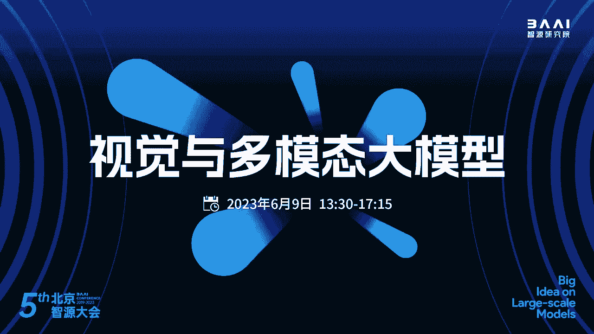
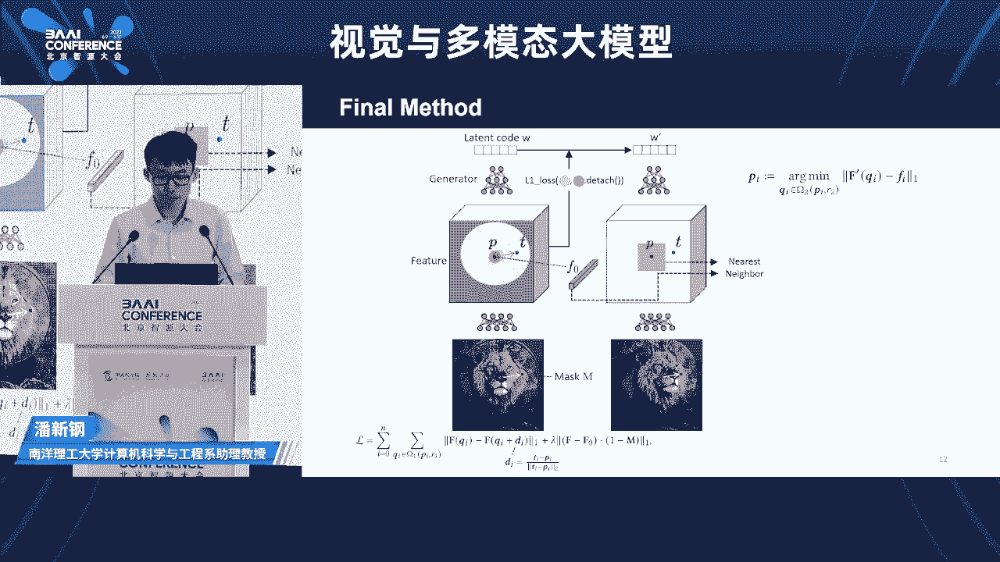
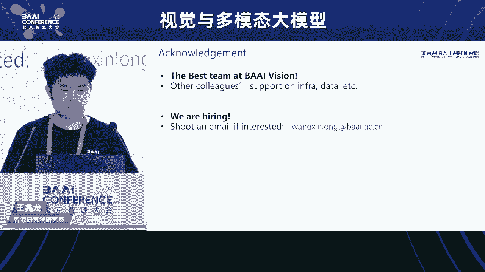
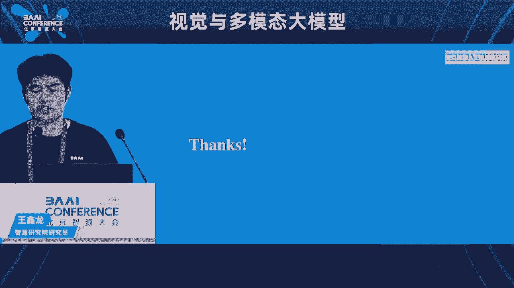
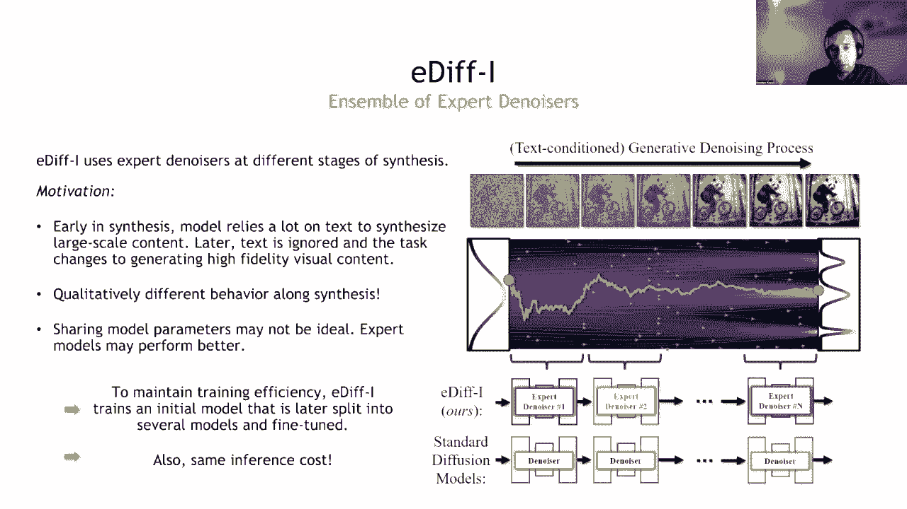
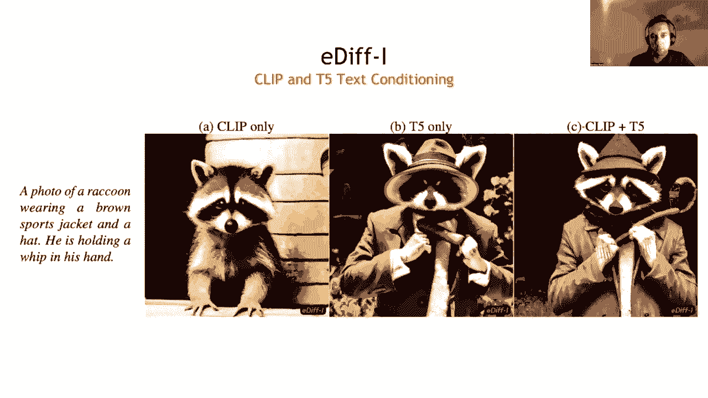
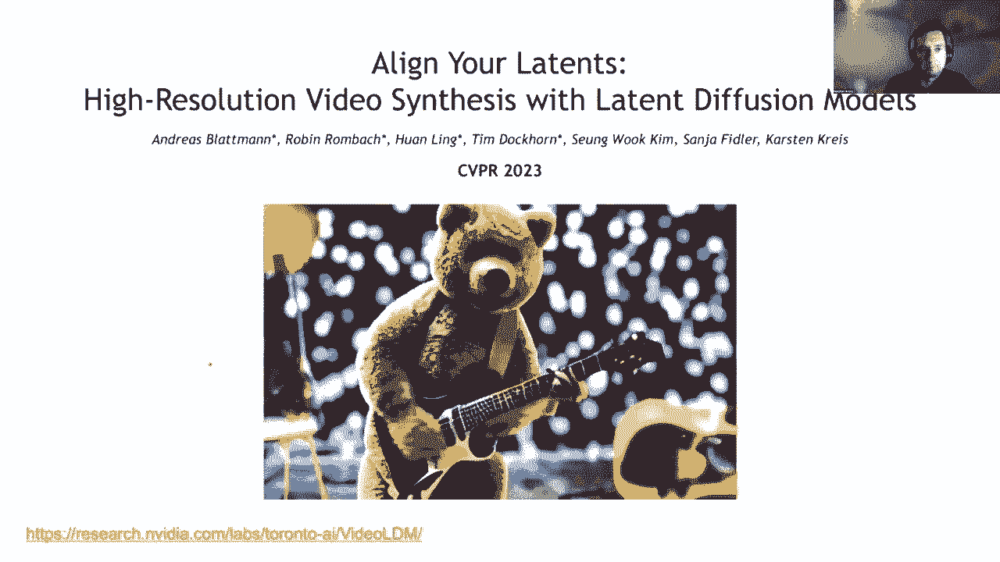
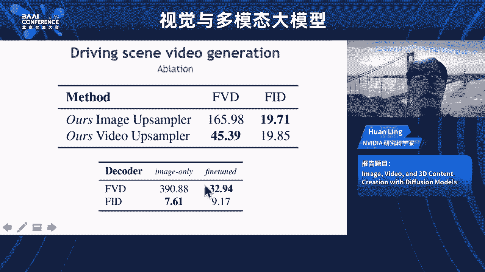

# [2023北京智源大会]视觉与多模态大模型 - P1：[2023智源]视觉与多模态大模型 - Mercurialzs - BV1WN411k7T4

那个欢迎各位呃来到我们今天下午的这个视觉与动模态大模型论坛。然后我们今天这个论坛呢一共有4个报告，四个报告。然后首先第一个报告呢是来自呃新加坡南阳理工大学的潘新刚教授，然后在报告开之前。

我先对潘教授做一个简单介绍。那个新刚呢它是隶属于它的研究方向是生成是人工智能和神经渲染主要工作包括有dep等在加入南阳理工之前的话，它是曾经是这个马克思普兰克计算机科学研究所教组的博士或研究。

他在香港中文大学获得士学位，是从这个小欧教授并在清华大学获得学士学位他今天带来的报告也是目前特别火的一个工作啊，然后叫大家欢迎新刚。谢谢主持人的介绍啊，各位来宾老师的同学们，大家好。

很高兴在这里和大家分享我们呃近期的工作drag yourgan interactive point based manipulation on the geneative image manifold呃。

也就是拖拽你的gan在生成图像流行上实现基于关键点的图像编辑。😊，呃，那么我是来自南阳理工大学的潘新刚呃，这个工作也是和马普索MIT兵大谷歌的合作者共同完成的。好，那这里我们关注的问题是图像编辑。

图像编辑在计算机视觉和图形学中都是一个呃很经典的问题了。那么近年来，由于生成模型的发展，呃，有一系列的图像编辑的方法被提出。例如呃基于监督学习的算法。如果用户呃标注了标签的话，那么根据标签。

我们可以将图像像指定的呃图呃属性的方向编辑。其次啊有基于语意图的编辑，那么用户可以通过重新绘制语意图来实现对图像轮廓的编辑。以及基于人体鲜艳的编辑。

那么通过一个dance pose或者skeleton作为输入，呃，可以生成一个人的不同的姿态。啊，近期由于扩散模型，还有大语言模型的发展，基于文字的编辑逐渐成为了主流。呃，那么这些。编辑的方法啊。

他们在特定任务上都取得了非常大的进展。但是当我们在生成一个图片的时候，或者说编辑一个图片的时候，我们不仅希望编辑它的语义，它的内容。我们很多时候其实用户需要对它的空间属性进行编辑。

例如这个图片的轮轮廓、不同物体的位置、物体的姿态、朝向、物体的大小等等。那么对于空间属性的编辑，这些方法都受到有一不同程度的局限性。那么他们没有办法兼顾呃灵活性、准确性以及通用性。

例如如果基于语意图编辑的话，如果我想对其中人的姿态或者说车的朝向进行一个变化，那就意味着呃用户需要重新绘制这个语意图。那么不是这不是一件非常直观和和容易的事情。

再例如基于人的编辑没有办法拓展到呃其他类别的物体。然后基于文字的编辑虽然强大，但是它对于空间属性的精确编辑呃，仍然不是特别方便。比如说这只猫，如果我希望它的头像向左偏移10个像素的位置。

那么基于文字的模型呃，不太方便做到这一点。所以怎样的一个对空间属性的编辑是呃我们希望实现的呢？那么如果我们观察人与物理世界的交互的话，如果一个桌子你希望去改变它的空间属性。

那最直接的就是你直接去移动茶杯的位置或者移动物体的位置。那么我们和手机交互也是我们直接通过手指去拖拽手机。那么另一个通过这种直接交互的方式来实现呃图像编辑的一个例子就是皮影戏。那么在皮影戏中。

操纵者对于呃。这个图像中的物体是有完全的控制权的。你只要去指定它的关键点移动到哪个位置。那么根据这个物体本身的结构，它就会发生相应的动作。那么我们有没有可能像控制皮影器这样去控制图片呢？呃。

相关的一个一些应用的话，一个是photoshop中的液化功能，它也可以让用户实现一些拖拽的编辑。但是可以看到，这里它的拖拽只是一些简单的2D形变，并不考虑物体本身的结构，并且它没有办法生成新的内容。

没有办法将被遮挡的部分生成出来，或者将将嘴巴张开。那么呃类似的基于拖拽的编辑，其实在图形学学中有个经典的问题，就是sha deform或者说geometry processing。

那么这里展示的是一个经典的方法，as rigid as possible shape manipulation啊，它同它是把物体网格化，然后假设这个物体具有一致的钢度，然后来实现形变。

那么可以看到这种方法，它同样假设物体有一致的高度，那就不符合物体本身的结构了。因为很多时候物体是有骨架的，以及它仍然没有办法生成新的内容。那么理想情况下，我们希望这样的编辑符合物体物体的结构。

并且能够呃想象出被遮挡的内容，怎样可以做到这一点呢？那么能够对物体写结构有呃有感知力，并且能够产生新内容的模型，自然就是生成模型。

那么在呃之前一个经典的生成模型就是对抗生成网络genative aial aversial networks或者说干。那么在训练完成后，干做的事情其实很简洁。

它是将一个符合高斯分布的呃512维的影像量映射到一个高维的图片。那么通过对影像量进行一些扰动或者变化，就可以实现对图像中内容的变化。那么。呃，在这个工作中，我们想做的事情就是将这种拖拽式的编辑。基于。

基于干来实现。那么对于一个gan所生成的图像，我们希望用户只要指定关键点的移动，我们就可以让图图片中的内容发生对应的变化。那么为了实现这种效果。

一个核心的问题就是我们如何去改变干的影像量来实现所需要的这种基于关键点的变化。那么在介绍方法前呃，我们可以简单看一下最终所呈现的效果。那么用户只需要指定红色抓取点和蓝色目标点。

算法就会将抓取点朝目标点移动，实现最后自比较自然的生成效果。那么可以看到这个变化是符合物体自身的结构，并且可以呃想象出被遮挡部分的内容的。那么为了实现这一点，我们设计了一个迭代式的算法框架。

对于呃这里展示的是一个干的生成器，将影像量W映射成为一张图片。那么这里是一个失子的图片，然后用户只需要输入红色的抓取点和蓝色的目标点。那么为了将红色抓取点移动向蓝色目标点，我们需要给它施加一个力。

将它朝蓝点推。那么这样一个力就可以呃formte成一个motion supervision loss，也就是运动监督损失函数。那么通过这样的运动监督损失函数，将红点推向蓝点。

这个损失函数用来优化干的影像量W。在优化一步后，我们得到了一个新的影像量。呃，WE撇那么新的影像量会产生一个新的图片。那么这个新的图片已经按照我们推动关键点的方式去移动了一下。那么在它移动之后。

其实我们还暂时不知道它移动到了哪里。所以下一步我们需要做点追踪，也就是去更新红色的抓取点的位置，让它跟随图像一起移动。比如说这里这个红点，最开始是在鼻上面的红点在鼻子的位置。

那我应该要让它一直跟随着鼻子的位置一起走。只有这样最终才能准确的将它移动到蓝点的位置。那么在这之后，我们再呃重复以上的步骤进行运动监督以及点跟踪。直到最终啊所有的抓取点都移动到了它对应的目标点。

那么为了那么接下来我们就介绍这其中的两个关键的子问题，一个是运动监督，一个是点追踪。那么其实在设计最终的方法之前，我们进行了一些呃不一样的初步的探索。那么我们最初的想法呃，其实和最终的实现方式不太一样。

最初为了实现对运动的监督，我们想到的是使用光流模型。因为光流是最直观的对于运动的提取。那么我们的做法是这样，对于一个干索生成的图片，我们先复制这张图片作为一个参考图。那么将这两张图片啊。

另外我们还有这个用户的输入的关键点，将两张图片送给光流模型去预测两张图片之间的光流。那么由于呃这里两张图片是一样的，那么它的光流自然就是零了。那为了实现对关键点的运动的驱动。

我们其实目标是让它这个关键点对应位置的光流不是零，所以我们就用目标的光流去监监督这个呃关键点对应位置的光流。比如说我希望它是朝左移动。那么它理应输出的光流应该是-10。

所以我们把负10作为呃这个ground truth去监督呃光流所预测的结果。那么这样就得到一个损呃运动监督损失函数。我们用它去优化干的影像量。那么这种方法是可行的。通过优化。

我们确实可以让呃光流所输出的结果符合我们的预期。也就是说关键点的位置朝左移动了一点。那么但是呃这样做的一个问题是我们所用到的光流模型啊，是一个经典的模型叫raft。那么它是一个迭代计算的模型。

计算开销比较大。如果说我们在编辑的过程中一直使用使用这样一个光流模型的话，会大大降低运算运算的效率。那么我们作为一个交互式编辑的方法，希望它能够给用户及时的反馈，所以我们在想能不能让速度更快一点。

那我们啊大致的想法是，这里之所以要用到光流模型，是因为我为了驱动运动，需要提取出对图像空间位置敏感的特征。那么对于干来说，它在生成一张图片的过程中。它生成的不仅仅是这一张图片。

还有在这生成这个图片过程中，这个生成器内部的一系列特征。那么之前的一些方法其实分析过干它的中间特征，其实对于空间位置有很强的呃判别力，或者说很敏感。那么一些算法展示了。

它可以用来做feel short segmentation。但是其实我们这里想说的是它和嗯图像内容的dance correspondence密集对应关系有很强的耦耦合性。因此。

运动监督可以直接基于干的特征来实现。那么这里介绍我们最终的方法，其实非常简洁。为了那么这里这个方块就是干生成图像过程中的特征了。为了将红点移向蓝点。

我们的想法是观察这个红点附近的一个小范围的这个patch，有这个小的红色的圆，为了将它移到蓝点，我们希望它啊先走一小步，走到这个蓝色的patch的位置，因为这个蓝色的小小圆圈的位置。

那么这就可以fote成一个简单的lo。也就是说我去优化这个蓝色位置的这个feature，让它的值接近红色feature的值。也就以以红色feature为ground truth来优化蓝色feature。

那么当蓝色位置的数值变成红色位置的时候，其实就是红色的这个圈圈移动到了蓝色圈圈的位置。那么呃这里要注意的是为了使这种拖拽是单向的，所以我们需要将红色圈圈呃从这个呃反向传播的计算图中分离出来。

也就是一个detaach的操作。那么这样的呃运动监督的损失函数可以用来优化影像量。其实这里我们还让用户可以选择性的输入一个mask。因为用户在编辑图片的时候，可能有一些区域是他想要动的。

有一些区域他希望保持不动。比如说背景的部分。那这里这个图片中可以看到一个白色的呃圆圈，这个就是用户指定的可动区域。那么为了限制背景区域不动，我们在设计了一个呃在特征空间的重建loss。

也就是这个特征中的阴影部分，让他与最初的特征保持一致。好，那通过这两个los进行呃优化之后，我们得到了一个新的影像量。新的影像量生成了新的图片和新的特征。

那么下一步问题就是如何更新抓取点的位置来跟踪图像的内容。嗯，关于图。关键点的跟踪其实也有一些相关的研究了。那么我们其实之前也尝试了一些不一样的方法，并且有一些专门做关键点跟踪的方法。但是在这个工作中。

其实我们发现啊并不需要引入额外的呃神经网络。因为干 feature就像刚才提到的，它对于空间位置有很强的敏感性。因此关键点跟踪也可以。直观的通过。

feature matching这个特征匹配的方式来实现。具体来说，在这个新的需求中，我们去关注这个红与红点附近的一小块范围，就这个红色方框的范围。我们在其中去寻找那个和最初的抓取点。

所对应的特征值最近的那一个呃像素的位置。

也就是一个 nearest neighbor search。那么这样的找到的一个关键点，就是对应于最初的那个关键点所对应的语义的那个点。也就是说它实现了一个跟踪的功能。那么最初的关键点是在鼻子上的。

那么通过feature matching找到的关键点也会是在这个狮子的鼻子上。所以。呃，通过这两个简单的设计，我们实现了运动监督和点跟踪。那么再结合前面所介绍的迭代式的算法框架，呃。

dr gun算法就实现了。那么通过这种交互的方式，我们可以对呃物体的很多不同的空间属性进行编辑。例如张开嘴或者将耳朵提起来。或者让这个狗坐下来。或者让他的头呃转一下。或者重新设计一辆车子的外形。

可能呃汽车设计者会汽车外形设计者会喜欢这个功能。或者啊编辑各种各样的其他的动物，或者让一个猫只针一只眼睛。那么这是在训练数据之外的一种呃结果。或者对人脸的编辑，那么瘦脸或者改变头发都可以比较直观的实现。

或者对模特的衣服的编辑。

或者是呃任何奇怪的物体，比如微生物。对风景的编辑，以及让太阳升起来等等。那么我们做的过程中，其实出现了一个呃同期的工作叫user controltrollable LT。

那么或者user controlrollable latent transformer。那么他所呃实现的目标其实非常相似。但是这里呃它有两个重要的局限，一个是它对于呃位置的精确控制，其实其实不够精确。

因为它只能粗略的移动物体，并没有办法把关键点精确的移动到目标点的位置。其次是它对于多点的支持呃，并不好。呃，另外他也没有办法去只编辑图片的一部分区域，要保持背景不变。

那么我们的方法可以呃更好的保持背景不变，以及实现更精确的控制。这里展示。这里展示了更多对比。那么呃第一行是用呃输入的图片，还有用户的编辑。那么下面两行是user controltl要记合我们方法的结果。

那么从其实从第一个例子，码的例子就可以看出，他们对于多点的编辑并不好。那么我们方法可以对对于马尾啊、腿还有头都移动到对应的位置。啊，我们方法同样可以编辑更加密集的关键点。

比如说对于人脸的呃比较密集的关键关键点的编辑。这里啊每一个例子里面左边两个展示的是输入图片和目标图片。那么这里的目的就是把输入图片。这个人脸的关键点变呃挪动到和目标图片的关键点保持一致。

所以可以看到这个输输入图的表情，还有脸的轮廓都呃变成了和目标点差不多。那么这里我们进行了一个定量实验。啊。我们计算我们的方法所编辑达到的目标点的位置，以及呃目标图像本身的目标点的位置之间的误差。

那么可以看到我们方法的误差显著啊优于呃基准的方法，U controltLT我们也和其他的点跟踪的方法进行了对比。那么可以看到呃，基于raft的跟踪，以及基于peeps的跟踪方法啊，都是弱于我们的方法。

另外我们进一步进行了一个呃匹配图像重建的定量实验。那么对于一个呃干所生成的图片，A我们对于影像量进行扰动，得到随机得到另一个图片B那么B相比较A发生了一点变化。我们计算它们之间的光流。

在光流图上抽取32个吸疏的点，然后将图A和这个稀疏的光流作为呃我们的point base manipulation方法的输入。那么这这里可以用来测试我们的方法或者啊其他的方法，得到一个对B的估计。

那么这样的话，我们通过比较对B的被对B图的估计以及真实的壁图，就可以得到一个误差。这个误差可以用于衡量方法的好坏。那么同样我们的方法呃也是比其他的方法取得了明显的提升。那么这里对比了点跟踪的结果。嗯。

可以看到左边是输入的图片，还有用户的编辑。那么右边展示了编辑过程中呃，点跟踪的过程。第一列展示了我们的方法。那可以看到这个红点抓取点是一直在狮子的呃鼻子上方一点点的位置。但是其他的点跟踪的方法。

他们可能在编辑过程中啊出呃逐渐出现了一些偏移。那么一旦出现了偏移，它最终就没有办法准确的将呃抓取点移动到目标点的位置。所以对于生成模型，我们也提供了一种进行点跟踪的一个新的思路。那么对于以上展示的结果。

其实基本上都是干所生成的这个合成的图片的编辑。但是在实际应用中，其实我们关注的是对真实图片的编辑。那用干编辑真实图片，就需要进行一个额外的操作，也就是干重建。

我们去优化这个干的影像量来实现对一个用户输入的图片的重建。这样就可以进行后续的编辑。那这里展示的是一个人脸的编辑效果。可以改变表情朝向或者头发。再多一点。或者让眼睛睁大一点。诸如此类。

那么这里展示了更多真实图片编辑的结果。那么。呃，这里基于关键点拖拽的编辑很多时候是存在多解的。为了让狗实现头朝右移动一点，可以有不同的方式，狗可以整体移动，狗可以身体旋转，狗可以只改变头。

那么在这个算法中呃，如果不施加额外的限制，它会寻找实现这种目标最近的解。那么在这里呃右侧的结果就是狗的一个旋转的效果。那么呃为了减少这种奇异，用户也可以呃进行一些额外的限制。

比如输入呃这个mask野马来指定可动的区域，这样就可以只让狗的头的部分动。啊，此外我们也展示了一些超出数据级范围之外的一些编辑效果。比如说让这个狮子张开一个血盆大口，或者让车的轮胎呃大到夸张。

那么也可以实现一些符合预期的效果。但是与之伴随的也会带来一些畸变等问题。那么对于干来说，它的影空间有两种选择，两种不同的选择，一种是W，一种是W plus。呃，W加，那么W加它的空间会更大一些。

也就是说图像的编辑会允许嗯更更多的灵活性。那么在W加中间编辑的话，可以更好的实现一些超出训练数据之外的效果。例如说这种睁一只眼闭一只眼的情况。那么最后呃来分析一下方法的方法的局限性吧。

那么前面提了一些超出呃数据分呃训练数据分布之外的一些编辑。那么当这种编辑当这种超出的范围过大的时候，会很容易产生一些呃不失真的效果，比如说这里这个人体的呃模型是在模特的数据上训练的。

那么它很少会有一些夸张的动作，比如说手或者腿张的非常大。那么如果我们进行这种编辑的话，会容易产生一些畸变或者啊失真模糊。此外，对关键点的选取也有一点讲究。那么呃它和这个关键点的纹理的丰富度有关。

如果说是在非常平滑的部分选的关键点，例如这个车的车门的位置的话，那么在拖动的过程中，它会更容易发生一些偏移，就跟呃点跟踪的偏移。但是如果选在呃纹理丰富的位置，比如说车窗，那么它就可以更好的实现跟踪。

但是我觉得最重要的一个局限性呃，其实是对真实物体的编辑。呃，这也是可能需要澄清的一点吧。因为可能之前这个方法的视频在网上流传的时候，大家可能觉得类似的效果，它输入任意图片就可以做到了。

但是目前还不是这样。因为嗯我们所展示的真实图片编辑更多的是有一个明确的主体物体，并且背景不是那么的复杂。但是如果你是这样的一个有非常多物体或者背景非常复杂的图片的话，干重建就很难保证质量。

那么编辑的质量也会大大大降低，这也是后续研究的一个重要的拓展方向。那么最后总结一下，我们提出了一种能够像控制皮影器那样去控制图片的方法。那么通过关键点的目标位置的指定，就可以实现对物体空间属性的编辑。

那么为了实现这一点，我们提出了两个模块运动监督和点跟踪。那么他们都是基于干本身对空间属性具有判别力的特征而实现的。那么最后可能大家会想呃，现在基于文字的编辑这么火，那么这种拖拽式的编辑它的地位怎样？

它是呃哪一种编辑会成为主流呢？那其实我觉得这两者是互相互补的。因为呃。你通过文字很难直观的控制这些空间属性，那么空间属性也没有办法做文字能做的一些对内容的编辑。

所以我觉得最终的AI生成图片的框架应该是将文字，还有对这种对空间拖拽的编辑都囊括在其中的一个系统。那么所以呃往后的话，在这个方向还有很多可以拓展的呃方向。所以呃如果说有同学对这个方向感兴趣的话。

其实我们最近也在招生呃，欢迎大家来申请。好的，我的介绍就到这里呃，欢迎大家提问。😊，哎，好。好。是的。呃，好问题。那首先呃这个问题其实被问到很多次了。首先因为这个拖拽式编辑的问题之前机研究非常少。

但是当你发现这个问题的时候，它非常符符合直觉非常重要。所以我觉得路是一步一步走的，这是为什么我们最开始选择了基于干来进行研究。因为干它的这种呃引空它的引空间对于图像内容容易编辑的这种属性。

使得干会作为这个问题的一个很好的开始的研究对象。但是呃显然diffusion的上限是更高的。所以下一步就是将这个方法迁移到diffusion上。那由于diffusion和干它在生成图像的嗯机制非常不同。

所以你没有办法将d干的方法通过简单直接的迁移，就在diffusion上实现。但是其中的思一些思想可能是可以借鉴的。所以呃我认为这件事情是可行的，但是不。直接需要学者们接下来的努力，谢谢。はい。好呃。

其实就像你说的，把嘴巴张大，它其实有两种不同的解法，一个解法是张开嘴。另一个解法是放大这个图像，其实你也可以实现一个张大效果。这就是我刚才说的编辑的奇异性问题。

因为你是很多时候是有多解的那呃首先第一是这个模型会按照最容易实现这种编辑效果的方式来来达到这个目的。那么最容易的方呃实现这个效果的方式是取决于什么呢？其实很多时候取决于数据的分布。

因为可能数据里面它张大嘴的情况比它呃这个脸靠镜头非常近的情况会多一些。那它就会选择这种方法去解。但如果你想进一步限制它是通过张大嘴，而不是通过放大的方式来实现的话，你可以引入更多约束。

比如说你让它身体的部分呃固定住或者背景的部分固定住。那那这时候它就不会通过放大的方式会实来实现，而是通过把嘴张开的方式实现。对。大体量。你好，谢谢。就是干的训练往往来说都是我们知道是不太稳定的。

然后在这种情况下，我们体量这么大，还有模型这么大的情况下，我们有没有对呃它的不稳定性训练的问题做一些优化嘛？😊，呃，我觉得呃近期应该有一些工作去研究这个问题了。就是呃朱军燕他们团队。

包括呃其其他的团队研究了一些基于语言模型的比较大的干，在不很多类别上的物体训练。所以他们对于稳定的训练提出了一些新的改良。我觉得呃这个这个是另一个问题了。哎，好，行，谢谢你。嗯。上时。

就在mus和ma边界上的东西，很多时候会产生一些比较违和的一个情况。然我想一下这个工作里面会有没有出现过这个情况呢？或者说在那个狮子张口的时候，有没有可能在这个区域出现一些让人觉得比较奇怪的噪点呢？

就是在边界的柔和方面的问题呃。你是说mus的边界处可能出现一些不自然的过渡吗？对对对，因为你那个做那个lo不是针对那个masask的区间做了一个那个lo嘛边界和边界外可能会有一些不柔和的一个过度。

有没有可能会出现这样的情况呢？呃，在我们的实验中没有看到太多这种情况。因为对于干模型来说，图片的整体都是由一个呃compact的影像量来控制的。所以它会倾向于生成整体比较和谐的结果。

那我觉得这里其实呃更重要的一个问题反而是编辑的过程中，m之外的背景也会发生一点小的改变。对那呃我觉得这是干模型设计上的一个呃问题了。你可以通过其他的方式去让背景固定的呃更加固定更不容更不容易变化。

比如说通过一些呃特征融合的方式来实现。但可能。这是一个吹道吧，有特征融合，可能更容易引入一些不自然的过渡。嗯，好，还有一个问题，就是我之前在做diffusion引空间的一个操作的时候。

它很有可能会出现一些奇怪的噪声。因为它这个影空间可能之前训练的时候没有见过。然后您刚才也提到就是在呃数据集之外，可能会出现一个比较明显噪声。那就是呃就是在正常的情况下，有没有可能会出现一些比较奇怪的。

而且啊就是那个嗯棋盘状这样噪声呢？就有可能会出现这样的一个情况啊，对于干来说，我们没有观察到很多棋盘状的问题。对。呃，这这也是可能干相对于diffusion做这一个任务的优越性体现。呃。

那你可以这么说吧。对，谢谢谢谢是的。对，因为因为diffusion它呃它其实还是一个tra off。虽然说它不容易受到这种aracts的影响，但是它的性能比diffusion还是差了一些。潘老师好，呃。

就是这工作非常有意思，就是我们看到这边工作主要的内容是可以在图像上通过关键点的拖拽来改变图像的外形。那我们有没有考虑除了在二维平面上，就是在三维三维空间上做一些拖拽。比如说我们对图像获得它的深度信息。

那么我拖在这个点的时候，可以不不局限在这个平平面上，我可以在这个图像的纵向这组方向去拖动它有做过这方面的一些可视化的结果嘛？呃，对这是一个很好的点。那么首先我们的 baselineline方法。

 controltT他在算法设计的时候，其实引入了这样的机制，纵向的深度的编辑，它可以放大或者缩小。那么其次网上已经有把干和3D干结合的一些第三方的代码了。那么对它可以进行对3D形状进行一些编辑。

对好的，谢谢谢潘老师。啊，因为时间问题我们就差不多了。然后的话就是我们一会所有这个嘉宾讲完之后，我们还会有一个拍al环节。呃，我们会有些议题讨论，然后当时候也会邀请一些同学来老师或者来来提问，好吧。

行呃谢谢这个新干的报告，非常我在下面听也是非常的酷炫啊非常酷炫。然后讲的也非常的清晰。然后我们下一个报告呢是一个线上的报告。

然后是来自多伦多大学的高俊高俊呢他是他是多伦多大学的D然后以的 scientist他的研究方向呢是三维计算三维计算机视觉以及图形学主要关注的是继续学习在 skill上的生成方向的一个应用。

它的代表工作有很多有这个 magicic等等。然后其中很多已经被集在的产品当中包icas他也是今年223的领域主席然后这相信高高已经在线上了，对吧？😊，OK。好，那我们就欢迎高俊的报告。

他的报告题目是mine learningning for3D content creation。😊，OK行。呃，谢谢各位老师，然后也欢迎大家来听我的报告。然后因为不好意思，因为我现在人在家拿大。

所以就只能在远程上给大家给talk，所以非常抱歉。然后如果大家有什么问题呢，都欢迎大家在那个给完talk之后，或者是给talk中间给呃提问。😊，🎼然后今天我要报告的。

今天因为今天的这个论坛主要是探究的事情是视觉与多模多模态大模型。那么我就跟大家来介绍一下大模型在这种三维内容生成当中的一些应用场景，以及我们group所做的一些相关的工作嗯。

首先第一个问题我们需要去回答的事情是为什么我们要做一个三维世界上的一个model。在我看来一个最简单的一个呃回答，就是说我们人类生活在一个三维的世界，而创造一个三维的数三维的数字世界。

或者说一个三维的虚拟世界，不但可以帮助我们更好的去理解这个世界，同时呢也可以帮助我们去解决很多现实生生活当中所无法解决的问题。😊，在一个三维的虚拟世界当中呢，我们可以进行交流或者互动。

即便说在现实生活当中，比如说人与人之间相隔千里，比如说像现在我们可能是只能通过zom去密行。但如果说有一个虚拟世界，我们就可以不用通过zoom了。😊，创建虚拟世界，同时能够带来很多的其他的应用场景。

比如说是robotics或者是selfdriving，我们经常很能很难能够在现实生活当中去训练一个机器人或者是无人车，并且现实生活当中的longtail distribution。

很难通过去呃采集数据去去capture。而创建一个三维的虚拟世界，可以帮助我们搭建一个更好的一个simulator，从而让我们训练呃机器人或者是无人车，尤其是在一些跟安全相关的一些重要的场景上面。

在其他应用场景当中呢，创建三维虚拟世界也经过了几个世纪的发展。比如说是电影，在一个虚拟世界当中，创作人呢可以去创作很多他们想创建，但是现实生生活中又很难去创建的场景。比如说像我们看的流浪地球里面。

电影里面月球的场景。😊，在游戏里面，3D的虚拟世界也可以帮助大家去在游戏当中进行娱乐。同时呢在呃就在这个星期苹果所发布的vision pro。

也可以通过虚拟现实或者是增强现实来帮助人们进行更好的工作啊以及交流。那么在所有的这些应用场景里面，其中最重要的一个component在我们看来是一个三维的内容的生成。具体来讲的话。

如果说我们需要去搭建一个大范围的一个，比如说三维的虚拟场景，比如说是无人车的虚拟场景。那么呢我我们就需要有很多我们在现实生活当中所能够看到的行人啊、房子啊、车子啊、花草树木等等等等不同的物种。

这更具体来讲的话，我们其实希望的三维内容生成在三个方面进行s up。这首先第一个方面需要做的s up呢是我们希望在希望能够生成大量的不同种的物体。比如说是像呃像大家现在在的北京呃。

在北京的早早高峰的时候，马路上有成千上万辆不同的车，他们还leve而言都是车，但是细节上每在细节上，每辆车又有它自己的不同。第二个点的话是多样性。我们希望能够生成不一样的物呃物体。比如说是动物。

这个地球上有成千上万种不同的动物的物种。而我们除了有动物之外，还有植物，还有很多我们人类自己所创造出来的物体。第三个需要呃sscale up的事情呢是质量。就是说我我们期待有能够有一个高质量的生成。

这里面高质量既包括说是我们需要有高质量的物体的几何信息以及高质量的纹理信息。但同时相反，咱们来看一看现在工业界里面大家常见的一个三维内容创建是一个什么样的一个工作流程。

然后这个视频呢其实就是一个非常简单的一个工作流程的一个一个一个视频。我们可以发现，就是说在现在的这样的一个工业界里面创作三维内创作一个三维的内容，是需要消耗大量的能力物理去做这么一件事的。

而且它并不是每个人都能做这件事。它需要你对比如说你对这个软件的理解呀，并且你自己得要有一些这种艺术建模的能力。而这个并不是每个人都能够拥有的一些能力。😊，因此。

如果说我我们仅仅靠人工去进行三维内容创业啊，是很难去scalell up。同时呢咱们也再看一看，比如说最近这几年机器学习的发展。

尤其我们可以发现机器学习在language以及ttoing image上具有具有非常迅猛的发展。比如说language大家都听说知道很多，不是都用过的这PPT或者是啊GPT4。然后呢。

在二维图片生成领域，我们同时也看到了，像imagegen啊，da two啊，stable diffusion mid journey等等等等这这样的工作。

他们其实就能够允许人们去通过一些text prompts呀，或者是一些sketch啊mask等等等等的这些input去生成非常高质量的2D的图片。

但是咱们也同样看看这种机器学习在三维内容创建当中的一些进展的话，然后呢这个是这个这个结果呢是啊fusion。如果熟悉三维视视觉的话，其实会知道fuion其实是最近这一年非常啊非常颠覆性的一个一个发展。

而且它也能够拿到了今年IK的。我们可以发现它的效果其实已经很不错了。比如说像在左边大家看到的这个结果。但是呢如果说咱们把它拉近一点。咱们看看它的所能够生成的具体的细节。我们就可以发现。

在细节上就是现在三维内容生成的这种performance还是远不如前面所给大家展示的image的图片生成或者是language上的GP。😊，啊。

performance然后这里面主要呃差的两个点就是geome和tex qualityality并不是特别好。因此呢我自己的呃呃PD期间的主要工作其实是探讨的问题。

就是说我们如何去利用机器学习来进行帮助我们去更好的生成三维的呃内容。并且我们希望能够生成高质量的呃三维的ship。他希望我我我们期待有高质量的几何信息，平时同时呢也能够尽可能的有低帧的纹理信息。

比如说比如说像这个sdes左边所展示的呃，所有的物体都是我们AI modelel所生成的，啊，并不是人工去创建的一个一个三维的model。

最后呢我们也希望我们所能我们所生成的三维的模型能够被直接运用到一些graphics tool里面，就是一些图形学的软件里面，比如说是bler呀、玛a等等等等。

因为这样子就可以直接帮助到大家直接去进行创作。OK这个这个问题是一个很难的问题，就就是用机器学习来做三维内容生成。那么我们该怎么样去探索这么一个问题呢？我们的思路是这样子的。

在我们太去到我们去探索这个问题之前，咱们先呃呃zoom out一下，就是就是从从一个第三者的角度上来而言来看一下这个这个三维内容生成，大的它的拍判是什么。因为当我们理解的这个拍 plan。

他可以帮助我们去design一些，或者是他就会告诉我们到底需要去解决哪些问题。一个通常来讲的话，一个三维内容生成的排版大概是这样子的。我们可以有一些input。

这个input呢可以是啊从从一个prior distribution里面sble出来的一个lant code。比如说你是一个生成式模型。

它可以是一个它也可以是一个single image或者是m view image。比如说你要做single view three contract或者是m view three contract。

然后呢，你也可以是一个text pump。比如说你想做什么text to threeD generation， whatever。然后呢，我们有一个mine learning model。

这个machine learning model它会incode这个啊大家所提供的这个input，然后呢会decode出来一些三维的 shape，它可以是什么表示f式方式，它可以是mesh。

可以是point cloud，也可以是implicit functionwhat。然后呢，我们我们会把这种生存的结果运到运用到一些application里面去。

比如说像simulation啊、nobotics啊或者是游戏当中。OK那么我们来看一下这样的一个一个piline的话，它其实告诉我们有这么几个比较大的一个挑战。首先第一个挑战在我们看来是一个三维的表示。

具体来讲，它其实就是说我们该如何去表示我们所生成出来的这样的一个三维的物体。为什么它是一个一个一个比较难的问题呢？是因为它不但影响着我们如何去设计我我们的这个网络结构该长成什么样子。

同时呢它也影响着我们如何去把我们生成的结果运用到一些下游的场景当中。因此，一个比较好的三维表示就应该首先呢它得非常适合机器学习。因为我们我我我们想用机器学习去生成这样的一个三维的物体。

然后第二点呢是它得非常它同时也得非常在适合我我们在下游的任务当中去进行一些应用。因为这样子的话我我们的输出就可以直接被放到一些啊下游场景里面去了。同时呢它也需要能够支持不不同的topology。

因为每个sha，它tyology可能不一样，然后呢它也希待能够支持比如tture和以及materis。因为呢我们为什么想做这两点呢？因为我我们希望我们生成的ship是能够有高质量的sha。

如果说你的tology只是一个fix topology，那么你的你的质量就很难去上升上去了。😊，OK这个是在一个三维表示上，我们需要达到的这么一个一个要求。

同时呢另外一个挑战是在我们看来是在一个在在算法层面。首先这面包括这么几个问题。首先呢我们就应该去思考如何去搭建一个三维生成模型，并且能够呃高效的训练它，使得它能够生成高质量三维的内容。

这是我们需要思考的第一个问题。同时呢第二个问题是说，我们来仔细的想一想，现在其实苏列有一个很大很大的一个问题是说所以data非常非常少。我们可能比如说像shanet它就只有5万个ship。

然后最新released它已经很大了。它但它只有80万万个。但是相比于2D的da。比如说像li有5个 billionion，就是50亿个50亿个data。这其实是有一个是上千倍的数量级之间的一个差别。

那么其实我我们也应该思考一个问题。就是说当我们在训练三维生成模型，尤其是我们需要s up的时候，我们该如何去运用到那些呃更加常见的2D的data来帮助我们去逃出一个在三维生成模型里这种数据的一个约束。

😊，然后第三个问题其实跟呃潘老师之前讲的也有点关系。就是说当我们有了一个三维生成模型之后，我们该如何去控制它，我们该如何去让这个三维生成模型来生成我们自己真正想要的一个啊呃三维的内容。

然后我自己PHD之间的所有的工作基本上都是在cover这两个呃这两个chalenge。然后今天呢由于时间关系，我就给大家主要介绍三篇工作，就比较简略的介绍三篇工作。首先第一篇工作是DMt。

它其实主要解决的是三维表示的问题。然后呢，该 three他所解释它所解决的问题是啊它所回答的问题是我们如何去design，并且train一个呃一个比较eicient的三维生成模型。

然后magic3呢其实想告诉我们是我们如何去leverage一个呃2D的data，帮助我们去生成三维的ship。好，我们先看一个那个呃第一个问题就是3D表三维三维表示的一个问题。在最近这几年当中呢。

基于呃implic方就是引函数表示所引引函数引函数的方式来表示三维的物体，其实呃有很非常非常好的进展。比如说像deep SDF呀， occupancy network呀或者是nerf。

他们非常非常适合继器学习，因为呢他们是在一个三维的呃field里面去肯呃连续的定义了一个场。然后你用一个神经网络去逼近这个场，其实你就会非常容易的去训练这样的一个神经网络去逼近他。因为他没有任何的那种。

比如说像disreet operation，就是那种离散化的操作。然后呢，同时呢它也以表示非常非常复杂的gemetric。比如说像nf里面它可以表示一个非常非常高精度的一个一个卡车。

同时呢它也允许我们做这种几呃topological change。就是说在。在拓扑上的一些改变。比如说我想从一个球变成一个茶壶，它都是可以做的。他非常非常nice。

同时呢咱们也看一看一些呃呃在一些下游的应用场景吧。比如说是像呃实时性软渲染real time render shape information或者是呃物理模拟这些场景里面。在这些场景里面呢。

其实msh其实是被大家所用的非常呃用用的比较广的。原因事情是因为mash其实可以可以给我们带来很多很多的benefi。如果说我们用mash来做一个表示方式的话。这面benefis主要有这么几点。

首先呢match它非常适合去做ring，它le的非常非常快。比如说我如果想给match做reization based render，其实它是这个已经是实时的。

比如说像那个bled的reization based render。如果说你想做retracing base render for match，它也可以做到事时的。比如说像最新的很多GPU。

他们就支持啊real time renderingreal time re tracing。😊，同时呢matash它也方便我们去定义很多在呃在surface上的properties。

比如说是像surface上的BRDF的 propertiesper，这样子你就可以render带 material的 matchsh。比如说我如果换一束光，我我把光改变了之后。

我的matash就会有很多的这种呃呃光影的效果。同时呢在mat上我我们也可以方便去定义很多的类似于normal map啊或者是deformation map等等这样的一个呃呃一个一个一个msh表面的属性。

同时呢mesh也更加intu帮助人们去做editing或者是deformation。比如说像as rigid as possible里面所呃做的那些shape editing啊。

或者是做physcal simulation里面比较常用的neal hooking solid去用一个tuchhi mesh来表示一个三维的呃物体。

但是如果说但是呢一个基于啊new field的表示方法是很难去运用到这项的这就是来自于matsh的这项的这这么多的advantages，就是它的优势。这面的原因事情是这样子的。

当我们想把一个implicit function跟matsh来建立联系的时候，我们其实经常用的一个一个操作。相相信大家经常用用的一个操作是叫做marching cube。

但是呢marinq本身是一个呃marinq本身是一个不可挡的一个操作。因为它里面有很多的呃很多的离离散的操作。这是这就这个不可导。

其实就意味着说如果说我们在这样的一些当streamapplication里面，它有一些lo function，或者说我们觉得这个生成的效果不好。我们从当streamapplication告诉我们说，哎。

你我们生成这个shave在这个角度，它看着不对。那我该怎么back的思路这样的一个ndiable operation到inplace function里面，这个是很难做的。因此呢它就导致了。😊，啊。

这个inplace方案就有这么一些比较大的一些缺点。比如说它很难做relighting，你需要去重新reformulate这些run equation，它也很难做shadow。

它也很难做 editingiting。并且呢大多数它所表示的是一个sttic thing，而并不是一个呃dynamic thing。OK但是但是我们其实就像我最但是我最开始讲的。😊，呃。

inasse方它有很多很多它自己的优势，它其实是很适合机器学习的。那么我们该怎么把ms的优势，以及那个impasse function的优势给它结合到一块呢，并且解决这样的一个nde的问题呢。😊。

我们的一个核心的观点是这样子的，我们需要做的事情是一个diefable isuring的一个哦一个一个操作。这个differable isuring意思是这样子的。

就是我们可以首先有一个implicit function。然后呢我我们得想办法把differable就是可微的把这样一个一个implic function转化成一个呃ex就是一一个显示的matsh。

并且这样一个显示的match，它就是我我们这样的，它就这个显示mat，就是我们implicit function里面所对应的那个isur。😊，因此它就可以带来给我们带来很多很多好处。

首先它的第一个好处就是它可以非常呃非常自洽的嵌入到机器学习里面去。因为它的backband它的backend它的它的内核，它的核心还是一个基于imp function的表示来表示一个三维的。

因此它它就可以很适合的做机器学习。它也可以帮助我们做很多的up啊不同的tology。同时呢它的因为它的生成的这个这个output，它也是一个呃它也是一个m。

那么它就会和很多的这种graphs engine做一个非常好的一个契合。并且呢它也可以允许我们去从一些当stream applicationplication里面去back这个gradient。😊。

然后在这里的话我我就不具体讲我们怎么做一个di。然后感兴趣同学可以去看我们的呃。然后呢在这个地方我我就去给大家呃展示一个我们我们把di的一个一个应用场景吧。就是我把它ffer做一个结合。

这样我们就可以 image面去重建出来三维的ge三维的材质以及writing这个问题本身就是在graphs里面啊探索可能有1来年的一个问题了。然后呢之前呢大家都是基于很多sh或者是像的一些方法。

他们就每一步都是dere。然后每一步之间都不能去。最新呢大家做过很多但呢它 geometry又不是特别的好它可能主要是一个 synthesis但我们其实更期望的事情是如去得到一个。😊。

然后把我们的方法跟这种这种这种这个传统这种这个task结合呢，就是呃用我们的方法去解决传统的这种task其实也非常简单。

就是说我们可以首先有一个new implic function就是一个implicitF之的。我们可以首先通过我们的这种去extract这个implic function所对应的这个这个surface长成什么样子？

当我们有了一个传额mesh，我我们就可以非常容易的把它成一个二维的图片。因为是非常非常简单 matchsh这个相信graphs也研究了呃可能1来年了。然后并且速度会非常非常快。

我们就可以通过deffer把我们的一个三维的mesh成一个D的图片。😊，然后因为这是一个m3 construction task。因此呢我我们就有一个RD上的一个ground truth。

就是说我们有RD我们有呃呃有这个二维图片的cameras，就它的camera pose以及它的二维图到底长什么样子。

我们就直接对比我们所出来的这这个二维图片以及ground truth二维图的这种difference。然后由于这个是是可导的。并且呢我们extract这个三维mesh这个操作也是可导的。

那么我我们就可以从从一个D的lo function backward gradient到我们的3 d implic field。

这样可以帮助我们去优化我们的3 geometry同时呢也可以帮我们去优化它的ri以以及light。然后这个地方呢给大家展示一个一个一个一个小的demo吧。

就是说我们可以呃首先它的input呢就是一些一些二维图片，但我们可以重现出来，像这张视频里面所展示出来的这样的一个三维的sha。然后比较好的事情是什么呢？就是因为我们现在生成的是一个mesh。

那么我我们就可以做很多很多的eding。像这个side里面所展示的，就是我们要去model它的材质，我们要去更改它的材质。

同时呢我我们也可以做的另外一个addding是我们可以做physcal simulation。就是说我像这个地方我们做的是因为我们有它的gemeter。我就可以在上面放一个，比如说别的一个物体。

然后把它自啊自由落体，让它掉下来。然后呢，同时呢，因为我们也因为我们重建出来它的材质以及它的那个它的它的它的lighting。那么我我们我们就可以作为另外一个task，就是relighting。

就是我想换一个环境光去渲染这样的一个object。这些这些东西都是可以做的啊，之所以能够做这就是因为我们的生成的结果是一个mash。ok。好，现在呃OK嗯下一个 slide。然后呢。

现在呢我们有了一个比较好的一个比较适合机器学习的一个三维表示方法。那么接下来我我们想想探索的问题是说，我们该如当我们有了这样一个三维表示。

我们该如何去探索得到一个比较好的衬出来一个比较高效的一个三维的生成模型。然后呢，这个就是呃呃我们的工作gastary。该它的它的他的他的它的核心的呃idea其实非常非常非常简单。如果跟大家讲的话。

其实是就是这么一句话，就可以summarize它。就是说我们在2D的干里面，在2D的这种图片生成。我我们我们我们看到很多非常非常好好好好，它非常成功。那么我们其实应该思考的一个问题是。

我们如何把2D干上的成功，把它带到3D上面去。😊，这个具体来讲的话，2D干上的成功呢，它包括两点。首先第一点是说2D干它花了很多时间去develop该如何去去去约束我我们的2D的discriminator。

并且呢如何什么样并且并且呢也提供了很多这种RD discriminator的这种architect。比如说像t呢，比如说像那个patch等等等等。很多的这种2D上怎么如何去比较efficient。

如何去呃呃不让2D干去exloode的这种方法，他们都研究了非常久。第二个第二个点呢第二个成功的点呢是说RD干呢它也有很多很多二维的生成的generate。

还可以允许我们去有这样的一个capacity去生成阿非常高质量的阿D的图片。而我们就是希望能够把这两点带到3D里面去。首先第一点的话就是如何supervise在2D。那么就像我们前面探讨的呃。

前面给大家展示一下，我们可以很自然的把differ render做一个结合。就是说我们生成了1个3D shape，我们通过differ把生成的sha render成一张2D的图片。

那么我我就可以在2D上去通过2D的2D的dicriminator来supervise。然后因为rander是可导的，那么我就可以把这种supvisionback到我们的随利genration里面去了。

然后jeary在RD呢，它的一其实也用法也非常简单，就是我们有一个tripan base的一个representation。

然后我会在接下来talk里面跟大家继续谈谈什么是tri representationpresent。而我们想做的呢就是把这种differnder以及tri plane和DM type。

就是我们的differable is surfacecing做一个结合。而这种结合的一个一个一个一一个最大出发点是为了 efficiencyfficciency。呃。

为什么我我们这个地方特别强调effficiency呢？是因为。嗯，因为因为我们的supervision永远来源于2D的图片，这意味着如果说我只能run一张非常小的2D图片。假设我我我的2D图片。

它就是呃比如说128乘128的resolution。那么我的training signal就会非常非常w。但是呢如果说我能够非常e成一张非常 image。

比如说是啊11000乘1000就1024乘1101024的这种to the image。那么呢我我我我就可以有一个更好的这种supervision帮助我们去生成高质量的三维的。

而呃然后这个地方我我们我们就需要呃比较注意一点是我们如何去能够efficientlyre出来一张非常car的2D的图片。我们来看一看我们的一个拍拍吧。

拍判上我们首先有两个prior distribution，一个是一个是gemetric的prior distribution，另外一个是texture prior distribution。

它每一个呢都是一个高。我们首先有一个随意 generator，然后下一light会会告诉大家什么是啊，我们用的随ee generator是什么来生成一个带带 texture的一个meash。😊，然后呢。

这个是我们的一个inence的一个呃一个 pipeline。当我们在training的时候呢，我们首先从training set里面去sample出来一些caa。

因为我们的我我们假设我们在training set里面知道每一个呃每一个data的呃camera的po。然后呢，我们可以通过deefrier把我们生成的这个mesh render成二维的图片。

在这地方我我们re两张图片，一张是RGB image，一张呢是二维的呃呃silhouette。然后呢，我们会有两个不同discriminator。

然后去分别去去区分每张image是真实的image还是虚假的image。然后呢，由于由于这个render是可导的。

那么我我们就可以把discriminator的这种training signal去 backward到我们的sly generate。

而且这个地方呃需要提的一点事情是因为ra match是非常非常efficient的。所以呢这里面botttleneck的话，其实是在discriminator。

然后ring是一个非常cheap的一个操作。😊，好，我们来看看我们该怎么样去呃呃去去去design一个3 generator。我们的用法呢是一个tripan representation。

所谓的tri就是说我们把呃我们用一个我我们用三个三个plan feature。然后每个plan所对应的事情是在三维上的不同的projection，就类似于大家所看到的三视图一样的东西。

然后呢我我们首先可以有一个XY plane或者YZ plane或者是X plane。有了这样的一个随D的feature plan的话，我们对于每个随D上每个点，我们可以project。

把它project到投影到啊任意的一一个plan里面去得到它这个顶点的feature。然后呢，我们当我们得到的这个顶点feature，我我我们就可以pre出来一个implicit field。然后呢。

DM pad就是我们前面的这个differential isuracing，它就可以帮助我们从这样的一个implicit field里面去呃呃提取出来一个一个三维的meash。

当我们有了这样一个三维的matash的时候，怎么去tactualize它呢？就是给它赋予它的纹理信息呢？这个做法也非常简单。就是说我们对于呃三维的match上的呃三维mash面片上的每一个点。

就是并位仅仅是面片的顶点，我们也可以是面上的任意的一个点。我们我们可以知道它的三维的坐标。当我们有这样的一个三维的坐标之后。

我们可以把它放到这样一个try plan里面去去提取出来它的try片的feature。😊，然后就可以做一个呃就把它给一个把它放到1个MLP里面去pre出来它的那个呃RGP的color。🎼好。

我们有了那样的一个。然后这个地方给大家展示的就是我们该随利所能够生成出来的object的一个结果。我们可以生成非常高质量的sha。比如说像摩托车里面这些把手啊，像这个这个动物里面的。

脚啊、尾巴呀、嘴呀什么的都可以生成出来。然后呢，而且它也有具有比较高的diversity。ok。这个大概就是我们所现在啊该随D所能够达到的一个一个生成的效果。好，嗯。

但是有了一个这样的一个三维的生成模型的时候，其实有些时候我我我我们最care的事情是我们如何去生成一个没有见过的data。

这个其实是大家需要那个go beyond the training data set。然后呢，因为我们有两个data，我们有两个lant code，一个是gemetricla。

另外是textla code。因此呢可以做一个非常有非常有意思的事情。就是说我们先sample两个sha，然后呢，我们对这两个sha做一个差值。😊，像这个地方呢，每一个每一个纵向。

我们是呃固定住它的gemeterla code，然后只插值它的texla code。我我们我们就可以发现从纵向来看，每一个每一个列这个地方，它的meter区是一样的。

但是它的tture会不断会慢慢的从从一个白色车到一个呃黄色的车。然后每一个横向呢，我们固定它的tturela code，然后差值它的呃它的它的gemeter区la code。

我们我们就可以发现它从一个一个sport car，然后然后呃所以它从一个小轿车差值到一个大大的SUV。呃，这个赛就不跟他家讲。其后另外一个其实就是潘老师潘老师刚刚提到的，然后因为抓干非常好。然后呢。

有一个一个一个一个学生，他其实呃把抓干和干肃利做一个结合。然后呢，然后呢，然后我觉得非常有意思，所以也在也也在这里呃授给大家。😊，然后这地方我我我们可以看到，比如说像像像这个地方，像这个动物的话。

我我们也可以通过只抓个两个点，然后去去改变这个动物的尾巴的位置。然后像中间这个地方呢，我我们也可以通过只抓个两个点去改变这样的一个椅呃椅椅子座位的这样的一个位置。然后我们也期待这样子的效果。

能够帮助大家去啊呃呃比如说像去做一些意识的创造啊之类等等等等。我，也非常呃感谢这个潘老师的工作，抓干非常好。对。😊，Okay。然后呃我先我就我就先sk这这这几个s了。由于时间关系。

我们先讲讲我们我们讲讲呃最后一个一个一个工作吧。就是说我们该如何去去运用到很多在RD上的data，帮助我们去做这种三维的内容生成。然后呢这个地方是我们的一个一个magic3D所做的一个工作。

在magic3D里面的话，它的它的它的sing有一点点的不一样。然后呢，这个seing是说我们给一个text pump。

就比如说一个banny on top pan就是一个一个一个一个兔子在一个面包饼上做在一个面包饼上。然后呢我们希望的事情是用户给样给一个这样的一tex pump。

我们希望能够生成的出来所对应的3D的 shape。然后像这一所展示的上面一列结果，就是我我们model的所产生的结果。嗯，我们的核心idea呢也非常非常简单。

就是说呃我们看到很多的RD的gene model，就是RD的diffusion model，他们非常非常有优越性。然后呢，在我们看来。

RD的diffusion model其实是给了我们一个s functions。然后呢这个s function其实就可以可以帮助我们去告诉我们说我们该如何去去优化我的我的RD的图片。

使得我优化所得到的RD的图片，能够更加的像一张真实的图片。😊，那么我们其实就应该想办法把这样的1个RD上的schore function把它。把它diistill到一个三维的世界当中。

然后呢这种disttill其实想呃其实一个操一个非常简单的操作，就是differ。因为就像我们像前面那个所展示，我们可以把我们所生成的R生成的3D的它nder成一张D的图。

然后呢在2D上我们用iffusion model告诉我们该长成什么样子。然后把它dill到我我们的这种三维的内容创建当中，这个就是一个非常 high levelvel的告诉大家。

就是2D的ffusion呃这个如何去用一个2D的usion model。😊，这这个ide不是我们并不是第一个所所提出来的。其实在fuion其实fuion是第一次所第一个所提出来这样的一个一个idea的。

但是呢在fuion里面在在这样的一个ide的一个一个是什么呢？为什么是个的问题呢是因为当我们想运用到一个二维图的个。

我们一般都需要出来一张 full image就说我们需要把整张图片那个usion model去但是呢大家如果正常其实你并不是整张图，你其实只会sle一些s。

之所以你要你会ssle一些是因为你如果想一张全一张一张一一张全图，你是会是一个常eff操作的。比如你一512乘512一图很难去做到的因ion其实就只。😊。

的一张64乘664的1个一个image resolution。并且即便是在这样一个非常低re的情况下，他们也需要消耗一个半小时才能够得到一个谁。然后呢。

同时呢也因为他们只能ra出来一张非常呃低 resolution的图片。那么这就意味着他们的train signal是非常非常limit。

就是说它的diffffusion model也只能用一个非常low resolution diffusion model。而既然你的你的load model。

你就很难从这个里面去capture出来很多high frequency的 details。比如说像这里面的这个这个冰激凌，你就只能是一个非常 rough shape。

就是一个非常粗糙的一个一个3 d shape，你就很难得到一个非常高精度的一个比如说冰激凌啊，或者是一个一个汉堡包。😊，呃，然后我们的一个思路呢是这样子的。

我们的一个思路是说我们除了我们可以用一个clos find，就是一个两阶段，一个从一个一个粗糙到精细的一个两阶段一个一个过程。首先在第一个t在第一个 stage的话。

其实我们用的是一个P去帮助我们得到一个 geometry。那我告诉我们说呃，我们先得到一个比较globally就是全局上看起来还比较对的一个是什么。然后这个地方呢我我我们就不需要出非常高精度的用。

我们就可以直接用一个非常呃低精度的ffusion model，非常快速的就以把它出来。😊，然后呢为为了呃呃去用到那个高精度的ffusion model。

帮助我们得到recover出来更多的高精度的信息呢，我们其实又还是回到了我们最开始所跟大家谈到的就是因操作。因此通过ex那个里面去得到一个3的当我们有了这样后呢。

我们就可以把这个3一图这个地方呢我们就可以一个非常高精度的D图。在我们的例子里面是一个512乘5122的一个二维的图片。然后把这个二维的图片个高度的维图ffusff252得一然以在对就右。😊。

生成的结果。左边这个呢是只有lower diffusion所得到结果。我可以很明显可以看到，有当我们有了，当我们有能力去啊运用到高精度diffffusion prior的时候呢。

我们所生成的shippe是有更高更高质量的。然后我们也可以发现这个呃这个magic dreamfuion这个事情，就是说我们对比我们的结果和dfuion结果。

我们可以发现我们的geometry啊和tture啊都有更多显著的提高。然后我们有这么，然后啊这个就不讲了，就是如何去control final generation。时间关系就不讲，我们先谈谈啊。

给大家授几个demo吧。呃，首先是。え？算了，既然只能说这个，那就只只说这个这个事情呢是我们一个picicasso。这个事情是说我们让让让 artistss通过给一些points。

然后呢我们去给这我们呃在这些给你的p去生成所有的随D shape。像这里面这个视频里面所展示的所有的三维的object，都是我们通过magic3所生成出来的。

然后我我们也期待这样的一个framemework能够帮助呃艺术家，或者是各种创作者去创造这样的一个三维的虚拟世界。😊，ok。然后在我们稍微的做一个小的总结吧，我们的这个这个的话其实是首先讲了三个事情。

第一个事情是一个三维的表示。我们其实提出的是一个个个方向助我们到。然后讲的第二个点呢是它其实呢是develop了一个比较它其实它的最核心的事情是它以及2D干里面的这些be都把它融入到一这种3里面去了。

这样可以助我们去生成一个高质量以然后最后个实用的是一个co后且能够助我一。😊，然后最后的呃几分钟给大家谈谈一些我们觉得。比较make sense的一些future work吧。呃，在我看来。

其实fufufuture work的总结其实就一个非常简单的，就是sscalell up。我们需要s up。😊，那s up它有这么几个方面。

首先第一个方面的s up呢是说我们要从sing category generation到一个univever generation。

像我们的ge一个很大的 limitation是说我们只能生我们我我们要在一个一个 category里面去一个 model，这个是非常非常inefficient。

而且不sable我们期待的事情是我们能不能有一个随Dgene model，它可以 generate很多很多。我们在现实生活生活当中所能够看到的很多种不同的object。这个事情是啊需要探索的第一个方向。

😊，呃，第二个方向呢是说我们该如何从一个object generation，就是只单单的生成一个单个的物体，到一个生成一个一个三维的一个大的场景。然后呢，像这个地方。

我们其实希望呢能够比如说把comppositionality。因为这个世界是comppositional的，把这种comppositionality把它嵌入到这种三维生成模模型里面。

比如说像那个 neural graph或者是girae所对应的这些啊观点。然后呢，最后一个呃需要 scale up up的事情呢，在我们看来是说我们之前所生成的很多的物体都是一个静态的物物体。

但我们所有的人都是生生活在一个动态的一个三维的世界当中。我们人是会走路的对吧？车子是会开的。那么我们该如何去生成一个呃会动的物物体。然后呢，我我我们做了一个非常非常简单的一个尝试。

在一篇呃即将要releaase的一片sg paper里面。我们去我们我们想办法重建啊三维的物体以及这个物体的这个这个物体的物理属性，像我们重建的事情是这个物这个物体的密度，就是它的质量。😊。

但是呢这这永远这还仅仅是一个非常非常初步的一个一个一个一个实验结果。然后呢，我我们也期待把生层的三维的物体，把它变成一个 dynamic objectject。😊，然后呢。

最后这就是我的一个呃最后一页light，就是然后非常感谢大家来听我的presentation。然后我要谢谢我的很多的呃合作者。对，然后我们有什么问题也欢迎大家提问。😊，谢谢大家。😊。

OK现在是那个QA时间，我们大概有5分钟的时间。嗯。哎，您好，那个因为我之前是认真的读过咱们这个ge3和magic3这两篇paper。然后您刚才也提到了。

就是我们想要从get3这种很有局限的这种生成变向magic3这种能够更多样性的这种生成是我们其实可以看到这个效果是在直线下降的。所所以其实大家都知道现在最大的问题，就是它缺乏高质量的3D的训练数据集。

就除了像英伟达这种可能有这样的实力去储备一些这样的数据集。就可能对于其他的公司或者我们这些学生学出来来说，可能这个门槛是很高的。所以我想想请问您觉得未来这个问题可能会有一个什么样解决方案。

大家是不是需要组织一个开源的这种集体来去对这个数据集做一些努力，谢谢。呃，我我非常感谢这个同学的提问，我觉得非常make sense。其实现在学生学已已经在做这么一件事了。

比如说像那个呃像obs就是II他们在在做这个事情，他们其实就是一个开源的集体，他们也在想办法把这种二维的数三维的数据去更多的三维的数据，并且呢具有更高质量的三维数。

而且都是free release给大家去用的。其实我觉得更多的事情是这样子，在我看来是这样，就是其实你如果看现在三维生成的模型的performance。

我们即便在shanet上我们的per都还是不是很好。就如果说你能够对比我们生成的结果和net自身的结果来看，它的其实还是有很大很大的ap。这就意味着我们。😊。

就是在算法上面还需要有很大很大的改进来得到非常高质量的生成。当然data上面也是一个需要去improve面量。但是我觉得算法也是需要一个去inpro。我们可以在非常small scale上。

比如说像如果仅仅focus onship net一个 category。我能不能把这种生成的质量像真的shanet object，那么高精度，这个这个现现在大家其实是做不到的。😊，对。

所以可能算法上也需要很多提升。然后呢，然后你说的这种开源的开源data set，也有很多人在做这么一件事儿。诶。等一下。Okay。哎，你好，老师，我想问一下，您这个到了一定阶段，您这个准备什么时候开源。

以及您是以什么形式开源？还有以后您这软件是以插件的形式，还是以一个单独的软件系统的形式？哦，首先该 three已经开源了。

就是该 three所有开源的所有的codetrain influence code都开源。然后我们也releaase一些pretrain model。

然后magic three呢这个事情我也不是特别清楚，因为这个事情是米他们那边主要在推的对。😊，OK还有其他人有问题吗啊？喂喂呃老师你好，非常感谢您的精彩演讲。我有一个问题。

就是呃现在我们知道很多的工作就是text to3D的生成的这样的工作。比如说ion，然后magic3，然后还有近期的这工作他们其实还有一个很重要的问题应该是没有被解决。

就是你用t去生成3Dject会有多的问题，我们一般叫做 face对吧产生的一个一个可能很重要的原因就是你的预训练的可能他你如果通过tex去传进去position就 position的一些信息。

它可能是很弱的对吧？以就是尤其是种它这种多点信息是很难get到的。所以我想问一下老师您对这方面有什么解决方案的建议嘛。就是怎么去避这样的，谢谢。😊，对mface大家非常常见。

我们也碰到很多mface的 issue。其实在我看来是这样子的，我的个人个人理解是说呃我们得想办法把3 d给运用到这个里面去。因为3它没有face。

如像 three它所能生成的它没有任何face因为因为我我们data告诉你说，我能就一张脸对我能就只有呃我的动物也就只有一张脸，我没有很多张脸。然后呢它的我们之所以如果说仅仅是靠一个2 d的。

因为就像你说的table diffusion它它它可能就它就不具备这样的一个呃view dependent的 condition diffusion model的这种ration所以呢它是很难仅仅通过 d的去得到一个三维的得到这种没有mface issue。

就是第一个可以得在我看来值得尝就是如何把3和做一个结合。另外一个比有意思的工作就是如大家关注比如像那个zero one two three就是。😊，传他们做的一一篇工作。

他其实是说他fune diffusion model用 diffusion model这样的话你的ffusion model3炮就是ly inject到你的呃面了。

这样你的就有了这种ca的你有些的一些这你就可以说你的这种他可能就没有一些face的 issue了。这时候你zero one threeill你的就从一个就是正常的或者是没有une的一对那我能再跟着问一下吧。

就是 one two three是一个二阶段的 tune过程，后让他去到一些a pose相关。但是这样的话就是这种感这种一二阶段分别处理的这种方式可能是不是就就因为我还是比较好奇就有没有一个unified。

😊，方式直接从源头去解决，就就是避免这种可能太有点就是过过于依赖调餐这种的二阶段的方式。哦，从源头上解决，我个人还是更倾向于像我最开始说的那个把s利pri做为一个结合。

就是说如何把该 three利和magic city做为一个结合，这也是我自己特别想探索的一个方向。对，因为该他是至是没有任何的一个这种mtyface issue。

所以如果能把该cD和maic three这种to地就是该3Dpri和ma three to做一个结合了。我觉得这可能是呃需要去当然这个如何做结合这个事情我也不是很清楚这个事情我们也在探索。

然后呢也需要很多的呃科研工作者去研究这个事情。对好的好的，谢谢老师。😊，OK那个因为时间问题，然后我们的QA到此结束。然后如果有更多的问题，大家可以等到拍ner会节环拍环节继续问这个高博士啊。

然后我们再次感谢高博士的报告嗯。😊，谢谢大家。😊，然后我们接下来第三个报告呢是来自智源的王新龙。然后我简单介绍一下新龙的话目前是呃智远研究院视觉模型研究中心研究员。

然后博士博士毕业于这个澳大利亚德莱德大学研究领域呢为计算机视觉和基础模型。呃，近年来然后也有很多很非常不错的工作。

包括solo solo v two l e以及s gPT然后也获得了googlegoogle fellowship啊以及德莱德大学的这个doctoral research。

然后新隆的这个报告题目呢是通用视觉模型初探。然后我们欢迎新隆。🎼好的，谢谢魏位老师介绍。然后呃我是来自智源研究院的王兴龙。然后刚刚两位老师都秀了很多炫酷的这个效果，我这也没有那么炫酷的效果。

就是主要讲怎么把视觉模型做大做强，以及我们在多模态的一些呃进展。呃，首先我们的呃研究目标就是去做为了实现通用的视觉智能。然后这个问题其实很直接，但是也很大很困难。

所以我们在呃研究的过程中把它分成了两个部分。一个就是视觉表征，就怎么去学到更通用的视觉表征，它能够应对各种各样的视觉的信号情况，然后我们要处理的任务。所以呃就是包括我们之前做为预训练。

其实都算在视觉表征的这个里面。然后第二个部分就是怎么去学视觉的一个通财模型。在以前我们主要还是更fo在呃一些单一的任务。比如说分类检测呃分割，我们去刷一些单一的bech mark。

比如说我们在上提高了0。5个点或者coco上提高了0。5AP然后但是呃最近几年大家慢慢的开始往怎么样去做更通用的模型。这个模型它可以像GD3一样，能够训完之后，你能解决各种各样的视觉任务。

你可以可能甚至不需要微调了，或者可以做一些新的视觉任务。这个是我们在第二个部分就是这个视觉通财模型。这个部分希望去研究和解决的一个问题。然后呃我下面就先针对这两个部分介绍我们最近的一些工作。

首先是第一个就是怎么去学更大的更强的通用的视觉表征。我们提出了一个叫EVA的视觉模型。然后呃这个想法也是很简单，就是我们希望回答第一个问题是什么样是一个好的视觉表征。我首先这个好的视月保真。

它必须是能够适应各种各样的下游的任务。你所需要的应用的这个情况。让我们分析下来，其实。分成两部分，一部分是它需要很high level的语义。另一部分它是是需要一些结构的空间的这样的信息。

那一个最简单的想法就是直接把cep和musask image model做一个结合。然后这个方法呢预训练方法其实很简单，就是我们这个图里面所示。

就我们有一个c模型c模型就是通过大规模的图文队训出来的这么一个模型。然后呃我们有中间一个EVA我们给输入的图片的时候会mask一部分，然后去重建这个被mask部分的c的特征。然后呃也不需要token。

然后用回归的特征这么一个方式去做预训练。这个方法非常简单。但是我们觉得最重要的是说怎么样把一个统一的unified和简单的这个方式把它给做就把它s up，把它变大。

也就是我们首先是把它变大到了呃1亿参数的一个规模。所以呃这工作一句话介绍就是clve加MM加EB的参数。然后具体来说呢，就是我们在呃30米的数据上预训练之后。

然后它这个模型可以迁移到各种各样的下下游的任务上，就经过微调。比如说做infin的分类，做这个video的分类，做object检测分割等等。那这些其实呃我们只是做的并不是我们希望的结果。

就是我们把这个大家都说要做大模型，要做这个sing up。那sing up究竟的目的是什么？我们认为呃这个模型至少它能够满足三个方面的一个能力。呃，也是我下面介绍这个表格里面的一个一个情况。

一个是首先在一些大家经典的任务上，我们希望它能够取得一些更好的性能，就是新的突破。也就是我们这个表里面所示的像呃imionnet呃coco，然后video的这种分类，取得更好的一个性能。

这个是一个基本的第一步。然后第二步是说呃我们以前有一些很困难的任务，比如说常尾的视觉识别，就是比如alvis斯的实力分割，它可能有1000个类别。那大部分其实没怎么见过我的类别，怎么把这些任务能做好。

然后我们发现这个模型变大之后，在这些任务上能够带来一个质的提升，也就是这个红框里面的。这个5。8AP的一个提升。呃，这个是我们觉得这个比较欣慰的一个结果。

因为它能够真正的带来在一些我们原来觉得很困难任务上有一个大幅的一个突破。然后进一步的是说我们这个模型是从cep来的那cep本身大家知道是一个很通用的基础模型。那但是它的问题也是很难训。

有没有可能我们能够帮助cleve训的更好。也就是我们发现第三个也是最重要的一个点。就是EV能够帮助cep更好的连接视觉和语言。具体来说，我们在训cep的时候，因为需要很大的f sizeize。

然后你动辄32K64K。然后这个大规模的数据400 million2 billion。然后很难训。那我们发现用EVA作为这个图像image encode的这个初始化之后，整个训练会变得非常的丝滑。

就是很顺利的能把这个模型给训出来。所以呃在基于1一B连就10亿参数的这个EVA基础上，我们把它在keep上做训练。然后。可以训到这个之这是之前开源的最强的这个cleve模型。

就是比之前open clip的模型会呃好很多。然后呃。那基于基于这个发现，我们觉得这个其实是最重要的一点。那我们怎么把它进一步做sscape up。也就我们我们叫EVc这个工作。

就重点放在怎么去把c训得更好更大更强。因为就像刚刚说的Cep很难训，然后也很耗资源，怎么样更高效的更稳定的训练keep其实是一个非常重要的问题。然后在这个工作里面，我们发现了三点比较重要的。呃。

这个报告里面吧。我们发现三个点比较重要的一个技巧。一个是最重要的是把EVA作为这个im code的初始化能够大幅的这个优化c的训练。然后第二个是用这个la优化器去这个训的更好。包括用flip。

就是呃去提升这个效率。fip就是说我们在训拟图文对比学习的时候，会扔掉，我们会扔掉一半的这个image patch来来做这个对比学习。然后有了这些这个技巧。

我们把EV和EVc进一步scale up到了4B脸和5B脸。这里的5 billionion就是50亿参数，然后它可以在inter的零样本分类上取得一个现在最高的82%的性能。

就是比之前的像open clip。open clip之前最高是80%。然后呃可以可以看到这个图里面的一个一个呃效果，也是现在开源的最强的cep模型。然后刚刚说到的呃，包括1Bion。

这个4B链5Bion，包括我们有0。3这个Bion，这是一系列模型都已经开源了。然后也被就是很多后面的do态的工作，像bep two啊这些来采用。所以也欢迎大家去get up上去自己去试用。

然后呃刚刚主要是讲了第一部分，就是怎么学到更好的、更通用的更大的视觉模型和表征。那第二个部分是呃就是我们希望怎么去训一个模型，像GD3一样去解决各种各样的视觉任务。然后你可以训完之后。

你可以有这个test time的一些方法去激活它的能力去做一些之前做不了的事情。第一个是介绍我们这个也是C下的一个工作叫penter呃，pater这个动机有以下几点。首先一个是我们做通用的视觉模型。

那第一点就是怎么去做通用的统一的视觉的建模，这一点跟语言不太一样。语言来说，你所有的任务语言它都是统一的形式。但对于视觉来说，你每一种任务都是一种不同的形式。

以前大家这个分别做分类检测这个分割这个深度估计关键点检测等等。那怎么样用一种统一的形式把所有任务统一起来，并且把他们的数据都能够利用起来，是这里的一大问题。但是呢统一本身并不是最终的目的。

就是我们不是为了统一把它放到一起，而是希望看到统一之后，它能够出现一些新的能力。第二个动机是我们希望去探索一一种新的视觉感知的范式。就以前大家一直都是我们先训完，然后在每个任务上去翻 twin。

然后去得到一个点数。那有没有可能我们探索一个新的方式，它不需要翻 twin了。你这个模型可以自动的去完成对应的任务。第三点是我们希望去探索一种通用的接口，就像语言一样。

语言可以作为一个接口去做各种各样的事情。那视觉来说，什么是视觉的接口？呃，之前有一些工作像包括大家知道的，像Psot之类的，大家会把视觉信号做一个离散化，然后像语言一样去处理。

那我们这里问的一个问题是有没有其他的方式，或者说更适合视觉的方式去解决视觉问题。所以带着这些动机，我们提出了这个。叫penter。

然后这个名字叫做imagespeing images就是图像说图像的语言，然后把图像作为一个通用的接口。具体来说，就跟这个这个图里面所展示的，就这里每一行是左边是呃prot，就是提示。

就例子就给一个图片跟它对应的这个比如说分割或者深度估计或者关节电检测作为例子。那呃送到这个模型里面，他就知道你要完成对应的这个任务。然后呃这里最关键的一点就是刚刚说的怎么去统一不同的视觉的任务。

因为视觉任务太太太散。然后这个很之前其实很难把他们以一种呃简单的方式统一起来。那这里我们的想法是把所有视觉任务的输出都统一成图片。就是当我们人在标标图片的时候，其实你就是在画画。

那我们假如说所见即所得就去呃预测你对应的这个视觉任务的图片，也是我们的一个动机，所以具体来说就把比如说第一张语义分割。那以前每一个像素可能是一个呃80个类的类别。

那现在我们把所有的每一个类别当做一种颜色。然后这样的话，它的label其实都是就是一张图，然后也也其实也就是大家看到的这个样子，然后包括实力分割。那实力分割。有另一个问题，就是怎么去定义实力的类别。

然后所以我们这里其实是呃沿用了solo的思想，用它的位置。来定义它的颜色，同样的来把它变成图片。然后第三个是深度估计，就是更简更直接一点，就是把它的深度值变成这个图像的空间，包括关键点检测。

然后一些low level的任务。low level任务更直接了。因为它本身的输入输出就是图片的形式。所以有的刚刚这个统一的形式，就是我们现在所有这几个任务，它的数据都是图片了。那我们应该怎么去学？

是我们现在呃要解决的问题。所以我们提出了这个janalist pan。然后这个方法其实就是做ining或者做ma image modeling。就是我们把这个呃图片拼起来。

就像这个图里所示左上角是所有的任务的各种样的数据。我们把它变成图像对，然后我们训练的过程中随机的去sle，然后把它拼在一起去做图像掩码，也就是mask一部分。然后模型希望去这个预测被mask的部分。

然后这个架构就是一个简单的 transformer，然后呃损失函数就是一个回归损失。就是就具体就是smth l one整个是非常简单，就是没有针对任务的这个特殊的设计。就这么一个简单的结构。

我们把刚刚统一的数据未进来修好之后，这个我们在做预测的过程中，其实在做的事情是去补权就去in或者说去这个这个呃恢复被m的那张图片，也就是我们希望的那个t。然后以这种形式就能把这些任务给统一的训练起来。

然后训完之后，这个模型它就具有了in context visualual learning的能力，就是上下文视觉学习。上下文学习就in contextex learning是GB3它核心的一个思想。呃。

有了它你可以做各种各样的这个这个语言的任务。那对于视觉来说，我们是探索了这个多这个上下文的视觉学习。就是你在训练完之后，我可以通过给一些例子，让他去自动完成对应的这个任务。比如说这里分割关键点。

包括一些你没见过的这个任务和例子。然后呃这个我们当然这个通用模型也是得跟呃之前的各种专用模型去做一个对比跟评测。所以我们在常见的这几个视觉任务上。

包括深度估计语义分割这个全景分割关节点检测这然还些的任务上去做了一个评测，就包括了这个任务包括了h level的视觉理解和一些low level的图像的处理。整体的话就是比之前的一些通用的方法。

像ix v two uM会这个在很多指标上会有大幅的一个提升。然后另一个也是去比较。当我们把这些数据都一起训之后，一个问题就是它比分别训有什么优势。那这里做了一个分析。

就是当我们把这些任务单独训跟一起训。结论就是你你统一的训在大部分任务上都有一个很大的提升。在个别任务上会有冲突，这样一个结论。然后这里很有意思就是进一步去探索他更多的任务中间的一些具体的关系。

然后这个也是这个是我们暂时没有触及到的。这个是呃更多的一些可视化，就是呃的我们这个任务这个这个方法很简单，很统一。那他具体在这些任务上表现的怎么样？这里秀了一些像呃语义分割啊，深度估计这实力分割。

然后关节点检测这样的一些例子。可以看到都还是就是这种方式可能够得到很准确的预测的。然后就有了pener这个很简单的架构框架之后，相当于你只要为数据就行了。

然后你后面的就是去呃去过一个transformer，然后去回归这个像素的这个HGB值。那整个简单的框架，我们想说他还能做什么，就是能够进一步探索它的空间。

所以呃我们提出的sGPT就是叫s everything with a japener，就是用pener去做任意的分割。也就是我们说的分割一切。然后呃就大家可能都知道sam，然后我们其实23月份就做好的。

然后但是一直在完善，要看到他们当天放出来，我们是当天晚上就上线了。然后。虽然大家的角度不一样，但是目标其实一样，都是怎么去探索通用的分割模型。

因为分为什么大家都突然会就要在分割这个问题上可能不了解分割的同学可能会比较奇怪。因为分割是一个视觉里面最基础最重要的任务，就是或者说分割也可以表达各种各样的视觉任务。

就像聊天还能够用聊天表达各种各样视觉任务一样，分割也是同样的。然后SM来说，这个它是去做交互式分割嘛，就是你给点啊，给一些框啊，他去把当前那个物体分割出来。我们其实走的另一条路线。

其实可以理解成少样本分割，就是我们给一些例子，你能完成任意的分割的任务。那具体怎么做的呢？就是刚刚介绍的pater，那其实。从panda到sGT需要的是我们把所有的分割的数据汇集起来。

把他们比如说语义分割、实力分割、全景分割等等前景分割这个各种领域的分割汇合起来。然后把它们统一成上下文的samples，就上下文的例子。比如说这个对于啊左边这些这个人啊，长颈鹿啊，他们是其实是。

共享一些context，共享一些上下文。然后这样的话，你就可以在他们之间做上下文学习。包括他可能是同一个实例，同一个类别等等。构造完这样的上下文的例子之后。后面要做的事情就跟pener一样。

就把它们拼起来，然后去做mas image modeling，就是去挖掉一部分，然后去预测被挖掉的那部分的像素值。然后这样就直接完成了这个整个的训练也是非常简单。然后训完之后呢。

它就可以做你你你给任何的例子，它能够照猫画虎的按着你的例子去做对应的分割的任务。比如说呃这里我们想要它分割影子。然后之前肯定是没有经过影子。我们把影子给它提示出来。然后这个模型就知道，哎。

我要把影子给分割出来。包括呃轮廓轮廓也是没有训练过的。然后他也知道你要把轮廓给分割出来，包括右边是更多的一些dverse的一些呃拍脑袋想的一些例子。你比如说这个左边的这个lo就是损失函数。

没有人会为了损失函数去训一个分割模型，然后我们给了他一个例子，也就告诉他哎，我要分割这个这个这个尖峰，然后他就知道把其他图像的尖峰给这个分割出来。包括左下角这个码，因为我们呃给的是图像嘛。

我们这个pro它其实是一个图像，那你这个图像可以是一种颜色，就是分割一个目标，也可以多种颜色。那他就分割多多个目标，用我们这个把这个码给涂成三种颜色，表示这个头身子的脚。

这个模型就知道把其他的码给同样的头身子和脚给分割出来。包括右下角的这个是图文caption，就是图文描述，把所有的描述它也同样的给分割出来。然后呃刚刚是呃就是给图像的例子，这是视频里面。

我们把第一帧作为例子的话，它同样可以完成这个视频上的分割任意的分割。然后在性能上也是跟jo的方法有个comparable的一个性能。然后这里我没有细讲的是。

大家如果感兴趣可以看论文的是我觉得很重要的一点。对于我们大家在做通用模型的时候，最最重要一点是希望你能够他有很多的在训完之后，可以通过test time的一些方法去激发出他新的能力。这里我们重点探索了。

比如说它可以任意多的pro，它可以这个呃你可以用一些这个微调的pro去做定制化的一些事情。然后都是可以在一个简单的框架下去做实现。哦，然后刚刚主要从这两个方面就是视觉表征。

然后video ja就是视觉通常模型介绍了我们最近的一些工作，分别是EVEV clip pan gT。然后具体呃其实大家感兴趣的可以去看我们的代码和论文，这里所有的模型都是已经开源了。

然后这个大家可以在网上找到。让我们总结来看，就是我们的这个研究思路，就是为什么我们会做呃这么一件事情或者怎么做的。我觉得总结来说其实是一个很简单的一个公式。

就是unified learning和sable data和 large models，就是这个公式可以套到大家想到的呃最近的可能所有的大模型上面。因为这个本质上来说。

我们首先是要找到一个统一的学习方法，不管是c的图文对比学习，还是比EV的这种训练的方式，还是pen这样的这个impending的方式。你找到这个方式之后。

你最重要的是找到对应你想要的scalable的da，就是是比如说是400 million的图文对呢，还是这个分割呢，还是这个纯图片呢。然后找到之后，你把模型做大，整个合起来。

你就可以做到我们想要的这个scaling的这个效果。然后这里面这三个里面最难的其实中间这个就是呃就是比如说在在cep他们之前，大家其实没有想到用这样比如说几百m甚至更多的图文队训出来的模型。

用简单对比学习渲染模型能有这么强的能力。那这里的核心其实这个数据直到li样把这个数据给复现出来，大家才有能力去训这样的clep模型。所以那那在在图文队之外呢，大家进一步应该探索什么样数据。

包括是纯视觉呢还是这个多态呢这些其实是新的一些问题。那带着这些问题。所以我们进一步探索了怎么去做进一步去做多么态大模型，或者说做能具有上下文学习能力的通用的多态大模型。

然后呃这里也是跟大家分享我们最近的一个工作，然后也是马上要放出来的。叫哎。对，叫imu。然后这个是一个能够接受动模态输入产生多么态输出的一个大模型。然后呃就是对GPT4GBT4来说，它是接受动态的输入。

产生文本的输出。然后这里我们是希望能做一个统一的多模态的上下文学习。具体来说就是刚刚说的数据是最要最重要的。所以我们最重要的事情其实都划在了数据上面，就是把各种各样的动模态的序列给找到，把它处理好。

比如说有图像文本，有交错的图文。就我们在浏览网页的时候，其实都在看交错的图文，就像mingo用的那些数据，然后有视频交错的图文。就是比如说你的youtube的video啊，然后各种各样的视频。

它其实都可以处理成交错的图呃，那个视频文本的形式。包括纯的纯视频等等这些数据以统一的形式，就是多么态序列的形式处理好之后，我们去做统一的多模态上下文学习。训练完这个模型。

它就能够这个感知推理和生成各种各样的模态的数据。也就是它能够你给它的prome可以是多么态，你给它的输出也可以是多么态。具体来说他能做什么呢？就是这里给了一些例子。

就是呃左上角是一个他能够有精准的一个世界的知识。然后比如说他能够准确知道这是这个莫奈的这个日出印象，啊相比其他的一些多模型，这个有比较大的一个特点。然后包括他有少样本的像菲mingo一样的呃这个能力。

就是我给他一个图片。大熊猫这个他们非常在中国非常受欢迎。然后包括羊驼，他们在南美洲这个然后给一个皮卡丘，他就知道你要首先知道这是什么。同时他们在日本非常受欢迎。然后包括多么态的一些对话。

就是不不仅是针对一张图片，你可是多张图片，你可是视频。去做这样的一个chat。呃，还有视频呃，左下角左下角是视频的一个例子。然后呃同时刚刚说它也是多模态的输出，就是你的输出就是可以是任意模态的。

比如说这里呃展示了一些生成的例子。右上角你可以任意的这个纹身图，你也可以图生图。因为你的prome可以是任意模态的嘛。我可以两张图或者多张图，然后它比如说这里这个老虎跟狮子的例子。

我把它们作为prome的时候，他就知道你要去做它做了一个这个虎虎虎头狮身的这么一个动物。然后包括右右下角是呃这个这个文图的多模态的上下文生成。

就是刚刚刚刚说的这个左边这个熊猫这个它是图文的一个多模态理解，上下文理解，那右下角是少样本的一个生成，这些都是新的一些能力，通过这样统一的训练出来模型，它能够具有的。呃，下面有更多的一些例子。

比如说这是一个聊天的例子吧，就是呃针对图片或者视频去展开1234的一个聊天。让后他知道这个壶要带很危险，要带什么之类的。然后这是这个呃少样本的incont learning的一些能力。

就是它能够在上下文中去推理。比如说呃两只狗，两只这个羊驼，他知道这里你要数数是5个气球，然后下面是这个一个比较意思，就是呃你你给他几个手手手的图片。然后比如说左边是2加3，也是55根手指。

然后第二张第二个例子是2加1，因为三根手指。那你给第三张图，他就知道他要输出2加2，因为你这是两根手指加两根手指等于4根手指。然后可以看到他其实是有一些这样推理的能力。

然后这是刚刚的对比的这个其他模型的一些更具有世界知识的一个能力。那同时他也能去做很细节的这个描述。比如说这是美国黄石公园的那个喷泉。然后能给很多这个细节的这个信息。好。

然后呃刚刚我们这个呃模型很快会开源给大家能够用起来。然后包括刚刚说的EVApener赛GT这个EV clip这些模型都是现在在网上是开源的。

大家可以在这个地址上去找到我们所有的模型和代码都会放在这个下面，然后也欢迎大家来交流。然后最重要的是这个我们这个非常感谢这个我们团队的这些小伙伴们。

然后呃以及支援其他团队在infrra呀、data呀上面的支撑。因为我们呃。开始开始我们视觉呃团队的工作也就差不多刚刚好一年。然后我们现在也在大力的招聘，然后希望大家有兴趣的可以来联系我们。

然后这是我的邮箱。然后我们觉得这个未未来能做的事情还非常多，并不是这个没有什么东西可以做的。我觉得这个这个呃就是大家如果感兴趣的话，我们可以一起讨论，有什么更有意思的事情能够一起合作的。

好的，然后谢谢大家。

哎，好的，然后谢谢新龙的报告啊。然后我们啊已经有同学举手了。哎，老师你好，我有个问题想请问一下，就是你那个呃多模大模型里，尤其是视觉对文本的这样一个任务，就是OCR一般是一个比较难的问题嘛。

就比如说呃这个图片里有多少人头。然后这里的文字是什么？想问下你们对这个问题有什么独特的理解或者说处理吗？这个我觉得是个非常关键的问题。就是我们说在训练动态的时候，就大家都会用图文数据嘛。

就图像描述的数据。那我们一般说这个图像里有一只狗是一种描述。那其实更抽象的描述就是文本，就是他其实是最抽象的符号。

你你能够理解文本是能够带来很多新的应用的这是为什么之前大家如果看到像谷歌他们的那个这个他们其实重点强调的，怎么怎么样用去大去用大规模CR的数据。然后所以这个这是我们现在正在努力做的事情。

就是怎么去得到更verse就之前OCR更没有不是那么宽泛场。也不是跟多么态模型结合的那我们现在想怎么把它跟欧赛模型呃跟多态模型更紧密的结合，其实非常关键的这最重要就是怎么处理这部分的数据。然后这个。

应该是能带来很多新的应用的形式呃。嗯，现在有没有做一些尝试，然后对我们其实里面有一呃一小部分的OCR的数据。然后但是这个数量其实远不够，就是这个还是有很大的提升的空间。好，谢谢谢谢。呃，王老师你好。

我先就是我对您那个paer的工作非常感兴趣。然后呃我读你那个paer工作，我发现就是我有我对有一块不太了，就是不太理解。就是您为什么会把在训练的时候会把两张图片conc起来，然后作为嗯嗯模型的输入。

就是说这样做是有什么用意，或者说是有什么好处好处嘛。对，这里就要回到我们的出发点，是做希望去探索上下文数学学习。那上下文你得有上下文，所以我们把两张图con起来，它就有上下文了。

所以把它们慨起来做后面的 model就自然就是一个上下文学习。O好好，然后我发现另外一个问题是就是我比较好奇。另外一个点是呃您在做ter的时候，确实是就是说做了很多视觉任务。

然后验证它的一个呃就是general的一个能力。但是我我觉得有一点挺奇怪的是我发现有一个主流的一个视觉任务ject detection标检测任务好像在您的配里面没有被提到。

然后是是目前就是这样的一个模型。对这种 box它的一个就是一个一个一个建模能力还是不太好，这样我分个这个问题很关键分两个方面回答吧。就一个是这个任务其实是有问题的。

一直为就是这是我之前做实力分割过程中一直一个想法吧。就是因为以前大家用为以提传统特这用那对现在来说，首先你人不用如果有的分割，其自然而然就有的就是。一个问题。

第二个是penal怎么去做像bodyny box这样的这个方式。一个是因为我们做的关键点检测，它其实一样的。你bony box也是一种也可以看成一种关键点检测。然后另另一种是把它看成分割，就是你box。

你可以把它看成一种mask。然后也能同样的去做这个事情。但是我们确实是没有在论文里做这个事情。好，谢谢王老师。喂哎哎你好呃，我想问一个问题，就是一个呃您您呃我我做inc learning。

所以我做in learning的时候，我想同时输入多张图片。那这和some everything里面他们所想干的这个事情呃，我我只给点，但是就说你如果啊，我首先要先做smentation给他的话。

那这我mentation从哪来这个事情其实用起来可能交互站要稍微麻烦一点。并且另外一方面的话就是我输入的话，我把t起来会会好吗？比起来有多个通道，然后我前面再去预处理，然后再分什么像这会好吗。对。

就是呃首先刚刚说的，我们跟sam解决是不同的问题嘛，他们其实是互补的。就是我们在公开的demo上，这个包括最新的de上其实都做了这个事情。就是这个sam你是给一个点，他能够给一个mask。

那我们是给一个mask，能够给批量的mask，各种各样的mask，所以他们完全是能够接起来的，就是一个出发点的不一样。然后您第二个问题是。如我把我俩我俩头像n起来话，呃，就比起他配的了。呃。

是d起来的话，我。呃，对，但是我们还是希望他在空间上能够做这样incontex的推理。你把它concat起来，它很难在空间上去做这样的推理。好，那另你另一方面，我还我问一问。但是我同像上会予。

在句话上我。但是阅读过程就只要这么。但是对于图像动物来讲话，其实往往不像。在很多时候他。那您觉得就比方说我现在大模型，但加来我我已经帮过他了一些任务的话。快速的有快速分馏对吧？但项。对，针对性种。哎。

有啊，我觉得您刚就是很好的一个proposal。对。😊，统一分享相关的问题。好好好。那个呃新刚老师您好，就是就是您的那边的工作确实非常f。

您提到这个unified learning的这种思路也是给我很大的启发。但是提到您那边非常优秀这边工作就不得不提他这个同期工作的。然后众所周知也是一个就是一个非常非常的一个分割的模型。

但是它的思路呢就是我通过给一个点以去迭代的迭代式去生成一个更好的这个方法它的一个非常棒的思路就在于它可以通过这种迭代式的优化，可以产生一个很强大的可以快速的扩张自己的数据。

同时能够得到一个更好的训练训练的一个效果。但是咱们这边是不是没有这样这种迭代式优化这种功能之后，是否也在后想要加入这种迭代式这种想法。对，我觉得呃首先它能够交互是它本身的一个很大的最大的亮点嘛。

也是就是被大这个这个最欣赏的一个点。然后对于我们来说，我们不是那么直接的，就是你肯定不能这个把它完整的masask给画出来，还是得像刚刚说的结合起来。从另一点是说。

我们是希望他能够在批量的上去做这样的交互的这个这个自动分割，也是我们现在正在做的一个半自动这个分割的一个工作。然后希望未来能够有机会这个放出来。嗯，好的，谢谢王老师。嗯，还有其他人有问题吗？没有是吧？

好，然后我们再次感谢新隆嗯。😊，我们接下来的报告也是一个线上的报告，然后主要包含了两个speak。然后我简单先介绍一下第一个是 custom is scientist atvis Toronto AI lab to joinvi He worked on deep modeling at wave system and cofoed variational AI star up utilizing models for drug discovery。

Before switching to deep learning， Caten did his master in quantum information theory at the Maxx Plant Institute for the Sciences of Light and his PhD in Compal and Sta Statistical Physics at the Markx Plant Institute for polymerly Research。

Currently，Custom's research focuses on developing novel generative learning methods。

 preliminary diffusion models and on applying deep gene models on problems in areas such as computer graphics and digital artistry。

另外一个讲者呢是林欢呃，林欢呢也是NvidarontoI lab的人工智能科学家，他也是多伦多的PD呃，他发表了有十多篇鼎会的文章并拥有多项专利。

它的研究方向呢也是主攻大模呃大规模图像视频这个生成模型和生成模型在计算机视觉的应用。呃，他有很多很知名的代表作了。

包poly n plus plusd size以及近期的这个video lDM然后lets welcome the talk from custom and欢林。Hello， everyone。

 I'm Car， senior research scientist at the Nvidia Toronto AIL and together with Wan Ling。

 a colleague and collaborator， we will now talk about image。

 video and 3D content creation with diffusion models。

This will cover different works we have been doing at NVDdia。

 in particular at the Toronto AI on that topic。So let's get started。

 what are diffusion models also known as carbase generative models。

Diffussion models have probably taken over deep generative learning。 And this started around 2021。

 I think。And yeah， this paper title， for instance， says it all。

 diffusion models beat generative adversarial networks on image synthesiss。

So they really can generate very high resolution images。

Very high quality images and have also been used for many other applications by now。In particular。

 these recent text to image generation systems have led to a lot of excitement。 recently。

 here's an example of a sample from such a model， So this is actually generated by Edfi。

 which is NVR's large text to image generation system。

 and I will talk about that a little bit later in more detail。

And so what can you do with diffusion models， You can use this really for like digital content creation。

 And these are really promising applications。 For instance， we can do like text to image generation。

 text to 3D generation， text to video generation。Yeah， 3D shape synthesis。

 3D dimensional scene generation。So diffusion models have been used for all these different tasks。

 and I know want will give a bit of an overview over some of these applications。

 and we have been working on it NVdia。And I would like to start with Edify。

 which is text image diffusion models the alsoem of expertno us project at Nvi。

Eify is a large image generation system， which consists of three different models。

 There is a base diffusion models that generate images of 64 by 64 resolution。

And then there were two super resolution models that bring this all the way up to 1024 by 1024 resolution。

So this is text guided。And we use both the T 5 and a clip text encoder。

 The T 5 is a language from a language model， and Tus。

Image text contrast if model we use text encoder from that。Additionally。

 we also have like an optional clip image encoding that we can give to the。就是 to the generation here。

Which can use for， we can use for stylization。 our this data。 And yet， the whole model has around 9。

1 billion parameters。This is Edify in nuts。But what makes afi special compared to other text2 image models out there like Do to imaging and stable diffusion and so on。

So Eite uses different expert noises at different stages along the synthesis process。

 We see the CRI from left to right。 We go from we do generation。 So we have noise on the left。

Then on the white， we have images。And standard diffusion models are use the same neural network everywhere。

And the parameters are completely shared。 You only tell the model which time you are。 But otherwise。

 which time along the diffusion process we are doing this generation process， But otherwise。

 the parameters are entirely shared。And in any side we do this differently。

 rather we use different expert noise and neural networks for different stages along this generative process here。

And why do we do this？So theres the motivation of the polymer。

 So early in the iterative synthesis process。 So so generation and diffusion model is always iterative like when we solve these stochastic potential equations that I've discussed before。

 with a neural network that approximate the score function， we do so in an iterative manner Yeah。

 so we kind of step backwards here。Anyway， so early in the synthesis process in this iterative synthesis process。

 the model relies a lot on the text that is used for guidance to really synthesize the large scale content。

This is how it's at the beginning。 but it's not so much about like， you know。

I'm generating pixel level high quality outputs。But then later in the generation process。

 we find that the text is almost entirely ignored。 and it's just about like， you know。

 generating local， high fidelity visual content research such。

So we can do this analysis by looking at the cost attention maps， for instance， in the model。

 but yeah。Anyway， this is what we found。And this means that there is qualitatively different behavior along the synthesis process。

 and because of this， it may not be an best idea to， to do like this model parameter sharing。

 maybe it's a good idea to do like expert models。 And this is what we tried here。 and what we did。

 and yeah our quantitative results do validate that it achieve higher performance with that。And yeah。

 so in practice， when we implement this， this is implemented in the following way。

 and that we do train an initial model。 And only later we split that into several models that are then finite you on the different generation intervals。

嗯。There is another interesting advantage here。So when we generate this with this ensemble of expert noises。

The total number of generation steps we need to do does not change compared to the standard diffusion model。

Each individual model that we call it's also， it doesn't have more parameters than， you know。

 the the one model in a standard diffusion model。 This means from this perspective。

 inference does not become more expensive， right。It's just that we have to call different models。

 But other than that， it's the same price。 So we kind of get this boost for free。 in that sense。

 You know， it doesn't make generation any slower。

So that's important yeah。Alright， so let's look at a few results。

 So this is a comparison to stable diffusion and Dli。For the following text prompt as guidance。

 the4K of R photo of the hedgelock sitting in a small belt in the middle of a pondt that is wearing a Hawaiian shirt and swaha。

 It is reading a book。 There are a few leaves in the background。Yeah。

 I would say our model captures this quite nicely。 We have the leaves this tall head Yeah the boat。

 the boat， the head sha。Where in stable fusion， it's like it mixes the boat of the book and yeah since it not forehead。

 There are some issues here in the text understanding of stable fusion。Im also dully， too。 Yeah。

 it's definitely lot better。 But this is really a straw。 It's not quite clear。Yeah。

 so we believe that our works pretty well here。Then I mentioned that we can also use clip image conditioning through。

 yeah， style or reference guidance when we do generation。

So and here the the text dump is a photo of two pandas walking on the world。

And if we would not give any clip image conditioning here or some， yeah image guidance。

 then this is what we would generate。 And yeah， I mean， it is two pandas walking on the road。

 But if we additionally give such a reference image like this artistic painting here。

What we then generate is such an image。 So we still have the pans on the road。 But now， yeah。

 it isn't the style of this reference image yeah。So we see that we can use this additional image conditioning to stylize our images。

There's one interesting thing happening here， which is that Ed I uses both the clip and the T 5 text andta。

And it is， one may be wondering why we use both。 So let's look at this example。

 So here it is a photo of a raccoon wearing a brown spot jacket and a hat use holding a whip and。

We only give the model the clip conditioning。This is what happens。 Well。

 we have a nice picture of a raccoon， and the concept of the raccoon is young， very nicely vigilant。

However， there is no spots check it， the other is no hat and so on。Now。

 if we only give it the T5 and callinging， this is what we get much better。

 So we have the sports check。 It's holding something in its hand。 There is a hat。 Yeah。

 this is all it looks like。 So T5 has definitely a better text understanding。

 and only the clip encoder。 This is something that has been known in the literatureized。

So now what happens if we give it both the clipped entity 5 embedded， We get that image。

And I will argue is that is actually better than only the T5。 And what we see， for instance。

 I said we now have this very characteristic face coloring of a raccoon here。

 So the concept of the visual concept of a raccoon is probably better captured here。问题。

So the clip embedding essentially helps us a little bit this visual quality on top of the T5 embedding。

 So this is what we found。 So in that sense， the clip and T5 embedding。

 they are complementary to each other。I don't think it's entirely surprising to was trained as an image。

Image language contrast model US T was a pure was based on pure language training。Yeah。

 so apparently clip helps a little bit with visual quality basically。

Something else we did in edify is we have this paint with words capability。 And to explain that。

 let's look at this example。Here we have the text prompt to squribble with red boxing gloves and a squrivel with blue boxing gloves fighting in a bar。

And now we want to place to scribble at the boxing blocks in particular ways。

 So what we can do is we can paint areas inside like on an image like this。

And we ask where we want the scroll to appear and the boxing bloss on and so forth。And by that。

 we can generate an image that kind of corresponds to that layout。So how is this done under the hood。

 What we are doing is we are modifying the cross attention maps like the where the pixels attend to the text front。

And we modify them in such a way that in these areas。

 we are stronger attending to the word a squl here。

 we are stronger attending to the red boxing glove and so on。 And because of this。

 the yellow models and generates the scrollirl and the different concepts at these particular places and very much。

So here's another image for like this， this rabbit nichesh that is cast in a fireboard。Yeah， same。

 same idea dear。Alright， so this was 85， and this was text to image generation。

But now let's switch to text to 3D generation， and this is magicic 3D。

I have resolution text to sweetie content creation， CPR 20203 paper。So what do we do in magic 3D。

 So this is a cost to find texting 3D safe shape distillation method from 2D diffusion models with instant neuro graphics chrommatic。

But let's go step by step。First of all， we have manual fields， which are not。Finds as a color。

 density and a normal field and sweety， and sweet image。

Then we take this field to this color and density field。

 and render images from that field on different viewing directions。

Then we take these images and we give them to that Eddie fat model。And now we can， essentially。

 on a high level。Calculate something like， how likely this image is under the edit model。

And then they've given the text from。And then back up the gradient based on that feedback back into this color and density field。

And this gradient with that gradient is color and density fields。

 this neural field in 3D can be adjusted in such a way that its renderings。Basically。

 make the edfi model happy。So， yes， that' they look like images thated model could potentially generate。

So if we do this from many different commmodore directions。

 we will actually learn a 3 dimensional model here。 Yeah。

 that kind of represents 3D objects based on text guidance。

So this is analogous to what Google's tofusion does。But how are we different， What is special。

So first of all， how we parameterize this neural field under this 3D object。

We are leveraging these instant neuroographics from that we have recently developed at NviDdia。

 which is a method to。Yeah， based on some hash hash table grids them to very efficiently parametermicize these fields and learn them very。

 very quickly。 So this speeds up our distill our 3D shaped distillation process a lot。Additionally。

 we do a two stage procedure。 We first use this distillation only with the edifier model。

 Then afterwards， we extract like meshes from that。So this every model is low resolution。

 then we expect meshes from that。And then we have a second stage in which we use a stable diffusion model that operates at a higher resolutionution to further refine these measuresshes。

Yeah， so this is how we can then reach very high quality output。Here are some examples。Yeah。

 and we see they are pretty high quality。 Once since we have this solar platter piles high fruits。

 Yeah， I sense these foods are quite nicely k up。 I also likes this possible dart frog that is sitting on a water dailyly。

Honestly see Guana holding a balloon。 So these are the types of 3D objects we can disill here。

 I think they're quite good。But here's a comparison to doingfus。 What we do see is that yeah。

 I think we do have quite a bit more detail on some of the prompts。 We see this one。

 It's nice at this ice cream someday where。Yeah， we have a couple of interesting details where if they don't。

对。ButHave a look yourself。So this was Magic 3D， where we take but we have given a large scale text image model。

2D model that was trained on vast amount of data。 And yeah then we distill shape on that。But what is？

What if we are like in a different setting， We don't have such a3 model。 And instead。

 we are given a bunch。 we are given a bunch of 3D data。 Let's say point our data。

 And now we want to learn a generative model on that data。

 So this is what this work is about latent point diffusion models for 3D shape generation。

Which I also want to briefly discuss。 So this is a different setting for our3D content creation。

So this is a complex， hierarchical point cloud based latent diffusion model。

 And this is a pipeline figure。 But this looks very complicated。 So let's go through it。

 step by step。As I said before， we assume we are given a data set of shapes。

 three dimensional shapes， and they come as point plots。 So in practice。

 we are training here on shaping。Now we take each of these point clouds。

And we encode them into a latent space。 So， and first。

 we encode them into like some shape lant variable。

 which is just a vector valued global lant variable。

So this is supposed to capture like the more cost abstract global shape。And then conditioned on this。

 we have another encoder that encodes this point cloud into like another latent point cloud late point。

 which is kind of a somewhat noisy and coarse version of this input point cloud。 It looks like that。

And its conditional shape。And then we have a decoder that reconstructs the original point cloud from this noisy latent point cloud。

 also condition on the shape length variable。So this is a hierarchical variational auto encoder。

 So yeah， hierarchical， because we have this hierarchy of the shape lant and the latent points。🤧看。

And what we then do is we train two latent diffusion models in this latent space。 First。

 we have a diffusion model over the shape length， and then we have another one over these latent points。

 Look like that。 So this is conditioned on this shape length variable。Yeah。

 and then we can first generate that， then generate the other one。

 and then we can reconstruct the key point cloud， and this is how we generate data。

ButWhy do we do this， So the shape line fabric， this is。This is the question。 So。

 So this helps us to learn like multimodal data。 It kind of switches between different global shapes of the data。

And this later point， then define the detail。And due to this encoding decoding process。

 these landingntnt points are already somewhat noisy and smooth。

 And this makes it easier for the diffusion model。 because when they are already noisy。

 we don't have to diffuse so far anymore to reach like this Gaussian noise distribution。

 which now is basic here。Noisy point条题。Yeah， so this is this poll system here that we have。

 And additionally， we also add like an optional surface reconstruction and step on top。

 which we constructs a mesh like that。 This is， we're doing this because an artist in practice ratherer wants to work with a mesh。

Theres an animation again。 So we first learned the general shape button。

Then we generate this noisy late points。 Then we have a decoder。And yeah。

 from this final point called， we have an opportunity recon。我。So this is3ie shaped sentences and my。

Here are some results。 So yeah， this is， these are single class models。

 some are the kind of objects we can generate。We also trained on 30 classes jointly。

 So this is now where really this global link variable and shines。

 It switches between the different modes of the data distribution。

And we even train this on 55 classes from Sha and jointly without any class conditioning at all。

 So this is a highly complex multimodal data distribution that we need to learn here。

 And even in that setting， we can still learn plausible objects。 and yeah。

Keep in mind that3D geneative modeling is really hard。 And yeah。

 I'm not aware of any other model that can。That scales to such highly diverse 3D data sets without any class conditioning。

 This is， yeah， this is because of this unique structure that we have in our our model。

 this hierarchical model。Alright， I just want to briefly mention。

 I don't have the time to discuss this in detail that we also have work on C generation。So， yeah。

 this is seen generation with high infusion methods。Out of that work。So in this case。

 where we train a scene out encoder that encodes a bunch of RGB images of scene for which we have camera poses for the different RGE and images and depth。

So it's kind of we have multi view data in that sense。And then given these different RGB images。

 we infer like a three dimension encoding。 In other words， from each of these images， we have to。

A two dimensional encoder。 And then we lift this into a sweeter。

 and it features into a three dimensional length space。

And then the three dimension lengthnt space then carries features。

And then we should waste through the three dimensional lengthnt space， like like in all fields。

And then through volume rendering and decoding， we weconstruct images again。

 So this is kind of like a scene out encoder pipeline，3D seen out encoder pipeline。

And then we train a hierarchical diffusion model on this latent space here。Yeah。

 I don't want to go into too much detail yet。 I would like to encourage you to check out the paper for more details。

But then we can generate all blood with the national scenes here。

 So this is a sample from your field AM train on wheel outdoor and the wild driving scenes。Yeah。

 as you have seen these， papers， I just asked before。 They are just about object generation。

 And now we are generating entire seats。I6 it is quite remarkable that even that is possible。

 we are one through scenes。As you see， there are artifacts and stuff， but I think it's， yeah。

 it's interesting， but even that is possible。没有。Before giving the microphone to Shuan， my colleague。

 I would like to mention that we have also like a lot of work in the group on more foundational works on diffusion models。

 like faster sampling， smooth diffusion models。Smooer diffusion processes and such。

 This includes gen， which is past all the。 This includes critical delog diffusion。

 smooth diffusion process on the right here。This includes dennoizing diffusion GNs。

 which are a diffusion model G hybrid and our take on linked to diffusion models start here。

Check them out if you're interested in。And was that。I would like to hand over to Juan。

 who will not talk about video generation。 Thank you very much。

OKO能听到能听到我说话吗？你样能听到我说话吗？可以可以，哎，好的好啊，各位老师同学下午好啊，也感谢cast非常精彩的关于imlish distributionion跟3D distributionion的分享。

然后呢，我在这里会讨论一下我们近期的关于video dision model的简单工作。😊，啊，一个非常简单的自我介绍啊，我的名字叫林欢，我来自敦诺大学跟英维达黄亚大。啊，非常抱歉，今天不能来到现场。

所以今天会在线上给大家一个啊英文的报告。这关于我们近期CPR twenty three的 paperper you latehow the video size are with late是 models。

And his sister joint work with Andrews， robbing him son， Sarah and custom。Alright。

 I'm a very brief price one introduction。 This is the camera data distribution model， right。

So it first compresses images into a lower dimension latent space and train the diffusion model on the latent space。

And such a model enable high quality immune system size while avoiding large competition demands。

Some very quick results from the stable di website。So basically， those people with stable diion。

 people they train the the later diffion on the dark data set。 And。

 and now it works very well for the text image task。And yeah。

我 what I'm showing here is the standard future model generated process。

So as showing on the left most of this animation， we start from random noise in a latent space。

And then indicated by this slididing window。Diffusion model generates a set of latent by a chain of denoing steps。

And then we have a decoder to decocode image from the late to RGB space。

But but here comes to the problem right so the problem is because diffusion model the denoing process is a stochastic process。

 so if we draw from diffusion model several times。Even the tax prompt are the same。

The different batch samples are still independent。Right， so for example， if we。

 if we draw from the the the the digital model，1。And saying there's a panda working on the street。

 It will generate 10 different pandas without any alignment。So here I' in our video LDM paper。

 we want to lift image generation to video generation。So different from independent sample frames。

 we want to model a sequence of frames altogether so that we are temporal aligned。

So this time also showing this animation， so starting from a set of random noise。

 we want to model the stochastic process to make sure the model generates a set of video frames so that it looks like a video。

Right， and yeah， this is the basic idea of our model to achieve this。

 We fine tune the model on videos and we keep the image model free。

So we model a sequence of compressed data that makes them online on temporal damage。

So here in this paper we use LDMSS image back home。

 one big reason is that it is a very small model right and it less computational consuming。

And another reason is like from high level intuition。

 since the latent space is highly recognized so that it is easier to align image in latent space rather than the pixel space。

Because in the LDM right， so they pro the encoder and they have a Gaussian noise on latent space。

So that it so intuitive speaking， it is easier to align。All right。

 and here is our basically our architecture， so the key modification to the image distribution model in our design is adding the temporal layer of spatial layers。

So the green box shown here in this picture are our trainable parameters。

So the temporal layer operates on video sequence and makes them aligned on a temporal dimension。

So in particular， we have two different kind of temporal layers。 We have the 3D layer。

 which operate on P time x 10 W dimension， basically just like 3D and make and operate on a sequence of them together。

And we also have another special attention layer。 we call it temporal attention。

 so it contains both close attention and self attention。

And we re input tensor to this there and make B and H and W。

 which is the original back size and height bandwidth width of the video。

All togethergether in a fashion dimension。And and and by doing that。

 we can run attention only on the temporal dimension。And yeah， as I mentioned。

 it contains both self attention across attention， so it also accepts the tax input。Yes。

Another thing is we also have a trainable parameter a。

 which act as a skip connection between the temporary output and the spatial output。

So the worst case， like if temporary not working at all， right。

 So this offer should be just one and it doesn't accept any any output from the con there and temporal layers。

Okay。And yeah， this is an overview of our model。 So it is a hi model。 So we。

 we first generate key frames at low F S and low resolution。😊。

Then we have two different rounds of integration model to interpret a low resolution video。

 low FPS video to higher F video。 And then we have one up sampleer to up sampleble the video to high resolution。

So here comes like component  one by one。 The first one is keeping model。

 So key model generate8 frames altogether。 and it only condition the text by cross attention。

 And basically， we just like use open flip as as the embedding of the text。

 someone maybe cultures like， why don't we use the T 5， right。

 So the reason is very simple because we want to give it small And T 5， we just too， too slow。And。

 and， and yeah， so we only condition attacks via the cross attention。

 And this model is our most heavy model， and it is trained on 256 D P with batch size 70668。

 and it's trained for around 400 K steps， basically two weeks of D P hours。And after that。

 we have two different rounds of interface model， so I want to mention like all the image backbone of the keyframe model and interface model are shared。

😊，And we， and we have two different rounds of interpretation model， right， and the。

 the the parameter between those two different rounds of interpretation model are also here。Okay。So。

 yeah， so， so for detail about this model。 So the two different rounds generate 28 frames and 113 frames。

Separated。And so， so that， and then we model the 130 frames as to 24 P video。

And the the condition of this model is text。And it also comes on a contact frame， right。

 because it is an interface model so that you should look at the first frame and the last frame。

And to make this model more robust， we actually have the noise augmentation on the contact screen and so yeah it's just like basically the very standard we run some di steps on the contact screen lateant and we condition on such noise T as the process input。

And as I mentioned， because we have2 different rounds of integration model。

 so we also have one FPS condition。And this model is trained on 128 GPUs for around like 100 K steps。

Good。And yeah， here's the why one very important module in our our paper。 So in our observation。

 if we use the stable diffusion decoder directly， even if the late are trained to align on temporal dimension。

 we can get very flicking result， especially on the background。😊，But the reason is that the。

 the fu way E is trained on images， right， So it doesn't it didn't look at any video。 and， and。

 and so even the the， the， the， the late are very similar。

 even a very little bit difference can make a a very a little bit difference in the background so that the video will look very flicking。

So to help different the final video， we also temporarily find to an LDMs decoder。

So we keep the encoder freeze and add temporal blocks to to the decoder to encourage temporal conherent reconstruction across frames。

And we add the video via discriminator， which basically tell whether agenerative video is real or not。

 right， so it encouraged the final output video less's flicking。Yeah。And yeah。

 that is the final step of our model。 We have one special up sampleer。

 We try to assemble the with resolution by four times。😊。

So the input to this model is low resolution RGB image with noise augment。 I want to highlight here。

 So in our design， the upse take image， low resolution image as input。

 but not low resolution are latent。So two different reasons。

 one is like we just find that it works better。 And another reason is we find like four times up sampling is is already very time already。

Memory consuming。 and it doesn't make any sense to make it eight times。

Even with such a four times sub sampleempr， we cannot train on a full resolution because of the memory constraint。

 So basically we trained on the one over four patches as a resolution of 180 times 80 to 320 times 320。

 and this model is kind of like likely with model so that only trained on 32 GPUs with website size and 256。

 it only trained 410 key that coverage very well。H。Alright， keep comes to the fun part。 right。

 let's look at some results。 So on the left is。A fox that dressed in suit， dancing in park。

And on the right is yeah， a teddy bear walking down the Ches Avenue with beautiful sunset close up high definition for kids。

And yeah， and our model also works on the creative objects and motions。

Here is like me and custom reading an academic paper。

And on the right is a big fe working in the snowstorm。

And our model can also model the really6 motion very well。

 So on the left is milk dipping into a cup of coffee with high definition for。

And on the right is Sun timelas a beach with moving cloud and color in the sky with fok and high resolution。

We find that such like po high resolution modify actually works in generating high details and high resolution results。

And yeah， and and to our surprise is like even our video doesn't contain any those stylized video because we never train the image backbone right So it also works on the stylized thing generation。

 So on the left is flying through the fence landscape。 It can even model the same change。On right。

 is a fat rabbit wearing in the copper robe walking through a fence landscape。By。

I don't have time to cover too much details about the positive result。

 but I won highlight some some stats about the parameters。 So we only have 2。

7 billion trainable parameters。 and even together with the non trainable image backbone， we have 4。

1 billion parameters。 So it is 2。4 times smaller than make a video with comparable results and high resolution。

 and yeah， we have four times smaller than image video， which is a beast。

And another application we made is a Dream boost video。

 So we file a model to generate personalized video。

And it will only need the personalized image data to train such a model。

So what we do is we insert the tri temporal layer into a new LDM backbone that was fine tune on a set of image following dream booth。

Right， so we find that even the image back change the temporal layer can generalize to the new Dreams checkpoint。

 therefore enabling the personalized text video generation。

So here on the left is a set of training image for our dream booth， it like one typical building。

And then we can generate videos on top is skills building next to the offered power。😊。

And at bottom is the wave push against S case building。 So the point is that you can say。

 like those two building is the same as our training image building so that it's the personalizedized video。

 videos。And yeah， in media， driving is also a big， very important problem for us。

 So we also apply our model for the driving scene video generation。

So here is a model trained on our internal driving videos。 And as you can see。

 our model can model different driving scenario with different lighting condition and weather condition。

And this one is an interesting one。 So it's basically， it's spinning and make the camera dirty。

 So basically you can see anything。😊，Alright， and yeah。

 one main interested like how important is the temporal view of sampler and the temporal decoder function is right so we did some application on the driving data set。

 So the first table is a comparison of our video of sampler。

 which is temporary fine on the on the video versus we only just take one image of sampler。

So can say that we get。Similar， similar FID， and we get like three times lower FVD。Oh。

And in the bottom is the result for the decoder fine， as I mentioned。

 like we need to filter the decoder to help def flicking the final output video。Right， and yeah。 and。

 and FD is a matrix to evaluate how consistent the video is across time so that it is very sensitive。

 And， and we find that after the de fine training， the FD reduce like 10 times from 390 to2 to 32。😊。

And yeah， so do the decoder function makes I idea a little bit worse。But our point is。

 we want to make a really aligned video。 So we care less about the F sport。

Another application is we also worked on the specific driving scenario simulation。So in practice。

 we may be interested in simulating a specific thing to this end we train a volume ball condition image only LDM。

 I's shown on the left。So basically， yeah， so here what I'm showing on left are the design bonding box and a generated frame from set a set of bonding blocks。

And leverage such a model we can place but involves a construct setting of interest。

And then from such a first frame， we can generate a video out of it。The here is， yeah。

 taking them the the image， the interesting image on the on the left and generate a long video out of it。

Yeah。嗯。And another potential relevant application is we can take the same starting frame as and and simulate multiple roles。

So the set of videos showing here are synthesized from the same staffing frame。

 and you can see that it generates a different outcome。

And I want to highlight one thing for our dream driving simulation。 So in our our experiment。

 we tested until five minutes。 and it generates like not too much artifact。

 so that it supports like long range。诶。Non rangech wage generation。对。All right。

 that is my presentation today and here are some more results。

And we have the QR code for project page on the right and they scan it for more examples and more details about our。

OK我我我我能够回答一下关于viLDM的的QA的问题。但是因为现在在多伦多时间已经已经已经凌晨4点了，所以castston没有办法就是参加这次的QA赛审。OK然后谢谢这个林欢的报告啊，大家有问题吗？😊。

嗯。有同学有问题吗？哎，我看看啊。😔，诶。您好您好，我问一个问题，但是我问的是那个关于就cain前面讲的那个内容，不知道呃。就对他他立部的内容，我在这里是没有办法进行啊QA的呃那呃那谢谢谢谢。呃。

有其他老师或同学有问题吗？嗯。行，我我我简单问个问题啊，这个我我我本身不是做这个方向的。但是我看到就是说这个首先他现在这个content已经呃就是已经这个生成的还是很不错。但是从质量上质量上。

就是说比如说从分辨率上啊这类的还还有待一些提升。你觉得就是说从现在再把这个东西做到这种高质量的这种视频还需要多久。😊，呃，是这样的。

我觉得vivide生成这个领域现在是一个all爆 data的这样的一个这样这样的一个阶段。对，因为我们现在的train里的数据呃是低分辨率的低呃低分辨率DFPS的这样的一个数据。然后如果开源社区。

然后能够能够呃收集起一个呃高质量的高分辨率的高PS的数据。然后这个领域会推进的非常的快啊，最近我关注到MSR那边有一个非常非常好的工作。

叫做factor就发现他们已经在进一步的去去去清理HTV啊呃希望他们能够很快就是在开开源社区进行rease他们。O。嗯，如果还有人有问题吗？嗯，没有人有问题，那我们就谢谢林欢的报告。😊，嗯。呃。

整个今天我们的这个报告还是就是就是包括从新刚讲的这个，然后以及这个以及这个高呃高俊老师给我们分享的这个3这con以及这个新隆分享的这个大模型视觉大模型的一东西以及最后最后的这个就是通过us模型来去做这个image video以及这种这种这种cre的这个都是还是非常前沿的工作。

然后也我相信大家也会有一些问题，我们自己也准备了一些问题。然后接下来是这个我们的这个环节呃环节，然后除了这个呃有新隆呃还有这个这个新刚，然后除然后还有刚才的这个peak，然后高俊然后了三位之外话。

我们还有幸邀请到了现在摩尔成的副总裁这个夏威夏威博士对夏威博士是也是新加坡国立大学的博士。然后之前。😊，曾在AWS呃工作。然后呃然后就是我们也是很好的朋友，之前在新加坡，我们都在一块住。对，然后行。

大家要不来台上。😊，🎼，🎼，🎼Yes。🎼ます。哎，那个。高俊高俊博士是不是在线上？哦塞是吧哦哦哦好好的好的好的好的嗯。😊，呃，然后那个我们第一个问题啊，一个讨论问题就是说呃这次报告中。

我们其实是很多都是跟这个生成模型是相关的。然后目前大家都知道这个diffffusion模型的话，就是也是大方异彩，也盖过了之前干的这个生成模型的风头。

不过最近就是说刚才也那个新刚也讲到了它的这个d干的这个效果也非常非常的惊艳，现在是不是还没有办法去下结论，说diffusion模型和干这个模型哪个更好。😊，呃，那我我先说一下啊呃。

我觉得我的看法是两个模型各有优劣，所以在相当长一段时间还是会共存的。但是diffusion的上限是更高的那随着硬件的呃提升，肯定usion的重要性会越来越大。呃，如果只是看这两个模型本身的话。

我觉得他们有三个明显的不同吧。呃第一就是效率与性能的tra off呃，dffusion model，它由于是一个迭代式的计算，所以计算开销非常大。但是这也显著的提升了它的性能。那么干相比之下。

它模型呃模拟的图像空间的大小，包括说生成图像的质量和多样性要大打折扣，但是它的效率呃也在一些先进的卡上可以做到实施。嗯，对，所以这这是第一个效率与性能的呃tra off。

那么如果说一些任务需要做到实时的话，那可能你的选项就只有干了。呃，那第二个不同在于呃图像分布的连续性。那么扩散模型 diffusion它所模拟的图像分布。

其实如果如果你去在diffffusionlant space里差值的话，你会发现生成的图像会出现一些跳变的现象。那这个在视频生成里呃也可以看到呃，或视频编辑里可以看到，你把一些已有的视频转化一下风格。

用diffusion转发风格风格。那么你会看到很多跳变和抖动。那么这也是呃扩散模型本身在设计上呃，会在应用中带来的一些呃需要额外处理的一些棘手的问题吧。

但是呃干它所建模的生成模型是非常连续的那从刚才的编辑效果，你可以看到它看起来比较像一个自然的视频。对啊，第三点是关于可编辑性。那么或者说关于lant space的性质。那么gan它在训练之后。

它天然的得到了一个比较compact的呃向向量空间或者影空间。那通过控制这个影空间，你可以非常灵活方便的控制这个图像里面的内容。呃，但是扩散模型的话，在它原本的设计里。

它其实是从一个呃noise map出发。那这个noise map其实就没有这个干的影空间那么好控制。但是后来的话大家可以加一个texxi embedding space。

那么它的特性和干的影空间的特性其实也不太一样。嗯，对，所以我我觉得是这三点的不同吧。好的好的，谢谢这个新哥啊。😊，然后下一个我们让线上的高博士，您来分讲一讲。因为刚才你讲了很多这个生成的东西啊。😊，呃。

行，我大概首先我非常同意潘老师之前说的这几个观点。首先因为干有一个很大的问题是干很难scalell up到比较lar scale data set。

这个地方我们在train该税我们也发现这个问题我们其实在把该税在比较大范围的也train一下。比如说在sha net10个 categorytrain一下。

但performance就明显的就可以看到它它降下来了。当然然后这个当然如果你diffusion model可能就会要好很多。所以就是这是一个干的一个一个一个缺点吧。

所以如果说in the future somehow maybe diffusion is better。但是但是另外一个角度，其实我还想提一提，其实是这样的，其实。

干除了新刚老师刚刚说的那些有还有另外一个我想补充一点优势是说干其实很适合我们做一些因为如果说因为我关注领域是在3D的这个领域3D果说我们从那个的去是很少有里种。

说我同时从两个不同的相机视角去拍摄同一个物，这是比少的。但是呢果说我就只有single view我怎么样从single view出来一个 d的这种比像K它有很多像就是还有那个反正很多很类似的这方面们其实核心的就是我通过di可以告诉我们说我di看的时候。

我可以两张图。后呢我两张图都用干去做supvision。这个时我的干就不需要有这种的但是呢干仍可以去我的 view该长成什么样子。因为干对应的。

其实就是你这个view是否是一个呃re distribution还是不是一个re datare data distribution。但是呢这种时候你diffffusion model就很难去做。

因为呢diffusion model你其实本质上还是一个一个一个reconion task你是一个呃加 noise再 noise。所以呢你必须得有这样的一个一个一个ence。

所以这是一个我觉得干在3D上而言，它也是一个比较能有优势的一个地方吧。但是呢就是我也同意新刚老师。如果说我们真的要s up到一个非常lar skill的3 generation可能dffusion model是呃更合适一点的对。

就想补充这么一小点，谢谢好，谢谢这个。😊，高博士的回答啊，然后如果时间够可以再补充一小点。好好好对，就是前前些天我和腾飞呃讨论的时候。

他提到另一点就是干现在可干了说作为一个生成模型是为用在各种不同的任务那么作为一个像来逼真。那么时作为其他重建个补充那从这个意义上讲其实个范畴内会继续存在着好谢谢那个夏威或者新新隆你们有没有别的观点我其实刚刚那个潘老师总结的那几个我只想俺关他的同点。

但是其实我刚到补充一下潘老师最后一个观点就是他可能在比说在加严谨也更加易控制也但。😊，是也限制了它产生啊生这个gene的一个能力。但反过来，但是g他最主要的思想其实对抗学习这一个理念。

那这个理念其实在我们在做生成模型的时候，我们其实需要一个所谓的对齐的一个概念。那对齐这个事情有很多方式去做你可以用一个显示的co function，你可以用一个显示的甚至我去vision。

但其实像这种last的方式，我其在一定当我的数据量或者la不足的情况之下，我是可以有一个你可以有一个啊更高层次的这样一个对抗学习。比如说我通过ion model。

我去产生了在这个迭代的过程中产生了一定的中间结果。但是这个中间结果我怎么样去判断它啊到了一个什么程度。我的的过程，其实可以通过一个更 levelvel的这么一个对抗学习的一个方式去加速我这个迭代的过程。

那其实就一定程度上我可以在。😊，呃，在一个。算力不足的情况之下，我能够去提高它的一个速度的 scale。

那另外一个维度就包括说比如说aga它本身有一些这个在呃image space或 embedding space的一些精准的一些ming和这种学习。

它很多时候是否能够把它引进来成为ion model的某一些。这样的话我不是每次ion model都是从一个所谓的出发，而是从一定的有了一定的这个bedding映射的这样一个pri出发。

那可能我们在生成的过程中会使得这个dion model得更可更可控。同时也让它变得更加的这个速度和精度都会变得更快。也就是我的一个补充。OK谢谢。😊，好，我从另一个维度简单补充一下，就是从感知的维度。

就是因为di model更容易s up，它能吃更多数据训改到模型。那在感知现在也一些人开始思考，包括最近有些工作，怎么比如说用di model去做感知的更大的模型或者更好的 model。

然后这里面其实也可能会有新的机会嗯。好的好的，谢谢这个各位嘉宾的这个讲解。然后刚才新龙讲的比较少，接下来这个问题，新龙应该会我们可让新龙第一个来讲，应该跟他的做的非常相关。

就是今年来呢我们看到了这个以chaGPT为代表的这个lar languageage model这个这种模型的百花齐放。😊。

视觉这边呢也看到了这种就是stabletable diusion啊等这些生成模型在绘图方面的任务表现也是非常惊人的。就是尽管这些这些这些技术已经可以以假乱真。

但是就是我们似乎没有看到视觉任务当中有类似chtGPT这种现象级的应用。那视觉模型在未来是不是有没有那种可预见的这种破圈的这种应用方式？对我感觉很难。😀Yeah。我觉得有对有这么几点想法吧，如果破圈。

不知道算不算破圈嘛，就是这个因为以前我们做大部分做视觉的，最开始都做一些感知任务嘛，像分类啊检测分割那些任务你是很难出圈的。你不能说我在上又刷高了0。5个点。那普通人他是就是不care的。

然后这个包括我们做可视化都是去修一些这个ation啊这些普通人也是看不懂的。所以从这个角度视觉之间很多任务其实是面向它是一个中间任务，就他是为了更下游的进一步的事情，不管机器人啊自动驾驶啊等等去服务的。

包括内容生成啊。那作作为中间任务，以前的话大家是就针对性每个任务去优化。然现在大家其实也在探索像我们是不是一定要做这些中间任务才能实现最终的目的。然后也就是我们现在其实大家都在讨论。

通过大语言模型这种方式。跟视觉啊动态要结合，他能避免掉中间任务的这个方式，才能有可能我觉得。达到一些出圈的应用，包括跟机器人啊结合。对对对。

所以所以新龙觉得这个东西只是一个相当于为下一个应用一个服务的东西出现出现。对个人的一点偏见。嗯，好的好的，那行，然后新刚。啊，好，我非常同意新龙的观点。然后可以我补充一些呃。

我觉得首先文字它相比较图像在日常生活振动中的应用比例要大很多。所以这这是为他他对于每个人来说都是一个刚需。所以你能用用它的场景太多了。那是呃那是语言模型在这方面有货权的优势。

那其次呃我觉得呃从呃视觉的角度来讲，那可能一个每个很多人都会需要的需求就是修图。呃用美每不是说大家会用美图秀秀或者PS这样的那如果说有一个比较方便的接口，可以让大家像dg那样去编辑。

任意他自己的图片的话，可能应用场景也会比较高。但是这个可能需要一些时间才能达到。好。夏威啊在这个观点可能我稍微有一点不一样的观点哈，因为可能我的背景呃，一开始是学这个也是做这个跟个云超当时一起。

那后来呢自己在硅谷创业当在美国最早做这个人脸识别的概比上矿还要早一点。然后后来公司亚马逊购后，在亚马逊了7年要是怎么样把这种大规模的应用这云平台展现出来。所以时候会有一个所谓的一个产品最后从一个算法。

最后到落地整个这个产业链是一个非常长的过程。很我们会说啊我的一个模型出来了可能就已经出圈了。但实际上从你模型出来，最到你这整个应用成一个终端的能够这样一个状态实大概只完成了3之1状态就很简单的一个案例。

我们当时一个模型从出来之后到部署可要花半年的时间模型可训练。😊，3个月时间，最后部署花了半年的时间。所以这个地方就是我想说就我们应该从应用的层面去想啊，怎么样让视觉这些模型去出圈。

那其实我这地方有两个观点，一个是从算法或者能力的层面。因为CV很多时候大部分层层面，它是一个所谓的呃intermedia或者一个中中层的这么一个能力。那我觉得未未来他能够出圈的能力，大概有几个点。

一个其实刚刚高俊博士的那个演讲里面提到，就是我怎么样用CV去更好的处理或者生成3D相关的信息。然后3D这个地方其实最核心的难点就是ometry跟这个tex或者lighting这几个几个难点。

那现在其实目前我们的生成啊都是离这个。具体的使用还是有点遥远的哈，就我们比这个很很 critical的说的话，可能还是个toy或者一个demo啊。那第二个点其实在这个这是刚才空间维度。

那在时间维度在连续性视频的连续方面，我们很难生成一个比说有这种有一定的herence时空的连续性样视频。大家能够生成一个搞笑的F就不错了。后啊那这些东西如果我们能够在算法层面取得一定突破。

达到一个比说传统的graphs那套流程90%的这一套质量的话，但是我们的成本可能只有他们的10甚至是1%啊那这个时候我觉得很应用就会出现井喷式的一个发展。

那另外一个趋势可能大家不知道意识到没有因为我们做CV可能不太关注外面的但现在有很大的一个趋势就是CV跟s这个在1年前或者20年前是一个利问题的这么两个井水不犯河水或者老死不相往来。😊，两个领域。

现在的融合趋势越来越明显。所以啊graphraphics本质上很多时候它是对物理世界的一个重建。然后你可以理解为他希望能够把这个物理世界以一个尽可能小的这个信息损失给它重建出来。然后CP干嘛呢？

CP是以一个压缩器。他要把这个物理世界以尽可能低的比比特压到我们的大脑，变成一些所谓的semantic的一些信息。那很多时候我们就想我们干嘛要先花巨大的算力去所谓的重建这个世界，然后再花巨大的算力。

把这个世界压缩到我们可以感知的一个点。我们能否就端到端拒绝中间商差价，对吧？这个地方其实是有很大的一个探索的空间，就是针对人脑的这个perception直接做这种所谓的graphs内容的生成。

那如果将来我们能够做到这一点，我觉得对于动画制作，对于这些啊电影的这些特效生成，我觉得是一个非常巨大的一个突破。后同时其实现在大家可能今年大家都谈大模型哈，去年大家都谈元宇宙。

结果源宇宙去年是这个刘夫人今年就变去年的小甜甜今年变成刘夫人，但是其实我还想讲一点哈，元宇宙，他其实提供了一个非常好的场景去啊把很多这种所谓的AI加上graphs融合的一些概念。

在一个具体的场景里面把它实现。那在这个时候AI可以一个练兵场的方式去迭代，或者说去加速传统。😊，的这个graphics的一些flow。然后使得原宇宙里面，比如说我的一些核心要素。

像人呐场景内容以及人场景内容之间的相互交互，变得更加的自然，更加的流畅，以及更加的成本低廉。所以这个是我觉得就是说CV接下来要出圈的啊一个一个一个。趋势或者一个打法，就我们一个需要去做这种能力上面的。

把这几个核心的问题给解决掉。另外一个是跳出CB的这个doomain去和graphics去和language去做更深的绑定。这就是我的一个观点。好，那个谢谢夏威啊。刚刚跟夏威在讲的时候。

我看视频里面这个高俊博士频频点头，是不是也相信这个CV也会破权？呃，对对我因为我还非常同意那个夏老师的观点。然后因为而且跟我做的也非常非常像嘛。然后我其实想首先我非常同意这个说法。

因为就是我们要把C杯和compography做一几合这样我们就可以更做一个三维的内容生成。因为实现实生当中有很多三维内容生成的一些应用场景。比如说是动画电影啊游戏啊。

然后botics其实现在很多boics像做无论车，他们其实都是一个simulation company。比如说像te他们在做他们自己的sim然后很多up其实像包括多伦多这边的。

还包括湾区那边他们也都在想办法去simulate一些这种d scenario东西。然后就是这些应用场景。但其实我有一个另外的一个角度是这样子的，就是为什么 model能够出现。其实就像潘老师说。

其实就是因为我们现实生活当中有对文字的需求。们其实现实大家都是用文字来进行交流的。比如说是报纸啊或者是报告这类东西。😊，然后另外一个角度上是这样子的，就是我们还可以看看为什么移动互联网能够能够火起来。

就是我们如果看一个互联网历史。其实很大一部分原因其实是归功于是智能手机的发展。就是我们有了iphone，我们有了像小米、华为等等很多很多种智能手机。

他给了我们一个说普通人或是所有的用户跟这样的一个互联网的一个一个接入口。但是呢如果说我们从CV的，或者说从那个三维内容生成。也如果说我们真的想让三维内容真的普及到所有的就是用户。

比如说像我爸巴或者是从普通人，他们也能够运用到一些三维内容生成或者是一些啊这种视觉大模型。其实我个人觉得是缺乏一个类似于手机像互联网这样的一种硬件接入模式。这是为什么？

其实大家对那个这周苹果所发布的那个vispro非常exciting一个很大的一个原因事情是，他给了很多普通用户跟这个三维的虚拟世界这样。😊，一个接入的一个硬件接入口。

那么如果说苹果之后能够啊把价格给降下，因为现在价格确实太贵了。然后呢，我们就可以想办法。这这这个时候就普通人也就有了这种三维内容创作的这种需求。这个时候就是呃当然一方面我们做做做算法层面的。

我们需要呃不断的提升我们的算法就像夏老师之前我们要很多的探索。但同时呢需求上来说硬件上的知识也可以给我们带来更多的那种也帮助我们做出圈吧。

这是第一个第一个想充另外一个想说的事情是从一个CV的个角上其实觉得最大的一个很难一个出圈的另外一个一个一个一个挑战是说我们缺乏一个比较unified像language其实做的事情非常简单他就pred words这就是他们唯一的一个task他们们就是nex word prediction就没了就是这是这是一个非非常简单。

但是size所有的我langu所相关的东西。但是呢vis里面很少有样东西。我们谈的。但。smentation它怎么能够unify到同一个pro statement里去。

这个是大家现在还就是就是不同的task，它有不同的完全不同的formulation。但是现在有很多人在做这种这种尝试。然后我也希望能够在之后的很多领域面看到这种unify不同的task。

然后把它甚至说我们有一个叫做super task，把它去formulation成，把很多小task都能够formte这些这种这种这种模式吧，相当于是把它放到同一个模式框架里面去。这种这种事情。

其实我觉得也是能够帮助像CV大模型去出圈的另外的一个从算法上而言需要去做的一个探索。对，就是这两点。好，行那个谢谢高博士啊，就是大家的这个讨论还是都很有启发性的。至于未来会不会有应用出圈。

相信大家有各自的思考。我们下一个问题其实也是跟大模型有关的，就是我们目前似乎就是没有看到通用这种大模型的这种大量的涌现啊。然后大家觉得就是说通用视觉模型现在发展的瓶颈在哪里，以及未来的突破方向可能在哪。

最后一个也是很关键，我也比较关注啊，就是说在通用视觉模型发展趋势下，比如怎样看待专注于某一任务。比如说像这种单独的这种分割啊，检测深度估计的这种单一任务的这种发展前景。😊，要不我们还是从新隆开始。

我还还是觉得挺难的这个。Okay。呃呃，就是第一个问题是呃视觉模型，它呃现状确实是说对比语言模型这个会小很多。

我们现在比较大的像VIT large giant更大的我们现在4B5 billion google的22 billion已经顶天了。但是呢其实随着这个规模化。

就比如google22 billion它并没有什么新的能力，这是大家其实现在期望，但是没看到的东西。所以呃就是针对这个问题，我觉得其实有两方面的这个思考，一个是说还是数据就是我们怎么样找到更有价值。

更值得做sable的train的数据。然后以统一的方式训出来它有新的能力。这个是呃一个很关键的问题。那进一步是说这个我们训出来这个模型期望它干什么。肯定不是像现在一样刷点，像以前大家c一样刷点。

你你刷点是刷不出这个这个更新的东西来的。然后呃这是为什么？我一直觉得现在这些编程肯定都或者大部分都已经被抛弃了。就是这个大家肯定在找新的能够去证明你这个model能力的这个方式。

所以呃对这是我们一直在在做的事情。然后刚刚第二个问题是呃就是呃就是说就是未来就是说他的这个可可可以可能突破的方向都有哪些。啊，就是我觉得呃肯定是跟比如说包括刚刚说的这个这个大原模型啊这些去做结合。

然后去实现新的这种能力，我觉得是比较看好的。然后对于一些特定的任务去检测分割啊这些呃，我们可以叫做旧时代的这些任务，我也是从那里慢慢做起来的。然后这个以前大家都会说自己是做做检测的，做分割的。

我是做什么的人。然后现在其实我觉得不应该把自己固定在一个task上面。你其实做的事情就是 learningning。那你给你你要找到好的数据，找到一个统一的方式，你就训训就完了。然后这个剩下做对齐啊。

val的呀。你做这些事情，而不是说还像以前一样我做叉叉叉检测或者这个什么什么任务，然后我觉得这也是这个呃这个。我个人的一个想法吧，可能OK好，谢谢新龙。那新刚。😊，对呃。

通用大模型并不是我的主要研究方向来只谈一点浅见吧。呃，首先就像高俊博士刚刚说的，在视觉里面其实一个重要的问题，就是不同的任务之间，怎么有一个unified的 formulation啊。

这是一个相比较语言模型比较大的挑战。嗯，然后第二个问题，我记得是是通用模型和单一模型之间的取舍，对吧？对不对？然后我觉得这这一点的话，一个是呃，要需要考虑的是通用模型之间。

不同任务之间的sergy effect，就是不不同的tsaskk之间，它有一些共享的东西。那么他们可以互相促进。嗯，然后另一个就是可能从应用层面的一些呃一些经济上的ban的balance的考虑了。

比如说单一模型，你可能通过更少的参数就可以达到一个更好的效果。那可能对于算力有要求的场景的话，单一模型会更合适一些。对。好，谢谢新刚。嗯，夏威。😊，对，首先我可能简单的可能从我的角度解释一下。

就为什么目前可能视觉的通用大模型相对语言的呃没有更早出现的一个潜在的物理原因哈，就是说之前在和接受老黄的一个采访时候提到一个观点。他说这个language model他最大的一个mo。

就是说当你把整个世界的一个数据做一个compression，继续做压缩，压缩到一定极致的时候，它留下来的不变的东西就是知识啊，那现在其实有一个对比一下，就语言跟图片这个数据类型本质的原因。

就图片你理就是一个真实世界的某种程度的一个呈现。它有一定的信息压缩。但是语言是相对图片，相对人的视觉晚了好几百万年才进化出来的一个东西。

所以人类的语言发明的本身就是对于物理世界的一个比较高浓度的一个抽象跟压缩。啊所以从这个视觉的所谓的这个视。言数据跟语言数据，它的整个信息的密度来说的话，语言的信息密度是远大于啊这个。

图片的当然图片的信息的这个数量是远大于语言的那同样的，比如说当我们在训练这个。大模型的时候，我训练300个B的token语言 token和我训练300个B的这个视觉的 token。

它其实包含的核心的knowledge是不一样的。所以在这个时候我的模型在训练同等数据规模的情况之下，我可以更快的学到这种所谓的一些知识。当然我也可以用更小的这个参数量去达到这个涌现的效果。

这当是我的一家之言，那另外一个点其实就是在算力层面的一个局限，就是正是因为你的视觉这些相应的的信息密度比较低。所以你为了去得到那个涌现的效果，你可能需要更多的，比如说甚至是一个催的这个token。

然后那你的参数量可能也得相应的上升到一个这个量级。那在这个时候你的算力目前我们是跟不上的。我们也知道拿1000块10训练那个都花了差不多一个月到2个月的时间。那想象一下。

如果现我们要真有人说我给你1亿美金做这个事，你都不一定有有。😊，这个资源去把这个整个的算力集群以及它整个上游的这个分布式系统给搭起来啊。当然另外一个点就是数据本身也是一个问题。

当然我们会说视觉数据也好啊，图片数据啊有非常多。但是实际上它的冗誉度非常高。所以在这个情况之下，我们是否真的要像语言模型一样把整个互联网爬下来去做学习啊。

这个我是持保留态度的所以这块更多的可能我们需要从一个叫做pasive learning就是你完全是数据过来为数据就像乐坤今天讲的就是说我可能会有一个word model。

然后这个word model它会主动的去和这个世界做一些交互。然后通过一些pre action之间的这种jo modeling他可能能够稍微减缓一下对于这个信息密度也好，对于这个啊模型学习的一个。😊。

呃，一个建模。所以呃这是这是一个一个物理的分析。那我自己个人还是说继续去呃赞同刚刚高博士的一个一个想法，就是说一个unified的模型。所以因为我们要去学习这个这个这个东西。

那需要一个unify一个 task。那这个task本身它可能是一个很抽象的但是在建模模型本身，我们现在一般说比如transformer它最大的一个能力是attentionattention目前仅仅是在这个embedding或者feature维度做embeddding做attention。

那我们能否就是说把它扩展一下我能否在task这个维度做做attention。就是你最终实现的是一个所谓的叫transformer transformers。然后你在呃在task追这一层。

你其实可以去针对你的这个模型的结构，做一些这种你可以理解为就像那个google有一个叫这个呃。是叫 a pass还是那个忘了是个什么网络了啊，就是他能够做一些这个类似的一个ification。

或者重新做一个reconfiguration。就像我希望我们将来的网络设计是否能够做一个task driven的一个itectconfiration in real time。然后这样的话。

你在的时候是走一条这种所谓的pae路径，他的这个推理的成本会比较低。但是你在训练的时候，他的多任务之间多模态之间，其实他很多他的这个这些是可以sha的。就像你打一个很简单比方。

就说我们在学习这个伽利略这个概念的时候，他是有两个身份物理学家跟一个一个一个历史上科学革命的一个一个奠基人之一。😊，那我如果现在我先给一个 task说我今天考语文啊，考历史，然后我问伽利略。

我就给这样一个pro，大家脑海里面可能会反映出啊他在这个历史上怎么样被这个宗教给迫害，怎么样这个坚持真理，然后怎么怎么那那一系列东西。那如果我现在我先给一个pro我的物理我再给伽利略。

大家脑海里面反映出来是惯性定律，对吧？那个力学定律。所以为什么人的大脑可以在这么短的时间只需要一个简单的pro就可以你可以好像把你的整个的 knowledgege graph做了一个一个重新的一个调度。

所以这一块是我觉得比较呃非常神奇，但是我目前并找找不到任何解决办法的一个一个方向。所以将来可能在视觉大模型这块，当我们有了一个比较统一的uniified一个模型。我们有了这样一个类似。

比如说啊有一定的稀疏性，有一定的这个task driven的attion的机制的模型的时候，我们其实可以去啊学到这样一个通用的一个模型。然后通用模型跟小模型之间，其实很简单。

就是你的通用模型会在云端随着你数据的不断增强。你的能力通用性不断增强。然后同时你的这个呃。当这个前提就是非遗忘性。可能后面我们会讨论这个这个话题。那我非遗忘性的学习到一个大模型之后。

我需要把它蒸馏的方式，fin tune的方式把这个知识给传递到一个小的模型上面去或者专用模型上面去。那这个地方其实相是我们人类有一个互联网这么一个公用的一个老师，每个人都从这个老师里面根据自己的需求。

根据自己的task去学到一个自己的小模型，就我们所谓的我们每一个人的一个知识的一个 model。所以这个是我可能认为就是最后你这个通用的task对应的这个通用结构和这些小模型的结构之间的一个一个关系。

它是一个在时间维度跟空间维度啊不断往前演进。但同时之间有一定的兼容性跟这个所谓的非遗忘性连续性的啊这么一个过程。讲的可能有点有点抽象了哈没有一会下一个问题可以多说一点。😊，然后行，谢那个高博士。😊，呃。

好，我我我我就补充两个小点吧。啊，我觉得就是如果如何让通用视觉大模型出圈的，可能或者是能能做的方向。因为我我不是特别懂，所以可能说的有点不大对啊，我觉得可能有两个方向值得做。

第一个方向是如何拓展到一个open word。就是说我们之前做smentation。至少我理解咱呢可能就是你可能有一些呃比固定的一些cagories。可能sam他现在能够做到就是open v。

其实我想说的事情是我们如何能够说并不是像之前一样做task是我们只做这种固定类别detection，而是说我们这个现在说这个事界当中有很多很多种不同的物体类别。

我们可不可以所有的类别都做一种smentation啊或者是detection啊或者是what的这种2例的视觉。然后然后第二个事情我可能觉得我我我自己特别感兴趣的。

或者我觉得需要push是一个longlong distribution的问题。就是就是我们在现实生活当中，很多很多东西其实都是一个long tail，就不管是smentation也好，还是de。

甚至是像我们做随 generation，我们也有long。比如说像北美这边，它他们特别多是一辆车上面搭着一个一个船。因为大家都喜欢开车大船出去玩，或者一辆一个汽车上面有一个自行车。

这也是一个很奇怪的一个物体。它就是一些很奇怪的long区。那么我们该如何去adappt我们的这个生成模型，或者是我们的这种检测模型到一些long distribution。

我觉得是一个非常可以值得探索的一些问题。好好，谢谢谢谢高博士啊。然后刚才这个夏威也提到了这个这个遗忘性啊。然后我们下一个问题其实就是呃就就是这么一个问题，就是说面向这种模型演化的这种连续学习。

就是近几年也开始受到关注。那科技部呢也立了相关的项目来支持这个研究方向。那传统的连续学习任务，一般会让模型从零开始不断积累知识。但是在这种有了这种视觉或多模态大模型之后呢。

模型本身它已经囊括了这个互联网上非常非常多的知识了。那在这个背景下，以大模型为基础的模型演化有哪些值得研究的方向。我我我这个这个问题是我我我我我我问这个问题是我本人是有一些私心的。

因为本身那个在21年科技部一共立了4个连续学习的项目。然后我本人也正好参与了其中一个，也现在也正在做这方面相关研究，也想听听各位专家的建议。那夏威不。😊，从你开始啊，OK行，对啊。

这个问题我可能是有一个比较深刻的一个体会哈，可能大家不做产品，就很多时候意识不到这个问题。我给大家举一个简单例子，就比如说AWS，它有我之前前东奖，他有一个应用叫做prime photos。

它大概有几亿用户，然后上面大概有300亿到500亿张照片，现在可能不止了哈。然后每次我们要做一个比如视觉的一个分类模型，然后给他打标签。😊，然后比如说我好不容易搞了一个模型V3，然后说我跟产品人说，哎。

我这个提高到85%性能。然后他们第一反应就是哎呀我上来去搞这么多机器，把这三31张照片重新跑一遍，对？那这个地方其实就存在一个一个点，就是说你的模型出来之后。

它很多时候在不同的版本之间就在时空的这个维度里面，他很多时候它不是连续的那这个不连续主要体现在几个维度一个一个就是说他的这个最终的这个针对某一个任务，它的结果的不连续，比如说如果是个分一个分类任务。

假设我是个特斯拉的一个自动检测的一个算法。我今天mod one我把这个人的识别准确度是90%，然后明天我降到85，我把top识别成一个什么停牌识别成走牌，对吧？那车祸都有多少。

所以那这个地方就很多时候这个这个性能回撤就是我们希望模型在更新的过程之中能够保。用它已有的某一个gden的一个子级的性能的同时，它的收益是净收益。所以呃在针对这个问题，我们在还有另外一个点。

就是当你在embedding这个维度，你的featureature space，我怎么样保证我两个classifier学出来的feature是。他可能是不是不是不完全一致。

它的这个呃feature的一个space不完全align。但是它的这个feature之间是可以你可以理解可以算这个内机的，可以算距离的那这样的话它一定程度上它是一个compatible的那它的一个好处。

就比如说现在假设有这310张照片。然后我已经提好了310个ctor，然后我现在新版本上线，我其实只需要针对新的这一部分的啊这个照片提feature。

然后这新版本的比如V two的 featureature，它是可给V one的 feature直接做一个，比如说做一个呃一个内机。这样的话我就省掉了我每一次新模型上线，要把我的旧模型。

这300万张照片全部都重新提一遍的这样一个痛苦。这个从呃。从那个具体的执行层面，可能要花几个月的时间去把它做一个所谓的叫back这样所谓的整个的重新重新跑一遍。然后从成本的角度这一跑一遍。

这是500万到1000万美元的一个成本。所以我们之前有一个小的个案例，就是一个实习生花了20万美元的WS计算资源就跑个算法发信息说这花了这么多这年1跑不跑。所以他们后来跑2万可以花。

所以就是这一个这个商业界的一个痛点当你的问题到了这么一个程度之后，我们其实就需要去解决这个模型的一个连续性的问题。不管是从这个所谓dding面还是class或面。

那其实整体上就是有两个维度就是时空的度在代季之我的模型当我的更新当我的数据更新乃至我的更新的时候，我也能保。他的这个embedding一定程度上是兼容的。这样的话。

他其实学到的knowledge也是可以去被继承的。然后另外一个点在空间的维度，就很多时候大家现在整天谈所谓的云端协同。好吧，那比如说我云端有一个大模型，我要做一个模型压缩，把它压到一个小模型里面去。

那这个时候我小模型最后提出来的feature跟我云端大模型是不兼容的那这个时候现我还是要把我云终端的这个处理的一些RGB的视频也好，图片也好，再传一份到云端去。然后这个时候当云端跟终端结果不一致。

你还得要搞一个额外的逻辑，就把它们合并到一起。所以这个就。就很麻烦，就很难得到一个。比如说你的兼容性啊，你的这个隐私性和你的这个效率的一个呃一个一个综合的保证。

所以这块我我我虽然就是说在一直在创业圈跟这个这个工业界，但是我们W也针对这个痛点也发了几篇论文。其2020年的时候。

我们大概发了一篇应该这个领域第一篇论文就叫toPR的2020年的一个towardcomp learning，他其实就是想解决一个就是我模型更新之后。

我的embedding怎么样跟我旧的bedding是保证一个兼容。这样我不需要做一个呃冷的冷重启。然后后来在21年的时候，我们又发了一篇，就是把这个问题引申到叫classification。

就叫regress free的一个model update in classification。然后再把它引到空间的维度。当我从云端把个模型通过nas通过这个压缩给它压缩到终端的时候。

我也希望能够实现一个跨平台的一个异构的一个搜索兼容。那那个那个 paper应该叫gene visual searchCPR的2021。然后2022年呢又在考虑，就因为你云端跟终端是一个空间的维度。

那不同的终端之间，比如说特斯拉的车跟理想的车之间，这是两个不同的终端。他们之间的模型，我一套模型部署上去能否实现一个兼容。所以就有一个叫cross platform的一个。

re个所以那个是202后再后来就说那我们把大模型除了我做这种weight sharing之外，我需要做这个结构的架构的一个。所以我在做，需要去继承它的一些个特性。

所以应该是目前职业生涯最后一篇就谓面怎么去解决连续性的问题。当然就这都是在大模型出来之大型出来一个好模型本就把有一强所以他很多时候他的这个连续性和继承性会比以前的模型要好很多很多。

但是仍然会遇到这样的问题。以这也是大模型目前应用的一个很大的一个局限。就是它不可靠。他就是一个大家经常评论说所谓的一本正经，胡说八道对吧？那我怎么样控制你这个胡说八道的一个频率或者范围。

然后我让你一直一本正经，不要胡说八道。所以这个是我们我觉得是一个呃一个很大的一个趋势。当我们之前的一些研究，主要是一个呃抛砖引玉。那现在大模型时代，我就没有太多的话语权。我想把话筒交给其他的几位老师。

哈要不下一位谁先。😊，新哥。哦，我觉得新隆可能比我更清楚一些。我啊不过我我可以谈点浅见吧。因为其实呃这个也也不是我的主要研究方向，就就谈一点点想法。呃，首先。呃，关于呃。

这个刚刚提到的一个gene的 embedding的问题。对我觉得这个绝对是呃通通网通通通用性一个重要的问题。但其实呃我在我的con是一个通用的embedding要多大程度上依赖于数据的多样性。

那当我见到的新的场景越来越多越来越多的时候，那之前的embedding space是否需要微调。对呃关于arning without forgett这个问题，可能呃最呃最初的方法就是微调模型。

然后在微调的过程中加上模型之前的记忆之前的输出来来保证它不不遗忘之前的东西。对那那我觉得呃可能如何微调或者如何重新设计模型，这里有可很多可以探索的空间。比如说你是不是可以呃除了微调整个模型。

你去记忆一个模型参数的变化方式。这这种变化可能你只需要一些比较low rank space就可以在。不同的场景下让模型参数按照不同的方式去调整。呃。

那另一呃另一点我的想法是我觉得呃可能这个问题本质上还是想在有限的模型容容器大小内更多的信息。嗯，那当然这里有很多可以探索的。但是可能最终up bound还是限限制在了模型本身的大小上。

那比如说之前CN时代，大家已经开始研究ning了。但是再怎么研究，你也不可能比得过transform这种更新，或者说算力和模型大小的更新带来的影响要大。所以可能更重要的还是算力和模型大小的迭代。对好。

谢谢新哥那新龙。我也没做过连续学习，我就这个发表一点个人的看法。然后就刚刚夏伟老师说那个400亿那个图片重新训，我当时有一些想法，就是现在有一些做数据蒸馏。就是你可以把400亿数据真到1万张里面。

然后去训想要训到类似的效果，这样可能是一个可能的一个路径。对，然后说到刚刚那个大模型的话，因为呃我们想要进一步的去优化大模型里面这些知识啊，信息啊，本身是很困难的。所以我觉得有两个方向嘛。

一个是模块化的大模型。就当这个大模型它是模块化之后，你去更新其中的去做些连续学习可能会更容易。然后另一个是去给他打补丁就做，也是现在其实很多人重点关注的一个地方可以以比较小的一个去去实现一些新的能力。

然后也应该也属于连续学习的一种。OK然后我我先追问一个问题啊，就是说在大模型就是说刚才这个新刚也提到，就是说呃我们有足够大，我们有足够大可以容纳特别特别的知识的时候。

是不是就是说我们的东西前面的东西已经学好了。然后当我每次想学新的东西的时候，我只需要让他找一个路径通向这个我所所要的这个东西是不是就可以了，而不需要再去很大程度上对这个特征层面上进去进进行修整。对呃。

我这个也是刚刚夏夏威德老师提到的一个概念吧，就路径选取呃对呃，我觉得这个是有道理的，并且是一个挺有意思的研究方向。那现在的大模型里面好像并没有做呃并没有太多这样的设计，比如transformer。

它其实还是比较密集的连接的。有可能他这个连接里面已经建模了一些稀数性了。他对某些地方attention更强。那其他地方你可以可以不要，所以这里肯定是有更多优化空间的对。好的，那这个高博士。哦。

我其实就想补充一小点，就是啊其实像那个你说的这个增量学，其实大家已经在，比如说像是lola，就是lola其实是一个最近大家用的比较多的一个对diffusion model去fin tune。

但是la的一个一个一个一个问题是它这种design非常spec的呃table diffusion。就是这这一系列基于CN的这套的这种fin tune。

但是如何说你说像我如何去fin tune一个diffusion model。现在大家可能做的就是我拿它 ways，然后再微调一下。

但是有没有像lola这种比较elegan这种方式去fin tunetransformer也好啊，这种这也是可能需要大家去探索的。好，谢谢。然后最后一个问题啊，就是比较轻松的一个。

我但是我相信可能是在座的研究人员，特别是高校的老师，以及现在正在读生关关心的一个问题。就是现在就是我们这个大模型对计算资源的消耗也越来越大。

其实大多数实验室高校计算资源已经没有办法去支撑这个大模型的研究。你比如像我我我觉得我实验室能买到就是我到100张卡，我就已经很多了再多不是的问题我都没地方放，就是就会会有这样的问题。

就是说那么就是说在这个环境下，就刚刚新路也讲到，就是说刚刚就说比说我们的过去的传统的比如说te已是旧时代了。那么在新时代就是说未来几年吧。

就是说学术界特别是针对大部分高校的老师大部分高校老师还要吃饭的学生也是要毕业的。他们的研究中心应该是什么。😊，对，徐术杰。我不是学术界。😊，好，那呃我先说一下好呃，我觉得可能我想到有三点吧。

首先我觉得最重要的一点可能是呃作为学术研究来说，你的研究你的方法证明要work，你不一定需要大在大模型上证明work。因为一个work的方法在大部分情况下，它是general的，它是通用的。

你可能在你能负担得起的计算资源上也可以证明你这个东西它是work的。呃，其实很很多时候学术界提出的方法呃，符合这样的特性。那你就可以在有限的资源上去验证。😊，呃，第二点是有很多任务，也并不是依赖大模型。

并不是所所有的呃问题都需要你从头开始训练一个模型。比如说dr干，或者说你把d干的这种功能，想去拓展到其他的场景上，你可能并不需要从头训练一个模型。呃，那么其实类似的呃问题，有很多可以去探索的。

然后呃最后就是可能将来校企合作也越来越多的会成为一种呃，大家研做研究的方式。对。哦，谢谢嗯，夏威，你也是工业界的，然后有没有对徐淑姐的一些指导建议啊，其实没指导他们上啊，只是让我回忆起这个很古老的时候。

就上一次我对算丽有这个呃。😊，有强大的需求而得不到满足的时候，还是我当时在硅谷创业的时候，我们当时是靠着老黄给我们赞助的几块免费的卡开始创业，自己聚管子做服务器。

所以那个时候因为整所以有时候很一方面很羡慕现在年轻人，但一方面觉得啊现在年轻人做做研究确实不容易啊，所以我我刚才其实很赞同这个呃潘老师的几个点，就是研究不一定啊需要那么大的算力，当然有了算力。

你的研究会更加的简单哈。所以那怎么样解决这个问题，我的想法，或者我的建议就是说是开源和节流。那节流的话，其实就是说我怎么样从系统的维度怎么样从算法的维度来减少我的一些模型也好，我的一些算法也好。

对于算力的一个需求。那这里面比如说。😊，你像分布式训练也好，分布式推理也好，比如像 speed啊，这些开源的一些框架。其实很offload这些东西它很大程度上可以减缓我们在一定的比如说显存也好。

算力也好，它的限制条件之下，我能训练的最大规模的模型的一个上限。所以这些技术我是鼓励大家也去积极的不去尝试也好，还是去贡献也好，就把它集成到你的研究里面来。那这是第一个点再往上走一层在算法层呢。

很多时候啊有一些运算它都是冗余的。我们在分析一下。比如你做一个fil之后，这个CN也好，trans也好，是不是有很多算子也好，很多 kernel也好，它本质上是一个冗余计算。

我能否通过一定的方式去减少这种冗余计算。比如说我们大概2021年发挥一遍就是叫做个ag就说当你在做的候，很时你的那个wa也好，你的那个也好。😊，哦，不是所有的信息都要全盘的往前做一个传输的。

你只需要把那些有点spass的思想哈，就你把那些最重要的影响对后面的那个你做一个做一个差分的话，对它的那个呃差分或者他的那个gring的影响最大的那部分把它传过去。

或者在分布式的时候把它做一个reduce做一个集成。其实这样的话会一定程度上减少你整个模型，对于内存的一个或者显存的一个使用。那个值当是一个非常小的一个点。对，这是在节流。那开源这一块。

当然就是说呃因为今天可能我打个小广告，就是说大家可能都是用MV哈。那我们这是我第二次创业做这个做芯片。那当然也希望大家以后多支持一下这个国产的一个芯片的这么一个生态。

然后我们目前其实已经就是说能够去支持和兼容大部分的啊酷打的一些呃算法，包括大模型拉嘛SD啊什么我们都已经都适配成功了。所以。😊，啊，这一块但是也迫切的需要各位的这个developer能够像10年前啊。

大家去帮NV debug的一个心态来帮助国产的这个生态去做一些试用，提供一些反馈，帮助我们共同成长，对，所以如果有这方面的这个想法的，也欢迎和我线下联系，我也免费送你们几张卡，你帮我们折腾折腾好吧？

对对对，也也也也也也希望这个对刚才夏威在下面联系过跟我们聊过，就是说也希望你们能对我们实验室，对吧？赞多赞助一些，我们帮你们多开发一些东西，对吧？帮你们做做调试。

然后最后个高博士高博士应该是我们中间最不缺卡的一个了。对吧？然后请你从从这个从你的角度指导一下我们这些缺卡的人应该做什么。😊，那个也谈上知道我们也缺看。

然后呃我我那个谈谈谈几点我我自己觉得学术圈如何该做原因。因为我自己本身上还是算一个学术圈的了啊，我觉得事情是这样子，我们需要比较战略性的来思考何把一些大问题分解成一些小问题。

这个事情是比如说像我们我就拿我自己做的像我们要做这个问题是很大的，但是我们需要想办法把它comp很多很多可以解决的小问题。

比如我们需要解决什么是什么是一个比ic么个比好的可谓渲染什么是一个比较好的三维的表示。后当我有了些三维表，我怎样去去develop一些比较好的三维的train model。

现在在3D里面一个问是大家都不知道什么什么什么模型是对的，这个不一那个langu自trans现所有人都涌入到trans但现有一个大家都得这mod architecture是一个。😊。

可能这个在to地可能比较难去做。但是在CD里面，其实即便在sha带这样一个非常非常small scale data，大家也并也都没有探索的非常非常完美。

所以我想说的事情是我们得想办法把一个大问题把它分解成很多很多我们可以解决的小问题。然后这些小问题其实是呃学术学或者是reseer或者是这些资源不大够的，或者是就是就是有限的资源是可以去想办法去解决。

因为他们都是一些small scale problem。他们都是一些很小的class很小的pro。😊，啊，这个是第一点。然后第二点的话，其实我很同意那个潘老师说的，就是这个世界上有很多有他有大模型。

他他他他有有大模型的问题。但是有很多问题是是是是不用大模型，我们也可以也需要去探索潘老师举子但我举个子是比如果想做 physicsic我们想lening physics因为我们生成一个三维。

我们不可能生成一个静态的，我们需要让这个人动起来，我们让我们需要让这些opject动起来，但是呢怎么去表示phyic怎么去学习phy。我如果说现在即便大家做的是学生圈的位置。

即便说我就是给给给给一串视频。然后我想reconstruct出来这段视频里面呃这个physic掌声比如说大家看我在这lk那么我我是一个3D的，我的嘴巴在张开，我的手在动。

但是怎么样去recon来一个会动了，一个会说话的这本身它就是一个sma problem。但是呢这种这种行为是算法上大家都没有一个比较完善的算法，不。😊，拉拉lan model算法都在那啊。

除了对齐的算法可能不知。但是你train large language model你如果是就是train transformer这个 self attention这个东西都在大家develop好。

你就需要把算力堆上去，你需要把堆上去，你就可以做了。其实很多问题你是连算法你都不清楚。那么这个时候你就应该去在一个s你甚至应该把问题的不断的简化简化成一个你可以解决的问题。

你可以在一个很很很simplified problem里面去把算法先develop出来这样子的话，你在你就可以帮助他们去做之后的那个大模型的发。

你可以也可以就是另外一种角度去con into the large model啊，这是第二点另外一点的话其实可能比较偏是对学生的一个。一个小的建议是就像那个夏威老师说。

其实呃coding或者是 efficiencyficiency是非常非常重要的这个事情其实我希望是从一个从从从做小事开始，就需要去培养事情。

就是我们需要非常非常注重你的coding的 efficiency。当然这个是偏这只是对一些学生的建议可并不需要老师可能并不需要ca这个事情。因为在我们真的要去train大模型的时候。

我们可以很明显的知道eency是非常非我们的资源是有的。不管即便是openI他们也他们的算力对他们而言也都是一个一个一个有限的。而他们他们自己内部的。然我也我没有看过他的，但我能猜出来。

他们应该是非常非常 highlyigh optimize code fortrain。所以呢其实这意味着如是我们如果自己要develop一些自己开源的code或者是我们自己做自己的事业。

也都需要很注重这个coding efficiency这样的话，一个事情是你的资源有限。那么。😊，自己本身你的实验的这种迭代速度也会变得更快。如果因为很多时候你把co令你imve一下。

你的你的速度可能能快个几倍，这都是很正常的一个一个一个提升速度的一个东西。所以我大概就想说这么三个吧，然后觉得学术学还是有很多可以值得探索的问题的。哦，那个谢谢谢谢高博士啊。因为时间原因啊。

就是我们刚才的QA环节，其实大家已经问了很多问题了，我们这里就不再安排这个QA了。然后我们所所有的speaker就是我从首先从这个各自研究的领域给我们分享了很多就是这种很前沿的一些想法。

包括很前沿的一些自己的工作。在刚才的讨论中也给我们翻译这个这个分享了很多很前沿的一些想法。我希望也呃我我相信也给大家可能也带来了很多未来想做什么，应该有了一些新的思路。好。

我们最后再感谢我们所有的这个speaker。😊，好，我们这次这个视觉与大模多木太大模型的这个论坛到此结束。好，谢谢各位。🎼。

