# 具身智能与强化学习论坛 - P1 - 智源社区 - BV1Jo4y1772U

嗯欢迎各位来到我们今天这个北京智源大会，聚深智能与强化学习论坛，我是啊，北京大学助理教授王鹤啊，那么首先呢由我来介绍一下，咱们今天论坛的一个背景啊，那么今天为什么我们要在这个呃，2023智源大会上。

畅谈巨深智能与强化学习呢，实际上我们看到在最近的一段时间，这个chat gt引爆了这个呃语言大模型，那么到gb t4 引爆了多模态的，有这个图片和文字的大模型，我们的这个智能体。

我们的大模型不断的在丰富他的能力，从能流畅的跟人类交流，到理解图片中的人这个世界，并且呢同时这个与文字进行交流，那么我们再问下一步大模型，我们的智能体应该赋予它什么样的能力，那么今年2023年。

应该说是对于巨深智能值得铭记的1年，那么谷歌呢是发布了这个啊in这个palm e啊，第一个embodied multi model的large model啊，让我们看到了智能体。

从这个预言到图片到这个采取行动，在物理的世界中，在一个这个我们具有的物理身体的这样的一个，机器人的身体当中，能够跟世界智能的交互，那么这是从模型层面的。

那么我们看到这个呃这个从google出来的创业公司，everyday roberts，他们的这个这样的一个移动机器人，搭载了大模型，可以在谷歌的kitchen里头去这个拿你想拿的是东西。

通过这个自然语言跟人类沟通，并且呢在他们的大楼里进行这个垃圾回收，那么特斯拉的这个呃人形机器人，也再次引爆了这个呃，人们对巨深智能和未来通用机器人的畅想，所以在今天呢我们这个呃欢聚一堂。

在这里头呢来探讨，就是从啊今天的大模型，到未来的这个通用人工智能体，那么我们的具身智能与强化学习，在这里头将扮演一个什么样的角色，那么今天呢，我们非常荣幸地请到了海内外顶尖的学者，共聚一堂。

有来自美国这个u c s d的助理教授苏浩老师，有来自北京大学的助理教授卢宗清老师，有来自清华大学的副教授孙亚楠老师，还有来自中科院计算所的研究员蒋树强老师，那么我们就这个呃。

快速进入我们下面的第一个报告啊，这个呃欢迎来自u c s d的助理教授苏浩老师，给我们带来第一个报告，modeling the third physical world for embodia i。

嗯苏浩老师是呃，美国圣迭戈大啊，美国加州圣迭戈分校的，计算机科学与工程系的助理教授，现任ucsd巨深智能实验室主任，他致力于建模理解，和与物理世界进行交互的算法研究，他在计算机视觉，图形学。

机机器学习和机器人领域的顶会和顶刊，苏浩在斯坦福大学和北京航空航天大学，分别获得计算机与应用数学博士学位，曾获得美国计算机图形学会最佳博士论文提名，截止到2023年，他的论文被引用将近8万次。

那么他也参与了一系列知名工作啊，image net，并主导了shapnepoor，net等重要的三维深度学习的关键性工作，那么近3年，它专注于剧深智能为核心的，下一代人工智能体系的研发。

让我们以热烈的掌声，欢迎苏老师给我们带来报告，比其他非常荣幸能够来到这个讲台上，跟大家积极一堂呢，亲身的去讨论这个问题，那么我这个报告呢会用中文进行，但是我主要的教学工作都是用英文进行的。

所以当我用中文讲的时候，有时候可能不太准确或者不太流利，首先呢啊希望大家能够原谅，我的题目是model three d physical world for embodied intelligence。

对吧，这里的一个关键词就是所谓的embodied intelligence，或者拒生智能，最深智能到底是什么呢，这个词近年以来开始变得很流行，但是也许不是每一个老师的同学，都清楚他的这个内涵。

事实上在整个的研究界中，这个词的内涵也没有完全的被对齐，但是呢今天我想跟大家分享一下，我对所谓具身智能的这个定义的理解，以及分享一下我们组的，在这个问题上的一些前沿性的工作，好啊。

为了更好的来讲我自己对这个事理解，我会首先说一点，那么我自身的研究经历啊，帮助大家更容易地理解这个这个这个认知，发展的进程，所以巨神智能最近被引进来呢，主要是为了跟传统的互联网智能的啊，进行一次区分。

我也是在互联网智能时代进入了人工智能研究，那么09年的时候呢，我有幸参与了这个作为主要的贡献人，参与了imagenet的这个呃创建在12年呢，见证了alex net，在这个image net上。

点爆了深度学习的这么一个啊时代，那么在图片理解的过程中呢，我开始认识到物体关系的重要性，那物体的关系实际上是在三维的物理世界中的，对吧，所以呢我就对三维的视觉产生了很大的兴趣，大约在14年左右。

开始考虑如何去铺垫三维视觉的工作，在15年左右呢，我们当时做了shape ne，后来又基于shift net做了算法point net，但是时间轴来到2017年左右的时候。

也差不多是我的博士完成的时候呢，有一个点就非常值得思考了，这个点就是以当时的这个技术发展来看，那么对于人类定义的概念，靠足够的数据，足够多的算力，足够大的网络，看起来呢。

这个它的核心技术问题已经基本上清晰了，那么技术方案也清晰了，是不是这样，人工智能或者计算机视觉，这样的问题就要被解决了呢，在我开始当教授之后呢，就非常多的去思考这个问题。

那么这事呢应该说答案可能不是这样的，我们可以说在互联网智能时代，最大的问题就是对于人类已经定义好的概念，如何去识别，如何去理解，但是我们想想这个例子嗯，大家可能很多的同学。

尤其是男生都有踢足球的这样一种体会对吧，当你踢足球的时候，你知道你可以让这个球呢，在空中走出一个弧线来，比如香蕉球，对不对，怎么踢香蕉球呢，你要用脚的一个部分打球的一个位置，具体怎么操作。

你能够通过看视频得到吗，你能偷偷读书得到吗，他们都会帮助你，但是你知道你必须要去球场上练习，所以这个例子就说明什么呢，像踢香蕉球这样的东西，手工标注训练数据会是非常非常的困难，甚至有可能是不可行的。

对于相当多的所谓的智能认知，它必须在做中学，那么所谓感知，认知和行动，它们是密切的相关的，而且呢构成一个闭环，像这样一种认知，在最近几年，在这个如何识别这个问题得到了突破之后。

就会变得越来越受大家的重视，其实这是一个很本质的问题，这就回到了人类认识的这个理性的极限在哪里，这样一个哲学级的层面上，如果要往前追溯的话，可能可以追溯到笛卡尔对吧，那么在这个这个认知科学界呢。

60年代也有很多人去回顾它，那么我这里回顾一个在认知科学界，曾经被提出来的所谓的巨深假设，他说智能是智能体啊，在智智能体育环境的交互中涌现，是感觉运动行为的结果，所以在这种观点之下，没有交互，没有巨深。

我们的智能就没有办法跟这个物理世界，真正的打交道，当然也可能可以稍微引申一点，像这个大模型里边的相当一部分，hallucination的问题对吧，大家都知道这是重要问题，有一部分的这种错误。

他可能必须要回到物理世界，通过验证，通过假设检验完成，巨神智能一定是人工智能中不可或缺的一环，所以在剧生智能时代，核心的科学问题是什么呢，啊我认为是概念的涌现，表征的学习。

但是呢它的基础框架是在耦合感知，认知和行动这样一件的这个大框架下，因此我们可以说，巨生智能的最终目标是构造像人一样聪明的，能够自主学习的这种机器人智能体，但是呢它跟传统的机器人科学。

它在方法论上可能是有些区别的，这个区别就在于它是数据中心的，他关心的是如何从数据中得到概念的涌现，和表征的学习，那么从数据科学的角度来看呢，从计生制啊，数据呢在剧生制当中呢有非常多有有意义的。

或者说这个值得我们思考的这个事情，第一巨神智能它一定是一种多模态学习机器人，通过看这个世界来了解这个世界就有图像，第二如果他打算从internet video上学习。

如果他打算从human demonstration中学习，那么这里就有视频和音频，第三如果他接受人的指导，如果他需要描述任务，如果他需要去对计划产生一种规划，那么需要有language。

第四交互是有力反馈的，那么这里它需要触觉反馈数据什么态，最后这个交互最终会变成某一种控制信号，因此它的输出它必然是一种控制信号序列，这样一种模态，所以巨神智能必是一个多模态的一个设置设定。

同时也就涉及到本质上来说，各种各样的这种神经网络的架构，来处理矩阵集合图序列等等，第二个大问题是在巨神智能中数据的获得，那么可以说从互联网智能到巨神智能，这里也是个巨大的一个变化，互联网智能时代呢。

总体的这个模式就是人类制作数据集，人类做标注，那么算法建立映射，而到最深智能时代，那么一个机器人他应该能够自主的去学习，应该能够主动的跟环境交互中呢来收集数据，数据收集人不只是人，更是机器人自身。

他必须能够通过历史来学习好，这就涉及到了这个啊，决策论中的一个很本质的一个一对矛盾，就是探索和利用ipation versus is pot，第三点，当数据被收集到之后，应该怎样被处理。

那么我们说数据从感知端流动到决策端啊，中间呢会经过一次对世界的建模，所以呢这里就产生了这样的，比如说任务驱动的表征学习，比如说除了我们要知道它叫什么以外，对物体的功能的一种理解。

那比如说对于我们从来没有见过的物体，通过交互呢需要这个新的概念，包括物体的概念，包括材质的概念或者部分的概念等等等等，功能的概念，这些涌现现象怎么解决，这都是新的科学问题。

最后对于这个巨神智能体的这个performance，这个evaluation呢也是一个困难，那么它也面临很多的，如果您是从这个计算机视觉来的话，这里边有些问题你过去可能并不太关心，比如说如果要机器人。

能只能呃这个整理这么一个混乱的屋子，对不对，他要能够去处理任何一个物体，他还要能够干嘛呢，这个把很多的基础技能串联起来，因此呢我们考察的角度，比如说任务的完成率。

还有呢比如说有一个叫sample complicit的概念，也就是说为了达到一定的这个成功率，你需要做多少次交互才是必要的，最后那么决策这件事情呢，它是一个很长的sequence。

你可能需要某一种所谓的组合泛化能力好，所以所谓聚生智能，它其实呢是一个相对遥远的目标，它能够涵盖人工智能，将来的这个也许是一半的东西，另外一半那当然就是不具深的智能对吧，它基于40年代的控制论，信息论。

博弈论，60年代的认知科学，以及近年来视觉图形学这个自然语言，那个机器人，还有这个这个机器学习等等的进展，它是一个综合性的一个任务，是一个啊，人工智能的下一个里程碑式的这么一个目标，行下面我再说一点。

我个人或者我们组呢，对所谓的具身智能的核心挑战的一个理解，但这样一个理解呢啊我的感受是，他在逐渐的成为一个学界的共识，但是并不是每个人都完全同意的，那么在这里呢我来展示去年的两个工作啊。

去年是巨神智能有很大的进展的1年啊，右边这个工作呢是google的工作对吧，他是在真实世界中的这个这个机器人，那么它跟大模型结合起来，工程师呢提前预定义的一些操作技能结合起来。

左边这个工作呢是我们组今年在acclear发表的，一个所谓啊mobile manipulation，也就是移动物体操作的这么一个这个这个研究，通过强化学习呢，啊学会了这么一个机器人去做这些事情。

那么虽然这些demo看起来都很漂亮，但是它背后是有一些小秘密的，什么命运呢，就他们基本的实现的这个方法，都是所谓的技能链接，skill training，这里我对技能稍微做一个定义。

这里的技能或者叫基本技能，它是一些个短句任务的这种solver啊，这短句基本上你可以从时间上认为是这个，两三秒或者最多是四五秒这么一个尺度，那么对于复杂的事情，它总是由这些基本的东西来串联起来的对吧。

比如说我们这个work它训练了七个基础的操作，物体操作技能，那么呃c看我没记错的话，当时是40多个这个基础的啊，物体操作技能它是工程师手工设定的，但是，事实上如果你看这些demo。

他们到底能不能在真实世界中部署，那么你会认识到basic skill这些基础操作技能，它很大程度上是一个瓶颈，为什么呢，因为这个时候机器人要对付什么呢，对付复杂的物理，这里的物理既包含光学的部分。

也包含运动的部分对吧，这个视觉的挑战也包含摩擦力啊，呃这个这个物体的这个转动惯量的变化呀，甚至是软的物体还是硬的物体啊之类的东西，那么还有物体的这个形状的这种变化，还有呢就是当你机器人去操作的时候。

他的这个所谓的动作空间可能是高维的，例如你用五指，它有几十个关节，那么这些关节的控制这都是很困难的问题，可以说啊对于具身智能来说，尤其是像机器人似的这样的剧生智能，那么我会认为所谓的物体操作技能的学习。

是其中的一个这种cornerstone task，它的基石性的任务，它的地位就好像在计算机视觉里边的，这种物体识别一样，如果识别能完成，那么剩下的很多的事情它都没有那么难。

所以下边呢我就会讲讲我们组有关这个啊，基本的操作技能，学习的一些近期的代表性工作，这个是一个这个采样式的这么一个介绍，如果对更多的事情感兴趣，可以看我的主页。

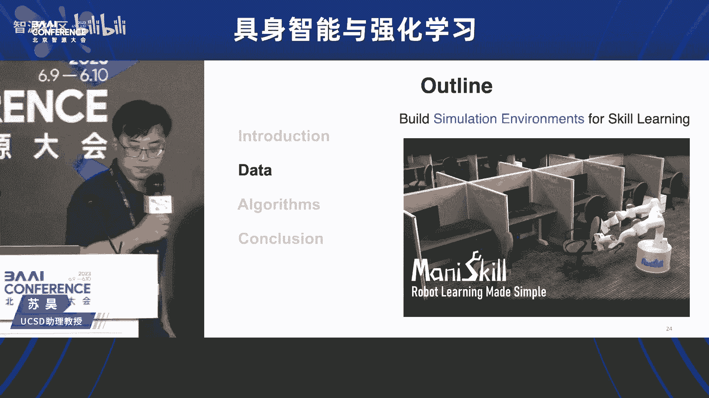

我会分成算的数据和算法两部分来介绍，第一部分数据，如果我们的剧盛智能也打算走大模型的路线，那么我们就需要大数据，大数据哪里来两个基础的来源，比如真实世界或生成合成数据啊，当然就是指的模拟器。

那么当然在真实世界中采数据是有很多手段的，比如通过这个摇操作对吧啊，比如在真实世界中去做强化学习等等，在这里呢我主要想讲的是，模拟器呢，有一些真实世界数据收集所不可比拟的优点，第一点是所谓的可扩展性。

那么真实数据都能收集数据，需要很多的真实的机器人，机器人的造价是高的，而且呢很多时候是危险性问题的，而且呢也很容易坏啊，我们的深度学习之所以这么的成功，一大原因就是因为显卡便宜。

一块显卡当年可以做很多事，但是现在也变得呃这个受到了很多的制约对吧，如果巨神智能想大的发展，它的所谓的可扩展性，低成本，它必是一个重要的事情，第二点是可复现性，那么传统机器人呢。

他很多时候都是基于这个视频来验证，成功与否的，对于当年通过物理建模，通过控制理论的方法，这当然是可以的，但是如果我们的具生智能，它现在是以数据为中心的，这就有问题了，我们知道对于这种黑箱方法可重复性。

那么基于大量的测试来验证它的性能，这是必要的，但是用真实机器人，这很难，因为机器人的这个出厂设置不一样，或者型号不一样等等，都会带来问题，因此再通过一两个video来看。

是不是做了一个好的这种具身智能算法，这显然是不太合适的，那么真实世界，你很难做到这么大规模的严谨的测试，这是模拟器，也是有必要的，第三点是这个fast prototyping，这个呃快速原型啊。

对那么如果一组硬件用来收集数据，但是硬件又升级升级了，这个时候呢你的demo可能会作废的，对吧啊，但是在模拟器里这一点要好很多，因为模拟器的数据收集的成本要相对低低一些。

总之呢我认为模拟器是一个一次投资，但是呢持续开发成本会较低的，这么一种解决思路，那么基于这样一种思想，我们组呢长时间呢都啊在在推动机器人，模拟器这件事情的发展，那么呃今年呢我们嗯做的做做了一个工作。

叫做mini skill啊，二点，它是有关物体操作的一个这个这个整啊，统一的这么一种这个这个测试平台，现在呢有20类的操作技能，或者是这个任务的这个这个家族，超过2000个物体。

以及呢包含了超过400万个物体操作的，这种啊实力，那么这儿有一个视频来看看啊，这是一个简单的推椅子的任务，这里我们建模了摩擦力，建模的碰撞等等，都是有很多精细的建模的，好我们啊在这个计算机视觉图形学啊。

机器人等等会议上发了很多的文章，文章都是去思考如何提升它的这个真实性，从而使得它尽可能的能够啊在在模拟器里呢，大家我们尽可能的避免创造，在真实上不必要存在的一些困难啊，我这儿呢给大家一个。

我们最近的一个有关这个触觉仿真的，这么一个work对，那么我们通过有限元方法呢，对这个啊基于形变的这种触觉传感器，进行了仿真，并且可以证明的是，通过强化学习，你可以学到一个不需要视觉。

只靠触觉反馈的这样一个，这个，对于任意一个物体的精细插孔，操作的这么一种策略，那么在模拟器中进行训练之后呢，是可以直接的被迁移到真实世界中的，当然这个工作我们也是刚刚完成他的代码的。

这个开源还没有还没有进行，我们会逐渐的去做这件事情，下面呢我讲一讲算法的事情。

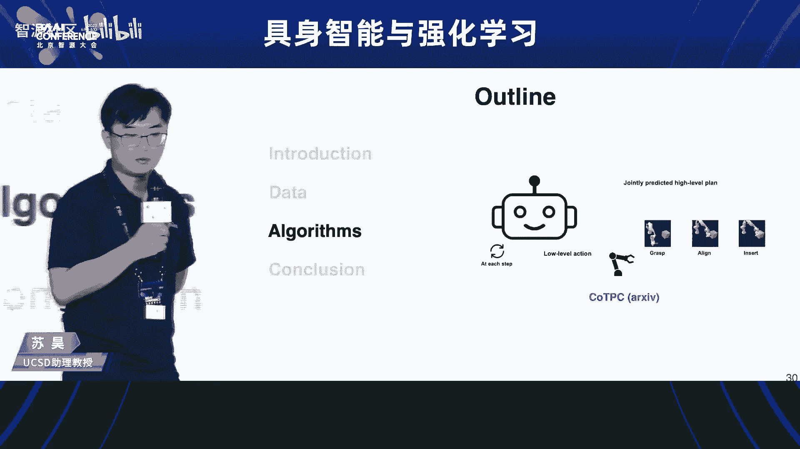

我们不管是通过真实设计还是模拟器，假设我们已经能得到一些数据了啊，那么下面一个问题是，我们用什么样的算法来得到这种鲁棒的，可泛化的物体操作策略，这里呢通过模拟器，我们是比较容易去测试它的。

所谓的这个方法性的，比如说这么多的椅子在这个房间里，你都希望它呢能够被推推走，推到一个指定的位置。

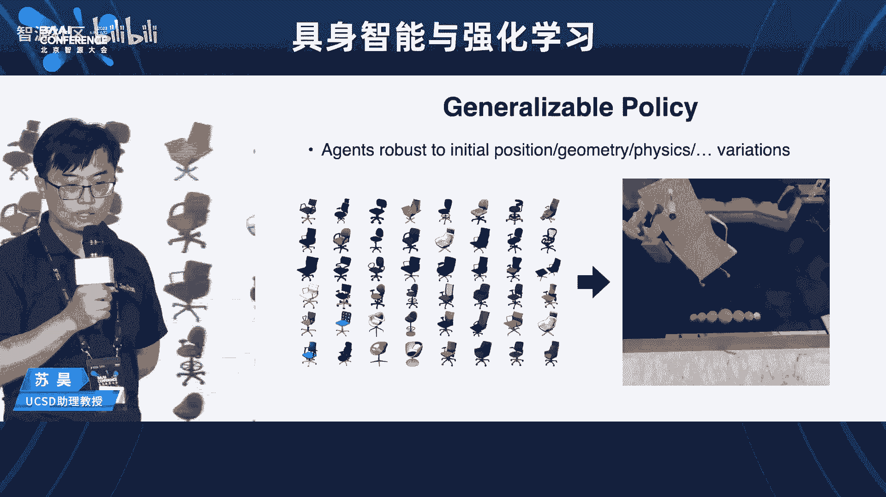

再一个呢就是所谓的组合方法问题，作为决策，你应该尽量的做到，在简单的环境中进行训练之后，这个策略呢能够在复杂的环境中被使用，所谓的这个组合泛化。

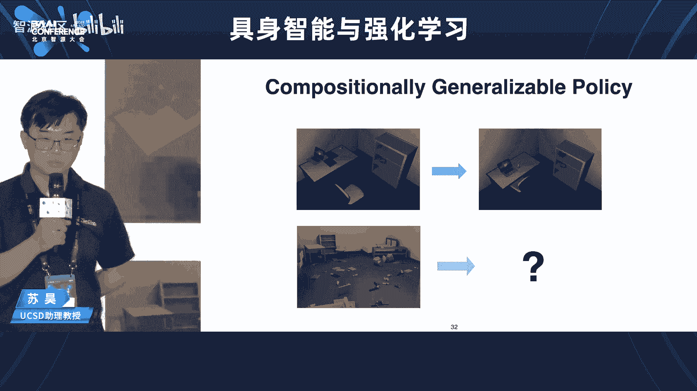

那么要点就是考虑，如何让我们的策略是更加的结构化的，那么我们考虑一种策略是，比如说用简单的神经网络，这是强化学习一直在做的事情对吧，比如用m l p或者cn来表达这个操作策略。

这个问题就在于它的泛化性是比较成问题的，尤其是组合泛化性，当然如果用所谓的这个rule based，这种这种基于规则的系统，那么在你的rule能摸到到的地方，它的组合泛化性和泛化性相对都是好的。

但是它不具备灵活性，比如说它很难能够通过视力来进行学习，所以这样来看的话，我们能不能走一个中间路线的，也就是说我们能不能考虑某一种结构化的啊，基于神经网络的策略呢，这是这个这个这样一个思考的一个重点。

那么从理论上来说呢，这个背后的思维应该是叫做这个算法对齐或，orgorgorithmic alignment这么一种事情，也就是说你的神经网络的结构设计，应该能够对应你的决策所需要的一种算法的。

这个这个这个推理过程给大家一点点感觉，比如说你在理论上可以证明，那么这个比如2020年我们曾经展示过，实际上图学习方法呢，它可以去近似任意的动态规划可计算函数组，同样的近年以来呢还有更强的结果。

他告诉我们呢，为什么g p t这样的transformer based model，这么强大，因为实际上它的表达能力的上限是，它可以近似任意的图灵可计算函数对，那么我们的决策这件事情呢。

背后有很多的reason，我们当然希望追求一种图灵可计算的函数，逼近能力，能够实现它，因为这个transformer这一类的大模型呢，或者sequence modern的模型呢。

在自然语言上取得了很大的成功，所以我们呢也收到这件事情的启发，想看一看，毕竟control signal对吧，控制信号它也是sequence，我们是不是有好的思路，能够用像语言模型一样的建模。

一样的方法去弄它呢，那么我们今年呢有一个最近的工作叫做啊，基于思维链的这个预测控制诶，那么这里呢我们考虑的是，把这个终端控制器的速度控制信号，也当成是一种像语言一样的token去建模。

因为我们有了minus skill collect，很多的这个事例的这个trajectory，这使得我们有可能探索这个方向，所以这也是模拟器的一个好处，也许他做的东西还没有一步到位。

但至少它降低了你的实验成本，那么至少从结果上来看，我们跟这个呃，之前的一些其他的这种啊序列建模控制信号，序列建模的方法，比如decision transformer啊，defer啊等等等等，相比呢。

在一些很困难的精细控制任务上，是取得了很大的提高的，这儿的精细控制是，比如说我现在打算把这个棍子插到这个洞里去，当然这里呢有很多的随机性，对棍子的粗细位置都会变化，这个洞的大小啊。

这个这个洞的位置大小也会变化，但是我们有个很高的精度要求，就是只允许有3mm的这个这个误差，在这么困难的一个task之下呢。

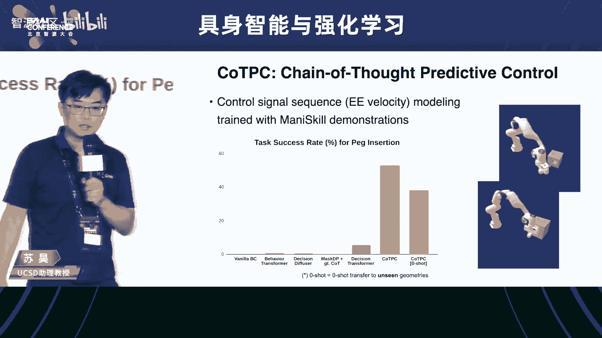

你发现强大的大模型是有好处的，好我下面具体说一下啊，我讲了，那么我们这个方法的核心思想呢，实际上是仿照了所谓的思维链技术，因为大家如果对语言模型有，有有一定的了解的话。

大家知道这个语言模型之所以那么强大，能解很多的数学题，对不对，他用了一个叫less things by step的一个技巧，也就是思维链的技巧，他把复杂的事情呢变成一步一步的去完成的。

那么一步一步去完成这件事呢，就就开始逼近我前面讲的所谓的这个这个图灵，可计算的，这样一种程序的，这种对齐的，这样一种这样一种这个这个思维模式，所以我们这儿呢把整个物体操作中的，这个关键状态。

用它来构成这个思维链，例如说对于这个pinsertion task，这儿的关键状态，就包括手抓住这个棍子，棍子已经跟孔洞对齐，孔洞已经足够深的插入到了呃，这个棍子已经足够杀深的插入到这个孔洞中。

这些关键帧就可以成为一种这个所谓的啊，操作序列的思维链，那么为什么是这些状态呢，呃很有意思的是，像cheat gb t这样的大语言模型，它很强的，你问问他所谓的把一个棍子插到洞里分几步。

他是真的可以告诉你的，他认为就是这样的，但这后边有些更本质的原因，这个更本质的原因是什么呢，那就是虽然操作序列是一个长序列，有非常多的不确定性，但是在这个完成的过程中，总会有一些个所谓的关键状态呢。

它是某一种意义下的不变状态，它是一些个方差非常小的状态，也就是说例如说我抓一个东西，我不管手是从这边绕过去还是那边绕过去，我总归要抓住他，抓住他的状态是本质的，如何绕过去就没有那么本质。

同时这些关键状态呢啊，也是具备更好的，所谓的这个可泛化的这种能力的，因此我们的这个所谓c o t p，c这个工作的基础思想，就是在每一步我们会动态的，首先去预测这些关键帧，形成这个高层的思维链。

那么然后呢对于每一个关键帧，结合过去的一段时间的这个经验，再去预测底层的控制信号，这样一种方法呢可以形成很高的一种啊，很好的一种效果，那么我不继续的去讲它的架构了。

但总体来说呢是我们在g p t的基础上，把它架构上改造，重新训练，然后呢，呃变成了这样一个控制信号的，这样一个建模工具，我们在里边用到了这种ca。

早的和out to out的这种attention module，我们这里边呢作为一个control signal sequence model to，也有learnable prompt等等等等。

大家感兴趣可以看细节啊，最后我展示一下这个事情呢，他在模拟器里训练也是可以transfer real world，好啊，最后一点点时间我说一呃，我展示两个有关这个3d a i。

g c和所谓这个具身智能的关系，这两件事情呢都很火，但是其实呢在我的观点里，他们的关系也是很密切的，为什么，如果你会认为据深智能家将来也要用大数据，那么它的数据哪里来对吧，如果你打算用模拟器的话。

那么模拟器里边首先要有足量的几何数据，而3d的ai gc，它可以帮你去生成大量的几何数据，基于这样一种理解呢，我们组长时间的都在关心这件事情，那么基于尤其是最近流流行的这个神经辐射场，nf这样的东西呢。

我们做了一系列的工作，想办法提高他的这个这个重建速度，想办法提高他对大场景的这种重建能力，想办法不光让他能够去这个capture appearance，而且能够让他把几何材质，光照动态性质解耦。

就是物体的结构等等等等一系列的工作，那么形象一点呢，我给大家看一个最新的一个东西，假定我们用相机在多个视角拍摄一个物体，那么在不需要人干预的情况下，我们现在已经能够非常自动的通过一个。

我们组最近开发的叫你manifold的一个算法，在差不多一二十分钟的尺度上呢，得到一个高质量的mesh，它具有逼真的这种啊appearance，而这样一个match是可以直接拿进模拟器仿真的。

当然我这里稍微说一下它的几何，它的物理属性呢，这是一个这个预假预假设的，它不是真的从真实世界中估计的，总归这是一种手段，能够让我们帮助模拟器里的数据。

同时呢我们也比如考虑把这个diffusion model啊，就扩散模型和nerf结合起来对吧，使得我们能够从比较少的数据出发，通过这个diffusion model呢放大三维数据。

那么我们希望的是三维的这种啊，3d数据的a i g c在接下来的几年呢，会有突飞猛进，突飞猛进的加呃，这个进展使得我们的虚拟世界的内容更加丰富，所以基本上我的呃技术部分呢就介绍完了。

那么这是我自己对所谓的具身智能的一个，全局性的一个理解啊，居身智能呢有非常多的应用，有很大的这种工业价值，那么它的核心呢，我认为是要完成大数据的收集和所谓的，foundation model的训练。

而大数据呢是很多层面的，从几何到物理到语言和交互过程等等，那么所谓的foundation model呢，我的观点。

机器人的fdation model也不是一个它需要感知的foundation model，需要对这个物理世界的动态过程的理解，需要对任务理解。

这都是fdition model以及决策的fdation model，好在现在的每一个fdation model，其实研究界都已经开始思考了啊，同时在这个过程中呢，这个有监督学习，强化学习。

以及呢这个如何去对，去实现这种算法的alignment等等的，这也是machine learning里边很活跃的一个任务，所以像这样一件事情，能够把视觉图形学机器人，这个机器学习统一起来啊。

这是还有机器人呢统一起来，这个我认为是接下来的若干年，非常让人激动人心的一件事情，好非常感谢大家的聆听，非常感谢苏老师的这个演讲啊，那么我们由于这个时间的关系，我们把这个呃提问和交流的环节。

留到最后的这个panel discussion，那么我们有请这个呃，我们今天的这个第二位speaker啊，来自北京大学的助理教授啊，志愿学者吴宗青老师给我们带来，从视频文本到智能体的策略学习。

鲁宗清老师是北京大学计算机学院的助理教授，博雅青年学者，国家海外高层次青年人才，北京智源人工智能研究院，多模态交互研究中心的负责人，他的研究主要围绕着强化学习，以及开放世界的通用智能体研究，好。

那么呃卢老师啊啊那个文科的介绍好，这个没开吗，开了，ok刚才那个苏浩从cv的角度出发吧，因为他background cv，那么去谈到这个学生智能，那么我的background是强化学习。

所以的话我从强化学习的角度来看一下，如何去做到师生智拒生智能，那么强化学习的成功我就不说了，但是他的问题也很多，比如说啊sample efficient，比如说对于break out来讲的话。

一个非常简单的terry game，可能需要1000万步才能完成，这个学会完成这个游戏吧，以及对于一些啊long horizon sparsal，word task来讲的话。

基本上是impossible，就是如果我们从learning from scratch，去通过强化学习算法来去学的话，我们后面会看到一些简单的minecraft，游戏来讲的话，基本上是学不会的。

那么最重要的就是啊最被诟病的一点，强化学习就是啊training set和test set是一样的，他在这个training的任务上去测试这个结果，那么比如说就像玩一个terry的game。

然后去然后学完这个游戏，我们然后的任务是比如说建一个房子，那么显然是做不到的，那么啊或者我们呃对于今年的话，我们的一些思考是说对于强化学习来讲的话，我能不能去leverage这个video或者数据吧。

video和text来帮助我们的策略的学习，比如说现在你要去建一个房子，那可能我我想在座的各位，在座的大多数的各位应该就不会去，或者是从来就没有干过这件事情，但如果让你去干的话，你怎么去做呢。

啊可能问一下chess gb t，比如说啊怎么去建一个房子，七gp告诉你不拉不拉一堆对吧，然后你也可能比如说在minecraft里面，建一个房子的话，那你可能是在比如说youtube上面去看一下视频。

看一下别人是怎么造的，比如说先去啊la foundation给这个房子，然后再去造墙等等等等操作吧，那么我们是不是也可以让智能体通过啊，文本或者是视频来帮助智能体更好的学习策略，那么这个的话是啊。

这次讲座里边想讨论的一个问题，当然我们啊刚才也提到了，对于minecraft来讲的话，我们有很多视频，有youtube的视频，然后我们也有比如说玩家在好玩视频的时候，一些对话，一些字幕。

那么这些呢都是一些数据的来源，另外一个对于minecraft来讲的话，它是一个开放的环境，那么是啊对比于这个真实的人类的世界，当然可能一些操作啊，没有像刚才说要讲的那些啊simulator。

simulator里面那么的真实，但是这边的话也是对真实世界的一个analog，ok我想和大家分享的就是我们啊这半年吧，在志源在北大联合去做的一些事情，那么去啊有一些尝试去如何通过视频文本啊。

比如说语言模型，然后去更好的解决这些事情，然后在minecraft的这个环境中呢，去更得到一个更通用的啊智能体，ok那么第一个问题就是，比如说我们有64万个视频对吧，玩家玩视频。

那么我们能从视频中学到什么呢，从数据中去学习的话，从数据中得到一个策略的话，最传统的方法就是奥莱尔啊对吧，offline，而我就是有这样一个状态，action下一个状态。

reward这样一个突破的dataset，然后从通过一些offer 2 l的算法来学习一个策略，那么对于视频来讲的话，它最多也就是啊state的一个序列，比如说一个视频的话，从s一开始到s t。

那么当然了，其实本质上来讲是啊observation对吧，它不是state，那么我们最多看成是state，那么如何去啊学啊，其实这边的话就像我们我们想做的是说，ok对于我们要去建房子的话。

我们去看了一些视频，我大概知道怎么去做对吧，我大概知道啊，了解一下，比如说就说刚才踢球吧，踢球的情况下，你可能看别人踢球，你大概知道要怎么去玩这个足球，然后你去尝试一会儿，你可能就学会了对吧。

那么这样的话其实啊一个比较standard的问题，就是learning from observation，但是我们这边加的是visual observation，就是对于一些视觉输入来讲的话。

它其实本质的问题就是我要学一个策略派，派的话，他啊派所导致的这个状态，和下一个状态的联合的概率分布呢，和专家的概率分布是一致的，相当于我们要最小化，这个比如说f distance。

其实这个是我们能从视频中啊，最好的能学到的一个东西，当然如果我们只是一个offline学习的话，我们只是利用数据去学的，没有跟环境交互的话，想让这个派是学不到的对吧。

因为我都direction space是什么，我都不知道，那么我们如何去做呢，啊这边的话，其实我们是做了一个这样一个形式吧，这工作叫这个pretrain state，transformer。

相当于是我们在这个embedding层面呢，是通过一个transformer，然后去预测下一个state是什么，当然是在embedding空间啊，1t pass one，然后通过一个辨别器来判别。

预测的这个embedding和真实的embedding，这样的话对于下游任务，或者是对于online learning的过程呢，其实这样一个判别器呢就可以提供一个reward，来让帮助智能体学习。

当然不同于以前的learning from observation的方法，它都是一个online的学习的过程，包括这个判别器，那么这边的话是通过一个transformer的结构，来offline去学习。

相当于ok，我现在所有的视频上去过一下这个数据，然后去预测下一个state是什么，然后通过这个判别器的输出来构造一个reward，让智能体来学习完成这个任务，需要注意的是，我们在学习的过程中。

在跟环境交互的过程中，我们其实是不需要环境提供任何的reward，function或者是reward，我们仅通过这个啊interesting rewards，就可以完成这个任务，这是啊怎么说。

这就是一些公式吧，我就不一一介绍了啊，大体的就是刚才说的预测下一个state，然后一个m c的loss，还有一个判别器，当然这边的话呃，最下面那个公式其实是一个啊在十啊。

在tempo层面的一个regression，相当于ok我给定两个state的embedding，然后我去预测他们，他们这两个之间的这个time step的啊。

这个difference就是从他到他去过了啊，几个time step，看这个的话，是为了增加这个提升这个retation的能力的，那么有了这样一个transformer，相当于是我通过看视频学到了一些。

学了一个reward function，然后再去online交互的时候，通过这个reward function来学一个策略，那么这样一个策略的话，这是minecraft的一些简单的这个环境。

那么在这个简单的环境中呢，我们其实可以有一定的成功率吧，比如说对于前三个的话，它其实成功率还蛮高的，因为在minecraft这个环境中的话，大大部分的成功率都是以百分比计算的。

因为它有啊有有概率是你在环境中，比如说你找不到一头牛的，ok，呃细心的听众的话可以看到这些啊，caption的话其实是就是这个任务的描述，比如说我要去呃挤牛奶。

它其实就是让agent在环境中去找到一头牛挤牛奶，那么我们是不是也可以利用这个task prop，然后去帮助智能体更好的学习，当然如果我们能去啊，最简单的去correless这个这个牛啊。

这个这个这个就是一头牛，如果大家不熟悉这个minecraft的话，能够把文本和图像联系起来的话，其实啊就可以帮我们去做到这一点，相当于ok现在智能体在环境中走来走去的，然后现在的任务是去挤牛奶。

那么他看到一头牛，那它能够call it，看到的东西和要完成的任务的语言来描述的话，其实可以给自己一个奖励函数，然后让他去找到，首先得找到这头牛对吧，那么呃为了做到这件事情。

我们同样的还是从这个video里面去找到一些，这个video和text pair，当然是通过关键字的搜索，然后去啊主要是匹配字幕啊，我们先用这个啊whisper，把这个的这个视频的这个语音呢转成了文字。

然后在文字中搜索，然后再去匹配对应的time step上面的video，然后来组成这个数据集，然后然后就可以通过two tower keep，然后去啊fighting这个clip。

让他去关联这个啊文本和这个图像，那么对于，在执行任务的时候就随机sample一些negative pump，这样的话就可以通过这个cosine similarity，给智能提一个好奖励函数。

来辨别k当前这个画面下有没有我要找的东西，或者是呃这个跟这个任务相关的一些这个object，当然为了更适应强化学习的话，我们在网络层面做了一些操作。

相当于去additional align这个啊motion，除了这个entity之外，去additional live motion。

这样的话其实对于这样一个vision language model的话，它其实在一些任务上还是要有进一步的提升吧，但是对于这样一个方法的话，呃，我们可以看到就是这个这个数字，就是刚才说的这个word。

我们可以看到当智能体离这个牛越来越远，或者是距离不一样的时候，它其实这个给的奖励函数是一样的，但是呢我们大部分的任务都需要智能体，去接近这个牛，比如说我要挤牛奶的话，我可能啊走到你跟前。

然后用桶打他一下，然后就挤到牛奶，但是如果我们只是这么一个奖励，在任意的distance下面都是word都是一样的话，他显然没法鼓励智能体去做到这件事情。

我们想要的可能是一个bounding box对吧，当然我对cv不是呃，bone不是cv，所以对c不是很懂，但是我们想要得到的就是这么一个类似的结果，相当于是ok我离你越近的话，reword应该越高。

呃一个简单的方法啊，相当于是我们可以通过一个啊self supervise，the segmentation方法去做到这件事情，然后呃就是通过这个我们target这个entity。

在pixel中所占的比例，那它其实就不能刻画我刚才要说的这件事，要做的这件事情就是越近的话奖励越大，可以看到通过这样一个简单的方法的话，我们可以看到对于这个比如说这个不是牛的。

这个是minecraft里面的羊，那么对于这个羊的话，随着它在这个画面中的大小的话，我们可以看到这个啊分割出来的这个羊的，这个pixel的占比的话，可以被这个啊完全的刻画出来吧。

尤其是从右边数的第二列的第二行，第二列的话我们可以看到，虽然虽然那个羊特别小，但是它还是能被分割出来，那有了这样一个奖励函数的话，其实我们会比比如说我们仅仅仅用clip来做来。

来驱动这个智能体去完成任务的话，比如说啊没有call或者combat pig的话，要做的更好，当时我们刚才刚才说的这个，我们在做这个segmentation方面的工作的时候。

其实那会儿还没有这个segment，anything model在做的这个过程中呢，他们release这个这个sum，然后我们就用sam去做了一下，比如说对于这样一个三这个minecraft场景的话。

这个segmentation其实还是不错的，就是对于啊比如说这个点打得比较密的话，它其实分割的还是可以的，但是问题是，我们需要去判断这个羊所占的pixel是什么，那么用需要去分辨这个的话。

我们还得再接一个模型，比如说我们用光电dino，然后先去做一个detection，然后找到一个bounding box，把这个bounding box呢再是在给sam。

然后sam呢再根据那个bounding box，然后再去做分割，那这样的一个情况的话，相当于我们就可以去链接这两个模型，让他直接在这个minecraft这个场景中，去做到一个，实体化的分割吧。

当然能够识别出羊来，但是问题是，因为这些这两个模型都是在这个real image上面，训练出来的，对于这个啊minecraft这个游戏的场景的话，他其实做的并不好，比如尤其是从右边数的第二列的话。

我们看到分割的话，他把羊分割了整个区，整个区域，这样的话显然会误导智能体去啊学习这个策略，我们从这个结果也可以看到，如果我们直接把zero shot把它搬过来的话，它其实并不能做得更好。

刚才是啊讲的这个一些简单的任务，我们都是啊，比如说在环境中能找到的东西，对这个东西进行一些操作，对牛对羊，反正这些物体吧，creature，然后进行一些操作，那么比如现在的任务是比较复杂的。

一个任务是说我们要去造一个熔炉，craft a craft furn，那这样的任务的话，因为这个熔炉的话，他其实在这个my craft世界中是不存在的，是需要造出来的，那么造这个熔炉的话。

如果大家玩过这个游戏的话，应该知道这是一个txt的任务，那么他需要很多的步骤，比如说他需要去先去砍树，然后造craftable，然后再去造一个木镐，然后再去挖石头，挖了石头之后，你可能才造熔炉。

但如果是更复杂的话，比如说你要挖钻石的话，你可能需要造完，融入之后要造这个石镐，石镐挖，挖铁矿等等一系列的操作，这边只是举了一个简单的例子，那么对于这样一个任务的话，我们如何去完成呢，那么这边的话。

其实我们啊对于刚才这个pc的任务的话，我们其实看到他其实大部分都是有一些啊，scale的组合，其实就可以通过他们这个skill的组合，就可以完成，那么这边的话我们是定义了这些skill。

比如说我们找东西的skill，manipulation skill以及craft skill，那么通过分为这三类scale，当然如果就是可以根据go base的方法去简单的，比如说弄成三个策略就可以了。

那么如何去有了这些scale之后呢，我们就可以在这个skills层面呢去做一个planny，比如说我们现在要造一个熔炉，我可能先去调用这个找木头，找树的这个skill，找到树之后，把那个木头砍下来。

巴拉巴拉一步这些一顿操作，把最后把这个熔炉造出来，那么基于这样的一个框架的话，其实就是这样一个形式，就是我们要完成的是复杂的任务，刚才讲的那几种几种方法，就是不管是vision of language。

model base的方法，还是啊c h6 的方法，还是赛后2号的方法，它其实都是用来学习这个skill的，这边的话我非常同意刚才苏浩讲的，就是现在很多的研究的话，他其实把这个skill这一步给跳过了。

尤其是在minecraft里面，同样的比如说像nvidia他们做的，他们直接把skill写成了一个rubase的方法，然后直接去掉这个东西，但是问题是说，这个scale本身就是非常难学的一件事情。

如果你只是写了ruby的方法的话，相当于把人类的知识全加进去了，那么如何去学这个scale，其实是呃强化学习一直关心的问题吧，从就是从解决单个问题的角度来出发的话，那么我们这边也是同样的。

就是我们如何通过这个视频来学这个scale，以及通过一些卫生language model或者是分割的方法，从视觉的层面出发去学这个skill，这个skill本身就是比较难学的一件事。

呃即使是在minecraft这样一个游戏场景中，另外就是我们专门分离出来这个找东西，这个策略，为什么要去把这个策略分开分离出来呢，其实我们可以看到这是两个两个url的方法，一个方法是嗯它的距离不一样。

这个下最下面这一行的话，是离你的target物体初始化的距离很近，那我们可以看到，当你当着呢离这个物体很近的时候呢，它的成功率就会显著的提高，那么也就是说如果我们要去砍树，我可能要两个策略。

就是先找到树，然后把树砍下来，这样的话更容易去学习，如果你的一个策略的话，你可能成功率很低，那么对于找东西这个策略的话，其实也是一个比较重要的，对于漫画的这个环境，或者对于一些其他场景也是一样的。

你要找一个东西，其实你就是在呃这个环境中去随机的探索去找，那么这样的一个方法，你只能去像state courage一样，在rl里边，你可能去啊便利这个state，然后去找到这个东西对吧。

那这边的话其实也是一样的，我是一个hierarchical policy，然后high leo去pose一个target的state或者location，然后又让这个low level策略。

然后去rich这个targets，ok那么有了这三类策略，这个rap策略就比较简单，它就是一个合成，然后呢因为这个txt的话它其实比较特殊，我们可以通过拆gp t呢。

就把这个他们之间的这个dependency呢，把它给它抽出来，比如说我们去做一些prompting，然后让agent啊，让这个chegbt去输出这么一个dependence的graph。

有了这个graph之后呢，我们其实就可以在这个graph层面去做一个，interactive planning，相当于ok先去砍树对吧，砍完树你可能调用砍树这个策略，然后没成功，没成功的话。

再去做一次planning，就像啊就是m p c，只不过在skill层面去做一个m p c，这个的话是在啊四类的这个碳税的任务上面，做了一些测试啊，这个的话就是刚才提到的方法。

当然我们这边的话也用chi gp做了一些测试，就告诉chat gp t，我现在有这些策略，让touch让他去直接去做一个盘点，而不是基于这个skye graph去做叛逆，你看到啊。

因为h b的话它在数量上面，尤其在minecraft这个数量，我不知道，在其他的上面，在minecraft这个合成东西的数量上面的话，它通常会搞错，所以的话它的成功率并没有那么高，就比如说我需要假设啊。

七个木头去合成一个工作台，他经常会认为是五个木头去合成一个工作台，另外一个就是这个managent的，就是这个nvidia那篇论文，假设我们给他一vision language model。

让他去学这个跟啊铁矿相关的这些工作啊，这些任务的话，他的成功率就是0%，就是没有成功，我们后面会看到为什么他没有成功，这边的话是两个option study，那么第一个的话。

相当于是我们如果没有这个finding scale的话，它和它的成功率可能会降下来，就是其实验证了刚才所说的这个finding skill，其实是要单独拎出来，或者是有了它之后去更好的对啊。

这个任务呢做一个更好的decomposition，下面这个是一个interactive planning，当然interactive planning会更好的结果。

ok这边的话就是我刚才说的这个长城的任务，这个任务的话大家看到啊，右边数的第三列的话，它其实每个任务都大概需要1万步才能完成，而且这个任务只有在1万步之后才有一个奖励。

那么对于这样的强化学习的任务来讲的话，learning from scratch，即使用了卫生language model的这个reward，都不可能学会，这个是一个一个节点啊。

这个是徒手造这个铁镐的一个啊，完成各种这个任务的节点吧，哦对刚才忘说了一点，其实就是另外在这个planning的这个step上面，我们看到对于啊很多任务，比如说这个任务的话，大概需要这些scale。

执行120多次才能去完成这个skill，而是完成这个任务，所以的话他是一个非常难的任务，对于啊从这个planning的角度出发的话，ok那这样的话，我们就有了可以去完成复杂任务的这么一套啊。

hiro的结构，当然hi level的话，我相信啊，如果我们这chargbt或者老师，language model做的更好的话，他其实可以直接用这个language model去做planning。

但是下面要接的这些skill呢是需要精心的，或者通过强化学习，或者通过从数据以及视频的方法去得到，ok那么从这些研究中有什么启发呢，首先对于策略学习的来讲的话。

我们可以通过比如说offline 2 l去做游戏训练，我们先通过数据的学习，通过数据来学习一个策略，或者是通过看视频，通过刚才的方法来去学一个reward function，但是我刚才没有提到。

其实那个state to go transformer的话，如果再加上环境的reward的话，他的学习的效率会非常的高，这边没有展示，另外就是对于长城的没有。

这或者是special word这样的setting的话，我们是需要一个hierarchical的结构，对于这个panel来讲的话哦，目前认为我认为应该用语言模型，因为他的raining能力非常强。

所以的话用语言模型会是一个比较好的选择，最后提到的这个泛化性的话，同样的还是因为有策略的话，他不一样的task，他可能就是需要不一样的策略，但是对于哦我们来讲的话，我们的视觉。

我们的语言都是具有泛化性的，因为它是统一的表示，所以的话策略的泛化性，要依赖于视觉和语言的泛化性，来实现策略层面的泛化性，另外就是我们啊现在在做的一些事情吧，应该是现在在做的事情。

一是这个老师language model，它是都是从tt文本里面去学到的，它是没有跟他是没有见过环境的，比如说我们现在真的要部署一个large language model，去做planning的话。

它其实没有跟环境交互的这个过程或者流程，没有这个啊没有这个过程存在，所以的话我们要做的事情，比如说在漫画中，我们是希望在一边跟环境交互得到这个，比如说tragegy的这样一个sequence。

那么我们如何通过这样的sequence，fighting这个large language model，让它具备具有跟环境交互的这样一个经验，或者让他得到这样一个知识，另外一个是我们啊。

同样是在minecraft边在做一件事情，我们是希望做一个visual word model，希望能从视觉的层面把它跟这个language model结合起来，让它更好的从。

怎么说通过老师language model，对这个视觉的感知有更好的一个啊，对物理世界或者游戏的引擎来讲的话，有更好的理解，另外是creative vision，这个有点crazy啊。

就是我们也在做尝试，就是我们如何通过告诉智能体，比如说啊做一件create的事情，比如说让他去造一个房子，那么他造出来的房子会不会不一样，会不会有什么diversity。

那么这个也是我们目前在做的一些事情，好就是感谢这个我们的团队，以及就是提到的四篇论文吧，也是刚刚投出去的，这半年的工作，另外的话做个小广告，现在因为我负责多模态交互研究中心，所以的话大家有兴趣的话。

可以我们持续在招这个研究员和实习生，如果大家有兴趣的话，可以那个扫码联系我，ok谢谢大家好，我们这个非常感谢这个卢正卿老师的这个呃，呃talk啊，我们看到这个呃第一位speaker和这个呃苏老师。

那么关注的是呢这个物理啊，我们这个不管是simulator里的物理呢，还是真实世界的物理和它里面的几何，怎么能帮助到我们的巨深学习，那么我们的这个卢老师呢，我们在这个minecraft这样的一个抽象。

但是又非常复杂，具有非常长城的任务，这样的一个环境中呢去学习智能体，怎么把一个复杂的任务拆解成一系列步骤，怎么在这之中呢去有这些啊，high level的智能，那么一个很重要的问题。

就是我们的具身智能怎么样呢，跟我们人类打交道，所以说呢我们今天这个请到了第三位speaker啊，这个来自清华大学的副教授孙亚楠老师，将给我们带来交互式建模与学习，重建人类运动能力的talk。

允许我介绍一下思维老师，孙亚楠老师是清华大学的副教授，致力于机器学习，神经交互和机器人技术研究啊，他分别于清华大学获得学士学士学位，美国加州理工学院获得博士学位，并在加州理工学院和斯坦福大学。

从事博士后工作，研究成果作为独立专题，写入斯坦福大学等高校教科书的啊，algorithm for optimization，曾获2020年机器人与自动化国际会议，equa最佳论文奖，并在中国和美国。

应用于神经损伤疾病的临床治疗啊，那么呃，并且呢，由于在人工智能与神经科学的，这个交叉领域的贡献，入选麻省理工呃，科技评论，35岁以下科技创新三三十五人中国区榜单，让我们欢迎孙亚楠老师，好啊。

谢谢谢王老师介绍啊，谢谢大家，这个今天今天下午啊，这个现在应该同时正在进行的，我看那个时间表上，还有那个郑南宁老师在同步的在讲，这个剧社学习，感谢大家这个来我们这个session，我们更年轻一点。

可能这个这个讲的东西，更加的这个边边角角一些，可能会对大家的胃口哈啊，呃我今天的这个报告的题目，叫做这个教务室建模与学习，来重建人类的运动功能啊。

所以大家看这个title里面有modeling and learning啊，我们会讲一部分矛盾，讲一部分learning，那么我们的目标是restore human motor functions。

所以大家会在里面会预期的会看到一点哈，我们如何来这个重建人的这个运动功能啊，那么先简单的来过一下，我们这个接下来的半个小时里面，我们都要讲哪些东西啊，首先embodied intelligence啊。

这是一个很大的概念啊，前面的这个苏浩老师给了一个很好的一个这个，embody learning的一个一个一个概念啊，这个卢老师呢把他和强化学习之间，进行了一个一个一个关联啊。

后面那个蒋老师的报告会把它和这个视觉，还有这个对于世界的构建，会有一个很大的一个关联啊，那么我的报告呢在这个里面，其实是关注其中的一小块，learning to move啊。

我们关心的呢就是说我们的智能体，这个智能题主要是指我们自己如何来学习运动，然后如何来控制运动啊，那么我们的这个在现实世界中的这个应用场景。

或者说我们想做到的目标是human motor function restoration，我们帮助运动功能损伤的不足的这些患者也好，老年人也好啊，这些这个人群，我们希望能够让他的这个运动功能。

能够能够有一定的这个重建和恢复啊，那么我们是ai community啊，我们会从ai的这个角度，我们从embody learning，从reinforcement learning的角度来看。

说我们如何来做这件事情啊，那么我们最早采用的技术路线其实是model free learning呃，因为后面报告里面会给大家展开来看，说我们在很多人的身体控制上啊，我们很多东西都不了解啊。

你没有办法形成一个很好的模型，和这个基础知识构建的情况下啊，我们没有办法做很好的model base learning啊，那么我们就要从model free learning开始。

那model free learning呢我们又要从online learning来开始啊，因为offline learning需要你提前有很多的数据，这个事情在很多时候是没有办法做到的啊。

那么这里的红字是我们技术上的一，些主要的关注点，第一个是safety，第二个是preference，那首先learning with unknown safety constraints啊，大家知道。

如果我们在这个完全的虚拟世界里面啊，来做这些这个交互的任务对吧，比如说刚才这个卢老师这个minecraft里面，他去这个呃，他要去这个喂牛，或者是要去挤奶等等的啊。

他这个不小心被牛踢了一脚也没什么关系啊，是吧，这个但是在现实世界里就不一样了对吧，现实世界里，如果我们的对象是人的这个客体的话。

你再让他做online ing forcement learning的时候，这个安全性的保证，是一个非常重要的一个前提啊。

那么第二个learning with human preference be back啊，这其实是之前这个长期来讲，这个不是特别受关注的一个领域啊，但其实从去年今年啊。

随着这个chegb t里面的这个reinforce，learning with human feedback，而他的这个feedback很多时候是来自于human preference。

ranking啊，那么又开始受到大家比较多的关注，我们会看到现实世界当中确实很多时候，这些preference be back啊，是可以来帮助我们去更加稳健的来构建，reward的这个形式啊。

那么我们会讲一下诶，前面的这些方法，如何在现实世界的这个呃人的运动功能的控制，或者重建当中来得到一些应用啊，那在此基础之上呢，我们会发现还是有问题啊，问题在于，如果我们没有model。

如果我们不做这些机器人的这些建模，这个虚拟世界这些建模，我们在现世界里面我们的采样效率，所以大家看到这个第三个标红的关键字，怎么样来提高，怎么样来显著的提高，数个数量级的层面上的提高。

这个确实需要model啊，所以我们不可避免的要从model free走到model base啊，那么后面会介绍一下，我们在neuromusculoskeletal model。

我们的神经肌肉骨骼这样一个联动的系统上，如何来构建我们自身啊，并且基于这些自身的这个构建来学习啊，所以呢我们这个talk和这个呃，这个呃前面的几个talk的一个很好的一个衔接。

在于说前面两个talk都提到了一个关键词，word model对吧，大家看左下角word model啊，那么这个talk里面不会讲太多word model啊，我们其实更多的会讲self control。

我们从self control来入手啊，那么看到self control model free能解决一些问题，但是还有很大的局限，我们回过来来看如何来self model啊，最终我们希望我们的工作。

和整个embodia i的这个领域的工作合在一起，能从world model self model self control啊，形成一个很好的一个这个这个闭环啊，好啊。

那么首先这个我们从learning to move开始哈，大家看到这个这是这是一些数据啊，啊这些数据有可能再过几年，大家再回来看这些数据，可能会觉得他是有问题的啊。

这个因为我们的宝logical的这些数据本身，其实很多实验得到的，这个过程本身就不是很精确哈，比如说第一条我们说human model function。

我们的这些motor function呢是由最终端的这些motor，neurons直接来控制我们肌肉来实现的，motor neurons在我们人的身体里有多少啊对吧，大家如果我活写在这了。

因为我们时间有限就不做题，这个考大家了啊，这个写在这儿的大概15万啊，15万是现在的一个，这个前面的一个教科书上的一个统计的数据，那么这是大概15万个左右的motor neurr啊。

那么控制了这个600多条肌肉啊，我不知道在座的各位大家谁知道，就是人精确的来讲，我们人身上有多少块肌肉啊，多少块骨头，知道吧，应该应该是多数人知道多少块骨头，206，我们绝大多数成年人注意。

绝大多数成年人是206块骨骼啊，但是这个数字随着呃，这个不同的人也会有轻微的变化啊，那么肌肉人和人的数目也不一样啊，那么通常来讲我们看到数字说哎，有人说640块左右，有人说600~700块啊。

这是这个对于我们肌肉数量的描述啊，那么我们会看到诶大概15万个motor neurons啊，那么600多块肌肉，这个好像是我们今天强化学习，尤其是我们在simulation world里面往上探一探。

差不多能摸到的一个数据了啊，啊，所以所以这也是为什么我们在这个时间节点上，觉得诶这件事情可能可以做了啊，因为如果我们看第二行第二行的这个数啊，啊第二第二个这个hundred billion。

neurons in the brain啊，这也是一个很虚的数啊，大家在很多这个神经科学的讲座里面会听到说，诶人有这个呃eighty six billions啊。

eighty six billion neurs，有时候说是hundred billion啊，有时候还会说再大再小啊，因为这个实验其实没有办法做得很精确，所以到今天虽然神经科学非常火。

神经科学和我们的ai的这些连接非常火，大家频繁的会在各种的talk里面看到，说我们人有多少个神经元in the brain啊，啊，但是其实这个数到现在为止还不是一个确数啊。

那么我们的human motor functions关注的，或者说这个影响的人群其实很多的啊，它可以是由于疾病啊，比如说这个帕金森病啊，一些运动功能障碍的这些疾病可是损伤对吧。

比如说大家这个打篮球撞了一下呀啊，或者是这个这个这个怎么样的，这些这些损伤，也有可能是就是正常的这个自然的衰老，aging a ing，就会使我们的这个motor方式，我们的运动功能出现一个显著的下降。

好那么如何来控制我们的运动神经系统啊，我们从embody a i的层面上来讲啊，我如果是一个机器人，我来看人啊，我如何来控制一个人的运动神经系统，这既是一个生物学的问题啊，同时它也是一个计算学的问题。

我们今天特别感兴趣这个计算学的问题，就在于，刚才大家看到前面的大概15万和大概600，我们觉得这个数字可能差不多可以做了啊，好那么我们tackle的这个方法啊。

reinforcement learning，我们会比较多的来采用强化学习的方式，来解决这些问题啊，那么一个关注点是说哎，那么我们是在线的强化学习，还是离线的强化学习对吧。

如果对强化学习熟悉的同学会看到说online versus，offline，model，free，versus，model base，到底什么样的方法是可能对于这个问题更好的，更有效的啊。

我们后面会进行介绍啊，好human function restoration，那么具体的我们在现实世界中啊，我们的这个实验室，我们的合作者是怎么样来做这件事情的啊。

我们通过两个方式来去learn to move，或者说do the motion control啊，第一种方式是from the inside out啊，这件事情其实大家了解的相对来讲少一点啊。

所以我稍微花点时间介绍啊，大家看到中间的这个哦，有点有点像个虫子，然后上面还在亮的，这其实是人的一个通用的一个脊髓模型啊，这是我们做的一个人的通用的一个脊髓模型，它上面在闪的这个东西呢。

这不是我们人的神经信号，大家看到的是一个一个通道，这些通道是我们可以来植入人的脊髓里面的，这个神经刺激器啊，那么植入的这个神经刺激器诶，在可以植入到这个呃，这个这个地方。

就可以来帮助一些严重的运动失能的这些人，来恢复他的这个运动功能的呃，这个一部分甚至是甚至是全部啊，所以我们管这条路径啊，叫做这个neural neurostimulation。

by implanted device啊，这些患者在体内植入的这个设备，我们是看不出来的啊对吧，它在外观上来讲和这个健康人是一样的，那么他是一个from inside out。

我们通过直接来code它的神经系统的活动，使它实现一个运动功能的这样的一个重建啊，那么对应的另外的一条技术路线，from the outside in啊对吧，因为我们对于人的这样的一个。

客体的这样的一个操作，就是要么我们是自内而外的，要么是自外而内的，自外而内的，我们可以通过这个外骨骼的啊，这这外骨骼机器啊，或者说这个这个交互式的机器人，我们来实现这样的过程啊。

那么这个里面呢其实在控制的过程当中，或者说我们在学习当中，有很多的这些这个挑战哈，我以这个自内而外的这个形式，我们通过直接控制他神经活动，来使得它的这个运动功能得以重建。

来作为一个例子来看里面的一些问题啊，what are we exactly stimulating啊，当我们在里面植入这样的一个控制器以后啊，如何来刺激啊，如何来控制，那么这件事情其实是比较未知的啊。

我们植入以后，他面对了大量的这个附近的这个神经元，到底哪些神经元被激活了，哪些没有被激活，哪些有连带这些响应，这个东西不知道啊，医生也不知道，神经科学家也不知道啊，我们做这个做这个东西我们也不知道啊。

第二类问题，what is the mapping between electrical stimulation，motor function，啊对吧，这个我们的刺激到底和最终的运动功能的构建。

和这个输出之间是一个什么样的关系啊，我们的这样的一个信号，和本身大脑对于神经运动功呃，这个运动功能的这个coding，还有脊髓自己对于运动功能的这个coding，到底是怎么个关系啊，那么再进一步。

how to achieve motor function restoration啊，我们如何来这个通过这样的方式来实现一个，好的一个刺激，我们也不知道啊，所以所有的这些问题基本上都现在。

我们不能说我们一点也不了解，但是我们了解的程度，没有办法使我们充分的实现一个model based learning或者，model based optimization这样的方式啊，所以呢。

当我们面对这样的现实世界的这个问题啊，restore motor functions without clear，understanding of mechanism啊，我们不知道背后的机制是什么啊。

我们不知道前面的那些问题的，精确的答案是什么啊，那我们就要采用model free的方式啊，我没有办法给他一个很好的model啊，那这个时候我要用model free rl，同时呢历史上没有很多数据啊。

来告诉我说哎像这个玩游戏一样，前面的人是怎么玩的，我去观察一下啊，我们很多的这样的患者，很多这样的疾病啊，很多这个可能现在我们进入老龄化的，这些老年人群新出现这些问题，它是一个online出现的。

所以也就需要我们online来进行解决啊，那么我们就需要第一个入手的方式，model free online ing for learning，那么在这个里面有几个。

也是有几个critical challenges啊，刚才我们就是刚才我们几个红字提到的，第一个safety，你在online ry force learning。

尤其是在和人打交道的这些online ry forcement，learning过程中，如何来保证安全，你如何在这个过程中来获取reward啊，我们的这些reward。

大家知道你让人来给你这个填一个量表，打一个评分的话，很多人是对于这个事情，这个呃这个评分质量不是很高的啊，那么而且很多的东西是没有办法很好被量化的，我们后面会看到这个外五个控制的这个例子哈，就有些时候。

你没办法给一个非常精确的量化的评估，这个时候human preference feeback，可能是我们仅有的可能能用的这些评呃，评估的方式，我们如何来尽可能的来提高，我们优化的这个效率。

那么这本身我们会在model free的情况下，用算法来想办法把它推到极限啊，但是在后面一小部分的这个talk里面，我们看到最终解决它的方式，很可能还是在构建模型。

以及基于model base的方法来实现好，on the model free online ry for morning啊，其实它的这个最核心的一个本质，我们reducing啊。

把它约束到最核心的一个问题上，还是constrained optimization problem啊，好这个式子这个呃这个构型大家非常熟悉啊。

maximize function enough of x啊，然后呢我们面临着下面的这些constraints，这是一个非常经典的constrained，optimization problem啊。

那么在我们online reinforcement learning的时候，会有一些情况下，它会要求你的每一步采样，大家看哈，我在online来做这个concerned optimization。

problem的时候，你是每一次t等于0123啊，你每一次这个x x t啊，你对你都取一个值，你来看一下这个f x是多大，g h本身是多大，是不是符合条件，对不对。

这是我们做concerned optimization problem啊，但如果你这个东西是真实世界里面，在现实的人或者机器人上来做的话，那你要确保的是整个在优化的过程当中。

这些constraints一次都不被破坏掉啊对吧，这是安全约束的强化学习方法的这些要求，那另一类呢就是说哎在这个过程中，如果我没办法得到很好的函数值。

我只能得到human preference be back，告诉我哪个好哪个不好啊，那么这可能也是一种方式啊，那么learning with unknown safety constraints啊。

这件事情为什么会很难啊，我们这个回到教科书来看一下哈，因为从经典的reinforcement learning这个方法的构建来讲。

reinforcement learning它是一个evaluation improvement啊，一个试错和这个改进相结合的，这样的一个迭代优化的过程，而如果我们的环境当中存在。

这个未知的这些安全约束，那未知的安全约束其实破坏的是什么，破坏的是evaluation，你没有办法非常有效的非常充分的去试错，因为你可能试错一次，你的机器人就摔断了，或者是你试错一次。

你的这个人的这个用户就觉得说，我不能够再继续了啊，所以没有办法充分的evaluation试错的情况下，整个这个loop就被破坏掉了啊，所以我们说unknown safe constraints。

break the reinforce learning loop，它其实把r l的这个基本的这个架构啊，破坏掉了啊，那么我们怎么样来解决这个问题啊，其实也是过去的这个将近10年的时间里面。

一直在这个方向上来努力说，我们如何来构建一个在线的安全的，强化学习的这样一系列的方法啊，那么大家看到说哎，由于前面的这个结构被破坏掉了，那你就不能再采用传统的这个exploration and。

exploitation啊，这样的一个这样的一个桥梁关系啊，大家前面在苏浩老师的那个幻灯片上看到过诶，exploration and exploitation很好，没问题。

在simulation world里面，我们不需要考虑安全性的问题，在现实世界中我们需要考虑，那怎么办，那就要再加上一个东西，我们叫做safe expansion。

所有的你的exploration and exploitation，一定要在一个安全的区域，一个安全边界内来进行啊，而你的算法一定要怎么样呢。

你的算法一定要在exploration and exploitation的这个，这个过程当中啊，最好能去扩大你的安全边界，你一边扩大自己已知的安全边界。

一边在里面来做这个expiration and exploitation，optimization啊，那么这就能够实现一个在线的安全的这样的，一个优化的方法啊，那么这个如果大家对于这个方法感兴趣的话。

就这个方法的这个第一呃，第一个工作是是写在这本这本书的，这个16。6的这这一节里面啊，那么后续我们还把它进行了一系列的这个，拓展啊，好前面是我们说这个如何来解决safety conference啊。

尤其是online unknown safety constraints，这问题如何来解决啊，那么另一个问题我们也说了几遍，a preference怎么样来解决啊。

这个preference或者说人的这个偏好，也是在我们的这个实际的应用过程当中，我们会发现这是一个很实际的问题啊，比如大家看到大家看这个图可能比较陌生啊，但是这是可以植入人体的这个电极，长成什么样子啊。

上面的这个这个红蓝点的代表说，哎我把那个设成阳极，哪个设成阴极啊，所以两个大家看到这是两个不同的，neural stimulation这个构象啊，如果有同学对于这个脑机接口感兴趣的话，我知道说诶。

脑机接口，我们分为如何从大脑里面把信息读出来，和如何往我们的神经系统里面去写信息，这就是如何往我们的神经系统里面去写信息啊，那我怎么知道哪个，比如说这个刺激这个写入的方式啊，是98分对吧。

这个是什么89分等等的，这样的分数是很难给的啊，在现实的我们的运用过程当中，什么样的判断或者什么样的反馈，什么样的reward是比较好给的preference啊。

所以我们的问题很多时候就转化成了online reward，maximization by professy back，我的用户我的患者啊，可以告诉我说诶，当你面临两个选项的时候。

你是选择a还是选择b啊，哪个更好啊，那么这其实是一个这个系统的理论化的，来构建和解决这类问题的，一个这个初始方法叫dubandit problem啊，这个ktc的这个岳一松教授呃。

这个呃09年他和这个他cornell的这个导师们，一起一起做的这样的一个工作啊，那么我们其实在这个上面往前，又进一步考虑了一些其他的问题啊，就是如果我仍然是面临optimize。

optimizing user preference啊，那么我把人的这些反馈啊，在这个duing bandit这个setting下面来进行构建啊。

那么我们面临一些问题就是numerical feedback，unreliable啊，这个时候我们用paralyse feedback，这就是during bandit setting啊。

那么还有一个新的问题就是each preference is，a single bit of information，大家刚才看到说哎，我两个不同的这样的这种选项啊，那我如何来这个呃，这个如何。

我比较完了之后，我如何来推断说其他的另外的一个刺激的，这个选择，对于这个人好不好呢啊，那么这是我们的利用bain preference model，那我们能够把空间的连续性和这个输入的input。

space或者action space之间的这些关联性，能够进行一个构建啊，那么这是我们当时这个提出来的，这个这个可用的一个算法，以及说这个可以被证明的，这样的一条技术路线啊，呃那么呃这是在。

这是我们1516年进行的工作啊，大家看到的时候，我们其实是convergence with soft play啊，这是一个two agent problem啊，那么你一个算法可以跟自己啊。

如果它是一个rmy sorithm，它可以duing with yourself啊，那么而实现一个这种通过soft play，实现optimization的这样的一个方式啊，大家大家现在回过头来看。

说a20172018 年，我们充分地接受了这个alpha呃，这个alphago zero当时提出来说，我通过这个soft play，soft play的方式可以来学习下围棋诶。

那么我们也可以通过soft play这样的方式，其实以一个这个有理论保障的这样的一个方式，去解决online optimization的这样的问题啊。

那么来自于人的这些这个preference feedback啊，好，那我们来看说整个的这个前面的这个，方法性的工作哈，我们如何是在这个现实世界中能够得到，能够得到一些应用啊。

那么好左边state space，那我们你可能是患者也好，可能是你目标的这个人的这个对象也好啊，那么我们希望他能够恢复相应的这个运动功能，右边是我们刺激的action space啊。

那么这就是一个典型的一个强化学习，或者说在线决策优化的这样的一个流程啊，我们通过optimization algorithm啊，我们来看这个结果能够实现怎么样啊。

因为整个how to stimulate，其实我们最终把它划归成一个searching and，optimization，over large action space。

你在一个巨大的一个动作空间里面啊。

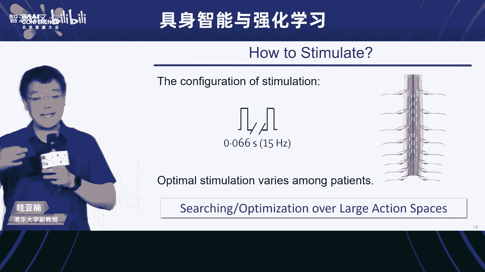

那么如何来有效的来优化，来得到一个好的站立行走。

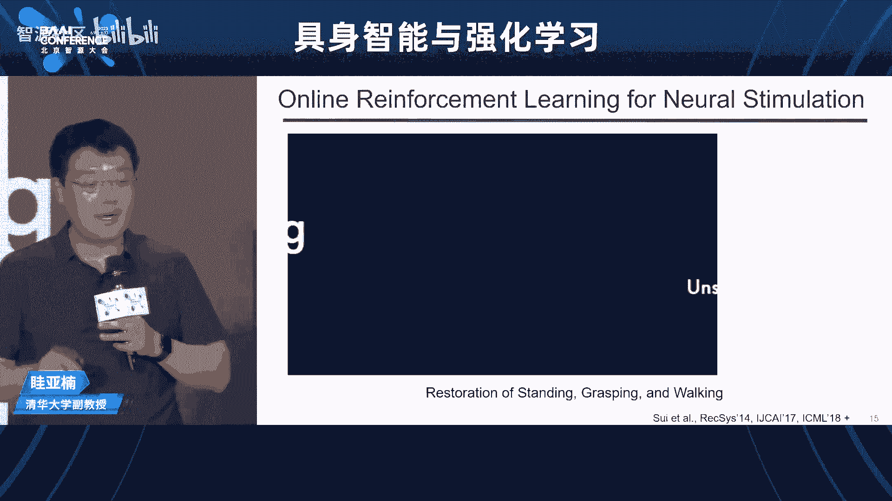

或者说抓握的一个结果呢，啊那么这是这是这个这是我们的一位患者啊，他呢由于脊髓损伤导致，完全没有办法控制自己下身的这个，任何一块肌肉啊，啊但是呢他在这个神经刺激的这个帮助之下。

大家看到说他穿蓝衣服的这一天，其实我们找到了对他还可以的这个参数。

但是效果不是特别好啊，那随着optimization的这个过程往前来持续啊，大家会看到说这个我们后面就能够找到，对于他非常好的这样的这个刺激参数，也就是说人的这个控制的参数，那么这个学习到的参数呢。

它基本上可以靠这个东西来实现一个，完全这个独立自主的，这个这个这个体重支撑的这样的战力啊，它仍然需要它前面的这个这个，这个这个这个这个架子啊，呃它仍然需要这个架子来保持一定程度的平衡。

因为平衡功能直到今天都是一个，非常非常难解决的问题啊，啊但是他已经这个可以靠自己的这个力量啊，通过我们的这个神经控制这样的一套系统，能够让他去站起来啊，那么还有一些相应的实验。

就是说来恢复高位截瘫的人的，这个手部抓握的能力啊，比如说他这个坐在轮椅上啊，他至少开了刺激后，他可以自己抓起话筒，他可以自己来拿起来这个控制器等等啊，啊那么在行走方面啊，在这个自外而内的这个控制方面啊。

我们其实可以来通过这样的一个，这个也是其实是同样的底层的方法论啊，我们可以对它来进行这个get training和get control啊，啊这是我们在ktc的这个这个合作者一起诶。

我们如何来学习一个外骨骼的优化的，一个步态啊，因为这件事情也是一个呃你的用户，不同的人穿上这个外骨骼机器人啊，大家会看到今天外骨骼机器人也是一个比较，这个这个这个比较关注的机器人里面的，一个领域啊。

就是你不同的人穿上以后，你喜欢的这些步态是完全是不一样的啊，那么如何来使得它能够，自适应人的自身的偏好啊，这个东西很难通过我人的这个，量化的反馈给他啊。

那么我们需要这个preference feedback，那么前面是我们通过外骨骼来自外而内的，来帮助人做步态的training啊，那么我们也进行了说，哎我通过一个这个机械臂啊。

自外而内的来进行人的这个手臂啊，运动功能的这样的这种这种这种恢复的训练啊，大家知道这个机械臂机械臂在今天啊，尤其是在中国这个我们能够买到jb的成本，是他快速的再再再再降低啊，那么很可能再过不长的时间。

大家获取一个机械臂的成本，跟获取一台手机的这个成本，可能可能都差不多了，那么在这种情况下，比如说家里面有需要附件啊，这个运动功能受损，需要附件的这些老人啊，或者其他这些情况下。

那么是不是我们能够有一个这个新一代的这些，这个人机交互的方式啊，好那么前面这些其实都是model free online learning啊，能够带给我们的一些这个可能的方式哈哈。

但是我们会看到说modefy online reinforce learning啊，仍然下面我们说safety的问题，一定程度上有解决啊，model free online learning啊。

这个局限就是会非常的大啊，所以我们会从model three走向model based learning of human motion control啊，我们如何来对于人的运动功能啊。

来进行一个更加有效率的这样的一个学习对吧，控制这个运动功能，一个更加有效率的学习，这是我们在构建这些模型时候的这个目标啊，呃所以我的这个研究组也是也是过去的几年啊。

这个花了相当多的这个功夫在这个事情上面，develop high precision，personalized primal court model啊，大家看到左边的这个啊，左边这个是一个个性化的。

人的脊髓的其中的一部分阶段的一个模型啊，啊他的这个capability，他的这个能力怎么样，我们会在后面看到啊，那么同时呢我们还要构建这个一个更加精确的，尤其是更加完整的人的骨骼。

肌肉系统的这样的模型啊，刚才问大家，我们其实都不知道人到底有多少块肌肉，我们做到今天，我们也没有办法说清楚，人到底精确的有多少块肌肉，因为人和人就是不一样，而且不同的建模方法也会不太一样啊。

好我们先从这个神经的这个建模来看啊，我们是通过神经建模，我如何来说自己的模型建的准不准啊，这其实是一个非常非常tricky的一个事情啊，因为运动功能的这样的一个建模，很多时候我们这个测量比较直接。

那么神经呢也是因为我们有比较好的条件，和我们的合作者一起，可以在这些这个患者的啊，这个实验的这种过程中，我们做一些相应的数据的采集啊，那么我们一个人的神经系统的这样的，一个建模啊。

我就可以通过比如说哎大家看到这儿，我一个电极的这个触点点亮了啊，点亮了以后呢，我的模型可以告诉我说诶，不同的种类的这个神经元的，在这个周边的发放的这个发放率是怎么样，更进一步的。

相应的这些肌肉本身的这个活动的，这个活性是怎么样好，那既然能做这件事情，我就可以根据它其实来做一个close loop啊，大家注意到这是一个新的coop，它是用来做什么呢。

它是用来来优化我们植入的这个电极，到底应该长成什么样啊。

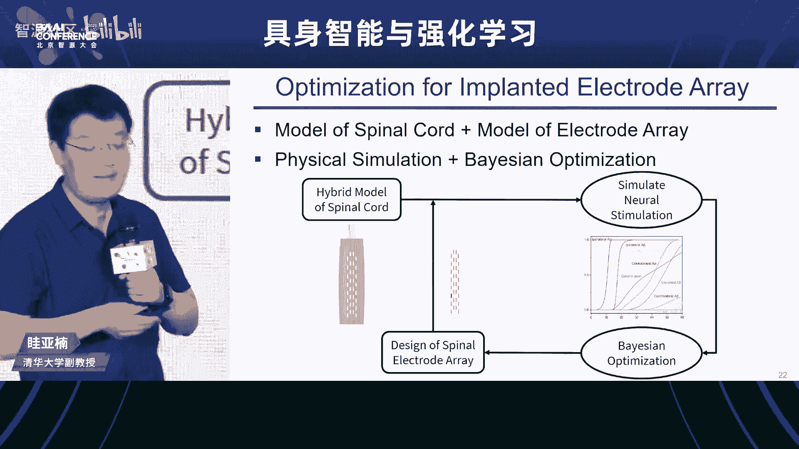

那么今天我在这里不展开，说整个的这个优化的过程啊，本质上它是一个bain autimization for the，desire of lectual rate啊，因为本身我们的模型的。

计算的复杂度是相当的高的啊，我没有办法来保证说诶，我把所有可能的这些这个空间里，所有可能的电极的设计我都放进去，让模型把所有可能的这个刺激的，这个结果都跑出来，所以还是要采用一个这个在线学习的方式。

我们去逐步的去调整诶，这个电极的这个参数是怎么样啊。

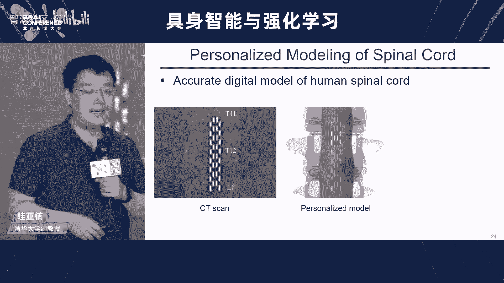

好那么我们可以对电极来做优化，我们把优化后的电极，可以来植入患者的这个这个体内啊，那么对于它来进行个性化的这些模型的构建啊，所以大家在右边看到的这两个，这就是一个特定的患者，一个特定真实的人的。

他的我们叫数字孪生也好，我们管它叫做这个他的embodied，这样的一个这个模型的构建也好啊，那么它可以干什么，它可以来帮助我们预测一个神经刺激，到底产生了什么样的肌肉活动啊，大家看到左边。

这是我们关注的这个和站立行走相关的，几个主要的肌群哈啊那么好，大家看到这是一个我可能的刺激模式，我通过这个刺激模式，后面整个的过程全部是数字化的啊，我通过这个数字化的这个模式。

我就能够学习出来说哎我这些不同的肌肉，两条腿各六条肌肉，它们的激活程度是怎么样的，好前面是一个例子啊，这里是三个例子诶，不同的这些刺激模式，大家会看到说哎我这个刺激模式，这些肌肉激活了这个刺激模式。

看着也点亮了不少这个电极啊，但为什么没有肌肉激活啊，这个时候我们的真实的这个实验，和我们模型预测出来的之间，有相当高的这样的这个吻合的程度啊，那么这也是一些相应的这个统计的数据好。

那么前面来验证我们神经建模的这个准确性啊，那么我们在肌肉建模上呢，那我们也是在过去的几年里面，我们的组里面来做了这个full body，human muscular skateful modern啊。

the control based on this model啊，我们进行了一个比较全面的，人的这个整个这个肌肉啊，还有这个运动系统的这样的一个构建，大家看到我没有超过150个。

这个reg body segment，超过250个这个joints，然后超过800个，这个这个这个这个这个整个肌肉的这些单元啊，大家注意，这个这个这个这个单元不是我们的肌肉束。

这个单元是我们在数字模型里面，可以把它拆开的这些小的单元啊，那么基于他呢，我们就可以来进行一个比较高质量的这样的，一个这个呃，这个这个人的运动功能的这样的一个描述理解，以及基于它的控制啊。

所以这是一个快速的展示一个例子，我们对于手的控，我们对于手的建模，对于脚的建模啊，在这里，因为我们是ai community，我就不放那个解剖的那些，那那那那那那那那那些结果了啊，就都是要和人的真实的。

这些解剖的这些结果去进行一定的对应啊，好那么这样的一个高自由度的，一个高复杂度的啊，这样的一个模型，我们也是可以通过hierarchical reinforcement learning啊。

大家看到hierarchical reinforcement learning，这个keyword本身也在前面两个talk里面都出现了，它确实是一个我们控制一个高维的空间的一个，有效的这样的一个方法啊。

那么它也是我们从word model到self model，最终来实现self control这样的一个路径，好最终总结我们在这个路径下呢，这个我们核心关注的是learning to move啊。

然后呢我们从model free online，ry force learning到这个model base，model based learning of human motion control。

这这样的整个的这个路径啊，好这个这个大家如果感兴趣的话。

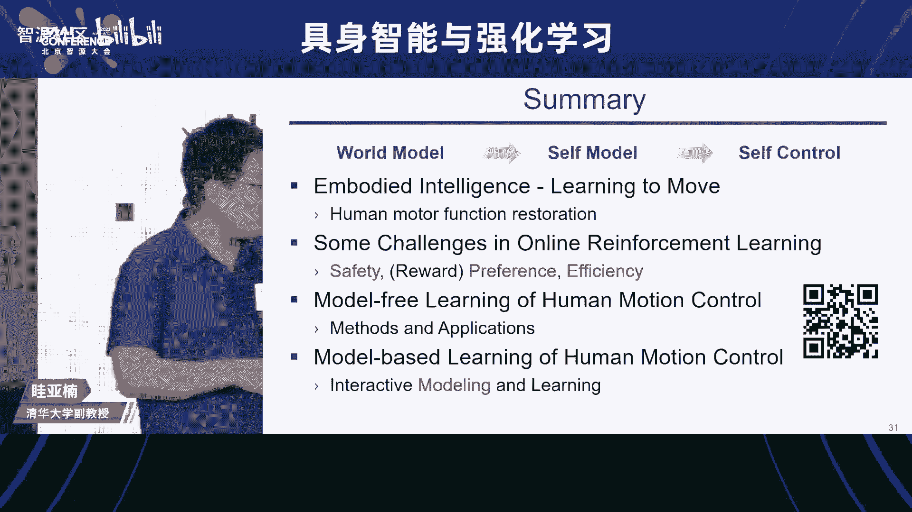

更多的这个内容可以在我们的这个网页上，可以看到，好谢谢大家，这个非常感谢孙老师的精彩的这个talk啊，应该说我们今年呃，人形机器人是一个非常火热的话题，我们没想到今天我们的这个talk。

竟然能把人类的这样的这个运动和机器人，外骨骼还有强化学习结合在一起，应该也是非常呃大开眼界，那么下面呢我们有请这个呃蒋树强老师啊，给我们带来巨深智能中的视觉导航，那么我们讲今天的巨深智能里头。

涵盖了很多重要的任务，应当说呢这个在视觉驱动下的这个导航，就是其中大家研究啊很广泛，而且非常重要的一个任务，那么让我们来介绍一下蒋述强老师，蒋老师是中科院计算所的研究员，博士生导师。

国家杰青ccf多媒体专委会秘书长，中国人工智能学会智能服务专委会副主副主任，主要研究方向是图像，视频等多媒体内容分析，多模态智能技术和呃食品计算，主持承担了科技创新，2030新一代人工智能重大项目。

国家自然科学基金等项目20余项，发表论文200余篇，获嗯授权专利18项，先后获得中国计算机学会科学技术奖，c s i g自然科学二等奖，吴文俊，人工智能自然科学一等奖，北京市科技进步二等奖。

让我们热烈欢迎蒋老师的报告，给你查出来，好的谢谢王老师的介绍啊，也很高兴能有机会到这里来跟大家来交流一下，巨神智能中的视觉导航技术啊，听了前面三个报告啊，感觉压力很大，大家做的都很好，然后呢。

我们实际上呢是从这个巨神智能中的，这个下肢的一些呃路径规划和他的一些行为。

然后开展的一些研究工作，呃首先呢是这个研究背景啊，这一页我想就不用讲了，大家也都知道啊，然后呢这个从这个机身智能角度上来说，可能大家可能关注的很多的，实际上可能是从人工智能啊。

实际上关注更多的是这个离身的智能，我们做一个机器学习的算法，然后的话啊做一个这样的问答等等的话呢，实际上是一个简单的输入和输出，但是呢巨神智能实际上是要有一个本体，然后的话他在这个环境中。

然后来进行一个呃一个交互啊，所以的话呢，就是它应该是一个巨神化和情境化啊，巨神智能呢可以和真实的世界交互来完成任务，就是这里呢我拿一个语言为例吧，就是我们说的任何一句话，它实际上都是啊在这个环境中。

或者是在这种琴颈的一个上下文的一个一个下，面，可能对它的理解可能才有一定的意义，所以的话呢就是在很多情况下，就是我们的人工智能的这些任务啊，这样的一些技术，实际上呢都是和我们的实际上。

下文都是啊紧密的相关的，当然从巨神智能这个角度上来说呢，它的内涵可能是更加的丰富，它实际上是要有一个巨深的体验，有一个巨深的反馈，有一个巨深的学习，有一个巨深的增强。

然后的话来完成一些跟自身有关的一个任务，就像我们小孩子，就是我从来没有见过这个东西，我把它不断的来学习，来提升我们的能力一样啊，当然跟它相反的，就是我们这样的一个简单的输入和输出啊，这张片子呢。

实际上是从最近的一个所谓的文章中拿过来的，我来呃做一下示例啊，就是呢我们现在很多做cv的，可能呢都是给一张图像，然后呢我们可以做分割，做检测啊，做分类都可以啊，包括的语义分割呃，但是这个巨神智能呢。

实际上它更强调一个动态性，就是我们在一个环境中，然后的话来不断的观测啊，不断的决策啊，不断的来得到反馈，然后再完成我们的一些相关的任务啊，呃当然从这个角度上来说呢，就是呃他有一个这个摩拉维克的这样。

一个悖论了，就是它的一个基本基本的一个意思呢，就是说我们可能呃就是啊很多这种简单的输入，输出的这样一些问题，可能我们可以回答的很好，但是呢一旦涉及到行为，就是感知，认知和行为一旦结合在一起。

可能现在的这个人工智能的能力，可能连个一两岁，两三岁的小孩子可能都还达不到啊，他实际上需要这种巨大的计算资源，需要呢我们对很多这种任务的这种复杂的一个，结合等等等等，刚才呢呃这个苏老师也讲。

这个internet ai这一块呢实际上是非常火热的，它实际上可以说是这个，离身智能的一个典型代表，实际上呢他也非常伟大，我觉得也非常有用啊，但是现在呢大家也逐渐的在关注啊。

巨神智能可以说呢是和呃这个internet ai，我认为呢是和一个并驾齐驱的一件事情啊，当然它呢呃可能未来的空间可能会更大，然后呢，我们想象的这样的一个可能性可能会更多，当然呢给我们带来的挑战也更大啊。

我至少我现在认为吧，就是从巨神智能这个角度上来说，可能才刚刚开始，可能很多任务才刚刚被设定出来，或者呢可能他刚刚被初步的设定出来，因为在我们这种复杂的这种，真实的物理世界中啊，怎么样让这种智能能力。

真的能够满足我们人类的需求，或者说呢能够达到人类的这样一个能力啊，就基本的这样的一些行为能力啊，我觉得还有很多的工作实际上需要做的，就是从这块来说呢，就是巨神智能呢。

它实际上还是呃以这个多种任务相结合的，这样一个事情啊，就是我们需要这个做这个呃听觉啊，需要有视觉啊，同时呢也需要有语言的理解啊，有记忆啊，也有导航，然后的话有动作，包括有反馈，当然现在呢。

我们实际上还是在一些具体的任务上来来做，包括我今天汇报的啊，视觉的导航，包括就是像很多我们三维物体的理解啊，包括可能视觉和语言的，就是叫interactive的q a等等的话呢。

实际上都还是很多具体的任务，但是真的像像人一样这样一种啊，相当于啊这种能够全面的这样的一种智能能力，实际上还有很长的路要走啊，这一块呢，实际上是这个，我们肯定是需要有一个智能体来做支撑的呀。

这一块实际上包括人形机器人啊，包括很多机械臂啊等等的话，实际上现在都得到大家越来越多的关注，这也是我们可以开展这个方面的，一个重要的基础，当然机器人可能只是他其中一个重要的方面，但是也不仅限于此啊。

包括天上飞的啊，包括水里游的对吧，包括可能我们这个周边的，可能其他的一些啊东西有可能都会啊，对我们这个剧他都可能会有一定的局限性吧，当然从现在的研究来说的话呢，实际上我们啊就是说的low一点啊。

从发paper的角度，可能现在大家还是在这个虚拟环境中，可能做的比较多啊，呃这个呢可能也是，由于我们现在这个得到大规模的训练数据啊，不容易啊，然后呢得到的这种多样性的反馈和交互啊，也不容易呃。

同时呢构建这样一个可以同台并同台竞技的，这样一个评测的标准和benchmark啊，也不容易啊，所以的话呢现在就是很多的工作，实际上都是在这种虚拟环境下来做的啊，但是呢我们肯定还是需要从虚拟环境走向。

真正的啊这种我们的实际环境，把它怎么样迁移到真实环境中，也就是seem to real这一块呢，实际上也是目前学界关注的一个重点，当然这一块呢实际上是特别特别的火了哈，我们实际上关注这方面的研究工作呢。

差不多是呃，就是当然对这个问题了解是比较早了，但真正的就是着手开始做，差不多是在19年左右吧，19年119年左右，但是呢呃当时也没想到后来会这么火，但是今年的话实际上大家就关注度特别高。

当然同时呢这里有一个就是相当于其他一个，关于巨神智能的一个调研的文章了，说这一方面是发的论文，是成一个指数级的指数级的增长啊，呃当然这里只是一个一个这个数据了，但是在我看来呢，我觉得这个事情。

实际上确实需要得到大家的关注，因为我们真正讲的这个智能，他肯定不是一个点上的智能，而是一个各种能力相结合的一个智能，或者是两三个能力，或者一个综合的能力的相结合的一个智能，这个方面的话呢。

他肯定是离不开我们的感知，我们的认知，包括我们的行为，特别是我们的行为，实际上它是反馈我们对环境的理解，和对我们一些推理能力的一个重要的方面啊，就举个例子啊，就是我们可能跟一些人在交流哈。

我们这个有的人可能说的话可能让我们高兴，我们就会笑，让我们不高兴的，我们可能就会沉默，或者稍微的皱皱眉对吧，这种的话实际上就是我们对这个画的一个理解，然后呢我们学习这个画之后呢，我们肯定还有我们的反馈。

所以的话呢我我个人认为这个人工智能的话，它的未来的发展方向，这个巨神智能是必不可少的，当然现在的话呢，实际上在国际上也有很多这方面的研究呃，特别是在这种模拟器上啊，包括一些相关的任务上啊。

不管是它的上肢，它的下肢啊，他的这种和语言相关的一些交互等等的话呢，实际上都有很多相关的工作啊，然后呢这里是有一些呃benchmark啊，就是像什么ai套，就是做导航哈。

包括现在最新的右下角那个protocol，还有1万个房间，实际上也是做导航，还有一些其他的呃，这里呢实际上也就像我们做cv的那个coco啊，image net啊，实际上呢在这上面你玩的比较赚了之后。

也可以得到一些结果，然后的话也可以发发论文，实际上就是现在也很卷，我觉得就是如果要达到这个soa的话也不容易，但是呢毕竟还是现在可能才做的，可能现在人没有那么那么多吧，这已经开始有一些了，当然了。

这个事情未来肯定是要满足我们真正的需求，真正的需求包括他的下肢能力，他的上肢能力啊，啊这里呢实际上是举了一些例子啊，时间关系呢我不展开的说了，就举一个例子，就是像这个归纳归纳还原。

就是将来的话就是在一个房间里啊，如果有一个东西它不应该放在这，就举个例子，这个东西它就不应该放在这是吧，它应该放在这个地方，那么你就可以把它找到，然后把它放到它该去的这样一个地方。

在这个里面呢实际上就涉及到一些综合的能力，包括啊它的一个导航的能力，它的视觉视觉这个相当于视觉导航，它的记忆能力，以及它的这样的一个相当于啊，移动和它的这样的一个上肢的一个抓取的能力，等等啊，都是有的。

另外呢还有一个任务是这个视觉语言导航，这个呢就是给你一句话啊，举个例子，我来到这个来到这个地方，我应该怎么样进入这个房间，可能有人跟我说啊，王鹤老师跟我说应该怎么怎么走，那么我就会按照这个指示。

然后看到一些关键的一些节点，然后就会跟他的语言结合起来，这样就涉及到一个视觉语言的匹配的问题，然后我再去呃，呃就是决策我的规划等等，这里也有一些相关的工作了，另外呢这个关于巨神智能呢，现在肯定离不开。

我们现在大家关注的这样一个计算的资源，我们在学术界肯定卡不是特么那么多，但是呢这个事情还勉强可以做一做啊，就是当然跟那些做大模型的呀，那些肯定没法比，但是呢现在至少在目前那些任务上。

还是可以有一些结果的啊，当然另外一个方面呢，从虚拟到现实实际上还是非常困难的啊，因为你在虚拟环境中可能能得到不少的结果，但是呢你在真实环境中，那完全是另外一回事，因为我们实际上也在真实环境中。

也试图搭建一个平台，我后面也会跟大家来介绍呃，但是呢它里面就是在边缘设备的这样的一个，适配的问题，包括这种里面的噪音的处理的问题啊，甚至包括那个机器人他可能走得不稳，可能会颠簸的问题啊，等等的话呢。

这些在这在那个模拟器的环境中，实际上都是没有的，所以的话呢就是在真实环境中真的能让它啊work，实际上还有很多的工作啊需要做，当然毋庸置疑，这一块肯定是有广泛的应用前景的，不管是在哪个行业啊。

什么方面肯定都是呃有广泛需求的，这个我就不花时间来讲了啊，呃对这一页是最近新加的一页ppt，就是多模态大模型嘛，你既然讲人工智能是离不开这个事情的，但是实际上也没啥讲的，简单一句话呢。

就是现在这个g p t拆的gp和gt four，肯定对我们的冲击力特别大，但是呢这个东西实际上呃，可能对直接的这个巨神智能，可能它的这个作用可能还相对有限，当然另外一个方面呢。

从这个大家也非常关注这个呃，面向具身智能的大模型或者中模型，或者简单一句话来说，就是这种pretra的模型，是不是能够对各种剧身智能的任务来产生帮助，不管是在具身智能中的一些跟视觉表示有关的。

预训练模型，还是跟视觉语言行为结合在一起的，包括在模拟环境中的数据，包括在真实环境中的数据，包括它们综合在一起的数据的联合的训练，这些是不是会对巨神智能的各种任务，是不是会产生帮助啊。

这些呢实际上还是有很多值得探索的空间，包括我们也试图想前前2年吧，我们试图也想训一个，就是把行为，视觉语言结合在一起的这样一个预训练模型，但发现没有那么多机器，后来想想就就算了。

对当然这个是谷歌做了个工作，实际上它还是非常好的，然后下面呢就报告一下，我们在视觉导航上的一些相关工作了，这个导航我们肯定都知道啊，就是包括刚才我来是用高德地图导航对吧。

然后的话天上的卫星实际上它也需要有导航，包括关岛啊，无线电啊等等，大家都知道，但是呢现在在剧身智能里面呢有一个呃任务，就是和导航有关，包不不管是叫这个appoint based。

就是点点点导航还是物体导航，还是视觉语言导航等等，都是都是的，它实际上呢就是在一个开放的环境中，然后给你一个目标，然后让一个智能体走到它该去的那样的，一个一个位置啊，就是我们人一个简单的说。

就是一个找路的这样一个能力啊，当然这一块呢肯定是我们人类赖以生存的，一个非常重要的方面啊，要不的话这个敌人来了，你跑不掉对吧，你不知道该往哪跑是吧，这个肯定是不行的啊。

当然对我们智能系统来说肯定也是非常重要的，这个也不用花时间去介绍啊，而传统的这个导航呢，就是从机器人的角度上来说呢，它实际上都是要建好图的，就是像slam啊这种方法，包括我们在酒店里。

在餐厅里这种自动的送东西送送送菜的这一块，呃但是呢我们这个在做视觉导航呢，实际上更多的是关注这样一个位置的环境，没有建图啊，纯粹的通过这种视觉或者通过机器学习，包括强化学习的办法。

然后来实现一个他自己啊，自动找路的这样的一个一个能力，就像我从来没有来到过，咱们这样的一个会议中心，我怎么样去找到这样一个房间啊，我需要有哪些能力啊，基本上是这么一个事情啊。

他肯定呢前期也是需要训练的对吧，我不可能啊，没有任何先验知识，我虽然没有来过这个地方，但是的话呢我肯定我之前去过很多的这种，类似的这样的一个会议，大清我怎么样去找，我肯定是要是要学一些东西的。

然后呢我还要跟根据我当前的观察，然后来判断我应该怎么走对吧，所以呢他应该有一个前期的学习，另外呢它还有一个当前的观测啊，他一个基本的一个架构呢，实际上他也是一个enter to one的一个过程啊。

这个实际上也没什么特别新奇的新奇的东西啊，包括我们的视觉编码对吧，包括呢它实际上呢还有一个相当于呃它的输出，实际上就是啊不是有像图像分类似的，是一个标签，而是他的一个动作，不管是左转还是前进啊等等等等。

另外呢它实际上还有一个强化，一个蒋丞的这样的一个机制，有一个reward，不管是正向的还是负负向的，它的一个基本的架构实际上是这样的，呃当然基于这种强化学习的这种视觉导航呢。

实际上要考虑各种方面的事情啊，啊包括就是要需要前期足够多的数据啊，啊包括呢就是我们对视觉表示，然后要有啊这样的一个比较强的能力啊，包括用这种预训练的模型啊，另外呢我们的训练方式也要考虑多任务啊。

利用这种啊matt learning的办法啊等等，实际上都是可以对这个事情起到一定的，支持作用的啊，对视觉导航来说呢，它实际上就像刚才讲的给另一个啊目标，然后的话在一个环境中没见过的环境中啊。

然后呢根据你输入的啊这种视觉的数据啊，然后怎么样来找到我们的这样一个目标啊，所以呢它的输入啊，它的输入呢基本上就是像这种视觉信息，当然也可以有其他传感器，包括有深度信息等等哈。

然后呢还有这种我们的目标到底要去哪里，然后的话这种语义，然后来支来支持我们，怎么样去找到他想去的位置啊，所以呢在这个方面呢，它需要就需要考虑，怎么样在做位置环境下的这样的一个啊，视觉感知。

这里的话呢实际上我们的很多视觉能力，不管是物体检测啊，还是分割等等的话，肯定还是有有有帮助的啊，包括这种开放不开放环境下的标签等等的话，另外呢还有这种未知环境下的这种路径的啊，路径的规划啊。

另外呢还有这种多多智能单元的这样的一个，协同决策等等，这样的，当然这一块的话，肯定还是有很大的这种应用需求的，特别是在这种开放的没有见过的环境中，举个例子是一个野外环境中。

怎么样去完成一定的任务啊等等啊，对当然从国家需求上来说也是需要的啊，呃我们前期呢实际上是做过一些呃，做过一些工作，实际上从机器人的交互上，实际从17年就有一篇文章。

然后的话呢实际上是从1119年开始做吧，然后后面开始陆续的有文章，就是做一些视觉导航啊，视觉语言导航等等一些相关的啊相关的工作啊，呃从视觉语言导航角度上来说呢，从视觉导航角度上来说呢。

他现在的技术就像刚才讲的，有个也是个encoder decoder的这样一个过程，大家看到这个基本的一个感觉，实际上你是跟做个图像分类啊，跟做个image caption也没啥区别啊。

它实际上就是给他做个视觉编码，然后的话给他输出，它实际上它就是一个一个行为，它无非就是加了一些跟这个强化有关的，一些东西啊，但是它存在的问题，现在主要还是一些黑箱的一些操作的事情。

当然前期也有一些用先验知识，然后来做一些相关相关事情，但是呢在这种情况下，就是这个先验知识怎么样来构建，怎么样它能自动的更新，怎么样来学习这种物体，物体之间的这种关系。

以及它大范围的这样一个尺度性的信息，实际上还有很多的问题需要考虑啊，对啊对，这是我们就是还是我们做了几个工作啊，就包括这个啊就是构建场景图，然后的话包括多目标的导航。

包括这种instance level的导航，就是说呃就是说就是这是一个举个例子，电子设备，它另外这有另外一个电子设备，他们两个虽然class一样，但是他们instance是不一样，是怎么做的。

另外呢还有这种相当于啊新目标的导航，就是zero shot的这种导航等等的话，呃下面的时间关系我可能就很快的，然后来汇报一下，我们在最近的几个工作吧，第一个呢就是怎么样来构建一个场景知识图。

然后来进行这样的一个物体导航啊，当然这一块呢就是也有一些所谓的生理的，心理的一个依据了，就是人的场景的一个识别的能力，跟他场景记忆的能力，实际上它是有一个互补互补的这样一个机制的，简单来说呢。

就是我们这个思路的话呢，实际上就是我们来构建了一个，层次化的这样一个场景图，就是包括这种物体啊，还有他的一个sub zone，和他的这种整个场景，这样的一个呃层次化的这样一个场景图。

然后呢来作为我们一个先验的学习的，这样一个知识图来指导我们在新的环境中，然后来进行导航啊，就举个例子是什么呢，就是说我们啊要找一个对，要找一个锅，那么呢我们前期实际上可以学很多知识，就是这个锅呢。

他应该在一个什么样的一个房间里，他可能在呃卫生就在厨房的可能性比较大，然后在厨房的什么位置上的可能性比较大，我们就可以学一个这样的一些知识图，但是它只是一种可能性的这样一种图了。

然后的话呢来指导我们后面来呃，在根据当前的观测再给它结合在一起，然后来给它进行一个视觉表示，然后来帮助我们去做导航啊，对这里就是我们的一个整体的一个流程图了，就是把我们这样的学的这样一个层次的图。

然后怎么样来嵌入到一个当前的这样一个表示，以及它的一个视觉输入录取，然后来帮助我们去做导航这样的，然后呢这个就是我们的一个呃整体的一个思路，就是我们啊就是它这个底层，实际上就是物体和物体之间的关系。

然后中层的话呢就是相当于一个啊，这个相当于一个子区域，举个例子，就是像那个厨房的一个灶台和他的一个，举个例子，洗手盆之间的这样一些区域，之间的这样的一些关系，最顶层的话实际上就是它的一个场景节点了。

对这里是我们建图的一个呃一个过程，就是呢它实际上通过这样的一个呃，通过一个这样的一个聚类，然后的话来建立这种典型的物体分布，然后边的话呢就是这种区域之间，相邻的这样的一个可能性，然后呢这是其中一个环境。

然后呢一旦有多个环境，我们要要多个学呢，就涉及到这种在场景层面的，就是这个cvs的这样的一个图，匹配的这样的一个啊一个工作，来得到一个啊对应的节点和边，然后来给它进行融合啊，然后呢有了这个呢。

我们实际上就可以来给它进行一个导航了，然后诶对，然后呢我们就可以给它进行这样的一个啊对，然后呢我们就可以给它进行路径的规，路径的规划，然后搜索这种最优的路径，然后的话来不断的去呃利用当前的知识去查找。

然后来做这样的一个行为的决策啊，然后呢我们这个图呢可以在这个学习过程中，它还可以不断的去进行更新啊，这个就是我们这个评价的一些方法了，都是在模拟器上，实际上这都是一些benchmark的一些东西。

就像刚才讲的，就是类似midnight coco啊这样的，在做图像分类的很多的这样的一些任务，大家如果想关注这个任务的话，也需要在这上面发发文章什么的，如果的话是需要需要有一些评测，基本上是这样的。

这个是21年的一个工作，他当时性能应该也还可以了，对这个时间关系这些就就不讲了，由由于我们加了一个这样的先验图呢，所以它会避免一些cos在视角，或者他有一个这种原地打转啊等等，这样一些情况啊。

然后呢第二个工作呢是我们最近的一个工作，就是我们基于前面那个工作呀，我们加入了一个啊因果分析啊，简单来说的话呢就是加入这个场景图呢，它不一定对啊，对这个可能在这对加入这个东西。

它实际上它不一定是对我们有直接的作用，是什么意思呢，我们前期学的这样一些经验，他你用上来呢，他有时候可能不一定起到好作用，因为呢如果跟前面的呃，就是跟前面的这样的这些环境，如果是比较熟的话。

就是已知环境和位置，环境如果比较类似，那么这个经验就会发挥正正面的作用，而如果布局差异比较大呢，他这个经验反而会起到一个负面的，负面的作用啊，所以的话呢我们就怎么样来考虑，能够自适应的。

合理的利用这样的一个前期的经验，这个s的话呢就是我们的观察，然后呢这个g的话就是我们的目标a，就是我们要做的这样的一个执行的动作啊，呃因此的话呢我们就利用了这样的一个呃，因果学习中的这样的一个思想。

然后用这种反事实，然后来解解耦出这种经验的这样的一个影响啊，这个街舞经验的影响呢，他有点像这个反事实的这个思想吧，他是怎么做的呢，实际上就是考虑，我们就是前期学的这样一个布局，跟我们当前的这样的一个呃。

观测的这样一个环境的布局，它们之间的这样的一个差异啊，时间关系呢它实际上就是我就要快一点，就是这个地方有一个他们一个差异，然后把把这个差异呢，然后放到我们的这样的一个反事实的这样一个，学习框架中。

然后来去除它负面的这样一个经验的影响，然后的话呢让他如果是新环境的话，没见过的环境，那么我们就少用过去的经验，如果是跟之前的环境比较像的话，那我们就多用之前的经验，差不多是这么一个思想啊。

这里呢是我们一个整体的一个流程图，它呢实际上是对这个呃，现在的话呢它实际上是可插拔的，它实际上对于现在就是各种的这样的一个，导航的框架，都是可以计算到里面去的，这是我们的一个一些相关的评测吧。

一些数据集呃，然后时间关系呢我就简单说一句话，就是呢他对这种布局差异比较大，就是跟前期如果没有见过的情况下，然后呃就是我们的性能可能会提升更大一些，在这里有一些实验结果啊，时间关系就不展开说了。

这里还有一些过程的可视化，然后最后呢我们在汇报一个工作呢，就是我们做这种多目标的导航，就是前面介绍的实际上都是他只找到一个物体，但是呢让他找到多个物体的话呢，我们就要考虑就是我们前面走的路是不是会对。

后面要找第二个物体，第三个物体的时候，它是不是会有帮助，所以呢他要考虑多任务之间的，这种长期的一个规划的能力，来提升它这个导航的这样的一个效率啊，因此的话呢我们的一个主要的一个想法呢。

就是来探索呃这种存储探索库的空间，然后的话来构建这样的一个啊语义图，然后的话呢再利用啊知识和数据双驱动，这样来形成一个长短期的这样一个，自适应的策略，来提高它这种导航的效率啊。

对这里是我们的一个基本的一个框架了，基本的一个框架，它实际上包括就是这种相当于一个空间的，这样的一个记忆机制，然后来建立空间语义图，另外呢我们还要根据当前的这个观测，然后的话呢来做一个预测。

最后的话呢再给它有一个门控机制来呃，来决定来决策他后面是一个长期的，还是一个短期的这样一个策略啊，包括就是这里面就包括这种空间的这样的一个，语义的这样一个记忆的记忆的机制啊。

啊他这个呢实际上就是现在这种用cv的办法，然后来构建这种空间的一些啊语语语意图，然后来给他这个构建一个这样的一个，前期的这样的一个知识表示啊，呃另外呢我们可能还要啊考虑。

就是用它这种数据的这种驱动的策略，然后的话呃，通过强化学习的模型来学习这种空间的这样的，一个呃一个表示，然后来预测目标的这样一个潜在点啊，后面呢我们再用这种门控的机制来筛选，这样的一个导航策略。

它有一个长期策略，一个短期的策略，来给他进行一个下一步的一个动作的预测啊，然后呢这个就是我们的一些评测啊，这个是在呃，这个json和和那个和这个什么medical的3d上，然后来做的一些相关的实验啊。

对这是一些实验的实验的结果啊，然后和现有的方法相比呢，它实际上就是我们考虑了这样的一个，前期的经验，所以的话它的路径的规划实际上会更短，然后最后还有两分钟的时间呢，我给大家汇报一下。

我们从模拟器到现实环境中去迁移的，一些相关的工作啊，呃当然这个发论文发论文是一回事，然后真的要搞一个这样的环境，真的是要得有一个这样的一个呃，就是我们构建了一个一一个，140多平米的这样一个环境。

然后呢，这个环境呢它实际上是可以动态变化的啊，就是一会我会讲，我们也有一个这个local boat的一个机器人，然后来做这个事情啊，然后当然要做的话呢，有一个事情就是他seem to real。

就是他这个表示，实际上是需要有一定的迁移性的，就是你在虚拟环境下的表示，他肯定不能直接用在真实环境中，所以怎么样能够让他们这种进行一定的适应，实际上也是需要考虑的。

当然你也可以真实环境和虚拟环境联合去训练，training啊，也是可以的啊，这里面的话呢，就是我们相当于构建了这样的一个呃，就是呃相当于一个建图的，这个相当于是构建一个场景的一个，碰撞图的这样一个机制。

然后的话呢我们在真实环境中呢，实际上就是呃来建了一个demo，就是说是能够在任何一种环境下，任何一个位置，他都能找到我们想要的那个目标，来规划他的这样的一个行为行为路径啊，就是我看看啊。

它这个呢就是我们这个户型图啊，它实际上是可以随时改的，就是任何的物体它也都是可以随时改的，对这里也是一些相关的，就是去找杯子的一个demo，这个时间关系我可能就呃不给大家来展示了。

然后这里呢实际上我们是希望将来能做这种，更复杂的交互加上人脸识别啊这样一些能力，然后他能够就是实现把东西送给谁，这样的一些相关的任务啊，啊然后包括在一些有障碍物的情况下，我们也能实现它的这样一个目的啊。

包括就是它可以在这样一个环境中，在新的环境中，它可以不断的就是来迭代呃，就是一轮一轮的来提升，然后让他的这样的一个学习能力，会逐渐的越来越好，就是说叫边导航边增强是这样一个过程啊，然后呢。

我们前期一些工作实际上也是用在了一些地方，包括外骨骼机器人啊，包括一些服务机器人等等，最后是个总结展望，就是呢现在呢我们认为就是这一块呢，实际上呃确实有很多工作需要做，但是难度实际上和挑战还是挺大的。

呃做导航这件事情呢，实际上也是一个非常非常具体的工作，可能呢现在可能还处在研究阶段吧，然后真的在开放环境中能够找到一个物体啊，它包括它的视觉能力，包括他的规划能力，包括他的学习能力。

实际上还有很多工作需要做，另外一件事情呢，就是这个seem to real也有很多需要考虑的事情啊，时间关系就不展开说了啊，另外呢，我们这种大模型肯定是我们非常重要的一个呃，非常重要的一个工具。

但是怎么样用在这种呃这个巨神智能里面，肯定还有很多需要考虑的地方啊，啊呃未来的话肯定是值得期待的吧对吧，这个时间关系我就不展开说了，这是一些合作者和我们发的论文，好谢谢大家。

这个非常感谢蒋老师给我们带来了，这个具身智能呃，具身智能中啊，重要的一些任务的这个前沿进展，那么我们下面呢就开始我们的panel，discussion环节，你拿个快做，上来就来做做爱时先生吧。

有没有因为他们是一起的，要么搬开不行，不知道可以换，好那么这个呃感谢再次感谢啊，四位嘉宾给我们带来了这个异彩纷呈的四个，这个talk呃，涵盖了我们剧深里头很多方面的精彩的呃问题，和一些前沿的进展。

那么下面呢在这个圆桌讨论的这个环节呢，我们将去呃，我们将根据具身智能的一些啊新的这个特点，和我们人们关心的啊，通用的巨神智能体，据称大模型这一系列重要的问题展开讨论，也欢迎呢这个台下的听众呢。

积极地参与到我们的这个圆桌讨论当中，那么呢我呢也是这个啊抛砖引玉啊，从这个就是今天这么多嘉宾啊，这个介绍了这么多学术和研究成果，那么我们呃想先讨论的第一个问题，比较泛一点对吧。

就是啊那么相比于之前的一些，我们讲离身智能也好啊，这个internet a i互联网智能也好啊，那么具深智能到底引入了哪些新的研究，问题和挑战，那么呃我们要不然就这个从苏老师啊来。

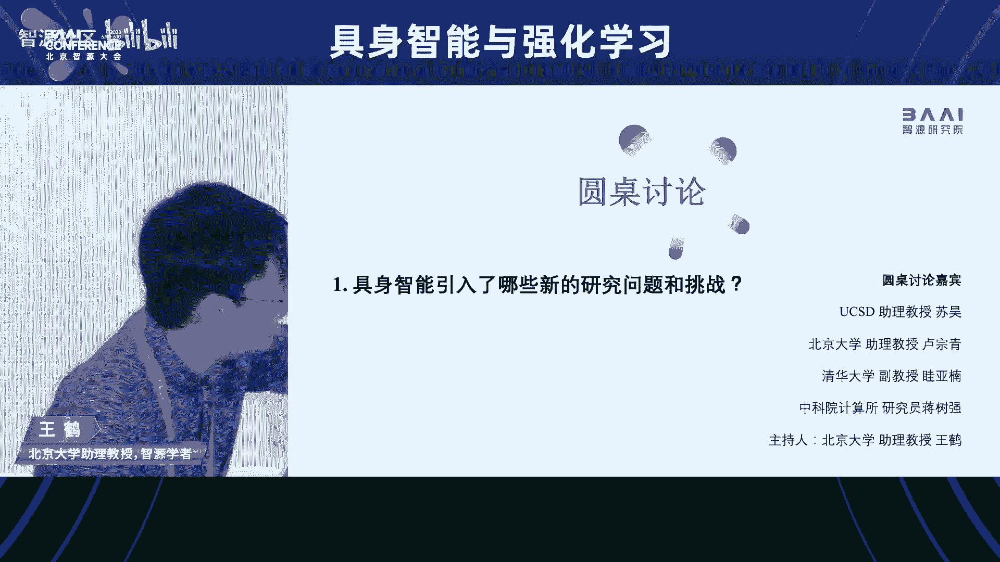

可以先讲一讲啊，好嗯这是一个挺难回答的问题，我感觉很对啊，但是从我的观点来说呢，我会认为这个啊就是数据的引入，让大家必须要思考，怎么把这个感知认知和行动给他耦合起来。

对这个耦合呢就是我们面临的我心目中啊，这就是我们面临的一个，这个最大的这么一个挑战啊，这个耦合的核心呢，其实在问对世界怎样的一种建模，是最有效的建模，那么尤其是如果这背后呢。

有所谓的这个叫这个这个新的概念的涌现，这件事怎么弄，对吧啊，你当然可以说用传统的方法这个啊，gradient descent，你说这个就不叫概念涌现了吗，那么问题在于这样的啊，分布式的一种表示。

在多大程度上还可以支持推理，可以帮助你实现好的组合泛化，也就是说这样涌现的概念，在多大程度上要变成symbolic的，那么如何能够把这个涌现的概念变成symbolic，呢对吧。

那么这个这个这个连续的梯度下降，怎么能跟自爆这个结合起来，我觉得这是一个可能从理论上很本质的，这么一个不太确定的地方，可能有些其他的我可以把这个一些别的挑战，就跟别的老师来讲，确实比较难回答一个问题啊。

从我的角度来看的话，因为现在的话fdation model比较火，那么具生智能的话，fdation model相当于是把数据变成了知识对吧，尤其是large language model的话。

它其实就是学过了我们所有可能，互联网上所有的数据吧，那么他其实对于一个具体的环境的话，因为它只是语言，语言是一个抽象的表示，那么抽象它的泛化力强，就表示他对一个具体的东西的话，他不能够描述的很细节。

那么对于large large model来说，把它融入到具生智能的话，它需要适应这个环境对吧，他需要在这个环境上面再去积累，关于这个环境的一些具体的，巨生的一些表象对吧，它或者是具深的知识吧。

如何在这样的啊这online interaction的过程中去让啊，不管是los anguard model也好，还是visual language model也好，让它融入到哦环境中。

不管是虚拟环境还是现实环境，我觉得是啊需要下一步解决的问题，挑战的话可能啊，另外一呃挑战的话还有一个一点吧，就是因为我我个人的观点，我是把这个large language model。

认为它是一个word model的一个抽象的表示吧，因为我们语言的描述的话，其实很多很大层面上就是描述的物物理世界啊，当然除了一些其他的之外，大部分都是描述物理事件，那么它是一个也是一个抽象的表示。

那么在剧生的时候，如何从一个抽象的物理世界，到一个具体的物理世界，那么如何学习一个啊输入是visual的这么一个，input的啊的世界模型吧，如何把它结合起来。

去真实的从一个啊文本的或者symbolic的表示，让它具体到啊每一个pixel上面，我觉得这个word model就是基于visual information word model。

可能是我们接下来要做的也是有挑战的事情，好谢谢，对，我觉得这个呃卢老师谈到的就是说呃，我们现在有了机器人，那么我们在这个呃巨深机器人的学习当中，很重要的一点呢是引入这样的一个world model啊。

那么呃这样的一个概念，就是能不能让卢老师可以在啊这个阐述一下，你觉得这样的word model为什么在过去的一些，比如说我们讲internet ai时代，它并没有那么的重要。

那么现在呢啊这个包括这个ya queen等等啊，图灵奖这个得主，在一系列重要的这个报告当中呢，反复谈这个世界模型，那么它对巨深智能带来了哪些，这个的它的意义是什么，它的研究问题是什么啊。

因为这个word model的话，其实出处就是怎么说呢，从强化学习的角度来看的话，因为model base的rl它本身就是word model对吧，只有model去做一些planning等等。

因为之前我想从比如说internet的的ai的任务来讲的，话，从cv的任务来看的话，他其实没有涉及到，比如说决策的这一部分对吧，如果我们接下来要做的是屈伸智能，我们要去考虑的是每一步我要做什么动作。

那么这个时候啊从强化学习的角度来讲，它就是可以用比如说基于word model base的方法，或者model base rl的方法去做去做planning，我觉得这是我可我自己的一些浅薄的理解吧。

我这地方补一下，因为我们组做了很多的这个这个model based style，那么有什么问题呢，就是说嗯internet ai时代你做前向预测对不对，那么预测完了之后对错你是很难讲的对吧。

他就是让人看一看到了具身智能的话，这个事他有很大的问题在于所谓model bear啊，它是要在一个world model，它是要跑很多步，这个过程它会有误差积累了。

那么而且呢从一个确定的这个这个初始状态，世界，它是随机的，所以呢其实你这个world model，它必须要做到是一个long horizon的一个，generative model。

具备uncertainty，而且还要这个这个它的它的distribution，还要correct这样一个东西，那么在在具身智能之前，他哦几乎都是无法验证的，但是自身智能的话它是可以的。

因为最后它好或不好，它将决定task success rate，对对我觉得这一点上我也是这个嗯，非常同意两位这个老师的说法，因为我们人的学习呢本质上是一个perception，action loop。

也就是说当你在感知这个世界之后呢，你要根据你的感知呢，去这个执行一个您认为有效的行动，那么这个行动呢将进一步的改变这个世界，那么刷新这个世界的状态，那么你在重新去进行perception。

所以在这样的perception action loop当中呢，你当你去这个去想，去take一个action做一些行动的时候呢，如果你能对这个世界进行建模，那么你就能预先知道，那么我做这样的一件事。

我去碰这个杯子，到底是能把它拿起来，还是会把它打翻，那么这样的事情呢，对具身智能体在复杂的长城的交互当中去，怎么样去做正确的交互学习，和怎么样去选择正确的交互方式，都是非常重要的。

所以我们看这个world model，可能在具身智能当中会被一呃，作为一个聚焦的一个问题去研究，那么呃这里头其实也引入了，就是刚刚这个孙老师这个讲座的时候，的一个问题，就是说我们具身智能当中。

其实经常有这个safety安全性的考虑对吧，那么呃我想让崔老师也谈一谈，就是这个具身智能与安全，或者是从您的角度上讲，有哪些引入的新的问题，在之前的这个呃智能时代是没有被充分考虑的，啊，好的谢谢啊。

我就接着这个问题我谈呃这个两点，我自己的这个这个感想，不一定是对于这个问题的回答，很有可能是给大家提出了一个新呃新的问题哈，一个是关于巨神智能相关的这个新的研究问题。

一个是挑战啊啊那么我不知道在座的各位，就是大家是最早听到巨深智能或者是具身性，这样的一个描述是在什么样的一个场景下，是在计算机科学，人工智能的这个领域里，还是在其他的什么这个领域里啊。

这个因为对于我来讲的话，我最开始认识这个词是更早在哲学领域里面啊，就大家如果往回翻说诶在哲学领域里面，这个来谈这个具身性啊，还有甚至是这种就是巨深的这些智能的，这些表象，好像是比我们。

至少是比我们这一轮的这个巨神智能，在人工智能领域里活起来要更早的啊，那么这里面其实有一个很有意思的现象哈，大家会看到说，随着我们自然科学和技术的往前的进步，哲学是在退守啊。

哲学在越来越退到一些这个更小的一些领域里，比如自然哲学的数学原理对吧，大家知道是知道这本书是讲什么的，牛牛顿的嘛对吧，自然哲学的数学原理，讲力学，讲这个讲物理学的，后来有了物理学。

我们就不再管它叫化学等等，我们就不再管它叫做这个自然哲学了啊，那么哲学领域里面还有一个这个科技，哲学里面就是非常有名的，前面有一本书叫做这个计算机不能做什么啊，可能我们计算机专业的。

有些同学如果对哲学感兴趣的话，会看到那本书，这是大概五六十年前吧，可能是那个时间呃呃呃可能没有那么早啊，几十年前反正说诶这个计算机能力很强，他但是他不能做什么啊，哲学家认为说有些事情计算机是做不了的。

人是具有这种独特性啊，这这些，然后过了些年，计算机发展很快啊，那么哲学家又写一本书，同样一个哲学家叫做计算机，仍然不能做什么啊，啊带大家看，感兴趣可以看一下这这两本非常有名的书，计算机仍然不能做什么。

这本书当时里面的那个仍然不能做什么，今天又有大量的被break掉了啊，所以其实结合着哲学家的这些思考，还有具身智能的这个概念在哲学里面的更呃，更加的这个早的这些提出，其实在座的各位。

如果大家想找新的研究的问题，尤其是跟我们人工智能的研究的问题，可以去哲学家现在描述的这些，这些仍然健在的这些领域里面去去找一找，可能会找到一些这个这个有意思的东西啊。

所以本人巨人智能相关的这个新的研究问题，一定和这个里面会有些关联啊，那么挑战方面，其实刚才刚才其实这个呃，接着王鹤老师问的这个问题，就具身智能本身其实是机器人的系统啊，啊，因为刚才蒋老师讲的一个。

就是说这个它的具身智能的一个重要的载体，就是机器人，机器人作为一个重要的载体，然后呢军事智能很多时候和环境交互，也有很多时候是在和人在交互啊，那么和人在交互的过程中的，这些安全性的问题啊。

因为如果他是一个完全的，这种无人的环境里面啊，比如我们的这个就自动的码头啊，这种自动的这个工厂啊等等的，这些安全性的问题相对来讲小一点，更多的其实就是一个经济成本问题，但如果是一个和人在交互的这样的。

一个环境当中，其实这个里面的这个算法问题和，这个里面的伦理问题啊，就都会是可能比较严重的，这个这个问题，有些也许我们能够有技术性的解决，有些可能不一定有技术性的解决，像大家可能这些年会熟悉的这个。

the trolley problem对吧，一个火车你是撞五个人，还是拐一下去撞一个人，这样的这种这种伦理判断的问题啊，那么我们其实在前面的这个临床实践过程中，差不多10年前。

我自己亲身的体会过这样的一个冲击，就是刚才我在报告里面讲，我们在做安全的强化学习的算算法，在线的强化学习算法啊，因为在我，但是我们知道，如果我们可以放弃一定程度的安全性的话，算法的效率会显著的提高对吧。

我不要求现实世界里面，一定我们的每一个行为都那么安全，那我的这些采样的效率会显著提高，但是它带来的负面是什么，就是一旦有这些坏的发生啊，在我们2012~2013年的这部分，临床实验里面。

就会发现说当时没有考虑安全性的问题，一旦有坏的这些事情发生，人本身对于算法的信任程度，和对一个智能系统的信任程度，是远低于对于另外的人和这个专业的专家的，这个吸引程度啊，马上就不让我们在做这件事情了。

所以当具身智能，我们的这些能力系统的能力在逐渐提高的时候，可能还是要特别的小心去看，他和人在交互的这个过程当中，有哪些是我们要特别注意的这个问题啊，对这我大概一些想法好。

这个我觉得就是安全可能是一个fundamental的，对于这个家用制啊，对于智能机身机器人的一个挑战，但是我们从就是学术上，那么呃，我觉得今天蒋老师给我们这个深度的展示了。

这个呃据深导航里头的一系列问题，我也想请这个蒋老师任就是从学术的角度，研究的角度上，除了这个导航以外，还有哪些值得研究的问题，特别是可能在座的很多同学啊，都有发表的需要对吧。

那么你们在做paper的时候，还有什么这个有很多空间的问题可以去研究。

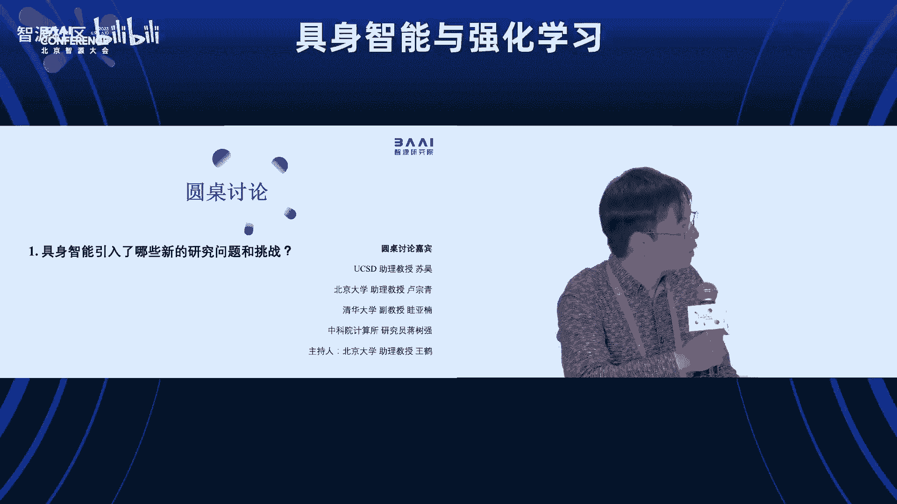

对好谢谢，是这样啊，就是我觉得巨神智能，实际上给我们很大的想象空间，呃，我们反正都知道人工智能那个图灵测试是吧，现在的这个图灵测试到什么状态和阶段了，我们先不去评价，但是呢我们可能从自身这个智能机。

深智能这个视角来说，我们可能也希望一个具身体，是不是有这种类人工智能，人就是这种智能性的这样的一个感觉哈，这个我不展开说了，但是呢在这个过程中，实际上是有很多问题值得我们思考的，特别特别多的问题。

这个说很多事，多长时间可能都都都不一定能说完，但是呢我觉得这里面至少是考虑到一个事情，就是我们传统的很多人工智能的研究任务，就是因为现在我们有很多，很多人都说都在做做ai对吧，但是呢这个ai。

你一旦在这个距深这样一个场景下，那么它会发生什么变化，会有什么结合对吧，会有什么新的一些东西，我觉得这里面实际上是值得我们思考的是吧，就像cv的东西在据称智能下是什么。

n l p的东西在这个里面又是什么，包括陌生人的东西在里面又是什么，我觉得这里面实际上有很多，值得我们思考的东西，这个呢就是就像刚才几位老师讲的，这个里面，实际上这个这个问题很大是吧。

我觉得一句话说不清楚，但是呢我们实际上呢，你看到任何一个人工智能的关键词，我们都可以，从你认为你你理解的这个巨神智能的这样一个，视角下面看是什么东西，后面又会怎么发展，我觉得就会有一些新的东西出来是吧。

我们共同去思考这个问题，可能会未来会带来很多变化啊，这个是我想讲的第一个意思啊，第二个意思呢，就是嗯就是这个大家都在讲这个学习是吧，学习呢实际上是两个方面，一个呢我觉得现在大家思路上逐渐的是在呃。

在这个reframe是什么意思呢，就之前反正就是图像识别啊什么的，就是train一个model，然后去test就完了，现在呢大家开始这种大模型的思维了，什么东西都是说你个大模型训的东西怎么样。

我还是想讲一些机器学习的东西啊，机器学习它反而是一个training data，一个test data是吧，现在呢是一个big training data，然后呢在一个test data下去做对吧。

那么呢在具身智能这样一个场景下，实际上呢它还是要有一个环境的，有一个动态的环境和一个上下文的是吧，在这种情况下呢，这种大模型不一定好用，就举个例子，如果说我们家里面有一个服务机器人。

他不需要认识那么多人物，他不需要知道，那么多知识，他只要知道那一个他真正关注的那两三个人，和有限的几个知识，他能搞定，能弄明白就已经非常非常棒了，但是这里面是不是能弄明白能搞定。

实际上也很也有很多东西值得探讨啊，这个我不展开说，我实际上就总结一句话，意思是什么呢，这个大模型和小环境怎么适配，就是巨神巨神智能，实际上是是这个我觉得是值得思考的，就是大家都也都在讲这个大模型。

什么将来可以用到这个用到用用你来用你了，但是不是真的能用，你来怎么用，你来用你来效果是不是真的好，这里面实际上至少到目前为止还没有一个，至少还没有一个特别清晰的答案。

但是这个大模型怎么样来用或者怎么样来训，我觉得肯定是有很多值得琢磨的东东西啊，这个我也不展开说了，这个话题也很大，这是我想说的第二点，第三点呢，实际上现在就像刚才那个徐老师讲的，是让我挺认可的。

实际上很多哲学啊，包括很多安全啊，人的交互啊意图，这里面是有很多值得思考的问题，我前段时间我闲着没事，我看了一些文章，我发现那个东西我本来想搞搞那个东西，我发现那个那个那个东西我搞不了那个叫啥呢。

那个叫那个theory of mind，可能也有一些相关的这些论文，就是讲这个讲这个什么人的这个意图啊是吧，人的目的啊，那个什么false belief啊，就类似那个东西，实际上它是真的。

你能够知道你该干啥了是吧，你你相当于你相当于就是，相当于要做一个懂事的人是吧，要要要要要知道你该干啥，就就就大差不多是那种感觉，好像有个形容词叫叫叫什么来着，反正反正就是说呢在一个场景下。

你要知道你应该你，你知道每个人的想法是吧是吧，知道每个人就类似那种，我看看我能不能说清楚啊，我用一分钟就类似那个叫什么，就是咱们经常玩的一个游戏，就是那个叫什么，是那个杀人还是叫什么。

就就就类似那个东西，你能不能分析出来谁是在谁是一个骗子，或者谁是一个什么样的东西，就是一个意图形的东西吧，实际上我们很多时候就是更深层的，实际上是要知道一些人的这种意图的，当然那个更多的伦理啊。

或者那个东西，我觉得肯定还特别特别遥远，咱们先不说那件事情，但是一个意图，这个事情我觉得还是有很多值得思考的啊，因为你最终实际上是要为人服务嘛对吧，但是这个东西我反正我觉得也不好搞，我我也说不太清楚。

但是我我觉得这个东西蛮有意思的，至少不行，我就说这些吧，我觉得就是这是认知层面啊，人对其他就是智能机器人，对我们人的mental state的一个建模，这个确实很重要，我们最后其实会讨论这个呃。

人机共融的这个问题，那么我围绕着咱们这个具身智能，引入了新的研究问题，我个人感觉啊在导航就是我们在移动能力之上，其实呢聚生智能里头很关注的就是manipulation，就是操纵的技能跟场景交互。

物理交互啊，比如说你用手抓取，然后你使用工具的这样的技能的，这个研究是非常重要的，这个研究问题，那么围绕着这样的一个技能研究，其实我们发现呢其实据深的这个很多模型，它里面都有很多的技能模型。

这样的技能模型呢，也需要很多的巨深大数据来进行学习，我们知道今天的这个就是啊chat gp t g p t4 ，它之所以成功，就是依赖于互联网上大量的图文对和文字材料，那么其实我们未来展望未来。

我们巨深如果要能发展出这样通用的能力的话，那么这样的这个巨深大数据啊到底如何获得，那么可能有很多不同的路径啊，比如说是从人类啊，通过遥操作采集一些这个demonstration。

也可能是通过在呃模拟器里冲进行啊，强化学习等等啊，那么我觉得这个问题呢也是很多，就是啊同学和这个研究者关注的啊，我也想听听这个啊大家各位老师的观点啊，嗯我先说好好好。

这个显然我个人感觉就是这个剧身学习啊，实际上，这巨神大数据它是一个很重要的一个bottle neck，没有巨神大数据，那么谈这个所谓巨深foundation model就是很难弹的啊。

但据深大数据的获得呢，这有两个问题，说人力摇操作采集或模拟器两种可能选择，其实背后吧这个还是缺很多的infrastructure，对我觉得这个很很大的一个问题，实际上缺infrastructure。

就是到了这个居身智能时代啊，我个人感觉我自己培养学生也是有这个感受，你进入到这个领域之后啊，这个工程能力啊它会变得很重要，不管你是打算做摇操作还是模拟器，背后其实都有很多的。

他其实可能还不是那种啊理论问题，不是那种原则性问题，比如刚才这个蒋老师，实际上提到了一些有关博弈论的，或者是等等相关，他还不是那个问题，他背后有很多很困难的工程问题，当你采用人力要操作的话。

那么一个困难是什么呢，力反馈怎么办对吧，那么我人力要操作，如果是只是做基础的抓取，这个应该是没什么问题的，二指手柔性的二指手做抓取，人类要操作，我相信是是一个手段，当然在这个setup下。

你就未必用人类要操作了，你可能手工设计算法也可以，不过更复杂的五指手精细操作，例如说啊这个这个，当然机器人可能也没必要做这件事，比如转笔对吧，人会转笔转的，刷刷刷的这个什么王者水平，钻石水平的那个东西。

你怎么能咬操作，这就是一个事儿了，所以说其实呢可能要弄清楚，相当于是把这些scale呢，或者这些技能呢呃定义一个层级，呃，如果有可能摇操作采集的用摇操作也可以，但肯定我认为有相当一部分。

它的摇操作难度是非常大的，那么回到模拟器，模拟器呢，表面上看起来这个这个啊这个有一些好处，但模拟器里边呢也有一些问题难度，你比如说这个首先是3d的内容，那真实世界所有的东西都在这儿呢对吧。

当然你要花钱买，是不是你要雇人去标这个你要有这个这个成本，但模拟器的话，首先要不让模拟器里有内容啊，这就跟你弄个电视台做节目很难的，是不是啊，然后呢这个内容你不光要几何，你的嗯。

刚才老师也提也提到了这个你的reward，你的激励怎么标啊，对吧，你稀疏基地的时候他就不好做了，那么你不吸收激励的话，那么是不是能有些个reward，the pattern transfer。

这也是一些个一些个一些困难，但好在呢我们觉得就是说虽然这些事情都很难，但是呢我感觉啊，就是啊进展也是在不停的发生的，比如说google也给你展示了一下，又砸砸很多的钱，是不是人类要操作，能拿些什么事情。

那我们组呢还有nvidia，就是我们都是属于很关心这种底层的，这种模拟器怎么构造，其他的，比如egibson ai to sora，这些个他们关心这个上层的模拟器如何构造，总归呢就是有些个effort。

不过啊巨神智能弄到今天，他是一个时候，他缺很多infrastructure，你需要很多的技能，你需要学习很多的知识，其他领域的知识把它结合起来，我觉得这个其实是核心困难，抱歉我说的比较多。

对这个其实我们补充这个背景啊，就是我们其实看到google的c，看他们的rt one这些啊，这个背后呢其实是非常非常大量劳动力的一个，这个摇操作数据的采集，那么rt one呢大约花了17个月的时间。

采集了13万条，人类用遥控器操纵机器人执行任务，在这样的一个数据，那么他们的算法呢就完全是一个模仿学习，imit这个behavior cloning的算法，那么模拟器呢其实今天我们的talk里头。

包括这个卢老师啊，包括孙老师，包括这个啊，就是大家都都都谈到了，这个模拟器的一个重要性，那么除了这两种数据以外，其实还有这种人类的视频数据对吧，那么呃卢老师也可以再谈一谈好，其实我嗯当然做具体的操作。

尤其是机器人控制的话，需要这个真实的操作的数据和模拟器，但是对于这个从word model角度来讲的话，其实我们可以利用我们拥有的大量的视频，因为视频的话啊，大概率就是我们的第一人称的视角。

当然除了电影之外的一些，比如说ego ford的这些数据集，它其实就是人在操作一些东西啊，做一些task来完成一些任务，那么我们要做的是说，如何基于这些视频来学这word model。

就像上午杨乐坤讲的那样对吧，如果给你一个视频的数据，你能从这个数据里面学到一个word model吗，或者是回头能得到一个，对于具体的任务的操作吗，那么这个问题的话。

其实我想说的就是我们有大量的视频的数据，available on the internet对吧，我们如何用好这个数据来学习，能够帮助我们做据生智能操作。

或者是起码作为一个pretrained model，然后去进一步去做后续的这些工作，那么这个是我们可能需要，第一步去做的一件事情，当然这个也可能是我们从学术的角度来说，比较方便去做的。

因为刚才网课已经说了，对这个后面的操作的话，其实工程量以及经费方面都需要大量的投入，那么我们从学术的角度来看，如何从视频中去学一个word model，是我们需要去做或者是啊有挑战的事情好对。

所以我觉得就是这种被动的passive的，你观看人类展示的数据，其实可能对于我们学word model，学video feature，甚至一些最近的工作，学visual base reward。

用到真实世界的强化学习当中呢，都有这个很多重要的应用，所以我这里看呢我们的数据其实不止这两种啊，第一种呢是人类的，一个就是呃在呃就是视频的数据，这些数据呢虽然说跟机器人的具身不一样，它是另外一个身体。

但是呢仍然对我们机器人怎么做好这个任务，具有重要的启迪作用，那么人类摇操作的数据呢是最直接的，你直接回放这个数据就能让机器人干这个事，那么simulator里头它是最便宜的对吧。

你可以无限在里头高效的做，其实还有第四类数据，就是呢啊强化学习，机器人直接在真实世界中进行强化学习的数据，所以这个呃第四类数据呢其实就引发了我们啊，下一个我觉得很很重要，要讨论的一个问题就是强化学习。

那么在发展通用的巨深机器人里头，它可以发挥什么作用，我们既可以在simulator里做强化学习，我们又可以在真实世界，虽然这个很危险啊，做强化学习，所以这一点呢，我觉得今天这个崔老师讲到他们的这个人的。

这个就是机体啊，运动能力重建的这个东西，竟然是在真实世界里头通过强化学习采集的，所以我想孙老师也可以谈谈啊，这个这块您的一些看法啊，好的我就我连着上面那个那个第二个问题，然后到然然后到这个问题。

就是我们的这个这个巨神智能的这个数据，有些是从解剖里面来的啊，人体解剖来告诉我们这些我们的word model，因为我们的word model，刚才说我们其实从一个广泛的这个word model。

到一个self model，我说的这个self model，其实是人的这个物理的这个课题啊，所以需要从解剖里面来啊，有些这个从人的解剖里面来，这个可能不一定合适，或者不一定这个成本合适的话。

我们会从动物的这个解剖的这些数据里面来，这都是我们认识世界的方式啊，因为像这个minecraft，有可能下一代等这个算力起来了以后，这个游戏的真实性和这个物理交互性会很强，现在这大规模的3c游戏是吧。

这可能这个在做有些这个这个大家喜欢玩的，他那个交互性和那个simulator本身做的，做做做的做的非常好啊，那么这个里面的这个数据在哪来，这这个数据其实可能本质上还是需要，我们从你从牛身上来取样啊。

你从人身上真的来取这个样，来看你的肌肉的这个弹性系数是怎么样对吧，来看你皮肤啊，组织啊，然后骨的这些这些强度，然后神经的本身的这些这个这个呃，这个脑脊液的这些流动的，流动的这些参数，粘性等等啊。

就这是这是我们来构建word model，或者说我们来构建巨神智能的这个一个底层呢，还是要从这个物理物理物理世界里面来啊，所以这也是为什么我们说诶，在这个真实世界里面啊，真的来用这些强化学习的时候。

我们希望我们希望一定首先先有一个model base的，一个111个版本啊，那么model base的版本之后，从这个seem to real本身，这还是一个很困难的很困难的事情啊。

所以所以就是其实永远没有在真实世界里面的，pure model base learning，在真实世界里面一定是一个model base，加上model free model。

告诉我们所有尽可能它能够告诉我们的，我们再根据它再来进行，这个online的这些这些调整和适配啊，所以早期我们的这个一些研究工作，在人上的这个神经刺激的也好，这种外骨骼或者机器人交互的也好。

可能我没有这些数据，我没有这些模型啊，我需要cold start啊，这种方式来通过这个model free online on force learning，这个样子能够能够来做起来。

我们能够看到一些很好的效果啊，但是到了今天，我们就可以来一步一步的来构建真实的这些，世界的人的模型啊，机器人的这些模型啊，那么这些模型seem to real，可能最终确实是这个这个这个强化学习。

在我们的现实投影机器人中发挥作用的，这样的主要的途径啊，这是我的认识，对我我非常感谢这个思维老师啊，我觉得就是这个seem to real，其实他在很多剧深任务的学习当中，都起到了重要作用。

其实在蒋老师的报告里对吧，我们的这个呃据深智能体的导航，它其实呢我的理解啊，就是您的团队应该是在simulator里头用强化学习，做了很多这个导航策略的学习，然后呢部署到了真实世界，您觉得在这个过程中。

这个sim to real的gap是一个多大的困难，然后呢就是强化学习啊，能否就是如果我们依赖强化学习加seem to real，它有什么局限性吗，我觉得局限性还是挺大的，因为客观说就是在模拟器上。

然后用强化学习给他的training data，然后来训一训一个model还还不错对吧，然后呢你一旦换了个环境，实际上强化学的东西都不一定很好使了，在真实环境中实际上还是主要是建图。

然后的话通过学习的这种办法可能会更好一些，所以的话呢我们一个基本的体会就是，强化学习肯定还是需要足够多的数据数据的，或者它的泛化能力要足够的强的，要不的话他这个见得少，他可能就不行，见多才能识广吧。

所以这一块还是我，我认为还是需要有足够多的数据的支持，包括呢还是需要，可能还是需要有更多的这种环境的一些，真实的反馈，可能才能让它的泛化能力可能会更好一些，就是我是觉得就是在这个剧生智能中。

未来这种强化学习是一个非常重要的工具啊，他应该还是要跟其他的要呃相辅相成，一个是数据啊，一个呢可能还是要跟一些，就是其他的一些结合吧，你举个例子，就是跟这个相当于跟一些呃知识学习吧。

就是我不知道这个词应该怎么应该怎么样来说，就是什么叫什么数据驱动和知识引导的，什么学习，但是他怎么数据驱动，怎么知识引导，咱们不展开说了，但是呢我觉得未来这个具身智能啊，它要是要发展的话。

它不能是纯数据驱动的，它还是要有一定的知识引导，并且呢这个知识引导呢，可能有一些呢是人的反馈啊，就是人的反馈，然后来让他更好的来提升，他的这样的一个具身智能的学习能力，和他的行为能力，但是这一块。

我觉得实际上还有很多工作需要做哈，我简单总结一下呢，我觉得现在的实际上很多，就是至少是像什么视觉导航啊，视觉语言导航啊，就是虽然我也在上面发文章啊，我觉得呢你如果是这个在虚拟环境下。

反正玩一玩发发几篇文章是可以，在真实环境中挑战还蛮大的，离真正的work还挺远的，反而是那些操控啊，那些什么东西的，我觉得可能有一些东西可能可能会更近一点啊，就简单说这些其实就是这个操控啊。

这个其实我觉得苏老师的团队啊做了c啊，这个应当说我们coauthor的这个cpi的这样的，一个仿真平台，那么苏老师也发起了many skill，这样可泛化的，这个呃就是呃这个机器人操纵技能。

通过强化学习的这样一个挑战赛对吧，那么呃苏老师您对这个问题有什么样的看法，谢谢呃，我是觉得呢强化学习可能在啊，至少三个层面是有用的，第一个层面是强化学习啊，本来是来自于控制领域的。

就说底层控制底层的操作技能，这个东西是可以通过强化学习，学到一个可靠的控制器，这是第一个层面，这是底层层面的啊，第二个层面呢实际上是一个上层层面，那么如果广义来说，强化学习就是在反馈中学习，对不对。

那么我们现在不把它当成一个控制工具，我们把它当成一个exploration的工具，当成一个这个在错误中调整一个上层的planning，规划策略的这么一个工具，这也是一种强化学习的用法。

我不知道大家能不能感受到，就是这个这个区别啊，就是呃呃就好像我们小时候做作业一样，做错了，我们改了重做nlp里对吧，他不你不能说nlp里用用，也也说他们也在说他们什么human in the loop。

是不是这个这个也是强化学习，那显然不是控制信号学习，那是一个规划层面的学习，第三个就是刚才讲seem to real这件事，至于在操作技能这件事呢，我里边呢，我个人觉得强化学习的这个空间更大一点。

因为某种事上像刚才讲老师讲的navigation这个问题啊，你不用强化学习，直接去建模，好像也可以，这就这就不能给他一个呃，就是它的必要性似乎未必那么大。

对那么manipulation里边好好些个情况下，你去看看经典机器人，这个软体在这个摩擦比较复杂啊，等等一些个或者是叫under system，就是欠驱动系统，这些set up下，传统方法知识。

还真就给你弄不出一个可靠控制器来，这时候呢，强化学习作为这个这个必要性会大一点点，嗯对我觉得就是这个呃啊苏老师刚刚讲的呢，让我也进一步的感受到啊，就是说我们在技能学习里头，它其实啊非常的复杂。

这个操纵对吧，那么这里头的可能试错是一种重要的学习方法，但是可能呢像这个google他们的这套遥操作系统啊，他通过模仿学习也是一个重要的方法，那么其实未来呢我觉得就是这种巨型机器人的，呃，技能学习。

会长期成为我们一个通用机器人的一个bottle，neck啊，你的机器人到底能学会多少种不同的技能对吧，叠衣服是一个技能，倒水是一个技能，这个啊这个就是挂衣服是一个技能对吧，那这样的技能学习在未来呢。

可能呢只要通充分的让我们机器人可泛化的低，这个低成本的学到这些技能呢，我们的机器人才能有更多的，在真实世界中的用途啊，那么其实说到这里呢，其实我们已经这个马上就到这个问题了。

就是说畅想未来我们通用具身智能机器人，还有我们讲的多模态巨深大模型，那么怎么从我们今天已经有的这些数据采集方，式，数据的这个就是生成方式，到我们现在的这个大模型和这个气啊，各种学习方法，监督性学习。

强化学习和模仿学习等等，来共同推动这样的一个啊伟大的这样的一条，这个发展道路，那么我我觉得这个卢老师的这个minecraft，这个可以说已经是一个挺复杂的一个环境里，当然了。

它的物理是比较简单的环境里头发展出来的，一个呃，借用了很多大模型的一个工作，陆老师也可以分享一下您的看法啊，ok好啊，就是我个人理解啊，就是目前来看的话。

基于比如说了这个large language model，或者是像gb t41 样的，带有这个可以输入视觉信息的一些模型的话，其实是可以跟比如说我们有一个scale library。

然后在这个library上面去做，planning是可以去完成一些啊，比如说像man craft里边的简单的任务，当然这个scale的学习的话，我同意刚才苏浩老师说的，这个。

这个这部分可能是需要用强化学习去尝试的，那么我想说的就几点吧，一是我们需要构建一个scale library，当然这个skill library的话，它可以是很啊很简单的一些动作的。

比如说sequence，但是我们要有这么一个skill library，有了这个skill library之后呢，比如说我们通过这个skill的组合，比如说通过用20language model的组合。

通过这些skill的组合呢，其实我们就可以完成一个比这个skill library，指数级别的一个task，完成这样的任务，那么这样的话。

其实我们相当于就连接起来large language model和skill，对吧，因为我们因为要构建具深大模型的话，那么skill library肯定也是一个必须必须要构建的，但是它的数量需要多少呢。

我还真不知道，因为对于minecraft的话，他可能是limited的数量的scale，但是对于具体的机器人的操作的话，他可能需要很多很多的scale，以及如何在环境中持续的学习这个skill。

也是另外一个非常重要的点，另外需要说的一点就是啊，刚才提到的word model，我相信如果我们真的要去升智能，然后去跟环境交互的话，至于视觉的这个word model是不可避免的。

或者是如何把这个视觉上的word model，和更抽象的language model，因为它更具备一些reasoning的能力，如何去结合起来，也是我们需要考虑的一点。

那么就是啊老师莱姆是model word model以及scale library，我我啊我大概就是一些comments吧，我看苏老师是想，我只想说非常同意哈哈哈哈对对。

就是呃其实关于巨深大模型怎么发展啊，也有很多这个啊学者啊，同学们有问题对吧啊，那么我见了很多就是呃感兴趣这个问题的，这个呃这个学者他们也会问，就是说呃是不是未来的巨深大模型。

它就是我们现在的这个gt 41样，你给一个图对吧，给一个啊语言的command啊，我要渴了，我要喝水，那么这个大模型直接输出这个机器人，底层的控制信号，比如说我迈那条腿，我的手怎么动。

那么这是不是巨j是不是巨神大模型，那我们看到其实现在像泡沫一这样的，它所谓的啊具深啊大模型，它其实输出的并不是底层的这个呃，机器人的控制信号，而是机器人的skill对吧。

那么这样的这个不同的这个发展套这个道路啊，就是这个呃上层的调度，接着底层的skill library，或者是n to n的一个从图文直接到这个呃，这个肌肉控制，或者是电机控制的这样的发展道路。

大家觉得就是哪一条可能是未来真正的道路，或者我们现在应该走哪一条道路啊，大家有什么这个看法吗，啊那我先说，那我就坚持我坚持刚才的观点，我自己的观点可能就是skill的话。

其实因为人的话本身要学很多skill，比如说你小的时候学走路啊等等，其实都是要学的，所以的话我认为啊就是还是需要一个skill library，search skills层面去做一些plenty。

另外还要需要强调的就是强化学习的重要性，就是做scale层面的学习，包括比如说你要练习打网球，比如说你要练习打乒乓球，你要拿世界冠军，这个不管是model free也好，model base的方法。

这个trial error的这个尝试，是需要你需要苦练才能得到这个技能，好，就是我是我的comments，嗯崔老师和蒋老师有什么看法吗，啊那我说一句吧，这个巨神大模型，我我觉得这个路可能还挺还挺远的。

我就是反正相对比较保守吧，因为这个大模型它是从哪来的呢，他肯定是从训练数据来的对吧，你这个训练数据是啥，它实际上能训出来的基本上就是啥了对吧，然后呢现在的话呢说句实在话，咱们在这个巨深智能上，它的场景。

它的任务涉及面特别广，然后呢你如果想真的做一个特别通用的东西，可能也比较难，即使是做一个专用的这样一个大模型呢，可能也比较难，因为这个数据采集，实际上是个特别特别复杂的一件一件事情，另外呢。

我觉得这个大模型当然你可以讲是君臣大模型，但我觉得可能一开始还是从点上来的，还是点上来的，然后在一些特定任务下可能是好的，或者你反正你反正做表示嘛，或者视觉语言表示你再加一些指令，你也可以训对吧。

然后你说我可以在什么情况下好也是可以，但是这个大模型是不是真的能够，满足我们实际的需求，实际的任务，我觉得可能还是有有有一段时间要要做吧，包回应到刚才那个关于数据的问题，我身上挺担心的。

因为这个数据将来肯定会有，但是学术界可能不一定能搞得出来，我我感觉那个东西太花钱了是吧，然后呢你企业的话，他们出来以后，可能他这个大模型，他们那个逻辑上的大模型可能就会有了。

但是是不是真的能满足实际的应用需求，我觉得可能还是有一定的距离的啊，但是当然这个这个这个事情，肯定是值得值得做的，并且呢肯定是不断的会有人会提这件事，但是他是不是真的能那么好的。

能满足我们的这个想象的那个那个事情，我觉得还挺远的，我我我现在是这种感觉啊，不一定对啊不行。

我说一点点啊，就说我感觉啊这个巨深大模型这个事，我也是我坚持我自己的观点，刚我那个报告最后是放了一张图的啊，我是觉得呢这个这就好像我们说要求，如果你是完成一个long horizon task。

你要你是不能直接训练这种东西的，你你必须引入一个所谓compositional generate思想，还要组合巨神大模型也一样，就是我觉得它不是一个模型，它是好多个模型，那个perception模型。

world model模型，那么这个这个decision模型等等，就我觉得它是好多个模型的集合，当然呢实际的发展路线可能是，这个你要解耦了之后呢，你才有可能对每一个模型所需要的数据少一点，少一点。

而且你引入skill之后呢，你才不需要那么多的low level sequence，不需要那么多的control sequence，所以其实巨神大模型里边的一个问题，其实是解耦，怎么把这个矩阵大模型。

变成若干个小一点的大模型，然后还能组织起来，其实人也差不多，比如我举个例子，这个这个当我们做一个什么新的事情的时候，对吧，我们第一次去做的时候，我们是会想的，我们会想的嗯，我不知道什么是合适的游戏。

打游戏吧，比如说打游戏啊，王者荣耀之类的东西，对不对，那你一上来的时候，你看看看看，你是要很多的基础知识去想的，但是你玩了很多遍之后，你就下意识反应了吧，这就是说这个这个嗯。

这是这就是一个你既有必要有skill，当你反复练习之后，scale又会融合，就这么一件事，所以巨深大模型我的观点就类似于蒋老师的，是巨神智能，它是个很大的事情，是个很远的事情。

他一下子统帅掉了半个人工智能，你不能说我一把就做到了，没有这种事存在，所以聪明的做法应该是嗯，九还要找到中间的耦合点，对对，这个虽然说虽然说我看来我们这里头的观点啊，相对来说都是比较偏向于解耦的啊。

那么呃这个我也不能这个为了反对而反对，对吧啊，就是我我个人的理解吧，这种解耦啊我也非常认同刚刚四位老师说的，那么这个可能也有一种数据的考虑，就是上层的这个规划或者是图文的。

你理解你high level要去干什么，这个部分呢，互联网的图文，大数据已经越来越多的能帮我们做这件事了，但是low level的这个skill呢，具体你怎么做，动哪根手指对吧，这样的数据没有。

所以说可能呢从数据的角度呢，我们是底层的技能，获得了什么技能的数据，就能学会这一个技能，要学会这个技能呢，这就是一个小的垂直模型，那么可能今天我们有抓取大数据，那我们就学会了物体抓取模型。

明天呢我们有什么移动大数据，我们就能解决机器人在场景中的导航，那么我们有什么搅拌的大数据，我们有什么什么对吧，一个个的技能，那么这样子的话，底层的垂直模型跟上层的平行的图文调度，大模型对接。

可能是短期内来看比较可行的一点，那么展望未来的话呢，这个可能这个答案呢，就还需要留给各位在座的学者和同学们，一起去研究啊，那么在巨深大模型之后呢，其实我们最终想讨论的一个问题，就是可能很多同学也很关心。

那么这样的通用机器人离我们还远吗，对吧，特斯拉的这种人形机器人啊，会不会跟人类之间发生一些冲突，发生一些这个威胁，怎么能让人与这样的智能的这个机器人，这个共荣共生啊，我觉得这个崔老师可以这个谈一谈啊。

好的，这个人和机器人如何共荣共生，我们我们今天已经和这个机器系统，共荣共生了对吧，在座每位都兜里都有手机啊，而且很难把手机放下，24小时，48小时，这个这个离开他对吧，就我们已经。

我们已经像这个这个需要空气和水一样，来需要这些信息化的这些辅助工具啊，所以呃但是但是这里面是呃，其实其实是两层人机交互，要看它是物理层面上的硬交互还是这种软交互，或者说是现实交互还是虚拟交互。

我们虚拟交互的这些这种设备，已经已经我们这个使用的非常非常习惯，非常非常常见啊，但是物理世界的这些硬交互的，尤其是和人产生直接的这种物理接触的，这些这些机器人，这还是接下来的一个比较比较大的一个难点啊。

那么人形机器人本身从这个现实的应用来讲，其实有一个有一个需要解决的问题，其实还是平衡啊，前面我的报告里面给大家看到了诶，那个人可以靠自己的力量能够站起来，但是平衡不行，到今天为止，包括我们在内。

世界上所有想尝试通过这条路径帮助瘫痪的人，完全靠自己力量站起来的，这样的尝试，已经在全世界，已经有不少地方在平行的在做这个事儿了，包括我们国内也会也会后面有更多的地方在做，我们会发现说站起来。

靠自己的力量站起来没有什么问题啊，但是走起来也可以啊，走起来比站起来要更难，但如果想要保持平衡啊，我连个拐棍儿都不主，我就靠自己的双足这个直立行走到今天为止啊，还不太能不太能做得到啊。

所以这件事情在人身上是这样，在机器人身上，本身机器人系统，尤其是双足机器人系统，它的这个sensors and actuators，它的对于这个力学相关的传感器也好，它的这些控制器也好。

其实跟我们健康人相比上来讲，还是差得比较远的，那在这种情况下，其实可能我们更希望的是，至少我们第一代和人来交互共荣的，这些共生的这些人形机器人，尽量不会摔倒，砸到你啊对吧，大家做过机器人的。

可能知道你机器人随便一个东西，哪怕他倒了，砸在你的脚上是很疼的，对吧啊，你这样的一个，你这样的一个大的这种人形的机器人啊，特斯拉要做一个1米75~1米8之间的小米，那个机器人也差不多。

他就是要仿人的这个样子呃，平衡的问题在这种日常生活场景下的平衡问题，其实其实是这个第一步要解决的啊，所以可能从我个人的观点来讲，可能这种足式机器人里面不一定双足的，会是最早和我们实现这个共荣共生的啊。

然后很多的轮式的机器人，今天大家在酒店啊，在这些地方，很多这种轮式的机器人，已经开始和我们有比较好的交互，可能会有这么一个过程啊，对所以这个也是一个很好的问题啊，为了在短期内我们人与机器人共融共生。

那么我们机器人应该采取一个什么样的形态，对吧，是二族的人形啊，还是四足的这种狗型对吧，还是这个当然了，也可以是马行对吧啊，那么啊还是这个就是轮轮式机器人，我觉得这个好像今年是一个挺热的话题啊。

就是说很多人形机器人，公司都雨雨后春笋一样出来了，我不知道各位老师们有什么看法，你们个人呃这个呃对比较支持哪条路线啊，啊这这个机器人首先得可能据生智能之后，有了的这个机器人。

才能可能才才能谈到共荣共生吧，我我个人啊，因为我做很多多重人体强化学习的方面的工作，刚才那个蒋老师提到了sirm，就是有了这个，真的是巨生智能的一个机器人的话，他真的能够做什么。

或者是他如何去predict，你的action或者你的mental state是什么，这个想一想有点可怕，这个这个事情，但是当然我们还没有到那一步，等我们到了那一步再说，这个机器人的话。

我觉得只要能就目前来讲的话，只要能服务人的，帮助人类更好的生活的话，我觉得不管是什么形状都可以，哈哈哈哈哈哈嗯对，可能现在第一步就是防摔对吧，不要把家里的小朋友砸坏了。

那么所以说可能人形机器人在这一步还是有，比较大的一个就是呃挑战吧，那么今天其实我们的报告啊，就是这四个报告，我也想让这个在场的这个呃，各位学者和老师和这个同学们把握这个机会。

跟我们这个四位嘉宾进行一个交互，有有没有在场的啊，这个呃观众想提一提问题，关于我们巨神智能今天的论坛的啊，嗯哎好，请把话筒给到这位观众啊，各位老师好啊，首先我自己自己介绍一下吧，我是一个本科生。

但是我在呃特斯拉待过半年，然后我现在呃入职的也是协作机器的一家呃，头部企业，然后我最近也是在一直思考一个问题，就是呃关于这个多模态的，就是传统的多模态，和我们现在大模型下的多模态。

它到底呃革命性的点在哪里，因为我听听人讲，就说呃我们能把传统的这种多模态的，它是从不同的维度过来的，然后我们从呃利用大模型，把所有的维度融到一起，就像呃有一位老师讲的，就是说建立一个呃整体的模型。

然后这个整体的模型再去输出，他对于这个呃环境的呃，就是再去输出他这样的一个最后动作的结果，就是呃我还是没有太明确这个大模型，它能够给多模态带来的这个意义，就是想听一下各位老师对这个的理解。

我可以理解你的问题是，就是多一般的多模态大模型和巨深，多模态大模型的区别吗，可以这么理解你的问题吗，哦也可以理解为就是传统和现在的这个大模型，给多模态带来了什么嗯，是不是说传统那个毛t一呃。

multi media是吧，multimodity，那那那那个领域的研究和现在的multi modality的区，别，是是说这个问题哦，对对对，似，唉之前的行，那我就我就简单说两句。

就是之前实际上他就是相当于不管是图像，文本视频，相当于把它联合学习嘛是吧，不管是八bedding到一个一个一个空间中，还是怎么样子的，还是后面在语义概念上给他进行学习，多模态这一块嘛。

然后现在的话就是用transformer这种架构，然后所谓的这种多模态的大模型吧，他实际上还是希望能够建立这种视觉和语言，这样的一个对齐的这样一件事情，但是我觉得实际上还是挺难的。

因为语言那个那个那个词和词的对齐可能还行，但是你真的要是跟这个图像中或视频中，那个对齐，我觉得还挺难的，呃，包不管是数据啊还是这种训练啊，这这里面当然现在也有一些效果啊，就是我简单一个感觉。

就是虽然现在大多模态大模型很火，也有一些效果，但是它是不是真的达到我们想要的效果了，可能我觉得还有待观察，我现在是这种感觉啊，仅供参考，罗老师，对我，我猜你说的多模态应该是指的，包括声音啊什么的是吧。

现在的大模型的上面的多模态，主要指的就是文本和图像，对如果声音的话，他其实可以比如说人说的话的话，可以转成文本文本的形式，这样来输入进来，统一成啊transformer的输入包括文文文文和图。

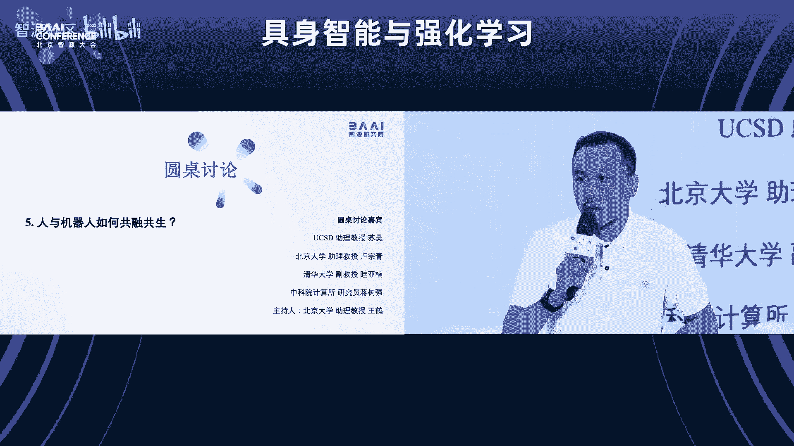

对现在的多模态基本上指的就是图和文本，没有说声音层面的大模型，对我补一句吧，就是嗯我觉得啊啊啊，在这个a i g c的这个set up下边，这个多模态有些个很神奇的事情，比如说像darling。

这是一个啊或者stable diffusion吧，可能是stable diffusion，可能更更更更说的更有意思一点是吧，它既是一个图像的闪车模型。

但是呢他也借助了文本的embedding space，帮着他去这个initialize一些事情，这样他他做出了一些很有趣的玩意儿，有些个这个这个这个这个embedding sp差值啊。

就它的差值其实很大程度上还是被，如果要是离开了图像只有的事儿，如果离开了语言，只有图像，那么就更像传统的干之类的那种，那么你是不大容易弄出来，这个非常有趣的效果的，就说他的这个文本空间。

文本空间很适合文本，它非常适合组合，非常适合组合泛化，所以其实呢那么文本和图像和，视频和这个3d的结合，文本这边对于他的这个组合性质的学习，起到了很大的帮助作用，但另外呢那些个具体的跟物理世界有关的。

那些模态呢，又补充了文本不能cover的一个embedding space，我觉得这个视角也算是个有趣的视角，对那我最后呢就是还是因为围绕剧深吧，就巨深，多模态大模型跟多模态大模型。

到底有什么本质的区别，就是巨深的话呢，它是呃根植在一个机器人的形态里的，所以从more ford这上讲，这个这个机器人形态它能执行什么任务，他有几条胳膊，他有几条腿对吧，它到底以什么形态去进行运动。

进行跟场景的交互，那么所以巨深多模态大模型，它一旦谈到巨深，那么他的能力就会受制于这个他自身的形态，同时它的形态呢又能够进一步的这个去驱动，这样的一个大模型能做什么样的事情，所以我感觉。

如果我谈巨深大模型和普通的多模态大模型，我一定会从他自身的这个形态和，他能做的事情上去区分这两者的区别，那么我们时间机会非常宝贵啊，有没有其他的观众啊，愿意啊，好跟我们嘉宾交流啊。

多谢我的问题稍微不呃不太一样，我是从宾夕法尼亚大学来的啊，抱歉我的中文说的可能有点imperfect，所以啊if you allow me a certain amount of。

就是尤其是对于呃呃如果是在minecraft上面，或者将我们最先看到的media出的那个voyager，在这个embodied agent的这个framework里面，可不可以把它用在。

我知道我们这今天这个discussion，主要是在机器人和这个research方面，但是可不可以用在如果说金融或者政治这方面，用这个emframework，像假如说做一个啊小agent啊。

它可以做模拟trading这种感觉，我认为是可以的，但是首先需要你的large language model具备，比如说金融的矿的也好，就是量化交易也好，这样的一些啊，他这个吧。

比如说像bloomberg训练的那个gp t吧，他有这样的能力去可以作为一个planning planner的话，他是可以知道，比如说你的一些scale，只是做一些高频的操作等等，我觉得是可以去尝试的。

嗯嗯对，那你觉得这个approach和直接让一个lm，像bloomberg p t就是给他一大堆data，然后让他train，然后就是一个black boss，下面更像是一样。

这个两个approach的difference会在哪里，首先就是对于large language model的文本的话，我不一就是不一定拥有，就是一些操作，我不知道有没有一些操作上面的记录。

如果这个是有的话，比如说他就是从文本到文本，就是操作也一些，比如说交易也也被记录下来了，那是有可能的，如果没有的话，那可能就不太行，这部分的话可能依赖于数据本身。

嗯所以我们这个bodied agent的这个approach的，主要advantage，说，他这个data有可能l老大没没有这种transaction。

record的这种direct availability啊，对对，我觉得这里头你用到金融里，你谈剧深呢，严格意义上我个人觉得不太合适啊，因为你做的这些操作呢，它都是一些抽象的操作，但道理确实是相同的。

道理就是说它其实可以被强化学习啊，来帮助你的这样的一个金融的交易，因为它都是action，他都是decision making对吧，那么所以说你也可以，我觉得你完全可以想象，据我所知啊。

国内的有一些基金是用强化学习，当然了，这个也可能很危险对吧，那你赔大了，那你强化学习对吧，谁管谁也管不了对吧，那你可以甚至建立一些用我们的思想对吧，我们用巨深启迪一下。

能不能建立一个交易的simulator对吧，你先在你的simulator里学一学交易的策略，然后呢再把这样的policy拿到你的真的市场上，做一些real world aptation。

会不会能指一些损对吧，可能我只能从这个角度去讲啊，具身智能对你们的可能的一些启迪，应该补充一点，就是有时候你是做交易对吧，有时候你是做pofolio management对吧。

然后交易的话可能是pofolio management下面的一步，那这样的话，其实就是如果你的任务是比较宏观的任务的话，那你可能在上层的话，可以用劳斯莱姆这model作为panner。

但是比较微观或者比较涉及到高频的交易的话，那部分的话我猜可能用强化学习，各个会更好一点，因为包括国内一些量化公司，也是用强化学习去做不相关的一些操作，多谢啊，还有这个观众想提问题吗，啊好，呃大家好。

刚刚刚各位老师讲到了，那个巨神数据的这个获取，我想谈一个可能更更大一点的问题，就是这个他的这个训练环境的构建，然后我关注的场景呢，可能稍微跟机器人相比来说更加抽象一点，比如说我举个例子。

就是这个我们虚实的这个实实际的人，和虚拟的这个智能体要协同交互完成一些任务，比如说举个例子是星际争霸这种这种这种战略，即时战略游戏里面的任务，我可能真实的人和虚拟的这个bot之间。

我们要通过呃语言的这种交互啊，然后虚拟的智能体，智能体可能是通过视觉的这个这个获取感知，然后他们之间要通过这个视觉语言的交互，去协同的完成战术任务，当然我关注的可能不一定是呃。

呃专门是星际争霸里面这个环境，如果是别的，比如说我要创建一个呃，更加更加真实的这个三维环境，去做这种协同任务，那么各位老师就是特别是卢老师和苏老师，我想请问一下，就是像这种训练环境的构建。

包括还要去采集呃，专家数据，或者是或者是还有这个场景的数据，大家对这个这块的这个训练环境的构建有什么，用什么框架性的这个思路和意见，行这个这个训练的话，因为你是agent和人交互吗，你最终的目标对吧。

对这个的话是不是可以参考像alpha系列，然后他用self play的方法，只不过你现在加上了一些语言的形式，然后去训练这个流去达到这个过程，因为你最终需要跟人交互吗。

可能self play是一个方法吧，我现在能想到的对，我觉得你这个set up呀，它更像无人驾驶里边，对不对，那么既有真人也有无人车，那但是呢，无人驾驶跟你这儿有个不太一样的地方。

就是说你刚才这个假设里边有很强的对抗性，无人驾驶没有那么多对抗性，所以如果是这样的话呢，这就涉及到今天几乎没有讨论过的一个问题，就是多智能体，那么如果是剧深多智能体，这里边的这个博弈的部分该怎么表达。

这博弈部分呢，在我的看来，他可能啊不是传统意义下的强化学习，或者是这个language model去表达的，但博弈也有博弈自己的东西对吧，比如说围棋是博弈。

那那么那么m c t s monte color research，这就有用了，而是博弈很大球，但还是model base搞掉的对，所以你这个地方呢在这个setup下。

你需要想办法去model每一个agent的intelligence，你怎么得到每个modern tendence呢，这就引入一个一个观点啊，就是我觉得这个多智能体系统，当然今天都可以做。

但是最有趣的多智能体系统，我觉得他还没到来，因为单体职能还没在那对，如果单体都很弱，群体的现象也就没有那么有意思对，所以我觉得随着时间的发展，单体越来越强，他们必然到一个多体的训练会很重要的时候。

好的谢谢苏老师，我另外还想问一下呃，问蒋老师一个问题，就是我们也关注那个视觉语言导航，这个具体的任务呃，这块就是他既既对表征多模态的表征有挑战，然后对基于表征去做长城的这个任务，规划和执行也有挑战。

就在您看来这种混合性比较强的这种任务呃，它的大概的这个本质的解决思路，大概是什么样子，好谢谢你的问题啊，他现在就是做视觉语言导航，它实际上需要几个方面嘛，一个你要对语言有一个表示。

然后的话呢你要对当前的观测有一个表示，还要把它们关联起来，同时呢你还要对你过去的这样的一个行为轨迹，也要有一个表示，就是所谓的历史信息，然后呢利用这些信息，然后的话呢。

你实际上呢你要做好一个这样的一个视觉，视觉语言导航吗，你身上还要有一个这样的一个全局的一个地图，然后你知道你当前的位置和在全图位，地图中的这样的一个呃，一个一个这个第一个位置吧。

然后你才能做下一步的决策，所以他是一个挺复杂的一件啊，挺复杂的一件事情，所以的话呢现在从研究角度上来说，反正有一些benchmark可以在这上面去做，就当前我觉得最大家主要关注的还是。

这种视觉和语言的结合，以及他怎么样和这个下一步的行为结合，就是主要还是在这一块，我反正在我看了一些材料上来说，主要的这样还是这种，相当于他跟之前的那种多模态的那个，本质上我觉得车差别也没有那么大。

客观说没有那么大，但是呢就像您刚才提的这个问题，一旦到一个真实的环境中，在一个在一个真实的环境中，如果是你还真的要把这个语言给他理解好，然后呢你还是真的要跟这个你的视觉关联，要给他ali。

就要给它关联起来对吧，但是呢现在实际上真正做的他没那么做是吧，他没有那么做，他给他关联起来，然后呢才能做下一步的决策，所以呢他的环境的理解，语言的理解，这实际上是都说是这个自然语言。

是人工智能的这个明珠，又是cv又怎么重要，我觉得真的要做的话，可能要把这两方面都得给他，达到一定的状态之后，然后才能讲这个视觉语言导航，当然你如果纯粹从机器学习的办法。

就是从这种embedding的这种角度上，然后做一个预测，当然也可以再加上强化呀，什么也可以啊，但是我觉得这个事情，反正我今天可能讲的事情都是比较保守哈，我都觉得这个事情每一步都很难能做出来，都都很难。

但是呢我觉得真的要做好的话，还真得需要几个方面都得结合，最后啊啊好的，谢谢家人，那么我们还有观众诶，这这位观众啊，老师好，其实就是刚刚听到那个苏浩老师说，他就是说呃我们要做这个boai的话。

他其实是会有一些影，the influence charter的一个问题，然后的话infrastructure里面，然后您提到说就是simuler。

然后还有一个就是我们的fundamentation是呃，fundamental model的一个问题，然后fundamental的话，fundamental model的话，那个呃卢卢老师。

他是认为就是lm可以作为一个fundament呃，可以作为一个fundamental model的一个近似，但是嗯还嗯因为我自己，我之前去调研文献的时候，我看到的那个呃，就是呃，我们要要要去建立一个。

真正能够具备更多智能的这种模型的话，那那那他那就是今天早上等那个呃，professor lillian，他说的呃word model，然后就是我不太理解，就是word model，它和这个lm。

就是他这种具体的一种体现是什么，因为我我自己之前看到的文献里面，就是word model的话，其实其实他是从那个神经科学的角度去出发，他就是有有一个神经科学家，他他他其实是呃研研究了这个呃。

他他是认为我们，我们我们大脑他是在对这个东西，它进行一个研究，对这个世界进行感知的时候，就是我们是先对它进行一个预测，然后然后去呃先建立的不断的更新，这个我们对这个世界的模型，然后呢去建立一个预测。

所以呃其实这个word model其实是不变的，但是刚刚听你们说，就是我其实不确定这个word model它是不是变的，因为word model我觉得他可能对于每一个人来说。

他的word model其实是不一样，对我那么那个呃那我来简单说一下吧，我觉得可能这个world model它的一个呃概念呢，嗯在学术上比较学术的定义，是对于当前的世界的某一个状态。

当你take一个action的时候，这个世界的状态将发生怎么样的一个改变，那么这个呢是强化学习里头讲的model啊，那么这样的一个world model呢，你可以把它当做一个simulator。

让你的policy跟这个world model进行交互，得到大量的这种你的word model，这个给出的下一步的状态，那么你可以基于它去算reward。

那么这是一个典型的这个model base的reinforcement，learning的思想，那么我们谈word model，就是说如果我做这样一件事情会怎么样。

那么large language model lm，在一定程度上你可以跟他用语言的方式去交互，我现在在一个房间里头，如果我就是啊，这个比如说啊这个我的脚下有一盆水，那么我跳进去会怎么样对吧。

那么可能large language mod就告诉你水花四溅对吧，那么虽然它的这个输出是一个呃语言上的描述，但它仍然呢也可以认为，一定程度上是一个世界状态变化的一个状态啊，那么所以说我觉得这是我理解的。

卢老师讲，这个llm可以被当做word model来使用的一个case哦，所以老师就是呃，因为我我传我理解的那个传统啊，那个强化学习里面他的那个model，它其实是一个固定的一个模型，就是我们关于我们。

我们其实是先对环境进行一个建模，然后的话就是嗯就是但对于真真实的order model，我之前可能一个想象就是真实的order model，其实应该是要去根据我们对它交互的过程中。

其实word model它其实是会改变呃，就是我们现实世界的一切，其实都是物理学支配的，你从这个角度上讲，物理学就是我们这个世界的word model，如果你能model所有的一切原子什么的运动。

全都能够model的话，那这就是你的word model，只不过呢我同意你说的一点，就是我们做的model不可能是一个大统一模型，把什么东西都完美的model，所以它可能要被update。

但是呢他并不一定在用的过程中，他要时时被update啊，这是我的看法啊，好谢谢老师好，那么我们今天啊今天由于时间所限呢，我们就这个嗯，非常感谢我们四位speaker的这个到来，那么我们北京智源巨深呃。

北京智源今年呢也建立了这个智源巨深，智能研究中心，我们从这个物体的这个抓取到，物体的功能性的操作灵巧手，到这个三维世界导航也做了一系列工作，那么我们认为从物体抓取灵巧操控，寻物导航等这一系列的技能呢。

将能帮助我们建立一个通用的移动操作平台，嗯最后打的这个广告，就是希望如果大家感兴趣这个呃具身智能，特别是为了通用人工通用智能体b啊，这个啊build的这样的一个移动操作平台呢，可以联系我们啊。

去这个呃研究科学家或者是实习的岗位啊，再次这个感谢啊所有的到场的嘉宾和观众们。

谢谢大家。