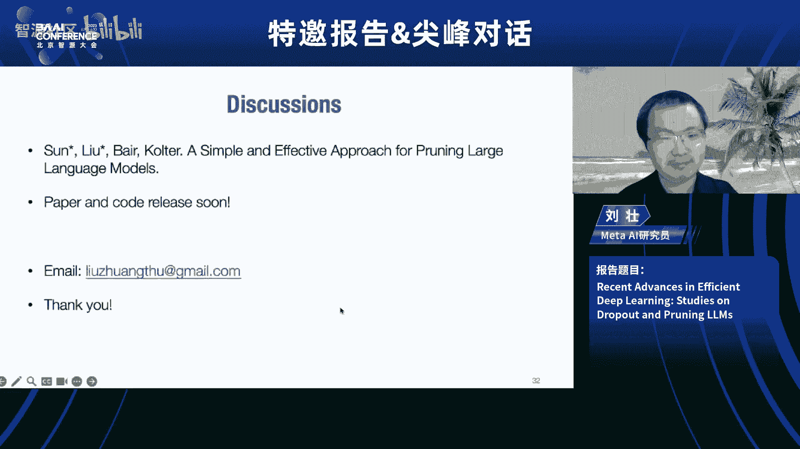
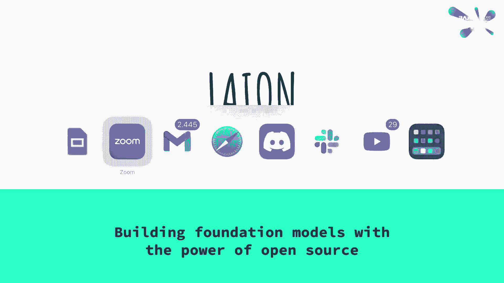
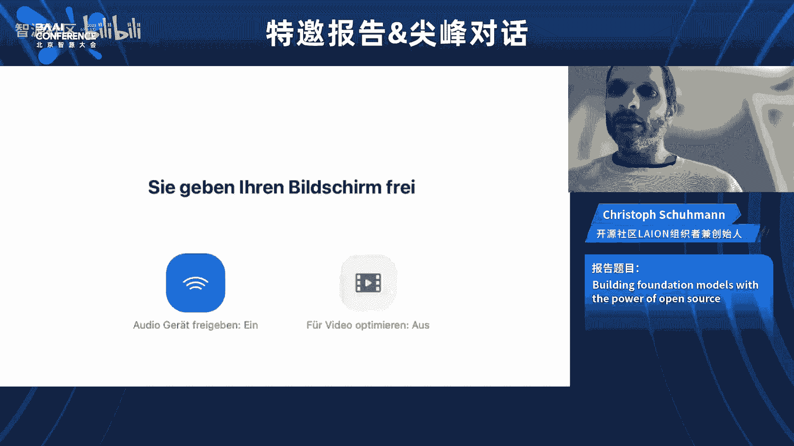
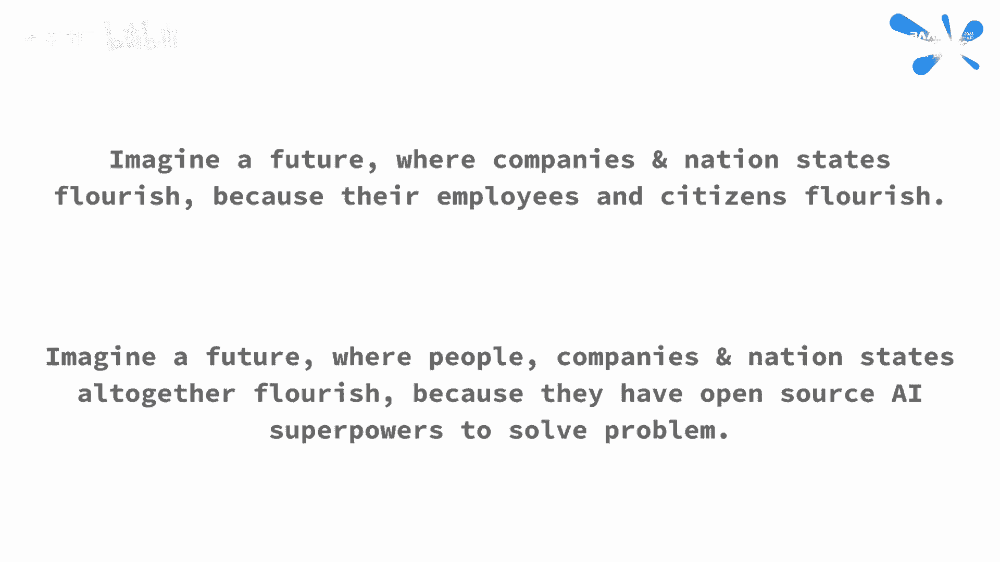

# 尖峰对话 & 特邀报告（David Holz、张鹏、刘壮、Christoph Schuhmann） - P1 - 智源社区 - BV14X4y1b7Jd

所以你对，你好啊，欢迎大家加入我们今天下午对中程创始人的谈话，大卫·福尔摩斯先生我是大公园的张杰克，我很高兴能和你们一起，探索迷人的公司，并分享他们的创始人对人工智能时代创造力的看法。

所以大卫欢迎加入我们，我觉得这个，这是你第一次和你的中国粉丝说话，所以你想借此机会跟他们打个招呼吗，哦你好，嗯我我，我是，我想我们不是，我们不是正式在中国，但如果中国有人使用旅程，我想我呃。

我希望大家都玩得开心，我希望每个人都玩得开心，是啊，是啊，你大卫，你知道吗，呃，在过去的二十年里，我认识很多企业家，呃在中国都有，在世界各地，我发现他们有一些共同点，呃，都有很强的动力，呃到。

当他们从无到有创造出美妙的东西时，所以这就是为什么我想知道，你的动力是什么，当你第一次发现中途旅行时你当时在寻找什么，是啊，是啊，我是说，我从来没有真正想过有一个公司，我只是想有个家，我有点呃。

我想我完成了我的旅程，呃，作为我的家，你知道的，在接下来的十年或二十年里建造我真正关心的东西，我想在这个世界上做的，我想了很多关于到处都有的问题，我想了很多，也许我不能解决所有的问题，但我能做的是。

我可以试着让人们更有力量集体解决问题，所以我试着去想，我们如何解决问题，我们如何创造事物，我通常认为这归结为三件事，就像首先我们必须反思我们是谁，我们想要的，问题出在哪里，然后我们要想象，就像。

我们得想象我们能去哪里，什么是可能的，然后在最后我们必须协调，你知道的，和自己一起工作，和别人一起工作，你知道的，做我们想象中的事情，我觉得人工智能有很大的机会，把创作的这三个部分。

喜欢和制造某种重要的基础设施，使我们在这方面做得更好，人工智能应该能帮助我们，反思自己，想象得更好，帮助我们找到彼此，更好地合作，我想我们可以一起做这些事情，我们可以把它们变成一个单一的。

某一天某种单一的框架，我想这将改变我们，我们如何创造事物，以及我们如何解决问题，但我想这是我想做的大事，我觉得有时候图像会让人困惑，但我的意思是在很多方面图像制作图像是一种概念的证明，为了那个。

你已经知道了，中途旅行是数百万人探索的超强想象力，就像这个巨大的可能性空间，你知道吗，我想在接下来的几年里，有机会进行更多的视觉和艺术探索，这可能是所有以前的历史结合在一起。

我认为这并不能解决我们所有的问题，但我认为这是一种，我想它做了一次试运行，这是这是一种，这是一个，这是一个实验，我想如果我们能在视觉探索中做到这一点，我们也可以为其他事情做，你也知道有什么问题。

我们需要一起探索和思考的可能性，我想我们可以用类似的工具来解决，所以我想当我在考虑如何开始工作的时候，我们有很多想法，我们做了很多原型，嗯，但是人工智能有一定的突破，尤其是在视觉效果方面。

他们觉得有一个非常独特的机会来做大事，没有其他人在做，我有点想去，所以我们都这样做，我想即使在几年前，但一切都会走到一起，在这十年里感觉很特别，我想我们，我们仍然只是看到了开始，所以这只是第一阶段。

我想你的最终目标是，呃，为人类解放想象力，这就是吸引你去寻找大旅程的目标，对吧，是啊，是啊，是啊，是啊，我是说，我喜欢富有想象力的东西，我喜欢这个世界更多，做什么都喜欢，它每天都有疯狂的想法。

我看得出来，是啊，是啊，好的，你知道，大卫，当我想到很多人喜欢我的时候，呃，首先知道你不是在中途，是关于跳跃运动的，呃，我有种强烈的感觉，我是说对你来说，呃，在这两个项目之间，呃也许呃，在动机或。

或者呃呃，心态，我不知道我是否有正确的感觉，感觉是对的，呃但是呃，我想问的问题是，你对睡眠运动的经验，帮你创造我的旅程，呃在任何方面，是啊，是啊，我是说很多方面，我从飞跃中学到了很多。

如何做一个大的建筑，如何做大研究团队，如何解决问题，以前没人做过，如何深入思考人们如何与技术互动，就像这不仅仅是这个B的成本大小，但我们如何与它互动，我们一起做的事情往往来自于我们如何互动。

这真的很重要，是领导的核心理念之一，有些事情我们做得很相似，就像飞跃一样，呃，它真的很大，真的很快，好像它抓住了每个人的想象力，我觉得Midy很像，但我认为还有其他真正不同的事情，在休假的地方。

我们我花了很多时间，我认为建立一个生态系统真的很早，我想当时在硅谷，有一种信念，你应该永远建立生态系统，首先，就像iPhone，但我想我们集体学到了，也许你知道，首先你要做一个普通人喜欢的好产品。

然后当你做完的时候，然后你就可以在生态系统上工作了，我认为生态系统可能会在早期分散注意力，对于很多企业家来说，对我来说也是，所以我们做得不同的一件大事是，我们只是专注于建造一些每个人都可以使用的东西。

很普通的人就像我以前评判自己，救济，我能用手做吗？但就像我父亲就像一个外科医生，所以他可以做，我们有一双好手，但现在我想的更多的是，卡车司机，就像利用旅程，我们有一些卡车司机，从卡车停靠站的卡车上。

这对我来说很酷，这意味着你喜欢的地方成功得更好，你知道，你知道吗，这真的很有趣，好笑，就在这里，我们通常说，嗯，这个想法很便宜，给我看看代码，但现在看来，想法是唯一重要的事情，只要你能表达你的想法。

你的目标得到了一系列好的提示，AI可以帮你，那么你认为学习和创造的定义正在改变吗，你的观点是什么？你对此有什么看法吗，是啊，是啊，我是说，我觉得，我看到的一件事，真正有趣的是。

当你给人们更多的权力来创造，他们也变得对学习更感兴趣，因为，比如说，嗯，有一定的艺术风格，就像装饰艺术在美国是一件著名的事情，我从来没有真正关心过那种艺术是什么，直到突然间我可以把事情做完。

只是说出名字，突然间，我开始对此产生了很多疑问，我想了解更多关于历史的知识，所以我觉得有一些非常有趣的事情，当历史成为你可以立即借鉴和创造的东西时，我们对历史变得更感兴趣了。

然后我想如果用户界面变得很好，感觉人工智能是我自己思想的延伸，如果人工智能是我身体和思想的一部分，人工智能也与历史紧密相连，它也把我和历史交织在一起，这样也很有趣，所以我觉得这真的很酷。

当我们问我们的用户他们最想要什么时，我明白了，头号请求之一，通常第一个第二个是他们想要我们的学习材料，不仅仅是学习如何使用工具，但是学习所有的艺术和历史，以及所有关于相机镜头和照明的事情。

他们想理解他们现在可以在创作中使用的语言和概念，因为以前我认为这些知识只是一段历史，但现在知识实际上是创造事物的力量，它立即变得更加强大，所以人们想要它，那真的很酷，是啊，是啊，是啊，是啊，我想是的。

是啊，是啊，你知道在中国你有很多跨度，他们来自不同的背景，呃，他们可能有，呃，呃，不同水平的艺术技巧，你知道像我这样的用户，我还在努力制作，是啊，是啊，你知道更好的照片，但我听到很多画家设计师担心。

它们将由AI发生，那么中途能做些什么来帮助确保每个人都能通过人工智能，呃，而不是混淆或同质化，是啊，是啊，我想对于那些还没有开始他们的艺术之旅的人来说，它给了你一个独特的机会，第一次你在想，我喜欢什么。

我的审美是什么，我发现什么是美丽的，这真的是一件需要，你可以花一个专业艺术家几十年的时间来做，突然间，这不是每个人都可以接触到的，我们发现人们喜欢深刻反思，这几乎就像艺术疗法，对人们来说。

他们在思考自己的生活，具有挑战性的事情和可能发生坏事的事情都是好事，只是这很有意义，所以我认为大多数使用它的人都有这些个人经历，这不是真正的竞争或商业，我们发现大多数不使用它的人，他们在用它。

你知道他们只是利用它为自己，他们甚至不分享照片，但我认为在专业层面上，我想它变成了放大，放大你的创造力，所以不是像图像一样，也许现在你可以制作一本漫画书、一部电影或一个电子游戏，所以你不是想喜欢一个人。

像正常人一样，我会在他们有生以来第一次思考美，一个艺术家现在可能正在创造整个世界宇宙和故事，以他们以前永远无法做到的方式，所以我认为这增加了每个人创造力的范围，所以普通人有更多的权力。

而专业人士更有力量，我也是，我想很难看到，有时是因为现在很多用户界面都很简单，但是没有理由让接口变得复杂和强大，而且有很多特点，只是那些来得有点晚，嗯哼，但是是的，是啊，是啊。

也许也许不只是为了一张照片，一张图片，人工智能可以帮助人们做更复杂的工作，因为你知道，在过去，当我们谈论创造力时，我想里面包含了很多元素，呃，还是你有创造的愿望，您想创建什么，你也需要有能力执行它。

让它发生，但也许有时候如果你你你可以，呃解放，呃对创造的渴望，伟大的想法和情结，嗯，复杂的，呃AI能帮你的事情，所以也许这就是我能为人们提供的力量，而不仅仅是形象，对呀，是啊，是啊。

这是一个非常私人的过程，就像反光一样，你知道我们一开始喜欢，我们真的不知道我是说，我想这是我想这是我们一遍又一遍地看到的东西，只是这个过程有多私人，对大多数人来说，像我一样，首先我会看图像。

我不明白人们会做什么，就像有人要一张天堂里狗的照片，我问他们，他们为什么要在天堂里画一只狗，他们说是因为他们的狗刚死了，我感觉很糟糕，我就像，你没事吧，他们说这让我感觉更好，喜欢它，只是有点。

我想很容易认为，也许大多数人用它来工作，但我们现在觉得，几乎每个人都在用它，几乎就像一种艺术疗法，你知道他们在想什么，他们在反思自己的生活，试图弄清楚他们是谁，我想这真的是私人恩怨，真的很重要。

就像在人类历史的大部分时间里，我们没有机会做，只有极少数人有机会做到这一点，我觉得那真的很美，能够为每个人做到这一点，是啊，是啊，是啊，是啊，是啊，是啊，我想是的，这不仅仅是我们业务的工具。

或者你的工作是我们生活的新元素，我想为什么中途旅行很棒，就是因为，呃，它传送了，呃，对一千万人来说是一项神奇的技术，只有百分之二十在你身上，你的团队我相信，呃，几个月前，数字是十一，对，你没有销售团队。

你没有营销团队，你有几个，呃，你团队中的本科生，所以我想知道，我想知道新的范式，呃，对于AGF中的初创公司，呃，人工智能时代，我想会是，我想我们来得有点早，所以我认为我们有一些优势。

就像我有很多组建团队的经验一样，我有很好的名声，所以我可以在早期让很多电脑来做这件事，正常的初创企业不会有这种情况，但我认为在接下来的几年里随着人们开始了解更多，你如何建立研究团队。

随着越来越多的计算能力可供每个人使用，随着人们对什么是好的人工智能产品的了解越来越多，我想我们会看到很多这样的公司，我想我们来早了一点，我想我们是第一个这么做的人，但我想也许五年后一切都会很正常。

所以是的，这是一种新的范式，是啊，是啊，是啊，是啊，是啊，是啊，好的，所以你担心，呃，今天中途做什么，呃什么时候他们会被发展敏捷的能力所覆盖，那么会发生什么，垂直产品的未来是什么，就像中途，我们不知道。

我认为这是一个很大的谜，我想一种方法是我们可以和其他实验室合作，就像我们做眼睛一样，他们让，你知道耳朵，就像一种，我们把不同的部分，它聚集在一起，这可能会发生，就像你知道我们在想象。

他们正在制作语言部分，我们把它们放在一起，所以我们要一起看看，我想也有可能他们是这种人，什么都可以，但它们是一些特殊的部分，你知道在这个世界上我们仍然有很多人专门研究。

我也认为有可能有很多人机界面的东西，也许不仅仅是拍一张漂亮的照片，但它是关于帮助一个人探索他们是谁，他们想要什么，这不是一个真正的AGI的事情，它更像是一个，你如何与人互动，你知道的。

我认为最好的用户界面，如果只是语言，然后也许AGI可以问我们问题，但我认为实际上用户界面将不仅仅是语言，它会向你展示许多图像，试图用不同的方式了解这个人，它们将是一种全新的艺术，一种新的感觉。

一种理解人们并试图帮助他们弄清楚他们想要什么的理论，我只是觉得，是啊，是啊，那是我们还没有弄明白的事，我想一个美国兵可以做任何事，但我也觉得像，有可能喜欢，嗯，会有很多专业化，仍然，我想在未来，是啊。

是啊，所以你认为中期旅行会一直像垂直产品一样吗，也可以是，呃，你可以解决这个问题，因为你你，你已经说过你的任务是解决解放人类想象力的问题，不一定只是图片，图像，是啊，是啊，是啊，是啊，我想有一些。

肯定有，我们在社区里做的一些有趣的事情，就像，你如何让一群人聚集在一起探索一个巨大的可能性空间，我想这就像，我想我们是想创造这个东西，在未来一两年的中间旅程空间。

也许就像世界上几乎所有的视觉探索都在发生的地方，所以我觉得真的，即使我们从来没有做过其他事情，如果我们只是世界上所有视觉探索发生的地方，我想那会是一笔生意。

我认为我们在视觉探索方面所做的一切都将适用于其他领域，我想尝试创造这些超级头脑，数百万人一起努力解决一些事情真的很有趣，我不认为任何一个人工智能会取代数百万人，我想可能会有AIS参与。

也许会有数百万人和数百万AIS一起工作，但我想会有很多经纪人和很多派对，我认为这很重要，这是，所以说，拥有所有的，我认为观点和每个人都有点不同，我想有助于弄清楚事情，你知道很多企业家，许多创业公司。

我们称之为人工智能实干家，他们，2。他们对这个问题想得太多了，因为他们害怕被掩盖，呃通过新技术，我们我们，我们都看到，技术仍在迅速发展，还不稳定，所以你的建议是找一些，呃，你知道有价值。

或者或者从某个问题，呃，Verse工具解决，你保持专注，和，同时保持开放的心态，你的建议是，我想是的，我是说，我想也嗯，我喜欢这样想，即使我们像agis一样，有点像人。

我想他们仍然会和我们生活在一个社会里，所以我想你知道一件事你可以工作，你可以做的一件事是，您可以努力创建，就像人工智能的人，但你也可以尝试在社会上工作，一个有很多人和很多AIS的社会是什么样子的。

我们如何一起工作，一起思考，一起探索，我认为这是我们正在做的很大一部分，当我们试图让每个人都用视觉一起探索事物时，在某些方面，它是非常原始的，但在其他方面，这可能是测试它的最好方法，因为你可以看到一切。

你可以从字面上看到，嗯，而如果我们用诗歌来做，我想这也会很有趣，但有点难理解，你知道吗，或者如果我们用，像引擎或任何其他类型的科学，它，你不会喜欢，一百万科学家将是世界上所有的科学家。

但是一百万人在拍照，很容易找到，所以你已经可以测试它了，你知道的，所以我想我们更多考虑的是，呃，这些心灵社会是什么样子的，你知道的，嗯，我想现在主要是人类在和AIS一起工作。

但我认为在未来人工智能和人类一起集思广益，是啊，是啊，所以我认为这将是非常有趣的，也许在某个时候我们甚至不知道，这不是我们的主意吗，是人工智能的主意吗，没关系吧，没关系，没关系，是啊，是啊，没关系。

好的，完全正确是的，是啊，是啊，你你知道，呃，当然有很多，最近对安全的担忧，然后呃，同时进行多个级别的一些比赛，前面也仍然有挑战，嗯，在继续扩大和改进目前的大型模型。

那么你如何看待人工智能领域的未来发展呢？有没有办法平衡不同的视角，甚至可能是不同的政府，呃，比如中国和美国是的，我是说，呃，让我们看看，我是说，我想有像，我是说，我先走，我觉得人们有时候太争强好胜了。

我想也许这是我们的一周，我认为这是西方的弱点，我觉得就像，我想机会太多了，是啊，有时不值得竞争，就像我不考虑薪酬一样，我不考虑竞争的事情，我只是努力让最美丽的，我能做的很棒的事情。

我认为在很多方面有多少机会就有多少机会，面临的问题和挑战，我想世界上有很多事情，在世界上有很多挑战要努力，嗯，我不知道，我不知道，我想我嗯喜欢，是啊，我的意思是，我想我想喜欢和喜欢，我想像什么。

我想在某些方面我在中国一直很好，当我在那里的时候，就像每个人总是喜欢的那样，有一种合作和团结的感觉，我认为在某些方面，这更符合人工智能，在那里它是一种更公共的东西，它向我们所有人学习。

然后它给了我们所有这些力量，它从我们身上学到了，就像它从我们所有的视觉历史中学到的那样，然后它给了每个人视觉上的力量，就像非常公共的，这是非常合作的，喜欢那种竞争力，我想是在一些，有时甚至说像。

我想在某些方面做到最好，我想可能违背了技术本身的本质，也就是，所以我认为美国可以学到很多东西，你知道的，呃，就像从东方来的我想还有，也许我想在这里，这是很正常的，可能就像，不仅仅是害怕技术。

但几乎只是害怕智力，好像他们很聪明，我能相信他们吗，但我的意思是在另一面，似乎我们希望这个世界有尽可能多的智力，你知道，我们似乎不想要一个智力较低的世界，我们想要一个更聪明的世界。

因为这就像我们如何建立和解决一切，你知道的，所以我觉得有些事，在美国，如果你太聪明，你就像个书呆子，然后别人欺负你，或者感觉像在中国，如果你聪明的话，你很酷，每个人都想变得聪明，哦耶，是啊，是啊。

我回来了，是啊，是啊，我是为美国人准备的，这很不寻常，我不明白，就像这样，我想在很多方面都有帮助，嗯，我想，也许我来这里的原因之一是，因为看起来行不通，所以这里一定有人，我不在乎什么。

有人认为它会起作用，但现在在某些方面，我们知道它是有效的，就像真正的合作，试着给每个人，所有的基础设施和所有的权力，试图建立社会，你知道在很多方面，就像我认为我们，你知道的，我们在这里不那么团结。

而且少了很多，你知道的，对智力的渴望就像试图，然后呢，然后东方就是，我认为彼此有很多值得学习的地方，我对所有这些都很有信心，嗯是的，我我是的，我我我我我我是，是啊，是啊，我明白你的意思了，是啊，是啊。

呃，没有必要，呃，我是说，呃，呃，也许不一定，呃，呃，你知道吗，中国和美国必须是一个独立的人工智能系统，和创新者之间，呃，中国和美国可以联合起来创造一些美好的东西，是啊，是啊，呃，我深深地希望如此。

是啊，是啊，是啊，是啊，我是说，我觉得这有点像，有一个很大的全球经济，这对大家都有好处，所以就像如果我们做人工智能，它将在经济中移动，就像我们一样，要么像人一样，要么像人一样，或者像产品或物品。

好像只是它把我们联系在一起，我们从彼此身上学到了更多，感觉就像感觉很好，我认为当人们试图对此持敌对态度时，我想这可能是反人类的，我不知道我感觉就像，它看起来不像是，好像我们，我们只想让一切都很棒。

我不知道我很，我很合作，我想也许这里有点不寻常，我是说我想为什么大卫，如此合作，就像我喜欢人，这是我们为人们建造的东西，我想那是因为我们也爱人，这就像，也许我们与众不同的地方之一是我们总是在制造东西。

人们喜欢的，我想是因为我们真的爱人们，我不知道那里有什么，我不会，人太多了，对不起，是啊，是啊，是啊，是啊，是啊，是啊，所以在那里，我想我们只有时间，最后一个问题，如果我们展望数字世界，十年后。

你能预见什么吗，呃一定会改变的，呃，你知道，你愿意和我们分享你的愿景吗，是啊，是啊，我是说，我是说，它它就像，我觉得，十年后的一个人，会比今天任何数量的人都更有创造力，但我认为所有这些人聚集在一起。

那个，有那种才华，就像我们可以做一些我们只是，我们，我们无法想象这一切，我认为这些力量会创造一个充满美丽的世界，以一种，是啊，是啊，我不知道，只是这让我觉得，这是正确的，你知道的，然后我想就像，嗯。

是啊，是啊，我不知道，我想有什么东西，我想不知何故在一起，就像我想的那样，我想美会以某种方式把我们交织在一起，把我们联系在一起，我想你知道，在某些方面帮助我们不要害怕这个未来，但你知道的更多。

为此感到兴奋，你知道，我想我想有时我们感觉到美，因为否则我们会害怕，是啊，是啊，我喜欢那样，我真的很喜欢，我喜欢那样，是啊，是啊，一个可以想象的巨大未来摆在我们面前，在某些方面，就像你知道的。

用美丽来填充，思考美丽是最好的方式，我想在里面做正确的事情，我不知道有什么我我，我想我不能完全，我想我不明白，但感觉是对的，实际上我想我有很多朋友，我在深圳的朋友，还记得你，呃，当你用休假动议工作时。

有时也许呃访问中国，我们可以继续我们的谈话，我想呃，我完全同意你的看法，呃，前途无量，会有很多好事发生，但我们应该考虑到有些不好的事情，我们需要防止它们发生，谢谢你大卫非常鼓舞人心的30分钟。

谢谢大家今天下午加入我们，我希望每个人都有一些可以带走的东西，还行，这是杰克和大卫，我们要结束了，谢谢。谢谢。然后有趣的部分是于瑾在广西旁边建立了她的公司，呃退出正规化，呃，她，呃在。

和Fana Utai是时候去知道他做了什么，退出你的，嗯，呃，最近对于蛋白质预测的顺序到图像的生成从，呃，托尼，我是个辍学生，它可以下降到，呃，否，别碰她的亚历克斯网，你不碰，结果打开了退出的路，是啊。

是啊，是啊呃，线性跌落的一种，我说，呃家，喜欢都适合，安装或最终安装更多，那个你，她和我不插嘴，那就是，诊断吉博士呃，这不是台湾，我可能比数据更重要，所以为了得到好，你如何发送适合你的连接的资金。

或者你可以去找一个，你应该控制你，所以呃，所以那样做，呃，你看到一张照片，你去找一个中心来触摸，你得到了，你还有更多，不合身会在图纸上不合身，辍学，所以减少或适合你嗯，使用它们，和，呃，呃，哦。

你退学了吗，你退出的时间，信阳苏欣和嗯的模型，嗯吉，基线模型，呃，退出的模型应该退出模型，退出模型，你有没有，呃更多地在中国，谢谢。我嗯，但要做到这一点，我不看势头，那又怎样，呃，到检查站。

你在GD上放了什么，所以呃，你知道吗，形势，你退出模型到，所以你看到你在，呃，从，我们是如何在家里度过黑暗的，和你一样的功能，你做一个样品，你让我做最好的，喜欢，在某种程度上，地面真相渐变为，呃。

你是我的钥匙，所以它是向前向后的，喜欢地面真相渐变梁，你的辍学模型，你的小批量渐变地面真相渐变，《哈罗》中的田宫朱莉，退出教会，呃，发生什么事了？I年轻到梯度误差，通常的迷你批量分级做得很好，回藏，呃。

只有你，你会退出的，可以触摸到它，你能做到，奔向你，呃，约翰，等等，走吧，我举例说明J，做一个好的，她确实优化了训练，在家里设置训练损失，你只是你的管，你可以容纳另一个辍学者，你去，你去。

针对泛化问题将训练集建模为优化，它称之为围绕优化的训练集，你可以创建边界，你可以做模特，你可以拿着，你有训练集损失，所以它不拟合像时间优化这样的模型，你上次的训练，所以你可以早点教书，像往常一样辍学。

辍学，你知道的，在文件里做一些模型，你如何在工作中过度适应模特，嗯，要做的是退出推出，整体优化，那天的感觉，你过度拟合模型，嗯，所以一个规则化，呃，归零到Fana，而且那个，呃，最近想象一下呃。

所以早些时候我应该只是非常小的搅拌器，小来下一个，向约翰游去，以至于数百万的训练者退出了，把钢琴放下，深度，退出对太夏化的预期行为，早辍学的人做它有优化的规则，呃，你会是，呃，你得在后来的辍学前换五个。

你去，呃，点击基于模型的混合器底座，只是为了和辍学的模特玩得过火，SD只是期间的深度，我不知道怎么退学，希望希望我退学，超越枪的概括，所以火车损失开始在火车跟踪中滋生，嗯，呃，SQL的泛化，呃。

就在这里退出你去吧，我们退出模型训练曲线，你现在可以成为你的倒下，只有放弃火车损失，找到了一个杰斯华秀，嗯，新来的人的地理让，自己做一个不合适的模型，有一些，穿上阿尔法，呃，哦，是呀，上，嗯。

到和SML G称为有纸到可用的板，我们的政府应该，模型训练在拟合模型下，你能退学回家用大型语言模型充电吗，你可能会时不时地发现，效率到你的心，免费的呃，元爱呃，在喇嘛下巴的参数中释放。

你的身体是GPU内存，你有精度加载呃，你不要谷歌手掌，好吧托尼，用ZU和，俊的全部真相，那种女孩，所以幅度修剪，你可以，或者是更多的事情之一，嗯，我应该，我该走了，在，一个巨大的手以一个。

你可以通过第一级来创建它，和你一起去还是拒绝，这是个好主意，张骥认为，在模式上的研究是其次的，从边界等待酸性土壤，这可能是下一次应该来的时候，下一次，呃，实际上，困惑是一种，这是一个，你选择沈的区域。

告诉你向下观察大语言模型，的，我不想看到鱼在，呃，如果你有纹身，中的表现，我们不会靠近，你在外面，呃，功能称为道奇的功能，对爆炸的困惑，呃，呃，你她可以射出去，所以它现在应该有一些，然后你去的案子。

和线性铝，呃，您输入标量，一个向下的斧头或x r呃，在我们的世界里没有细胞，在细胞时间，呃x eu和w x修剪在ua w w x r中的wr，对dixi的输入是什么，输入输入尺寸与传输接触，巨蟹座细胞。

所以你在控制台上通过输入，你的x是她吗，等一下，你的狗叫你和乔伊，你在修剪重量，呃，或者等待输入，查娜，所以我们等待，在下库存输入批次中，或者你可以做令牌，这样我两个正常，输入激活和呃激活，你的W。

pre-lm应该增加简单性，有直截了当的，呃，所以对于过去，所以所以几何，呃尝试，这就是叫它，呃插图，所有的权重矩阵，我嗯矩阵或者她做x做一个矩阵，或者最终会增加体重，我应该等她的前任跳，梅·汉。

所以元素方面，你叫它什么，你得到什么指标了吗？你可能会做什么，比如输出特色，到整个通常的度量，稀疏表明要成为一个俯卧的，在大学里，你叫它修剪，我不吃细粮糖，所以用行智者喊出输出智者为女人做了一件好事。

呃，旅游交通，你有没有，呃，我是说，你做什么，你和别人在一起吗，呃，就像做NW一样，真正的，嗯，我们也可以在喇嘛模型上进行大规模修剪，它的丛生性，呃，最近你得到了，你有修剪大语言模型，你确定。

因为我实际上是个问题，当然嗯，将以尺寸为特色，呃，传感器功能，所以你照常更新，倾向或我应该这样触发运河上的推断或修饰符上的，进步的区别是真的，所以，呃喇嘛，应该有一个修剪，你不能靠信贷养活。

你的模型容易成为模型，我想让你推断，呃，你知道一个，你知道陈，呃，呃是个更高的，呃，我们能找到大型语言模型吗，所以我们精确的稀疏网络，所以你为，嗯，整个丛林，大型语言模型。

因为没有经过时间的训练在学习中，我去创建一个负担得起的微调创建，你如何创造另一个困惑的女人，呃，没有人在精细工业。

你好，你一开始，我将首先呃，做一个关于你自己的真正简短的介绍，呃用中文，因为我们的观众大多是中国人，然后你就可以开始谈话了，然后我会问，呃，呃，四到五个问题，呃，从白族的地位来看，在那之后，我们会来的。

呃，我们所有观众的问题是，是啊，是啊，好的，哦，好的，酷，所以让我们现在就开始，呃，让我们来谈谈舒曼的基督，呃，Zuzi和德国Panada，老鹰，好的，我们现在可以开始演示了，是啊，是啊，好的。

您的设备上有演示文稿吗，还是我应该给它看，但另一件衬衫，呃，你可以分享屏幕，现在，我们可以开始演讲了，你现在能看到我的屏幕吗，是呀，是呀，我们现在可以看到你的屏幕了，你现在可以开始了，好的，你好。

我叫克里斯托夫•舒曼，我是里昂的联合创始人之一，里昂代表大规模，AI Open Network和我今天将谈谈我们的组织，我们的历史，你能打开摄像机让我们看到你吗，我们可以看到你，同时，我们可以看到屏幕。

另一个相机，呃，是呀，是呀，我觉得，当我，当我切换到PowerPoint时，然后相机咯咯地笑着自动关闭，所以现在当我回到PowerPoint。

然后摄像机就关掉了，我是说，不管我能做什么，没有电源点。

你现在能再见到我吗，我们现在可以看到你了，但是我们看不到幻灯片，好像不是同时。

是啊，是啊，可能我的iPad会自动关闭摄像头，当我过去的时候，可以同时，好的，呃，不如这样吧，呃，在你的演讲中，呃，我们看到屏幕，在那之后，当我问一个问题时，你打开相机，可以吗，好的，这样好吗。

你能看到屏幕吗，是呀，是呀，我们可以看到屏幕，你现在可以开始了，正常情况下，所以耶，正如我所说，我是克里斯托弗，我是里昂的创始人之一，里昂代表大规模，AI开放网络，嗯，我们是一个非营利组织。

我们在德国注册，但我们有来自世界各地的成员，嗯，我们基本上致力于构建开源数据集和开源，AI最近专注于基础模型，因为这变得很热，就像热的，是热门话题，但我们的主要目标是制造一种最先进的。

AI基本上对每个人都是免费的，完全开放，所以在我们看来，总的来说，开源AI类似于开源，解决问题的能力，在我们的世界里，人工智能越来越重要，因为每个人都使用电脑或智能手机，就像我们已经开始了。

基本上就是看到人工智能有多酷的人，我们想让公众可以使用它，所以我们发现自己在不和的聊天群里，我们一开始就在讨论，我们怎么能让，比如说，大理一号，第一个文本到图像模型，我们怎样才能让公众接触到它。

所以我们一直在讨论如何从互联网上获得文本图像对，以及如何构建开源数据集，同时我们一直在讨论，如何获得开源培训代码，我们从哪里可以得到这个计算，我最初的想法是建立一个图像文本数据集，因为，嗯。

这就像第一个文本到图像模型，呃，两年前，它能够画出非常酷的图像，不像今天这么高的分辨率，但对我来说，认识到，哇哦，这开始真正起作用了，我们一直在讨论我们怎么才能像2-3一样，四亿形象纳税人。

因为达利一号是在2。5亿对图像上训练的，以及Openai发布的第一个剪辑模型，在这个时候对4亿形象纳税人进行了培训，我们就像，这可能吗，因为当时最大的公开数据集，呃，概念标题。

每个版本有三百万个图像文本，每个版本有1200万个图像文本，是啊，是啊，就像我们一直在想的那样，我们能像普通爬行一样去档案馆吗，比如说，公共爬行是来自，嗯美国，他们在网上搜索。

他们进入不同的网页并下载html源代码，基本上，网站的原始代码，他们把它保存下来，每两个，他们释放了三个月，这样每个研究人员都可以下载1G的小块，然后用它来分析Web，我知道这件事，我在想。

也许我们可以下载普通爬行的一小部分，过滤掉图像，和文本对，不是图像本身，因为图像链接，只有共同的链接，所以我们要过滤掉链接，然后我们要检查，HTML中的链接有文本描述吗，如果我们有候选文本描述。

喜欢备选案文，那么我们可以使用这个时候已经开源的剪辑的第一个版本，像二千二十一，在开始的时候，他们发布了一个开源版本的剪辑，所以我在想，好的，我们可以使用现有的剪辑。

以及图像内容与相邻的文本描述的匹配程度，这基本上就是我所做的，嗯，我在空闲时间编写了第一个版本，嗯，所以以我的背景，我不是全职研究员，我是一名计算机科学教师，高中教师，这个时候我只是超级好奇。

这项技术在未来如何开源，当我在操场上拿着笔记本电脑的时候，我刚拿了笔记本电脑，我刚刚编写了第一个版本，以获得图像链接和替代文本，然后下载图像并检查现有的剪辑模型，想象事情做得有多好。

图像事物的内容与文本契合在一起，如果它们很合身，我救了他们，如果没有，我删除了链接，所以这是我编码的第一个版本，我有，呃，这在一个虚拟机上运行，免费提供一台谷歌可乐的小型虚拟机，基本上我想，好的。

我怎么才能得到更多，所以我从社区里的人那里得到了更多，他有一点，工作中的一些小虚拟机，他们告诉我，是啊，是啊，我不用它，现在你可以用它，这里有一些多余的钥匙，嗯是的，我在不和谐的社区里四处打听。

有人能帮我写剧本吗，协调一群小型虚拟机，如果我有很多小型虚拟机在过滤互联网，从普通爬行，所以我得到了普通的爬行，我从普通爬行中得到的，图像链接和候选标题，我使用现有的剪辑模型来比较图像和候选文本。

我只保留好的图像文本对，我一直在几个小型虚拟机上这样做，是啊，是啊，我嗯，我四处打听谁能帮我写一个群管理系统，然后有人过来说，是啊，是啊，我是一名来自英国的学生，我可以帮你，他写了一个协调软件。

然后我们就把它吓坏了，就像作为一种爱好，几周后，我们有300万高质量的形象纳税人，这不仅仅是众所周知的概念标题，此时来自谷歌的数据集，突然间，来自不和服务器的其他人，他们说，哦耶，哇这太酷了。

我们想帮忙，他们像不同的开发人员一样加入了这个项目或，在没有任何资金的三个月后，没有任何外部支持，我们的随机人群社区，我们有41300万形象纳税人，这对我们所有人来说都很惊讶，但我觉得，嗯，的。

这项技术真的是可以实现的因为就像我们今天拥有的技术一样，甚至两年前，一切都已经超级强大了，我们就像一群被这个想法团结在一起的人，这项技术应该更容易获得，是的，是的，所以我们进行了研究我们发布了4。

13亿张图像数据集，它叫里昂四百米，在这之后，很多人来找我们说，哦，哇这太酷了，我们想支持你，就像一家公司，拥抱的脸，就像一个开放的美国开源公司，2。他们出钱请我们，像谷歌和Meta这样的大公司。

他们开始使用我们的数据集进行研究，在报纸上引用了我们，在这一点上在这一点上，我说，好的，我们可能应该注册一个非营利组织，因为在这之前我们只是一群不和的人，我个人在非营利部门有很多经验。

我一直在支持德国私立学校的学校运动，是啊，是啊，我认为PBT不是，呃，移动，我们有什么，是啊，是啊，它不是，它不动了，它不动了，我是，我只是喜欢嗯，呆在那里，他们不太关注PPT，没问题，没问题继续。

是啊，是啊，所以我个人，我是一名教师，我以前也在学习心理学，然后嗯，我在支持和私立学校有很强的背景，孩子们可以在那里学习东西，他们很好奇，我一直在监督学校的初创企业，我自己也当过这样一所学校的校长。

我以前建立和支持的这个运动，嗯也是被父母驱使的，他们不想让孩子们上公立学校，但谁想让孩子们有学校，在那里他们可以，嗯，了解他们感兴趣的东西，在那里他们可以，而不是专注于记忆。

在那里他们可以专注于培养好奇心和自我效能感，学生个人在…的中心，喜欢机构而不是课程，在我被创造出来之前，我一直在建造这个，我拍了一部关于这类学校的纪录片，我支持了很多，许多学校创业公司，因此。

我个人有一个健全的背景和开始非营利组织，在基层社区，所以我说是的，让我们注册一个非营利组织，所以我没有改变这里的幻灯片，因为我想谈谈这个，我想我们现在有一个很大的社区，人们在互联网上一起工作。

关于开放源码，我们有高中生，我们有大学教授，我们有了，自由职业者，我们有高科技公司和员工，比如谷歌员工什么的，雇员左右，所有这些人都在并肩工作，只有在开源人工智能将是一件很棒的事情的想法下团结在一起。

如果有这项技术真的很好，基本上解决问题的能力，让每个人都能得到它，不仅仅是对大型科技公司或民族国家，或者真正的大机构，但喜欢让它真的真的很容易获得，有几个原因为什么我们认为为什么我个人认为。

但为什么大多数人认为这是一个非常非常好的主意，所以最近在西方媒体上，我不了解中国，但是嗯，在这里呃，德国和美国有很多关于人工智能风险的媒体报道，最近有些人像杰弗里·辛顿，嗯喜欢，比如说。

他离开谷歌是为了能够自由地谈论人工智能的风险，有些人喜欢Max Max Tech Mark，要么，你告诉你，他们说，哦，艾太危险了，我们迫切需要对其进行规范，然后呃。

这与我们社区的大多数人的想法形成了非常极端的对比，我是说，我个人认为有某种监管是好的，因为我的意思是每个人都想生活在一个非常糟糕的事情被监管的世界里，在那里，真正糟糕的事情被宣布为非法。

但我认为这已经像现有的法律框架所给出的那样，但为什么像杰弗里·辛顿或马克斯·马克这样的人，我个人尊敬的人，我认为他们是非常聪明的人，但他们为什么害怕，嗯，我变得太强大了，尤其是公开我的个人观点，就是。

如果你对人性有一个严峻的看法，如果你认为大多数人相对危险，或者如果你认为甚至有百分之几的人有恶意，它们能够造成严重的风险，这少数有类似动机的人，如果你对人性有这样的看法，那么推理就是，哦，是啊，是啊。

百分之五或百分之三的人有不良意图，他们可以使用这些开源AI模型，或者一般情况下，他们甚至可以使用近源人工智能模型对世界造成伤害和危险，因此，我们需要不惜一切代价将风险降至最低，然后呃。

因为风险的成本对社会来说太高了，但如果你对人性有更积极的看法，比如说，我和我们社区的许多人，那么推理是另一个，理由是有风险，有些人可能会使用人工智能，尤其是开源人工智能，有些人可能会把它用于不好的用例。

当然有很多不好的用例有人可以用人工智能，但大多数人都是正派的，他们中的一些人可能真的很善良，利他主义，所以让我们说，可能有百分之一，也可能不到百分之一的人，也许有百分之几喜欢，也许一个，两个，三个，四。

百分之五的人，他们有很好的马达，他们就像真的很正派，想帮忙让世界变得更美好的好人，大多数人他们只想拥有自己真正体面的生活，他们不是超级旅游，他们还不错，他们只是对一个真正稳定的环境感兴趣，为自己。

为了孩子们，为了家庭，如果你有这样的情况，就像大多数人会使用的，增加能力，就像我之前说的，像人工智能，尤其是开源人工智能基本上是关于，只有文字描述的非常漂亮的图像，嗯，将来用文本生成。

或者检测您想在Internet中检测的任何内容，我是说，大多数人可能会用它来创造自己的生活，和他们更关心的人的生活，我们在20世纪90年代看到了这一点，像许多人一样，许多计算机病毒来到互联网上。

人们真的很害怕互联网会被强大的计算机病毒破坏，但是现在有很多好的防病毒程序，几乎任何得到一台新电脑的人都会得到一个新的杀毒软件，我想在未来会是类似的，就像人们可以接触到人工智能模型一样。

他们不仅会用它们来获得更多的权力来做事情，也是为了保护自己，从他们不想从外部产生的影响中，所以我已经说过利亚姆是什么了，所以如果我今年回来，有点像里昂，我们大多数人相信积极的影响，向广大公众开放的技术。

对每个人来说，就像让这个可用一样，这真的是一个，真的好东西，积极的一面，它们远远超过了风险，如，比如说，嗯，人们现在在谈论所有可能发生的风险，让我们说，呃，如此遥远。

自我提升的人工智能在某个时候可能会接管互联网，但就像现在，人工智能最具体的风险，我认为是错误信息，我个人喜欢这些，对我来说这些风险，他们真的很吓人，它们是人工智能可能用于的坏风险，但另一方面。

对此的积极影响，让我们说，医学突破，像这样，人们正在努力，呃GPT，dna模型，像蛋白质折叠的阿尔法折叠已经导致了突破，我确信随着这些系统的改进，让我们说，嗯，让我们现在就把cgbt，你有cgbt。

你现在可以用Chey来回答问题，也可以访问互联网，你可以有插件，像CHGPT和GPT四这样的系统，他们变得越来越好，假设我是一名医学研究员，我是一名医生，我想致力于治愈癌症，我现在能做什么。

如果我有机会进入GPT 4并获得所有医学出版物，我可以用这个作为一个超级强大的搜索引擎，快速获得我永远无法阅读的报纸的新信息，当然我不能相信GPD 4立即给我的结果，但我可以仔细检查。

这些系统每个月都在变得越来越好，我很肯定也许再过几年，我们会有一个像这样的超级人类系统，可以帮助研究人员快速了解，什么是最先进的，提出建议，什么值得探索，什么可能不值得探索，为什么，光是这一点。

光是这项技术就可以，真的加速，它就会，它可能已经真的很强大了，无聊的生意，小企业，中天商业写作，um摘要，一份大报告，以快速概述正在发生的事情，但这一切只是开始，这真的只是开始，这正是我们现在看到的。

我们将看到不仅建模能力的显著改善，语言标记的序列学习，我们也会看到这个，我们已经在建模声音中看到了这一点，所以喜欢剪辑就是一个例子，你可以拍一张照片，您可以获取文本并将图像和文本转换为向量，基本上就像。

我觉得，大多数观众可能会知道什么是向量或嵌入，但对于那些不知道的人来说，把它想象成一个数字列表和，让我们说，呃，你从一个大图像中得到的一千二十四个数字，这个数字列表或多或少包含了图像中发生的信息。

如果您对图像和文本进行编码，这张照片显示了一只狗在公园里，短信说你看到我的医生贝诺在中央公园跑来跑去，你比较两个数字列表，你从图像中得到的和你从文本中得到的，你可以看到它们非常非常相似。

它们并不完全相同，但它们非常相似，因为它们在相同的数字空间中编码相同的语义信息，假设我们可以在所有模式下做到这一点，我们可以拍摄视频图像，正文，甚至未来的触觉数据。

当我们从虚拟现实或其他地方获得更多的触觉数据时，所以我们可以采取所有的方式，让它们都进入同一个语义空间，现在想象一下我们会做序列建模，预测接下来会发生什么，不在单词空间里，或者不在视频空间。

或者在像素空间中，我们会在思想的语义空间中这样做，所以如果我们训练一个基础模型，预测下一秒会发生什么，我们可能会给它比现在更多的计算，我很确定我们可以训练基本的世界模型，就像后来可以采取的基本世界模型。

并为各种任务进行微调，它们不仅可以用来写文本，或用于生成图像或视频，它们可能可以用来做各种各样的东西，就像他们可以用解码器微调一样，使用文本解码器成为呼叫中心代理，他们也可能是，嗯。

微调成可能是工厂机器人，或者他们可以被微调成医学研究专家或其他什么，因为他们有来自各种模式的所有信息，从视频流中接下来发生的事情，音频流中接下来发生了什么，课文中接下来发生了什么。

他们可以把所有这些信息都输入到同一个语义数字空间，如果我们走到这一步，我很确定，鉴于目前的进展速度，我们已经看到了，嗯，在这个方向上的研究与模型，如嗯，火烈鸟和熔岩，有几个开源模型。

我们的一个模型是开放式火烈鸟，最近发布的，与华盛顿大学合并，他们很快就会发布一个更强大的版本，所以，就像，研究已经进入了统一和统一所有模式的方向，正如我们将在，就像，也许三个，四五年。

这些模型变得非常强大，已经是或使人们能够编码，即使他们不知道如何编码，就像如果你尝试得到四个或副驾驶，或者是最近被拥抱脸发布的明星持有者，您已经可以使用这些模型来真正加快您的编码技能。

这将对我们的社会和社区产生更强烈的影响，我是说如果你只看到风险，有一定的风险，有最大的风险，这是一个非常严重的风险，我现在不想成为世界末日，但我想说有严重的风险，在我看来最严重的风险不是眼睛本身，但是。

大量的人来快速适应这些技术带来的变化，假设你是一名图形设计师，现在你可以看到在旅途中这个非常酷的纹理图像模型，你可能会看到里昂的标志穷人和这个穷人，这是一年前使用中途生成的，用不太好的版本。

我是说这已经很酷了，同时，我们有一个改进的版本，但一年前我们用纹理图像工具创建了这个标志，现在我的旅行第五版甚至更好，我喜欢如果，例如，图形设计师现在或将来会输，也许在不久的将来，他们的工作。

他们受到了照顾，他们关心自己的个人工作和家庭状况，还有这个，当然啦，在个人层面上对他们非常不利，但如果你把镜头缩小，从社会的角度来看，就像突然，基本上每个人都可以成为图形设计师。

这项技术将使更多的人变得更有创造力，也许可以用这个来表达内心感受的人，以前做不到的人，所以这在治疗环境中可能真的很有用，这在娱乐环境中非常有用，它可以推动游戏产业，它甚至可以推动癌症研究或放射学。

因为就像放射科医生使用这些模型一样，胸部癌症图像，X光什么的，就像我有的那样，有这方面的研究或可视化，就像人们用磁共振思考的事情，断层扫描，FMRT，所有这些都依赖于同样的技术，我觉得这些，嗯。

这些技术将导致真正大的经济增长，为了进步，如何缓解气候问题，污染，他们会增加制造，就像几年、五年或十年后，我不知道我们什么时候会有这些真正强大的基金会模型，你可以插入机器人。

基本上把它们作为机器人的操作系统，他们真的真的会增加公司的力量，甚至像呃，就像自制的制造者，他们，它们将使制造商、初创企业和企业家能够制造出真正好的产品，比我们现在做的便宜得多，但另一方面。

像这样对所有人来说都是一个很大的挑战，现在不能适应这种变化的人，就像如果你在工厂工作，你失去了这份工作，你可能会对这项技术感到非常愤怒和害怕，所以挑战就在那里，让我们的政府和社会弄清楚如何分配财富。

并分配超级大国的利益，这样短期的失败者从长期来看也会成为赢家，但又一次，狮子座的人基本上都有这个梦想，对人类的长期利益大于短期风险，因为在未来的中长期，这可能就像世界上所有的国家都可能更富有。

人们可以活得更长，我们可以找到解决办法，气候变化的技术解决方案，作为回报，不管政治制度是什么，非常，很可能导致总体上更好的生活水平，同样有风险，最大的风险是人们现在无法适应，就像负责任地使用这些权力。

我个人认为，更大的风险不是少数人用这个做坏事，但更大的风险是最终，这些权力最终只会集中在少数公司或少数民族国家，一个只有美国和我的中国的未来，也许呃，打开我微软和谷歌，也许还有一个中国实体。

比如说阿里巴巴，我不知道，让我们，假设只有这六七个大实体才有超能力，其他人都会去问他们，基本上喜欢接触超级大国，这首先会对滥用产生很大的诱惑，因为如果这些实体中的一个滥用它们或犯错误，然后很多，很多。

数百万或数十亿人将立即遭受痛苦，另一方面，这些技术的发展会很慢，因为无论你的组织有多好，无论你的状态有多好，如果整个科学界，如果世界上所有的科学家都能自由地获得这些技术并给出他们的反馈。

不管一个州有多好，一个公司有多聪明，或者喜欢多少钱，金钱和实体花费雇佣最优秀的人才，不管你只是把它给所有的科学家，你会得到更多的进步，我们现在在开源聊天模型中看到了这一点，嗯基本上就像就在之后就在之后。

嗯，嗯，人们开始在开源聊天系统上工作，就像这张幻灯片，你看不到的是开放助手，开放助理是里昂与来自扬基的社区合作的努力，美国佬在这里，他是一个著名的YouTube ML YouTuber。

当开放系统出来的时候，我叫美国佬，因为我看到他对此很兴奋，我看了美国佬的视频，我打电话给他是因为我，我知道，我是，我和他们有联系，所以我跟他说嘿，我们为什么不问问我们的社区，你问你的社区。

我们要求我们的社区基本上帮助，生成注释，就像人们玩聊天板和聊天板用户，然后用户向播放聊天机器人的人发出请求，聊天机器人的用户和角色，正确的反应，然后人们这样做，如果我们得到很多，很多人。

来自社区的数百或数千人来做这件事，我们会得到一个很好的指导，GPT模型的微调数据集，这样我们就可以建立自己的GBT，我们是第一个真正致力于此的人，亚克立刻兴奋起来，他聚集成一个团队，我不知道。

来自他的频道和我们的服务器的二十名开源开发人员，我们制作了一个新的不和谐服务器，叫做开放助理不和谐，现在我们有几十万人在互动，就像和呃的互动，讨论，我们有一个非常大的数据集，微调数据。

在一只来自梅塔的美洲驼之后，我被释放了，这是一个非常强大的基础模型，就像，基本上GPT的人拿着这个，用我们的数据微调它，如果你去拥抱脸网站，拥抱脸是一家大型开源公司，从美国从纽约。

它们基本上是模型的GitHub，他们拥抱聊天，所以他们提供免费聊天服务，在拥抱聊天中，他们使用的是Meta的美洲驼版本在我们的开放助理数据集上进行了微调，实际上他们运行的这个模型甚至不是最好的模型。

现在有更有能力的模特，就像猎鹰400亿是另一个开源模型最近出现了，我看到了一些结果，所以如果你发现你的评分最高，来自我们开放系统数据集的一万次交互，你会得到一个非常强壮的模型，我见过。

就像我想这几乎是标准的，甚至在一些，你得到的标准cgbt，如果你，如果你在开放AI上做了一个免费帐户，它不如GPT 4好，我非常肯定，但与你得到的标准免费版本相比，它真的很好。

或者像你六个月前在GP 4发布之前得到的那样，所以就像看到这项技术已经存在了，您已经可以下载一个模型，一个几乎和最初的CGT一样好的开源模型，或者甚至更好一点，在某些情况下，您可以下载它。

你可以在几个GPU上找到Unit，就像，我想你甚至可以用最新的技巧，像适配器，或者Q劳拉什么的，我不想谈这个，但你可以用这个在一个高端找到你，H 100 GPU，你可以把它部署在一个八，一百还是一百。

一个180千兆字节的RAM，您可以部署它，这更容易接近，然后嗯，我想这真的会改变我们的世界，它已经改变了我们的世界，这只是开始，这不是结束，这不像那样，这些基础模型将在各种模式上工作。

我个人相信他们不会把像素和音频，和代币，他们最终会采取某种潜在的表现，我不确定细节如何实现这一点，为此需要大量的研究和工程，但最终他们会把一系列的想法，他们将为这个想法的梦想建模。

在这种情况下接下来会发生什么，在这种情况下接下来会发生什么，是啊，是啊，和我们社区的人，他们是随机的人，我们有高中生，我们甚至有一个高中生应该训练，呃，有些，超级计算机上的一些东西。

加入我们社区的门槛真的很低，它的工作原理是人们来到我们的不和谐服务器，人们谈论正在进行的项目，大多数项目在某些渠道公开讨论，如果你有好主意，你可以建议他们，你可以，你可以说嘿，我有这个代码。

或者我有这个想法，也许我能得到一些GPU，或者有人有兴趣在这方面合作，其他人会注意到的，他们会一起工作，形成一个工作小组，然后在某个时候，其他人可能会过来说，是啊，是啊，我知道一家公司有闲置的电脑。

他们必须是，他们不知道你现在需要它，或者有时他们有不使用GPU的时候，这样我们就可以让你进入，所以就像来自GPU的流，目前没有用于需要它们的人的资源，谁有好主意，但谁买不起GPU，流动真的很快。

这真的很容易，所以就像，如果你有一个有等级制度的大公司，人们做这件事是有报酬的，他们有老板或上级，然后人们害怕犯错误，他们害怕，哦，如果我提出一个上级不喜欢的项目，也许我会遇到一些问题。

也可能我不能升职，所有这些在我们的社区都是不存在的，因为就像绝大多数人一样，即使是我，我没有得到报酬，我还是个中学老师，我不得不说，我个人拒绝了科技公司高薪的工作邀请，我拒绝了风险投资投资者，比如。

我们经常有风险投资公司来找我们，比如为他们提供数百万美元的预算，他们基本上想让我们为，就像，开放助手什么的，我告诉他们，否，谢谢。我我们我们，我们很感激来找我们，但我们不感兴趣，我们感兴趣的。

我们想让这些将在明年出现的超级大国，我们希望确保全人类都能获得它们，而不是为了建立最好的广告公司，因为就像，我是说在德国，为我为我个人，嗯，我有终身教职，所以我不能失去我的工作，德国教师的工资相对较好。

所以我的薪水和助理教授差不多，就像在德国的一所大学一样，没有那么多，但非常接近，这样我就能养家糊口我个人的首要任务不是致富，我个人的首要任务是确保，未来会不会和超级强大的AIS有未来。

它不是集中在少数政府或少数公司，但它是广泛的，所以全人类，无论在哪里，不管他们在非洲，或者在菲律宾，或者在中国，或在，呃，美国或德国，每个人都可以直接从中受益并通过这项技术获得权力而不受控制。

我想嗯是的，目前正在形成的情况是什么样的，我会稍微谈谈这个，嗯，我希望看到，嗯，我想这样说，这就是这，这又是一个真正的中心点，就像我一直在谈论技术的后果，而不是具体实施，但我想，我想这真的很重要。

因为这些幻象，这种对，我们为什么要这么做，这对汽车交配和连接人非常重要，再次，我觉得，这项技术的重点不应该是让这个公司或这个国家更有能力，应该是让这个星球上的每个人，个人更有能力。

使他们更有能力减轻风险，如果网络上有坏演员，这样每个人的设备上都会有小的人工智能模型，保护他们，过滤掉内容，他们个人不喜欢，同时让个人和各地的小公司，世界，而不是将风险降至最低。

处理现在没有人知道的明天的风险，如果你专注于降低风险，如果你想控制一切，每一个人每一个风险，确保没有人做坏事，那么你就完全被困在现在和过去，因为你一直担心风险，从过去和现在，但相反，嗯。

而不是像做这些有严重成本的事情，就像你必须监视人们一样，这是这不是没人喜欢这个，我想是的与其这么做，我们的方法使人们更有能力处理自己，变得更强大，更有能力应对明天的风险，并使公司更有能力应对明天的风险。

那么回到具体的东西是什么，我们目前正在与里昂具体合作，所以嗯，我说过开放的火烈鸟，嗯是的，所以华盛顿大学的小组也会有一个喜欢的人，与我们的社区结盟，会有一只开放的火烈鸟，就像你可以，当你有一个语言模型。

它不仅可以接受文本，也是关于图像和文本结合的图像和理性，嗯，开放的夹子正在改善，这些剪辑模型，基本上可以将图像和文本转换成相同的语义思想空间，我会说同样的语义，呃，无数字空间。

我们想对音频和视频做同样的事情，我们有人在做这些项目，但我认为我们目前正在进行的最重要的项目，最长期的影响是所谓的大交织数据集，和大的交织数据集，我我想我已经说了很多了，我在看耶，哦耶，我一直在说很多。

所以我会很快把它包起来，大叶子数据集基本上是这样的想法，从互联网上获取数十亿份文件，过滤掉所有的垃圾，删除所有的html代码，只得到好的文本，然后在文本之间找到，例如，文本一个，就像课文的第一部分。

然后你有一个图像链接，然后你又有了一些文本和图像链接，然后你可能有一个视频链接一些文本和音频链接，所以基本上火烈鸟会拿着它把火烈鸟，也训练了文本图像文本图像文本图像。

但我们想把它用于文本图像文本视频文本音频，所以我们有三种所有四种模式，文本、视频、音频和图像，我们想让它充满普通的爬行，也就是，呃，是啊，是啊，很多，所以最后我们可能会有这样的东西，呃，数千亿张图像。

嗯，我不知道，这取决于我们想要的质量，也许我希望我们能得到接近10亿个音频文本对和视频文本对，或者我们必须看到更多，但是嗯，我认为这个数据集真的很重要，因为其他研究实验室，大型科技公司。

他们不喜欢处理数据集，因为首先研究人员并不觉得这令人兴奋，其次，如果您有这些大规模的Web数据集，可能会有点棘手，为，呃，数据集，因为如果你有数十亿张图像，他们中的大多数人只是无聊什么的。

但有时你会有一些像色情或不想要的内容，然后呃，我们过滤掉非常非常糟糕的东西，但我们不会过滤掉色情或暴力之类的东西，大多数时候我们只提供安全标签，但喜欢得分，我们有自己的非工作模型。

为什么我们不把它过滤掉因为它可以用来训练更好的安全工具，训练更好的剪辑模型，就像，比如说，这些剪辑模型，如果你不训练他们做不合适的工作，那么以后就不能用它来检测工作中的废话了，但我们有很好的探测器。

对于非这样的作品，帮助我们使图像模型安全，因为我们训练了原始的开放剪辑模型不适合数据，所以后来它才知道，它可以很快检测到，所以是的，这就是我们正在做的，我想有很多，很多很酷的，就像呃。

语言模型思想或剪辑思想，等，这一切真的很酷很令人兴奋，但我认为对其他人最持久的影响，比如科技公司和研究实验室，最终可能会有这个大叶子数据集，因为，嗯是的，没有多少组织在这方面工作，和不会变老的数据。

数据甚至真的很有用，如果算法本身在一两年内完全改变，如果你想和我们联系，你可以来我们的公众不和频道，你可以给我们发邮件，你可以去我们的网站有很多信息，作为目的，我会说，比如想象一个未来，公司和民族国家。

它们都枝繁叶茂，因为员工和市民蓬勃发展，所以重点不应该放在让公司变得强大上，论强大的民族国家，让他们控制所有人，否，否，否，薪酬，的，未来应该在我看来，在我们的愿景中，让公民自己有能力，弹性。

赋予他们权力，这样就像，结果呢，民族国家的公司和他们周围的整个基础设施，他们从更快乐中受益，公民，来自缴纳更多税款的公民和公司，从，就像整个社会一样，更有弹性，更有能力。

想象一个人民、公司和民族国家共同繁荣的未来，因为他们有开源，AI的超能力让我们很好地解决问题，减少稀缺性，因为我很有信心，即使现在民族国家之间存在分歧，出于政治原因，如果我们能减少世界上的总体稀缺。

比如如果饥饿和对经济流离失所的恐惧会减少，如果我们能像，总的来说，人们对家庭的感觉会更好，关于个人期货，关于布雷特一家和他们的娱乐和一切，如果人们会感到更放松和更好，那么这个，当然是间接的。

减少公司与国家之间的紧张关系，让这个世界变得更美好。

你还在吗，非常感谢，为了，呃，富有成效和思考，而是为了说话，嗯，作为人工智能社区的一员，呃，我们有几个问题，首先作为狮子的创始人，你有没有遇到过，呃，在成立这样一个美好的组织之初，有什么困难和挑战吗。

那是什么感觉，在最开始的时候，背后有哪些故事，就像，最初的故事，你是怎么想出这个主意的，等，是啊，是啊，所以一开始，实际上问题很低，太容易了，我们来得正是时候，在这个正确的地方，只有我。

高中老师对艾艾很兴奋我看着阿迪一号，我有一个可以复制的想法，我去了另一个不和服务器，乌瑟尔·艾，这也是一个开源社区我问过人们他们告诉我，是啊，是啊，一些程序员，就像一个叫清雨的人。

这是他的GitHub手柄，他正在Dali培训代码上开发Dali One的开源版本，然后问题是好的，我们在哪里可以得到训练数据，然后我就开始努力了，正如我已经告诉过的，比如从普通的抓取中获得图像文本对。

从很小的地方开始，因为很多人对此感到兴奋，他们刚加入，他们，他们只是想为这个项目做出贡献，再晚一点，我从螺旋超算中心了解到一个小组，呃，由耶拿J领导，他是，呃，把领导留在那里，他们也在考虑复制大理一个。

就像训练一样，这是在超级计算机和欧洲超级计算机上吗，但他们没有数据，我们在研究数据，所以我想，是啊，是啊，好的，是啊，是啊，我们碰巧有4亿形象纳税人，他们必须计算，所以我们连接了，在这种协同作用中。

我们后来决定，几周后，我们决定从这个非营利组织，这基本上是几个人在谈论缩放，填写一些纸张，躺着，好的，呃，所以第二个，呃，问题是，我想知道你的初衷是什么，呃，像开源一样做这件事，呃，数据集，嗯。

有没有像，我我我听到了之前的采访，你和彭博社，然后你说，嗯你，你说，就像在数据安全和发展之间，你自己选吧，呃，后者，你对数据有什么看法，呃，数据集的安全性，是啊，是啊，我们从一开始就很关心安全，嗯。

我们有很多安全分数，所以我们试着过滤掉，它是，它的首字母就像，下载后立即，我们做一些检查，就像，明显违法内容，嗯，所以我们给它打分，呃，不适合工作，像棋子一样，东西，等，我们也为弱势群体得分，如果我们。

比如说，有喜欢有喜欢，如果有温和派，我至少适度，可能有非种类的工作内容和来自弱势群体的内容，然后我们马上扔掉它，把它处理掉，但在这上面，我们开发了自己的不合适的工作探测器。

我们与达姆施塔特技术大学的安全研究人员合作，把他们的暴力探测器，所以我们所有的数据点都有几个分数，根据我的经验，这比我们得到的质量高得多，如果像其他科技公司一样发布一些东西，所以说。

如果谷歌发布一个数据集，我们没有非工作探测器，我们没有得到分数，我们没有，呃，获取此级别的安全细节，另一方面，就像人们一直在谈论我们一样，喜欢的东西，经典的抱怨是，艺术家们来找我们说，嘿嘿，您的数据。

你的图像在，是啊，是啊，我们的我的个人图像在你的数据集中，这是我们最近遇到的最大的麻烦。但实际上这并不是真正的麻烦，因为法律情况很清楚，嗯人们，艺术家们，他们拍了他们的照片或图像。

他们把它放在公共互联网上，如果你把一些东西放在公共网站上让人喜欢，在那里为你的，或者你的生意什么的，那么你必须同意研究机构下载和分析它们，这就是我们所做的，所以我明白如果你是摄影师。

或者如果你是一个艺术家，你可以看到这些模型，比如中途或稳定聚变，他们越来越好了，他们对你的职业构成威胁，这是这是这可能是可怕的，哦，在个人层面上，这对你来说可能很可怕，我完全理解这一点，我完全明白。

问题不在我们的数据集，问题是互联网完全是图像文本对，即使我们的数据集不在那里，其他公司会是，我我很确定那是开着的，我可以和中途和其他公司，他们可以很容易地复制我们的工作并保持关闭。

如果Openai在数十亿张图像上训练，也不说这件事，任何东西，依我看，这是一个更大的安全风险，然后我们的数据集被公开批评，因为只有你能批评这个，并分析无限透明的内容，只有这样，您才能公开开始。

以减轻安全和隐私问题，如果普通研究人员无法访问，只有在隐秘的门后面，大型科技公司，那么你甚至不能开始谈论数据安全，你只需要使用APA，这是更大的安全风险，依我看，完全正确，如果我们没有这个过程。

那就是数据中没有意义或点，安全，我同意你的观点，嗯，你能告诉我们更多关于，呃，就像你的，呃，与…交谈，稳定的奠基人，我记得，就像一些轶事故事，是啊，是啊，基本上他，他来到我们的不和服务器，像其他人一样。

呃，二千零二一年末，我们已经完成了70%的里昂50亿，然后他，嗯，他只是说嘿，你，我以前是个对冲，对冲基金经理，我想进入人工智能，我想支持开源人工智能，因为我认为这就是未来，我们真的是这么说的。

我们不相信他，我们，我们在想他就像一个随机的人，像吹牛，他说我们不知道，是啊，是啊，我想支持像你这样的组织，我会给你GPUS，如果你想，我们说过，好的，所以他给了我们八八，一百次使用。

他给了我们一会儿把钥匙给我们，我们用它来更快地完成我们的数据集，但无论如何我们都会完成的，是啊，是啊，所以他一直给我们提供硬件，比如云硬件，刚刚给了我们访问密钥，没有资金流动，所以他只是和我聊天。

我和他聊了聊不和，我不知道，我的孩子们，他的孩子家庭废话，废话，就像，就像聊天互动一样，我们交换意见，然后他不停地给我们发访问密钥，因为他相信我们所做的真的很酷，所以我们。

呃以后可以用这个来嗯火车打开夹，所以呃，当他创办他的公司并在AWS上建立一个超级计算机集群时，他在找一些能帮他做这件事的人，一个来自我们社区，理查德·维努，在这一点上，他刚刚失去了工作。

因为他花了这么多时间在网上，不再做他的老本行了，所以他的公司很生气，把他赶出去了，嗯，因为你没有为你的工作工作足够，他有点难过他当时背部受伤了，他有点绝望我告诉他，你知道的，别担心，你是个很酷的人。

我只是问他，如果他可能会雇用你，所以嗯是的，Emad，他在找一个超级计算专家，他雇了他，理查德，理查德，然后他，呃，现在他基本上在运行一台超级计算机，稳定性，他嗯，仍然是里昂的一员，但像这样正式分开。

他非常小心，不为里昂或稳定而参加聚会，他试图对一切保持中立，所以他只是在做一个技术性的工作，执行什么，其他人基本上都在告诉他，但这就像是一个例子，就像我们社区成员之间的相互联系有一个非常低的进入障碍。

信息和机会的流动真的很快，在大型大学实验室或公司地图中，有很多次我从研究人员那里听说这很难，因为，如果你想释放一些东西，你得去找法律团队，或者你必须得到批准才能消费，或者你必须。

看看其他同事是否同意你的想法，但在我们的社区里，你只是去说，嘿嘿，我有个想法，有没有人愿意支持我，很多人可能会同意或对其他东西感兴趣，很多人可能不同意，或者很多人可能对其他东西感兴趣。

但如果只有少数人想贡献，然后他们就可以加入，而且很快，一天之内，一小时内，就开始努力吧，还有这个，这基本上就是开源的魔力，这么多人加入到这个共同的梦想中，所以说，嗯。

我想知道这是什么感觉一个更好的方式嗯喜欢，让所有这些人一起振兴，从呃大学，呃组织，从大型科技公司，所有人都相信这一点，就像在这个过程中，就像有时他们有不同的目标，如何，呃，调整他们所有的目标，我觉得。

这和我的教育经历有点相似，所以如果你告诉一个学生你必须学习这个事实和这个数学技能，学生就是这样学习的，就像监督学习一样，如果用图像网，那么你就有了一个可以学习Imagenet类预测的模型，但它没有。

它不能把其他任何事情做得很好，也许需要一些微调，但是是的，所以你在一个单一的领域有非常狭窄的专业知识，但如果你允许人们自由地，没有太大的压力来，基本上是为了探索他们此刻感兴趣的事情。

如果你给他们探索不同解决方案的能力，不用担心不够好或做错了事，那么他们就更灵活，更有创造力，这基本上就是我们正在发生的事情，所以如果你问我，一家大型科技公司能做些什么来让研究人员更有效率更有创造力。

我会说，接受他们的压力，激励他们来到这些社区，基本上用他们的想法玩，基本上赋予人民权力，而不是试图把他们推向一个狭窄的方向，因为如果你把研究人员或工程师推向一个方向，然后你就得到了你想要的，但没有别的。

你不可能提前知道一个月或一年后你可能想要什么，呃，也许让我们多谈谈你自己，我读了你的简历，你学东西学东西，就像，呃，你职业生涯中的专业表演，是啊，是啊，就像那真的很有趣，我是说，那就像离，嗯。

你现在在干什么？什么，你觉得这次经历怎么样，呃，帮助你以后的事业，是啊，是啊，挺有意思的，就像我个人和我的教育，我总是努力追求我觉得有趣的事情，就像我还是个高中生的时候，我对科幻小说真的很兴奋。

我一直想建立，就像嗯机器人，就像星际迷航，指挥官数据，但时机还不成熟，后来我爱上了一个在剧院俱乐部的女孩，在我高中的时候，我想，我也对电影制作感兴趣，我想给她留下深刻印象，所以我加入了小牛剧场俱乐部。

我个人对电影制作越来越感兴趣，所以放学后我已经在高中的最后一年了，我真的参与了很多像独立电影制作和阅读了很多心理学，关于相机，我开始研究这些东西，呃是的，就像演戏一样，所以我去了几个表演研讨会。

后来的表演学校，我就像这样做了，我我确实喜欢在这个时候对不同的主题进行广泛的探索，尽管我的朋友们，我的家人也有点担心我在浪费我的，我的时间和金钱，因为我不会马上去找一份好工作，但我说是的，我不在乎。

这是我的生活，我想探索世界，所以我这么做了，正是在这段时间里，我学到了很多心理学，关于我自己，关于如何处理我自己的，比如情绪和焦虑，如何让自己高效，当我想专注于某件事和我在生活中真正想要的东西时。

因为很多离开学校的人，考上大学，他们一生都在被告知，他们应该做什么，就像，总有一个老师、老板或教授拥有它们，你应该这样做，你应该这样做，即使你真的受过教育，擅长做上级想做的事情，你不要。

也许你不太擅长找到自己想要的东西，你自己想什么是最好的，所以我个人在生活中所做的，我没有听太多老师、家长和教授的话，我基本上做了我想做的事，我认为好的，这让我学习了很多表演，在某个时候。

我决定如果我想在未来有一个家庭，演戏不是一个好职业，为我的家庭维持一个经济上有保障的未来，所以我决定学一些更传统的东西，所以我学了一年心理学，学心理学，喜欢真正有趣和简单的东西，也是因为喜欢诚实。

当时传统大学的大部分心理学研究，是关于记忆统计数据和嗯是的，记忆研究和结果，我很惊讶这是多么容易，因为在学习表演后，我真的很擅长记忆东西，所以我就这样，像一个接一个，我想，哦，这不聪明，这就像记忆一样。

所以几年后，我决定，好的，是啊，是啊，2。也许我该干点别的，因为我不想成为一个治疗师或社会，呃一个，因为如果我以后是治疗师，我将永远不得不倾听有问题的人的意见，这对我自己来说是非常负面的，我不想这么做。

我想做些很酷很刺激的事，我在考虑几份工作，正如我已经告诉过你的，德国教师，高中教师可以获得终身教职，所以这意味着你的工资很高，就像中上阶层，你可以离开并争论，较低，下层上层阶级，我不知道就像，挺好的。

必须供养一个家庭，这是一份不错的薪水。你不能被解雇，所以基本上你有一个，多好的终身工作机会啊，还有充足的空闲时间，我在想，是啊，是啊，好的，也许我应该这么做，也许我应该学习物理和计算机科学来教书。

因为总是有短缺，计算机科学与物理教师，因为大多数，就像大多数学习物理或计算机科学的人一样，他们想从事研究，或者他们想在工业上有所成就，但他们中的大多数人不想和高中生打交道，所以有一个短缺，我在想好吧。

如果我有计算机科学和物理学的学位，作为一名教师，我总会找到工作的，我会很容易找到工作的，我甚至可以去三年去演戏，就像退出一切说，哦，我会和我的孩子们坐在家里两三年，然后如果我回来。

我百分之百会找到一份工作，当我有终身合同的时候，我不会失去它，所以我在想这个，我在想好吧，是啊，是啊，我学过表演，我有心理学和心理学的半个学士学位，在这一点上对我来说真的很容易。

因为我已经很擅长控制情绪了，我每天坐在那里学习十个小时没有问题，即使和她在一起，没有压力，我没有受到任何人的压力，但就像我只是觉得还好，是啊，是啊，如果我上了大学，我和图书馆学习了十二个小时。

就像其他学生犯的最多的错误一样，他们在给自己施加压力，哦，我需要学习，我需要学习，我在想，哦，这太疯狂了，为什么这些人对自己这么残忍，我在想不，我可以学习三十分钟，然后我做一些放松运动，我去喂一些鸟。

听点音乐，憧憬美好的未来，我将如何成为一个很酷的人，不管演员是什么，然后当我放松的时候，我回来了，我会再学习三四十分钟，当我感到精疲力竭时，我会休息一下，再想想我会怎么样，下一个布拉德·皮特或史蒂文。

斯皮尔伯格激励自己，所以我真的很擅长这样做，因为我擅长做这些课程处理我的情绪，我可以在图书馆里一天坐16个小时而不觉得累，因为我很擅长处理优势，我很有动力，因为我有一个想法。

即使即使这不是不切实际的想法，我已经学会了如何在情感上控制自己，这样我就会真正想学习，而不是给自己压力，在这一点上，我决定从心理学转向物理学，计算机科学，因为我在想好吧，如果我获得了一个好的物理学位。

计算机科学，反正这对我来说很有趣，因为作为一个高中生，不管怎样，我对这些科目很感兴趣，其次，当我得到这个，我将不得不做一个真正的家庭友好型工作，非常好的工作，这将允许我追求我想做的任何事情。

以后有很多空闲时间，所以这就是我所做的，当我这样做的时候，在我完成后，我花了很多时间做，嗯，我很喜欢业余拳击，所以我经常打重量级拳击，我做了一些，是啊，是啊，像重量级拳击一样的拳击。

就像统治我的神经网络，是啊，是啊，是啊，是啊，是啊，是啊，是啊，是啊，我打了很多拳击，我真的我真的想问，就像，你怎么能真正神奇地留在，呃，高中教师，就像，呃，我是说，无意冒犯当老师，我是说，嗯。

你是怎样决定继续当中学老师的？当，嗯，你已经付出了很多努力，也许将来你可以做全职，或者被其他科技公司雇佣，是啊，是啊，这很容易，我可以，我可以这样做，但我不想，像孩子一样，我真的喜欢人们经常来找我。

但我看不出有什么理由这么做，你你，你有两个孩子，对呀，我有两个孩子，是啊，是啊，也许赚更多的钱，可能会被科技公司雇佣，我有很高的薪水。是啊，是啊，但是听着听着听着，我已经有足够的钱过上好日子了，好的。

所以我的钱，所以你看，我现在税后的收入少了一点，有点像四千，八百欧元，有点像，大概四千五百个，是啊，是啊，很好，我付房租，我们有一个很好的房子，我们在汉堡郊区租了一所房子，所以我花了2000多欧元。

所以对于其他一切，我有两千五百欧元，我妻子也在工作，1。她挣的钱没有我多，但她也赚了一些钱，她是乌克兰的老师，呃，这里的乌克兰难民人数，她来自俄罗斯，这样她就可以教乌克兰语了，所以我们有足够的钱过生活。

我们下班回家的地方，放轻松，忘记工作，去超市，我们想买什么就买什么，一年两三次，我们可以好好度假，一切都很好，孩子们很高兴，所以对我来说，我不能失去这份工作，国家保证我能保住这份工作。

我因为任何非常糟糕的事情被判刑一年以上，除非我不做傻事，我不会失去它，我敢肯定，只要我活着，我就能保持这种生活方式，就像德国的国家雇员保留这个，这些特权，所以这意味着我没有压力，如果我想，例如让我们。

让我们想象一下像一些公司，有些，一些科技公司，微软，不管他们来找我说什么，克里斯托弗，我们会给你双倍的薪水，你可以来找我们，你可以让大型超级计算集群做你喜欢做的任何事情，然后我会考虑并这么说，我可能。

我会说好，我可能会得到两倍的钱，我得交更多的税，所以最后我不会得到两倍的钱，我没事，让我们说让我们说税后，给我三倍的钱，最后我想税后有一万，这么说吧，他们给我很高的薪水，税后我会有一万美元一欧元。

我个人的幸福，我的孩子们什么会更快乐，不，我的孩子们，他们喜欢这房子，即使我可以立即去A或硅谷，我会得到一个大豪宅，我的孩子们不会想要这个的，因为他们在附近有朋友，他们很高兴，他们很高兴，他们很高兴。

因为他们可以在周末见面，他们邀请他们的朋友过来，就像，睡在这里和他们一起玩，我的世界，直到凌晨一点，就像，只是闲逛，被我挠痒痒，玩得开心，去看电影，这就是他们快乐的地方，他们不想呆在洛杉矶。

他们不想在任何地方，他们想拥有一座豪宅，他们希望有一个有时间和注意力照顾他们的父母，因此，如果我接受一份高薪的工作，我将不得不放弃我的任期，我会失去安全感，工作保障，我会失去它。

因为如果我在一年后为这家大型科技公司工作，他们可能会因为任何原因把我赶出去，我就得搬回汉堡，我会失去我的工作保证，所以好吧，有人说，哦水晶，你为什么不喜欢，嗯嗯博士然后尝试成为教授，至少这样好吧。

我在考虑攻读博士学位，因为我有一些出版物，找到一个好的主管可能相对容易，把所有的出版物，我得把它们总结出来写出来，就像一个简单的访问一样，很容易消散，也许我会在某个时候这么做，但我在想为什么，因为就像。

所以推理是，你做你的论文，那么你喜欢得到好的工作经验出版物，然后你就可以成为教授了，当你是教授的时候，你得到了终身教职，你得到了一份稳定的工作，你可以管理团队中的许多其他研究人员来帮助你进行研究。

然后你可以做更大的研究，这就是这个推理之间的全部逻辑，对呀，我对吗，这是但是但是但是问题是，我已经在不和服务器上了，千人，数百人，成千上万想贡献的人，所以我不需要成为教授来监督别人，正好相反。

我有一些项目我正在领导，那个，当我告诉人们，你能做到吗，你能做到吗，嗯，像大学教授一样和我合作，有时甚至向我征求监督意见，所以我在指导大学教授，他走了这么远的路去爬学术信，我不会给出我的建议。

最后他们很感激我的建议，并在这些项目上合作，所以绝对没有必要，因为我不需要终身职位，我有终身教职，我不需要成为教授才能有一个团队，因为我已经有团队了，我甚至不需要一个公司，就像。

我甚至不需要成为公司的员工，进入超级计算机，因为有几家公司和公共超级计算机已经可以进入我们的社区，如果我想，假设我有一个项目，我需要十万零一百小时，我已经有几个选择了，我可以去几家我认识的公司告诉他们。

我们想构建这个很酷的开源项目，我们所需要的就是十万小时，你能支持一下我们吗，如果我能以有利于公司的方式提出这个请求，这样公司就可以说，哦哇哦，是呀，这对我们真的很好，因为它支持我们完成自己的使命，是啊。

是啊，但这仍然是很好的研究，同时它仍然是一个非常好的开源项目，对于开源社区和研究社区，在这一点上有一个双赢的局面，这样就容易多了，呃，在一家公司里，做所有的要求，是呀，正是这样回到狮子，嗯。

你从这个项目中拿零工资，对呀，是啊，是啊，我不拿薪水，我不想，但其他人呢，他们都喜欢，自愿加入我们所有的政策，我们不雇人，我们不付钱给人，因为如果你开始付钱给人们，然后就会有这个讨论。

高中生应该得到多少，呃，多少钱上面说我们见过工程师，我不知道，我不知道他们得到了什么，但我猜他们每个月大概能拿到两万美元，我们，我们永远付不起这笔钱，我们不想付这个，因为他们已经和高中生并肩工作了。

没有工资，那么前进的道路是什么样的，如果呃，我们推狮子，呃，在未来前进，有什么植物，所以未来的观点，是啊，是啊，所以正如我所说的，在不久的将来，我们正在研究这个大叶子数据集，基本上有一个数据集。

连接来自所有模式的数据，喜欢说话，正文，图像，视频和音频，在一个有意义的，交错方式，这样我们就可以在上面训练基础模型，不是我们，而是来自世界各地的科学家，来自美国，来自欧洲，来自中国。

每个人都可以在上面训练粉底模型，呃，所以这基本上是短期的，我认为重要的是，但从中期和长期来看，我认为，我个人一直在争取的是让这些剪辑模型，将其扩展到各种模式，这样我们就有了，文本音频，文字视频。

也许将来发短信会很好，视频和视频音频我我我实际上，老实说，我认为剪辑最有趣的地方是有一个非常强大的音频视频剪辑，我们可以把音频和视频放入同一个语义空间，不需要文本注释，互联网上有如此多的音频和视频数据。

问题是处理视频在计算上很昂贵，视频和音频有很多噪音，所以有很多相距很近的帧，多余的，没有你也会有很多空白和嘈杂的数据，所以我想，选项一有人想出了一个很好的算法，按层次顺序执行此操作，以。

把嘈杂的多余的东西，并将其压缩成噪声较小的数据，然后在这个上面做学习的对比，或者我们算出长十，然后我们在很长的序列上训练，让变压器或任何类似的建筑，也许变形金刚会不酷，很快，我不知道。

但是让序列建模这个编码器，让它自己想清楚，如何处理噪声和冗余，所以这可能需要大量的计算，但我认为主要的瓶颈是，有兴趣在这方面工作的人，我是说，如果我们有几个人在培训代码上工作。

用健壮的代码库进行概念验证，然后我们可以像计算一样扩大规模，我想想象一下我们可以像夹子一样训练，学习者在视频和音频上的对比，你可以在YouTube上训练它，基本上在，我不知道，十亿，千亿视频。

它会得到音频和视频领域非常，在同一语义空间非常接近，稍后，您可以冻结音频编码器和视频编码器，你可以用文本编码器微调它，甚至可以用一个预先训练的文本编码器，将文本编码器放入相同的空间。

所以你基本上可以得到文本视频模型，几乎免费的文本音频模型，通过利用您可以喜欢的表示，你从哪里得到这个，音频文本，呃，我是说，正文，我知道，呃，音频或视频呢，你所有的视频数据都很容易。

你可以给每个视频点个赞，每个视频通常都没有你，所以你可以下载YouTube链接或者其他类似我们使用的东西，或者在网上，另一件事就像更棘手的是，就像视频文本对，就像，假设你想要十亿个视频文本对，但是嗯。

这也不是很难，我们正在努力，所以说，如果有人对视频感兴趣，你的纳税人来我们的不和渠道，嗯，所以这个想法是我们为大叶数据集所做的，我们拿一份文件，我们有文本，文本文本，然后我们有一个VU和文本文本。

我们把视频，我们下载了它，我们把它切成，透视变化就像，那边有摄像头吗，如果有伤口，然后我们把它劈开，这很容易，这可以用，呃，图像的视觉散列或其他，然后我们从这十秒钟中取出最长的序列。

所以最后我们得到了7秒或6秒的视频，然后我们把每一秒，一帧，每秒一帧，然后我们做一个夹子，每一帧的图像嵌入，所以我们有像图像，我们从哪里得到文本，我们去周围的文本，因为如果有视频，可能在周围地区。

我们有，然后我们呃，取2克，三个大装饰，三四克，就像四个单词成对，在周围的文本中提取，各种组合，然后我们用困惑模型对其进行过滤，就像一个简单的模型告诉我们，这篇课文看起来像一个好的英语句子吗。

或者你能得到的任何东西，这些模型就像，还有像这样的DRAM模型，简单地给你打分的词频模型，这段话在多大程度上看起来像一篇好文章，然后你可以很容易地廉价地摆脱大多数糟糕的候选人。

最后你可能会有10到15个候选人，抱歉打扰了，呃，就像说到文本一样，我们知道，开放助理计划，呃，观众有一个问题，未来是什么，呃，这个开放助手的激励，呃，项目，以及项目名称，呃，比如它通向哪里。

比如未来的计划和未来的目标，是啊，是啊，所以现在，就像我们已经有了一个很好的，现在的指令数据集，团队专注于长上下文的工作，这样讨论就可以参考很久以前发生的事情，他们也在努力让事情继续下去。

以提高整体质量，嗯是的，这主要是重点，现在，他们想训练，呃，他们想用现有的数据进行微调，更大的型号使他们更有能力，我个人，我希望以后再去做这个项目，也许进入多模态指令的方向，这样你不仅有短信。

也是文本中的图像，你让用户问关于图像的复杂的创造性问题，不是标准问题，就像，有一些视觉问题，回答数据集，他们都很无聊，他们就像你看到有多少猫，或者什么的，或者这很容易，但也许更有创意的东西。

就像你看到一张厨房的照片，那么嗯，你能想出，嗯，一顿非常美味和便宜的饭，我可以，我可以用你在照片上看到的所有东西，我能在不到三十分钟的时间内完成，所以像这样的问题，所以这会很有趣，我猜，我觉得，呃。

我想时间不多了，已经一小时四十分钟了，然后呃，也许让我们来讨论最后一个问题，啊，这也关系到人工智能社区，你要不要，是什么样的，你对中国的印象如何？你希望，呃，与中国研究人员合作，呃，就喜欢而言。

开源数据或未来的任何东西，是啊，是啊，这是一个很好的问题，所以我想，我为大家感到高兴和感激，他真诚地打算让开源，我最好呃，带着这个梦想，让世界变得更美好，对此我很感激，如果你问我关于中国和中国公民的事。

我不得不承认，我有点百感交集，因为就像在西方，我是西方公民，所以我们听到的一些关于中国的事情是有争议的，大概，比如说，差不多吧，我想就像我们喜欢，我们可能不会，我们不会与任何国家实体合作。

或者喜欢我接触到的一些人，最近联系我们合作，我们说不，出于几个政治原因，我们不会，我们不会，呃，跟你合作，但我们能做的，比如我们能做什么，如果你喜欢一个中国公民，直直地向我们走来，目的是让开源变得更好。

赋予世界权力，赋予人民权力，那么我的意思是，人工智能当然有风险，开源也可以做一些不好的事情，但我个人的信仰，这是一个真正的信念，没有任何，例如政治或金钱激励，从长远来看，大多数用例都是积极的。

从长远来看，这将是非常非常积极的，我想想象未来，想象未来，我们都是中国公民，然后是欧洲和美国公民，任何地方都将更加富有成效，和世界上的稀缺，食物短缺，因为总的来说，每个人都会更有能力，更有生产力。

所以工作保障会少得多，如果我们能使用开源人工智能进入这样的未来，然后我觉得紧张，这种张力，恐惧，仇恨，因为我，我我是说，让我们说，让我们不谈中国，让我们谈谈思想实验，假设你有一个状态，你试图。

假设国家试图控制所有的人，成为真正的好工人，非常努力地工作，做出非常好的工作表现，不要做坏事，如果你尝试这样做你可以用人工智能，但问题是，从长远来看人工智能是否更有能力执行所有这些任务，但在某个时候。

比如你可以使用人工智能，你以前控制人民，你可以直接用它来执行工作，那么你为什么不需要控制人民的力量呢，所以你必须决定，我们想摆脱所有这些懒惰的人吗，因为他们永远不可能像我一样富有成效，还是想说，哦不。

我们有这些人，这些人是国家，我们都不是机器，所有的国家都是关于人的，所以我们可以用这些机器让生活变得更好，并使质量更好，减轻压力，做这个，人们学习不努力，但更少的人不会更努力地工作，让他们更放松。

花更多的时间和孩子们在一起，花更多的时间和朋友在一起，喜欢喜欢的推理，就像，没有，把人们逼得更紧是没有意义的，如果人工智能比人更有效率，在某个时候，你知道得到它，是呀，所以最终你认为，呃，这个开源目标。

或者这种理想的理想主义，目标可以让世界变得更美好，对耶，所以是的，看我我，我最近和一位中国研究员谈过，就像谁住在美国，s，他告诉我他很关心中国大陆的人，因为他的一些朋友，如此努力的研究人员。

他们有这个九十六什么的，他们很努力地工作，他们已经筋疲力尽了，我告诉他，是啊，是啊，这真的很令人担忧，但我想，想象某一点，如果我们真的有人类水平，ai，比研究人员更聪明，就不会有。

再也没有理智的理由把人们逼得这么紧了，因为我无论如何都可以做得更好，确切地说，我想是九十六，工人，就像我们更关心房子一样，关于汽车，关于如何最好地抚养孩子，呃，该地区周围的学校。

所以这可能是这些人的最终目标，对呀，所以你绝对高于一切，我觉得从这个角度来说，是啊，是啊，里昂不是关于，里昂不是为了制造德国或中国，或者美国，或任何公司，微软或谷歌，我们不想让任何公司或国家。

或者比其他人更有能力，我们想尽可能地平衡，让大家，市民们，你我，每个人我们的孩子，他们会变得更加强大，抗风险能力更强，他们会更强大，平等地过上更好的生活，分配这些概率，全人类，这就是我们的想法。

这把我们团结在一起，所有，我完全同意你的看法，我认为区别在于如何定义更好的生活，什么是孩子们更好的生活，他们一定要去找我们吗，去硅谷工作，接受像常春藤学校这样的教育是更好生活的定义，我完全同意你的看法。

呃，我我想我明白你的意思了，所以真的很感人，我想对我来说，嗯，所以呃，我觉得，呃，也许下次你可以离线，对我们的社区和我们的建筑，我们可以支付你的旅费，这样我们下次就可以离线讨论了，你觉得怎么样。

我如此诚实，我必须在个案的基础上看看，因为最近我去参加了一些会谈，我觉得我的孩子，他们不会只想要像，他们想让我呆在家里和他们一起玩，我最近取消了几个会议的邀请，所以即使我会得到所有的报酬和成本，我是说。

但我只想回家陪我的孩子，我想去找我的孩子，我儿子在楼下等着，我告诉他我有个会议，在这里说话，我七岁的儿子，他在等，他想和我玩我的世界，他想和我一起去游泳池，这是我的意思，好像我不能每次都去。

我如果我愿意，如果我愿意，我可以每个周末或每隔一个周末去一次，在某个地方，什么都不用付，但我不会再住在那里了，为了我的孩子，我的孩子和我生命中的首要任务之一，不是吗？永远是我的孩子。

我明白这是我现在正在做的，这就是，我相信它，我真的很喜欢，但这是一种爱好，我知道你需要更多的时间和孩子们在一起，嗯所以嗯，让我们让我们再次结束，为了这样一个有趣、富有成效甚至令人感动的，呃。

克里斯托弗·舒曼的演讲，我认为线真正做的是真正的，就像这不仅仅是赚钱的世俗生活，随便啦，更多的是让人工智能更容易被每个人访问，所以我想我完全同意这一点，呃，再次感谢你有趣的谈话，也许下次离线见，是啊。

是啊，拜拜。