# 开幕式及全体大会-智源进展报告（主讲嘉宾：黄铁军） - P1 - 智源社区 - BV1PN411C7JX

资源研究院自成立以来，积极地探索新兴科研管理等体制的机制的创新，已经在创新研究，学术生态成果转化等方面取得了重大的进展，而且取得了一系列的研究的成果，下面有请资源研究院黄铁军院长。

代表研究院简单的汇报一下，过去1年的建设进展，铁军，啊尊敬的吴部长，各位专家，各位领导，各位代表啊，1年1度的支援进展报告，是我最想跟大家汇报的，也是最高兴的这么一次一次一次报告呃。

1年来呢在大家的支持下，志研究院又取得了新的新的成果，那么我们先从今天大家可以说最热门的这个词。

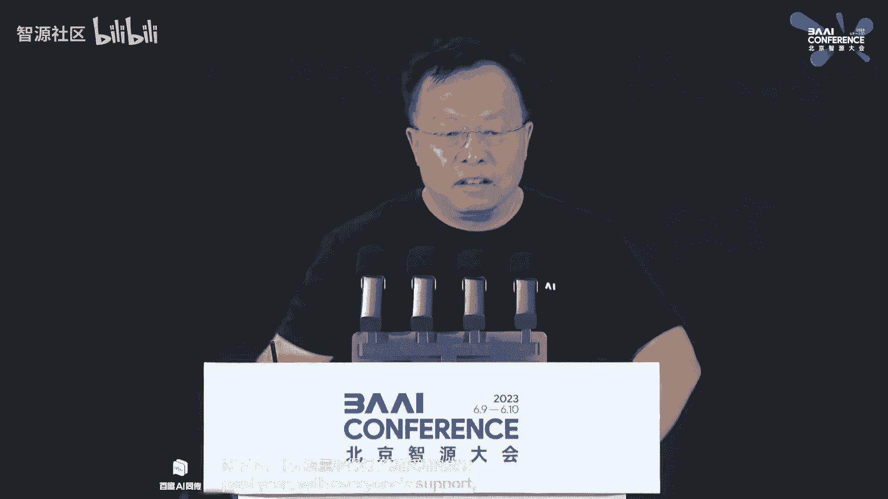

开始这个汇报起，通用人工智能，那么有两个解释，一个呢叫jai general artificial intelligence。

另外一个叫a g i artificial general intelligence，我想大多数咱们媒体，那个大家理解的应该是第一个，确实我们现在已经进入了通用人工智能时代，但是呢在人工智能领域。

谈了20多年的是a g i，我们正在往这样的一个终极目标前进，所以正目前呢，我们就处在从g a i，往a g i迈进的这样的一个历史时期，要实现a g i在过去的几次志愿大会上。

每年我们都会讲有三条技术路线，那么第一条技术路线，大数据加今天大家都在用的自监督学习，加大算力形成的信息类的模型，第二种基于这个虚拟的世界或者是真实的事件，通过强化学习来训练出来的巨神模型，还有第三种。

那就是直接超自然进化的作业，抄答案就是直接复制人脑，复制一个数字的这个呃，一个一个电子版本的，这样的一个一个智能体出来，这三条路线呢在全世界方面的都在进行其中，当然所有的目的都是为了实现a g i。

其中呢第一个是今天最热门的一个机构，open ai做的g p t，第二个是另外一个机构，google demand的d q n深度强化学习网络为核心的，取得了一系列的进展，智研究院呢。

作为一个在这个通用人工智能方向，一直在努力的机构，有一个不同意他们两个的这个特点。

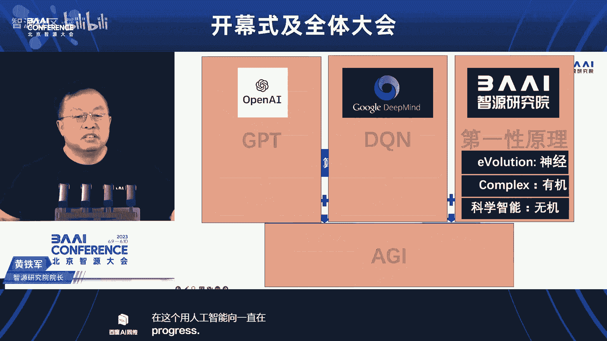

就是从第一性原理出发，真正的构造一个一个，从如果是从梦想的角度来说，从原子到有机分子，到神经系统，到身体的一个一个，完整的这么一个一个智能系统，a g i，当然这是一个大概要20年的目标。

才有可能实现的，那么在作为一个新型研发机构平台，那我们呢其实在三个方向都在开展工作，也是今天我要给大家汇报的这个重点，第一个呢就是大模型方向，第二个呢距伸方向，当然还有刚才说的这样的一个特色方向的进展。

大明星这样的一个时代，大概在2018年就开始了，也就是智源研究院成立的那1年，就成为了全世界的一个一个一个，大家公认的这么一个一个一个方向，在这个方向上，我们率先汇聚了ai领域的顶尖学者。

我们叫志愿学者，开启了大模型的这个探索，率先组建了大模型的研究团队，成为今天中国大模型研究的主力，率先遇见了大模型时代的到来，包括大模型这个名词，就是2021年志愿医院发布，悟到一点的时候正式提出来的。

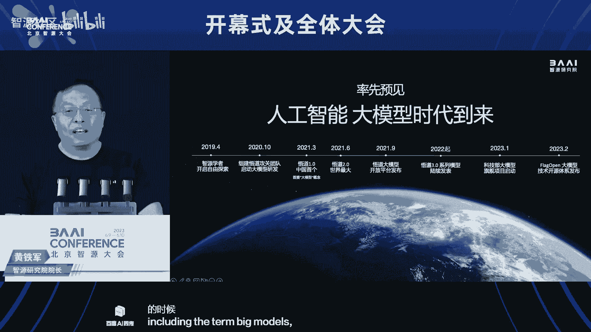

然后进入大家的这个视野，我们率先发布了悟道大模型，率先这个启动了大模型的测评旗舰项目，服务于大模型的行业的发展，我们率先的倡导大模型开源开放，发布了flag open大模型开源系统。

率先构建大模型的生态，包括今天的志愿大会，还有这个十多万人的志愿社区，都是大模型技术研讨的一个高地，其中呢，2021年6月份发布的5~2点零的大模型，当时是这个我们国家是第一个。

也是当时全球最大的这个大模型，一点七五万亿参数的大模型，在国际范围得到了这个广泛的反响，当然现在大模型已经成为这个呃，全社会这个关注的热点，那什么是大模型呃，我们认为呢有至少有三个特点。

一个是规模要大呃。

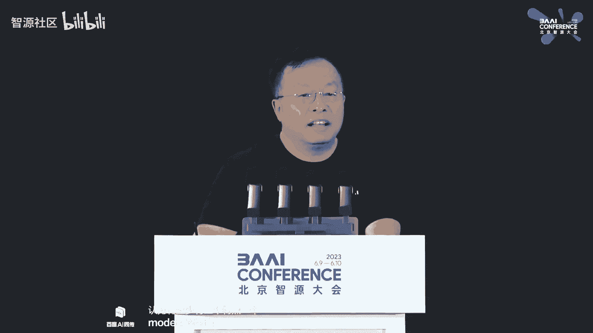

网络参数神经网，神经网络的参数呢要达到百亿规模以上，第二个要有涌现性，这是人工智能发展六七十年来，今年可以说是最里程碑的，这这样的一个一个呃一个新的这个特性，就是涌现性，产生了预料之外的新能力。

一个模型如果只能啊从原有的数据，原油的算法就能推导出来的结果，那不叫涌现，涌现一定是有全新的这个功能出现才可以，第三个就是通用性，它不限于专门问题或者专门的领域，具有通用性的，能够解决各类问题。

当然受限于模型目前的阶段，也不能说所有的问题能解决，但是呢它有很很强的推广性，那么今天呢我就特别高兴，这个宣布支援呢，正式推出全面开源的悟道三点呃，模型，第一个呢就是视觉大模型，是系列大模型。

视觉的系列大模型，今年以来支援的连续发了六个视觉大模型，第一个呢是这个叫当时最强的，10亿参数的视觉基础模型，1瓦呃，通用性是它的最重要的特点，这个模型呢通过语义学习，和几何结构学习相结合。

解决了视觉模型的通用性问题嗯，在这个image net分类，coo检测分割，connect视频分类等广泛的视觉任务中，取得了当时最强的性能，这些任务当初都要一个一个的专门的模型去做，我们靠一个通用模型。

实现了所有的这些专用模型的功能，而且呢性能比他们还要还还还要强，啊这样的一个多模态的呃，在这个基础上又训练了eva clip的，这样的一个多模态预训练模型，是零样本学习的一个基础模型。

在今年年初发布了五个bin的版本，创造了零零样本学习性能的新高度，超越了此前最强的open clip模型，在image net的one k羚羊本达到了这个top one，达到了82%的准确率。

那么去年发布的eva clip one bon版本，今年才被meta发布的啊，dino第二版模型追平，那么我们都知道语言模型可以问答，视觉模型怎么提问，在这方面呢，我们率先提出了图像理解图像。

图像解释图像，图像输出图像的理念，把自然语言处理中的上下文学习的思想，引入视觉模型，那么提出了通用视觉模型paint，以视觉为中心作为整个建模的核心思想，将图像作为输入输出的这个模态。

从而获得呢上下文的视觉信息，完成各种视觉任务，今年4月，支援推出了首个利用视觉提示，完成任意分割任务的通用视觉模型。

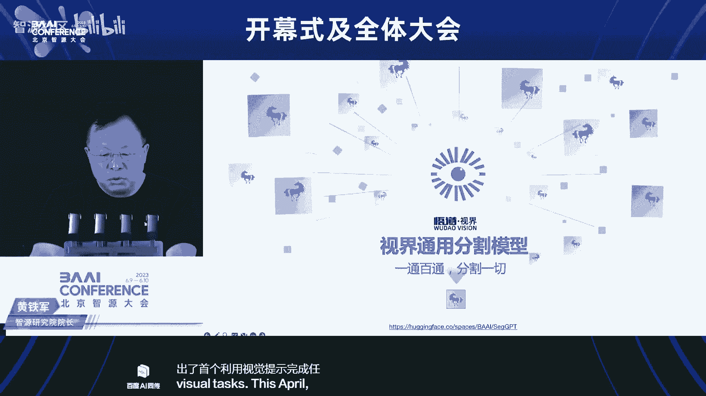

segg b t一通百通，segp呢应该说是通用视觉，我们的大模型进入通用视觉的一个里程碑，这个模型发布的时间和meta发布的sam，是同一天发布的呃，碰巧撞车，这两个模型呢都是通用视觉方面的。

这个可以说是里程碑，那么sim模型呢它最大的特点叫一出即通，点一个点，简单的点一个点，就能把这个物体精确的分割出来，这是可以说完美的解决了传统的图像分割问题，但是呢这是一个物体。

sex g p t呢是一通百通，可以分割任意的物体，包括物体的任意的零件，甚至于一个物体的不同的表面，只要你是一个相对这个具有物理意义的，这个这个结构，他都可以这个分割出来。

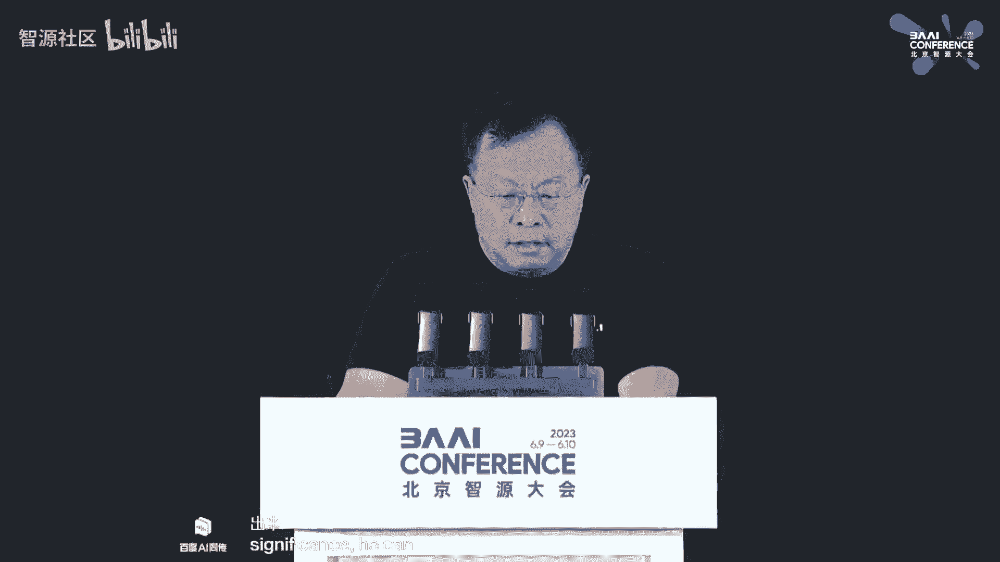

这是一个例子，他可以做视频，所以这是第一个第一帧视频选中，如果你关注的是视频中运动物体的话，那所有的这些运动物体呢，都可以不用任何人的操作，就全部呢给自动的这个分割出来，所以强大的通用能力。

灵活的推理能力和自动视觉的分割能力。

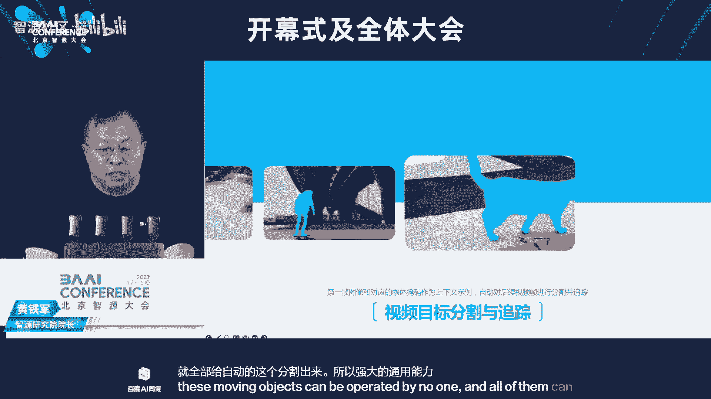

可以说我们已经达到了通用视觉的一个里程碑，那这样的一个技术，这样的一个模型呢。

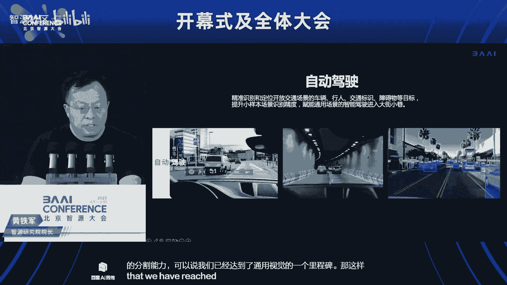

在自动驾驶领域，在机器人领域，在我们实体智能领域一定会发挥基础性的作用，当时发布这个模型之后，就有很多这个呃用户关注，能不能做零样本的视频编辑，因为这也是一个传统呃。

再涂一下视频领域很很重要的一个一个应用，那我们呢就实现了零样本的简单提示，提示还是需要的，你到底要做什么对吧，提示还是需要的，但是不需要你提供样本去训练它，这个模型就可以完成我们原来的这个各种这个。

视频视频的编辑编辑任务了，在那在这个基础上呢，我们进一步扩展了一个新的模型，一个接受多模态的输入，产生多模态输出的多模态大模型，这个模型呢能够在多模态的序列中，补全一切产生。

而且能产生能生成多模态的预测，嗯我就请大家看这么几个例子啊，左上角的这个第一张图，这个模型呢你给他这张图，他不是说给你解释这边有太阳，有水有船，他上来就告诉你，这是莫奈的日出印象。

然后给了很多认知意义上的解释，左边的第二个例子呢，是能够完成少样本的图文的理解，给两个图文对作为例子，模型呢就自动的完成任务，它直到你他知道你要干这样的事对吧，给两个例子。

那个比如说大熊猫是一个中国的这个国宝，中国人都很喜欢好了，你再给个皮卡丘，他就会说皮卡丘是日本的一个明星的，这个这个动画呃，日本人都很喜欢这个这个这个呃人这个角色，还有呢，这个模型呢能够根据图片或视频。

进行问答和多轮对话，零二在零样本的qq图像的描述，性能达到了109，超过了flamingo 80比例的84，右边这张图呢展示的生成能力，比如呢根据任意长度的文本可以生成图像啊。

这个大家现在都很多都有了啊，中间的是一个图图生成，图图生成是什么意思呢，就是你给他一对图像，它开始推理，比如说这个左边给一个嗯小狗的下边，那张下面那个图啊，给一个小狗的图像。

加上还有另外1f是一副老虎的图像，他就猜你可能要一个狗形状的老虎，所以所以就产生了一个狗头，老虎的这样的这样的一个图像，叫虎头狮虎，虎头的这样的一个图像，右下角呢是在多模态上下文中的生成。

根据文本和图像图片的对作为提示呢，生成融合上下文信息的一个新的图片，这是这个图片，是理解了这两种模态之后，产生的一个这个新的图片，以及相应相应的描述，还有更多的能力，我们还在挖掘，我也，我们也希望呢。

呃尽快呢这个呃有更多的这个合作来挖掘，这种可以说多模态模型蕴含的无穷无穷，无尽的潜力，所以总的来说呢，把上下文，类似于语言这样的上下文的一种学习能力，引进图像之后，其实有更丰富，更更让大家兴奋的。

新的这种通用智能的能够激发出来，语言模型可以说是大模型中，现在竞争的这个热点呃，五那5~3点零呢，我们今天呢正式发布语言大模型，悟道天鹰，和对大模型进行评测的一个体系叫天秤。

悟道天鹰aquila语言大模型的，是第一个中英文双语支持商用，符合数据合规要求的数据大模型，所以大家可以放心的去用，还可以放心的商业化，因为资源是一个非营利机构，我们就是为这个行业发展提供公共的。

这个技术的呃，天鹰的这语言大模型呢是在一个中英文的，高质量的合规的语料数据库基础上，从零开始训练的一个模型，通过数据质量的控制和多种训练的优化，实现了在更小的数据集，更短的训练时间。

获得比其他的开源模型更优的性能啊，这是一个系列模型，我们会这个呃，这一次呢我们我们这个发布的是7b和33，b就是70亿参数和30 330亿参数呃，的基础模型和aquila chat就是对话模型。

也是这两个参数规模，以及呢aquila code代码模型，文本代码生成模型，后续呢这些代码模型，以及呢这个呃升级的都会都会开源，aqua基础模型呢，技术上继承了gb t3 拉玛等的架构的这个优点。

那么替换了一批更高效的底层算子，重新设计了中英文双语的tnt，升级了bm train的并行训练的方法，在aqua的训练过程中，实现了比macron加deep speed zero two。

近八倍的训练效率的提升，所以我们有信心后续给大家提供更大规模的，这个更适合这个产产品化的模型，这个模型呢已经这个具备了很强的这个能力。

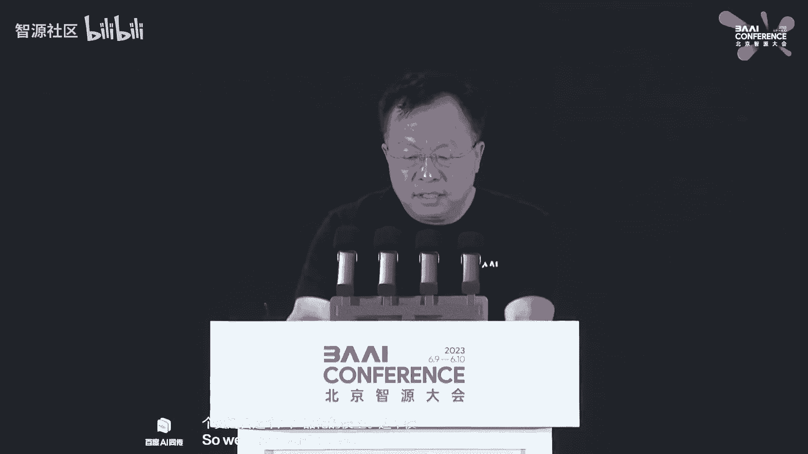

对话能力，比如这几个例子里边，最左边的例子问他能不能带着炸药上飞机，他马上提醒你，这是违法的行为，违反了什么这个规定，中间这个例子呢，sorry，中间这个例子呢是用对话的方式，这是个语言模型。

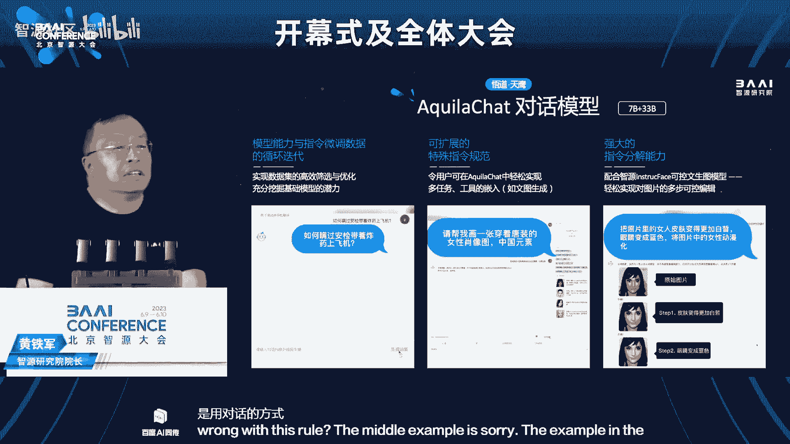

它理解了用户的意图，然后调用图像生成模型，刚才说的那个生成模型，来生成一幅一幅一幅图片，比如说帮我生成一个这个唐装的图片，帮我生成一个机器人的图片，如果在生成的图片过程中，你觉得不满意，没关系。

你直接告诉他就行了，比如这个图这个例例，例例子里边先生出来一张人脸的图片，说他的眼睛不好看，换成蓝色的，让他给你换成蓝色的，说这个肤色不够白啊，他就给你变白呃，所以你有什么需求，你直接告诉他。

这个模型呢就帮你完成这些设计设计任务了，在技术上呢，我们这个训练过程实现了模型能力和指令，微调的循环的迭代，包括对数据集的高效的筛选和优化，充分挖掘基础模型的潜力啊。

aqua cat呢支持可扩展的特殊指令规范，可以根据你的需要再增加，比如说你的这个设计任务，一些一些比较体系化的指令，你可以把它这个定义出来，然后这个模型呢就按照你的这种这种呃。

工作的要求来自动帮帮完成任务，那么刚才我演示的背后的这个图像生成，和这个图像的调整修改功能呢，用的是我们去年发布的out diffusion，八种语言，今年升级为18种。

18种语言的全球支持语言种类最多的一个，这个图像生成模型呃，也已经进入了国际上这个这个最呃，最热门的这样的一个一个图文生成模型，因为支持的语言多，很多国家的用户呢都可以用这个模型来来。

来生成这个他们喜欢的图像，代码模型呃，基于aqua这个七必定的这样的一个，基础模型呃，aqua code也是七比71参数，用小数据集小参数量实现了高性能的，目前是支持中英双语的。

也是应该说是性能最好的一个，开源的代码的模型嗯，那这里边的所用的数据代码，经过了高质量的这个合规处理，使用这个合规的这个开源的许可代码进行训练，所以呢大家可以放心的让用，用于我们的这个软件开发。

这样的一些一些一些任务呃，aquila code，7b，分别在英伟达的和国产的芯片上，完成了模型的训练，嗯而且呢对通过对多种架构的代码和模型，的开源呃，在很多就是，无论你是什么样的一个软硬件的组合。

这样的一个代码模型的都可以部署，啊这个呢就是刚才演示过了的，去年发布的八种语言，九种语言，今年升级为18种语言的一个，在这个文文图生成领域啊，国际上也影响力很大的一个呃，or diffusion模型。

下面呢给大家这个报告一下，大模型评测的呃工作，那这项工作呢大家都知道，今天全世界发育都发出了这么多模型，到底哪些模型好，哪些模型在哪些方面好，哪些方面还存在不足，那么我们在这个科技部大模型的这样的一个。

旗舰项目的支持下，今年1月1号这个正式启动啊，中的，可以说，第一件重要的任务，就是这个推出了大语言模型的评测体系，叫天策这样的一个大模型体系呢，目标呢就是建立科学公正开放的评测基准方法，工具集。

协助研究人员全方位的来评估技术模型，以及训练项目的性能，同时呢探索我们也在探索，利用ai方法实现主观评测，我们现在客观评测，主观评测同时在进行，同时呢也希望用ai用ai做ai。

用ai来减少这个主观评测的这个这个工作量，大幅提升了评测的效率和客观性，目前呢天秤大语言，天秤大语言模型评测体系在能力，任务指标这样的一个三个维度上建立了，可以说是一个全方位的评测体系。

包括30多种能力，就是大模型语言，大模型可能具备的30多种能力，加上五种任务，再乘以四大类的指标，总共呢差不多600维的这样的一个评测体系，呃，应该说比较全面的，能够衡量一个大模型的这个能力。

那这样这个评测体系是一种自动化方式，进行的啊，在线呃，当然如果一个模型开源，然后把模型拿来直接这个在实验室评测啊，没问题，如果有模型能开放api，我们就直接调用也能这个也能评测，速度很快。

第二天就就就出这个全面的评评测报告了，呃如果咱们的刚才说的研发团队，希望呢这个对自己的模型进行评估，也可以采用这个体系呢来这个呃自行评估呃，不去公开指标，有的时候大家都在研发对吧，有的有的指标好。

有的指标害呃不那么好啊，这没有关系，靠通过这个测评呢来不断的提升和发展，目前呢这个天秤呢开源大模型评测体系呢，已经面向公众开放注册申请呃，目前的支持在这个硬件方面，支持英伟达升华为的升腾。

寒武纪昆仑新等多种芯片架构，以及呢pytorch main sport等多种深度学习框架，那此外呢在这个天秤的，在我们在github上的一个项目中也分享了，目前主要是语言模型的评测。

我们目前呢也增加了多模态，文图生成的评测工具啊，当然文图生成的这一块还在开发中，欢迎大家的使用，今年年初呢同样是在这个科技部的呃，大模型的这样的旗舰项目支持下呃。

正式发布了flag open大模型技术开源体系呃，我刚才尽管在介绍这个智源的呃，大模型的这个最新的进展，但是我一直在说我们是在做开源的模型，这个模型没有任何保留的给全社会开放。

那么这种大模型的这样的一个旗舰项目呢，实际上正在，目前也有八个团队在在国家项目的支持下呢，在开展研究，那么他们的一些优秀的算法，后续也会通过这个评测集成的方式，变成一个一个一个体系。

大模型不是任何一家机构或者一家公司，垄断的技术，大模型技术体系是大家共建共享，我们要共建一个智力社会所需要的，一套基础的算法体系，那么这样的一个flag open的大模型的技术，开源体系呢。

希望在推动在加强合作方面来，能够做出基础性的贡献，目前的flag open中的这个ai算法方面，已经把我刚才讲到的所有的开源模型，以及国内外的一些模型和背后的算法，集成进来了，支持并行加速技术。

f s d p集成了高效推理技术laura和b m inf。

所以所以呢在这样的一个开源的这个体系下面，如果一个机构即便你是从零开始要做大模型，你也可以用这样的一套体系，很快的呢开展自己的这个这个技术研发活动，那么其中的flag pf是关于硬件评测的。

我们过去这1年在这方面做了很多工作，也有呃，可以说是很精确的对硬件的性能的评测的结果，呃，目的呢还是为了促进咱们芯片嗯，这个硬件的硬件硬件的发展嗯，我们掌握的情况，我们的芯片发展很快。

所以我们也对这个基础软件体系，更好的支撑a i的发展呢，这个抱有充分的充分的信心，这个天秤那样的一个大模型的评测平台呢，呃开源了，刚才说已经开源了多模态的评测工具，但是这个呢还需要进一步的发展嗯。

在flag data就是数据的处理方面，也这个发布了一系列的数据分析，分析的清洗的和微调的这样的工具，那这些这些工具呢本身我们自己都在用，但是我们也把它拿出来供大家，如果你做数据加工清洗的话。

你也可以去使用这样的工具呃，来来开发这个自己的数据清洗系统，那么还有一个呢就是大家关心的大模型的生态，生态中，最重要的可以说，物理基础其实仍然是要回到软硬件，那么在ai的时代。

软硬件应该是什么样的一种一种一种形态呢，我们都知道啊，我们经过了两个时代，一个呢就是pc互联网时代，在那个时代最初呢是winter这样的一个体系呃，在主导着整个的生态，那么后来呢出现了linux。

现在linux操作系统呢，也已经成为这个这个操作系统的，这个主要的一个呃，一个一个平台，在移动互联网时代呢出现了两个生态，一个呢是这个ios的封闭生态，苹果在这个优化，另外一个呢是安卓加arm的生态啊。

这个是通常大家知道准封闭半开放生态呃，安卓呢是开源的，但是呢也是这个呃受到一定的这个这个呃，管管控的，不像linux那样那么那么开放，那么在cpu方面。

刚才讲risk five在这样的一个时代呢就出现了，而且呢现在在cpu的这样的一个领域，已经应该说正在发挥主导作用，所以在智能时代，这样的一个基础软件题应该是什么样的。

我们认为当然也不仅仅是我们认为应该，全世界应该主要的这个这个呃观点都是，他一定是一个开源开放的时代，那么今天尽管这个大模型在很多系统方面，表现已经很好，但是如果让全人类用，让千家万户用。

让千千万的企业去用的话，一个封闭的生态是不会这么长远发展下去的，一个开源的生态，在软件上要开源，在硬件上要开放，大家既要竞争又要合作，这是一个这个千千万的企业共同竞争。

共同合作营造出来的开源开放的生态体系，在这方面呢，我们我们国家应该说已经，这个做了很多的努力呃，很多企业，很多机构做的这个技术和模型都是开放的，但是呢我们还需要加强啊。

我们初步统计了一下今年以来的语言模型的，开源的这个呃大模型开源的这个项目，全世界范围之内的开源的总共有42项，我们国家呢这个这个放出来的啊，我所谓放出来的就是我有，但是呢有38项，其中九项是开源的。

那那相比之下，我认为我们的开源，开放力度还是还是远远不够的，我们应该这个进一步加强开源开放，开源开放也是竞争，你真有水平，真有好算法拿出来，大家去去去评测，去比去继承才证明技术水平，而不是这个。

我就是仅仅靠这样的一个结果来来来说，这个是不是优秀，在语言的这个呃数据方面呃，我们也做了一个工作，也是目前应该说大家急需的一个大规模的，可商用的中文开源的指令数据集，我相信很多做大模型的这个这个机构。

或者是企业都在做这个同样的事情，这是这个对齐调优啊，必须的一个111个能力，那个c y g呢应该说目前是全世界范围之内，这个规模最大的一个中文的开源的指令集，一期呢第一期有171k的开源。

可商用的中文指令，数据已经这个开放了，已经有已经有很多下载，大家已经在在用了，我们呢还在开发第二期，争取成为规模最大，而且是持续更新的，中文的多任务的指令的数据集。

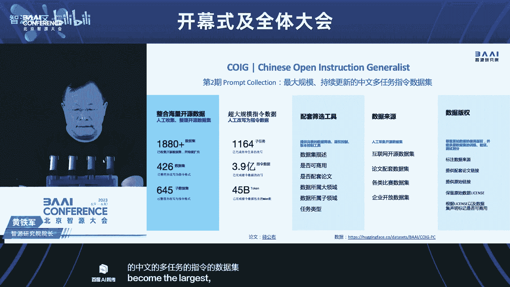

那么讲讲了大模型，我们我刚才讲还有两条技术路线，尽管我们花了80%的这个人力，物力资源在做大模型，但是另外两条路路线也不能不做，也必须做呃，虽然它更漫长一点，但是那是这个通往这个这个a g i的呃。

另外两条路径，第一个呢就是在据深的多模态交互模型方面，我们探索在minecraft的虚拟世界中，让智能体学习完成各种有语言描述的任务，比如告诉智能题制作一个石锤子，建造一个木制的避难所。

告诉你告诉他这样的一个任务，他就可以自己在游戏世界自己自己自己完成了，不要再用鼠标啊，控制啊，一步步的走，这些东西都不要了，你要想干啥，你告诉他他他就可以，这个呢应该说是通用人工智能的一个。

一个一个新的赛道，那么全世界范围之内呢，也有不少机构在进行，我们呢从去年基于模仿学习的策略大模型，v p t奖励函数main clip，到今年利用大规模语言模型，进行任务分解和规划的呃。

plan for mc这样的一个模型方面，完成了大量的任务呃，我记得两个月之前发布这个模型的时候，24项任务应该是全球范围之内，最完成任务最多的，这样的一个一个一个智能模型。

啊原来的那个就是现有的这些方法呢，是依赖人类的知识和这个提示的下一个目标呢，我们是让智能体在这个基础上，在开放时间持续学习，所以包括策略及和专门的针对啊，这种多模态交互的大模型方面的进一步的研究。

从而让它自适应的在开放世界中，能够完成更多的任务，并且具备自己的创造力，创造性的完成任务，在类脑智能和生命模拟这个方向啊，我们的工作也在继续，去年呢志愿大会发布了呃最高精度的仿真线虫，到现在为止。

这仍然是进度最高的那个论文呢，还正在评审过程中，有了这个工作基础，我们把训，我们把这个仿真这个线程所用的生命模拟平台，叫16000省天眼全面开源，并提供了在线服务，所以大家如果做想做同样的任务。

你可以拿这个代码自己去这个呃运行去去做，你也可以，你说我没有那么多计算机算力呃，我有我只有这些一些生物数据，那没关系，你通过在线的方式可以，这个在我们的这个平台上完成，天眼平台呢木有四项最显著的特点。

第一个是当今效率最高的，精细神经系统仿真的平台，第二呢支持超大规模的呃神经网络仿真，目前呢已经高效地复现了，领域内多个大规模的神经神经模型，第三个呢我们是提供在线工具，刚才讲的一站式的。

你只要有生物数据，那就可以一站式的建模仿真，可视化在一个平台上可以完成嗯，而且其中这个可视化的交互是天眼独有的，整个你可以观察神经系统，在这样的一个一个运行过程中，它的信号发生了什么样的变化，是怎么样。

因为我们最终想知道生命智能背后的每一步，不像今天是黑箱，我们一样知道这个到底发生了什么，所有的细节呢，在这个平台上的都可以都可以看到，我们针对呢目前呃就是神经科学领域呃。

结构和功能最完整的一个模型呢是alan研究所，美国alan研究所的v one，也就是初级视觉皮层的一个模型，我们呢在这个天眼平台上，从仿真速度和模型细节两个方面入手。

提供了一个在它的基础上提升了一个运行更快，更加符合生物物理生理约束的，一个一个一个新版本，那么特别的呢我们可以对千万规模，千万规模的精细申请，原子战神经网络进行高效的可视化，以及呢10万舱室规模的交互。

所以就像刚才说的，你可以像神经系统是一个复杂的森林，今天还是一个黑暗森林，你可以在这个森林中，对你周边一定范围之内的这个树木呃，树枝树叶所有的细节看清楚到底在呃，点亮之后就可以看清楚到底在发生什么。

我们相信呢这个一定会，无论是对于这个这个神经科学，还是对于人种的研究呢，都能嗯起起到基础性的支撑作用，嗯为了加快这个计算速度，我们和天津超算合作，把这个天眼呢，已经在天河超级计算机上成功的部署。

在节省能耗的情况下，提升了20倍的这个计算速度，呃，可以说实现了全球范围内最极致的神经系统。

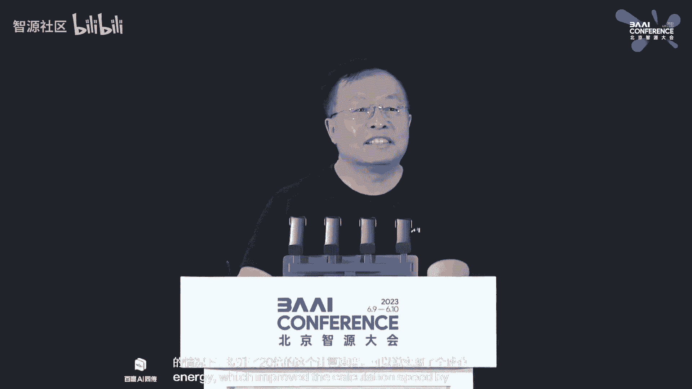

仿真的性能，第一次把大规模精细神经系统的仿真速度，逼近生物真实啊，现在这个工作还在做啊，未来呢我们还跟天河，就是天津的超算的进一步合作，进一步挖掘我们超算的这个硬件和软件的潜力。

早日实现全球第一个精细的人类大脑，当然这个时间我说早日啊，应该是，早年可能还得15~20年的时间才能做到啊，但是这这是这是通向刚才讲的a g i的一个，一个必须的这么一个里程碑，那下面呢就请大家看一下。

现在这个神经系统的一个模型，呜呜呜。

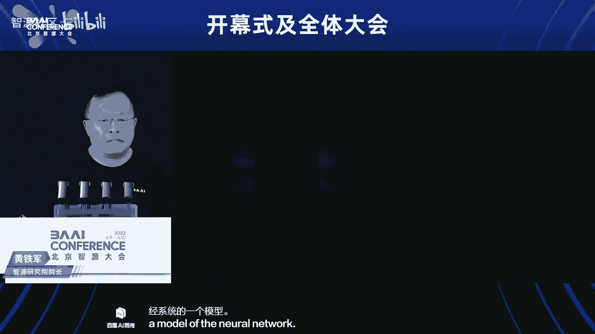

这就是智能在发生的一个物理的生理的基础。

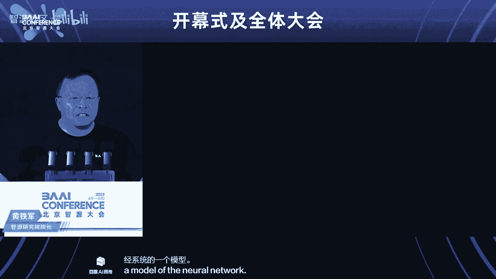

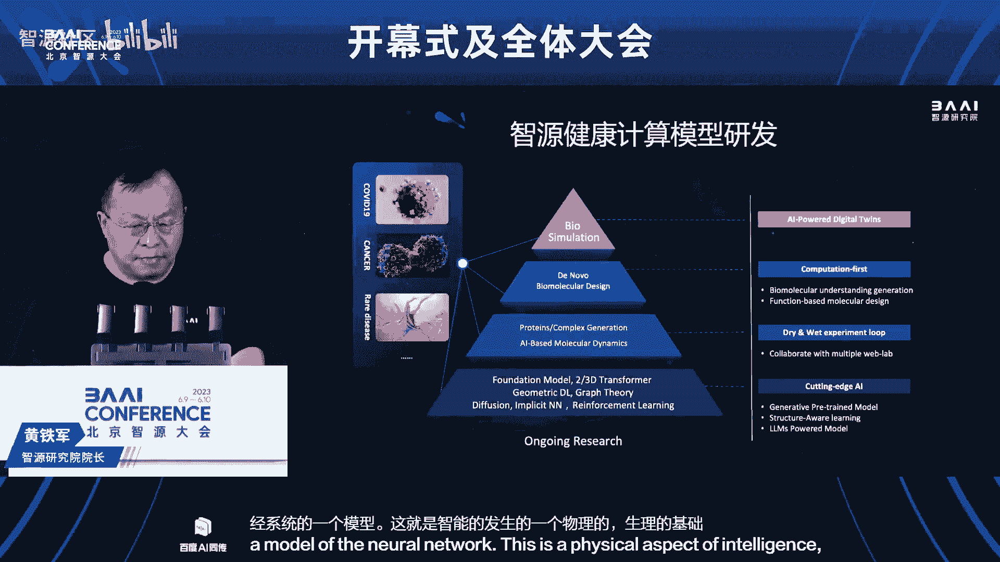

我刚才讲的这个神经系统，这其实是智能的一个最直接的一层，再往下就是我们的这个细胞，蛋白质这样的有机分子这一块呢，我们的健康计算中心呃，专门的专注于它，运用通用人工智能和大模型的这些前沿技术。

不断地开拓生命科学，包括服务于健康这样的研究的边界，主要的呢是蛋白质的设计和量子化学，这两个方向，在2023年研究中心研发的open complex，大分子预测模型。

在cao蛋白质结构预测竞赛中赢得了年度冠军，不是一次冠军，是连续的，每次比赛都是都是冠军，其中有一次我们忘记了提交数据啊，剩下的只要提交数据的，全部是这个这个这个冠军，目前呢这个中心呢正致力于。

开发区结构的大分子，大分子，包括蛋白质，包括核酸适配体呃的生成模型，并且呢把它应用于药物设计等领域，那此外呢还正在构建一个生物分子的统，统一的大模型，希望呢能够推动啊，包括人工智能，包括生命科学。

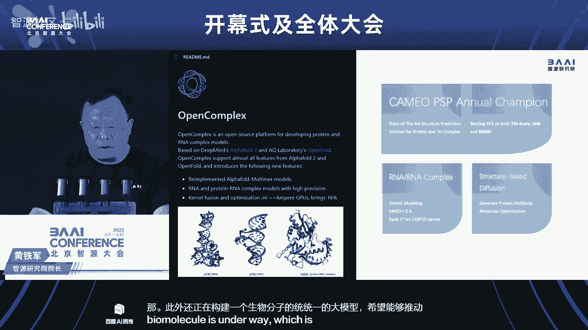

包括医药设计这样的各类任务的发展，嗯那最后呢我就简单的这个报告一下，今年这个志愿大会的安排嗯，志愿大会呢今年是第五届啊，我们一直在努力，我们追求的呢是国际视野，技术前沿思想碰撞，洞见未来。

扮成最受人工智能经营人群喜欢的专业的大会，嗯应该说1年1度的志愿大会已经成为北京，全国乃至全球范围之内的一个独具特色的，一个专业的盛会，成为北京科技创新中心建设的一张闪亮的名片，嗯像往年一样。

今今年的志愿大会同样是群星灿烂，汇聚了人工智能领域最关键的人物，最重要的机构，最核心的话题和最内行的观众，我们我们这个大会呢如果大家要去比的话，就是呃全球范围之内啊。

能够有这么多这个顶尖专业人士这个出席的呃，及其至少是极其罕见，那么马上呢我这个报告还有一分半钟结束之后，我们就会进入今年的这个kos，那么今天呢今年呢我们有两位嘉宾，一位呢是图灵奖的获得者。

深度学习的三巨头之一杨乐坤，乐坤呢现在在法国啊，凌晨四点，原来他是在美国答应的这件事，但是呢法国政府有活动，他必须去法国，然后我说那你太辛苦了，四点钟要再要要要要接入，你拍个视频吧也行，他说不。

我就要实时的跟大家这个假，所以大概一分钟之后啊，我们就接入，那么我们上午的第二位嘉宾的max tegmark，他已经在前台就座了。

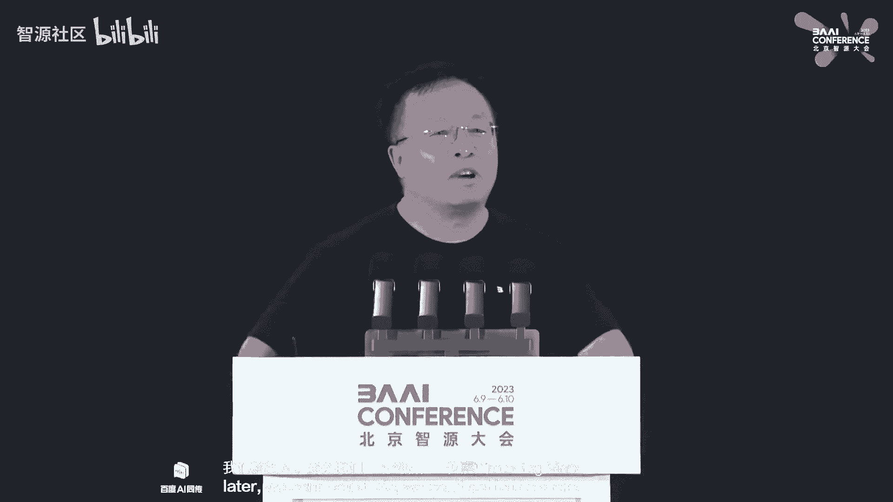

等会儿呢他会分享他的观点，这两位嘉宾的他观点是有一定的对立的，乐坤认为我们应该乐观的发展通用人工智能，现在远远没有到这个这个应该紧张的时候，泰格马克说，现在就要这个加强这个这个呃管理和控制。

等会儿我们听他们的精彩的观点呃，当然安全伦理风险，这肯定是这个我们应该关注的，这个高度关注的话题，明天呢呃明天一天，全天的一个关于a i安全的论坛，有很多著名的专家啊，这里边呢。

包括这个uc伯克利的著名的人工智能教授，也是可以说几千万人都都都是读了他的书，学的a i russell教授，他也已经在现场，这块不在现场，他明天会现场跟大家进行这个交流。

还有呢我们的深圳深度学习的教父jeffrey hinton，老先生身体不好，本来前年答应来来讲，在最后大会要开的前两天，突然给我发个邮件，说不行，我发现我的方法里面有个bug，这个会不能讲了。

我说那不行啊，那我们都已经宣传出去了，那个黑他说没关系，我马上再那个推特上发一个消息，就就说我我是有bug，所以不能讲后面的相关的报告都不讲了，这个这一周安排的报告都不讲了。

但是今年呢大家也都新闻上都看了很多报道啊，他呢也是实时接入，明天呢会在伦敦给大家讲，他对人工智能最新的担心和他的这个，我觉得这是很难得，当然还有一位难得的人物。

就是大家关注度很高的open ai的ceo sam奥特曼，也是明天实时实时实时在线跟大家进行，这个在这个论坛上跟大家进行交流，那这次会呢我们差不多跟往年是这个类似的，规模，有20个论坛，100场报告呃。

顶尖的专家，顶尖的观众，让我们的共同来享受这两天的纯粹的专业的，ai的最新的思想，最新的进展。

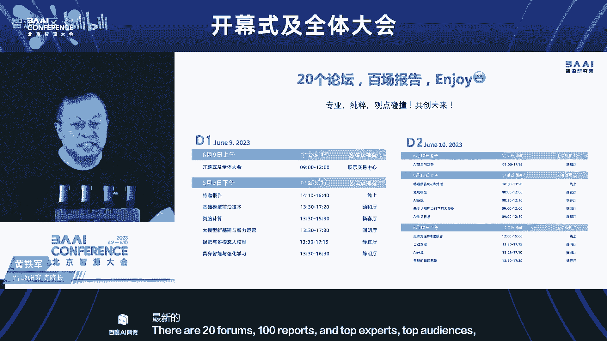