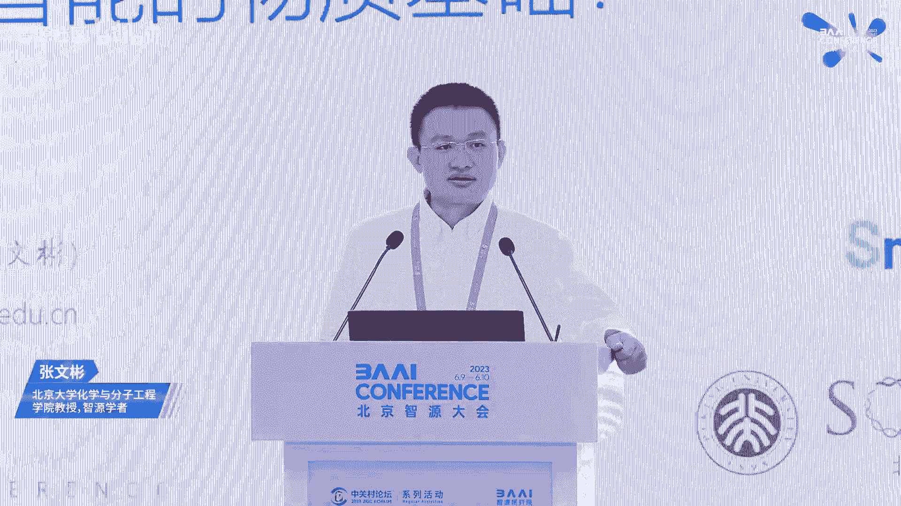
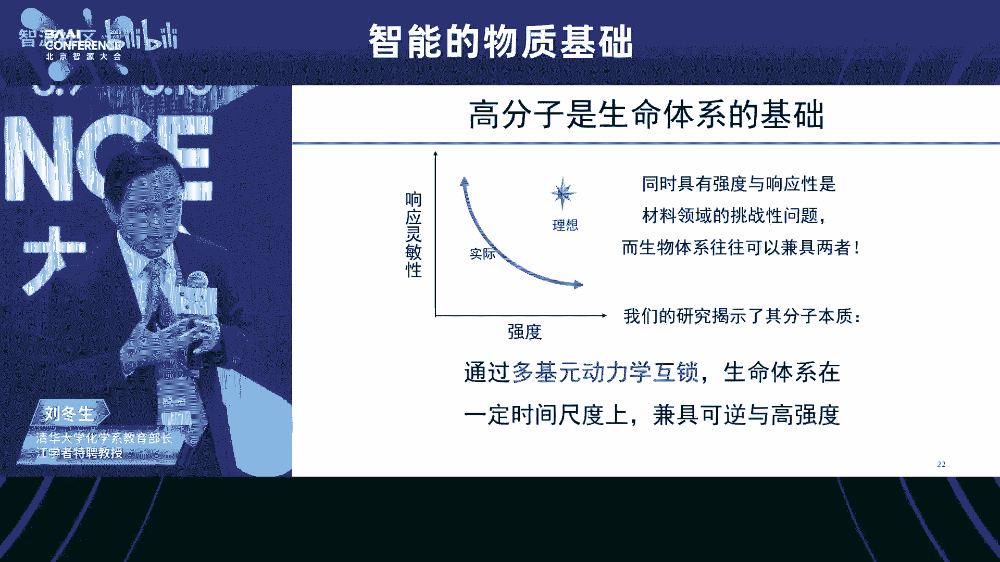
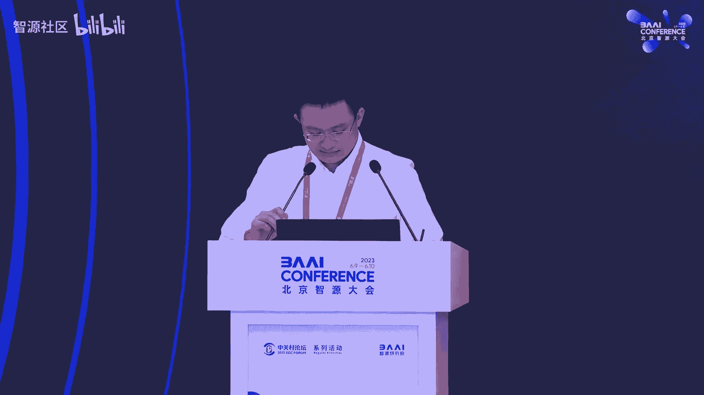
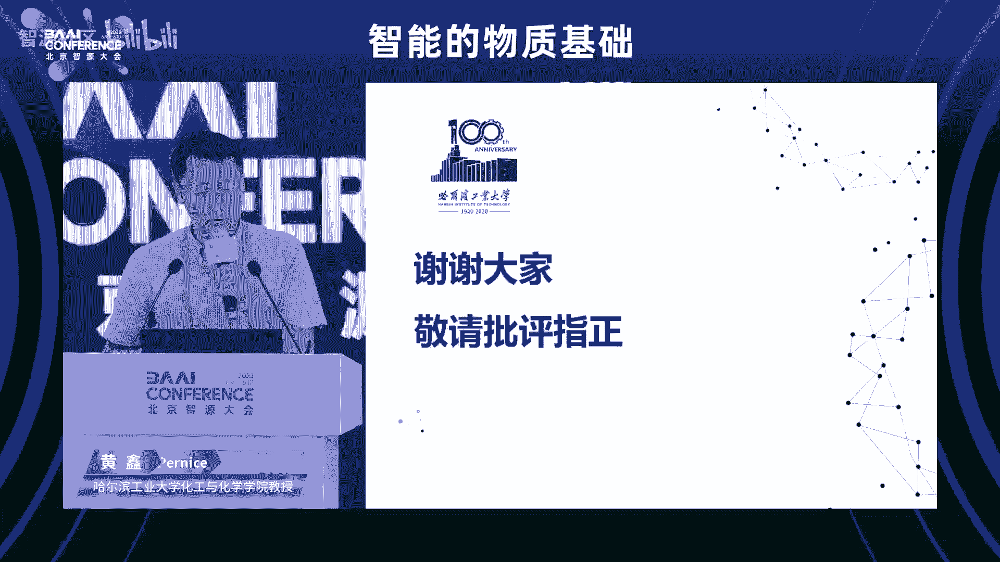
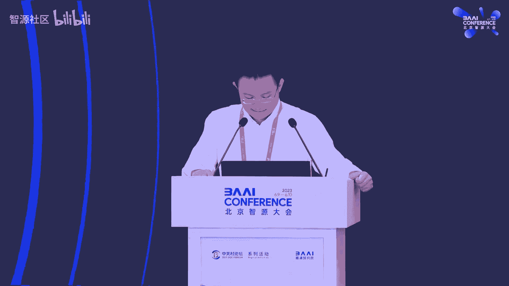
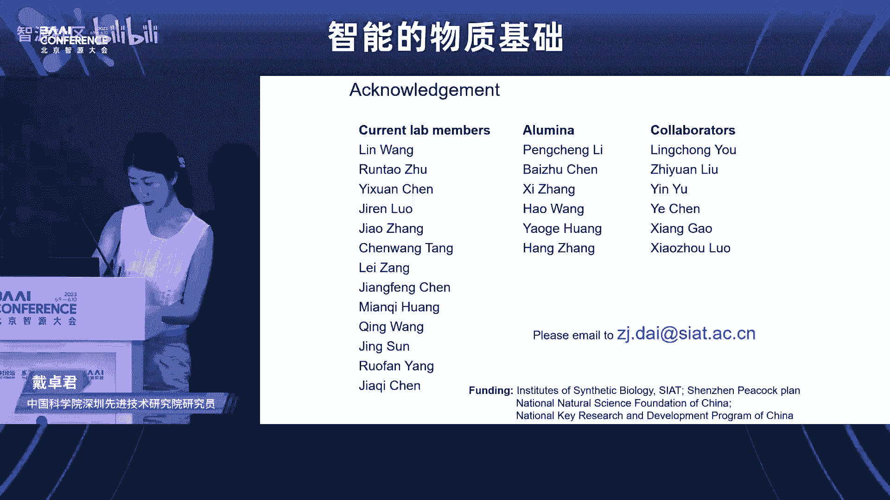
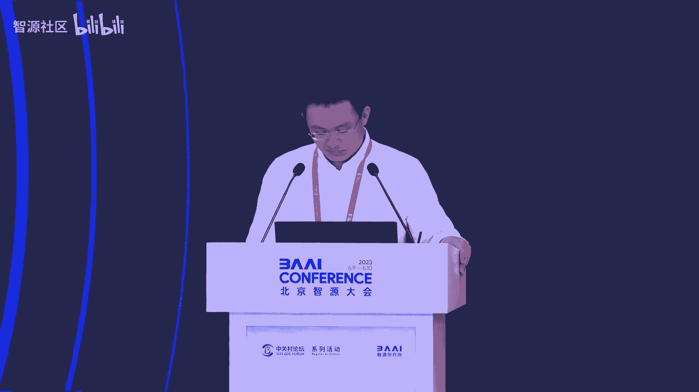
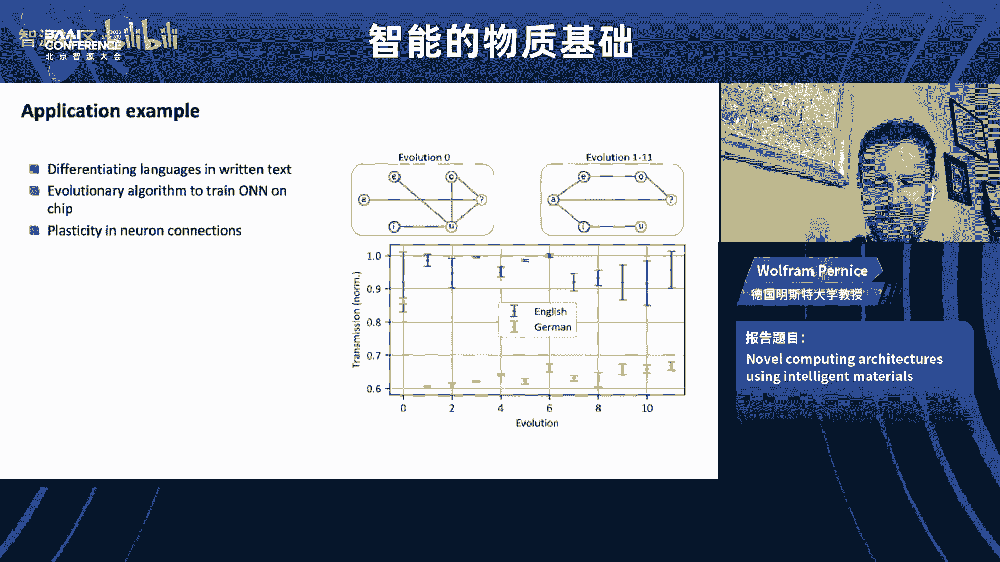
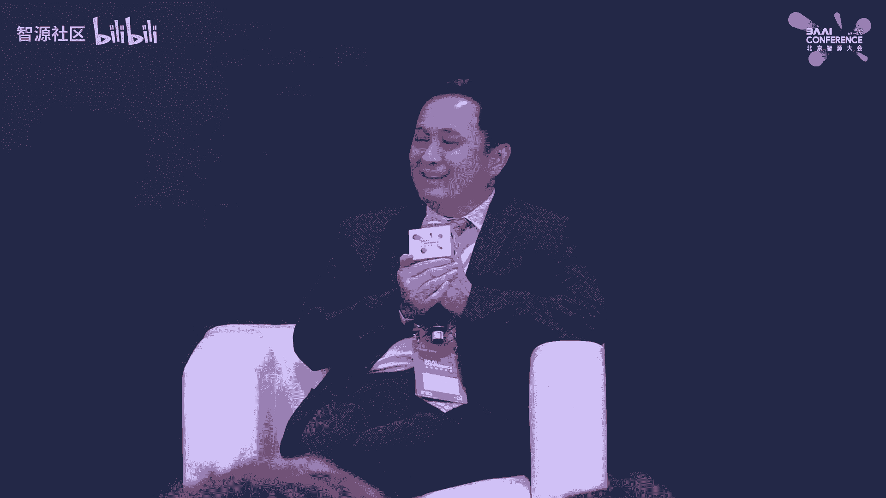

# 智能的物质基础论坛 - P1 - 智源社区 - BV1Ju4y1o7Hq

尊敬的线上和线下的各位嘉宾，大家下午好呃，我是本次分论坛的嗯主席张文斌。很，欢迎大家来到我们这个分论坛。😊，今天我们就在一起来讨论一下什么是智能的物质基础。这是这个分行第二次举办啊。

像去年我们有6位讲者一起来啊对这个领域进行了一个初步的探讨。

在2021年的时候。end教授在nature上面发表了一篇文章，叫做rise of intelligent matter，提倡了一个智能物质的这么一个概念。但其实上这个概念说新也不新。

但是呃他是一个和之前我们提的智能材料，又有相似的地方，在于他有一些响应性行为等等。但是他又有一些新的一些理念在里头。比如说在这篇文章里头呢，呃wo教授呢就希望这样一些物质能够同时实现计算。

实现响应性的学习等等。那么在去年的讨论之后呢，我们嗯初步得出了一些提出了一些观点，认为现在智能物质是跨越多个尺度的能够集成信息和控制的一个物质体系。那么在小到这个分子的程度，分子进一步形成组装体。

这些组装体的结构尺度越来越大，形成了细胞，而细胞在进一步的进行组织，形成了一些organ。那么在这个上面呢，逐渐涌现出越来越复杂的一些行为。智能物质它有这么几个非常有趣的特点。第一个就是复杂性。

那么这个复杂性呢可以存在这广泛的这个尺度上的任何一个尺度。比如分子尺度，有分子尺度的复杂性，细胞尺度，有细胞尺度的复杂性，而到了这个组织程度，又有组织程度的复杂性，这是它的第一个特点。

也是啊AI的一个能能够处理的一个很好的一个对象。第二个特点呢就是它的有现，涌线是一个很有趣的概念，它指的是当呃物体之间的相互作用力足够多，足够复杂的时候，它能够作为一个整体展现出个体所不具有的性质。

那么涌现现象也同样发生在各个单独的尺度，然后这些涌现出来的新的功能呢，还会被进一步集成和转移到下一个更高的这个尺度上去。智能物质的第三个特点就是信息信息是智能物质不可或缺的一个部分。

它能够从环境中获取信息、感知信息、存储信息，并且处理信息。它是智能物质的一个核心，而最后就是集成。功能材料和一个可以重新组织的一个回路组织在一起呢，就可以实现真正的一个智能物质。

它是呃它曾经是生命的这个呃缘起的一个表现。那么现在这个概念呢也在激励着我们去发展一些人工的一些智能物质。那么这呃根据我们对这样的一个理解呢，这一次呃报告我们非常有幸呃请来了这么几位杰出的讲者。

他们在各个尺度上来向我们阐释他们对于智能物质的理解。第一个是在呃分子智能尺度方面。在生命的这个。智能下面呢在生命智能的分子机制，一直是呃为我们呃大家所非常感兴趣的一个方向。

这个世界是由原子构成原子构成的分子，而分子组成了形形色色的物质。那么呃他之所以拥有智能，之所以拥有各种各样的功能，完全是跟他的这个分子相关的。如何去理解他的这个分子机制是非常重要的。

刘东清华大学的刘东升教授呢，将向我们讲述生命智能当中的这个高分子的效应。我们知道在生命体系里头非常多的重要的大分子重要的这个成分都是大分子的这样一个构建。比如说DNARNA和蛋白质。

那么他将向我们讲述这些呃为什么这些大分子会具有这种智能的这种表现。并呃传。讲展示一些例子，如何把这些智能的分子转化为智能的材料。那么在这个尺度网上呢，就是一些例子。

一些呃一些作为一个举行的的一个智能的一个行为。那么来自香港大学的唐静瑶教授将向我们讲述active matter，也就是活性物质。那么什么是活性物质呢？我们知道生命是一个开放体系。

是一个远离平衡态的开放体系。当一个生命体系呢，如果趋向于热力学平衡态的时候呢，它就是一个死亡的这种状态。在非平衡态，在远离平衡态的地方能够带来非常丰富的功能，非常丰富的性质。那么。

活性物质就是一个典型的通过外界的能量和物质的输入来维持一个非平衡态的一个畸群。那么这样一个畸群呢，通常也会展示出一些智能的一些行为，是非常有趣的研究方向。那么我们知道啊细胞是生命的基源。

也是我们智能的这个基缘。单个细胞具有着非常复杂的这种生命的这种行为，比如说呃它可以去发生呃它可以有目标的去追溯一些路入侵的这种物种，然后把它包吞呃包进去，然后消解掉。

那么我们的生命是呃一种模式化的方式在构建的。那么既然细胞是如此重要一个模块化的成分。那么如何去构建人工的细胞，就成为了智能物质发展当中一个非常重要的一个成分。那么人工细胞的发展当中一个重要的一个方法呢。

就是boom up approach，从我们已知的一些分子机制，从我们熟知的分子的基缘，能不能组装变成一个有功能的一个具有类生命性能的一些细胞。那么这。

就是来自哈尔滨工业大学的黄鑫教授将向将和我们分享的费曼先生有一句话叫做呃我不能创造的，我就没有完全的理解他。那这也是测试我们对于智能的理解的一个试金石。那么既然有这个but up approach。

那么大家可想而知，还有一个叫做top down的appach。生命体系呢已经是一个非常非常复杂的呃，具有丰富功能的一个体系。这个。那么我们也许当我们对他的这个体系有足够的了解之后呢。

我们也能够对他的这个基因回路进行一个改造，赋予他各种各样的这个新的原来的这个生物体所没有的这个性能。这就是现在合成生物学在做的这个事情。从理解这个生命到工程化生命。

那么来自中科院深圳新进技术研究院的戴卓军老师呢，将和我们分享他是如何呃将这些细胞进行工程化。并实现材料的一个活性制造living fabrication。

那最后我们也请来了这个智能物质的这个概念的提出者教授来讲述我们呃来讲述他们在这方面的一些尝试性的工作。他们把一些材料、功能材料和基于光的一个。嗯，这个信息处理系统啊集成在一起。

构建了一个类神经形态的一个处理器。这个处理器呢是完全基于光来工作的，而且可以呃实现一个in memoryory的这comping是非常有意思的这个研究方向。这些工作。

倡导着我们走向这样子一个inent matter的未来。我觉得我们是在一边理解着智能是如何产生的，一边在一些体系当中呢去创造和践行我们的理解。将来这两个理方向呢一定可以重合在一起，集成在一起。

杂化出一些具有先进性能的这个智能物质来。在最后的研究论坛当中呢，我们也会讨论一下像这些这些话题。呃，最后我再次感谢来到现场的各位嘉宾以及线上的观众们。那么接下来我就欢迎我们的这个第一位这个刘东升老师。

那么刘东升老师呢是清华大学化学系教育部长江学者特聘教授吴日生导师、中国化学会会士、英国皇家化学会会士。他入选了创新人才推进计划中青年科技创新领军人才计划中组部万能计划领军人才。

获得过第一届中国化学会英国皇家化学会青年化学奖第七届中国化学会巴斯夫青年知识创新奖等等。他还担任了基金委杰出青年基金重点项目创新群体项目负责人等呃重要的这个项目。

现任smart molecules polymer高分子学报和高等学校化学学报的副主编。那么嗯他主要从事的是核酸的核成和修饰以及核酸超分子材料方面的研究。让我们一起欢迎刘东升老师欢迎。呃。

谢谢文斌的介绍。其实呃请我来。然后呢，我还是专门准备了这个这两周一直在准备这个top。因为呃它是不一样子的。文斌跟我说呢，因为呃在我们过过去的时候很多都是学术的报告。今天的话呢。

可能会涉及到一些我们没有那么大的把握。但是呢是我们基于我们现有的知识体系。对生命的一种新的理解。😊，Yeah。呃，稍微有点远哈。然后那个大家知道就是我们在生命中其实看到了很多现象，但是呢我们习以为常。

往往没有深究它背后的机理。但是在我们真正去做研究的时候，我们发现跟我们学习以及应用到的很多的理论知识呢，是有背离的。所以呢这其实是对生命现象的观察和思考，其实是能够促进我们真正的推进我们的基础研究。

以及对基础理论的理解。😊，我就举几个例子，刚刚文斌也提到了，其实呢生命是一个智能体系。那么它是怎么组织的呢？我们说它是从小分子一级一级的组装起来的。我们从当然不是很全面啊，我们从最简单的来说。

最小的一个分子呢，大概就是磷脂生命的细胞膜是由磷子构成的。那么磷有细胞膜呢又是细胞的一部分。那么细胞是构成组织的最基础的这样子的一个呃机缘。那么有了组织，我们才有了器官之后才有了生命体系啊，谢谢啊。

到中间来这个很好。那么有了这种体系以后的话呢，其实怎么去把这些就是分子一个一个的去组织成这样子的。😊，生命的有智能的这样子的一个我们现在还没有完全理解的体系，他是怎么去办到的。那么我们现在的话呢。

就是在过去的这个时间里头呢，我们做了。我们做了一些工作呃，能啊OK然后呢，我们下面呢就是说比如说一个最简单的问题，大家都知道细胞膜是由磷子构成的。那么这是一个我们在小学的这个通识课里头就有过一个教导。

但是我们知道，其实小朋友们都喜欢吹肥皂泡。大家知道肥皂泡是什么构成的呢？它其实也是一个两氢分子，其实用磷脂也可以吹成肥皂泡。但是我们都说肥皂泡很美丽，跟梦想有一个共同特点。😡，美丽，并且易碎。

是不是梦想总是很脆弱的。但是呢大家去平时在所有的观察里头的话呢，你可以看到为什么我们的细胞没有说一阵风吹来，我们的人破了，然后呢，剩下的溶液流走了。然后呢，你只剩下一点骨骼存在在这里。

那我们的世界就真的是成为一个非常非常恐怖的一个世界，为什么没有这样。😡，因为我们知道在细胞膜上的磷脂和我们吹肥皂泡的磷脂其实是同样一个分子，它的化学和物理性质应该是一样子的。为什么它的表现不一样？😡。

那么有了很多很多的这个呃讨论，但是呢从来没有去深入过去理解它的机制。那么有一个很简单的讨论，就是说细胞里面是有东西的。细胞里面有骨架，那么细胞骨架是由蛋白构成的一个非常细的纤维纳米级别的。

那么它就撑住了这个肥皂泡。猛一听，这个解释是非常合理的。但是你想过没有？如果你有一个气球，你说我把气球的气放掉的时候，而不要这个气球塌说，那么我拿一个极细的针在这个气球里头撑住他，可能吗？不可能。

是因为他会把气球刺穿呢。为什么他没把这层膜刺穿，而是撑住了他。其实呢，大家没有去深想，而我呢是一个喜欢刨根问底的人，其实我经常跟我儿子两个人辩论。然后呢，最后总是要推演到最终最终的那个机理上来。😡。

我自己画了一张图，其实我问这个问题的时候，我也被反问了，说你有什么样子的见解。其实我觉得这是做科研的人最喜欢听到的，就是你有什么见解。我的见解是说细胞是由一个磷脂双层膜界定的一个形状，它在生理条件下。

它不会发生融合，尺寸稳定。那么形状是可以改变的。我们的细胞是可以变形的。并且它一直都很稳定。那么在这样的一个情况下，其实我们就要回复到我上中学的时候，老师教我们的是说细胞膜是一个磷脂双层膜。

它这个中间嵌入了很多的蛋白质叫膜蛋白，它有嵌入的，也有通透的。那么这些膜蛋白是当时是说漂浮在它的一个磷脂的海洋的这个表面。其实在我们去回过头来去想的时候，不是这样子的。

我们回过头来去想它是一个什么样子的结构呢？是说如果你把它和细胞的这个骨架去联合起来想的时候，它是这样子的，就是我用这个绿的和黑的这一部分的话呢，是细胞骨架，它是构成了一个三维的网络。

那么在它的末端就是我们的膜蛋白。那个粉红色的，我用它来代表了我们的膜蛋白。其实呢这就是一个先有基或者先有氮的一个问题。😡，那么我认为是先有了骨架，骨架确定了膜蛋白的位置，那么它就最终决定了细胞的形状。

那么这个膜在哪呢？膜并不是一个像我们想象出来的，吹的一个这个球形的体系。它是什么呢？它其实是在由这个膜蛋白，因为膜蛋白的侧面是输水的，它是构成了一个三点，我们知道可以构成一个平面。

其实磷脂它最容易形成的是一个平面的膜，那么就简单了，其实是磷脂填充了所有的膜蛋白之间的这些缝隙，然后呢，形成了一个连续的。多面体。这个多面体它只要改变它的二面角，细胞就可以很容易的去改变它的形状。

同时的话呢，它的每一个面都是自由能最低的一个状态。所以说呢细胞非常稳定。那么由于它的每一个面都很小，所以说你在给他一个外界的力的时候呢，它都传导到直接传导到膜蛋白和这个最后的骨架上去来去了。

所以呢它既耐溶胀又耐压力，所以它是我们细胞稳定的机制，是不是这样子呢？作为一个化学家，其实我们从2009年开始，我们有了这样一个解释，那就要去做一个化学家就是这样的。刚刚飞曼也说了，如果我不能够去创造。

那么我就不是真正的去理解了这个原理，所以我们提出来这个原理，我们就尽了我们最大的努力去证明它我们是可以用化学的办法去把它合成出来的，那么从化学的角度，我们提出了一个简化的策略。

当然我们去合成一个细胞骨架很难。但是呢我们可以用化学的办法。啊用一个金颗粒和一个核酸去构建了一个类似于细胞核细胞骨架的这样的一个体系。它是一个刚性的体系。那么在它的末端呢。

我们通过化学合成引入了一个核膜蛋白，当然没有膜蛋白的功能。但是它有膜蛋白的输水性的这样子的一个大分子。然后呢。

我们在用它来去看看是不是能够诱导磷脂以及其他的普适性的两氢分子能够去组装形成一个我们想要的任何的形状，任意的尺寸，但是在相同的条件下，有同样的一个物质组成的体系。那就是我们生命就是这样来玩的。

那么我们能不能也玩同样的游戏。那么有了这样的一个想法的时候，其实得到了基金为很多很多同行的大力的支持。因为这时候没有任何的基础，只是一个猜想，但是呢这个过去的十几年的时间，我们终于把它做出来了。

因为这个过程是非常非常艰难的。我就想我毕业的那么多的学生，他们呢。😊，就是说起来都是一把辛酸泪说，跟着刘老师熬了无数个日日夜夜。然后呢，刘老师就用了几分钟的时间就讲完了。为什么呢？这是我们的结果。

这是其中的一个过程。它形成了一个非常有意思的沉淀。其实为了解释这个结构，我们就花了接近一年的时间。但是呢我们最终呢是用了一个分子把它重新融回来了，融回来了以后呢。

大家可以在这个透射电镜上可以看到大家可以看到这样的一个结构更清楚一点啊，它的外面有了一层薄薄的膜里面是那个金颗粒，这个金颗粒和膜是不接触的，是中间有骨架撑着的。那么这样的一个体系呢。

我们也用这个骨架就是DNA的长短来去证明了你可以用相同的组装的材料，任意的去改变它的尺寸，它可以精确到呢比一个纳米还小的精度。所以呢这时候我们可以通过我们的这个方法去证明了细胞，极有可能就是这样来的。

那么你肯定还有一个疑惑，就是。😊，这个只是一个尺寸，但是细胞并不都是球形的。我们这个体系是球形的。😡，证明他我们又花了4年的时间。这个4年的时间的话呢，我们其实为了回应这个问题，我们做了一块砖头。😡。

做了一个砖头一样的骨架。那么我们知道在自然界体系里头，由于热力学的这个就是界面能最小的这样的一个驱动的话呢，它往往都会形成一个这样球形的结构。但是我们是在一个稳定的体系下做了一个砖头一样子的这个囊泡。

这个囊泡是自然界里头基本上你是看不到的。它基本上不存在。但是呢我们也是一个热力学稳定的。另外一个呢，我们又进一步的把它推进呢，能够把它做成一个二维的组装体，也就是把它从三维压缩到二维去。

那么这是一个自由的纸质的这个平面。这样的一个平面的话呢，其实大家可以想象，我可以在溶液中无中生有的创造一个界面。这个界面和细胞膜的这个性质是完全一样子的。那么这样的一个体系的话呢。

我就可以把原来在纸质体上，在一个球状体系上自由分布的这个所有的膜蛋白，我可以给你一个定向的这个标识。也就是我给它加了一个外标。这样子的话呢，你可以在电竞下自由的不用你再去猜了。

你都知道它的这个膜蛋白的法线方向在哪里。它可以插入到我们。这个膜里头，所以你可以更快的去解析这个膜蛋白的结构，不用那么多的猜想，也不用那么强的大脑。😊，当然了。

其实我们最早的时候是通过一个合成一个非常复杂的分子去模拟膜蛋白的这样的一个体系，证明了就是化学家的一个猜想。那么之后的话呢，我们又重新要回到膜蛋白是怎么起作用的？是不是真正的膜蛋白。

它真正跟磷脂有一个什么样的匹配。所以我们去做了各种的组合组合，合成的高分子，然后呢，有DNA和这个就是更简单的线性高分子的匹配。那么直到在两年前的时候呢，我们才发表了这篇文章，就是这是个穿模肽。

它其实是模蛋白的，就是类似的一个结构的一部分。那么它是一个阿尔法，它是个输水的。那么我们就发现呢，它和磷脂有非常好的匹配。你会在整个研究过程中，你会发现生命的奇妙。我们做了那么多的合成体系。

发现诱导磷子都不好。但是呢用蛋白或者是穿摩肽，它诱导的磷脂效果就会非常的好。当然它是一个非常窄的窗口。那么虽然就是我们经历了很多很多的这个痛苦啊，我们最终还是真正的达到了，就是我们所说的。

那么生命体系这个呃整个的细胞的形状是由什么来决定的呢？是由细胞的骨架确定了膜蛋白的位置，然后膜蛋白之间它们相互的这个关系，三点决定一个平面才最终决定了这个细胞的形状是什么？

当然它的稳定也是由骨架的稳定来去决定的。那么这个方法呢，其实我们从自然界中抽提了这样的一个推理。然后呢，我们用化学的办法证明了这是一个普适性的方法，它可以应用于各种各样子的人工的合成的体系。

那么这个呢当然15年的这个研究也得到了很多同行的这个认可。就是国际上呢，其实我们联合了国际同行写了一篇accounts，然后呢，用的这个这个名字是我一直坚持的，是说这是我们起的名字就叫框架诱导组装。

所有的两性分子都可以做。那么发表了以后呢，就是田中群老师是我们当时自组装重大研究计划的首席，他听了以后也非常高兴。然后专门给我们写了一个这个呃评述，是说这是我们起的名字，所以说中国人起的名字。

中国的标签，这是值得我觉得我自己非常非常自豪的这样的一部分的研究。😊，那么刚刚讲的其实是一个非常非常小的微观的层面。那么再比他更大一点的时候，我们再说组织。我们刚刚讲到了很多的这个都是在细胞这个层面。

那细胞细胞上面一个层面呢是组织。我们知道我们吃牛排的时候要讲口感要五分熟七分熟。但是我们有有没有想过，它是当然细胞我们说是稳定的。但是呢细胞并不是简单的堆在一起就可以形成组织。😡，这个组织的时候。

我们吃到的时候，其实是它的机械强度。所以你才知道这是肉还是喝的肉汤。但是呢呃我不是。🎼我看看这个能不能放映啊。但是我们其实呢白细胞俗称白血球，它对人体具有重要的保护机能，对，能够防御外界的入侵。

这样有人体卫士的吗？白细胞俗称白雪球。这样子的就是白细胞呢，它其实是可以穿透我们的细胞的这个它不伤害细胞。但是呢它能够从细胞间穿过去。那么如何能够既有强度，又让那个细胞能够穿过去，它是个很弱的体系。

它是怎么实现的，这就是其实生命的智能。我们知道其实在整个这个组织的里头呢，我们有了很多的细胞，其实细胞间呢并不是真空，也不是直接相连的。它是有很多的材料填充在其间的。我们叫细胞间质或者叫细胞外的基质。

它负责呢支撑住细胞之间的距离。同时的话呢，它还要给细胞供养供营养供氧气，然后排泄废物。同时的话呢，这些细胞的话呢，这些体系还能够让别的细胞进行穿过去。也就是说它既要有强度，还要有动态性。

那么大家听起来就像我们布置作业一样，说我既要又要就是得德制体美劳样样都要。但是呢其实呢对。这个材料来说，它是一个可怕的噩梦。我们都说我们喜欢要求极端，但是呢我们不希望要求既要还要又要是吧？

这样子的原细胞俗称白。😡，这样子的话呢，我们去回头去看，其实细胞外基脂是什么构成的呢？它是有多种成分，比如说胶原，有些蛋白，有些糖，还有一些这个。😡，当然，各种信号分子。

那么它是构成的其实是一个网络结构。那么我们还是从化学家的角度来说，我们把它简化了。它其实呢就是一个水溶性的材料。然后呢，通过链间它都是一些现状的高分子。那么这些现状的高分子呢。

它通过链间的交点呢构成一个高含水量的分子网络。也就是说它大部分都是水，那么这个水呢被固定在这个分子网络中。所以说呢，它并不表现出来非常强的流动的性质，它叫结合的一部分的束缚的水。

那么这个水溶性高分子的话呢，那么如果它的交联点是共价键。😡，那就是我们经常小小孩子打的那个BB枪那个里头的那个小球球那个透明的，你拿水泡出来那个小球，呃，那么就是呃共价键交连的。它呢强度很好。

但是你如果细胞长在里头，那它就要死掉了。为什么呢？细胞不能够分裂生长，因为它不能给你提供动态性，没有活动的空间。那么如果我是说如果啊我们也有很多人造的呢，我们把这个人造的分子。

然后我们把它中间的那个共价交连点呢换成氢键换成一些主客体相互作用等等等等的。那么我们就叫它超分子水凝胶，它其实具有了一个非常有意思的性质，它可逆性非常好，动态性很好。但是呢它的强度极低。

往往就像鼻涕一样，它很软。那么这样子的一个体系的话呢，其实呢是它有了动态性就没有强度，有了强度就没有动态性，大家可以想象，为什么是因为那么你。往往是对这个这个键的要求是不一样子的。那么如果是一个化学键。

那么你要它有动态性的时候，这个键能就要低，也就是它要弱。但是呢你要强度的时候呢，他就要它比较强。那么其实往往就像这个我们去要求一件事情的时候，往我们既要又要最后呢，我们要的其实是这。😡。

很多的时候我们说教育学生或者教育孩子也是这样子的。我们既要他这个活泼，又要他好好学习。到最后的话呢，他就是两头都没顾上，他既没玩也没有学好。所以呢我们如何去解决这个矛盾，其实生命给我们举了例子。

有别人家的孩子是既要又要，是不是既有强度，啊，同时还有高通透性，他还有动态性兼备，他是怎么实现的呢？我们也很想知道，其实生命给我们举了例子，而我们往往是没有去仔细的去想他是怎么统意的。

那么其实呃我觉得呢就是大学给了我们一个很好的环境。因为特别是这这几十年来，这我回国的接近20年，其实给了我们一个能够静下心来去思考的一个环境。虽然说大家也卷也很浮躁，但是呢多少的来说的话呢。

活下去总是还是可以的。所以说我们就会想一些这种稀奇古怪的问题。😊，嗯。我的想法是这样子的，就是我们在做化学的时候呢，就是超分子相互作用也好，共价件相互作用也好，其实是两个基缘之间的一个结合常数的问题。

也就是说他们的强弱都是这两个之间结合的强弱。😡，所以要不然就是强，不然就是弱。那你只有一个选择。而他们的这个要离开呢就离开了。这是一个简单的，大家都能想象的。你把它放到溶液中稀释了以后。

它就解离了结合很难，这是解离很快。如果没有一个拥挤的环境，它是很快的就解离开来的。而我是认为呢，其实生命是怎么去把这个种弱的这种结合和解离去把它能够变得有强度呢，其实它是用了高分子的概念。

就是我们在高分子中，这个上面的这个横着这条线呢，是共价连接的。也就是它是不可解离的。😡，我经常跟那个我的学生说，我说这就像中国的血缘关系是不可解离的。😡，然后呢，但是呢，在恋和恋之间的话呢。

就是含有信息。这个信息呢，它有它的越复杂，就使得是你的每一个解开的时候呢，它周围另外一个呢还没有解开。因为它解开是有几律的。那么他没有解开，就限制了你的离开。所以呢等到他要解开的时候，你已经又回去了。

所以说呢大家就有一个竞争平衡，使得呢想结合完全的结合，其实是一个很慢的过程。但是呢要想完全解开，也是一个非常慢的过程。我们其实是通过信息的复杂度，使得整个体系慢下来，使得那么你在感知的它的时候呢。

如果你给它一个快速的剪切的时候呢，你会感觉到它比较强。但是慢速剪切的时候呢，它又比较弱。大家这个在生活日常生活中是有应用的，就是我们的粘扣体系，你可以想一想，它其实并不是拿这个焊在一起的。

但是呢你可以一个一个拿针把它挑开，不需要多大的力。但是呢你想一次把它撕开，还是需要很多力的。这就是在分子之间用这样的一个体系。当然它在生命体系里头，为什么会有的话呢，是因为它有了多种的相互作用。

还要有一个含有信息的序列的精确的互补匹配。那么他可以放大这种互锁效应。那么。在哪里有？其实在合成上，这是一个挑战。很多化学家不愿意去合成一个常链的具有序列的这样的一个高分子，因为它太贵了。

那么生命体系里头呢，它不是用这种玩法的，生命体系是蛋白质，是一个精确序列的高分子。核酸也是。所以呢我们就用这样的1个20个碱基的这样子的一个序列。那么红的呢，它是一个字，大家可以从这头念和这头念呢。

你会发现它翻过来正好跟它自己互补蓝色的也一样。所以说呢这条链的话呢，它就是蓝的跟蓝的去形成双链，红的跟红的它自己会形成双链。然后呢，它就会聚合成一个超级长的一个聚合物。所以我们的聚合物的时候。

我们讲的它的单元并不是一个小分子，而是一个大分子。这个大分子的话呢，它可以解离的非常慢。所以这使得我们在世界上第一次在用传统的高分子的办法去证明了这样子的用弱的相互作用。

也可以产生一个具有高分子性质的这样的一个分子。😊，我们可以测得它的分子量。可以测得它的分子量分布。另外一个呢，还有一个很重要的一点。因为在传统的测缸子的分子量的时候呢，大家可能不太熟悉啊。

就是它要不断的去稀释，获得一个梯度，你才能去看到它的这个被稀释的效应，跟它的之间黏度啊或者跟分子性质之间的关系。那么我们就是在不断的稀释的时候，你会发现它可以被稀释100倍1000倍。

它基本上的解离都是很慢的。因为呢它是被锁定了。在这样的一个时间度范围内。当然你要把它放到几年几十年，它一定会解离的。只不过是你没有那一个耐心。而我们之前呢是端端的相互作用呢。

它的解离往往都是这个毫秒甚或是微秒这个量级的。还没等你拿到仪器上去检测的时候，它已经。崩溃了。所以说呢我们其实只需要几个小时甚或几天，那么我们就可以去测得它的这样的一个这个高高分子的分子量。

那么大家就是理解了，就是你他既然可以维持这个几分钟到几个小时。那么的话呢，我们就把这样子的一个互锁的序列呢，放到了一个交联体系里头来。这是一个三维的教联网络。那么在它的中间这一段。

都是这种可以响应慢速的，不能响应快速的这样的一个结构。你会可以看到呢，就是它既有非常好的力学强度，它比化学教练的这个强度都要好。是因为它用了多个的相互作用，相互的锁住了。那么同时的话呢。

它还有很好的可逆性。它的可逆性能好到哪里呢？😡，我们可以看到这个这张图是一个溶液。这是我们经常在护士打针的时候，都给你挤出来一点。你看出来它是个如果溶液，它就离开了针头，它就抛射出去了。

但是呢我们这个胶的话呢，它是可以很容易的被通过针头挤出来。但是挤出来以后，它又迅速的在毫秒的这个时间尺度范围内，它又重新变回了。😡，固体，所以它就会粘在这个针头上。那么它就是有高的强度。

依然具有很好的简切便析的性质。所以呢我们可以通过3D打印的办法。结合在细胞一起，然后呢去做成这个微米级的精度，厘米级的尺寸，这样的一个大的这样的一个材料体系。那么它还有一个好处，我们刚刚讲了。

它其实呢是对力的响应的性质呢是可以调控的。那么我们有一个就是现在有一个现在很时髦的，就是用肩中质干细胞。然后呢，因为现在大家生活好了去跑步，很多人把膝盖就给跑坏了。那么去怎么去治疗呢？

就说把干细胞打进去，希望它能够在这个缺损的部位长回来软骨。然后呢，我们就又恢复到我们就是天生的这种状态。那么这样的一个体系当然很好。但是你要知道细胞其实是很难能够在一个非常非常这种高剪切的环境里头。

你把细胞放到一个石磨里头来回的去磨它，它能活下去吗？很难。那么怎么能让他活下去呢？😡，你他需要保护，其实细胞外基质就能够保护它它是怎么保护的呢？它其实是用了一个超分子的相互作用呢？它把这个就是表面的。

因为它需要用表面来去带动整个溶液去变化的时候，那么它有通过超分子的相互作用，把大部分的力和能量都耗散在它最最表面的那个地方，在中间的话呢，其实细胞是感受不到这些剪切的。

那么它很容易的就被就是里面的保护起来。所以我们也去设计了实验，这就是化学价就是我们要从线象的观察，然后呢去到实验的设计，我们证明了呢，它绝大部分用我们这个胶它就不会死。所以呢你会看到呢。

最后的时候就是在整个这个体系做完了以后，我们其实做了一些动物的实验。那么就是用兔子来去做实验。那么兔子的话呢，那么你首先是给它做了一个关节损伤。那么比如说有这是原生态的，这是原生态的兔子，它的这。😡。

这个软骨染色了以后就是这样。那么如果你不给他治疗，他其实是这样子的，你去做了切片。那么如果我们只用胶，那你会看到呢，他也有一部分的呃东西长回来。但是呢你大家可以就像看图一样的去找不同的时候。

你发现这个是。😡，干细胞肝细胞呢其实上面是填充了一层物质的，但是这个物质和原生的物质有什么不同呢？最后一排是我们用了胶，也用了我们的这个细胞，也用了细胞。大家可以看出来，这几组有什么不同呢？

细心的人一定看到了，就是这中间有一个像中国扇子的扇骨一样的结构。😡，这个结构呢是染色的过程中，由于脱盖，然后呢，其实是整个软骨并不是一个均匀的组织架构。它这个里头呢它是有一些硬的，有一些是非常软的。

它通过软硬的符合呢来获得了非常好的性能。但是如果你只用干细胞的话，它长出来的呢，纯是软的那一部分，它没有硬的这一部分。那么在染的时候呢，它就是个均匀膨胀，你会看到它是没有皱褶的这个体系是皱褶。

那这个皱褶呢是因为它这个中间有微结构来形成的这个皱皱褶。所以呢用了这样的一个体系的话呢，其实我们最后就是完全实现了。因为我们保护了干细胞，让它有很多的细胞在原位可以长回来，长得很好。

当然这还涉及到很多很多其他的这个研究时间的关系呢，我就不会跟大家去去讲那些很细节的。那么其实我今天就是最后的这个总结呢，是我。这个最近几年来一直模模糊糊在去想，但是呢这次文斌给了我一个机会。

让他让我就是大声的讲出来，是说，其实高分子才是生命智能的一个基础。他通过共加的主链，把这些不同的信息含在这个主店里头，使得我们可以在不同的时间尺度上对他的持续性能进行调控，从而去实现智能。

也就是通过多机元动力学互所。那么生命体系是在可以调节这个时间尺度。那么使得我们的这个整个体系兼具了可逆与高强度，当然最后我要感谢我的合作者。因为其实一个人的能力总是有限的。

那么每一个人都有他自己有特长的地方。我我的逻辑就是说去向这个呃专家去学习，最好能把它团结起来，一起去达成我们想要的这个问题的解决。当然我要感谢我的学生们，其实短短的这个220多分钟。

其实是十大概有十来位学生。😊。

然后前赴后继的做了小20年的时间。那么也感谢就是呃基金委、科技部，还有清华大学对我们的这个支持。最后做一点小小的广告。其实呢我们这是个智能材料，我们有smart molecules。然后呢。

彭晓军老师是呃主编。然后呢，当然我也有幸是副主编，欢迎大家呢多阅读多投稿，多引用，谢谢大家。😊，我们还有。对对对。谢谢刘老师的非常精彩的报告。然后我们把这个提问，待会都一起放到研桌讨论的环节来一起讨论。

那么下一位报告呢是报告人是唐静瑶教授唐静瑶教授03年本科毕业于中国科技大学08年呢，在美国哥伦比亚大学获得博士学位，之后，在加州大学博克利分校从事博士后研究。2012年加入了香港大学化学系现任教授。

那么唐静瑶教授的克里组主要从事是活性软物质体系的研究，包括微纳米机器人光化学驱动和物质表面电动力学的发展。相关成果呢发在sci nature nature at material等等一流的期刊上面。

他曾经获得香港杰出青年学者奖研资局研究学者奖察优秀科研者奖等奖。这那下面我们就欢迎唐静瑶教授。好，谢谢大家啊。这个首先感谢组委会这个给我这个机会跟大家进行交流。

因为呃这个特别是呃就是说因为这个整个题目吧是一个关于这个智能材料。然后就是说你看我这个题目可能是活性物质到活性材料。因为我觉得我们的现在材料的话呢，你要实现那个智能可能的确来说还比较困难。

但是我可能会尝试解释啊，我的理解什么是智能材料，或者说怎么样子来实现智能材料。因为我们说智能的话呢，我们最想看到的东西呢，就是O就像现在人的思考呀，或者说是包括现在T对吧？就是说这个AI的这个发展。

但是说你会发现的话呢，就是这些东西的话呢，死的东西是一定不可能的吧？东西一定不可能一定是活性的非平衡态的物质才可能出现。然后的话呢我们想在这个方面呢做一些工作。对就是我的一开始的这个一个基本的出发点。

就是说我们是做材料的，或者说我们当然我是这来说我是。做物理化学的对吧？或做物理化学的。所以说我们也也是跟这个刘老师一样，我们喜欢研究抛竿问题的问题，对吧？什么是材料，对吧？什么是材料，对吧？

比如说现在有因为做材料的很多，但是呢也做物质的话呢，或者物质科学的人也很多，对吧？我们叫做现在有一个领域叫做active matter叫做活性物质。然后的话呢。😊。

哦我写错了O活性物质到活性就是说是不是活性材料和这个普通的材料有什么区别？就是说什么是材料，什么是物质，对吧？我的我我的解释一句话，对吧物质呢就是一般的东西材料的话呢，就是有用的物质对吧？

如果说你找到一个一个一个一个一个一个物质，你说它有用，那么就是一个材料是吧？那么一般来说我们说材料的话呢，或者说东西一种东西都是从这个atom开始。

然后进行组装的包括刘老师刚刚你讲的这个关于这个各种的这个高分子的材料啊，或者说一些啊，都是一些我们用了很多的材料，后呢我们把它赋予各种新奇的一些功能在里面但是说的话呢我们发现的话呢。

这个东西本身来说全部都是一个平衡肽。大家用的是绝大多数都是一个平衡。当然如果说你放在细胞了，就不是平衡肽了，对吧？但是说的话呢我们说它就是有另外一种。😊，物质它完全跟普通的物质不一样，对吧？

就说比如说我们之前做的这个这个这个所谓纳米马达，就是他们自己会在在在在溶液里面跑，对吧？它必须要跑的话，它一定要消耗能量。如果说消耗能量结束了，它就一定不跑了，它就死掉了，那么它就不一样。然后的话呢。

这种物质的话呢，它就完全不同，对吧？包括这个我们的这个生物的里面的这个这个这个呃这个蛋白啊，然后呢，细菌呢，然后我们的细胞啊，包括那些鸟群啊，鱼群啊，它们就是不断的在消耗物质，对吧？不断的消耗能量。

然后呢，那我们若说材料对吧？哎，那为什么我们所有的材料都在这儿呢？就没道理，对吧？😡，我们的材料为什么全部都在平衡态？为什么我们的材料没有在非平衡态呢？

就说我我的我的感觉就是既然物质可以大概我们就分分成平衡态和非平衡态。那么材料我不相信。所有的材料都在这里，而这里上面的材料就没有。所以说我说OK好的，我们一定能找到一些应用。

赋予到上面非平衡态的物质里面，或者叫做活性物质里面，然后把它变成一个活性材料，吧？基本上来说是这样子的。那么我们从那个基本上想法来说，O一个材料是怎么样子开始的对吧？

我们从一个最简单的一个活性单元或者最简单的单元，然后呢它可能呢形成一个一个的小团促。小团促的话呢，这些团促在聚集在一起，最后呢变成它的这个宏观的一个性能，把它的一个性质。那么的话呢，对于平衡态来说。

我们大概现在都已经知道了，应该是怎么样子的对吧？它的怎么样子聚集在一起，它怎么样子的性质到怎么pred对来进行它的预测，大家都知道的。但是说的话呢当我们把新的非平衡态的物质把它给加进去了之后。

那么呢我们就需要一套新的理论。😊，来做这件事情，新的他到底怎么样子能够从一个一个的小单元组成一个大的这个团促。这些团促在聚集在一起之后，怎么样它有什么样的性质。

我们现在都没有一个现成的很好的理论来做这件事情？就是说我们第一我们要寻找有没有一些性能，或者有没有性质，可能在这里面可以用要把它用起来，对吧？第二个的话呢。

我们要发展一套理论能够来证明他这个东西怎么样子来进行这个设计材料是这样子的，就说这个是之前我们的这个一系列的就是说可能近呃667年的一些工作。

就是说当时的话呢主要就是搞了一些这个光催化的一些体系放到这个溶液里面他都会在那里走来走去的跑来跑去的？当然挺好玩的，但基本上来说的话呢，O除了玩的话呢，可能也就暂时就这样了，对吧？

但是说我觉得呢他们就是一些builing一些基本的单元，我们从这些单元出发。对吧我们作为单元出发，这些单元如果说把他们聚集在一起会怎么样子，对吧？就是说一一个最。呃，最简单的这个东西。

为什么我们要做这件事情，对吧？做做纳米机器人，或者说就是大家就想做这件事情，对吧？就是说OK我们比如说有一个肿瘤，对吧？就是说那这这个是菲曼一开始就提出来的对吧？

纳米科技的一开始就做就这样子OK我们想的是人有一个肿瘤。然后呢，我们就放一个纳米机器人，这个纳米机器人呢就跑到这里了，然后呢，他呢就能够找到那个肿瘤，然后呢就跑过去自己把它切了，就这个想法。

OK就是1969年christmas。😊，1969年的圣诞节，他说的一个事情。呃，但是的话呢，到现在我们也不知道怎么做，我们也不知道怎么做。就是说他实际上来说这个东西啊，这个机器人一定需要有智能。

因为它需要有一个决策的机制。因为这个相当于是一个肿瘤或者怎么样，他在那里释放一些化学信号，然后呢，他要被识别，识别了之后呢，他还要自主的跑过去，对吧？

他说我认为的话他需要有一个复杂环境中的一个探索决策的一个机制，同时的话呢，因为在这个人体里面这个信号是非常非常乱的，非常非常乱，对吧？到各种各样信号都有。

所以说他一定要有个对抗干扰和一个信息处理的一个能力，吧？这个东西怎么样子能够做到，就说我们就是不太清楚不太清楚对吧？就说所以说呢作为这个呃化学家或者说我们做化学的研究者，我们就想想对吧？

最简单的到底怎么做，我们能不能够构建一个最简单的体系来来来模拟一下这件事情，模拟一下这件事情，对吧？就是就是我我的想法，对吧？我们如果说有一些这个纳米机器人对吧？一大堆然后的话呢，旁边的话呢。

就有呃这个这个这个这个细胞对吧？有一些组织？有一些组织的话呢，可能是良性组织，这边是良性组织那边呢是癌细胞。😊，就是恶性组织对吧他们都在进行新陈代谢。

然后都会发出一些这个这个这个chemicals一些信号。然后的话只不过呢有一个信号呢可能比较弱，对吧？

有一个信号可能就比较强那个那个称肿瘤标般说话就需要进行一个识别就对抗不要去这边要去那要过去基本一个想法，那么呢这个呢由于它的信号本质来这个健康细胞肿瘤只不过那边比较多对吧？只不过那边比较多。

那么这个就存在一个我们叫做灵敏度问翻译灵敏一个信号到底是不是灵敏很灵敏的话就就就比较喜欢跑过去对灵敏不太过去就这这个是一个翻译叫灵敏直意灵敏实另外一个翻译的话就叫。做这个这个比如说这个材料里面。

我们把它称之为比如说呃对于电厂的灵敏度，我们就要给他起个名字叫做极化率。对于磁场的灵敏度，我们给他取个名字叫做磁化率。所以说这个东西其来说就叫做这个对于化学的敏感度。

所以说我们叫做我给他取个名字叫做化化率，对吧？就是化化率化化率。那那那你就需要不同的化化率啊。那你这个到底怎么样，他他什么情况下就化化率，什么没有化化率，对吧？

就说我们叫想办法来预测一下这件事情叫的化化率对吧？就基本上说我我们这个呃之前的话呢，就是说O我们来看一下这个如果说啊这个在自然界里面他们怎么做的。😊，有一个有有有有有有一个蜂巢对吧？有一个蜂巢。

旁边的话呢有一些 source对吧？有一些食物。然后的话呢这个蜜蜂的话呢就会把这个蜜蜂跑的到处是到处去找找了之就会回到那个蜂巢那个地我们知道他会跳舞对？跳舞跳了之后呢。

他就会做一个决策决策之后呢就把所有大家都跑到另外一个他这个source里这个食物那里对吧？没有食物的地方他就不去了有工厂就不去了，对或者说食物比较小他也不去了，他就会做一个决策。

所以说他就相当于是一个涌现出来的一个智能，每一个蜜蜂它没什么智能加到一起他有智能就这意思那么的话我们在自然界看到非常非常多的这个现象？

就是鸟群鱼群或者说是这个蚂蚁群都是有的我们做一个简单的就是大家在实际来说是有研究的实际上是有研究。为什么他们会做这件事情就说这个是就是他们做生物的，或者说是做这个这个研究里面，他们就说O为什么他是做。

😊，物理的他说为什么鱼会做这件事情呢？它有一个model，他有一个model，它就是鱼会遵循某一个规则，对吧？它会有一个规则，然后由于它遵循这个规则。然后这是两个规则，是呢它就不想太近。

他就说近了之后我要远离然后我也不想离得太远，太远了之后我要吸引，它就形成这么一个情况，那么就他们在这就做了这么一个实验，就是比如拿个鱼对吧？拿个鱼，话呢就可以发这个鱼的话呢在里面啊这个位置的话呢。

它是互相排斥的。这个鱼的话呢离远了之，它会相互吸引的。在这个条件下的话呢，它就可以形成鱼群的那个效果，O大概就是这么一个意思。那么呢我们呢当时就构建了一个这么一个简单的化学体系，对？

如果说你有一个A化学体系，对吧？物质？会有一个放出一个离子，同时呢有一个B化学体系，它也会放出一个离子。同时的话这个A化学体系呢，它放出这个离子呢会被B呢给吃掉然后呢呢放出离子。😊，H掉。于是的话呢。

他就和一个相互交换，都会互相来换来换去的对吧？就是一个交换相互作用。胶相作用的话，我们放在一起的话呢，简单的说就是我们拿一个这个化学反应非常简单，酸和碱的化学反应对吧？高中就学对吧？

一个氧化锌再加一个呃酸，就是黄酸，就是一个呃强酸，那么它就会酸碱综合，这么简单。所以说一个放出一个氢离子丢到那边去。一个呢再把那个氢离子就吃掉之后放出一个氢离子再丢回来，就这样子。😊，非常简单OK呃。

没什么好说的，从化验角度来说，没什么好说的。但是呢你可以看看他这个东西，它本身它会运动，对吧？都都都会导致这些运动的行为，这个不是什么特别有意思的因情。但是你把它放到一起之后就会发现的话呢。

他的行为就变得非常奇怪了，对吧？它吸过来，然后又排出去，吸过来又排出去。😊，OK。然后呢，你把它放到那一起，OK这个时候你会发现呢呃中间那个棒就是氧化锌，对吧？外面那个粒子呢就是那个酸性粒子。

它把会放到一起，然后一下子弹走了，所以上面呢就是速度就会一下有一个对吧？有一个然后呢这个这个相互作用，我们把它称为这个非对应性相互作用，就跟个鱼对吧？我一个鱼跟另外一个鱼之间的相互作用，他是不一样的。

他们的力是不是大小相同，方向相反，他跟那个牛顿第三定律还不满足，对吧？就是说一个追一个杆的一个关系，对吧？一个男孩喜欢女孩，所以说过去女孩讨厌他，所以说跑开对吧？就这个意思。😊，就这个非相互呃对弈关系。

然后的话呢，由于有非待遇对弈关系的话呢，它就会产生呃，就是说OK接说的话，它就会产生一个。吸引式和一个排斥式。但是这个吸引式呢就是一个呃远程吸引式，近程排斥式，就跟那个鱼是一样的，跟那个鱼是相同的对吧？

基本上来说就是怎么样，它是一个非呃对异性相关关系。同时呢又有近程吸引远程排斥的一个相关关系。于是的话呢，在这个情况下形成这么一个非常奇怪的一个一个一个一个中心一个盒，外面呢围了一圈的这种情况。

我们就说跟那个鱼很像了，对吧？跟那个鱼很像，于是呢就形成这么当然我们也可以做一些这个嗯。😊，这个mapping对吧？看看这个例子的相互作用啊，它的那个那个那个排斥的那个那个范围啊之类的对吧？

我们也可以run一些model。对么就是说这个就是进程吸引啊，进程排斥远程吸引的一个相互作用。然后你可以run一个model，基本上来说的话呢，出现几个相互作用，对吧？我们也说与它是有一个规则。

在一个规则的条件下，他做某件事情。那么我们呢也可以在某一个规则的条件下让他做某件事情。就是说这样子的话，我们把一个规则把它输到一个那个computer model里面去。

让它去run这个规则是最后就是说我们形成的规则是最右边的一个规则，就是我们一共有三个规则，一个一个规则把去掉就是信号慢慢消了于是的实验也是这样子那么实验一个小的尺度里面它就会形成这么拉着丝的这种相互作用。

越来越大它这个丝的话就就越锯越大越巨大。但是就看到越来越像这个像这个这个鸟群或者鱼群或者像蚂蚁的样子，越来越像蚂蚁从小到大对吧？

这是从100微米的范围毫米就几毫米的范围了再往后拉的话呢你可发现这个宏观尺度上来说，它也是做相同的一个事情。完全相同的一个事情。你可看到这里比如它会拉这种丝拉。😊，是你可以想象那个蚂蚁的那个样子，对吧？

是不是就是感觉很很很很有点像啊，是吧？很有点像，因为他们的这个规则是相同的，在一个规则相同的情况下，蚂这个这个我们的这个合成体系就会做跟蚂蚁一样的行为。😊，然后呢。

这个东西呢本身呢就是在蚂蚁他们研究里面，它就叫做呃叫做叫做叫做叫做叫做deion making的过程。就是说他做一个决策。什么意思呢？就是说比如说你这个有一堆细胞，对吧？细胞当达到一定的密度的时候。

它就会突然一下子turn on，它就会所有所有细胞开始发光。比如说这个绿藻或者蓝藻，它就荧光的，它本来就是大家都不发光，就都都都离得很远，你把它给这个浓度给它加高了，它就突然一下子大家所有都发光了。

这个叫做这个这个这个集群集就叫做呃集群响应吧，这叫集群响应效果就。对吧基本上来说就是蚂蚁就是做这件事情的。OK我们就就不放这个video了，我们也做这件事情，对吧？😊，如果说要找一个最好的点。

蚂蚁会找哪里呢？蚂蚁会找这儿。对吧蚂蚁会找这，因为蚂蚁他总现总喜欢跑跑到一个偏边角角的那个位置去，对吧？他总现跑到偏边角角的那个位置去。那么我们的这个东西他也会，因为它这个。😡。

从数学上来讲还是相同的对吧？相同的。然后呢，所而且所有的这个例子，虽然他们都是不能够感觉。比如说你一开始在这里有一个例子，他不可能知道那边有一个这个这个角落还想跑过去。

就像蚂蚁一样非常大的蚂蚁或者说这密蜂。他不知道那个很远的地方有一个食物。但是他会跑过去，他能够找到，因为整体呢会做一个集群的一个响应或者集群的智能的一个响应。只能响应。比如说的话呢，如果说从蚂蚁来说。

你你当你有相同的这个两个位置或者5个位置的时候，它会决定同一个位置。比如说蚂蚁说我我要筑巢，我不能说我我我住5个草，那不行，我一定要注某一个巢，虽然说你5个巢实际上来说是一样的，它还是会筑某一个巢。

对吧？是一样的这个这个效果对吧？比如说这个这个两个猫耳朵对吧？那一开始的时候可能两个一样，过一会之后达到这个这个这个这个这个相当于大家在投票吧？等投票达到某一个密度的时候，大家就跑到一边去了，跑一边去。

基本上一个效果，但就是说这个东西呢，就是我们所想的一个一个概念对吧？就是说你你你你你你有个肿瘤对吧？这里呢好像有一个source对吧？那那那你这边有一点点然后呢，所有的东西呢就被都给拉过去了。

所有东西都被拉过去了。但是这个东西并不是因为。😡，这里的例子啊感觉到了这里有一个化学场，这里虽然的确有个化学场，但这个化学场非常的弱。我们可以看那个化学场，化学场就是非常集中的，就只有一点点化学场。

就是说它不是说远程的。😊，短程的化学厂，但是呢在长城里面呢形成了一个相互作用。对集群集群效果呃集群效果。所以说话呢回到这里我就花另外一点点时间我来讲一下什么是就说我们的想法到底什么是智能，对吧？

或者说智能是涌现吧大就我就不用再讲了，大家都知道什么叫涌现一些小东西？看起来都没有什么但是等你足够多了突然一下好像就有一个新的功能了，它比原来要一级涌现简单的个例子的话就是蚂蚁？

单个蚂蚁绝对没有的一群蚂蚁它就有智能了？单个的这个细胞吧神经细胞神经元它是没有智能的加到一起就有了包也是一样的单个的一个电脑是行大脑加在一起它就会有了所以说话呢这个就叫做复杂性系统吧？

它这个东就主是需要有一个 component非非常多的单元他们之间的话呢一定要有一个相互的作用作用它是一个中心。😊，化的就跟那个什么比特币是一样的，它去中心化，它没有任何一个。

比如说这个这个这个这个这个这个蚂蚁跟其他蚂蚁有什么区别，对吧？它没有一个高级的蚂蚁对吧？也没有这个高级的神经元，它也没有的，大家是一样的，那么在这个情况下的话，它会有一个简单的一个规则。

在这个简单的规则的基础上，它会变成一个这个很复杂的一个体系，对吧？它为什么会出现这个事情，比如说这个别人也很早，这个是呃这个。😊，这个罗马尼亚的一个化学家对吧？叫叫普尔高金呃。

1974年的诺贝尔化学家对吧？他主要就是把这个复杂性的这个非离远离平衡态的一个观念呢引到了这个化学体系里面。就是或者讲。但是说他就提出了一个这个东西事情，就是或者说他的这个追随。

他就要做他这个东西提出的东西叫做。普尔高金学派对吧？你就听这个例子就很高级对吧？然后的话呢，他们就说提出了一个自主制临界，就是说self organized creativity啊。

就是到了一个某一个自主制，他的临界的时候，就发生一个相变。他就说OK那么这个涌现的行为和这个相变行为是有一个相似的。就是说当你这个。一开始可能比如说你说一个一个的computer加在一起，连在一起。

两台、三台、四台没什么关系。当你达到了，比如1万台的时候，突然一下子会起来，就跟那个相变，就跟那个水一下子到了一个冰一下子就融化了，是一个概念，对吧？所以说的话呢，我们就想说。

那么我们能不能够把相变的这个概念。用到这个材料里面，特别是用到非平衡态的材料里面。因为非平衡态的那个材料之前的相变我们是很难去predict的。

那么一般来我们相面用的是这个平衡的理论测相变那么呢能不能够原来的那些平衡态的理论的相变用到这个非平衡里面去我了一个简单的一个实验个简单实验，比如说你你有两个例子，的粒子和和蓝的粒子。

他们呢本来是一样的所以说他们就会形成一个混合物，我们说就右边的样混合物，但如果说他们两个不一样的话呢，比如说差距很远吧它的作用力才会很的话，就分分开变成两两项就叫做这就和分开。在这个情况下的话。

我们可以这简单就相当于是你一开始是水和酒精，突然一下那些酒精分子就成了油分子就一定会从里面。出来对吧，就一定会从里面吸出来。那么基本上我们就做成那一个体系，因为我是做光的对吧？我们做光控的。

所以说今本上说你你拿一个二氧化钛的粒子，把它拿个光拿个那个染料分子染一染，对吧？染料分子染一染，然后的话呢，你把它那个一打光吧？打发生一个化学反应这个化学反应你实际上看什么东西都没有发生对吧？

就是化学反应里面有电子就是这个这个染料分子被激发了，把电子给到二氧化碳，然后呢再把这个二氧化碳从那个从染料分子里面交一个电子，然后把它递二氧化碳化把这个电子递回去，这个过程似乎是什么事情都没有发生。

但是实际上它发生了一些事情，它呢会产生一个相互的相互作用，就是说粒子和粒子间的相互作用还是不一样的。我们可以让一个可以知道。我们可以把它测出来。

就是说当量个粒子的相互作用呢跟着光强呢是跟吸光的强度是有关的。越越来越强它的相互作用呢也是会越来越强的那么的话呢因为这里呢就简单就是就是热力学的这个相分离的理论就直接可以用。😊，来了。

就是说当你什么时候是。😊，分离肽什么时候是溶液态。那么那就是说OK我们就可以计算一下，OK什么时候它的商是最大的，什么时候伤是最小的，或者什么时候是极部的自由能是最大的对吧？这都是OK本科学的内容。

对吧？本科学的内容，基本上来说的话呢，我们就可以把它用过来放到这里对，基本上当你有两种例子的时候，你可以看到OK。😊，他就会有一个。两相平衡头单向平衡态。比如说就在那个位置。当你不打光的时候。

当你打光了之后呢，由于两个粒子之间相互作用会逐渐的分开，分成越来越开的状态，对吧？所以说它就会从这个单相肽分成多相肽，所以说就做分项，就生分项，基本上说你也可以在这个实验中可以看到这个现象？

现在个现象因为比如说我们一开始有红的粒子和一个蓝的粒子，你打光了之后，比如你打红光，它就会把红的粒子变成一个叫做active叫做活性肽吧？

如果你不打光就是就是非红基本上说一样那你可以看到我打相同颜色的光某一个颜色的光就会导致它某一个颜色的粒子，就会聚起来会聚起来。基本上就这么简一个简单的事。

那么我们可以做一个很简单的实验就说是因为这个这个这个染料分子很多嘛，你就选不同颜色，里就是红绿蓝说了红黄蓝红黄蓝红黄蓝的话三原色大家说那个。😊，那个画画画画三原色就是红黄蓝，你把它放在那对吧？然后呢。

你配在一起，红黄蓝的话，那配在一起就是一个黑色的一个东西，对吧？就黑色一个东西，那么简单简单。然后于是呢，因为你有黑色的东西，你可以放在这里呢，它有三种不同的在2D空间里面，你打不同颜色的光。

就打致蓝光，你打绿光，一打红光，它就会形成相应的一个分项。然后呢，在3D空3D空间里面呢，就是说这个东西就是非常简单的过去的热力学，那就也一样会形成分项，就是分项的话有形成3D方向的分项，对吧？

一个上中下这个不同的情况。😊，然后你可以看到，比如说我们如果说打这个红色的光，那么呢它底下的话呢，就是一个吸红光的粒子，实际上就是蓝色的粒子。它的上方的话呢，就是它的红色粒子。如果呢相应呢你打绿光的话。

那上面呢就是绿的，那么下面呢就是其他两种颜色打蓝的话，蓝的就会飘到上面来，其他呢就到下面去，就基本上这么一个情况。那么呢你可以做一个很简单的这个演示实验。

那么就是说比如说你这个一个本身来要是一个混合的一个黑色的一个一个一个墨水，你打了不同颜色的光，那么相应的粒子的话呢，就会有一分项有一相喷会飘出来到飘到表面上，然后呢你打出来的话呢。

它就会从这个整个体系里面呢显出来就会显出来那基本上说比如说我们说你打一个这个颜色的这个图案，那么就会图案的话就会显出来这个效果，我们就就是一个变色的一个材料吧。

我们这个变色材料那个乌贼的变色效果是一样的乌贼的话呢，它就是把它一个色细胞的里面的那个颜色的话顶到上面来那个。😊，包给你顶上来了，或者拿个肌肉给你顶上来。我们呢是通过一个呃相变的方式来实现这个功能。

对吧？也是一样的。OK然后的话呢，你呢基本上来说可以这么做，对吧？那那那既然你有这个材料嘛，那你可以打光，那么打不同的形状或者不同的这个东西，大概后它它就可以切换不同的颜色，或者就切换不同的图案。

那么它基本上来说就实现一个这个这个光质的自调节的一个变色的一个功能吧？那显然就是这个这个东西呢，因为是可以可以编成的，我们可以边说OK啊，你现在打红光，那么它这个地变成红色的，我也可以把改掉。

我们说打红光的时候，你给我变蓝色行不行？那可以没问题，变绿色行不行？可以你随意变，你可以随便怎么变，就是因为它是相分离的。我们说它这个相互作用，我们可以去调节，对吧？它是一另外一种从活性吧？😊。

一个例子变成一个活性的一个材料。我们就找到一个应用吧。我觉得这样子的。就基本上来说我觉得O我我我举这么一个例子，就是大概意思是呃活性的材料慢慢慢慢往前演化。

那么的话呢我们呢找到一个办法来去找到它的怎么样子来知道它的效果，还是不是能够啊实现这个新的功能。就如果他新的功能，那么我们它是一种材料。那么我们当然最想做的是这个材料的话，能不能有一些啊智能的行为。

比如说包括怎么样让它有记忆。就实这个是最困难的，就是一个材料能不能怎么样记住它自己之前的一个状态，这个是非常困难的一个事情。但是说的话呢，我觉得这个东西也呃。呃。

决定于你后面就是说我们后面还有没有别的一些相变的理论能够新的引入到这么一个活性的体系里面去，对吧？活去。对我现在时间也差不多OK大概反正就是说呃谢谢大家。然后我的这个这个大家都主都是学生做的。

然后也感谢这个基金委啊，然后香港的那个各个的支持，谢谢大家。谢谢他。呃，下一位讲者是呃来自哈尔滨工业大学的黄鑫老师。黄新老是2009年于吉林大学高分子化学与物理专业获得博士学位之后。

分别在澳大利亚新南威尔士大学、德国莱布尼茨高分子研究所和英国布里斯托大学从事博士后研究。呃，近年来，他主要围绕着这个生命功能仿生组装，建立了蛋白质囊泡体系。

并拓展了其在人工仿生细胞生命健康和绿色生物能源等领域的应用。他曾认红宝学者欧门玛丽居理学者国家高层次海外青年计划呃青青年人才和英国皇家化学会学士等荣誉称号。

现担任s川 tech science呃青年编委以及gene science part的编辑。让我们一起欢迎黄鑫老师。

呃。Yeah。那个谢谢张老师的介绍。那我本人呢很荣幸有这样的机会。那个参加这样的一个会议哈，围绕着那智能的物质基础是什么？向大家呢做个教我结合我自己的工作和大家呢做个汇报和交流。那么提到智能。

我想一定和生命是离不开的那么生命呢，大家并不陌生，应该是有几十十几亿年的一个历史。那么我们要构建这样的一个谈到一些智能智能一些材料的构筑。我接到张老师给我的这样的一个命题，这样一个作文之后。

我自己也在思考。我想那么智能智能一定。😊，和生命离不开，也可能是智能的最高形式，是不是也可能是一种生命的一个生命形式的一个出现，是智能智能材料发展的一个终极的一个目标。所以说基于这样的一个考虑呢。

所以说我要结合自己的一个工作呢，把我关于这样的一个仿细胞仿生命类生命的一些行为，一些小的一些进展，和大家呢一起呃那个做个汇报和交流。那个提到生命，其实大家并不陌生，应该是大自然的一个伟大馈赠。

它是经过多重的一个化学演变，从无序到有序发展而来的。那么一些一些人，包括我自己，我们也在思考，其实是能够能够对于生命行为和功能的再仿生，再组装再构建，应该目前是多个学科，包括我们化学，包括我们材料。

包括生命科学，以及包括也可能包括智能材料的一个领域向前发展一个终极的一个目标，或者是终极的目标之一。那么朝向这样的一个终极的目标，其实具体上给我们也提出了一个具体的一个科学上一个挑战。那么从化学角度看。

那么这样一个挑战。我们可以明确为，那么如何去从。无生命分子的一个基元到这样一个有生命体的这样一个组装跨越。那么朝向这样一个大的比较宏观的这样一个科学挑战。其实对于这样的挑战，我们也并不陌生。

比如在我们2021年时，我们s和上海交大在征集的125个科学问题当中，围绕着这个挑战也具体跟我明确为把这样的一个挑战分解为我们可以和这个人工细胞吗，以及这样细胞内的生物分子是如何组织。

从而有序有效发挥作用的。那么在这里呢，其实接下来我和大家讨论的，包括我自己的一个工作呢，其实朝向这样的一个科学目标，我们尝试的一个切入点，因为我是属于呃做高分子化学高分子组装的。

所以说是呢我们一个切入点是区别于生命领域最小基因组的构建。我们尝试基于仿生。的策略去对于细胞的行为和功能的仿生构筑作为一个突破口。那么在这里呢，我我的前期的一个工作呢。

主要是利用我们生命体内广泛存在的另一个基元蛋白质，它作为构筑机源，我们尝试组装构筑了一类蛋白质囊泡。那么这样一个蛋白质囊泡，也是结合方才，我们流老式的一个方法。

我们也尝试了利用框架诱导组装将膜上的一个构筑机元，将将膜这样一个蛋白质表面的引入这样的一个磷脂这样一个构筑机源。从而呢我们设计这样一个体系。我们一个目的呢是尝试着对于细胞的一些初级的行为和功能进行构筑。

那么目前呢这样的一个我们前期的一个数据尝试。我们包括对于这样的一个蛋白质囊泡体系。我们可以实现内部绿生网蛋白质的表达。我们也可以设计这样一个囊泡体。气使其区展现出一个酶驱动的这样一个它的一个运动行为。

包括这样一个囊泡内部，我们可以通过相分离实现内部不同酶的一个催化极联反应的一个代谢行为调节。那外部呢我们也可以进行一个仿细胞质的一个构建，仿仿人工细胞壁的一个构建。包括内部的一个区间。

我们也可以构筑这样的一个仿细胞支架的结构。目的呢，我们是提高这样的结构的一个稳定性。那另外呢对于这样一个空的这样一个内部的一个囊泡的一个空间区域呢，我们可以进行不同的一个趋势的一个划分。

从而呢实现我们不同的生物分子。我们可以在内部呢进行不同的装载。那对于膜的一个通透性。我们可以让它膜的一个通透性，从几千到几十万的一个调节。那么此外呢这样的一个囊泡。

我们也可以设计它一些仿细胞的一个动态行为。包。😊，包括我们可以实现这样囊泡的一个智恢复，它可以进行出芽，可以进行分裂繁殖。我们膜流动性呢也可以进行一个一个不同一个尺度的一个调节。不同囊泡之间。

他们可以展现出一个交流扑获，以及这个我们也可以设计这样一个蛋白质囊泡，用到我们唐老师的方法，我们可以表现出一个集群的一个运动。那么基于这样的一个前期的一个工作，其实是我们也思考这样一个问题。

那么我们可以尝试了这样一个非常简单非常初级的对于细胞的一些行为和功能的构筑。那么很显然要推进这样的一个一个一个仿生组装的一个接下来一个发展，特别是要实现如何实现对于细胞的相对复杂的高级的行为功能的构筑。

很显然还是我们需要呢仍然是个挑战，也值得我们需要思考一个问题，思考一个可能也是一个。😊，哲学的问题到底生命是什么？生命的物质基础是什么？其实是这样的问题啊，我呃我我本人是其实是一直在思考。

但是也不敢去思考，也不敢去讨论的一个问题是吧？属于一个哲学的问题。但是即使是这样的一个问题。但是呢我们不可以不不可不避免的这样一个问题，其实是呢我们100年前。

我们前辈科学家其实已经进入了非常非常深入和广泛的一个讨论，比如我们熟知的当时提出了两种观点是一个还原论和还原论和活力论，对吧？他们认为还原论，他们认为生命和非生命的物质基础是没有任何差别的。

他们都是由氮氧氮磷所组成的。那么另外一种呢，他们认为他们所提出的这样活力论这个观点的。认为生命生命物质和生命和非生命物质之间，他们应该是存在着一个严格的界限。😊，那么非不生命生命构成生命的物质。

它一定会受一种生命活力来控制这样的一个整个的一个生命进程。生命特征的一个出现。那这个是呢是100年前，对吧？那个著名他们著名的我们前面科学家们所提出的论点，包括我们熟知的那个物理学家谢谢定谔，对吧？

他也发表的这样的一个生命是什么？这样一个书中呢也更好的一个讨论。那么。100年前，那么接接下来对吧啊，到我们现在这到我们现在到我们现在这个今天，其实这样我们经过了100年的发展，这样1个100年。

可以说我们这个100年，我们的科技呢应该是得到了一个极大的一个进步。那么我们提出我们完成了应该接近完成了这样的一个人类基因组的一个计划。那么随着人类基因组的计划的完成，当我们再去看生命是什么时。

我们提出了这样一个整体论。我们知道我们构建人类的这样的一个解码人类蛋白质的一个编码，人类蛋白的基因2万多个基本是存在着一个广泛的一个相互的作用。那么随着这样的一个人类基因组计划的一个完成。

可以说我们进入这样后基因组时代。那么后基因组织代。100年之后了，我们再再重新再一次思考这样的一个活力论的时候，到底是一个什什么样的一个再看生命，我们在理解这样活力论的时候，其实是我们需要我们再一次去。

😊，从根本上去超越对于细胞的R和蛋白质基因的一个分析。转而我们应该去从去对分子的细胞的机体的能量之间的活力的性质的一个分析。那么讨论了很久，讨论了100年，总是说活力的存在，总是说活力的存在。

那真的是科技发展到今天，他们这个活力到底是一个什么样的一个力。是吧这到底是一个什么形式？很显然是活力是个很模糊的一个概念。所以说在这里呢，我接下来和大家讨论的是结合着自己的一个小的一个工作。

我们就想是否可以尝试通过仿生组装的一个策略。我们可能是管中窥豹式的。我们尝试揭示这样的一个活力可能的一种形式。所以说是呢接下来我和大家讨论的是结合着仿生仿细胞的功能组装。

我们发现我们可能揭示了发现这样一个脂肪酶催化反应，它可能作为这样的一个活力源之一，它可以因为它可以驱动这样的一个动态的一个一个这样一个惰性的子地发生系列的动态行为。

那么另外一个呢要和大家讨论的一个小的一个工作呢，是我们也可以直接拿天然细胞作为构筑机源。我们仿生构筑了一类活性材料。通过这样一个构筑呢，我们尝试着去揭示有机体与生命体之间。😊，或者有机体与有机体之间。

特别是非生命体之间，我和大家讨论展示一个我们非生命体之间，它所产生的环境的一个变化。它可能也是作为一种活力，这样的一个活力反馈到对有机体功能的一个调节。那比如在这里面我一一会儿呢会给大家展示。

比如我们构建的这样的一个人工绿藻细胞。我们通过这样的一个非生命外部的一个非生命的这样的一个物质的一个组装。我们可以实现这样一个人工绿藻细胞，从光合作用产生氧气。

到光合作用产生氢气这样的一个功能转变的一个调节。😊，那么这。和大家讨论第一个例子呢是关于我们尝试构筑了一种人工脂肪细胞。我们之所以要构建这样一个人工脂肪细胞。其实脂肪细胞大家并不陌生。

但是长期以来它一直是被认为特别是脂肪细胞内部的脂滴，一直被认为它就是我们体内的一类惰性的一个一个一个器官，它只是用来存储脂质的，并并没有其他的一些其其他的一些动不能发生一些其他的动态行为，一些功能。

但是近来随着医学研究表明，其实这样的一类脂滴，在我们体内它非但不是惰性的，与许多疾病，比如我们熟知的肥胖症糖尿病它们都是直接相关的。但是即使是知道哦它的生理学功能很重要。但是我们从化学的角度。

从组装的角度看这样的脂滴。它这样一个脂滴，它到底是如何形成的对吧？但它是它是否可以发生像其他的一个器官一样，发生它的一个生长。😊，融合分裂等动态行为，其实我们还是不知道的那进而如果发送了重要动态行为。

这样的一个指第，那么它的一个驱动力又来自于何处？其实基于这样的一个想法，当时呢我们主要呢我们想用脂肪酶。磷脂以及内部呢我们用甘油山酯，比如甘油三丁酸甘油脂或山乙酸甘油脂。

我们来构筑这样的一个人工纸滴这样的一个结构。那从这个那个我们把膜上的构筑机元呢，我们红色柠光标记内部的油脂呢脂质成分，我们绿色荧光标记。我们从那个稀图中，我们可以看到。

我们可以构建出这样的一个纸滴一个结构。但是比较特别的是在这样的对于这样的一个纸滴的人工纸滴的这样的一个结构当中，我们发现。😊，当溶液中含有脂肪酶的时候，脂肪酶它是一类脂肪酶。

它表面呢它是有一定的一个输水的一个区域。这样的一个脂肪酶，它可以主动的去吸附到我们所构建的这样的人工脂体表面。那么这样一个吸附过程的，因为它利用输水区域它可以吸附到表面当吸附表面之后。

脂肪酶所处的个环境将发生改变。由原来的水环境，它的到表面之后呢，它这个输水环境的一个增加，这就导致了这样一个脂肪酶，它表面的催化中西，的阿法螺旋的这样一个盖子呢将会打开。打开的结果是激活了脂肪酶。

激活脂肪酶，激活脂肪酶的活性之后，这样一个脂肪酶将催化内部的一个脂质。那么这样一个催化反应发生，就导致了内部的一个脂质内部的一个脂质比如三丁酸高油脂。在这里边我们用的话，将生成甘油和丁酸。

那么生成的一个丁酸生成这样。丁酸我们发现就是生成了这样一个小分子，它是一个丁酸这样一个小分子。那么丁酸小分子。

它就可能它就可以通过表面的羧基和和蛋白质表面上的氨基或者是它表面的羧机和蛋白质表面的羧击通过正物电或者氢电的相互作用结合到蛋白质表面。那么这样的一个结合。

那么这样一个结合的发生将会导致因为它们是急性集团那个生成的丁酸它是通过急性集团与蛋白质表面的发生结合。那么生成的尾部集团呢留在表面。这时候呢它就把蛋白质的一个两清性发生了变化。

那发生变化的两清性一个直接的结果就导致了蛋白质，它所在膜表面的个界面张力发生变化。其实我们从这个可以看到，那正常条件下它是没有结合之前，蛋白质它表面界面张力呢，可能11那个11毫牛每米左右。

那么接下来如果它与生成的产物丁酸结合之后，它的界面张力呢进一步下降。那下降。😊，一个结果，那么界面张力下降，那下降的一个结果，其实就是因为它原来这样的一个构筑机原蛋白质在水油两项。

它稳定的是这样一个水包邮的一个乳液。那么它一个界面张力下降之后，那么它就像逐渐的向内凹陷，它要它要稳定，它要稳定一个油包水型的这样一个乳液。那么这样一个发生，就是随着内腺的进行，随着酶反应进行。

其实就导致了这样一个脂滴，这样一个脂滴发生了一个内存的一个行为。那么这样一个内存行为，我们对于最终的一个内存的一个终点，我们也尝试了进行热力学的一个一个计算分析。

其实整个呢它的极不自由能力是一个小于零的也是一个热力学稳定的这样一个内存过程。那么这样一个内存。那这样一个内存，它一个一个主要的一个意义在于什么呢？除了这样的话是我们发现的是一个酶反应驱动一个内存过程。

请外另外一点呢，它也是因。😊，为我们这样的一个设计，我们发现的这样一个内吞，它是一个脂滴。那脂滴是什么？其实就是内部它它的核的内部就是一个油脂。那么这样的话呢，我们发现它是可以通过酶反应。

将这样不同的一个物质吞到吞到了这样的一个子滴一个内部。其实这就打破了我们传统对于脂滴的一个印象，这样一个脂滴，它内部的油脂非但不是惰性的，它是可以通过内吞将不同的一个生物活性分子。

比如我们尝试可以将溶体酶可以将DNA以及我们也可以进一步的将其他的一个蛋白质包葡萄氧化酶根过氧化合酶通通的他们都是可以通过这样一个内吞的一个过程吞噬到这样一个脂滴的一个内部。

那么吞噬的不但它可以吞噬到这样的一个油性的这样一个子滴内部。而且吞噬之后，对于这样一个酶集联反应。比葡萄氧化酶和根氧化合酶，它是可以进行正常的一个酶集连反应。那么而且这样的极连反应与他们。😊。

其他细胞质中也是嗯基本的是维持的出发反应速率呢是也是基本相当的。所以呃所以说是。除了这样一个酶反应，我们生成丁酸，它可以膜表面导致了一个内吞。那么生成的另一个物质，我们生成的是该油。

我们发现对于这样一个甘油，生成的丁酸可以导致内存。那么生成的该油呢，它是一个水溶性的，所以说是也进一步的发现我们生成的该油，它是水溶性的，它逐渐排到外部外部的结果是导致了我们所构建的这样一个脂滴呢。

它是逐渐发生的一个收缩。那么收缩的过程，这样的一个收缩过程它是膜表面呢它并没有把构筑基源压到溶液当中，而是所有的构筑机源可以在膜表面进一步的去压实。那么这样一个压实就使得了整个的一个体系。

就使得整个体系它是可以收缩之后，膜表面的构筑基源在膜表面压实。当我们外加三丁酸该油脂的时候，在骨架的时候，这样一个脂滴体系呢，它是可以回到原来一个尺寸，那么回到原来尺寸。那么基于这样一个过程呢。

其实是它主要是基于酶反应来。😊，消耗三丁酸甘油脂来进行这样的一个生长生长收缩生长收缩。但整个过程呢我们也进一步可以看到呢，它是三丁酸钙油脂的密度呢，它是大于一的对吧？它是随着三丁酸甘油脂的消耗。

那随着三丁酸甘油脂消耗它尺数逐渐变小，它密度呢也逐渐变小的。所以收缩的过程它是一个上浮的，它是一个主动的上浮过程，那么收缩之后它上浮到溶液上层之后，如果上部呢它还有三乙酸还有三三丁酸甘油脂的时候。

对于这样的收缩的这样一个子滴呢，它可以主动的去吸收这样的三乙酸钙油脂又沉回到溶液的下层，那么基于这样的一个酶反应。我们如果用一个拟的说法进行描述整个过程，我们就可以说它最初呢这样的话呢，这样一个子滴呢。

它是在溶液的底部呢发生了这样一个催化代谢反应过程。那么随着催化代谢进程，它消耗了三丁酸甘油脂，它逐渐变恶了，它主动沉浮于溶液上层，于溶液上升之后。😊。

他进行再进行吸进行的它进行主动的呢去吸收上层的这样山山顶上该物质，所以它就主动进行生长，生长了，长大了之后长大一个程度又沉浮到容易下层这样的一个这样一个没反应调节的这样一个上浮下沉这样一个催化循环的一个过程。

那么在这里呢这样一个子地体系呢，除了这样一个没反应，它可以驱动你这样的一个上浮下沉包土这呃包臀这样的过程之外，其实整个的这样一个体系呢，它也可以通过发生物质扩散。它他们之间可以发生物质扩散的。

可以诱导整个的呢可以诱导两个子地之间不同的子地之间，它可以发生融合，以及到我们改变这样构物机缘它的一个温那个一个温敏性的一个设计值通过温度改变它的一个两进性也可以实现的它的一个呃包吐的这样一个过程。

在这呢这两个过程呢，因为时间关系呢我不进行赘述了。那个另外一个呢这是我们。从从下到上直接呢构筑这样的一个那个呃人人工仿生细胞，它探究这样的一个分子间相互一个作用力来驱动这样一个质滴这样一个人工细胞呢。

它可以发生这样一个包土，可以生长，可以这样再长大的一个过程。那么另外呢接下来这样一个小的一个例子呢，要和大家讨论的是我们也可以直接拿到一个天然细胞作为构筑基源。在表面呢进行一个化学组装修饰之后呢。

我们可以外部的一个化学的这样一个修饰，来直接呢去影响内部的这样的一个细胞的一个功能。在这里选用的一个基元呢，我们主要选用的是这样的一个绿藻细胞。那么对于绿藻，可能大家并不陌生。

其实广泛的存在这个江河海洋当中，对吧？但是它通常的进行光合作用产生氧气的，特别的是对于这样一个类藻绿藻细胞，它。😊，在链囊体当中存在有一类铁铁氢化酶，这样一类铁铁氢化酶呢，它通常情况下是钝化的。

那么是因为光合作用产生氧气的存在氧气，把铁铁氢化酶钝化。但是一旦它所处的环境是属于厌氧条件是，它将被激活激活的结果是铁铁氢化酶将催化光合电子和质产生氢气。那么这样的一个结果的一个发生。

这样一个结果的发生。那基于这样的一个结果呢，我们就特别设计了在于天然细胞表面，我们特别设计成多巴胺，然后在多斑胺表面，我们又设计成七酶，在气酶表面，我们又设计成单精酸。以此呢。

我们来构建这样的一个人工绿藻细胞。那么这样的一个构建的一个结果，它的它的一个特别之处，是因为我们把额外的把这样一个七酶引入到了这样一个绿藻细胞表面。

这样的一个结果是因为气酶可以转一的催化那表表层的单精酸氧化，整个的一个催化过程，它是一个催化。😊，耗氧的一个过程。那么催化耗氧的过程，它是在绿藻细胞表面发生的。

所以说它就使得我们所构建的这样的一个人工绿藻细胞，它给它创建一个独立营养微环境营养微环境的形成，激活了绿藻细胞内部的一个铁血氢化酶，从而就实现了我们所构建的这样的一个绿藻细胞。

它可以进行从光合作用产养到光合作用产清的一个调节。那么这样的一个构建它的一个区别于区别于天然的这样一个绿藻细胞，它的一个产清过程，比如通过基因工程方法或者营养胁迫的方法。

它不同的是我们在这样产清过程中呢，我们对它的内部呢这这样的一个ATP的水平呢进行了实时的一个观测。我们发现随着它产清过程，它的ATP的含量呢基本是保持不变的。这说明了什么？

说明了我们整个的这样的一个构筑呢，我们并没有影响内部的绿藻细胞的光合作用。那么就使得整个的体系就有足够的光合电子供给到这样氢化酶。所以。😊，也是这样一个这样一个设计呢。

也是使得了我们所构建的这样一个绿藻细胞，它的产定速率与传统的这样生物质相比，它能够提供60%的一个根源所在。那么进一步的去设计这样一个结构呢。

其实我们也把一个导电的聚合物引入到这样一个这样一个绿藻细胞表面，进而呢也在这样一个绿藻细胞表面呢，我们生成了一个碳酸钙的一个翘层，利于利用生物矿化的方法，生成这样一个碳酸钙翘成一个主要目的呢。

我们想提升这样一个结构的一个稳定性。那么在这里呢特别是这样一个聚比洛的一个引入。聚比洛它是个导电性的物质，它还引入到了这样一个绿藻细胞表面，它我们这样一个引入，就使得了我们所创建的这样一个人工绿藻细胞。

它可以允许包外电子从包外向胞内传输，不但可以传输，我们也进一步呢去通过这样荧光反应动力学去揭示这样一个传输，它是可以直接参与到光合反应作用当中。那么它可以直接参与到。😊，光合的光反应暗反应当中相对参数。

我们可以看到FABFM最大光合量准效率以及暗反应阶段的脂质和蛋白质它都是有所提升的。那么都是那么通过这样的一个创建。那么我们可以创建了从包外电子从包外向包内一个传输，而且直接参与了光合作用。

那么这样一个这样一个通路的一个建立，就使得我们所构建的这样一个人工绿藻细胞，我们可以不依赖于仅仅依赖光合作用完成产清。所以这也是将整个的一个产清的一个体系的它的一个产清速率呢。

它是由正常的正常的这样的一个光合产清数率，我们得到了一个本质的一个提升。我们是深绿色的也是正常我们构建的这样人工绿藻细胞这样一个产清个产清速率。

我们可以看到每个时间点正常的一个光合作用产清的它都是有一个明显的一个提升。那么除了是这样的话呢，这样一个创建了一个我们实现了这样一个人工绿藻细胞可以不依赖于光合作用完成产清。

它另外一个主要的特点呢是我们也将正常的一个绿藻细胞，它的一个产清。😊，通过这样构建这样一个人工绿藻细胞，将它的一个产清的一个速率呢，就产产清一个时长呢从正常的30天左右，我们可以延长至200天以上。

更为比较意外的是呢，我们发现在整个的一个产清当中产清的过程当中，我们意外的发现这样的构建的这样一个人工绿藻细胞，即使它死亡了之后，它仍可以产清。那这样的话其实是颠覆了我们传统的一个设计理念。正常的话。

绿藻细胞死亡之后，光合作用没有了，没有光合电子是没法进行产清的。但这里呢我们这设计这样的一个人工绿藻细胞，它之所以进行产清。它主要是因为我们所构建的这样的一话，那个人工绿藻细胞外部的碳溶钙翘层。

它保护了内部的内部的铁血氢化酶。即使绿藻细胞死亡之后，其使光合作用停止的。但是铁血青化酶的活性还是保持的。所以并没有马上流出。这使以这使得整个的这样构入绿藻细胞。

它死亡之后呢仍可以维持产清的一周这样的一个时间的一个关键的一个所在。😊，那么最后呢，其实我们把也把这样的一个人工绿藻细胞，我们把将跟材料一个体系呢相结合。

我们把这样一个人工绿藻细胞引入到了我们所熟知的这样的一个温度想的代一丙烯丙线胺的一个水凝胶当中，我们尝试着去构建一种活性的一个材料，去迎合我们这样的今天的这样一个主题。

我们构建这样的一个将人工绿藻细胞引入到了一个代一丙烯丙线胺水凝胶当中，特别的呢我们把这样一个代一丙烯丙线胺，我们熟知的水凝胶，我们把它向转变温度呢调成25度。为什么调成25度呢。因为我从这个结果上看到。

但说明这使的这样的一个材料一构建。我们在室温条件下，它就是以溶液的形式，是以溶胶的形式存在。溶胶形式存在，我们构建的这样绿藻细胞在溶液当中，它就是进行正常的光合作用产生氧气。但是呢如果我们提高温度。

我们提高温度在30度25度以上。比如30度的时候，它就形成凝胶，形成凝胶的结果，我们这样一个凝胶呢，它是体积呢发生了一个明显的一个收缩，有8倍的体积。😊，一个收缩。那么这样一个收缩的结果。

其实就使得了内部我们所构建的这样一个绿藻细胞产生一个团聚。那么绿藻细胞产生团聚，团聚这个结果它一定影响了绿藻之间的一个光合作用。

影响光合作用的一个结果就使得了一旦使得光它的呼吸作用和它的光合作用达到平衡时，我们可以建立一个厌氧为环境，使得这样一个材料这样一个水凝要材料表现为从光合作用产氧到产青的这样一个功能转变。

其实对于这样一个材料呢，其实就相当于说是我们试温一下它是以溶液状态，它是产氧。那么当我们提高温度的时候，提高的温度在30度以上时，25度以上时，它就表现为产青。但是特别的是当它处于室温20度的时候。

它处于产青状态的时候的这样的一个这样的一个绿藻细胞，它可以进行正常的一个繁殖，繁殖的结果，当我们需要它进行产青的时候，当我们进行加热进行产青的时候，这样一个产青。😊，与前一个循环相比。

因为绿藻细胞采养的过程中是繁殖的。所以说这样一个产厅这样的一个活性材料的一个设计呢，其实它产厅速率呢也得到了一个我们称之为一个指数的一个提升，那么最后呢其实是也是一个小的一个展示。

比如对这样一个活性材料。我们可以放到容放到四温2度时，它是采养的。当我们是提高温度的30度以上时，它是可以产清的那产青呢我们可以进行一个非常低级的一个简单的一个收集向下排向上排空气法收集之后呢。

它可以驱动一个小的一个电扇的一个状动。那在这里呢那个结束一下那个我的讨论是吧？那个主要呢是围绕着一个仿生仿细胞功能的组装构筑。我们主要呢采用了和大家介绍的两个我们主要的一个思路是由下到上的一个仿生构筑。

我们这样的一个目的呢是尝试着揭示一些生命现象的揭示生命的一些位置的现象。比如我们讨论了，我们发现。😊，这样的话呢，脂肪酶催化的这样的一个该由三酯一个水解反应，生成的产物，它与蛋白质表面的一个作用。

它是脂滴发生包包臀以及核内的生长收缩的一个主要的一个驱动力。那么此外呢，我们也利用了这样的一个由上到下的一个主要的一个策略。我们直接想用天然细胞为构筑基源，我们尝试着去通过外部的这样的一个环境。

对于内部的一个细胞这样的一个影响，产生的这样的一个环境。所谓的一个环境的一个活力，是调节这样的我们内部细胞的一个功能。比如我们构筑的这样一个人工绿藻细胞，可以调节它的光合作用，使使它从光合作用产生氧气。

到光合作用产生氢气的这样一个功能的一个转变的一个调节。那嗯在这里呢感谢科体所有同学以及合作者基金的支柱。谢谢大家。😊。

感，谢黄老师。我们下一位报告人是来自中科院深圳先进技术研究院的戴卓军研究员。那么戴老师本科毕业于浙江大学之后，于香港中文大学化学系吴奇教授实验室取得博士学位。然后他就换了一个领域。

在美国杜克大学尤林冲教授实验室从事博士后研究。那么他的研究受到了国家自然科学基优秀青年基金、国家重点研发，还有中科院人才计划、广东省杰出青年基金等项目的支持。他们的主要的研究兴趣在于。

基于工程续景及工程菌群的组装方法开发多媒体系及材料构建无细胞重组系统及天然产物的合成。让我们欢迎卓金老师。

好，那个非常感谢文斌老师的介绍。呃，我觉得非常荣幸来参加这样的一个呃会。然后这两天听了很多的报告，然后嗯学到了很多东西。呃，上半场有三个非常非常非常有趣的这样的一个呃这个呃内容。呃。

我觉得呃文斌老师安排的非常好。他是从这个呃大分子一直到呃这个呃交替，然后再到这个呃这个呃这个人工细胞。呃，到人工细胞那边的时候，黄老师已经有点往生命，那么他用了这个蓝藻。

那么今天我的整个报告都是围绕着去呃改造一些现有的生命结构。那么试图去呃组装一些呃具有智能型的这样的一些呃体系。呃，这个会是呃这个我们整个sction是呃智能的物质基础。呃。

自然界中充满了大量的所谓呃这个智能的物质。呃，举个例子，蝴蝶的翅膀上面其实布满了呃这种纳米级的级别的鳞片。那么这些鳞片实际上都是由DNA编程的细胞分化而来的。而这些鳞片通过呃排布可以形成结构色。

那么帮助蝴蝶来进行一定的伪装。而蝴蝶可以通过调节鳞片的排布，实现对于光线的散射或者折射，那么从而调节体表的温度。而另外一方面，由于它是本身是这样的一个细胞的结构，它可以进行信号的传导。

而这些呃非常呃我们可以认为是非常呃优秀的性能都是传统的材料合成难以实现的。呃，因为今天我会讲到合成生物学，但是我有点担心呃在座的呃同学以及听众是不是对合生生物学了解不是很多。所以我就画了这样的一张图。

在今天早上有一个是AI和生物学呃，谢晓亮老师主持了这个报告，他在这个报告的开头呃，这个引言的时候，他说近代的生物是从呃达尔文的进化生物学以及呃这个呃遗传以及孟德尔的遗传学开始的。

那么70年今年是呃沃森发现DNA结构整整70周年。那么从70年前开始，生物的发展进入了一个加速期。那么大量的这样的研究通过中心法则。

也就是把基因DNA和RNA再到蛋白质这样的一个转落和翻译的过程进行一一的映射。那么呃可以了解了很多生命为什么具有特定的功能。呃，但是在大概过去三四十年的时候呢，呃生物。学开始进入到了一个新的阶段，呃。

就是因为生命的功能涌现过程中发现呃很多的呃这样的一些功能没有办法从单一的基因映射进行解释。呃生命更像是一个复杂网络。那么在这样的一个情况下呃，数学家和物理学家。

那么就创立了包括很多的生物学家一起联合创立了系统生物学system biology。在这过程中，希望利用数学以及物理的一些工呃工具以及方法，那么来描述生命的过程，包括去构建代谢网络去创立节点。

那么去呃这样的理解呃，整个过程的调控的过程。呃，而伴随着这些理解，在2000年呃，一个新的学科也不是新的学科，一个比较新的方向。合成生物学呃，其实就呃可以说是诞生了。

那么合成生物学可以说是把系统生物学反过来。那么合成生物学呢是希望利用我们已经对于这个系统从基因元件到基因线路到整个生命运行过程中，它是如何进行功能化的这样的一个过程。我们开始设计一些原件。

并且组装成相应的基相应的基因线路。而我们把这个比如说呃我这里面举了一个大肠杆菌。我们把它当成一个运行的系统，那它可能就是一个windows，我们把这样的一个基因线路。

也就是一个software直接放入到了这样的一个系统里面。那么这个时候当我们给他一个input作为指令。那么它就会给我一个output。那么在合成生物学的年代里面，我们更多的呃希望利用呃工程学的方法。

那么改造生命，让生命来实现它原本不具。有，但是我们希望他可以为我们服务的一些特性。但是呢由于系统的复杂性，我们知道啊生命是多维度的。那么从ind style，我刚刚提到的三 dogma中心法则。

那么从呃这个基因到转入层面到呃这个呃翻译层面，我们可以对单细胞的生命进行调控。但是另外一方面呢，这个维度并不是如此的单一，这个维度会继续往上走。例如在一个植物的发育过程中，植物细胞通过分泌。

例如像纤维素或者是木质素等等，会形成支架结构，而我们也知道木头其实是我们生命中就是生活中这么历史发展的整个过程中，使用历史非常悠久的一种材料啊，它实际上就是由这种细胞以及基制间相互作用所形成的。

而另外一方面，我刚刚提到的蝴蝶鳞片以及非常非常多其他的一些呃包括像生物被膜等等这样的一些天然存在的软物质系统里面都是由这种多菌呃多组分的系统，甚至不得。不只是一个物种，非常非常多种物种。

通过相互作用所组成的。那么在这里面的时候，随着它从单细胞到呃细胞群落的这样的一个呃提升，那么这个复杂度就逐步的往上提升。那么在这里面我们呃我们的呃实验室呃这个在过去的几年里面。

我们的一个方向呢是一方面我们会利用合成生物学。刚刚提到的呃中心法则。我们去呃编程我们的微生编成我们的编程我们的这个生命。我们只要我们主要专注的是一些微生物，尤其是像达氧杆菌酿钮酵母等的一些模式生物。

我们可以把一些基因线路植入到这些生物里面，让他们具有原本所不具有的功能。例如一些群体的行为震荡开关等等。而另外一方面呢，我们结合了呃合成的呃高分子以及高分子物理中的一些工具方法以及一些理念。

我们希望利用工程的细菌去呃活的去构建这样的一个材料。而另外一方面，我们希望在这个过程中更好的理解呃很多自然界中的一些呃组装或者是一些呃这个图案的形成等等是如何发生的。那么在这里面呃，我想去讲几个故事。

这几个故事从低纬度到呃复杂维度。那么逐渐提升。那么我首先想分享一个呃从单细菌行为调控的这么的一个呃系统。嗯，这个系统呃在我介绍之前，我想先跟大家介绍一个非常有意思的生物的一个共生现象。

这个并不是因我们并不是因为这个共生现象才做的这些系统。但是当我们回过头来看的时候，我们发现他们有惊人的相似之处。这个共生系统呢是一种由于和一个废树弧菌之间的共生。呃，我不知道大家知不知道肺树弧菌呃。

废树弧菌是合生生物学呃非常重要的一个物种。因为刚刚唐老师讲的这个群体感应是其实就是肺数胡菌啊，就是合生生物学就是从废视胡菌中拿出来的一个非常关键的lear尔的这样的一个群体感应。

就 chromme三的响应体系。这个细菌呢它在低密度的时候呢，呃它会有一个基因调控释放一个小分子。当这个密度变高的时候，小分子扩散到体外再重新进入单个的个体。那么激发下游的某种生物荧光的表达。

它会发生这样的群体行为，这个群体行为就是发光。那么这个由于呢他晚上需要这个光。它有一个叫做light word的这么的一个器官，就是一个光。光光呃叫什么光光光反应器吧，我就这么叫它吧。

这个呃光反应器里面就有这个fish石弧菌。到晚上的时候呢，这个东西对于鱿鱼来讲非常重要，这个可以帮它去保护自己，同时吸引它的猎物就吸引一些东西给他吃，但是到了早上的时候，它就不再需要这个了。

因为它会钻到沙子里面去睡觉，所以它就会挤出来它的let organ里面95%的呃废弧菌，这个fish弧菌的密度就是这条线会降低到原有的5%。那么在这个白天的时候呢，这个鱿鱼就会在沙子里面。

然后这个费胡菌就会逐渐的又开始生长，生长到原有原来可以达到三的密度，也就是到了晚上。那这个呃鱿鱼就又开始有了这个顶着这个亮亮的发光器就出来开始觅食了。

这个就是他们俩之间的这样的一个就是自然界发生的非常奇妙的共程反应在这个反应中，大家可以看到。啊，这个细这个细菌跟这个鱿鱼，尤其是这个发光器，实际上是有一种互相感应的这么这样的一个体系。很巧的是。

201呃在2019年我们发了一篇文章，那这个文章里面哦我们就想做一个sell materials to communication。我们的sell是一个植入了基线入大肠杆菌。

这个大肠杆菌呢它会长到一定的密长到一定的密度，然后就开启一个群体行为。这个群体行为呢就是它会开始自杀。它会自己把自己Q掉，但是这个Q不是全部的，它可能是Q掉大概90%左右的密度。这个伴随这个过程呢。

它会把自己体内表达的一些蛋白啊等等有用的东西都释放出去。而另外一方面呢，这个胶囊它会感知到这个细菌的生长，在这过程中呢，它就会产生一个相变。这个相变的结果就是它会从容胀变成收缩。

所以这是一个相互感应的这么样一个系统。我们也可以把这个系统重新呃还原到一开始的体系。我们当时建立这个系统后面啊想的是它的一个比较好的点是它可以把生物制造过程当中非常重要的两个步骤。

就是你要把细胞工厂破碎开来，以及把产物跟细胞工厂进行一个物理分隔，实现一个有效的集成。嗯，所以我们当时就分别调试了两个模块。第一个模块呢就是这个呃细菌可以自己列解自己的细菌。我们把一个呃毒素。

这个毒素可以阻碍细胞壁的生生成，跟细菌的密度实现了一个偶联。那么就是细菌长着长着，它的毒素越积累越多，它就会开始自己就裂解开来。那你可以看到，当这个基因线路开启的时候，红线代表的是它的密度。

那么就可以看到它的这个密度在不停的震荡。那么把这个基因线路关上的话，它就是一个典型的loggistic就是一个对数生长的这么的一个模式。而另外一方面呢，我们就需要去构建一个呃可以感知到细菌生长。

从而收缩的这么的一个类似于像啊这个light organ一样的这样的一个体一个一个胶囊。呃，我们在这里面选用了一个高分子，这个高分子，它实际上可以感知到环境中的呃一些PH然后还有一些离子强度的变化。

而这些变化正是由于细菌生生长带来的。因为它会产生非常多的一些代谢产物。所以呃我们在后面就把这两件事情couple起来。就你可以看到整个体系它都一直在维持着一个正荡的状态。

就是它会把细菌释放出来的一些pro或者一些小分子全部都挤出到下游。那么在这样的过程中呢，我们就可以在下游实现各种各样的操作。呃，在这里面我就不细讲了。

因为很多涉及到一些生物里面包括大规模的筛选生物制造甚至一些代谢通路的组装等等。我们想用这个故事去讲，我们通过调控一个氮菌的行为，从而实现了一个呃一个。呃。

智能的或者是一个C可呃这个细胞可细菌可以跟材料相互感应的这样的一个系统。那我们把维度往上再调一些，当我们去想要去调控这个细菌和机制的结构的时候，呃，在我之前介绍过。

就是说这里面我们有一个非常好可以学习的例子呃，也就是自然界中的植物植物通过产生植物细胞通过在发育过程中产生纤维素和木质素可以帮助植物实间上的生物学功能。这个植物学功能主要是提供支撑以及保护原有的细胞呃。

在另外一方面呢呃我们当时想要借鉴的一个系统是一个叫做双网络结构的。那么这个双网络结构主要是呃高分子物理中的一个经典体系。呃，那个大学的呃这个知教授2012年在n上发表了一篇文章。

这篇文章呢就是说他当把两个非常脆弱的网络，一个是聚丙烯酰胺和一个是聚海藻酸钠的网络。这两个网络都是一撕就碎。但是呢当把他们互穿，形成了双网络结构了以后，它就具有了很好的韧性。也就是比如你剪开。

的口子你不断的去拉他，你会发现这个口子不会有任何的延展。就是他对于外界的这个呃这样的一个呃良好的机械性能的提升。嗯，那么在这两个的呃基础上呢，我们当时就想说呃我们可以借鉴自然。

我们也可以从已经现有的一些呃合成体系中一些经典的经验中去学习。那么我们就先做了一层离子网络。那么我们把两种合成细菌放在这个离子网络上。

这两个合成细菌呢会各自释放一个蛋白的单体这个蛋白的单体就会进行一个反应，反应会形成第二层网络，这层网络就会跟原有第一层离子网络形成互。我们就借鉴生物以及借鉴合成的体系。

希望去做一个具有这样的一个性能加持的这么的一个l的活的这样的一个系统。呃，这个东西的一个呃关键点在于这个蛋白单体要怎么选。那么其是蛋白单体，它要反应我们需要一个比温和的系统。

我们当时选了可能在做一些老师也会用到，它的一个好处就是它可以在活细菌生存的环境下，那么比如4度到30。度可以呃呃非常有效的形成这样的共价键系统。

那么我们就构建了呃这个CT和CCT的话可以呃生长并且释放出来一个蛋白单体，比如说它带有两个或者3个sp。而另外一方面的CC它可以表生长释放出来。另外呃一种单体就分别带有两个或者三个sp catch。

我们先验证了一下，他们是不是能够在细菌生长的环境下进行反应，我们就把两个细菌放在培养基里面，那么呃在上清里面，我们可以看到呃这个蛋白呃蛋白的这个分子量都有一个明显的提升。

就是说明这些释放到上青中的蛋白单体都开始进行了反应。那下一步呢，我们就把它放到了c放到了这个离子网络上面。我们同时设置了一个对照。

这个对照呢就是这个T three这个T three和这个呃上面的这两个cll呢，这它产生的蛋白单体是没有办法反应的。我同时呃说明一下，我们在其中一个蛋白单体。

就是中间的这个加了一个作为它是一个荧光蛋白作为我们的一个呃指针。么下面的这两个就是我们觉得他们是能够反应的。那么呃在我们的这个系统里面可以看到呃上面的这两个el当他们不能反应的时候。

其实大部分的荧光都会从原有的离子系统中漏到外面去。因为呃这个蛋白的网络没有办法形成呃在下面的这样的一个系统下面嗯。那么呃我们可以看到就是说大部分的呃这个指针的信号都留在了原有的离子网络上。

就呃通过这样的一个手呃方法实现了这样的一个体系的形成。呃，比较好的地方就是呃相比于这个静态的系统由于生命，它刚刚很多人讲非平衡肽，它实际上可以不停的relenish，它可以不停的补补充。

么比如说举个例子，像一个植物，对吧？这个是一棵橘子树，在网上找的图片，当我们把这个今年的橘子摘完了，明年它会再长出新的呃，同样在我们的体系里面，我们可以看到我们在24小时把这个体系拿出来。

我们加一些in，就是一些呃这样的抑制剂。那么呃就比如说这个静态的材料，就下面的这些点，它们完全失去了活性。那么之后我们给它再丢回到生长的环境下，他们也没有办法进行一个复原。

但是呢当l的这样的一些系统里面，他们可以在呃普通。那这样的一个呃培养基的环境下，他们就可以全部的去恢复活性。嗯，那么我们后面就拿它去做了一些呃这个呃这个呃就是保护肠道在抗生素扰能下的这个去做了一些应用。

啊，这块我就不细讲了，有兴趣的呃同学可以看一下。那呃之后呢，我们就尝试去调控啊，想要去调控个体与个体间的这样的一个相互作用。呃，我们做这个工作的出发点，实际上是因为呃刚刚呃有一些老师也提到。

就是说呃很多的东西尤其生命它是可以进行自修复。但是呢自修复通常是跟呃这个细胞分裂直接挂钩的。那么它需要细胞的复制分裂，而这个过程通常是一个呃非常需要时间。那么通常是以天周甚至月为单位的。

但是呢真实的环境里面，比如说我们想要去做一个频繁弯折的器件等等。那么他通常希望的是能够分钟级别实现自愈。呃，我们当时想要借鉴的是呃高分子物理或者高分子化合成化学中的一些系统，呃，主要有这两类。

一个是动态的共价系统，一带是动态非共价。我们选择了下面的这一种，因为这一种通常即使在呃自然界，比如说海底的一些粘合的海底的一些呃一倍生物等等，都是非常呃普遍的，包括像一些氢键啊等等啊，离子间相互作用。

那么一个关键的问题是，我们要如何找到这种相互作用。呃，后面我们就呃意识到，其实抗原和抗体间的相互作用是一种典型的呃非共价相互作用。那么我们就在一个细菌的表面装了一一层抗原在另一个细菌的表面装了一层抗体。

那么简单的把两个细菌混合在一起。那么呃这里面就可以看到，他们就可以组装形成这样的。啊Agregates就他们会沉降下来。而在这过程当中，就是呃他们的黏度也有了呃显著的提升。所以我们可议他拿去。

比如说做一些3D printing，做一些呃3D的这样的一些打印，以及去做一些呃微米级别的这样的一些组装嗯。那在这里面啊，我们后面测试的就是说它是不是能够快速的self healing呃。

那么我们就把它放到了一个不导电的这样的一个弹性体上面。呃，这个弹性体我们给它后面这个材料呢，我们连接了一个可以测电阻的仪器。那么在这过程中我们会不停的去拉伸这个弹性体。那么它拉伸到原有长度的250%。

那么在这个过程当中，我们可以看到呃在没有任何的呃伤口前，那么呃比如说单细菌它实际上是有一点点会往上走的。这个是因为你一旦拉开了呃细胞间距或者这种原因会造成它导电率的下降。但是呢我们的这个系统。

我们给它起个名字叫看好它的导电率是非常的稳定的。呃之后呢，右边呢我们就给中间切开，然后呢我们再让它heal一段时间，就大概愈合一段时间。我们再去做了同样的测试。

那么在这过程中我们就发现啊兰巴的系统始终保持在一个非常稳定的电阻状态。而另外的比如说这种其他的对照，那么它的整个电阻全部都上去了，就是因为它中间产生了这些cracks，产生了一些裂缝等等。那么之后呢。

我们就刚刚提到的这个器件，我们就拿它去做了呃一个几个简单的器件，其中做了一个机电传感器。呃，在这个紫色的通道里面，我们就关的这个是这个我们的由菌做成的这样的一个组装的这么的一个材料。

我们可以看到在呃这个握拳和梳桩之间都会有非常良好的信号传导，就可以明显的看出呃呃这个波形的区别。那么可以算出非常良好的信噪比。后呃我们也做了一个str sensor，一个应变传感器。呃。

我们把它绑在了指关节上面。呃，首先这是我们的一个对照，是一个金电级传感器。金是一个延展性很好的金属。但是随着关节弯曲这种的大规模运动，始终可以看到这个信号就断掉了。呃，但另外一方面呢。

当我们的这个系统下面呃，可以看到呃在这个过程中，我们始终可以拿到非常稳定的信号输出。呃后包括我们可以通过风宽呃，以及这个。波幅等等来判断出来呃，这个关节运动的时长呃，以及它的弯曲的角度。呃。

所以呃通过用一些简单的调控以及组装，我们可以去做一个有用的东西。那么呃最后呃我简短的讲一个群落间。因为刚刚之前我讲的所有都是单一的物种，就是一个呃大肠杆菌。呃。

但是自然界中呃我不知道大家呃知不知道包括像肠道菌群，对吧？这个是非常非常火的topic土壤微生物呃，在自然的系统中没有任何一个系统是只有单一的单一的呃物种的。呃，这是由于进化所带来的。

因为进化过程中多物种它可以更好的适应极端的环境变化，可以更好的分工可以通讯甚至可以切换光代谢的模式，那么实现一些光能的字养等等。而这些都是呃单一物种没有办法实现的。呃，所以所以我们来讲，在实验室。

如果我们可以做到一个多物种的这样的一个呃这个呃集成的系统将是非常有优势的。但是我们为什么没有做呢？是因为很难呃，这篇文献是2021年做菌群的一个非常有名的实验室呃麻类写的一篇综。我标黄了几段。

就是大家可以看这一句。第二行，他说呃这个 challengege at this core challenge is collection of engineering and competitive exclusion principle。

这个competitive exclusion principle实际上它引用的37文献是一篇1962年的scis的经济学文章。这篇文章其实用现在的话讲就很简单的概括，就是隐者通吃。

他讲在一个均呃在一个呃这个呃这个均匀的生态体系里面，当如说有两个物种，他们同时要抢占同样的资源的时候，那么呃稍微呃有一点生存优势的物种，最后就会把就会成为整个呃这个环境中的主导者而把劣势的物种挤出去。

呃，在微生物的环境下，比如说大肠杆菌是20分钟分裂一带，酵母是90分钟分裂一带。呃呃大肠和酵母是站在生同样的生态位，他们会用同样的资源。那么在这种情况下，无论一开始的比例，大肠和酵母是多少。

那么最后大肠一定会成为种群中的优势者。呃，但是自然为什么没有让这种结果发生呢？例如土壤微生物它可以通过呃微生物间形成微密集的。菌落，比如说几百微米的这样一个一个的微菌落，那么实现一个相应的空间分隔。

那相当于不同的物种。我好像有一个自己的房子啊，你也不要来干扰我，我也不要来干扰你。那么在这种情况下呢，我们就借鉴了这样的一个体系。

我们为每一个picious每一个物种用呃这个合成的方法去给它构建了一个呃独立的这么的一个小小的 niche，一个小小的这样的一个呃可以认真小房子吧。这样的话呃当我们把这些物种混合在一起的时候，呃。

每一个物种只能在这样的一个 niche里面独立的生长。那么如果它长得快，它在这个 niche里面达到了它的生长上限，它也没有办法干扰其他物种的生长啊，是一个非常简单的道理。那么在这样的一个情况下下游。

我们可以调控各种各样的生物学过程，包括生物制造啊，这个ion of labor生物分工，生物生物通讯以及其他等等。呃，当我们构建了这个的时候呢，我们就呃这个就是我呃我刚刚提到的。比如说左边这个系统。

就是当我们把物种简单的混合在一个 tubebe里面呃，红色的线代表的密度绿色的线代表就是酿酒酵母酿酒酵母那底下的这个是我的 density就是我这酿酒酵母一开始占的比例我们看到酿酒酿酒酵母在一开始的比例多么有优势。

它在最后一定会成为劣势物种，就这个是这个comp principle所决定的。但是呢在边当我们给每个微生物分一个呃小房子，比说这个红色的就绿色的就以到就它这个这个房子它这个就是会亮起来。

就因为它这个微生物在里面生长。它这个底下的number这个比10%就表示着这个红色的就是这个杆菌在一开始我们选择的 density就我开始加。他的多少呃，我们可以精准的调控两个物种的比例。

无论是低还是高。所以用这样的一个方法，我们可以经实现对于物种间相互关系以及呃这个组分的一个精准的调控。那么包括我们可以引入多样化的物种呃，三物种或者什么的，呃，反正就是呃就像就像随随随随便拼好了。

就是呃就是不同的物种，比如说呃右边那么两个物种按照1比1比1呃，1比1。那么三个物种按照呃1比1比1去去去这样的这个就是相当于是pl and退，我可以得到一系列的菌群。呃。

我们做了一系列的呃这样的生物生物学的这样的一个过程啊，我就提其中的一种，我觉得好像也可以跟黄老师前面ecle一下。我们做了一个可能光能自养的菌群。刚刚呃黄老师讲到这个很多的藻对吧？它可以产清，可以产养。

其实它是作为整个生命的基础，那么它可以进行光合作用。那么在这里面我们知道很多的异氧微生物，它需要靠化能自养，对吧？就需要你给喂一些东西吃。那么在这里面我们就构建了一个光能自养的菌群。呃。

蓝细菌通过光合作用，通过产生蔗糖，这个蔗糖可以被我们给通过改造一些基因，让这个氧杆菌给用起来，那么让这个氧杆菌啊去做一些事情。那么在这个过程当中。

你就可以实现碳就相当于是你直把环境中的碳固定到了下游的产物里面。那这里面这个绿绿的就是这个藻在这个体系里面长起来，我们也改造了藻改造了蓝细菌，让蓝细蓝细菌可以把糖运出去。

让早呃让呃让大肠杆菌可以把糖运进来。那么用这样的一个系统，比如说我们调控不同的比例，比如说photo就是蓝细菌hetro就是大肠杆菌。那么比例是2比1的时候，胆杆菌可以看到其实长得不是很好。

因为糖的量可能不是很多。但是当你把photoshop的比例提高50比1。其实就是整个的呃现在的自然环境也是就光能滋养，必然要占到大量的部分，它才能够support整个的这个lifecycl。

那么你可以看到胆肠杆菌就可以很好的长起来。嗯。嗯，最后呃昨天也跟张老师讨论了一下，我觉得这是一个非常有意思的会。然后呢呃这个生物里面有很多呃这个呃近年的发展。啊。

比如说像我们现在也更好这样的工程工程engineering biology的方向。我们希望可以通过一些呃机器呃那个呃这个自动化呃信息学的一些工具，那么我们可以产生大量的数据。那么在这个过程中。

我们可以呃希望能够更好的去呃了解生命的过程，那么也可以更好的去呃工程改造，然后去组装去构建一些有用的系统。最后呃非常感谢大家如果有什么问题可以呃发邮件到我的邮箱啊，谢谢谢谢谢谢大家。谢谢戴老师精彩报告。

😊。

我们下一位报告人呢是嗯做线上的报告，他是来自呃min大学的over friend。Let me give a brief introduction to Professor Wolfer Perence。

He received the degree in microsystems technology from the University of Freberg in 2004 and a PhD in electrical engineering from the University of Oxford in 2007。

After postal training at Yale University， he joined the Kasro Institute of Technology in 2011 as an Emmy Nola research group leader。

In 2011， from 2015 to 2021， he was a full professor of physics at the University of Minster。 In 2021。

 he joined the Heidberg University as a full professor and Ordins at Kirkhov Institute for Physics。

He received an E R C consolidated grant in 2016 and was a member of the Juner aia。

 the Berlin Brandon Perian aia。The Vi Shefen。Wheno。Sorry for my awkward pronunciation。

 and is a bellow of the masters colleague， as well as a co speaker of the collaborative Research center。

 Inlig matter。And iss also a cofounder of the photon computing Start Saience Lab and the quantum technology Start Pixel photonics。

His research interest covers neuromorphic photonics， quantum photonics， single photon detection。

 as well as computational electrodynamics and on chip nonlinear optics。

It was the proposed a concept of intelligent matter。 and we very much look forward to your。

 to your lecture。

Professor Pers， can you。Can you open your camera。The floor is yours now。Yeah。

 thank you so much for the introduction。 and the invitation。 Let me share my screen for you。

Thank you。I hope this all works。Yeah， so warm welcome to everyone and yeah across the globe。

 I'm afraid that I cannot be there， but I'm happy to give my talk via Zoom and I would like to speak a little bit about our research work on using materials for smart systems or computing applications and in particular for such devices in the framework of photonic integrated circuits。

 so you can sort of see a little bit what we do in my lab here at the bottom we build these chip based devices as shown here in the center。

 those are of passive systems and we try to make them smart by adding functional elements such as functional materials and others。

 for example， phase change materials as Ske here on the lefthand side and then we try to go beyond simple chipt applications to larger systems that can also be。

😊，The used for， for real applications。当やぱ。Make of your brief motivation since you asked me about intelligent materials。

And I think the concept you can kind of nicely to see in the sketch that one of my students draw for going from elementary building blocks to something smarter or something that is more than just sum of the individual components。

 So just these could be molecular systems or other components。But they would be disjoin or separate。

 therefore they require some sort of functionalization to add linking elements or a blueprint for assembly。

 this could later be carried out either by themselves or with help from someone else to eventually come up with the system that uses the functionality of the individual elements。

And might be smart some some day。 And if thiss made up from small elements or more molecular points。

 then this could eventually， if it scale down aggressively be some sort of intelligent method that does programming very much like we do in in our brains for such。

And， of course， this is a process that takes time。 So therefore， it's also this movie cartoon。Yeah。

 now as already said， I come from an engineering background so our approach is slightly different。

 we don't work so much with molecular building blocks， but rather with other elements。

 but you can sort of follow the same kind of timeline So instead of having these functional molecules or such we would have photonic building blocks and you can see some here in the first graph on a chip so they has many different elements like modulators。

 cup loss wave guides and so forth， but often they would be disjoint or at least not working together as a full system。

 when they can often be passive so they wouldn't be changeable after fabrication therefore we often need something else and in this case。

 these would be functional materials in particular face change materials which is why I put here these ice cubes So technically this is a phase change materials but not on the type scales that we would like。

 but nevertheless。Fctionional。Then with the right assembly technique。

 these elements and materials could be joined together and eventually come up with something that is also a system and ideally。

If this can be trained in a way is similar to how the the brain works also it might be intelligent and what intelligence is。

 is， of course a very different question。But in essence。

 we think of intelligent is something that sort of receives information from the environment is able to process it。

And also able to adapt its internal state。 So it doesn't always stay the same。

 but evolve gradually and therefore also learn from the input it receives。And， of course。

 this is also a timeline， probably a very long one。 But nevertheless。

 it's the the field of research we're in。 And there's also an application。

 And our particular one is computing while solving。Now mathematical problems。 And often。

 these can be。Equations also that that met very well to to optics。

 One such is matrix x multiplication。 So you can sort of see here on the top right what this would be。

 Probably not a simple two by two matrix that you can do in your head， but something much bigger。

And if that is scaled aggressively， there's lots of applications also for using that in the framework。

Yeah， and I guess as you already heard， or as it's also the topic of this conference。

 the motivation for us is machine learning or artificial intelligence。

 where at the very heart of many algorithms are exactly these matrix vector multiplications。

Much are small ones， but rather very big ones and also some that consume a lot of energy and it will be carried out fast。

 which is why it's attractive to do this in the optical domain since there you have a lot of benefits in terms of throughput and also in terms of energy efficiency。

Nevertheless， this started small， which is good because then you're back to a smaller matrices。

 And I think a good motivator also。Thinking that comes from game since this was probably one of the first applications where AI was actually used。

 so the ideas of building the systems that be used today very successfully was modern on hardware date back to the early 50s and 60s。

 but you could still consider this sort of artificial intelligence winter since then the algorithms were。

Not as sophisticated as the ones we use today。 So going back to games。

 maybe you were playing against your computer。 if your friend wasn't there also。

And then the program itself needed some sort of smart systems。

 and this could just be techman or something in the 80s Yeah。

 then with the advent of more sophisticated learning algorithms such as backdrop。In the 80s。

 these artificial agents evolved as well became more powerful。

 but I would say still more to the degree that they could compete， compete with humans。

 but that changed basically in the 90s when the first pos were able to show superhuman performance。

 one of them was the blue the chess engine that defeated Gary Kasparov in 96 and then others followed very quickly much later with the training of more more powerful network。

And this has continued onwards towards our days where now a lot of AI is relying of deep networks。

 So Alphago is one of those systems。That I think was a breakthrough since the day Go was believed for a long time to be not doable well by AI because of the enormous state space。

 But yeah， because has state has passed as well。Also， these days。

 there are still new games that are being solved by AI again with superhu performance。

 So here are just some recent example， Starcraft。Some of you may still know grant risk with this car game。

 which is more of a real time problem and therefore difficult task to solve for AI。

 or also last year， the game diplomacy that was played with artificial agents against real humans。

 And it's not so clear who is actually who since they communicate via text input。

Or at least there is a human level performance。三や。This。

 this became possible because of basically three ingredients， I would say。

 So one of them is the availability of， of data， which is needed for training such large scale systems。

And as you can see in many plots， this is just one example because it's exploding very。

 very rapidly with creation rates in the satite region and on a very nice exponential。😊，The timeline。

 So also not clear what to do with all these bys once they explode even further。 But nevertheless。

 theres a very rich training ground for feeding to these T networks。

 And if you have to write algorithm。 So that is the second ingredient。

 And they have also made enormous progress， starting probably from the early days with image classification。

It had initially substantial error rates。 but by now。

 it's also above human level performance and has been so for many， many years。

With error rates were below 5%， which is roughly。humanuman error rate in image classification。

By making use of training from from such large data sets。

But what it really also needs is hardware in business basically where this talk is also centerd on since this massive amount of data and yeah mathematical power requires a lot of computational resources。

 which will eventually be the bottleneck for how this all comes about。U here you see the Google TPU。

The engine that is dedicated to AI and problems。 and in particular。

 also to these matrix vector multiplications that I mentioned。

The problem comes when you look at the trajectory。 So both in size of the models and also in terms of the energy that is required for training。

 So I apologize for the graph being。Quiteful， but nevertheless。

 I think it shows the exponential trend in this area。 So the gray bar here is more law yeah。

 roughly twice。Inpubling the number of transistors and and such every two years。But actually。

 these AI systems require much more aggressive scaling or the speech and English classification models。

 This is the blue bar here。 They double with a factor of 15。 roughly every two years。 So much。

 much quicker， but even more so are transformer models that are under H GPT and others since they increase in training requirements with the factor of 750 X every two years。

 So substantial demands on half that you have to do also with the size of the models。

 So this is what you can see at the bottom graph basically the transformer models。

Increase in size 240 times every two years and reach systems that are now in the terabytes of storage space。

 And this is a problem because memory goes much， much slower only with 1。

4 x every two years and also the bandwidth that allows communication between these individual course doesn't keep up with that pace。

 therefore really needs something new in particular， if you also keep energy consumption。

The third ingredient in mind since that is also growing exponentially。

 and eventually we will feel the limitation simply because there is not enough available on the market。

So the growths energy。Production growth by 2%。Every two years or so， but very fast so。

Even in the few years， you're probably going to fear。That limitation， according to the SRC forecast。

And therefore， it makes sense to think about new hardware and in particular some the takes care of the heavy workload。

And this you can see if you look more closely at what such neural networks actually do probably you've seen this many times and that's also not so much the point here。

 but in essence， if you do some classification or also learning tasks neural networks are some of the most prominent numbers there。

 the idea is that you map your input be it video sensory data or image also to artificial neurons。

That are then arranged in your favorite layout structure and the mathematical mapping between different layers is essentially a matrix multiplication since you need to weight the input with the parameter stored inside these systems or these very。

 very big models。And then propagates that modified input through a chain of cascadeds。Pations。

This can， of course， be done on conventional computers， but it's not very efficient。

 which is why there is as a drive in developing developing specialized hardware that takes over this particular task。

And it maps in particular quite well to inmeory computing architectures that resemble very much a mathematical matrix。

 So one example here is the cascade from IBM and for their memories of in memoryory computing elements。

 So the connections between these networks are essentially encoded in hardware。

 and and the computation is directly done in such a cost by architecture so you can essentially see that this is a cascade of matrices and if you then look at how much energy is actually spent in such systems and then a vast majority actually does go towards these general matrix multi multiplications or multiply accumulate operations。

Shortfallback operations。 This is a graph that I stole from IBM from the recent MRS meeting here you see in red。

 the matrix multiplication。For spent different different models， so be its speech， recognition。

 language。Or vision projection。 And in all of these， it's fell over 70%。

So if you really want to improve the performance of any such model。

 it makes a lot of sense to look in this particular operation。 And as it turns out， fortunately。

 this maps very nicely tool to optics。So in order to do so to go away from digital computing and rather to analog computation。

 and of course， this can be done with electronic systems as well。

 here are three examples that I think are quite prominent in this field。 you can， for example。

 use different classes of memory that are closer or further away from the actual central processing units such as flash systems。

They are available in large quantities or ara as well。Have some pros and cons， some of the cons may。

 for example be in flash that you can already switch them so many times and therefore there are some limitations in training。

 but nevertheless it's a nice technology to do so。What is also emerging permanently， as I mentioned。

 is memory store based devices， these co for architectures that I already showed earlier。

These also fit very nicely into the picture of functional materials。

 because the actual weights of such multiplers are stored directly in the analog domain as the resistive values in such a ways。

 They don't occupy a lot of space。They are pretty fast and therefore also very energy efficient。

Nevertheless， all of these operates with electrons as also traditional electronic circuits。

 obviously with currents and voltages。And therefore， in terms of scaling。

 it's mostly limited to spatial scaling。 So basically the size of these elements。

But you don't have that many additional degrees of freedoms。 And this is。

Oics is attractive because there you do， so you can also besides the high standards use other features of light such as the polarization or the wavelength。

 therefore still in an entirely entirely different dimension。

 which is nice if you keep this fast trajectory in mind with the 7950 x growth rates in training requirements or such。

😊，And therefore， we believe there's also yeah room for a different type of architecture that uses optics。

 at least partially， not for everything， but at least for part of of a hybrid architecture。

 And what this could be is kind of sketch here in some sort of hybrid circuit between electronics and optics。

 So the optical matrix multiplier would be this box here on the right hand side。

 So that this contains tuable photonic elements that are then driven。

By converters into the electrical domain。Digital to analog converters and analog to digital converters so that you can basically talk to those with a normal。

Computer， probably in some form of AsIic that would would be sitting on top of that。

 It also needs additional elements such as some sort of memory。 This again。

 could be a functional smart material， such such as a face change element or something else。

 You need some input。And connect your favorite laser source or other light source and so forth。

 And then it would be essentially a port that could be integrated with an existing computing architecture。

 but it would have。Fast photonic processor at the center that carries out some of these more heavy workloads。

And I think this makes sense if you look at the degrees of freedoms that you have available in such architectures。

 some of them you probably know well from telecommunication， for example。

 wavelength as a degree of freedom is frequently used for wavelength division multiplexing。

 So through one given fiber， you can send many signals at the same time。

 because bosons don't interact strongly and therefore the different wavelength channels are more or less isolated from each other and what it only needs is a multiplexa to pick those apart。

 but there are others， as I mentioned， polarization or spatial modes being just some of them and they offer additional degree of freedoms once the hardware is already there。

 So you cannot only scale by making things smaller。

 but also by using these other features that light actually has。

And if you then plot this in a graph of computational speed versus efficiency。

 the optics are actually sitting here nicely in the top right corner because there you can make off the very high speed of processing available to light signals and the high bandwidth。

And since losses are the primary sources of energy degradation。

 they can also be very efficient and therefore reach high rates in these multiplications。

So to briefly explain how you can then build a processor this turns out to be relatively straightforward in the optical domain since multiplication is essentially a power measurement。

 so if you want to multiply two numbers you mostly need to a way of encoding these numbers so one of them could be the input power and the other one could be the attenuation or the splitting ratio and you can do this on the phase of flight so this is an example from MIT to angled scoop where you see such an optical processor that is also fabricated in a chipk system。

And the building blocks that I mentioned initially that this system is made from are basically these Maccina interferometers。

 The light is split into two paths。 and then the faces adjusted in each of the arms to basically separate the signals into the upper or the lower arm。

 So it yeah attenuates one of the light fields and transfers light to the other one。 Therefore。

 it implements a very small2 by two multiplication matrix multiplication。And now。

 if you make many of them， you can multiply input vector by your favorite matrix and collect the output here。

Yeah， these systems have to be face coherence。 So sometimes this is an issue。

 and therefore you work with a slightly different architecture that， again。

 looks more like a mathematical matrix。 It's a photonic crossbar architecture。

 where we do not adjust the face， but rather the apt。

 since this is often a degree of freedom that you can easily have access to。

 It doesn't require coherent sources， but you can also work with cheap LEDs or spontaneous emission sources or such。

 if you can make these circuits active。 And this is essentially the materials come from。Normally。

 this is just a wave guide so it doesn't do much after it's been fabricated。

 but you can change it by adding something onto it and something could be yeah a face change material they're interesting for optics because you can physically change their crystalization。

Between two states， they can either be disordered or more like a glass。 So as shown here。The bottom。

 even though this is not such a phase change material， but in this glass like state。

 it is transparent and let's slide through。Whereas if you turn it from this ordered state into a crystal。

 and then it behaves much more like a metal， it becomes opaque。Or reflective。And therefore。

 as you can see here at the bottom。Light cannot propagate any more through and basically isnt is very effective block for such。

For such an element， if it is integrated with a photonic circuit。

 So what we basically play with is the amount of absorption that we get by changing the crystal structure。

And you can do this by injecting short laser pulses or short electrical pulses。In such a material。

Now， to combine this with the waveguard architecture that I mentioned。

 what we do is basically we take a little bit of this。

Material and put it directly on top of a waveguard。 And this way。Yeah， you。

 you directly have a very compact attenuator that is programmable and also learnable。

 because the face state can be。Iterately convertverge to to DSI value and such a a matrix element that you actually need。

So the way we use it is is relatively simple。 The injector laser pulses。

 These would be the the red ones here。 They propagate through the waveguard。

 if this material is crystalline， then it's absorborptive。

 and the first pulse here would be heavily attenuated。 We then call this the logical zero state。

If it is switched to the glass like or transmissive state with the yellow white parts here of higher energy。

And then you can turn it into the office or this ordered state。

 And then the second di pulse here would come out， not so much attenuated。

 And we would call this the logical one state。And and in the you can actually physically see this。

 Also， if you take a slice of the wave kits or you're cut with a focused ion beams through the wave kit and look at the crystal structure。

 And you see in the crystalline phase， there are these little ordered micro crystalrys lights inside the thin film。

 It's not a very thick film，10 nanoms。If you make an office。

 it's disordered and there's no crystal structure anymore。

 and you can switch this actually many times。Now to build。A system out of this。

 we make use of top down fabrication， so not just one element， but many of them。

And then you can build your first matrix vector multiplier that is sketch here。

Amittedly not a very big matrix， so a two by one vector multiplied by yeah，2 by one matrix。

 but just to give you the idea。And basically， we would multiply the the blue pulse here with the glass like structure in the left wave guide。

 this one here。Therefore， the blue light would propagate all less unattenuated。

 And on the right hand side， we would multiply the red pulses with the crystalline structure So the red light would be attenuated。

 Therefore， it's small。And then they co propagate along the wave guide together。

 And if you now measure the total power at the photo detector。

 we get directly the scalealar product of the two。 So the input power times the transmission。

 and therefore are the result of this small matrix vector duplication。This， of course。

 you can then make bigger by making the matrix more like a real matrix。 So in this case。

 it's a four input system that is fed by a light source that gives you different colors。

 so called frequency microcom。😊，If you can make one column， you can make many of them。

 So you actually have a 4 by4 matrix。 And therefore， in one single shot。

 you get basically the result of this input vector multiplied by the vector by the matrix that is encoded in the phase change elements in this particular structure。

And this is interesting because it does this quite fast so。

Even this small 4 by4 system delivers about one terror multiply accumulate operation per second at the power of about 24 tops per wt。

 which is okay。 but the are still better。 So there is room for improvement。 But nevertheless， it。

 it shows you that this works。Now， if you really want to go to low energy consumption。

 then there's a very nice trick that you can borrow， which was also developed at MI I T。

 So the idea is that。If you really want to do this fast and efficient then and you need to get rid of the losses and this can be done by not only storing the weights in the material。

 but also multiplying them directly on an optical signal。

 So essentially that would give you two modulators。

 one for the input and one for the matrix this way。

 the actual weights of the matrix are stored somewhere else。

 and you would transmit them to your smart transceiver。

But the losses essentially would just be what you miss at the at the link and therefore accumulation is carried out at the photo detector。

 This is very attractive if you want to use this， for example。

 for edge applications since this can all be done with a photo detector。

 but it's also attractive if you look at scaling down to very。

 very low light levels and even down to the single photon level。

 So on this trajectory here of the yeah。Number of photorons injected for multiply accumulate operation versus receiver capacitance。

 Then you can see if you really go down to the noise level， you might even be able to。

People learn out a little bit of information processing。And all your needs。

Are basically two multis and a very efficient detector。

And this you can also build on a nice platform， a different material system again。

 that offers more smartness in this particular letium Nbas on insulator films。

 they can be processed with more or less the same methods as what we do for our other circuits。

 you here you can see an example of such a。Particular circuits。

 this is one of the 50 by 15 millmeter dies that we built that has a lot of these circuits integrated。

 but if you zoom in a little more into the measurement setup can actually see the circuit that contains now these electro optical modulator for ening the weights。

 but also to superconducting single photon encounters that are able to collect these receiving signals at the other end。

This is just one of the modulators so the second one is externally， but in principle， this is again。

 a building block that you can use for implementing now also this very energy energy efficient matrix vector multipplly us。

Yeah it's a small one so again you have to do scaling this can also be done so he has an next version that is now implementing a 4 by4 a unitary operation that works on a single photon level。

 it's not super fast but reasonably fast with 6。5 gigHtz bandwidth but it does work at the single photon level and is a universal intervalmeter。

O。I mentioned neural networks in the beginning。 So in the last few minutes。

 I'll show you actually a few ones of those that you can build with photoronnics。 And one of them is。

 is earlier earlier work。That we used to basically build artificial neurons very much using the same concepts as before。

 So multiplication is carried out by using phase change materials for weighting the input signals on different wavelengths。

 addition is carried out with a multiplea that is going on to a common wave guide and then the missing element is basically a nonlinear elements this in our case。

 that was realized with a ring resonator that basically provides nonlinear activation functions and therefore gives you spiking output more or less。

The issue with that architecture was also that this particular device is hard codeed。

 So basically once it's made， you can change the face change material。

 but you cannot really change the wiring anymore。 therefore， it's not really plastic。

Which you also would need for rural networks。 Therefore。

 we are now working on a different approach where actually， the synapses。

Connections are not hard codeed， but soft codeed， and you can connect those。With a software system。

 I have to apologize for the poor picture quality。 But the idea is that you have a set of artificial neurons that are based on phase change materials。

 and then they' are connected together with optical pulses on on different wavelengths。

Because they can be encoded on the fly， you can basically choose which neuron is talking to。

 which neurons somewhere else， and also these connections can be learned over time by using a eventqueing mechanism so that you can go beyond these small neural networks to actually very。

 very big ones。So the new one itself uses the same elements as I already showed you。

 so there are wave tags here and ring resonators for doing waveles。

multipletiplexing on these rings are sitting our face change elements to encode artificial synapses。

And activation functions， in this case， we use these devices in reflection modes。

 So basically light is going into the ring out here and then is spec reflected so that input and output are separated。

 which is what we need basically for interconnecting this network altogether。

And this can be done in such an architecture。 So here's just a very small example that be used for training a network to learn differentiation between different languages。

 In this case， a very simple one， English and German。 So it's also not a very big network。

 since you only need to encode the vows， but they have some random connection initially。

And then we encode the light pulses。On different wavelengths。

 change the amplitudept of them and using a geometric algorithm that is evolutionary。

AndThe network loads by itself， which connections are good。 And you can see here that in principle。

 all it needs to do is look at the network A in a text。 So therefore。

 it's a very simple classification problem。But it's just a start because you can scale this up very nicely to a much bigger system。

 So this is the second chip that we built。 This one has now。

And32 by 23。Of these neurons one， each were 16 individual elements， or total you have over 11000。

Elements that can all talk to each other。AndThey have a very nice contrast of about 60 D B。

 So therefore， you can use it very well for analog computing。

 and it turns out that after fabrication， a lot of them actually work。

 It's never a perfect in a university university facility。

But about 8000 of these individual neurons are usable。

 and you can freely choose which one to to talk to which。

And by playing with the pulse shape and the wavelengths， as I mentioned。Rather you may ask， is。

 is this at all useful， I don't know either。 But if you ask someone else。

 maybe they give you an answer So this one was one from the automobile。Company。

 they are interested in using new methods for information processing in autonomous driving since their energy efficiency and speed is actually an issue。

 If you' going to recognize what is happening on the road very quickly。

 you need to do this in real time and short。 And also， if it's an electrical car。

 you want it to be energy efficiency。 So he says at least that。

So energy consumption is critical and optical。 Who networks may some of the。Yeah。

 at least may hold some benefits for， for doing this processing。For this， of course。

 all of that needs to be upscaled and made robust and not just an optical chip。

 but it requires also a lot of electronics around it。

 And I think this is a key challenge for for bringing this forward。I'll think my time is over。

 so I'll leave you with just a quick note if you're interested in that。

 there's also a book coming out in September on phase change based computing。

 So if you like these concepts， have a look。And I would also like to thank my sponsors and in particular。

 my group who is doing this work together with many collaborators in Oxford， Oxford， etcet。

 and also at IBM。😊，And I thank you for your attention。Thank you。Thank you， Profe Fers。

 for a great lecture。 And now we are moving to the panel discussion section。 and please stay online。

 and as they set up the panel discussion and。嗯，会议组织方呢？可以帮忙安置一下那个penal discussion的吗？Professor Pers。

Yeah thank here。呵。嗯。The official the， the language for the panel discussion will be in Chinese。

 So we will divide this into two parts in the first part。

 we will use English to communicate with you。 And let me start with a few questions。

 And the first question is。What's the typical size of your。有 computing material and。

I may have missed it， but is it easy to do linear transition to integrate more neurons。

 And what do you anticipate is is a limit of the， of the capacity。🎼Yeah。

 so the phase change element itself is relatively small， So the smallest size can be on the order of。

 yeah， say hundreds of nanometers， which is still big compared to electronics。

 but is small compared to optics。The larger elements， of course。

 are the photonic components required to do this Theyre more on the micron scale。

 So this may seem big initially。But you have to remember that these optical signals propagate at very high speeds and also at very high modulation rates。

 So if you don't just look at the size， but rather the computational density。

 So the number of compute operations you get for chip area than you win by quite a large margin in。

 in optics。 Nevertheless， and yeah， as I mentioned， the the size scale is in in the micro range。

 I guess。And making them much smaller is probably not the way to go because optical wavelengths are。

 yeah on on that order。Thank you。 And it looks to me that the intelligent material now is， is。

 is more like hard material。 right， Do you think it can be implemented into a soft material。

 soft matter。Yeah， this is also a very good question。as you， as you said， you're perfectly right。

 that the face change elements that we use， they are， yeah， they are hard hard codeed。

 So it's also probably everyone knows them。 It's the stuff that is on reable Ds。

So they have been heavily used and therefore are very well optimized。But you have to。

 yeah keep them in in the form they are。 So what's attractive is to move beyond these to some organic materials that are flexible or such since then。

 you can also think of very different applications。Not just these chip systems。

 but rather other devices such as smart skins or variables or such。

 where you also want some processing capability and and， and those hard materials are。

 of course a looseisance。 You rather need something that can actually end with motion and such。

There are that give， give you this functionality， but it's also。A focus of current research。To， to。

 to build more of these functional elements。Thank you。

 maybe are there any questions from the audience， Let me take a few questions。To pronies。Yeah。Yeah。

Of from the speakers。Yeah。Hello， yeah。 So I would like ask one simple question。

 So like you have a like the switch in speed right now is a 6。5 gigHz， something like that。

 So what is the limitation factor there， And another question is like。

 I think so like the memory is still electric。 So like is there way， like I think it if it's optical。

 obviously， that's optimum。Right， and is there a way to do that。Yeah， that both。

 but press the the pitching speed that I showed that was mostly limited by the electronic design， so。

There were very simple mod latest electro opticalical ones where no optimization has been done on the RFF structure。

The impedance mismatch is the。Invitation there。 and if you do this properly， you can go much。

 much faster。 So there are。Well designed lethal nanoate EMs that go beyond 100 gigahertz if you go to different types of modulators graphene based also you can go much much faster then there are more integration challenges。

 but yeah the limit is really not in the optical domain it's more in the RF design。And。

And your second question again， was。Can you， can you put it again it I talked about。Yeah。

 so like the the memory。 So like right now， the memory of the， Yeah， so optical results。

 those kind of。😊，Optical memory is， of course， difficult。 Yeah。

 since they the sort of contradict the the way of photons they are sort of flying memory bits。

 And therefore， the typical way is just to use a very long fiber， which is not practical。

AndThere are some ways of storing light， for example。

 in special times of excited states in solid state systems。

 you can also use atomic memories like paper cells or such。😊。

We use these face elements also as a memory cell， but I mean。

 it's not a true memory since you can only read it out and not really get light back out。嗯。Yeah。

 and therefore， I think it makes more sense to do this in a hybrid fashion。

 So electrical memories are are greater。 They're very contact， and they're fast。

They may be not optimal in terms of energy consumption。

 but they still have many benefits over optical ones in terms of performance。数。

If someone comes up with a smart， all optical memory。 Yeah， then this is great。

 But integrating that and interfacing that with。😊，The systems is is a very hard problem to solve true。

 Yes， thank you very much。If no more question， let's thank Professor Pers again for your great lecture。

 Thank you very much。 Thank you。 What's a pleasure。嗯。

nNow we will switch to the Chinese panel discussion and各位嘉宾请入座。嗯，各位老师好，今天的这个panel discussion呢，我们就采取呃。

问问题的形式，一开始我会呃问从就从第一个speaker开始，我们问一些问题，然后做一个引子，然后其他的报告人也也嗯等回答完了之后，也可以问那个报告人问题。然后之后呢。

我们再把这个嗯再请这现场的这个各位观众呢一起来嗯参加讨论。那么嗯刘老师那个你在你的第一个报告当中呢，讨论到生命智能的这个呃分子基础。其中高分子起到了特别重要的作用。

我们注意到在生命体系里头有很多的高分子DNRNA呃蛋白质，还有多糖，还有其他的一些。那么嗯在您看来，为什么是高分子的什么特性，让它成为了支撑生命的这样子一个不二选择呢？是高分子的什么样的一些特性。

使得它可以支撑生命智能这么一个复杂的一个个功能。嗯嗯。喂啊，是这样子的那个我个人的看法呢，其实是非常简单的。因为其实我们主要还是看到它的信息，其实一个分子能够带给你的信息呢是跟分子的大小是有关系的。

因为它的排列组合的不同。那么的话呢呃我们可以通过合成一个非常复杂的，就是所谓的这个小分子来去定义这样的一个事情。那么其实高分子和小分子。在有机合成的时候，在最开始的时候。

我们比如说定义大于比如说几千分子量的分子就为高分子。那么它既可以是一个线性的链，也可以是一团的这样的一个物质。所以呢其实这个界限的话呢，现在的话呢，当然就逐渐的模糊化了。那么我认为呢在生命体系里头。

它采用高分子这个形式是我们碳基生命所比较容易呃，就是在能量和这个演化上比较简单的一种模式，也就是它用了一个串联的模式。那么就跟我们现在的这个信息的编码有一定的异曲同工之妙。

也就是他用就是简单的主链和这个有序列化的测链。然后呢呃把信息引入到了用一个共价键把它连接起来，形成了我们所谓的就是呃从表现出来它的性质，然后体现了它的智能化呃。

所以呢我们就是说它是信息和物质结合的一个最好的切入点。所以说我认为生命采用了高分子，是因为高分子，它有了共价和非共价的这个两种的特性，可以在这个上面进行编程。呃。

可以观察一下生命体系里头用到的高分子和我们现在经常讲到的就是我们合成的聚乙烯聚丙烯，还是有区别的。也就是说他这个我们现在的能够体会到的高分子还是最简单的呃高分子，但是它已经具有了一定的特性。

我希望将来我们能够真正的在合。上有更有突破，能够向生命学习，能够去操控这个事情，谢谢，谢谢。😊，其他老师也可以提问，对刘老提问。对老师报告那个刘老师，我的我的问题啊是稍微那个具体点一个问题。

因为刘老师他用那个高分子，然后呢去支撑那个磷子囊泡的一个膜，导致这个膜的一个超级的一个稳定性和可变形的一个一个一个性质。所以当时是那个我非常感兴趣的。我在想那个刘老师，那您做这个高分子。

那你看细胞内的骨架，它是可以进行不同的一些响应的。比如那个钙离子响应啊，或者其他响应。我就我想那个刘老师，那您尝试过没有？就是把高分子也是一个动态的。然后里边支架的一个改变一个收缩了，或者一个形变了。

导致了外部整个囊泡的一个变形运动，特别像您展示的那个白细胞吞东西那样一个过程。你可不可以就是也是把高分子的一个支架，然后呢进行光响应了，或者是离子响应进行变形，也导致了囊泡的一个可控的这样一个变形。😊。

这个很有挑战性啊。那个因为我们我们说其实我们在了解生命体系的时候，还处在非常初级的阶段。可能我们验证了这个原理的正确性。但是呢就是您讲到的这个细胞的变形，其实我们也尝试着去做过，可以做解组装。

但是呢在这个变形的过程中，其实细胞变形是个非常复杂的过程，包括它的这个就是长大或者是缩小。它其实是一个能量就是有大量的能量和物质的这个就是转化的过程。那么呃特别是在它的就是缩小或者是长大的时候。

它涉及到磷脂就是构成这个膜的表面积，它改变了。其实这是一个非常困难的。因为呢在它越小的组装的范围之内，它其实解离的就是说它中间有一个呃。磷脂分子到溶液中，它产生一个交换的这个能量的这个bar。

就我们叫能量的这个噬垒就会越来越高。它其实呢是整个体系呢，就是大的这个囊泡为什么容易破，而小的不容易破，它其实是有一定的原因呢，因为它跟界面中间的这个相互作用就会越来越多。

所以呢呃你想把一个稳定的体系挤出去一部分的磷脂，让它缩小。这个能量付出的是太大的。然后呢，我们内部的这些高分子的相互作用，或者是一般的相互作用呢，很难能达到这个能量的量级。所以现在还没有做到。

如果你有好想法，我们可以合作，谢谢。没有，只是向那刘老师请那个刘老师请教，确实是它一个变形，对吧哈？我们也尝试确实变形，但是可能需要高分子，就是您的内部的支架和那个细胞膜和磷脂，需要这样作用力。

还是需要一个强的一个作用力，可能拉他一些变形。😊，都问对不要不要不要不要都问这个。😊，吧不过那个我真的是有一个问题，就是说因为我之前知道他们这个就大家做那个细胞骨架。

就是说这个细胞骨架它本身来说也是 dynamic运动过程，然后是是是在前面生长，后面后面溶解，然后它就可以产生这个作为叫做细胞什么叫做细胞polarize就是细胞胞的运动细胞。

本身来说细胞就有一个有一个有一个计化了，就是就他这个问西是一个在细胞内部相当于粘性是非常大的对吧？因为就是说细胞年性非常大，就是说因为我们一前做的话呢。

就是现在可能就是特别是我我做的是从这个合成体系来说做的那么这个东西就一开始我们的粘性就非常的低。我就发现就是说这种情况就就很难做到这个情况。

但是就我觉得可能细胞就会在在生物体面它可能会找到这么一个很好的点，不是一个问题。我很同意你的说法，因为其实细胞内呢我们看到的现象其实只是个皮毛。😊，呢它还涉及到很多的生化反应。另外一个呢。

它是一个就是叫县域的环境，它是个分子拥挤的环县域环境。它里面的那个物质的输运和能量的传递，其实和我们一般的在自由溶液中观察到的其实是两码事。这一点呢，其实我也对你的那个就是这个耗散体系。

其实也是非常感兴趣的。因为我们现在研究的很多耗散是在呃一个自由的，就是在扩散比较充分的情况下的。那么的话呢，如果在就是特别是在高分子的，他们要通过分子的拥挤，是可以调控它的这个物质的输运的方向的。

它其实可以有一定的方向性。那么在细胞里头其实非常明显。对对对对对，这一点呢，我就想可能也是未来会不会成为一个新的方向。有可能就是说因为我们也是在想，就是说如果说是在活应体系里面的时候。

你不管是自然的活应体系还是这个人造的活应体系。最后产生的结果，有可能就是它的这个呃细不管是分子，它的这个这个这个扩散的时候的扩散速度就已经发生变化了。在这种扩散速度发生变化的情况下。

它就可以违反这个热力学第二定律，它就直接往回退，对吧？就是往高商的些这个这个这个程度上走过去。😊，然后才能够形成这些，不管是自主装也好，还是说这个涌现行为也好，才能够出来，对吧？

就是说这个是可能就是如果说我们我我们我们我们follow他们这个这个这个做做做做computer science，他们这边要做这个chGPT这种想法，我们大理出奇迹的这个这个办法我我我们也是这样做。

我们就我们就相信他会有然后我们就大理出奇迹。我对那个好散体系也特别感兴趣，就化学震荡现象是一个典型的一个耗散体系，可以创造一个嗯主分或者这个事件的在时空上的一个周期性的一个行为。

那么在active matter里头，你们也没有观察到他会自发的形成一些图案化的或者周期性的一些行为呢。嗯，就从你你展示一些video，好像他们的是一些比较无规律的一些运动。看起来呃，对。

现在就在我们的那个体系里面是一个无规律运动。就是说因为他这个里面不存在正当的化学反应。假如说就如果你加入正荡方化学反应的话，它就会震荡起来。就是这个东西也有报道很多的这个已经已经看见了。

比如说的那个体系就会照就会震荡起来。然后有这个。除了银体系是外，好像我记得好像反正这个这个二氧化碳的体系也可以加它也会震荡起来。

就是你会发现它就像这个这个心脏一样开始开始震荡单的作用是不够一个的网络这个了好几个，就震荡起来。我们就说说你这种震荡起来之后，那么就是说震荡实际上来就是一个实嘛，就是时钟频率震荡震荡的话本是一个规则。

你有规则的震荡之后你你你你你理论上说你就可以用来做计算，这个事情实际上是说震荡震荡化学反应做计算，这个是19反正就90年代就做过了，就是当时拿那个BZ化学反应震荡。

然后就就一开始它在溶液里面这个这个这个布局好，然后就让它去演化演化之出来结果就直接读他就可以做一个计算，但就是化学计算了。但就是说这个东西你你有多么。😊，多么普性的计算这个东西就可能不好说。

就是说这个这个就是它的规则已经在那儿了。就是说但是我说这个东西能不能形成智能，这个就是另一回事多的知道最多的非常著名的震荡那个震荡这个是个是美国苏联可发现一个对吧？

但实际上来说后面还有非常多的震荡常多就是就说只不过他那个震荡到颜色变化那那就是最简单。但是我们没有如果不需要颜色变化，很多西都在震。😊，就是你只要有一个非线性的这个过程在里面。

然后你这个follow他的这个这个这个叫什么什么什么什么什么么图灵图之类的，他在他的相目就以设计出来这个图图话就我们看到我们那个东西你感觉很乱吧？乱就对了就乱就对了。

你要是看到这个它非常规则规则就不对规则就不会出现这个智能的规则是不可能的。就说你你你这个东西他他有一定统计学意义。谓叫做那个图你感觉乱。

但是说我刚刚说就说你从小看的东西大东西感觉上然乱但是乱不多所以说这叫做分型图，就分型的分型图的话表这个东西是一个混沌的一体系里面混沌体系里者说你在混沌的体系里面个震荡是不混沌的体系正荡和不正当之边界的位置。

就说这个位置是你出现这个智能的呃情况，就是在这个位置就叫做智能的边界，就在一定在这里。你不能够说太太规则了，太规则不行，对吧？太混沌了也不行，所以说一定是在这里。啊，区域是在这里。我我唐老师。

我听完你的报告，我觉得很有意思啊。我问几个问题，就是您的那个很多的包括模拟，像生物种群中的这种，其实应该都是在用这个clo在溶液的环境里面做的对吧？那你在这个过程中，包括你的模拟需不需要考虑尺寸效应呢？

尺寸效应嗯。我我们暂时他真真的没有考虑。因为我们如果说模拟的时候，我们就用最简单的分子动力学模拟就完了。

因为就是说它实际上来说只需要考虑那个叫什么那个那个叫什么 number了反正基规则完就考个特定的个个分子体系里面。

它不存在这种那那比说你说这个蚂蚁对吧喜欢钻就遵就讲样一个行为就是就是但是从比说虽然但为说他这个行为定可能有一义的但你面这里面。会会会就就你们考虑过这个问题吗？嗯，现在真的没有考虑那么多。

就是说就是说涌现行为涌现出来之后，对于生物有没有意义，我觉得这个东西是一个呃就相当于是这个可能是进化的来管的这件事情，对吧？就是你你你你进化说这个因为实际上就是它由这个规则吧？

来决定就相当于是最最简单的我们原子之间有一个相互作用力，对吧？然后呢原子就形成了一个物质，这个物质呢就有一个性质，对吧？就是这性质就是客观的，它没有好和坏之分，那么这个东西我们那个微观的这个粒子。

或者说是我们这活性物质之间它也有相互作用力，它有某一个规则，这个规则的话呢代表了某一个涌现的行为，这个行为它好和坏，那那那如果不好，那肯定生物自然界就自动把它淘汰了。你就规则就不要要了。

你的规则就要需要调参数，因为实际上来说就是说很简单就是它这个里面就说我说的特别简单了。比如它那个对吧？我们就说它它有一个这个这个进程排是。吸引的这个作用力。但实际上来说。

还有做进程吸引吸引多少远程系的完成排斥排是多少？对吧？他它有一个这个这个尺度，然后在所有的这个。😊，这个非线性体系就是说这种这种这个这个这个这个复杂性体系，它都它都特别非线性。

所说涌线就是因为肺炎性的呃产生的，就是说所以说你可以有我们就同样的这个呃这个行为或者同样的规则。但是由于它的这个规则的数量不一样，就是数值，比如说成了2，然后最后产生结果就完全不一样了。

吧用涌线出来东西就完全千百怪了，就是完全不同了。那么就是说可能生物来说我就调一个这个参数。哎，那那我就可以去适应后面的这个这个这个环境的变化了。实际上来说，蚂蚁就是这样做的。

因为比如说他不是说蚂蚁到到了那个什么清晨的时候，冷的时候他就会自己团，然后呢天气热了，就会散开了就这样这通过它调试自己的参数来实现的。😊，哎我还有个问题啊，因为你是在这个非平衡态的这样的一个体系嘛。

所以你们有没有去调过就是外界的噪音对它最终结果的影响呢？嗯，模拟的时候肯定是稍微尝试一下，但是就是说能没有那么做那么好，但你这个问题就是说我们都是说一个特特特特别深刻的思考吧。

我觉得就是这个问题就是说像这个如果说你做电脑来做I那么它不出错你个电脑它不出错。那你所有的这个这个它都不出错，实际上来说我们真实的我们是出错的。们那个脑个有一定的几率，就是说你你你输入多少个信号。

它它放出多少个信号，它这个是有一个几率在在控制的。那么你这个电脑它不是这样子的那个 artificial neural network可能那个固定就就放那么多那么就是说实际他有一个需要有一个容错机制就需要容错。

那你你。进来这个东西我出错了多少之后就还是得以用显，基本上说差不多的行为。就是他这个稳定性问题嘛，就是这个稳定性，但是。对哦这个这个说实话我我我我物理不行。😊，😀Yeah。😊，我物理不行。

对我我一般来就是在在在在做化学在这里面，我就我就我就冲一下物理的。😊，我其实物理那边，我就冲一下，我做化学了，就这样子。😊，很有很有意思的工作。嗯，我我我想就是就是这个话题，就是说补充一句啊。

就是说其实我们在研究就是用这个高分子的共价和非共价协同的时候，其实你会发现有一个非常有意思的现象。就是所有的弱的相互作用，就是非共价相互作用。它的这个热扰动的水平，就是我们自然界的热扰动的水平。

我们叫一个KPT其实就是它是正好在我们这个温度下，就是我们的体温和或者是室温，是我们生存环境下呢，它处在一个就是接近转变的这个温度就是稍微升高一点温度。这个氢键呀或者是这些相互作用的话呢。

它就被消除掉了。那么所以呢你可以发现呢，我觉得是它也就是就是预设了一个热扰动的水平，就是这跟噪音应该是相关的。那么它的噪音的水准，就决定了你的相互作用的强度。也许在另外一个。不一样子的这个环境的条件下。

它产生的智能或者是这个相互之间作用的这个关系。那跟外界的温度，比如说它可能非常非常高，那么它就会采用另外一种相互作用，而不是现在的碳氢为基础的这样子的一个相互作用。

这个是呃我们发现比如说到了80度70多度。这些所谓的我们看到的这些动力学的行为都不见了。因为呢他们中间呢就变成了两个就是像我们现在合成的聚乙烯一样子的，它就是两条光滑的链，没有相互作用。然后呢。

它就会变得就是溶液行为一样的。😊，这是我的一点自己的个人的体会啊。嗯。黄老师。嗯，您从这个非人工就是说没有生命的那些化学组分要组装出一个人工效，我觉得这是啊一个一个巨大的一个目标。

你觉得你实现一个就这个细胞可能目前我们只实现了部分的类生命的功能。但最终我们希望他其实能够做很多的功能，能够计算，能够自我繁殖，能够自我性应，你觉得你这天还有多元其中最主要的障碍是什么？

像这有一个量变到自变的一个过程。对，这个问题太大了是吧？我其实我我本人呢其实也是个哲学问题，其实是这个问题也只敢今天包括这次的报告，也只敢今天讲否的话在其他的一些场合很容易就被拍死。

其实是得承认可能是在我有生之年，我觉得很可能也看不见，真的看不见一个那个人工细胞，所以说是啊也尝试把人工细胞加上一个类质，可能好一点，但是我觉得这件事还是真的。需要去做的一件事，真的需要去做。

其实我们需要理解的理解生命这一件事。可能是我们真的没法去理解。可能牛顿因为这个事也疯了，不知道是真是假的是吧？但是我们真的需要，我觉得因为来这个之前，我们主席的一个命题，我也在想。

可能是我真的是想为咱们智能的一定的一个程度。咱们智能的一个程度，肯定也是在学习着生命，真的是在学习的生命的一些信号的传输，比如学习的蚂蚁之间的一些东西。

可能是咱们再深层次的也是真的也是要在学习生命的一个搭建的一个基础。那个张老师问我不没有张老师命题是智能材料的物质基础，好像您是不是跟我微信说，我在想那生命的物质基础是吧？其实他们真的可能是吧？

可能回答不清楚，我也不敢特别的去回答一些什么东西。但是我就想其实是也需要真的是探究这件事，真的是生命的一个物质基础是什么？所以说是啊我自己想来想。😊，去别弄了半天，然后弄了一个活力。

我想唉这活力这个事大家也整不清楚。然后呢我们前辈科学家也整不清楚，我们化学人呢也整不清楚，但是呢就是弄不清楚，也是我们存在的一个意义，我们就是要真的去弄清楚，可能是连前辈科学家100年没弄清楚。

可但是我们也要把这个棒接好，也是尝试着去思考这个真的弄清楚了，可能智能也就清楚了，我智能搭建物质也清楚了，是吧？所以说是呃邓老师不知道回没回答你这个问题，我回答的可能有点乱是吧？

不敢特别的直接去面对这个问题是吧？所以说是也是我就是可能是做人工细胞的一个最初的一个出出发点，可能真的是想哎从底层上哎慢慢慢慢去发现他们之间有一些什么样的力，就像我们刘老师对吧？

那因为我听到刘老师报告之后，我就发现我这个东西就讲不下去了，对吧？他很很很很直接的是吧？高分之间的一个相互作用力。其实事实上确实。😊，之间的一个相互作用力，对吧哈？

到底这样例真的是某种形式怎么去影响整个的一个规则的变化。那他们物质论的话，他们还原论的话，为什么他们好多人支持确实是物质本质上咱们我是好像我们都是学化学的，他们元素组成一模一样啊。

那怎么就不能破镜重圆呢？对吧那怎么就不行呢？是吧那我们什么都可以得到，那怎么就不行，在可以在组装成一个细胞。为什么根源是什么。

可能还是是更深层次上可能需要一个整体的一个看到或者是可能我们真的是我们现在的知识能区，我们看到那些力可能是奋斗啊相互作用力，可能概括的真的就不全，或者是我们理解的可能是需要一点。

可能是把我们要推进探索一点所谓的一些边界，敢于尝试一些边界，可能我们会错，但是呢我们可能是往积攒一些。😊，一些东西，他在美国有个课题者，好像有个工作是把这个细胞的细胞和的DNA拿掉。

然后注入一个新的DNA就可以把这个细胞重启。而且重启之后，它的功能也还是挺好的，是他们这他们这些做的啊，其实是可能是好像我跟那个戴老师也聊，可能戴老师说我们是属于从从无到有的这吧重新搭建的一个东西。

可能生命科学里边，他们就是最小基因组的一个提取，他们就提取了这样一个生命所构建一个最小的基因，把这个基因其实是这样可能以治疗的。但是啊他们其实生命科学，他们是做了很多，但做了很多。

我就想对于咱们智能材料没有帮助。我们只知道这个基因弄进去之后，它是个生命了，它可以繁殖了，它可以成羊，它可以成牛，但是我们还是没法去搭建这个事儿。😊，那我们可以知道一个牛的基因啊。

可能是克隆羊的一个基因，我们可以照个羊出来。可能是。但是其实从物质上的一个角度，我们再重新搭建，我没法去搭建这个事，可能还他还是借助于可能是一个宿主，还是怎样，再重新去改造一个东西。

但是我们从化学看一点点像一个修修一个汽车或者搭积木一样，给它搭起来，还是不一样的一个。😊，怎么说呢？还是可能是不一样的一个方法，可能需要一些不一样的一些去理解吧。要把这个物资要预先组织好。对。

物质的方式我们其实都完全真的是我就觉得是包括你看神经信号的一个传输方式是吧？包括我们为什么可以思考，其实人工智能其实是也是阿法购他们是吧？哈？他们是这，但是其实真的是怎么思考。他为什么不能像我们人一样。

真的去这样一个思考去操纵一些东西，可能我们还是。可能是有一些一些一一些活力或者一些神奇的一些东西，我们没有去知道。命临的这挑战跟卓军面临的挑战刚好是反过来的。

卓金的挑战是里面的是一个很大的一个已经很成熟的一个networkwork的很好。然后你要把它重新去改造它，但是又不影响他原来的这个生存的这种繁殖的这种能力。所以说一个是从生命科学看。

其实一个从化学的一个科学看然后他他跟我说，我他说是从对吧？中无到有的看可能他呢是对吧？从上到下去看真的是两个不同的一个路。但是我就想其实这样的路一定是殊途同归的，两个互相对吧真的是属于最终的一个目的。

你可能真的去理解一些生命啦，去理解一些大一点说可能真的是改造一个生命或者是对吧理解这样一个过程。这肯定是双向奔赴那是两个双向的。😊，我想问一下那个。犯错的这个就是咱们这个这个观众听众们。

大概大概大家是把自己是怎么样定定位的，就是这个问题，就是大家都跑到这个session里面。你看我们这个session不是特别多人啊，对吧？

你看我们这里下面是这个这个我们可能把自己定位为这个chemist，对吧？chemist，对吧？有多少人把自己定位成chemist。呃，那个举个手帮我看一下。一个都没有啊。

只有一个呀哦有多少把自己定位成biologist。😊，OK啊，还两个OK有多少把自己定位定义成physicist。😊，O。那我就是那那那那那那我是不是就这样认为其他大家都是curious。

计算机的应该是还是大家computer scientist computer science可以举一下手吗？多是computer scientist的。就是你应该问一下有多少人是跟有研究会性的。

有多少人是因为只是大家就是 curious的嘛。商业就是说就是说我觉得就说大家如果说是我们大家说所说这个东西比较多的话，对吧？我们就说这个东西从大一点为什么要做智能材料对吧？

就是科学家来说O大家都是研究的人来说，大家不太的实际来说我们ca的对吧？我们就觉得这个东西好玩O这个东西就是一个吧那个兴趣那个驱动的就是说这个东西但实际上说息驱动还是不行的对吧？

他就是说你你看现在所有的科学突破吧？都是到了某一个阶段到了O到了这个阶段了，O商业模式到了。😊，可以盈利了产生这个这个这个这个这个所谓的这个这个工业化的这个突破点了，新的经济增长点了。

这个时候OK大家所有的资本也好，大家的关注也好，都涌进来，涌进来之后，然后这个进一步再推动一个科学的发展。所以就是科技它发展本来就他有他有自己的他的规律嘛，那本身都可不是说你对吧？

你穿越到那个400年前，对吧？然后你你就开始造什么的那是不行的，那造不了，肯定你就你你你你你只能死。😊，就是这个意思，就是说所以说就是说我所以说我觉得就是说研究这个智能材料，我们也不要跳跳的太高。

所以说为什么我说OK我们就说就就我来说，我我觉得应该做OK就是说在现有的。这个这个功能材料的基础上。往上跳一点，我们跳到一个活性材料的基础，然后让它产生新的功能，我比原来的功能要好一些，哎。

我能够赚钱了，对吧？我能够产生经济增长点了。OK然后我们就然后这这个时候大家都看到啊，这个可以就跟这个GPT一样。你像这个东西以前没有人投钱啊，根本就没有人啊，一直都不不管的呀。谁都都不投钱。

大家都不看好现在大家都看好巴不得自己都生怕自己落后了，就是这个样子的，就是突然一下到了那个时候了，他可以，他的应用价值到了，马上就上来了。就说我们这个做研究也也实际上来说也有这个这个问题。

你不能够虽然说我我们自己觉得挺开心的。😊，同时创新他也需要也是一个时机，就是这个知识积累到了一定阶段，由适当专长的人把这个不同的这个搂在一起，变成一个全新的东西。我觉得他也需要一个时机。对。

就是说现现在就是下一步从智能材料来说，就是它的实际到底是在哪里？你这你你这个东西拉上来之后，我们哪一些东西啊。

是可以这个就可以把它那个应用在实际的东西上面解决实际问题的这可能也需要我们去找一个很好的一个切入点。对，就是一个示范性的应用。比如说对于AI来讲，以居语言的大模型就是一个很好的切入点。

可以破了之后就可以打开很多很多可能的那显空间很大吧。它那个他那个东西的显示空间当然是很大。不知道你认为在我们这个材料领域里头，在智能物质领域头，你觉得一个合适的切入点大概会是什么样的呢？

是一个很难的问题啊。呃，其实文明你你那个就是说呃我并没有以智能材料作为一个我其实演讲的主要方向，而是说我觉得你那个对我们这个会议的这个主题就叫呃智能的材料基础。对，我认为呢这个是。

那非常契合我对近最近的对研究的思考。其实呢所谓的智能可能就是说生命才有智能。那么我们经常在说，一个是从这个数据的方法，就是AI也来说，我们是希望找到智能的产生的根源。其实呢我对此不太抱希望。就像你说的。

就是说你那个叫呃如果网络复杂度够了以后，它就会产生智能。呃，我不是完全同意啊，就是说智能的产生，不是因为有了呃网络和这个各种随机性就会产生智能。呃，它不是我们现在所说的，它是一个一定的这个过程。

也许它还有某种其他的这个推动力在里头。那么但是呢我们在理解这个自然界的基础上，其实自然界是有智能的。我们因为有人类的智慧在这个里头。那么我们从自身看，或者从整个呃自然界来去看。

其实呢我们是尝试从不同的侧面呢1。1点去解析，我是相信就是说我们的科学的方法是用来解析这个世界的。那么其实基本的原理的挑战。当然还还存在。但是呢。呃，我认为我们大部分的框架应该已经在了。

那么如何在这个框架里头去解释我们现在能够看到的一些现象，或者是我们能够看得到，但是做不到的一些现象。所以说这才是就是一个做化学或者是做材料的人，应该去追求的目标，就是我们如何能够在向着智能的这个路上。

或者是我们在看一个侧面的时候，我们怎么去从这个角度去理解这个智能。从而从还原出来它的某一部分的。这个程序让我们实现在材料或者是应用上的进一步的突破。这就是其实真正能够变现的。那么比如说以前做到的材料。

高强高韧，那不太行。现在呢我们能做到很多高强高韧又轻脂的材料，比如说新型的防弹衣，对不对？我们现在做到的很多的就是符合材料上面，其实已经是比以前有了很多很多的进展。那么其实是我们对生命的理解。

有了新的认知，比如说我们对贝壳的认知，对骨头的认知。其实呢都是促进了我们整个材料的进展。我觉得所以说这个主题是一个永恒的主题。就是智能的材料基础是什么？其实包括刚刚呃咱们请的这个就是外宾讲的这一部分。

其实呢就是呃包括人工智能，它也有它的这个就是包括光计算也好，包括我们现在的硅计算也好，其实我们设计的这些呢，其实包括它中间的逻辑，都是它的一个对智能的一种新的思考。不见的路都是对的啊。

我认为就是说我们还是要慢慢积累。就是每个人从自己的侧面看一点，其实呢。😊，都有可能在这个社会上产生很大的这个影响。那么之后的话呢，其实水到渠成。过了这一段时间的时候，那么多的积累。

那么还需要一个更高层次的这个综合，所以说一代人会比一代人更强。我觉得是这样子的对，毕竟在大自然里头进化这个智能物资已经花了那么那么长的时间。我们才开始有这个想法，肯定这个是注定的是一条很艰难的一个路啊。

其实也很好对做研究的人来说，因为刚刚开始，所以呢大家的积都很大，你提出来什么都是新的，而不是说发现这个东西别人做过了，那个东西别人已经做过了。那现在剩像物理学就剩下几个大的问题。

大家就是说觉得其实很郁闷，要是就是明知道。😊，呃，这个东西很难，但是也得上。因为呢你会发现那些简单的问题都已经被别人干过了。😊，所以呢我觉得呢就是我们要向生命智能去学习，然后呢找到自己的。这个方向。

然后每个人都会有自己的特色。你觉得将来是更可能是发展一个跟现在的生命智能平行的一套智能物资体系呢，还是。杂话结合改造出来的这个哪一个更可能变成现实，更早变成现实。

我认为可能是我们可能还是达不到现在自然界产生生命的层次。但是呢我们通过对他的过程的理解可以撬动一点，这就是戴老师做的那一部分。我我是觉得就是其实现在生命体系我们依然了解的很少。

但是呢就是说你已经能撬动了有某一部分。那么现在的话呢，你觉得什么时候我们比如说能够在一个细胞体系下，我不是用多个细胞体系。哎，然后呢，能够实现一个我们现在的比如化工厂的过程。对。

那个对我还有当然我底下还有一个。😊，师也可以发表一些意见。对呃，谢谢刘老师的问题。对呃，其实其实现在拿呃那个改造过的细菌去生产材料已经是呃从实验室已经走向这些starup了，国内有几个做的很好的公司。

像南京微生物，像清华大学那个陈国强老师做的vi购工厂vi购的嘛？对，所以他们生产那个PHA所以这个已经是呃，但是呃整体来讲就是说呃因为这部分包括在以前的生物工程生物发酵里面是有很长时间积累的。呃。

通过去改改造这个生物里面本身的代液通路结合生物工程反应器，然后去生产类似于大宗化学品。然后现在也在往这种精细化工品，还有像一些药物，像最近的一些明星分子大麻黄碱。然后像这个长春碱，然后一些抗癌的药物。

然后还有一些还没有做出来。但是很多人在做的紫山醇。对，很多人去做。呃，对，就是呃本质上就是把它当成生物工厂，然后把植物啊什么呃一些各种各样的基因都导进去。对。

这是我们现在还处在一个就是说其实是一些偶然的这个个例里头。然后呢什么时候我们能实现一个比较自由的。比如说那我有一个就像这个数据库一样子的。然后呢，我有一个目标，然后呢输进去以后呢。

自会自动的就是就像我们现在做有机合成，已经有很多的时候就是呃当然那很多的博士教授，然后呢做有机合成是属于水平很高。但是呢现在AR已经开始逐渐介入了，它基本上可以预测出来的成功率已经非常非常高了。

就是说你只要有个目标，那就能做。我是说大概比如说是5年呢是1年呢还是50年呢，我们能达到一个这样子的一个比较自由相对比较。😊，啊自由的世界。呃，我觉得这是个很好的问题。

就是说现在生物呃也越来越在往信息科学结合的方向去。像今天早上有一个专门的AI生命科学场。然后其实我一直在听，其实我们现在的一个瓶颈在于我们很难拿到标准化的数据，呃，包括化学实验生物实验。

大家天天讲生化环对吧？这个我就不讲了，就是他的一个很大的问题在于他的前期是以lab为规模的进行这种实验室的范围的操作。呃，有很多，因为它没有办法像运行代码一样，我可以直接分享在平台上。

大家的windows系统或者系统是一样的对吧？各个实验室有各个实验室的ck很难完全能够做到的互通，生物是一样的，就比如说可能在陈老师实验室里面。

他们的PH可以做到200200克美生我们实验室可能只能做到2两2或。的1对吧？我们用的方法可能就是一样的，但是号他们有一些方法。那所以呃我们同样的数据，就这些数据你拿到了。

然后你去所谓的去training，然后你去得到OK这个基因在这个过程当中呃工作是很重要的。但实际上你很难嗯那拿到很好的模型。因为你的数据质量不好啊，因为大家的这个数据并不都标并不是标准化的。

所以嗯生物面临的一个瓶颈，其实是标准化。嗯，我不太我我不太敢讲化学。因为我现在呃跟很多合成生物学的老师我们一直都是觉得那呃一个解决的点包括很多的那个合成生物学的平台公司。

他们是去做一些呃这个呃platform，他们就会去做一些自动化。嗯，就类似于我实验就不要人做了，全部都是机器去做。呃，机器产生统一标准化的数据。

那我这些数据可以拿来去呃training一些这种呃这个network。那之后可能就会带来一些更好的一些，就是不要rubish in，rubish out。

就带来一些更有 quality的这样的一些呃prediction。就所以可能这个是我觉得整个可能呃合成生物学下一步的呃其中的一个方向吧。但可能也是大家想的很美好。但是具体做的时候可能又会有很多的问题。

对，所以呃只是我自己的呃一点一点看法吧嗯。谢我这后面还有一个问题，就是说呃其实呢我们现在往往是改造一个细胞。但是呢其实你刚刚讲到的呢有比如说多个细胞的联动。

那么其实在我们的整个就是生物学或者生态学的这个层次上来看的时候，它是往往不能是只有一种优势的。如果一个完全优势的时候，它很容易崩溃。当然这个我是只是了解了一点点啊。

就是说呃为什么就是说你觉得什么时候就是合生生物学，然后呢真正的能够打通，就是呃能够产生一个稳定的这个多元的生态系统嗯能够更好的去维持下去。对对对，我觉得刘老师问题非常的专业。其实我包括微购工厂的人也在。

对吧？就现在所有的发酵体系，其实都是单菌体系。因为一旦引入生态就是这种多多菌的或者是多种微生物，它非常容易，在这个调控过程中失衡。嗯，呃，我们在想一些方法，大家都。😊，做了一些工作。

就是说我觉得呃这个的瓶颈其实在于当我们在lab的时候，这些东西特别容易实现。当我们一旦上了发酵罐，就是可能几几几几千升的发酵罐，这个就是就这个故事就不一样了，就是对。

就是你你会发现就是对我记得有一些我看一篇文章他说做一锅酸奶似乎很容易。但是你想做上10千升的酸奶这东西就是菌种发酵就很很大的问题啊，所以我觉得放大是一个最大的问题。我们在这个实验室上面做很多的系统。

我们bu up很多的基因线路，他都问的很好，真的很好。然后但是嗯包括刚才也有投资人他跟我聊天。他说哎你这个放大了没有？我说没有。😊，对我觉得还是有很多我们不知道的东西在那边。然后在放大过程当中呃。

相互之间的呃这种这个呃这个生长过程就会出现偏差。有一些呃基因丢失或者什么造成某一些物种变成优势物种，它就会迅速把你原来的那些就给取代掉，就是各种各样的现实问题。嗯。

所以我感觉这个可能也是呃这个呃生物的这个就是产业化过程当中一个很很很很现实的瓶颈问题嗯。对，谢谢。这是我好奇的一些问题，我觉得很专业。😊，我留点时间给现场的观众嗯，看有没有什么问题问我们的报告人。

感谢几位老师的这个讲解。嗯。我是东北林业大学高分子专业的韩帅元嗯。虽虽然我现在是老师，但是我也是张老师学生，所以我我看各位的话都应该叫老师。然后那个所以我问的问题的话就没有那么宏观。

问的都是一些细节的小东西。然后就是首先问那个刘老师咱这个呃支架的话，如果要是控制他的这个密度和他的这个取向，就是空间位置那个方向的话，会不会有别的更加的效果。因为就是像您用的那个金纳米颗粒。

然后直接我没猜错，应该是用的是留醇接上去的。然后这样的话，他的那个空间取向呃，应该不是完全可控的。然后他接的那个个数也不是完全可控的。如果他要是完全可控的，他会不会有一些更好的。

或者说我们不知道的一些呃现象。呃，我现在就回答还是那个你这是一个很专业的问题。我们呢其实在有几篇文章里头都专门探讨过。其中在那个AM那篇文章上是专门仔细的去讨论过这个问题。确实是它的分布以及它的取向。

会对它最后的这个就是膜的结构会有影响的。那么它呢其实是一个不能叫简单的线性加和的一个，那么它有一个最低的表面的密度。如果就是低于这样的一个就是碘的密度的时候呢，它就不会产生协同效应。

也就是它只是膜的附着。但是呢，它不会对膜有个增强的效应。那么同时的话在溶液中这个自由的两性分子的浓度呢，也不能过低过低了以后呢，它其实就要依赖于表面的这个这个浓度的提高。但是低到一定程度以后。

它就没有了。所以呢这两者呢是一个相辅相成的关系。它俩呢呃至于是说这个呃就是你说的控制的角度。😊，以及他们的这个均匀性。这个是基本上来说，我们都是要做得到的。因为如果你做不到的话，呃。

它其实是在它是我们在物理化学里头都学过的。就是说它是有一个临界点的，就是说成交数的临界点。为什么会这样子呢？是因为它的分散是受到了严格的控制，它是在离那个核心的距离是完全等长的时候，它形成了一个薄层。

在这个薄层里头，它的输水分子的这个浓度超过了它的CMC就是它的成交数浓度，所以它才能去诱导，这是一个我们其实经过了长期的摸索。然后最后总结出来的。为什么就是我们做的很多实验，其实不是拿来发表的。

是我们要想知道它的最后的原理是什么。你问的这个问题很核心很关键，但是就要在组装的里头要非常精确的去控制的情况才可以谢谢谢刘老师我问题比较多，不好意思啊。那个唐老师，就是呃咱这个如果就是您那个颗粒呃。

两边不一样，也就是jana斯那种颗粒的话，它组装的过过程当中会不会有不同的倾向性。然后还有就是呃就是你那个溶剂，就是你组装的，它那个里头是在溶液里边的，它这个溶液对它这个影响大不大？呃，第一个问题是。

如果是ja particle的话，它那个组装之后有没有影响。但当当然了它对它有取向性组装了。就是说因为它是ja，它这个因为它这个相互作用，就是我们说它这个相互作用是是什么作用。

实际上来说是一个化学厂相互作用。化学厂相互作用。如果你这个本身来说化学厂不呃不均一的话，那当然就是一个取向性相互作用。

对吧那就是说所以说你 particleicle和你那个普通的 particleicle，那肯定有差别。然后的话呢当然说它就是进程进程差别。因为你这个东西dffuse就可以出去了之后。

那么到原厂里面看那都是一样不出远个西正你很远也看不清楚你到底是还是第二个的是溶剂溶这件影响很非常大ment因为就是它这个相互作用虽然我说了简单化学场相作用实际来当然就说我们要去研究它的chan有多我研究过们就是一个 particleicle和另一个 particleicle之 particle到底在溶剂里面发生了什么样的化学反应怎产生个流这个力是怎么样推动个这个推动的力个外界的个个这个化学反应的速度有。

什么关系，然后这这些东西都是要ca在一起，都有一个先要有一个model。但就是这个东西就是说就是可能是退后个5年的时间。大家就是说大家很关心这个事情，OK一个particle它大是怎么样做。

现在也还还还有很多人在做，但就是说嗯这个就是一个方向，就是说你你你先研究一个单粒子它是怎么回事。但是我今天就没有讲这个问题，就是单粒子是怎么回事。但然就是说。😊，现在就说我我我我现在主要是说就我们来说。

我觉得现在是两个方面要做吧。第一个事情，我们要研究单粒子，把这个单粒子的话呢研究的更透彻。现在也有很多的就是理论上有互相的矛盾的地方实际上来说有人说是这样，有人说是那样两个东西都不都不匹配。

然后的话呢就是说可以把它做的更。你说这个我们现在做的这个比说几百纳米也好的尺寸。那么你们可以做我们可以做分子啊，或者说是就是说我不知道能不能做原子，但是说应该是可以做分子的这个这个相相互相互作用的。

然后呢第二个的话呢，就是说再往上对吧？就是这去找宏观的。因为因为就是说我的观点就是O这个光光做research发发文章个这个没有办法做很大的这个影响力，没有很多很大的act，就是说且就是之前我记得是谁。

哪个哪个院士好像是姜雷吧，江雷院士跟我说，OK你这东西别做啊，你这东西不不契合这个国家的这个这个对吧？这个这个国际民生重大问题啊，对吧？我说OK好的，我我们来做这个国际民生重大问题。

就说要要要去做一些这些事情。😊，嗯，谢谢唐老师。然后那个黄老师，那个就是呃咱做这个人工细胞的这个。因为我以前也在欧洲待过一段时间，我知道那个欧洲那边那ERC然后还有地平线，他都得资助这个东西。

就是但是这个东西像您说的，可能有生之年都未必能看到结果得做的得做一定看看不到结果我怕误着你我打断那您觉得如果咱那个拿一部分是合成的，一部分是天然的组合到一起去，那是不是更容易看到结果呢？对。

就是我是这么想的，其实事实上你要我第二部分工作也这么做的这么做的一个目的其实也就想其实是一部分是两部分结合在一起，两部分结合一起，其实目的我们就想啊好吧，我做不来你那我就改造你对吧？我想换一方法。

我就改造你可能改造更强或者是按照我需要的改造某一个功能。只要我讲的那个绿细胞。那么我没法合成绿藻细胞。但是我可以改造你我让你逛河产。😊，从光合产养给你改造成光合产青，可能通过化学的方法进行一个改造是吧？

我觉得也可以的。毕竟属于就是像刘老师也说，我们整其实整个这样一个领域其实是应该是属于一个最初的一个一个应该是属于一个探索阶段，一个发展阶段，因为毕竟我们也不认不了解生命，应该还是这么说，对吧？

可能就一个探索的一个阶段。😊，我喜欢一句话叫什么？万紫千红总是春，对吧？还是要不同的方法，我们可以尽管去尝试。但最后你一定是属于是吧？还是要春天还是要来到的。最终你还是要朝鲜这终一个目标。

其实我们要解决一个这样一个最后的一个问题去理解一些这样一个核心的一个本质上的一个问题，对吧？不同的方法，我觉得可能不同的目的，我还更喜欢你后总说的呢。

因为这样可以带来功能可以带来一些其他的一些可以看得见的一些功能化的一些东西。啊，谢谢谢谢黄老师。呃戴老师那个呃我对您做那东西不是非常了解。但是您里头有一个东西我是比较感兴趣的。就是您把那个菌。

然后通过抗体和抗原，然后接起来，然后做成一个传感器。然后呃以我的理了解的话，那个抗体抗原之间的相互作用，是通过一些非共价键相互作用的。然后但是对非共价键大多数还不是离子键，然后呃。😊。

它在传感的过程当中，它是如何将这个离子呃导同的。嗯，我仔细观察了一下，您那个数据上面大概是十的7次方欧姆。然后在这个数量级的话，脱离了原表应该就已经没办法测试了。呃。

就是它在实际应用的过程当中会不会受限。嗯，这是个很好的问题啊。幸好reviewer没有问我们这个问题啊。呃对我们是这样的，就是呃首先我们并不是靠那个呃这个抗原抗体间通过离子传导来导电的。嗯。

就是实际上当你把菌本身呃做一些处理，然后它本身确实就是可以导通的。虽然电阻确实很大嗯，就是生物体本身它其实是有一些这种呃电子之间传递啊，这些的，就像人它也能导电，对吧？虽然对。

就所以它这个我们并不靠这个我们抗原抗体只是让它快速的把它连起来。嗯，就是说因为它的基底是不导电的，就即使十的7次方欧姆，但是它始终还是导电的，就它只虽然电阻比较高而已。

但是如果是它的呃因为你放在那个这个呃这个呃器件上的，它的基底是完全不导电的，电阻是就对无限大的，所以嗯在这种情况下，它就可以让它快速的导通。😊，那呃至于你说这个呃就是现实，对吧？就是我到底能不能用。

我觉得这是个很好的问题啊。因为确实但呃在这里面举个例子啊，我们这些呃可穿戴的器件或者什么的嗯，他也不是说平常他其实也是包括医疗检测的这一类。你也确实就是需要躺在那边，然后让仪器去看的。

对它不是那种类似于像wach啊或者什么你跑步的时候可以看到他就是那样子的。但是我觉得你提了一个很好的问题，就是如果呃我们希望把它做成产品，那必然这些东西不能连在仪表上，对吧？

你需要一个更好的方式让他把读书读出来，对，所以我觉得可能这个是下一步可以去考虑的嗯，行，谢谢各位老师，谢谢谢谢。😊，嗯，所以你把那个给那个。嗯，对嗯，大家好，我是那个目前就读于南开大学医学院的一名学生。

就很荣幸能够有这个机会跟各位就是呃领域的这些呃就是学术上很有造诣的老师来谈话。那个呃就是我因为是生物学背景，就现在是基础医学研究的。呃，然后我看到那个刘老师您的那个lab那个招聘网页上说，呃。

就需要一些呃基因组学相关研究背景的那个人士。然后咱们刚才聊到说这个呃我们对细胞它的这个功能啊是很未知的，就生命科学，它是一个很复杂的过程。嗯，但是我们目前基础医学研究领域呢，就会对于这个呃基因组学。

对于单细胞测试结果进行分析。因为我们可以从他基因表达层面去进行一些更详细更细化的去呃挖掘它各种功能。就比如说嗯我目前就是癌症相关的研究，你一个癌细胞，它需要发生这个免疫逃逸转移。😊。

所以就需要它细胞膜上一些功能蛋白，就它不只是那个磷脂双分子层那个交互呀，或者说运动，它还需要一些功能蛋白的这个呃糖基化酰激化、唾液酸化这些修饰，改变了这个蛋白的结构之后，它的功能会发生改变。

所以我想知道说就是刘老师嗯您实验室对于从生物学层面上去研究这些大分子功能是呃有做了哪些工作，或者说是否需要一些生物学研究的这个背景的这个学生。呃，谢谢啊，你对我们这个那么感兴趣，你还真是看过我的网站。

呃，我今天讲的这个工作，特别是细胞膜的这部分工作呢，其实跟我们要的这个基因组学分析是不太相关的。我们其实呢除了这个讲的之外，我其实对所有的就是就是生物大分子，就是特别是高分子的链效应。

在生命体系里头是如何去调控生命过程比较感兴趣。那么我们其中有一个呢是对这个就基因的合成以及它的转录出来的这个MRA它的这个长程相互作用，我们是非常感兴趣的。

也就是说你可能改变了少数的几个碱基或者是他们之间的排列，其实对它的表达的效率，会有非常大的这个影响。我们呢其实有很多合成的手段。那么我们也有很多的猜想。

那么我本人呢因为我觉得是已经是慢慢的就是我们还是在自己读博士期间养成。😊，的一些真正的你对最熟悉的领域，可能是你读博士期间最熟悉。那么一些新的的呢我可以听得懂，但是让我自己再去教学生或者我自己去做。

就会变得比较有有挑战性。一个是时间不允许。第二个呢是人的脑容量，我认为是有限的。然后呢，你不可能在每个方面的成为专家。所以我们就希望找招招一个人来呢，跟我们前端的合成，以及能够看到的结果。

中间就缺了一块，就是对这个大数据进行分析。当然也对他的基因组学，他的表达的组学。然后呢，有一个反馈给我们前端的设计，有一个这样子的信息。所以这就是我要招一个这样的人的目的。

我希望他已经熟练掌握了这种方法。然后又对我们的研究感兴趣，是找一个合作者的这种性质。但是呢，纯学生的话呢，当然我也能找到教他的合作的老师。然后呢，当然在我们组里头呢呃做。然后呢，我们现在也。😊。

是不断的在跟这个matics的人再去合作。所以说我总是在学习新的知识，来学习新的技能，希望能够这也是保持心态年轻的一个方面。所以我是持一个非常非常开放的态度。

我们欢迎特别是生命学科的以及信息学科的人后来跟我们合作，或者加入到我们这样一个团队里头来。谢谢，那个好，谢谢刘老师的解答。嗯，然后我想对那个刘老师的解答进行一些呃，就我再多说几句哈，耽误大家时间了。

嗯嗯咱们刚才聊到说呃你们这个咱们从化学层面是去改变它可能某几个碱基，然后就会导致它合成的这个呃蛋白质啊，或者说它从转录层面上MI层面上就会有改变，以至于他后续的功能发生了改变。那我觉得其实这个过程呢。

就是嗯确实是加入生物学一定的研究的那个辅助的话会更加清晰明了。因为从生物学层面上，你对它机制的研究，一个基因它的转。😊，入可能他从转入调控阶段，又有什么啊顺势作用元件、反数作用因子这些。呃。

然后你去从呃这个生物学的机制层面上去验证它如何改变哪个这个那个分子对接的位点发生问题发生改变，所以影响了我们后续的这个大分子的活性啊以及相关的东西。

我觉得嗯是可以嗯更加的就是对我们这个化学层面的研究是有所注意的。😊，呃，说的很对，谢谢谢谢谢啊啊，谢谢刘老师。好，请先问我们现场最后一位问题是那位。😊，那边有个。

就呃我想请问现场几位嘉宾一个问题是有关这个未来的这个材料，还有包括生物材料的这个通用技术和呃是否存在一些通用材料的的一个问题。就是我为什么问这个问题呢？

就是整个从呃材料科学的研究到现在的这个交叉学科像合成生物还有材料科学生物材料，就是过去的一个问题就是每一个呃专业领域都有很多的信息和知识的这个检放和壁垒。然后呢。

每一个学科也需要非常多年的这个经验和开发。然后呢，现在可能通用性的人工智能未来也会有这个呃基础大模型的机会，把很多的学科信息检防打破。然后这也是呃最近一些这个研究人员可能会比较期待的。

就是自己学科一直比较难解决的复杂性体系的问题，未来可能通过呃生成式的通用的基础模型会来解决。但是目前还在呃学科融合当中。然后我的这个问题是就是呃有关于通用的材料，就是我相信未来。来可能在新材料。

还有生物材料领域，会有很多针对具体的像医学医疗问题的一些精细化的这种整合型的材料的应用。但是呢这个每一个时代就像历史上这个从钢铁到到上一个时代这个合成聚合物。

就它有一些定义时代的非常通用型的这个基础材料。所以这是一个广义的问题，就是想听下几位这个老师呃，你们觉得除了这种更精细化的整合型的呃根据应用的这个呃材料的技术之外。

就是下一个时代有没有一些可能会成为这个通用型材料的技术。比如说通用型的生物材料，比如说蛋白质，这是我特别关注的，像从从头设计蛋白质，是不是呃蛋白质就有可能成为一个下一个时代应用在医疗。

包括其他工业领域的一个通用型材料，谢谢。呃，非常感谢你的问题，我觉得这个是个特别特别好的问题。那么在那个呃如果我们去呃看这个大自然怎么用材料的，就会发现说它其实它有一个底层的机制在那里。

然后它的表现形式却可以是多种多样的。就像你刚刚提到蛋白质就是一个典型的例子。它的底层机制，就是用特定的系列排查的一个高分子。那么因为序列的变化带来了它的性质的各种各样不同的一种变化。

但它的底底层的这个合成的机制组装的机制，反而都没有发生变化。我觉得这可能是将来这种通用材料的一种趋势。那么这是一种呃分从分子层面来看的。在我看来可能还有一种呢是呃细胞层面的。

就类似于细胞这样的一个组装体。那么这个组装体呢呃它的底层的机制，比如说从DNA到RNA到蛋白质到以及蛋白质衍生出来的多糖以及跟它一堆的复合物的这样子一些这。个机制它也是没有变的。

但是不同的细胞根据你对于基因的调节，它会产生不同的产物，不它会它会主动的去运用不同的分子，然后呈现一个功能的这个多样化。我觉得这也是有一个一个可能的一个通用的一个机制嗯。

我觉得这是一个非常值得深思的一个，而且将来是而且还有可能是我们这个智能物质的一个很好的一个切入点。非常感谢你的问题。我不知道其他在座的各位老师有没有什么补充的。呃，我我说那个其实是我我我是这样想的啊。

就是你说的就是之前钢铁，然后是是聚合物，其实聚合物就是高分子的一类。呃，那我其实就是一句话，就是可能高分子。😊，就是我们材料的终点。因为呢生命用到的就是高分子的效应。因为呢他在自然界。

我们之前发现了无机材料，然后呢等等等等的，其实更加智能以及更加复杂的体系，可能就是我们将来可以用蛋白，也可以用生命体系里头，我们可以对它进行有目的性的改造，但是它整个的基础就摆在这里了。呃。

我觉得在我们现有的物质世界的这个范围之内，很难能突破这样的一个基本原理。因为基本原理我们已经看到了。呃，所以我认为呢就是材料可以千变万化。但是我同意文斌的说法就是原理已经是在这里了。😊。

谢谢。好，那么由于时间的关系呢，我们今天论坛就到这里。我说几句这个最后的这个conc的这个因为智能领智能呃智能的物质基础呢，这是一个非常宽泛的一个一个一个话题。他涉及的领域也非常的广。

大家可以看到从我们理解生命当中自然的来智能的起源，到我们去模拟这个智能怎么样产生智能，怎么样涌现智能。那我们用这这又体现为我们用不同的体系去做用active matter去做用这种呃已经有了细胞去做。

甚至做一些ific的等等。那么这样一个非常交叉的这样一个领域呢蕴含着无穷无穷的机会。我觉得呃我们将来这个论坛我希望能够继续的开下去，能够有更多的人来关注更多的人参与进来。

那么这个领域一定能够持续的壮大下去。最后我再次感谢今天参与的四位嘉宾，也感谢。在座的各位呃观众啊，还有线上的观众们，然后我们下次再会，谢谢大家。😊。

