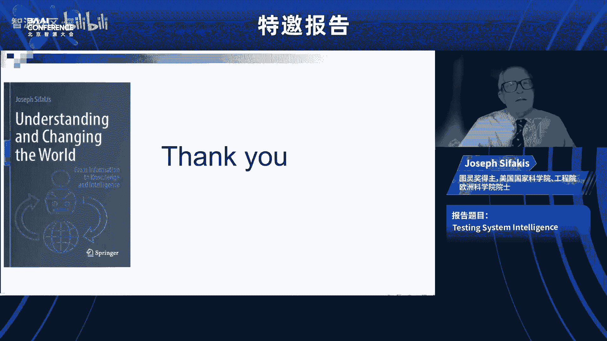
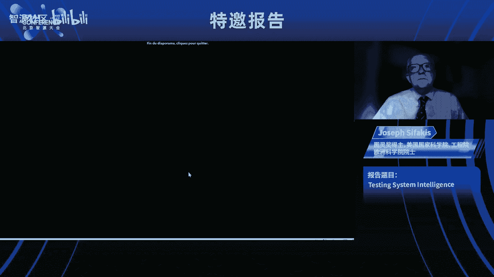
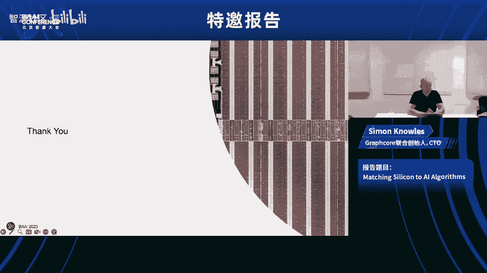

# 特邀报告（图灵奖得主Joseph Sifakis、Graphcore CTO Simon Knowles） - P1 - 智源社区 - BV1hh4y137BB

呃，所以紫嫣覆盖你的艺术，但是高斯的蒂娜说要带一个苏进去，呃，在美国做得很好是的，钟晖和右，好的，呃，你能听到我吗，是呀，是呀，好的，所以很高兴做这个关于测试的演讲，呃，系统智能和启动，我想说。

目前对于什么是智能以及如何实现智能有很多困惑，这种混乱是由媒体和大型科技公司助长的，舆论的传播，这表明人类水平的人工智能只需要几年的时间，你也可以称之为围绕水问题发展起来的神话。

一些人相信机器离开了我这就是故事的结局，我当然不同意这些观点，呃，如果你打开字典，我们将看到智力被定义为学习的能力，以合乎逻辑的方式理解和思考世界，机器的这种能力可以做出令人印象深刻的事情。

但机器在情境感知方面无法超越人类，适应环境变化和创造性思维，我认为就智力的定义达成一致是非常重要的，对什么是智力没有明确的概念，我们不能发展出一个关于它是如何工作的理论，呃。

我相信今天我们只有一个弱人工智能给了我们元素，成为情报系统，但我们没有合成它们的原理和技术，并建立一个更大的智能系统，将建造桥梁，例如用积木建造的建筑物，然后为了未来。

我认为我们将观察到T和AI之间的加速融合，我们需要自治系统，这将是一个很大的进步，从弱人工智能人工一般的变化，你知道自主系统，呃，呃支持Pardigof，呃，自主系统支持智能系统的范式。

这超出了通常专门化的机器学习系统，转换系统，它们产生于进一步自动化现有组织的需求通过用自主代理取代人类，这是我们谈论的物联网所设想的，自动驾驶汽车，智能电网，智能工厂和原子系统是由代理组成的分布式系统。

这些代理通常是至关重要的，这应该表现出广泛的智慧，呃，他们应该管理动态变化的相互冲突的目标集，应对物理环境中不可预测的不确定性，那是，当然与人类和谐合作，代理，我会解释呃。

自治愿景的实现受到不信任的阻碍，我们必须使用的人工智能系统，而且，而是系统工程中的一些难题，这些问题与智能没有太大关系，这是我演讲的提纲，我会试着比较人类和机器的智能，并讨论人工智能系统的信任问题。

呃介绍自主系统并讨论未来，可能你知道艾伦·图灵，他是计算机科学的创始人，有了将人类和机器智能与他著名的测试进行比较的想法，呃，他的组织如下，呃，你在两个不同的房间里，机器a和人b，和一个实验性的C。

将书面问题发送给A和B，并比较答案，她说如果她分不清哪台是电脑，就是那个人，那么A和B同样聪明，我为什么要提到这个测试，因为今天有些人声称他们的系统成功地通过了，图灵试验，所以这是一个智能系统。

和人一样聪明，这个测试受到了批评，呃，因为成功取决于人的判断，它是主观的，以及测试的选择，呃案件会带来一些偏见，我可以选择的地方，呃，有利于人类或机器的问题，但另一个论点是，这个测试不可能是，呃，呃。

简单的对话游戏，人类的大部分智慧是通过与我们所说的环境的互动来表达的，我们移动，会在两年前表现出社会行为，我在一篇论文中提议，放置试验，这个想法是一个可以是机器的代理，或者一个人和一个特工一样聪明。

执行给定任务的b，如果a能成功地替换b，例如，我想说这台机器和人类司机一样聪明，如果它能成功地替换驱动程序，或者我会说人类像清洁机器人一样聪明，如果它能成功地替换这个，或者注意工具测试是此测试的特例。

呃，任务是否只是一个对话游戏，所以这个测试是相对的，通则，概括和呃，呃，将智力的概念相对化，另一种比较人类和机器智能的方法是考虑不同类型的知识，人类和机器正在开发和使用。

你可能知道人类的思维结合了两个系统，我们所说的快速思维，那是无意识的，自动，毫不费力，呃，这就是我们使用的思维方式，谁不能各种经验，内隐知识，当我走路的时候，我说话，我演奏乐器，我的大脑解决了，呃，呃。

一个非常难的计算问题，但我不知道怎么做，系统二是缓慢的思考，那就是有意识的控制，呃满了，这就是任何原因的来源，知识，当我编程时，例如，我解决了一个问题，呃我慢慢想，我明白我在做什么，有一个惊人的类比。

这两个思维系统和我们今天的两个计算系统，我们有执行算法的传统计算机，呃，都是由，慢慢地有意识地思考，呃，这是基于模型的知识，我们可以理解我们在做什么，相反，这可以得到证实，生成的神经网络，训练后。

这是基于数据的知识，他们能把猫和狗区分开来，就像孩子们一样，但无法验证，无法核实，因为我们不明白他们是怎么变成，我们不，我们有无能为力的问题，这是一个非常重要的问题，我稍后要讨论，呃，人类和机器处理者。

正如我所说，不同类型的知识，这在这个中得到了解释，呃，在这个图表中，我们有一个如此依赖，不同类型的有效性和一般性，例如，呃，呃，我们有一个非经验知识知识，这与外部世界发生的事情无关，这是数学知识，呃。

或者我们通过推理产生的知识，下面你有关于世界的经验知识，最简单的一类只是事件和条件，今天，温度是20摄氏度，例如，然后我们有一个i内隐的经验知识，呃，这是一个系统一，呃，人类知识。

这也是机器学习产生的知识，我们有预测，我们知道如何，呃，我们知道我们，我们解决了一些问题，但我们不知道如何和以上我们有科学和技术知识，那就是经验知识，那就是，呃依赖于数学模型，我们有解释。

我们相信这一点，呃，这种知识，所以从技术的角度来看有很大的不同，机器学习产生的知识与科学知识之间的关系，这就是我要解释的，开始了，知识发展的过程非常相似，呃，因为在这两种情况下都是经验知识。

所以我在这里考虑一个物理实验，所以著名的实验利奥，注意力和加速度之间的比例，并制定了他的法律，所以你有三个步骤，实验步骤十一推广，现在只是概括和解释，如果你想建立一个神经系统来分离图像，猫狗。

说你将从一个实验阶段开始，在那里你会把图像翻倍你有一个人把图像翻倍，基于这个令人不安的，你要训练神经网络，希望能把分离的图像分开，但你没有一个模型来解释这一点，这是非常非常重要的事情，现在要注意另一个。

呃，另一种比较人类和机器智能的方法是理解人类，呃，呃，就可以，呃，优于机器，呃，呃，呃，关于形势意识，可能你已经在新闻里看到了，自动驾驶仪，错误，月亮换黄色交通灯，这永远不会发生在人类身上。

仅仅因为人类明白交通灯不可能在天空中，所以呃，什么是，呃，呃，常识知识，常识知识是一个世界的语义模型，呃，是建好的，呃，自动，呃，从我们出生开始，那就是，呃，是通过日常经验达到的，这个是，呃。

我们用来解释感官信息和自然语言的模型，我们应该强调什么，也是，人类的理解结合了从传感器到语义的自下而上的推理，呃，到心灵的语义模型，从语义模型到感知的自上而下的推理，让我举一个例子，呃这里，例如。

在这个，呃，呃，你能认出一个部分被雪覆盖的停车标志，呃为什么因为呃，感官信息连接到语义模型，一个概念模型，我们在你的脑海中有一个停车标志及其属性，大小，这个颜色，垂直位置，等，相比之下。

必须训练神经网络在所有可能的天气条件下识别停车标志，这是一个非常非常重要的区别，或者如果我给你看，例如，这一系列的图像，你立刻把它解释为飞机事故，相比之下，机器可以单独分析它的框架。

但无法将因果关系联系起来，呃，在每一帧中发生了什么来得出相同的结论，所以总结一下机器与人类的态势感知相匹配，他们应该能够建立一个环境和理解的模型，特别是完全在新的情况下，并将水平和推理结合起来。

这是一个很难的问题，呃，这可能是当今人工智能最难解决的问题，我对解决这个问题的可能性并不乐观，在不久的将来，至少，正如我们迄今取得的缓慢进展所表明的那样，在自然语言的语义分析中。

一个非常重要的问题是当你测试系统的智能时，是如何验证属性，我说呃，一个重要的问题是人工智能系统的不可解释性，所以让我给我们需要的东西一个精确的定义，今天一个系统被解释为。

如果它的行为可以用数学模型或模型来描述，我们可以理解，一种方法是，呃，神经网络是一种组合构建，呃，计算函数，呃，理论上的数学函数，这是可能的，特别是对于前馈网络，因为我们知道每个节点计算的函数。

所以这是输入的加权和，我们应用一些激活功能，所以原则上理论上应该是可能的，有论文讨论了这个问题来构建这个功能，但是你明白复杂的复杂性限制不允许这样做，现在，如果我们想验证系统属性，有两种方法。

验证方法有两种方法，一种是验证，验证是通过模型推理进行的，因此验证尤其不适用于神经网络，在现代系统工程中，验证是非常重要的，为什么因为你需要验证来保证，呃，通用量化属性，如安全或安保。

因为你必须探索系统的所有可能状态来保证这一点，对于我们的人工智能系统来说也是如此，唯一的办法就是，通过测试和注定是一个经验，呃，验证方法，呃，您有限制和可以验证的属性类型的限制。

但你也不能有你所拥有的那种保证，从验证属性中普遍可以发现属性只能高，所以这是一个严重的限制，我还要说，系统工程关注三种主要类型的属性，因此，任何需求都可以分解为三种不同类型的属性，安全性能。

这意味着系统在执行过程中永远不会达到坏状态，所以危险状态安全属性，这意味着一个系统对，呃，性能也很重要，因为它们是现在关于资源及其开发的技术和经济标准的特征，呃，它这个，重要的是要说。

今天我们看到出版物，呃，一些声称智能系统满足某些特性的出版物，没有一个足够严格的，事实上，认识和方法上的要求要求断言，使系统满足属性，伴随着严格的定义，例如，如果我说在我的系统中是COR。

那么你应该给诚实下一个定义，以及相关的验证方法，所以通常，例如，你可以读这个词，一些公司已经在模拟中驾驶了100亿个自主矿山，所以编译是足够安全的，但是这个呃，论点在技术上不是防御性的。

只是因为他们没有说模拟的头脑和真实的头脑是如何联系的，或者人们谈论反应灵敏的人工智能，这意味着人工智能意味着公平这样的标准，可靠性，等，但你应该提供，当然啦，这些性质的表征，并说出神经网络满足。

它是to to to检查这些属性，当然，甚至有报纸谈论，是啊，是啊，i对齐，他会将对话代理与人类的爱的价值观结合起来，但我们甚至不明白人类的意志是如何产生的，以及所有基于价值的过程人类的决策过程。

所以我认为这里有危险，因为人们声称智能系统，我不遵循严格的方法，让我说几句关于测试的话，这是非常古老的东西，所以说什么意思，测试具有输入x并产生输出y的系统，所以属性将是输入和输出之间的关系，我有系统。

我有财产，你会有一个更专业的术语叫做君主，那是一个代理，当你应用x，2。你观察就会知道成功与否，通过或失败，所以OR is是一个代理，它将计算这个谓词并现在决定，如果我说a满足一个性质p，我想验证。

这意味着对于任何可能的输入x和相应的，为什么这个属性是满意的，你明白这是我的意思，对于具有大量输入的系统，这是不可能的，我是说我们应该有一个方法来应对复杂性，为此，我不去细节。

测试方法已成功地应用于测试，呃，硬件或软件，或者在物理学中，我们应用测试方法，或者在医学上，我们应用测试方法，呃，测试方法的特征是什么，测试方法在这里提供了在可能的测试用例中进行选择并评估结果的标准。

所以这个特征的测试图，事实上，通过呃和效率函数，效率函数将表征一组输入的效率，大写X，它衡量这个集合探索系统行为特征的程度，关于我们想要验证的属性，然后是一个支持函数，它将产生一个分数。

所以s的可能性意味着一组的p，投入的资本x，和相应的y，呃，没有给出细节，为了有这样的理论，我们没有这样的理论，用于智能系统，我可以解释为什么，另一个强有力的要求是可重复性，重现性。

意味着测试活动的结果独立于输入的选择，例如，如果，到呃，在两组输入向量中，系统的效率是相同的，他们的结果，分数会大同小异，这保证了结果的客观性，事实上，你表明这一切都取决于你对系统的探索有多深入。

因为你现在测试只是为了提供一个比较，呃呃，以及这种测试思想在各种系统中的应用，所以这里我有一个呃，物理系统或飞行控制器已经在这方面工作过，或者这必须遇到强烈的安全问题，这里我们有一个我们所说的白色测试。

因为我们有一个系统的模型，这样我们就可以，呃，在实验上探索系统的所有可能状态，以某种标准得出我们所说的确凿证据，这是一个，呃，呃，统计检验，所以这里你没有系统的模型，但你有一些理论，例如。

评估疫苗的效率，你可以读到一些统计证据，在这里，我正在考虑三种不同类型的智能系统和图像分类器，一个自动驾驶汽车系统的仿真和CharCPD，所以你看这两个系统，属性可以形式化，你可以有一个。

所以这里有一个人，这可以自动化，事实上，我正在解决这个问题，还有这里，当然我们需要一些理论，呃，一个将定义一些覆盖标准的理论，一些效率标准，我们没有，当然还有图表PD，呃一切皆有可能。

为什么因为我们不能形式化Q问答关系，也可以，演说家将是人，他们会采用学科标准，主观标准，嗯，你看，我们能有一个关于人类的知识吗，但现在标准并不模棱两可，呃没有透露细节，我会说，对于情报系统。

我们是有限的，因为属性应该严格指定，这排除了所有的语言转换器，也应该遵守，所以这排除了我们所说的以人为中心的属性，就像性，相信它有效，还有其他问题，我没时间讨论，但是呃有问题。

因为你可以对神经网络进行对抗性测试，这与重现性的要求不一致，我没时间讨论，呃，更高的考试意味着呃，观察等效测试用例可以给出不同的分数，我要谈谈自主系统，因为我说过自主系统是人工智能的重要一步，一开始。

让我解释一下我们的语言和自动化系统之间的区别，我正在考虑，与环境交互的五种不同类型的系统，为此，他们需要态势意识和决策机制，所以对于热，开始和问题很简单，呃情况只是在读，呃，来自环境的值，控件是静态的。

在这里您可以设计一个控件，这很容易，对于国际象棋机器人来说，事情变得复杂得多，与其说是为了情境意识，但你知道我们需要一个动态的目标规划，因为因为我们有所有可能的配置的爆炸，和黑板上民意测验的移动。

然后事情变得更加困难，即使对一个足球运动员来说，因为玩家，呃应该了解分析动态图像，也可以选择，呃，处理动态目标，这些都是非常困难的问题即使对自动驾驶汽车来说也变得更加困难。

所以让我试着描述一个自主代理的行为，五年前我提出了一篇论文，这个建筑，我试着把这些想法应用到自动驾驶汽车上，所以这里我在考虑自动驾驶汽车的自动驾驶仪，所以这是一个与环境交互的系统，以明显的方式。

你有传感器和执行器，啊，所以你在这里收到框架来实现情况和健康，你会有一个，呃呃，一个感知功能将分析帧将识别障碍物，然后呃和运动学属性，这个反射功能将是外部世界的模型，你据此做出决定。

你通过结合两个功能来做决定，世界管理，对于每个目标，你可以开始水管工，水管工会产生命令和执行器，现在应该强调的是，对于自主代理，你可以有许多不同类型的目标，呃自动驾驶汽车，超过十五种不同类型的目标。

呃所以呃，短期去，呃，避免碰撞或保持当前轨迹或长期目标，在这里，然后潜入一个目的地，所以这个问题很难解决，呃，所以关于这个的反应行为，这个探员的，但也要强调的是，自主剂应该表现出产品行为，基于知识管理。

所以你看这里，我有一个组件，呃，它是一个知识库，在那里我可以保存知识，储存关于我能遇到的物体的第一个属性的知识，我还有一个自我学习功能可以监控这里的信息并定期更新，这个这个报告它。

这个想法是你可以利用知识来增强预测和决策，我来解释一下，所以说，如果在自动驾驶汽车里，我面前有发言权，一个真实和感知，呃，函数标识轨道类型，他们恢复了轨道的性质，我可以预测，我可以知道，例如。

最大加速度，最大速度，所以为了在这里有更好的预测，或者自学习函数可以估计一些参数，我用来做决定的，呃，所以这就是方法，我我我我想象了一个自主代理人的架构，呃，我应该说我不知道如何实施，根据这个。

由于许多复杂性的限制，感知的复杂性，这是很好理解的模糊性和环境的模糊性，不确定性的复杂性，因为你可以在环境中有动态变化，由不可预测的物理和人类过程引起的，然后是决策的复杂性，我说对于一些幸存的车来说。

你可能要处理十五个以上的，呃，不同的目标，这些目标受到不同的时间限制，所以如果我取消了一个目标，如果呃，如果我改变目标，或者如果我删除了一个目标，这个机会应该与我追求的目标一致，这些都是非常困难的问题。

从技术上讲，我还想解释的是，仅仅设计一个代理是不够的，你必须在复杂的网络物理环境中集成它，如果我有一个自动驾驶平台，例如，为了一辆车，而且代理人应该能够与人类操作员和谐地合作，我们知道问题。

这不仅仅是一个，呃，看到人机交互问题，我们知道呃，自动驾驶汽车工业的挫折，在解决和试图解决这个问题，如果你有呃，很多代理，那么它们的协调问题，呃，呃，你必须面对这个问题，重要的是代理之间的协调。

不妨碍实现其个人目标，还有那些探员，协同合作以实现全球系统的目标，通过展示我所说的集体智慧，所以通常，例如，用于自动驾驶系统，这些车应该协调，避免瓶颈，或者有一个更好的职业，道路的最佳占用，好的。

所以我们今天所站的，还有这个，呃，的挑战，呃，构建自主代理，呃，我们有，另一方面，开发得很好的自动化系统的方法，保证它们的真实性，呃，呃，这些都是基于模型的，因此，这些方法被…的复杂性所击败，呃。

自主系统，也因为我们必须考虑，我们这样做是为了整合，呃，呃，呃，神经网络，现在一些大公司采取的另一种方法是建立末端，来结束，所以要整合，例如，拥有一个自动驾驶平台广场，你有一个巨大的和所谓的。

许多是通过模拟训练的，你申请，呃说，在这里你分析帧，你收到帧，你会产生转向角和中断信号，我不建议你用它们开车，因为他们缺乏超凡脱俗，还有另一个非常非常重要的问题，人们不谈论，是呃。

机电系统中这些平台的集成问题，目前的技术没有扩大规模，不适用于整体和呃，神经网络，所以我想对于未来，我们应该努力从每种方法中取长补短，和伟大的在相同的基于Ctural模型和数据库的组件，例如。

我们有很好的决策算法，这可以是基于模型的组件，另一方面我们可以用，呃，我们需要使用神经网络来感知，解决一些难的优化问题，当然还有，部署问题现在仍然存在，这是呃，我对呃，我们有多远，呃现在从到达这个，呃。

这里的自治视觉，我在考虑这张图表，这个数字，我有一个，我我认为呃，智力的特点是情境意识和决策能力，所以我对单一领域有情况意识，或者很多领域都限制了这里的情况意识，呃，单个代理或代理系统的决策。

我认为人工智能目前的重点是这个，我们试图用自动驾驶汽车或其他自动系统做的是，因为你会有多个领域的目标，当然，在未来，我们应该努力建立系统，他们谈到了代理的合理集成问题，所以建立自动驾驶系统，呃。

我的观点是还有很长的路要走，我没有时间来多说，让我，呃，试图用三张关于未来的幻灯片来结束，我想在未来，它将在传统系统工程中集成人工智能技术，呃，这是呃，因为我们有，呃，我们需要有一般的智能人工制品。

啊所以，同样重要的是，今天传统的系统工程被打乱了，不知何故，新的Tri将使既定的做法上瘾，呃，特别适用于关键系统工程，呃呃一些，呃，我认为他们在设计上没有遵循这种安全的概念，正如我所说，呃，例如。

他们采用了，呃首尾相连，基于，呃在艾，呃一些，在一些国家，他们允许自我认证，例如美国，呃，这意味着不是制造商，不是任何独立机构，呃将保证系统的跨性，但是制造商，和，这是，呃，这有点奇怪。

然后他们也允许一些常规的，有一些，我允许定期更新关键软件，我知道这一点，这是一个想法，呃，呃，呃，系统和工程实践，我们有两个重要的，呃，什么选举，呃一个是，呃呃，全智能系统的混合设计，我们在那里，呃呃。

我们应该能够在传统的系统工程中集成人工智能组件，呃呃，发展方法，当然啦，呃呃，艾会留下来，呃，也许永远不要解释数字，所以我们应该设计出建立可信系统的技术，所以可信组件，我们知道如何为硬件系统做到这一点。

我们得发展理论，以及系统验证是，呃标记，正如我解释的那样，从呃验证到测试的转变，我觉得对于智能系统来说，我们能表达的最好的，有一个统计数据，呃，估计置信度的基于技术，我们应该满足于较弱和运输作为保证。

我们永远不会有，运输对我们的传统系统有保证，例如，对于关键系统，我们需要负九分之十，呃呃，少于九次的失败，十减去九，呃，每个呃的失败，每小时运作，这个意志没有实现，然后总结一下。

我认为要弥合自动化和自治之间的鸿沟，还有很长的路要走，呃，这就是我们所知道的，也是，呃来自，呃，呃，自动驾驶汽车，过渡不能是渐进的，并实现完全自治的愿景，我们需要开发，依我看，新科学与工程基础。

这需要一些时间，另一个重要的问题是智力的比率，我们应该就智力的概念达成一致，呃，更换测试设备，正如我所说，并概括了意图的概念，所以一个想法是有多种智力，根据您选择的任务，这将需要一个特定的。

这违背了某种智力，我们也可以考虑不在操作中操作的任务，例如在虚拟环境中，例如，你可以有一个，呃，比较人类的智力和呃，在X的地图上玩游戏的机器，好的，然后呢，当然啦，如果人类智力是参考就是基准，人工的。

一般智力应该能够执行和协调一系列具有人类技能特征的任务，这似乎和别的事情一样重要，呃，我喜欢的一个想法是，这种对可能智能空间的想法，为什么因为人类在分析多维数据方面受到限制我们知道这一点。

我的人工智能系统，人类生活在一个多维数据中，正相反，人类有常识，呃知识，呃抽象，创造力，等，所以在这个，呃，这里的数字，我展示了这种互补性，事实上，我们可以想象，通过结合这些技能，我们可以有一个，呃。

某人有，呃，这个有这种情报的特工，好的，这是人类和机器的极端智能，另一个我觉得有趣的想法是，替换测试表明同等的系统可能有非常不同的创造性，嗯，过程，这是一个想法，应该进一步解释，例如，我可以有问题。

我可以象征性地解决一个，我也可以用机器学习来解决它，事实上，今天有一些有趣的结果表明，其他灯可以，呃，呃，我们用符号解决的所有问题，呃，推理，这里给出了一个工具的名字，它可以在未来做到这一点。

探索这个智力群体的广阔空间是非常重要的，尤其是理解人类的符号智力是如何与，做机器对机器的意图，我最后一张幻灯片，我觉得呃，智能系统的验证将是未来非常非常热门的话题，我有，呃。

已经对这种忽视验证智能系统的局限性的趋势发表了评论，根据呃，我建立了标准，这些标准降低了逻辑和认知标准，这样你就可以阅读了，例如，呃理解呃，自然语言，好的，我不认为这是，呃，这是呃，可接受的论点。

我是说，从技术上讲，你也可以找到把心理态度归因于，像信仰这样的系统，欲望和意图，我在一篇论文中发现了这句话，我觉得读起来很有趣，我们不能证明一个特工总是做正确的事情，但只是它的行动是出于正确的原因。

我认为这是一个糟糕的方法，这意味着呃，你看，呃，如果有人，如果一个人做了坏事，你，你也检查主题，好吧原因，但我认为这是一个糟糕的方法，我是说从技术的角度来看，呃，因为它假设机器可以理解世界。

我们知道自从中式房间的争论以来，这是不可能的，当然呃，我很单纯，但是如果我们应用严格的系统工程标准，例如，我们排除了语言转换器，因为我们不能应用测试技术，所以这个权利的一个问题是我们是否可以申请。

例如十二盏灯的资格考试，也许LMS能通过一些期末考试，呃，在某个领域，作为学生，然而，我想，呃这里，呃，呃说，神经网络和人类有两个根本的区别，人类的思维是稳健的，健壮，所以如果一个人不是疯子，它在思考。

如果他的思维是稳健的，虽然神经网络不是，但也不是鲁棒的，问题的细微变化可能意味着，非常不同，呃，答案，人类的思维也是建立在常识的基础上的，并且在合成中更好地避免，我们知道LMS可以产生非常。

在某些情况下，答案非常不一致，所以总结一下，我认为我们应该承认他们需要情报系统的验证方法，和工作人员以清晰的方式克服当前的模仿，好吧，不作弊，开发新的基础，如果可能的话，我们将修订认识和方法要求。

但要小心并理解我们在做什么，感谢大家的关注，在我一年前出版的一本书里说，我讨论了其中的许多问题。

非常感谢，谢谢。

非常感谢，是啊，是啊，非常感谢，呃，为了这次有见地的谈话，约瑟夫教授，呃，我可以问几个问题吗？是呀，当然啦，是啊，是啊，在呃，人工智能的自学部分，你提到像特斯拉这样的高级算法，我的错误。

黄色交通灯上的月亮，对呀，是呀，所以对于一个人来说，当人类也犯错的时候，但一旦人类意识到这是个错误，他或她可以纠正它，然后进行，是的，是的，怎么能和一切都要学。

然后在不被制造商重置或完全重新培训的情况下变得更好，比如它能在球门上学习吗，对呀，我们怎样才能实现这样的自我学习，在呃中的自校正机制，自治系统，我的意思是显而易见的答案是如果出于自动驾驶汽车的原因，呃。

如果你想有一些保证，你使用，呃多余的，我认为神经网络的问题，他们不能将信息与背景联系起来，而人类将信息与背景联系起来，你接收感官信息，你把它放在一个上下文中，所以如果这种上下文化，我们没有神经网络。

而且有一个技术问题，我正在研究自动驾驶汽车，技术问题如下，非常非常精确我面临的技术问题你从摄像机接收感官信息，呃，你想把这些感官信息和来自地图的信息结合起来，而来自地图的信息是，呃是象征性的。

所以你可以在一些图书馆里有高清地图，然后说，哦，我想配这个，你会有更好的保证，因为你不会只依赖摄像机，你也可以有更好的可预测性，我不知道怎样解决这个问题，好的，所以很简单，今天有一个缺口。

呃在混凝土之间，呃，由神经网络和符号产生的知识，这也是在人工智能之间的差距，和连接是AI，我是说这是一个多程序，好吧，我们不知道如何打破它，那就没问题了，我是说如果我们能结合这一点来接近。

但我们不知道怎么做，人类的头脑有这种能力，将感官信息与世界的概念模型联系起来，如果我们那样做，然后我们就可以达到人类的智力，是啊，是啊，另一个类似的问题，呃，这是关于什么时候有规则。

例如在英国和法国开车，有不同的车在道路的不同侧面行驶，所以如果一个人类司机从英国开车到法国，他或她可以自动调整，那么我们怎么才能，我们怎样才能灌输，我们怎么教算法，这种规则权，呃或者你可以在飞行中学习。

所以嗯，有没有办法触发不同的常识，首先在，这是法国的常识，是呀，是呀，是呀，这正是上下文化的问题，我更改上下文，使用同样的系统你希望能够驾驶汽车，好的，所以如果我必须重新训练我的系统。

当我知道它从法国搬到，好的，我是说，这就是语境化的问题，我是的，好的，呃，我最后一个问题，呃，在幻灯片的最后，你提到我们需要，我们需要改进我们的测试或标准来判断，一个模特是不是真的很好，嗯是的。

从当前数据，让我们也采取，呃，如何驾驶，比如说，计算机平均数，人类，我认为自动驾驶的平均性能已经超过了，但在我看来社会对我们的自动驾驶有一种期望，完美，如果你犯了一个错误，嗯，那是，那是一个很大的。

是呀，所以这是真的，那倒是真的，人类的判断更加严厉，机器比是，如果一个人发生意外，人类可以解释为什么会发生这种情况，相反，人们准备听到这一点，如果机器出了事故，当然啦，好的，它是，很不一样，所以这是。

呃，是呀，这是一个标准，但另一方面，我觉得呃，呃，呃，两个月发生的事情更容易接受，开花，因为我是说，我们熟悉人类的思维方式，而机器，我可以有一些不可预测的行为，好吧，这可以被认为是完全疯狂的，好了。

这是，但是有这样的现象，呃，例如，它们是归一化的，我们知道神经网络，好的，所以是的，你有非常非常不同的行为，好的，是呀，呃，事实上，我从观众那里得到了一个问题，呃，我们的许多与会者是大学生。

所以当他们看到人工智能每周都在进步，所以呃，他们正在取代编码工作，然后是其他的任务，所以他们想知道在今天的世界里，如果我在大学里学的是IT相关专业，我还应该学习基本的排序逻辑吗，呃，还是我应该把它留给。

那么今天计算机科学的职业道路是什么样的呢，或者IT专业，你对他们有什么建议吗，谢谢。是呀，但是你看，我认为这更像是一种技术，如果你想训练，如果你想训练他们，呃，呃，阿艾，好的，呃，呃，你将使用算法。

你将编写程序，你会写，好的，也许是为了AI，你需要一些更特殊的数学，但我认为人工智能是计算机科学的一部分，对学生来说，了解基础知识是非常重要的，当然理论我们有很强的数学背景，然后呃。

我不认为这是一个重要的困境，学生应该，呃，我有广博的文化，并了解所有系统工程问题，会出现的，好的，因为我会和一个系统工程师结婚，那很重要，好的，谢谢你的建议，呃，差不多是时候了，所以说，非常感谢。

约瑟夫教授，呃，斯洛伐克，谢谢你邀请我，感谢上帝，谢谢。我们希望我们能，有时间见面，呃，面对面阴中国，然后我们希望如此，是呀，是呀，今年我将开始去中国旅行，是呀，是呀，好的，谢谢你能来见我，拜拜。

拜拜拜拜，谢谢。拜拜拜拜，每个人，今天我很荣幸来到这里，主持在线报告，由西蒙·霍利斯提供，西蒙·诺拉斯是联合创始人CTO，和Graphcore的工程副总裁，他被认为是情报处理单元的最初设计师。

所谓的伊普，所以他的职业生涯超过40年，呃，三十年，诺利斯先生一直在为新兴的工作负载设计原始处理器，从2012年开始专注于智力，然后优先于图形过程，西蒙公司创建了另外两家成功的处理器公司。

第一个元素十四，2000年被Broadcom收购，第二个ICE A是英伟达在2011年收购的，西蒙的教育背景包括剑桥大学的电子工程学位，所以我现在很高兴地欢迎西蒙·诺尔斯先生。

给我们以硅与AI算法匹配为主题的学术报告，好的，欢迎西蒙，谢谢。托马斯，呃，谢谢你邀请我，在这个享有盛誉的活动中发表讲话，嗯，你们都能看到我分享的屏幕吗，你能看到那个时候，是啊，是啊，是啊，是啊，好的。

好的，好，呃，所以我不是人工智能方面的专家，因为这个电话里的大多数人，所以我可能不会教你任何关于人工智能算法的东西，但我希望至少能为人工智能的芯片设计提供一些启示，也许能告诉你这两者的交集。

以及我们如何让芯片设计师和人工智能算法设计师合作，为了未来更好的人工智能结果，人工智能研究进展如何，多年来的大量研究已经达到了，在那里，它提供了明显有效的人工智能和普遍的效用，投资现在转向。

从发现人工智能能做什么--能力阶段到人工智能的部署，以效率为中心，芯片也在相应地适应，呃，今天部署人工智能是昂贵的，训练模式昂贵，在推理中部署它们是昂贵的，那么我们能做些什么呢。

人工智能处理器用于执行任何算法的主要资源，但特别是AI在这种情况下是坚实的，呃，矩阵算法明显，它是以每秒的翻牌来校准的，每次翻牌的能量是一定的，浮点运算，内存容量，对于那些不熟悉硅存储器的人来说。

根本不需要任何电力，而它只是在回忆事情，它只需要耗电，当你访问它的时候，读写内存带宽，读写部分也以每秒字节为单位进行校准，以每字节一定的能量，芯片之间的数据传输也是如此，在过去的十年里。

我可以把它描述为第一个人工智能十年，我们已经看到了每秒300倍的失败表现，可用于AI的，由典型的图形处理器，一个GPU，我想呃，黄延森做了一个百万x的广告，但这包括另外3000倍。

因为使用了3000倍以上的芯片，所以我说的是一个芯片，呃已经移动了大约300个鸡蛋，我在比较2014年的英伟达麦克斯韦一代，使用32位浮动指针，用最新的料斗，在大约两个更好的八位浮点失败。

今年二十三年的算术，这种改进从何而来，我试着在这里分解它，这些都是倍增因素，顺便说一句，所以它们都繁殖到三百，大约一半或根部，300来自于在较小的数字格式上使用矩阵乘法器，换句话说，从浮三二到浮八，嗯。

其余的大部分来自硅工程的改进，晶体管密度大约提高了8倍，从28纳米下降到5纳米，一点点，一个七x来自时钟速度增加到一个点，八五千兆赫，从一点零五，我想，但就电力而言，这已经很昂贵了。

电力成本大约是芯片功率的三倍，最后，很少一部分来自GPU架构的改进，我想这是因为GPU在图形领域已经建立了很好的基础，很难进化，呃，那些人工智能的芯片，而不破坏它们的效用，呃现在在图形。

我认为人工智能市场足够大，这两种芯片类型已经分开了，我们现在将看到，我认为更多的建筑创新，很明显，我的公司也在尝试建筑创新，我经常被问到的一件事是日记有多大，构建每秒千万亿次的浮点单元需要什么。

以及它们需要的寄存器文件，以便能够与本地内存交互，这张图显示了一个大盒子，三个两个，五点七的平方是，这是世界上任何晶圆厂中任何人都能制造的最大的芯片区，整个芯片生态系统都是为这个最大芯片尺寸量身定做的。

所有的步进机，所有晶圆处理机，所有的口罩制造机，做这么大的薯片，它可能看起来像一个奇怪的大小，但事实就是如此，这将是一个非常，非常，很长时间，如果它改变或变得更大。

所以没有人能制造出超过823平方毫米的芯片，在任何过程中，该芯片的技术需要大约四分之一的时间来实现每秒一拍的速度，浮点，十六，呃，具有小寄存器文件的算术单元，嗯，同时也能够，呃好吧。

能够作为一种替代模式，用于预测的H位浮点，越来越有用，这是假设它们在一个点上运行，八，5千兆赫，它们是在五纳米的过程中，大致就是霍珀今天的位置，它也是我们今天最新一代的地方，一般来说，速度。

坏消息是晶体管密度不会真的变得更好，所以图表上的这些点显示了归一化密度，大概量产的年份都是实点，我对每一个字都负责，在这些过程中的每一个过程中都有一个处理器磁带，在每一个点上，所以这些都是真的。

这不是营销，就像，嗯，除了，右边最后两个，嗯，右边最后一个满点是三纳米，超越的那个，也就是目前两纳米的预期，正如你所看到的，我画了两条线，一个是逻辑逻辑晶体管成对出现，一个n型，一个P型，因此。

苔藓和S ram细胞是互补的，芯片上的静态存储单元，存储一位需要六个晶体管，所以通常芯片设计者从逻辑晶体管对的角度来考虑，然后呃，六套，呃S斜坡晶体管，你可以看到公羊不再变得更密集。

在最后一个进程节点中，五楠，呃，事实上，三纳米的密度稍微低一点，两纳米，大致相同的逻辑是，呃，稍微扩展一下它的收缩能力，但只有通过减少晶体管的鳍片，这使得晶体管变弱，使他们不那么可控，嗯。

它们可能会掉到一个鳍上，嗯，所以可能会有进一步的人口减少步骤，但你可以看到总的趋势和记忆是一样的，换句话说，压平的，密度的急剧变平，晶体管的改进，每平方毫米不再有晶体管，呃。

所以我们每平方米的晶体管增加了2000倍，过去25年的平方毫米，现在一切都结束了，正在努力，当然啦，改进晶体管实体，还会有进一步的改进，但他们会很慢，至关重要的是，它们不会提高每个晶体管的成本。

这里我列出了三件事，这些都在IMC和台积电的路线图上，在两纳米，我们将看到所谓的纳米片状场效应晶体管，在这个呃，技术，垂直鳍被放置在彼此顶部的水平鳍状结构所取代，这允许晶体管在较低的电压下工作。

所以它给了我们能量的改善，但并没有给我们任何密度改善，同时在两纳米，台积电宣布，他们打算实施埋地电力轨道，这是一项非常复杂的技术，涉及将晶圆粘合在一起，在晶片上蚀刻硅线并在下面形成金属。

其中一个晶片的晶体管，所有的英雄主义，这使得向晶体管输送电力的金属程序，在晶圆片的对面，到信号路由，因此，节省空间只提供15%的净密度，这是台积电的估计，这将是在呃，xpus。

我在这里用术语XPU来表示GPU，CPU使用任何形式的空气算术加速器，它可能会在26年成为一个XP使用，但它只能提高15%的净密度，下一个重要的步骤是十年后，在这一步中，从过程工程的角度来看。

这更加引人注目，n和p晶体管再次相互叠加以提高密度，这一次可能会额外增加50%，但这是十年后的事了，这样你就可以看到消息了，那么发生了什么，人们仍然希望构建更复杂的单节点，所以越来越。

你会看到硅染料组合成更大的组件，所以换句话说，硅封装的创新，包装听起来像是个无聊的术语，但其中一些真的非常有趣，也非常困难，我在右上角展示了一些例子，非常简短。

两个大模具安装在带有HBM内存堆栈的硅插入器上，然后通过封装基板内的埋地桥相互连接，那是中间的A和D图形芯片，顶部是英特尔的Pontivea，可能是最雄心勃勃的，但也是迄今为止最昂贵的GPU构建。

到目前为止，四个两个独立的硅Dion，衬底上的两个大硅，右边是苹果的一些更温和但在经济上非常重要的东西，他们安装的笔记本电脑处理器和台式机处理器，在硅上，在与裸硅染料共享的有机基底上，这很有趣。

因为通常这些记忆会安装在PCB上，将它们安装在衬底上可以为存储器技术提供更高的带宽，它通常与带宽无关，我稍后会回到左下角AMD的最新版本，呃，芯片，事实上，超越MX，现在使用一种叫做晶圆上芯片的技术。

在处理器核心顶部安装一个L 2缓存硅片，然后将这些核心排列在衬底上，围绕着一个IO死亡成一个相当复杂的，这是迄今为止最雄心勃勃的事情之一，是底部中心特斯拉D一百，这是一个重组晶圆，换句话说。

形成了一片芯片，晶圆片被锯成碎片，工作芯片被识别，然后用一种塑料材料重建晶圆，从好筹码里拿出来，他们的晶片就像硅片一样，然后你可以在上面金属化，你也可以做其他的事情，比如附加。

直接焊接到重组晶片的IO连接，这项技术已经在你的手机里了，在大约一平方厘米的规模上已经很多年了，但这是第一次，在30厘米宽的尺度上，最后在右下角，我们自己的芯片，这是第一个晶圆上的晶圆垂直组装。

换句话说，放在一起的硅片，在它们被磨损之前，在晶圆刻度上，这很有趣的原因是因为球场，垂直互连非常，比左下角的替代芯片要好得多，这允许巨大的垂直带宽，每秒几十太字节，每秒至少可能数百太字节。

在垂直堆栈中的芯片之间传递，这显然可以让你建造一个像更大的硅芯片一样的东西，所以硅进化的另一面是性能的进化，根据能量成分，这些点和我在密度幻灯片上显示的一样，我们都听说过丹纳德缩放的结束，在十九纳米。

这是享受到的能量尺度的点，硅缩放时代的大部分突然停止了，我们从每年大约66%的性能改进，在每对偶到大约十八的操作中，我们现在处于第三个时代，从现在开始，每年将有不到10%的，我把它描述为这里的恒定电压。

它不是很稳定，但它几乎是恒定的，所以你看到同样的特征，换句话说，我们不仅不会在硅芯片中得到更多的晶体管，但是每个函数的能量也不会提高太多，它会改善，但不是很多，具有经济意义的是系统级的能源，很明显。

这对环境有重要意义，我们都在尽力制造最低功耗的计算机，但这在经济上有什么大不了的吗，嗯，这里我展示了一个非常大规模的计算机安装的粗略细分，超级缩放器可能会建立的那种东西，呃。

大约三分之二的成本是底盘资本设备，随着时间的推移摊销，可能超过三年，所以电脑，也就是，呃，诸如此类的事情，嗯，只有大约10%的成本是消耗的电力，第三颗可以高达十五的子弹，在电力昂贵的地区，甚至20%。

但在大多数地区，它只有大约10%，然而，还有另一种成分是15%到20%，也就是基础设施的成本，当你改变电源时，它会发生变化，所以在一个大型计算机系统中有很多基础设施，与提供电能和消除热量有关。

这影响了基本的事情，比如一个数据中心需要有多大，换句话说，重建的物理成本是必须移除的热量的函数，所以如果你把功率组件加在一起，换句话说，与所提供的电力成正比的基础设施，如果你把它加上实际消耗的电力。

然后你就可以看到，大约是运行一台大型人工智能计算机成本的三分之一，与能量分量成正比，所以意义重大，它大约是制造等价物的资本成本的一半，呃，好的，我们今天在哪里，嗯，你们很多人都会熟悉这个。

当前一代已部署的人工智能系统，你每次真正的翻牌消耗大约三个大焦耳，交付用于在一个大模型上训练一个大模型，呃模特，对不起在一台大机器上，类似于变形金刚形式的语言模型，在那个超大规模的机器上。

每弗洛大约需要三兆焦耳，嗯，所以这意味着今天，如果我们有十亿个参数，我们用200亿个代币训练，呃，大概是这个龙猫点，嗯，那么我们可能需要100千瓦一个小时，呃，大概是250个筹码。

如果我们把它放大一千倍，令牌的规模相应地增加了一千倍，然后我们增加到2万5千个筹码，10兆瓦一年，这就是为什么没有人部署万亿晶体管，对不起，万亿参数今天没有模型简直太贵了，有万亿参数。

稀疏模型知道人工智能做了其中一个，但没有间隔，所以我们今天的尺寸已经达到了实用性的极限，正如我所说的那样，对丁摩尔来说，情况不会好转多少，为什么我们不能更快地运行XP呢，我们为什么不提高时钟频率呢？嗯。

你们很多人可能都知道CPU，比如说，通常以三四千兆赫的速度运行，但是Gpus和Ipus只运行在不到两千兆赫的地方，谷歌的TPU只运行了比1千兆赫高一点的频率，嗯，你可以让硅晶体管比今天运行得更快。

在这里的图表中，我已经展示了每个探针中晶体管的速度是如何变化的，工作电压的最后几个工艺节点，您可以看到每个进程节点，给你一个陡峭的曲线，给你更快的晶体管更陡峭的曲线，有趣的是互联系统，换句话说。

它们都不以任何频率工作的点，一点都没有，不是零伏特，它处于阈值电压，大约是0。4伏特，所以这意味着，当你把芯片的电源电压降低到0。4伏特时，速度降得很低，很快，而功率只与电压的平方成比例下降。

这给你一个这个形状的曲线，如果将每次操作的能量与每秒操作的能量进行比较，他们都很正常，小圆圈代表了最好的点，至少英伟达和图形，其他一些人选择在，这是校准到七五纳米的过程，大概是一个点。

大约800毫伏的85千兆赫，我们为什么选得好，如果你看，它是曲线在每秒操作中变得超线性的点，这意味着功率变成了超级二次方性能上升得非常非常快，我们可以选择以20%的速度运行。

以每次运行多消耗40%的能量为代价，我们没有，因为那很贵，但我们可以，呃，我们可以选择省电，我们可以慢40%，我们将来每次操作将节省40%的能源，也许我们可以那样做，嗯，为了节约能源，如果能源变得更贵。

我们可能会这么做，但是服装表现还是挺高的，人们非常渴望有尽可能多的表现，呃，这样你就可以看到，有一个灵活性来改变XP的操作速度，嗯，但它是一个，这是一种相当昂贵的灵活性。

所以这就是为什么所有的XP你倾向于以相同的速度运行，现在我们可以做一件事，这又是一个图形创新，我们至少可以确保最大限度地利用电源电压，嗯，一个大的硅片代表了一个非常。

非常非线性的负载到任何试图平稳输送电力的电源，呃，软件可以使芯片在大约一个绘图仪中从零活动到最大活动，不到一纳秒，没有电源，呃，或者没有电源，呃，能够跟上，对最新芯片的戏剧性需求。

可以在几分之一伏的电压下切换数百安培，不到一纳秒，没有电源能跟上，GraphQL交付的创新，把第二块硅片连接到逻辑伺服器上，第二片硅片充满了什么，我们称之为深沟容量，这是如果你喜欢一个巨大的。

极低阻抗电容器，在所有进行开关的晶体管的微米内，这是一种非常独特的技术，它是由同一片晶圆上的晶圆技术形成的，用于将图像连接到手机中的逻辑处理芯片，所以对现有技术的创新使用有着完全不同的规模，在晶圆级上。

在右边，你可以看到对电源电压的影响，呃，上面的轨迹没有这个解耦技术，较低的轨迹是电源电压平滑得有多好，一旦你附加了这个解耦技术，这让我们可以做什么，在我们的电源电压中没有太多的净空，换句话说。

我们可以降低平均电源电压，因为芯片的能量与电源电压的平方成正比，因为这是一种电容技术，这会使电源下降很多，事实上我们可以在不改变逻辑的情况下节省40%的电力。

或者我们可以在不改变逻辑的情况下在相同的功率下获得40%的速度，一点都不死，你会从前面的图表中看到，我证明了这就像至少有一个完整的过程，节点嗯几乎免费，做这个很便宜，顺便说一句。

比在一个过程中前进更便宜，所以我们至少可以这么做，权力去哪里，所以这是处理器瓷砖能耗的细分，都在运行电源病毒，呃，图形最漂亮的芯片，巨人标记两个X，我们称之为晶圆上的晶圆解耦，它是一种能量病毒，嗯。

所以这实际上会导致每个翻牌消耗大约一个皮卡丘，le，其最坏情况数据模式，嗯，同时应用于芯片上的所有瓷砖，嗯，这是一个浮点16，我们也支持浮点八，大家可以看到，大部分功率实际上都进入了浮点算术。

剩下的大部分能量都用于移动大约一毫米的数据，事实上大约半毫米，从本地内存到浮点数据路径，换句话说，没有，没有多少电力不用于，我们想做的工作，嗯，我称之为无操作循环的黑色部分，是制造处理器的开销。

换句话说，我们必须有蓝色和橙色的部分，即使是固定功能，我经常听到这样的说法如果我们为这样的任务制造固定的硬件，它将比构建过程效率高得多，这不是真的，现代处理器的程序化包装器，尤其是对于这种应用程序来说。

确实非常轻量级，在硅晶体管或能源方面成本很低，所以我们把能量用在了正确的地方，我们能做好什么，我们已经把算术的精度降低了，呃，到8位浮点，现在有一个我三倍，呃，标准组um，研究低精度算术，到目前为止。

它必须，呃，八位，它可能会继续到四个位，嗯，右边的图表显示在横轴上，尺度范围有多广，就可以得到，呃，训练变压器与，这两种不同类型的八位浮点格式，目前由我提出，它有四个指数位和三个螳螂位。

一个有五个指数位，两个螳螂位，英伟达有非常相似的，但在他们最新的芯片中不完全相同的数字格式，嗯，如果你盯着它看足够长的时间，你可能会看到，对于重量和激活，呃，上面的格式很好用，工作以及三个两位浮点。

对于这两种类型的梯度，较低的格式也可以，或者至少在某些情况下更好，然后三个两位浮点，所以八位算术效果很好，省了很多电，4位算术怎么样，最近有一些工作，呃，探索特定的缩放规律，参考贝德特曼先生的这篇论文。

特别是看起来像四位数字代码，可能是精度的极限，向前推断的缩放，这太棒了，这意味着我们可以在改善曲线方面走得更远，嗯，我们可以提供一个浮点，四位，呃，妈妈能量可能是八位浮点的一半的算术，比较高的积累路径。

精度开始变得重要，所以这不仅仅是乘法的问题，它确实缩水了很多，但积累路径也是如此，就每秒浮点运算而言，净效应可能是两倍，其中可以使用四位，我要做的另一个有趣的观察是，这些突触。

至少你大脑的某些部分似乎有大约4位的分辨率，呃，四个半比特，绝对迷人的纸在这里，你可以去查阅，在人脑的海马体中证明了这一点，在一个范围内对数分布的两个六个可解析电平，让它们看起来更像四位浮点。

所以如果你相信我们正在向类似大脑的结构进化，那可能会有帮助，硅在未来十年会发生什么，考虑到我刚才告诉你的一切，嗯，我觉得，我可能错了，当然很难向前看，在任何快速发展的技术上都要花十年时间。

我想我们可能会得到1。5倍的晶体管每个芯片，十年后，它们每个晶体管的成本可能是一样的，我们可能会设法使每次操作的能量提高2倍，以同样的精度，如果我们能去四位浮点，这将给我们另一个2的因子。

所以每瓦的性能可能是4倍，我们将在多芯片架构层面看到很多创新，随着芯片的减速，包装创新也在增加，有些人不同意我的预测，特别是，美国政府不同意我的预测，这些是美国能源部制定的目标。

为他们的ACC超级计算机程序提供建议，有两台机器要送，二十六分之一，二十分之一，但这些是2030年预期的改进，这是七年后，他们希望性能能提高一百四十倍，能源效率提高了50倍，我想我可以说。

处理器设计师完全相信这两件事都不会实现，让我们继续讨论不在处理器中的东西，这就是存储芯片，它在今天的处理器旁边越来越重要，大多数ai处理器使用hbm高带宽内存，这是一个垂直集成的DRAM染料堆栈。

坐在控制器上，然后将染料放置在硅插入器的顶部，与XPU共享，然后将其放置在封装基板上，然后放在PCB上，我一会儿就回来，呃，有一种竞争技术开始出现，这是你手机上使用的内存技术，它用于笔记本电脑。

它开始被用于更高性能的计算环境，这被称为低功耗DD R双倍数据速率，代表，这是一个历史名称，这不是很有帮助，这也是一种垂直堆叠的技术，但是用非常非常非常便宜的，呃方法，你就会看到，我在右手边突出显示了。

这两种技术每千兆字节的成本差异，他们使用完全相同的DRAM技术，它们是由同样的人在完全相同的风扇上建造的，然而有一个七，最终产品每千兆字节成本的x差，原因是HBM的复杂性，随着hbn容量的增加。

这个数字可能会下降，但可能不会低于四个不同的因素，所以还是很低，这些技术之间的另一个区别，我也用黄色突出显示了，首先是LPD博士，允许更多的内存连接到一个x pu--大约半个樱桃，但是。

它可以被读取的速率，每秒太字节的速度只有，这意味着如果你想阅读整个，它将花费你大约十倍的时间来阅读整个较小的，赫本男人，这与AI特别相关，因为这通常是我们在训练中想做的，我们倾向于读写整个记忆。

Auto中的每一次迭代，回归标记，明智的推断，目前流行的，最受欢迎的语言模型，我们倾向于阅读整个模型，为每个生成两个，嗯，模型的大小通常由抱歉主导，内存的大小由，所以我们正在读取整个记忆，呃，骑自行车。

所以非常重要的循环，HBM肯定会在循环中获胜，然而，它在容量上损失了，在成本上损失了，我认为我们将看到这两种记忆技术在人工智能处理中发挥作用，我想英伟达同意我的观点，因为如果你看看格蕾丝漏斗装置。

HBM附着在GPU粒子上，LVR连接到CPU部分后面，嗯，所以也许这是最好的情况，已经，呃，两者都有很多，嗯，但显然这是一个非常昂贵的情况，所以我想你会看到的，我们会看到有其中一个或另一个的芯片。

以及在人工智能上下文中的记忆，你不能在一秒钟内骑车或触摸，真的不是很有用，让我举两个例子来说明为什么，这就是我在这里画的SGD培训的案例，红色的部分是前进的路径，和黑色部分在后向路径中形成梯度。

SGD培训，众所周知，是一阶优化机制，需要大量的迭代，通常在所有一百万次迭代中，所以如果我们准备等几个星期来训练模型，然后我们需要在几秒钟内完成每次迭代，每次迭代读取和写入所有内存，因此。

内存必须在不到一秒钟的时间内是可循环或可触摸的，或者换句话说，内存带宽需要与内存电容大致相同，每秒千兆字节需要和千兆字节差不多，第二个例子是象征性回归世代，在这种情况下。

我们希望读取完整的模型和每次迭代缓存的任何kv值，我们想做那么多，每秒多次，所以我们每秒读取整个内存很多次，这又意味着，A记忆，它是如此之大或如此之慢，以至于阅读需要一秒钟以上的时间，不是很有用。

因为这个原因，我们不会看到服务器中使用的内存类，用于人工智能，比如说，所谓的DL内存，嗯，它会在服务中流行一段时间，但你不会在人工智能机器上看到它，你也不会看到闪存，像NAND内存这样的东西。

非常非常便宜，但不幸的是，在几千次甚至几百次读写循环后，它就会磨损，所以如果你建造了一台人工智能机器并尝试进行一次SGD的训练，你得到了，呃，在你的记忆被摧毁之前，你不会走得太远。

我们可以把相当多的静态内存，换句话说，基于逻辑晶体管的存储器在一个完整的Reical管芯上，这是一个特别的东西，叫做巨像的图，IPU做了大约一半的模具面积，事实上，被静态内存覆盖，这是一个死球。

你可以看到我突出显示了那里近1500个处理器中的一个，每个处理器有624千字节，所以总共，我们在这个芯片上有大约九百兆字节的内存，芯片之间有相当大的带宽，所以在一个集群上，你有几个千兆字节的RAM。

如果你的模型是有序的，十亿个或更少的参数，那你就根本不需要外置式闸板了，事实上，这是这个芯片的设计基础，这个芯片是为你可以将模型放入芯片本身的情况而设计的，或者穿过连接在一起的芯片簇，当你能做到的时候。

那么你访问内存的速度甚至比HBM快十倍，你可以以每秒几十TB的速度访问它，在这个芯片的情况下，每秒65 TB，完全无法达到的速度，具有任何动态内存，所以这是一个选择，至少对于普通型号来说，呃。

还有一种情况，在芯片上有大量的RAM非常有用，这是第二颗子弹，如果您有一个大模型，这样您确实需要外部RAM，那么在芯片上有足够的SRM仍然是非常有用的，您只能从DRAM读取每个矩阵一次。

每次向前或向后通过模型时，嗯，今天的许多芯片都没有那么多的s ram，必须不止一次地阅读模型的部分来向前传递，比如说，为什么只读一遍是个好主意，因为访问呃，就DRAM能量而言。

来自外部存储器的数据是昂贵的，而且DRAM的带宽也是有限的，所以你读过一次吗，如果你有足够的内存读一次，那是个优势，终于，我们还没有谈到的另一个资源是芯片间链路，多少钱。

我们可以在一个芯片上容纳多少芯片带宽，如果我们用完了外部DRAM的长边内存，使用HBM或LPD R，然后我们就有了短边，芯片设计师所说的南北，嗯，在其中安装芯片到芯片的链接，嗯，这是通常做的。

我们可以用今天的技术容纳大约128人，一百千兆位，所谓谷神星晚期，呃，Sergey代表序列化，序列化的，只是有点宽，在每个方向上支持每秒100千兆位的um通道技术，这就是100千兆以太网所使用的。

所以我想了一百二十八，100千兆以太网范围给我们一个点，每秒6TB，全双工，换句话说，在芯片之间同时在两个方向上，功率成本约为每秒容量60瓦，所以如果你有100瓦的全部容量，不像公羊，不像DRAM。

所以这些一直在消耗能量，所以即使你没有发送任何东西，他们还在消费和机器人，而公羊只燃烧力量，当你真的发送测试版，100千兆的车道不会到达很远，它们在一个PCB中会达到30厘米左右。

或在精心设计的铜电缆中大约两米，所以它们有点在底盘里，或者是铜的说唱技术的极致，如果你想走得更远，如果你想在机架之间，然后你必须使用光收发器，这大约是电力成本的四倍，呃，也是美元成本的四倍。

所以这是一个非常，建造光学非常昂贵的东西，然而，对增加带宽的需求巨大，所以我们会看到更多的光学，我们会看到光收发器在芯片旁边的板上，最终我们会看到一种特殊的纤维进入徐本身，但还没有很多年。

我实际上需要多少带宽，我需要把所有的带宽都放在芯片上吗，嗯，这里有一个例子，你可以制定很多例子，但是如果我们如果我们拿花车16，我们在一个大模型上做了一百万次训练迭代，我们将优化器分布在模型上。

那么对于每个迭代，我们需要做一个集体，它由减少的散射权重组成，对权重的子集进行本地更新，然后所有人都在收集重量，这是一次全减量操作，包括减少散射操作和全收集器操作，呃，去做那件事，链接必须转移四次。

根据数据读取的模型参数数，嗯，就数据而言，很抱歉，这也是数据量，必须由本地进程从DM读取的模型数据，每次迭代每个副本，同时，每个参数每个令牌的总训练失败约为6次，如果我们使用通常的度量。

15到20倍于参数的标记，那么大约是一百个模型参数的平方，我在这里换了一些例子，所以对于一千亿个参数，如果我们用256个模型复制品，这是合理的，那么每个字节大约有一万个失败。

这是每个字节的内存访问是带宽，以及进入芯片的传输带宽，训练很有趣，您需要大约相同数量的带宽为每个，芯片之间的带宽与内存之间的带宽大致相同，如果最小化内存带宽，通过拥有100亿个参数模型的面RAM。

你不需要那么多复制品，每个字节的失败次数增加，但不是很多，所以你说的是大约10到地板翻转，每字节十到四次失败，转移操作所需的时间与失败相同，你可能希望转移集体比失败花更少的时间。

所以一个PETA翻牌芯片，这可能带来了50%的愤怒失败，至少需要每秒100GB的内存带宽，每秒至少100千兆字节的传输带宽，也许更多，如果你能适应，但可能不是每秒太字节，这很有趣。

因为GPU尤其在今天出售，根据带宽对培训有用，它不是真的用来训练的，呃，训练仍然是完全失败的统治，许多类型的推理也是如此，训练机不需要每秒多TB DRAM，它也不需要每秒多兆字节的芯片连接。

但这两者都需要每秒至少数百千兆字节，让我们看看我们真正做到的情况，需要内存带宽的损失，而且那个，当然是象征性的回归生成，这张图是变压器堆一层的漫画，左边的部分是注意部分，右边的部分是前馈网络部分。

红色物体是权重矩阵，而黑色平面对象是激活矩阵，因为这是象征性的倒退，只有一个令牌，嗯，在这些激活矩阵中的每一个，IS在每次迭代中都是活动的，除了K和V的缓存历史记录，我用浅蓝色突出显示的。

我用了d是一个维度，q是上下文的符号，呃这些东西，然后嗯，如果你看每个值的失败次数，从内存读取，那你，然后你得出这个方程，注意里面的批处理术语，换句话说，该方程允许您批量处理多个对话。

为了每周得到更好的失败，这是很常见的没有它，自动攻击令牌的算术时态强度，明智的一代每次阅读只有两次失败，换句话说，如果你有每秒3TB，最先进的HBN存储系统，你每秒只能使用类似数量的恐怖失败。

不是每秒的PETA翻牌，最便宜的，嗯，如果上下文很小，然后批处理在一定程度上有所帮助，我们可以在上下文中得到12倍维度的渐近线，如果尺寸，例如，是8000个，上下文是2000个令牌，嗯。

然后你知道这可能是100-100次失败每字节，嗯，你仍然会有完全的RAM带宽，限制在现代GPU UM或类似的大型上下文中，当然，这越来越成为我们想要的，关于如何处理大上下文的研究呈爆炸式增长。

那么配料不能提高密度，计算强度，换句话说，你每次都失败两次，我用红色突出显示，致命的陈述，如果这是部署的通用模型，AI令牌智慧自回归推理，今天就是这样，如果我们想要一个大的缓存历史记录。

这样这些模特就不会忘记你十分钟前所说的话，那我们就不需要XP使用了，当前的算术都没有，加速芯片适合于这一约束而设计，我们应该制造具有大量内存带宽的芯片，失败的次数也不多，呃，它们会便宜得多。

消耗的电力也会少得多，换句话说，我们制造的昂贵芯片之间突然出现了巨大的不匹配，以及目前对我们最有价值的算法，我们能做些什么呢，我们可以制造不同的芯片，如果算法不进化，这就是将要发生的事，呃，这需要时间。

因为新的芯片一代需要几年时间，但这就是会发生的事情，这些芯片将最大限度地提高它们的内存带宽，他们不会有太多，算法上，还有其他选择，我们可以压缩阻止批处理工作如此顺利的历史项。

我们可以稀疏地访问历史术语也有同样的效果，我们得到的历史少了，呃，我们可以做一个分层形式的自回归，嗯，使用某种超级代币，然后在这些超级令牌中生成令牌，嗯，这降低了大部分模型的迭代速率，比如说。

我们就可以，呃，也许不用自动回归，所以不是所有的生成人工智能都使用自动回归，呃，图像生成器，比如说，中程稳定扩散，它们本身不是自动回归的，它们是迭代的，但它们在整个图像上迭代，整个数据样本。

不在数据示例中的令牌上，这意味着它们每个字节的失败要高得多，算术强度使他们表现得更像训练，换句话说，它们非常适合于高内存带宽的翻牌中心芯片，但一个更受失败限制的。

所以也许语言会屈服于迭代扩散去噪而不是自回归，或者语言本质上更好，有了自动回归，图像本质上是更好的扩散噪声，谁知道我们发现此刻我们可以做的其他事情，我们可以部分地模拟我们希望提供给人工智能的所有信息。

而不是为其他零件建模，我特别被这种关注点分离的想法所吸引，因为我认为这是算法和硬件都可以玩的东西，所以我们训练的基础模型学到了什么，呃，我们学到的第一件事，当然是交流的能力。

使用一种语言来形成构造良好的语法，要有表现力，流利，嗯，在多模态模型中，我们可以使用其他媒体，如图片，所以流畅的交流是通过一个大的基础模型来学习的，我们也学到了很多关于世界的知识。

最后我们学习如何做一些推理，至少常识推理，或，或者你可以把它描述为计算，构建和执行算法的能力出现了，呃，大型地基模型比例尺，现在这三件事是分开的，在某种程度上。

当然很像人类与维基百科这样的知识库是分离的，和Python这样的算法执行引擎，嗯，也许人类必须这么做，当然啦，因为我们的大脑容量有限，也许AIS不必那样做，但它可能是有效的，如果他们真的这样做了。

单独的担忧，那么自动回归部分就会，可能是，如果这是象征性的明智的话，只需要处理语言的构造，模型的这一部分可能比模型的大部分要小得多，这是一个例子，我相信你们都很熟悉，在大型语言模型中检索一些炎症的想法。

换句话说，查询进来，有第一个网络对查询执行分析，并构造检索，好吧，来吧，检索命令几乎进入知识数据库，它不是建模的，它被索引了，换句话说，它被组织起来，这样我们就可以检索相关的东西。

但它实际上不是自动回归模型参数的一部分，然后将未建模数据的索引输入第三个网络，那个，与查询一起合成响应，换句话说，我们把知识状态从语言中分离出来，来自国家，必须善于语言，和知识状态，这使得知识状态非常。

比模型的迭代部分大得多，至少模型的令牌迭代部分，它还允许我们处理模型的货币等问题，换句话说，我们可以很快地将数据添加到知识库中，它立即可用，我们还可以导出归因，我们要问模特参考，它用来提供响应的。

所以这种以检索网络为特征的关注点分离，我觉得很有吸引力，它当然有助于解决芯片和算法之间的不匹配，所以我的结论是不会有通用的XPU，其中x PU是GPU，一只伊普，TPU，随便你怎么称呼它，嗯。

为训练或平行推理而设计的机器，像图像生成将最大限度地提高批号率，换句话说，它会有很高的算术强度，自动回归发电机，它在像代币一样的小量子上运行，放逐令牌将优先考虑内存带宽，它将具有较低的算术强度。

你不能同时为高和低算术强度设计一个高效的芯片，你需要两个不同的芯片，最后是用于大型模型推断或微调的紧凑戳，内存容量优先于每秒失败或每秒千兆字节，问题是我能有多少千兆字节。

我能在一个芯片上安装我的GPT三个型号吗，这将是可能的LP，ddr内存同样符合与前两种不同的芯片设计，所以会有各种各样的XPU机器，我们将学会使用所有这些，因为有各种各样的人工智能要求。

人工智能的价值足以证明不止一种芯片架构是合理的，不会有通用的X PU，最后这是我最后一张幻灯片，嗯，我喜欢思考人工智能算法的进化，因为我们经历了两步才走到今天的地步，最初我们发现。

如果我们建立深度神经网络结构，我们可以以一种令人惊讶的好方式从数据中学习，呃，这种学习是有监督的，因此数据是昂贵的，所以我们缩放模型的能力受到数据成本的限制，然后我们学会了如何使用无监督学习。

所以数据变得便宜了，我们可以利用互联网，不得不对它做一些过滤，但基本上有很多廉价的数据，就在那时，模型爆炸了一千倍，我们有今天的语言模型，比如说，千亿参数的多模态模型。

而不是Resnet时代的图像模型订单一亿种方法，所以千层甲板的规模增加了，嗯，如果我们现在利用稀疏访问状态的能力，就有机会走得更远然后受到内存成本的限制，左上角的注释是所有计算机设计的真理，那就是。

可以计算的是你有多少内存的函数，每秒失败的次数，以及您可以访问的速率，内存决定了你能计算多快，但是你系统中的状态量，确定可以计算什么，所以最终任何特工的情报都会受到现有信息的限制，换句话说。

通过内存容量，不是每秒的失败，不是每秒千兆字节，所以我认为会有对内存容量的压力，以及其他与速度有关的参数，就这些非常感谢你的收听。

好的，我能工作吗，呃，它现在起作用了，是啊，是啊，谢谢西蒙，好的，呃，谢谢你，呃，谢谢。呃，给了我们关于硅如何形成芯片的非常翔实的报告，就像形成XPUS一样，它运行，呃，非常聪明，人工智能算法。

所以基于什么，你对我们有什么，我有某种，就像你刚才在最后一篇文章中提到的那样，我有几个问题，呃，没有将军，或者没有通用的XPU，所以它只是说，或者说，呃，没有，没有，呃，我能这么说什么呢，是说。

是不是说没有，我能做什么，呃，没有一个，没有一个单独的XPU或体系结构可以实现优化，病毒AI算法优化，所以我们能说没有人，单个XPU架构可以实现，是呀，呃，这正是我要说的，嗯，所以我记得当呃。

多媒体作为计算机工作负载出现，嗯，所以图像、视频和声音的处理，呃，这是在二十世纪九十年代初，和当时所有的CPU供应商，嗯说你不需要新的芯片，呃，我们可以在CPU上做这个，当然。

CPU是一个通用的计算引擎，所以你可以在他们身上做任何事情，然而，这样做是没有效率的，所以我们看到了媒体过程的出现，现在无处不在的信号处理器类型，所以你的手机，你的笔记本电脑，它们都嵌入了媒体处理器。

它总是归结为那个问题，将有针对任何市场的特定用途的芯片，足够大，足以证明生产它们的费用是合理的，并且有足够的体积，人工智能显然是一项非常非常广泛的技术，它将以很多很多的方式使用。

它可能会影响地球上的每一个企业，嗯，我们已经知道有很多不同的模型，培训等模式，良好的操作模式，如培训和罚款，调谐与推理，都有不同的要求，嗯，它们都将是非常非常大规模的工作量，因此。

为这些东西开发体系结构是值得的，呃我也觉得呃，CPU在人工智能中发挥作用，尤其是当它们开发出更高带宽的存储器时，他们很可能支持中间的子弹，换句话说，我们可能会发现我们在对我们的汽车进行推断。

几年后的攻击性语言模型，不是在GPU上，但是在CPU上，但是Gpus仍然存在，ipus仍然存在，tpus仍然存在，DSP和媒体处理器以及其他一切都将存在，今天有非常丰富多样的处理器芯片类型。

我会增加这种多样性，人工智能不会全是GPU，是啊，是啊，好的，谢谢。哦，所以下一个问题是关于IPU的，所以你知道，每个人都知道你是IPUS的主要架构之一，那么这些是什么，你在比赛中面临的一些挑战，鼓励。

呃，在GPU等更成熟的技术上采用IP US，嗯嗯，呃，这是个很好的问题，所以呃，为了一家新公司的成功崛起，嗯，我认为有两个基本要求，至少在芯片空间，这是我的呃，职业经历。

首先你需要一个提供新机会的新市场，一个尚未被某人拥有的市场，人工智能代表了那种市场，适合新芯片的市场，足够大，你需要的第二件事是，如果有大玩家和你同时进入那个市场，在我们的例子中。

一个大玩家可能是英伟达，那么你需要做一些不同于他们正在做的事情，我很惊讶有这么多初创公司开始解决，AI本质上试图克隆英伟达正在做的事情，制作一个GPU，嗯，我看不出这有什么用。

我不认为这是一个成功的商业计划，嗯，因为敌人总是有规模和在位的优势，嗯，所以你得做点不同的事情，所以我们面临的挑战是建造一种不同类型的建筑，看起来不像GPU，但至少对人工智能的某些部分仍然非常有用，呃。

计算空间，嗯，和IPU的特性，区分它与GPU的区别包括，比如说，大量的芯片上SRAM，因此，中型型号可以安装在芯片上，而不会在HA发生任何脱轨，这给了你巨大的性能，巨大的功率效率，那是一回事。

iuse的另一个特点与gpus很不一样，是由大量完全独立的进程组成的吗，换句话说，它的并行性更多的是在程序级别，或者某些程序将不在数据路径级别，gpu中的大部分并行性来自于向量操作或向量数据路径。

I确实有矢量数据路径，但他们是，嗯，它们相对于GPU来说很小，你有更多独立的子程序，这意味着如果您的数据结构不太规则，例如图神经网络，那么IU有很大的优势，我们已经展示了，比如说。

我们提交了我们的第一次尝试，打开OGB，lfc，开放图基准大规模挑战，去年，我们第一次提交，在我们第一次到达时进入的三个类别中，我们在两个类别中名列前茅，但我们打败了所有其他技术，嗯在那个区域。

这证明了IP是一个非常非常好的图形，结构化数据，比如分子，比如呃，知识图，比如说，表示知识库，好的，那就太好了，当然可以，最后一个问题，所以现在整个市场都一样，还有呃。

现在世界上有很多这样的大型语言模型，所以估计对计算能力的需求，我的意思是对计算能力的需求可能会在，我看得很远，可能在未来五到十年，那么你如何估计总体需求规模和计算能力的增长率，从长远来看。

到2030年的时候，你怎么，呃，你如何估计计算能力的整体需求规模，以及它是如何生长的，我想是，呃，估计可能是不可能的，嗯，因为，我认为人工智能的出现是人类最大的技术进步，自从机器力量的利用。

至少换句话说，自从发动机发明以来，嗯，就像蒸汽机的发明者很难告诉你的那样，十年后会发生什么，我很难告诉你人工智能机器会发生什么，十年后，对我来说很明显，至少所有的计算都有从数据中学习的元素。

所以如果人工智能被描述为从数据中学习，那么未来所有的计算都是人工智能，在某种程度上，同样明显的是，人工智能为在许多领域使用计算提供了机会，以前不使用计算的地方，换句话说，计算市场的规模将急剧上升。

所以它将是人工智能，它将比今天更大，呃，我来举个例子，一个区域，这不是一个特别关注的领域，但是它现在有点过时了，这是自动或半自动驾驶，每年汽车销售量是目前的10倍，与每年销售的服务器计算机数量一样大。

所以如果一辆车成为一台强大的服务器计算机，为了提供半自治或自治，那么你的计算市场突然上升了十倍，那只是一个应用程序，一种技术，呃，我觉得，嗯，会有很多，其中许多应用程序，所以它会，它将是巨大的。

这就是为什么能源效率是如此重要，嗯，是的是的，我不是危言耸听者，就基础设施计算目前使用的能源量而言，但有可能，能量会增加一百倍，如果发生这种情况，我会陪着你，哦，那太好了，好的，谢谢西蒙，好的。

谢谢好的，你和我刚刚注意到上海的图形港办事处，所以可能，然后我们就可以，我在找，我真的很期待见到你的提纲，下次可能在你上海的办公室，我还有很多问题要问，是呀，是啊，是啊，是啊，是啊，计算能力如何。

它们之间有什么神奇的关系，人工智能算法或者芯片设计的软件部分和硬件部分，好的，谢谢。谢谢你抽出时间，西蒙，谢谢再见，谢谢。琼斯，谢谢再见。

