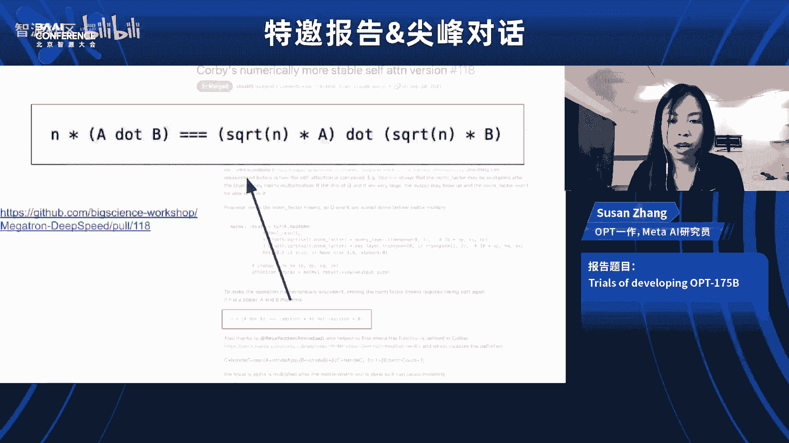

# 特邀报告&尖峰对话（张宏江、Kenneth Stanley、Will Knight、Susan Zhang） - P1 - 智源社区 - BV1nM4y1n7ww

These model where it just started to be eerily human like in some ways obviously it's not human at this point。

 but it has some human like qualities and so this is clearly diverted an enormous amount of attention funding research and effort to those kinds of models and so we're going to be you know'm seeing more investment in that direction obviously in the near future but you know with the thing about AI and science in general and technology in general is that there's always going to be surprises so it doesn't just mean it's a straight shot of larger and larger language models like from here to AGI or something like that I would expect surprises still to be coming but we've certainly learned some lessons about size and data and scale that will probably continue to apply even as architecture perhaps surprises and shift。

Yeah， so Dr Jianang， yeah， obviously the theme of this conference is you always very firmly me as Hong Jang as it maybe be easier Okay。

 Hong Jg okay。I try I'm trying to pronounce the surname properly but you so you know obviously it's understandable that the theme of the conference is large language models and it's just such an exciting time you know for someone who covers AI I've never seen anything like it so。

😊，But I would love to hear your perspective and how you're thinking about it as the chairman of the BAAI。

Well， the acoustic here is now that good could you repeat the question one more time Yeah okay sorry。

 so what I was asking was given that we are experiencing a big moment in AI。

 what you think in the big picture， it means for the state the status of AI research and the direction。

 maybe that you'll be taking at the institute。It's definitely a big breakthrough that make every one of us who has been working in the field to rethink the approaches we have been using and system architectures we have been building and algorithms we have been working on。

 know before ChaTBT， there are many there are tons of effort looking at various algorithm。

 but I have always been a big fan of system approach。

 meaning that AI AI technology AI itself is going to be a system is a system and it's not just a single algorithms。

 that's actually one of the reasons why it's there to me this particular forum。

discussion and also can your book on you know the the the know success cannot be planned。

 but be the if you， if you look at what we have been doing and like。

InIn most of computer science field， we we especially in academia。

 we tend to look at a single algorithm and try to improve it a bit by bit。

 but you know open I took a totally system approach and especially if you think about transformer was invented by Google researchers and they have came out of many。

You know， quite successful models， but none of them really has the ability of emerging。

And had shown the power of the HRGBT。And has so brilliantly combined the data alignment algorithm infer together that LED us to this breakthrough。

 So I think the entire field is re thinking you know， how we carry on research。

 What is right or most appropriate most effective approaches to approaching this approaching AI problems and。

give you an example in the larger language processing field。

 which is a very fundamental sub areaa in AI when Ch came out。

 at least I know among they are top groups in Chinese universities。

 they basically tell themselves now we need to look back。

They actually one of the university really told the students PhD students say。

 you know if you graduated this year， we we can't stop you because you have to graduate。

 but if you graduate next year， you need to rethink your thesis because of what the problem you're trying to address。

Already， the logic extent solved byGT models。So yeah。So， you know， although you could still graduate。

 if you continue along the direction， but it really your work。It meanless， I mean。

 in terms of adding to the state of art。Yeah， that's pretty extraordinary I was at an event here at MIT recently where they had some linguists and cognitive scientists。

who were also saying that GPT4 and these large language models was changing their fields。

 changing other areas of science I guess。Kenneth， on the subject of what might be missing。

Do you I mean it's interesting， is there anything about what we've seen with especially chat GT that makes you think here is a really exciting new direction I mean I think Hong Jg alluded to some of the things that yeah I'm curious what you think。

Yeah， when we think about what might be missing in exciting new directions。

 I mean there' there's exciting new directions that build upon it and that now we can now opened up that weren't possible before and then there are limitations。

 of course， where it's like these are problems that still exist in the models so let's see I can so maybe to start with just exciting directions that just build upon what we have one is I think that there's this is a very unusual one which I don't usually hear mentioned。

 but I think about it a lot， which is that we haven't had the ability of a computer to actually grapple with a question of what's interesting before。

 know if you just think even back two years or three years you could never imagine from a subjective point of view to even begin to say look look at this idea and tell me what you think look is this actually a good idea but this read in a good direction。

And for the first time actually you can have the computer begin to grapple with this kind of subjective question and if you think about it。

 this is an extremely important question， what is interesting and what is not interesting。

 even though it's totally subjective because it's the see from which all research and innovation grows it's like I decide what to do based on what I think is interesting and so if these kinds of models are someday going to actually solve big you know momentous problems in our world they need to think about which directions are the most interesting to pursue so that those will become stepping stones to actually solving these problems and interestingness is a separate issue from whether you're solving a problem it's just a question was this an interesting research idea or an interesting piece of art or an interesting story and it's very intriguing that suddenly it actually can start to engage with that question and not just in the sense of give you a rating it can even give you an articulate analysis of why something' is interesting and this is the beginning of innovation it's like the beginning。

auutonomous innovation so I think that's super interesting that that's now possible I could also talk a little bit about what I think are interesting limitations but but i'm not sure if you want to go in that direction already or not well no actually what why don't we Hongngzang what do you what do you think of this idea of algorithms。

Identifying what's interesting on maybe being a kind of innovation。

 does that does that sound like a promising？Concept to you。Definitely it is。

 although my own expertiseed are unnecessary in this area and definitely this is I think this is very promising direction。

Yeah， it's I mean it's it's I wonder that Kenneth， do you think the。That there's real， you know。

 can tell you something that's interesting that a person can't tell。

 do you know what I mean because sometimes when you see chat GT？It is impressive。

 but it doesn't seem that original， so do you see examples where it finds something interesting that maybe no person would？

Good question Yeah， I definitely I believe that there's some serious limitations when it comes to comparing to a human's instinct for interestingness yeah these models don't come close。

 that's true so it's just the beginning of a glimmering of the ability to grapple with this question of what's interesting but that's still extremely useful you because it's like it always comes up in sort of whenever you're thinking what should I do next if you want something on its own to think about what am I going to do next now that I finish this task now what's the next thing that would be interesting that's got to think about it a little and even being able to do it a little bit its still really intriguing。

 but it's obviously something we need to build on and in fact when you talk about like unoriginal that's totally true they're not going to being original that's one of those really interesting limitations that I think is going to require proving the models and I would just point out that being original is related to being novel so novelty comes up and there's a problem I think with the current paradigm with being able to。

Identify novelty in a genuine way because if you think about it novelty as a function of chronology it depends on the order in which events happened。

 whether an idea that you have now is novel or not。

 but if you think about it the model is exposed to all of history simultaneously it doesn't experience its training data as a chronology that happens in an order and therefore it's not actually experiencing that you know moment of epiphany when you say oh。

 this is really interesting because I've never seen anything like that before so if in the data for example it says something like that's a really novel idea it's not in the context of what came before。

 it's in the context of ever came for and what came after so it's very different from the way that we experienced novelty and because of that novelty is really not in the data in any substantive way and that means that I would expect it not to be good at thinking about novelty generating novelty and so forth and to solve that will require I think somewhat of a paradigm shift because you've got to deal with chronology。

So fascinating， I was talking earlier this week with Des Deep Mind and he was saying I was thinking of this Hongjiiang because you mentioned alignment and some of the technologies that went into Cha GP and he was talking about reinforcement learning。

Being very important and。Obviously one of the things with Alpha zero and Alpha go was that it could come up with completely novel sort of strategies and it's not you know it's very different from a language model。

 buts it's interesting like things that people never，Could never come up with。

But I wonder if one of the you mentioned alignment， I wonder Hongng Jang。

 if the reinforcement learning or other types of machine learning are of interest to the instit to you as a way to kind of broaden the capabilities。

Definitely actually reinforcement learning and alignment。in AI in the building big models。

 they are not two different things， but actually during reinforce learning is used。

In alignment process， in the learning process， that's exactly what made Cha GT。

 what made the G4 much better than GB3 very very very development from GB 3。

0 to instruct GT than to chat GBT is really the alignment process that used reinforcement learning that you know you use human dialogue data you use human feedback through reinforcement learning to gather the alignment so it is a super important learning algorithm I reinforcement learning in the alignment process and alignment as。

A very critical step approach to AGI to large models safety and human align to human values so it it is super important and also alignment itself is one way very effective way to refine and trained model to a specific applications you know。

 you fit more domain specific data into the model through alignment process that will help us to really adapt the model to various scenarios。

 various applications， various verticals。That's great and are there other other techniques that you're interested in or you think。

 I mean， I know there's the Wooow model， which is。I think my understanding is it's somewhat different from some of the other ones it was multimodal to begin with。

 right？Are you looking at other techniques？From machine learning anyway that like what do do you what are you interested in for the next generation of these language models definitely VR。

We before chat T or before GB4， people in the field have been working on various models and like Google brain came out of BRT like before that again and all those the studies researchers have contributed to the field of large models and although today we see the pretraining that based on transformformer and combined with alignment it most efficient effective approach that led to GB4 and led to many models who tried to repeat the success of GB4。

 but we do see there are。A large space， there are many issues that still have not been solved that would require further study and further research and that's cause for new new Ar。

 even new architecture to the so you also mentioned a multi mod model。

Definitely that's one direction people in the field are pursuing very hard and we do see that as the future direction if not ultimate direction of AI models we human perceived information perceived knowledge through multimodality know we read we learn from language。

 but we also watch movies so we watch video look at the pictures the way we acquire information is multimodality and so I'm not a neuro scientist。

 but I believe our thinking in our brain is also multi modality so there is no reason you know our AI model is only language model。

 but I want to emphasize。model is the baseline is the platform ands not only it is true that we learn how to build models building a language models the technology we learned know how we learned the inside we learn from this will help us to develop the multi modality model actually multi modality model could simply a continuation of language model So the the good thing about using transformer is basic architecture here is every modality data in every modality for to transformer is just a sequence。

Odated。You know， text， a language is a sequence and image。

 if you scan image through patches is also a sequence。 and video is a sequence， a music sequence。

 So it can handle， can host all those information and embedded them into the learning training structure and。

T the model itself。 So if we if， if we believe the future will be the will be the autonomous。

Intelligence， meaning that the model itself can reason and understand and take and plan and take actions we do the model itself got to be multi modality and definitely apply it into robotics。

 autonomous robotics future， and general purpose autonomous robotics。

 definitely it will be multimodality model。Well， that's a great segue to Ken。

Your work on sort of open ended learning continual learning and the the point you made just a moment ago about you know temporalal data it shows that maybe the ways we there there are more dimensions by which we're not。

Approaching intelligence is that is that fair to say。

 you know like I mean I guess do you think of this multimodality and other ways of building intelligent systems and does do you think that requires completely different architectures and approaches Yeah I mean I think a lot because you know these models are so powerful it's just intriguing for me from the point of view of a researcher to think about what is missing that's what I think a lot about what is still missing like what kind of fundamental things are missing ands you know there's not a lot of things that are very very clearly missing because you could say well it's as long as I have it in the data it's there somewhere it'll get eventually picked up so we have a big advantage with the amount of data that we have but there are these you know very specific kinds of things where it's not just intrinsically in the data because the way the data is presented and one of those is this chronology like chronology is not in the data because the data is not presented chronologically and another one that's like that is multimodality of course。

Moality is not in data which is only text so that's clearly an opportunity so we're going to see no no doubt advances with multimodality but chronology is a little different though because you can't just like put it in it's not clear what that means exactly you know it's not you can't just put in chronological data into something that that doesn't process things chronologically and like part of what there is a little place you can sneak in chronology in these models which is in the context itself or the prompt like that's a place where it can have an order but the thing is like all of human history generally won't fit in the current kinds of prompt space and probably won't for a long time and so that's for all of the internet for that matter so that's a problem which is just an interesting research problem so I think there's just a few of these things like chronology and multimodality that you can point to concretely and then others are more like a wishy was like hallucination where it's like we see problems but we don't really know we can't really point to exactly the thing that's missing what is the thing that's the problem。

you know sometimes I've thought that maybe the hallucination problem is that it's a nonverbal activity in order to understand what you actually know and don't know which would mean it wouldn't be in the data you know like what the reasoning process I go through to think about do I actually remember this thing like when I'm inside my head and not actually articulating this outside my head but just trying to remember something someone's asking me there's some reasoning process where I come to a conclusion I don't actually know that or I do know that maybe if it's nonverbal and it's not in the data because the data is just came out of your mouth not you know before implicitly in your mind before that and so maybe there's something missing there perhaps but it's more it's a little more amorphous to point to but it's just a general interest exercise I think to think about what's missing still places that we can press forward that makes me think maybe that' some important insights to  glean from cognitive science So if you think about you know experiments thatll show the way people。

Think or reason sometimes it's not verbal or not text。

Do you think that that's an important approach just to continue what you were saying？Maybe。

 maybe I mean I think historically that hasn't panned out that well。

 you know like if you look at large language models and the successful side of where they are which is quite remarkable。

 most of it is not as a consequence of you know looking at cognitive science experiments and perhaps to the chagrin of cognitive scientists and so but that doesn't mean that it isn't it can't be helpful going forward。

 but I would imagine as most of you more as just inspiration because you know the very implicit nonverbal reasoning if it exists is just so inaccessible I would expect it more to be something that would be emergent from the right kind of training than something that you could extract explicitly and then sort of write down like this is how it works so it I would imagine you would more want to reorganize training in some way maybe you could reinforce the learning in something like that so that we can elicit these kinds of steps that are non-verbal which correlate to what we do when we're trying to determine。

If something is true orme or you can be rememberedmeative do not？Hong Jianang do you have。

 I know I think you have。Neuroscientists and cognitive scientists at the insute。

 what do you think we can learn from those fields？It's a strange time because it feels like language models solve so much。

But but yeah， maybe there' are still things you think we definitely think we can learn from that from those field。

 but it is still research undergoing and it's still a lot of work to do to be honest at this moment。

 we haven't up come to any significant conclusion， we can apply them to building big models but。

Other hand， in contrast， actually I don't know if you read the recent work published by open AI folks on using GB4 to analyze GB2 base to the point that what's the function of neuron？

In GT2， you know， it does。WhenWhen when G2 you know generate a particular contact tax or output so that is very very interesting So I actually encourage those who who working on neuroscience try to you you know borrow some ideas from here it's not just we borrow ideas from neuroscientists。

 but you know the other way around is also a very interesting research director but coming back to are in question yes at BAI we have a extended group。

😊，Of scientists from Qinghua University and from other universities in Beijing。

 we we precisely looking at the problem of learning from a neuroscience。

 we also have a small team building or what we call life models， you know， a simulation of。

humanum organs and simulation of brains。 so to to help neuroscientists to study。

 you know if a particular neuro get activated。 What's the， you know how the entire brain react to it。

 So we actually have a small team working on that。 we actually report to the to the year in in the conference yesterday on the。

That's very cool well the talking about the brain the complexity of the brain brings me to another subject。

 which is the size of these models， the amount of computer power required and。

You know it it's extraordinary right and I think we all know that and that's one of the reasons why we're seeing such amazing results but to Hongzhang to stay with you what what do you think that means for research does it mean that it's going to become less？

acccessible less possible for as many people to work on these models。

 do you think we'll see maybe more efforts to make smaller ones。

 what does the size of those models and the amount of data sort of tell you about the future directions？

Yeah well well well you actually raised quite a few a number of questions so one very straightforward one。

 I would like to to address is you know you mentioned about the research of the anmia how would they react to this because anything to do with big models require large amount of computing power and that you know that simply require them to。

Work on system and collaborate together and collaborate among them and collaborate among with their industry partners。

 and they are my experience with Xinghua University， you know。

 is that if you count how many professors researchers in Xinghua University working on topics related to big model that many of them。

 they actually have quite a number of quite a high number of you know GPUus。

 but they scattered among different groups， right so get them together you know。

 put their resource together is obvious solution for you know if they want to work on bigger problems。

 but also I would say a scientist or at demons especially those in the university。

 they should and they tend to work on。basic issues。

 basic problems that much of that still can can be researched on without huge amount of computing power。

 but they want to build a systems， definitely definitely they need to to to collaborate among themselves and collaborate with industry。

 but one thing I would look at this a problem with a positive from a positive angle is that actually I think the breakthrough of GB4 many of us in the research community and especially in acadeemia rethink。

What is the best way to conduct research in computer science in AI And if we want build a system。

 if we believe AI as a system and the problem can only be solved by system approach。

Then we should pull our effort together， we should。P our resource together。 and we should。You know。

 really。呃，form the form research problems。Into something that we can work together。Yeah。

 I think you've done some impressive work in bringing together academics and industry so far and thats require a lot of effort that's really require a lot of effort yeah。

But what is the most challenging thing about that Well I think I would first say that GT4's success actually helped helped us a lot you know so from now on I think much easier but two years ago it was much harder you know a fundamental characteristic in academia is freedom right professors get to work on whatever they are interested and this is a good thing about academia but but when we want put everybody together from academia to work on one。

proon。And you know， they tended to， first of all， they naturally。

 they look at the problem from different angles， they， oh I'll do this part， I'll do that part and。

But having them working on one thing and or even， you know。

 try to segment a bigger problem into pieces and I have each one of them more on one piece。

 it's just so hard。Because that's not how academemia operate。😊，But that's， you know， actually。

 that actually says a lot of why the first success come from open AI because they take a system and an engineering approach。

And then Google Bra， they have an even bigger resource and a bigger team and the more well known scientists。

 but they couldn't put the effort together。干嘛的 one modelto。

But they come with many models and that's a showcase academia in the universities that will be' a situation is much more fragmented。

 so thats really take require a lot of effort conviction and capability of to motivate people and defite capabilities to allocate the resources in the right way。

😊，Yeah well that's great the yeahm Ken I I mean you were at open AI I'm guessing they had quite a lot of conviction around。

This singular sort of approach， but you know you've gone to academia so what was your what was your thinking why not stay。

At a place where you had huge amounts of resource。You mean。

 you're saying that I've gone to academia after I was actually an academic before putting eye。Okay。

 but she actually went in the opposite direction。Okay， oh I see what did did。

 was that what drew you in and that you？It's I mean it's a there's a long story but it's a part of the story that you know I recognize that Id have access to vastly greater resources。

 I mean that that certainly entered into my mind and is a big problem I think for academia that that pulls professors out of academia which just can't provide the same resources and I think it's a somewhat irreconcilable problem means not just。

It's not like you can just get full resources enough to match the unbelievable you know amount of industrial resources or money that we're thinking about in the future like this may not be yet happening but when you talk about things like systems that might cost $100 billion I mean that hasn't happen yet but I don't know what academia can do about that if that does happen to match something like that so it's a really interesting question。

 but you have to remember that hypotheses in science can be both related to scale and not related to scale so there certainly are hypotheses that can be addressed even if there's $100 billion dollar system sitting in some you know very wealthy company but the ones related to scale yeah I don't know like we're talking about scale beyond imagination at that point and it raise a lot of questions but another thing to realize though is I think it's also interesting is that even within these companies they don't have infinite optionality you know if you're going to run imagine you。

have a $100 billion dollar experiment it's not like you can try 15 different times and test all your hypotheses and I mean you're taking a bet and you're going with it it's actually not very scientific it's really based on gut right because you can't really do the kind of systematic testing that as an academic I really believed in like that was what I was trained I'll try all the different parameterizations and I'll learn all the different angles on this and understand the system how it works like you can't afford to do that with a system like that so it's not like they can just do all the experiments any academic would like to do and even the researchers at these companies are very restricted in terms of like their individual hypotheses and whether those are ever going get the light of day so it's just like the scale is just unimaginable in the implications that it has but I still do want to emphasize it's not a reason for anyone to give up because I still think there are many hypotheses that can be worked out at small scale and some of those can disrupt a larger scale like for example of major architectural vision it's not like we go back to a neural network with 20 connections or some tiny thing but you know like。

Today's large model is tomorrow's old news and so like the things that today take a lot of compute like you know five years from now don't and they're enough to test some pretty significant hypotheses and so a lot of people will have access to that within a couple years and those hypotheses could reinvent everything in such a way that even though really big models need to be re out so I wouldn't at all give up because I don't have access to the most fancy thing but it is an interesting dichotomy that's developing that didn't exist before。

Do you think there could be better sort of collaboration or cross pollination I mean I'm sure you're right that it in some ways it's irreconcilable。

 but it would seem that maybe，Industry could benefit from the perspectives of academics a lot and。

They could benefit from a compute without completely， you know。

 derailing academic sort of principles or。you know， giving up， but giving up all the secrets。

 but when when you know GPG4 the paper has literally zero information。

 you kind of wonder if there are ways to maybe have more collaboration。😊，Yeah。

 I mean and historically there's been collaboration，'s not like there's never a collaboration。

 but but I think there's you know there's the cynical version and the optimistic version like you know。

 both are probably kind of just play out at the same time or some people are going to think。

Well we can just read their papers like we don't need to work with them or we can just hire them because we can just offer them five times their current salary so why bother with all this like there's a lot of complexity to at least in the US to collaborating with academics because you've got to go through the office of research and then there's all this legalistic stuff like who owns what and where's the IP going some companies will just say forget that we'll just like hire the person out and you take them with us if we really care or wait for their paper to come out but then the optimistic version also exists you know where it says there is a lot to gain and it's worth it to create this collaboration and this person I think the theory there is this person is actually more comfortable in an academic setting more free like Hj said there's more freedom which maybe actually in the interest of the commercial entity to have people collaborating that are more free to kind of explore just unusual directions and maybe they want to encourage that to some extent because they do see it is in their interest and so they go through the effort to actually make the collaboration。

Work and I think you're just going to see opinions vary and both kinds of opinions will be expressed maybe even in the same company sometimes and we'll see a mix overall yeah well i'm i'm curious when you you you know Hongjiianang have you seen。

Benefits from having academics help on or more involved。Even though they're still within academia。

 I specifically。When there are problems with models， things like hallucinations and。You know。

 when people are worrying about alignment。It makes me wonder if actually there's going to be more good reason to have outside us。

Take a look at the people who want and more people have access to models。

I would say it's's super important and critical to have researchers who have des involved in the large model research and you mentioned specifically alignment but in all aspect of large model research the very fact is today the model itself is is still very costly I'm just give you an example here。

 you know the model model itself is very costly， not just in training。

 but also in operating in serving running the model so the training process not necessarily mostly efficient one either and training model size could be optimized so all those you know if you if you kind of。

If we find a way to abstract those issues into problems that academians are best added。

And then it's you know， the academ is will fund， you know well。

What perform will will make their contribution and those contributions are critical and so the its the matter is。

 you know， we need the academscadem people from academia to。AndW who are able to。Extract or abstract。

Those problems， those issues and working on them。 So point instance， we。

 we worked with a few visiting scientists from various universities on training optimization。

 So training efficiency。So to to， to you can say to speed up the training。

also working on model size optimization。And for the same performance。

 do we really need that model sign？And also， you work on new architecture of models to。

 to make it modized。Right issues like that definitely require。Deeper research。呃。

Even on the building model itself， we， we， we do see the benefit of researchers from from universities。

呃。Actually， they also feel beneficial as well is otherwise they may not see that many research problems。

I think research is definitely about a solving problem， but research is also to my extent。

 in my view， is actually more about a funding。Problems， define problems， then just solve them。Okay。

 Ken， you're nodding， do you have any， do you want to say anything more of that？Yeah， I mean。

 I strongly agree with this point that academia is an essential and critical link in the chain。

 like that ability of professors to explore with a different kind of freedom that exists in industry will expose opportunities that just won't happen in industry and that's going to be essential to progress。

So you know this is a vexing problem， I think that industry tends to at the moment suck people out of academia and hurt these departments and the entire academic enterprise and it's worth a lot of thought I think from the university sides like how to counteract this because from their point of view it's unprecedented most fields。

 I mean most academic fields don't have this kind of thing happening to them where it's like just so much more lucrative and better just to go somewhere people don't have this kind of optionality。

 but in this field is very different and so universities I think need to treat professors in this area differently so that we can maintain that fabric which train the next generation and exposes these ideas that are going to be essential that you're not going to get an industry and so you have both sides are totally important。

that's great those are great thoughts well we've talked a lot about language models and chat GbT but we haven't brought up safety in the the kind of the AGI。

Existential safety and it's I mean I wouldn't normally bring it up。

 but it's such a big topic of discussion。And it seems like a lot of people are taking。

BothBoth the short and the longer term risks seriously， so I guess。Speaking I both along and。

Short term risk I want to just ask how that affects research I mean is that going to become a huge new but it seems likely that it will area of research and will it affect disclosure will it。

So Ken， you know how do you think that this is going to change it I don't know where you sit when you on the spectrum of worry about AGI and AI。

Yeah， no I think it's worth worrying， but I mean I guess where I sit is more of know I think somewhat of ambiguity like I'm not totally sure how worried to be。

 but I think it's worth being worried because there are a lot of things that could turn out to be very significant shortterm and long-term threats but you know a lot of people discuss this issue with certitude and I think that at this point in time that doesn't really make sense and it makes it actually hard to disentangle like what we don't know from what we do know and there's mostly what we don't know I think okay so that said though I think that clearly it's a field like you know AI safety research already people say I' an AI safety researcher but I don't think it's a separate discipline you know in the sense that like creating more intelligent machines is actually building AI safety and this is a paradox that actually is very difficult to solve for the field because know you could think of it。

It's sort of this simple dichotomy where there's safety research and then there's improving the model and then you can say let's put the brakes on the models and just work on safety and then we can make the models more powerful。

 but the problem is making the models more powerful could be what makes them safer you know after all sanity itself is like a really important aspect of safety and sanity is a function of highlel intelligence and so this relates a little bit to like think points that are made in my book you know where we talk the book that I David with Jo Lemman where we talk about how you know often the things that lead to what you want don't actually look like what you want and so like if we just focus myopically on safety and safety is a safer and safer and safer。

 the problem is that the thing that really leads to a profound and fundamental shift in safety might not look like safety research right now and so other kinds of research then needs to be happening because that could be the stepping stone that leads to the real revolution and safety and we don't know because we don't know what the future is so we have to keep our options open and it leaves us in a very kind of awkward position。

Because obviously at the same time as this kind of advance could lead to safer systems。

 it could also lead to more dangerous systems， it's like just as possible that getting really powerful is actually extremely dangerous and so we're just walking a tightrope on this and just have to I think we should just acknowledge that that we don't actually understand the parameters of the dimensions around us as we try to walk the safety tightrope and we should just be very careful obviously moving forward because of that。

Wow， yeah that's those are very great point Hong Jg do how do you think about safety。

 long term risk and how does the Institutestitute looking at short and long term risk？Yeah。

 just for your information in this AI conference yesterday morning we in the opening keynote addressing。

 we have two scientists with cut of opposite view， we have a massive telemark from the Future Life Institute of MIT and who you know actually I know here they the petition to pulse AGI research for six monthss that definitely brought up the awareness of potential risk of AGI and they have a young La who say。

 oh we are far from AGI at this moment we still need to work on know get AI models more intelligent。

 we are far from AGI G cannot understand。The things the level of human intelligence have so and also today we have a one day session on safety and alignment and we actually start this session is with Sam Altman this is one hour ago addressing the audience and he is in the world tour and really on this particular topic。

 so that had a Q&A session with him along this topic I think Max did the right thing and Sam did the right thing to bring up the awareness of the potential risk and I really think he's doing human one kind of service by making this。

Tos by talking to various government， various institutions and。

On our research side BAI when I think nine months after we established BAI。

 we actually joined forth with academemia in China we actually published published Beijing principle on AI AS。

 and safety was definitely an issue there， I think also after the petition that Max initiated we actually have quite a few Chinese scientists signed on that petition including our very director of BAI who running the BA daily operationeration。

 he signed that as well he has been in the effort ever since Max had the first conference in 2017 and。

When we're looking at this issue of AGI， now we definitely spend a lot of time thinking about ASI。

Not's for sure， think about assay and safety then come naturally after that and we have team looking at data。

 we have team working on algorithms that clean up the data and we definitely have we have more effort working on alignment。

Alignment， but I tend to agree with。Young La a little more than Max on this and that we are still far away from you know human level AGI so with Sun spend a lot of time working on that。

 I like Kenny's point on you know smarter model actually could make it safer the the but I definitely support and BAI definitely support max effort to bring up awareness to set up consensus and to。

To mobilize the community， to look into the。That's great yeah。

 I'd heard that some scientists there had signed Maxes。Max's pledge。And I'm wondering， though。

 is in the US and in the West， I think this issue has become quite。You know。

 headline news it's become a big big story， is it a big topic in China generally， would you say？

Definitely definitely definitely among the AI circle for sure and on media for sure and the government agenda as well as far as I can read from the media yeah definitely so that's what that's why I said it's a good thing that Max and the community。

😊，P the effort up to bring up the awareness。Yeah it's good I mean it's good to hear that and I think that scientists are the ones who are going to probably have to take a leading role in that I would I would imagine right there's so you know Kenneth I don't know if you have thoughts on this but but there's there's you know talk of regulation and how things would work internationally and how you know。

Countries that are very big in AI would would ever figure things out。

 but do you think that there's a path to that that scientists can kind of。

Offer some ways for to sort of。Allign themselves to use that word around certain sort of。

Princiipples or whatever。I mean， this is a really big question the way to organize not just scientifically but politically in order to somehow route this giant oncoming thing into some good direction I think you scientists of course but one problem of it to except is that just because you understand the AI doesn't mean you understand its social implications and there's another problem which is that just because you work and say social sciences doesn't mean you understand the social implications of AI either。

 so like we have a problem that there's not really anybody who's like truly the right authority who can just tell us the ground truth here is like what should we do and this is leading to this very ambiguous and confusing situation that we have when we talk about regulation because there isn't an ultimate backst of authority figures that could just be like oh of course you you just talk to us but we do have this sort of tendency to go to the AI scientists which I think it be have to be cautious about。

Because they're not necessarily experts on the social implications of the scientific insight they've had and so of course though their insight into what the technology does is important。

 so they obviously have to be part of the conversation and so overall though it seems like where things are heading is towards I think probably regulation will most hit the larger models and so you know it won't be affecting smaller academic types of research that much as my guess but like at the high level of power and Sman has said similar things that that's where you'll probably see like a much more tight regulations models that are actually threatening in some way to sort of human stability and then there yeah it's interesting that that's sort of similar to the problem of not having access to the most powerful models to begin with for the academics so it's sort of like almost like it doesn't even matter that much because they won't be able to do anything of those models anyway because they're too powerful native access to them and so it's really going be。

In this kind of very refined circles， but it's very important， nevertheless。

 it's extremely important because like these models are potentially dangerous。And so yeah。

 I think it's a group effort to find some kind of amalgam of people that we feel we can trust because the biggest problem I have is that I don't know who to trust。

 I wouldn't even trust myself and that's a big problem you know to actually get a grip on this issue。

WellYeah， know those are great points I think I want to finish on a。

Upbeat positive note because obviously this is a really exciting moment in， you know。

 once in a generation， I guess。For at least for AI。😊，We're pretty much out of time， but just briefly。

Jennifer， what are you most excited about when it comes to the future of AI research？一。Well。

 I think I'd say maybe just throw out two things and one is just the amplification of human creativity you know we're looking at a world where right now there are many things that you may want to do and have ideas about but you cannot do because you don't have the skills in you order the talent and this is about to change and that's really interesting in terms of empowering human creativity that you I can't I can't write the story that I have in my mind or I can't paint the picture that I have in my mind I can't build the robot that I have in my mind but suddenly the facilitator can actually come between my ideas and the actual implementation and make all these things reality and it's just hard to even imagine that world you know where it's like I have the germ of an idea for a song and it's something like a fully produce like radio quality song within five minutes what is that going be like I think that's very empowering to people and has a lot of upside to it and the other thing that I think you don't hear that as much is just maybe this can help us to。

Better at finding ways to interact with each other。

 finding ways to connect with each other that are more virtuous than social media today where obviously there's all kinds of issues with toxicity and so forth。

 and the ability of machines to maybe think a little more deeply about what we really need and what's healthy for us on our behalf at a huge scale like billion people might be able to help us in some way to connect better with each other。

 which I think would be a nice antidote to this thing that we're facing right now is that a huge proportion of our time is going to be spent talking to a cold machine and it'll be nice if it can actually help us to have more humans too。

Those are great points。😊，Really good Hong Shaang， what are you excited about for the future I'm very much in agreement with Ken。

 I think after 60 or 70 years for researching in AI。

 we finally come to the point that we realize AI can really empower people。Can mentioned about。

 you know， empower people to create things online。 And I'm， I'm also very excited on。 finally。

 we can have AI that can empower。😊，呃。Robotics robot， you， today's robot is so much you know。

 specific task oriented， you know， can only do one thing。

 know inspect component or pick up one thing and serving very， very， very specific task。

 but with the advance advancement in in in large language models。

 especially in the future in multimodality models， we can see that will be completely rewritten know even even autonomous driving will be completely rewritten and with with the systems that have moreous autonomous ability more planning ability today I mean even G4 and not have those kind of capability。

But the is a scientist who has you know been working hard in the last 30 years and tried to bring up something that can convince people oh yeah。

 finally the machines can do better and finally the machine can complete the task and itself it's very exciting but I do want to quote Ken's book know a great success not cannot be planned so what we are doing now and what I have been telling my funding agencies when I raise money from government agencies from industry they often ask me a question。

 you know in five years what can you deliver I always tell them that all。

I do is to increase the probability of success in AI。That will bring good things to the society。

 but I cannot promise you with what exactly I can bring to the you know， timatotoes， but you know。

 it is the probability that I'm going to increase。Okay， well。

That's a great note to end on and a good ad for Ken's book as well well I've really enjoyed this thank you very much thank you Hongzg for hosting this and thank you for being in it and thank you Ken for joining us and being a guest here it an excellent discussion。

😊，Well， thank you very much well stay so late and can thank you for taking the time and great to see you over Zoom。

 but hopefully we'll see each other in person， if not in Beijing。

 but maybe in San Francisco or Cambridge。😊，Sounds good。Great， all right， thank you， bye。G这 care。好的。😊。

呃。各位观众大家好，下一个环节的话，我们欢迎呃来自迈AI的研究员。呃，他同时的话也是模型OPT的一座呃，苏三张来进行一个线上的报告。

报告题目叫做 of developingOPT呃 hundred and seventy5 billion。那简单介绍一下我们的呃苏usan老师，他是毕业于普林斯顿大学数学系呃。

一直专注于大规模呃AI这个基础设施的那个设计。呃，同时的话他也是呃OPT的作者，然后在模型呃以及软件系统研发方面有超过10年的一个经验。呃，下面我们有请苏usan。Hi hi everyone。

 yeah thanks for having me， did I just share a screen directly？Yes， yes。

 you can start the presentation now。Okay， and after that I'll gather her some questions from online and we'll have a short Q&A session after your talk。

Okay， let me， I think I need to fix my setting one second。Sorry。😔，我们可以放PPT的是吧？嗯他是S screen。

You share your yeah， I'm trying to oh I have I have to restart one second， sorry， okay no problem。

大家稍等片刻。嗯。O。PPT。Okay。DoCan you see your screen？Is a screen good？

Hello everyone everything's good now Susan speech Okay right hi everyone thanks for having me so today i'm talking about the trials of developing OPT one of a billion parametermeter model that was released last year back in May。

😊，So just a bit about me， so I studied math many years ago at Princeton University afterwards I spent a significant portion of my career building these largescale distributed systems to support data processing workloads。

 I then moved into building reinforcement learning systems at Open AI from 2018 to 2020 mainly focused on the dota to and Open AI5 project afterwards I briefly moved into the hardware based for pronic chip design at luminous computing when that you know didn't really work out I moved back into AI software in 2021 to develop large language models at Me so that this talk is mostly focused on the early parts of developing LLMs at meta specifically for the ones that I building print model we trained back in 2021。

So the setup here is about a team of five engineers。

 we were tasked with training this model in just about three months using 1024-80 gigA100 GPUs。

 these were the latest generation of GPs from NnovaVity at the time and with the training efficiency code that we had we still needed about 33 days of continuous training assuming no hardware issues。

 no failures， nothing in order to go through 300 billion tokens we didn't really have an explicit infrastructure or systems team to support us outside of a customer support team from the cloud provider and the data was kind of whatever we had available at the lab at the time so this was a combination of a lot of the data sets that was used for Roberta and also for Berbot work from the dialogue agents team。

For the hyperparameter settings， we were also familiar with a very different set of hyperparameter that were circulated with the fair LLP groups at the time。

 it was very different in the settings that was available or that we saw from Microsoft and NviDdia for their megaron turing NG work along with what was published by OpenAI for G3 so this you' will notice in the beginning of these runs we'll spend a lot of time trying to figure out how to bridge that gap。

啊。So in October that's when we first started our training runs the safest thing to do at the time was to go with kind of the hyperparameters used for the existing language model setups within the NLP groups this kind of shows some kind of empirical proof for how they could work the largest model trained up until that point was about a 13 billion parameter dense model so the hope was that these were transfer to the 15 billion scale without the issues of course that didn't really turn out to work so for the second run we start increasing weight decay so we start with 0。

01 we increases 0。1 that didn't really work out for the next run we start drastically shifting more towards the GPP3 settings by setting a gradient norm clipping threshold of 1。

0 reducing item beta2 from 。98 to 095 and also increasing item epsilon from 188 to 1 in86 thinking that that could help stabilize the runs so it turns out none of these settings actually mattered we realized that。

know afterwards that there was actually a bug in the code that we used to implement tensor parallelism to scale to ones that0 billion parameters we were checking at the time with a smaller scale run and noticed that it couldn't converge so this is a very obvious lesson we should have started very small before going to the largest run but given the time crunch we kind of short circuit of that and that came to bite us in the end so while we were debugging this and we had to rebith this code base causing kind of the training rent to go a bit slower we figured we would at least check the hyperparmeter settings and see if they would actually work without the really efficient tensor parallelism code so here we go back to kind of the old weight to K settings thinking that that could work fine and that didn't really help we start clipping like gradients again increase the weight to K and so this is kind of us trying to figure out how these settings interacted with one another at the ones that0 billion parameter scale we also increased warmup thinking that that could help increase the stability of the run that wasn't enough。

So by this point for run six we actually fixed our Tensor parallel code so that we can train a bit faster and so we go back to kind of the original settings we had but still keeping gradient clipping thinking that that should be pretty safe to include so that still didn't work so for run seven we added weight to K again we increase one again and we also skip the last partial batch in case it was an issue with competing the gradient there and causing kind of a little bit of instability with a smaller than normal batch so we do some more fiddling around and we also do something you know we increase the batch size from 2 million to 4 million none of these seem to really help so for the batch size case we since we saw no noticeable improvements we decided to go with a lower batch size the hope is that by taking more optimization steps maybe that would help us converge to a better minimum。

So by this point know we think we settled on a few settings that we kind of all compromise on and we're kind of ready to just like launch our actual run know we telling ourselves that by this point for the 11th run。

 we should start indexing with decimals so this is run 11。

0 so for this we set on a two million batch size we keep our atom states and FP32 so the highest precision we used tensor parallelism by startinging the model across8GPUs in parallel we were doing data ablations don't I'm not go into detail about that here。

 but pretty much we're trying to figure out the ideal data composition and we're also noticing some bugs and kind of when we exported the data set and added a bunch of escape characters it caused kind of an artificially low loss when the model was just learning to memorize these extra escape characters so we were trying to make sure that the data set was actually good to go we also used learned positional beddings but we weren't sure whether or not we wanted absolute learned positional beddings was kind of a Gaussian initially。

similar to GP2 or sinusoidal initialization sort of matching the original transformer implementation。

 so we kind of just meet in the middle by initializing these personalal beddings with sinusoidal knit similarly for weight decay we weren't sure if it's you know 0。

01 or 0。1 that's nice so we could split the difference and use 0。05。😊。

We also use a pretty high learning rate to start so historically in kind of the implementation that we had at fair the learning rates were set up usually a lot higher than what was published externally。

 so for GPD3 the learning rate was 60 negative5 I believe and so we used 3D negative4 so quite a few factor higher we also don't apply dropout on embeddings and we also include norm For that was some work that came out kind of a couple months earlier from the lab。

 the thinking there was adding a bunch of layer and drawings can help stabilize the run in some other settings as well。

😊。

So just in the beginning here this was already starting to look pretty unstable in the first few hundred steps that's the first green run you can see at the top there we thought that you know maybe this is just because of the learning rate was too high so the first thing we do is you have the learning rate from 3 negative4 to 7。

5 negative5 or quarter it that didn't last rate long so that's theient yellow line right here up top this is our lost curve and so at this point we lowered gl and clipping threshold from 2。

5 to 1。5 so now we'll clip more frequently especially in the beginning and that's the purple line above so this keeps training for quite some time you know for us at this point you know getting past a few hundred steps was a blessing and this is when we hit our first actual hardware issue we hit an uncorrectable ECC error so we just restart the run you get rid of the machine and that's the gray line in the middle there and then we also noticed that we were valid。

oo frequently so that was causing kind of a 10% to 20% overhead and so we reduced the frequency of validation so while that gives us less visibility into the health of the run we thought that the speedup would be at least worth it then for the next few runs so the gradient norm start spiking now for for the green line and so we lower clip again clipping threshold again from 1。

5 to 1。0 and that we continued training there so after that point this is when things start going really really bad so this is the zoomed in portion of what we were just looking at so here you can notice there's a ton of restart in the middle for us trying to figure out exactly how to get this run back to where it was before it hopefully could but lost the continuenu going down but we don't make it very far so the first kind of issue here we tried remediating this kind of this instability by skipping batches when the gradient norm was too high。

Instead of just clipping it， we thought maybe getting some new data into the mix would help stabilize the run that didn't work out very well so we roll back a bit further and so you see for the next restart it at an earlier checkpoint and here we finally go towards changing some of the other hyperparameter so increasing weight decay thinking that that can help regularize the updates we also lower beta2 so that we we're averaging over fewer steps thinking that maybe we can adapt to the gradients more quickly and that didn't last very long so that's the first kind of pink wiggle there and then for the next bit we keep you know we keep the beta2 sort of 0。

95 but then we go back to try to figure out if weight decay changing or gradient changing with something that we needed so you sort of see this kind of overarching of theme of changing a few things at a time and maybe then bisecting this mostly is motivated by the fact that each time we do do this it costs a lot of manual overhead it costs time。

Valid so we try to batch a lot of these changes that we think are safe together。

 of course it makes experimentation hard， you can't really disentangle the effect of one versus the other。

 but this is kind of the expense of you know kind of only having one chance to train this model and having to sort of correlate a lot of these hyperparameter together。

So that still didn't work out too well for us the next thing we do now finally we go into this lowering the learning rate kind of mode of operation。

 but that obviously we can't do that indefinitely but that still doesn't last very long。

 so that's the orange line here。Now at this point we're also watching kind of what was happening in the open source community。

 the big science effort was starting up and they were trying to train 100 billion parameter run and there was this pull request where they mentioned that there's this numerical stability kind of issue potentially with the MhaA calculation。

 the multi-head attention calculation so specifically it's a very simple thing when you're doing a multiplication by a factor of n just split it into multiplication by squ root of n twice and that in some cases for large values of n especially for large models could help improve with stability so we implemented this change and ended up restarting our run now we also notice here for the galu term or the gallu activation there's this X cubed term and that could also cause some instabilities for certain certain layers so we just swap in value instead so that we don't have to deal with this X cube factor and you know this transfer bit longer this is a pink run so clearly we can make it past some instabilities here。

But the problem was it didn't seem like the run was actually going anywhere right just kind of plateaus and on the side we're also doing some other ablations with initialization thinking that maybe this gradient explosion or vanishing issue。

 whatever this was that we were dealing with， maybe this was a factor of not initializing properly for such a large model。

 but none of these ablations actually turned out to be meaningful in any way。😊。

So one thing to know here is that when we were training this run back back in November 2021。

 even though we were using A100s which had BF16， we're most familiar with kind of FP16 training with no mixed precision and so in order to make these runs converge it was this extra factor that we cause a loss scalealar that is usually implemented and the thinking here is that when you're training with FP16 so you don't and with no mixed precision so you're not keeping any copy of weights in FP32 or above we use this loss scaling term to try and preserve small gradient value so the thinking is you know when we haven't overflowed in a while we'll scale loss up so that you can sort of surface the signal from small gradient values and then when we start overflowing we can scale down the loss and usually what we see is that when this loss scalear crashes to near zero effectively giving your loss in your gradients to become zero your model starts stops updating so that's also very unhealthy signal and when that happened。

d of training stop so for the pink run here when things kind of just never converged。

 you'll see that near the end， the loss scale was very low so we weren't really actually getting any kind of meaningful gradients flowing through。

So at this point now we were looking at the clock and to recap you know we know we need at least 33 days of training for  one I a billion model on 300 billion tokens and using 992 GPUs so notice that we change from 1024 to 992 now this is after seeing a lot of hardware issues come up and we have to switch in GPUs when GPUs go down so in order to have minimal downtime we have to train on a smaller subset of machines and leave a pool idol so that we can swap this in。

We also know that we had to benchmark the model before the end of year。

 so we really didn't have much time to explore all the hybrid parameter settings and try to get things to work so from looking at all the restart from the previous lineage of models of experiments there wasn't any strong signal that these settings would actually work out if we were to keep training with them so at this point we decided to do the complete drastic switch to GPT3 and megaron codebase settings since the two already seemed relatively consistent with one another and there was some evidence that these settings Kansass successfully actually train models even though we weren't using exactly the same codebase。

So specifically here you know we updated our weight initialization overall the change was to kind of reduce the standard deviation of all the weights so that effectively you're initializing closer and closer to0 we also remove a lot of extra layer norms from the norm form setup so this now you pretty much exactly mirror what we think the GP3 architecture looks like we remove embedding scaling this was a term to kind of scale the embedding to Gaussian with standard deviation of 1 which may be too high if you notice that a GT2 cobase the standard deviation its 0。

01 and 0。02 there so it's still pretty small and we also go back to Gaussian initialization for the positional embeddings we did a series of ablation separately and notice that if we initialize with sinusoidal in it for positional embeddings they weren't actually being updated in any meaningful way so we might as well just go back to you know the Gaussian initialization。

Wight decay， we finally go to 0。1 and just stay there clipping gradient cliping same thing we stay at 1。

0 at beta2s is set as 0。95 and these are all pretty standard now if you look at a lot of works that's coming out。

 most folks do use an at beta 2 of 0。95 with gradient and clipping of 1。

0 but at the time that wasnt you know it wasn't clear that this was the go2 kind of setup for these larger models。

And the learning rate here to recap， you know， we initially started with a learning rate of 3 negative4 in the previous lineage of runs。

 and now we just only do 2 x， the GP3 learning rate， which is 1。2 e negative4。

And so here for the first 15 resource and now you notice that we're indexing with you know two decimal points instead of one because we were prepared for up to 100 restarts and we actually just faced a lot of systems issues so this is when A10s are just coming online these of 80 gig machines and so we faced a lot of lost GPU errors。

 coa errors sometimes the job would just stop updating nickel errors and things would just slow down etc ce so while this was not a convergence issue and we can generally kind of work around it by figuring out which machine is bad a lot of this tooling didn't exist for us at the time since this was new hardware we also of course we couldn't blame the hardware the whole time we had some code issues ourselves as well so when we were doing checkpoint storage know in some cases that wasn't operating successfully or taking too long given the kind of compute environment we were in and we also noticed that our lost gain logic wasn't fully deterministic so when we actually checkpoint we lose the state of what the loss gain there was at the time。

And this is specifically for the FP16 training once again。

 and actually this turned out to be a blessing in disguise。

 we end up using this kind of nondeminism later on to get through some instabilities as well。😊。

So overall when we see instabilities these are kind of the four metrics we look at at the top left here。

 this is the last layer L2 activation norms and so when that spikes we also see to the right the gradient norms for the overall model kind of spike as well the two generally are quite correlated of course we look at the loss curve of perplexity and for EP16 training we also look at the loss scalar which is you know when that crashes to zero it's kind of when everything else you know activation norms gradient norms spike so these all kind of are leading indicators of potential divergence which doesn't necessarily get reflected until a little bit later。

So when we hit some instabilities here， the first thing we do is to reduce clipping now so we go back to clipping of 0。

3 if you look at this previous plot here， most of the gradient norms are around 0。

2 so we decided to be pretty drastic and do a lot of clipping in case you know gradient spikes can lead to you know kind of a compounding effect。

And we have a backup plan pretty much resetting the Adam state in case that was also causing issues and mismatching with the current batch and sort of repopulating the at states。

 we later kind of explored why we would want to do this in a more recent work that came out back in April of this year where we kind of studied this up to a 546 billion parametermeter model in order to kind of remediate instabilities。

And the next sort of 17 restarts， you know we go back to the whole hardware issues。

 you know ECC errors lost GPUs， even high like de uncorrectable errors。

 even though they're not uncorrecttable errors， it still can cause issues with the kind of compute environment we had there were also sometimes when the job would just stop updating and so we had to sort of mainly trigger some restarts and so on so。

Here， so this is when we do something quite drastic the thinking here was that all these instabilities were potentially linked to having our optimizer in a vast state or maybe just know atom in the case that we had it just for some reason wasn't scaling well so we decided to test something quite quite drastic here it's kind of bad idea but we start switching to SGD without momentum to try to and get rid of atom entirely so first we try to be clever by approximating SGD we can do that by pretty much running atom but setting beta 1 to0 and also increasing epsilon to 100 pretty much wiping out the second moment term and also increasing learning rate by the same factor in all these runs it turns out that it actually wasn't working the way we thought it was the way we were kind of reloading atom states the hyper parameters were not being reset so all these settings weren't or these experiments didn't actually yield anything meaningful so we do the honest thing of actually swapping the code entirely the。

And we use SGD but in this implementation of SGD we also had our own bug of not actually applying weight decay and we also weren't tuning the learning rate properly so there were some kind of findings that were coming out or a couple years back where for SGD you might need a higher learning rate we weren't really tuning that properly so we didn't really see any useful signal。

😊，So by this point after all this fiddling and thinking you know we probably shouldn't try to be clever anymore just do the honesty of lowering the learning rate we proceed to just lower the learning rate so the final learning rate curve here looks quite you know if you squint it looks quite like inverse square root like we go with a kind of linear decay to kind of just linearly interpolate our way down the thinking is that you still want to keep learning rate as high as possible without causing intabil but we don't exactly know what that value is at the time and you see there there's this little brief moment in the middle there where we increase learning rate the thinking there was also maybe we were too aggressive and lowering it things look too stable for once and maybe you just increasing it back can help us kind of converge faster that didn't last very long and we still had to reduce it two more times afterwards to keep it training。

So overall when we kind of look at the health of these runs where we stare at this is a tensor board kind of reflecting these metrics and the main plot up top here is the loss or perplexity curve and it's very noisy right so even if we add smoothing it's very hard to tell what direction the loss is going you can vaguely see near the end that maybe things are diverging but know that's only about a few hundred steps and given the noise is' still not definitively clear that's the case but if you look at the other metrics it's very obvious right for gradient norms and now this is the bottom row here for gradient norms you see things you spiking for your loss scalar things are crashing kind of inversely related to gradient norms going up and similarly for the activation norms usually we see that decay over the course of training and when it reverses direction like that and starts increasing it's kind of a leading indicator that something is is going wrong so in this case specifically so this is still kind of kind of zoomed out version of what we were looking at earlier just by lowering the learning rate and restarting from a checkpoint you can。

They change the direction of where all these metrics are going so the top left here is the loss curve right so the green line is restarting with a lower learning rate loss keeps going down it's very clear that that there's a directional change there similarly for gradient norms instead of spiking as before this is the second plot in the middle here in the top row instead of spiking suddenly you know it keeps kind of stabilizing and training around like you know 0。

14 and same thing so you can sort of see that a lot of metrics can shift just by fiddling with the learning rate。

So after 56 days of dealing with all these issues， you know hardware issues and these instabilities。

 we finally end up with our loss curve that looks， you know something like this over the course of you know 300 billion tokens。

 it's very colorful there were many many restarts even you know missing some logs in the middle when our entire cluster went away but this is you know kind of just summarizes how manual this process was to start with before we eventually started automating a lot of this work later on。

So I can stop here and take some questions， I also have some more slides for the 66 billion run I don't know if that's helpful to share but yeah I can go into that as well if that's useful for folks to look at it looks very similar to the ones I've had billion run。

Hello。嗯。我给大家线上有没有什么问题吗？可以。大概。

嗯，大家线上如果有什么问题，可以打在评论区处，然后我来和老师进行一个沟通。Actually， Susan， I have a question。

Do you think that skating laws still hold for your model during the research？

Scal laws in which sense like for for scaling up model parameter data size。

 just or just like in general， if scaling laws are useful。Like for this research specifically。Yeah。

 so I mean， in this case we're mostly focused on kind of the cluster stability and hardware issues and making sure that the a lot of the tooling kind of can capture of all of this manual kind of operations we were doing to restart the run and whatnot。

 so it wasn't so much skik laws as opposed to kind of more the infrastructure side that we needed to build out and a lot of automation we had to build say to you know detect kind of when things were diverge and how to remediate that。

So it's not quite the same same thing， but it definitely is valuable to know kind of what the optimal model size and data set size to go for given a certain amount of compute。

Okay， I've gathered two questions online， the first is any idea of training 1000 billion language model。

Or like what that would look like a1 trillion parametermeter language model。Yes。

 the parameters yeah yeah 100 yeah so in that sense， I mean so right before this work happened。

 we actually fair actually released a 1 trillion parameter mixture of experts model so that's not a dense model right but you know the parameter count matches kind of what you're asking for I do think that scaling to a1 trillion parameter dense model could be quite interesting but it's also for what we know for how we want to spend compute right if we can like feed in enough data that it might make sense to do but a lot of the data sets that we're looking at may not be sufficient for that。

O。Another question is， why choose to use norm For for scaling to deep models or training stability？

Yeah thinking at the time was that the Norformer work sort of showed improved convergence and you know adding a lot of yeah potential ability to sort of stabilize kind of exploding gradients you know through the model。

 you know that was very exploratory because that was demonstrated at very small scales and when we started we were trying that out but we eventually did remove it so it didn't seem like we wanted to take that chance of you know seeing if actually Norformer was useful at once of a billion parameter in case it was actually causing issues。

Okay， what framework do you use in data processing and model training？Yeah， so data processing。

 I mean at the time there wasn't really a defined framework。

 you know this is using existing code that had been or sorry existing kind of data sets that have been processed by other teams at previous works。

 we started building out kind of a cluster sort of running kind of spark jobs it' very standard CPU intensive workloads there but you know for us it was a very ad hoc every new data set we brought online you know we would have custom logic to process it for the training side you know the code is open sourced we use Medice or under Facebook research to train this model。

 it's a forA fairse so which was you know a very common sequence modeling framework that folks are using within a lab but we specifically for the codebase to a focus on decoder only autoagive dense transformers and also to make sure it can scale to the kind of largescale workloads we cared about。

Okay， there's a follow up question saying that in the process of the IFT session period。

 do we have to like use the。Open source framework of the original author or we should transfer to a more mature framework like Deep Sp chat。

IWhat's the IFT period I'm not too familiar with that。

I'm not sure though it's like should we use the like the open source framework or like we should transfer to a more mature framework like deep speech chat。

Okay yeah， I'm not as familiar with Deeppe chat so I think the question here is like you know what is already running on your hardware or your infrastructure and your systems because a lot of the details here is not so much which library use but actually the integration with your actual compute environment we had a lot of glue code there like what you where you load data from how you're doing like your checkpoint storage that's most of the complexity in adapting any codebase so if you are able to sort of swap out you know these frameworks that's great but a lot of the time we spend quite a bit of overhead and making sure this code can work in any kind of compute environment。

O。Another question is， what do you think is the main cause of result difference between OP T and the bloom。

model。Oh yeah yeah， my understanding was that Blo is very multilingual and so if you were to focus on kind of English only results。

 Bloom just made I think Bloom just did not see enough data on for English only so if you were to just like look at English NLP benchmarks or you'll see a Delta and that's I don't think that's really meaningful given just a different training set that was used for Bloom。

O。嗯。Oh， there's a question saying that is。OP T able to surpass the performance of Lama model。

 Actually， the author of Lama model came to our community to give a speech just a few Yeah， yeah。

 if you added more data for OP models。 I mean， there's nothing fundamentally that different between the two。

 And I don't think the architecture differences are meaningful at all。

 really we just didn't have enough data right So we had to train this model you know in a very define finite amount of time。

 and only 180 billion tokens were available to us at the time。 So if we1x that data set。 you know。

 I don't think there's gonna be any issues with benchmarks。 And also， you know。

 this is also with a huge copy of the benchmarks are English only we did not filter our corpus for that either。

 we were trying to see if there was multilingual behavior that we can capture with very little data。

嗯，对。Any latest progress in your team related to enhanced smaller LLM reasoning ability or we still cannot get understand reasoning？

Yes， though yeah， I can't really comment on that either， that's yeah a lot of internal work going on。

ok 嗯。How would you compare OT and Lama model Do you have any future plans to improve OT That's a pretty general question Yeah so I mean like I mentioned before it's the main difference is data right so we also worked on the data for Lama and you so if you actually look at the details of Lama paper they do mention that so the main thing that you know we're focused on and you also can see from the kind of atom instability work like we are scaling to larger models with the 546 billion parameter run in that regard if you feed it as much data or more than Lama we can we can probably see a difference there。

O。嗯。Do you use any extrapolation techniques in OP T model training， If yes。

 do you think it's useful in improving contact land。Oh extrapolation techniques yeah。

 is that like kind of taking a pretrain model and then increase contact and then sort of fine tuning on a longer context window or I'm not quite sure what extrapolation means it could mean something else to。

I'm sorry I'm not sure about the details。 I think expert do you use any extra extrapo techniques in OPT model training like。

How to read this alibi AIB no I see yeah alibi we do not we did not use alibi so we used yeah。

 learned absolute positional embeddings for that without any alibi。O谢。

Do we have more like general questions？Instead of those technical details。Actually。

 as a member of BI I have a question concerning the research mechanism。

 I wonder what's it like working in a research team in meta AI and how do you propose subject to research or is it。

Like very flexible。 the， the， the。A research mechanism think。Oh。

 like how to choose your research direction and how much flexibility we have within Me for that。

I mean， likes what's like doing research at an AI lab？Yeah。

 so so it's changed just in the short time I've been there you know there is a subset of fair that is you know very open ended research you kind of have a lot of flexibility and where you choose to take things and there's like a shared pool of compute that you can use and then there's a portion of the lab that is also very focused on specific projects kind of one of the examples is a lot of the blender bot work you know focused by very specific team similarly with like you know recent releases like Cicero back in November where specific team worked on just solving kind of diplomacy game with combination of RL and language modeling so there's like also some focused efforts there where you can kind of form these like very specific project teams and just go towards that but that's also sort of slowly shifting over as we there's a lot more focus on generative AI these days and so more resources are going into a lot of generative AI research as well。

O。😔，There's one more technical question， do we have any extra optimizer except Adam to speed up or stabilize？

Yeah there's been a lot of efforts in trying this I still have yet to see much that can scale well past you know a few billion parameters where the gains are actually meaningful I'm sure there is still work to be done in this space to you know sort of improve this for large scale training but I just personally haven't been able to get you know many to work above say like 30 billion parameters。

😊，O。How do Matt think of Laura for fine tuning L L Ms。It is definitely useful。

 and there's many folks exploring applying Laura to fine tune。Okay。嗯。

What's the purpose of trading OP T， Where do you think the emergence ability of LLM come from？

 Actually， I want to ask that about that， too， Like。

 what do you think about the emergence ability of the model， Yeah， so。

You have to remember the context here back in like August and September 2021 right back when like nobody was releasing large models。

 there was this kind of aura of like you know it is risky that especially coming out of GPT2 when they did a stage release just for a 1 billion parameter model so a lot of focus for OPT was a combination of testing out new hardware and making sure we can actually sort of set ourselves up for more scaling efforts going forward and sort of make things like Lama be almost trivial to work on and then as well as sort of being to open sources so that people can start prototyping at larger scales and making these larger models more inference efficient and so on so you know there's a lineage of work that came out of that right sparse GPT Fl strand etc cetera these are all kind of different works testing whether or not you can make these large models kind of have the same performance as they were with like full precision and whatnot but then say you know lower precision or more sparse or whatnot and seeing if that can actually run a commodity hard。

So the release of OPT， especially with all the smaller models you 125 million parameters up to 66 billion and then also obviously the ones thatve had a billion parameter is to sort of enable people to study scaling laws seeing if we can actually scale up and transfer kind of methodologies from the smaller scale to a larger scale thatll work just as well it also obviously sort of showcase the kind of complexity of actually operating at the scale on new hardware by releasing a logbook showing kind of the excruciating detail it takes to do this for the first time on new compute environments and also releasing the codebase as it was for training these models which and I think megaron tuuring in theory sort of did but it was very hard to get that really running anywhere and it wasn't clear if that was exactly the codeb that was used to train their largest models whereas we literally just open source codebase that we use so this is one of those scenes where like you see a lot of papers published details about training and whatnot a lot of folks it's not intentional if they like left out details it's just there's so many implementations in details included in code that may。

I'Be captured in papers and we just wanted to make sure that everything was out there。

OhAnd then oh I think there was another question emergence right so that's the other part where I think that's the bitter lesson of scale no matter what you know as you say you know if you have you know unbounded data。

 if you have the compute to train a much larger model on the same amount of data as you would on a smaller model for capabilities to emerge or whatever that capabilities looks like purely just from modeling having more capacity to model any kind of underlying pattern in the data you will see more clinical emergence in that sense。

 but a lot of that is also I think contingent on what you're using to measure and whether or not that know emergence is actually some kind of hockey stick or kind of a smooth curve so I think the ruler by which we're kind of claiming there's emergence is also kind of illdefined term。

Okay， the future， the future technical path of large language models。

 do you think it's a decoder only or it's rather encoder decoder？

This is tricky since from a lot of kind of discussions with researchers in the space when you if you were to kind of fiddle with the number of encoding layers and decoder layers in the limit you sort of see that if you reduce the number of encoding layers you actually get better performance in certain use in the generative case now of course I think that' subject to what you mean by performance if you're trying to like adapt this model and fine tune it and sort shift the domain distribution of the pretrain model to some new data distribution maybe you do need to encoder to help with that sort of tuneability of the model which is very different than say train the most capable model so in the final use case here it's also very unclear which if there's a material difference in architecture that results in better results as a functional kind of data that you have from all of our experimentation for ease of scalability decoder only definitely scales much better on the hardware that we have but I do see a world in which you can probably make encoder decoder work just as well。

But I think in that sense， skills matters more than say the specific details of architecture here。

So decoder only an encoder decoder， they excel in different specific tasks right what from what I've seen so far yes。

 and maybe that's just completely you know， that's also arbitrary because weve only have very few tasks that we look at here too。

Okay。Yes， we have a general question and any experience to share when developing and managing such a huge project。

 for example， how to set benchmarks and deadlines。Yeah。

 so overall there was this kind of tradeoff right that you see between like research risks that you can take where you know trying out new things for the first time at scale versus kind of engineering risk they can take in like just pretty much purely executing on what is already out there right not actually trying novel things so there's that tradeoff of like if given some amount of compute that you have to produce a model at the end whatever that looks like right you probably don't have the luxury of trying a lot of novel new architecture。

 new optimizes and whatnot and mostly the complexity comes in the form of actual engineering execution and getting things to run on new hardware so I would say even in the kind of halfhazard way it looks like when we're kind of changing these hyperparameter settings we're also doing like we're only fiddling with a very small number of variables now in theory that can like combinatorial explosion can be you somewhat you know abouted but still right we're not taking too many risks there and that's mostly because each time we restart。

And these tests are not cheap to run， we're still aiming towards getting kind of the runs back on track as soon as possible。

I would say， you， in the essence， like a lot of this work comes down to minimizing of kind of unknowns and trying our best to get to the train model as quickly as possible。

 and it might look a little bit halfphard， but that's mostly because we have a very bounded amount of compute time to spend。

Okay。I can see the time is taking。 So let's take three more questions。

 The first is we should make LL Ms remember the knowledge in the pre training phase。

 Does this mean we can't use drop out in the pre training phase。

I think the two are pretty decoupled dropout was introduced as this like form of regularization and it helps kind of you break up correlations in the model so that maybe you can like learn a most more robust representation anecdotally we sort of see even from palm those 540 billion parameter model that Google trained they start removing dropout and it seems like you know there was there was no difference I believe Lama did as well to double check if that was true but even for a 546 billion run we took dropout out and we didn't really see a difference so it's one of those things where I think it might make a significant difference at smaller scales similar to like there was a prim paper that came out a couple of years ago that show that value squared is a great activation function made things train a lot faster but that's one of those things where at scale with numerical instability issues that just wasn't feasible for us to actually apply so things that look promising at smaller scales may not extrapolate a larger scale so yeah I would say like the two for dropout。

In this case， kind of unrelated to I forgot what the other thing was， but yeah。Okay。

What are the main challenges and limitations faced when applying auto regressive models such as GT and Lama model to African languages。

Oh， I don't have any experience in African languages， unfortunately。

 so I can't comment on this at all。Okay， what do you think of generative models versus joint embedding architectures mentioned by yellow queen。

Oh， yeah， I don't think I could comment on this either more of an engineer here than speculating on research direction。

Okay， so I think I think it's about time and really thank you again。

 Susan for giving us this presentation。 And next time I hope you can really join offline for our conference。

 Yeah， I would love to Thanks so much for having me。 Yeah， this is great。 Thank you so much yeah。😊。

Yes， so thank you again。