# 类脑计算论坛 - P1 - 智源社区 - BV13h4y1X7rf

好欢迎大家来到这类脑计算专题论坛，就是b a i的那个领导计算专题论坛，我叫张俊，是呃密西根大学universal michigan啊，是心理系教授和统计系教授，那么今天下午呢我们有啊三位演讲人。

然后呢还有一个圆桌的讨论啊，是有关那个类脑计算的这个题目，那么第一位呢，我们还很高兴，请到了是哥伦比亚大学的那个副教授，千银千银呃，他是呢他因为呃这个奖励他他不能亲自到场啊。

他就是说是呃通过视频来跟我们这个交流，就是他呃钱宁教授是哥伦比亚大学呃，副教授是他的题目是trans transychotic。

visual stability and periorschtic receptive firemapping，我们今年有12 15分钟的那个讲演，再加五分钟的q和a。

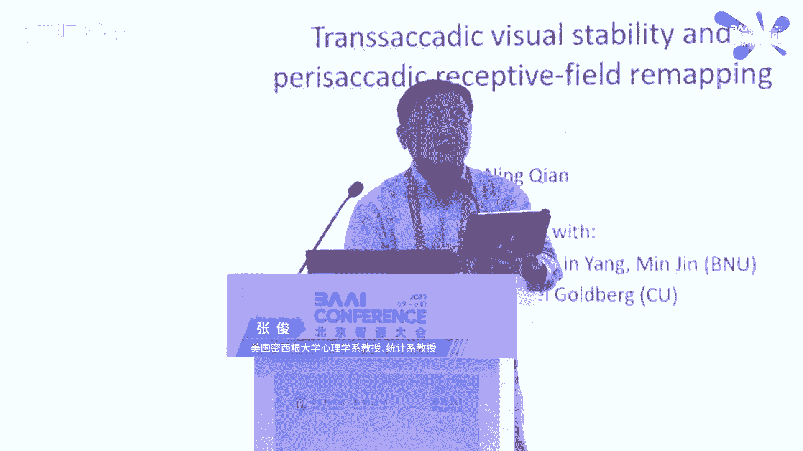

ok谢谢钱宁，要确定你把大大平层可以投出来了吗，对啊你你没有开麦，全境进行，现在能听见吗，诶诶听见了对啊，我忘了问你的，这个这边是用中文讲还是用英文讲，一般是不可以的，是都可以的，不可以是吧。

那个可能有些词儿那个中文我不是太清楚哈，嗯那那那我先试着用用中文讲哈，要中间可能有些词的话，那也许需要用英文哈，给我这个机会，跟大家分享一些最近的一些工作哈。

我要讲的这个题目呢就trans psychotic，visual stability，and paris sychotic recept，receptive field remapping，呃。

假如你们不知道这些这个词儿是什么意思的话，不用担心，我下面会那个仔细解释啊，这些概念哈，这个工作呢是和北师大的张明山教授，以及他实验室的学生张聪，杨凌和敬明啊，这个我要说到的一些那个生理的数据。

是在他们全部是在他们实验室采集的，数据的分析呢和那个模型主要是啊王骁做的，他是呃我实验室的一个博士后，然后这些呃工作都是跟mc高嗯一起搞的，因为这个perscotic recepd。

remapping这个工作最早就是由microbert嗯开始的，好像我的还得接下王潇，在到我实验室之前，他是跟吴思老师和张明娟老师对一起度过工作，ok那我要讲的那是下面几方面。

首先我要解释一下这个transpartic，visual stability什么意思，以及相关的一些physiological mechanisms。

然后其中这个physlogical mechanism之一呢，就叫这个parscotic receipt field remapping，但是呢这个remain呢有一些controversy。

就是要不可能，那我还是用英文讲吧，这个可能中英文之间挑起来反而有点麻烦哈，so one of the mechanisms for transpartic，visual stability。

paris echotic recept field remapping，but there is a controversy regarding the remapping direction。

which will get to the details，so initially，the finding was that the remapping is in the direction of the sico。

which is called a forward remapping，but then there's the native studies，no no no。

the remapping direction is convergent，both the target as it turns out。

i will show you some data suggesting that it's both，so there are both forward。

remapping and convergent，remapping in the brain areas that we are started。

and after that i will talk about a circuit，and mechanism that can explain both types of remapping。

both forward and convergent uh，remapping perhaps more interesting，and i will show some work。

some modering neura network of modern work with it，suggesting that u both types of remapping。

the relevant for transer cardig，visual stability，now。

i should mention that initially people thought only forward，remapping is relevant。

but conversion remapping，it's not really relevant uh，but through the boring work。

we find that they are kind of related in an interesting way，okay，so what is transpartic。

visual stability of eror in previation t s vs uh，it goes like this。

we all know that the only way for visual information to enter，the brain is where the retina。

that's obvious right，but the retina is constantly moving for example，we make roughly three to four。

the cards per second，uh in case for those who don't know，scotties that kind of fast。

i movement that neto scan in different parts of uh，visual seem very quickly，because of the movement。

therefore the same special location can appear at different，retinal occasions right。

and so the question is，how can the brain construct，especially accurate。

accurate and stable representation of the world despite of all，these uh eye movements right。

so um to make this point clearer，so let's look at this very simple drawing with just three dots。

three uh things，there are suppose，initially，you are looking at this cross，and this particular ject。

this thought will be above，where are you looking at as indicated by this uh，retinal vector right。

but suppose after some time，you move your eye from here to here now。

you're looking at this square over here，the same spot in space，now。

we'll have a retinal position to the，right of it to the right of where you are looking at instead of above。

where you are looking at，so if you don't have any other information。

if the brain is visual perception，only relied on the inputs from the retina。

you would think this stop is jumping around you know，when you look here。

it's above when you look at here，it's to the right right。

so your your perception of the world will become unstable。

of course we know our perception is very stable，when we move our eyes around。

we don't feel like things in the world，i jumping around，so this is called trans psychotic。

visual stability in other words，the world appears stable to us。

across the cards across the sychotic eye movements，so the question is，how does that happen well。

obviously，retinal information is not enough you need to have some other information to help you。

achieve this kind of stability，and based on that kind of thinking啊，two major types of models。

have been proposed，the first type is based on socalled，craniotopic or head centered representations。

so in other words，although relatively to hear，you are looking at a given uh object or a spot in space with changes。

location，across the cards，if you have a head centered representation。

that does not change with each of your eye movement，then the world appear to be stable to you right。

there are two usb ideas，uh，i'm not going to do the details of that。

one is uh based on the implicit at centered，the representation that combines retinal topic。

receptive fields with eye position，gain fields，okay。

uh richard anderson and his collaborators long long time ago。

udemonstrated that when you have these two ingredients，retonautopical recept fields and eye position。

game fields，you can combine them to，produce an implicit or distributed the，representation for heads。

a center cording system and the other way，of course you can have an explicit head centered。

receive the fields，i'm certainly in early stages of visual processing。

you don't have that conversity fields，but there are studies fine。

they find that later at certain higher levels of visual processing。

usales can have head centered or crinotopic receptive fields，the second nine of u。

mechanism is based on the idea of transychotic，updating of retinal topic representations。

and this is based on a a copy of the eye movement，motor command，so let's say。

you're going to make us the cardigi movement，there is going to be a motor command。

that's going to drive this uh，psychotic eye movement。

and a copy of this command can be sent to a visual，perceptual related area。

where a retinal topic representation will be updated to a new one，so to uh。

let me escape this description here，let me go back to uh，this particular cartoon here。

which i sued your moment ago，so i already told you that when you move your eye from here to here。

the retinal representation will change from here to here，right now。

if you don't know about this change that will be surprised。

you will feel like the world is jumping around，but if a copy of the motor command for you move from this position to。

this position is sent to the，visual motor transformation of visual processing areas in the brain。

then you can internally update this vector，this retinal vector into this vector。

then it's not surprise，then you know initial this spot is above，where you're looking at then。

afterward is going to be to the right of where you're looking at then，there will be no surprise。

and therefore you know，what's going to happen in the world will prepare stable to you。

so that's the basic idea，my talk will be mainly focus on this a second mechanism，transychotic。

updating of retinal topic representation to achieve，transychotic，visual stability。

now the the key mechanism achieving，this is the so called forward recepts field remapping。

and that's explained on this night，so let's say unnet um and anymore。

whether it's uh monkey or any other species，um looking at this point。

it's called your fixation point right，and you are recording from a cell in the brain，and typically。

we recording from those areas that involved in sensory，motor，transformation，such as ul，i p o f e f。

these are the two brand areas，i'm going to talk about l，i p stands for natural。

intro prior area and f f stands for from the efields。

let's say you recording a sale from one of these areas，and you can map part，it's receptive field。

and it's rainal public right，and let's say，it's at this position。

relative to where you're looking at now，suppose you are going to make a card to talk to the location。

that's over here，and the retinal topic，nature of recept fields。

basically says that the the recefield was here uh when you look at here，right。

it just translates over to this，location in other words in the position of the recepfield。

relative to where are you are currently and looking at does not change，so this is not something。

new this has been known for a long long time um，but mi golberg some decades ago。

discover that even before the monkeys，make the eye movement from here to here。

the receipt field will actually spread out in uh in space。

and time to cover the region between the original recept field。

the preechotic recefield and the post psychotic recepa field。

there is a progressive change of this shift and very often。

this change can happen um around the time of the card onset。

some cells can have this kind of receive field，change even before the scott um onset and in the for the rest of my talk。

i will use some uh terms here，the recept the field before you make the car is often called the current。

recepve field or c rf，and i recept to field after you make a card after you are looking at the talk。

and now is called the future，receptive field f r a future from the percespective of before you。

actually made the psychotic by movement，and the recefield around the time of scotonset。

it's called a paris code recefield or p r f，and as i said it can cover of the region啊。

between your press，the category cefield or coverage rf，and the post。

the category receipt field or f r f all right，and uh uh uh，many uh naps have find this phenomenium。

uh，main studies，and this here，so this is mickey，grigobert iginal study uh，this is study by，啊啊啊。

misa zhang wu zi and microber and some uh，there collaborators in two thousand and sixteen。

and they find it's actually a progressive expansion of the，reset field。

and they started by summer than，what they find that。

indeed a copy of the motor command for making the scott guy。

movement is involved in this kind of recepve field，shift around the time of the card，so uh。

so some sales as i said here some cells in li p f e f，and many other bunas uh。

appear to remap in the direction in the forward direction。

which is the direction of the scascading this direction，the shift field is shifted in this direction。

ok，and as also mentioned it depends on the copy called corridor，discharge of the scott command。

so you can see this time cd in the rest of the top，it's just a copy of the motor。

command for making the card by movement，and this kind of remapping。

as i also mentioned as being a needing mechanism for，transychotic stability，now you may ask。

why is that right，well，intuitively，you can see that this kind of shift of the recept field。

kind of anticipates，the change of the recepts field from its psychotic location to its post。

psychotic location，right，and as i mentioned earlier the updating of original topic location，across。

the cards should be based on your anticipation of your your card，so in that sense。

there is some kind of intuitive link，but i will show you some more concrete computer。

simulations to relate uh，reset field remapping，this kind of forward reset field。

remapping uh to transychotic，visual stabilities，through the updating of retinal topic vector all right。

now，this is so fine uh，but then in two hundred and fourteen，then sc and colleagues in uh from terry。

mosnap at stanford university，they published the paper that basically is you know the ford。

remapping discovered by mickey，and other people is all wrong，it's not forward to remapping。

they claim v around time of the card，the direction of recefield。

remapping is not forward in the direction of the scott，but it's convergent towards the scott target。

so let's say，you're gonna make a scott from here to hear remapping。

uh that is not in the direction of this sord，but it's towards the target and based on that they say。

well，if it's a shift towards the target，then it's not anticipating。

the change of the receipt field from its，press the sychotic location to its post，psychotic location。

and therefore it has nothing to do with transychotic，visual stability，okay，then it probably more。

likely to have something to do with the attention at the target location，okay，so i already or i。

and the further mentioned that forward remapping，may be an artifact of undersampling conversion remapping。

and the reason they say，so is because in their experiment。

the sample responses from many spatial locations，while in most previous studies including those studies from uk。

and have a they only sample a few special occasions，so they have a dance。

sampling of responses from any special locations all right，so there are this controversy going on。

and in max's snap um，we decided to to do some experiments，but together to to figure out，exactly。

what's happening，so misha，designed this particular experiment that introduced the。

delayed period in a in a，typical paradigm for starting this kind of remapping。

so typical paradigms do not use this delay period，so so let me just quickly go through the。

experimental paradigm，initially u monkeys will look at this fixation point right。

and then after some time，the spot talk to appear now in the old paradigm when this talk。

pears monkey just makes the ca，but in this new paradigm so called delayed the card，paradigm right。

the monkey has to hold on their fixation，at this initial fixation all right，and then some time later。

this initial fixation is going to disappear，and that's the time。

that's the goal signal for the monkey to make a scar from the，initial fixation to the target，okay。

and then monkey has to keep the fixation，at the target for a certain time。

and in each of these periods a certain of uh small，usquare will be flash at a certain。

spatial location，like what i soon schema here to map，the receipt field in these different periods。

and these periods enabled again，current，that's preechotic delay。

that's the time when you hold hold on to your initial fixation，without making the scott yet。

and then paris cartic，that's the wrong the time of scott onset，and then future。

that's the post psychotic period，ok，so by this particular design will be able to measure。

recefields from these four different time periods，and the reason for introduced the delay here will become clear。

when i show you，the u uh experimental findings，and this uh the bottom power shows the detail the timing。

and that's not important，and you save time and videskip that um。

these are the recepts fields of two examples，sales，one from l i p and one from uh f e f now。

uh in the interest of time，maybe should also a skip this，and just show you，the population uh results。

that's uh xn here now，i'm sorry，this uh nis a little product，but um actiates relatively simple。

and let me walk you through this，if you just focus on this one piano here um。

it's the it shows the remapping direction，what remember that the controversy is about the remapping direction right。

so in this night，we only showing the remapping direction。

although we analyze the remapping amplitude as，well，and i have a later slide to show that。

and the dark each dots shows the uh，the direction relative to the current recept the field。

which is all lined up at the center of a plot，so different cells。

of course we have different recefield and locations。

we lined them up the center of the presocratic recefield location cf。

we lined up in the center of this p，and we also in the act to experiment。

a different cells are recorded with the cards，along different directions by in order to compare。

different cells，we are going to standardize，these，etic directions tonibe the positive horizontal axis。

and and and then we are going to show the future，receptive fields of all the the the the main center location of their post。

the article futurists of field centers，as this a blue spot and the average target。

no direction where which is indicated by the red spot，and the average fixation。

direction is indicated by this green spot and each black circle。

indicates the result from individual cell，showing its remapping direction。

and as you can see uh this for for uh for for this。

particular prothe directions are scattered around the pretty，you know randomly。

but if you calculate the average，you can see that there is a bias，uh towards。

a direction that between the initial fixation and talk，and this is during the delay period，and。

shortly after the proof onset in the delay，period that this is fifty to one。

hundred millisecond after the probe onset，and this is the result for a r p。

and this is the result for uh f e f，and the resulting f e f is more consistent than that in lp。

but the trans two brain areas of about the same，so if you look at these two panels。

it just says that early in the delay period，shortly after the pro bonset。

the remapping direction is to a direction that somewhere。

between the initial fixation and the target and in fact，it's closer to the initial fixation。

but later in the delay period，you see that the remapping direction，now is more towards the target。

that's more or less than agreement with watching all，and uh find in in their paper，okay。

they call that conversion remapping，and these two panels。

showed the findings for the parasotic period，so the formats of these panels are the same right。

but different time periods，okay，so early on in the parents otic period，shortly after the pro bonset。

and that's actually before the scott onset，you can see that the real remapping。

direction on the average is still pointing towards，the target in other words。

it's like the conversion remapping，finding uh from uh terry moth group。

but around the time of scott onset and offset，basically within that you，uh roughly a fifteen minutes。

seconds of pine window，you see that the remaking direction，now is forward towards the post。

psychotic recefield location，okay，so the conclusion here is that uh。

there is both converted remapping and for the remapping，and they just happened at different times。

and for the conversion remapping，it's not just towards，the talk early on it。

can be actually towards initial fixation，and the reason will be will be able to tease this aparis。

because we introduce the delay period，without a delay period。

we will not be able to see the time cause of remapping，so clearly，and that's really the main purpose。

main reason that maja啊，decide to use this delete cut啊，paradigm，okay，now uh。

this night shows uh the detailed time cause，啊啊啊，uh remapping in both a l a l i p and f e f。

and also both the time，because of both the remaking direction，and the uamplitude now，probably。

don't have time to go to the details of this uh uh figure，but it's it's sufficient to say that uh uh。

it's just a more detailed picture of，what i already told you in the previous uh slide。

and this is a cartoon version to summarize，what i just told you。

what we find is that in the delay period，the remap initial is in a direction。

that's between the fixation point，initial fixing point，and the psycha target。

but not long in the delay period，and now it's pointing towards the target。

and for the parischotic period initial towards，the target。

and non is mostafforward啊in towards the future reset the field，okay。

so the question we as x is how to expand it，and we constructed the circuit model。

that can explain both types of uh，remapping，both the forwarded remapping。

and the convergent remapping，and啊the the ford remain part，we basically use the model。

that's already proposed in this early study um，i mentioned a little earlier from the nth of uh。

umisha，zhang，uh wu and mickey goldberg，so they propose that to explain forward remapping。

you should use cd gated to remember cd corridor discharge。

which is a copy of this scotic motor command，you should use this city。

gated the lateral of connections between the sales，and only a very small。

subset of these connections are shown here，as the blue uh arrows and uh and u dots here。

and suppose you are going to make a card from uh here to hear，and then you，these are circles here。

represent s in l，i p o l o f e f tuned to different special locations，and um for this。

particular type of first card from here to hear suppose before the card。

you have your current receptive field here，and after this a card，you have your your post card。

ta receptive field here，and since we know that even before the psychotic。

can measure activities uh from this cell，when you stimulate locations。

that's uh uh in between the current and future the fields。

so uh they propose that you have these city gated to connections to，propagate activities from the。

future ries that field to your current reset，fied that the cell that you are current today are recording。

so that can explain a forward，remapping now to explain conversion to remapping。

it turns out that some years ago，a student of mine。

and i had a paper that shows that you have centers around。

kind of connective depatterns in the origwe，we started u orientation，plasticity。

we find that in the orientation domain，if you have centers around the connectivity patterns。

you can have conversion shifts啊，by modulating the connectivity patterns in a certain way，now。

i won't get to the uh details of it，but because of that study，we thought well。

if we have centers around connectivity patterns in the spatial domain。

then we could similarly explain conversion，shift in the special domain。

and that's exactly what we did，so we are again，only a small set of connections are shown here in in red for the centers。

around the connections，so these arrows red，arrows um represent exciterary connections for sales。

tune to nearby locations，while these uh uh read the line with a dot at the end。

and show inhibitory connections啊between the sales again，this is most upset。

we assuming this kind of standers around connections，tile the entire uh space among all the selves。

we are considering and with this kind of connectivity patterns。

and we can indeed simulate both type of uh，recepfield remapping。

both the conversion remapping and forward uh remapping，and this is a uh example of our simulation。

and by tuning the parameters in the mod，obviously，you can u have different degrees of a conversion and ford。

remapping as observed in the experimental data，now um，okay。

so so this is a test of two a model predictions，so since i'm running out of time。

and let me ip through that，just to mention the last bit of all of work in the in the previous。

circuit model，you may say that，you know that kind of at hope and indeed it is that talk right。

so you know in order to explain the forremapping，we have this city gated mechanisms。

and in order to explain the uh conversion，uh remapping。

we have those centers around the actions to to explain it right。

and how to make this more principal explanation，well the the way we did it，um is to train。

artificial neural network to do the updating task，i mentioned at the beginning right。

so the the the one of the mechanisms to achieve，stability is to update a retinal topic vector with each the card。

and that's what that's the task for training the uh uh，there are network to do。

and the input is shown here，so this is time，this is space suppose。

you just flash a seemingly briefly for fifty minute，second at a certain fixed location。

so the position is fixed，and it only appears for this，fifteen minutes，seconds of time than it。

then it disappears and the desire of the，target output is shown here，so after a certain time，first。

you want to represent the spatial occasion of this。

stimulus at this at its original retinal topic ups，let me go back。

and it's original written on topic location，then suppose at this time。

there's a scot you need to update the memory，the the memorized location of this stimulus to its。

new recoral location right，so that's the uh transychotic updating，we talk about before。

and after training the neural networking did do the task，and that's the actual output。

and the interesting thing is if you start with random，weights in the network。

although we have to divide into two sets，one is attention modulated，one is citigated then。

the random weights of weights will，eventually after the task is solved。

will have both this kind of uac，metric pattern that citigated to cause。

forward remapping and this symmetric pattern，uh that's attention modulated to produce conversion。

remapping in our previous circuit model，okay，and this is for a brief。

stimuli that appearing only four fifty minutes seconds，and we did similar things for a persistent。

stimuli now，the import itself across，the car will have a delay。

but the desired output should be updated predictivated，without delay，right。

so that's shown here without this delay and again after training。

we can obtain these kind of patterns，so let me just quickly uh uh rap up，so um。

we we what we find is that the researfield remapping directions in area。

l i p and f f they change with time from convergent towards。

the initial exagent talked to forward that，that's towards the future opposed the cortic reception field。

and i told you that the circuit model，we both sitigated and attention modulated connections。

can explain about four，and the convergent with a firemapping in and both sive connections。

can can emerge naturally in neural networks trend to update，reinal talk。

locations across cos，thank you，so i just want to mention，my grapporis fan，thank you very much。

thank you very much，thank you，thank you very much，and your analysis，and i also very much。

appreciate the fact that you are delivering this lecture，at two a m in new york times，yes，really。

i'm trying to stay awake，ha ha very，i think we're very happy to hear，hear you work。

so we have time just for maybe one question people，uh anyone in the audience。

would like to ask the chain some questions on on，this are very interesting，sets of experiments on。

very very fast modulation of the firing activities of neurons，yes，any any，any question，yes，哦老师您好。

能听见吗，啊行可以听见哦，我觉得您这个方向是不是偏向于生物的，是用神经网络来解决生物中的神经元变化问题，对对对，往生来解决神经网络中存在的一些，不可解释的问题，就是感觉是哦哦对对。

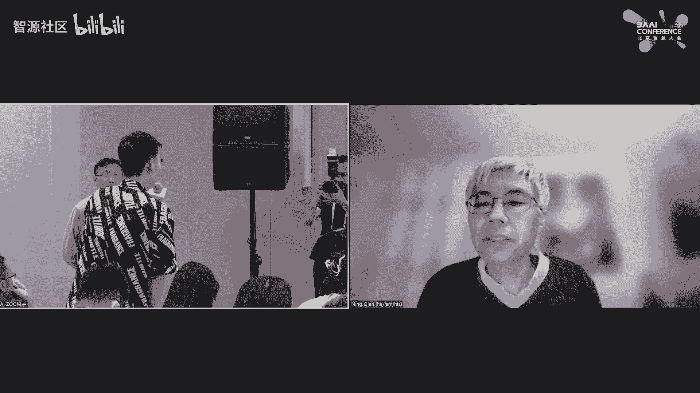

这个方向是更更是computational neuroscience，而不是那个brand like computation，okay，so it's not engineering。

its neuroscience，thank you，yeah，this this question really is a very positive question。

because the first time scale，these changes happen right，so you just see we're making very happy。

on this like on a single child level，and then now you can see it both the attention base。

and also the correct the correcharge based in，or signals getting into this。

so that's why it's called the big puzzle in for company，neuroscience，okay，thank you，very much。

thank you，yeah，thank you，thanks by，but so our next presentation。

i think is by dr sigmund，pizzo is dr pizo online，because i couldn't see or not is he a online。

not the pizzo is a professor with the university of california irvine。

and he is an indulge chair upharma，indulcher of professor of econniscience。

so uh do we have dr for money with us，he is also giving a talk online uh from california，uh。

which is also predulate，right now，do we have to tive dr pizero online now，oh yes，hello，everyone。

it's great to be here，it's going to be a part of the session of the，batural greeting from california。

let me show my school，and then let's start my s。

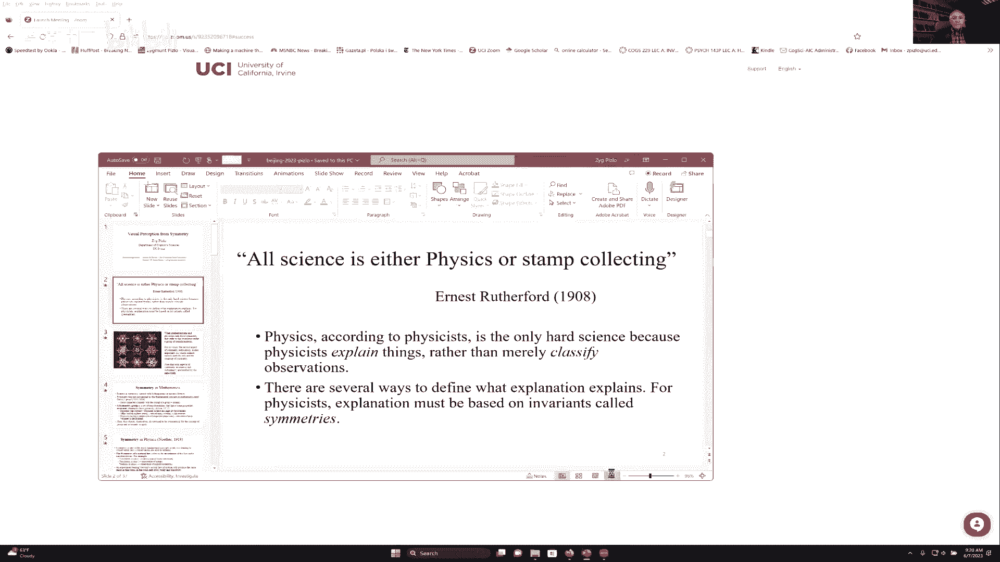

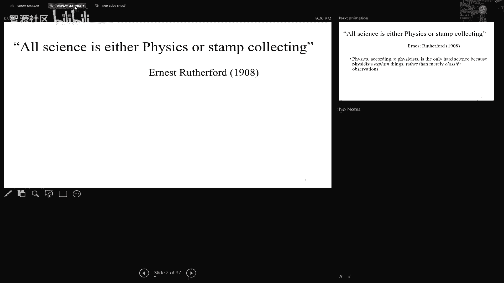

right now when the site presentation mode，where are you talking about the role of sevary in viruperception。

this work was done in collaboration with a cut to the battles and with the。

help of to graduate students during and mac，and less therford once。

said that all science is is the physics or stamp collecting here。

when was that physics is only had signs，because physicists actually explain things。

rather than classify observations，and he was not dow have this strong view。

other physicists like richard fand，uh kept saying，similar things for several ways to define。

what the explanation explains for physicist，explanation must be based on variant。

called symmetries to the next several s，and uh uh uh briefly discuss。

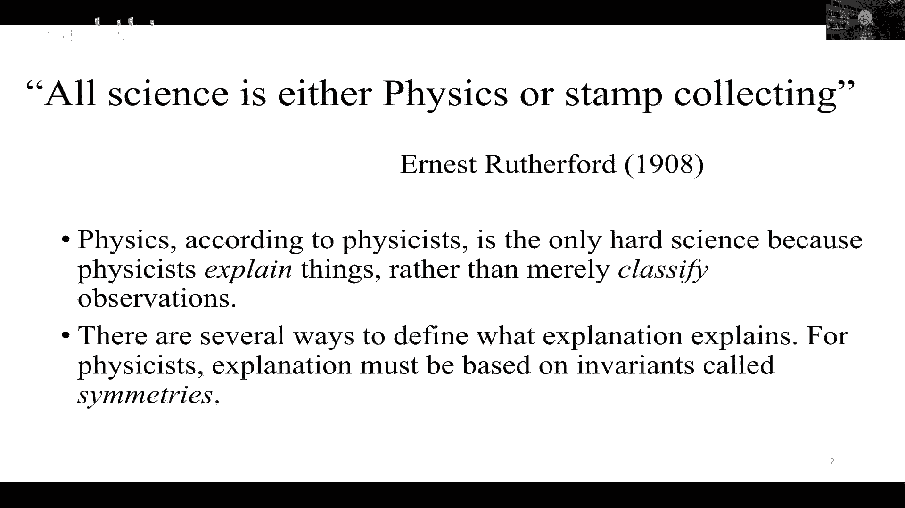

simeon mathematics，sein physics，when mathematicians and physically stable。

so that they refer to the variance under the group of transformation。

uh it is not uncommon to show snowflakes，and they say，it's the concept of city。

because if you take a snowflag and rotated by sixty，degrees or by multiple of sixty degrees。

you have exactly the same soflake，so physicists，would say that we to have a group of transformations。

you need to have variance，also if you take the new reflect。

usnowflake and just pick to any of the six，axis of symmetry。

that exactly the snowflake in visual perception，will also talk about valiance。

but we uh uh uh emphasize，the concept of redundancy。

so the vision science extends the role and the link of symetra，but you don sin it。

the sfate actually consists of six identical segments。

so if you take a segment between zero and six degrees，you copy and paste it after rotation。

you can produce the entire snowflakes，so there is a great degree of fredancer。

so similar is two aspects that，it will be important to keep in mind that，those acts aspects of simon。

hindled by the same，mathematics in by by the goolest transformations，an interest in similar。

started with peter grians in ancient greece uh，but simit was not recognized as the fundamental。

concept in mathematics，until that was proof that was presented the proof eighteen，thirty two。

when he was twenty one year old，but the paper do appear，and your nine eighteen forty six。

but you add contribution was uh by，connected the concept of symmetry with groups and variance client。

a little later，extended this these ideas into the classification and，definition of geometers。

what client said is that，and the geometry is fully characterized by。

specifying the group of transformations in the，corresponding variance，so you click an rommetry。

instead of listing nuclear，an axioms，you can just say that we now will consider the group of ridge motion。

translations and rotations and enemy，specify the euclidian understands and angle at the。

variants in the fural with dream，we add uniform stretch of a plane or space。

and then the empire the distance is no longer invariant。

but the ratio varias of volumes is the evian in projective，jeretrip。

we add composition of perspective projections，we have new invariant more abstract。

which is cross ratio of areas or volumes，it is interesting to point out that for mathematicians。

when they talk about symmetric groups，it is not important。

whether the objects of the transformations are themselves，symmetrical。

so you could apply orge motion to a regular chair，but you could also apply a rigid motion to a chair with a。

broken leg，and the the rigid motions，don't really care，whether the whether the our object symmetric。

or not how about physics，and then the celebr in physics has been established，this important。

concept this fundamental concert by eminor in nineteen eighteen。

and she showed that symmetry leads to conservations，smeter of natural law in physics。

refers to the variance of this law，their transformations could be translations in space。

translation time or rotation space，and whenever a natural law is invariant or semantic。

and even transformations，there will be a corresponding conservation，so in the fact that uh uh。

the natural laws are in variant to translation space，leads the conservation of inner momentum。

and then translations in time to conservation of energy，son so the example is that if you test newon。

second law of motion in one room，and then you perform the same experiment in the room，next door。

or today and tomorrow，we expect the same results，so physicists would say that the result of a transformed。

experiment is the same as a transformed，result of this experiment，but again for physicists。

it is not is not relevant，whether objects are semantic，or not，so you can throw an object。

which is semantic，or not what is important is that the natural law is variant。

and when it is physicists，would say that the natural laws are semantic。

so now let's move closer to the topic of our talk，which is the usual perception of objects。

the objects have permanent characteristics，and even object like a chair has a shape as a size。

reflectance of surface is mass，and all those perman characteristics，we can call them in variance。

because if we don't destroy the chair，those characteristics are are are preserved variance，very much。

like the variance of the losophysics，so the objects have paramount characteristics。

but the perception of permanent，characteristics is actually important concerity，perception。

so perception of shape，perception of size，perception of reflectance，perception of way。

we call them perceptual constances，and they are variants too。

so perceptual constants constances become，perceptual in variants。

usual perception is the area of cognitive，psychology would not exist without the phenomenal。

perceptual constances，what i mean is that perceptual constances are。

essential one of the most important is not，the most important concepts in visual perception。

so here we have a hint that the area of science，called visual，perception。

has a chance of passing rather for criterion of real science，because we we cannot help we。

we essentially start talking about senators and variants，uh right from the beginning。

but there is more to visual perception and perceptual constancy，veriticality。

uh in visual perception is a lader important，concept。

it means that we see things the way they are out there，so you are three objects in front of you。

and you see three rather than two or four，your dation is very color，if you look at an animal。

whose bodies neurosmeatical，and you see this mirror symetrical，your visions vertical。

if you look at the shoe box，and you see a box composed of six。

octangular faces and heading three planes of symmetry，your version is very color。

if a figure skater performs a pure ete，and you see that the anger of speed of rotation increases as the skater。

pulls，her hands towards herself，your vision is vertical，and so on，and so forth。

so let's briefly discuss one example，they need the first example of uh。

seeing several objects in front of you，we typically called the front end of vision。

it's called figure，grand organization，the question is that you open your eyes。

the question is is there an object out there，and if there is how many。

and where the last hundred years of research on figure，grand organization tried to solve。

this problem by performing two dimensional operations，on two dimensional images。

but with little or no success，here is one of my examples。

this is a photograph that i took and produce in one of my labs，i put several objects。

these are children furniture in the center of a dance floor。

i chose the colors of the objects like yellow，we are orange，similar to the color of the of the dance。

floor to make the problem of finding objects，uh particularly difficult at least for computational vision。

ces for computer vision systems，so the question，here is can you tell me。

how many objects are in the center of the dance floor。

and this doesn't look like a difficult question，you can you go，it's you can count one two，three four。

five，six seven eight eight objects，everyone can see this，and we can counter object。

despite the fact that there are partial inclusions of one object by others。

it should be obvious that it will be very difficult，if possible at all to answer。

the question to count the objects by applying two，dimensional operations。

like you could do silence in map，or you could start extracting edges and connecting them，the reason。

why two dimensional operations are not likely to give you，the answer to the question about the。

number of objects is that the objects are three dimensional。

so you really need three dimensional operations，our idea was based on the following observations。

all natural objects are symmetrical，but the configuration of unrelated objects。

almost never itself medical，so if you if the algorithm as tries to answer，the following question。

what is the smallest number of symmetry，planes that can account for three dimensional，sin。

you will get your answer，because we are a objects，and there are uh。

the objects can be accounted for by a cemeter，plate is interesting that the that this approach will naturally uh。

resolve the issue of objects are suspect，so if you take the legs of this st。

the leg itself is new usmetic，but since the door is new usmetic，then once。

we find the similar to plane of this object will take care of of，not on the object，but the parts。

this is a summer of，what i just said we implemented it in a computational model。

and so what is interesting to point out，is the original question was about the presence。

and number of physical objects in the physical environment。

but what i suggested that you can give the answer，by using geometry，not physics。

more more specifically keep by using symmetry，and then you will show you a few uh examples from from our from。

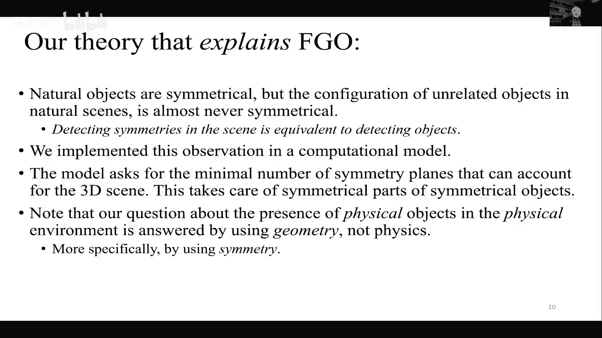

how our algorithm when it was implemented on a computer work。

so the computer was connected to a camera，camera was in a typo，this was the one of the scenes。

and the algorithm was and a estimating the smallest number，the meal number of catreples。

which can account for for the scuh scene，and color coded are the individual objects next example here。

you see that that that the strawler partial cludes，the stand behind。

so the the camera doesn't really see the entire stand here，the tripoor cludes the rocture。

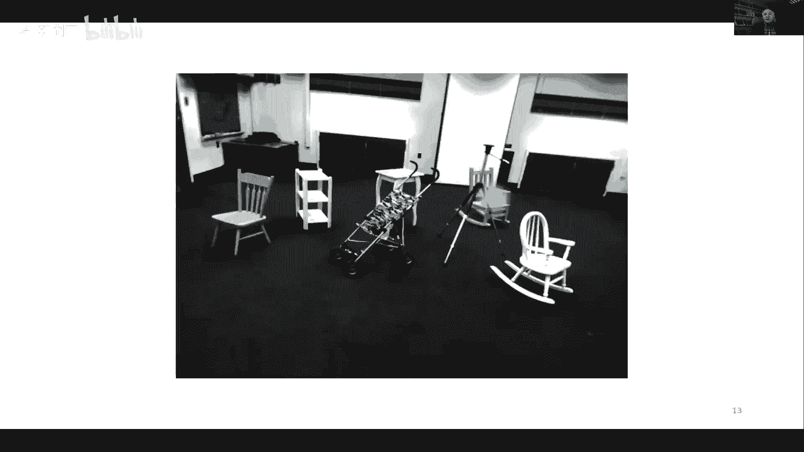

but this is not really a problem once，the object is is symmetrical is symmetry in it。

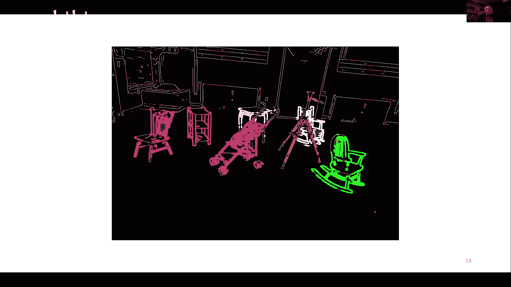

that we can detect it，and here is another example，where the student who actually did。

this work is included in the scene，we wanted to double。

check that this algorian can handle not only the pieces of fing share，but can also handle uh bodies。

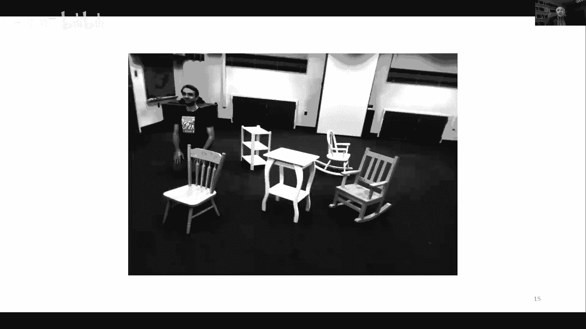

human，human bodies and sure enough the algoriwas，able to detect and individual objects at this point。

i'm not really discussing the reconstrumentia，construction of the shapes of the。

jects were only detecting the objects by the texting，sufficient，amount。

sufficient degree of symmetry in each object。

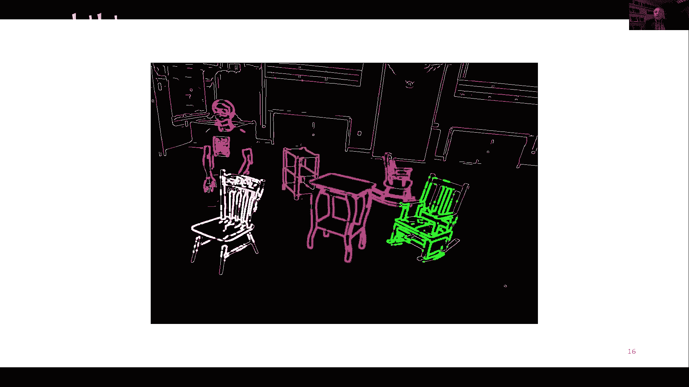

so yeah，we we talk about two aspects of symmetry，one is the variance aspect of symmetry。

which is essential for perceptual constancy，but the other one is the redundancy aspect of military。

the object has mirror is mirror symmetrical，it needs one half of the jects identical to another half。

and i just showed that it is important in figure，grand organization，so vision science in fact。

started expelding with the all，symmetry plays，beyond what the mathematicians and physicists have done。

because we now，emphasize not going to dvariant aspect of symmetry。

but also the redundancy aspect of cemeter，so to make sure that we are on the same page。

when when we consider a symmetric object，like a butterfly，when we say，symmetry，i told you that it is。

but it dance is essentially，the left half is identical to the right half。

so it is self similarity of the halves of the，butterfly or self identity。

the important thing is that the butterflies，symmetrical interdimensions。

but the camera rina image is not necessarily，or almost never symetrical，but we will，but but for us。

what is important is that i actually，what's happening you happening in three inventions。

all natural objects are symmetrical，animals are mirror symmetrical。

because of the way they move all animals，the the bits。

the fish the the cats and so on plants are simultic，because of the way。

they grow men made objects are symmetrical，because of the function they serve completely。

assemetrical object is likely to be dysfunctional，obviously。

symmeter of objects is not guantage to be perfect，but we already been established that symmetry。

we can talk about symmetry，even if the symmetry is not perfect，we can then talk about approximate。

symmetry or near symmeter，so here，i will show you a few pictures，designal is media mirrosmeta。

this course is neurosmetica like，and the articulation of limbs can change，but in principle。

the same the the horse is mirror synthetic，the fish is nesthetic，the bear is semmetric，i mean。

the bear wouldn't be able to fly too，far in the wings，the had different sizes of different shapes。

all backs of neurosmetic，so that much adrotational is meg。

if all lateral objects are symmetrical vision system，like hours would benefit from using symmetry。

uh i already the short，how it is used to soging figure，grounds of organization，now。

i will talk for a few minutes about，and reconstructing。

recovering the shapes of three dimensional objects，like uh，recovering city。

mensional shapes from a single two dimensional images and ill pose。

inverse problem that so here in the bottom，you can imagine that this is a camera image。

and now i'm showing you that i can not be rarily，change the depths of individual points without changing the camera image。

the task of division system is to reconstruct the three。

dimensional configuration from a single image，many three year arrangements produce the same image。

but human molecular percepts are stable despite the videos，input。

individual system has to solve the inverse problem by。

imposing constraints on the family of possible interpretations，and now this slide briefly discusses。

the nature of the constraints that could beautiful。

so the visual systems after reconstructing the missing depth dimension，but we don't want to impulse。

constraints on the depths of individual points，because the depths of points are not permanent。

characteristics，we cannot know them a priori，if you change the view。

in direction of viewing distance the depth，the depths of points change。

even though the object didn't change，so perhaps，you could have a liers or apiary constrain。

pose on particular objects and seeds，but this is not good either。

because we want our reconstruction to extend beyond the，familiar objects。

we want to be able to reconstruct，uh objects that we have never seen before。

so the a priori knowledge a priority，constraint master，present。

bo permanent and abstract characteristics of the natural，environment，characteristics。

they do not depend on viewing conditions，and it is the symmetry grances of objects。

which satisfies both the requirements，let me quickly uh use the language of basian inference to emphasize。

the point that i'm trying to make，so we will be trying to compute。

the posterior on three d objects and depths of the，characteristic point of objects。

the likelihood we will be applied in conventional way。

but the prior probability is not defined on objects，because we want to generalize to unseen objects。

and the prior is not is not on depths of，characteristic point，because we want to handle arbitrary。

review，directions in distance，and the prior probability will be on senator objects。

this is a new way of applying basin of regarization inference，new way。

because the prior and posterior are essentially，defined in different。

spaces will disapprove work the answer is，yes，and here，i will show you。

the regularization methalthough one，could do it，the same way using pysian inference。

and the problem of three dimensional shape，perception from a single image was considered to be pretty。

pretty much chimpossible，no one knew，how to solve it。

and we now now that symmetry is the way to solve this problem，the cost function now，our model。

which actually resembles，the least action principle in physics，it looks like this。

we are looking for a three dimensional shape，who caused his meal。

and the first time is the comparison of the，actual image that。

we have on the reina to the projection of the，of the sedimensional guests。

or or or inference of a three d shape to the to the image so in。

which we want the three interpretation to be，consistent with the data。

then we measure is the april constraint，we measure the departure of our，interpretation from symmetry。

as well as departure from maximum compactness，and we found that compactness defined by this。

formula is a very useful constraint as well，i don't have time to go into any more detail。

so we are boring again mathematical formulation from physics，our cost function resembles。

this action principle，we call it simplicity，principle，our principle is applied to symetrical objects。

and the resign will correspond to conservation，law，simularly to have nederive the conservation。

loss in physics from symmetri，the third stripe is conserved in the。

transformation from the physical world to mental world。

the precept of wooden chair is not made the world，but the perceived shape of cherry。

close to the two shape of the physical object。

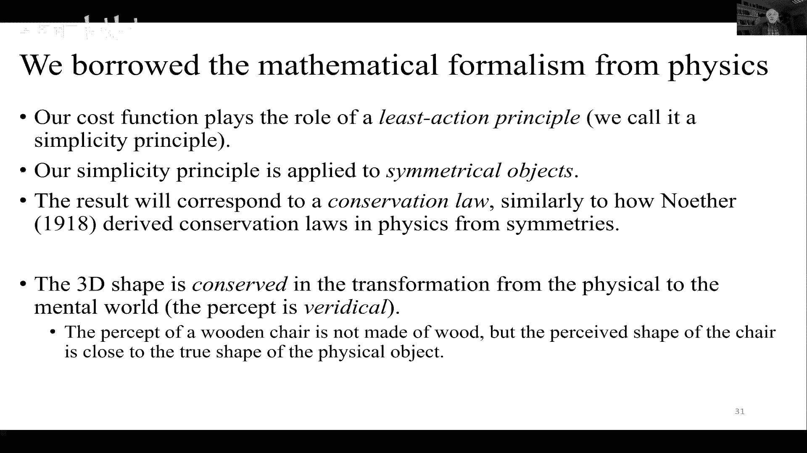

i will show you a couple of examples，i we took this stand with carelax。

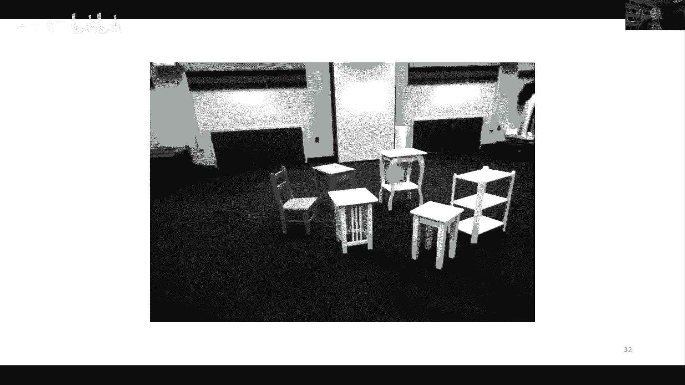

and we put it in front of the camera，and algorithm by using two。

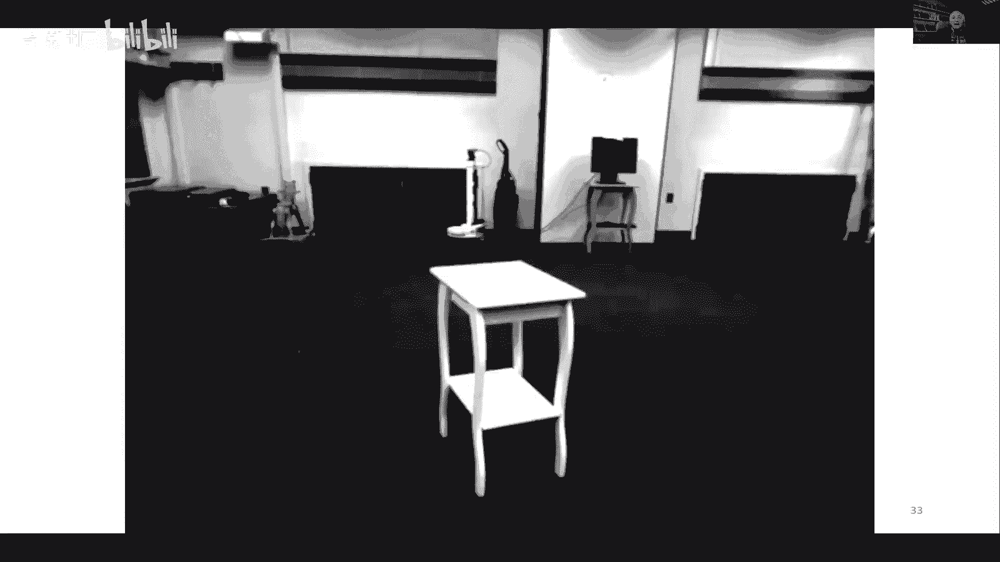

planes of symmetr was able to reconstruct，what you see in fact。

not only the shape of this object was reconstructed perfect，but also the sizes。

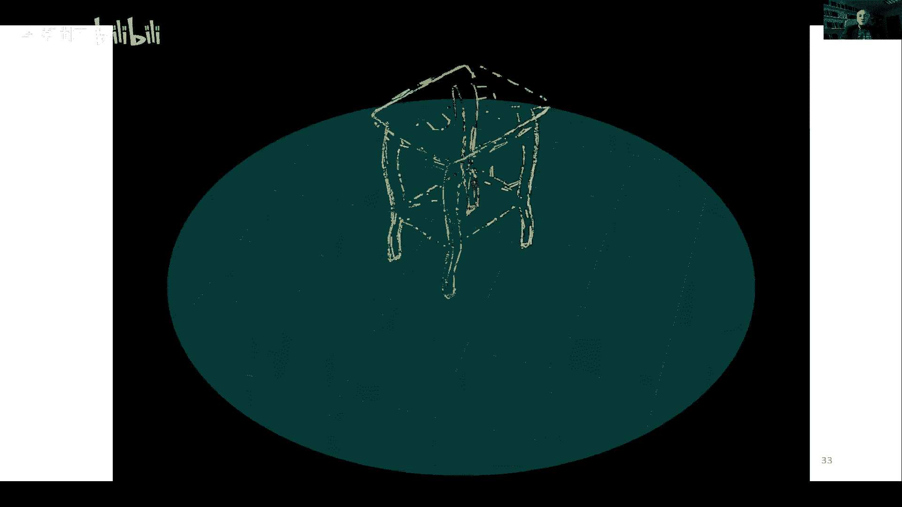

the size of the object next，we took the bookshelf from our recollection of objects。

and here is the consection again，the consection is not perhaps perfect like i。

we didn't reconstruct this at the surfaces，we are constructed the edges。

but uh you see that the objects is uh uh，uconstructed very well，the shape of the object aspect ratio。

the right angles，the symmetry，the different colors，i'm using here to emphasize。

the fact that this object actually has two planes of symmetry。

and those two planes of symmetry were used so sami。

the human visual system produces，the dimensional perceptions from two dimensional images。

using symmetry，simplicit to principle，which is relayer like least action and conservation。

the same three principles that，physicists have used to characterize the physical world。

using cemeteries，the key to the，remarkable ability of the human visual system to represent。

and understand the physical environment，perceptual constances，analogous to the variance in physics。

victianalogous to the conservation，lowering physics。

similarly adds new qualities to natural phenomena beyond。

what is known because in cognitive uh uh science，we talk about inferences based on sensor data。

those concepts that don't exist in the physical world，we emphasize the redundancy aspect of symmetry。

which is actually not really used by physicist，at least not too much，and then at the end。

we talk about three dimensional representations，which are critical employment，planning。

goal directed actions，so cogitive science，actually adds a number of things to what physis。

already the new，take a message，the presence of military in our theories，gives us。

confidence that we actually explain visual perception，the way physics，explained physics。

and what someone called unreasonable，effectiveness of mathematics。

internatural sciences is no longer unreasonable，because symmetry underlies。

both mathematics and natural sciences，so thank you，that's the end of my talk。

and i will now stop the recording，and i am ready for your questions，uh a new perspectible。

how the competition of symmetry is done by the brain，so uh，we have plenty of time for questions。

it's open up the floor and be ready there to keep take some passions，zg，yeah，so。

anyone in the audience，would like to ask the question，and try to，it is yes，okay，there's still，uh。

hello，professor，i think the the symmetry，it is a very is very good，concern，concept，concepseuh vision。

uh vision，talking vision，we we are talking，but in fact in in the nature，we think the motion，uh。

the symmetry broken that makes the motion，so i think not other things are static uh。

when when when this static it，it is convenient for talk about uh symmetry，but when the motion呃。

呃文子文子文子，those those things become，we are moving the symmetry will be broken，so i think the uh。

how how to make the symmetry and symmetry breaking two things，uh connected is important，this。

this is my quick，uh，this is my question，yes，okay，thank you，azg，so a question on，how motion。

uh interact with the symmetry detection and whether motion，destroys，uh symmetry of home。

so what's your take on this，music there，yeah，he he is not can you connect to him，no，okay，now，so ok。

so look like，yeah，ok，it's not able to be with us，during this uh q，and a session，so okay，so let's uh。

maybe uh postpone this question，okay，but we have we do have a a wrong table，discussion part。

so let's uh postpone this question，just keep it for for the moment。

and then we'll come back when we have the wrong table，so our next uh presentation。

our next plantation，uh，这是冯冯老师在上线了吗，amazon摄像头，ok so u，unec so ua next talk。

so we may you may want to wait for，let's see for the，哦我们那个等等，冯老师开摄像头啊，我们下一个我先介绍吧，就我们下一个那个讲员是呃，冯建峰教授呃。

他是现在是复旦大学，类脑智能科学与技术研究院的院长啊，上海数学中心首席教授啊，是上海，就是复旦大学大数院大数据学院院长，那么他的多年的研究工作啊，一直在这个类脑计算这个领域，发表了300多篇文章。

而且在2011年，获得了英国皇家学会的沃夫研究助理奖，那么今天我们很荣幸请他来跟我们分享一下，他在那个电脑计算这方面的工作呃，冯老师，你在在那个他开了没有，他还没开吗，没有，那ok那这样的话就是这样。

冯老师的话，他也是这个，因为最后他呃本来是要呃现场出席的，但是他这实际上是有一个有一个重要的一个，领导的接待任务，就是所以他没有办法过来，但是他为我们录了像，所以我们就播放一下他的那个录像吧。

大家下午好啊，就是这个赛事吧，非常感谢他的邀请，嗯很遗憾的是，我突然有些临时的接待任务在上海，所以去不了北京啊，没办法跟大家面对面的交流，但是大家有任何问题可以在现在跟我联系啊。

就是呃跟我的一mail也好，微信也好，非常欢迎大家跟我联系啊，今天呢我跟大家汇报的题目呢，是就是从数据到模型嘛哈就是我们怎么样，尤其是在全脑的这个scale上啊，就是说来看这个数据模型，我叫福建方网。

来自复旦大学，我们首先呢我会跟大家很快的介绍一下，我们的一个背景的情况，然后跟大家讲讲为什么我要从事与出发吧，然后再可能有时间的话讲讲模型，全岛模型是dj train green，然后呢可以估计模式下。

然后有时间会跟大家分享一下，我们怎么样在理论上来分析，我们目前做的一些工作，可是我们呢在复旦大学是这样的，就是我们有两个院，一个叫类脑子科学与技术研究院的，就是嗯主要是脑内脑。

今天主要讲工作在这块做的话，然后呢我们还有大数据学，然而两个月加快了大概有七个pi哦，我们大概连续生在发大概有个1000来人吧，啊，很欢迎大家有时间到我们带来这个采光和指导，这个我们复旦的一个脑炎中心。

在湛江的这个校区啊，这个脑源中心呢，这是我们脑炎中间的这个屋顶，这个脑炎中心的实际的情况，其实我今天就是就在这里哈哈哈，期待那个一些一些我们访问的客人哈，就是农业中心呢。

我们实际在地底下挖了3000平米，然后的话呢在这个挖这个脑线中心的建设，脑线中心的最主要目标是为了我们啊，就是我是一个做计算的，然后呢，为了我们能够用人工智能来研究这个脑疾病的，来说。

实话是未来研究脑的一些脑疾病，目标是炎症状，我们有压力最大的这个脑瘫中心，用性来说，然后呢我们当然也会在里面搜集这些数据，是我们目前当年中心的一个简单的一个情况，就是我们有这个3t的。

有有几台3t的机器，还有7k7 t的，这台可能是世界三第四台，中国亚洲第一台，然后呢也是一台7t，这也是我第一台7t的，然后按我最近刚买的五系列一台机器，包括我们一些m e g的设备登录。

可能在采数据里面可能开始翻脸，所以非常欢迎大家好，在座的各位同事们，就是如果你们有什么好的想法，想对你的脑力，其实这如果做到开门节目的时候，能有这些仪器了，所以非常欢迎大家到我们这来做各种各种实验。

然后通过这些仪器呢，我们目前也采了嗯，六个cohorts，就是，这个是这些数据呢，我们其实才成功去把这个，包括做那些现在在做一些施工，转化组等等这方面的工作，然后到期没到订单的数据。

这是我们到1月份时候的数据的情况，我们数据也是公开的，但看在前面过网页啊，这有兴趣也可以回来还原来用这个数据，这个这是中文的数据啊，也许对于研究脑和理解脑，对后面我们来做这个类脑计算啊。

等于会有很大的帮助，这是我的脑子就是在包裹的挺好的，就是iphi功能的，就是d p i，就是大概的情况就是把我们脑子分成了10万块，10万个小立方体啊，那每个小黑繁体之间的连接是什么，我gti测出来。

我听完了，我们可以看见，每当小学发展内部的这个神经元的密度哈，所以这个我们有各种各样的这方面的数据。

然后的话呢我今天可能跟大家说，要汇报一下，就是怎么样一个数学工具来研究科学数据，包括统计和建模了哈哈，包括这个这个train queen，我们有些人很好的应用在那方方面。

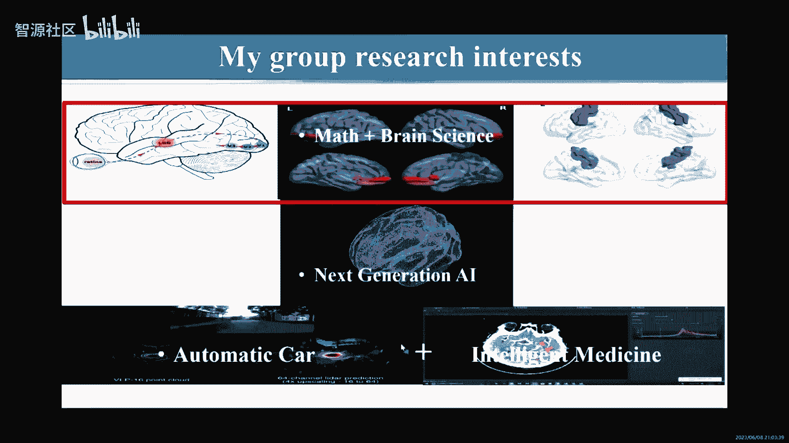

自动驾驶和自我医疗基金开加福报嗯，所以这是一个背景的情况，也就是说我们地区有亚洲最好看到银河中心，让我们肯德基摸着，然后我们也可以在里面采集很多的数据，那么有了这些税收呢，那么我当然就想对吧。

就是对人脑有个更好的，尤其对人脑有个更好的了解，有了对人脑的更好的了解，做呢我们想想做这个模型，最后我还是做电脑计算，然后的话呃我来分析一些东西，这是我们今年的一个情况。

不是说这个space就是实际上就是想告诉大家，其实我们这是从我团队里，我就注意到那个今年的情况哈，就是的确我们因为涨了很多的数据，我们有很好的算法，所以我们也在一个比较处于一个。

比较productive的一个阶段，所以非常欢迎，其实年轻的学生的话，就是我们有很好不错p h d的位置，非常非常欢迎大家加入，我们对加入研究院给你确认，这个可能大家会问的就是。

尤其如果是在做有做题的科学化方面的人，可能会问啊，就我们跟classic来做这种脑疾病的人对吧，会有什么样的一个区别，我想我们团队一个很大的特色，当然我们自己发展我们自己的哦，哦工智能的算法。

各种各样的算法，我们这方面很有特色，做我们自己的算法的话，这个origin的算法win 8也好，不带是吧，然后利用这些算法呢，我们可以来看各种各样的疾病。

比如说这个我们的做法跟classic的这些区别呢，可能就是我们更是一种data driven的一个proach，就是compass，就是哈布斯是剧本啊，包括这个很典型的例子。

就嗯去年我记得应该是我们发展，我们做了一系列这方面的，我们关于精神分裂症的，是这个我们的block这个园区出了问题，它的起源在园区，然后呢，在韩国的一个综合性的分裂症的医学院的教授。

看见我们的文章就觉得很奇怪，大家就发了一篇com，他说what是我们做了多少年了，做精神分裂症，做这个脑语言对吧，起源的这个这个假设，而且你们做的东西有什么区别，跟我们有粤语什么，然后我们给他写这个啊。

就我们那是从全脑，就是我们通常包括下面要讲片内，就是就是我把整个脑子呢我估价七点来看，然后呢就比如说最简单的比较及格，分裂这个正常的道理最大的区别在什么地，方，或者说这个精神分裂的起源有可能会在什么地。

方，也就是given form，就是以前那个class的区别是吧，我知道我假设的语言取出了问题，我去看语言去到底怎么回事，所以我们一般都是从全脑出发分析全脑数据的。

like data fbi scale，然后我们可能就是大海王子民，好多代表都把那个真正的去告诉，所以在这下面我可以给大家举几个例子，比如我们专业这个健康人群的对吧，然后我们全去其疾病全全去去。

然后呢疾病起的这样用我们之前的分析方法，我们能看见下什么样的区别，从而对大脑的功能有个更好的了解了，这是一个嗯很简单的一个例子，大家能看见，就是我们当时收集了，大概一共收集了17万人的这样的数据。

睡眠的数据，比如这是十岁的儿童嫂子啊，那个在他睡半个小时的时候，他的抑郁症的打分的情况或者脑子发育的情况，等到我看了，其实然后九个小时，十到11个小时对吧，请回七个小时，大家都看见了他的这个大脑发育去。

那也好，一直打分也好，但是model同样的一条曲线，意味着就是我们睡得越多对吧，你发育的越好多，11岁的孩子也是这样的，就是睡得越多，他能发育的越好，这个青春就是抑郁症的那个打分也越低。

然后这个呢我其实前些年让我做了个讲座，但是x四点六点来看了这个讲的，所以我还是跟他一个三级的，在在国内做关于脑科学的，青岛健康的还是非常不符合的，也就是说，那么这个是作者十岁到11岁孩子的情况发展。

20200，后来呢我们又follow这个up，看了看这个全生命周期的这个睡眠，到底什么是吧，然后我们就发现诶数后这帮人的睡眠啊，实际上是在，比如你看下这个大概40岁左右，是睡七个小时是最优的对吧。

睡的太少他也不太好，睡的太多他也不太好，然后其实30岁的四岁，我的那个60岁的，到时七八十岁的人，他他都有这种这种这种趋势在里面就七个小时，最好睡的太少不好，睡的太多也不好。

后来这个我们男的发在nature上，就是就是就是嗯里面的很多细节，我记得没有时间去想当当，你还可以做到一个很好玩的现象，我在文章里面从来没说到，就是你在40岁的时候，是你的一旦来中年中年危机对吧。

然后在这个时候其实是最糟糕的啊，这个抑郁症的分其实是最高的，在这个年龄段。

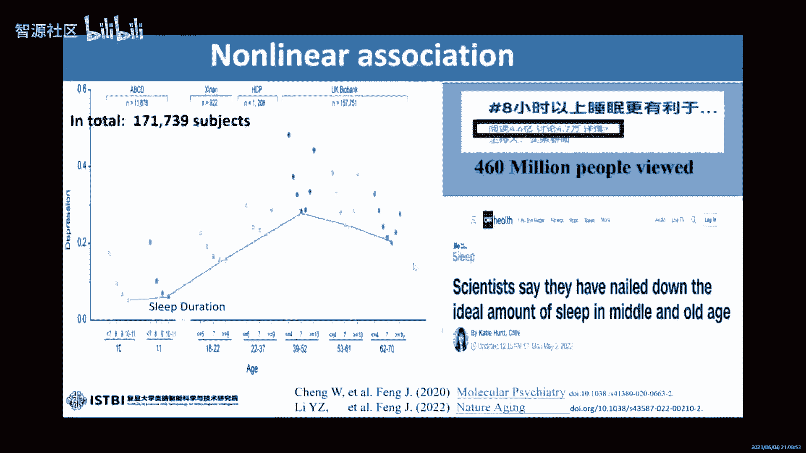

所以我们能看见很好玩的新鲜动力，比如说这个是那个是那个新闻对我们的报道，就是嗯嗯这个，eight that's been the magic number。

where we have a new stu，that that that dian hour is the adject too，much like that，we just talk too。

how how how how，how did they pit well，dj，and how yours would have been listening to me。

talk about sleep for the last eleven years，now that it's seven to nine，that is the recommendation。

but this study interesting study，connecting the dots between the duration of our，sleep and perhabits。

psychiatric and physical conditions in our health and wellness。

and found a sweet spot to meet seven hours。

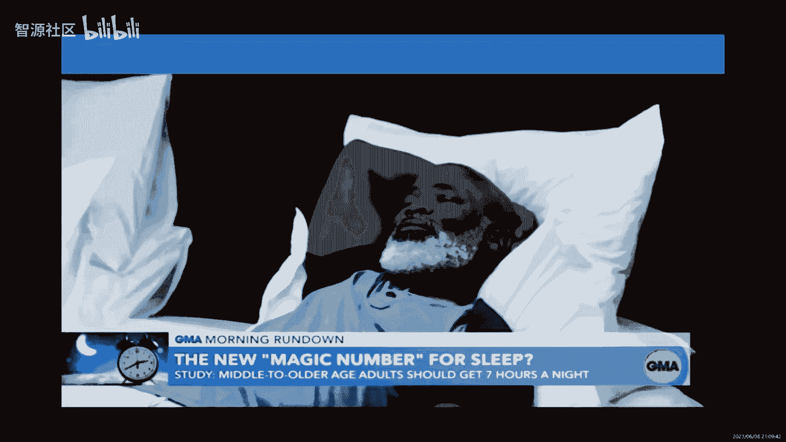

should be the news for you to ji，know you're on a little bit on the。

shot side of the recommendation on，what they found was really call in the，usually curves。

so people will sleep too，little too，much actually，don't do as well，so that it seems to be the magic。

ok so ok ok就是反正据说对吧，就是嗯嗯，然后我们刚刚就是后面还做了，很多人会拿网络方面的工作，现在在文章里吧，就是看看睡眠到底跟你签到相关对吧，那些都控制我们的这个reason对吧。

然后其实我们除了这个老lina的数学性之外，就是说我们发现这个睡小七个小时，不睡小时，七个小时不好打，几个小时不好做，完了我们还做了些跑啥类的，也就是说对吧，你睡七个小于七个小时。

到底对你健康会有什么影响对吧，你适应多一些个小时对你健康会有什么影响，然后也很有意思，我们发现小于七个小时，会导致你的一些健康问题哈，然后你睡多一七个小时呢，通常是你有一些健康问题。

才导致你能够还会导致你的特点，所以多余七个小时有抑郁症的把它击碎，可能都睡得很早，所以是懒得床上喷起的，多一秋小说等等，这方面的这个很有意思的一些东西，就是嗯这个呢就是说我们做的就是对面的。

我们也做了很多这方面的事情，可能大家看见很多我们的报道和，因为马上出来的对吧，就是你20的早期学习，对你到底有会有什么样的帮助哈，然后我们来看了，比如说对于你的社会隔离，对你的健康会有什么帮助等等。

我们就不不一一去讲啊啊movex对吧，从健康人马人所谓的厌倦亚健康或者前驱期，也就对这个病人的呃这个数据的分析呢，这个我可以给大家再讲一个英文，例如我们现在这个大数据，再加上我们的一些算法。

我可以及时我这个脑功能的对，其实大家没有看见的东西，比如这个另外一个非常简单的例子，说出来事，就说你这个抽烟啊或者成瘾，到底是因为为什么这帮人会去抽烟饼，装在里面呢，我们采集了10年的数据。

在更多的10年，我们在他小孩亲少年14岁的时候，我们才打到一下全新组织数据，一直到他的23岁，然后这个这个行为的数据好，我就想问呃，这帮抽烟的人，他是老少的地方的原因，让你开始抽烟。

就我们很意外的就发现，如果你用小的这个left fm p l c这块的，这个小这个脑这个那个机构啊，那么他通常这帮孩子会去new breaking，就是他通常会有不守规矩不守规矩。

这帮人其实他会开始抽烟的，是怎么了，他其实会开抽烟，那么这般抽烟的人呢，由于你的看抽烟呢，它可以把你的右边的这个飞扬p c了一个，因为你看抽烟要把它右边也给它锁下来，就是说先是因为左边这块小。

所以你可以去抽烟，抽上烟了之后，你就把右边也给减小了，然后就是这个其实还是非常意外的一个结果啊，就是就是不会在那个人错了，我错了，挂我还不满，我觉得这个我们做了一个非常方便的。

一个一个一个一个discovery，就从来没有这样的数据，对我们这些事情最好的一批数据啊，作为老师推广等等，去看餐饮的原因到底是什么啊，就是然后大家都成为可能里面会有很多问题啊，就是时间管理。

这样我没有办法去讲价，当然可以跟大家一块的利用我们的数据，没有我们的算法对我看清，更能技术，看清这些脑，各个脑区到底它的功能状态是怎样的，脑子能跟他们行为怪勾了，当然这款跳过去，我想说的一些。

就是怎么来预测d的一些一些东西，讲了讲个那个疾病的例子，老师你会发现那个有了这些数据之后呢，我们有这些算法之后呢，我们也去看那个疾病嘛，就这次精神分裂症，那么有去看他的精神分裂症的机构啊，就精神分裂。

得精神分裂症的人，的脑子机构到底发生了一些什么样的问题，然后我们就发现啊，这会儿我们发现啊，这个美国做了很多年，这个呃美国有个主教在南加州，就谈一个，他们收集了4000例的精神分裂症的数据。

然后他们会发现诶之前精神分裂症人啊，这些老剧是萎缩啊，当然就是做的很有意思啊，这个是一个最大的数据量，在当年来说，但是这里面有一个问题他们没有问啊，就是说ok我现在脑区是萎缩了，但你能不能告诉我。

这个疾病从什么地方开始萎缩对吧，它的起源在什么地方，哪个脑子变小了，做什么啊，扩展到对吧，这些脑区区啊，这是第一条，第二条呢就是说你这里面只有一种萎缩吗，就是或者说你这里面只有一种精神分裂症吗。

还是有可以上太平，就是专门做分类对吧，做分析，他们有不同的体能分裂症的这个这个亚型，所以我们呢就是说对这个目标呢，我们就发展了一套算法，其实想法说实话你们大家要去自己琢磨一下。

其实也是非常简单的一个想法吧，因为我们有大数据线，下面你可能看起来，所以我们把它排列起来，比如说嗯对吧，你从从从那个脑区的那个那个那个，就是那个那个那个缩小脑区的这个，从小到大去排列型对吧。

那么我能看见就是假设这块最小的一个地方，显示就是他某一个区域对吧，然后呢我们班，那么我就把这个最小的台湾小，都能看见它到底有几个群，这里面我们设计了一个一个算法，然后呢。

我们收集了大概这个七家医院的十几个单位，就是医院里面有有院有好几个组合，收集大概千里众人的这个这个诉求，有文章发表的几个月前的hphealth好，我们就看见a这个集成分裂症，它有两类曲源。

一类区因我们的这个言区域前面说到对吧，另外一类的起源，它的海马区域气以这个功能出来，也就这两块先开始萎缩，然后开始你们就分成两类，逐渐的扩展到这个整个脑子啊，就是曲线形成分裂的人，用它有两类两类病人。

一类是从古罗马区，是另类，从海马区开始说逐渐的扩展出去的，下面这样的病人，当然这个这2年病人跟我们就是fit well，为我们做了多年，在基础婚姻这方面的一些理论，能够完干活去细说了，那么做完了之后呢。

我们目前呢我们又是那个把美国的那个呃，立刻把那4000里拿过来，加上我这1000里目标，我们大概有5000来的技能病人生病了啊，然后我们也是做了一个，就是做了一个confirmation对吧。

就是看到了华人，华人的白人到底这个区别是一样的，是我在世界银行肯定你们可以相信我们，我们的确在白人里面才发现有家人两位小tag，然后form我们原来的这个结论，好像在汉汉族人里面的吉日。

这个白人里面也是email的飞行等等啊，我们用同样的方法也在做这个预测，然后做了一个分析，我干这里边我们会拖一下这个这个嗯，所以呢通过我们这些数据呢，首先我们可以能够来了解我们的脑子，有气质对吧。

然后呢我们也可以呢，因为我们的一些算法呢，对于脑疾病的也就可以做分析，当然有的分析之后，我们可以做不同的区的问题，同时呢我们也在发展这个脑疾病的，就是可以依赖更客观的一些分类方法。

依赖这个当你现在这些分分析方法，然后对于这些脑以下的，你们刚才也许能看见，就是刚才那个包的seed，其实是一个时空的随机场，那么怎么样来更好的有效的推进这样的施工的，随机厂，我们也发生了一些方法呃。

呃几个月也验证出来有点混战啊，我们跟澳大利亚的那个宫普林老师，也做出了很多，然后的话我们也在看一些environment的反面的，就是环境跟脑相互作用的东西，你没看过，去年这个月就出来了，环境怎么样来。

以前理论的是发育的功能的，因为我们这方面的确就是非常的，做了非常多的工作，我们先来说也正在进行当中啊，所以欢迎大家来跟我们合作，目标是为了对人脑起手一个更好的理解。

那么有了这些数据有些理解之后呢，我们当然会combat啊，我们怎么样来发展这个，就这个twin brain的这个事情，这个这是我领导，我刚才说了对吧，那么这个问题是怎么样的。

来做这个mod里所谓的对脑系统，当然这大家知道我们有860亿个神经元的，那么我能不能861个是没人放过你，然后把这个网络重新去构造出来，我们去做这个verse engineering。

把这个档重新构造出来，就是train grade，从化市，这两个脑子可以用almost identical as close，as possible啊，就是这个bd secret对吧。

我把我知道所有的事物呢，结构我们自己都放到这里面进来，让我能不能构造出的那个脑子来对吧，这个脑子的是他和我的脑子进可不像，那可以可以这么说哦，我很赞的那个，大家可能很多人会问我为什么会做这件事。

我想我很赞，在那个跟这个大误解看，which is the fireman说句话啊，what i can not afraid，都懒得吃饭对吧，一旦我有了这个东西，我当然可以在上面做各种各样的事。

下面我不希望大家，我比如我有dj。

tm我不干点什么，那我们大概在18年的10月10月开始做这件事，大概有20来个人吧，一个mixture tm我们用的时间的最大计算机哈，在但是我们后来大家用1万 1万单七pu，在20021年年底。

我们成功了，我问你了，80 80多岁，一身病原的这么一个，这就是train the rain，好，目前来说有一个上面都行，这个发在这里，无论是人的这个杂志，就是去大理想工作。

也就是我们这边我数学方法从过这个脑，还没个大概的介绍，关于目前这个工作啊，那么就像我前面说的，我们这个dj to play呢，我们基本上用的就是，比如说这个所有人我所知道的生物学知识。

然后呢每个神经按钮都有四个input的，有条n n n d a n an啊，他把a卡法b好好的话，这个我们大概要去模拟，差不多这个100万亿战产量，取废铁在哪个产量，860 10年额100万亿有产量。

然后时间最后我们最近的一次模拟，我们优化时间的gpu嗯，然后这个一个生物的时间呢，我们目前来说这个减速比大概在70左右，比如说一个一生物上做一秒钟，我们计算机的大概70秒，可以达到卡的一秒钟的时间。

虽然具体的一些东西的话，给大家跟大家说一下，我们在计算当中，大家知道可能对860亿神经元的计算，是计算量也是一个大圈子，cos对于我们也是目前实现了办法，这是14年的剧场。

目前正在申请的一个quarter belt，这个quarter bell奖，其实在09年颁给过一个普通大学，模拟了1。6个b脸，现在还是要865的b脸，他不管我们不是光是模拟了一个神经。

就是一堆数据s7 的放在里面，我们还有跟大脑非常相似的机构的地方，就非常非实际的这么一个一个一个一个东西，就是一个大脑嗯，这个是我们这个硬件怎么搭的这么一个简介啊，这个大家可以就是硬件上怎么做。

我就把gpu搭起来来做这个上火，具体不在这讲了，在数学上呢我们是这样的，因为有861个神经元嘛，然后每个神经元大概跟1000或1万个，怎么有连接对吧，所以这样通常大概这个量级100个t的。

这个100个区域，100万亿的商量需要去估计到后啊，大家知道现在圈的gp，这个人大概不到一个t的存量去提出的产量，所以我们还是非常强的，一对对这么一个任务，就是单人的话这些产量估计出来。

我们用来数学三个方法叫data simulation的，数据通话的方法，我们把这个这个这个这个去估计这个怎么过的，就实上我们那里pp的采访员正在审它就出来。

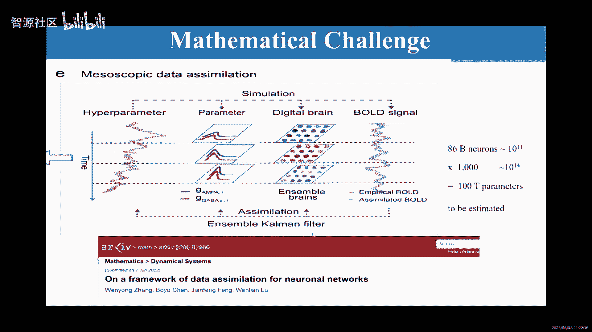

所以这样达到的模拟效果是这样的，目前来说呢，我们现在的我的did to break，我的脑子，现在相似度呢其实达到了93%，也就是说，现在呢我有10万个时间序列在我这里面，是吧是吧。

因为我每个体系都有一个时间序列，包括signal好，我这边呢也从我860随机人上来，我有个10万个那个时间序列，这两个之间的相关系统，时间序列相关系统大概是93%左右，目前来说啊。

当然这个东西是一个啊啊啊，就是一个是一个是一个大脑对吧，就是resting state的，其实我刚才所说的就是我躺在机器里面，什么事都不干的时候，这么一个大脑。

那么我很想把我这个reless state，跟那个环境有相互作用对吧，所以呢我们就做了一件事，就让我的脑子呢让我坦诚地去看一下图片，让我的jj tp呢也去看这个图片对吧，然后我我的老师会给他打个分。

我喜不喜欢这个图片啊，就是ranger from 40到十分，然后我的digital team也可以对这个和图像来rank，大家可以在下面问问我怎么做到这件事啊，在这就是ttm里面。

所以这个可以做一个这个图像的，就是视觉上的问，同时也给做一个精致箱体，当我听到音乐，我会对这段业做大，必须去鼓励这段音乐，我也得做个百分。

所以做了就相当于我们这个recipe resting brain，我们就跟那个房间有相互作用，那么我们可以那个回过头去看看，这两个东西的打分的情况到底是怎么样的哈，就是目前来说呢。

就是我们现在这个大概呃，相关系数最高的大分类，相关区间大概在0。57左右，也就是说我自己打出来的分跟我对着推推补分，打出来分大概在像是在1657，然后这个随便给大家看个例子。

你能看见就是这是我这些推广人的七国的情况，在前面也不是说这是我自己弄的对吧，看哪个图片啊，他成为你的启启动情况，做的还是非常的，这还是非常的满意啊，因为大家想看知道。

这还是一个非常漂亮的一个task对吧，就是对拼拼觉和视频说那个，那么除了做作为一个认知科学，研究的平台之外呢，我们当然这个东西还给出了一些，就是这个医学研究的评价，比如大家都知道这个gb s对吧。

give give credulation，或者用master现在谈的这个prime machine interface，所以我们就可以把这个模型对吧，就是放在里面可以把一个电机插进去对吧。

查到我们就说dbs对凯迪真的治疗，大家知道这个s t m一个电机插进去对吧，那么这个点就这就是原来的，如果有帕金森的对吧，有这个小粉丝说这个震荡股这样东西，因为我有了这个p p s的治疗，这个刺激之后。

你看到啊，如果我的刺激大于100Hz对吧，这个就是这个是是这个就是加了治疗，加了加了普通的赫兹啊，这个就是我这个一个电极插在里面，这个电机差不多的刺激的频率之后，你能看见高于百分之呢。

它这个set的频段你基本就得是pel，就是那个不算那个那个10号和制作的这个频段，那就看最后是的，他就是呃，如果disappear就是最好是fit，我们的那dbs的资料在帕金森，那么资料的情况，这个是。

当然我们可以把这个模型可以，插到我们这个大脑里面，有这个dj去平台里面，如果我把它插到对吧，作为一个就像我们这个做做slice对吧，就把它切出来的话，大家能看见这个整个的行为包包，这个放在这个大环境里。

就可以说是具有非常不同的行为，这可能也说明就是我们这个东西可以做一个，啊啊啊啊，这个ping这个平台好，这个可以可以用下，另外一方面呢我们也在做抑郁症这方面的工作，我们干脆在欧洲共同体的一个项目里面。

那个我们跟每个4%号，就是那我们就是大家都知道，这是中国greeper ject最后的那个现在去反tx，他们做了一个是burch grain，做个平均场都做了几百年的一个模型好，那我们前辈被告备的。

我们在做这个就是发展这个模型，对这对那个depression，看看我们能不能把做不同的模型来，看看这个pression的资料也好，预测也好，它到底有我们知道一方下注无效，然后跟工业机联机网络现在对你说。

所以这是我们大家目前gtbrain的这个，人脑的这个情况，同时呢我们也在做这个更简单的模式，生物的一些地区的tv，这个我们跟中科院的杜铁林老师在合作啊，我们做这个斑马鱼呃。

大家知道斑马鱼大概有10万个神经元，所以我们这里可以同时测到这个，5万个神经元的他的发放的情况吗，然后我们一直在做这个，这就是用我们前面这道数学方法啊，就在做这个，这就是twin brain的这个。

这个这个和这个sara fish的，这个这个这个这个脑好，目前我们能做的也还是大家有没有一个这个，目前我们大概做的在斑马鱼上，大概说来请做一下这些小说来assets，他的一些行为的同学。

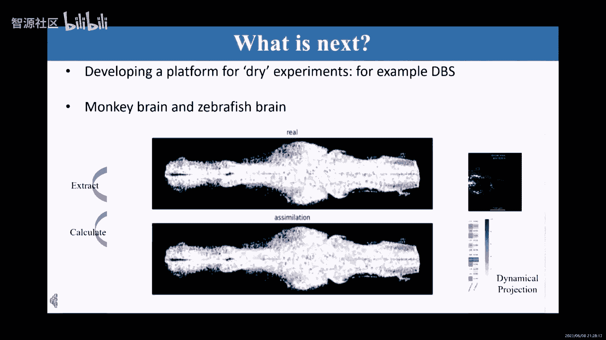

还是文案在写作当中啊，是还是做的很高兴的问题是。

所以我可能也就是说我们目前来说呢，我们在计算机算实习呢，实现了，在用很大的这个计算机，给大家做了一个dj的dma啊，我们跟我们河南大学中国经济院士也在做，我们也在做一些hardwide umt。

也有那个那个3d的那个机构也正在推进当中，就是做地铁的tbrain，hello啊，对对对，那个那个那个可能大家大家会问我哈，就是说啊我做这个做这个dj的tbrain的话，最后的目标对吧，就是我们丹麦当。

或者说你从这个追求最新博人这些年，或者其实我在做这个模型，做了多年，可能最本质的区别是什么，其实我自己的最大的感受就是这个人脑子，还是就是说大家能看见这个每个spike，非常随机的一个东西。

也就是说你怎么样来实现这种随机的计算啊，这个是我们目前一直在探索的一个问题啊，利用我们的用我们现在的平台，我们做一些，一方面的工作啊，这个时间管理的细节干，反正有兴趣可以选在在现场中，各各工。

你想发展一套概率计算的语言哈，怎么来实现这个啊，我们这个神经元的这个计算哈，大计算，然嗯所以目前来说呢，大家这是我们稍微总结的话，就是模型方面好，我们这个spinnake，我们的同事啊。

这是steam混合做了20年啊，这个c9 spike那台机器好，他们在做第二个版本，现在应该清洁会出来啊，这个然后的话就是dirty brain，那个figure的角色，他们在发展啊。

然后再做digittbreak呃，现在可能对这个全网的模拟了，必须在脑的模拟，我们呃呃做到这个就是我们大概是第一个，真正在神经元方面啊，真的实现了这个810亿神经元的模拟，总体来说我们在我就像我前面说。

我们在申请高中不要讲啊，这是卡尔弗森给我们写的一个推荐信啊，就是看见他，他还是就是觉得我们喜欢在世界上第一次啊，这个实现了这861次能源的模拟，而且在可能还有一点就是linic的应用的很好的。

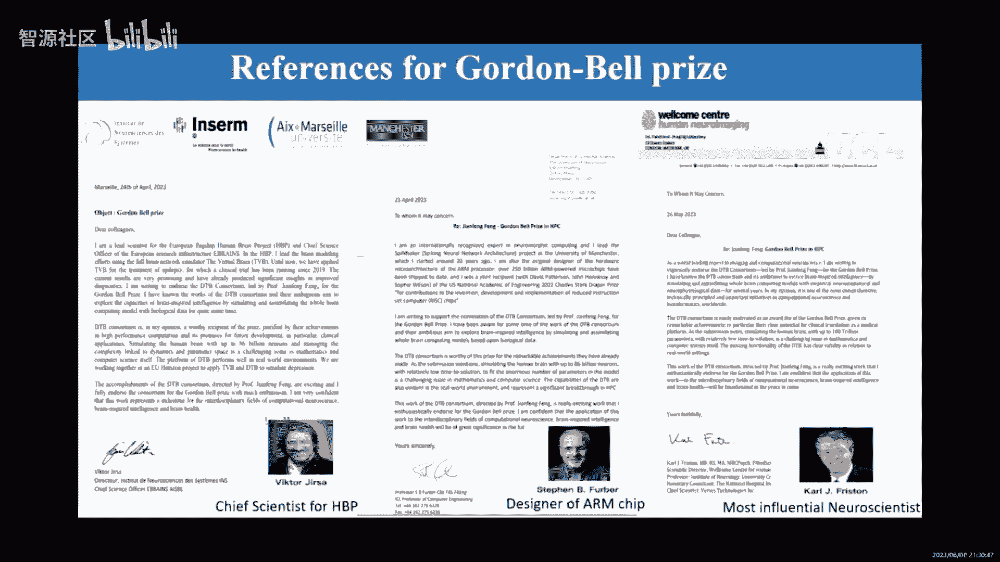

应用，前景灯的好处就是这最后他实在少，我想我这个这是我们的团队的一个梦想，大家知道冯诺伊曼对吧，这个最后的我们满计算机也好对吧，今天是这个语音的编码，但是确定性的编码，显然我想这个人脑跟这种计算机。

有很大的区别啊，从我的数据来说，从我的认识来说，我想就是说是一个概率的计算，那么怎么样来真正实现这个概率的计算啊，这也许是同学们最后这本书对吧，就是不用写完的地方。

也许我我很希望我们的这个队里面的一些人，能够把这本书在家写翻几页对吧，就这样怎么来实现这个概念的，基本的跟篮网会相近的这种计算的方式吧，嗯谢谢大家，我就讲到这儿啊，冯建峰教授给我们带来了很精彩的。

关于那个他的那个电脑计算。

这个研究所的一些工作的汇报啊，这个特别是最后也提到了，就是说这个大脑的那个计算的机制这个问题，那么接下来呢我们可能有呃，呃半个小时左右的时间，就是呃我们很高兴地在请到的，就是说吴氏教授。

他是北京大学认知与心理学院教授，现在是认知心理学院院长啊，舞狮也是长期在做那个神经计算的那个领域，那么我们还请到一位呃，请到一位嘉宾是临时的，这个是呃师教授来来推荐过来的，那个是不是呃。

你自己介绍一下吗，啊啊你来你来你来这，高兴有这个机会跟大家交流，我是我叫陈国璋呃，我是原来是攻澳大利亚悉尼大学，工普林老师的博士生，然后我现在在沃夫冈mars。

也就是当时那个呃提出spiking neural network，是第三代神经网络的那个呃，科学家的组里，现做博士后啊，其次有机会回来跟大家交流，主要起一个是抛砖引玉的一个作用，谢谢大家，好谢谢陈国师。

所以说是今天呢就是我们讨论那个呃题目呢，就是说呃一方面可以，就是说像呃刚才我们有三个报告对吧，他主要是呃讲就是大脑的这个，这个揭示了大脑的呃，这个所要达到他的认知功能所需要。

这个背后所需要实现的这种计算，那么这里面这个问题但本身但是也很广的嘛，那么我们就想呃聚焦一下，聚焦一下的话，那就是主要是现在想讨论一下，就跟在座各位也探讨一下，包括就听一下在座各位的那个看法。

就是指就是说呃因为是这么一个关系，就是大脑的话，当然是生物的神经，生物的这个作为一个硬件的一个一个，而支撑人类智能的人类智能这个硬件系统，那么现在呢有很多像做人工智能啊什么，事实上是在做这个算法。

或者是软件做的上面运行的，这种这个一个信息层面就设置，现在有一个信息层面和物理层面，这个相交接的这么一个问题，就是说这个从呃通信学的角度来讲的话，就是说你是一个信息，从信息学，通信学角度来讲的话。

就是说他任何一个呃一个信息系统的话，他总有物理的一个系统在支撑着它，那么这个这个界面，现在我们在讨论这个新物理性层面和信息层面，这个界面这到底怎么一回事，情，就到底在什么地方，那么从信息论上面来讲呢。

因为这个问题是还是呃从经典来说，相应的信息理论也讲的是很清楚的，而且很漂亮，而且我们现在的话是按照那个相应的，信息理论的指引，才产生了我们现代社会的这种信息化社会对吧，那么从从而利脑计算这个角度来讲。

当然我们是要想知道就是人脑的这个呃，讲到底也是个信息处理的过程，那么这个信息处理这个过程，到底跟我们工程上运用的非常成功的，那个信息学里面讲的那个信息处理，到底是什么样的一种关系。

到底是就是说他这个他这个交界在什么地方，那么这个是我们希望能够这次就是在现在，接下去差不多就是半个小时讨论，能够能够能够能够阐述的这么一个，能够叫他交流的这么一个题目啊，就是说呃讲的再直白一点的话。

在神经科学里面是有个最根本最根本的问题，就是一个神经的编码问题，就是编码在流浪都coding这个问，就是说从信息论角度来讲的话，你一定要有一个硬件的话，他就要有一个编码，就才能够产生最基本的信息单元。

比如说是个bit，那么从变才能产生一个阿尔法贝塔，是一个由字母有字母以后，你才能产生那个单词，才能产生词组成的句子对吧，那总要有个最最开始的那个部分，最开始的那个部分，那么在神经元来这个神经计算来讲呢。

呃很遗憾的是，这个问题至今还没有解决，我觉得病就是这个应该还是一个大家，神经科学家可能公认一个事情，尽管我们对大脑了解已经相当多了，但是说你说真的，你要把那个从信息论这个角度能够阐述的，非常清楚。

那个编码的这个机制到底是什么，神经的编码机制到底是什么，对吧，那么我们现在所知道的就是说呃，神经这个圆的那个就是放电就是很清楚的，我我这个我修一张我的slide就好了，就我第一张那个sli修。

可以把我那个就讲那个building block of neural computation，这这我我就先把它就是对对，就说就说这个从曾经那个计算来讲的话。

你在那个神经元的那个层次上那个了解，就是神经的放电机制那个已经很清楚了，那个就是说他的那个他的那个生理的机制的话，就是像呃离子那个通道，一些离子的输运，就是说所引起的呃电位的这个改变，这个都是很清楚。

而且描述他的数学模型也是非常清楚的，那么从呃这个具体的那个突出，那个就snptic这个level的话，他这个具体的那个snp transmission，它这个模型从呃计算上面来讲，也已经相当清楚了。

也就从他的怎么来呃，implement它是关于那个处处改变的这么一种呃。

这个过程也是很清楚，那当然是在那个神经网络这个角度来讲，神经元网络或者是neural network，或者这个角度来讲的话，当然有人工神经网络的话，那也是对他的模拟，对一些基本的性质大家都有所了解。

还特别那么，那么现在的问题就是说，整个在这个你已经知道这些事实的基础上，当然我们现在也有一些关于大脑的一些整体的，就是包括影像的，包括影像学的，包括其他一些技术手段所获得的信息，那么从这里面来讲。

就是怎么能够就是提炼出，就是我们一个这个生物学的基本问题，而且神经生物学的基本问题，就是神经元的编码问题，到底怎么编码的好吧，我们学希望能够这个呃就是我们有呃，上面台上有两位。

再加上我来作为一个主主持人，我们在啊协调这个这个问题，也希望能够听到在座的各位对这个问题的看法，就这个是希望能我们的圆桌那个讨论，就开成这样的一个形式，就听听在座的各位可能来自各个领域。

而且各个学术的背景对这个问题是怎么来看的，就是说我们假如真正的最后实现了，就是把人的那个大脑能够看成是个信息，信息处理一个这样一台机器的话，那么他那个编码是什么，怎么完成的，它是怎么来实现的，好吧。

那我们先请吴师教授来，要么来这个呃，谈一下这个问题，因为他对这个问题也是有多年的研究，而且做了非常非常好的工作，对啊就是这样的，就说我自己是物理背景哦，嗯相当于有个30年前。

30年前一般学物理的刚进入这个领域，呃，都会觉得哎呀我要搞清楚大脑工作，我首先要搞清楚这个神经编码是什么，什么工作的呃，但是实际上到目前为止就非常非常的失望，现在这个就相当于我们说我们研究大脑的功能。

我们连一个最基本的问题，这个信息怎么被编码，我都没搞清楚啊，就说从可能大家觉得会很简单是吧，如果你不熟悉老科学，你会觉得很简单诶，如果我就好像我要搞清楚啊，一个比一个嗯，一个简单的通讯系统怎么工作的。

让我给您一个输入，然后测的输出我就不断地变化我的输入和输出，我就把这个一对一对的关系给找到，找到我就能分析出来他大概是什么编码的，但神经系统特别特别的奇怪，就说如果你即便是给我同样的一个输入。

那么你每次记录的那个神经元的反应呢，都是杂乱的，特别杂乱，特别不清楚啊，所以说啊为了解释这个现象，大家提出了一个非常著名的新兴奋，抑制平衡网络，它能解释这个现象啊。

但是这样一种编码机制它到底为什么这样呃，一直现在也也不清楚，有些猜测就是说我们大脑处理信息的时候，给我们现在比如说深度学习网络也好，还有我们呃电脑也好，非常的不同，是我们不是一个确定性的系统。

我记我在人，我在看一个东西的时候，我都是在做一个概率的计算，我我不仅要识别，比如这个图像是牛和马，我心里头还有一个哦，它像是牛或饲马的概率有多少，就说我们在生活这个世界中吧，我们总是在处理一种一种。

就是说不确定性的信息，说现在一个猜测就是说我们就是这种随机性，这个杂乱性它是为了帮助我们大脑，就是做一些我们生活中体验到的随机计算，那么做随机计算的话，一种一种一种如果用数学框架。

就是说你要做贝叶斯推理，你要算这个概率的posteria啊，后验概率，那么这就涉及到大眼大脑怎么表现这个表征，这个后验概率呢，啊现在目前有个理论我比较喜欢的，就是说啊我们大脑在做随机计算。

我们在估计一个一个输入的一个随机啊，一个后验概率，这个后验概率呢你数学上写起来很简单，是什么一个一个一个概率的形式，但是你大脑怎么去表达这个后验概率呢，啊一种说法就是我们大脑这个随机性呢。

实际上是在一种后验概率的空间中随机的采样，由于它在随机采样，所以说你会导致你在实验上看到的那个呃，你的这个程序员的红特别特别杂乱啊，所以说这个可能是呃大佬编码的一个一个特点。

但是最近呢大家也在思考一个问题，就是说嗯是不是我们在你在这么多年来，我们做实验的好，做理论的好，我们在回答这个问题，我们的fans说出错了，因为我嗯做实验基本上这样一个路数。

比如说我又不管是猴子老鼠也好，我就给他一个有朝向的一个一个，比如说一个刺激是吧，30度40度，然后我们看这个神经元怎么活动，然后我们分析诶这个神经元它是怎么表吗，30度和40度的是吧，但是对于动物来说。

包括我们人来说，这个角度参数数它是个抽象的数学概念，我们看到就是一个就是一个光的刺激，他并没有这样一个抽象的概念，所以说我们搞，其实我们从理论上，我们说不清楚大脑到底在是不是真的在编码，这个30度。

40度，而传统的这么多年来以来，就是说大家都是按照这个路数啊，我实际上我给它不同的朝向的刺激，来我分析实践的活动，看10年的活动怎么和这个角度关联在一起，那我推断大了什么编码的。

就说可能这种路数本身也是错的，所以说现在这个呃，神经编码算是一个没有解决的问题，嗯还是比较非常非常复杂吧，我先说到这吧，后面可能现在在这，谢谢吴教授，先给这个开开了个非常好的头。

就是特别是提到了关于那个概率这个编码，这个事情，我们待会可能会展开再讨论，再再展开下去，那我们请陈博士来也再谈谈这个问题，因为我知道我这个，但他虽然不认识陈默，但我知wolf gm。

对这个问题是有很长时间的考虑和研究，我我也是抛砖引玉吧，谈一谈我个人浅显的一点看法，就是我是也是物理出身的，就是说大家在高中的时候，就学过那个理想气体方程吗，就是我们现在是相当就知道了两个。

比如说气体分子碰撞的时候，还有一些基本的效应，但是我们还不知道这个微观的过程，怎么样达到一个宏观的一个效果，达到一个population coding这么一个效果，我觉得这个我个人上本质上来说。

就是说呃这个问题，可能是我们没有找到一个好的数学工具，来探索这个问题，比如说在物理里面我们有很多很好的对称性，刚才的那个报告上，因为教授也讲了，有空间对称性，有时间对称性与纯对称性，各种各样的对称性。

但我们大脑的对称性呢，就是现在基本上呃没有在一个很合适的定义的，就我们微信方法刻画它的这个对称性，比如说刚才吴思老师也讲了，这个他的大脑有很强的这种变异性，就variability，比如说我同一个动物。

我在现在当当前呢我看到一个呃，同样的物体的时候，我有一个编码，然后过一段时间了，我再看他的那个编码就会全部变了，这个就叫那个response variability，有同样的动物呃，然后同样的激励。

但是我过段时间看起来就完全不一样了，所以就没有这个可能说没有时间对称性，如果说空间对称性的话呢，大脑的这个我神经网络呢，它里面是有各种各样的神经细胞。

它每种神经细胞现在alan bran institute，他们在分析说老鼠的小鼠的vo one呢，大概有200多种神经元，而且还可以无限细分下去，就说它是各项异性非常严重。

他可能也不具有简单的一个空间对称性，所以从这种我们原来从物理学上，一些对称性出发的一些很优美的这个理论呢，说想要用直接用到这个大脑中来的，是问题很多呃，但是我们又没有找到更好的工具。

所以我们现在需要的是，这个相当于是量子力学里的希尔伯特空间，或者说是相对论的微分几何，这么一种好的数学工具去描述，刻画这个大脑的问题啊，吴思老师刚才也提到了一个概率，从贝叶斯这个角度去考虑这个问题。

我也是就是我和马斯他们之前就组里面，之前他们也做了很多，例如sampling啊，哎winner tcl这些这些思路，这些机制去理解，想去理解，但是呢也遇到很多问题，就是说我们领导计算呢做了这么多年。

拿不出一个就是说很能打的这个这个应用，这个跟早上跟吴老师就有些提到这个事情，就是我可能就是我们还没有很好的刻画的，这个呃真正捕捉到准确的，用一种数学语言语言去描述它，这个过程还没有找到。

这个我觉得是一个最最重要的问题，实际上你就是做这个说的有点，可能那个不客气了，就实验上做太多，但但是你没有找到一个很好的理论工具，去描述它，可能到最后还是就是说只能是一个集邮了，就像刚才说的。

可能是在集邮，可没有找出这个理论，但是这个有人我最近我抛砖引玉啊，纯粹就是在抛砖引玉的讲，就是说如果超出概率这个策略测度来讲的话，我最近看了一个书，这个书页的理论叫模糊控制理论。

就是说呃一个嗯大家可能也听过，这个实习是上世纪80年代，90年代提出了一种新的一个数学范式，就是说我找一个测度呢，就像由于我们中国这个太极阴阳一样，呃我有一个物体，它不是非黑即白的，就就概率的话。

如果我是二指的话，那我就有一定概率等于零，约定在概率等于一，但是你本质上还是认为它要么等于零，要么等于一，它不可能同时等于零或同时等于一，但是模糊数学呢它就会有一个就说呃，它既可以等于零。

也可以等于一只，不过看有多大一部分多大一个测度啊，在这个测度上形容这个问题，那就是说我们在neural ensemble，就是说这个神经的这个呃一个美生元产fearing，产生一个pattern的时候。

那么它可能不仅仅是代表一个量，它可能代表好几个量，好几个激励，而它在不同时间上面的时候，他这个测度上还会变发生变化，我就是提出这个思路供大家讨论思考，抛砖引玉，谢谢大家，好好谢谢。

沉默是给我们带来另外一个角度的考虑，就是说那么现在这样就是我们的呃，再进一步就是阐述，就是有关那个就是probably lily coding，或者probably coding。

就predictive oblily，predictive coding这个这个假说的话。

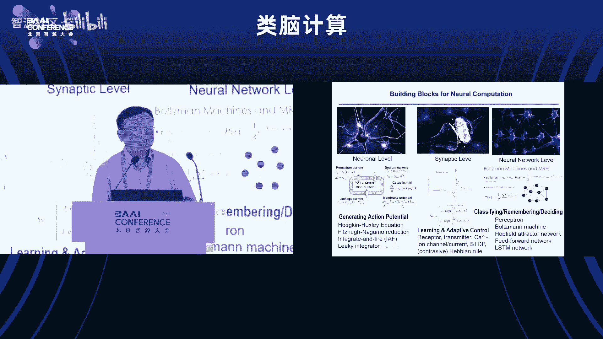

我们看看现在做的就是各位对这个问题，肯定也有不少对于同行对这个问题有所考虑，我们想听一下，就是你们有有没有自己的一个比较一个想法，或者说已经有一个猜测，那么这样的话我们也把它放在桌上，放在桌上以后呢。

我们就进一步在下面呢就可以进行讨论哇，你看一下看一下有没有什么现在有啊，在观众在那个京东系上呢，有有有没有什么同行，就对这个问题，觉得自己希望分享一下他的观点的，我们来看一下。

对你你先报一下你的名字和你的单位好吧，谢谢啊，大家好，我叫，刚买了两，关于这个问题，刚才两位老师也讨论了，我觉得有几个点是非常好的，就是一个是这位老师说的这个嗯，大脑后后面采样的这个过程它是变的。

那这个呢跟今天那个g p t的模型，它在预训练过程中，他去采样这个先验概率的时候是类似的，就你不同的体式，它会拿到不同的信息回来，然后参与后面的对贝叶斯概率的推算，所以这个是相近的。

但是从物理的角度来看啊，就物理上还有一个非常著名的实验，叫双份干涉实验，这个双缝干涉实验呢，其实跟今天transformer里头的tension，结构是非常相似的。

就tension结构里头有q k v3 个变量，三个啊三个量，然后两个变量q和k，然后v是这个真实的结果，就是value，然后呢q呢其实类比于我们可以类比一下，就是说充分干涉实验过程中。

那个电子一个一个去打那个双份，然后k呢就是那个双份，也就是一种度量，因为k是要去在那个做，做那个做tention计算的时候，他要开它的那个维度的那个标度，除掉它标度，所以呃从我看的角度。

就是说本身这个attention呢，其实它就是一个呃，类似于在做这个双门干涉实验，q就是不断进来的序列，然后这个呃k呢就是栅格什么样的栅格，然后v是最终的结果，就是呃可能是一个正态分布的波形什么的啊。

正态分布的这种电子的这种啊概率啊，那那个soft max呢相当于是一个观察者，只要有这个观察者，这个概率就会被投射出来，好现在就是说你的观点，还是说你通过这个现在那个现在已有的。

像那个transformer的这种architecture，他就是说它所能够刻画的东西，就是说事实上就相当于是一个是一个promistic，那个coding的这个id。

但这propertic这个刚才那个陈博士讲了，用用那个fuz，我举头都放在高点，至少你可以更fc一点，就用那个就量子的计算的话，那那就更更是对吧，因为你可以有中心态的，就是g0 u一的对吧。

所以这个是那么就是说哎对你除了这一点的话，你就是说我再看一下其他的这个你有没有讲完，或者是否能够用半分钟，半分钟把它把你的观点讲一下，然后我们在的观点就是说因为离散事件。

你的信息压缩过程是要有采样的过程，因为我们的信息都是离散进来的嘛，那这个高效的采样呢就是attention这样的机制，它啊这个数学公式里头所代表的这种采样的方，式，概率化的方式，它是可以拿到这个效果的。

就那那就说像那个像那个spin coding，就像那个稀疏稀疏，那个就是说那个表征的话，它本质上的话，因为从大脑那个这个他神经元的传播的话，他因为从他是他要有那个spiking这个spike的话。

不仅仅是起了个生物上能够传递长距离，这么这么一件事情，同时他也是一个一个稀疏的一个，一个表征的一个过程，这样的话的话，你就是说通过sparking这个东西有稀疏表征，然后呢。

就是说3号这里面就出产生了一个sparse，code的对话，就是这个意思，那么那个问题就是说在做那个信息信息论的，这个同行们，就是说这种稀疏表征的话，稀疏表征好像在那个信息论里面也有烟酒对吧。

但是好像信息论的主要的方向，我理解的话是都是在用，想尽办法创造或者制造信息系统，能够达到那个相应的线，就是说能够达到西安能锁给的那个，就是说他的那个原原，就是就是信源信道编码这个达到这个线。

所以他们追求的目标是追求这个线，到在这个追求线过程中间，这个追追求这个极限的过程中间，在他有没有这个稀疏的这个想法在里面用进去，或者有的话，那是哪一种马，是是这样的呃。

其实计算机里头你可以理解全都是离散的，他他他离散，因为他开始就是离散的，所以呢这跟吸收这个概念还是不一样，因为就是说你现在在呃做信息方面的话，你是追求这种最新的，像什么什么破勒马什么东西这种东西的话。

就是因为他开始就是离散，所以他没有一个采样这个问题没有对时间轴，没有一个采样的问题对吧，那么神经系统，假如说对时间轴是有采样问题的话，那么就是说他这个采样，而且也表表能保持这个它那个吸收性，吸收性。

当然从吸收呃，这个这个学习从吸收算法上面来讲的话，有很多好处的了对吧，那么现在从但从编码学上面来讲，这个事情是不是给给或者可考虑过，或者是有背后有什么样的理论，大家要知道的话，就是说这个可能是一个方向。

这个后面就是说我直观的一个想法，就是说最后面一个理论就是说嗯，两个变量是对立的时候，它是具有不确定性的哦，就是你要想就是说像量子里面的确定性质，这个原因不好用，这个原理的话。

就是可以沟通离散和连续这个空间，好的好的，谢谢，就是说你是有不确定的原理在里面起的作用，只能够好好非常好，谢谢好，我们自己前面有位老师，也可以介绍一下他的观点，哎您好，我是延安大学的老师，我叫任秀红啊。

是这样子的，我是从这个文科这方面逐渐研究到脑科，学的是经济学，金融学，然后后来想到要了解清楚这个要了解人的，要了解人，了解清楚人需要了解清楚人的心理，要了解清楚人的心理呢，那要了解人的大脑。

所以就这样研究到了脑科学啊，这是我简单的一个思路，这个过程，然后这个呢也有一些就是支持，因为就是有个国外科院士哦，当时我请教过他，说是学文科的，能不能研究脑科，看书可以聚焦一下，就是的我马上就会谈到。

我马上就会谈到，因为他这个这句话呢，我也不清楚现在怎么能够改变人的大脑结构，然后我现在要说到吴思教授刚才说的这个，你说30度和40度哦，好像这只是我们一个概念，那么小鼠呀等等。

他怎么能够能够就是说区分它哦，但实际上这个30度和40度呢，它是有一个行的，它这个行呢还有我们这个人类的语言，说这30度和40度小鼠它没有语言嗯，不能说他没有语言，他有他自己的语言，但是他大脑里边的话。

它没有文字，他应该是没有文字的，那我们就看就是那个上边的那个图，他应该是这个就是人的那个就呃，就是这个脑的这个神经元结构，它发生了一定的变化，比如说这个好不好，你说你这观点主要是对不起。

打断你的话是你不要打断我，我马上就讲完，对你不要着急，我马上就讲完，马上就讲完，这个就是我知道你是主持人，然后你不是想要好的观点吗，就上边的这个神经元结构大家都能看到哦。

就比如说这30度和40度这一边是形的结构，这一边是概念的结构，它发生了哪些变化，它应该是有一定的变化的，它这个结构呢就是他的神经元的编码，我想讲的就是这个是跟语言有关对吧。

你是指这个观点不仅仅是和语言跟概念有关，跟概念有关，不仅仅是和概念有关，和概念也有关系，和这个行和其他的没有关系，希望有一个神经科学的概念，对不起啊，这是我的，这个是我现在讲完了，谢谢老师来讲，没错哦。

是这样，我想请教一下，因为我的背景呢，我是中科院微电子研究所的，我叫上德龙，那个我是因为是这样，就是深度学习呢是由gpu为支持的对吧，那么sn就是脉冲神经网络呢，它的硬件支持呢据我所知。

从国外的角度呢要比尼克brain scale等等等，包括国内的天玑达尔文，那么从我们这个脉冲神经网络的角度，我们这个硬件系统该怎么去做清两位专家啊，给comments好啊。

这个还是回到那个就是我们这个神经这个编码，这个希望能够从应用，从工程上面来讲，是怎么能够就是获得一些有用的这个启发，或者支持，对吧，就是说能够设计这样的系统，那么这个问题。

但是我们做类脑计算的是必须要啊，或者是说近单应该是要考虑往这方面，就是希望能够给工程师提供一些有用的，或者是我们看到一个而能够实现的，这么一种从计算计算的方案对吧，这个是一个是也是在考虑的。

那么就是可以那个巫师来再阐述一下，就是关于从那个property，这个这个the brain这个角度来看的话，就有一些呃计算的方案，或者是包括有些基于物理的，像那个creative model啊。

像这些类型的这个这个计算方案，是不是可以介绍给这边的同事对，呃我我觉得是这样的，就是说呃你除非电子锁是吧，对就是说现在有这个问题啊，一方面呢就是比如说大脑是吧，极其极其的复杂。

然后另一方然后呢就是人工神经网络，现在这个呃a n n啊，有时候也是相对简单的，就说啊，然后中间有s n，就是说嗯你要是从脑科学的那个借鉴的话，我觉得都是一个都是一个康，就是一个折中的一个方案。

就说你你可能就希望有硬件，我知道呀，我也跟硬件的合作，硬件做起来特别特别难是吧，所以硬件现在做的s呢有些是leaf model啊，然后呢可能你能上规模，然后如果你是要抓住一些生物系啊，系统一些特点的话。

比如说有什么那个易阻器，那么现在是单个利润还可以，一上规模也不行了，所以说我觉得硬件的问题可能比那个嗯，就是说比软件更难，软件嘛，反正我就写个那个深度学习，深度深度学习网络，或者因为我们课题组做的。

我写个神经动力学的模型，那么我们用电脑去跑，但是呢如果你们是涉及到硬件的话，很多那个生物学系必须丢掉啊，所以说大家现做的sn全都都非常简单化的嗯，这个可能跟您的想法有点差异。

比如说spike它是一个完全这个应该叫做通用吧，或可编程的吧，它可以支持多种这个处神经元模型，而且它的规模已经上到10亿，就相当10亿神经元，这个相当于是一个濒临的这么一个synapse。

这么一个国一个规模，其实跟刚才冯老师讲的，他是86个ben对吧，就861个神经元，当然还没达到那个规模，但是应该说对于某个脑区的描述，这个仿真还是可以呃，能做得到的，现在问题就是说这个工作该怎么往下走。

其实我挺同意刚才这个陈博士说，这个咱们sn的应用啊，没有杀手应用，没有对吧，没有杀手应用，这这这种就说不知道这个从sn的角度，怎么来去支撑硬件，我不是说一组去的，我是我是做神经内科的，我要提问题。

就说像你这次从关键硬件角度来讲的话，就是你的能耗怎么样，你这个很好的选限制，因为大脑的话是他的工作效率很高，就是说它使用的能耗是很低的，声音没错，所以说实际上斯蒂内克就是说，从类脑子本身来讲。

nemokey computing的小替身来讲，他是说从计算机的角度去做去做高性能计算机，是因为只是借鉴了人脑10~20瓦的功耗，这个条件，这种这种基础来去做的，高性能计算机，从这个角度开展起来的。

所以它能耗是四次还是蛮低，但是但是因为限制于现在的半导体工艺，还达不到人脑这种量级，这背后有没有这个项目，类似像香农这个信息论的这个理论的这种导，或者或者是那个支撑，因为相信球，因为实在太漂亮了。

就是说因为他那个关于那个信道编码，信源编码，信道编码，而且那个对偶性一来，然后就是极限的和那个capacity和redistortion，这样一来的话哦，你这个工程师们完全就把这个这个。

这个问题完全解决了，就是说这样的话，你现在的话对吧，已经做到极极致了，已经没有办法比他更上一步了，那么更进一步的主持人，那个我是来自冯建峰团队的于老师，对对对，我简单回答刚才这个一个一个一个提问。

类脑计算的一个提问，这是刚才讲的，就是我们现在是模拟了860亿神经元，就是整个大，就是大脑的完整的一个这样的一个大脑，那么刚才讲要模拟这个大脑呢，其实是非常的不容易，我们最近的就是4月份模拟的模拟的。

第三次用了14000张gpu，所以这个功耗是极大极大的，那么他现在这个模拟这个东西，关键是难处在什么地方呢，一个是计算量大，因为我们一个神经元啊，像该全球模型的话，一般要用四个微分方程来描述。

那么现在我们用内存模型的，用两个微分方程来模拟，第二个呢很重要的是什么呢，因为和我们现在人工神经元网络不一样的话，这个类脑计算的就是那个s n的话呢，大脑的这样的一个结构。

它是一个超大规模的一个稀疏矩阵，都为系数矩阵，它不能像这个人工神经网络，用这种卷积的这种啊用举而规整的矩阵，所以呢他系数矩阵他就要去，每个每个矩阵要计算的时候，找到他的那个节点。

他要去读读取他的那个地址，所以他这个方程是非常的有存储的，这个访问是非常的巨大的，第三个通信的量比较大，非常非常的巨大，大家在在座的观众可能就没有概念，你们都身处在这个北京，我可以打一个比喻。

现在我们在座每个人，大脑里面发放了18g的量，先是北京的整个宽带互联网，传送的信息量的十倍还要多，因为前面我们冯老师讲呃，大脑里有100万亿个突出，每一个突出基本上是每秒钟要发放十次左右。

所以他就相当于是哎1000万亿的这样的一个，脉冲的一个量，他还要做一个一个编码，所以这个难度这么大怎么办呢，实际上最大的一个问题就是简单的来讲，按照现在gpu的角度来讲，我们是冯诺依曼结构。

gpu已经打破了一定程度，打破了冯罗伊曼结构，但是还是传统的冯诺依曼结构，所以呢就是要能使得我们内脑计算的这个，超大系数矩阵的计算，符合这个这样的要求的话呢，他就必须要有走非冯诺依曼结构的。

一个计算机系，当然第二个更进一步的这个变革，就是刚才这个台上的嘉宾，这个刚才说的就不能用我们确定性的计算，确定性的计算是消耗能量是巨大的，要用一种啊这概率计算的不确定性的这种计算，像神经元的这样计算。

才能使得它的这个呃他的这个效率会大大提高，这就是我们现在这个模模拟了860亿，就是每一个神经元和1000个神经元相连接，有100万亿的，现在这样的话呢，我们现在在全世界做的是最大的，这样的一个规模。

这个是我们的一个一个一个一个体会，这个主持人我先回答，就是刚才讲的这这位这个观众提的，当然前面呃呃我刚才听了，就是对于神经元的一个编码表达，有时间的话我们也可以来讨论一下。

因为我们对做这个东西还是比较有一些体会啊，非常好非常好，非常感谢，就是说我今天这个就是我们组织那个呃，这个rpve的话，这主要的这个想法也是作为抛砖引玉，能够把这个问题就是放在桌面上。

就是就是现在那个类脑计算的话，真正的它这个瓶颈问题，或者他是是要需要突破的，这个最最基本的科学问题是什么，对吧，我们把它放在那个桌面上，那么刚才听到这个讨论也好，从这个呃这个呃互动的环节来好来讲的话。

就是似乎是有一个就是汇聚这一个观点，就是说这个就是那个随机这个计算，就是publicity那个那个这个这个计算这个重要性，当然这个重要性事实上也是从吸收这个学习中，吸收表征来讲的话是个好事情。

因为他需要这种有那个random的，这个这个结构在里面，那么所以呢就这几件事情，可能都是都是在一起的，那么就是需要的是能够再建立一套，就像那个香农信息论这样的一个东西，能够把它能够。

就是在香港信息论基础上有个推广，能够是概括像人脑这样的这种计算的那个本质，当然也有可能是在那个从在floyment，这个计算架构上面的一个推广，现在还不是很确定到底是什么，什么样能怎么样一个推广。

是能够实现这样的一个计算的，那个那个那个宏伟的目标，那今天因为时间关系啊，已经超过很长时间了，就是要要不要那个不是你在你有呃，说一句那个概括性的把这个总结一下，我们今天就暂时到这个告一个段落。

就是说啊对ok那就说实际，说句实话哦，啊我一直在做脑科学，做类脑计算啊，但是这段时间的chat就把我给整懵了啊，这不是我想要的样子，因为我在我想象中，我以为就是说呃，可能我跟张张俊稍微有点观点不同啊。

在我过去的设想中，是我要把大脑的那个比如说编码啊，还有具体功能一步步搞清楚，然后再构造一个大佬整的工作，但是切的g p t，他直接就来一些暴力的大数据和大模型呃，他就涌现出一些我们认为很自然的事情。

所以说我现在就觉得说句实话，可能啊对我自己做老科学所计算神经科学，我在这个年范式上，我跟他做一些呃相应的改变了啊，所以说我干脆去做个广告吧，明天上午我们有一个认知，生经科学和大模型的讨论呃。

如果大家还有兴趣的话，也可以参加明天上午这个讨论，而是由刘家那个主持的一个好，谢谢对对对，这个也是刚刚这个我很高兴啊，那个武士，还有陈博士能够跟我们分享他们那个观点，那么这个只是作为呃。

以后进行这个同同样呃题目这个讨论的第一次，我们应该是作为对吧，我们希望能够有机会的话，能够在这样的深入探讨，因为我跟呃无跟无视教授的话，也是很长时间一直在考虑这个问题，刚刚吴师说呃。

你被那个chibt所所震撼了，我也是被chibt震撼了，这真的是没有想到，他那个解决自身的方案，是这样的一个出现了对吧，所以我们大家都都会有一个要重新一个思考。

那么正在使得那个现在这个coding这个问题，就更放上那个台面了，因为coding on chip的话，你是他进来的话，他就是已经是已经是有那个symbolic，这个这个这个女神经就进来了。

对神经元来讲的话，到底这个是个什么东西，所以我们就是好像这个题的，更迫切的这么一个层面上需要解决这个事情，那么呃希望就是会后的话，大家也可以跟我跟吴思老师，跟这个跟那个陈博士联系，我们就是看看。

就是说大家在这个方面有什么新的体会，或者有什么好的文章，可以大家一起来阅读和讨论，我最近本来在研究一些，就是有一个机有一个架构就叫那个free energy model。

就就靠freeen的那个free energy model，就是我的，我好像有一点体会，就觉得他这个模型的话也是，事实上是可以有这个提供了一个方案，就是能够把神经语言的那个计算，在信息层面和在物理层面。

能够似乎可以有一些呃结合的这个可能性，当然这里面这个还没有在呃，他的那个基于它所产生的信息论对吧，这个是我们所追求的目标好吧，那就希望能够今后有机会跟大家进一步讨论好，谢谢大家。

