# 自动驾驶论坛 - P1 - 智源社区 - BV1Xh411T72U

尊敬的黄院长，各位演讲嘉宾、论坛现场和现场的各位专家、同行和媒体朋友们，大家下午好。我是工信部装备中心的刘法旺，感谢组委会的邀请。今天的这个自动驾驶论坛呢由我来主持。首先请允许我代表组委会。

感谢大家百忙之中，抽出时间前来参加2023北京资源大会自动驾驶论坛。大家可能都有感受，就大家都要讲智能网联汽车是全球汽车产业转型升级的这个战略方向。最近两三年，因为我们这个工作的关系。

我们参加汽车行业的很多的会和论坛，感觉上如果说你不讨论智能网联汽车或自动驾驶。这个论坛就感觉上没太赶上这个科技前沿。与此同时呢，由于这个cheGPT的横空出世。

还有咱们这两年有一些这个大模型产品的一些优异的性能表现。因为我本身我学的是人工智能，我也关注了一些论坛，感觉到在这个计算机行业。尤其是这个人工智能领域的这些会议和论坛上。

如果大家这个会议上不涉及到大模型，好像这个会也没太跟上这个时代潮流。所以这次咱们这个在呃资援大会，在这上面呢，专门设置一个自动驾驶论坛，让我来牵头研究怎么办。这个论坛，我还颇是费了一番脑筋。

这个我想我为了能够跟我们整个资源大会的这个战略性、前瞻性能够相匹配。所以我们这次会呢特意选择这个大模型在自动驾自动驾驶领域的应用探索，把这个作为我们的主题。

特别邀请的我们在这个8位自动驾驶人工智能领域的知名专家来参与研讨。我们今天邀请的专家呢多数是来自于产业界。这个大家主要是做产品的前瞻研发。所以我们想呢这个论坛，我们重点强化应用需求牵引和问题导向。

重点围绕人工智能大模型技术在自动驾驶的产品研发安全测试等方面的这个创新探索，开展这个深入探讨，也借助各位专家呢对于未来的发展提出意见和建议，也希望以此为契机。

能够对各位参会专家和同行的这个研究工作有所帮助。今天这个会呢，我们邀请的8位演讲嘉宾。因为时间的关系，我想等我介绍完了之后，大家在一并鼓掌欢迎，他们是中国一汽研发总院首席刘斌先生。来家早晨抑制不住啊嗯。

陶墨之行联合创始人兼CEO顾维浩博士。北京赛目科技杨强副总经理。北京理工大学季伟新教授。华为fo智能汽车解决方案BU政策与标准专利部部长万雷博士。比亚迪规划院院长助理，电子集成部总监韩冰先生。

未来自动驾驶首席数据科学家张义飞先生。文远之星，北京研发中心王志谦总经理。还大家对你们的这个到来还是这个持高度欢迎的态度。我本来说一块儿鼓掌，结果大家分别给你们鼓掌了啊。

今天的论坛呢受到了我们北京自源研院院长，本届大会的程序主席，也是我们北京大学教授黄铁军教授的高度关注。大家都知道，黄教授是我国人工智能和大模型领域的顶级专家。这个高度关注大模型在自动驾驶领域的应用。

并指导组织了大量的研究工作。我想在正式报告之前，我们还是有请黄教授做一个简短的致辞，并对论坛的召开呢提提要求。大家掌声欢迎。呃，谢谢刘主任的这个组织这个会，也感谢这个咱们各位专家啊到志愿大会来做报告啊。

咱们这样的一个刚才像刘主任说的呃，自动驾驶和大模型这样的一个热点，两个热点呃这个交织在一起会发生碰撞出什么新的这个火花呃，我不是致辞啊，我就给我这么一个机会，我就稍微花几分钟时间谈一下看法。呃。

希望呢能够这个抛砖引玉。呃，对下午的这个讨论呢能够起起到一点这个助推作用。就是大模型这个方向呢，现在热的不得了。这个尽管呢从这个科研角度来说，其实已经有几年的时间。呃，但是引起社会的广泛关注。

应该还是去年11月份车的GPT到特别是今年这个3月份呃GPT4推出之后，呃，经验的语言的这种对话呀生成啊这种效果，让大家。😊，这个人工智能的能力耳目一新。

一下子这个呃原来很多人不信这个通用人工智能不信呃更不信这个AGI的这个可能性。现在可能心态发生了很很大的变化。就是现在已经呃比如咱们正在同时在开的那个安全呃对齐的论坛，就是大家一定开始紧张了。

就是人人工智能呃可能真的要要要要比人类强了，而且不仅仅是在某些方面，在很多方面，甚至于在全面全面超人的就是AGI的话，就是真正的这个通用人工智能呃，所以在这个形式下呢。

其实我们呃也一直在这个呃考虑或者是在研判在讨论。就是在cheGPT这样的一个语言类大模型之后，下一个爆发点是什么的问题，对吧？语言已经这个呃。😊，语言在很多方面啊，我觉得这个包括专家在内。

大家也都认可的，就是语言已经通过了图灵测试。因为这是人工智能的这个当初的一个定的一个呃目标，很多年大家都认很难你很难让让让让测试者人相信一个机器系统像能够像人一样的跟你对话。

现在大家跟这个语言大模型的对话呢，呃，尽管他他不是完美的，他他还有这个这个这个大家可以挑出呃比如说幻觉啊这样的一些问题。呃，但是呢你真要区分是一个人还是机器，现在已经很难去区分了。

所以呢从语言这个这个人工智能角度来说呢，已经完成了一个历史使命，就是通过了图灵测试，类人呃甚至于很多方面其实是超人的啊，就是我们每个人可能有自己的专业方向，换个方向，我们自己写报告，这个解问题。

那可能就就就就不专业了。但是他是通台，他什么都。😊，所有的专业领域都都都可以。那刚才说那有了语言这样的一个突破之后，后面的这个呃下一个这个爆点爆发点是什么？呃。

或者是说这个让我们再产生一次心灵上的冲击的东西是什么？呃？我们认为呢应该就是视觉呃，呃具体来说啊，这个视觉领域的图灵测试就是自动驾驶。😊。

就是那辆车真的是这个在这个我们的城市乡村各种复杂环境下开的比人还要6。那个时候大家就会相信人工智能的视觉和感知能力已经比人强了，对吧？现在还不是，现在我们都还是这个辅助驾驶。😊，呃，离不开人。

人还是这个法律主体。嗯，那从从今天的这样的一个一个一个技术的状态，变成我刚才说的这个汽车能全复杂环境下都能这个呃自动全自动L4L5需要多长时间啊，那以前呢我们会想大家可能每个人每个人不同的回答啊。

就是时间呢可能可能这个我我相信大多数人的心目中是比较长的呃一个一个时间呃，甚至于呢大概两个月之前对吧？有比亚迪的专家，但是我觉得网上大家都看看到了，对？王都是那说了，这东西是扯对吧？不可能的事。

所以这这也是一种答案，对吧？你永远实现不了。呃，但是呢这个嗯这个我个人的看法呢，这东西大概是在1到3年的尺度之内。😊，就会实现。但是呢，因为媒体采访上一次呢有一个记者问，我反正我也是这么说的。

但后来他说我我说是大概几十年之后。😊，这个几十年之后，我我是说过几十年之后，我说几十年之后AGI就实现了这个真正的全面超人的AI就实现了。

不是自动驾驶纯纯无人自动驾驶大概就得1到3年的这种实间尺度内就会这个技术上就可以解决。但是他解决跟就跟GP这种语言对话的能力出现，大家都确认它的能力很强，和大家做成产品在大街上到到处跑。

可能10万块钱能买一个自动驾驶，那那是产业的问题。我说的是技术预测，就是就是技术会翻过这么一个一个一个一个坎他就会这个达到这个这个刚才说人要下车，AI要上车。

因为AI的视觉感知能力比人强是这样一个技术能力，大概在1到3年的这时间尺度。怎么用好这个技术这个这个价格更便宜，怎么用那是产业的事。说的是类似于这个么说语言的P时刻，在我们自动驾驶视觉领域的。😊。

时间尺度差不多应该是呃在这样的一个一个一个阶段。所以在这个方向上呢，呃因为昨天那个呃开幕的时候也跟大家介绍了，就智源在视觉方面做的一今年6个月发了6个模型，其实呃就是我们认为这个方向呃，特别重要。

发展也特别快，也一定是这个国际范围之内竞争的这个前沿和焦点，所以投入了这个很大的力量在在做这件事情，呃，但是呢这毕竟都是研究机构在做的算法层面的事。例我刚才说呢就是真的是呃解决咱们的车这样的问题呢。

呃还需要这个更多的努力。最主要的努力呢其实就是一个数据问题。因为我们作为一个研究机构能弄到的数据其实是是是是有限的。算力也是也是有限的。大家都知道像语言你要训练一个到现在为止，对吧？😊。

这个GP4猜对吧？就是万亿模型，但是咱们今天说的七八十个大模型大概都是几十亿几百亿，最多上千亿的这种模型还没有那么大。因为训那么大模型就需要巨大的算力，所以自动驾驶更是如此。

那个数据的这个规模到不了那样的程度算力供应不上，那你是不可能训练出一个个描述的那种模型的。但是中国做不了，不等以全世界做不了，对吧？这个呃这个我就不展开说了。

大家汽车产业这么重要这个实体这是实体经济制造业可能可以说是最重要的一个代表性的产业，大家当然都都会竞争，都会这个这个汇聚算力数据资源来抢占这样的一个个人类另外一个科技的个一个高光的时刻。

所以在这个意义上讲呢，我说的是全世界范围1到3年，我没有说中国一定这个做到，但能不能做到是中国现在做到实这还是个开放问题。但是我们确实。😊。

应该这个呃现在要要认真的考虑这样的一个一个很有可能就刚才说1到3年会发生的这样的一一个一个时刻，我们现在还远远没有做好准备。因为现在呢呃在这个语原林大家都知道啊，数据比较分散。呃，大家都在训。

大家都都都有自己的一些数据，但是谁也弄不出一个这个这个超大的这个能力很足够强的这个模型。视觉领域也是一样，就是尽管我刚才说治援我们发了6个模型。但是呢那个你我们能拿到数据。

或者包括咱们任何一个厂商的现在手上的数据，可能都是这个呃可能各有各的特点。但是呢但是总的来说，其实是这个呃还不足以支撑这样的一个科技时刻的发生。

所以这是我觉得呢咱们应该面临的一个一个机遇和挑战的一个一个机会。希望呢咱们今天的论坛呢，作为一个起点吧，就是我们真的认真的这个来来看这个问题。因为他跟我们我相信跟这个关心这个。😊，话题的每一家企业。

每一个这个机构都是都是密都是密不可分的。呃，这是一点啊，刚才就是说视觉系统大概会在1到3年这样的一个时度尺度之的超越人类视觉，解决这个呃自动驾驶所需要的视觉感知问题。还有一个呢我想再说两句呢。

就是我们当我们说人工智能的时候，包括刚才说AI要替代人人AI上车人下车的时候，还有一个最基本的千万不要以人类为中心的这个思维方式来影响我们的这个这个呃技术判判断人类中心主义，我或者说人类沙文主义。

什么东西都拿自己当成这个标准的这种思想严重影响AI的这个这个技术技技术的进步。😊，你看历史就很很日心说对吧？咱么地心说日心说，然后当然日太阳也不是这个宇宙宇宙的中心，对吧？宇宙中心在哪里。

现在还不知道呢。😊，智能领域就是以人为中心，就是人心说，这是一个很大的问题。😡，你不千万不要用人的这种这种标准来来来来对照。比如刚才我们老说哎人要下人要下车，AI要上车，说他就像人的这个这个感知能力呃。

或者某些方面比我们的感知能力强，然后他就就换了，这就是人心人心人心说对以人为中心的思考方式。AI上车有AI的这个感知这个世界的方式和它的性能，比如说人也只有两个眼睛往前看，那我们都是一圈摄像头。

谁会还只看这个这个还是扭头还要对吧？然后人的这个注意力的集中这个只有这个很短的一段时间开强了，人就疲劳。然后那是AI不会AI是这个一一直是那样的一个状态，除非掉电，对吧？只要他维持这个电，它就是那样的。

还有一个呢就是速度问题，性能问题。😊，为什么我们今天的车设120公里？因为超过120公里的时候，人的这个信息处理速度无法这个无法这个这个处理到快速的变化的情况了。所以要要这么设计AI上车之后。😊。

当然也不会马上改了改教规，改改咱们这个这个这个法法法规啊。但是呢我相信很快就他会往这个方向发展。😊，允许在需要的情况下，因为现在有是电电车为主，突然加速是吧？加到200公里，300公里。

为什么要突然加速？因为AI有足够的反应能力，在人类绝对不可能避免的一场交通事故中，转身就从一个1厘米的可能的缝隙的机会就就冲出去了。这时候我就要突然加速，人根本都没有反应过来的时候。

AI已经这个问题问题解决了。所以在这样的一种AI这个控制车辆的情况下，我们的安全性会大大的提高，我们的事故率会大大的降低。不能再用原来的说 case我们经常说对吧？

以前就是逼近 case原来这种这种情况下，这个人是怎么解决的，然后AI也要解决，不是那个思维方式，他比我们要强很多强多怎么去发挥他的这这种能力。

然后减少这个这个事故没有人敢说百之百的但是我相信我刚才说跨过那个时刻之AI的安全率会比人高得多。所以这个时候人是危险分子人就不该在车上人在车上就是知造这个这个制造风险的主要因素。

所以在那个时候我们就会大家就没有什么好争论这还争论什么呢？大家不都是为了安全为了效率这个这样的一些一些最基本的目的嘛？

I能做到那就我觉得这样的时刻呢还是回到刚才说大概1到3年大家千万不要被今天的这个当前的技术的状态和我们的这个人的这种思维方式所禁锢未来的这空间是。😊，最大的好，我就说这些，谢谢大家。😊，Yeah。

这个感谢黄教授对于大模型通用人工智能历史的回顾未来的展望，对汽车领域这些应用的展望和挑战的分析，尤其是怎么去破除这个人叫人类中心主义叫人类沙文主义这么一个前瞻的思考。我想过去这几十年啊。

人工智能领域是起起伏伏波波折折。到了大模型时代，似乎我们就对未来充满了期望，又能够看到在未来这个有限的时间之内，可能就会给我们带来很多的机遇。这个在语言内我们赢取得突破。那在视觉领域。

尤其是自动驾驶领域里面，我们到底还会面临什么样的一些机会和挑战。我想有待于我们各个主机场，还有相关的机构给我们揭晓。下面进入正式的报告环节。按照计划呢，今天有8位嘉宾做报告。

每位嘉宾的演讲时间呢是25分钟。第一位演讲嘉宾是中国一汽研发总院的首席刘斌先生，刘总是国内首批从事智能网联汽车研发和产业化的工程技术人员，主持了自主智能驾驶功能的开发和产品落地。

实现了一汽首批自动驾驶功能和首款自动驾驶与控制器在量产车型上的投产应用，曾荣获中国汽车工程学会科学技术科学技术进步特等奖一等奖。他今天报告的主题是人工智能在自动驾驶决策中的应用与思考，大家掌声欢迎。呃。

首先呢先非常感谢这个法王总，还有黄总给提供这一次这个交流的机会啊。呃因为确实呢就像刚才这个两位领导介绍的呃，我们自动驾驶啊，在未来来说，碰到一个好的这个机会或者是好的这么一个渠道，就是这个人工智能。呃。

我今天的这个报告题目大家可以看到，事实上我是比较聚焦在一个叫做决策这一块，这个选这个题的这个主要原因是什么呢？因为事实上我们在思考的，就是刚才黄老师也说，可能这个大模型在感知这块呢，已经这个大胜其道。

对吧？现在大家都在谈大模型在感知的一些事情，但是呢从自动驾驶本身来说，它最终还是要落到一个执行的一个层面上去。所以说呢如何能保证这个AI在这个决策和规划中起到相应的作用。

其实是我今天呢想跟大家分享的一个话题啊。我这里边主要就分三部分。首先呢先谈一下这个背景。呃。咱们今天的会呢叫智援大会。我觉得这个园字提的特别好。其实我们一直因为刚才法王总也介绍嘛。

我本人呢非常有幸是咱们国内首批从事这个自动驾驶研究的人员。我08年就开始在做这个自动驾驶的一些开发。当时的时候我们很多的甭管是感知也好，还是规划决策也好，用的都是一些传统的一些方法。呃。

我我我非常清晰的记着在这个15年16年的时候，就是有一些这个学会或者有一些研究机构在推说AI可以这个用于自动驾驶，实际上从我们这个角度来说，我们当时觉得好像这个还是不太可信。

当然像刚才黄黄教授那么坚定的这个AI主义之还是挺值得我们敬佩啊。但是呢我们当时确实觉得不太可信。因为什么呢？因为我们就觉得从这个我学习也好，从这个整个的这种我叫特征的提取啊。

可能还是基于就是我们这里提到的这个人人工的这种这种这种过程比较可信。而且呢。😊，这个比较可靠啊，这是当时的一个认知。但是呢后来呢我们也发现了，因为我们比如说拿感知为例。

我的这个特征事实上是这个显像显示特征和隐视特征。我们当时要建什么正样本副样本，要搞大量的这种样本的这种学习训练，然后提取出关键特征。但是我们当时就发现其实真的在面临所谓的con case的时候。

我们是很无力的，我必须得把那些所谓的这种边角场景拿回来，然后变成我的所谓的这个开发的正样本或者副样本来去进行这个学习和训练。所以呢后来真的在AI大规模的使用的时候。

我们才发现它其实对于这个特征的这种分层处理隐视特征的这种内部变换。它真的是非常擅长。那么基于这一点的考虑吧，我们下一个问题就是说自动驾驶。刚才也提到了，在规划和决策这块能不能也用AI的方法去做。

这个呢首先得先说服我们自己。就是我从行业这个这个从业者的角度，我得知道AI。可不可信，对吧？因为黄老师刚才讲的非常好，就是说三年之内这个可能AI就可以取代人上车。但是如果他上车之后。

他的行为跟我用户的这个期望值甚跟我社会交通的这个期望值不一致的时候，怎么办呢？所以这时候我们在再去深入探讨这问题的时候，就发现我们传统的这个我们传统的这个呃方法。

可能更多呢是基于一些比如向量机啊一些这个规则特性的一些描述。然后呢，我们把这个行为呢给他建立起来。但是呢一旦到这种复杂环境和这种多因素耦合的这种真实环境下，其实我们这种打法是有问题的。😊。

那么怎么去解决这个问题？我们觉得确实需要把人工智能，包括大模型的一些好的一些东西纳入纳入到我们现在的这个开发中去，对吧？所以我们现在提出来的就叫做决策型的这种AI的一个思路。其实从感知型AI说。

我觉得它非常好的一点是什么？它实实上是有真值的。我看的那个是一个车，它在这个我的这个大地坐标器下的一个位置，那都是真实存在的。所以我们给它定义叫做这个叫静态的一种特征表达。

我觉得这个是从我现在自动驾驶的这个闭环来说是很容易建立的。但是我的这个决策型的AI其实复杂在哪儿？我所有的这个行为都是个种交互式的，很容易。大家这个也也都会开车，也都在这个路上去跟别人博弈过。

一旦出现什么？一旦出现这个博弈的时候，敌强我弱的时候，可能很多情况下，我会选择避让一些，对吧？我让这个对方先走，但是呢有时候我强敌弱的时候，那我可能就要抢占这个车位。

然后抢占这个这个时间窗口去把这个这个呃行为表现出来。所以说呢我们认为在做这个决策型AI的时候，这种动态的交互以及这种相对值的这种影响，是整个这个我们在AI进入自动驾驶里边的一个下一个巨大的挑战啊。

那么这个呢也是我们今天想跟大家一起探讨和分享的一个点啊。下面呢我就是简单的把我们之前的一些实践，包括呃现在咱们同行里边在做的事情呢，我们先简单跟大家分享一下。我们认为啊从AI在决策方面的应用来说。

它实际上是在两个方向去给自动驾驶去进行赋能。就这里边提到的一个叫做加制的这么一个方向，对吧？一个呢就是这个加速的这么一个概念。所谓加智呢。

我理解主要的就是说他真的是把这个AI的一些好的模型和好的一些这个算法，提供到我们这个自动驾驶的这个里边来，然后呢，给我们从决策规划，真正意义上的给他去进行了一个呃提速。

实现了我这里强调的从新手到老司机的这种转变，啊，因为呢我们原有的都是基于规划，这都基于规则型的这种自动驾驶的一个开发。我比较保守。我的这个行为比较谨慎，对吧？

所以呢有的这个大家的这个用户在体验自动驾驶提提出说这个车呀开的太太肉，对吧？开的这个这个太太缓慢，其实都是在这一点上，我们还没做到。进行转换。那么从加速角度来说呢。

其实就是它在整个的这个数据闭环的这么一个维度上。后边我们也会分享它其实有很多赋能的这个点啊，包括我们现在有很多的实践，到时候呢也可以跟大家一起看一下。我们先看一下这个加制的这么一个过程。

我理解呢就是现在的这个AI加制呢，实实上也是有两大这个我们叫技术门类或者技术流派啊。第一呢就是所谓的在模块上的一种小小修小补啊，我们这么这么去给它定义。因为呢从自动驾驶来说呢？

我甭管是做什么样的一个决策或行为，都会影响到它后边的一个表现，对吧？刚黄老师讲的那个特别好。我一秒钟之内，我要把这个车速提上去，那我加加的这个油门保持这个方向，到底对于对错与否。

事实上都在于我在这里边规划决策里边做的这个想的这个结果啊，所以这里边呢我们认为就是从这种模块化的这种思维来去看，我事实上是可以提升很大的提升，我在现有安全边界上的一个能力，对吧？然后呢。

从我们局部上去进行微调，然后产生一个激别的效果，当然现在呢也也有一些这个游戏国外的一些公司，他们直接来了一。端到端的一个方法，相当于是甭管是从这个感知还是干脆我就直接从感知都吃进去了。

搞了这么一个端到端的模型。其实这个呢可能是呃我们也认为可能是未来最终的一个形态。因为毕竟我们还有就是人工智能体的这么一个概念。所以说最终肯定是要往那个形态去发展。

它呢很重要的一个就是它可以把现有的很多的这种维度信息，我们物理真实环境的维度信息无差别无保留的给到这个训练模型里产生更加高维度高智能的一种结果啊。我们分分别来看一下这个实践。从模块化的角度来说呢。

我可能在这个现有的规划决策里边，我去加一些小的这种AI模块。比如说这个案例对吧？就是正常的这个行人在过马路的时候，肯定我从预测的这个模块来说，我会产生一个积极行为，就是这个人大概率是要往前走。

并且呢这个概率的这个值会很高，但是问题就是比如说这种情况，他的帽子真的掉在地上了，他一定会扭头，然后蹲下来停下来去进行这个这个补偿，对吧？那么如果我们传统的模型的话，刚才我分享了。

就是我不太可能会把这种情况作为一个这个特殊的问题去加以处理，就会导致了我们在这种应急的场景下，很难呢能够产生更加智慧像这种老司机一样的这种表现，但是呢如果我们能把AI的这个比如强化学习的一些东西引进来。

对吧？我们通过一些数据和这个之前的一些有效经验的这种。想会提升他在这个规划决策的一些这个风险预判的这种能力。另一方面，比如说我们现在做的一些轨迹的这种生成啊，之前我们都是用一些A星啊。

用一些隔栅阀去做大规模的这种模型的这种呃轨迹的搜索耗时很长。我们现在呢用一些机器学习的一种方法呢，肯定是可以把这个效率进行这个广泛的这种提升。这个呢是从模块的角度去看的这么一个问题。

那么从这个大规模的这种时时空应用的这个角度来看，这个呢现在也是大家都在推的。就比如说这种基于时间和空间这种联合的这种规划决策，这是咱们现在一个新的这个应用方向，我们现在发现什么呢？

就是如果用这种联合的方法，我的搜索效率和搜索时间肯定会非常的长，导致什么呢？导致我对于资源的占用，对于最后的效果的应用产生了这个不太友好的这种影响。

那么如果我们现在引入了一些简单的这种神经网络的一些训练模只是一些简单的模型，就可以有效的大家可以看到，我们可以有效的提升我现在学习训练的这个速度，对吧？然后呢。

这个对于我后边的这种呃规划决策的性能提升产品化的这个应用，实际上是有非常大的这种帮助的。端到端这块呢，其实这个我反正真的只是在国外的一些案例中看到了啊，就是他们在成熟的落地的这种案例中。

这个呢我刚才也反复在提，我认为这个甭管特斯拉也好，他们AI也好，他们做这种方式的这个思路是非常清晰，就是把原有的所有的这些物理信息。我通过这个一个通道，给到我的模型中，对吧？我的大模型中。

然后去进行这个礼合，这样的话呢，我会非常好的表征出这个数据的内容，然后呢提升我整个的这个学习和生成的这种效果和效率啊。再分享几个加速的案例，前面几个是加制嘛，再分享几个加速的案例。

现在呢我们比较流行的这种啊大模型的这种数据处理和方法。其实现在大家也都是在广泛去应用啊。我们认为呢事实上我通过大模型可以在这个标注，在这个数据的拟合和这个云端的这种训练上。

都会起到很很重要的一些帮助和作用。具体来说呢，比如说我们现在的这个数据的这种标注和挖掘。原来呢我们的这个场景的这种标注和设计呢，大大量的这个是要靠人工的方式来去做。

我们近几年呢已经开始搞了一些自动化和这种模型化的学习训练方法，可以有效的这个提升我自动标注的这种效率，同时还会提升我自动标注的这种准确率。所以说呢现在这个确实在AI在加速这个整个产业的这个速度上。

我们觉得呢已经达到了一个一个非常高的这么一个水平和位置。然后从这个合成数据的角度来说，这个又是一个新的这个方向。可能法问总这块也是比较感兴趣。因为我们无论如何是没有办法把所有的里程和数据都给建立起来。

所以说我们仿真我们模拟验证，事实上这个三支柱多支柱的时候是反复在提。那么这里边我们现在也在应用一个案例，就是说我们通过这个AI自动生成，可以让他在原有的这种参数。和环境下啊形成一个更加泛化的一种表达。

然后进而呢形成更多样和这个更复杂的这种环境的这种应用和信息。这个呢现在也是在这个咱们行业里面去大量的推广。那么最后一个加速呢，就是这里边简单点一点，就是所谓的这个学习的学习啊。

因为这块呢应该说我们也我们一汽呢也认为这个呢是咱们下一步所有这个AI发展的一个重点，其实人不就是这样吗，对吧？我不断的在学习，而且我学习的知识结构和知识内容是不断的再去扩充的。

所以说如何能够通过这种对于超参数的这种自动调整。对于网格的这种自动优化，形成更大规模和更有效果的这种差异化的决策模型，我觉得是我们下一步可以去研讨的重点啊。

因为呢现在的说用户每个人都希望自己的车的表达是自己那么这就意味着我在决策的时候，因为感知肯定无差异，对吧我。看到是车，看到是人，这个不应该有差异。刚才咱们也提到这静态的一个表达。

但是对于我的这个后端的这个规划和决策，对于用户的这个真正真正能体验到的结果来说，还是需要有这种无差异化的这差异化的这种描述。所以说能否在构建这种差异化的这个可自适应调餐的这种学习模型。

我觉得也是我们下一步可以公关的一些重点啊。时间关系呢，我前面事实上简单的分享了几个这个例子。但是呢我后边呢会基于刚才说的决策规划这块呢，再谈一点这个问题和思考啊。第一个呢就是大家现在也知道啊自动驾驶的。

为什么这个在这个推进上啊，总是这个缓慢啊，包括咱们国家我看也是在一这个拉动整个自动驾驶行业的这个规范化的向前发展。但这里边其实根源问题啊，我理解还是在于规划决策本身的安全性，对吧？是否得到保证。

但是呢自动驾驶的安全性还没能解决的时候，人工智能又进来，这就意味什么意味着双安全的一个概念，我们得去面对。因为你看这里边我们总结了实际上三个这个安全风险或者安全问题。第一个风险或者问题叫做安全盲点啊。

就是说我一个好的数据，好的AI数据，我能训练出一个好的AI模型，对吧？但是反过来也是也是一个这个同理可证。我都是一些恶劣的这种。数据我的AI的决策模型和AI的最后的表达肯定也是这个差异非常大的。

那么如何来去控制这个呃有效的输出，如何来去提升这个AI最后的这种结果，我觉得这是我们第一个想解决的话题啊，后边我会简单提一下，就是我们我们的一些思考。第二个问题呢，就是他的黑盒的特性。

这个呢是整个AI界，我看现在大家也都是在去想方设法去攻克的一个问题，对吧？就是有些这种表达就是不可解释，而且这个是根本就是人不可接受，如果只是单纯在感知感知层面的话，我觉得呢还好，对吧？

不会引起特别重大的这种事故和问题，但是如果是在决策层面，对吧？我本来这个车就应该正常沿着这个路去行驶，突然间他这个往那个人行道上或者往这个公交站上去冲。那这种行为。

我觉得甭管是这个车主车企政府没有人去愿意看到，所以。合这个也是它的一个大的问题。第三个呢就是这种不稳定性啊，这种小的扰动，这个是非常有名的一个这个案例。就是说本来一个正常的一个结果。

通过一些小的扰动的这种干扰生成的一些错误的这种结果。这个也是AI界里边的一个一个重大的难题。也是我希望咱们在座各位从事者，咱们一起去研讨的话题。基于以上啊。

我认为呢我们可以在这个决策规划的一块做这个所谓的231的这么一个策略。二呢是指什么呢？就从安全本身我们可以去想一些对策。三呢就是说从我们监督的机制上。因为现在的情况就是AI如果失去监督。

可能会产生很意想不到的结果。这是现在全球大家都在认可的一个一个概念。所以从三个方面啊，如何来去进行监督。我觉得呢我们都可以去进行构想。一个呢是从车端的这个本质，对吧？

我AI的这个模型和现有的一些规划决策的这种模型的一种打合，以及未来能否通过这个一个独立的安全大脑，甚至说车路云的这种旁路来去进行监督来去进行提升。然后呢。

这个这个最后的231的1的最后一个呢就是咱们的标准法规的这种规范性的层面啊，下面我就针对这231呢，再跟大家简单的分享一下啊，因为时间关系不可能说的太多。两个这个安全，一个是模型安全，一个数据安全。

从模型安全角度来说，我刚才一开始就提到了决策规划它难是难的，它没有标准值，对吧？那么我如何来去保证这个模型是一个正确的，是一个有效的内容。我们认为可以就是参考这个chGPT的一些想法。

然后我们来去进行这个有效的时间。比如说我们先生成一些非常视教性的正常正常行为人的这种决策的这种行为。然后呢，基于这些决策行为构建我们自己的这个基于决策的一个有效的奖励模型。

并且在不断的对这个奖励模型进行强化，然后进行训练，得到非常超强的这么一个结论性的模型。我觉得这种模型呢肯定是在一个正确的学校上培养出的一个比较这个品品行兼优的这么一个学生，就这么一个想法，对吧？

而且这个这个思路呢，现在看这个chGPT我看他们也是在。用这种所谓的教练型的这种方式再去才去优化他的模型，剔除他的一些劣质数据。所以我觉得这个方式肯定在我们现有的这个决策规划里边。

也是可以去尝试去使用的。第二从数据角度来说，我们现有的这种数据闭环，基本上大家都是这么一个玩法，对吧？我数据来了之后，我去进行评测和部署。那么我们现在提出来就是说我可以通过仿真。

我来去建立一个所谓的高效率和精准的评估模型啊，这个评估模型其实有点刚才上面提到的一个好教练和好学生的那么一个概念，用它来去进行这个数据的剔除和筛选，实现AI加速数据的这么一个过程。

当然还有一点就是我也可以在仿真里边直接去把数据有效的好的数据大规模的去泛化，然后去加速我整个学习训练的这种这个正向学习训练的成本和这个意义啊，这是这个在两点安全方面的一个思考。然后呢。

我的三个监督事上的这个简单点一点。第一个呢就是说我们传统的这种规则型的这种方法，肯定呢现在是在产品上已经大规模的去使用，并且得到了有效的验证。甭管是这种各种碰撞法规、安全法规这个各种标准。

大家都在去推广。但是呢我们怎么样能把AI加速进来。其实我想的就是通过这种并行的或者叫混合混合建模的这种方式啊，把一些有效的把一些好的AI行为加以去强化，然后加以去应用，并且在模型中去进行这个保障。

同时呢我因为我有安全边界，有安全的一些底线。所以说可以有效的去预防相关的这种安全风险和安全问题啊，就是从监督的这种最基本层面的这种监督。那更深层面监督。

可能就是在我们现有的这种啊感知规划决策执行的这个链路上，我们再长出这种这个所谓的驾驶大脑的这么一个概念。它呢可能会需要一个独立的这么一个维度去单独的去进行训练。其实这个维度啊，呃，我们现在想法。

就是未面向未来的人工智能体，其实不单单的是面向自动驾驶，是要单独面向一个人工智能体。它这个人工智能体可能是要解决的驾驶问题的时候，就是我自能驾驶的一个决策。但有时候它会在居家使用的时候。

它就是一个居家的一个生活伴侣，对吧？所以这个时候我我认为它的这个AIGC的这么一个范畴就会变得非常的有意有价值和有意义。这样的话呢，就是AI对于这个整个行业的这个影响，就可以通过它去给它撬动起来。

当然我汽车还有一个非常好的这个这个切入点，就是车路云啊，因为呢这块呢是我们现在这个呃这个我们汽车行业大家也在谈那个话题，智能的车加智慧的路产生一个智慧型的出行社会，对吧？

我们认为呢就是从这个监督的角度来说呢，我们也可以用这种这个车路云一体化的这种方式，通过现在的所谓的远程监督，对吧？然后呢，变成未来的集群的。

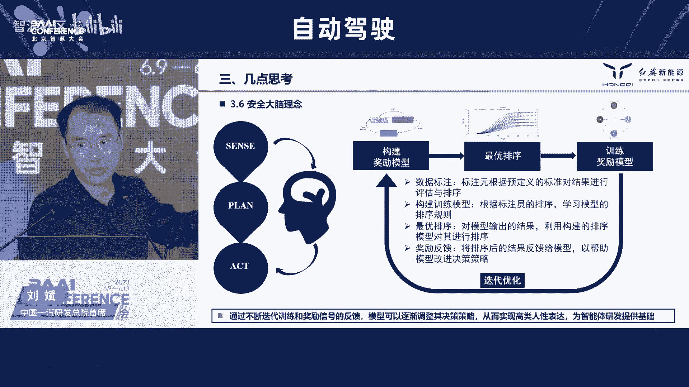

管控来保障我至少在AI的这种本地应用的时候，不会出现大的跑偏和大的这种问题。不会像我刚才提到的，我的车本来应该正常行驶的时候冲向这个公交车道，对吧？不会出现这种问题啊。最后一点就是231嘛，对吧？

最后最后这一点呢就是从标准和法规建设角度。现在呢我们也发现了，就是从国外角度呢，他们积极在推进一些AI的这种法规的这个这个立项工作。然后咱们国内呢也对于生成式的AI以及相关的这种数据安全保密的一些问题。

也提出了很多的这个指导意见和要求。我们呢也也非常的这个呃支持政府在在这块的一个统一。因为只有有了统一的这种行动路线，统一的标准统一的框架统一的模型。

才有可能把这个AI的这个尤其类似于规划决策这么一个特别重要的重点任务上给它做一个非常有益的这种健康保障的一个发展啊。最后吧就是简单总结一下，就是说虽然呢现在的AI呢。

我们已经从这个传统的感知开始往这个决策上去应用啊，但是如何能够把感知和这个决策，把感知和认知进行这个有效的打和，形成一个真正意义上的这个AI的通用性的模型。我觉得这是我们需要下一步急需去解决的啊。

但是能不能像黄总说，三年之内就把这些事都解决，这个呢肯定也需要我们各行各业大家一起努力。第二个方面呢，就是这种可解释性这块，现在看呢确实是有必要去找一些手段，对吧？

把中间的这种黑盒和这种这种代价呢给它打开，然后让我们从过程和管理角度都有适当的这个内容去提取。前一段我们在做那个DSSAAD就是增驾驶的数据记录的那个那个国标的时候，事故鉴定的一些这个这个公司。

他们就提出来。你们的数据必须得这过能拿出来。所有的过程必须。也是保证它的那个哈希值的这种连续性。但你这假如说AI的话，如果中间没有，我估计实际上后续的责任的认定管理也是会面临问题。当然最后两点呢。

其实是这个真的是面对规划决策这一个小任务的时候，我们发现的一个两个新的这个要点，对吧？标准化的一个通用化的一个模型。然后呢以及从数据虚拟到这个现实的这么个迁移。最后总结一下吧。

就是因为今天呢我也发现各行各业这个这个王总这个构建这舞台特别好啊，来自于各行各业的这些朋友们都在这。所以我们还是希望能跟大家一起把这个这个事呢走好走稳。

自动驾驶呢需要我们整车场的努力也需要咱们大家同时一起去呃努力和这个帮助，好吧，时间关系就就到这儿，谢谢大家。感谢刘总的精彩报告。刘总的报告呢向我们系统展述呃。

展示了一汽在自动驾驶人工智能决策方面的探索和对未来发展的一些思考。尤其是针对于这个人工智能算法的科解性差这些问题呢，提出了231的这个安全策略。像这个应该说是很有价值，值得咱们去深入思考。

刚才刘总特别提到了这个端到端这个词儿。这个实际上不只是国外人在搞端端倒端，但国内也有企业在搞端倒端。所以我们第二个安排的演讲就是豪莫智勤联合创始人兼CEO顾维浩博士。豪莫自勤呢是国家高新技术企业。

也是自动驾驶领域的独角兽企业。在这个创办这个企业之前呀，顾博士曾经在百度工作过多年，担任过百度智能汽车事业部的总经理等职位。他今天的题目是driveGPT雪湖海若驱动自动驾驶3。0时代加速到来。

大家掌声欢迎顾博士给我们解读一下他们的端脑的。对，好的啊，感谢那个法王总嗯的邀请吧。然后也听了这个黄院长，还有刚才那个呃刘董事的很多介绍啊，我觉得还有以及后面的很多嘉宾，我相信很多想法都很有启发。

那借这个场合呢，我觉得我也是把我们啊航模之行在过去一段时间的实践啊，向大家介绍一下。首先快速的呃用极早的时间来介绍一下我们的公司啊，我们公司呢成立的时间啊比较短。然后成立之初呢。

就是在想自动驾驶这行业的发展趋势会是什么样。所以在那个时候我们总结了自动发展啊，自动驾驶发展的三个定律，就是这个自动驾驶的出现，它会沿着从低速到高速从载务到载人从商用到民用这样的规律啊。

出现这样的产品形态。所以我们今天看比如说扫地机器人，比如说仓储机器人，那就是低速商用载务啊，这这样的东西对吧？他他已经自动化了啊。但是如果把它速度啊逐渐的加快。如果把它的这个场景逐渐加。😊，复杂。

那是我们还是需要很多很多的时间的对，然后我们也看到说2023年这这段时间以来是吧，呃，乘用车的辅助驾驶它的整体的呃这个高阶的辅助驾驶搭载率，我们认为也会快速的上升。那2025年的时候会超过70%。

那我们也呃看到说今年啊在自自架产品上面也会有几个很重要的一个趋势啊，包括城市导航辅助驾驶。现在啊包括长城，包括豪沫以及很多友商啊，在今年可能都会推出自己的这样的一个产品。然后我们也看到说从去年开始啊。

逐渐的行业里面还开始引入到行博一体。过去行车一个控制器，泊车一个控制器啊，既浪费这个成本，也浪费地方啊，今年看到了很多行博一体的融合。然后能。进入到这个前装量点上来。

然后最后一个这个我们看到的趋势是末端物流自动配送，呃，它也在逐渐形成被闭环，然后应用场景也越来越多。所以基于基于这样的一个趋势啊，那豪默呢，我们成立差不多现在三年多吧。

然后我们自己的呃这个定位呢就还是一个做自动驾驶的人工智能公司啊，这是公司刚开始的时候，我们设立的一个定位。那今天来看呢，我觉得人工智能的很多发展，也在时刻助力着我们想要实现自动驾驶啊这样的一个产品。

的一个规划是吧？那那发展到现在呢，我们可以看一下在呃我们恒默的一个成绩单哈。那我们做了辅助驾驶，比如说辅助驾驶嗯，使用我们产品的啊这样的真正的用户行驶里程已经超过了5000万公里啊。

为什么会强调这个数字。因为呢这个刚才黄院长也讲到是吧？大数据其实是人工智能很。很重很重要的一个前提啊，所以你有如果你没有形成自己的这个垂直领域巨大规模的一个数据的话。

那很多人工智能的这种训练想象都会受到极大的一个限制啊，那包括说我们为了这个做做数据做AI啊所搭建的这种妈a。

我们人工智能数据驱动的智能体系也训练市场也超过了这么呃接近70万个小时那我们之所以能有5000万的这种公里的辅助驾驶的行驶里程呢，是因为我们在过去三年里面，确实把我们的技术。

我们的产品搭载到了很多辆汽车上。那到目前为止呢，包括油车电车混动啊，包括国内的以及说现在在出口到欧洲出口到澳洲出口到东南亚的很多车辆上都搭载了我们这样的一个产品，差不多20多款车型啊。

那那有了这些车啊卖了出去，不断的在道路上行驶。那我们也就拥有了源源不断的一个数据那今天呢还是一个。基础型探讨的一个论坛，我们也把我们。过去很很长一段时间的这种思考和实践也做一个阶段性的一个展示。

那首先呢就是关于自动驾驶的一个发展啊，因为我我确实从事这个。之前从事了自然语言呀，然后语音语音的识别呀，然后呃以及自动驾驶这样的一个领域。过去的这些年的从业经历都都是在这样，看到了自动驾驶一步步的发展。

从大pa的这种比赛啊，差不多接近20年了，到今天为止，那个时候的自动驾驶已经出现了是吧？穿越沙漠。但那个时候车辆的设置，实际上是一个均规车辆的一个设置。所有的车辆上像坦克一样。

搭满了所有各种各样的一个传感器啊，它不是一个那个时代它不是一个说啊为这个民用乘用车所设计的一种自动驾驶的一个产品形态。所以呢在那个时代呢呃我们借鉴了很多很多的理念啊，它的驱动。方式驱动因素就是硬件驱动。

我这车上挂了多少个硬件，挂了多少个激光雷达，挂了多少个这个定位装置，挂了多少个这个摄像头，摄像头用的少一点啊，那我的自动驾驶的里程就会有多强啊，那在认知层面上来讲，它是靠人工规则，然后来写的。

那时间呢就发展了十几年之后，到了比如说到了24年，2014年，2014年左右的时候，10年前左右的时候，那我们看到了一些乘用车辅助驾驶开始逐渐的应用起来啊，为什么呢？

因为因为因为这个时候算力有了一些进展是吧？常用车上面可以有两T左右的一个算力进进了车了。然后我们可以看到说很多传感器特别是摄像头啊，100万摄像头，70万摄像素的摄像头也逐渐啊搭载到车上啊。

但那个时候呢，以及到现在为止啊，主要的驱动的方式，驱动自动驾驶产品进入方式。我认为还是一个软件驱动方式。那软件驱动方式有这么几个特征啊，就是它的这个可使用的行数据规模差不多是在1亿公里以内啊。

然后它感知呢基本上是每个单传感器独立输出，然后多个传感器在在我的一个控制器上进行合成输出结果。那在认知上面依然依赖于人工。规则啊，模型模它的模式呢出现了我我定义叫做小模型少数据这样的这样的一种模式啊。

那它的模型是一个什么样的规模呢？啊，过去这几年我们看到从端上来讲，从这个几层网络对吧？也许就是几十万个参数，然后到现在也是在不断的增加是吧？到了几百万参数是吧？那甚至说这个更大规模的参数。

现在车上也也逐渐的然实现了。但是它还是一个小规模小数据所驱动的这种进步。那我认为说在在因为这个模这个模式啊，三个时代是我们在去年的时候，去年的时候总结的啊，3。0的时代是一个数据驱动的时代。

那在今天上来看，这个这个趋势我们还是这总结的我觉得还是可以的是吧？那它的数据规模就会更多。我认为说自动驾驶的，一定要一亿公里上，你才能够去做一些这个AI的一个东西是吧？

那感知呢它也从独立传感器后融合的方式开始进入到说多模态传感器联合输出的一个模式。这个这个时候感知才会有一个更大的一个发展啊，然后认知呢也逐渐的从人工规则规则式的发展，到可解释场景化的。

然后能总结出驾驶常识？那个时候驾驶常识，大家都说驾驶常识从哪里来。世界模型从哪里来啊，不是靠人总结的永远只是世界模型的一部分，而且会相互矛盾是吧？今天看到大模型的这种趋势是吧？大模型是把所有的数据的。

使压缩到一个模型里，那个时候形成的世界常识才是最为广泛最为最为实用的一个一个驾驶常这个这个世界常识啊，那放在自动驾驶上，就是一个驾驶常识。那它的模式模式一定是大模型一个大数据啊，那我们公司的实践呢。

基本上从2。0到3。0啊，这这两个时代其实都会都会做这样的一个实践，所以基于这样的思想呢，我们从这个开始之初呢，就确定了我们自己的一个叫数据闭环的一个体系啊，我们把它叫做我们公司的思想刚印。然后呢。

围围绕着这个数据闭环体系创建了一套数据闭环的智能系统，我们叫做这个mana的数据闭环的智能闭环的系统。然后也是基于。

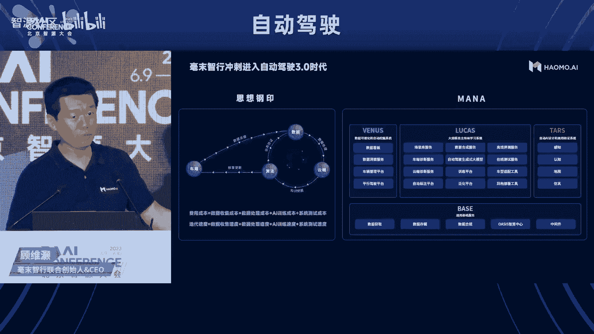

这样数据闭环系统，我们在去年的时候就开始尝试大模型。我们的那个航模AI定期也会向业界输出我们的思想是吧？在去年的时候我们宣传了五大大模型那个时候大家经常读错叫五大模型。其实我们总结到五大大模型。

其中有个感知的就4个然后那个时候呢我们认知的其实是一个那P的这种模式的一个出现，也让我们受到了很很多很多的启发，就自动驾驶做了20年没有做成它一定是有原因的可能是硬件跟不上。

可能是算力跟不上我觉得还有一个也许是一个很重要的可能是方法跟不上就像就像自然语言的时候，我们在做的时候就大家有过一些尝试可能都会有一些了解。

自然语言最开始我们分析的是词法句法一句话我要做AI训练我要先要分词分词完了以后呢，我再用这个语法去来理解这个词的主谓宾的一个关系现在自动驾驶一样的，我先识别出来每个障碍物车道线，然后来。

描述每个障碍物车道线和我自身的关系和位置，它在我的左前方是吧？和我相距这个这个13米，大家彼此的速度是多少。然后预计未来相相碰撞的时间是怎么样，那基于这样的一些语法类的描述。

然后再来决策说哎我今天就应该那我这个时刻就应该怎么样开车和自然语言在那个时代几乎是一样的一个方法。我们自己现在也也在用这样的方法，但我认为说对吧chGB的出现告诉大家说不用再分语法和词法了，对吧？

大家把所有的数据拿来，然后我们把通过大模型的模式把知识压缩到模型里，它就能衍生出来很多东西。所以我认为说GBT是一种是一种AI类的大模型的很重要的一个方法，我们应该把它引入到自动驾驶里面来。

也是基于这样的思考，对？我们就把我们的这种生成式自动驾驶，生成式大模型就推出来了，就叫dGPT那这块呢为了理解这个事情呢，我们也做一个简单的对比。比这个。训练的训练的方式方法对吧？

都是这种生成式预训练的大模型的方法啊，然后呢它的流程啊就是预训练奖励模型，强化学习和这个提示提示词的一个训练系统。

一会儿我会在分布的把每一块都会介绍一下大家理解我输入的是自然语言它是这个聊天的机器人然后呢driveP呢其实我们把它定位成一个自动驾驶的一个机器人啊，然后chatGP包含一些能力啊，可以包含我们算算数。

可以包含我们写作文啊，可以包含我们做这个知识的问答法律的问答啊，以及说这种啊代码的一些编写。这是chaGPT这个产品所具有的能力啊。但对driveGP来讲，它可以帮我们开车，除了帮我们开车以外。

它还具有了像场景理解场景识别场景重建以及刚才刘总讲的很多数据生成的能力啊，以及到云端评测和云端仿真。

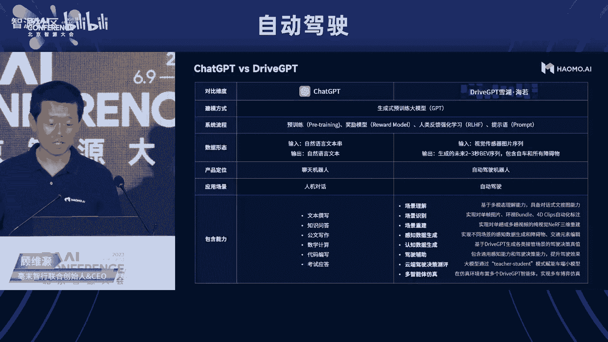

所以呢这这张图的一个一个介绍呢，我希望说能够能够让大家理解这个ch7 driveGBT其实是GBT的这种方法，在自动驾驶这个垂直领域上的一个应用是吧？我们可以形成这样的一个产品，可以形成这样的一个能力。

那那简单这对那简简单来说，这个dveGPT的方法究竟是什么呢？就刚才说这个语法词法让我们把它抛弃掉。它其实的输入就是这个这这个最下面的。这个东西我们把可以我们现在的定义是把它从感知出来之后。

感知出来的之后呢，它其实是1个BEV的一个一个空间啊吧？车道线障碍物速度相对关系就都会有。那接下来呢我们把这个所有感知出现的这种序列？在自动驾驶领域叫也叫克里啊，可能是10秒钟？

每秒钟可能是时针也可能是这个各家定义不太一样，我把它输入到这个模型里面，那它的输出呢是一种对未来趋势的这种这种生成啊，那可可以推测出也许未来几个克里ps斯。我基于之前的输入。

未来的这个世界均定会变成什么样，所以它输出呢就会变成几种根据我模型的能力不同啊，趋势不同，或者是或者是我们希望它这个生成的方向不同，它会形成一些这个平行的一个宇宙吧？

然后我们来根据我们自己的喜好和信用度来进行选择。以此吧？也许我选择了一款一个平行宇宙的某一个分支，那我的车就按照这个分支再来分。分解我要想达到这个分值，我自车今天在这个时刻究竟是按照什么速度。

什么角加压速度，什么角度啊来进行行驶啊？那同时呢确实那个AI呢也具有很多大家说这个我们都看到确实有一些黑核性。但我们也看到说chGPT也具有一种能力啊，当你给它出一道复杂的数学题的时候，它会把它拆解掉。

对吧？你说我要我要知道说这个某一类复杂的问题，基兔同笼的问题。那它的一个计算过程是什么样的。可以黑盒的输出，你跟他要计算过程的时候，他就会一步一步的把这个计算过程给你分解成三四步，然后告诉你个结果。

这个东西叫就思考链啊我们也希望说自动驾驶模型大模型吧？也能够生成这样的一个思考链来帮助用户以及帮助这个整个社会啊人人类沙文主义今天听到的心思人类沙文主义来理解机器究竟是该怎么思考以这个是我们所设计的这种大模型啊。

就是GT的这种大模型。那有了这样的想法之后呢，它也不会这个凭空的就就就就就完成了。我们实际上也在实践。接下来我也在分享一下基于这样的想法，我们需要什么样的计算能力。

我们需要怎么样来构建这种模型因为刚才的数据因为AI呢就是大模型大数据。😊，这个大算力大模型是吧？大大数据的方式，刚才我多少做了一些介绍是吧？有了更大规模的产品，有了更大规模的用户使用我们的产品。

那我们就能产生大数据啊，那接下来我就来介绍一个大算力和这个大模型。那首先呢就是这个大算力对吧？就是你作为一个作为作为一个我觉得AI的企业，作为一个人工智能的这样的一个公司是吧？

那其实我们要为所有的这个工程师提供这种训练场啊，你必须得有个练武场，让大家把他们的聪明想法，以及说现在业界的开放的模型，开放的论文，拿过来做实践拿过来做修正是吧？以及说以及说让让自己的很多想法。

在形成新的所算法和模型。所以呢我们在去年的时候基本上就构建了这个中国最大的自动驾驶的呃这种练武场啊，也就是这种算力单位算力啊，我们叫计算中心叫叫mana oasis那它整体的算力规模呢。

差不多是这个对67亿亿次每秒。啊，然后呢同时配有高性能和和网络通讯啊，有了这个练武场之后是吧？把大模型拿上来，我们还遇到了很多问题哦，就就比如说大模型的训练是吧？由于底层训练框架的问题，经常会中断。

训练不完啊，一个你有那么多数据对吧？你设计了一个那么大的参数，它不是说一个小时就会出结果，它可能会训练七七49天啊，但是他第48天挂了，那你这个剩下这一天其实就就过去48天都都浪费了。所以呢它一定要有。

我们一定要要求这套训练环境和框架是稳定的啊，所以这个我们和火山啊字节啊字节下面的这个火山云做了很多基础性的研发，来保障训练的稳定性。就我们设计了这种啊t traceice的方法，设计了log的机制。

设计了回滚回滚的方式，导致说有一个节点挂了是吧？由由于这个某一个训练节点挂了的时候，我们可以能够快速的来进行恢复啊，保证我们训练能够持续的一个进行。另外一个呢就是说训练的任务它也不是说很平缓的啊。

可能是说我今天啊现在呢因为它训练周期很长，刚才说七期49天，那到每一天我都会有新的数据进来。啊，那怎么样能够进行啊更高效的训练呢我们就是使用的增量学习的方法。那增量学习的方法也需要底层架构的一种支持啊。

它有一个任务任务调度的任务调度的一套体系啊，任务调度的一个方法，能够让我们方便的把新的数据和旧的模型然后来进行混合训练。这样的话就能提高整个训练的这种效率。

那第三个呢就是说对于GPT嘛替就是transformer嘛。那对于transformer本身的优化基础模型的优化也很重要啊transformer我们可以看到就也比较了解它它的是attention啊。

然后以及以及这个这个线性化呀这些基础的算子。那针对于自动驾驶。针对于这个。更大规模的这个数据规模。在做训练的时候，我们也找到了一些特定优化的一些方法啊，主要是在减少内存的搬运啊。

让有些的数据呢就一直停留在一个一个比较好的一个地方，是吧？大家呢就就减少数据搬运整体的数据效率，训练效率啊，矩阵计算的效率也会得到一个大幅的一个提升。那做了这三步骤之后。

我们才能说哎我们有了一个啊除了物理算力以外，我们还有了一个稳定的一个调度框架，能够让我们训练更大的一个模型。OK那有了这个基础之后，我们再来看说这个大模型怎么应用到自动驾驶领域。

因为大模型它的现在的来源呢都是来自于这个自然自然语言啊，自然语言大模型有一个训练的一个基础单位叫token啊，中文呢可能是一个字或一个词。英文呢也可能是一个词或者是一个短语，也可能是一句话啊。

所以呢如果我们要使用啊这个自然语言的大模型。我们。需要把我们自动驾驶的这这个这个训练的基础单位啊也转成token化。这样的话才能用上已有的一个模型啊，那我们看自然语言中文差不多5万个token啊？

那我们现在在构建自动驾驶的这种token的时候呢使用的方法呢是把这个BEV啊进行token化离散化啊，从从BEV的这个空间里面，啊障碍物撤到线啊。

把它给这个这个当成一个token输入到一个输入到这个模型里面。那现在这这是我们现在使用的方法。token化还有很多这个其他的方法，其实都是值得我们这个更多的人去尝试的。

我觉得它的潜力其实是非常非常大的那我们用这种方法呢，现在是50多个token。那我把5000万的公力对吧？选出来一部分。然后把每1个BEV做成token化。

那就是几百亿上千亿的token在更大的模型里面，然后去做去做训练。那使用的这种训练框架呢，基本上跟那个chatGPT也是比较相似的是吧？就是我有了这个各种各样的数据之后，看bu数据之后。

然后呢啊结合我们很很早提出来了一个为了自动驾驶安全，所设定的一种方法叫协同场景安全啊，我们基于这种方法其实也做了很多啊安全场景的一些定义啊，把它给也给自成一个很重要的输入，输入到这个训练体系上来。

然后呢是先呢使用大规模的这种数据啊，做预训练，有了这个预训练之后呢，然后我们再设立一个这个奖励函数，利用人类的驾驶行为做强化学习，然后来持续的一圈一圈转来提升整个我们对认知有了这个感知之后。

那我这个车就应该怎么开，提升这个认知的方法。对，那接下来呢就是再再分别再说一下预训练奖励函数和这和这个强化学习是吧？然后以及说这个COT我们究竟又是怎么实践的啊。

首先呢就是呃首先呢就是这个预训练预训练呢其实现在这个大家的方法都很都很都很都很粗这个鲁棒了是吧？都很鲁棒粗鲁，然后呢基本上都使用的是这种大的transformer是吧？

这个开源呢有很多自己想搭可能发花一定的时间，你也能搭得上。只要你有足够的算例是吧？你把这个模型搭的足够的宽和足够的深，那它参数规模一定能上去。

那上去的这个有啊这个上去之前呢对就是上去之前呢就是要把这个token啊，要把这个token利用我刚才的说的那个方法把它给拆解好离散好输入到这个预训练的大模型里面啊，然后他就能够得到一些结果。

那这个预训练大模型呢其实也做过我们自己也做过很多次很多次的这种迭代啊，就跟拆P。😊，一样，就过去呢是既有这个下面先有个这个incode的一层，然后上面呢再有decode的一层。那。

逐渐呢到GB3的时候呢，以后啊他把incode的这一层也都取消了。那就用decodeon这样的一种啊一种方式来进行整个的一个模型的预训练啊，我们自己呢也也做了很多跟进是吧？发现这个也是还有许个效果。

所以这个就是预训练哦，我们把所有的数据我们量产。这个收集回来的人类呀真实的驾驶的场景也好，或者是在我们这个驾驶过程中啊，我们认为说这个可能我们过去开的不好，那用户进行了接管了，把这些数据都摘出来啊。

CG到这个这个训练框架里面，然后来进行它的一个预预训练。那第二个第二步呢，有了这个预训练的结果呢，可能也不是很好啊，可能也不是很好。所以呢。

我觉得驾驶这个是一个可能比自然语言更更友好的一个强化训练的一个方法。因为自然语言对吧？你说你我跟那个chGB对话，它可能有些地方说的好，有些地方说的不好，其实我这个有时间呢，我纠正纠正它。没时间呢。

我看他回答不好也就过去了。但是对于自动驾驶来讲，它不是这样的对吧？你如果这个开的不好，人类一定会接管接管对吧？大部分会认为说你现在开的不太好，那有有这样的一种场景里面，那我的这个强化学习的这种反馈啊。

它就会更有针对性更有意义啊？所以呢我们也设定了一个呃就是比较通用的强化学习的一种奖励函数吧？因为这种强化学习训练框架，在业界里面也有也有多多种多样是吧？都可以来进行选择啊。

我们只是把它拿到一自动驾驶领域里，然后引入啊这个自动驾就是人类真实驾驶的时候，接管还有不接管情况的一个反馈，就把我们这个强化的。这种模式也就给建立起来了对吧？那有了这个之后呢。

它的输出就会就会变得啊更合理一些。那另外一个呢就是说我们希望它变得更有可解释性。那就是怎么样来构建这个这个COT对吧？就是ch of of thought。那构建这个这个COT的时候呢。

其实我们呃刚才讲。在很早的时候构建了一个自动驾驶的一个场景库。这个场景库呢其实是一种语义化的语义化的对吧？就像刚才我说的一样，一个场景，我把它的相邻的关系啊，相对的关系啊，都把它给描述出来。

然后再来定义我这个车该怎么开吧？所以我们现在呢其实有了很很多这个这种东西。那有了这种东西之后呢，我们就就把它当成一个呃基础的这个思考的一个底座，把它加入到刚才的那个预训练啊。

和和这个训练的这个这个过程里面，把它变成一个要素。比如说比如说我这个车啊看起来都是在执行的开。但是呢中间做了一个变道，它为什么做变道呢？是因为前面开的慢，前面开的慢，我向左变了一下。

然后呢我再逐渐的再再向右掰回来，把这个思考过程，把这个clip的思考过程，输入到我的模型里，我的模型才有可能啊，逐渐掌握这种这种chan，啊。这种这种方式啊，那经过了刚才说的预训练啊。

强化学习和ch of salt之后呢，我就再给它加入pro。因为人开车是有目的的是吧？比如说我们举了这个例子，这是一个路口。那这个路口我究竟是执行还是右转。这是我的我要给这个模型输入的一种pro。

然后同时呢我是以一个激进的方式开，还是以一个安全的方式开，还是一个平缓的方式来，这个都是它的一个pro啊，所以所以呢就是说我把这种pro这个输入给这个模型。这个模型呢就会生成也这我说的这种平行平行空间。

三种平行空间，这三种平行空间呢就会给出来每一种平行空间就会给出来它的这个ch of salt告诉你告诉用户，我这个车是是怎么开的啊，都是同样通过通过这样的路口啊。

这样的话用户的可理解性和这个这个整体的产品的通过性就会得到一个很大的一个提高啊。所这个呢基本上就是我们做这个driveGP整个的一个训练的一个方法。我觉得我们离最理想的这个呃。

产品体验现在来讲的话还是有差距的。但是呢这个很多模型嘛，很多过程呢其实就的是在于大家持续不断的一些研发，持续不断的一个倒腾，对吧？我们看到说效果越来越好啊，这个是一个事实啊，相信说也有一天对吧？

我们一定能够达到一个更好的一种状态那我们把这种dGPT刚才说我们在车端就现在呢在在这个今年来讲就会搭载到像蓝山啊，像未拍摩卡这样的车上也会搭载到我们这个末端配送的一个小摩托。这个末端配送自动配送车上嗯。

然后来进行真正的一个落地的一个实践。对？因为这个。

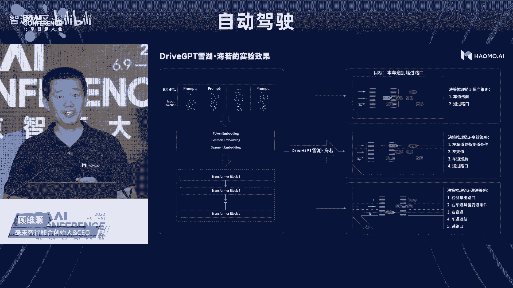

对，自动驾驶这个领域还是挺奇怪。嗯，我们也看到过去也有很多这个朋友问我说，哎，你那个大模型在车端究竟是怎么用是吧？你说你车这个这个云端说你几十亿几百亿1000亿在车端究竟能怎么用。

其实其实呢我觉得好多这个技术都是在发展。很多的这种变化也都是存在的吧？是车云互联的方式来进行进行进行应用，还是说在端上啊，你像这个最近的一部这个很多研究上，一个iphone吧？

8G的内存已经可以用运行70G其就是70亿的这种自然语言模型的一个训练了我们车端的这个内存基本上你可以随便加的是吧？你可以加到16G，你也可以加到这个32G啊，这是只是一个我们对一个成本的一个选择。

不存在物理空间的一个限制啊，所以技术在不断的不断的进步，硬件呢也在不断发展。只要产品效果能够达到，我觉得这个落地就不会成问题然后另外呢。

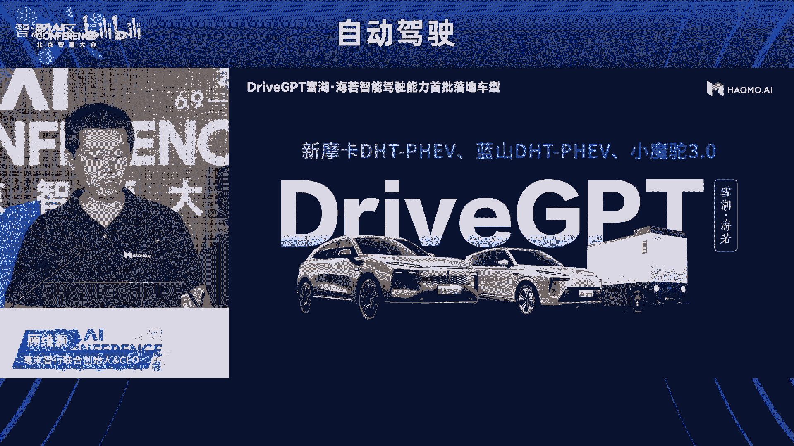

我其实我我刚才我讲自动驾驶做了二十几年，到现在是吧？大家还没有完全把它商业化，很有可能是技术路线的一个问题啊。

那如果GP drivevePPT的这种方法在自动动驾驶里面是走走的通的那我认为它也将重塑整个汽车智能化的一套技术的路线。能够让自动驾驶更快的到来这个黄院长说1到3年在技术上啊。

我觉得都是说这种大模型GP的方法加速了汽车智能化的一个到来。那同时呢我们也把云端的能力啊对外开放出来，刚才我讲这个drive其实有很多很多能力啊那我们也会逐步的开放其中呢就包括了这个数据标注的能力啊。

那过去为了训练一个训练一个模型你要标注一张图片，那它的标注成本可能是5块钱。那现在呢我们开放了我们的模型可以用的调用，你也可以私有化的一些部署。

你也可以进行模型的一个调用那我们整体的成本呢只需要五毛钱一张这大大的降。低这个领域啊进行AI实践的这样的一个成本。所以呢这个不管是端上的模型，这个开放模型，还是这个云云上的一个能力啊吧？

我们把它开放出来之后，也其实也得到产业员的很多支持。包括这个北方交大，还有我们的很多各种各样的合作伙伴，也都开始逐渐的引入和接入我们的这种这种能力。啊吧？

我也相信说对服务端的这些能力和我们在端上的这些技术技术的方法，也将促进中国自动驾驶的一个更快的一个发展，是吧？重塑这个这个智能汽车的啊技术路线。

能够让我们更多的人能够更早的体会到啊生活更多美好机器智能移动。好吧，谢谢大家。感谢顾博士的精彩报告。刚才顾博士向我们详细的介绍了航模之行在大模型领域的最新产品探索 drivePPT。这个我我理解啊。

这个基于大模型的端道单的解决方案，现在是行业啊相对认为比较难搞的一个方向。这个顾博士团队呢在国内已经率先在做了很多的探索。由于时间的关系，可能刚才很多具体的内容还没来得及展开去讲。如果大家会后有时间。

你们可以再做一些这个讨论。刚才所有嘉宾在讨论观都提到了这个数据的重要性，就在大模型的这个这个背这个背景下，那实际上对于自动驾驶而言，数据的一个很主要的类型就是场景。呃，为了到底怎么解决这个场景问题。

大家都在做探索。所以为了这个今天这个论坛呢，我们特意在第三个环节邀请赛目科技的杨强副总经副总经理来做分享。债姆科技呢是国家级专精特型小巨人企业，他们研发的模拟仿真测试验证与评价工具链。

是全球首家通过SLD产品认证的这个产品。这个杨总本人呢专注于自动驾驶仿真系统的研发和设计开发。他今天报告的题目是基于大模型的自动驾驶仿真测试场景自动生成，大家掌声欢迎。🤧。呃，尊敬的各位大家大家下午好。

呃，我是来自赛目科技的杨强。呃，首先感谢组委会的邀请，非常荣幸今天有这个机会跟大家在这边交流一下赛目科技在自动驾驶领域里面的一些思考。呃，我今天这个汇报的这个主题是基于大模型的自动驾驶仿真测试场景生成。

刚才很多嘉宾聊到了我们自动驾驶呃算法的这个研究。呃，包括结合这个大模型啊怎么去优化我们这个这个模型的这个精准度啊。那我们想结合大模型来思考一下，在自动驾驶验证的这个场景当中，如何进行一些这个技术的探索。

简单简单介绍一下赛目科技。赛目科技是一家聚焦在自动驾驶验证领域技术研究和工具链研发的公司。那我们公司自主研发的simpro仿真工具链，通过了这个工能安全认证，可以确保我们整个仿真引擎的一个执行度。

同时我们开发的这个工人安全和预警光安全s分析工具可以完成整个安全的分析和验证的闭环。那否能我们整个自动驾驶呃的加速。呃，首先我想来谈一谈我们这个智能网联汽车安全验证的挑战。呃。

我们知道这个自动驾驶分为5个等级，从L1到L5。其实我们说这个L2跟L3的话，我个人的理解，其实他们在很多功能，包括算法的精度上，其实是这个相差这个不是很高的。

但是为什么说我们觉得L3它的这个量产面对这个挑战的。我个人认为是他在这个安全认定上的一些定义不同。要求我们在L3这个以上的这个算法，它的这个如何去保我们安全性是非常非常具有挑战的。

第二个就是我们现在在AD是整个研发模型，我们是基于这个传统的这个呃位则性模型。我们现在有很多很多我们行业当中，我们聚焦在这个结合这个大模型也好，我们大算力也好啊，在优化我们整个系统的这个精度。

但是我们认为就是呃按照这个模型的一个理念，我们左边的话是一个算法一个开发的纵向过程。那我们。如何去确保我们在V字型的右边，能去确保我们整个系统安全性。我认为是也是解决自动驾驶最后三个落的一个重要环节。

同时我们在重驾驶我们碰到这种常尾问题，就是我们测试了很多很多场景，很多这种里程数。但最终这个长尾的话，我们并不是说通过这个路采可以去完成的。就如何去这个找到这一些常常尾问题的 case也是极体挑战的。

最后就是我们在这个L3以上这种自种项技术技术要素当中，我们会要求工人安全，包括预计工障一些技术指标。那在这个预计功人安全的这个技指标当中，就非常强调结合这个场景的分析。

我们通过场景的分析去找到了一些未知的。呃，位置的这个呃风险场景来确保我们这个场景的收敛。所以我们现在整个智能网能汽车安全验证，我们面临了这么多挑战。那我们觉得这个有效的去验证提升自动驾驶。

网名这个汽车的安全性的一个方案。我们认为这个基于场景的虚拟仿真设置这种有效的这个手段。呃，我自己介绍一下基于场景的这个仿真设试的工具链。首先的话我们在这个正向研发当中，除了我们系统的建模算法的设计。

还有很重要的就是我们进行功能安全的一些分析。包括预据功安全分析。这功能安全分析除了我们去通过这个呃安全分析得到我们一些这个算法优化的这一些这个策略，包括我们可以对OA进行一些这个修改。

那还有一个非常重要的就是我们要输出我们这个安全相关的一些这个测试策略，我们经常跟一些同行在交流，我们组织长同事在交流。我们仿真测试同事，当我们你们的这个这个安全测试怎么做的。你们的安全策略怎么定义的。

其实我们的测试工程师是呃围绕这个问题有些疑惑的。因为你们的根本原因就是我们的这个在安全分析工程师要给到我们这些测试策略，给到我们的这个仿真测试工程师，这样的话才能有效的进行一个呃测试验证。呃。

当我们这个安全分析管理，我们会输出一些类似于这种逻辑场景，或者说一些具体场景这样的呃呃定义给到我们这个场场景这个创建场景，我们可以理解是它这种测试用例，它通过一种数字化的这个建模形式，把我们的路网信息。

我们的这个场景信息构建起来，给到我后面的仿真用。同时对于这个测试空间是非常关键的。就是我们如何去界定我们这个ODD里面的一个这个场景的边界便于我们在后面的安全分析测试空间缩当中呃，很好的一个输入。

还有我们就是环境建模，就是我们呃把我们这个交通的一些这个这个这个三维模型。比如说我们这个路面模型啊，建筑模型啊，这个提前建好。我们有了场景文件，我们建模文件就输入到我们这个。仿真的闭环。

我们会结合我们的高高实时的这个3D渲染引擎。结合我们交流模型，我们会输出这个原始的ro data。结合我们这个传感器模型，我们可以这个混合的传感器模型。我们这个物理传感器模型。

那混合上模型呢更多的是基于一些这个规基于我们的一些这个呃目标级的输出，可以测试我们归控现在行业当中的话我们目前现阶段我们了解还是这个更多的是聚焦在这个算法的这验证。那未来的话。

我们如何做到端到端的这一个闭环的感知在环的仿真验也是非常具有挑战的那这块呢我们也觉得可以去结合这个未来这个大模型的一些这个图像生成技术更好的去这输出这个物理传感的这个数据。

那我们把整个在我们的虚拟测试当中建立一个这样的不管是我们是目标级的列表，还是我们这种传感器的这个 data给到我们的被算法我们可以做一个闭环的个测试验证。

最后结合我们的一个动力学高精度的这个动力学模型输出它的一些控制控制指令。然后返回到我们这个仿真引擎形成一个闭环。验证这里面当初的话，我们想呃重点跟大家强调一个这个场景泛化的概念。就我们一般这个场景泛化。

我们说这个给定你一个逻辑场景呃，我们用用一些这种店铺上的这种泛化。我们比如说基于这种均匀采样的monpo这种采样方法。它是可以达到很好的一个场景泛化的效果。但是它这个场景的生成数是非常非常多的。

我们理论上说哎我这个场景生成完了以后很好的一个空间的覆盖。但是在我们现有的算的情况下，你是很难去合我们云端的这种并行的这个仿真测试能力，也很难去做到一个有效的测试验证。所以我们就思考一个问题。

就是如何更加高效的去进行泛化，而不是说通过我们一些这种均匀的这个采样泛化。所以我们最的一个目标，就是呃这里面提的D的概念。就是我们的测试的这个策略是我们是要进行一个设计的。

我们希望做的事情就是通过我们尽可能少的样样本点去进行这个这个采样。但是呢我们希望对。测试空间有个比较好的覆盖，然后既能达到我们场景覆盖的一个这样的效果。同时我的测试样本点又不是又不是那么的多。

这个我在后面的这个PPT会展开介绍一下，最后我们就是一个评价分析。我们传统的这种评价分析方法的话，我们会做到这个安全的这个舒适度的，还有我们这个法规的那其实我觉得里面一个最核心的问题。

就是我们如何去量化的去分析我们这个这个系统的这个安全性。我们可以通过鲁棒性的分析，可靠性的分析方法。这个整个就是我们这个虚拟仿真设置一个闭环的这个工具链。呃，在我们整个仿真测试这个过程当中。

我们也认为有些这个核心的技术点需要我们去攻破攻破的。首先我们觉得这个闭环的仿真仿真这个工具，我们有需要这个场景建模的工具，地图建模工具，还有我们整个仿真引擎。呃，我们的评价模型。

同时我们当我们这么大海量的这个测试场景以后，如何高效的去去验证它，我们需要在云端部署我们的这个云仿真的能力。有的工具电的话，我们是不是说我们就可以大家就是觉得哎我这个系统就非常有效的安全的验证它呢。

那我觉得并不是这样子的。呃，一个另外接下来一个关键技术就是我们这个自信度自信度的话，我们一般聊的知信度啊，大家都会讲动力学的自信度。是的，动力性自信度非常重要。

但是同时我们这个传感器模型的自信度也是非常重要的。另外就是我们认为这个仿真引擎的，它是我们整个底座。如果我们这个仿真引擎底座的，它的个结算能力，我们的确定性不能确保的话，我们的模型做的再好。

就你每次每次我们去在海量测试当中，结果都是不收敛的，都是不一致的这种仿真测试我们认为也是无效的。所以我们项目很早就提出我们对仿真引擎的这这个这个这个咨行度怎么来确保。

那我们的方法通过我们测库里面最要求严格最严格的A做D等级的一个这样的开发这个流程来对我们整个仿真引擎整个这个设计研发一个规范。另外场景场景也是我们要有知信度的。我们场景并不是说手中搭建。

或者我们通过这个去去大量的采集场景越多越好。不是这样的。我们回答的一个问题就是说第一我们要构建有效场景。

同时我们还要去我们的场景评价模型评价我们场景是否有效测试场景呃我们包括这种基准场景边缘场景跟这个危险场景在我们对自动驾驶这个呃 case验证这个维度的话呃，我们的理解是相比我们技术场景。

我们更觉得这个对于自动驾驶这种安全性提高的验证过程当中边缘场景跟这些危险场景，更是我们应该重点去关注的。我们量化量化的话，我们不希望做定性的分析，而是通过这种定量的分析。呃，我们讲的这个仿真工具链。

我们的这个知信度。我们想其实想回答一个最基本的问题。我们也是觉得就是在自动驾驶中最一个核心的问题，就是如何测试验证我们自动驾驶系统的安全性这个问题。

这个问题听听上去很就是非常的这个我们叫这个这个大家得理所当然。但是要回答好这个问题，我们通过我们理论上我们要证明我们可以做到。然后通过测试验证上，我们有结果去佐证我这个结论是否成立的话。

我觉得还是非常有挑战的。那上步也是自力在决决这一个基本的呃验证的一个课题。嗯，我今天的话我就是想重点围绕着这个场景构建，也简单会介绍一下场景覆盖这个话题。

然结合我们大模型如何来进行一些这个相关的技术研究。场景构建的话，我们传统的方法，我们可以通过这种手动搭建的，或者说我们通过一些这个基本的数据这个采集当中来提取这些场景。但这种搭建方式的话。

它第一就是这个成本比较高。第二它这个呃场景的一些这个覆盖度啊，我们没办法去确保。所以就是说呃我我们提出一个这个这个基本的一个问题，就是说我们如何高效的去找寻那一些有效的场景，就是在这种价驶当中。

是我们要去解决的一个重点的。呃，客题。那这里我想在我在我介绍这个场景之前，我想跟大家介绍一下这个叫做MSDR语言。这个语言的话是这个一家以色列公司，它这个研发这个语言，它是一种这个抽象的这个自然语言。

呃还是面向这个领域的一种这个描述的语言。这个语言的话就是现在被这个ACM这个已经采纳了。作为我们2。0官方的一种这个语言。这种语言的话，它其实是一种这个这个这个这个这个标准。

但是每一家的话实现都是不一样的。我也是非常鼓励我们这个自动驾驶的这个同行们去实现我们这个中国版的这个D语言的一个一个描述。这个语言的话，它有几个特点。第一就是他通过这种自然的方式。

或者说通过逻辑的方式把我们这个现实的交通场景去描述出来建立逻辑关系。第二它是有这种这个呃对模型的一种测试生成的这个这个方法。第三就是他在这个场景的这个办化当中，他非常强调这个。呃。

具于限制的一些这个呃这个这个场景生成，或者说我们会去通过我们在测试过程当中去观测我们的这个一些KPI指标，去调整我们这个仿真收敛的一些这个呃策略。

这个逻辑场景的话是我我们认为是它是可用于对可用于对这种可度量验证当中的一个非常好的这个一个验证验证方式。呃，刚才讲到的那个MS6，它只是一种一种标准。那实际在我们访谈当中。

我们用到的是这个呃open c1。0跟2。0这两个区别的话，我们可以看一下这个。在这段部当中，就是我们现在目前行业当中用的比较多的这个具体场景。他通过我们这种这个XM语言的这种方式。

把我们这个交通场景啊给这个结构化的这个表现出来。这边的话是我们基这个2。0的一个一个描述。这种描述的话，它可能是呃更加的抽象，或者说我们会定义我们这个场景的一些参数空间。

它要结合我们的一这个场景的泛化测试空间的搜索技术，再来生成这个呃1。0的场景。呃，大家可以看到，就是我们在这个。参考了一些这个这个这个国外的实现，就是他呃有一些这个国外的公司的话。

它是这个通过thon的语言去实现了我们这个en2。0的一个描述。那我们这个我们刚刚介绍的场景，场景对我们仿真的重要性。我们就在思考就是说我们在未来的测试当中是一。0重要呢，还是2。0重要呢？

这是我们第一个要回答的问题，或者说我们采用不同的技术方案，它对我们这个场景覆盖是否有影响我我自己的理解啊，就是我们具体场景的话，是我们最终测试需要这个使用的这个这个这个文件，但是在他我们的上层的话。

就是我们是一定要去构建我们的逻辑场景空间，因为我们如果说给了我们海量的这个具体场景，对吧？我们每个都是可以测试验证的。但是我们很难去回答我们这些具体场景测完以后，你是否是对我们DD进行了一个覆盖。

或者说我们这个这个还有哪些位置里我们没有进行一个一个这个呃测试，但是如果我们是用逻辑场景的话，我们会定义了我们测试。空间在这些空间下面，我们会用我们的这个搜索算法来去度量我们的覆盖度。所以呃。

回答这个问题的话，我们其实刚才讲到的就是我们大模型，我们认为它既可以去实现1。0的场景文件的生成率，也是可以实现这个场景2。0的实现这个实现。呃。回到这个我们今天讲的大模型叉GPT。

因为他最近在这种这个确人聊天这个名当中表现的非常好。其实他呃PT在这个去年年底退休之前，其实他可好几年前他也就PT1。0203。0。但是这个我们加入了这个我们这个他的一些优化一些强化学习以后。

的确了GPT在这个他的精度上面表现的更好。但是我们要回给我们的个启发是，其实这个模型的本身它是GBT那GBT的话，在我们这种价值当中，我们如何去基这个网络结构去解决我们的一些这个挑战。

我们这边做了一个基本的这个呃基基于我们这个这个呃发布的一些这个预训练的大模型，我们生成了这个python的一些这个呃事例大家可以看到啊。

我觉得我们未来的这个工程师还真的要思考一下就我们未来的这个这个这个呃职业的发展方向，是去去更多的去编程，还是更多的去设计。呃，我们输输入这个一些我们的这个呃。这个语言的话，正然的语言的话。

它已经可以生成非常好的这个拍摄代码来了。包括我们这个一些这个算法也好，我们就图一些这个画图也好啊。所以现在这个类似于这种GPT这种预现列好的大模型，在代码生成已经具有非常好的这个这个这个这个生成能力。

呃，沿着我刚才我们思了，我们觉得这个呃1。0其实它是一种这个ex语言的这种格式。然后我们就是呃基于预预发布的一些大模型，我们做了一个这个验证。我们输入一句，请生成1。

0的这个呃一个一个前车切切入的一个呃一句话，它就可以。自动的生成我们这个1。0的这个文件，我们进行了一个分析，它基本上这个格式啊已经可以完成大概这个90%以上的这个相似度。我们稍微进行一些预调以后。

它就可以应用到我们设验当中。所以现在精度已经是非常高来了。而且我强调的是它并没有说经过一个很很高效这个或者说我们专门的一个一个调优。我相信未来就是基已有的这个框架。

我们再做一些模型的微调它的这个整个模型的泛化能力会更好。所以我们基这个验证结果，我们自己做了一些相关的研究跟跟这个调研未来的一个发展的一个或者我们模型优化的一方向的话，我们是觉得基于我们预个大型。

我们进行指令的微调这个指令微调我们就是可以理解成我做一些这个类似于A的这种方式。我预一些这个测试的这个。场景，然后用它来做一个监督的优化，来做我们对我们这个整个这个大模型进行一进行第一次的优化。

这个我们认为它可能就是整个模型，它基于这种文本类的或者代码类的，它都去进行一个基于这些数据，我们进行一个算练这个训练。这时候它不具这种更好的这个面向于我们op1。0的生成泛化能力。

所以我们还要再再做第二级的一个优化。就是我们要去收集更多的offer1。0的这个数据。那我们进行一些数据的预处理。然后第二次进行一个这个呃呃一个监督的优化。然后最终我们。可以觉得这个两次优化以后。

我们对这个他的泛化能力，或者说他的精精度提高会有更多的帮助。呃，刚才讲到了就是基基于现有的模型，我们已经可以很好的输出这个off1。0的这个场景文件。那我们接下来就是说我们2。0应该如何去生成。呃。2。

0的话跟我们点有个不一样。1。0的话，它更多的是一种这个文本的理解。我们可以看你你你的训练数据可以是这这种文本类的，可以是代码，也可以是我们只要是是能搜索到所有数据都可以进行训练。

它是具有相对通用的一个这样的一个模型的这个这个生成能力。那么2。0的话，因为我们是希望通过类似于一种代码的方式，或者说我们是类似thon脚本的方式去构建我们的这个呃场景文件。所以这个模型的话。

我们是基于GPT去生成代码的这个维度。所以我们。呃，先我们要收集，比如说我们这个thon的这个代码呀，或者我们C加的代码，对吧？基于这些代码，我们来去预训练我们的这个大模型。

这个大模型我们预训练预训练之后，第二步就是我们要去找寻我们这一些这个逻辑场景，这些场景的话，然它是要实现我们一些抽象的场景定义。呃，来再做一个监督的优化。那最终我们可以去这个生成我们的逻辑场景。

这个逻辑场景的话，我们可以结合测试空间分析工具，最终去生成我们这个具体场景。这里面我们觉得模型的挑战固然是一方面。但是在这个我们讲的这个微调模型当中，如何去获取这些数据是非常有挑战的。

所以我们也希望整个这个行业当中嘛，更多的这个不管是场景1。0的这个共享还是2。0共享未来对于我们模型的构建是非常至关重要的。呃，这里讲了一个微调的一个一个这个这个这个策略。因为我们刚刚强调了我们大模型。

它未来可能是百亿级的这个参数，甚至是千亿级万亿级的参数。这种参数我们如果从头开始去训练的话，它是非常非常这个耗个这那我们觉得就是说我也是通过这个调研就是目前行业的发一个技术方的。

并不是说我每一次去重新训练我的模型。而是我们叫这个模型的微调它的有几种方案了，它它的一个基本的思想的话，就是我们在这个这个前面加入一个这个dding就是并不是去改变我们的模型。

而是在我们这个进入到我们整个GPT之前我们先去这个加入一些隐藏层。然后去扩扩充我们这个参数这个这个这个体量。前面两种我们基本的思路都是一样的。这个我们经过我们的调研。还有一种就是说我去改变我的模型呃。

来达到我们一个微微调的一个效果。整个它的一个基本的一个思路的话，就是在提高我们这个模型精度的同时，我们如何更好的去去去降低我们这个训练的成本。呃，前面我们讲讲到了。

我们基于我们这个大模型的这个呃这个这个它的能力，我们希望去生成我们这个逻辑场景，对吧？这个逻辑场景的话，它会便于我们做这个后面的这个测试验证，但是它并没有得到我们具体的这个场景。

这个场景是我们可以去运行的。然后我们这个公司研究的一个方向，就是我们非常关注我们觉得基本问题。我们需要量化的去分析我们这种驾驶的安全性。那我们觉得对一个这个我们认为重动驾驶它这个问题。

其实我们它是一个一个一一个测试空间的问题，就是好比我们在我们这个大会当中，我们如何通过一些这种DE的这种这个这个测试设计更好的去采样，能后去对我们整个测试空间一个覆盖。

但我又不希望我们的采样样本有那么多。它基本的一个这个原理的话就是我们首先定义我们的逻辑场景，包括我们这个参数的分布空间。然我们会做这种采样，我们可以去这种这个拉超定放采样去搭一些搜补系列这种采样。

通过采样以。得到我们的一个具体场景。这个场景的话，结合我们在云端的呃我们的一个并行的访问测试这个呃平台可以快速的去生成我们每一个场景的这个KPI指标。这指标的话会给到我们这个参数的分析。呃。

我们希望对这个其实很多场景定的时候，它有些这个参数的话，对我们最终的KPI是不影响的。我们希望去进行一个降温。把一个高维的测试空间降到一个低位的测试空间。我们再进行第二次的这个半化采样。

基于我们这个呃这个第二次的这个具体场景，我们再进行一个算法的种范性分析和它的可号性分析。呃，我们也认为自动驾驶百分百这个安全是是比较难的。但是我们呃觉得通过我们这种数据统计的方式。

在一定这个这个自信度区间下面，我们可以去量化的估算出它的失败概率。比如说我们一个自动驾驶系统，它的这个失败概率是在值的负5之方。我我们认为他未来在这个实际的交当中，它发生这种碰断风险还是很高的。

如果说他的这个失败概率在的负7次方，甚至更低。我们基本上可以去通过这个数据统计角度认为这个系统是它是安全的。嗯。

所以我们给出的是一是一套这个通过敏感性、鲁棒性、可靠性、量化分析我们这个自动驾驶系统的安全性。嗯，上面那个章节是我们讲到的，就是通过我们结合大模型GPT的这个能力，我们去生成场景。

自动的去呃从逻辑上引到我们这个呃具体场景。那第二个这个方向我们想来探讨一下在我们数据采集系统当中那这个大模型如何来运用我们这个整个技术框架。数据采集这个场景提取的话，我们就想解决一个问题。

通过我们这个实际的采集的这些ro data呃激光的毫米波，我们如何来这个提取我们自己一些感兴趣的场景。还是我们刚才强调了，我们相比我们去强调场景的数量，我们更多强调的场景质量或者它的有效性。

那基本上它的一个呃。这个流程的话，就是我们通过实产的这个车去采集这些数据，采集完了以后，我们就要进行一个感知融合，输出我这些目标级的。这些目标级的话呃，给到我们的这个场景提取算法。

然后我们会去这个提起我们的一些。比如说我们这个这个变道啊，或者说一些这个我们说这个它的一些KPI比给我们预预定的这个值域比较低的场景把它处处理出来。

那最终把这些场景在在给到我们访子当中做一个这个虚拟测试验证。他的这个输出的话就是我们这个场景的文件。这里面有一个比较有挑战的这个这个话题。

就是我们如何基于这些ro data去提取我们更好的这些这个目标及列表。那其实这个感知融合在我们自动驾驶算法当中是一个非常核心的这个算法。那在我们这个仿真验证的这个数材系程当中，其实同样有这个问题。呃。

就是呃。我们在实际项目当中，就是我们的拿到的一些数据。比如说它是单单传感器的，比如camer给出来的，它只只有这个有效的这个这个道路的一些信息。所以我们在做一些道路拟合的时候啊。

你并不能可以把整个这个道路给拟合出来。它只是有部分的这个道路这个呃车道线。所以我们觉得解决个问题的一个有效途径是我们要从原始数据，而不是说给到我们目标级。我们整个仿真这个素材工具需要做这个感知融合。

这块的话就是素材就系统当中，我们觉得这个多模态检测包括我们这个这种标注啊是非常重要的。就是在这个领域当中，我们如何结合大模型来进行一些这个呃设计。呃，首先这个标注这一块标注的话。

我们知道就通过人工的标注啊，它是这个比较这个耗耗时间的，或者说这个成本也比较高。那我们希望呃有没有这种这个大模型在我们这个。呃，标注这一块能提高我们的工作效率呢。

我们研究下来有两种技术这个路线在这里跟大家这个进行探讨，一种叫做这个办半监督的这个呃学习。呃，他这个基本的思想的话就是说呃我们标注少部分的这个数据量，然后通过少部分变量的话。

我们去去训定一个这个呃监监督的模型。通过监督模型的话，我们就是可以。注入到我们这个环节，然后再去呃把我们这未标数据给去这个进行一个预测。预测完了以后，我们会这里会得到一个新的模型。

再返回到上面做第二次迭代。整个这个迭代循环的话，最终我们有实用效果，就是可以做到这个呃这个一个自动的这个这个对于一些我们这个呃目标进行一些标注。还有说这种这种自监督的这种方式。自监督个方式的话。

它是这基本的思想的话，就是。呃，我们通过我们这些未标注好的这些数据，我们从这个原始原始数据映射到我们一个一个一个特征一个特征。呃，我们分两步。第一步的话，我们就是刚才说的，我们就是这些未标注过的数据。

第二步，我们把我们标注的数据同样做这个从原始数据到这个标签的映射。第二步就是说我们再从这个从我们的这个特征再到我们标签的一个一个映射，就是我们第二个这个叫做heading的一个这样的一个一个一个模型。

那么模型训理完以后的话，我们再把我们这些未标注的数据。通过我们这个模型进行一些这个自动标注。这是我们这个调研下来，呃比较好的这个对自动标注可以使得我们去接下来去进一步去去探索。呃。

这些细节因为时间的关系，我这不进行展开了。这里我还是想最后刚才说的是自动标注这一块。还有就是在感知融合这一块。刚才那个顾总也提到了，就是我们在这个呃自动价值算法的这个验证当中。

也是基于这个BUV加这个全结构就是P它个基本的模型就是那我们这个基本的一个模型的构的话基于我们的它是一个我们认为它是个多模态的一个大模型。

就是基本的思想就是说我们比如说我们用这个caa跟跟跟激光我们对数据进行一个第一个这个呃特征的提取。我们在BUV这个视角下，我们左边的话，我们是会把激光进行这个输入到这框架当中。然后最终它的这个特征举证。

我们输入到这右边的这个第二层的一个第一层的话，它输入的是camera的一个这个这个数据，它也会去输出一个矩证。这两个给到我们这个第二部分的这这个这个这个。呃呃，attention这个这个这个步骤的话。

其实他已经做了融合来了。那这样的话我们就可以类似于一个。呃，类似一个我们这个融合，同时基于这个全世化更好的有一个这个这个呃泛化的一个能域。好的。

我们当我们有了一个非常高效的这个呃精准的这个目标及输说这个呃呃哦，不这例史。我们讲那再结合我们基于深度学习这个呃场景出击拍line，我们可以非常呃高效的去呃提起我们些感兴趣的这一些这个场景文件。

那最终呃我们是希望通过这个这个这个大模型去更好的去提取场景和进行一些这个呃仿真测试验证。好的，谢谢。这个谢谢杨总的精彩报告。可能在座的这个汽车行业比较多。大家都了解这个基于多支柱的这个测试评价方法。

目前呢应该说得到了国内外的共识。其中这个模拟仿真测试在里面是十分重要的一个资助。那么怎么能够高效的这个比较能够高知信度的开展这个模拟仿真测试，也是我们目前在组织行业一直在研究这个问题。最那段时间呢。

我们中心也在组织相关的企业和主机厂，一直在围绕着多支柱的测试评价方法，研究这套体系，也在推动相关标准的建设。如果大家在这方面呢有一些想法，也可以随时跟我们联系。呃。

这个今天的第四位的报告嘉宾是北京理工大学的季卫新教授。季教授呢是教育部产学合作协同育人项目专家组成员、信息技术新工科产学研联盟的副秘书长。中国计算机学会体系结构专业委员会的委员。

他今天的演讲题目是多方协同的自动驾驶模力仿真测试。大家掌声欢迎。啊呃，非常感谢刘主任的介绍，我今天也很高兴呢有机会来向大家汇报一下我们的最近的一些工作。当然我呢本身呢是原来做并行和高清计算的。

所以呃自动驾驶呢是最近啊然后在采去考虑这个问题。那在这个过程中呢，也是发现了就系统和我们自动驾驶里面也遇到了一些问题。那自动驾驶涉及到算法算例，还有这个数据的一些问题。所以从系统角度来看的话。

它里面还是有很多问题可以去优化和去解决的。呃，我今天向大家汇报的这个内容呢主要包括就是呃自动驾驶中的这个数据的问题。还有就是以场景数据为例。当然前面已经介绍了这个场景基于到模型生圳的问题。

然我这边呢也是呃前面看到的一些生的方式。也就后面就是我们在现在数据比较稀缺的情况下，我们怎么去通过多方行动的方式，然后来去搭建这样的一个平台，然后完。😊，成这样的一个啊自动仿真自动驾驶系统的一个评测。

然后能够推动整个行业稳步的向前走进。呃，那首先呢就是这个前面大家都有呃了解这个三支测试。模拟仿真测试呢在这里面发挥着一个很重要的作用。呃。

它有低成本和这样的一些呃对于一些边界和危险场景能够很方便的去覆盖。这个我就不介绍了。呃，那么在这个里面其实设计三个方面，一个呢是数据，一个是算法，一个是算力。呃。

像前面呃我们看到前段时间代愿是说呢这个数据呢其实决定了智能的这个范围。然后算力呢其实决定了这个智能的效率。然后算法呢决定了这个智能的这个效果怎么样。所以我们不断的拓宽这个数据的范围，然后呃突破这个算法。

然后在算力的支撑下，然后才能去呃更好的去构建一个类似这样的一个智能系统。那么自动驾驶显然是一个这样其中这几个方面都涉及的，包括这个算例和算法和数据。那么这是传统的大家考虑这个自动驾驶啊，反正测试的时候。

一个典型的微型结构。当然可能不同的地方不太一样。但是我想可能在这个过程中，现在每个自动驾驶的公司，其实多多少少会变成一个跟数据相关的一些公司，在这里面其实甚至到很多数据的这个处理的工作。啊。

在这个图里面其实并没有去体现这样一个工作。所以我们从呃为了去训练一些模型，或者为了去做一些分析，我们需要采集很大量的这个原数据，这原数据呢可能要经过一定的筛选，然后获得一个数据的子集。

在这个子集的基础之上呢，我们可能将进行一些标注。那不管是鱼的标志或者其他的一些标注，那形成一些我们可以用来训练的数据。但这中间还有一些数据的分类和那个原数据的标注工作。最后呢我们可能在生成一些这个数据。

所以呃如果是从呃左边这个微型结构。他来看的话，其实是最最简单的抽象的模型。然后最后一道软件。最后包括在硬件系统，然后还有可能包括自动驾驶驾驶人员，然后在整个系统的行成过程。那么为了去支撑前期的这个设计。

我们从实际世界里面采集了很多数据很复杂的，或者说带有很多噪音或者这个其他杂项的数据，然后把它抽象，然后逐渐形成适合我们支撑前期的这个模型设计和验证的这样的一个数据。那么所以这是一个这样的过程。

但是当我们去完成前面的这个设计之后呢，我们会把这个设计的模型和设计的这个算法，最后逐渐的在应用回原始这个物理世界里面去啊和硬件和人去集合，然后和环境去结合，然后去做这件事情。所以它就反过来一个事情。

那么其实现在我们讲大数据在自动驾驶里面这个这个事情应该会更明显。或者说我们说自动驾驶其实是大数据的一个典型的一个应用。这里面呃大数据呢有典型的。特征那第一个呢是说它的数据量比较大。

我们为了去采集这些数据，每天可能开了很多车在城市里去转。那那这里面产生的数据有很多。而且要求比方说模拟仿真测试的话，我们也要在这个系统里面要跑很多的公里。那么一个车上呢，它其实有很多的传感器。

每个传感器每秒钟产生的数据量都很大。所以它也符合大数据的第二特征，就是这个数据产生的效率速度非常快。第三个呢就是说它是一个呃数据的类型很多样，那有结构化半结构化，还有我们经常讲对我们它的各种数据。

那第四个呢其实讲的是这个数据的质量和可信性，就是我们采集的数据呃用来训练的数据，这个数据的真实性，它的是不是可信的。我们前面有嘉宾讲到是说这个数据如果有问题的话，那你训练出来的模型也是没有用的。

所以我们拿到的数据用来训练的数据有多少是高质量的数据可以用来去模型训练的。那最后呢实际上呢它的价值密度。实际上我们拿到的很多数据，其实里面能够挖掘出来的对我们有用的价值。是比较低的。

所以呃里面可能会拿到一些关于这个我们从大量数据里面能够推测到的一些一些洞察或者认知，其实是很很很复杂一件事情。所以呃自动驾驶呢其实这里面还是一个呃目前来讲还是需要大数据的支撑。大数据作为输入。

然后去训练这个模型。那么以场景数据为例，我们来看一下这个事情。那么场景数据其实就从物理数据去采集，采集完了之后，我们可能再去做很多的这个功能场景的提取。然后逻辑场景的提取，最后呢生成我们要的具体场景。

然后去做这个模拟反真测试。但这个过程中呢，然后涉及到的数据量很大。然后但是这个我们可以去类比一下，就是这个数据实际上采集跟软件的开发里面的这个测试用例的设计有点类似。比方说我们软件去测试的时候。

我们可能会想就是手工编写一些测试用例。那么在自动驾驶场景里面，我们也有去手工去编写这个场景的这个情况，我们也有一些编辑器，然后支持我们去看。但是这个效率很低，成本很高，我们需要花大量的人力。

并且这个和人的经验和它认知是有关系的。就是你可能没有经历过或没有不知道这个事情的话，你最后可能编辑出来这个东西可能就很少。第二个呢像这个软件测试里面，他可能从开源项目去提取。

就我从大量的开发项目里发现很多。这个缺陷，然后把它拿来去测我根据这个模式去测我现在这个那么对应的这边来，可能就是类似于说我从实际交通事故里面去提取，然后拿来做。当然这个数据量也很少。

比方说我们去查北京市2020年发生的交通事故大概是3000多起。那么全国的话可能也很少。但是在这3000多起里面，如果我们再去查我们实际能拿到的这个具体的事故的实力去况也很少。

所以如果说没有相关的数据库的支持，这个是从这个里面去很难去提到很很多的信息。第三个呢就是在软件测试里面，我们拿不到测试用例的时候怎么办呢？因为人工设计的测试用力可能是有偏向性或者简单模式。

那么我要符合开源的特征呢，我觉得开源项目上去注入一些缺线故障，然后又来去测评估我的算法。那么在自动驾驶场景也一样，我们可以通过模拟仿真，然后引入这个模拟交通流或者实的交交通流，然后在里面去生成一些。

但这个效率也很低，效率也不是很高。所以有很多的自动生成啊场景泛化。的事情。那么前面杨强总介绍了一些。那么对于呃场景生成的话。

那么最近呢就是2022年有一篇文章专门介绍了场景生成里面的这个几种模式或者几种方法。第一个呢就是数据驱动的数据驱动就是我从原始世界物理世界采集到了一些这个。样本的数据。那么经过这个样本数据。

然后我再经过分析，然后经过呃密度的这个干率密度，然后一些评估，最后我能生成一些，就是根据它，然后再获得一些生新的用力。当然这个是受限于你采集原来的这个样力是是什么样的，它的范围是有多大。

第二个呢是说呃是对抗生成，或者是说这个攻击生成，就是我故意去放一些这个危险性的东西。比方说突然有一只有个动物出现在这个车的前面来测这个车的反应程度或者算法的这个反应程度啊，是采用这样的思路来去做。

这里面涉及到生成啊和它的这个危险场景的这个去去做。那么前面两个都有什么问题呢？前面的问题就是很多生成东西可能是不符合我们现实世界的情况呢？比方说车是不会重叠呀。

它的车的朝向呢是不是会跟我们的道路方向是不一致。那么所以我们需要一些领域知识的这个指导。基于这个领域知识，然后来再做去这个场景的生成。所以在这个情况下就有了一些这个这样一些指导。那具体到里面。

比方说数据的这个驱动的这个里面有直接采样的，就是直接数据重放。在直接重新采放的时候，我们就做测试的时候，它里面会涉及呃我们大量的样本可能是测一样的这个事情。那我需要去做聚类。

然后使得这个这个测试的效率会高一点。还有就现实采的这个范围有限，我可以做随机扰动。那么还有基于密度估计估计完了之后，我再生成，这个在刚才杨强总的那个PPT里面也提到了就这里面密度估计的时候。

又有很多其他不同的方式。那讲的这个对抗生成的时候，有静态场景的生成，还有持续动也持续动态场景的生成。那么这个动态生成里面可能会涉及到就是我刚开始的时候，就把这个场景设计好了。

也有可能是说在整个过程中我持续的去调整，然后来生成一些这个场景。到知识的这里面又有预定义的规则继续知识学习的这样些问题。但实际上来讲就是我们碰到的大部分呢都是这个典型场景。

从物理世界拿到的我们的认知的或者渠道的。这些东西都是典型场景，所以怎么就能生成那些边界的或者危险的这个场景，怎么去评估这个场景？跟我们人写的这个或者我们实际世界遇到的这些自动驾驶员。

他对应的这个事情的这样的一个质量评估其实还是很复杂的那这篇文章里，他也去从各个方面去提了一些呃思路，然后去做这件事情。

那么回过头来再看这个生场景里面大家都讨论比较热的这个大模型这个是也是智源这边的一篇文章个综述文章再讲这个大模型那大模型里面有很多其实我们比较关心的是说训练一个大模型到底需要多少数据。

那这篇文章里他就对这个训练模型的数据量呢？各个模型数据量进行了一个汇总，我们能看到这里面是T级别的对吧？如果对计算机比较熟的话，我们在T级别是什么概念呢？

就是然后照级别乘124是级别级别乘124是P级别T再乘是这个T级别。那么这个偷是什么意思呢？就是一个汉字或者一一个英文单词。也就是说我们现实世界里面是有大量的这个自然语言的语料。我们把这些语料放在一起。

后算起来它有这么多。这个数据，然后我们可以去训练出来这样的模型。那这样就一个问题，就是如果我们把它挪到专业的领域，然后我们来做这件事情，那我们有没有这么多数据啊，能够支撑我去训练这么多参数。

然后达到它收敛的一个状态。那么在这篇文章里面，他同时也去对这些大模型的数据来源做了一个统计分析。我们从这个里面能看到，像黄色的部分其实是网页，然后还有一些对话数据，还有一些这个书和这个新闻。

还有一些科学数据的，最后一些代码。能看到目前大部分的这个大模型的训练其实都是基于网页上的数据的。那么还有就是呃一部分的是用于对话数学生的。所以它是能够去生成我们自然语言，或者说能跟我们对话。

这是比较自然的。然后现在对于代码生成也有很多研究。所以在这里面他拿到很多大量的代码。所以从这个角度来讲，就是代码其实规模很大开源项目很多，所以他也能够拿到去做这件事情。

那我们到专业领域我们怎么做这件事情呢就变得会比较复杂。然后我就去试了一下说我搜了一下北京市2018年的一个交通事故。然后这是专这个CCTV这边的一个新闻网上的拿来然后把它扔到里面去让他去生成这个场景。

然后我们看到这个描述里面其实比较简单像新闻上能够做的比较细的描述已经是像这个已经比较详细的了。然后我们再去生成的时候呢，它其实能生成一个这个这个场景的一个大概框架。但是我们真正去把它拿去用的时候。

会发现它里面还是缺失了很多具体的语义上的信息，实续上的信息，就用起来的时候可能还是有一些问题。所以呃像刚才前面杨强总的讲的，如果要在这个基础上去做的话，可能还是要去做一些细条，然后再加上一些领域的数据。

然后呢去去调整这样的一个大模型，然后才能够去去使用。呃，但是呢在目前情况下来讲的话，我们要去当然很多企业然后在做这个工作。因为他呢有数据，他们有这个数据积累。从学校来讲的话，可能没有这么多的这个数据。

然后能够拿来去用。呃，那么在前期呢在资源的一个前端项目支持下，还有我们和企业像及数据呢会一起在努力。然后希望就是因为现在数据其实比较高质量数据，大家有的企业里面还是有的。

只不过我们现在看到开源数据里面其实高质量数据或者是标志好的数据还是比较少。如果能够大家安全可信的把这些数据拿出来去共用，然后就能够解除这个数据壁垒这样的一个问题。然后我们搭建一个平台。然后在这个平台上。

大家可信的情况下去把各个组件部分拿上来去协同运行。这样对我们推动整个行业的发展是比较有有用的。那我们看一下这个实际上就是刚才说的这个问题。如果我们去看开源的或者说已经公开的一些数据集的情况。

那这里面只是列了一部分。实际上这个我们能找到的数据集要比这个要多很多，大概可能列出来，可能会是它的一倍还会多一点。这里的规模呢，其实有的是按照这个数据大小，有的是按照这个公里数。

有的是按照这个实际像图片的个数啊，或者视频的个数来评估的。但能看到这里面大部分还处在就是我采集的数据，然后经过标注这样一个状态，然后实际上到后面的像这种格式化的这种场景数据还是非常少。

但是我们知道是企业里面其实大家都要做这件事情，里面还是画了很多人力和时间和成本来做的。所以我们相信呢就是说自动驾驶其实是一个是一个很很大的一个领域。那么在这个领域。

我们将来一定会形成一个细化分工的一个一个模式。比方说这个模型模型的设计呢，它需要高精尖的模型。那么必然不能是说一家企业，他把这些事情都做完了。那相信在激光雷达这个设备。

然后呢实际上我们国内有厂商做的很好。那么相当于在这个模拟仿真测试这个领域内，不管是模型啊还是场景啊还是引擎啊，或者是其他的一些东西，必然是将来会形成一个分工细化合作的这样一个场景。那在这样一个场景下。

大家专注自己的领域，如果能够去实现这个数据共享，大家一起来去做放在一个平台上去运行。然后又能保证大家的数据资产的安全，这样的话是会比较有利的。所以这个但是这个过程中呢，可能会涉及到像场景数据。

我们不同厂家拿到数据可能格式不一样，你要去转换。然后你拿到的这个场景数据呢，大家可能在这个覆盖范围上可能有重叠，那你是不是要去去考虑它的这个覆盖范围做筛选。然后最后呢评测完了之后。可能还要去做反馈。

然后形成一个闭环这样的一个操作。那这个里面其实是现在我们能看到的这个呃就是一些仿真的引擎和框架在里面列了很多。呃，那我想说的意思是什么呢？就是如果我们要做成这样的一个事情的话。

现在的框架其实它都是一种集中式的一个框架。就是我们引擎和场景耦合的很紧。然后引擎和算法之间呢，它也是比较紧的耦合那在这种情况下，我们不可能去做到数据的保护。比方说你要去做仿真的话。

你把引擎把场景数据得给到引擎。那么引擎拿了我会担心的是说我好不容易拿着这些场景的这个数据给到你之后呢，你去做了之后你就不给我了然后以后就会拿着这个场景去运行了就不用需要我这样的一个场景方的存在。

所以在这种情况下L这里面其实跟跟这个场景耦合的非紧密。我们看到这个实还是做了一些改进。它的部分构建之间它是通过这个网络之间的这种方式然后来进行通信的。在这种情况下，我们就在想是不是我们可以把这个各方。

都解我开，把这个场景房把这个。算法方，还有模型方，还有像这个引擎方，我们的结构解耦开。然后作为一个参与的共同体。在这个共同体上，大家能够通过一个呃平台或者机制，然后通过互信的方式然后去协作。

那在这里面呢比方说有一个测试任务来了。那我们可能有一个服务方，那么他就能够根据这个测试任务的需求，然后大家一起去讨论，我需要哪个引擎，然后根据这个需求，我要去引擎呢，我需要哪些场景。

我需要呃我需要哪些模型，然后组装起来，然后去做测试。那么这个呃场景方呢可能它来自不同方，那么经过这个不同方，然后我们去做做这件事情。那么做这件事情的时候，我们需要把这个里面各个方就要解耦开。

我们对着一个开源尝试去做着这件事情啊，但是我们发现是可以去解耦开的，就把它能分成不同的模块，然后大家通过不同的地方去沟沟通。那这里面其实有一个有几个挑战。那第一个挑战呢就是说。我要把大家一起来协做运行。

那其实包括一个就是呃怎么协同大家能够去比较比较高效的去做这件事情。那这里面你比方说我的模型和我的工具或者是说我的这个场景，然后它里面需要不同的运行条件，系统环金和库依赖都不一样。

那所以我们是不是可以用这个虚拟化和容器的方式，然后把大家都封装起来。另外一个就是实际上你要组成一个网络去运行的时候，里面包括IP啊或者这个端口啊，它要形成一个子网，这个里面配置还挺复杂。

那是不是我们可以用这个发布订阅的方式，然后把它通过不同的通信域去隔离起来，然后每个任务呢，然后能够自动去这样的方式去运行。那第二个大家可能更担心的是这个网络延迟的问题。就是如果说原来在同一个机器上。

然后去做的事情，我现在把它分不开，放在一个局域网或者专用网络情况下，我去做这件事情。这个事情会不会变成这个延迟是一个很大的一个开销。那么我们去对我们构建的一个系统，然后进行了分解。

大家能看到这里面数据传输的这个情况。这里面可能会包括摄像头传播的这个呃图像的压缩数据，还有雷达的这个点云数据，还有一些其他的这个雷达的数据，还有一些地图更新的数据。那这里面可能地图更新的数据。

还有一像点云的数据和图像压压缩的这个摄像头数据可能会占了很大的一部分。那这个加起来可能在我们现在的局域网下，这个呃是有一定的挑战啊是一定的挑战。你比方说但是我们仔细分析之后，你会发现这个数据呢。

它是有它的特点的，就从系统角度来看，比方点云数据我们拿了一帧点云就是拿了这个一次传播的点云数据去发现的话，你会发现它的这个数据分布在这个数轴上分布的非常就是聚集。那么在零就是这个到二的负4次方到4次方。

它的绝对值范围。那现在我们其实做的时候，很多就是拿这个单进度点去做的那是不是有可能现在机器上因为人工智能的发展对低进度要求就支持的比较好，我们是不是可以用低进度去做。所以在这里面我们去尝试了一下。

别较了一下这个用低进度去算，然后这个点云在就是这个在欧式距离上去差多少。那么看到很多其实差的都非常小。然后我们把它带到这个系统里面去试了一下，它也是能够正常去非常好的去运行。那其实里面还有一些问题。

比方说这个中间大家传了很多数据。那是不是每一个时刻，每个每个情况下我都。要传那么多数据，比方有的地图一直频繁的更新，那这个是不是需要这么频繁去更新，我们是不是可以去根据我们现在仿真的情况。

然后就再进行调整，然后来压缩这个数据传输率。我们相信这个应该是能够去很好的去控制下来。第三个这个更难的一个事情就是因为场景。因场景是一个很重要的数据资产。大家怎么去保护场景。

那么现在的做法就是把场景结耦合在里面的，我必须要拿到场景，然后我们去做这件事情，所以我们在考虑就是把这个场景怎么去给它结耦拍那结耦呢可能有很多方式，比方说我们举两个例子。第一个呢就是让这个代码混淆一样。

我把这个场景可能拆分开，然后经过一定的混淆，然后我发给第一个引擎，然后它仿真到一定程度之后，把中间结果导出，然后再发给第二个引擎，这样的话就增加了就是一个场景，一个引擎方他去把这个场景拼接起来。

或者它还原这个场景的这个难度。😊，另外还有比方说我可以在网络这个允许的情况下呢，我把场景里面的要素给它拆解开。一些事件的触发的机制呢，我可以放在场景方。场景方它本身是参与的一方。

然后你要去做这件事的时候，你引擎告诉状我来判断这个事可不可以触发可以触发的候但是你始终不知道我判断的依据是办法拿到完整的数据。

当现刚才发布订阅的引擎向公布很要件判数据这个场景方去监控一下这个整个的这个通信网络它就容易去做到这样情。

那第个呢就是这个场景格式不同我们看到很多标准格式但也有很多原来的厂家罗加了一些改进的西转过来的时候会出现两种格式这边有一些要素边另一方有些要素，这边没有那我怎么把它对起来，实际上回到中间的转换。

所以这里面可能就需要我们。类似于现在像呃计算机里的编译啊，或者是说神经网络里面，它有一个中间格式。呃，这个中间格式能够综合大家的这个呃思路，然后把实现我们支撑我们不同格式时间的转换。

那么这些问题解决之后，我们相信去构建这样的一个场景。在将来网络这个通信效率不断提高的情况下，这件事情是可以去实现可以尝试的。所以总结一下就是呃我们现在对数据的依赖非常高。

但是实际上高质量的数据的这个采集和汇集。因为商业竞争啊，或者是说这个其他的问题导成了很多数据的这个孤岛问题。那我们怎么去把这个事情在目前有限的条件下，把各方在细分工越来越细的情况下。

我们能够去协作去达到这样的一个稳定的运行。那么需要就把模拟各方呢去这个解耦开，然后形成一个互信的一个机制和平台，大家能够协同去做这件事情。所以这里面涉及到多方集团安全信任，然后还有跨越伸缩。

就是在一个平台上，大家能按照自己的需求，然后去申请自己的资源。然后我不来管理你的资源，这样的话也不存在是说我拿你的数据，然后通过容容器和虚拟化的机制呢实现自动和弹性部署，然后能够提高整个负责运行的效率。

再加上将来去他的考虑，能够最终实现这样的一个支撑大家厂商呀，或者说一些数据公司啊，还有我们的算法公司能够协同去运行达成目标。好，我今天要汇报的内容就是这些谢谢大家。

这个下半场的第一位做报告的嘉宾是华为的feow智能汽车解决方案BU政策与标准专利部部长万雷博士。万总呢曾担任华为无线网络标准专利部部长，华为无线标准首席ITU4级评估和5G评估的主要贡献者。

3GPP5G首版标准的主要推动者。2019年荣获3GPP终身成就成就奖。可能在做汽车领域的比较多，没有在通信领域干过，不了解这个万总在通信领域的这个那个那个段位，在这个通信领域是享有盛名。

其实这关于这个怎么做报告，我前面还做了精心的思考。因为万总的题目是大模型和智能汽车的预见。我理解呢可以把它作为。跨界来看，智能汽车我们应该怎么搞。实际上对于我们前面市场报告的一个小节。

也对于后面我们报告包研究的一个这个一个很好的成号，承承承前启后。这个万总的段位也很高。但我们把它安排到下半场第一位，主要是发挥这个承前起后的作用，大家掌声欢迎。呃是感谢法万总啊，呃，这实在是过奖了。

今天因为是过来是大模型的，刚开始说要讲一讲大模型和智能汽车，呃，当时压力很大。我跟法王总说，我这还在学习呢。那么说这个这个名字怎么起起了也是有一个星期，后来想呃，还是说一下，就是大模型和智能汽车的遇见。

这个预呢专门改改成这个。😊，这个就是预计的预，因为实际上迟早是要预见。然后只不过呢，现在还没有一个真正成熟的商用的这样的一个大模型，在智能汽车中的应用发布。所以说就改了一下。

更多的是我一个学习心得跟大家一块共享一下。就是还是从学习标杆呃开始看看整个业界大模型的一个技术趋势。就是呃大模型怎么发生的，或者说人工智能为什么突然之间走到今天了？其实也不是突然历史上过去三四十年。

实际上还是三个维度的不断引进。带来我们带到我们今天走到今天，呃，就是第一个就是计算。然后是算法，再一个就是数据那么计算呢实际上有几个特别重要的这个miile。呃，比如说81年的这个IBM的PC机。

这首先是在端侧的第一个算是真的是比较实用比较便利的这样一个计算。然后后面云端呢云端的这个云计算呢是2002年。然后这种大算力的集中式的这个超计算。然后后来呢又开始有另外一个分支，就分布式的计算。呃。

英伟达的这个酷大闭行计算，还有后续的这个硬件呃AIGPU的这样的一个形成。它对今天的人工智能也起到非常大的一个电击作用。啊，待会咱们可以在算法的时候，可以看到他们结合起来产生的作用。

然后再就是2017年首个手机的这个SOC就是让这个端侧的这个计算能力更近了一步。那么云端呢，那自然是在就是蓬勃发展。那我们看了一下，到今年就是最大算力的就是谷歌的A3超算。

它已经达到26亿的这个flopps亿呢就是10个18算。这个我们当时算了半天，觉得那个零都放不下了。我们再看看那个数据啊，数据的就是这种规模化可用的这种数据的发生，实际上起始于91年万维网。呃。

之后呢就是全球的互联网非常快速的，他们十几年就已经达到了那个10亿以上的这样的一个用户。iphone呢它也是一个非常li送的这样意义。它开启了这个移动移动互联网的这样的一个数据的这个产生和共享。呃。

其实那个智能机呢，13年的时候是超10亿用户，到了今年已经超了55亿的用户。那么其实我们觉得还是一个特别震奋人心的，就是特别应今天的景，就是全球的这个汽车越来越多的汽车是开始智能化，然后网联化。

那么到去年年底的时候，全球的这个联网的汽车已经达到了3亿。那么实际上很快我们预计可能也在未来的几年内，说不是25年的话，能达到这个超10亿量级。那么基本上到就是在这个十年，我们就能看到呃。

无论是这个就是呃互联网的这个用户就有限的这个网络用户，还有这个移动移动连接的这个用户，以及包括这个车车端的这样的一个那个连接，基本上都能达到就接近全世界人口或者同等量级的这样一个水平。这是数据。

然后就看看算法，算法的神经网络提呃提出的非常早啊，其实那个呃卷机神经网络的，它这个提出是在89年。但是刚才就说06年的时候，英伟达的这个酷带的这个运行计算。它使得。😊。

就是相当于是呃深度学习他的CN的这个模型比较大的这个模型可以比较有算有效的在一定短时间内可以呃可以计算了。这样的话性能得到一个激越性的提升。呃，直接导致的这个后果呢，其实就是未来在接续的10年内。

你比如说深度学习在图像分类上有非常明显的突破。然后另外呢就是16年的时候，阿尔法购战胜了这个人类呃围棋冠军李世实。那么真正的这个大模型时代的开启呢，其实它的起点是transformer。

但是transformer并不是大模型。呃，是2017年20呃其实已经有了物理物理的这个计算芯片呢有了并计算能力之后，有了GPU之后呢，那个但是算法模型上的架构真正有并行计算能力的。

其实还是在那个transformer的提出引入了这个注意力机制之后。那么基于transformer，然后更多的这公司特别是等等这些为首这些公司他就开始来考虑这个通用的这样的一个大模型通用的模型来满足多任务。

那么真正的我觉得能列之为这个大模型，这个真正的应该算GP3。呃，当然csdeE啊等等，这个多模态也开始启动了。呃，就是GPT three呢。

它是真正的是把那个之前的这个智能计算和智能感知的这个台阶一下子提升到这个呃人的意图理解。然后还有包括推理生成，就是上升到这个第三个台阶。呃，后面比较又进行了一些像呃人类绘画的一些调优。呃。

就是现在我们去年1111月启动的这个chaGPT封靡意识。那么接着上面来说，就是大模型真正的使使能人工智能快速的进入了认知智能阶段。它其实分三个阶段啊，就是那个就是计算智能是初期。

就是基本上20年前大家都已经有计算智能了，已经超过人类了。然后再其次就是感知智能。但是感知智能呢，现在我不能说它很成熟。但是已经过去10年内已经大批量应用了。那么第三个就是认知智能认知智能呢。

其实第一部分第一个台阶实际上是意图理解，能够理解人的语言啊，逻辑啊和知识这样的学习。然后呢，再往上推一部分，它就是有推理能力和人比较类似，而且能够生成一些内容，就跟那个就相当于创造力。😊。

这个呢就但凡家里有孩子的，然后那个就是孩子能至少是上了中学或者准备上大学的，都都有种感觉。就是说嗯我们把孩子的教育呢分成两个阶段啊，一个就是说通识教育阶段，就特别像这个大模型。

就GPT里面的这个无监督的这个海量数据的学习。就是你小学中学学的这么多，有时候也不知道能干什么用。我今天有个大学生今天刚过来啊，也可可以来讨讨论讨这个问题。然后呢，再往下呢就是就行专业学习。

就是一个那个专业教育阶段，呃可以针对某一个方向，比如说我是学计算机的呀，我还是学那个呃学汽车的呀，等等。在每个专业方面我开始进行一些专业教育，然后进行模型的精调，完了之后呢，然后在这个专业教育里。

我我要针对我将来可可能的应用方向，我要来进行一些那个就是原子能力的这样一个包装，就是或者是那个。嗯。叫什么？原子能力的这样一个封装，然后可以方便调用有引擎的这样一个调用。

这个结构呢大家看起来特别像感觉像不像那个计算机的这个这个操作系统的这样的一套体系。那我们就拿那个open aI的这个大模型的这个分层架构，就是来分析一下刚才的这样的一个这个分层和生态。呃。

其实呢就是呃这个超大的这个模型是基础模型。我们称之为像那个GBT1234啊，都是属于这一类的。那个它现在就属于就相当于自监督的那个通识教育阶段。

那个GPT1和2呢其实严格来说还没有到没有达到大模型的这样的一个能力。它只是一个尝试。到了那个GP3的话，大家可以看出来都已经是千亿量级的这个模型的规模。

然后他在架构上是似是的是基于trans希能够通用化的模型来支撑多任务。但它特别好特别重要的一个改进点，就是他把那个引入了海量的高质量的数据。

他就把45的这个网页数据进行一些过滤过滤了个570的个优质的数据，然后灌到这个这个训练列训练级列。然后一下子就使得它涌现出来了两个非常重要的这样一个能力comp个就两个能力。然后GPT3。5呢。

实际上是在GPT3上进行听调，他没有重新训练。然后他引入的呢就是像就类人的这种指令学习，人类的反馈，强化学习嗯。引入了这个之后呢，也加入了一些那个人工标注的这样一个样本。

它是呃能够相当于零样本呃学习和找样本学习，能够同时相当于是能够同时支持这样的能力。呃，他的这个就是在聊天这方面啊，跟这个人类的这个语言交互。他实际上能够大家觉得他已经非常累人了。

因为真正感觉他内容是有用真实，并且是在那个openAI的这个管理下是无害的。基于GPT3。5就是它又精调了一个我们叫场景模型。其实GPT3呢已经精调了几个模型。

下面codeex就基于那个代码生成的优质代码，它只有12亿的那个参数。然后呢T它有13亿的参数，但基础上升级到那个P它主要是增加了人类的这个对话语料。

人对话语这个逻辑性前后学上下文学习的这样可以可以供那个人工智能进行学习。它的这个开销呢能够降到GPT3。5的这个10分之1就GP这个名字呢，它其实是也用场景模型里面也用它的那个应用也是用的这个名字。

但实际上它是里面是分层的，就在场景模型，这个就是小一些的这个参数集优化完了之后呢，它也有对应的这个API它是OAPI是开放封装成了。比如说包括问答呀检测翻译理解编排等等。上面支撑的最著名的应用呢。

也是差的就 openI的这个它是发布了两个月之内用户数据超了这个1300万月活达了一个亿。然后还有那个搜索就是以微软的这个病为代表的。上线一个月日活达1亿。然后再就是还有办公类的这个应用啊。

教育类的应用等等。这是他一个分层的这样一个生态。那么再看这个全球其实做大模型的公司非常多啊，但是实际上主要就是最典型的或者最成功的就是主要这三个呃。

这三个呢都是起源于那个2017年谷歌的这个呃transformer的这个架构。就transform文为什么重这么重要。它是第一是注意力机制，实现了快速的这样一个并行计算。另外呢。

它引入了这个编码的位置编码的机制，它通过位置编码引入了全局的这个上下文这样的一个信息。然后目前的这个主要的应用都呃适用于现在这个自然语言。但是transformer不等于大模型，就这这个一定要特强调的。

我们其实内部也讨论了很久，就说那么大s模型区分于transformer的是什么？下面一页可能会专门讲这个这里面举个几个例子，就是 openI现在看起来是最成功的就是GP系系列。

它GPT320年的时候就已经达到那个1750亿的这样的一个那个参数参数规模到那个2年底的话是T规模刚才说的是优化的调优了以后的那个效率要明显提升。

然后他另外一个应用呢就是微软推出来的这个 new的这个时间点GPT放它的这个具体参数规模呢现在还没有拿到一个公开的一个特别详细的这个值应该是比比G3还要多一些。谷歌这条线呢其实在刚开始大模型尝试的时候。

t其实比那个GP one更早到那个22年4月份的时候发布了这个pm，它是5400亿的这样一个参数规模。呃，今年3月份m其实这个是这个实际上后面可以看出来。

这个是也是一个非常mile的里程碑式的一个输出到5月份的时候是 two，ta是比较有意思的。ta的那个呃是2月份发布的，它有不同的规格，看起来整个的那个模型的规模是要小一些。

但实际上它一下子被迫开源开源以后，现在它的应用是飞速增长，以至于那个谷歌的这个内部的工程师。感觉到是对闭园的系统是有一个很大的一个威胁啊。我们看看他们的生态。实际上open eye原来呃最早是开源。

但是在那个三出现了之后，就当真正能力有价值的能力有限了之后，微软就立刻把它给买断，然后并且开放了API，所以说微软基基死基础上，然后快速的开发了整个的一个那个商业的一些支撑应用的呃这样的一个全套体系。

这点是非常值得大家学习啊。后谷歌呢一直还是在播之后呢，还是就整个系统是一个闭然的这样的一个生态。呃，然后merica呢是因为刚开始发布过了一个月就泄露了代码。然后以至于被迫开源。

但实际上看他们原来的那个计划可能也是开源。这样呢使得他非常他他虽然是后发，但是非常快速的形成了这个羊驼家家族的这样一个生态。那么就再回来那句话就是什么是大模型？

我们以那个chGPT就大家公认的第一个所有人都认为它是那个大模型的这样一个典型的。那么chGT它主要被大家那个就是追捧的一个上文理解能力特别强用户的意图有效捕捉连续对话能力，但真正的特征。

我们现在总结成3点啊，第一就是因为参数规模特别大，使得它能力涌限。涌现了一些原来没有规划中的这样一个能力，都是1亿到千亿这个量级的参数之后，你像右边的这张图啊，这个横轴呢是那个参数的这个规模。

纵轴呢是它的就是一些任务，就每根线是一个不同的一个任务。你比如说像那个。一些比喻啊，这个语法的这个解析啊，一些那个呃就是国际音标的这些那个音译啊啊等等一些那个像那个呃数字，就语序语序的这个乱序啊。

然后这一类的修改的数字等等。这些任务呢在模型大到一定程度的时候，突然之间他就就是可以看这个任务的这个分一下就达到这个230这个量级。就是就出被认为出具一个智能能力了。而且它不是一个单一这个能力。

它是一个规模化的能力，就可以看出来它基本上呃批量的把自然语言的这个能力全都覆盖了，使得它非常好用，而且是可用。那么这就是为什么一个通用的这个模型可以很灵活的迁移到多个任务，这是一个根。

第二个就是逻辑推理推理trans其实已经采用注力精制引就可以来处理一些上下文的这个关联性了。但是更重要的那个数据本身数据本身3引入对话，它有前后逻辑3。5的话它有代码加对话等等。

就越来越多的这个人文的这个逻辑引入进来之后，这个就是就这种举一反三真正推理能力有大大的加强。第三个呢就是拟人，就是他引入了这个人类反馈的这个强化学习，包括那个指令指令性的这种。你看GB3的时候啊。

它存储了455TB的这个知识，他会写文章会推理会编代码。但是他不会聊天，就当时大家都就是我记得我们当时刚毕业的时候，大家就嘲笑说那个傻博士傻博士，他情商特别低，但他智商非常高。他有的时候跟人交往。

有点像现在当时的人工智能不太了解人类。但是到3。5就拆PT时候发现他情商一下就提高了。他理解上下文承认不知道敢于质疑能连续对话。这就是拟人。然后那个就是基于这个opI呢。

这个应用方面做的最好的就是micsof设计了全套的这个体系。虽然是起始的，它一方面牢牢的把op aI呢是绑定在自己的云服务平台上。另一方面利用深度赋能自己旗下所有产品。你像，然后控制浏览器的这流量入口。

然后那把作为默认的搜索引擎办公的智能化这一套还有企业的这个数字化，然后开发者生态等等这个还引入了一些pl的这种这种定制化的这种生态模式。那么再说一下，就是这个这个这power啊。

这个是比非常伟大的一个一个大模型的这一行。它是就是基于这个智能体的inbody的 AI是真正就谷歌在这个就是操作机器人的这样的一个智能体呃，从感知决策到那个到这个执行方面进行了非常大的这个突破啊。

它是真的能看图说话还能操控机器人，基本上被称之为史上最大的通才。那么他对我们的生活会怎么样？所有人都认为他对我们生活影响太大了。那么我们怎么看待它呢？我们如果把它当做我们的助手。

那可以说他人工智能从原来小模型作放式的小模型呢是作放式的，现在变成了那个工业化的这样规模化的这样的一个人工智能生产。那么就原来的话是越级的这样的一个更新一个场景，一个模型单单独在训练。

它的那个模型的精度也会差一些。大模型工业化的话，它它多个模型多个模型是多个场景只用一个模型。它的开发周期是天级的。那么下面呢就是属于大模型的应用开发的这样一个范式，就跟他跟分层级有关。

就是它预训练有个非常大的那个基础模型。然后呢，基于场景化，然后它来进行泛化的这样一个调优训练。然后可以理解成不同场景领域的流水线。基此之上呢，针对不同领域，它可以封装它的那个原子能力。

原子能力包的API然后可以使能非常灵活的这样产业化的应用。那么现现在可以看出来，大模型在今天为止就有几大类啊，像那个自然语言的，然后CV类的、多模肽类的，还有那个计算决策类的。

它现在已经开始始能千行百业了。其实就总结一句话，哪里有海量数据，哪里就有大模型应用的爆发点。那么就是知道今天我们智能汽车智能汽车永远不缺乏海量数据，那肯定有应用的爆发点。

我就把刚才说的那几大类的这个应用，我就稍微排了一下类。其实那个自然语言大模型其实最最原始成功的是那个文本的这样的一个生成。无论是非交互事的还是教书故事的，然后是代码类的生成。也是自然语言类的，像补全啊。

简视修复。那再往后呢，就说CV大模型在图像生成方面有了非常大的一个推动作用。紧接着就多么多模太像那个文本、图像、音频、视频，多模太一下子就几个月之内融会贯通，出现了就是这么多的，我就列出来的应用。

都不太不太容易能摆得下。再往上新的一些那个应用探索，像那个3D的生成啊，数字完生虚拟现实啊，还有game AI这些这些也是在初期。现在的应用还没有那么繁荣。

但是很快我们相信年底的时候可能就填满了那个策略生成这一类的，它理论上应该还算计算角色大模型，它不能算这个AITC。但总体来说。到现在为止，AIGC就是内容生成已经是非常强大了。

那么很自然而然的自动驾呃就是智能汽车里面智能座舱智能驾驶是最适合用内容生成的。那么左边这边列出来了。比如说智能交互，他几乎就把那个就是自然语言类的可以原封不动的搬过去。

然后还有信息解锁的这种意图理解内容生成智能控制的呢。然后智能驾驶呢，就是大家第一想的是ADS训练，这个复杂的这个场景生成自动化标注。然后另外呢就长期来说只要考虑人机共价有无驾驶智能算法的这个迭代升级。

😊，就是呃写完了前面之后，突然想起来，我不知道那个大大模型自己他怎么看这个问题，就问了一下。然后信这么回答的。他说哎，我非常抱歉，我是文本聊天的AI助手，因为还没找到微软的那个账户。

他我没法提供PPT的幻灯片，但是提供一个大纲，我们就基于那个他的大纲内容挂了这么一页，就是大模型的优点呢，自然语音理解准确性和灵活性。个性化的交互和服务的提供能力，实际学习不断提升价值体现。

就他就很自然然的智能汽车的语音交互场景。😊，感觉还是挺窄。然后智能驾驶场景是司法迭代功能增强OTA这个数据。那个大模型的这个挑战呢，实际上一个实时性的需求和性的优化。他们挑战数据隐私保护的解决方案。

提高模型可解释性的方法。然后未来发展方向呢模型的优化效率改进，传感器融合驾驶决策结合协同驾驶的潜力，就是感觉他还不错，但是没有没有那么优秀，我估计明年他可能给我们更好的回答。

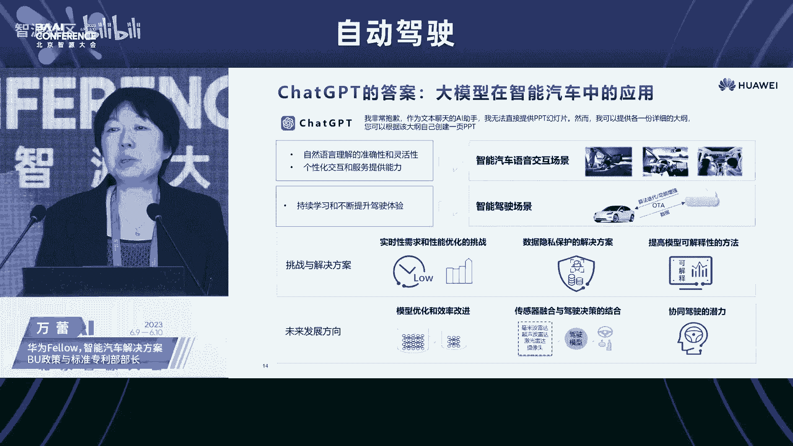

那么我这个就是我我想的了啊，就就不是那个PT回答的，就是智能座舱的这个交互。我们觉得基本上现在就可以使用，很快就能够产品化。就是今天的座舱呢感知控制甚至包音视频等等每一个传感器每个外设都是独立的。

然后那个就我这边就把那个绿色表征呢是感知的任务那个蓝色表控制任务。那么中间呢就是一个座舱座舱里面它是比如现在像驾驶员监控分布式麦克阵列3环是娱乐屏等等这个感知和那个和外设。

他在引入大模型这个数字人之后呢，他可以把融合感知和精准控制合在一起，能够非常好的来做这个信息检索意图理解内容生成智能控制。就我们会我们正在努力的把它引入到我们这个鸿蒙座舱里面去。

那么右边呢是举了一个那个案例啊，就是什么叫座舱全景智能？他他是一个非常好的管家。你可以说或者是保姆。你说那个父亲去接接女儿，说丫丫过来了，接丫丫上车，他跟那个车机来说，然后视觉感知到丫丫在后车门。

就把后车门打开了，上车以后就去系好安全带要出发。然后他爸接着就跟丫丫说就跟那个车说，妈妈今天过生日，我们去中关村哈根达斯拿冰淇淋蛋糕。他就不用跟那个车机说我要去哈根达斯中关村的哈根达斯了。

那那基本上车机小易自己就会导航启动去哈根达斯去了。然后那个丫头一听说妈妈过生日，那我要拍一个漂亮的白雪公主照片给妈妈然后那个车机就可以给丫丫拍一个照。

然后到网上去找白雪公主照片来生成一个漂亮的那个丫丫白雪公主，然后过一会儿小朋友们我要看佩奇，然后那个小易就可以知道说这是后车的丫丫要看不是他爸要看佩奇就可以把。😊，上次的那个第五集给找出来等等。

等那个孩子睡着了，他也能够检测到。所以说这是一个非常连续的这样的一个交互的情景智能。还有什么自动控制。那么智能驾驶里面呢，就是我这边也是从增驾驶三支柱，特别是那个预期工能安全开始讲。

它最重要的一个就是科这个也是那个法望总在在拉着我们还有包括那个产业界的其他公司一块来做这个合力可预见的这个场景级的这样的一个构建和管理。那么现在已经理出来的架构。

你比如说必须要场景筛选ODD啊危险行为行为刻画。然后数据拆选数据采集参数定义数据提取，然后再把他们进行组合泛化等等。那么那个海量的数据集。

其实你看涵盖的传感器的轨迹的地图的环境参数的适当动力等等动力模型。那个在这个场景的这个模型里面呢，它里面是种类繁多灵活多变。呃，真正享用的时候，实际上是一个常尾的。你要想想做优化分析，做测试的呢。

你用的基本上都是长长尾的用的是更多的。那么很多时候呃因为现在传统的这个场景都是先提前打好标签，你之前打了10个标签，你最后只能按照10个标签去给它提取。那我如果要看一些新的这样的一个类别。

我是我又得重新来改这个数据架构，这个是非常大的工作量。那么有了自然语言驱动这个多模态检索，它这个就非常好用。你比如说我按图片来检索。啊，然后然后还有按自然语言类型有动物的，然后按照时空的检索。

然后按照标签等解索，这样的话都可以很方便的把这个数据，特别是常尾类的那个 case或者边界case或者是典型case都可以都可以很快的那个管理出来，聚类出来。包括场景挖掘。

那么就接着刚才说就是那是我有那么多数据，我如何来挖掘的情况。那么有一些新的像刚才那个前面几位专家嗯，还有季老师说的，我要新的那个场景，一些 case的场景。

还有一些我没有那个没有提前采集到的一些边界场景。那么真正要达到我们自动驾驶的这个安全性评估的这个训练的这个数据呢它会从PB级到达EB级这样一个量级。而且要求场景的覆盖度会有一个明确的要求。

比如静态的然后动态的这几个维度的覆盖度。那么没有怎么办？一个是你花很多的钱去采，然后或者去去去买或想办法去共享，然后还一种呢就是生成生成的话，它可以基于那个传感器的参数，然后动静态的这场景参数。

然后2D3D的一些参数输入参与者驾驶驾驶员模型实案例等等。我可以构建出你像右边的交通参与者啦传感器的数据，后3D和4D的真值并且做自动化标注。然后以根据环境光照等我生成一些边界的函数。

这样的话就使得我们自动驾驶的这样一个训练效率。得到了极大的提升，包括那个测试也是有非常大的效率提升。那刚才两个很自然而然介绍的是离线的，因为离线简单呀，离线的话那个数据有地方存储。

然后那个计算算力也不是个问题啊，算力是问题，但不是特别大的问题。那么说那个实时性怎么办？在线怎么办？在线的话到底大模型什么时候能把小模型吃掉，或者说是不是还给小模型留个空间，这个事情是没有。

今天没有结论的，有的时候说不定有些小模型比较成熟了，可能还能长期使用。那么。小模型和大模型，我就列一下今天的这样的一个对比，可以看出互相之间都有优劣势。而且那个大模型的挑战其实更大。

大模型虽然泛化能力非常强，然后标注的话那个标注需求低，但是参数级的规模到今天为止太大了，还没有进行这个这个优化压缩啊蒸馏等等。然后他那个训练的算力呢，大模型其实就远大于这个小模型的。

然后它实施的推理的话，那个。今天的实时推理的话，那个算率就更大了。然后那个呃训练的数据的规模呢，也是至少十0的3次方这个量级大于这个小模型的。然后协同驾驶呢，实际上那个小模型这个是单独设计的。

大模型理论上的话可以自然语言交互。什么时候大家倒不知道。那么这边还是列了一下整体的这个智能汽车中的挑战。就是第一个就是说数据本身数据来源多么态的数据，自然语言直接可用，它就化成绿色了。传感器的数据呢。

它是需要很多类的传感器数据。虽然今天大模型没有把车的这个多类数据全用起来，但是至少这些数据能拿到不是啥问题。另外是场景需要很多的场景数据虽然也不全。

但是有实力的这个企业呢肯定也能拿到训练的话其实训练已经是比较高的台阶了。大模型是需要大于10亿量级的这个GPU的小失。

这是按照我们现在常规的L2和那个目前有些L3的这样的一个能力来计算出来的小模型呢是10到百万量级的这个GP1可以看到这个差距差距是巨大的。😊，但是好歹可能还是能拿能找到这么多云端的这个算力资源啊。

然后到了部署，现在就已经是一个巨大的一个门槛。无论是算力上面，你可以大模型的推理是如果不做任何压缩，它是一个onetops的，然后车端的话是个百tops。

然后那个内存大模型的这个推理刚才说的是一些典型的那个典型的小小任务的。那个大模型的内存方面，大模型推理是3350个GB。

然后那个车端是32个GB时延的话是按照刚才的这种就八卡的这样的云端的这样一个服务器的资源。然后那个差不多小十级推理一个任务，然后那个车端的话是1毫秒这样的一个级，它能达到实0。

就是特别我想当时脑子里就有这个形象，就是那个阿拉丁神灯，它那个灯神啊非常巨大。非常美，他但是他要怎么样能塞到这个部署的这个小小小神灯里面去，这是我们未来这一两年或者不止两年需要面对的问题。

其他的就刚才那个几位专家专门提到了像安全性汽车的高功能安全网络安全，现有大模型能力有时在实时的这个应用的时候，他是很难以达到的。还有一致性。因为那个大模型在自然语言使用的过程中，他他拟人嘛。

那个人他其实他的那个逻辑看起来是自洽，但它并不完全严谨，所以就一本正经的胡说八道，是大家对插GPT一个价。那么我们开车不能一本正经的胡说八道。这个东西是和生命安全相关的，所以要求一致性非常高。

安全性要求。那么最后呢就不得不说一下那个AI治理的事情。因为今年大模型这么热，但同时那个我们国际上那个最著名的这些精英们，他们都在呼吁要控制AI的这个监管。像。

还有就是图像得主神经网络之父的这个他们都说这个大模型现在可能对人类的生存已经开始有明有很强大的这个也非常非常明显的这样的一个威胁了。

那么应该说是至少暂停6个月这是重科技的这个大咖联名前属的暂人大型人物之内有但谁都没听啊。那个还有一个就是sam，今天sam也被邀请过来了，然后出席美国听证会。

然后他自己主动提出说是那个AI一定要加强监管，尤其是安全方面的监管。那个各个国家呢，其实前几年就已经开始启动了，只不过我相信今年会有加速。你像那个欧洲，我从1919年4月份的时候。

他就已经发布了这个可信AI的伦理指南。就是这8条。然后那个21年4月份这个AI法案就是对于high risk的话，它叫是那个限制。然后对于不可接受的话，它要禁止不可接受的风险禁止。中国呢也是8条。

19年6月份的时候治理原则。而且在21年的那个9月25号的时候发布了新一代人工智能的这个伦理规范，给出来了更更全的一个框架。今年的4月份呢就网信办发了生成式人工智能服务管理办法。

专门针对这个大模型GDP的美国呢实际上。就他特别自由的这样的一个国度。他，但是他对这个人工智能的监管实际上也提出来的基本上也差不多。就他的9条监管原则。今年1月份也发布了人工智能风险的管理框架。

那么到这个车这个领域，其实还是就AI的这个整个屏果治理呢，国际上有很多标准啊，像ITUIEC啊嗯，还有刚才ISoIEC这的这里面最主要我们想说的就这个ISo的这个PS8800。

它这个是呃面向AI安全自动驾驶相关的。而且给的相对来说已经比较细了。你像左边这个图里面。像那个技术的选择。设计相关的考虑，还有数据相关的管理运营期间的这个安全监控那个整个安全论据啊。

然后风险评估安全分析呃，还有包括安全推导等等。嗯，特别是在右边呢，他专我就是专门列出来他对数据管理的要求列的非常细，包括那个训练数据的这样一个管理全生命周期的管理。整个这个呃就是从开发设计。

从需求开发设计实施验证分析维护过程的这些全阶段全生命周期的这样的一个一些管理和可追溯性，预防和缓解措施等等。这个我们觉得还是非常非常重要的。就在最后呢实际上我们也是在跟踪这些标准呃。

就是我们公司呢也提出来，就专门针对智能汽车的这个AI的评估治理呢，提出几个维度建议。然后一个就是从数据合理的这个授权这个角度考虑数据安全和隐私保护。人机分工和人人类的监督这方面要考虑可追溯和可追责。

第三部分呢就是那个防技术滥用，要考虑算法。提示和透明可解释性，也希望跟大家一起把这个技术标准，就是AI评估和治理的这样一个标准尽快的完善起来，真正能够让AI为我所用，而不是成为我们的危险。谢谢大家。

感谢万博士带来了精彩的跨界的思考。最近几年呢，华为锚定智能网联汽车增量部件核心供应商在这个智能驾驶、智能座舱这些领域呢，持大的持续的加大这个研究和布局。应该说大家取得的成效呢，大家是有无共睹。

刚才万总呢这个从一个跨界思考的角度，对这个相关的工作做了一个系统的梳理，我想应该说对于大家的研究工作应该有非常应该是非常有价值，应该有很好的借鉴作用。因为我们今天这个这个会呢，刚才跟大家报告过。

我们的主题就是围绕这个自动驾驶和人工智能。我们邀请的嘉宾很多是来自于主机场。我们在那个理论探讨之后，接下来接到回归主机场，请主机场来给我们做一些分享。

下位报告嘉宾是比亚迪产品规划院院长助理电子计成部总监韩冰先生，韩总是广东省珠江人才计划创新团队核心成员，也是深圳市车载智能计算平台工程研究中心负责人。

他今天报告的题目是AI大模型在智能驾驶中的技术创新与探索。大家掌声欢迎。呃，首先感谢刘主任的介绍。然后刚才听了咱们专家的这么多的分享，自己本身也是非常受到鼓舞。

而且感觉到大家的所有的方向基本上都是非常一致的。那今天非常有幸受组委会的邀请。我今天想在这里面给大家做一个分享。啊，刚才主任已经介绍了，就是BI大模型，在整个智能驾驶当中的一个技术探讨。

然后另外一个就是想更新一下咱们大现在比亚迪的一个大概的一个更新吧。那今天呢聊到一个智能驾驶，就不能不提咱们的AI人工智能。然后以深度学习为核心的人工智能。然后自2012年起到现在就一直不断的突破。

那以transformer为基石的这样的大模型，也渐渐成为了咱们算法研发的一个主方向。啊，自去年12月以来。AI领域随着咱们这个chatGPT的一个火爆，让大家更多的认识到了咱们大模型的一个价值。

那我们再快速看一下咱们的智能驾驶的一个呃算法研究。那今年呢呃大家可以看到是从多个，然后这种单任务的模型逐渐也正朝一个统一的一个多任务的一个模型。

然后也出现了咱们基于transformer这样的1个BEV的算法，还有咱们的一个占据网络。那并且呢还朝着一个咱们端到端的这样的一个趋势发展，然后将这个感知预测规划控制统一在了一起。

那在这样的一个呃背景下呢，就是比亚迪在这个大模型的研发上也投入了很大的一个精力。今天咱们就围绕着大模型的这样的一个典型的几个特点，一个是大数据大的模型大算力。然后还有以至于未来的一些展望。

来聊一聊咱们比亚迪在智能驾驶室的一个研发工作。呃，首先呢大家都知道，只有大的数据量才能够建立大模型。那这些数据包，包括车身周围的这些的环境感知，以及自身的定位数据，还有咱们归控的数据。

功能运行的数据等等。那环境和归控的数据呢，可以通过标注，用于咱们的模型训练。呃，环境数据呢还可以数字化成为咱们的场景库，用于咱们的规控以及整车的一个仿真测试，基本上业内咱们都是这么来做的。

那最后呢再通过咱们的试车的一个部署，然后提高咱们的一个路测的一个精准度。那说到了大数据，就离不开咱们的一个数据闭环。那作为咱们智能驾驶的这样的一个算法研究。

智能闭环以及咱们的工具链是咱们研究的一个基础设施。我们也在推动了整个数据闭环攻击链的一个研发。在这个数据闭环中打造一个数据中台的一个底座，实现各环节上的各呃各环节的一个上云。

而且呢让我们各环节的一个数据也可以做到可视化，推动研发工具链的一个统一部署和构建。然后并最终通过我们的CICD的一个实车验证，实现一个全链路的一个运转啊，这是我们之前对这个数据闭环的一个系统建设。

然后当前的我们的一个什么状态呢？就是说我们通过这样的一个数据壁垒和我们的伙伴，然一共积累了已经是有150多BP的一个数据，并且每天还会新增1个BP的数据。这些数据大多都是通过大模型呃，稍等一下。

这些呢大多都是通过一个大模型的一个纵标注，用于我们下游的一个训练任务。呃，预计今年还会累计有6亿公里的数据，并在未来几年通过咱们的一个岩采车辆以及量产车辆实现一个指数级的一个数据储备。

解决咱们智能驾驶的一个常尾问题。呃，那下面的话我们来一起看一下咱们的大模型的一个研发。对。基于大数据量的这样的一个积累呢，我们的研发也是朝着一个数据驱动的一个大模型。当前感知和规划的算法中。

感知模型已经可以把多任务整合到一个大模型中，而且覆盖了我们的持续检测融合跟踪，还有我们的预测全流程。但我们的这个规划决策还是从主要基于这种规则，然后逐渐变成了咱们深度的学习为主，规则为辅。

那感知和规划呢都在不断的这样的一个迭代和优化。这个和上午，咱们的一汽的刘总也是同样的一个观点啊。Yeah。那咱们目前的一个模型的开发感知模型的开发，已经做到了是百分之百的一个数据驱动。

我们研发了有多相机的BEV的模型，而且计划是今年可以做到量产。BE模型呢，基于多相机多时序，已经实现了1个360度的一个环境感知。那此外呢，在云端开发部署了多传感器。

多任务的一个transformer的大模型。그。那对于这个BV的感知呢，就是把我们的。这种多传感器多帧输入，统一建制到我们的BEV的空间，在BEV空间做到特征级的一个融合。

然实现了对我们的一个动态和静态目标的1个3D感知。呃，BV感知呢是咱们比亚迪当前呃自研高阶行车算法，而且呢也能够在高阶智能驾驶上实现一个弯道超车。同时，我们在结合的比亚迪车辆的一个一思方的平台。

正在研发出一些比较具有特色的一些高级驾驶呃辅助的一些功能。同时呢我们在这个云端，然后打造多传感器多任务的一个感知融合大模型，服务于各类感知辩证以及标注任务。

云端大模型的特点呢就是把多感知的呃多感呃多传感器的一个融合，空间和时续的一个融合。那模型的量级更大，然后支持多任务的一个输出，实现了一个融合与预测信息共享的一体化学习。

然后满足了我们量产的各种场景实际场景的一个需求。呃，除此之外呢，我们的大模型呃也可以用于针织系统的一个自动标注。我们围绕呃我们围绕相机和激光雷达结合时序，建立了4D障碍物自动标注的系统。

通过历史数据中挖掘以及车载数据中按照条件回流，得到一批可以用于大数据的一个调优的一个小数量级。然后再结合咱们的大模型局部建图，然后标签，然后迁移快速的方法产生一大批真值的数据。

那这个真实的系统的优势大概有4条啊，我们总结出来，第一条是以激光雷达的数据为核心，精度会更高。第二条呢就是结合了持续的4D真值感知的范围会更广。然后第三条呢就是我们的数据驱动，以小数据动的一个驱动。

然后呢，在快速的迭代的一个模型。第四条呢对新章L的类别也可以快速的得以扩展。那真值系统为我们的算法研究，每天可以输出大量的数据，也减少了我们很多的人力成本。那下面的话就是谈一下我们的大算利平台的建设。

大算利平台的建设前面已经很多提到了一些云。那我们这里面更多的想分享一下，就是我们在车载端。这样的一个大这个这个算力的一个部署啊。就是我们现在对一些核心的一些的技术研发，特别是呃包括我们的支架操作系统啊。

预控制器啊，还有这种易购的，然后高内聚地耦核的这样软硬件的开发能力。还有包括我们的协议站和工具链。比亚迪基本上是可以做到一个核心自主可控。那这个平台呢也很快就会嗯搭载到咱们的这个呃旗舰车型上。

当前已经具备了500T的这样的一个算力。啊，而且呢内存也达到了64GB。

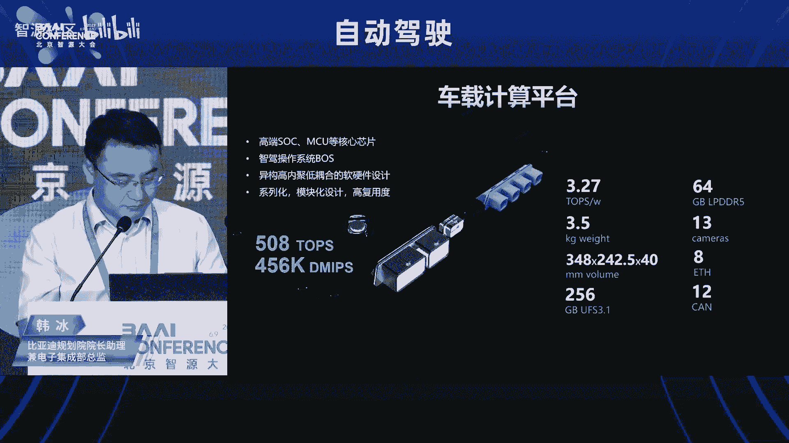

嗯，除了这个之外的话，因为对于车企来说哈，跟那个咱们的那个研发机构的同行更多的关注于是如何把这个变成我们的工业化产品。那这样的话就得需要快速的一个开发，而且还得保证我们的一个品质。

这样的话就是我们整个软件平台，包括我们的整个制架的一个硬件平台，它的开发，都是进行一个模块化的一个分工，可以并行的协同开发。这样的话让我们的产品可以更加的可以可靠，可以降低我们的研发成本。

然后把优质的代码，还有我们的模块运用到量产产品中。这样的一个分工，让我们可以实现一个高效的合作。那讲完刚才说的大数据大的模型，还有算力平台之后，我们再看一下我们自己当前面临的一些挑战。

还有一些应用的一些展望。就是我们现在呢就是进一步的会实现我们的感知预测决策规划全流程的一个完全数据驱动的大模型。然后包括针对我们的占据空间建模，还有对路面标识的一个检测，还有对决策规划的建模。

用海量的数据来支撑更加精准的一个感知，然后更接近咱们老司机的一个决策规划，为用户带来一个更加的一个体验。这样的一个产品。嗯，其中呢我们的决策规划大模型将采用transformer的一个架构。

然后的进进行一个我们的深度学习算法，也是采用一个一级的专家数据来进行训练。此外呢，我们将建立呃比较强大的一个基础设施，然后构建我们的决策规划数据的一个模型呃产线。然后这样的话。

我们每天可以自动生产大概呃1400万公里的数据。然后并基于这样的一个算力平台，可以快速迭代我们的决策规划的一个算法模型。嗯，最后呢就是我们当前的支架系统提的更多的还是属于感知智能。但是对决策规划的模块。

现在是我们支架性能的一个瓶颈。它的复杂度和感知问题相比来说是指数级的增长，而且没有一个唯一性，没有唯一解。然后随着节策规划大模型的一个应用研发，我们呢也希望从感知的一个智能。

然后进化到我们一个更高级别的一个认知智能。然后目前咱们全行业还是停留在一个rub的一个阶段。我们计划将数据驱动的决策规划也用到我们的量产中。嗯。

就是我们呃我们比亚迪也是希望能跟咱们和行业的各个小伙伴们一起来合作。然后能够把我们的这个未来的这样的一个认知智能能够尽早的能够实现。好，以上就是我的分享，感谢。这个感谢韩总的精彩报告。

韩总呢跟我们分享的比亚迪在这个。智能网联汽车智能驾驶这个领域所做的很多的工作。刚才开篇的时候，黄老师也提到，前段时间，王传福董事长接受采访的时候，觉得这个无人驾驶有点扯淡，可能有点虚头巴脑。

但是我想结合刚才这个韩总的这个分享，我觉得咱们更准确的理解是不是这样。就比亚迪可能对于自动驾驶，尤其是无人驾驶，在短时间内大范围的落地应用，可能是比较谨慎的态度。但是比亚迪在智能驾驶。

这个这个领域的投入从来没有止步。韩韩总，他们这个团队还一直做研究，我觉得这可能是一个更加准确的理解。结合上下文啊呃我觉得这个可能是更更更准确一些。

下面我们请这个未来自动驾驶首席数据科学家张一飞先生来给我们做报告。他报告的题目是科技家场景的未来自动驾驶，大家掌声有请。大家下午好，那个谢谢刘主任。

今天让我有这个机会来这里跟大家分享一下我们对于自动驾驶的一些思考。今天在座的其实很多都是汽车产业的嗯。专家或者前辈，就我来做一个班本弄斧。就汽车产业呢，其实我们在做自动驾驶的时候。

我们首先其实思考这个过程，或去回顾了一下汽车产业的四次变革。那汽车产第一次变革呢毫无疑问，就是汽车第一辆汽车，它到底是怎么产生的。那在1885年，德国人奔驰研制出了世界上第一辆马车式的三轮汽车。

并且在次年获得了第一个发明专利。这一天也就是现代汽车的诞生日。这个在产品商业的逻辑里面，其实我们可以认为他第一次定义了什么叫汽车，也就是一个what。然后第二次变革呢是在福特汽车公司。

他们借鉴了一些其他行业，把流水线的生产引入到了汽车行业里面来。那他这一个变革呢，使得福特的T型车一共达到了1500万的一个销量，创造了一个至今都难以企及的一个世界纪录。那么这个变革。

它实际上没有重新去定义一款产品。但是它使得这一款产品怎么样能够规模化，取得了一个非常大的突破。也就是它在号上面取得了一个非常大的突破。那第三次变革呢就是丰田在70年代，它去创造了精益生产这个理念。

通过把整个生产到销量销售的整个过程的整体优化，在技术上，物流上库存，包括原材料全方位的精益化的管理。通过把成本不断的降低，使得整个。汽车的成本和销售价格大幅度的下降，受众也大幅度的增加。

进一步的扩展了规模化。那么这个就是我们看到的前面三次的一个变革的过程。第四次的话，就是自动驾驶。自动驾驶。其实我们也想过说，那自动驾驶对汽车行业来说，它到底是一个号上面的变化。

还是一个what上面的变化。最后我们的结论还是认为他我们倾向于认为它是一个what上的变化。因为就类似于当时苹果去定义智能手机，可能智能手机和手机可能在我们现在看来，它其实就是两款产品，而不是一款产品。

呃，如果自动驾驶，有一天真的能够落地实现，那么汽车可能不仅仅在是当年它产生的时候只是一个人类驾驶的代步工具，而是有可能是一个移动的场景，可能是移动的家，也可能是移动的娱乐场所，都有可能。

所以我们认为它还是一个what上面的变化。那真的这个what。怎么让他去follow像刚才第二次第三次变革里面的how，就是怎么样的去规模化，怎么样的去成本化精益的管理。那第一步呢就是规模化上面。

我们可以看到过去其实威某和特斯拉他们的跨越式的路线和渐进式的路线。其实已经有相当长时间的PK。虽然说现在这个PK还不能说已经画上了句号，但是目前来说的话，特斯拉的渐渐式的路线可能是目前的一个主流。

但所以我们在我们看来，特斯拉的这个路线实际上有点类似于当年福特去定义流水线。数据闭环加人工智能，尤其是今天我们大家都在讲的大模型的人工智能，它可能就是自动驾驶这个产品里面的流水线。

那自动驾驶这个领域里面，他需不需要精益化的管理呢？这个问题也是我们一直在思考的一个问题。我们回顾一下人工智能的过程。其实。从最开始最开始的一些简单的规则，比如说在搜索领域里面是最典型的。

从最开始的专家系统，然后到后来逐渐的机器学习，到后面逐渐的引神经网络，大规模的神经网络这么一个过程。其实它能够迭代到这个过程，一个非常重要的原因，就是因为它能够不断的去收集人类的反馈数据。

就是点击翻页或者是浏览的时间长度，包括到后面的。tktok抖音这些推荐其实都是类似的一套，他们都非常依赖就是人工产生的大量的数据，所以使得他们能够引入大的模型。

包括像最近就是大家大火的能够让大家都来聊大模型这件事的TT其实在从他1到3，2020年的时候，3，它的参数规模已经到了1750亿这么一个大的规模上面。但是为什么3，它并没有成为一个在业界引起非常大的。

博览的这么一个。技术而是到了chaapGPT出来之后，他才能够去。掀起这么大的一个影响力。这其中有一个很大的变化。

就是因为在于chatGPT它在chatGPT standard在GPT stand基础之上，它引入了re learning from human feedback。对，也就是人类的反馈。

所以我们可以看到整个。人工智能的发展历程里面，人工反馈在里面的价值都是不可忽视的。而在自动驾驶里面也是一样的。其实刚才前面大家都有讲到，比如说我们通过接管或者更严重的一些问题。但他这就是一个反馈。

而这个反馈，相比就是我们过去说的不管是搜索还是广告还是推荐，他的这个反馈其实所付出的代价是完全不同的。我觉得刚才万总说的有一句话，我觉得还挺。犀利的就是我们可以容忍chGPT胡说八道。

但是我们没法容忍自动驾驶，一本正经都胡说八道。我觉得这个其实特别的形象。所以在这个前提下的话。😊，我们认为自动驾驶的整个发展过程，它其实是需要符合三个闭环的。

第一就是它需要在整个事前事中事后都能够在数据安全、生产安全，包括驾驶安全、资产安全、公共安全，各个方面都需要有政策事前事后的闭环。同时呢自动驾驶它本身在车辆上面就是一个非常资金密集型的一个行业。再加上。

大算力大模型同样也是一个资金密集型的行业。所以在商业上它也需要闭环。只有在这政策闭环时候商业闭环的支持下面，然后我们去完成我们的技术闭环，才有可能把自动驾驶整个落地。而这个技术闭环呢。

就是我今天今天下面想分享的我们的一些思考。就是我们把它抽象为科技加场景。某种程度上呢可以理解为科技就是以大模型为代表的人工智能，可能后面还会有比大模型。更先进的一些人工智能的表现。

而场景呢就是我们希望在。找到一个能够安全的去辅助大模型，帮助大模型逐渐的落地这么一套场景，精细化的场景的管理的体系。这就是我们认为场景可能会是在自动驾驶这个产品里面，它的精益化管理的体现所在。

更具体的来说呢，它会分这么两大趴。在最左边这一part，就是我们刚才提到的科技，可能也就是我们的整个人工智能的一套体系。在最右边呢就是我们的整个场景的精益化管理的体系。这里可能看起来有一点点抽象。

我举个例子啊，就是因为我们未来其实大家知道是有换电这么一个概念的，所以换电这个场景可能是一个挺特殊的场景。那么在这个场景里面呢，就换电站它其实比较特别。第一。

它其实没有车到线这些就是我们平时大家路上常见的元素。第二呢。在这个换电站，它往往是建在一些大的厂站里面，它里面还有一些其他的元素在里面。比如说别人的商店啊或者什么之类的。那么这个里面其实它是很难通过。

就是我们常见的现有的。训练或者是数据手段来进对它进行优化的那这个地方呢，其实我们可以对它进行根据用户的经验路线做定制化的归控。这就是我用一种精细化的场景运营。啊，同样的类似的还比如说像在施工里面。

我们其实包括像目前的施工或者别的一些ODD的一些东西，其实我们认为仅仅当他out of你的ODD的时候，我们就得就退出就直接就让用户监管这种体验也不是一个好的体验。所以这种体验下面，我们觉得也。

既不能达到很好的可用性，也没有达到一个很好的可靠性。所以我们会在这里去做更多的精细化的场景管理的一些动作。而他们的基础呢就是第一就是我们有需要通过自有的车队以及用户的反馈共同去形成这个车队的管理体系。

因这里为什么会提到用户呢？因为就是呃。未来也有一个比较有特色的地方，就是它有一个非常大的社区，就是用户在这个社区里面，它的互动性特别高，也很愿意参与到就是去帮助未来去优化一些产品的这些建议上面。

所以就是我们这个用法体系，再加上就是我们的通过数据形成的一套度量体系，在他们基础之上会有一个智能化的诊断系统，通过诊断来细分这个是。如果是模型迭代能解的，我们让模型去解。如果是模型暂时解不了的。

我们通过精细化的场景运行管理去解。这就是我们的整个对这个体系的一个思考。那么这个体系呢，我们觉得如果要把它完整的推动下去，使得整个大模型能够更好的落地，能够。最终走到终局上面去。

我们觉得有几个必须依赖的事情。第一个就是在。

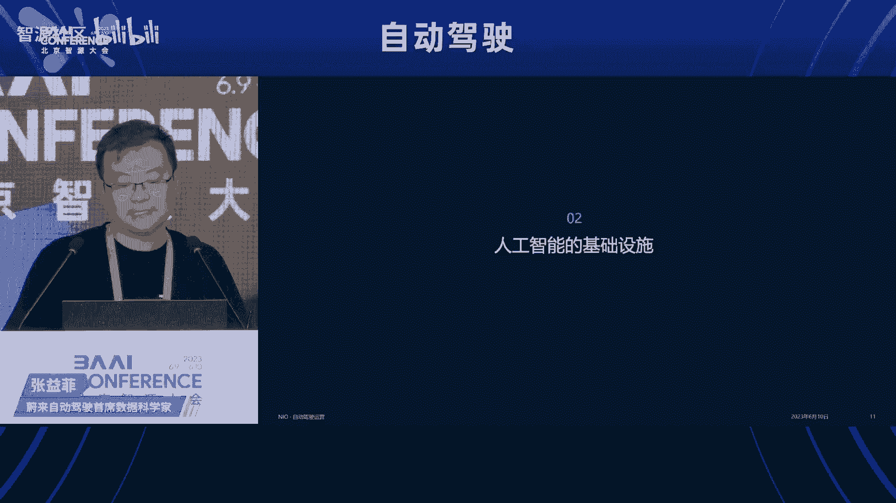

车端的整个战略平台上面，我们需要本着长期主义的思想去设计它。为什么呢？就是其实刚才有在万总的PPT里面也提到了这个概念，就是在大模型，为什么大模型现在能够成成为一个。比较。领先的趋势就是在深度学习里面。

其是它有一个涌涌现的概念，就是他发现当参数规模达到一定的规模之后，它不再是它的模型的效果，不再是一个线性的增长，而是一个可能是指数级的增长。那这样就意味着我们其实在车端要预留更多的算力。

如果基于现在的成本去考虑，在车端就没有预留足够的算力。那其实大模型到到最后就是云端你训练出来的一个好的大模型。在车端经过蒸馏之后，它其实也没有办法落地。所以就是在设计硬件平台的时候。

就需要就是本着长期主义的考虑，去尽可能预留尽可能的空间。这也是我们一直来以来在做的一个事情。

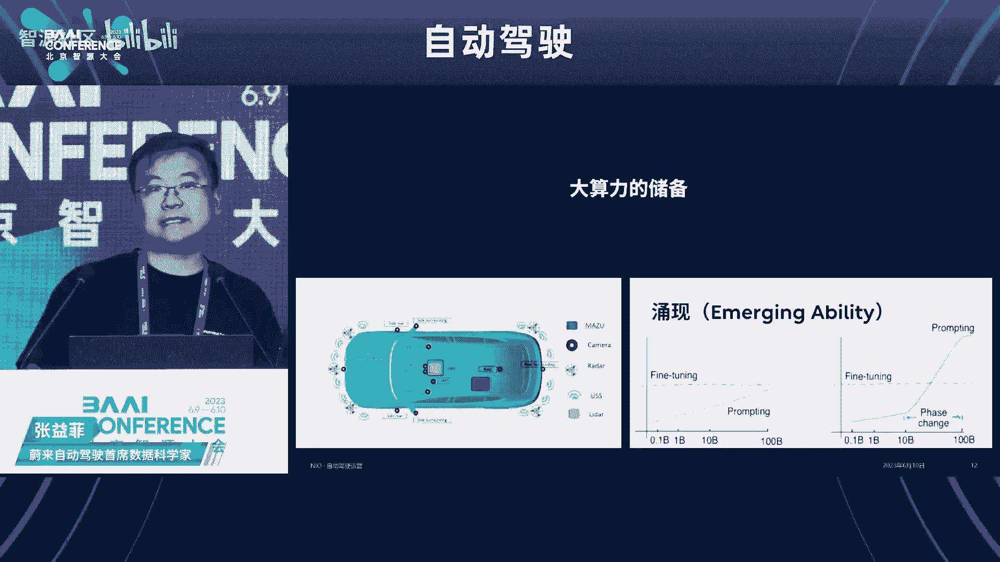

第二呢就是在数据基座上面。在数据基座上面，我们会认为就是过去呢大家可能fox的点都会在点云图像这些非结构化的数据上面。但是其实就是还有相当多的结构化的数据。他们在整个做场景的精细化管理的时候。

和这些非结构化的数据结合起来。他们是可以发挥非常大的价值的。而这些非结这些结构化的数据，他们在汽车这个领域里面用互联网公司的这套体系，其实是不是那么匹配的。

第一呢就是它其实需要有一个更先进的湖仓一体的数据架构，就来整合非结构化和结构化的数据，同时为在。大量的非结构化的数据上面进行数据挖掘，去做好准备，大大的提高了计算的速度。

然后第二呢就是在实际数据库的应用上面，因为车辆的数据跟互联网的数据有一个非常大的不同。就互联网的数据呢，它其实是用户量非常大，就我们都知道好多互联网公司可能都是。亿级别、10亿级别的用户。

但是互联网的用户，他生产的数据相比一辆车产生的数据其实规模要小很多很多。所以在过去的数据架构里面，其实它会更偏向于去聚合这种用户之间的这种数据。互联网。但是在车是反过来的。车其实它的数量不会特别多。

可能百万级千万级已经算一个非常大的车辆数了。但是每一辆车每天产生的数据量，即便不考虑点云图像、视频这些。呃，非结构化的数据，结构化的数据像车辆的归控的信号。包括像车辆的硬件的信号。

这些也都是发现相当可观的一个事情。所以他必须用持序的方式来解，才能够得到一个更好的解法。所以在数据基座上面，我们也是需要去重新打造一套更适合自动驾驶的这么一个数据基座的。

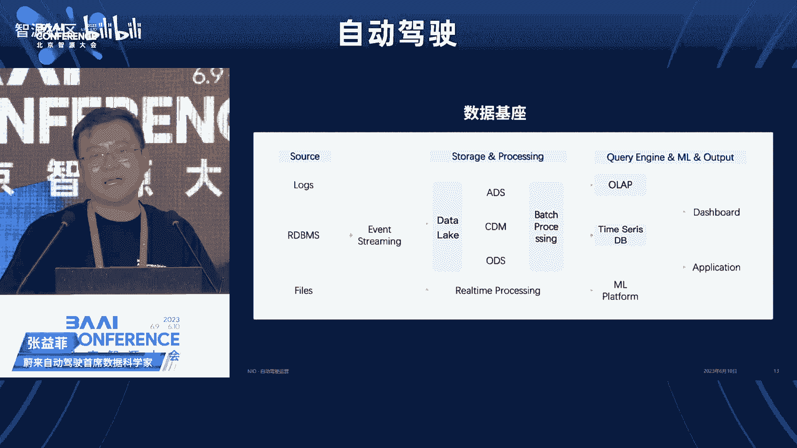

基于以上这两个基础能力呢，然后我们下面就可以去做，就是围绕着大模型通用能力之外的，它还解决不了的concast的精细化场景挖掘。那这里边就有一个概念是什么叫场景？就是高速公路可能算一个场景。

城市环境可能算一个场景，路边也算一个场景。但是这个场景在我们整个物理世界里面，它怎么能够抽象成就是数字世界里面一个离散化的定义。因为物理世界是连续的。但是我们的计算机世界其实是一个离散的世界。

包括说高速公路，那高速公路呢还分两车道的高速公路，三车道的高速公路还分好多种。那他到底算不算同一个场景。然后所以我们这里经过我们的一些思考呢。

我们会觉得在业界有一个exstar这么一套场景的体系是我们目前认为会比较合理的一套体系。我们会去借鉴它往下进行挖掘。这一套体系呢，它把场景分为了6层。第一层是。道路的几何就是包括道路的曲率高程。

坡度等等这些基本的几何信息。第二层是道路的交通标志物，比如说红绿灯，比如说限速标志等等这些第三层是动态事件，就像追同就是或者是事故或者是封临时的封路。这些动态的事件。第四层是最重要的就是交通参与者。

因为交通参与者，其实是最难去描述的一层，也最难去定义的一层场景。这包括就是像。行人包括像三轮车、摩托车和汽车，各种各样的汽车。那第五层呢是环境，就是比如像像天气等等。

第六层其实是前面五层的一种数字化抽象。比如说高清地图，比如说就是车路协同的一些信号等等这些。就这在这一套体系下面，我们其实去可以去。对场景就可以把它映射到一个高维的空间里面去。

在这个高维的空间里面去和我们的另外两个坐标轴上面的数据进行交叉。包括像体验和。质量上面的指标，比如说接管率变道的成功率，包括像我们的实际上的原因，比如说是感知的问题，或者说是硬件的问题。

或者是地图的问题等等这些这三个坐标轴上的交叉。在这个多维空间里面去挖掘。我们会得出，我们认为需要去精细化的管理的场景去往下进行进一步的动作。同时这个场景的挖掘。

其实它也借鉴了就是我们整个人工智能的发展历程。首先是通过经验规则。然后在经验规则下面通过弱监督的机器学习。然后在这个场景经过仿真去验证。然后最后经过车队的实车的验证，最后去验证我们这些场景。

最后再去释放给用户，就这么一个逻辑。而这里面就刚才提到最后一步就是车队的实车验证，是我们非常重视的一个场景。因为虽然说仿真目前它确实是一个可以提高效率非常大的一个环节。然后但是其实在仿真这个环节里边。

它依然有很多con case是它模拟不到的。所以本着用户。为为上的考虑。所以我们其实在实车上面会做的会更加的精细化一些。这里面就提到了，就是我们需要去做精益化的车队调度的管理。

车队的调度其实在业界也也有挺多相似的地方。比如说像美团的配送，比如说像京东的物流，它本质上其实考虑认为就是一个VIP的问题。这个VIP的问题里面核心有三个要考虑的点就是决策变量目标函数和约束条件。

那在我们的这个场景下面呢，就是它的目标函数和约束条件都是非常有挑战的。我们的约束条件会非常的多。而且VIP问题它本身就是一个NP hard的问题。这个。挑战本身接起来就会非常大。

我们其实很难得到它的最优解，而只能找到它的一些次由解。而我们在这个里面，因为我们的约束条件特别多。第一是说我们其实我们派出的车，它不一定都是从同一个地方出发。

尤其是后面我们也有提到说在用户测用户愿意参与进来的时候，那用户就更不可能它的点会更惨。然后所以他有可能是一个MD的VPVP的问题，然后另外一层呢，如果我们其实对自有的车。

它其实会有每个车它有它的电量上限，那其实它会有它的距离的限制。那这个时候他可能会变成一个DVP的问题。那还有可能他其实会有时效的限制。比如说我们知道这里有一个施工，我想去验证它。

那如果我过了一天两天再去验证它那个施工可能已经不存在了。那我再去验证它也没有意义了。那它有可能变成一个GW的VIP的问题，所以这个问题我们到底把它抽象成什么一个问题。😊。

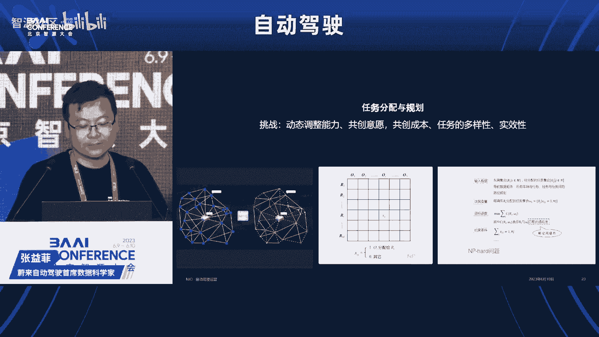

也是一个经过了很多思考在里面的过程。最终我们是把它抽象成了1个MD的VIP的问题。然后并且在这里面去融入了时间空间上面各种约束条件。然后去找到退伙算法的去找到它的一个相对最优解。

而这个过程里面除了算法上的挑战之外，工程上的挑战也会非常大。因为这里面核心的一个呃。目标函数里面的值其实就是ETA的预估。然而ETA实际上我们在这么多的路网下面，每一个地方的路网。

他要去都去实时计算的话，基本上没有哪一家图商能够承担这个QPS的要求。所以这里边其实需要去做冷热储备。然后这样的一套召回家金牌的这么一套体系。

最终然后我们才能够在车队上面去让车队去实践的测试我们的一些任务，从而时向最后去示范给用户，然后才能达到说我们对用户既保障可靠性、可用性。然后同时能够让我们去呵护着我们大模型，他不断的去成长。

最终达到一个。自动驾驶真正落地的一个。愿景以上就是我今天给大家的分享，谢谢。感谢张总的报告。张总刚才结合车辆的这种特殊的应用场景，分享了未来如何采用数据驱动的这种模式。这个所做的一系列的服务。

包括车辆的运行和这个运营的调度，以便于这个车辆更好的服务于人类。这个今天亚洲的演讲嘉宾是文远之星，北京研发中心的王志谦总经理。王总呢专注于继续学习和sme领域，曾带领团队呢攻克地图定位等行业难题。

将人工智能技术呢应用到自动驾驶的多个领域。他今天报告的题目是自动驾驶通用型技术平台与商业化陆地探索，大家欢迎。呃，谢谢刘主任的介绍啊，压轴是真不敢当，但是确实是最后一个了。今天的话是周六的下午的话呢。

大家也确实很辛苦啊，这个也完全理解。其实我自己的话呢，除了除了上台分享之外的话，我也是一个听众从头到尾的话，在这里听各位专家的分享和学习，我自己也是感觉收益匪浅，尤其是的话呢，我作为最后一个的话呢。

觉得是里面有一些嘉宾非常好的高屋见瓴的做了一个分享。我这边的话呢，恰好有一些实力化的东西可以跟大家的话来汇报一下。然后我作为最后一个分享者的话呢，一方面是学了前面的很多精华。

然后呢在讲的时候呢可能也会有所引用。另外一个的话呢，就是呃我自己也会尽我最大努力给大家贡献一点时间。因为确实都挺辛苦的。好，那我们就现在开始呃，第一点的话呢，还是照例对文远做一个非常简单的介绍了。

因为文远本身来讲还是一个比较小的公司。但是呢跟今天主题相关的话呢，其实就想跟大家来汇报两个数字。一个的话呢是呃文员本。😊，真的呃产品还是非常丰富的。我们技术方案是一套。但是我们有很多的产品。

随着在不同的城市的落地和部署的话，大家也会越来越多的看到文远自动驾驶的产品。第二个的话呢呃文远已经累积了1600万公里的这个自动驾驶的里程。然后这个自动驾驶的里程的话呢。

是通过我们呃这样一个大规模的车队来实现的。然后这里边的话呢就涵盖了我们前面所涉产品，从我们最常见的ro taxi到我们的小巴车，还有我们的环卫解决方案，还有货运方案。

这些的话呢都是在市面上直接去进行运营，也就是能够直接去证明自动驾驶的技术的那大家可能会有有所疑问的话，就是文远公司规模并不大。但是为什么会有这么多产品是如何去实现的呢？其实这里的核心点的话。

就是我们称为v ride one的话，这样一套通用化的解决方案。它其实的话呢是一个自动驾驶的一个完整的技术站。从最底层的硬件到我们的。中间件软件，还有我们车上的智能软件，再到我们呃整个云端的大脑。

也就是有了这样一套系统的话呢，我们可以在不同的城市，不同的场景，不同的产品上去实现自动驾驶。然后这个全站式的通用技术平台的话呢，它其实有几个特点。从硬件本身来讲呢，第一个特点的话就是模块化。

我们可以看到很多产品很多形态，很多场景。但是呢通过我们对硬件的模块化处理。在不同的平台上，它部署的是相同的模块，只是一个不同的组合，通过这种组合的话呢，让我们的产品能够更广泛的进行复用。第二个的话呢。

就是我们在往上的软件这一块这块的话呢，在有了硬件这个基术之后呢，就会实现起来更容易。然后由我们呃整个的从中间件从驱动到中间件再到我们车上的这种算法，整个都会做的非常的通用。

最后这个场景这块的话就更加普遍了。尤其是呃我们在从一个场景复制到另外场景的时候，其实就。是一个复制只有很少很少的迁移的一个工作。呃，我们接下来的话呢是看一下整个方案，就是具体的来讲是如何来做的。

首先从最底层的硬件开始，硬件这块的话呢，大家应该对自动驾驶系统都很熟悉。自动驾驶系统的演进也是非常非常快的。在几年前的话呢，我们在路上的自动驾驶车辆头顶上的话都会顶着一个大花盆。

然后那个一眼就能够看出来。但是现在的话呢，随着我们传感器技术的提升，还有我们工业化设计的美观化的整个方案的一个演进。然后自动驾驶车的话呢，现在其实跟我们普通的车辆来比的话呢。

已经从外观上来看已经非常像了。在川流不息的这个车流里面的话呢，我们看到一辆车，它可能外观和我们普通车一样，但是它确确实实已经具有了自动驾驶的功能。呃，通过我们对不同的模组的升级。

还要对传感器的不停的优化。然后呢整个车已经做的非常的整个车的传感器套件已经做的非常。小巧，做的非常的实用。然后接下来的话就是跟我们呃今天讨论的议题非常相关的。也是呃前面的嘉宾都讲到。

我们在自动驾驶里边的话，会涉及到一个常尾的问题。那么这个常尾的问题的话呢，它具体的会指哪些呢？我这里的话呢就稍微举了一个类。其实按照我们内部统计下来的话，这个类的话应该是在几千这个级别。

甚至还在变得更大。这里举例的话呢，这些车当我们把它拿出来之后的话，大家可能感觉这个情况我好像似曾相识。

但是我们如何能够让自动驾驶的系统很好的去学习到这些车能够很好的去识别它对它做predict跟它进行交互。所以的话呢我们从呃大模型应用来讲的话。

第一个非常实用的地方就是把我们所建立到这种呃交通的参与者把它给更加精细的建模出来。建的模的话呢，第一是有一个精细化的建模让每一个的回归到自己的属性。第二个话呢。在上面有一个更高层的抽象，让我们的话呢。

即便是不同的状态的车，我们也能够很好的把它给索引出来。他们毕竟有共同的属性。这里面举的都是我们呃在无人在自动驾驶测试里面很常见的一些场景。啊，当然呢除了动态的这个场景之外的话呢。

我们还会有很多静态的场景。比如说静态场景里面常见的啊，从第一类开始是我们的交通设施。交通设施本意的话呢，是为了让我们的车能够更好的去呃去开，能够更好的去驾驶。但是呢我们的交通设施的话呢。

也会发生一些故障啊，一些异常的。最早期的自动驾驶的话呢，主要的技术就是在怎么去识别这些东西啊，怎么去处理这些通用的场景或者说正常的场景。但是现在的话呢，更多的精力其实放在这种异常的场景。

把它及时的发现出来。比如说倒在路上的护栏，本身的话它不仅仅是一个护栏的问题，而是倒在路上的护栏。这个护栏的话，不管是对。驾驶的车辆还是对人的驾驶都是有一定的危险性的。所以能够把这些识别出来。

然后交给我们对应的管理部门进行处理。呃。第二个的话呢，跟我们自身的逻辑会比较像的。就像路上有一些垃圾啊，或者有一些这种呢呃阻阻碍道路的一些情况。这种情况的话呢，因为文员本身产品非常的丰富。

我们有自动化的清洁解决方案。所以的话呢当我们对路上的垃圾进行进行分类之后的话呢，有一部分垃圾的话呢，是我们自动清扫车能够直接处理的。还有一部分的话呢，这个就我们自动化的去作业就好了。

整个效率还是非常高的。还有一部分的话呢，比如说是那种比较大件的或者是一些建筑类垃圾，这个的话呢需要做特殊的处理。但是我们在无人驾驶车上的话呢，第一点要保证的是我们能够很好的识别出来。

然后进行下一步的分类和处理。对于大件的来讲的话呢，我们要有一个很好的方案把它给绕过去。然后让我们的车能够安全的行驶。最后一点的话呢也是道路在使用过程中经常出现的，就是这个路用久了，难免会发生一些损坏。

以前的时候的话可能主要靠人的巡检啊，靠人的一些检查。这样的话呢一方面是比较好经历。另一方面的话呢，效率也不是很高。但是无人驾驶的话呢，在大模型的加持下的话，其实很容易可以把这类场景识别出来。

相当于是我们有一个很高效很高频度的这样检查员这么一个角色。呃，那整个方案是怎么来做的话呢，分成两个部分来介绍。第一部分的话呢，就是我们如何去对这么多的场景进行一个建模和索引。

整体来讲的话就是我们一个在线的解决方案，也就是说我们呃利用大模型的技术，这里面其实本质上讲是以c为主的。然后呢把我们所遇到的场景啊，跟我们的图把我们的图片和我们的文本进行建模，并且把它两很好的关联起来。

提取到其中in之后的话呢，我们不管人去里面去索引，还是我们依据场景来索引的话呢，都可以很好的去把这些场景能够归类出来。然后呢能够做聚合的处理。呃。

另外一个的话就是我们整个的数据闭环这个方案是怎么来解决的。从最左端的话呢，是我们无人驾驶的车，它从路上运行的时候，大家知道无人驾驶其实会产生非常非常非常多的数据，但是这个数据本身的话呢。

现在无人驾驶已经发展到一定的高度了。那里面的数据有好多的话呢，实际上对系统的。提升帮助并不是很大。但是里面又有一些呢非常非常宝贵的场景。我们首先识别的话呢，就是在车上能够把这些场景识别出来。

比如说我们处理的没那么好的，或者是有一些潜在风险的场景识别出来之后的话呢，我们就对这个数据进行一些预处理。然后处理完之后的话呢。

再把这个数据放到我们刚才说到那个整个测试 engine上去对它进行一个索引。索引完之后呢，最关键点是后面我们会把它为到我们的大模型里边去。通过它的话进行进一步的处理。

这里面既有可能的话是我们车上模型所处理不好。但是我们呃离线的模型已经处理很好的数据。这部分的话呢，直接去提升我们车载大脑的性能就可以了。到我们呃就是整个车载平台的一个训练集合上，然后再经过呃我们的训练。

经过我们的仿真测试，再经过最后的呃车上验证，然后就可以整个更新起来。还有另外一部分数据的话呢，它本身的确实是一些很难的case。这些case的话呢，会直接进入到我们人。在这种精细化标注里边。

然后呢会产生非常宝贵的数据。这个数据的话呢，既可以进一步提升我们离线的模型。当然的话呢对我们在线的车载模型也是有很大的一个提升的。有了这些技术之后的话呢，我们看其中啊一些比较简单场景吧，举了两个例子。

第一个例子的话呢，就是我们呃也是一个交通的参与者，是一个骑是骑自行车的小孩。大家知道的话，小孩本身呢就是是比较弱势的，一方面是自己的骑车能力啊，还有呃自己的那个对交通的理解都不是很完善。

另外一方面的话呢，就是在我们的包括人其实不只是自动驾驶，包括人在开车的时候的话，也是需要对我们这一类参与者的话进行特殊的照顾的。那所做出照顾的前提的话，是我们能够很精确的先识别和理解出来。

比如以这个图为例的话呢，其实我们这个大每这个小图里面，每一个的话呢都会有骑车的小孩。但是因为这图比较小，看的没有那么清楚。通过大模型的技术的话呢，可以直接把它识别出来。然后呢，右边的话呢是一个放大的图。

大家可以一眼的看出来。我们自动驾驶，包括我们人在呃开车的过程中的话呢，都需要对这一类特这一类场景和这一类参与者进行一些额外的保护。另外一个的话就是我们呃举得。举了一个也是很常见的例子，尤其是在城市里面。

在在城市农村都有哈，就是我们不仅仅是一个三轮车，而是会载上各种各样货物的三轮车。大家可以看里面的话呢，有各种各样的货物。他们首先有一个共同的属性，就是三轮车这个属性。然后呢，通过大模型的泛化能力。

我们可以很好的去学习到这样一类的物体，这样一类交通的参与者。然后的话呢，在我们车行驶的过程中的话呢，对它进行更好的predict，知道它下一步的行为，尤其是的话呢，像里面有些比如拖着很奇怪货物的。

我们可以把它轮廓很精确的表现出来。以上的话呢就是呃感知这块大模型的一个应用。呃，再有另外一小部分的话呢，也是今天呃嘉宾介绍的比较少的。也是我自己个人比较感兴的一个领域的话，就是关于定位这块的方案。

定位本身的话呢和地图的关联性非常的强非常的密切。其实在早期的时候呢呃自动驾驶公司做定位的时候呢，基本上是两件大的武器，一个是GPS尤其是带RTK的GPS它的好处的话呢就是能够很精确的获得一个比较优质的。

相对来说比较优质的一个global的位置。呃，另一块的话呢就是离线做的地图。因为离线来做的话呢，可以有很高的算力，也可以有非常多的离线处理的资源来去做这个事情。但是的话呢随着这几年技术的发展的话呢。

比如说大家用的领域越来越多，产品化越来越广。那GPSK这种方案的话肯定是。比如说像在隧道里面天然的就是没有信号的。再比如说的话在城市里面像高楼大厦。立交桥啊之类的，会形成很严重的遮挡和多路径的效应。

所以这是呃这个全局传感器的一个受限点。第二点的话呢，和这个比较类似的就是地图。这个全局传感器本身的话呢也是有一些问性问题的。大家所认可的。第一个是它的成本来讲呢，还是非常高。尤其是更新的成本。

因为我们城市里面的话，这个道路维修呀非常的频繁。所以的话呢，如果更新不及时，其实往往会带来一些负面的作用。然后另外一块的话呢，就是关于数据和法律法规这块，这里的话其实涉及到测绘法一些相关的法律法规的。

所以呢再加上现在技术的发展，技术发展的话呢，已经越来越成熟，尤其是后面还会再介绍一下关于机器学习怎么样去改变slamb这个领域。所以在这些新的技术的加持下的话呢，其实越来越多的方案的话呢。

都已经去往局部这块去解决，往局部的坐标系就可以解决我们遇到的大部分问题。然后的话呢对使用也会越来越多。然后呢在它呢会对全局进行一些反哺，全局信息的话可以用来做一些hint，让我们整个车开的更好。

这个图里面的话呢就拿了一个graph的例子来做。实际上我们在做的时候的话呢，有各种选择，比如说graph的话呢，它会有更强的灵活性，有更多的划窗窗口的。但是另外一种的话。

比如说filter也可以做的非常的快，而且的话呢那个效果也还是不错的。所以它这个后端的核心呢，就是把各种有噪声的传感器，把它呢给噪声给过滤出来，然后呢能够把bis给识别出来。

在我们整个融合之后得到一个更加准确的pos。在机器学习用的比较多的呢，就是最下面这点就是跟那个 point比较相关的。也就是我们通常说的前端。

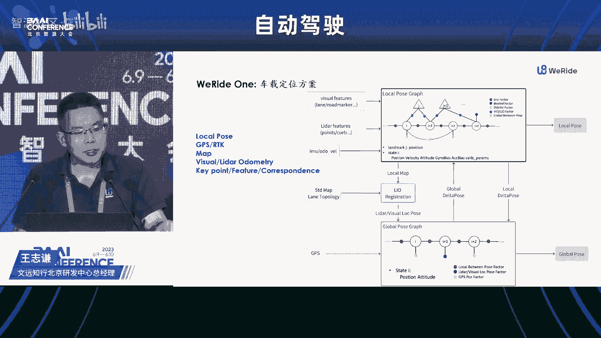

前端这部分的核心呢就是要把corresponence找出来，找correponence的话呢，一般第一个方案的话，整个点非常多，每个点的话在里面不一定会发生作用。所以的话呢他找第一步的话。

往往是去找一些关键点就是K point找到 point之后的话呢，我们还需要对这个 point和它周围的邻居进行一个建模。这个邻居让这个keypoint去能够代表它周围的邻居。

所以就是我们所说的descriptor。通过找到这些之后的话呢，就可以在后面比如说我们直接进行匹配。像我们常用的一些run或者一些max算法就可以去做闭式的求解，然后得到我们一个方案。除此之外的话呢。

我们也还会持续的做global的观测。global观测的话呢，就是说把我们找到的局部的descript。然后呢把它呢呃进行一个聚合，生成了我们global的这种script，然后再做闭环。

然后做一个全局的解决方案。这里面的话呢跟前端相关的。这里面大部分工作除了最后一步求解之外，其他大部分的话都是用机器学习来做的。也就这个东西做的越来越准的话，让我们do可以发挥更多的作用。

让这个局部坐标系的话呢能够体现到更好的作用。接下来一点点时间的话呢，简单介绍一下，就是文远在这块的实践。前面大家也提到了，就是自动驾驶怎么去落地，其实也是一个很难的一个问题。

然后呢文远在这块的探索的话呢，还是做的不错的。比如文远在国内的话呢，是最早去全开放，面向所有的呃大众去开放的这么一个打车的服务，大家不需要经过呃不需要经过一些特殊的邀请啊，什么就可以直接去体验的。

然后现在的话呢已经运运行了超过1100多天了。然后那个而且这个不仅仅是在我们呃国内在国外的话呢，也有产品。呃，这个视频的话，今天就不过了。大家建议大家有时间的话，还是去车辆实际的感受一下。

用自己的亲身体验去来说话。第二1个产品的话呢，跟刚才有所区别的就是我们呃自动驾驶的小巴，这个小巴的话呢，它的区别就是这个是我们和我们的投资人联合设计的。它最好的它的本身就是为无人驾驶所设计的一款车。呃。

整个车里边来讲，它的那个外观也非常的呃也非常f，然后里面的坐起来的视觉也视野也非常好，然后呢，自动驾驶体验也非常好。这个车也很受欢迎。在国内的话呢已经有超过18个城市在落地，还有在运营的。😊。

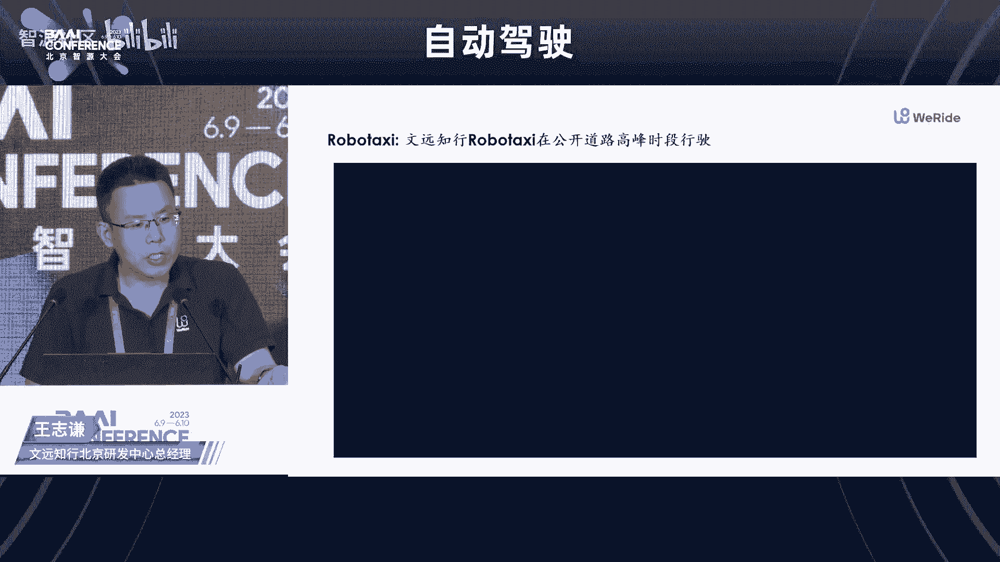

呃，后面一个方案就是我们的呃货运解决方案。这个主要是呃同城货运，然后在不同的站点之间进行货物的运输。呃，最后一个方案的话，就前面提到的我们呃就是自动驾驶的环卫车。这个环卫车的话呢。

就是跟前面我们所涉到的这种啊大模型技术啊和我们机器学习相关的技术结合起来，让它变得会更加的智能。而且这个的话呢也是专门为环卫所设计的一个解决方案，也是纯无人驾驶来做的。呃，这个简单视频的话就不过了。

大家回头可以去看一下产品。那以上就是介绍内容，谢谢大家。😊，感谢王总的报告。王总向我们系统介绍了文远之行通用型技术平台的设计眼镜和所取得的成效。这个转眼之间呃，到目前为止。

8位嘉宾的这个报告已经全部结束。首先我想还是再次感谢志远提供的这次交流平台，也特别感谢88位专家所做的精彩的报告。总体来看，我想大模型在这个汽车领域的应用，目前仅仅只是一个开始。前景广阔，这个未来可期。

广阔天地大有可为。我们也真诚的期待后续能有更多的机会能够跟大家一起共同探讨，共处发展。首先感谢大家对再次感谢大家对于我今天这个工作的支持，谢谢各位。今天的论坛到此结束，谢谢大家。😊。

