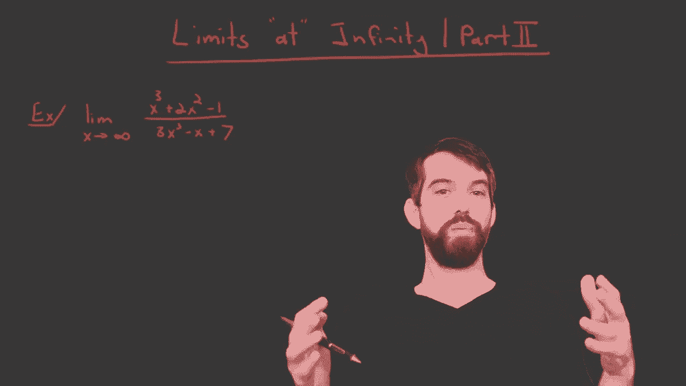
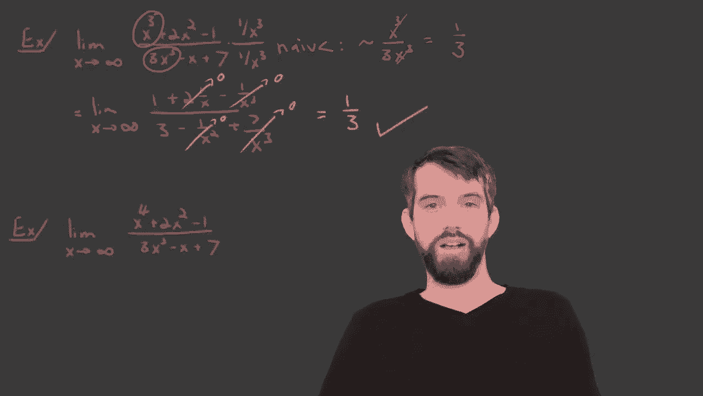

# P15：L15- Computing Limits at Infinity for Rational Functions - ShowMeAI - BV1544y1C7pC

In this video， I wanted to run through the sort of standard methodology to compute limits and infinity when youve got a rational function。

 for example， a polynomial divided by a polynomial。

So here's one such example we have on the top a polynoial S cube plus 2 x squared -1。

 and on the bottom， we have 3 x cubed minus x plus 7。 The question is， okay。

 what happens as my x is bigger and bigger and bigger。

 does this function approach some value or does it not。Now。

The first thing I want to think about is let me just look at the numerator of the x cubed plus the 2 x minus the 1 if my x is really。

 really large， like a million or a billion。The -1 doesn't really matter。 Well。

 we'll have like a million cubed out the front。 and， and that'll be an enormous number。

 And if I subtract one from it， it will be an enormous number that's more or less the same sort of number。

 It doesn't-1 doesn't really do much to it。And likewise， the x squared is big。

 that's a million squared， but a million squared isn't remotely as big as a million cubed。

So I'm going to say if I'm sort of approximating and waving my hands that that the top。

 it sort of size is determined by the largest power by the X cubed here that this really is the thing that sort of defines how big the en numerator is growing。

But on the bottom， we have a similar scenario， I have another term， a 3x cube this time。

And we also have a plus 7 and a minus x。 And those really don't do anything。

 And compared to the enormous size of x cubed， just my x values are getting really large。

 So if I'm going to do is sort of naive computation。 as in I'm just sort of guessing what it is。

 but not showing it formally。 I'm going to guess that the thing that really matters is that this is more or less an x cubed on the top。

 and a three x cubed on the bottom。 and that therefore the x cubes are going to cancel。

 And then what I'm left with is just going to be one third。So that's my guess。

 But I don't like just guessing things in mathematics。 I really want to know that they're true。

 I want to make sure that I'm using proper theorems and that I haven't made any logical errors。

 So let's try to rigorously do this。 So instead of the naive assumption。

 I'm going try the following trick。 I'm going to take the top and I'm going to multiply it by one divided by X cubed。

 and I'm going to divide the bottom or take the bottom and multiply it by one divided by X cubed。

I haven't done anything right top of the bottom here are the same thing。

 so I don't make any change by multiplying this。All right， so in my limit。

Taking the limit as X goes to infinity， just copying and pasting that。

 So I'm going to take this in factor with this in。 So X cubed is going to become a one。

x squared divided by x cubed is going be plus twice and then i have a one over x。

And then minus1 over x cubed。 So that's what the top becomes。 And in the bottom。

3 x cube divided by x cubed just becomes a3。X divided by x cubed is going to become a1 divided by x squared。

 and then finally a plus7 divided out by x cubed。Now， I think that this is nicer because。

I can focus in here on all of these1 over x，1 over x squares，1 over x cubed， all of those terms。

Because the limit as x goes to infinity of1 over x， I know what that is。

 This term here is just going to be going to 0 and one over x cubed is going to be going to 0。

 and 7 over x cubed is going to be going to 0， and one over x squared is going to be going to 0。

 All of these things are going to be 0。 These are known in limits at infinity。

And then what this means is I can use a set of limit laws like for example。

 that I can take the limit of a sum and say that this is just the sum of the limits。

 or if it's non-zero， I can take the limit of a quotient and that's the quotient of two limits。

 so we all these different limit laws and all those limit laws are going to repeat themselves for limits at infinity as well。

😡，And so since I individually can do these things， I am now confident。

 and I can step forward and say that this truly is one third because I' I valued all these limits。

 setting them to0， and what I'm left with is the one third。 And so now my sort of naive computation。

 I've verified it and I've shown the mathematics by multiplying my 1 over x cube and dividing by1 over x cube that gets me to this value of one third。

Okay， so now a second example， almost the same， I really only changed one little thing here。

 I put the fourth at。

So now when I think about it， it's sort of like an x to the fourth on the top that dominates and an x to the third on the bottom that dominates。

And then when I look at that， actually the4s to the cube is just like an x。

 and the limit of x as x goes to infinity is infinity。

 so I'm guessing that this is going to diverge to infinity， but let's check it。

I can say that this is in our same way before the limit as x goes to infinity。 Now。

 I'm going to continue in my same way。 I'm going to do my same trick。

 And I notice that that next to the fourth from the top and X to the third on the bottom。

 So I'm going to do the same thing。 one over x cubed。divided by one over x cubed。

This is going to get me the limit。As x goes to infinity of， well， it's just an x。

 and then it's all the same after that。🎼2， divided by X。minus one over x cubed。

All divided by3 minus1 over x squared。Plus7 overex cute。

And we can say that this is going to 0 and the one over x cubed is going to go to the0。

1 over x squared is going to go to 0， and the one over x cubed。

 all of those factors is going to go to0， but。The key thing is I've got this x here。

 and so this is the limit that goes to infinity of x divided by 3。

 and so this is going to diverge to infinity。So we have to be very careful about sort of looking at this highest power on the top。

 highest power on the bottom and seeing what's going to happen I'll do one final example for you。

 I changed the same thing again this time by putting it as x squared opposed to x cubed direct to the fourth so now the highest power on the top is two the highest power on the bottom is three so we think the bottom dominates。

😡，It's going to look a lot like1 over x as it gets large and we can do the same trick if we wish。

 I won't fill it in and say that because the top is x squared。

 the bottom is executed cubed it looks like1 over x and1 over x in the limit as x goes to infinity is just going to be equal to0。

So indeed， we've seen that for these rational functions that we can go through the process formally by finding whatever the highest power is top and the bottom and dividing the top and the bottom by that highest power。

 and if the top and the bottom are the same power is going to rise alt in some fraction and sort of naively we can almost just read it off although I want you to write down the steps。

 or there's more power of x on the top in which case it diverges to infinity or more powers of x on the bottom in which case it's pulled down to zero。

