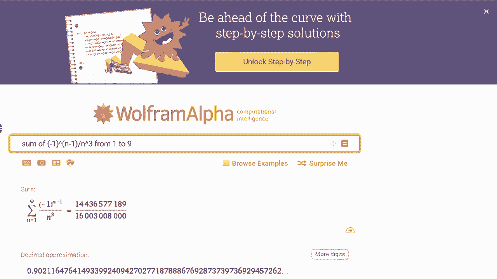
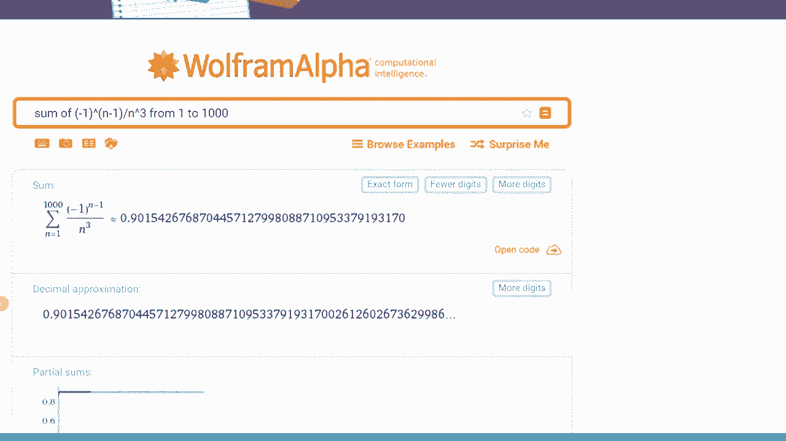

# P28：L28-Alternating Series _ Estimating the Remainder - ShowMeAI - BV1tq4y1U7Cv

Suppose I have an alternating series like this one。

 This is the sum from I equal to 1 to infinity of -1 to the I -1 times some other positive decreasing sequence of limit 0 B sub I。

 Now， in my first video in alternating series， we saw that if I put down the number line。

 there was this sort of back and forth behavior where the S1 was going to go all the way out。

 And then the S2 was going to go back in。 And then the S3 was going to go out and S4 back in and S 5 out and S 6 and S 7。

 And it just could back and forth and back and forth like that。😊。

And then we concluded that the actual sum of the series was going to converge in this kind of case。

 and it was somewhere in the middle squash between this alternating behavior。 Now。

 let me suppose I've done that。 And I want to go and try to estimate this by perhaps only these first seven terms。

 That is I have this series。 And I want to go and write it as the sum of a partial sum S 7 and some remainder。

 some error term R 7。Now， I don't know where exactly this sum is。

 it could be anywhere in this particular region， but let me try to approximate it by say， the S7。😡。

So the question is how good is this error， if I take this R7 is it a small number is it a big number。

 how can I control how bad my estimate of only taking the first seven terms is going to be？😡，Now。

 to think about what this remainder could be， we're currently at the S 7。

 and imagine we wanted to go from the S 7 out to an S 8。 Well， after we went out to the S8。

 we would then come back to an S 9 and go out to an S 10 and so on。

 But based on the way that this collapsing works is the furthest I can ever get away from S 7。

 And the entire rest of the series is going to go to S 8， because after that。

 I'm going to get closer and closer and closer。 That's the way this alternating series works。

 So whatever the remainder is， I can definitely say that that R 7 is going to be less than the distance between S 8 and S 7。

 that is between the one term and the next one。😊，And indeed。

 the difference between S 7 and S is just whether I've added the8 term on is in this is just that B8。

 So in other words， my R 7， my remainder when I take7 terms just bounded by whatever the8 term is。

 in general， if I replace7 here with n， I can say that my remainder of n terms is just going to be whatever the n plus1 term was。

 So let's see how this works out in a specific example。

 So I've got-1 to the n -1 divided by n cubed here。

 and then I'm going to say that for my application， I'm interested in accuracy of 0。001。 Now。

 how can I ensure that I have enough terms to get that accuracy。

 Well if I look at my remainder is going to be if I want to estimate what R n was。

 what we've just seen is that I can bound that by the n plus one term。

 what I want this n plus one term to be it is just remember one over n plus1 cube。

 I want that to be less than this。So now I have this relationship here that the one over n plus1 cube needs to be less than one over100。

 which is another way of saying 0。001。Okay， this is an inequality。 so I can just multiply it up。

 That's 1000 is less than n plus1 cubed。 I can take the cubed root of both sides。

 I can get 10 is less than n plus1。 And finally， I can say that n is less than or equal to n。

 So what does this tell me， It tells me that as long as I take n as 9 or bigger。

 then that ensures that whatever approximation I write out my 9 partial sum。

 then that9 partial sum will be accurate to within 0。001。 Now。

 the final point to make here is that in whatever application you may actually be doing in your future careers。

 whether it's some engineering application or otherwise。

 there is going to be an uncertainty that comes from that different discipline。

 And the idea here is is it doesn't matter what the uncertainty is to calculus。

 if you come in with the restriction you need it to be however certainty you want。

 you can use this to figure out how many terms you need to get that desired level of certainty。

Going back to Wolf fromelva do com。 Let's go and try to compute out a few things。

 I'm going to take the sum of the particular series， which was the -1 to the power of n-1。

 and then all by n cubed。 And what we want to do is take the approximation from 1 to 9 because 9 told us how many terms we are going need。

 So I do that computation and what do I get， it looks like a value of 0。902。 Now。

 this is only taking 9 terms。 And what we guaranteed is that we are within 。

001 of the correct answer。 if I took the as many terms as I could possibly want。 And indeed。

 let me just try just for fun here， how about instead of 1 to9， I just put in100 terms。

 So this is gonna be a huge number of terms It's going take a little while for it to compute and there it goes。

 So it says that if I'm going take 1000 terms， it's 0。9015， which is yes。

 not the exact same as the 0。902 we've seen。😊。

Before， but it was within 0。001 of it indeed we can carry on and add more and more terms and we'd get more more accurate。

 but I don't need any more than nine for this specific level of certainty。

