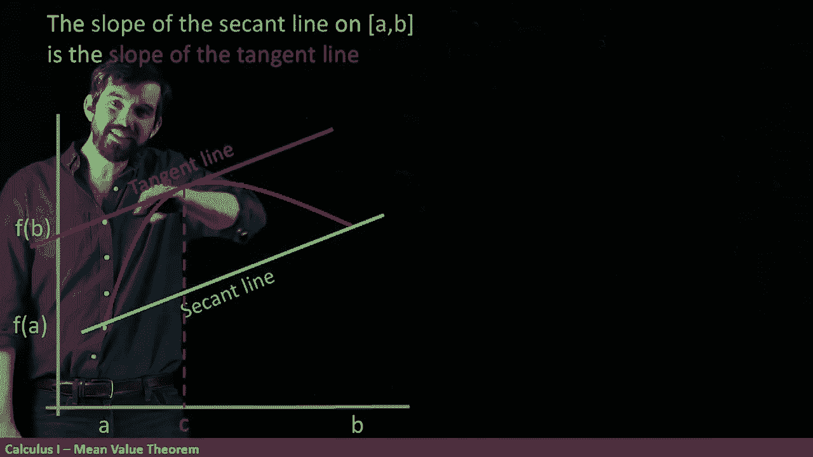
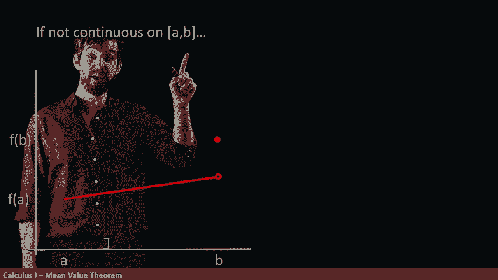
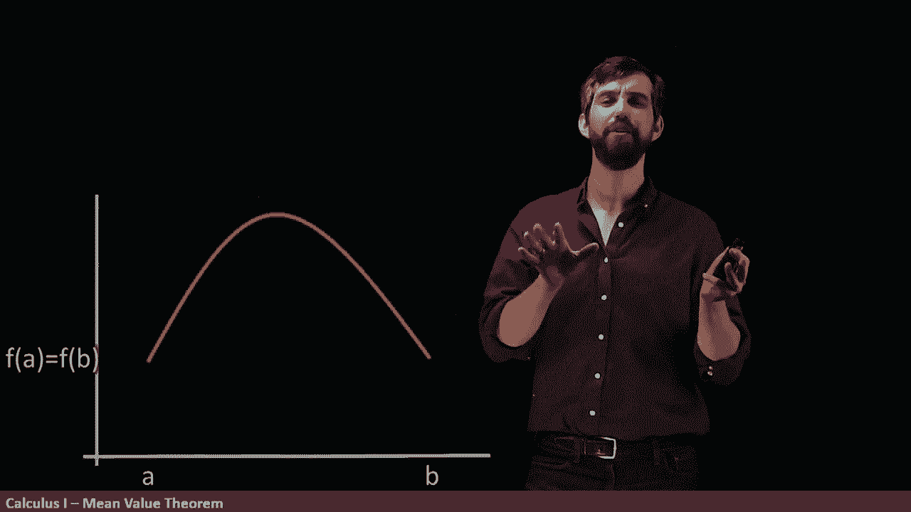

# P36：L36- The MEAN Value Theorem is Actually Very Nice - ShowMeAI - BV1544y1C7pC

In this video， we're going to talk about a very interesting theorem called the mean value theem。

 a theorem that we're going to see is actually very intuitive。😡。

I want to imagine I've got some function here， and it's a function where I've got some A。

 F of A and some B， F of B， I've specified two endpoints on it。😡。

And then what I'm going to first look at is what is the CA line between the point A F of a and the point B。

 F of B， it's going to look like that， that's a CA line。

Now I wanted to think about tangent lines， there's all sorts of tangent lines is a tangent line here。

 tangent line there， tangent line there， tangent line there。

 there's all sorts of tangent lines to this curve， but one of those tangent lines is going to be the one that has the exact s slope as the secant line Indeed looks like it sort of hits right around here where the slope of the tangent line at that point and the slope of the secant line are exactly the same thing。

So in effect， the claim of the mean value theorem is that for nice functions。

 and we'll define what we mean by nice functions in a moment， but for nice functions。

 there is always such a tangent line， there's somewhere on the curve where the tangent line and the secant line are the same。

😡。

So I will begin my theorem by saying the slope of the secretant line on this interval AB that we're considering。

 remember， a secant line needs an A and a B in order to be defined is defined between two points。

 so the secondant line on AB is the same thing as the slope of the tangent line。😡。

Of course， there are many tangent lines， it depends on which point we're considering。

 So what we're really saying is that somewhere there is a value C down here and it's the tangent line at that point C。

 So I'm saying the little second line is the slope of the tangent line at some point C and my C here is inside of my domain。

 but notice a small tweak。😡。

The big domain is AB with closed brackets， including those endpoints。😡，The point C， though。

 is on the inside in the round brackets。So we're going to have to just pay attention to that little detail for now。

Okay， so that's the sort of idea qualitatively， but I want to come up with precise formulas for it。

I know what the slope of the tangent line is that one's easy。

 that's the definition of the derivative it was the slope of the tangent light。So indeed。

 the slope of the tangentline here， it can be just replaced with the derivative at sea。

And then what about the slope of the seaM。 Well， I have an ability to do a rise over a run here is an F of B minus M of A。

 that's going to my rise my change over here。 And then I can divide it up by my run between my A and my B。

 So I replace this by claiming that。😡。

The slope of the seaant line， the rise over the run here。

 It's just the same thing as the slope of the tangent line， the derivative at sea。Now。

 is this true for all functions。 Well， no， I said it was true for nice functions。

 so now let's be more precise。 What do I mean by nice。

Well， my precise claim is going to be the following。 I am going to demand that my function。

 my F of x is differentiable on the open interval with round brackets A B。😡。

And continue on the closed interval with square brackets where I'm including the A and the B。

This is the hypothesis or the conditions of my theorem when I have that。

 then I'm going to have this existence of a C， this existence of a C where the sub of the sea outline line and the so of the tangent see are the same and then collectively we're going to call this thing the mean value theorem。

😡，Now， I'd previously given you a nice example of a function where it sort of was graphically transparent to us。

 that it was true that we could sort of point at and find， yeah， about there。

 the slope the tangent line is the same thing as the sub the secret line。😡。

But why do I need these conditions Why couldn't I relax the conditions a little bit So what I wanted you to think about is why must I have both of these。

 why must I have this claim of differentiability on AB with open brackets and this claim continuity on AB with closed brackets。

😡。

Let's do the differentiable point first。 I want you to think about this function here Now this function is not differentiable on AB because it's got a corner point and we know that all corner points are not going to be differentiable。

😡。

But I can still put a Seaant line on right， there's that Seaant line as it ever was。

 it connects this point A F of A down here and B， F of B up there。

So is there some value of C on this curve where the tangent line is equal to C， I think no。

For all of these points here， the tangent line is just the same thing as this lion very different over here it a negative value。

 it's not even remotely the same as the slope of the tangent line and then that interesting point right there。

 it's not differentiable， there's not even a definition of a tangent line。

 so this is a situation where f is not differentiable on AB and therefore the mean value theorem just does not apply and it's good that it does not apply because it wouldn't work in this example which shows why we need that condition of differentiability。

😡。

Okay， what about the coninnuity claim？So now I'm going to consider if F not continuous on the closed interval。

 I'm going to go right to the end and look at my function that I've given here。😡。

This is the function that comes along and then right at the very end point， I'm including the B。

 that's where it's breaking its continuity point， right at the endpoint。

 it's the round circle which in case it's not the value there， that's the value。

So if I come up with the secant line to this thing， because the actual value of F ofB is right here。

 the Seaant line has to go through that as well， but of course all of the tangent lines are going to be down here on my graph。

So if it is not continuous at the entire closed interval AB。

 I could demonstrate an example where the mean value of theorem fails。

 unless I need both of my two conditions。

Im going to give you one more example， in fact， it's a special case of the mean value theorem。

This is what happens when I've got some function but has unique property that the F of A right here is the same height as the F of B。

 so then if I try to think about what the Seaant line is going to be。

 well it's going to be completely horizontal， its slope is going to have no rise because F of a is going to be equal f of B。

😡。

And indeed， we can see that what's going to be that slope the tangent line where it has to be is horizontal。

 it occurs right here above some value C， and it goes in this particular example up to this maximum。

Now this is just a special case of the mini value theorem。

 the slope of the Seaant line is equal to the slope of the tangent line。

 but it's an important enough of a special case that we're going to pull it out and give it its own name。

 it's going to be called rolls theorem。

You'll notice this got the same conditions， the differentiability on the open interval AB。

 the continuity on the square interval AB， but now we're saying that we're assuming that the f of a equals f of b and we deduce that the derivative at C is0 for some value this C inside of the open interval A to B。

😡，Now， one of the reasons why role theorem and mean value theorem are pulled out is that we often in mathematics。

 we're trying to prove things， we start with a simpler case and then generalize and the canonical way to prove the mean value theorem is to first prove role theorem。

 the special， easier case， and then prove the mean value theorem deduced from role theorem。😡。

So even though I'm not going to prove the mean value theorem for you in this particular video。

 I still want to identify the important historical special case of Rule theorem。😡。

