# P37：L37- Relative and Absolute Maximums and Minimums _ Part I - ShowMeAI - BV1544y1C7pC

One of the standard problems that faces us across all disciplines is how do we optimize。

 how do we maximize and how do we minimize things， For example。

 I might want to maximize the amount of profit my company makes or minimize the cost。

 I might be interested in minimizing the energy in some physical system where maximizing the population in some sample So we're always interested in this problem of maximization and minimizemization and one of the great triumphs of calculus is that it provides us a way to find maximizes and find minimum so that in whatever application we have。

 we can go in the optimal way。😡。

So let's look at this problem graphically here we've given you some sort of prabola and I think the maximum of it's pretty obvious is just this point right up here and in particular we're gonna to talk about the maximum value is being the height and this is going to occur at some particular point so for instance I will say that at the point x equal to1 we get to a local maximum value of f of x equal to 0。

4 why do I say local I haven't shown you all of the graph。

 maybe it's the case that comes down and then it actually gets higher that's possible but at least if I look locally that this point truly is a maximum now I think we can see the idea of this being a max graphically but let's try to be precise about what we mean mathematically。

😡。

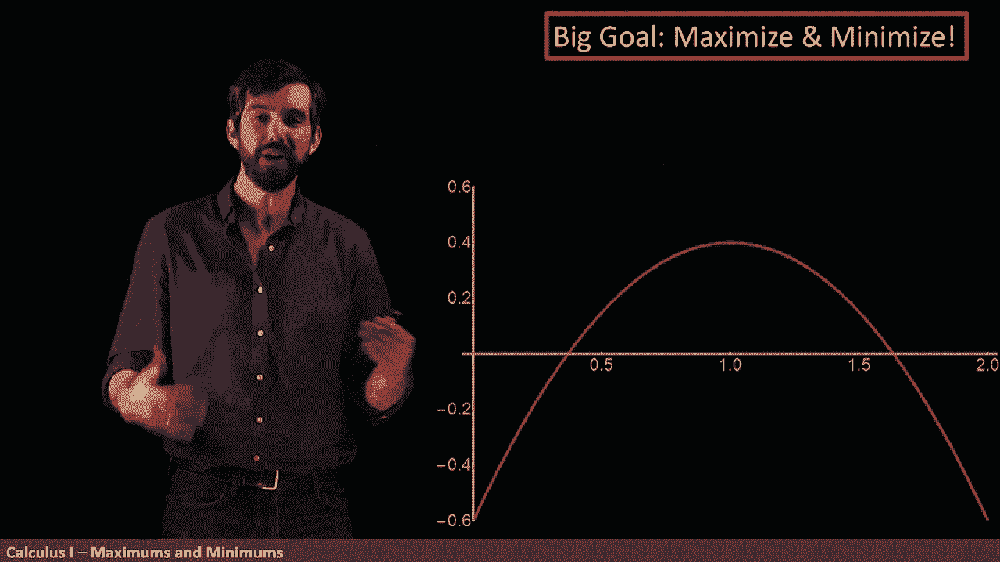

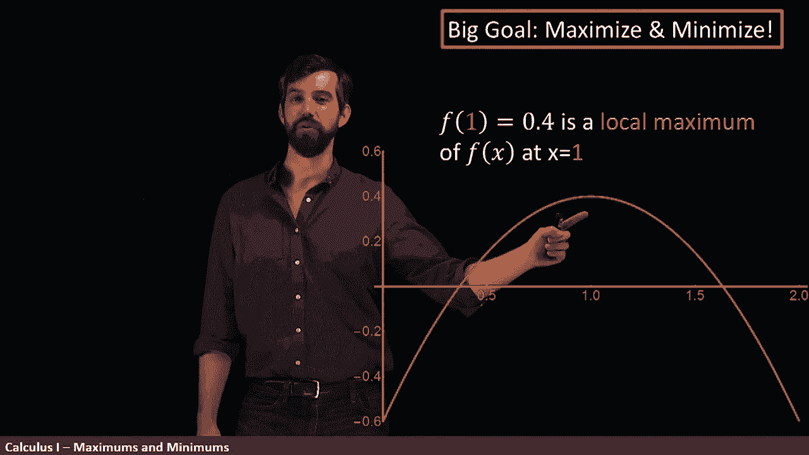

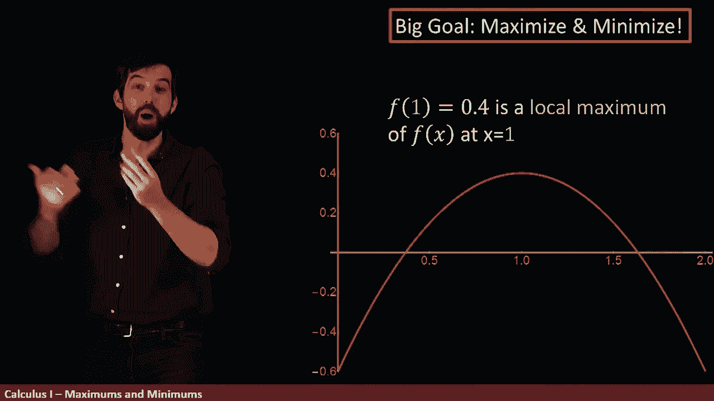

Indeed， I'm going to put on this point where I've got the x equal to 1 and then this height of 0。4。

 but let me suppose I go to some other point， how about this one over here。

 I've gone from one to looks like 1。3 or something about that。😡。

Well， it didn't matter where I go， wherever I go to the height now is a lower number。

 if I've done over here would be lower anywhere else I went that was at least around the point of x equal to one。

 not going into some weird domain far away， but at least around x equal to one。

 it appears that that is higher than the value of the function for any point nearby。

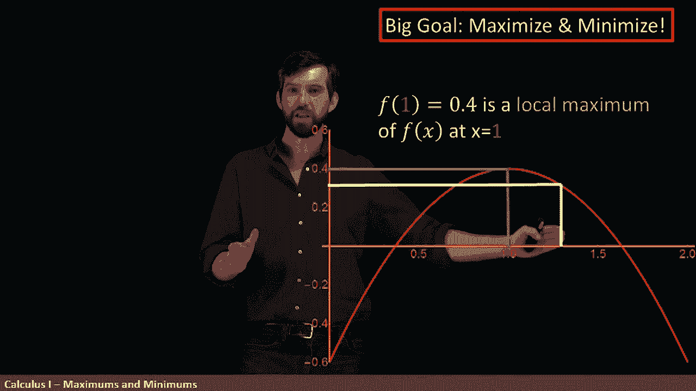

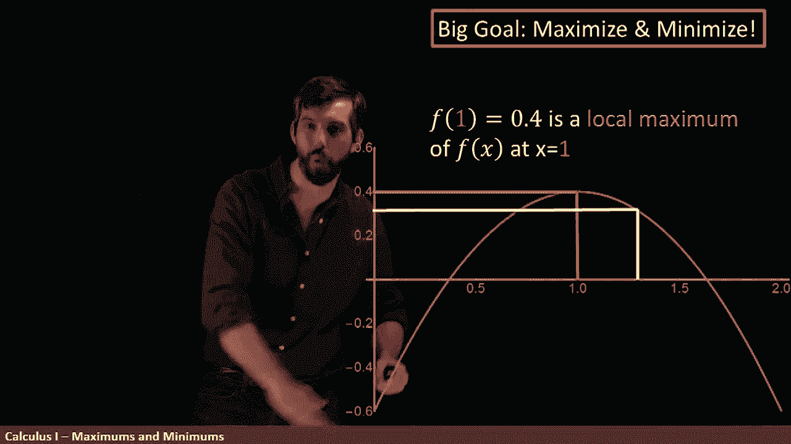

So I'm going to cod this more precisely to say that our definition of a local maximum is the value FO's local maximum value if。

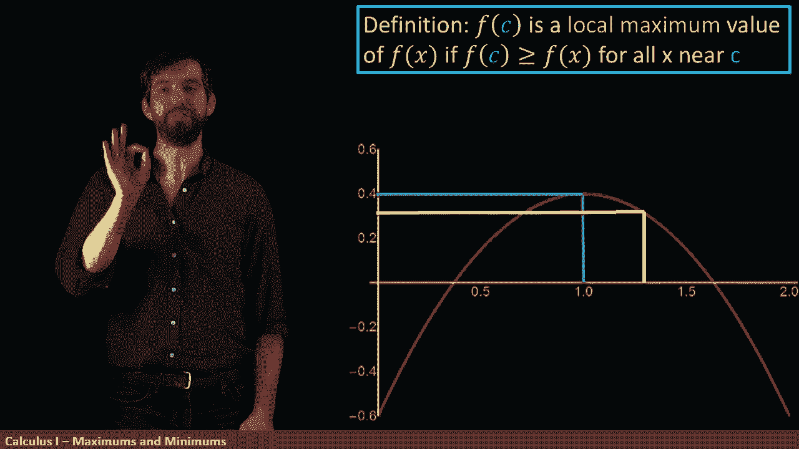

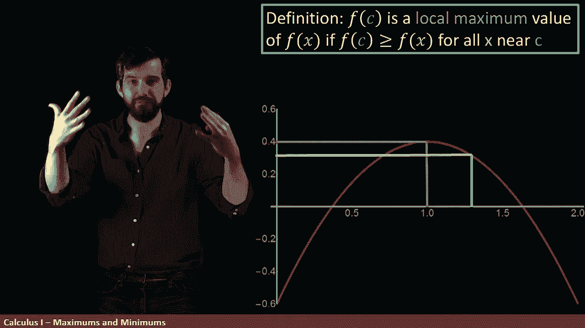

That particular value in this case， it's s to1 has that the function is bigger than all of the other values nearby In other words。

 you're finding a value of c， which is an input such that the output F of c is bigger than all of the other outputs f of x for x values around that C。

😡。

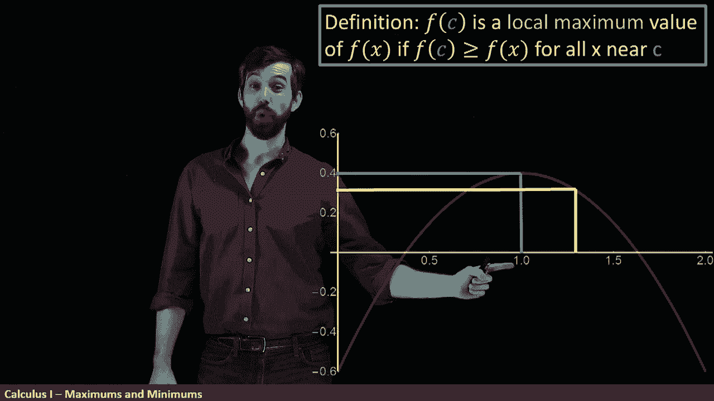

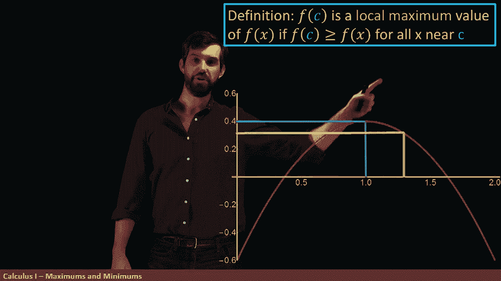

Likewise， we've got a local maximum we can do the same thing for a local minimum。

 it just changes the sign now your FFCc is going to be smaller and for example。

 you could have an upward facing traveller for a minimum。

Now this next graph is a little bit more interesting。

Let me focus specifically on the domain I've shown， I only care about zero to two。

 and I'm not asking anything about beyond that。

And then we can also see that it goes up for a while and then it comes down and then over here we're going to be having this relative minimum nearby is the smallest。

But you'll notice about both of these points is that this is not the highest point on this entire interval 02 and this is not the lowest point on this entire interval。

 they are only relative maximumim mins or local maximum mins。😡。

But if we want to talk about what is the absolute maximum。

 what is the actual largest and smallest value， well。

 the very largest on 02 is this point that occurs right here。

 that's higher than every other point and the very smallest is going to occur right down here。

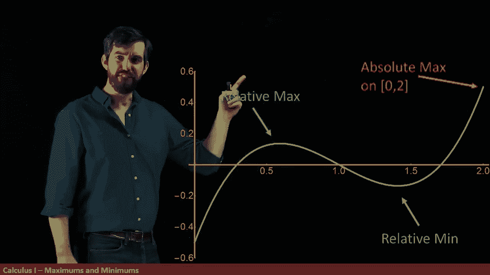

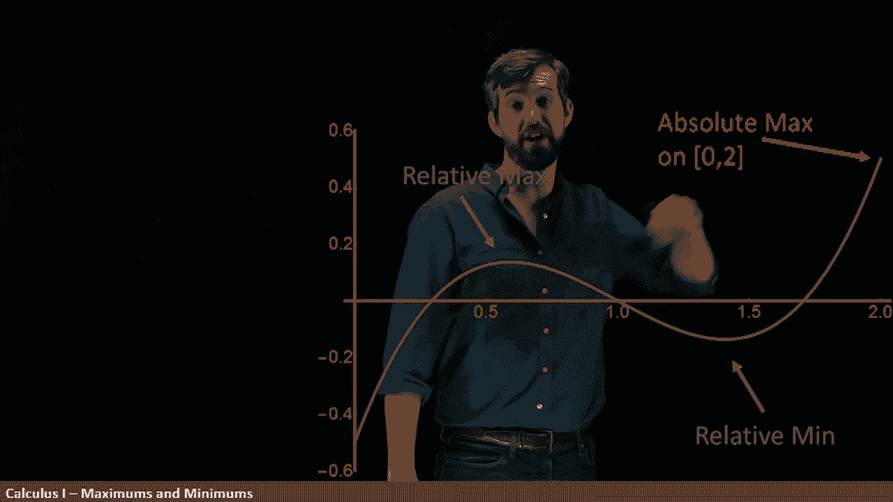

So we have a distinction between maxes and mins， we've got the local or relative ones。

 and then we have the absolute or sometimes called global maximums and minimums and they're on an interval and you figure out what is the actual biggest and actual smallest on this interval。

 Meanwhile， the relative mins and max are going to be maxes and minimums but only on some sub portion of this interval。

😡。

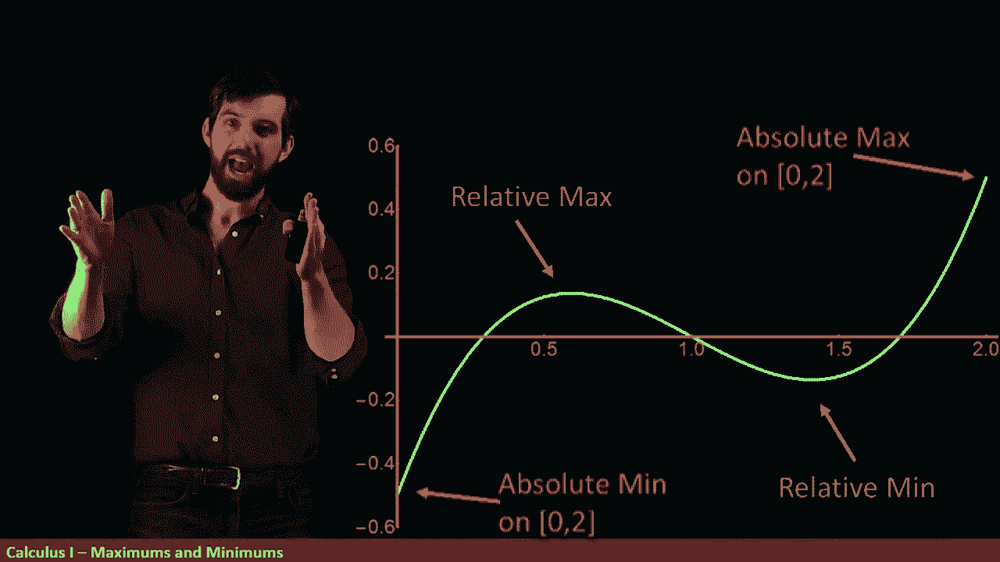

We can define this formally by saying that F of c is going to be an absolute maximum on some particular node domain here。

 the domain is the zero up to two。😡，FSc is bigger than all the other F of x's for every other x in the domain in this case。

 the zero to2。And then of course， we could change it from maximums now to minimums where I change the sign and we get the exact same thing。

😡。