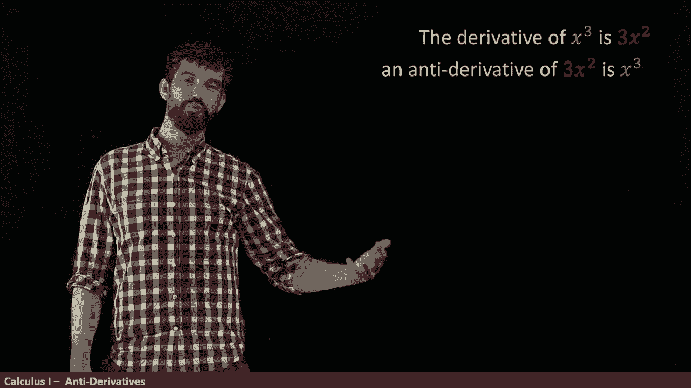
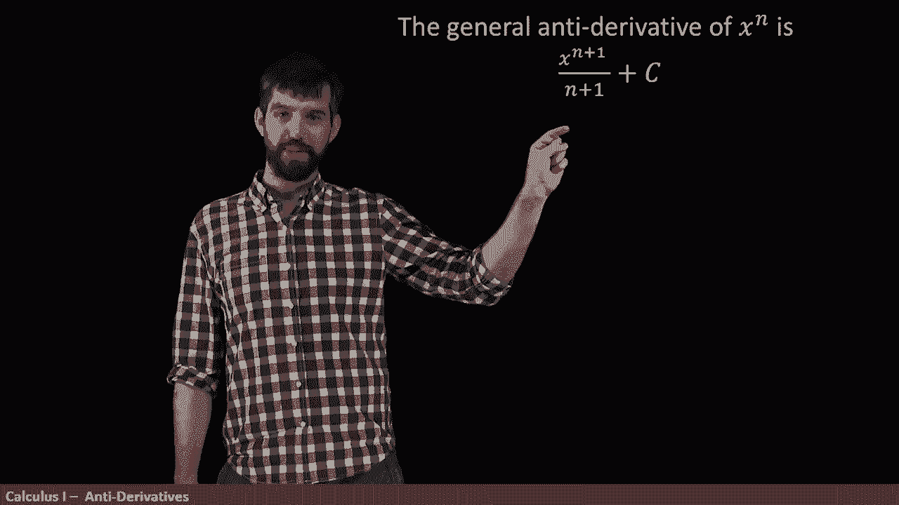
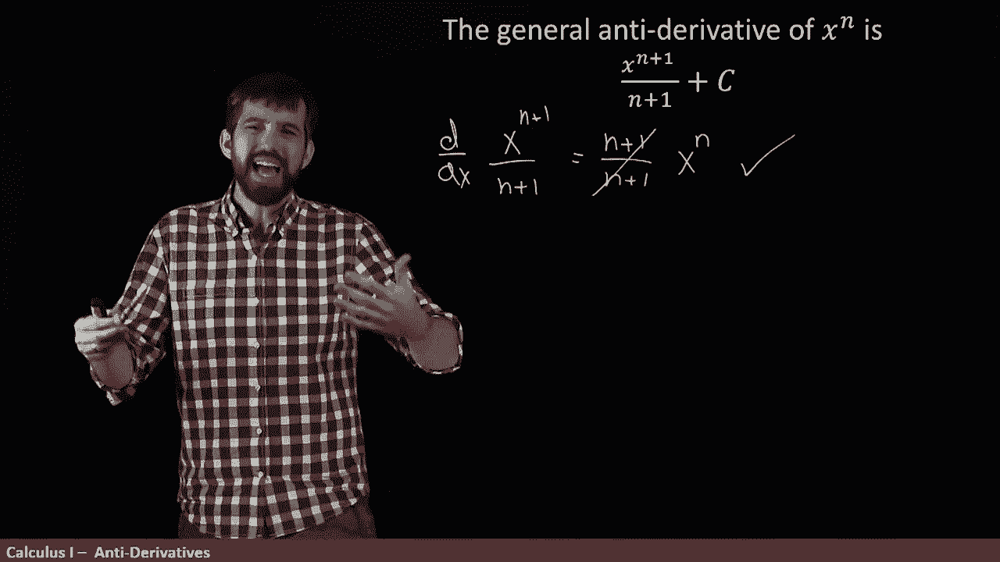
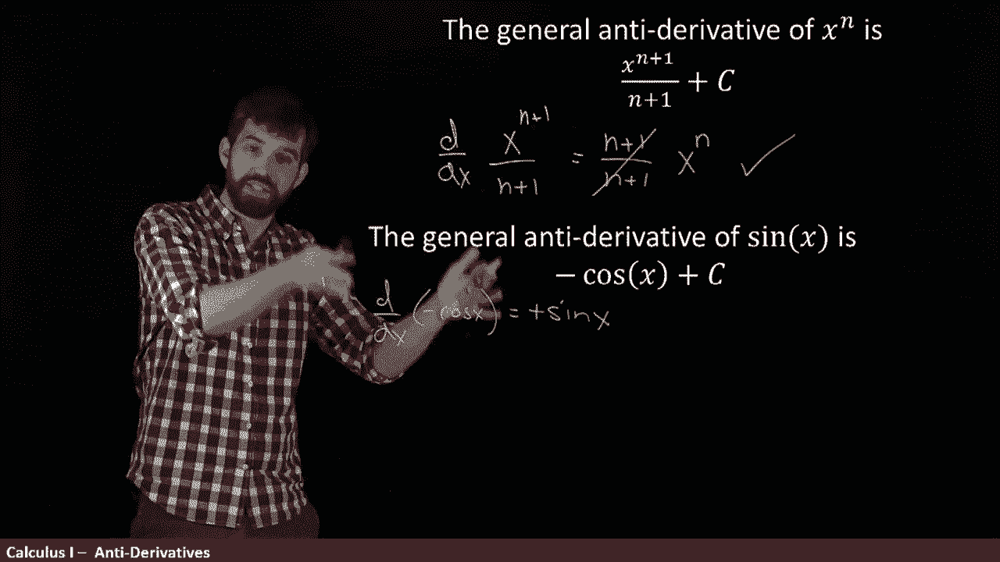
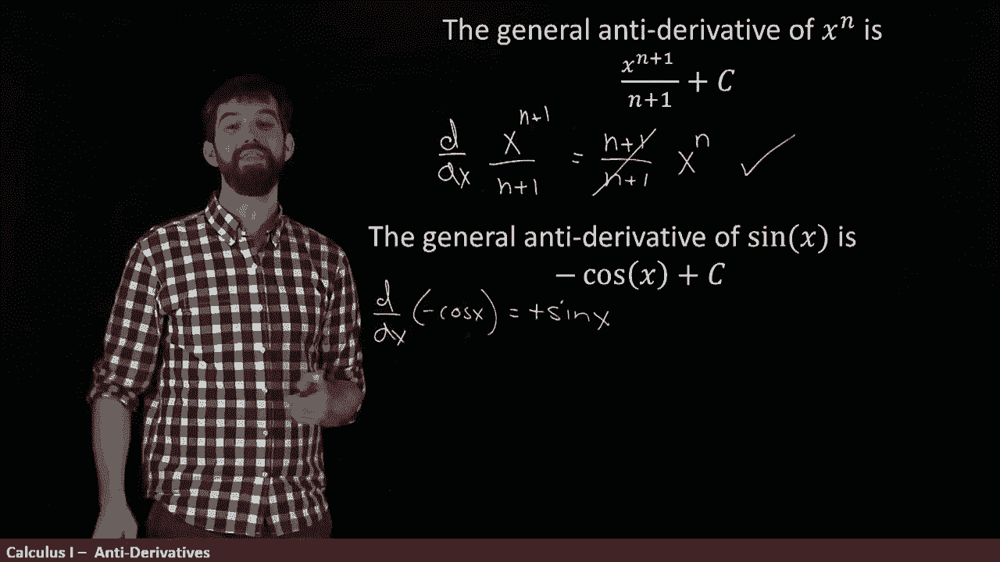

# P45：L45- What's an anti-derivative - ShowMeAI - BV1544y1C7pC

So as we all know by the power rule， the derivative of x cubed is you bring the three down 3 x squared。

Now this gives you a relationship between the x cubed and a 3 x squared。

 and I want to take that relationship and I want to turn it on its head I'm going to talk about something called an antid。

So I'm going to say that the anti derivative is the other way around。

 the anti derivative now of the 3 x squared is the x cubed。

 and then when I say that my x cubed is an antid， what I mean is that if I was to take the x cubed and differentiate it。

 I'd get the 3 x squared。

So here's our general definition， we're going to say that big F。

 we always use big Fs for anti derivatives。

That big F is an anti derivative of little F if it has the property that the derivative of the anti derivative is just the function。

Or to repeat， we're saying this derivative of this anti derivative is the original function。Now。

Anytime that you have a function and you take its derivative。

 the function is going to be the antider of the derivative。

 but it turns out that there's not only one of these things。

For instance， look at this function x cubed plus7， it's also an anti derivative of 3 x squared Y。

 well， I claim this is my anti derivative， this is my capital F， if I take the derivative of it。

 I get 3 x squared and the derivative of 7 is0。So there's two different anti derivative for the same function 3 x squared。

Likewise， if I added a million or a billion or either the pi of the root too。

 it doesn't matter what I add here， any constant that I might choose to add is always going to go away when I differentiate so that entire infinite family of functions through x cubed plus any constant they're all antids of 3 x squared。

So we sometimes say this by talking about the general anti derivative and that we'll say that that if you take the derivative of the big F and you get the little F。

Then the general and derivative is this big F plus any arbitrary constant。

So we have to be a little careful with our grammar， if you have a specific one like x cubed plus 7。

 you say that is an antid because there's all sorts of them。

 but then you can refer to the general anti derivative when you write it this way。

 F of x plus an arbitrary constant in C。Now we've already investigated what the anti derivative was for 3 x squared。

 but I want to look generally at the antid of just some function x to the n and my claim is that the antid looks like this。

 the general form of the anti derivative is x tom plus1 all over m plus1 plus C but don't take my word for it。

 let's verify that this is actually the case， that is let's take this derivative and see whether we get the x to the n。

 that's our condition to be an antid。😡。

So in other words， if I come along here and I take the derivative with respect to x of this x to the n plus1。

 all divided out by n plus1 well。Now that I'm verifying this with a derivative rule。

 we can use the power rule。 we know how to do that。 The n plus one comes out the front。

 so it's n plus1 all divided by n plus1。 Oh that's good。 That's going to cancel。

 And then x to the power of n plus1 minus-1。 So x to the power of M。 So yes， indeed。

 this is going to be an anti derivative。😡。

Now， usually when I'm trying to come up with these Andy Gr。

 that's a little bit of like a guess and check。

I know that the derivative of a power is a different power， but one beneath it。

 So sort of I thought if I'm go the other way around and it's x to the n。

 I'm gonna have to add one to it。 So I tried x to the m plus1 first and then it was off by this factor of m plus1 so I divided by the m plus1 and that's how I got this answer in the end。

 So a little bit of a guess and check and that's okay Okay let's sort of guess and check again here。

 the general and derivative of now of sine I claim is minus cos of x plus C。 Well。

 don't take my word for it。 let's go and actually computed and see whether this is the case。

 So I'm taking the derivative now of minus cosine of x。😡。

Well， this minus sign comes out the front and then when I take the derivative to cosine。

 I know what that is， it's minus s， so two minuses this minus is now going to become a plus plus sine of x。

And indeed， that's what we have， so the derivative of minus cos of x is sine of x that tells me the anti derivative of sine of x is minus cos of x plus this value of C in the general form。

All right， one more of these， I'm going to try to figure out addivity for antiris。

 but we know that the derivative of the sum is the sum of the derivatives。

I want to claim that an antid to the sum is the sum of two antidatives How might this work so what I'm going to suppose is that I've got a big F。

 which is an antid a little F and I have a big G， which is an antid， a little G。

 then my claim is that if I want an antid of the sum down here。😡。

That the anti derivative to the sum is the sum of these two different antiros。

 the capital F plus the capital G plus that C if I'm doing the general form。Okay， so again。

 we should verify that this is the case， let's imagine I'm taking the derivative of this bottom here。

😡，Well， it's a sum and the derivative of a sum is the sum of2 derivatives。

 so this would be big F prime plus big G prime， which is just little F and little G。

 so indeed we have this addivity property for antids just as we did for derivatives。😡，And indeed。

 we're going to want to keep on going through this process and taking all the different rules that we have。

 the chain rule and the power rule and the scr multiple rule and so on and do the same kind of trickery to those that's going to be coming up in future videos。

