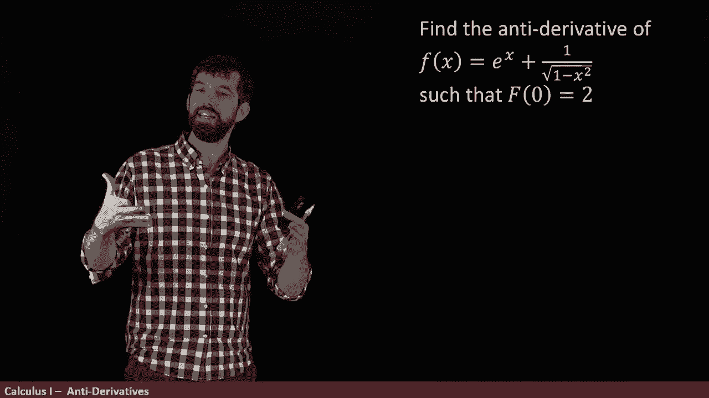
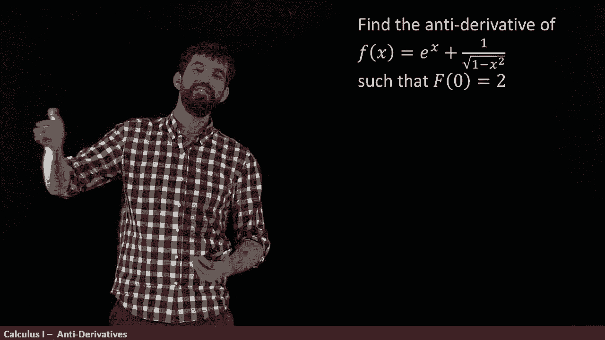
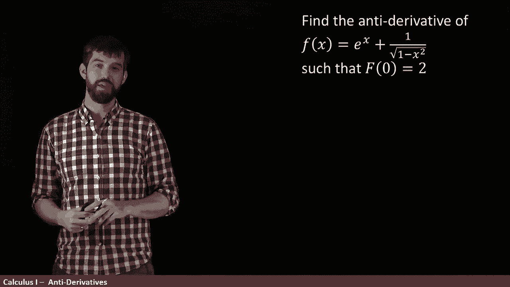
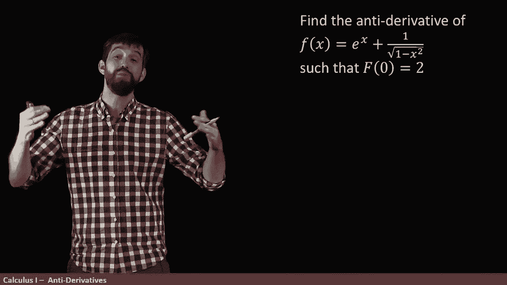
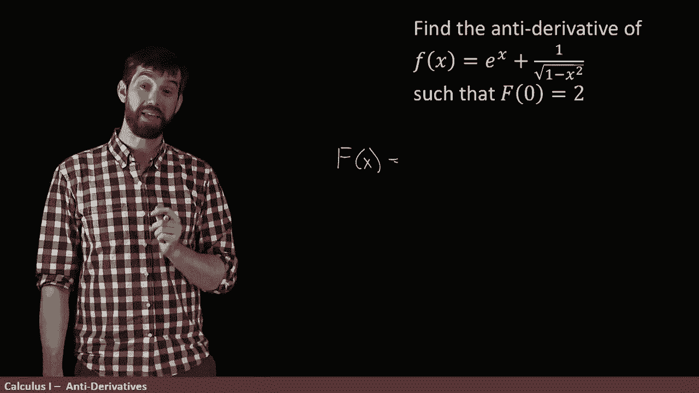
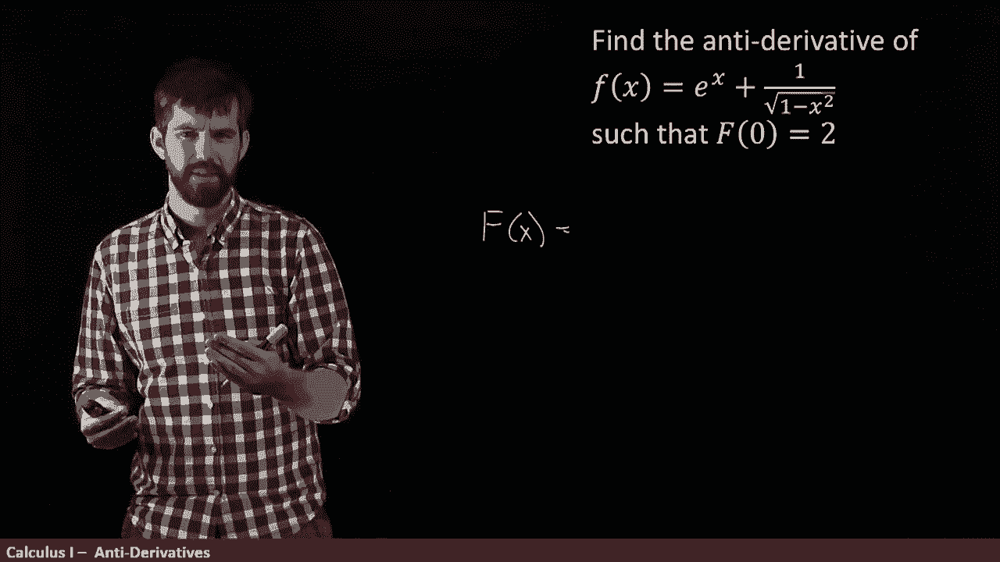
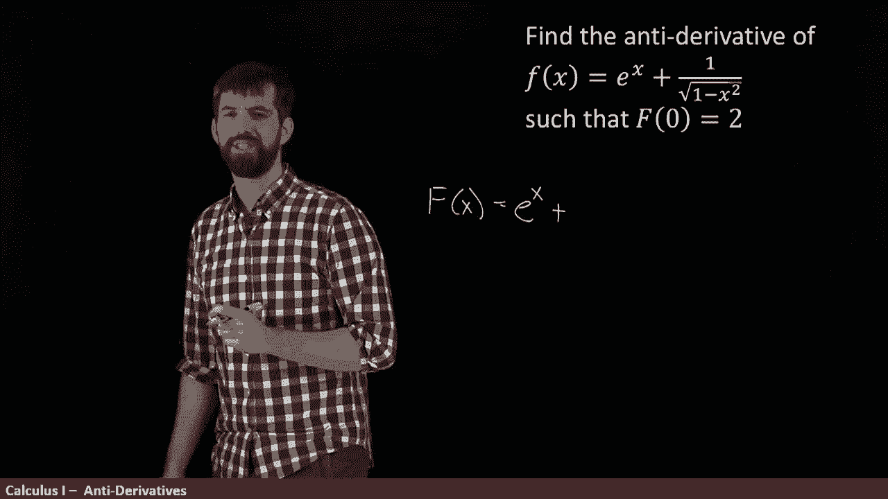
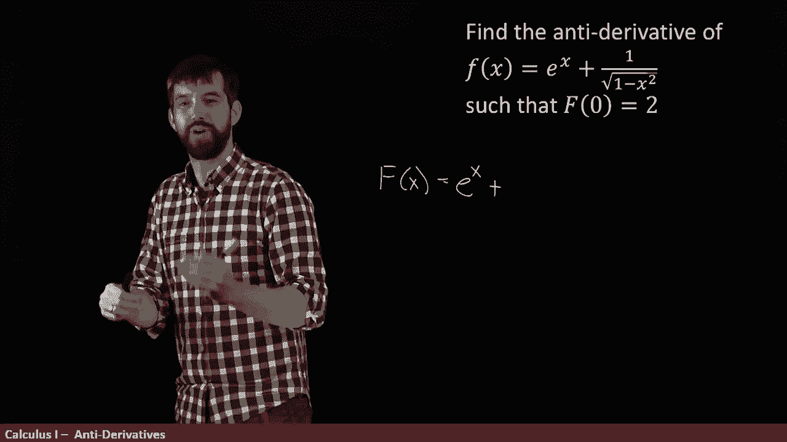
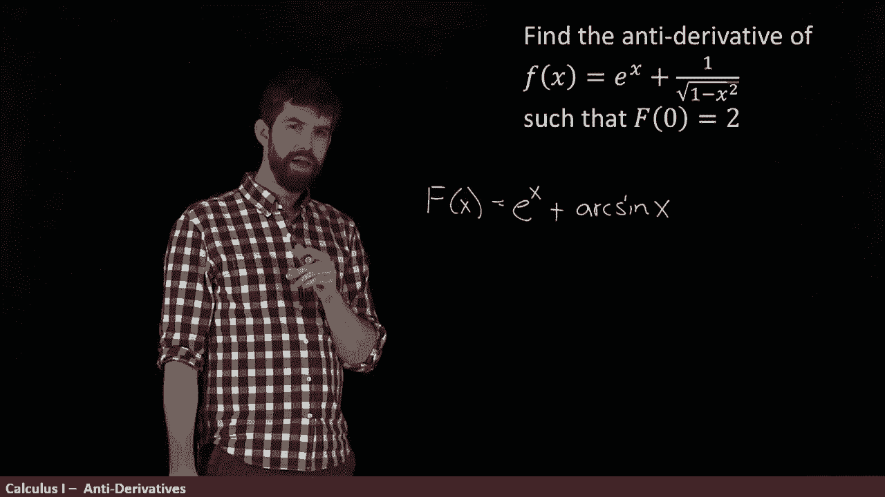
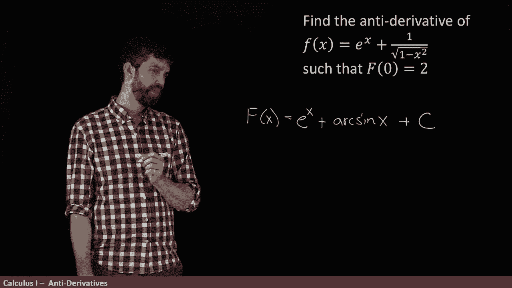

# P46：L46- Solving for the constant in the general anti-derivative - ShowMeAI - BV1544y1C7pC

This problem is a little bit interesting。 I am asking not for an and derivative。

 I'm asking for the and derivative this function。But I'm asking for the anti derivative that has this property that that the big f of 0 is equal to two。

 Now the idea here is this。

If we think about the general antid of this little F。

 it's going to be some function big F plus an arbitrary constant。

 so there's a whole infinite family of different antids depending on what the value of the constant is。

But by plugging in this number for one of the values of C。

 you're going to have it that when you plug in 0 is going to be equal to 2。 In other words。

 this claim what the f of0 is equal to 2 is basically going to tell us what that C value has to be。

So let's try to figure out what the general anti derivative is first。

 and then we'll try to evaluate the C。

So I need to come along here and figure out what my f of x is going to be my capital F of x。

 my and derivative of a little lowercase of F of x。

Now， I know the derivative of E to the x is e to the x。

 So the anti derivative of e to the x is E to the x just the same。

 So this is first part it's going to be a little bit easy。 That's just going to be E to the X。

 And then oh my goodness， what's going on， One over a square root of1 minus x squared。😡。

Now this is mainly a question of being able to recognize something indeed。

 you might recall that the derivative of arc sine is exactly this expression， In other words。

 one over the square root of 1 minus x squared is exactly the derivative of arc sine。

And therefore， the anti derivative of this thing is just going to be arc sign as well。

 So this is E to the x plus。😡，Arc sign of X。

And then finally， for the general antiro， I'm going to come along and add in that plus C that we have not yet determined。

So now comes time to determine that。 All right， so let's go。

 I want f of0 to be equal to the value of two right that's my claim。

 I want this to be equal to 2 but what is F of0 well E to the zero。😡，Plus。Arc sign。Also， of 0 plus C。

 Okay， I can probably evaluate that E to the 0 with just one。What about arc signine of zero？Well。

 I know that sine of0 is0， so therefore arc sine of0 is also going to be  zero。

 so this is going to be  one plus0 plus C。 And so I have this this one plus C on the right hand side I want it to equal to2 so I need to have one plus something is two I need that C to be the value of one。

 In other words， we're saying that the C is going to be equal to one。😡。

And so that is the anti derivative E to the x plus a sine of x plus c equal to1 will give me something that is both an anti derivative and has this property that f of zero is equal to 2。

Now this is symmetry between derivatives and antids where there's sort of the unspecified constant C in the anti derivative is actually incredibly important。

 for example， you know that velocity is the derivative of distance。

So if I told you exactly what my velocity was at every single point in time。

 I have this wonderful velocity function prescribed to you。

 you might reasonably ask what is the distance？But to get from velocity to a distance。

 you have to go the other way around， you have to find an anti derivative。

And so you might have this lovely distant function， but there's gonna to be a plus C in there。

 you do not know where to start so I can't tell you how far you are away from me just by knowing what your velocity has been all along because I also have to know where it was that you started。

 how far did you initially start from me in order for me to figure out how how far you eventually ended up to me So this is symmetry is going to be incredibly important in a large number of our applications。

😡。