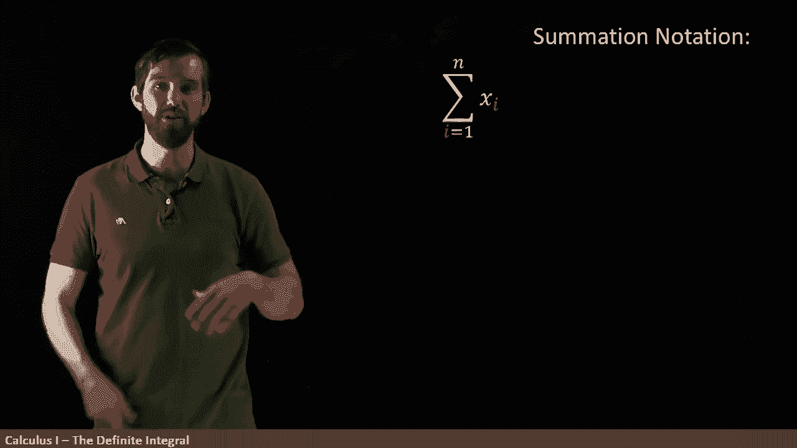
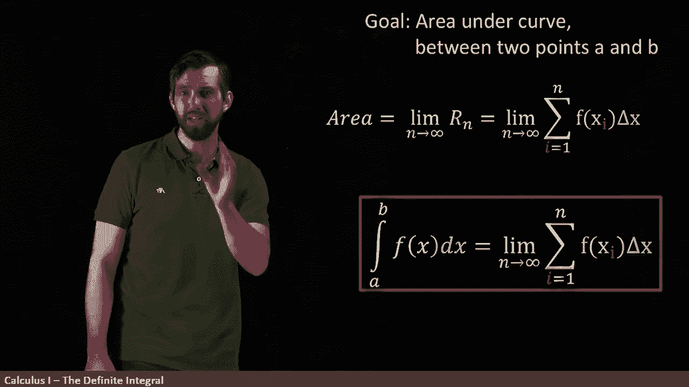

# P48：L48- The Definite Integral Part II - Using Summation Notation to Define - ShowMeAI - BV1544y1C7pC

Now I wanted to dive right back into integration， but I got to use a little bit of notation first。

This notation is called summation notation， this big capital sigma here is denoted for sum and it reads the sum from one up to n。

 a sum from the bottom thing up to the n thing of whatever it is in this case I've given a generic symbol X I and the way this works is it's x1 plus x2 plus x3 plus x4 plus x5。

 so on and so on until you hit whatever the top is， so x1 all the way down to Xn。😡。

As in summation notation is just a shorthand， for example， if n is 100。

 I don't want to write out 100 terms， so I can use this summation notation to make it look a little bit simpler。

😡。

I can also give a specific formula for what the XI was， here's a really simple one。

 I could say to sum from one to n， but where my X I is just Xi equals to I。

In that case， if I plug an i equal to1， I'm going to get1， if I plug an I equal to two， I get two。

 i equal to 3， I get3， plus one plus 2 plus 3 all the way down to n。

Now I can also play around with the start and with the end and what goes in here。

 so here's one more funky example， this one I'm starting at three and going to seven。😡。

And that the thing that I put in is Xi equal to i squared， so what do I get。

 I'm starting here at three， so I get three squared plus four squared plus5 squared plus7 squared and so on down the line。

So this is summation notation。

All right， so now let's return to the original area problem that we've seen before。

 our goal is to figure out what is the area underneath this curve x squared。

And the technique that we had seen was that we were going to use an rectangle approximation here I've given the right rectangle approximation adding up all the way along。

 and we previously computed that the area， I sum up these different rectangles and I got this value 0。

44。

What I would like to do now is try to represent what's going on here using summation notation and the way I'm going to do that is follows。

😡，Down at the bottom， we have these width， 0。2 everywhere here that we've written in our sum that was going to represent the widths。

And I'm going to put this together as the sum of five things， so I want a sum from one to five。

 and so the way I write it is the sum from one to five。😡，Of X I squared， that's like the 0。2 squared。

 the 0。4 squared， the 0。6 squared。 So X I squared。Multiplied by these width， the 0。2。 In other words。

 this area is like the sum of the area of rectangles， where each rectangle has a height。

 the X squared and has a width， the 0。2。 So this really just means the sum of rectangles。

 the sums of the areas of rectangle to have a height and have a width。Now， what initially is the XI？

In this case。The X squared， if we look at what we've written out here， 0。2 squared。

 and that corresponded to if I go down to 0。2 up here， the 0。2 by my function。

 which squares it is going to go to 0。2 squared。So the x1 is going to be 0。2， the x2 is 0。

4 all the way down to the x5 being 1。0， those are my sort of five locations。

I wanted to write this bit more generically。 One thing that I could do is I could try to write out X I and notice that they're all multiples of 0。

21 times 0。2，2 times 0。2，3 times 。2。 X 4 is 4 times02。 So I can say that generally X I is 0。

2 times whatever I is。 X 5， for example， is 5 times 0。2， which is one。

So what I have managed to do is my original just sort of summation we wrote down。

 I've given specific labels to what the x1， X2， x3 and generically Xi is going to be。😡。

And so finally， taking this formula， this X I is a 0。2 I and putting it into my area formula。

 I can clean this all up by saying the area is the sum from1 to5 of 0。2 I squared times the final 0。

2 times these widths。So I haven't really done anything conceptually different here。

This is indeed going to be the same 0。44 that we computed in the previous video what you accomplished in this video is to find a notal efficiency to write down the sum of these areas。

And it might not even seem that beneficial when our numbers are going from me from one to five。

 but if I was asking one to a million， it'd be a lot more beneficial if we could write it with sum nation notation than if we had to go and list all the different values and indeed。

 this notation is going to be very important for us as we try to compute these values not is an approximation but to figure out exactly what the area is because right now I'm only figuring out the area of the rectangles and it's going to be in the limit as this five becomes really。

 really large that we're going to be interested in what the actual area is。😡，So the various steps。

 if my goal is to figure out the area under the curve between two points A and B are first of all。

 I want to divide my interval into M subinters of with Dx。

In the example that we've seen， we had a width of one。

 and then we divided that into five different subinters， each of width point2。

 So that's our first step。 We divided it up。 Then we're going to choose a point X I inside of each subinter。

 And we've seen there's a couple possibilities。 You could choose the left end point。

 You could choose the right end point。 If you want to， you could choose the midpoint。

 you could choose the maximum value of the function， the minimum value of the function。

 There's actually quite a lot of different possibilities。

 But I usually just like to choose the right endpoint。 But nonetheless。

 you just choose some point in each of these different intervals。

And then we're going to form our rectangle approximation， and it's a sum。

 it's a sum of little rectangles， and those little rectangles have these widths Dx。

 that's what we've already determined， and they have these heights。

 the function value at whatever points you've chosen。

 usually the function value evaluated at say the right end point。

So you get this formula for the rectangle approximation。

 and then what our goal is is to take this formula for the rectangle approximation and take the limit of it as n goes to infinity。

😡。

And so that's going to be my final step， my setting of my area is this limit as n goes to infinity of those rectangle approximations。

 or in other words， limit n goes to infinity of this formula we've seen。

 the sum of rectangles height of f of Xi and width of deelta X。

Now。This concept， this idea of taking an area and writing it as a limit of a rectangle approximation is really。

 really important to the development of calculus。 And it's so important that we're going to give it a fancy new set of symbols。

 So now I'm going to define for you a new collection of symbols referred to as the definite integral。

 I'm going to say that。😊。

The so-called definite integral between the values A and B notice that this is the curve between the two points A and B so this is the integral from A up to B of my function。

 I write this weird little Dx symbol is just what I have here。

 the limit n goes to an infinity of the sum of these rectangles where they've got heights f of Xi and widths delta X。

😡。

And really what I'm doing is I'm defining this entire collection of symbols holistically。

The Dx here is related to the deelta X， although we use a little bit of a different symbol。

 we think of deelta x philosophically as a small but still nonzero interval， something like 0。2。

 we think of the Dx sort of infiniteally small， there's a small change in the philosophy of this that we'll delve into more in the future。

So we can give a little bit of a change in variables， deelta x versus Dx。

The function remains the same， and the other sort of honor yield might note is that。

For the definite integral， this symbol， I put the A in the B， But over here。

 I don't explicitly put the A in the B there， but it's there。

 When we take our interval and divide it up into the sub intervalters of width， Delta X。 Indeed。

 the A and B is needed to determine where the X Is are to determine the width of the deelta X and so forth。

 So the A's and B's are built into this formula。 They're just not written down explicitly。

There're sort of big picture takeaways that you can think of of an integral sign is an integral sign is basically just a sum。

 It's a sum， but a sum where you're not taking these really discrete separate points and you're adding up all these different rectangles in the limit as then goes to infinity they're getting smaller and smaller and smaller and smaller and you're taking a sort of infinite sum。

 that's what the symbol denotes。😡。

