# P6：L6- Limit Laws _ Breaking Up Complicated Limits Into Simpler Ones - ShowMeAI - BV1544y1C7pC

In this video， we're going to try to develop a bunch of limit laws。

 different rules that are going to make it easier us for us to compute more complicated limits by breaking them down into easier limits So for example。

 suppose that what you had was the sum of two different functions like B to the x plus x cubed and then you wanted to figure out what the limit was as x went to some particular value。

 Can you do something about that can you use the fact that this is a sum to help you in some way。😡。

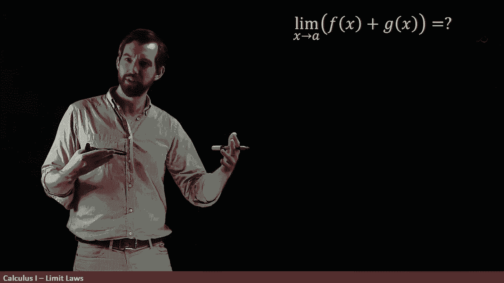

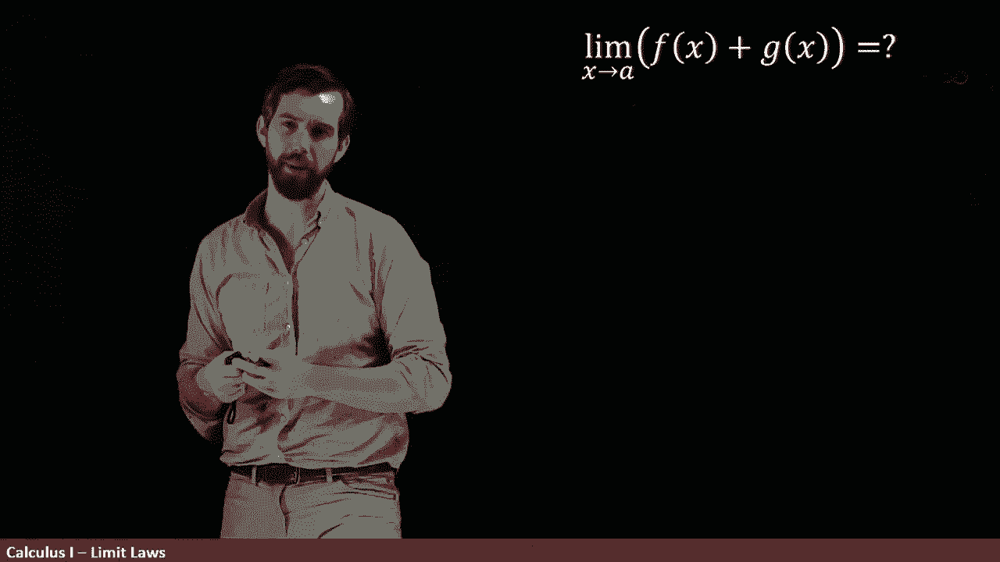

So I'm going give you an example of a few different functions。

 so what I have here is a function F of x that goes up here and goes flat。

 I've got a G of x goes long， goes down and then what I've sketched up here is the function F of x plus G of x。

 it's a new function， but it's a function that's built out of these other two ones。😡。

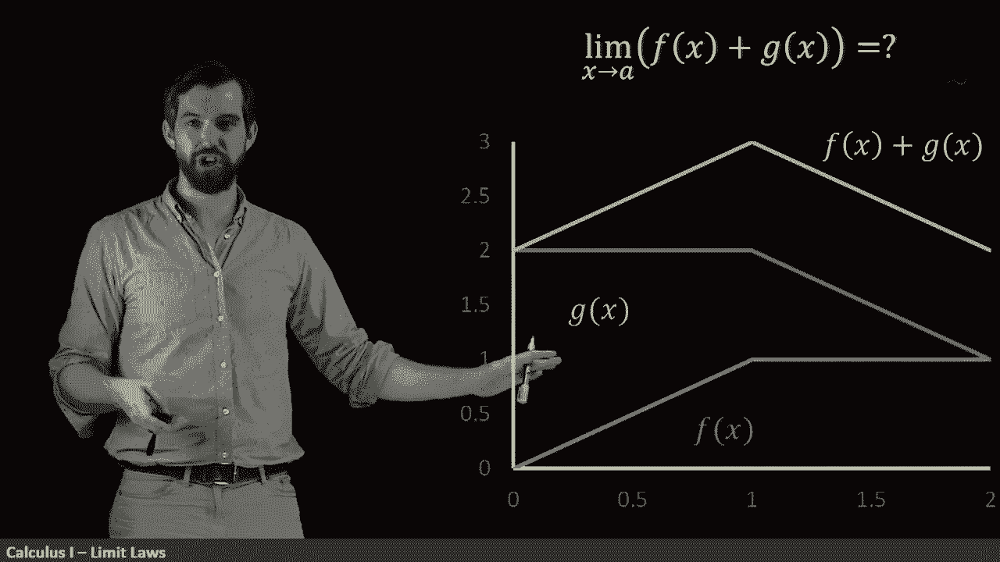

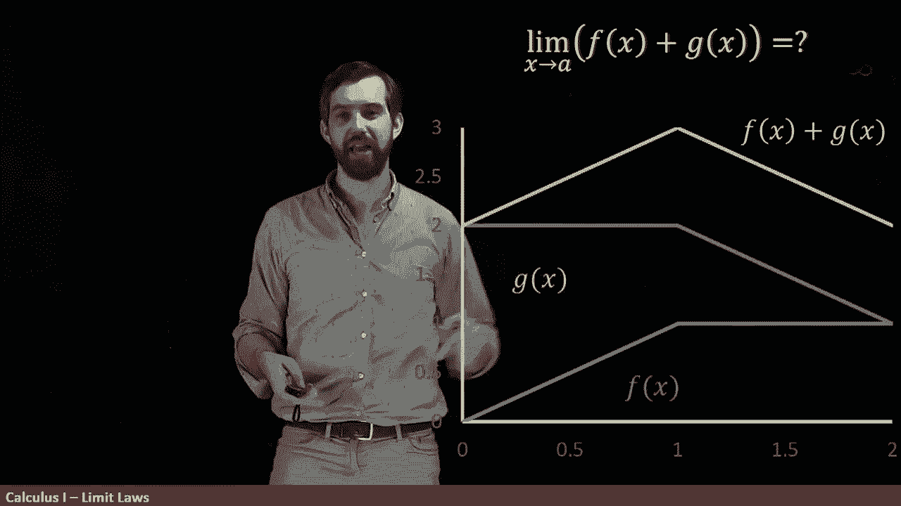

And you'll notice for example， that if I take the value of f at 0 which is 0 plus 2，0 plus 2 is2。

 so the start of f of x or here looks like this is height of 1 and then we've got a height of2 and then we've got a height of3 which is1 plus2 so indeed everything seems to work out relatively nicely that is indeed the graph of f of x plus g of x。

😡。

Now I'm going to focus just for fun at what the limit was if I chose the A equal to a half。

 so I'm going to go and look up here all the halfs。😡。

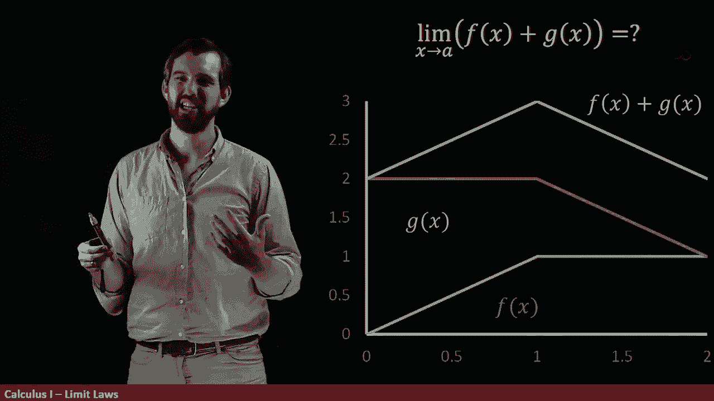

So if I was just going to do everVX， then I could come around here and I've got this one point there and the limit of everVx at the value of a half is just going to be equal to this 0。

5。So I'm going to say the limit。

As x goes to 0。5 of F of x。This is equal to looks like a 0。5。All right， lovely。Okay。

 so now let me do the same story， but I want to look at it for the G of x here。 So a G of X。

 it looks like it's got this height up here of  two。 So I'm going to say that the limit。

As my x goes to 0。5， but not of my F now now of my G of x。

That this is going to be equal to two。

That is that the limit。As x goes to 0。5 of now my F of x plus my G of x。

 the sum of those two functions。ThatWhat it appears to be is equal to the 2。5。

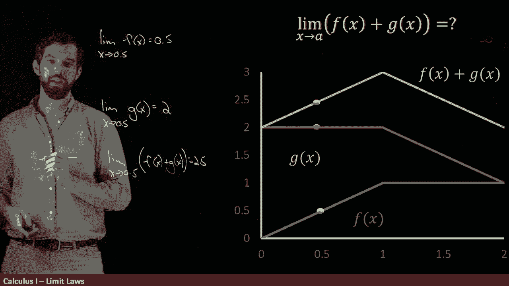

Now what I want you to observe is that a half plus2 is equal to 2。

5 In other words it looks like that the limit of a sum is just the sum of the two limits。

 so indeed this is the formula that we have， the limit of the sum of two things is the sum of two different limit added up that I can sort of take this the single limit and distribute it over this particular summation sign。

😡。

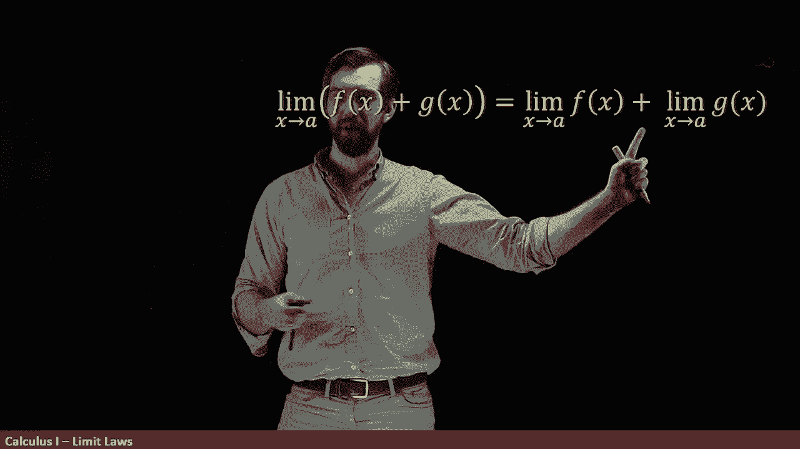

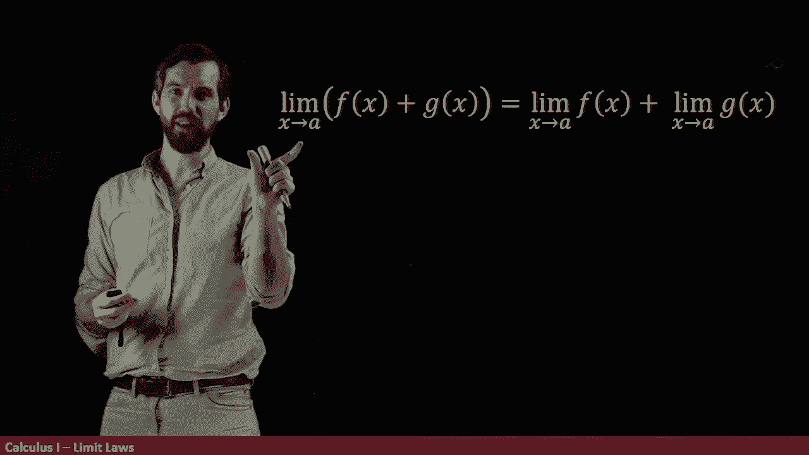

Or at least that's what it appears to be。 Is this formula always true。 Well。

 let me show you a specific example。 Allright， let's do the limit。

As x goes to the value of I'm going to do the sum of two functions。

 it's going to be the function one over x。And the function minus1 divided out by X。

Which1 over x plus minus1 over x is just a different way of saying that this is just going to be equal to zero because indeed they cancel。

So then the question is， is this the case that I can say that this is equal to these two individual things。

 the limit as x goes to0 of1 over x plus the limit as x goes to zero of minus1 over x。

 is it the case that this is true that this thing on the right hand side is equal to zero？

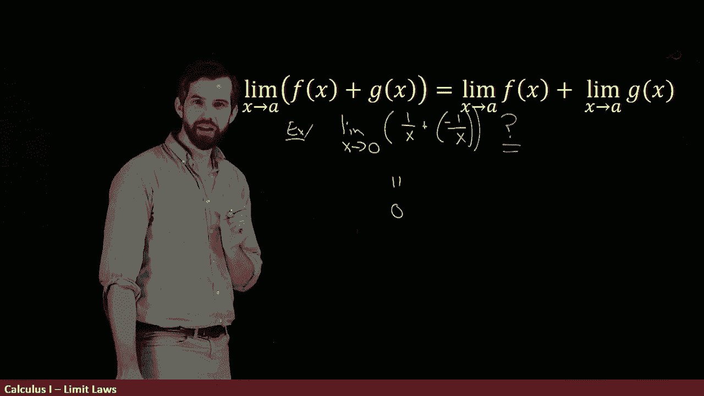

However， the problem is that neither of these two limits actually exist。

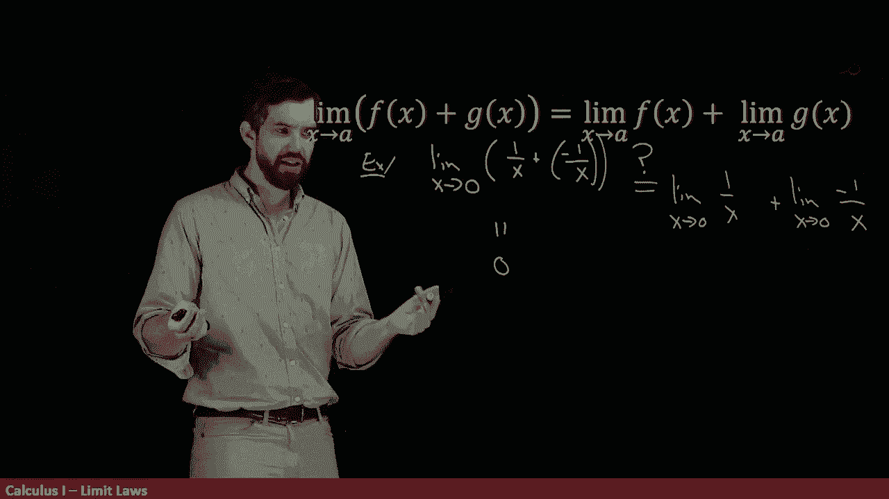

Indeed， the graph of one over x is something that looks a little bit like this。

And then minus sign is going to flip it for the other。

 This is something where the limit has this vertical asymptote at this particular point of x equal to  zero。

 so this does not exist。😡。

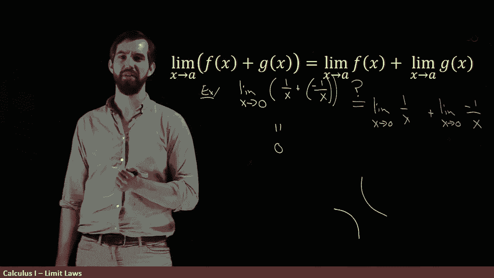

And this other limit does not exist。So this whole formula is actually kind of nonsense in this scenario because this doesn't exist。

 doesn't equal any number， this doesn't exist， it doesn't equal any number。

 yet we're saying that they add up together to be equal to the zero。

So what's the problem with my example， because I like my formula。

 we were well motivated by it in the previous example， but for this example。

 it appears to be nonsense。😡，And what is needed is an extra qualification This is true if we have the property that both the limit of F of x and the limit of G of x individually exist。

 and that was the problem here， these individual ones did not exist and so you sort of got this nonsense formula。

 but if you add this property， then we get this true statement。😡。

So this is one of these so-cal limit laws， a law that allows us to break up a more complicated limit into a simpler one。

 but there are many。 so for example， if you have some constants and just real number like seven。

 the limit of seven times F of x you just seven times whatever the limit was of F of x。

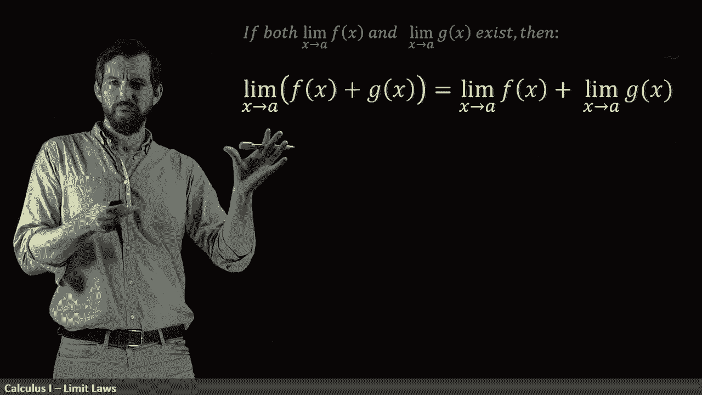

Or we have this so-called addivity rule here， but we can do the same thing with products。

 we could say that the limit of a product is the product of two different limits here。

 again under this initial assumption that all these individual limits exist。😡。

The same thing with quots I've got to check for nonzero here， but if I have an f of x over a G of x。

 this is the limit of a quotient， it is the quotient of a limit provided we have this additional assumption that the one on the bottom the limit of the G of x is nonzero so these add up to be a bunch not all but a bunch of the different limit laws that allow us to break up more complicated limits。

😡。