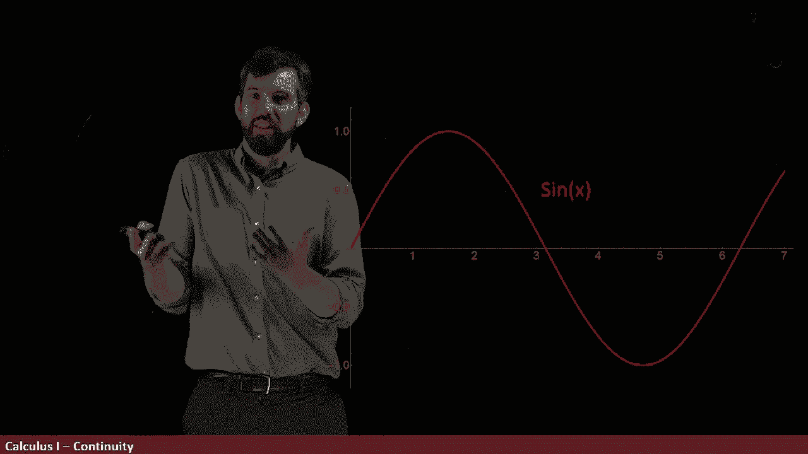

# 【双语字幕+资料下载】辛辛那提 MATH100 ｜ 微积分Ⅰ(2019·完整版) - P11：L11- Limits are simple for continuous functions - ShowMeAI - BV1544y1C7pC

Let's take a walk through a bunch of functions that are familiar to us and the first of these is Sine of X and the point that I want to make right now is let me suppose that I'm taking the limit。

😡。

As x goes to some specified point， how about is it gets close to this two value here of this function sine of x？

Well， I think for this function sine of x it's quite clear with the limitus so if I imagine that I'm getting closer and closer and closer to two from the right and I can imagine I'm getting closer and closer in two from the left。

What's the limit， well， it's just whatever the height of that point is。

 it's just going to be s of two。

Likewise， if I want to go down here。

This is the point3 pi over two if I want to figure out what the limit as x goes to3 pi over two of s of x is well I just I look here and I can see what's going on down here。

 I can see what's going down there， the limits from the left and the right are just whatever that point is。

 and so in this case it's minus1。

So the point is that I can just look at this graph and because there's sort of no holes or jumps or anything weird going on。

 the limit is just whatever the value of the point is。

Okay， so let's see some other ones this is another one that we saw before。

 This had an interesting behavior We noticed that if I took the limit as x went to1。

 well I'd be coming along this line from the left and the right and the limit would be equal to this value of two。

 but that was not the same as the function value， the function value was this dot up here。

 it was this value of three。😡。

So this is a different example from the sign because for the sign。

 the limit was just always the same thing as the function value。

 but here the limit is this one thing， the two， but the function value is a different thing。

 it's the three。

All right， let's carry on， we've seen this example before， this has a vertical aympt。

 it's got this gigantic infinite spike here。

The limit from the left is going to positive infinity。

 the limit from the right is going to minus infinity and the function is not even defined at one。

 so it's not at all the case that the limit and the function value are the same。

And then finally I want to show you this function， the sign of1 over x。

 we've seen that as well where we're also not going to have a limit。

 we've got this infinite oscillation at this particular point and the sign of one over zero is not even defined。

 so you also have this sort of kind of weirdness going on。😡。

Now note that the weirdness is only going on around zero if I go to some other point like this and I want to figure out what's the limit as I go to whatever that is。

 one point， something， well I just go along the curve and I just plug in the function value if I want to know the limit as x goes to two。

 say， well it's just sine of a half sine of1 over two。😡。

So for most parts， the limits easy， you just plug in the function value。

 but then there's these few interesting spots where that's not the case。

So the notion I'm trying to illustrate to you is something called continuity。

 and so we are going to say that a function is continuous if。

The limit and the function value are the same。

Or more precisely， we're going to say it's continuous at a point A Continuity is a local property。

 it's something that happens at some particular point if the limit as we get close to it is just the same thing as the function value。

So some functions are continuous for all points， other functions are continuous for some points but not for others。

 and in a few very weird examples， you have functions that are not continuous anywhere。

So let's go back to one of our examples， this was the1 over 1 minus x。

If I look anywhere except for the problem spot， the problem spots at one， if I look anywhere else。

 then the limit is just whatever the function value is going to be。

 So it's continuous in all of this stuff， there's no jumps， there's no holes。

 there's no oscillations， there's no spikes in this region， it's going to be continuous and likewise。

 in all of this region is continuous， but the problem， the discontinuity is at this point of one。

 So we can say that the function one over1 minus6， it's continuous everywhere except x equal equal to1 for every other point like how about zero or a half。

 it's going to be continuous。😡。

We'd previously seen this fact about rational functions。

 functions that are a polynomial on the top divided by a polynomial on the bottom。

 where we're making the additional claim that the quotient is not going to be equal to 0。

 and we' previously said that for those types of things by using limit laws。

 we applied our set of limit laws， we could see that this limit as x went to a of F of x was just the function value at a。

😡。

In other words， what we've seen before we can recast as saying that all rational functions are continuous。

 at least where their denominator is nonzero， so as long as you have your denominator be nonzero。

 then a rational function is continuous so this creates a big large set of examples of continuous functions for us。

Now it turns out that it's worthwhile giving names to different types of discontinuities This example is one referred to as a removable discontinuity and the idea is this。

This function is almost continuous。 It's just got one little problem spot。

 Its just this one point here was just shifted up。

But let me make a tiniest， tiniest change to this function。

 I'm going to take this point here and I'm going to move it down。

 and then now we have a straight line and a straight line is polynomial and it's continuous。

So in other words， this original function， the piece wide to one with just this one small change adding one point in from before is now going to be turned to a continuous function。

 so we see that that example is a removable discontinuity because it's easy to get rid of it。😡。

However， this is not always the case， for example， in the spike， the one over1 minus x。

 I can't put one point in and fix this， if I put in a point there。

 that wouldn't work because the limit from the left is plus infinity。

 the limit from the right is minus infinity， There's no one point I can put in here。😡。

So when we've got these infinite spikes， we'll call it unor an infinite discontinuity。

Okay let's look at a different kit。 This was the sign of one overx that we've seen a few times and it oscillates a lot。

 So we're going to call it an oscillatory discontinuity。

 And then the final category is something called jump discontinuities。

 and it looks like how it sounds We're going along for a while。 continuous in all of this region。

 by the way。 we get to this one problem spot at one。

 and then what it does is it completely jumps the function and goes off in some other path。

 This is not the removable discontinuity where it jumps at the one point。

 but then it would carry on in the straight line x plus one as we saw before。

 This is one where all the function doing one thing and then it starts doing something completely different。

 and this is referred to as a jump discontinuity。 So we have these removable these infinite these oscillatory and these jump discontinuities as different types of discontinuities that can be。

