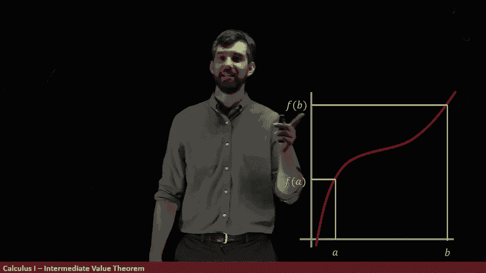

# P12：L12- Were you ever exactly 3 feet tall The Intermediate Value Theorem - ShowMeAI - BV1544y1C7pC

Were you ever exactly， exactly， exactly exactly three feet tall， I， yes。

And the argument goes a little bit something like this。

At one point in your life， you were less than three feet tall。

So that was some time when you were a baby or whatever。

For most of us， at this particular point， we're going to be over three feet tall。

And then if I think about what my height progression as a function of time is going to be。

 for the most part， this is a continuous function you grow and you grow and you grow and you might slow down as you approach adulthood。

 but there's no time when on one day you're one height and the next day you've jumped a completely different amount。

 it's this continuous growth。

So I'm going to say that height is a continuous function of time。

 or at least close enough that we can approximate it as a continuous function of time。

So I want to make this into a theorem， this idea that if at one point you were beneath three and at one point you were above three。

 and if you've got a continuous function at one point you must be exactly three。

 I want to make that into a function it's going to be called the intermediate value theorem。

Now I'm going to build it up with a particular example of a graph。

 so maybe this represents height as a function of time or maybe it represents something else。

 I don't know。

And what I'm going to do is I'm going to give two points， and I'm going to put them on the graph。

 So the first of all， I'm going to give an A which has a height of F of A。

 and I'm going to give a point B， which has a height of F of B。

So this is like saying at some point I was less than three and some point I was more than three feet。

 I got two specific points in time and there are two different outputs。

Now。Imagine I have some point in the middle， I was asking what about if you're exactly three feet tall。

 so if I've got some point below and some point above。

 what if I choose some point which is in the middle of these two a value I call n。

 and it's between the F of A and the F of B。

Now， from the picture， it sure looks like there's some spot down here in between the A and the B。

 where F of that value is precisely go to the n。 and indeed， we're going to call that a point C。

 some C where F of C is exactly this height n。

So here's the statement of the intermediate value theorem。

 it looks like a little bit of a blur of symbols， but we're going to compare it to this particular picture。

The first point is that I've got a function F of x， that was my red curve here。

And I'm assuming it's continuous on all the spots that we're interested in。

 we're choosing sort of two spots down here in the domain and A and a B。

 when I look at the closed interval AB， we're saying that F is continuous on that。

In a little bit， we'll investigate maybe why it needs to be continuous。

 but let's assume that for now。And then I have some fancy math notation if you have not seen this。

 it means element of this sort of weird shaped E， and it says that n is an element of this interval。

 which is all the points between F of A and F of B。

 so the n inside of this interval is a weird way of saying that this n here is just some number between F of a and F of B。

And then my claim is that anytime I have that scenario， I've got this interval。

 my functions continuous on that interval and I've got some value of n sandwiched between the F of A and the F of B。

 then the statement is then there is some value C， there's some C over here。

It has to live between the A and B。 That's why I say A less than equal to C， less equal to B。

 It lives inside of the A to B。

And it has the property that if I take F of c， I get to this value of n。 in other words。

 that my F of c is equal to n。 So that's the intermediate value theorem。

