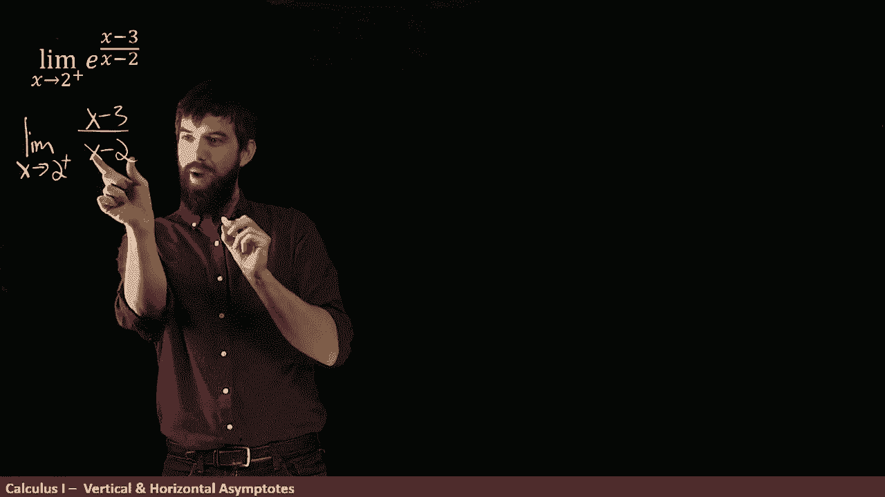

# 【双语字幕+资料下载】辛辛那提 MATH100 ｜ 微积分Ⅰ(2019·完整版) - P16：L16- Infinite Limit vs Limits at Infinity of a Composite Function - ShowMeAI - BV1544y1C7pC

In this video， we're going to look at a particular function。

 the function E to this rational function， E to x minus3 divided by x minus2。

 and what I want to accomplish by the end of this video is to analyze what are all the vertical asymptopes of this particular function and what are all the horizontal ones？

😡。

Now I've started with a particular limit， the limit as x goes to2 from the right and why did I even choose to investigate that limit Well。

 the reason was that if I look up here at the rational function。

 the x minus3 divided by x minus2 I see that there is a division by zero occurring at x equal to 2 and that makes me think that perhaps the value of x equal to 2 is a problem for this particular function something I want to investigate so I'm going to do this limit first and we're going to investigate a couple other limits and finally we're going to figure out all the vertical asymptotes。

 all the horizontal ones and come up with a graph of this function。😡。

Allright， so how do I actually investigate this limit first When I look at this。

 I notice that it's a composition of two different functions， there's an outside function。

 the E to the whatever， and then there's an inside function。

 this quotient this x minus3 over x minus2 So the first thing I'm going to do knowing that the exponential function is a continuous function is I'm going to investigate the limit as x goes to two from the right of the inside function So let me do that I'm going to look at this。

😡。

Alright， so here I'm investigating the limit， as that goes to two from the right of this rational function。

 Now， what I notice is， let's look at the denominator first。 So if I go and look at the denominator。

 Well， here we have an x -2。 and I'm plugging in a value of 2。 But it's it's not just too exactly。

 it's 2 from the right。 So this is a value like 2。12。01，2。001。

So for all of those values from the right， this is going to be very close to zero but close and positive。

 so I'm going to say that this looks a little bit like I'm going to figure out the numerator in a moment。

 but for the denominator， it looks like zero but zero from the right， a little bit positive。😡。

Okay well that let's investigate what happens in the numerator this is pretty simple。

 I plug into I get two minus3。 this is gonna to be a negative value so negative one and I put this in quotation marks because I'm not being rigorous here but I'm just demonstrating what the basic form of the top and the bottom is okay so what is this going to be if you have a negative number on the top a positive on the bottom and because it's a zero on the bottom particular it's spike into infinity in our only task because it plus infinity or minus infinity because of the negative because of the positive this is going to end up being minus infinity Allright so that was the inside now I want to go all the way back to the original what I want to look at E to this particular power in other words。

 what I'm effectively looking at is e to the minus infinity because I know that the inside is tending towards minus infinity and so I want to investigate what E to the negative infinity is What's that here。

😡，have to remember what the graph of e to the x is in order to be able to answer this and the graph of e to the x looks a little something like this。

 it starts all the way down here getting very close to zero and spice off like that。

 so this is the graph of E to the x。😡，Okay， well now we can answer it。

 what's the E to the minus infinity well I'm on the graph of e to the x。

 but I'm looking over here at minus infinity it's getting closer and closer and closer to zero。

 and so we can say that this is going to be equal to  zero。😡，All right。

 so that was one limit I might care about the limit as we go to two from the right。

 And it turns out it's not a vertical asympte。 This limit is just serial。😡，Next up。

 I'm going to look at the same place too。 that's the same problem spot that we have。

 but now I'm looking at two from the left and does that make a big difference。

 and it turns out that it's going to make a really big difference in this particular case。 Well。

 why is that the case Let's do the same computation we just did here for the inside。

 we would start here， but now instead of the plus I'm gonna to have a minus sign。😡。

Okay， so I've written that down and if I do my sort of what does this look like in terms of positive and negatives。

 Well on the top， I'm gonna go and plug in this particular value of  two I still get the 1 as I did before。

 but now look what happens on the bottom I'm plugging in2 but2 from the left So number like 1。91。991。

999 So if I subtract2 from all of those they're getting really close to0 but from the left so I'm going write a 0 and I put this little minus sign up here to noteote that it's coming from the left。

😡，And then a division by zero was plus or minus infinity。

 but we have to adjudicate whether it's positive or negative because I've got a minus and another minus。

 I can say that this is going to be infinity Okay， so the inside changes a little bit it went from being minus infinity in the first case to plus infinity in the second case。

😡，So then when I come and investigate this what we're going to have。

 this is just going to be the same thing as an E to the power of plus infinity this time。

I go and take a look at what that's gonna to look like on the graph as I go to positive infinity。

 It is spiking to positive infinity。 And so indeed this is gonna to be positive infinity。

 So now we can claim that there is indeed a vertical aymptone at this particular point of X going to2 from the left。

 even though from the right， it was going to a finite number 0 from the left it goes to infinity So we have a vertical aymptote。

 So those were the vertical asymptes。 But what about the horizontal asymptes a horizontal asympts is what happens at either plus infinity or minus infinity。

 So that's what I'm going to do I'm can take first the limit as we go to positive infinity of the same function。

 and then in a moment I'll do negative infinity。😡。

And it's the same idea， there' is the outside function。

 there's the inside function and because E to the x is continuous I'm going to go and do the inside function first and feed that into the outside function。

 so let me write that down。😡。

Rational functions， quots of polynomials are actually pretty easy to compute limits at plus or minus infinity。

 When I look at this， I say what's the highest power of x on the top。

 What's the highest power of x on the bottom。 and in this case is actually relatively straightforward。

 There's x to the power of one on the top and x to the power of one on the bottom。

 the highest power is the same。 And so I look at the coefficients。

 The coefficient of the first x is1， the coefficient of the second x is1。

 And so this infinite limit is just equal to the value of1。 So now that I know the inside。

 I can come along and I can feed it in up here。 if I have this E to the power of whatever that's gonna be。

 Well， that goes to1。 So this is e to the1。 And so e to the1 or in other words， E。😡。

And so we have this one horizontal asymptoe it's got the equation y because it's a height y equals e and that is a horizontal asymptoe at positive infinity Well what about negative infinity now it's got the same inside here but it would be at minus infinity but does not change anything I don't think so。

😡，This is just an X over an x the highest powers they cancel， it's one either way。

 so indeed the infinity that I had here， I can replace it with plus or minus infinity either way this happens to equal 1 note that this is not always the case if I had something like for example。

 a square root here could be the case that limit positive infinity and minus infinity we' different but in this case they're both one。

 and then if I feed this into here it's going to be e to the1 and so I'm going to get the value E to the one or other words E。

😡，So I've got these two different horizontal asymptes。

 All right so summarizing the four limits we've computed we saw that when we took two from the right。

 it was a finite number0 when it was two from the left it was a vertical asymptote infinity And then when we took the horizontal asympotees。

 either positive infinity or minus infinity either of them gave the value of E So we have these horizontal asytes at y equal to E So what would the graph of this thing look like okay I'm going bring it up here。

 This is the graph。 notice what happens first at2。 when I'm coming from the right。

 So I'm coming over here from the right， it goes right down and hits the value of0。

 that's what we expected。 not a vertical aympts' just a finite value， the value of0。

 but then if I come over here from the left as I'm going towards2 So going towards two but from the left。

 I actually do indeed get that vertical asymptes。 so I get the vertical asymptote from the left。

 even though from the right it's just going down to0。

Okay what about the horizontal laines where you can sort of see we might not be quite zoomed in enough A seal is just sort of flattening and out。

 flattening out this value that looks like two point something rather Well it's quite believable that as you go larger than just the six that we see here。

 that's going level out at the value of E say as we go down here it's going to eventually level out at the value of E we have this two different horizontal laints on both sides equaling E knowing when a limit happens to be equal to infinity that is a vertical lainte or knowing what the horizontal laintes are that is when the limits go to plus or minus infinity。

 it allows you to have a really nice sort of big picture of the shape of the graphs。

 simply knowing these sort of four pieces of information tells us quite a lot about the basic shape of the graph it is very invaluable for us to quickly understand what's going on in a function。

