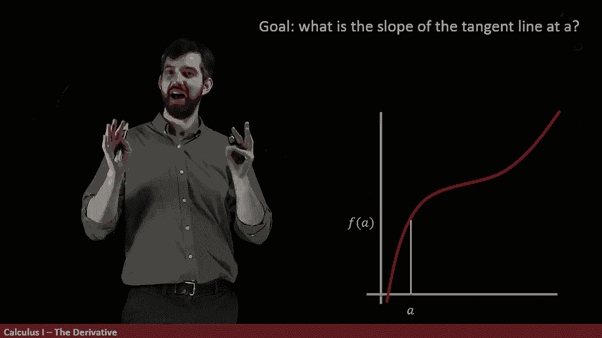
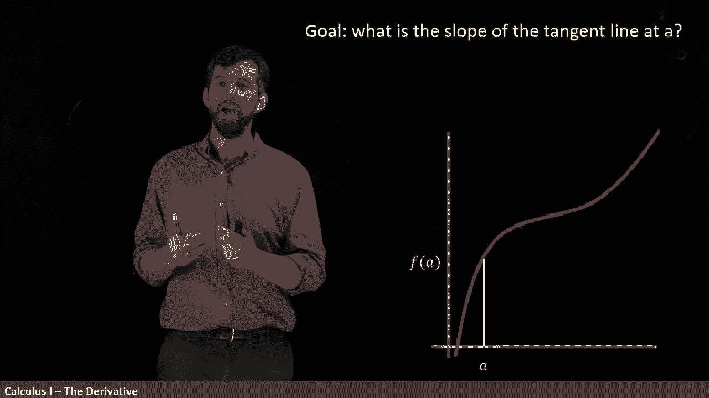
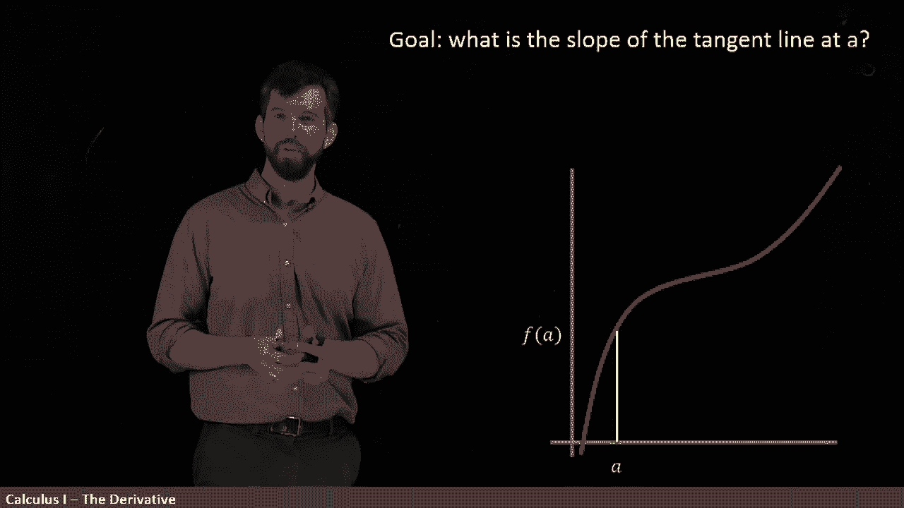
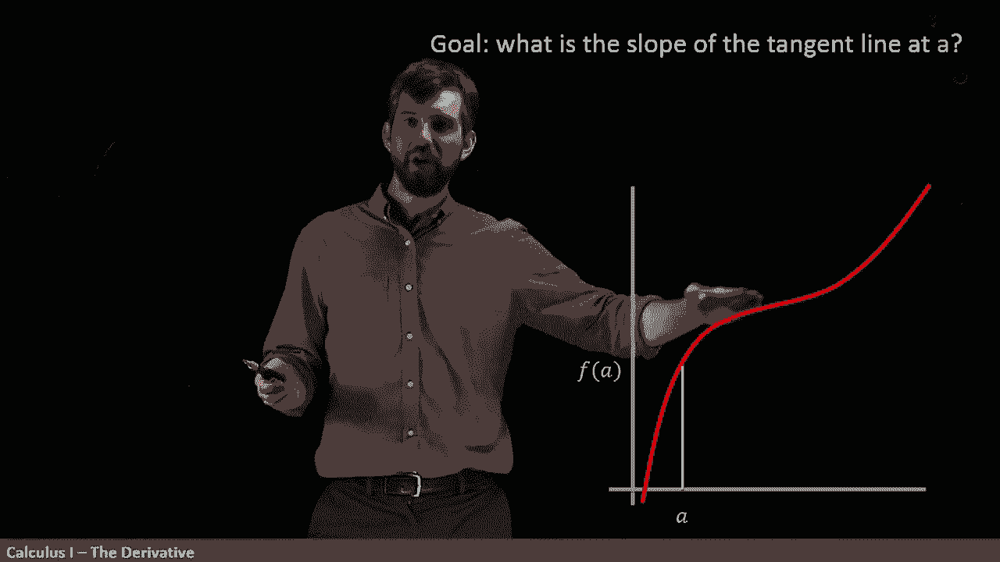
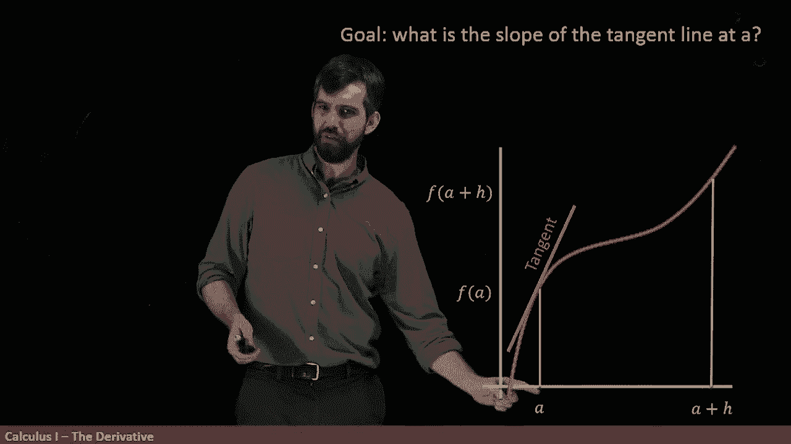
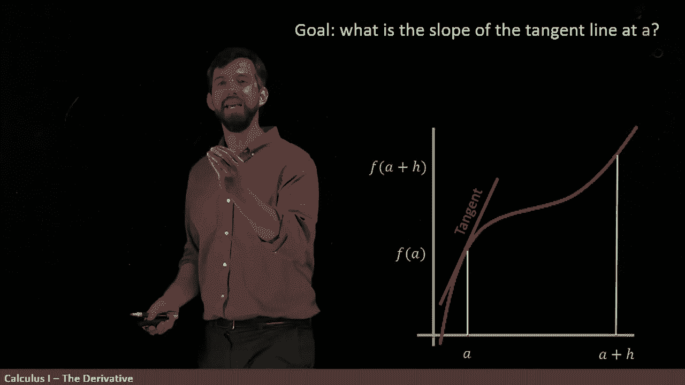
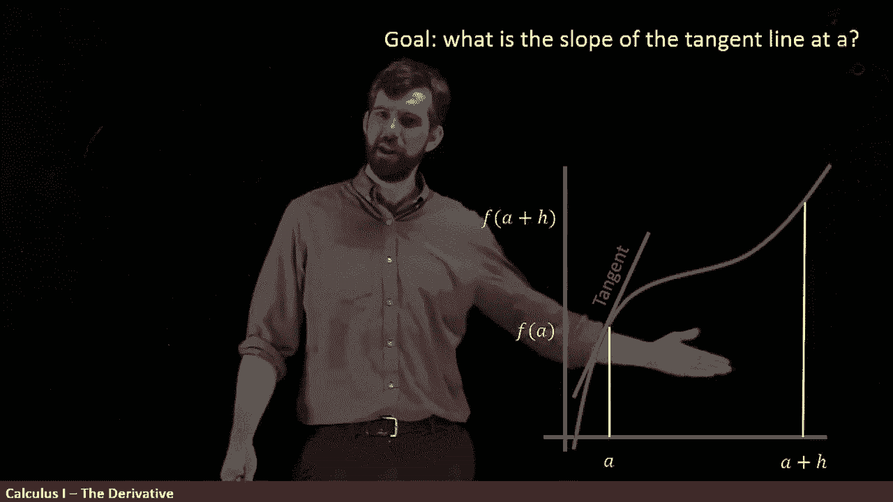
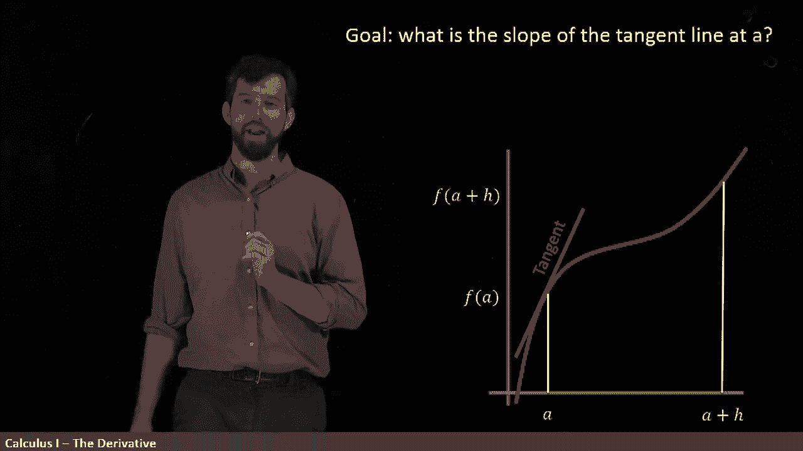
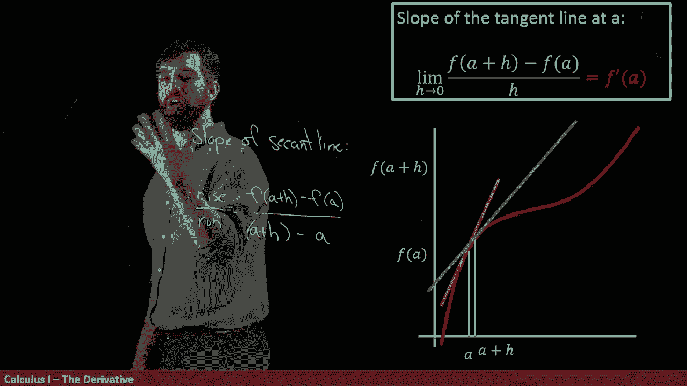

# 【双语字幕+资料下载】辛辛那提 MATH100 ｜ 微积分Ⅰ(2019·完整版) - P18：L18- Definition of the Derivative  _ Part I - ShowMeAI - BV1544y1C7pC

I am very excited because in this video， we are going to introduce the definition of one of the foundational concepts and also calculus the derivative。

And I'm going to introduce it to you in a little bit of the geometric flavor。

So here's what I claim our goal is， I want to know what is the slope of the tangent line at a。

So what does it even mean well， first of all， I've got some function I've drawn in here in red and I've chosen some particular point。

 I've got an A down here and it has a height of this F of a。

So what's the tangent line？The tangent line I'm gonna sketch in here is this line that just comes down and just like just kisses this particular curve。

 doesn't like cut through it sharply， you can sort of see that the angle on both sides here is kind of the same it's a really small number just nicely comes together and sort of smoothly steps down on it I know I haven't given you a precise mathematical definition。

 but I hope that you have the idea that this tangent line just lays as flat as can be at this particular point。

Okay， so how are we going to be able to compute this。

 this is some line I haven't even really well defined it for you。

 but my goal is to figure what is the slope of that line or more broadly。

 what's the equation of that line？The way that we're going to do this is a little bit roundabout I'm going to add some other point in here and what I'm going to add is。

 you know what I've got an A down here。

The other point I'm not going to call it B， I'm going to call it A plus H。

 So if you got some point A A plus H is just a little distance H away。

 and I sort of exaggerated it in my diagram， but think of H is this really， really small number。

 You got a and you got a point right beside A a little bit bigger than it。 It's an A plus H。

 and the difference down here。😡。

A plus H minus a， this difference on the bottom is H。All right， now what lie am I doing this。

 Why am I this other point。The thing I do know how to compute the thing I do know how to define is a secant line。

 so I'm going to draw this is the secant line it goes to this point a F of a up to a plus H F of a plus H and you get this nice line that goes between those and you'll recall that secant lines are a line that connects two points on a curve。

😡。

Now， the big idea is this， I've drawn them far away with a big value of H。

 so they don't look like the same line。But imagine H was really small。

 imagine your points were like right close together。

Then my claim is that the secant line and the tangent line are pretty good approximation。

So that's what our big idea is， we are going to approximate the tangent line。

 the one I want to figure out by the slope of that second line that goes from this point where my x is a up to my x is a plus H。

And whatever that slope is， that's going to be our approximation。

So let's try to figure out what that is。 I want to figure out the slope of my secretant line。Well。

 the slopes of all lines are going to be some rise divided out by some run here。

 so then to figure out what the rise and what the run is。Now in my graph。

 I'm going from at the bottom it's an f of A， and then I'm raising it up to this a plus H。

 this f of a plus H， so f of a up to F of a plus H。😡。

And so I'm going to claim that my rise here is this difference， it's going to be F of a plus H。Minus。

F of a。 So that's my rise。 Okay， what will I run。 Well， now I'm looking down here horizontally。

 So I have a plus H minus this a。 So my run is going to be equal to a plus H。Minus the value of a。

So that is my claim for the slope of the Seaant line。

Now I actually want to try to demonstrate to you what happens if instead of having these sort of exaggeratingly far apart。

 my H got closer and closer and closer and closer in， we have this formula for any age。

 we have this formula， positive or negative doesn't matter This formula is here。

 that's a slope of a secant line and our big idea is to approximate the tangent line by the slope of the secant line。

😡，But let's take this H really， really close to a so what I did was I just manud it one step in。

And then I moved it one step in again， and I moved it one step in again。

 and I moved it one step in again。So what I'm having over here is I make this change is that my Cant line every time it changes a little bit。

But now when it's really， really， really close， the slope of the Seak line and the slope of the tangent line。

 well， they're much better now。If I'm approximating the tangent by the seaend， as I move it really。

 really close， it gets better or and better and if if you can imagine I sort of lose the resolution to do this。

 but if I kept on stepping in here and these got closer and closer and closer。

 they'd be more or less on top of each other。So that's my definition。

 I am going to define it like this。 The slope of the tangent line at a is。

This expression we just computed， which is the slope of the seaant line。

 notice a plus H minus a that's equal to just H。 so I clean out the bottom a little bit there。

 and I just put a single H there。 I same formula I just clean it up。

But the key thing is with the limit， this is the slope of the secant line for two different points。

 and I'm going to take the limit as H goes to zero。

And this to me is a definition of the soap of the tangent line。

 and we also use a different terminology we write。F prime of a where we put this little prime up。

 that is the derivative， F prime of a is the derivative at the value of a and geometrically it means it's over the tangelline and algebraically it's whatever this limit is。

