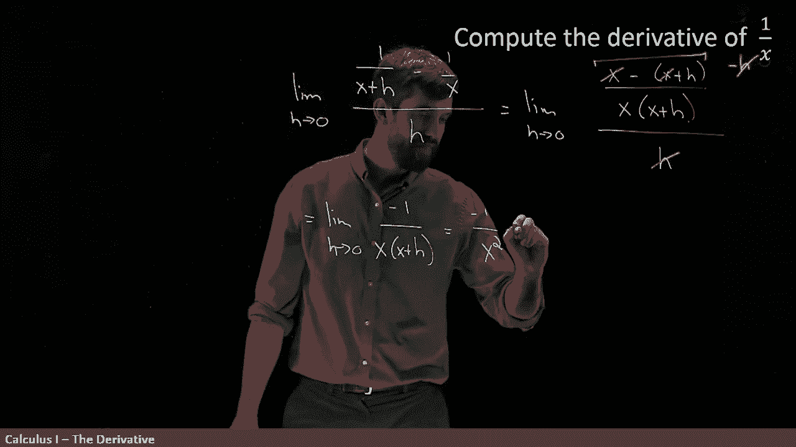

# 【双语字幕+资料下载】辛辛那提 MATH100 ｜ 微积分Ⅰ(2019·完整版) - P19：L19- Applying the Definition of the Derivative to 1_x - ShowMeAI - BV1544y1C7pC

I did the derivative at the value of a at one point。

 but I want you to think of it more intense in terms of a function。

 but I could do this same computation at any A， I did it at this one here but I could do it for a B or a C or anything。

So I'm going to actually replace it by thinking of this derivative as a new function。

 I write f prime of x where x usually denotes a variable in a function and a is like a specific specified point。

But I do the exact same thing f of x plus H minus f of x all divided by h is the derivative。

The value of x when I take the limit as H goes to zero。 I'm thinking of this as a function。

That is， if you give me some function， F。

I could go and do this computation and hopefully come up with another function。

 the derivative of the function you gave me。

So let's see an example of how that might work。 I want to compute the derivative of  one over x and geometrically we can think。

 well1 over x is some curve， and it should tell me what the slope is to that particular curve。

 but I'm going to do this purely algebraically， So how does it work。

 What do we begin with a limit as H goes to zero。😡。

And then I have to write， first of all， F of x plus H。

So I've got one over X， I'm going to come in here and write one over everywhere there's an X I put in x plus H。

 so x plus H。

So that's my function evaluated at x plus H。 Now I want to subtract off my function evaluated at X。

 That's easy enough to do subtract off just one over x。

So this is f of x plus H， subtract off f of x， and then I'm dividing the entire thing by H。

Now， this looks like a bit of a messy thing， but any time where you have a difference of fractions。

 the standard canonical algebraic trick is to find a lowest common denominator， so let's do that。

So I'm going to copy and paste the limit part。

I'm going to copy and paste the big denominator down here or the divided by age。

 that's not going to change to this step， but now I'm going to do lowest common denominator to this portion up here。

So I'm going to say that what I have is an x minus。

X plus H， and then this is all divided out by x multiplied。

By x plus H。So I've done that little algebra trickery。

Now， I want you to notice that up here at the top， I've got an X， and then I subtract off an X。

 so let's get rid of those。 I don't need those any longer。😡。

And so what I have on this top， this whole sort of top portion here。

 this is just the same thing as the value minus8 up of there on the top。

But then I have an age on the top。And IH have an H down here on the bottom。

 and so that H and that H are going to cancel as well。

And so what this leaves me with， if I'm being careful with my signs。

 I'm going to copy and paste the limit as H goes to zero， that never changes。

But I still have the minus sign here in front of the age， the minus。

 I'll make it a minus1 now that the age cancels。So minus1 divided by x。

X plus H。Okay， go a little simpler， that's good， but what else can we do？

Now this is a limit that I think I can evaluate what happens as H goes to zero。

 I can use my different limit laws， this is a rational function。

So I'm just going to set h going to zero right now and what is this。

 it's minus1 divided out by x squared。

Notice this final step here is the only time I do not put a limit。

 I always do limit of my expression equals， limit of my expression equals limit of my expression。

 and then this step here I'm evaluating the limit，'m distributing it through。

 I'm sending my h to0 and so I get rid of the limit sign at this final step here and write minus1 over x squared。

 and so I claim that this is equal to F prime。😡。

Of the function X。

But I want to be clear， you might say， well， hold on tremor， if at this final step。

 you just made h equal to  zero， why didn't you just make h equal to zero at the beginning at the first step？

Well， I'm not allowed to do that because。This division by H on the bottom here means that I have a division by zero。

 I can't just naively plug it in。 I have to go and do this algebra until I have a scenario where when plugging the H in when making that equal to0。

 this does not result in any discontinuity does not result in any divisions by zero。

 So that's why when I've done my algebra to get it down to this step now I can plug in the h equal to 0。

 it's a continuous function at that point and I get it equal to this。😡。

By the way， the original function F。

Was not defined at0。 It's derivative， not defined at0 as well。 So this entire analysis I've done。

 everything is only relevant in the scenario where x here is not equal to 0。

 I don't even have a conversation When x is equal to 0。 The original function is in defined。

 Does it make sense to say， What is its derivative， going be。

So this kind of algebraic procedure by the definition of the derivative is how I can start with functions and come up with their derivatives。

Or geometrically， if I have some function like1 over x。

 I can tell me what is the slope of that function at any particular value of x。

 and that is going to be the answer。

