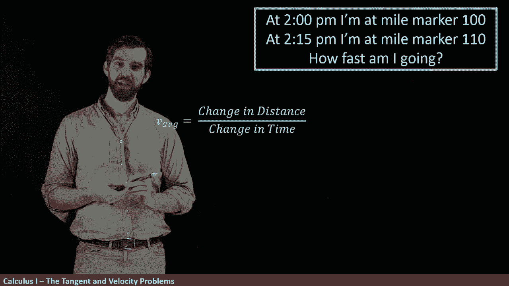
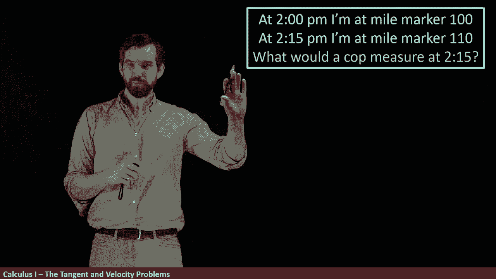

# 【双语字幕+资料下载】辛辛那提 MATH100 ｜ 微积分Ⅰ(2019·完整版) - P1：L1- The Velocity Problem _ Part I - Numerically - ShowMeAI - BV1544y1C7pC

Let's start our investigation of calculus by looking at something that I call the velocity problem so here's the idea imagine I'm driving down the highway and I say that at 2 o'clock I'm at the 100 mile marker。

 but that at 215 I'm going to be at the 110 mile marker。

So the question is how fast am I going？

But the real question is， what do I mean by how fast am I going？

Am I asking how fast am I going at two o'clock am I asking how fast am I going at 215。

 am I asking how fast I'm going over this interval。

 we have to be more precise about what it is that we're asking。

One way that we could answer it is by something called the average velocity。

 so the average velocity is going to be the change in the distance divided out by the change in the time。

 or if I want to use a little bit of mathematical notation。

 I could say that this is deelta D for the change in the distance divided by deelta T。

 the change in the time。😡。

So let's compute this average velocity over this 15 minute time interval that we have。

So if I'm going to come down and try to figure out what the deelta D is going to be， well。

 we went from the 100 to the 110 miles， so it was 110 minus 100 and the units here are going to be miles。

And then if I want to investigate the change in time， well， I've gone from 2 o'clock to 215。

 so I'm going to write this as 215 minus2 o'clock。😡。

I'm sort of abusing my notation here a little bit， but I can do this computation to say that the difference here is going to be 10 miles。

Divided out by 15 minutess。Now this answer is actually perfectly acceptable。

 it's just that we don't typically give speeds in miles per minute。

 we normally give them in miles per hour， so I can do a little unit conversion here and I can say that there are going to be 60 minutes。

Inside of one hour。And then the minutess are going to cancel。

 and this is going to be 600 divided by 15， and so this is going to be 40 miles per hour。

So this is one way to answer this， this is the average velocity over this 15 minute time intervalfall。

Now I'm going to ask a slightly different question。

What would a cop measure at exactly 215 We had previously decided that the average velocity over this 15 minutes was 40 miles per hour。

 so how do we answer the question， what is the cop going to tell us the velocity is at 215 exactly？

Well， we don't know how to answer this question with the amount of information that we have for example。

 suppose I was going way faster， I was speeding， but I was speeding only from say。

2 o'clock until to 10 and then we get a traffic light and we slow down。

 the comp might not measure us having this higher speed because the average velocity was going to be 40 miles per hour。

 even though at some point in the middle we'd been traveling way faster than 40 miles per hour and at some point we're traveling way slower than 40 miles per hour。

So this problem， it turns out that we have not。

Enough information。

It turns out that there's actually two different concepts here。

 the one that we had seen before was called the average velocity and it was over an interval。

 but what we're really asking here when I say what is the co measuring at 215 precisely is something called the instantaneous velocity and the average velocity over an interval and the instantaneous velocity at one exact time are indeed different things。

😡。

I'm going to give you a little bit of a different way to think about the instantaneous velocity。

Suppose I had a whole chart of information here and what I want you to note is that what's going on here in this time interval column is that I'm getting smaller and smaller and smaller time intervals so the first rule here is the two to the 215 but then I do 210 to 215214 to 215。

 I go all the way down until I'm like only a one second interval 214 and 59 seconds all the way up to 215。

😡，So then for each of these time intervals， we know if we have a time interval we can compute the average velocity。

 so I'm just going to imagine we've gone and done that and we've got the 48 46 going down and then in this last second here。

 this one tiny little time interval， it appears that we're going 60 miles per hour over that time interval。

Now， if you were a comp and you had this table of data of our different average velocities。

 do you think that you should be getting a ticket at the 60 miles per hour if you're driving in the city set？

Well， if you only look down here at the bottom at that last second and you see that this average velocity is to 60 milesph hour。

 you can be really confident that at the time of 215， that you're going to see some speed。

 which is going to be at least faster than whatever the speed limit is， something very， very。

 very close， maybe not exactly， but very close to 60 miles per hour。

So this leads me to a notion of a sort of limiting process。

If I want to know the instantaneous velocity， that is the velocity exactly at 215。

Then what I'm going to do is look at smaller and smaller and smaller time intervals where the time interval is getting really。

 really， really close to 215 and then you could imagine we could carry on if we had more accurate measurements this table could carry on going perhaps forever as our intervals got closer and closer and closer to 215 and that our average velocities would presumably get closer and closer to some number。

😡，So we can think of instantaneous velocity， the velocity exactly at 215 to be analogous to the sort of limiting process as these average velocities are done over smaller and smaller and smaller intervals。

Indeed， this is effectively how modern LiDar guns are going to work that police have when they're trying to measure what your speed is。

They don't tell you the exact velocity of specific time exactly。

 they interpret it as a very close approximation。 and the way it works is this that they can send out this pulse of light and they can figure out what the distance between the cop and the car is going to be。

 and then some tiny fraction of a second later， another pulse is sent out。

 and they can again get a new reading of where exactly this distance between the cop and the car is going to be。

😡，So what you have is a tiny， tiny， tiny， tiny little interval because the time between these pulses is really small and then you get a tiny change in distance as well because there hasn't been much change。

 the car hasn't moved a lot， but nonetheless you get two distances and two times and they can compute the average velocity over that interval and in truth they send out a whole number of these different pulses really really really really quickly and they can do some sort of average to try to get our very accurate reading。

😡，So this computing of average velocities is a very important process for us in the limit as our time intervals get small。

