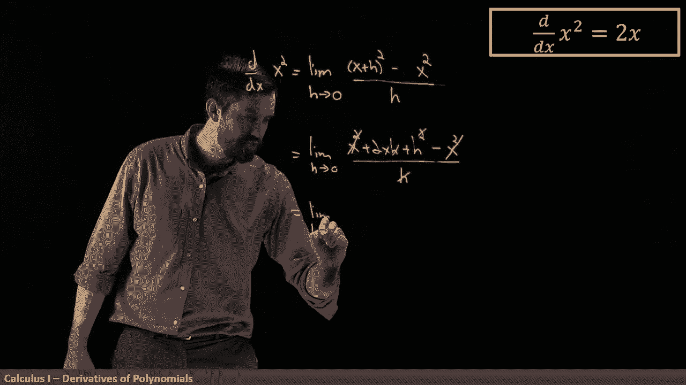

# 【双语字幕+资料下载】辛辛那提 MATH100 ｜ 微积分Ⅰ(2019·完整版) - P21：L21- The derivative of a constant and of x^2  from the definition - ShowMeAI - BV1544y1C7pC

Now that we've defined the derivative， our next project is to go around find as many functions as we can and compute the derivatives of all of them。

 We want to be a little bit intelligent about this。 We want to try to figure out。

 can I take the derivative of not just one function and another， but an entire category of functions。

 So this project is going to take us a little while as we go through a bunch of the different familiar functions to us。

 But we're going to try to take the derivatives of polynomials and trigonometric terms and product terms。

 and we've already done by the definition， the derivative of one over X that we've seen previously。

 So there's all these different ones。 and we want to try to figure out what are the derivatives of them。

😊。

By the way， I'll note that in these videos I'm going to alternate a little bit between this DDX notation。

 this leaveness notation for taking the derivative and the notation that is due to Lagrange。

 which is F prime and that when I have a generic placeholder like the symbol F I'll often use F prime when I've got an explicit function。

 I'll often use DDX but either way just taking the derivative。

So the first one I want to consider is taking the derivative of a constant function。

 so this is the function f of x equal to a constant and a graph of it is going to look like this。

 so this is some positive value of C and it's just a horizontal line for the graph of this function。

😡。

Now what's the derivative Gemetrically we've seen that the derivative is the slope of the tangent line okay well。

 if my function is this， what's the tangent line， well。

 the tangent line is just lying directly on top of the function。

So we can say that the slope of the tangent line， which is the derivative。

 is a rise over a run because it's horizontal， there's no rise。

 and so therefore we can say that the slope is going to be zero。

 and that's how I was able to compute that the derivative of a constant function is just going to be zero。

Next up， I'm taking the derivative of x squared。

Now we can also look at x cubed and x to the fourth and we will in a moment。

 but right now I'm just going to focus on x squared。

Now， what we did in the past for a constant was just to see the graph and it was kind of obvious。

 But but here if we think about what a parabola。 it's not entirely obvious， it might seem reasonable。

 but not completely obvious as this derivative really is to x。

 So what I'm going to do here instead is use the definition of the derivative。

 The formal limit definition。 And we're going to hope to get this result。

 So our goal is the derivative with respect to x of this particular function x squared。

 And I'm using the formal definition of the derivative， which is a limit。

 It is a limit as my H is going to be going to 0。 And then what I put here is just some quotient。

 And the quotient is going to be F of x plus H， minus f of x all divided out by H。

 But because we have an explicit function x squared。 when I put in F of x plus H， it looks like。

X plus H。All squared。And then I subtract off f of x， so this is just x squared。

 and then this is all going to be divided out by H。

So I have put in the formal definition of the derivative。Next up。Well。

 I have some quadratic at the top here， and so I want to expand it out。

 And so I'm going to copy and paste the limit portion that hasn't gone in yet。

 but I'm just doing some algebra up here。 And at the top， I get x squared。Plus，2 X H。Plus h squared。

 that was me expanding out the x plus h squared。 and then I finally have this minus x squared。

 so I'm going to minus off the x squared， and then this is all going to be divided out by H。

And the thing I first observed， I got a plus x squared and a minus x squared。

 so those are going to cancel， I'm going to get rid of those。

And then notice that we have an H on the top and h squared in an H。

 so I'm going to cancel out also one copy of H， so I'll cancel out that H that H and I'll cancel out the squared at the top So what is this leaving me with the limit？

As H goes to zero of 2 x。

Plus H， that's all I have。

Now at this point I haven't actually computed the limit portion of it yet。

 I've just done some cancellation and by the way， I'm allowed to cancel this H from the top and the bottom because I'm inside of a limit。

 I don't have to worry about taking it at H equal to zero because I'm dealing with the limit。

 it's around H equal to zero。

So now I want to actually execute the limit and what I'm going to do here is I'm going to take h go to0 now this is going to be a polynomial。

 we've got rid of any division by zero thing so it's a polynomial and we know how to take the limit of polynomial which just plug in the number and so what do I get2 x and maybe I'll put the plus zero as well but of course this is just equal to 2 x because I've sent my H to0。

😡。

And notice my notation， limit， limit， limit， I have it at all of my steps。

 except for this final step where I'm evaluating the limit and so I no longer write it down。

 but either way， the derivative of x squared is equal to 2 x， so I have proven what I wanted to show。

