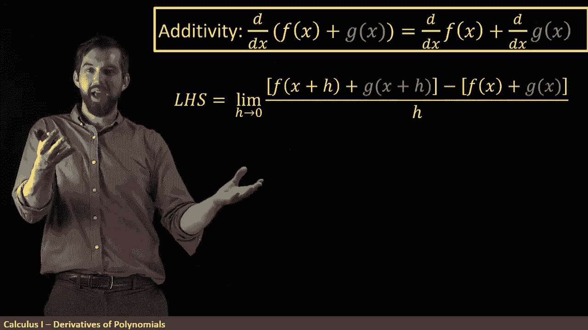
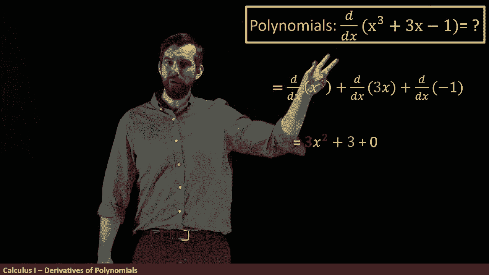

# 【双语字幕+资料下载】辛辛那提 MATH100 ｜ 微积分Ⅰ(2019·完整版) - P22：L22- Derivative Rules -  Power Rule, Additivity, and Scalar Multiplication - ShowMeAI - BV1544y1C7pC

Now， we've looked at x squared， but I can also look at the derivative of x to any power n that I might like where n is some real number and it turns out that there's actually a classy a power rule of formulas that if you have the derivative of x to the n。

 the answer is you take the n which is here you bring it down at the front。

 and then you subtract one up from the top。 So for example。

 in the x squared that we had just seen of where you've got a two at the top the two comes down。

 but then for the n minus1 just x by itself is really x to the power of1 and x to the power of1 is two minus1。

 So indeed what we had just seen is compatible with the power rule。

 but the power rule allows us to deal with any real number here So I can， for instance。

 talk about what happens if I take the derivative of x to the sevenhals。 Well。

 the seven/has it comes down and then x to the five hats， what's five hats， it's seven/ half。

us1 is five half7/ halfs minus two halfs， so fivehals。

 So in other words you get this n x to the n minus1 behavior as well Now I'm not going to prove the power rule。

 but it's a similar idea to what we had just seen We could use the definition of the derivative and a bunch of funky algebra to try to move in the direction of proving this power rule Okay so what if I don't have just powers。

 but I have like some sums of powers。 In other words， I've got a polynoial。

 and I want to take the derivative of a polynomial How can we deal with that。😡。

Now what I notice is that this is the derivative of the sum of a bunch of things。

 so I kind of want to ask broader question what is the derivative of the sum of two things and indeed the claim is going to be that the derivative of a sum is going to be the sum of two different derivatives notice I've got a derivative of f plus G and I say it' the derivative of F。

😡。

Plus， the derivative of Jeep。So this is a rule that allows us to quickly solve the derivative of sums if I know each individual derivative。

So we want to prove this and we're going to prove this by the definition of the derivative。

 so I'm going to begin with the lefthand side here， so what I'm claiming I'm dealing with this。

 the derivative of the sum， and what I'm doing is the definition of the derivative so the definition is it's a limit as H goes to zero of whatever I have at x plus H。

😡。

Mineus whatever I have at x， all divided up by h。

It's just that the thing I'm taking the derivative of is now F plus G。

 So when I'm taking my derivative of this， that what I get is F plus G at the value of x plus H。😡。

Minus f plus g at the value of x， and then all divided it up by H。

So now after I applied the definition of the derivative， I want to do a little bit of algebra。

 so I'm going I'm going to take these components and I'm going take the f of x and I'm going to combine them together。

 so it's going to look like this。 All I've done is rearrangement， I've put the two yellow。

 the things with F together， I've put the two blue， the things with G together。😡，All right。

 now what can I do？Notice that this is the limit of a sum。

And we've previously had a rule for the limit of a sum。

 the limit of a sum is the sum of two different limits。

So what I can do is take this and I can break it up here as the sum of two different things。

But then I know what the thing on the left is lumin is H equals to0。

 f of x plus H minus f of x all over h， this is the definition of the derivativero of F。

And then the same process over here， that's the definition of the derivative of G。

 and so that I'm going to say that this is equal to the derivative of F plus the derivative of G。

Now I should add as a caveat that as we've gone through this process。

 what we need to have is that both of these limits exist。

 indeed you might have recalled that the limit of a sum was the sum of the limits。

 I could distribute a limit through a sum that is， but that only worked if those limits were defined。

 so this addivity property， it's true the derivative of the sum is the sum of the derivatives。😡，If。

Both of those two derivatives individually exist。Next up， we have a very similar result。

 scalar multiplication， the derivative of a constant times f of x is a constant times the derivative of a f that I can rearrange where the constant goes。

Now if we wanted to， we could do a proper definition of the derivative like we had just done for addivity。

 but I'm going to show this to you graphically so what I'm going to have is a graph I've got some function f of x here。

😡。

And then I have a different function， which is twice F of X。So in other words。

 I've got a C value of two。

Now， remember， a derivative represents the slope of the tangent line。 But for straight lines。

 the tangent line and the function they're just right on top of each other。

 So a tangent line and the function to the same thing。

Okay， so how are the slopes of these things related remember a slope is a rise over a run， Well。

 if we look at the F， we could compute the rise over the run here。😡。

But if I look at twice F of x， notice what happens here， so this is the so for twice F of x。

 the run here is the same。

But the rise that has doubled because it's gone from whatever the height of f of x was to twice that。

 So alternating between those， we've got a rise over a run。

 and then we have twice the rise over the same run。 In other words。

 what we're gonna have is that the slope of two f of x is exactly twice the slope of F of x。

 And this is an illustration geometrically of this scalar multiplication rule。 All right。

 so back to this polynomial that we were trying to figure out。 We've decided that， yes。

 we can deal with sums。 and yes， we can deal with multiplication by scalarrs like this three that's hanging out here。

😡。

So my first step is to apply addivity， I say the derivative of this polynomial is going to be the sum of three different things。

 the first term， the second term and the third term where we're taking these derivatives of each individual term。

 that's addivity applied multiple times。

And then the next thing I'm going to note is that。If I have this three times x， well。

 the derivative of the three times x is just three times the derivative of x derivative of x by the power rule is just one likewise x cubed。

 I can apply the power rule to that and derivative of a constant， we know that that's zero。

So applying each of these derivatives what I'm going to get is 3 x squared。

 so that was the power rule， then scalar multiplication rule together with the fact that x to the1 goes to1 x to the zero and x to the zero just1 because that's another way of putting the three in the derivative of a constant is just going to be zero。

So a derivative of polynomial is actually pretty quick and easy after you get the hang of it。

 you just sort of do it term by term， applying the power rule is needed and multiplying by whatever scalarrs you might have at the front in this case。

 the three。

