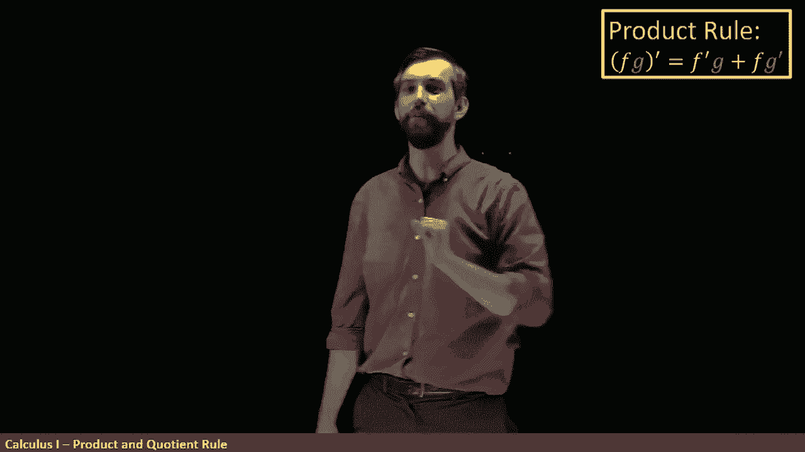
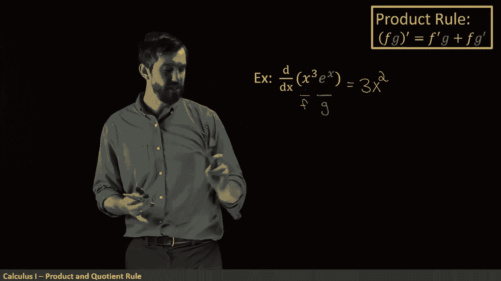
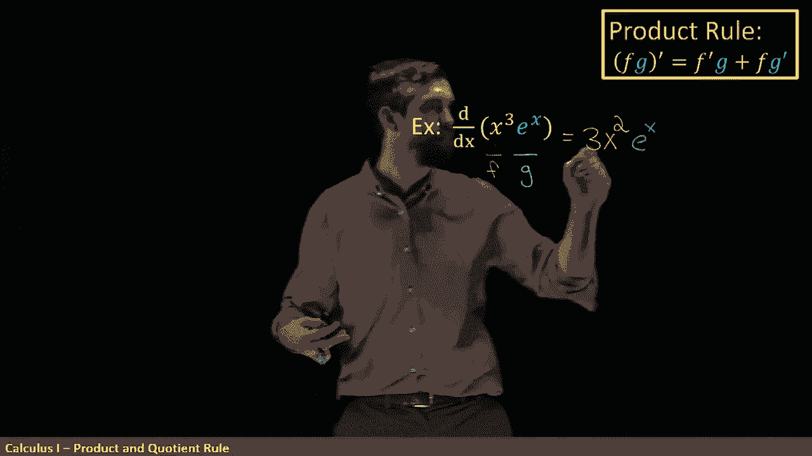

# P25：L25- The product and quotient rules - ShowMeAI - BV1544y1C7pC

Our goal remains， as it was before。 Let's find as many different functions as we can that we can take the derivatives of。

 We currently know exponentials。 We know polynomials。

 We know sums of those things and scalar multiples of those things。😊。

So what we're going to focus in on this video is products and quotients of functions。

 so that is examples like x cubed times ED the x that's a product of two functions a product of x cubed and ED the x or the derivative of X cubed divided by the ED thex that's going to be a quotient。

 so how do we take the derivatives of those kind of things？

The rule for the derivative of a product goes like this。The derivative。

 that's what the prime means of a product。 F times G is going to be the derivative。

 the first thing times a second plus the first thing times the derivative of the second。

 So F prime G plus F G prime。😡。

Notice what this isn't。 This is not F prime times G prime。 You might expect that。

 it might seem reasonable， but indeed， if you pause the video and look at the example x squared。

 which can be thought of as x times X。 And we know that the derivative of x squared is gonna be2 x。

 but if you apply that wrong rule， F prime times G prime， you'll get a wrong or sum。

 So instead the product rule a little bit more complicated。

 It's not that the derivative of a product is a product of the derivatives。

 The derivative of a sum is the sum of two derivatives， but this is not true for product。

 just kind of interesting。 Now， this is written in the laggangrange notation。

 but you can also use a leman notation。 So it's a little bit longer， but it's the same thing。

 The derivative of a product is the derivative of the first times the second。😡。

Plus the first times the derivative of a second。But I usually like to go the F prime G plus FG prime notation doesn't really matter too much。

 Now let's see a specific example。 I want to take the derivative of x cubed times e to the x。

And the first thing I need to do is identify what is the F and what is the G。 So the x cubed here。

 this is going to be my F。And then the E to the x， that is going to be my G。

And then if I look at what my formula does， I'm trying to say that this is going to be equal to something。

 Well what am I going to do， I'm just going to go along this formula and apply all these things in turn。

😡，So F prime is the derivative of x cubed， and we know what the derivative of a power is。

 we use the power rule as 3 x squared， so this is going to be， first of all， a3 x squared。Allright。

 now next up it's going to be this F prime times a G and the G is to t to the x and it's just G。

 so I just copy it down。 So E to the power of x。😡。

Next up， I'm going to be adding F。 So just copying and pasting my F one more time。

 So let's add in my F。 it's going to be adding in an next cube。😡。

And then finally it's the G prime， and remember from the previous video。

 the derivative of e to the x is just E to the x again。

 so this is going to be x cubed times E to the power of x。

So this product rule allows us with not a huge amount of effort to figure out the derivative of the product of these two things。

 because I know the derivatives of the individual factors， the F and the G。Next up。

 we're going to look at the quotient rule， and this is now the derivative of f divided by G。

 and this is of course going to apply when my G is non zero。

So what it is is you have to be very careful here with the order， it's the F prime G。

 not a plus minus this time an Fg prime， so it's very similar to the product rule on the top with a minus sign。

😡，And then divided out by the bottom square， divided out by the G squared。

 So this is just some particular rule。 So now let's do an example like this。

 I'm taking the derivative of this x cubed。 And I'm just going apply my formula。

 So the F is on the top。 the x cubed。 the G is on the bottom that E to the X。

 And what my formula tells me to do is first is F prime。

 So derivative of the x cubed is3 x squared as we had before。😡。

Then I'm going to copy and paste the G there it is， just copy and paste it。

 so times e to the power of x。Minus that's very important I use a minus site now I'm minus off Fg prime。

 so F is just the x cubed again and the derivative of e to the x is again e to the x。

 so it looks the same， but I'm taking it derivative enough。😡，So that's the top。

 And then all the bottom of this is going to be divided by G squared。 So in other words。

 E to the X squared。 And by the laws of exponents， we can write this as E to the power of 2 x。

If you want to， you could clean this up a little bit。

 I noticed there's an EDD X on the top and then there's e to the2 x on the bottom so we could rewrite this as 3 x squared minus x cubed。

 so I've gotten rid of the EDD X's on the top and now it's just divided out by EDD X on the bottom。

 just a little bit of algebra。😡，So where are we at we've got the same two sort of base functions。

 the E to the X and the x to the n， the powers， but now I've added a few more rules。

 not just addivity and scalar multiplication， but also the ability to take quots and products and of course these rules are going to apply in places where the individual F primes and G primes are all existing So as we go forward we're going to add some more base functions down here and we're going to add some more rules up here that's going to allow us to take the derivative of just this enormous class of functions。

😡。