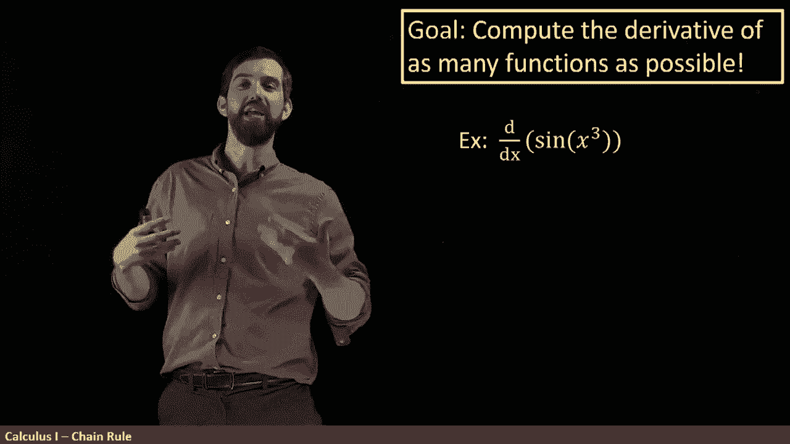
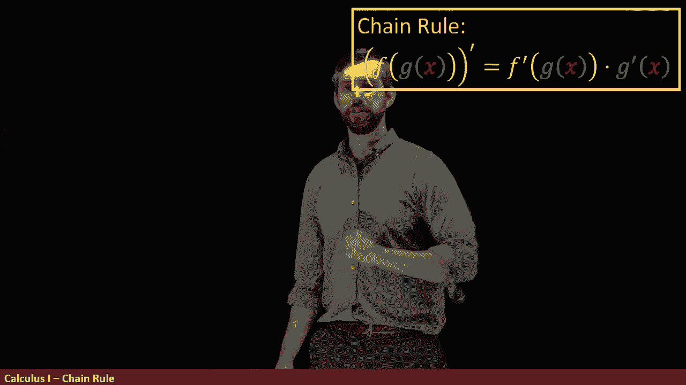

# 【双语字幕+资料下载】辛辛那提 MATH100 ｜ 微积分Ⅰ(2019·完整版) - P27：L27- Chain Rule - the Derivative of a Composition - ShowMeAI - BV1544y1C7pC

You can probably guess our goal at this point， it is still to compute the derivative as as many functions as possible and the class that we're looking at this time is compositions that is I'm considering things like this。

 the derivative。Of s of x cube， where you've got an outer function sign and an inner function X cubed。

So let's look at compositions in a little bit more detail for a moment。

When I look at this sign of x cube， there's sort of three components to it。First of all。

 you have this x， the actual variable， and then what it tells us is that there's two sort of embedded function here that that variable x gets cubed。

And then whatever the result of that is， you take sign of it。

Another way to sort of think about this is that you can say that you start with the variable。

 then under the sort of so called inside function you cube it and it turn it from X text cubed。😡。

And then based on the outside function， you take s of whatever you had， s of X cubed。

Or more generally， if I'm going to have a F of G of a variable x。

 that what you're doing is you're starting with this value of x， you are doing the first function。

 the G， the inside to make a G of x， and then you're going to go and apply the outside function so you get F of whatever G of x was going to be。

😡，So a whole bunch of different functions can be written in this way where you've sort of got an outer function。

 that's the psi in this case， and you've got this inner function。

 that's the x cubed in this case and you think of it as a composite function another way by the way。

 notationly to write this F of G of x that you might see is F this little circular dot means composed so F composed G of x and you'll see both f of G of x and F composed G of x。

😡，So how do we take the derivative of a composite function？

The formula is something referred to as the chain rule，'s going look a little bit messy。

 if I'm going to take the derivative， so notice I use the prime here， put everything in brackets。

 the derivative of F composed G of X。 Well what it is is the d to the outside。😡。

Evaluated at the inside multiplied by the derivative of the inside F prime of G of x times G prime of x。

That is what we have is three different components， the first， the F prime。

 I'll say this is going to be the derivative of the outside function， the derivative of the F。

But notice it's the dto of F。At something derivative of the F evaluated this G X。

 So it's the derivative of the outside， evaluated the inside。 and the third component is。

 is times this derivative over here。 So this is going to be multiplied by the derivative of the inside。

 So the chain rule has the sort of three outputs。 The derivative composition。

 but it's the derivative the outside at the inside times the derivative of the inside。 Okay。

 so let's see an example of this。 I want to focus on the derivative of sine of X cubed。😊。

So my outside function， this is going to be the F， this is just sine of x and note carefully。

 when I go and write f of x is sine of x， the x here is just a placeholder， it could be F of 7。

 f of 17 f of 17 squared f of 17 cubed， it could be anything。😡，In particular。

 one option for what the x could be is it could be the entire output G of x， so in other words。

 f of G of x would be sine of G of x。So when I write down this， this f of x equal to sine of x。

 I'm just saying what function is just the F part of it。Likewise， the G of x that's the inside。

 this is going to be the x cubed， so G of x is the x value cubed。Okay， so let's apply our formula。

 so first of all， I had to figure out F prime。Now the f was sine and the derivativeto of sine is cosine。

 so I'm going to say that this is equal to cosine now I've got to be careful you might be tempted to write down cosine of x here。

 but that's not the case it's F prime evaluated at G of x。

 so I'm going to write cosine and I could have leave a blank it's cosine of whatevers supposed to go there。

 whatever the argument is。😡，But in this case， the argument that g of x is going to be this x cubed。

 so I can put that in， they've got my variable， which is my x， and then I'm going to be cubing it。

 so this is cosine of x cubed。So that gets me to the f prime of the G of x。

 but I still have the G prime of x Okay now G is this function x cubed and the derivative of x cubed is 3 x squared So I'm going to come along here and multiply by3。

 I'll still leave the variable name in x So 3 x。😡，And then squared。

So I have my F prime G times my G prime or the derivative of the outside at the inside times the derivative of the inside。

