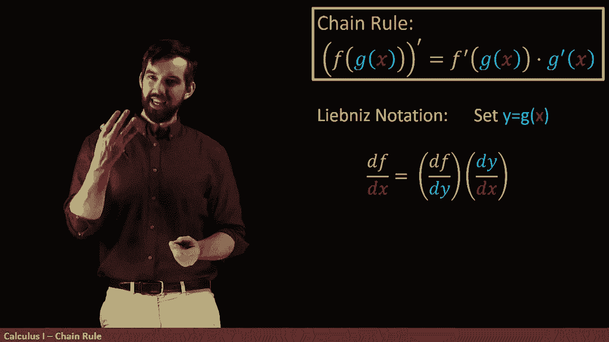
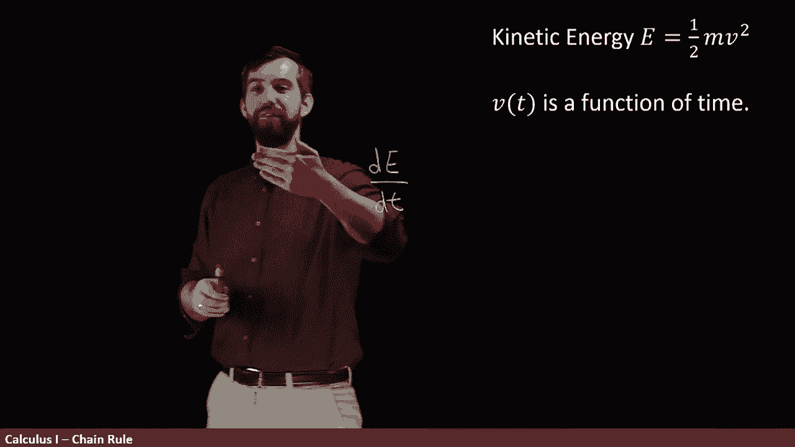

# 【双语字幕+资料下载】辛辛那提 MATH100 ｜ 微积分Ⅰ(2019·完整版) - P29：L29- The Chain Rule using Leibniz notation - ShowMeAI - BV1544y1C7pC

Previously， we've seen the chain rule written with Lagoage notation。

 written with a bunch of different primes。 but there's another way to write it using leavemus notation。

 And it has several advantages。 So first what I'm going gonna to do in leaveness notation is that I'm going to specify an intermediate variable Y here。

 Remember our goal with the chain rule was the derivative compositionposition。

 you had an inside function and an outside function。

 So what we're going to do is we're going to give that inside function。

 the G of x a variable name we're gonna to call it Y。😊。

And then we can translate this entire thing that the derivative of the composition is the derivative of this function app with respect to the variable。

 derivative of Df， Dx。

And then since the chain rule is the product of two things and lead dis notation。

 we get a product of two things as well， the first of them is the derivative of the function。

 not with to x。

But with respect to why with respect to this inside function。

 and then you multiply it by the G prime now turns into D Y DX。

 One advantage of writing it this way is that in practice。

 when you have a whole bunch of different variables going out。

 So then when I write these primes up here， it's not always completely clear which variable am I taking the derivative with respect to。

😡。

And when you do the leaveless notation， the DFDY， it tells you you're taking the derivative to Y。

 and then when you do DY DX， it tells you you're taking the derivative of y with respect to X。

 it's very explicit and clear about which variable you're taking the derivative with respect to。

The other advantage that I like this is I think it gives the intuition behind the chain rule a little bit more clearly so let me think about the Dy DX what we have here is that if I change X a little bit。

 a small amount DX， then we get this little change in DY that's what DY DX means it tells me how much is the Y changing when I change X a little bit。

😡。

And then when I look at DFDY， this is similarly， how much is my F is the top changing when I change the y a little bit。

And then if I think about what's happening with a composition an inside function and an outside function。

 you change the variable a little bit and that changes the wading。

Then now that the Y has changed a little bit， you're going to be changing the outside function。

 you're going to be changing the F。And so I think that it makes it a little bit more transparent why the chain rule is these product to do these two things when it's written and leave this notation。

😡，Now I have to caution you， be careful， resist the temptation to say， well look。

 this is DY down here， this is DY down there， why don't I just cancel those two？This doesn't work。

 This DFDY is thought of as a single symbol。 It is one concept。 It is one function。

 It is one number at any particular point， So I don't want you to think of this as as four different symbols that have been divided and where you can do normal canceling。

 I think you want to think of this as two different symbols。

 one DFDY and the other DY DX and you can multiply them together but there's no form of cancelingNonetheless。

 as a sort of a pneummonic or heuristic to how to think about the chain rule。

 It is the case that DfDX is what would have happened if you were allowed to cancel even though you are not。

😡，Let's see an example here I have kinetic energy and kinetic energy depends on well the mass and also the velocity now I'm going to assume that the mass isn't changing。

 but the velocity it for sure can change if I'm driving my car and asking what the kinetic energy of the car。

 well， it depends on how fast I'm driving and my velocity function is a function of T。

So something I might be interested in is how much is my kinetic energy changing with respect to time。

 in other words， I might be interested in taking the derivative of energy kinetic energy here with respect to time。

Now， what the chain rule is going to say is that there's not in a T explicitly in the kinetic energy formula depends on M。

 which we're treating to the constant， it depends on the velocity， but there's no T immediately。

 it's only then that the velocity is itself a function of T that the T sort of sneaks its way into the kinetic energy formula。

So what I'm going to do is apply chain rule to this composition。

 the energy depends on the velocity and the velocity depends on the time I have a composition。

 and so I'm going to say by chain rule that this is the change in energy with respect to the velocity and then I have to multiply by the change in the velocity with respect to time and I have this particular product that gives me the chain rule。

😡。

Now I'm going to figure out what the change in energy with respect to velocity is going to be。

 here I have my formula， and I'm just going to come along and take its derivative。

So the one half is a constant。The M I'm treating as a constant and then I have a velocity squared。

 taking the derivative respect to velocity of velocity squared， so this is going to be two times v。

 so that's the change in the energy with respect to the velocity but then I have to multiply by the change in the velocity with respect to time and so I'll multiply on the outside by DVDVDT and if I'd given that to you we could have done that computation as well and of course the twos will cancel here。

😡。

So this shows us how we can take the derivative of one variable with respect to another variable。

 even if there's sort of intermediate variables because our function really is a composition。

