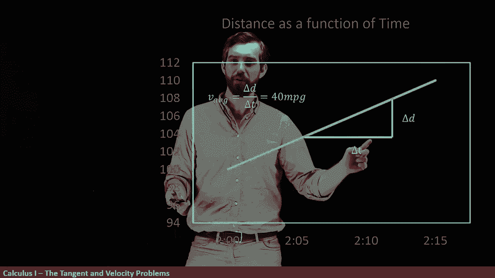
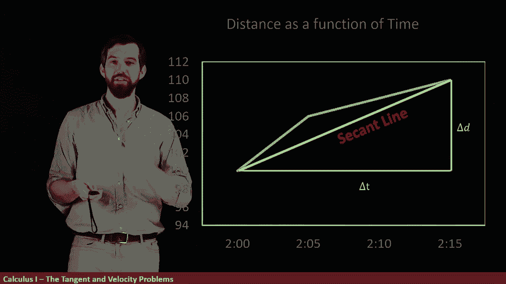
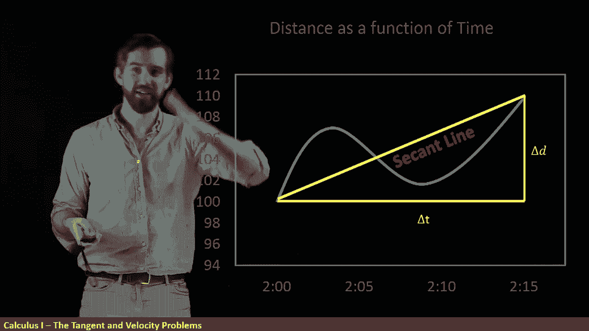

# 【双语字幕+资料下载】辛辛那提 MATH100 ｜ 微积分Ⅰ(2019·完整版) - P2：L2- The Velocity Problem _ Part II - Graphically - ShowMeAI - BV1544y1C7pC

Let's try to translate our velocity problem into a geometric picture。

 I've given you an example of a graph， the distance as a function of time that represents the same example we saw before。

 so that at 2 o'clock here， that our car is hanging out at 00 mile mark and that over here at 2，15。

 we're going to be up here at 1 and 10 mi mark。😊。

And what we have is distance is a function of time going up in this straight line。

 so let's try to figure out what the average velocity is well the change in distance and the change in time are given here。

 we've got time down here on our X axis and we get a change in time between the 2 o'clock and the 215 that's our 15 minutes。

😡。

And then likewise， we get this deelta t over here that's going from the 100 miles up to the 110 miles。

 so a 10 mile difference。

And so we can do the same computation and that we can say that the average velocity。

 the delta d over the deta T is equal to 40 miles per hour。

Another way to think about this is this is the same thing as the slope of this particular straight line here。

The average velocity is the slope of that straight line。

Now because the slope of this line is constant just one line。

 it turns out that if we did different intervals， we would get the same result。 So for example。

 if I chose this small intervals， This is the same line the same story here but it's just that I'm choosing a much smaller interval to my deelta t and then I get a different deelta D out of it but it's still 40 miles per hour or I could choose some other points like how these ones down here。

 it's the same story， doesn't matter how big of an interval I chose。

 it doesn't matter where I started and where I finish it with this straight line or're always going to get an average velocity of 40 miles hour So this graph。

 it represents if I'm driving along exactly 40 miles miles per hour I'm not accelerating。

 I'm not decelerating， I'm just going along at this constant velocity that's what this graph would look like。

😡。

But this is not the only way that I can get between the starting point of 2 o'clock at 100 and the final point of 215 at 110 so for example。

 this is some other graph we can imagine a car trying to drive in this particular way and then what matters is that down here at 2 o'clock we're at 100 and over here at 215 we're up here at 110 so this is some path that our car might like to take to go between these two points that we've recorded。

😡。

And then we could imagine a whole bunch of these。 Maybe this is another one。

 This is one that that we call piecewise linear here。

 It's not truly physical because you have to have some sort of smooth acceleration in the middle。

 but it's going at one velocity for a while and then instantaneously turns into a different velocity。

😊。

Now what you could do is you could try to measure the velocities for these different components so for example first up。

 I might try to have it that Im doing a delta t over a delta D for this smaller portion where I have this particular slope and if I did my rise over my run if I did my Delta D over deelta T I get 72 miles per hour I went off and computed it on the side or I could do this next portion where it's got this other slope and we could see that here if the deelta t and the deelta D if you took that ratio。

 it was going to be a much slower 16 miles per hour。😡。

So what this sort of imaginary car is doing is it's driving way faster than 40 miles per hour for a while where the slope is steep。

And then way slower than 40 miles per hour where the slope is a little more shallow。

 but that the average over everything， the big Delta T and Delta D。

 that's the same 40 miles per hour that we always had。

So here's the point。When I talk about an average velocity， it really。

 really matters where I'm talking about。 What's my starting point， What's my finishing point。

 If I use this starting and finishing point， it's very different than if I use this starting and finishing point and very different than if I use the entire thing。

 you get these different results for average velocities。

 Now let's get rid of a bunch of the mess here and what I want to focus on is that if I just keep the larger deelta G over Delta t that I could imagine that there was a line that was connecting these points and this line we call a secant line。

 a secant line is just if you have some curve and you have two points on it， for example。

 this point at 2 o'clock and 215， a secant line is a straight line between those two different points。

😡。

And that what we've seen is that the average velocity over this entire graph is just the slope of the secant line。

 regardless of what the actual graph is， regardless of how the actual car moves。

 its average velocity over this interval is the same thing as the slope of the secant line。

Like you do the same story if I put in， for example。

 this weird curvy one I want to figure out what its average velocity is from2 to2 to 15 well I just come along。

 I put in the same delta T， the same deelta D， I'm going to have that same secant line and again it's the slope of that secant line。

😡。

So in average velocity， it cannot tell whether you're accelerating and decelerating doing all sorts of weird things。

 all that the average velocity tells you is this sort of net change between the start and the finish of your interval。

So now what I want to do is try to talk about that question。

 what does it mean to have a speed at 215 exactly？

So one of the things I could imagine， we've got this over the SeaA line。

 that was over the interval two o'clock all the way up to 215。

But what if I changed it a little bit what if I instead made my arrow smaller for example。

 here it looks like we're going from 202 or so up to 215 and we notice that that secant line is different and it has a different average velocity or I can go to 205 and it's going to have a different secant line and a different average velocity I might make my interval smaller and I can keep on doing this I can make my interval smaller again and smaller again and smaller again and I can keep on going so that the interval that I have ends up being nice and smaller here。

😡。

But that the slope， the slope of the SeaA line is getting closer and closer and closer to what appears to be the slope of the line around this 215。

So the point is this， if the question is to try to figure out what the velocity is at 215。

 you can look at Cant lines where your interval is really， really small and really， really near 215。

So here's the big idea。But we're calling the instantaneous philosophy that。

Is effectively what's going to happen as you take all of these different average velocities。

 In other words， the slope of the seaant lines， but you take those average velocities over smaller and smaller and smaller time intervals where those time intervals are getting really close to whatever the point is that you're trying to measure if you're trying to measure the speed at 215。

 It's a really， really small time interval at around 215。

 and it's a sort of limiting process if you wanted to really know exactly what it was。

 you would have to keep on going making your interval smaller and smaller forever。

