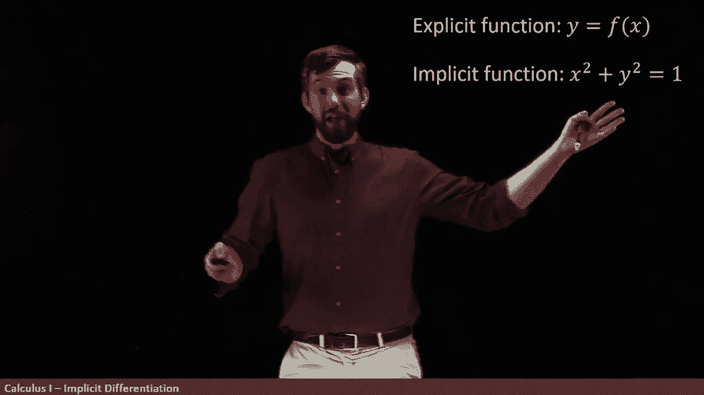
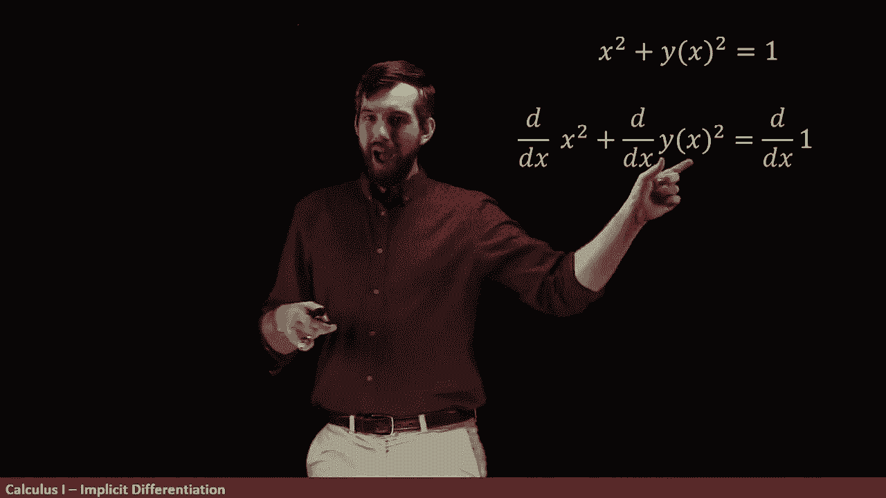

# 【双语字幕+资料下载】辛辛那提 MATH100 ｜ 微积分Ⅰ(2019·完整版) - P30：L30- Implicit Differentiation _  Differentiation when you only have an equation - ShowMeAI - BV1544y1C7pC

So far in Calculus， we've been focusing on what I call explicit functions。

 functions where you have a y and it's just given as some function of x。

 and then the standard problem that we might ask is， can we take the derivative of this function。

 we'd ask for what is F prime of x。

But a lot of functions aren't naturally given explicitly， they're given instead implicitly。

 so here's an example。

I have some equation x squared plus y squared is equal to1。😡。

Now， for every value of x， there may or may not be some number of y's that you can find such that for that x and y pairing。

 this equation is true。

So we want to try to see if given an implicit function， some just equation involving x and y。

 perhaps more variables if they were around， can we tease out explicit functions from them？

For example， this equation is known to be the equation of a circle。

 so I can graph it and it's going to look like this indeed this is a circle of radius1 and all of the different points that are going to be on this have that x squared plus y squared is equal to1。

😡。

Now， let me try to solve and make this Y is some function of X。 Let's see if we're able to do that。

 I'm going to put all the y to one sides first。 So I'm going to say that y squared is equal to 1 minus x squared。

And then I want to not have y squared， and I want it explicitly is y as a function of x。

 so why don't I take a square root？

But as soon they have square roots， we remember there's an issue because there's positive and minus square roots。

 so I kind of want to write it like this y is plus or minus the square root of1 minus x squared。

 either would be satisfying this original equation。

 but this violates the vertical line test to be a function。

 it needs to be the case that for every x value， there's exactly1 y value。😡。

Or if I want to think about it graphically， what you do is you draw a vertical line and you say。

 well， look for this particular x value， there's two different y values this top in this bottom that correspond to it。

😡。

So it's not the case that we can find one function y equals f of x that describes this entire circle。

 but you'll notice that I have a yellow semicircle on the top and a red semicircle on the bottom。

I could break these out as two different functions， one that describes the top。

 one that describes the bottom using the plus and the minus that I have in my square root。

In other words， what I have is two different functions， one。

 the y equals the positive square root that describe the top， one。

 the negative square root that describes the bottom。

 and so that this one equation has resulted in these two different explicit formulas。😡。

So maybe now my question should be， I want to find the derivative of y with respect to X。

And the idea is going to be that if I want to take the derivative over here。

 I'm going to use the yellow， and if I want to take the derivative down here。

 I'm going to use the red。😡，Now we might ask the question。

 what's the derivative of y with respect to X One answer would be I could just look at where I'm interested。

 if I'm interested here， I'm going to use the positive square root， the yellow。

 if I'm interested in the derivative down here， I'll use the negative square root the red。

 but I want to have a bit more of a systematic way to compute the derivative So the way I'm going to deal with this is I'm going to take my x squared plus y squared equal to1。

 but instead of a y I'm going to write y of x or I'm thinking that y implicitly depends on x。

 even though though I don't necessarily know what the actual function is。

 it's just some function of x。😡。

Then this is an equation and I could take the derivative with respect to x of both sides of that equation。

 I can add one to both sides of an equation， I could take the derivative of both sides of an equation。

So let's see what happens if I do that， so I'm taking the derivative of the x squared。

 the derivative of the y squared and the derivative of the one。

Now the derivative of the x squared， that's entirely reasonable is's just 2 x。

 the derivative of the1， we know what that is， that's just zero。

 but what about the derivative of the y squared？

What I want to think about when I take the derivative of the y squared is there's an inside function。

 the y， and there's the outside function， the squaring function so y squared is a composition there's an outside and there's an inside so when I take its derivative you take the chain rule drew the outside so2 y then times the derivative to the inside times y prime So putting all that together what I'm going to get is this formula x squared down to the2 x Y squared down to the by chain rule2 y dy dx and the derivative of1 is just going to be0 now that I'm at this stop。

 I can just do a little bit of rearranging and identify the dy dx it's minus2 x over2 y or minus x divided by y。

😡。

Now I want to note that just notationally， I've written Y of X and all of these different spots。

But it's quite conventional for us to not actually write the of x everywhere and instead just to treat this as ys in every one of these spots。

 but we're keeping it in our mind that indeed these are going to be functions of x and so that I need to indeed apply the chain rule at these spots so now let's return to the original problem but now I'm asking the slope at a particular point minus one over root  two plus one over root two and you could take the squares of these things and it would add up to one so it is indeed a point on a circle indeed it's a point on a circle right about there。

😡。

So how do I figure this out， I know that the slope with a tangent line is given by the derivative is given by DYdX。

And our formula for this was minus x divided out by y。And then if I want to evaluate this。

 these big long vertical lines mean evaluation， if I want to evaluate this at the pair xy equal to minus one over root 2。

1 over root 2， well we could do that computation and then when I evaluate at this particular point what I'm going to get to well minus minus is a positive so I'm going to have just the one over root2 on the top。

😡。

And then plugging in for the Y， which I have right here is the one divided by root two。

 and this whole thing is just going to be equal to value of one。

And then if I want to plot it， so I'm looking around here and this is going to be my tangent line。

 it looks like I've got a nice slope of one and it occurs at this point， minus one over root2。

 one over root two。Note by the way， if I ask a slightly different question。

 what happens at this point right here， this is the point x equal to minus1 and y equal to zero。Well。

 if x is equal to minus1， then I'm going to get a1 here， y divided by zero。

 that gives me a vertical asymptote。So at this particular point right here。

 we're going to have this straight up vertical line that is that is what the slope of the tangent line is。

Likewise， we can answer the same question over here again our y is going to be zero， again。

 we're going to have a division by zero。