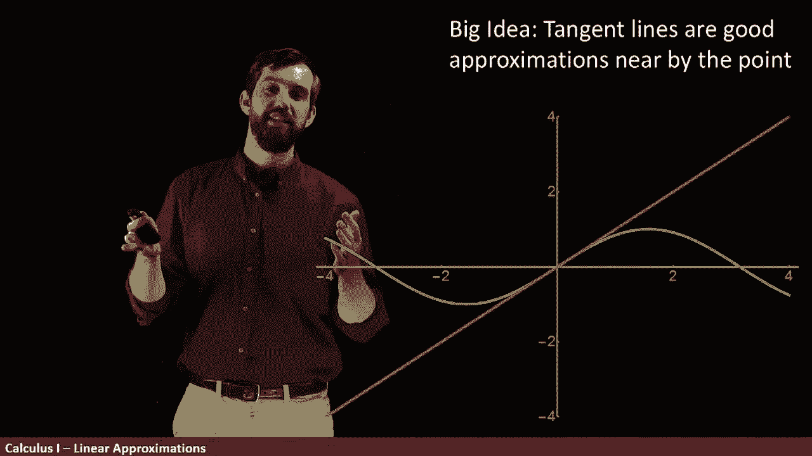
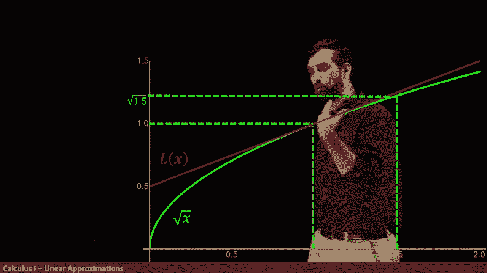
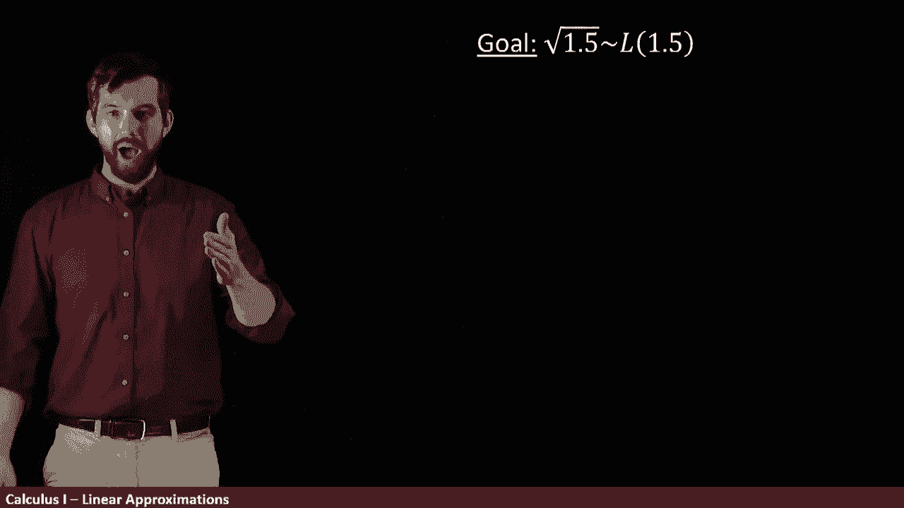
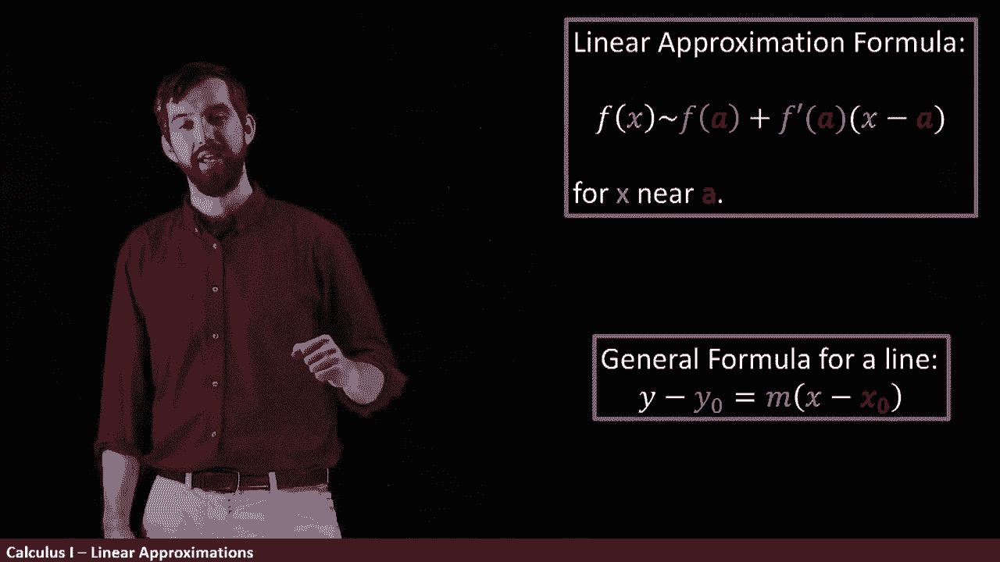

# 【双语字幕+资料下载】辛辛那提 MATH100 ｜ 微积分Ⅰ(2019·完整版) - P35：L35- Linear Approximations _ Using Tangent Lines to Approximate Functions - ShowMeAI - BV1544y1C7pC

One of the reasons I really like the derivative and the derivative you'll remember gives us the slope of the tangent line is that tangent lines are nearby to a point a pretty good approximation a lot of the time。

 Indeed， let's look at here I've got the graph of sine effects。

And what I've computed for you is the slope of its tangent line at x equal to zero。

 so I've got some particular line and I computed this by the derivative of sine of x and you can sort of intuitively see here that right near zero sine and its tangent line are like right on top of each other but but far away like over here s in the tangent line of nothing to do with each other it's quite dependent on the fact that the tangent line is a tangent line at one point and near that one point where I put my tangent line's like pretty good approximation far away and absolutely does not appear to be。

😡。

I'm gonna to do sort of imagine I'm gonna zoom in here a little bit so I've now narrowed my window now it's only minus1 to one here and you'll you'll notice that it looks good for longer Okay let me zoom in again。

 minus1 to one is what I have right now and I'm gonna to go minus 0。

2 to 02 and I don't even know if you can resolve this on your screen the red in the green the sign and its tangent line are basically on top of each other as I zoom in on that window。

😡。

So if I zoom in close enough， the tangent line and the original function here appear to be almost interable that it's a really。

 really good approximation， at least in the case of this function， side of x。

Let's do one more example。Here I have the function square root of x。

And then I've taken the linear approximation， this tangent line stands for line here。

 and I've done it at the value of x equal to 1。 so I've got this tangent line here。

 and again it looks like a pretty good approximation at the value of one， and we could zoom in。

 zoom in， zoom in， zoom in until we had them basically exactly on top of each other。

 but sure it looks like a good approximation。😡。

Now the reason why I chose one is I know the square root of one is the square root of one is just one。

 I can do that pretty easily， and indeed we could plug in the one here and we could get out the value of one。

But you know what I don't know how to do in my head， the square root of not one but 1。

5 I know it's 1。5 is my input。 it comes over to here。 there's some value of square root 1。

5 I could probably guess that it's in this region， but I don't know exactly what it is。

 I don't know what this number is， maybe it's got an infinite decimal expansion。

 So how should we compute this， How does the computer even compute the square root of 1。5。😡。

One thing that I could do as an approximation is if I look at this tangent line and remember this tangent line was a tangent line at one。

 it's not the tangent line at 1。5， 1。5 is a little ways away， so if I go over to 1。5。

 you can see that there's the green that's my square root of x and that there's the red that's my line and they're pretty close but they're not exactly the same but it's a good approximation right the height here on my tangent line of 1。

5 and the square root of 1。5 they're pretty close。😡。

So I could do an investigation of that， I could ask at 1。

5 what is not square root of x but this line， this tangent line of 1 I could ask what is L of 1。

5 and yeah they're a little different but the error here， the difference。

 it's an extra height here it's really small。So our heuristic is this。

When I'm trying to estimate something like the square root of 1。5。😡。

What I'm going to do is I'm going to compute the tangent line， not at 1。5。

 but at a number I can actually compute， I know how to do the square root of 1。

And then I'm going to try to figure out what that tangent line is。

 I'm going to go along the line over to the 1。5， and that value is not going to be exact。

 but it's going to be pretty good。

Another way to think about this is to say that the square root of 1。

5 is whatever the the line is at 1。5， whatever my tangent line of 1。5 plus the small little error。

In this case where the tangent line is above the square root of x。

 the small error is a small negative number， so it's that the green is a little bit less than the red。

And another way I can say it is if my error truly is small。

 and I haven't justified outside of this graphical picture why it's small， but if it truly is small。

 then I'd be able to say that the square root of 1。

5 is approximately the same thing as the tangent line computed at the 0。1。

 but evaluated over here at 1。5。So let's try to figure out what is this tangentla。

So that's our goal， the square root of 1。5 is the tangent line at  one， but evaluated at 1。5。

And I'm going to remind you first， the general formula for a line。 So any line at all， tangent line。

 secret line， any line you choose is going to have。😡。

Your y and your x is your variables， your y not and your x not as two starting points。

And then your M here is as the slope because this is so called the point slope formula for a line Sometimes people take this y n and the M times x n and they put it all over the right。

 and then it's y equals Mx plus B where B is the y intercept。 You can do that form。

 and that's the slope Y intercept form， but I generally prefer the slope point form because I usually know two points in x n and a y n。

😡。

So let's try to do this for our scenario， we want to figure out the M， the M is the slope。

 and the slope is given by the derivative。

So what's what I need to do derivative of square root of x， easy enough。

 the only sort of weird trickery is to note that square root of x is really x to the power of12。

And I like it better in the form x to the1 half because then I can apply the power rule x to the one half。

 I apply the power rule here， the one half comes out the front。

X to the one half minus-1 is x to the minus1 half。 That's why I have x to the minus1 half。

 and x to the minus1 half。 You don't have to do this， but it's nice to rewrite it。

 The minus sign means it's x to the half， but on the bottom。 and x to the half is square root。

 So1 over two square root of x。 So there we go got， we've got what our slope is for all values of x。

 And in particular， What we're interested in is the point。 x equal to1。

 x equal to1 means square root of x。 The y not here is also equal to1。 Pging one into here。

 I'm gonna a half。

And therefore， taking all of this into my general formula for a line。

 what I get is going to be y minus1， that's the square root of one。

Is equal to one half。 That's the slope here evaluated x equal to1 x minus。 Well。

 x n is just equal to 1。 And so this is going to be my tangent line。

 And then if I actually want to write it as a line y equals something， I'll take this -1。

 I'll move that over to the other side。 And what I get is L X is equal to the M x plus B form。

 the slope intercept form1 f x plus a half。😡，This， by the way。

 when I was doing my graphing beforehand， I figured out this particular equation first。

 and that's how I was able to draw the tangent line going on top of the square root of x。

 Now we've got L of x for all values of x。 but remember where our goal is。

 Our goal was the square root of 1。5 is about。😡，L at 1。5。 so let's get rid of our calculations。

 I've got this L of x and what I want to do is figure out L of 1。5 they can plug in 1。5。

 so this is going to be three/ half divided by2 is three quarters， three quarters and a half is 1。25。

 So that's my claim My claim is that square root of 1。5 is about not exactly but about 1。25。

Now I'm going to actually go on the calculator here and spit out exactly what the number is at least at two decimal places is。

 I could compute that the square root of 1。5 according to my calculator is 1。22， not so bad， 1。251。

22， they're close， they're only a little bit away。

Indeed， if I go back to my original， I have this square root of 1。5。 that was the green here。

 which the calculator tells me is 1。22。 But by our approximation， what we can see is that 1。25。

 that is what my tangent line at value of 1。5 is going to be。 1。25 minutes pretty close number。

 not so bad。 So in summary， the grand linear approximation formula is。

if I'm trying to approximate f of x where x is near some other value in the previous example。

 we were looking at square root of 1。5 by comparing it to square root of 1。

 then what the formula tells me is I'm going to go and take the function value at a at this approximating point plus the slope。

 the f prime times the distance between them this x minus a。😡。

Indeed， this formula and the formula that we had for a line。

 they're really just the same different thing。 I I sort of have to match them up。

 Y is equal to f of X， that's my formula。😡。

Then a is some particular point that I'm doing it in and F of a is just whatever the height is。

 so that's the why not。

And then F prime of a， that's our derivative。 So that's our slope M and x minus a x minus x not just different terminology for the same thing。

 So I typically like to use this terminology when I'm talking about linear approximations。

 I got my function。 I've got my derivative， But I do remember the general formula for a line。

 Y minus y not is M X minus x not。 Either way， It's the same idea。

 it's approximating by a line and this linear approximation formula is just the equation of the tangent line。

😊。

At the point A， but evaluated， this formula is evaluated at the point X。

