# 【双语字幕+资料下载】辛辛那提 MATH100 ｜ 微积分Ⅰ(2019·完整版) - P38：L38- Relative and Absolute Maximums and Minimums _ Part II - ShowMeAI - BV1544y1C7pC

Now of course this graph could represent all sorts of different things we've talked about energy and population size and profit and all sorts of different things so now the question is how do I actually find these points I'm given a graph I can sort of approximately guess what these are going to be but how do I actually find out exactly where these extrema occur and what values they get out and that's where calculus is going to be so useful to us Let's go back to that prala that we saw before？

I want to notice something about the maximum that we have here„ÄÇ

If I look at this maximum， when I put its tangent line on here， well。

 its tangent line looks like it's completely horizontal at that particular maximum point„ÄÇ

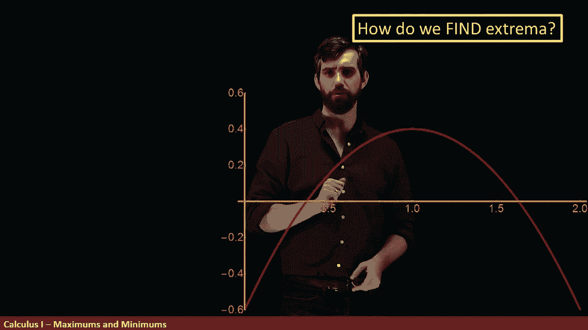

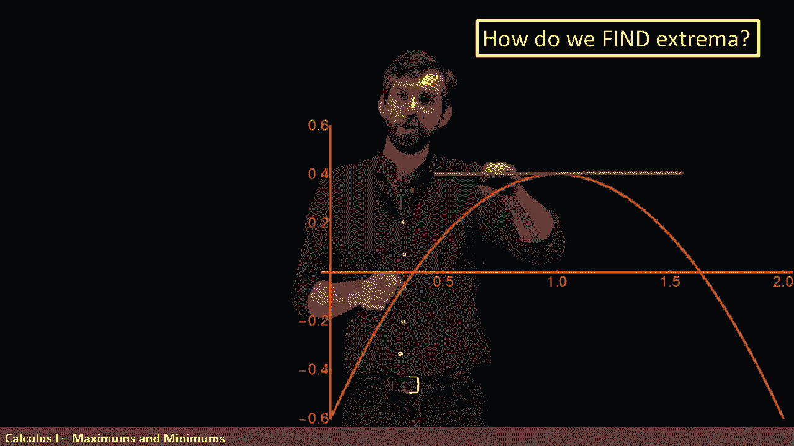

That is， this horizontal tangent line means that the derivative。

At this particular point1 is going to be equal to zero„ÄÇ

 so I'm just going to note this that the derivative of this one is0 and that f of 1 is going to be a relative maximum„ÄÇ

 so this might lead us to think， lead us to conclude perhaps that whenever the derivative was zero that that was going to be a maximum or a minimum。

 possibly， but let's investigate to see whether that's actually true because I have two different questions。

üò°„ÄÇ

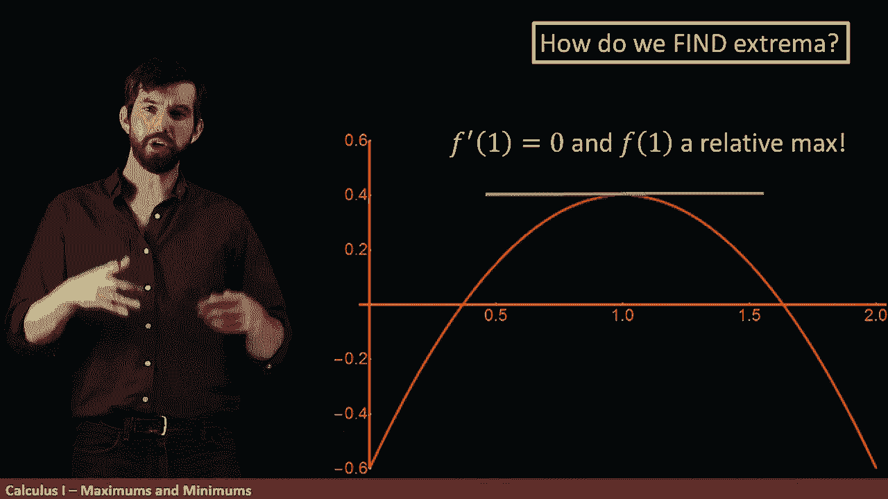

The first question that I have for you is， is it the case that every single time the derivative of a zero that you're going to get either a relative maximum or minimum。

 we saw that one example of a problem it sort looked like it was the case there„ÄÇ

 but can we think of any other example where that's not the case？

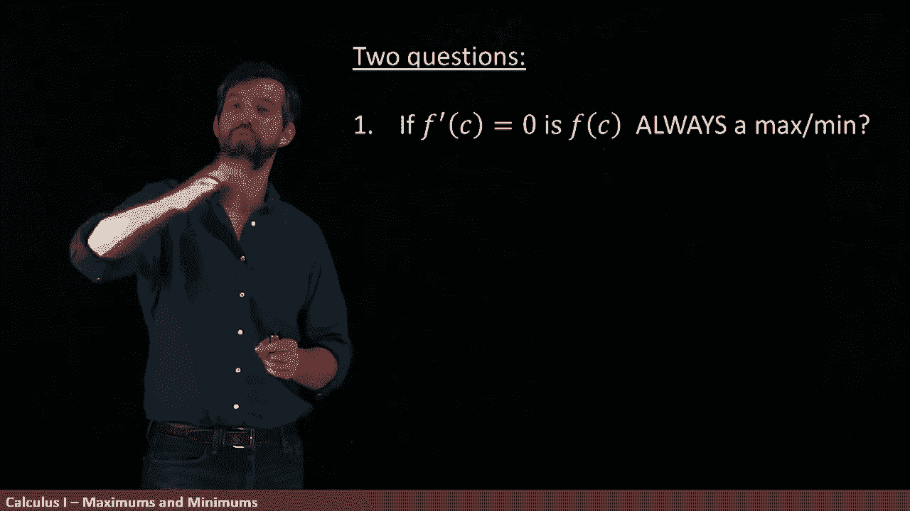

And then the second question is， well this idea of a derivative being zero horizontal tangent line or correspondinging to a maximum or minimum。

 that's lovely， but is it ever possible for other values or for the derivative notex that you could have a maximum or a minimum in other words。

 is this condition of the derivative equal to zero necessary or other possibilities？

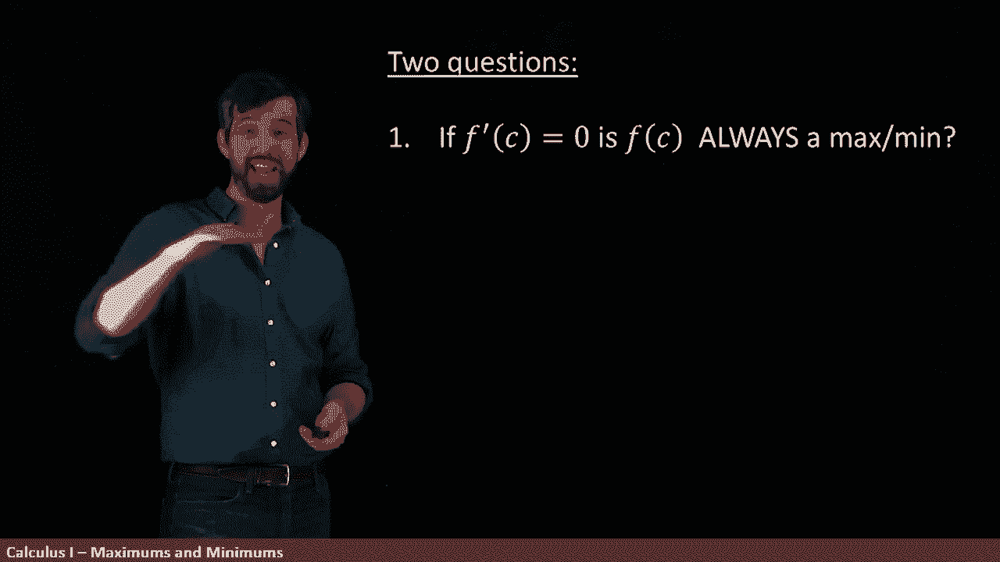

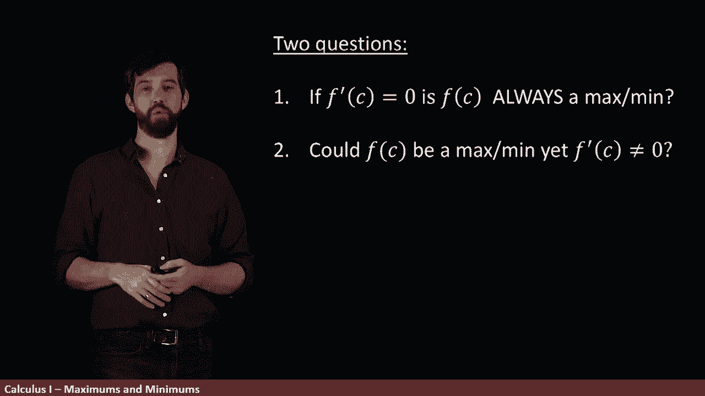

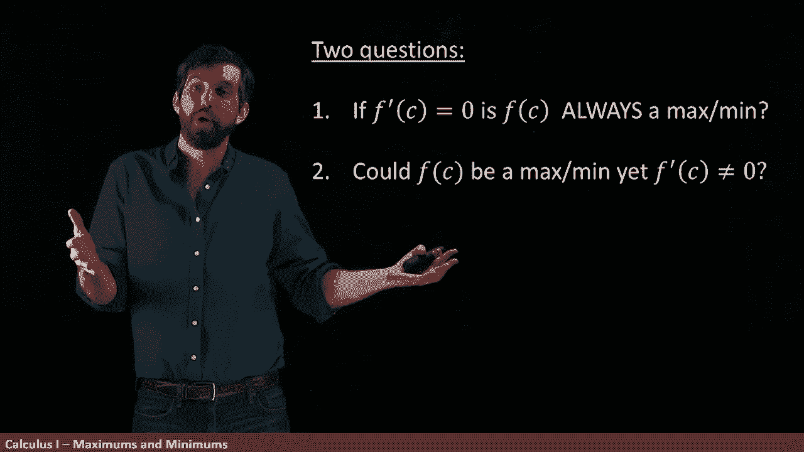

Ponder about whether either of these questions is true„ÄÇ

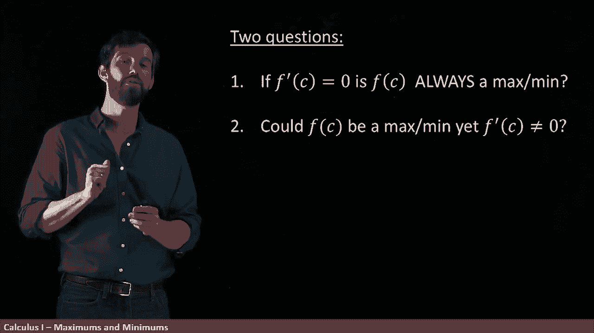

And you're going to pause the video， right， do I have to play the the pausing montage， all right？

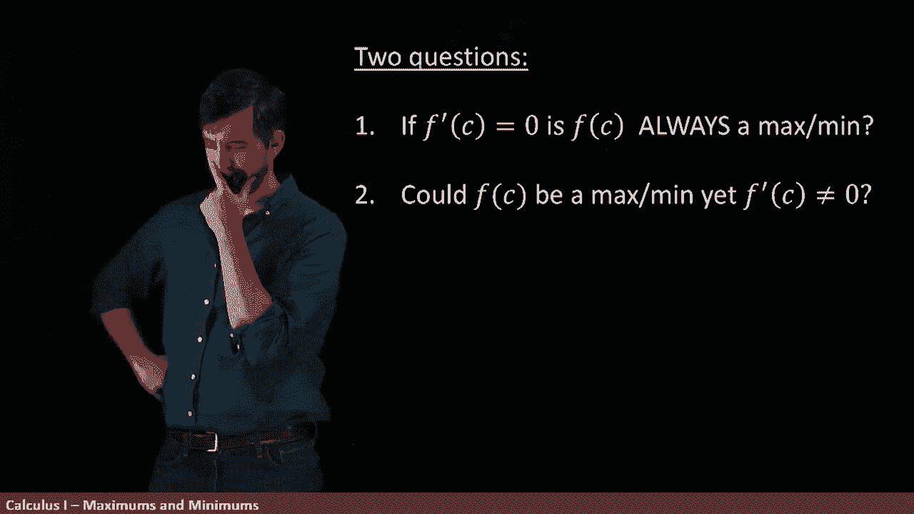

All right， so I think I've come up with examples that illustrate what's going on for both of these questions。

 so let's look just at the first one first„ÄÇ

Consider the graph of something like a cubit， notice how it goes up and then it flattens out and then it carries on going up。

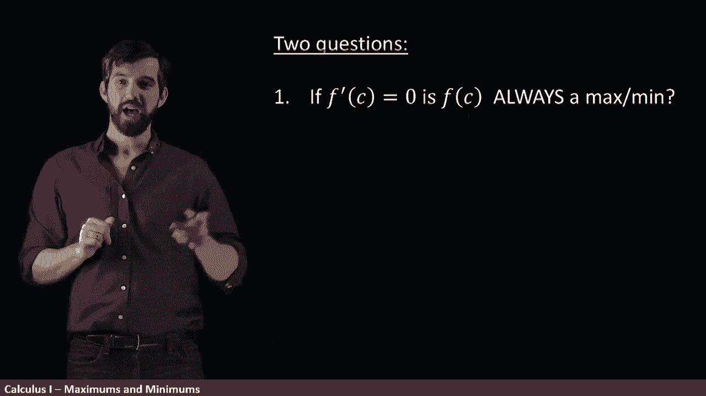

And indeed， if I look at this point of x equal to 1 and I try to draw the tangent line。

 it is horizontal there， in other words， the derivative is equal to zero。

 and yet that's not a maximum or a minimum„ÄÇ

It's the sort of like halfway point where it flattens out but then carries on going up So the answer to the question is no„ÄÇ

 indeed it is the case that sometimes the derivative can be zero„ÄÇ

 but it is not a maximum or a minimum„ÄÇ

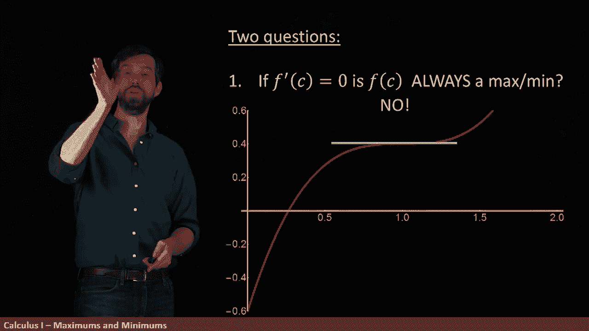

Okay， so let's look at the second of the two questions this was asking。

 could it be the case that FFCc was a maximum minimum， even though the derivative was non zero？

Now， it turns out that if it's any other value like seven or three that indeed it wouldn't be a maximum or minimum。

 however， what if the derivative didn't exist？Let me look at this example。

 so this is an example that has some sort of absolute value in it„ÄÇ

And what we have here is this corner right at the top„ÄÇ

One of the things that we know is that the derivative at any cussp point does not exist„ÄÇ

 yet clearly from our picture that looks like a maximum， so I will say that the F prime of one。

 the derivative at the value of  one does not exist， even though F of1 itself is still a maximum。

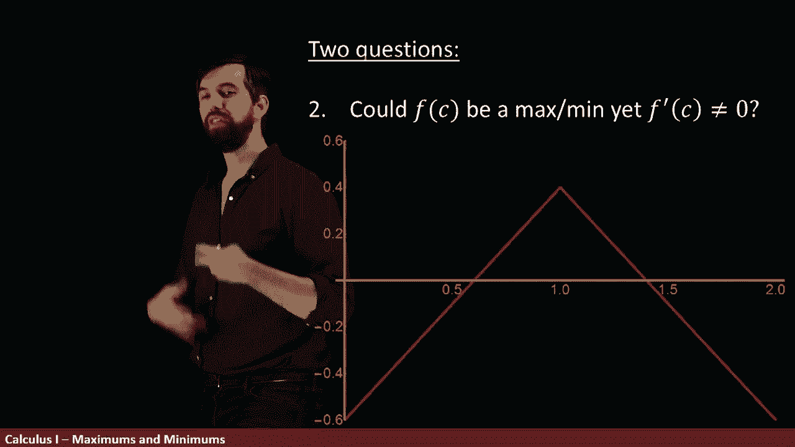

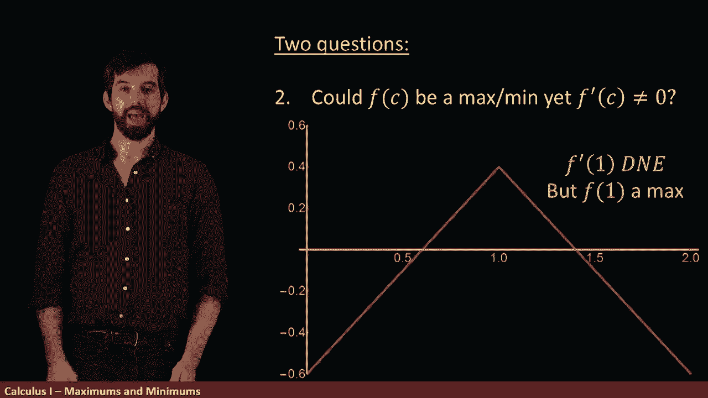

And so the answer to this problem is yes， it is possible to be a maximum。

 even if the derivative is non zero， it could be a situation like this where the derivative does not exist。

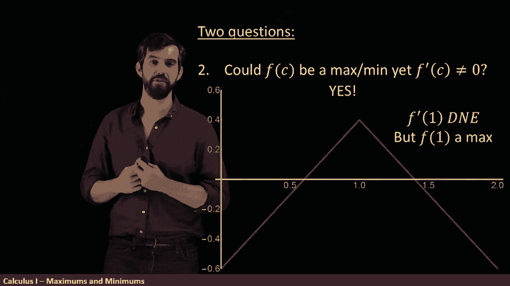

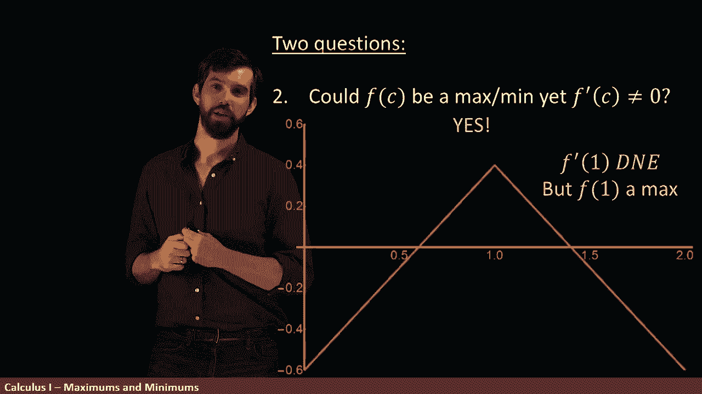

So now what I want to do to try to clean things up a little bit is I want to take these two categories„ÄÇ

 the derivative is zero and the derivative does not exist„ÄÇ

 and I'm going to bundle them together by introducing a new definition„ÄÇüò°„ÄÇ

I am going to refer to a critical number， that's something in the domain that's an input value。

 a critical number C has the property that either derivative is zero or the derivative does not exist„ÄÇ

And the reason why I'm choosing critical numbers is something to be interested in is because there' are two motivating examples„ÄÇ

 one where the derivative is zero and you get the horizontal tangent line and the other where you have this maximum occurring where the derivative does not exist„ÄÇ

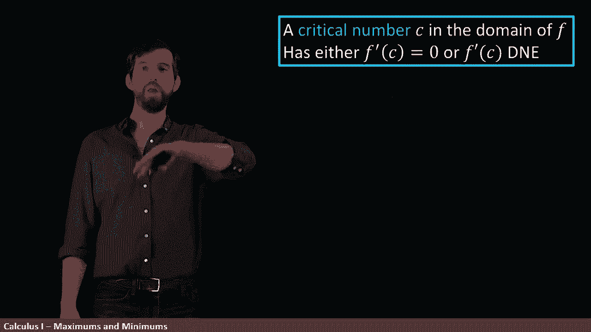

So these are useful spots for us to investigate„ÄÇ

And in fact， there is a very important theorem here it's referred to as for Mois theorem and it says that every single one of those relative maximums and minimums it must occur at a critical number In other words。

 if you don't have a critical number you don't have a maximum or a minimum So what we know is that we're supposed to look for these critical numbers„ÄÇ

 all of these critical numbers are candidates to be maximums or minimums however„ÄÇ

 we know that just because it has a derivative equal to zero， come up with example。

 just because its's derivative does not exist doesn't mean it's a maximum or a minimum In other words„ÄÇ

 not all critical numbers are going to give a maximum or minimum only some of the critical numbers are going to give maximums or minimums„ÄÇ

üò°„ÄÇ

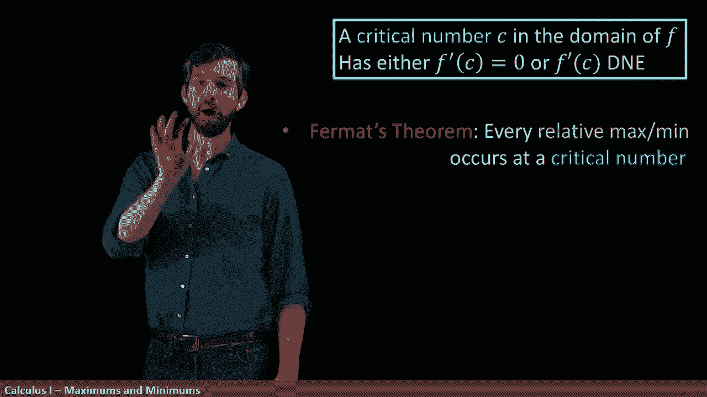

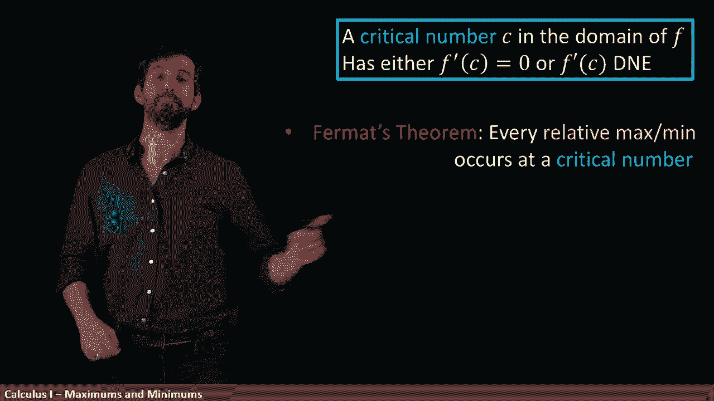

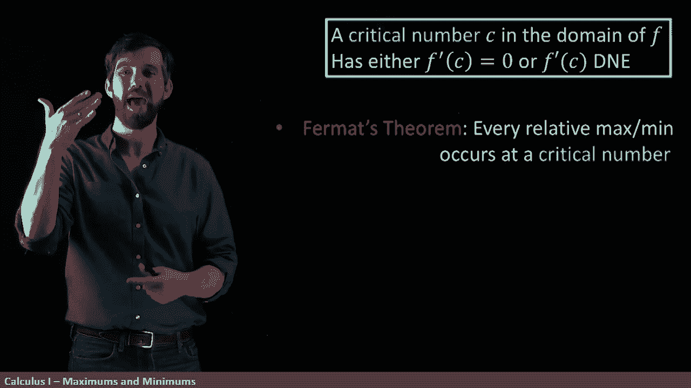

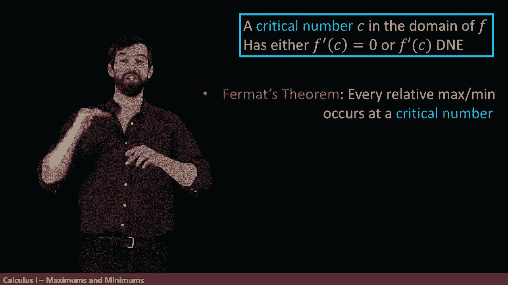

Or another way to rephrase it is to say that the critical numbers are the candidates to be relative maximums or minimums„ÄÇ

So the process goes a little bit like this， you go and find all the critical numbers。

 you take its derivative， you figure out where the derivative is zero or the derivative does not exist。

And that gives you the set of candidates， but only some of them are maximums and minimums and we're still。

 if I just tell you that it's a critical number， you don't know which it is， is it a max。

 is it a min or is it neither， so then you have to do some further analysis to determine whether it truly is a max a min or neither。

So to summarize this particular method， if our goal is to figure out the maximums and the minimums on an interval。

 the first thing I want to do is find all of the critical numbers„ÄÇ

 at least all of them that are in the actual specify domain„ÄÇ

 I just don't care about critical numbers outside of that„ÄÇ

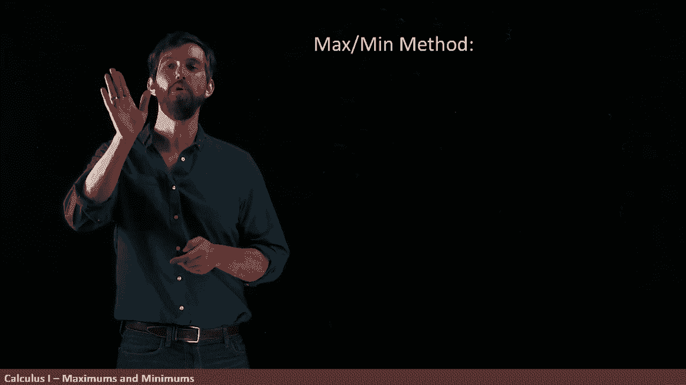

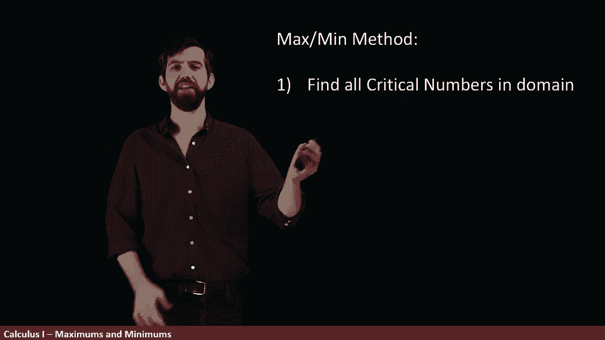

Secondly， I want to go and I want to compute what f of x is。

 what the value is for every one of the critical numbers„ÄÇ

And the endpoints of your domain。 Indeed， it's often the case that the endpoints aren't themselves critical numbers that will sort of go up。

 and then you just hit the barrier， and it could still be a maximum。

 So youve got to figure out what F of x is for the critical numbers and each endpoint„ÄÇ

And then finally， you've got this list of values and you can just look at them and figure out well which of them is really the biggest。

 that's the absolute max， which of them is the smallest as the absolute men。

 and then you have to be a little bit more careful with determining which of these intermediate ones are going to be the relative maxes and the relative minimums„ÄÇ

And then as a check， it's always perfectly fine to try to go and graph the thing and to see whether or not the maximums and minimums that you've computed exactly appear to roughly be the case from the graph。

