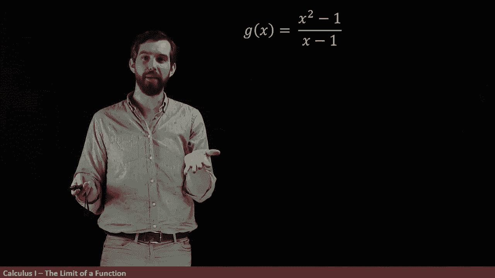
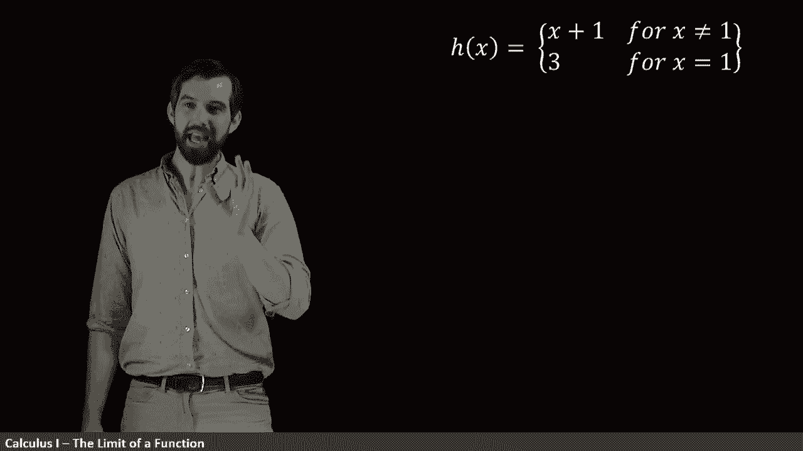
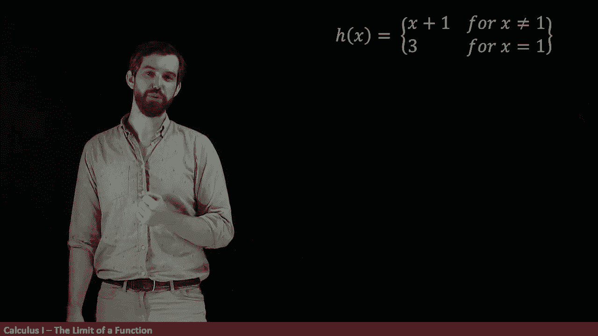
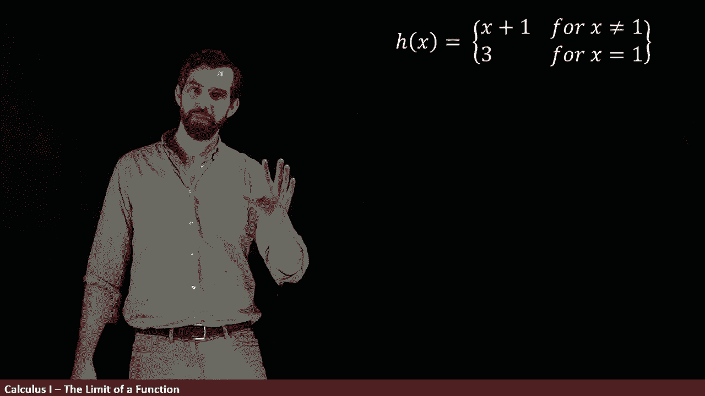

# P3：L3- A Tale of Three Functions _ Intro to Limits Part I - ShowMeAI - BV1544y1C7pC

In this video we're going to investigate the idea of a limit and I'm going to introduce it to you by contrasting three different functions。

 F of x G of x and h of x， and at least superficially they look a little bit different they've got different formulas。

 but we want to see the degree to which these functions are really the same or whether they're in fact meaningfully different so let's study them each in term first up F of x equals x plus1 so I've given you the graph of this it's just going to be some straight line wonderful。

😡，Now I want to look at instead g of x， which is x squared minus1 over x -1。

 whenever we have something like this， a polynomial on the top and a polynomial on the bottom。

 I want you to have an alarm bell going off in your head that says can I factor。

 can I perhaps cancel something from the top in the bottom So indeed if we try to factor x squared minus1。

 then what we're going to get is this is the same thing on the numerator as just x minus1 times x plus1 and then indeed we have this x minus1 on the bottom。

😡。

Now， if you were to just cancel the x minus1 and the x minus1 and on the top and the bottom。

 if you just get rid of them， what you'd be left with was x plus1， and if you just have x plus1。

 well， that indeed was precisely what we had for M of x x plus1 was just that。

So is this the same thing as F of x or is it a different thing from F of x？

It's almost the same in my mind。But there's a very slight difference。This function here。

 I can do this canceling whenever x minus1 is not zero。Indeed。

 in that one case where x is equal to 1， and so the denominator x minus1 will be0。

 you have a division by zero and this function is not defined at that point。So when I draw its graph。

 what I'm going to do is something like this。You see down here I have x equal to one。

 that was our problem spot that's the one spot where we've got this division by zero and x equal to one。

 the way I illustrated on the graph is this little circle with a hole in it and what that means is that this function is not defined at that particular point。

 there's just no value G of1 is undefined because you have this weird problem。

So the graph is almost the same as the graph for F of x， it's still the same straight line。

 but with the difference that this is not defined at that one point， and so the domain。

 the allowable input values are very slightly different。Okay， so F and G are a little different。

 but let's compare with H。Now， H is something called a piece wise defined function。

 And if you haven't seen this notation before， what it means is that。

You have two different possible functions that H is going to be。

 and I tell you when they're going to be which of those two ones。So for the exact value of one。

 it's going to be three and what this means is that h of one is equal to three。

But then if I have any other value， the H is just equal to x plus 1 and x plus 1 is that same function f of x。

So how does this graph work again， for most values except for x equal to 1 it's just the exact same thing。

 it's that same straight line。Except at the one special point of one special because it being pulled out here that what you have is this point and I fill in the dot to say that's where the point is and it's got this height of three coming from the three in my formula so this socalled piecewise defined function again let's very very similar to f of x but a little bit different and a little bit different from G of x as well G of X only had the open hole but did not have the closed in dot。

😡，So now if I go back to my three different functions we're talking about， well。

 the way to analyze them is they are the same everywhere except at one。

 because F of one is two and G of1 wasn't even defined there just was a division by zero it didn't work out and then H of one is the value of three。

 so these functions are different at the 01 but other than that they are going to be the same。😡。

