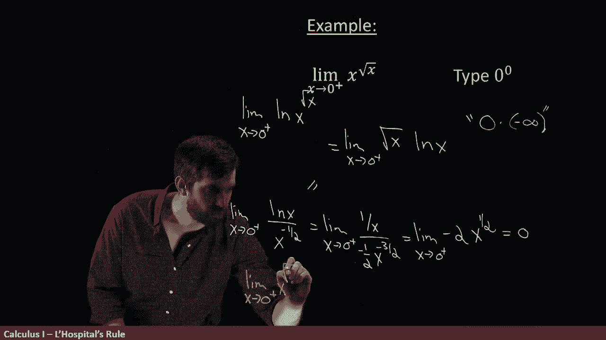

# 【双语字幕+资料下载】辛辛那提 MATH100 ｜ 微积分Ⅰ(2019·完整版) - P40：L40- Applying L'Hopital's Rule to Exponential Indeterminate Forms - ShowMeAI - BV1544y1C7pC

Let's look at a somewhat funky indeterminate form that we're going to have to apply Loyital's rule to。

This is the limit as x goes to zero from the right of x to the power of the square root of x。

Now， if I just go ahead and plug zero into x into root X。

 then the form that it gets is the form zero to the power of zero。

This is an indetermininate form， we don't know what that is。

 it depends on the specifics of the example。

Consider for example， the argument that this zero to the zero is supposed to be equal to zero。

When we know that zero to the seven and zero to the million and zero to the1 millionth。

 all of those are just zero， zero to any non zero power is zero。

 So it looks like maybe this should be  zero2。

on the other hand， if I take a million to the power of zero or one to the power of0 or point01 to the power of zero。

 all of those are one， right raising to the power of zero make something equal to one。

So this is the weird exception to both of those cases where is it zero， is it one， we don't know。

Okay， so how am I are I able to deal with this and the trick I'm going to use is using logarithms because logarithms change exponentials into products and I don't know how to do exponentials。

 but I do know how to do products。😡。

So what I'm going to consider instead of this is I'm going to consider the limit as x goes to zero from the right of the natural logarithm of x to the power of square root x。

 And to be sure this is a different thing。 This is not necessarily the same value because you've taken long of it。

 it's a different function。 Okay well let's see if we can manipulate and see how this is going to turn out。

 Well， the first thing is that the square root on the x on the top， it's going to come down。

 and this is just limit as x goes to0 from the right of the square root of x。

Times the natural logarithm of x。

And the reason that we've done this indeed the whole point of the natural logm was so that we could exploit this property and write it as a product Okay。

 so can I do this now is that made it any better？

Well。As x equals to zero， square root x equals to zero。

But the natural logarithm， it goes to minus infinity。

So this is sort of of type0 times minus infinity so that really wasn't all that helpful。

 we've just changed it from one in termmininate form zero to the zero to a different interminative form zero times infinity。

Okay， can I do something into this， Well， it's not Loital's rule applicable just yet because。

This is a product and Loviital's rule applies to a quotient， but I can make this a quotient。

 It's a quotient， in fact， in disguise because this is just a power。

 why don't I just move it down and pick up a nice sign of my power。 In other words。

 I'm going to now say that this is going to be equal to the limit。😡。

As x goes to zero from the right。

Of the natural log row of x all divided out by x and because it's x to the one half。

 the positive one half on the top， it's x to the minus1 half on the bottom。All right。

 now have we made any advantage here， I think so， because as zero goes。

 as it goes to zero from the right or the natural longer then that's minus infeity。

And this goes through the zero of x to the minus a half。This is going to be positive infinity。

 so it's a minus infinity divided by a positive infinity it's another indeterminate form。

 but it's a quotient， and so I can apply Lo Patal's rule to it even though it's still an intermmininate form。

 All right， so let's compute First of all， I'll copy and paste the limit as x goes to zero from the right。

Well， derivative the top divided by derivative to the bottom。

 derivative of the natural logarithm is one divided out by x。

And then the derivative of x to the minus1 half is going to be minus1 half x to the minus3 half。

Okay， so we've got a bunch of complicated exponents。 I'm going to try to clear it up here。

Copy and paste the limit x goes to zero from the right。

But now I want to combine all the exponents。 Okay， so x to the three/ halfals。

 but with a minus sign on the bottom is like x to the positive three/ halves on the top。😡。

And then I'm dividing up by one here， so I have three halfs to the top and I'm getting rid of two/ halfals。

 but leaves me with， I think is x to the one half so this is x to the minus sign that I have here。

 the one over two， I'll flip it around and make it a two up on the top it's minus two x to the power of one half and now I can compute it。

For this example， it is finally a determmininate form， not an indeterminate form。

 I can plug in the zero， and this is going to be equal to zero。

So notice what we've done。We took this natural logarithm and then we did this series of algebraic steps tool until I applied Loppy Ta's rule。

 and finally it converted from it indeterminate form to a determinate form when I was able to evaluate this value You have to be very careful What is this limit equal to This is the limit of the natural logarithm of x to the root X。

😡。

The limit of the natural logarithm of this thing is equal to  zero。

 but I wasn't interested in anything all with natural logarithms。

 I was interested in the limit is x to  zero from the right of just x to the root x。

So how do I compare these two things so to finish this off then。

 if I'm really interested in computing the limit as x goes to zero from the right of x to the power of square root x。

 if that's my goal。😡。

It's not zero， it is I have to undo the natural logarithm and undoing the natural logarithm is taking E to the value of it this is going to be E to the power of what I just computed is E to the power of the limit is x goes to zero from the right of the natural logarithm of x all the power of square root x。

😡。

And we just computed what that was， that thing was zero， so this is equal to e to the power of zero。

 and finally we get our value of one。😡。

So we've managed to adjudicate that the limit as x goes to zero from the right of x to the root x is equal to1。

So in summary， we have a whole mass of different types of indeterminate forms。

There's the easier ones that you can apply Loital's rule to directly， zero over zero。

 infinity over infinity， and for those ones， just take the derivative of the top divided by the derivative to the bottom and take the limit。

Then we have these sort of ones in the middle， sort of medium difficulty， ones。

 infinity minus infinity and zero times infinity， these are ones that are not a fraction right away。

 but with the of rate trickery， you can make them into fractions， for example。

 if you have a product of two things， you take one of the factors and put it on the bottom with an exponent of minus1 or you've got a difference of two things you can multiply and divide by something and try to factor it out so that now you really do have a denominator。

But the trickiest ones， in my personal opinion， at least are all these ones involving exponentials things like one to the infinity or infinity to the zero or the one we did zero to the zero。

 All of these are indeterminate forms forms that we don't know the answer just by looking at it。

 however， if you take the natural logarithm。 the natural logarithm converts these exponentials into products and we know how to do products So we convert it into a product we try to do some algebra trickery maybe make one of the factors in the products on the denominator so you can apply Lopiital's rule and then you get a value and you take E to that value to undo the natural logarithm。

 So these are the different types of indeterminate forms to which Lopiital's rule can apply。

