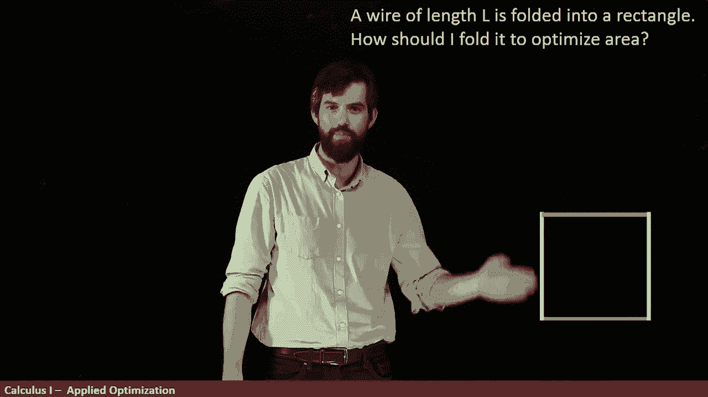
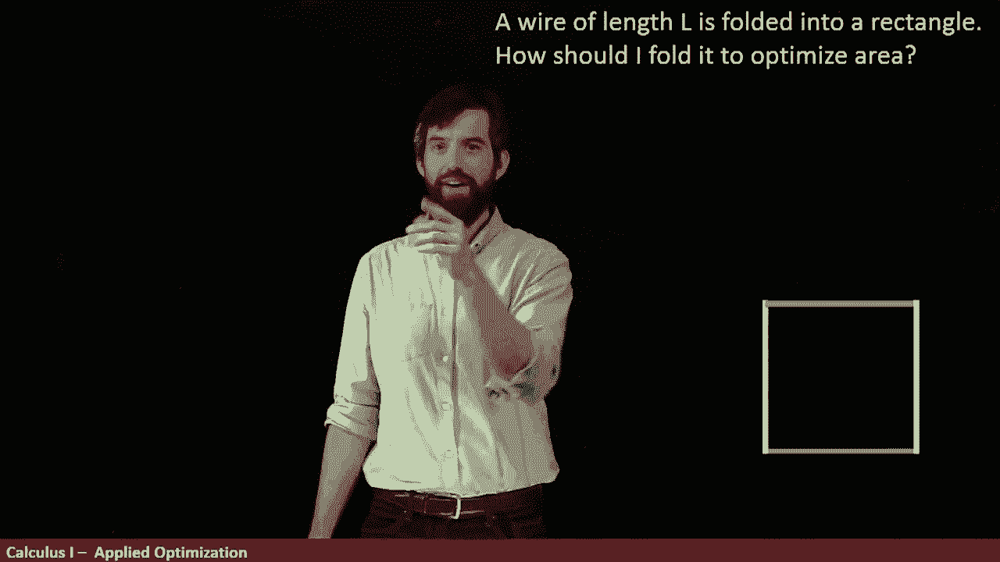
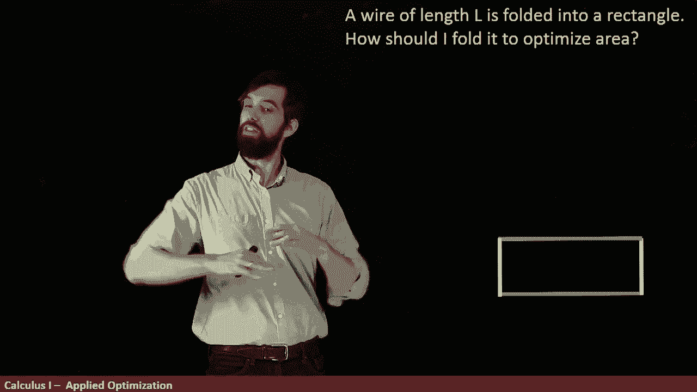
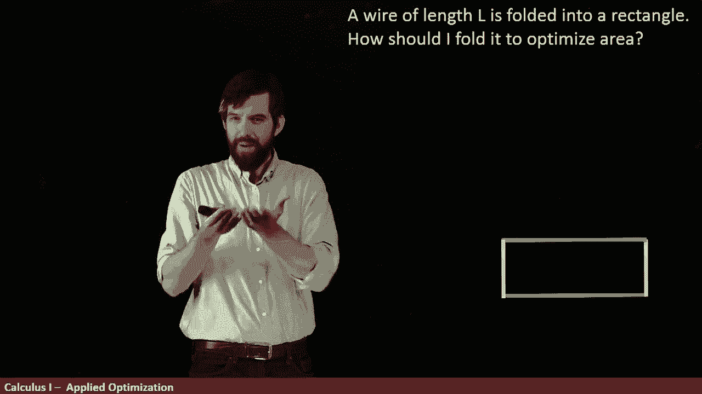
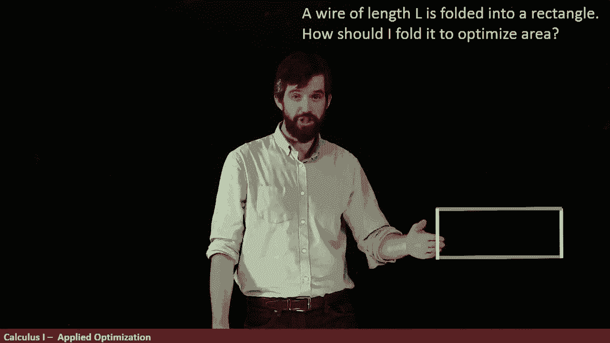
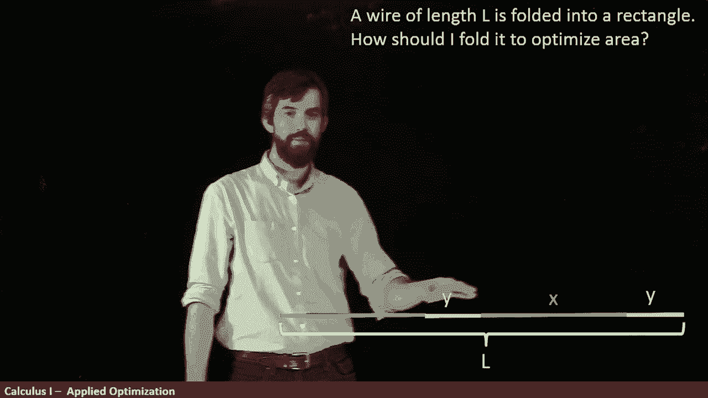
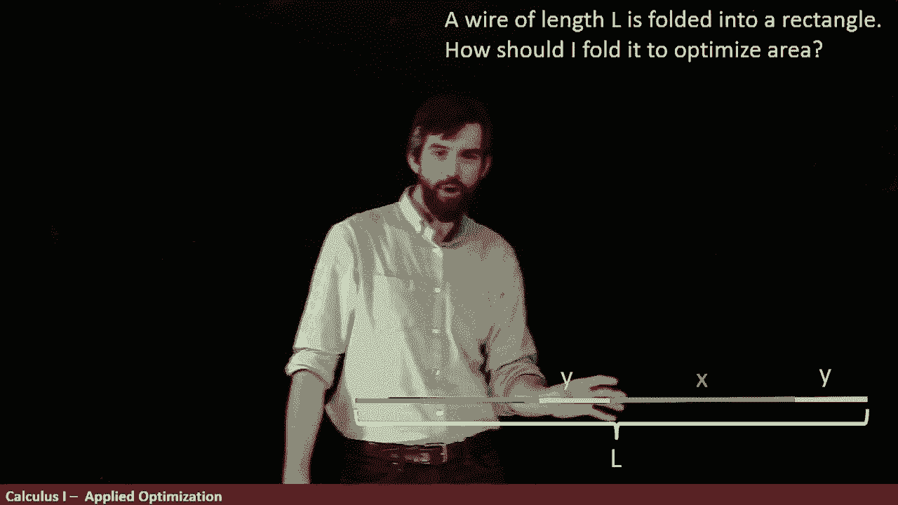
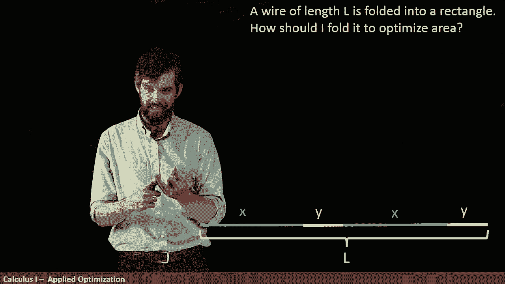
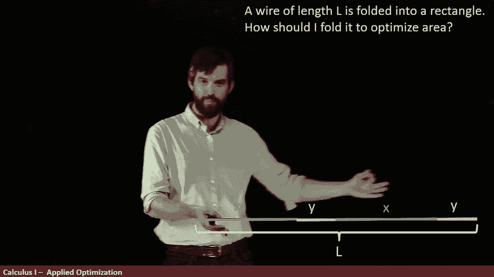

# 【双语字幕+资料下载】辛辛那提 MATH100 ｜ 微积分Ⅰ(2019·完整版) - P42：L42- Folding a wire into the largest rectangle _ Optimization example - ShowMeAI - BV1544y1C7pC

In this optimization problem， I want you to imagine a wire， like the one that I've written down here。

 and I kind of color code it a little bit。The question is。

 how can I take this wire and fold it up into a rectangle。

 fold it up into something that looks like this， so the same wire。

 but it's being moved around into either a square or a rectangle？

Now if I do that and I can do it in different ways， so for example， this one looked like a square。

 but I could take the same idea about make the blues a little longer and the yellow is a little shorter and it makes more of a clear rectangle when you fold it The question is of all the different ways where I could fold it and make a rectangle。

 which of them gives me the largest area which of them inscribes the largest area Now this is an optimization problem in effect we're going to make a derivative and equal to0 and we're going to try to solve it that way。

 but the hardest part about this example is trying to do all the setup trying to figure out how do I write down the equations in what ways and where do I put variables down So that is the key to many different optimization problems it's the interpretation So if I'm thinking about this particular wire and I'm trying to figure out where to fold it。

😡。

One of the things that I noticed that there's a top and a bottom， they are the same length。

 and there's two sides， they are the same length。

So if the entire wire has a length L， I can break it up in the following way so I've got this entire wire with this length L and I say that the two blue portions。

 this is the bottom and the top they have the same length I'll call those X and then the two yellow portions the Y those are the sides of my little rectangle when I fold it up that's going to be called Y。

😡。

So I want to try to figure out what is the constraining equation。

 what is restricted here and what is the optimizing equation。

 the constraint that I have is the following， the total length of this wire is L and when I look at it this way I can see that I've got two X portions and two L portions。

😡。

So this gives me the constraint that twice the value of x because there's two of them and twice the value of y that has to equal to L。

 so that's my constraint， that is what is restricted here。

So that's my first equation My second equation is the so-called optimizing equation the thing I care about is the area。

 so this is what I'm actually interested， I want to maximize the area and this is just going to be a rectangle just the x times the y。

 the base times height， this is my optimizing equation。😡，Now。

 the problem with just taking the derivative of the optimizing equation。

 going right away and just taking the derivative is that there's two different variables。

 there's an x， there's a y， it's not a function of one variable where you can use the techniques of single variable calculus。

😡，But what I can do is I can take this constrained equation and I can try to manipulate it and I can try to get it down here on the optimizing equation。

 I want to get rid of one of the variables。 I don't know if you have a preference。

 How about this I am going to solve the top one for Y and I'm going to put the Y down into here which will mean I will now only have x's remaining。

 so I'm going to get rid of the y by solving the top for y and plugging it in so how can we do this I think we can do this one in our heads So the first x that's right there that just comes out now I'm going to replace my y So in this long equation。

 I've got the 2 y equals L let's me subtract off the 2 x so L minus 2 x divided by the2 that leads me with the Y so what do I have It's going to be L minus 2 x and then all divided out by 2。

😡，All right。So there is an area formula that is now only in terms of x。

 and if I wanted to distribute it through just to make my next derivative a little bit easier。

 I can say this is L divided by two times x so that's talking about the first term and the second term is going to be minus x squared where that two and that two cancels。

😡，Pretty good Now I think I can compute the derivative。

 so let's go along and do the derivative of area with respect to the value of x。

 I can actually compute this thing now， what's it going to be well。😡。

L over  two times x is derivative it's just going to be L over  two。

Minus x squared is going to go to minus 2 x， and I want to set this equal to zero。

Pretty easy to rearrange， I can go and say that x is going to be moved over the other side。

 x is equal to L divided out by four。So I have a value given any length。

 what's the x supposed to be the x is supposed to be L divided out by4 Now whenever I have this critical number。

 that's all I've computed， it's a critical number， I'm conjectureuring it's going to be the maximum but I don't know that for sure because I haven't tested the endpoint and I haven't done any first derivative test to see whether this really is going to give me the maximum so let's do the endpoint first well one end point if I think about this would be maybe x was equal to zero okay if I plugged an x equal to zero。

 the area would be zero。😡，The other possibility would be that x was equal to exactly L divided by 2 so this would be the rectangle if you really want to call it that that goes straight up has no height and goes straight back so in in other words the y would be zero if the x was L over2 because twice x would be the entire thing the L so the one endpoint was0。

 the other one is L over2， but that gives a y of0 and the area at0 would again be zero so the endpoints are clearly not maximals。

😡，And then because there is clearly nonzero possibilities here。

 this means that this single critical point has to be the positive has to be the maximum if you prefer。

 you could also talk about the first derivative test if I look at this particular equation here and see that if I increase my value of x it's negative if I decrease the value of x it's going to be positive。

 so it's going to have one of these things where it's going increasing to decreasing it's going to be a maximum by the first derivative test either way。

 this is going to be the maximum。😡，The final thing I want to think about is what happens geometrically like what does this solution sort of look like Well if I think that x is L over 4 and I've got two different places where there's an x so that takes up L over 2 it takes up half of the wire so then the Ys take up the other half of the wire that forces that the y is also equal to L over 4 I've got four of these different line segments and each of them are L over 4 so it's L over4 L over 4 L over4 L over4 it is a square。

😡。