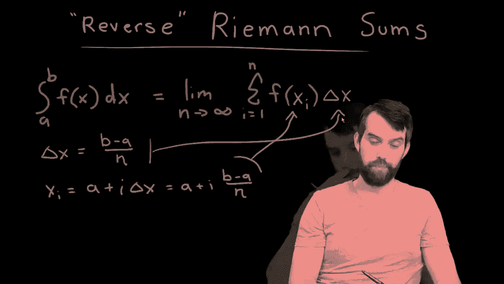
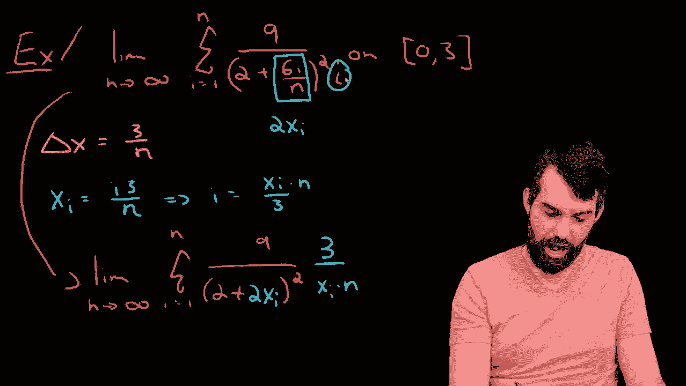

# 【双语字幕+资料下载】辛辛那提 MATH100 ｜ 微积分Ⅰ(2019·完整版) - P50：L50- 'Reverse' Riemann Sums _ Finding the Definite Integral Given a Sum - ShowMeAI - BV1544y1C7pC

In this video， I want to talk about a particular type of problem involving Rman integration。😡。

So what I've rooting down here is the definition of the integral via Free sums， in other words。

 I'm saying the integral from a up to B of some function f of x dx。

 that this is defined to be this limit of the sum of f of x I' delta x。😡。

Now this formula， which is one that you need to understand， and youll recall in our previous videos。

 we have this nice geometric derivation of this。😡，But what I want you to be able to do is actually apply in specific problems。

 and it can work one of two ways。 I could give you the function and ask you to write down the sum or the so called reverse problem。

 I could give you this sum and perhaps the interval A B as well， and ask you， what is the function。

 which this particular sum is， say the right endpoint remain approximation of。

 So that reverse problem that going from the sum to the function that I want to investigate in this video。

😡。

Now， first of all， two little things that we want to look at this definition here。

 which absolutely you need to know， there also need to figure out how to compute the X's and how to compute the delta x's。

So there's two formulas that are relevant here。 And I'm going to do the Delta X first， the deelta X。

 This is equal to the B minus a divided out by the n。 And the X I here， this is given by。

Xi is equal to whatever the starting point a is。😡。

And then you go over one deelta x 2 deelta x，3 deelta x as you iterate along the Ri sum。

 So in other words， it is a plus sum number I times deelta X， or if I prefer a plus I。

 B minus a all divided out by n。😡。

This formula， which we've defined for the definition of everyone integration。

 that you should be able to take this sort of Xi and plug it in here。

 and that you should be able to take this deelta X and plug it in there。😡。

By the way， this worked for XI denoting right endpoint approximations。

 this is a very small change that you can think about if we wanted to denote left endpoint approximations。

 but the standard way to access is problems with right endpoint approximations。😡。

So what I've written down here is I've got a limit is N goes to inferity。

 I have a sum of I equal to 1 to n。 that doesn't really change。

 And then I have the tangent of 2 plus 3 I times3 over n。

 and I'm claiming that I'm using right endpoints。 And I have to tell you one more thing。

 I'm using right endpoints。 I have to tell you what the interval is。

 I have to tell you where I am doing this。 So I am going to claim that my right endpoints are going to be used。

On a specific interval， and I'm going to do how about0，3。

 I think that's going to make everything look nice。

So here's how you want you to do it。 Remember a formula for deelta X， a formula for X I。

 let's go in and plug in those values given this interval that we have。

 So the way this works is that we're going to say that my deelta x well what was that that was B minus a over n So3 minus0 divided by n or in other words。

3 over n。😡。

And we can note right off the bat that I have a three divided by n in my formula that this part sure looks like it's going to be Delta X。

Okay， well， that was certainly interesting。 Now， let's continue。

 I can also figure out what my X I is。 Well， X I was a， in this case， a is 0。 So0。

 that's my a right there，0 plus some number of I' times the deelta x。 So I 3 over n。

 or other words I 3 divided out by n。

And then again， we can go back to our formula that we have up here and we notice that this part。

 that sure looks exactly like that， this is going to be equal to the Xi。

Notice it， keep them separate， they're pretty similar。

 but the Xi has the expression that has the eye in it， the det a doesn't have any eyes。

All right， so now let's try to write down the definite integral that corresponds to this particular Riman sum。

So the first thing I'm going to do is I'm going to do the。

Interval， and I'm going between0 and 3。 And the reason why is because I specified that we were going between 0 and 3 in my actual question。

 If you didn't specify that， by the way， there'd be different integrals that you could sort of shift them to the left or the right。

 But if I give you an interval， I'm telling you the0 to3。 So that's the first point。 Second point。

 I'm gonna have some f of x Dx here。 but let's do the Dx first。😡。

Dx in the integral sort of the infiniteable version of the delta X。

 So if this3 over n that we had at the top was this delta x。

 eventually it's going to go away and what we're going to be left with is that that whole thing。

 the3 over n that was the delta X， it's just going to go into this symbol DX。 All right， wonderful。

Second thing that changes is that anywhere you've got an Xi in your sum。

 the Xi is going to transform just into X， so I'm going to have this tangent of 2 plus x。😡。

So the way I write this is I just say this is the tangent。😡。

Of two plus and then I'll change to the colors that we can identify it2 plus this variable X and all of that multiplied by dx。

 In other words， when going from the Riman sum into this definite integral that we've write down。

 That's our final answer here。 It was all about figuring out what was the delta X that was going to go into the Dx。

 what was the X that was going to turn into an X， and then everything remain that was going to go into the function。

 the tangent and the2 plus that was going to go into the function of the X I turned into the X and the delta X part turned into the Dx。

Okay， so that was a fairly straightforward example。

 let us see one more slightly more complicated example。

All right， so I have this second example here。 it looks like a much messier summa doesn't obviously a look of the form f of Xi times deelta x。

 but it is the same interval zero to 3。 So the delta X and the X are exactly the same so let's write them down。

So now what I have to do is I have to sort of unravel the messy no of this particular summation and try to see a delta X and try to see an X in there。

 even though it's messy。So the first thing I'm going to focus on。

 I noticed that I actually occurs in two places in the sun。

 but I think the closest looking one is this guy right here， the six eye over in。

Because six I overran and three I overran they're pretty close indeed this looks like twice X and that's all right because if I was translating this into a function。

 this would turn into2 x so that portion of it I like。

Now here's the tricky thing。

I've got this remaining eye， which is sticking out here on the right hand side， like a sore thumb。

And then when I'm at， I've got this weird eye， but I also。

 I don't have another three over and anywhere， I don't have an obvious delta X。

 So what on earth is going on。😡。

Now， what I think I'm going to do is that if I look at the formula。

 the X I is equal to I3 over and look， I just have this I by itself。

 So why don't I try and identify what I is supposed to be here， Okay， so I is going to be equal to。😡。

Xi divided out by3 and multiplied by n。So that's a formula and I can take this and I could substitute it in so why don't I try that。

 let's see what happens if I'm going to go and write out this。😡。

Okay， so now as I've written it down， I've made those two changes that6i over in。

 I replaced that with a  twoxi and the I on the bottom。

 I replaced that with this Xi times n all divided up by three。

Okay， so making a little bit of progress。 Now， next point。

 I still have to figure out where is my deelta X， My delta x is3 over n。

 But but look what's happened in transforming this I， I now can see it if I take that3 and that n。

 this is going to be my Delta X。 So I'm making a lot of progress here。 Now。

 what I have is I have a bunch of different x size。 And I also have a deelta x。

 So I think I can take this now， and I can go and try to write out what my definite integral is going to be。

 I'm gonna say that this is equal to the integral。😊。

From A up to B， so a was zero all the way up to three。I know what's happening to the Delta x。

 the deelta x is going over and is transforming into just a Dx。

And then I know that the X eyes's turn into X's and everything else that remains goes into my function。

 So the X's are going to x's， everything else is just going into my original function。

 So what does this look like lookss like I got a9 up here on the top。

 Nothing ever happened to that It would just sort of being there annoying。😡。

I've got a2 and I'm going to even take the first two over here and leave it there，2 plus two squared。

 and then I'm going to put in my X Is turning to x I've got1 x there and I've got an x down here on the bottom and so there we have it we have now the definite integral corresponding to the right rhmon approximation on the interval 03 of this particular limit of a sum of sum messy expression。

😡。

