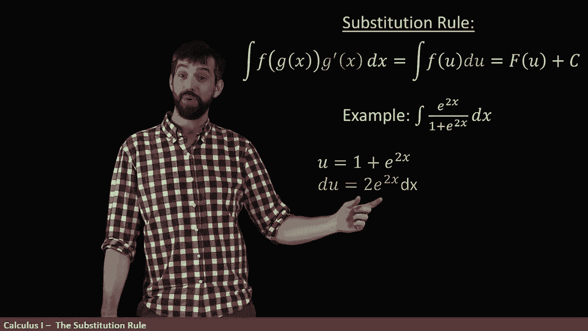

# P54：L54- Adjusting the Constant in Integration by Substitution - ShowMeAI - BV1544y1C7pC

All right， let's do one more example。

What we have here is now the integral of e to the 2 x on the top all divided by1 plus e to the 2 x on the bottom so they figure out what's my f here and what's my U and one of the things that I can sort of note right off the top is that。

😡。

When I take the derivative of1 plus e to the 2 x， Im going to get twice e to the 2 x。

 I mean there's this factor of 2 there that's a bit confusing。

 but it sort of looks like the top here is related off by a factor of  two。

 but it's related to the derivative of the bottom。

So let me experiment with setting you to be that denominator。

Okay， so how does that work， U is the one plus e to the 2 x， It's derivative us， as we said。

 was the twice E to the 2 x Dx。

Well， if that's my u， what's my f， this looks like the function one divided by u times D。

 but we're off by this factor of two all right so that's the U and the D。

 but what is going to be in that case the F？

Now if I think about this expression， the place where u occurs is on the denominator so I think my F looks like1 divided out by u and if they set my f to be one over U that means that the capital F。

 the antideriv of the lowercase F， its just going to be the natural logarithm of the absolute value of U now why is this the case。

 well if we take the derivative of the natural logarithm of the absolute value of u we're going to get one divided by u so indeed。

😡。

Capital F is an anti derivative of the lowercase of F。Okay， so now if I take what my expression is。

 notice how I'm going to relate it so we have this integral want to compute。

 but what I've done here is I've divided out by a two and I've multiplied by a two and I can multiply and divide by a two thats just multiply by one that't doesn't do anything。

😡，But the reason why I do it is because now when I've got this two on the top。

 even though it's canceled down here， 2 e to the 2 x dx，2 e to the 2 x dx。

 that is just D that is what I have done is managed to write this as one half the integral of one over U D so we get the one half that just comes along for the right。

😡，The integral of one over U becomes a natural logarithm and I evaluated it at you where you is this one plus e to the 2 x and finally I add in the plus C。

 so that is going to be my general antid to this funky expression。😡。

And it's worth noting that integration in general is actually quite a bit harder than differentiation。

 Most of these functions that you can combine with quotients and products and compositions and exponents of the elementary functions we've been talking about EDV X and sine and polynomials。

 we can just apply a rules and take the derivatives of all of them。

 but the other way around is not quite so simple， some ingrs when you take the integral of some functions。

 it's able to be done because it can be manipulated to look into one of these nice forms like we have here with the substitution rule。

 but that is in general， not the case and there's all sorts of integrals where we don't have a nice rule like this to be able to apply。

😡。