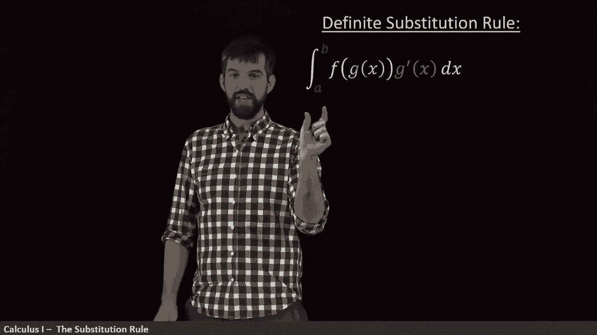
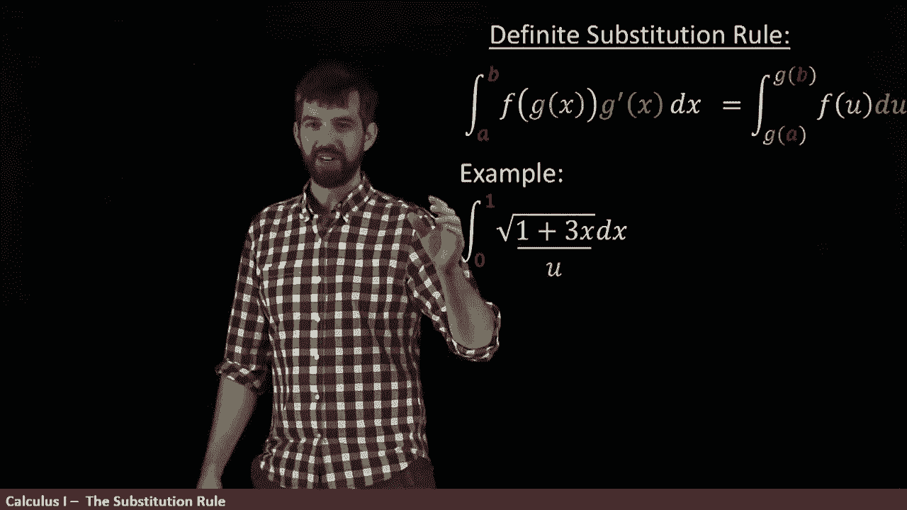

# 【双语字幕+资料下载】辛辛那提 MATH100 ｜ 微积分Ⅰ(2019·完整版) - P55：L55- Substitution Method for Definite Integrals _careful! - ShowMeAI - BV1544y1C7pC

This has been the substitution rule for indefinite integrals。

 indefinite integrals where we don't specify any lower and upper bounds and that our answers are going to look like some function plus C。

But we can do the same kind of thing when it comes to definite integrals。

 So what I want to consider here is the integral from a to B of the same kind of integral F of G times G prime and I want to figure out what can I do in that scenario。

 Well， first of all， it's the same basic idea that we had before the anti derivative of F。

 the capital F at G， but evaluate it between a and B。 and these bars mean I'm going to plug in B。

 and I'm going to subtract off plugging in a。 So in other words。

 this just looks like F of G of B minus F of G of a。😡。

However， I can manipulate this， I know what what this is。

 I can write it in terms of you in the following way。

 this is going to be the deficited integral between G of A and G of B where I take the little F evaluated at U do U。

😡。

In other words。When I think about it in terms of this way。

 we're using our sort of variable of integration is this U when I think of it originally。

 the variable of integration is going to be X and that when you change these formats。

 you also have to change the limits of integration。 This says x equals a to x equal to B。

 but down here this says u equals G of a up to u equals G of B。

 and that should make sense since u was defined to be G of x when x was a， then u should be G of a。😡。

So now we have this nice formula， let's put it all together。

 we have that the definite integral from A to B of functions of this form are the integral from G of a to G of B of f of U to U。

😡。

So how does this work out in an example， let's take the integral from 0 to1 of the square root of 1 plus 3 x dx。

The first thing is going to figure out what's our U and what's going to be our function So I think that our U here is this part underneath the square root。

 we always can sort of have a bit of a hint at this because we can think F of g of x is a composition and here I have a composition as well square root of1 plus3x so I'm going to set that to be my U。

😡。

Now that I've identified the U， I want to go to how about the G of A and the G of B？Well。

 u equals g of x is equal to1 plus 3 x so if I plug in0 here。

 then what I'm going to get is just one plus0， so G of0 is1。

And if I plug in the one for my X， I get one plus three， which is equal to4。

 so that's what my bounds are going to be。 they're going between now one and four。

Then I have to think about what's my D， the derivative of my G。

 the derivative of my one plus 3 x is three， so my D should be3 Dx。

Now， the only problem is there's not actually a three on the outside。 So I'm going to。

 I want there to be a three on the outside。 I do that same track。

 I'm going multiply the top and multiply the bottom by3。

 And what this is going to give me is going to give me one third。😡。

And then the3 Dx combines into being a D， so it's one3 D square root of U， we know that part。

 and the one and4 is what the 0 and1 have changed to when I've exchanged it from express it in terms of x to expressing it in terms of U。

😡。

And now this is an integral that we know how to do。

 this is just going to be some power we can compute that。

 this is u to the one half u to the1 half standing derivative is u to the three half times two thirds and so what I'm going to therefore get is the one third comes all the way out the front and then u to the1 half becomes this two thirds u to the three/ half and I'm evaluating it between one and4。

😡，By the way， since taking derivatives is usually a little bit easier for us at the beginning。

 it's always good to do this quick check if I take the derivative of u to the three/hals。

 it would be the three/ halfs comes out the front Kansass with the two thirds and goes to u to the three/ halfs minus1 which is the square root So if you ever sort of forget these formulas take what you're guessing and take its derivative and verify that it really isnt any derivative。

😡。

Nonetheless， the final step that is remaining for us is to evaluate the four and the one so I'm just gonna to plug them in I can say this is the one third times the two thirds is the two ninths so I get my two ninths here and then it's just the four to the three/ halfalves minus the one to the three/halalves I can say four to the three/ halfals is like two cubed which is2。

4，8，8 minus1 is 7 and so I get in the end 149s。😡。