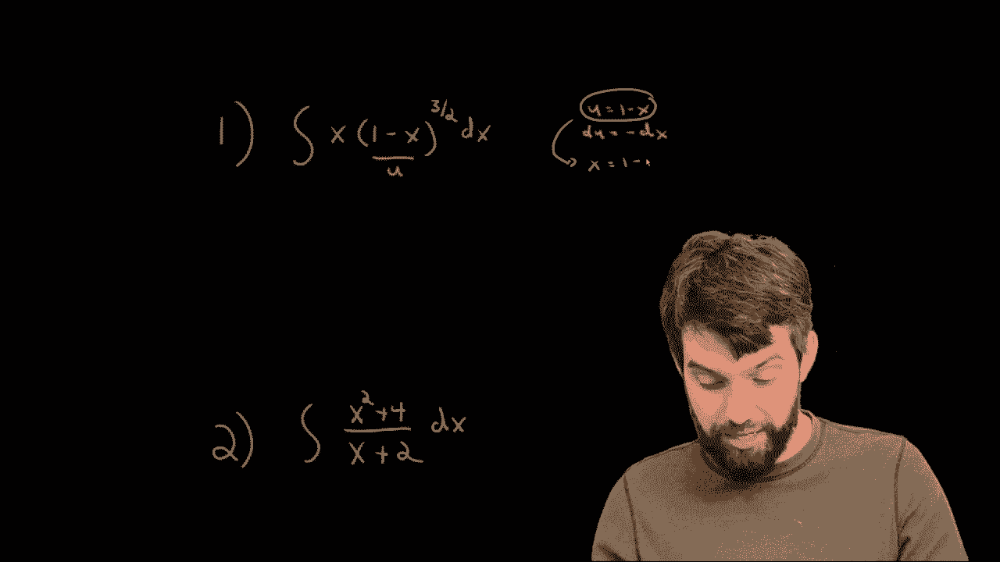
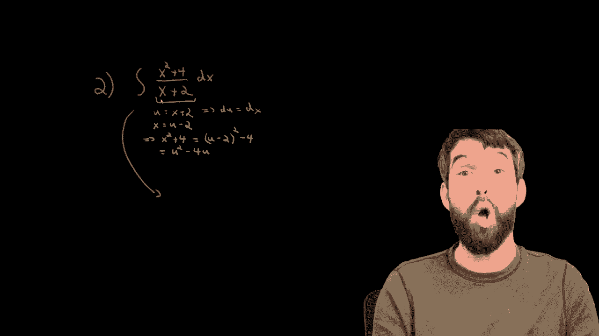

# 【双语字幕+资料下载】辛辛那提 MATH100 ｜ 微积分Ⅰ(2019·完整版) - P56：L56- Back Substitution - When a u-sub doesn't match cleanly! - ShowMeAI - BV1544y1C7pC

In this video， I want to look at two different integrals that require substitution。

 but when you take the derivative of the inside， you don't just obviously find that derivative somewhere in your in that you're going to have to do a little bit of algebraic trickery to make it work out nicely。

😡。

So let's look at this first one， what we have is a clear inside function， indeed。

 if I look at this one minus x that's raised to this power of3/ half。

 there's this inside function the1 minus x and there's this outf function to the power of three/2s。

So it's very natural that I'm going to assign this inside to be my you。

But then if I'm going to allow my U to be equal to1 minus x， well， what does that make my D。

 my du is equal to negative dx？

And it's pretty close， I do indeed have a Dx here and this Dx could be with a negative sign by D。

 but the problem here， the problem is that I have this extra X that's hanging around the front。

 so what can I do with that？

Now， my strategy here is that I actually do have a formula that has an excellent。 Indeed。

 if we look at this definition of U， which is U is equal to 1 x， I can write this as。

X is going to be equal to1 minus u just putting it to the other side。

So now this x， which occurs here， I could substitute this in as being1 minus u。

 So let's just see how everything works out now， I'm going to say this is the integral。

 The first x is going to turn into1 minus u。😡。

And then I have a U to the power of three/2als。And finally， I have a positive DX。

 I really need a minus DX if I want to have a DU here。

 so I'm going take the extra minus sign up the front and I going to write DU。

Okay， that's looking pretty decent now this is something that I think I can manipulate。

 I'm going to multiply it out。

In other words， this is minus， first of all， the one in the u creates。

You to the power of three/ halfs。

And then I'm going to have a minus u to the1 times u to the three/haps。 In other words。

 what I'm really subtracting of is u to the power of five Has。

 the three/ halfs I already have and the one when I multipied by this U so it's u to the three/ halfs times u to the five/ Ha and all multiplied by D U。

😡。

These are just powers。 I can use the power rule this case。 Okay， first of all。

 I can take the the minus sign U to the n goes to u to the n plus one divided by n plus one。

 In this case， it's going to go to U to the power of。

Five hals divided out by five/halves， or in other words， multiply by two fifths。

And then minus minus comes together and becomes a positive u to the five/ half。

 goes to u to the7/ halfs times two/7s， so two7 times u to the seven/ half， and finally plus C。

Now we're fairly close to being done， but there's one final line。

 one that is very important here because the original ingr was in terms of x and I've got this answer in terms of U。

 but we're going to agree that this is going to be satisfied if my final answer is back in terms of x。

 So that's what I want to do I've got this U is equal to 1 minus x I'm going to put this in here and what am I going to get it's that this is going to be equal to。

😡。

Minus2 fifth， and in place of u， I put in the 1 minus x。

 which was our definition of u to the five paths。

And then two7s， and in place of view， I put in1 minus x to the seven2als and finally the all important plus C。

So what we really had in this example was one where we had to do this back substitution。

 as we call it， where there were other parts of the Ingr that didn't work out nicely in the DU。

 but you could use the formula for you to manipulate these other parts and it still was going to be integralable。

😡。

Okay， let's see one more example of how this can work up in this case。

 I'm going to look at this example number two here。😡。

Well， what's a good choice of you， We have to think about that first。

Now， if I do something on the top， U is the top， then nothing really works out nicely in the denominator。

 but I have seen a few times integrals of the form where you set the denominator to be the U and it's going to look a little bit like one over U and we can integrate one over you would be the natural logarithm。

😡。

So while I'm not convinced this is going to be a good approach。

 I'm going to experiment and see whether setting u equal to x plus 2 might be a good idea。😡。

Now if I do that， my DU is fairly straightforward by DU is just going to be DX。

 but the problem remains again this numerator， we have a numerator， it's got all sorts of x's in it。

 doesn't cleanly work out as anything to do with DU。

But I can put my formula for you and I can plug that into the top。

 So let me see how I can go about doing this。 If I've got U is equal to x plus 2。

 that tells me that x is equal to U-2。 I can just rearrange the formula。

And then that's going to tell me that x squared plus four。

 because that's what my numerator truly is x squared plus four is okay， so it's u minus2 squared。

Plus four。And u minus two squared plus4 is going to be equal to u squared。Minus4 u plus4。

 and then minus4。 and that's it。 Alright， so now that we've figured out all this issue with the U。

 let's actually go back to the original equation。

So I'm going to take this， which was already written in terms of x and write it all in terms of U。

 I'm going to say this is the integral well on the top。

 it is the u squared minus the 4 u as we determined。😡。

On the bottom x plus2， that was just our definition of U。

 and then finally the Dx gets translated by the formula DX equal to D into just a D。

So what do I have， I have an integral that is now 100% an integral in terms of U and we can just go and execute computing this。

 This is just a relatively straightforward integral。 The only real thing to do is the bit of algebra。

 We've got U on the top U on the bottom。 Let's cancel I'll say that this is the integral of a single U on the top minus just the four Al do U。

😡。

We can say that this is u squared divided by2 by the power rule minus4 u plus the all important plus C。

Now we're almost done， but don't forget， we want it in terms of x。

 our original integral in terms of x。 our final integral should also be in terms of x。

 And what was you I've already forgotten， U was defined to be x plus2。

 So I can therefore say that this is going to be equal to instead of U， I will write x plus 2。😡。

And then it's the x plus 2 squared divided out by 2， minus4 times x plus2。

 and we could expand if we want， but this is perfectly fine， so I'm going to write it as a plus C。

 and that is my final answer。

So then if we look at both of these two different examples that we have here。

 effectively what we were doing was saying we want to use the quote unquote。

 obvious use substitution is in we want you to be whatever the most inside looking thing is it was inside the three/halalves and the first example it was the thing on the bottom and the second。

 but the problem was when we went to do DU， there was other stuff in our ingr and we had to take these other parts of our indi and write them in terms of you and hope that by a clever choice of you that what we got was going to be inegable as well and in both of these examples that was the case。

😡。

