# 【双语字幕+资料下载】辛辛那提 MATH100 ｜ 微积分Ⅰ(2019·完整版) - P58：L58- Exam Walkthrough _ Calc 1, Test 3 _ Integration, FTC I_II, Optimization - ShowMeAI - BV1544y1C7pC

In today's video， I'm going to go through an entire calculus test。

 This is test number 3 in the main sequence here at the University of Cincinnati。 Now。

 the idea for you， I think， should not be just to sit and watch me。

 just do this entire test that is meant and take students an hour。

 What I think the idea is is to try the test on your own。

 I'm going to leave a copy of the test available so you can do it。

 Try the test on your own and then come to the video and jump around to find the specific questions that you want to verify your answers on。

 All right， first problem。 What we've been given here is some derivative some F prime。

 which is 3 d the X plus to sign of X。😊。

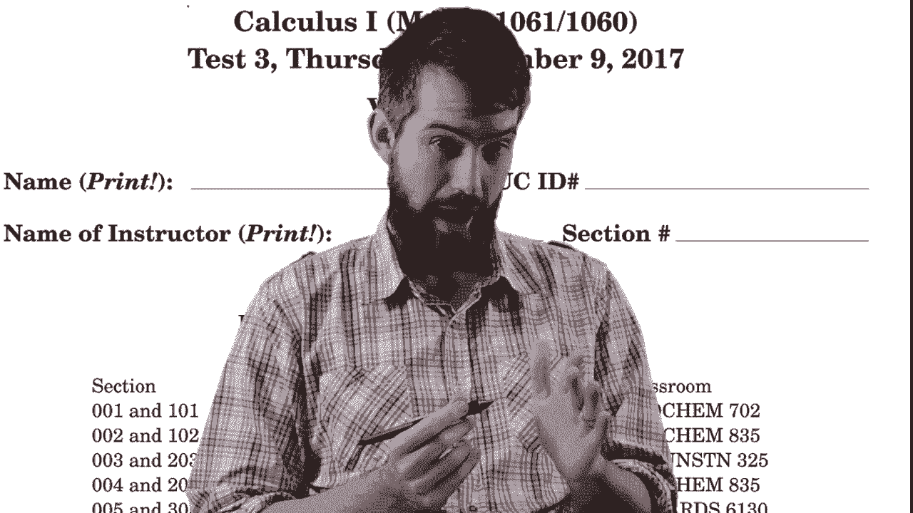

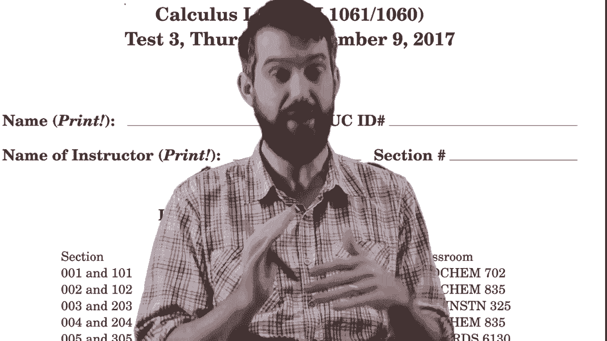

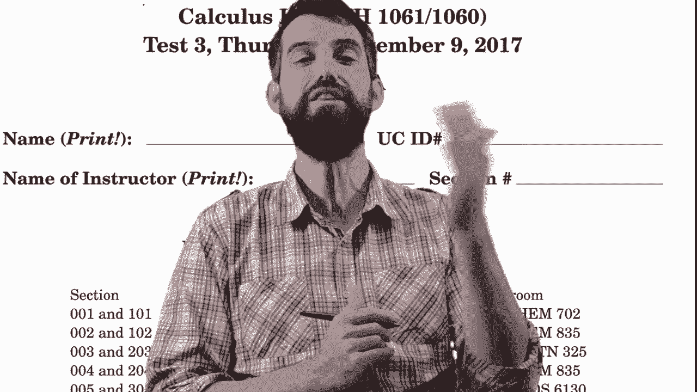

And then we also have this little piece of information that F of 0 is3。

 and what we are being asked for is to figure out what F of pi is。 So that is， I have the derivative。

 and I want to come up with an anti derivative。 But a specific one。 I want the constant to be fixed。

 So this F of 0 is3， and then I can figure out what f of pi is。

 So let's go and try to figure out what the anti derivative is first。

 So I can take the integral of the F prime。 So of the 3 E V x plus 2 sine of x。And all of that DX。

And this is an integral that I can more or less do。 So 3 e to the x。

 this anti derivative is just 3 E to the x。A sine of x is going to go to a minus cosine。

 So minus twice the two comes along for the ride。 cosine of x。 And then this is important。

 You have to put in a final plus C。 I am doing an indefinite integral at this point。 I get a plus C。

 Now， what is that C value。 Well， this is how I can use that F of 0 is equal to three business。

 because what I can say that if this in is generically equal to the function F of x。

Then if I want to go and figure out what f of0 is going to be。

 while this is three times e to the zero and e to the zero is just one， so three times 1。

And then cosine of 0 was also one。 so minus-2 times 1， so minus2。

And then that gives me my specific value that C is equal to 2。

So now if I want to figure out what my generic function is going to be。

 my f of x for all values is 3 e to the x minus2 cosine of x as we've had before。

 but now I know what the plus C is， I can write plus2 final thing I need to figure out what F of pi is going to be。

 So I just plug pi into here。 So F of pi is， well，3 E to the pi。 that's kind of a funny one。

Then cosine of pi is minus-1。 I already have a minus sign out there， so the minus becomes a plus now。

 so plus2 times 1， and then plus 2。 So it looks like3 e to the pi plus 4。

 Do I have one of those that looks like option D。 next problem。😡。

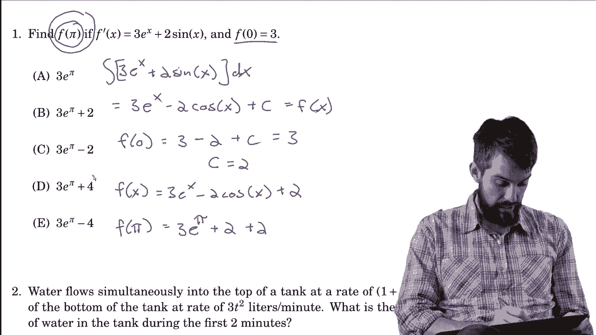

This problem is a net change problem， it says water flows simultaneously into a tank at a particular flow rate。

 1 plus 4 T cube， and it flows out of a tank at a different flow rate in this case 3 t squared both in liters per minute。

 and the question is what is the net change during the first two minutes？So in other words。

 I am doing a defite interval from zero up to two， this represents the first two minutes。

And I can put both the inflow and the outflow into the same integragram。

 I can say this is going to be the  one plus 4 Tq。 that's the inflow amount。😡。

And then you are subtracting off the 3 T squared that is the outflowing amount。

 so inflow minus outflow is the total net flow。Then all of this integrated Dt。 All right。

 so let's do this。 Okay， so one is going to have an integrated2。

4 T cubed is going to be plus t to the power of four。

And then minus T cubed and it looks like everything we sort of bested to work out very nice。

 They drove a T cube to 3 T square。 you can always go back and check these。

 and then I'm evaluating it0 and2。First， I need to plug in2。 So2 plus2 to the fourth minus2 cubed。

 that's evaluating it 2。 And then I need to subtract off evaluating at 0。

 This is going to be easy 0 plus 0 minus0。And then final thing okay， so two to the power of four is2。

4816， then I'm going to be subtracting off8， which is 8 plus2，10。 it looks like I've got 10。😡。

Very nice And this is indeed in leaders because the in is in lit per minute I integrate out time I get two leaders So I have sort of a unit analysis check I would always recommend that you when you find your anti derivative here that you take a derivative and verify is what you have in the in。

You plug in your values。 All right， next up。 Now， this problem says that I have a particular limit of a sum of some stuff。

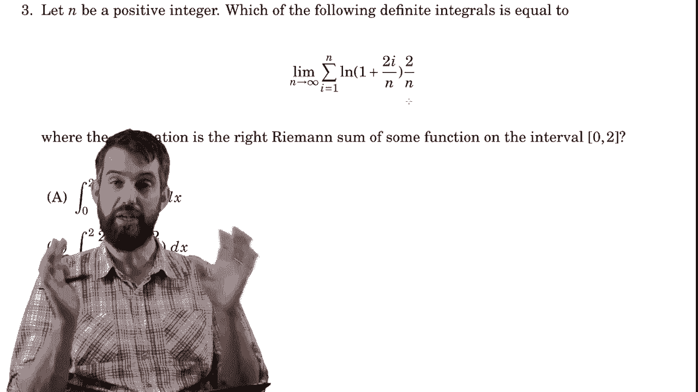

And then this is going to be equal to using a right riman sum so right endpoint on the intervals 0 to two。

 it's equal to one of these definite integrals， but which one。

So there's a couple of formulas that are reported to remember here。

 the first is that delta x is generically b minus a all divided o by n。

 and in this particular case here when you're B in your a or2 and 0。

 this is going to be a width of two divided by n。😡。

And I notice that when I look actually in this inte。

 I see that I've got a two divided by N there and that I see that I've got a two divided by N right there。

😡，The other little formula I need to know is well， what about the X eyes if I'm using right endpoints Well。

 the general is that you start on the far left and then you go over one delta x2 delta x3 delta x generically I delta x。

 So the formula to remember is that you start a and you go over plus I delta X。

 if you forget these formulas by the way， I always like to come along and have a little picture in my mind here。

 So if there's my a and there's my B and I think about dividing this up into a bunch of rectangles。

 Well， the width of one of those rectangles is delta x and then something like that that x1 there is the coordinate of a plus1 copy of delta x and x2 would be a plus two copies of delta x and so on sort of down the line。

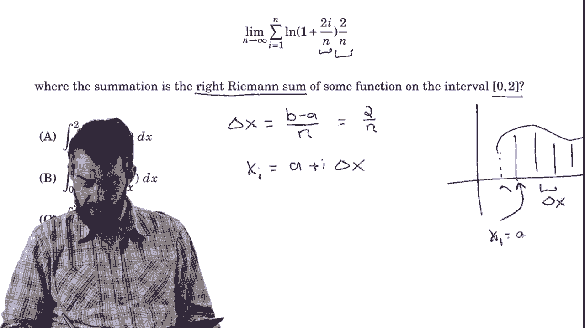

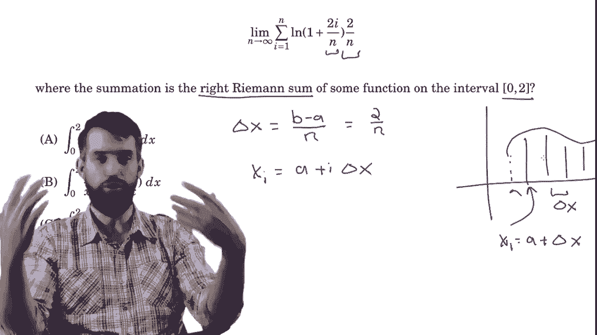

So by the way， I've got my Xi， and in this specific example， the a is0， the delta x is2 over n。

 so a plus I2 over n。So look at the formula， I've got that deelta x there and actually2 I overran。

 that's exactly my Xi， so there's my X I。

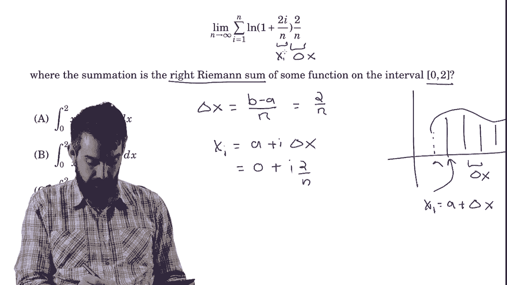

So then I just have to find an indefinite ordefinite rather that kind of looks like this， So0 to two。

 okay they're all that that's sort of comes for free。 The two over n is going to go。

 which is our deltaex I' going to come the Dx。 I don't want any sort of two over n type things remaining。

 but I do want to log and I want a1 plus x， So log 1 plus x looks like the value of C The X that portion comes into be the X I and the Dx becomes the delta X。

Wonderful。This problem is a problem about law rules。😡，I see that I've got a one to two。

 an eight to one， a two to eight。But there's this rule called addivity of the domain。

And what it says is that in general， if I take the integral from one all the way up to8 of F of X dx。

😡，I can break up this domain into being the integral from one up to two。😡。

Of F of xbx and the integral from2 up to8。Of F of X D X。 So this is the property addivity of domain。

 And the basic idea of addivity of domain is that a larger region can be written as a sum of some smaller regions。

 and you just add them up， and that gives you the total area of the larger region。 Now。

 what am I actually trying to solve for。 I am trying to solve for 2 to 8。

 But notice there's a sneaky2 there。 I'm actually asking twice F of x。

 But but let me figure it out for F of x first。 And then I'll just multiply by 2。

 the two that I have here。 It can come out the front If I so wish。

 So I'm going to figure out this right hand2 to 8 of F of X Dx。

 Then I'm going come back and figure out what twice that is by multiping by 2。Now one to eight。

 the only problem is I don't have one to eight， I have eight to one。So if 8 to 1 is -7。

 then 1 to 8 is going to be 7。 So this left guy over here is going to be 7。

 The one to 2 is going to be equal to 3。 And then I have my question mark here。

 So that tells me that the integral from 2 to 8。F of X dx question mark is7 minus three。

 which is equal to four。And then that tells me if I have twice this value because I'm interested in twice that it's going to go to8 so I can circle the value of8。

Wonderful。

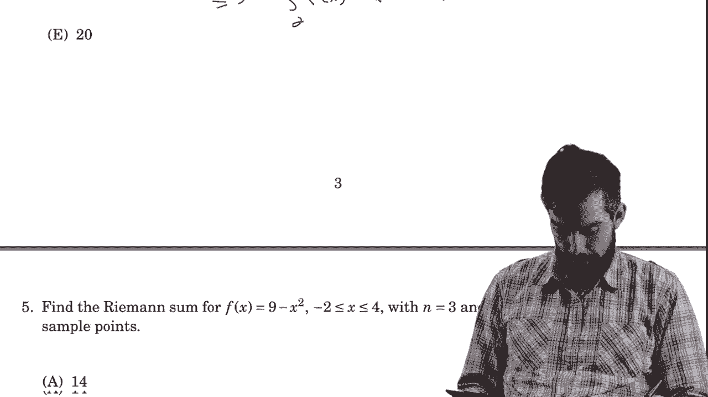

Okay， next problem is a reman sum problem。 I have some function。I want to figure out， well。

 what is the Rimon sum of it using left end pointss and using three of them？😡。

So if I draw myself sort of a quick graph and you don't have to do this， but I'd like to do this。

 so this is a graph here of9 minus x squared。😡，And we are going to be going from， well， first of all。

 I can say， when the sort of intersect the the X axis。

 we know that this value here is minus3 and that value there is plus three。😡。

So I have a minus three and a plus three。AndNow what I'm actually asking is to go from -2。

 So a little bit to the right of that zero over here to 4。

 which is a little bit to the right of the zero。 So that's kind of interesting。

 And then I'm going to also put。-2 to 0，0 to2 and 2 to 4。 So if I'm using left endpoints。

 then I'm going to be talking about this point right there。

 this point right there and this point right there， the ones at -2，0 and 2。

 you might think hold on cover aren't you going from all the went to 4。 But no。

 but the final interval， the one that goes 2 to 4， using the left end point of that。 So that's only2。

 So final story， my sum is going to be equal to the value of F at-2。Times in interval width of two。

Plus f at zero， the second end point times a width of two， so height time space。

 and then a height of two， and again， a width of two， the width of two of the same every time。

But plug minus-2 in here， so 9 minus minus2 squared is going to be a five times 2。

 so five times 2 is 10。Plug in zero， I'm going to get nine， so I get a9 times two， which is 18。

If I plug in a two here， I get again a5 times another two， so another 10， so 18 28，38。

 and that's my answer right there。

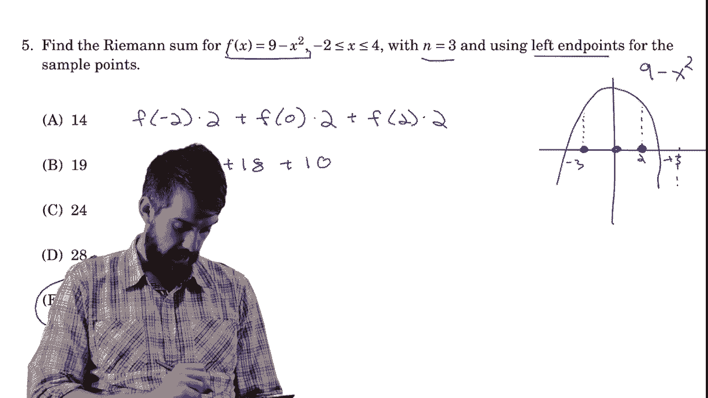

Halfway through the multiple choice。This problem you should be on the lookout for it。

 it is a fundamental theorem of calculus number one。

 and the reason that I can do or know that that's the case is first of all。

 I'm looking that it's not an integral just by itself it's the derivative of the integral。😡。

And then second of all is the derivative of an integral where there is an x in that limit。

 there's a square root x up to 5 of log TDT。 So I want to be using my fundamental theem of calculus and to remind you that the fundamental theorem calculus says the integral。

From any value of a up to x。Of F of T Dt， and this is not。😡，F of T。 it is F of x。

 the derivative of the interval they sort of canceled。

 but there's this kind of weirdness to it in particular that if it was an integrative F of T。

 that T is a dummy variable。 But this accumulation functions and function of x。

 So our final answer is F of X。 Now， a couple problems。 Numb one， First of all， I don't have an X。

 I don't even have it in the right location。 right now。

 you see how this square root of x is down here at the bottom and not up at the top。

 So that's problem one， that I need to flip the order of this。 And I can do that fair enough。

 I can say this is negative of the derivative with respect to x of5 up to square root of x of log of T D T。

😊，So I take the minus sign and that flips it towards the right way so it's compatible with fundamental theorem calculus second issue。

 it's not just an X， it's a square root of X。So I have to use a little bit of a chain rule here。

 It's not just up to X。 it's up to some function of x。

 So when I do the chain rules derivative to the outside at the inside。

 at the square root x times the derivative of the inside times the derivative of square root x。

 So what am I going to get， it's going to be， well， that negative sign。😡。

And then the fundamental theem of calcus says the derivative of the integral cancel in the following sense。

 it's log， but not log of T， log of whatever the function is， so log of root X。

And then it's multiplied by the derivative of Rux。 And so this is going to be， well。

 one half x to the minus1 half。 And let's see whether we have that answer in there。

 It looks like we do。Answer E。Allright。Moving right along。

This next question is just sort of an annoying little trick。 It's just a spot of algebra。

 It's not a big deal。 Basically， what we notice is that， look， there's a quotient。

 There's no quotient rule for integrals that we're going to be busting out here。

 So we have to just use some algebra to make it look like a power rule。 And the trick is this。

 I'm going to do the integral from one up to2。 I have a sum in the numerator。

 and I'm allowed to break up the sums in numerator。

 So I can say that this is just two x over x cubed。

 and x over x cubed is like just x squared on the bottom。😊，plus。

X cubed over x cubed and x cubed over x cubed is just like one。 So there we have that answer。

2 over x squared plus 1。Dx， okay， now what can I do， Well。

 I have to do an anti derivative of these two different things。 First。

 I've got the two over x squared。 So I'll put the the two out the front。This is x to the minus2。

 so it's anti grve of x to the 2 plus1， so x to the minus1。And thenre all divided out by minus1。

And then finally plus X， and then I'm going to evaluate this entire thing that I have。

Between the x values of one and two， two first。 So I have a minus。2， and then the x to the -1。

 when I plug in 2 is going to be a two on the bottom plus 2。 right， That's plug 2 in。

 And then I subtract off plugging one in here。 So I have a -2 plus1。

So I've got a minus one and a two is a1， minus2 and a1 is a minus1。

 because the minus sin outsidesider becomes a plus one。Plus one。2。Right。Okay。

 what do we want to do here。 Now， look， it's very similar to the previous problem。 It's got a sum。

 But because the sum is down on the denominator。 Now， you can't split it up in that same way。

 We have to use a U substitution。 And what I notice is that in the denominator there's an x squared term。

 But on the numerator， there's just an x term。 And derivative x squared is a 2 x。

 So outside of the two figuring out， it looks like the derivative of the denominator is sort of up to constant。

 the numerator。 So let's try this。 Let's set U equal to x squared plus1。😊。

And that is going to imply that my D is going to be equal to2 x dx。

 and in fact I actually have four Xdx， I have twice that value。Now。

 I have a indefinite integral here。 excuse me， I have adefinite integral。 I've got a 0 and a4 there。

 So I have to figure out what happens there。 Well， U at x equal to 0。

 Like if I plugged in x equal to 0 here would be  one。 and U at x equal to 4。

 if I plug in 4 for this value would be 4 squared to 16 plus 1 is 17。

So this whole thing is equal to the integral from1 up to 17。 I've switched my limits of integration。

 Can't forget that part。I've got four XDx， not two XDx。

 so it is twice the value of D and then divided it out by you。😡。

So how do I do this while the two comes along for the ride。

 the anti derivative of one over U is at log of absolute value of U。

 so log of absolute value of U and then evaluated between 1 and 17。

 which is two log of 17 minus2 log of1 and log of1 is just 0， so twice log of 17。

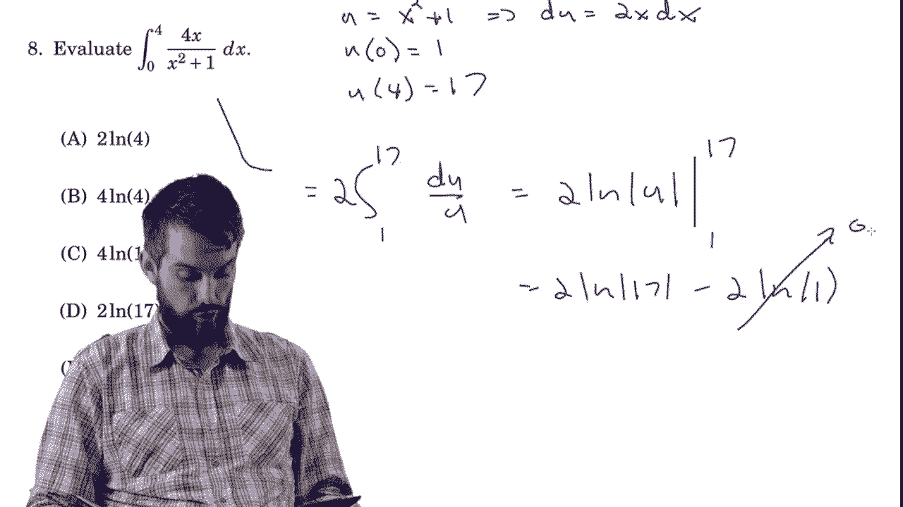

We have the result。Hey， we have one more multiple choice， that's it。

 we're done with the multiple choice onto the rhythm。Now。

I really like this particular written problem。 This is one where I've got an accumulation function。

 A G of x is the integral from 0 up to x of some function F of TDT。 And the graph， not of G。

 but of F is given。 That's what I put down here。 The graph of F。

 So I have to interpret G from this graph of F。 Now， what kind of question do I ask about this。 Well。

 first type of question I ask is find each of the following。 First of all， G of1。😊。

So if I look at what my G was， this is like plugging in1 because that maybe be the integral from 0 to 1 of F of x dx。

 Well，0 to1 of F of x dx is that area right there。😡，So the integral from zero up to1 of F of x dx。

 what am I going to do here， I'm going to say that this is just the area of that triangle。And s area。

 by the way， this has a width of one， a height of2。

 So one half of base times height is just going to be one。 And because it's negative。- one。All right。

 G of9， well now I have to shade in all of this other stuff going all the way over to G of9 is a lot more areas to figure out。

 So it's the minus1 I've already figured out。😡，Then I have another triangle here。

 the one above the X axis I'm going to figure that one out and it's going to be a width of three。

 one half or one half based of height， a width of three and a height of two。😡。

Then I have this little portion between four and six here， another triangle。

 so a one half width of two times a height of two， I then have a square which has a excuse me。

 but this last one here shouldn't be a plus should be a minus sign because it's beneath。

I then have another minus sign for my square going from six to eight， which is a two times two。

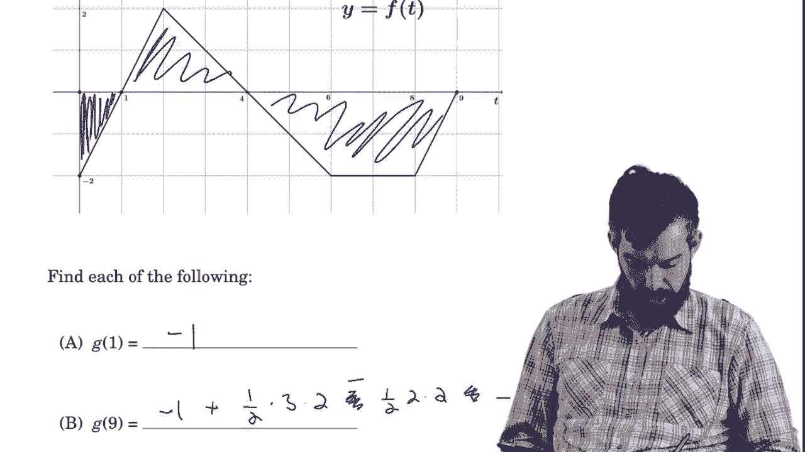

And then finally， one more one half， it is one half a base times height。 So a one times2。

So just basically looking at these either triangles or squares and adding them up by looking at it。

 but either way G of 9 is this area moving right along。 Now we want to do G prime of7。

 And the big idea here is this。 If I look at what G prime is， G prime is accumulation function。

 So it's derivative is the derivative of the integral from0 x of F of T T， but。😡。

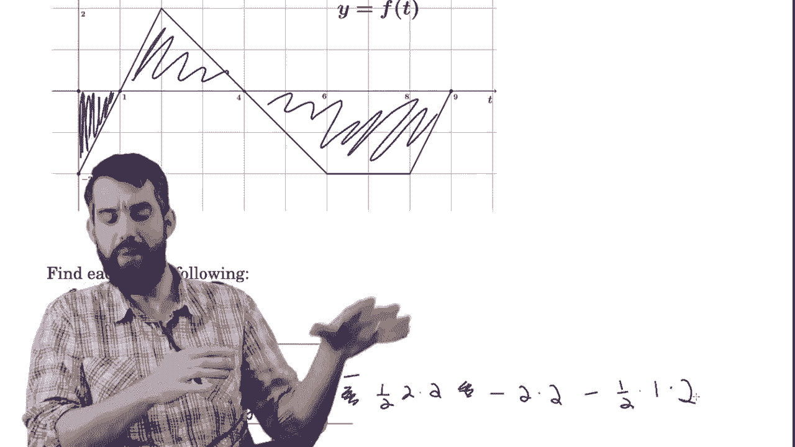

We had the fundamental theor of calculus that says the derivative of the integral of the derivative of the accumulation function is just its integralgr is just f of x。

 That is this G prime of7 is just the same thing as F of7 and G double prime of 7 is therefore F prime of 7 it's sort of the derivative of the derivative。

😡。

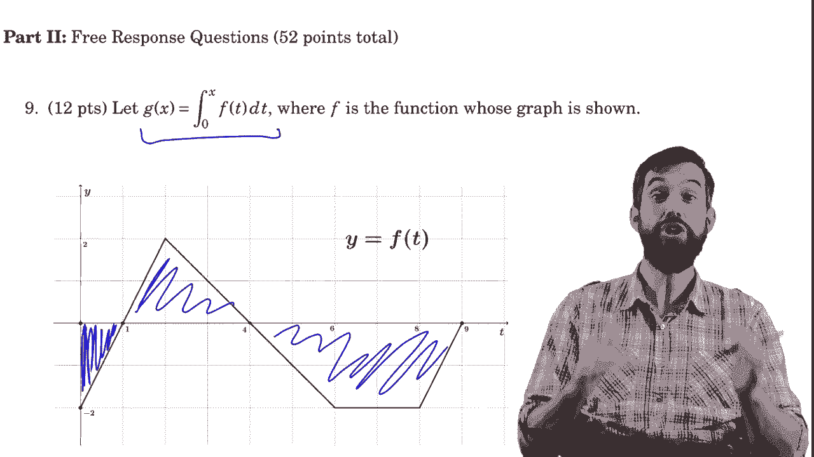

Okay so what's f of 7 and f prime of 7 looking back up， well。

7 looks down like it's going to be the value of x equal to minus 2 so I can do that。F of7 is minus2。

And then。Prime of7， well， this is the slope at that particular value。 Well， the slope is horizontal。

 right， there's no rise。 and so we can say this is equal to 0。Allright。

 increasing in an absolute maximum。 let's go back look at my graph。 But look at my graph。

 Where is this increasing。 Well， starting at zero， it begins negative where you're adding sort of negative areas。

 areas beneath the x axis。 and then it's that positive for a while， goes big， big， big。

 big increasing all the area where you're adding positive stuff and then decreasing again。

 So I think the maximum happens at this value of four here where you've been adding all this positive stuff going as large as you can in terms of your area under the curve and then you start going down again。

 So I'm going to say that my G of x has an absolute maximum at4。

 and that it is increasing on one up four。

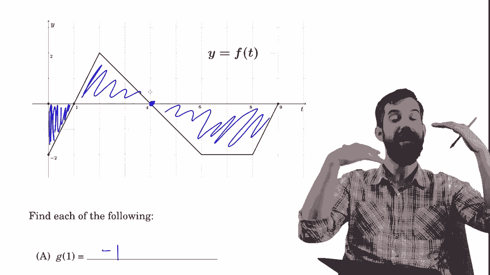

Another way to think about this is it's increasing when its derivative is positive。

 but its derivative was just the function value of F of x and so I'm basically just asking where is this function value positive well it's positive from one to four。

😡，All right， use substitution。The big trick with all these sub problems is trying to figure out what is a useful U。

 Like， if you just chose L N of X， then you would have like the one were not counted for。

 you made the entire denominator， the U。 Well， the D would be super messy。

 If you put the U to be the one plus2 L N of x cubed。

 you get three times all that mess squared when you try take a derivative it。

 a lot of possible use that as soon as you try then， they don't work out。 So what does work out。

 If I go and set U to be sort of the inside of the biggest chunk I can think of。 Well。

 I have a block cubed。 So let's just set it to be the inside of that one plus2 L N of X。

 And then we will get U cubed。 when you go and plug it in。😊，That's my U。

 then my D U is going to be equal to2 over x D X。 And I can then go and rearrange this。 Okay。

 I don't， I see that I have an X， and I see that I have a D X。 I'm missing the two。

 So I have to put a half out the front。 So one half。

But then I can say this is the integral of just a D over U cubed。😡。

To a power rule the one half comes along for the ride。

 it goes to u to the power of minus3 plus1 is minus2， I divide out by that minus 2。

 and I add a plus C because I'm doing an indefinite integral。

Right final thing I can't just leave it is you， I have to go and actually plug in for the value of x I had an integral in terms of x。

 I want my final answer in terms of x as well， that's our agreement。

 so I will write one half and in fact I will come along and say not one half I'm going to say that it is going to be minus one quarter when the twos multiply。

😡，And then I'm going to have the u， which is 1 plus2 element of x substituting it back in and all the power of minus two final plus E。

All right， next one。Okay， another use of there's a natural guess for your U。 It's the inside of the。

 you know， the power game。 We did you cubed last time。 Now we do U to the one half。 Let's try that。

 So X-4 D is very simple。 in that case。 D X， but there's a problem。

 And the problem is this X right here。If I go and try to plug in U and I get x square root U to U。

 But how do I deal with my X， I have to do this thing called back substitution。

 So what I'm going to do is I'm going to rearrange my formula。

 and I'm going to say that X is going to be equal to U plus 4。

 So now when I've got the X I can make that into a U as well。

 So this is going to become the integral of U plus4 times square root of u D。😡。

And now this is one I can just go and multiply out。

 So this is u to the one times u to the half is u to the three halfs。And for you to the one half。

 all of that multiplied by D， wonderful。Now I want to use my power rule to do the find anti derivative u to the three/ half plus one is u to the five/ half。

 divided up by five/ h is the same thing as multiplying by two fifths。

And then plus and I'll make the four here， now it goes to u to the one half plus one is u to the three/ half。

Divided by three/2s。 or if you prefer， multiply。By two/3。

 and then finally it's an indefinite integral， so I owe you a plus C。Okay。

 final thing I want to do is I actually have this u it's an x minus4， let's go and plug that in。

 so two fifths。😡，X minus4 to the five hats。Plus eight thirds， x minus4 to the three/2als。Plus C。

And that's a final answer。All right， wonderful。Moving by along。Okay。

 we have some sort of optimization problem it appears here， let's try to read it。

 a tank has a rectangular base and rectangular size。

 but open on the top so I'm a box with the open on the top。😊，It's constructed。

 so it has a width of four meters and that its volume is 36 cubic meters。 Okay。

 so it seems like one of these three sides I've got got a width， the length and height。

 It sounds like the width is specified it has to be for。

And when building the tank costs $10 per square meter for the base and 5 per square meter for the size。

 you want to find the length of x such that the side of the base because the minimum cost of the tank。

All right， so I guess we're trying to find sort of an x value we're going to write it in terms of now I notice that I have a constraint here。

My constraint is that my volume is 36 cubic meters， so my volume， which is。4 x。

 Y base times width times height。ThatThis has to be four x y， or sorry。

 width times length times height， I guess four times x times y， and all of this is equal to 36。

So that tells me X Y is9 or in other words， y is9 divided out by x so I can use this a little bit later if I have a y in my formula is I want to get rid of it。

 I can do that。😡，Now I want to find the cost of this thing okay。

 well how can I do that one of the things that I know here is that my cost function。

 which I'm initially going to write in terms of x and y， so I'll write cost of x and y。😡。

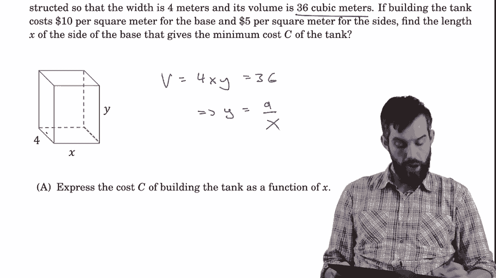

Well， in this case， it's the cost I'm optimizing。 whether the constraint was the volume。

 It could be the other way around， right， I could go in the other direction。

 give a fixed cost and ask you to optimize the volume。 But right now。

 the thing I'm trying to optimize is the cost。 So it says it is $10 for the base。

 The base is  four times x is only one of them。 So $10 times  four times x。

And then then I'm going to have5 for the size， but there's two different sort of types of size as a rectangle。

There's two versions Ive put to of the ones that are four times x。Excuse me， that are four times y。

So that would look like one of those guys that's going to be a four times y。

 but I'm also going to have these ones on the side that are like an x times y， they also cost$5。

 there's also two of them sort of a front and a back and this one is going to be x times y。😡。

Now I need to use this y equals9 over x formula so that I can make my cost function entirely in terms of x。

 so this is first going to be a 40 x。😡，Then it's a 10， I've got a 40 y。😡。

But it's a 40 y where y is 9 overact。 So 9 times 4 is 36。 So 360。Divide it out by x。

And then five times two times x times y， so 10 times y is going to become。

 which is90rex is going to become a 90。😡，And then x over x。

 so don't have to worry about I just get this， so there's my cost function， it's a function of x。

Find the critical number， Okay， I have to figure out what c prime of x is going to be。

 Well derivative to 40 is just 40 x is just 40。Then minus 360 over x squared and our critical number is when this is going to be equal to0。

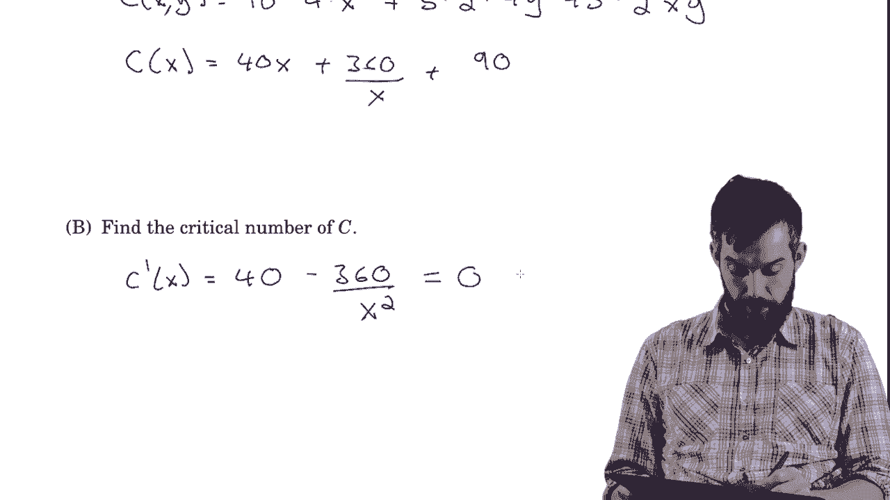

Bring in the x squared divided by 10 to make myself a life a little bit easier。

 it's4 x squared is equal to 36。😡，Which means x squared is equal to9。

 which means x is equal to plus or minus3， and the idea of the side length of a box being negative is just such nonsense I don't have to worry about it。

 It's just the positive root。 X is equal to three。 That's my critical number。Moving along。

 use the second derivative and first derivative test or the first derivative to verify that C has a minimum at the critical number because right。

 we've got this critical number， but it could be one of those midpoint that doesn't do anything could be a maximum who knows Well。

 if I go and look at what my C prime is right here。

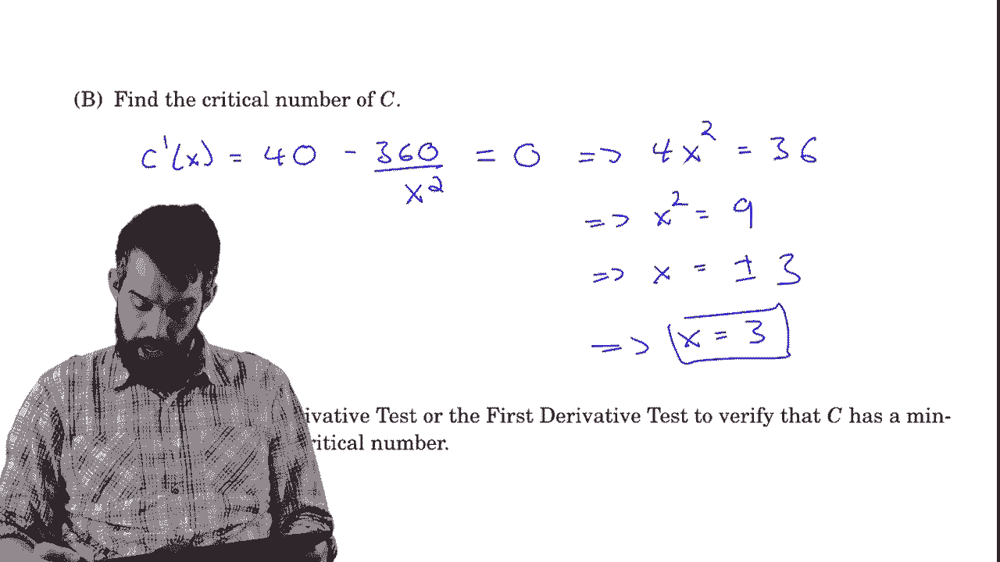

I'm going use first derivative test， so C prime I'm going to come along and I'm going to put this value。

 there's my value of three Well imagine X was bigger than that。

That would mean that the negative term that I have here。

 that negative term would be a smaller negative term， so it would be positive。

 so it's positive over here。😡，If my x was smaller than three。

 the negative term would be more dominant， it would become a negative。

 and so we've got a negative to a positive， it is therefore going to be so a minimum。

So given this constrained volume， we have minimized the cost。And one more problem。

 a graphing problem always like this。 This is where I give you all these different components。

 F F prime， F double prime， and I try to graph them。 So domain， well。

 domain is everywhere where I don't have a division by0 or a square root of something or a log of0。

 any of those types of problems。 E the x is never  zero。 So the domain is everything。

 minus infinity to infinity。😊，If I wanted to set x equal to0， then that would give me my f was 0。

 my y was 0。 If I wanted to set my y was 0， that would give me my x equal to0。

 so there's only one intercept it's 0，0， it's both the x and the y intercept。😡，Allright， next up。

 F is increasing where F prime is positive。 So I want to know where my f prime is positive here。

 and I notice that I have this value of one and that if I' am bigger than one。

 it's negative and if it's smaller than one， it's going to be positive。

 So I can say that it's increasing on minus infinity up to that value of one。

Concave up now I'm going to do my second derivative。

 one similar kind of idea when it's to the right though， it's positive and to the left is negative。

 that's f prime and F double prime， so concave up on two up to infinity。Okay。

 vertical lotss and toes are where the denominator is zero， so there are none。

 the denominator is never zero。😡。

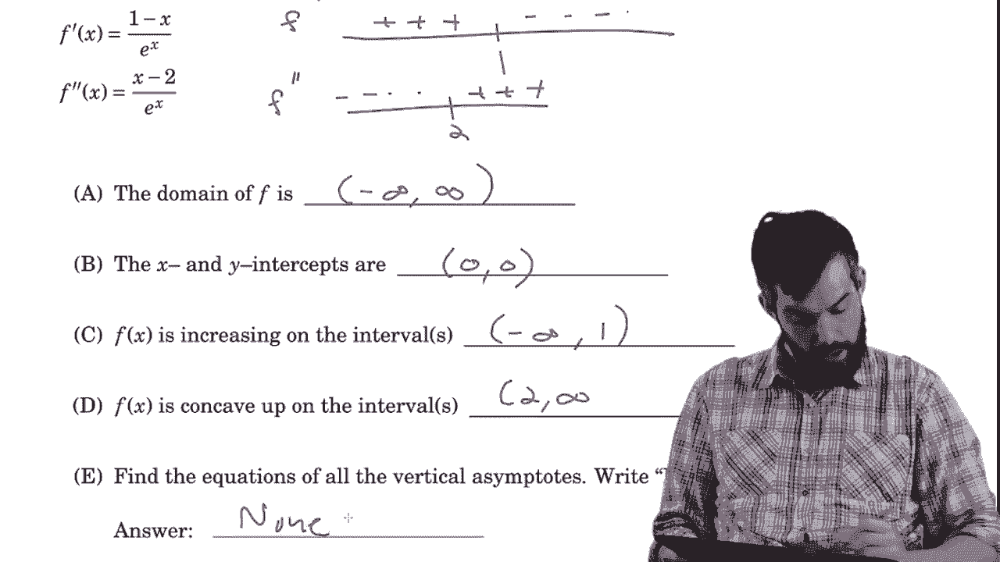

Okay， horizontal laintes。 This iss where you excludes a positive infinity or minus infinity do positive infinity first E to the x goes to positive infinity。

 So x divided by e to the x that's going to be going down to 0。

 So we have a horizontal horizontal ayote of0 on the right on the left。 Well， what happens here。

 If you go to minus infinity， E to the minus infinity is 0。 you get an x over a0。

 So this is going to be blowing up。 So we have a one sided horizontal ainote of y equal to 0。

 and that only occurs on the right hand side。😊。

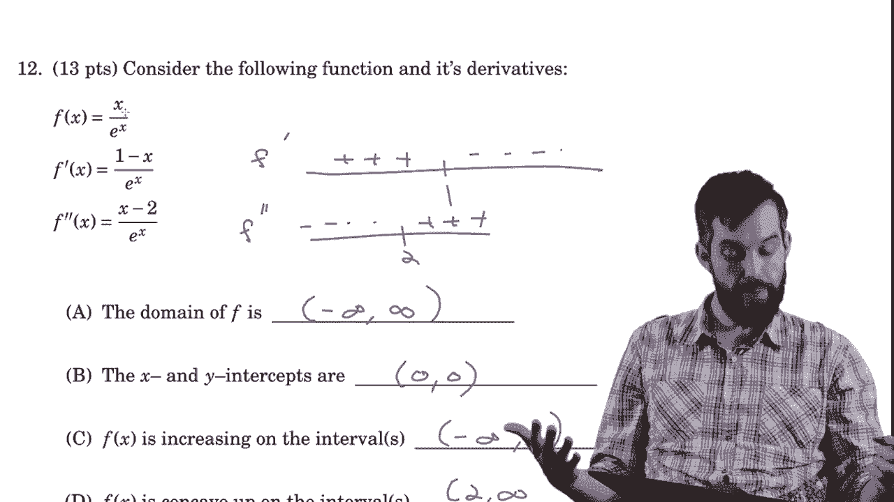

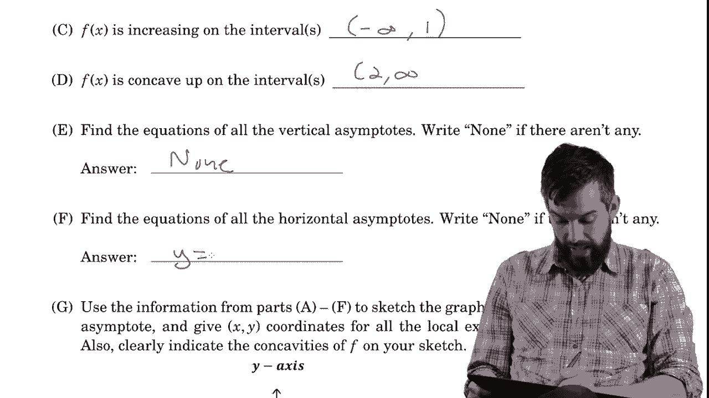

Alright， so let's use all the pieces of information we know and try to graph this thing The first thing I like to plug in is just anything where you've got to actual sort of a point。

 so for example， for x equal to zero， I have that point right there that was going to be the X and Y intercept。

😡，What else did we know Well， we knew that eventually we have a horizontal lasmtat over here。

 so this is going to the value of y equal to zero。 and remember that horizontal lasytat was only from the right。

Okay then we also know that from the left， this is going to be going to minus infinity so sort of as x goes to minus infinity。

 the function value also goes to minus infinity， so we have some sort of you know thing on the left here。

 which is going to be going down as well。Now。What else do I know， We know。

 and I'm going to sort of put this up over here on the top is that we know。From2 to minus infinity。

 that's the portion where it is concave down。And then we know that from minus infinity all the way up to one。

 this is the portion where it's increasing。So we saw those intervals as well。

 So I'm sort of keep those in my mind。 and I know that I have this sort of value of one。

 I can sort of figure out what happens there， and I have this value of  two。

 Those were the two interesting places。 So at2， it was an inflection point。

 went from concave up to concave down。

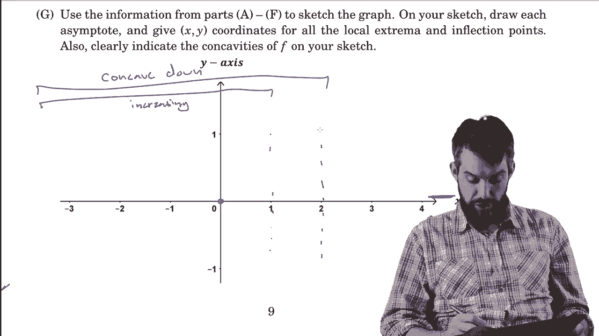

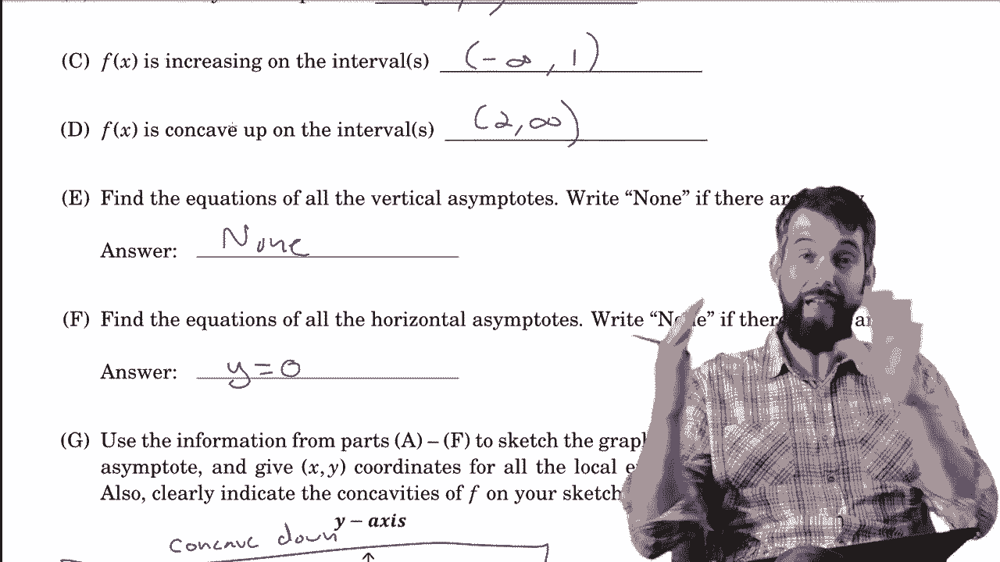

And at one， well， it's gonna to be a maximum goes from increasing to decreasing。

 One other thing I can do is I have this maximum one and this inflection point of 2。

 I can figure out what the heights of those are going be。

 Like if I go back and I try to plug in x equal to1。

 that's the maximum or x equal to2 and I plug it in there。 Well I get， for example，1，1 over E。

 that's a fraction at some number less than1。 And if I plug in 2。

 I get two over e squared Also a fraction less than1。 So I don't know exactly what those values are。

 But I can see that if I have my sort of graph here。 they're both gonna be less than1。

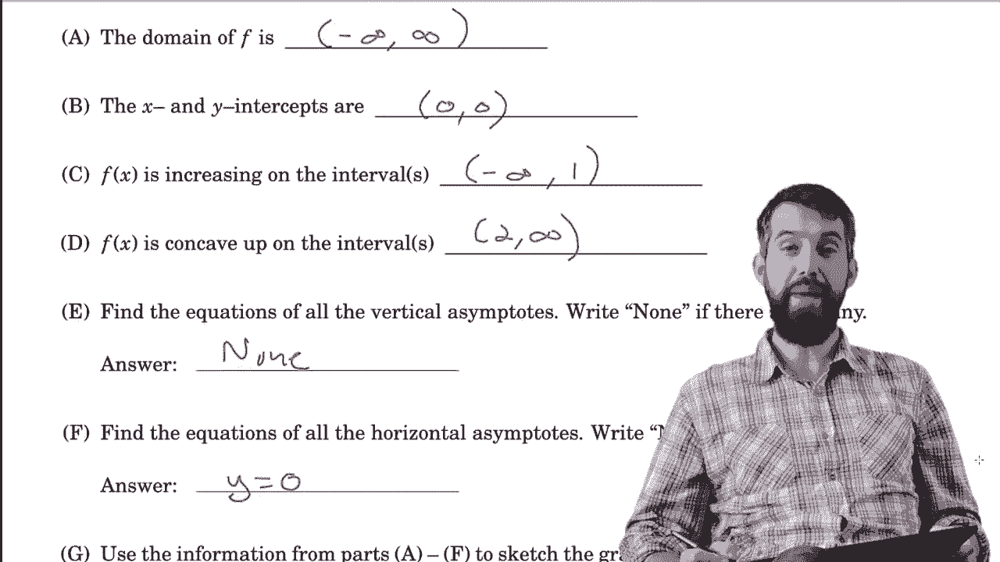

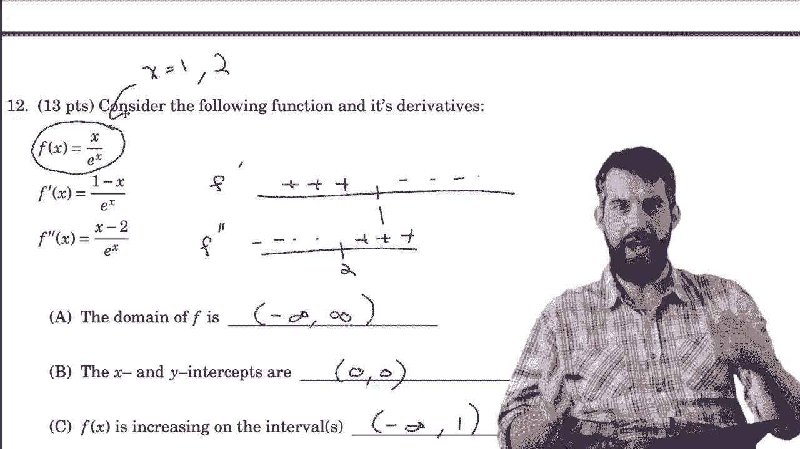

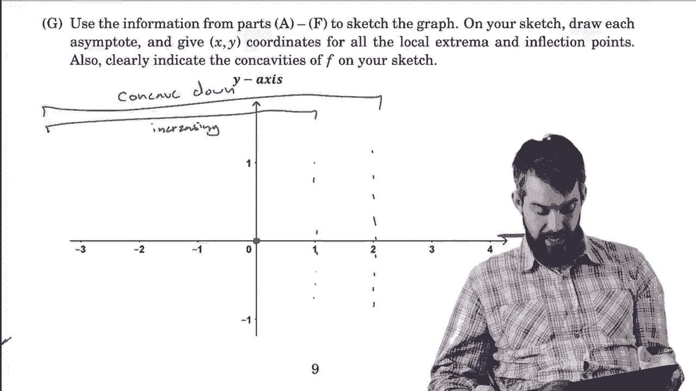

So let's try to put all the pieces of information together。 so we know that going up to one。

 it is increasing in a concave downed way。 so I can sort of take this graph here。

Increasing increase increasing， but con down it goes through 0，0。

 and I'm going to stop it right there and have this maximum some number between0 and one here。

Then I know it is going to start decreasing， but still in a concaved down way。

 So decreasing in a concave down way and at the value of 2。

 it's my inflection point and it switches to being decreasing still But now it's going to be concave up。

 So there's not a lot of room to here because I my heights are kind of low here。

 But I'm going to be decreasing in a concave down way hits the inflection point and now decreasing in a concave up way and to sort of flattens out to go into the horizontal lasytoe at y equal to0。

😊，So my big sort of strategy for these types of problems is plug in the points， you know。

 like the intercepts， like the critical numbers， like the inflection points that gives you a few sort of dots。

 and then you fill in the dots by looking， is it increasing or decreasing and is it concave up or concave down in each of the regions that you're considering。

😡。

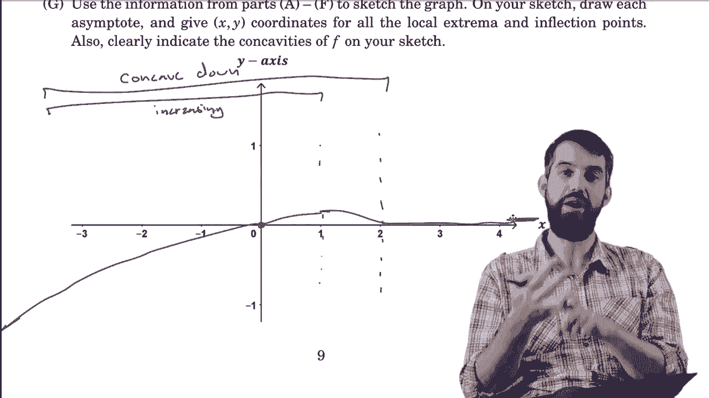