# 【双语字幕+资料下载】辛辛那提 MATH101 ｜ 微积分Ⅱ(2019·完整版) - P10：L10-Choosing what integration methods to use - Part I - ShowMeAI - BV1tq4y1U7Cv

When faced with an integral， often the hardest part of computing the integral isn't actually going through a particular methodology like integration by parts。

 Often the hardest part is deciding which of the various methodologies do we know actually applies to this problem。

 And this is doub the case in trickyier problems that might be a combination of multiple methodologies。

 or it's one methodology， but the methodologyologies is hidden behind some sort of tricky substitution。

 So in this video I want to do two things。 Firstly。

 I'm going to very quickly go over a bunch of more straightforward integrals and mainly focus on the thought process behind which of the different major methodologies that we know is going to apply。

 And then I'm going to finish up with a much trickier integral that I'm going to go to in more depth。

 which is going to combine a bunch of the different methods and try to describe my thought process as I work through some of those trickier integrals。

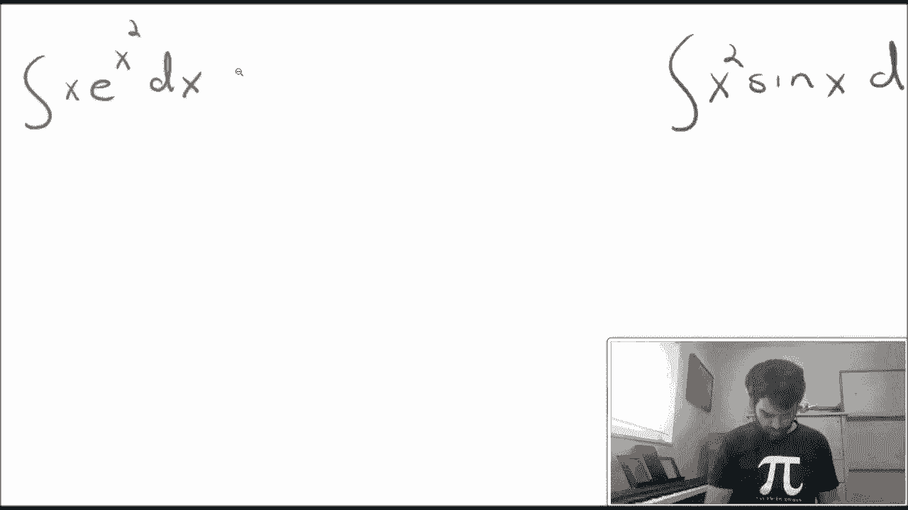

In this first integral， the the first thing that sticks out to me that I notice is that I have a relationship in the polynomial terms here。

 which is just to say that I have an x squared term up here on the top。

 And then I just have a single copy of x down on the bottom。 And to me， this screams doing a useup。

 in particular， I'm going to set u to be the larger polynomial of the x squared。

 And then I have a D U， which is going to be2 x D X。

 And this allows me to transform the integral into the integral of one half。😊，E to the U。

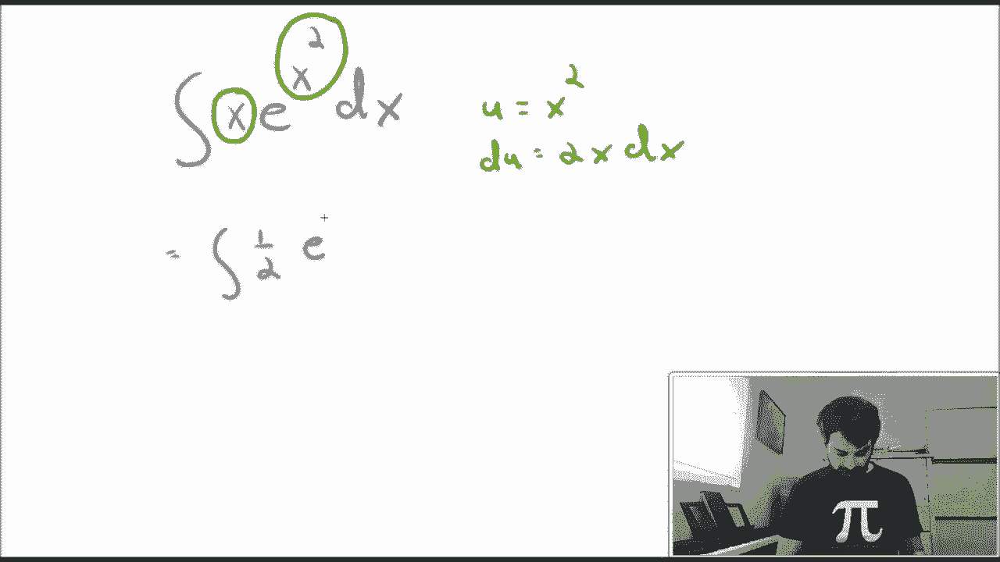

Do you after I've chosen to do a U substitution and it's turned into integral。

 I know how to do just either of you， I can compete with the process and get my final answer。

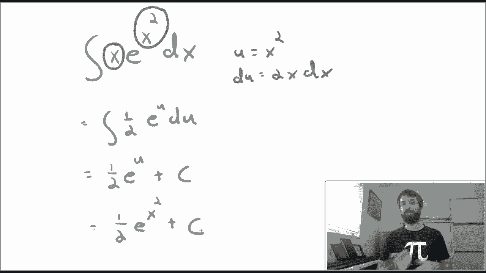

Moving on， let's now investigate the integral of。X squared sine X D X。 And in this integral。

 we have a very similar relationship。 We have a polynomial of degree 2 and a polynomial degree 1。

 We have an x squared， and we have an x。 And they look here and here。

 but somehow the order is backwards。 Now， the U of the tuition doesn't work out because if I try to do this。

 I might have a U on the outside， then I'd have a sign of the D U， it wouldn't make sense。

 the order is backwards。 If it was x sine x squared， I could do the same U sub that I did before。

 but I cannot do it in this scenario。 So instead， I can think of， well。

 this is the product of two things。 So I have a polynomial x squared multiplied。 in this case。

 it's the trig term sine of x， but it could be E to X。 It could be L N of x。

 many different possibilities。 but it is a product of two things。

 One of those two things is a polynomial。 And that， to me screams integration by parts in particular。

 I。😊，that when I have these polynomials， it's often going to be the case that I'm going to set the polynomial to be equal to U and the sine of x dx to be equal to the DV。

And anticipating what's going to happen， I think that integration by parts is going to take the x squared down to a 2 x。

 the sine to a cosine， and so I'm going to end up with an integral that's going to have an x cosine in it。

And that's better。 We've taken the x square down to X。

 but I'm anticipating it's actually going to be integration by parts twice。

1 to take the x square down to X。 and then the second integration by parts to take the x down to one。

😡，So executing integration by parts， once I've gotten down to here， I have another x。

 which I will set as a new U， I have a cosine of x dx， which I am going to set as a new DV。

 and I can execute again to get my x reduced down to a 1。😡，In many ways。

 the details of the execution here was less important than acknowledging that this was going to be an integration by parts question where I was going to have to do it twice because of the degree to polynomial。

 All right，  moving on again。

In this integral， I have a product of s to a power and co to a power terms。

 and I have a whole special methodology that applies in that situation when I've got sine to the n times cos to the M。

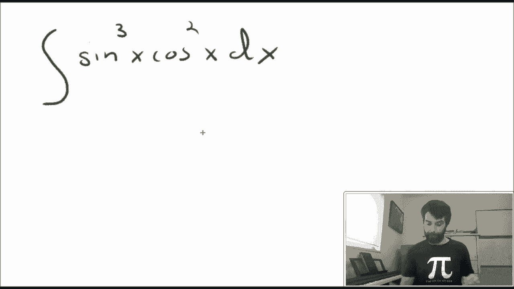

Here I've used the Pythagorean identity that sine squared plus cos squared is equal to 1 to turn it into the form of a whole bunch of cosines times1 sine so I can allow cosine to be U。

 and though a single remaining sine is going to represent my minus du。

This next type of integral is one that we should really start to recognize the particular form of。

 What I want to know here is that I have a something squared minus a number。

 or it could be something squared plus a number or a number minus something squared。

 There's a bunch of different possibilities。 The key part is to have this。

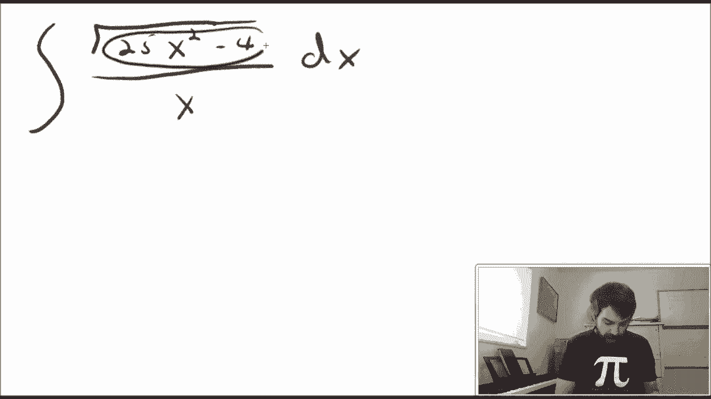

Expression， something like what occurs here in the numerator underneath the square root where I've got something squared minus a number。

 and that to me is going to have the alarm bell that's ringing out and is going to tell me to do trigonometric substitution。

One of my pythagorean identities is tangent squared plus one is equal to secant squared。

 So therefore， seccan squared -1 is equal to tangent squared。 So I think in this case。

 I might be able to manipulate what we have。 We don't have quite secant squared -1 exactly。

 we've got some other weird numbers。 But what I want to have is that the 25 x squared is going to look like。

😊，4 secant squared theta。 That's going to allow all of my different numbers to work。

 And so in particular， what I can say is that5 x is going to equal2 secant of theta。

 or in other words， x is2 fifth。See can of data。And now I've got a trig substitution that should work and is's just a matter of executing it。

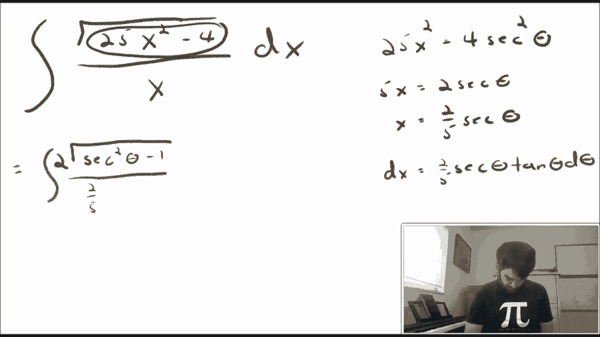

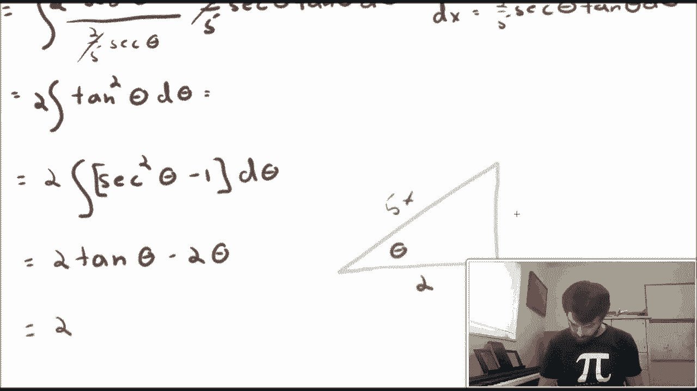

As is usually the case， it actually takes a little bit of a while to execute a trigotometric substitution problem。

 But none， after we have that strategy and we have a reasonable trick up at the start。

 it is just a matter of execution to get down to the end and knowing all little tricks like how to deal with a triangle to do your final back substitution from thetas into X's。

 All right， one more before we get to the tricky one。

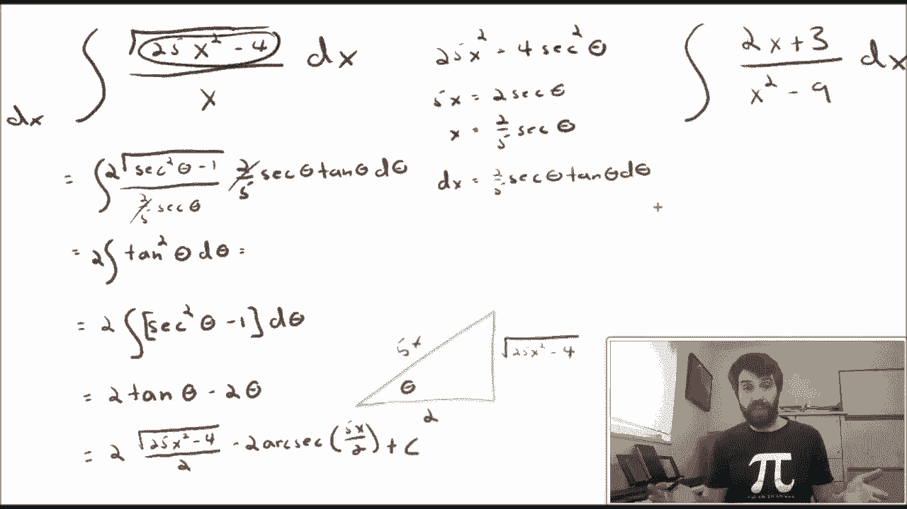

In this example the key thing that I want to focus on is that this is a quotient of polynomials。

 in other words， it is a rational function， there's a polynomial on the top and a polynomial on the bottom and that should be the giveaway for doing the method of partial fractions the opening steps of the partial fraction methodology is to look at my denominator here and try to expand it as a product of linear and irreducible quadratic terms。

 so in this case I'm going to realize that x squared minus 9 can be factored as x plus3。

 and then the method of partial fractions asks us to see whether or not I can write this as a divided by x minus3 plus B divided by x plus3。

And depending on what occurs in your denominator here。

 you might have different guesses on the right hand side。

 but after we do this is's a bunch of algebra to determine what the constants are。

 and then we should be able to integrate。

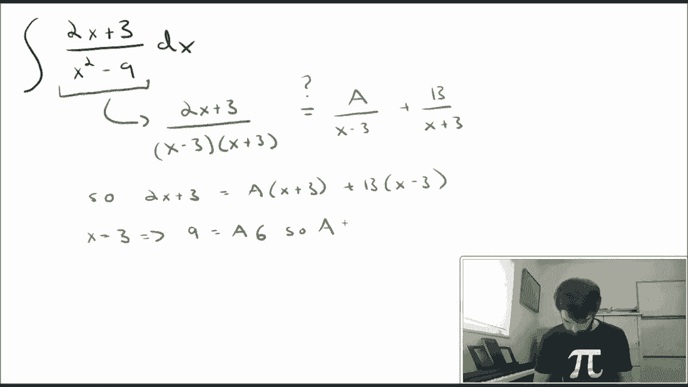

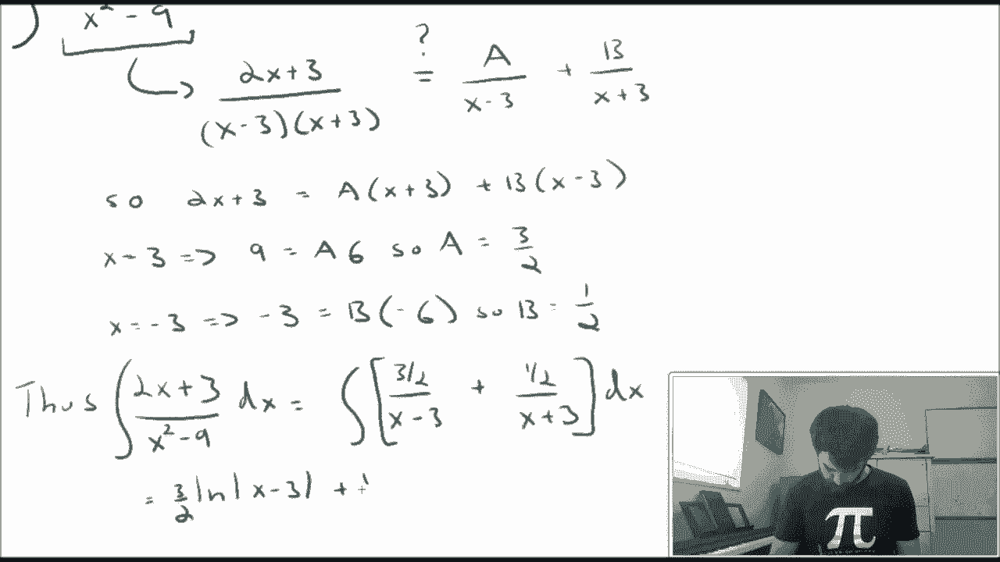

Now the larger point is that it doesn't really matter the details of any particular methodology what the real skill here is being able to look at these different intgrs and cherry pick which methodology is most appropriate for any particular in。

😡，I should also note that it's not the case that there's only one method to do every type with integral。

 Often you can use a bunch of different ways to get a good answer。

 but the key point is to have some strategy， some idea of why you're going in a particular direction。

 And if you can't have that， that's actually also okay。

 if's perfectly fine to do a little bit of playing around a little bit of clever guessing and testing with various U subs until it starts to look like a little bit of a more familiar thing that you know how to deal with。

 Sometimes we do more of a follow our nose through integrals。

 then we do a having a coherent plan right from the very beginning。

 Now that we've seen five somewhat more straightforward examples in the next video。

 I'm going to show a somewhat more complicated example that uses a bunch of these different methodologies and walk through my thought process of how I determine what to use and when。

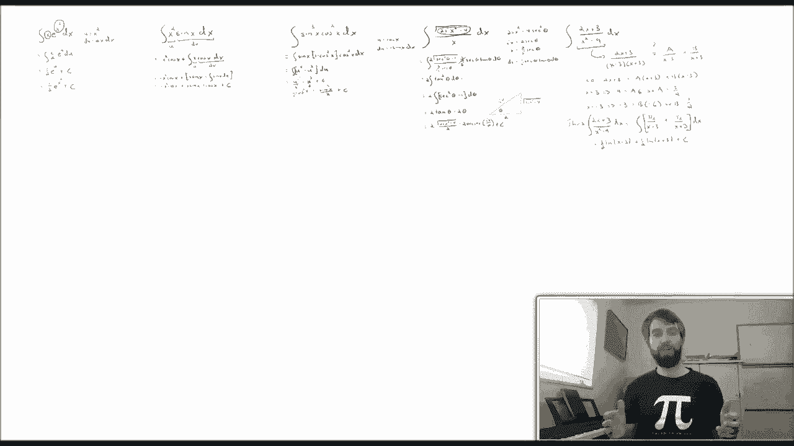

