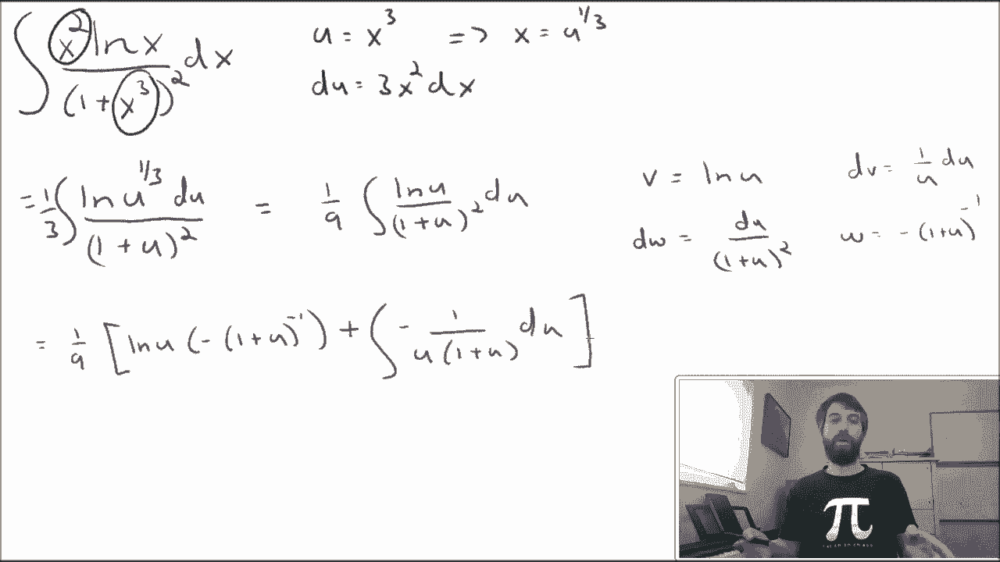

# 【双语字幕+资料下载】辛辛那提 MATH101 ｜ 微积分Ⅱ(2019·完整版) - P11：L11-Choosing what integration methods to use - Challenging Example! - ShowMeAI - BV1tq4y1U7Cv

In this video， I want to look at a somewhat complicated end。

 one that is not straightforward and transparently one of the five different methodologies that we saw of the previous video。

 It's going to turn out that it's going to be a couple of this methodologyologies all sort of combine in one。

 and I want to describe thought process of how I determine which method to apply in any particular place。

First， I'm just going note that the other major methods don't apply immediately。

 This is not a quotient of polynomials because of the Ln of x。 So it's not partial fractions。

 It's not going to be a trig sub because we have1 plus x cubed， not one plus x squared。

 It doesn't have any trig terms。 So it's not going to be some trig identities， at least not yet。

 But the one thing I can look at the one thing that I can sort of sink my teeth into is that I note that I have this x cubed down here on the bottom。

 and I have this x squared up here on the top。 that I have this relationship of a polynomial of degree N and a polynomial of degree n-1。

 and this screams out to me that perhaps I should use either U equals1 plus x cubed or u equals x cubed。

 I don't immediately know which of those two I should use。

 But I'm tend towards U equals x cubed simply because if I do the one plus x cubed business。

 then in my。😊。

L N of X， when I transfer that into use， that's gonna be a little bit messier。

 You're gonna have some sort of difference there。 So let me go and try what happens if I set U equals to X cubed。

 and maybe it's gonna to work out。 Maybe it's not。 We'll have to see。

Well， if I do that， then duu is equal to3 x squared dx。

 and I might also rearrange the top to say that x is equal to u to the power of1 third。

 This is going to be particular useful for the Ln of x， which will now be Ln of u to the power of13。

So let's transfer into use。First of all， I have an x squared dX on the top that's going to be now one3。

 so I'll put the one third out the front， one third D， and I'll leave the DU off to the right。

Then I have an Ln of x， but now the Ln of x transforms to an Ln of u to the power of 1 third。

 all divided by 1 plus u。Squaret。All right。This is getting a little bit better。

 And maybe you'll do one other just a little piece of algebra here。

 which is to note that if I have some log rules， I've got this U to the one third。

 the one third can come out the front because Ln of x to the a is equal to a Ln of x。

 So in other words， this is gonna to be a9 feltt the front。

 the integral of Ln of U divided by1 plus U squared D U。

Now， this LN of view， the natural log of view is one of these things that keeps on and consistently screwing things up for me because again。

 I can't just straightforwardly apply a method like for instancech。

 partial fractions because of its existence。And generally LN of， if I'm able to integrate it。

 it's a bit of a mess， but differentiating LN of U is actually quite nice， It's just one over U。

 So maybe I wanted to do that， maybe want to find some way that I can differentiate LN of and to do that I want to do integration by parts where I'm going to let my U to be LN of U or I new U to be LN of and DV to be this other business that I have around the one plus u squared。

 the one over one plus U squared。 All right。😡。

I'm going to do integration by parts here， I'm going to allow V to be equal to LN of V。

 and then I'm going to give a new symbol here。 W Dw is going to be equal to D over1 plus U squared and I'm using V and W here instead of U and V just because' is already been taken up so I want to have new variables so I'm using V and W for my integration by parts。

😡。

All right， so V is。The natural log of you， then DV is going to be equal to one over U Do U。

And if Dw is D U over1 plus U squared， then my W is going to be equal to1 plus U to the  -1。

 taking that derivative would introduce another minus sign。

 So I need to put a-1 plus 1 plus U to the power of -1。 All right。

 So let's see how this becomes in the integration by parts formula。The one knife。

It sticks out the front Now I want to do v times W。

 so this is going to be Ln of U multiplied by negative 1 plus u to the minus1。Mus。

I'm going to have a negative in here， so I'm going to put a plus two negatives makes a plus the integral。

 Now I want to do W DV。 So this is going to be minus1 over， I've got a U here。

 and I've also got a1 plus U D。

So this was me doing my integration by parts。 And now I've gotten rid of the natural log of U that was sort of tripping things up。

 So I first cleaned it up with a substitution。 that got it rid of some of the extra powers of x。

 Then I need an integration by parts to deal with the L N of x that I didn't want。

 But now what I have this business that remains over here is well。

1 on the top and a polynomial on the bottom。 So it a rational function。

 and therefore integration by partial fractions is going to apply to this。

 So what I want to do is therefore take the integra here。

 and apply the method of partial fractions to it。 I have a1 divided by u times a1 plus u My standard guess。

 This is a product of linear factors is going to be a divided by u plus B divided by1 plus u。

 multiplying by the denominator。 This is going to give me1 is equal to a times1。

plus b times u。And I need to solve for A and B now， so I'm going to set U equal to zero。

 that is going to imply that one is just equal to a。😡。

And U equals to minus1 is going to imply that1 is equal to B times minus1， so B is equal to minus1。

In other words， if I'm going to take this little bit that I have here。

 I can now figure out what this interval is going to be。

 So this algebra is going to allow me to replace the integral of1 over u times 1 plus U D U。😡。

With。The integral of one divided by u minus one divided by one plus u。Do you？

And this is going to be Ellen of you， minus。L， N of one plus you all plus C。

So putting all of this together， I am therefore going to get copying and pasting mostly。

One divided by9。Ln of U multiply by 1 plus u to the -1。

 And then I have a minus sign in front of all the side computation I did。

 So it is going to be minus the natural log of absolute value of U plus the natural log of absolute value 1 plus U。

All finally， plus some constant C。And I'm not quite done yet because I've written my final answer all in terms of U。

 but we had made a U sub all the way back at the beginning。

 We had denoted that U was just going to be equal to x cubed。 So in my final answer down here。

 I need to come and substitute all of my U's for X cubed。 So this is going to be one9th。😡。

The natural log of x cubed。us1 plus x cubed -1。Minus the natural log of x cubed。Plus。

 the natural log of one plus x cubed。 Finally plus C。 So at the end of the day。

 this method really had three different parts to it。 First， we did a U sub to get rid of the X cubes。

 Then we did an integration by parts to sort of clean up the natural log of x。 and finally。

 we finished it off with an integration by partial fractions。

 And it's worth noting that I didn't know we were going to get to a partial fractions at the end of this example。

 It happens to work out that way， or at least I wouldn't know if I'd seen this problem for the first time。

 So part of this is coming up with an initial strategy， your initial substitutions。

 And then you sort of follow your nose and you apply methods as they reveal themselves further along in the computation。

😊。

