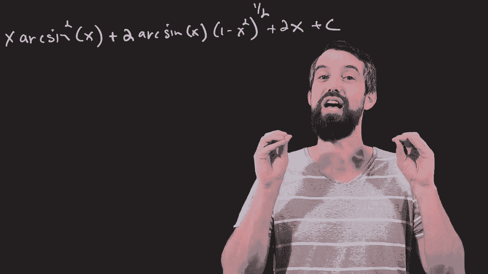
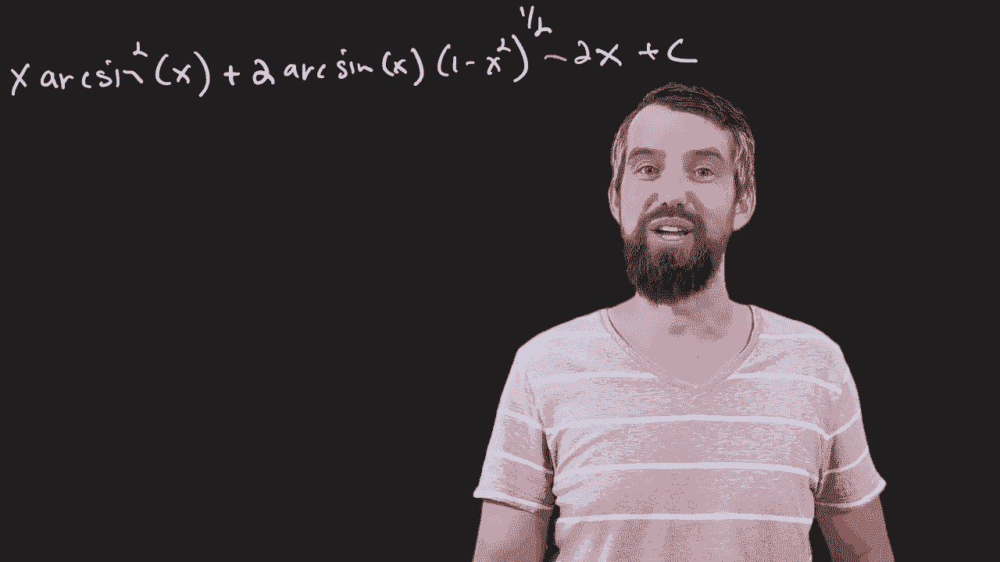
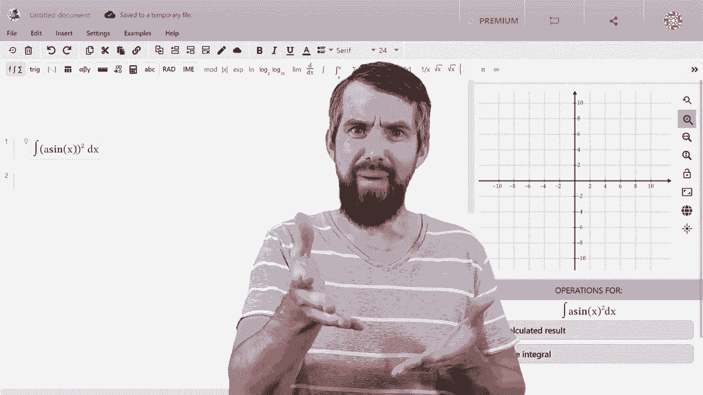
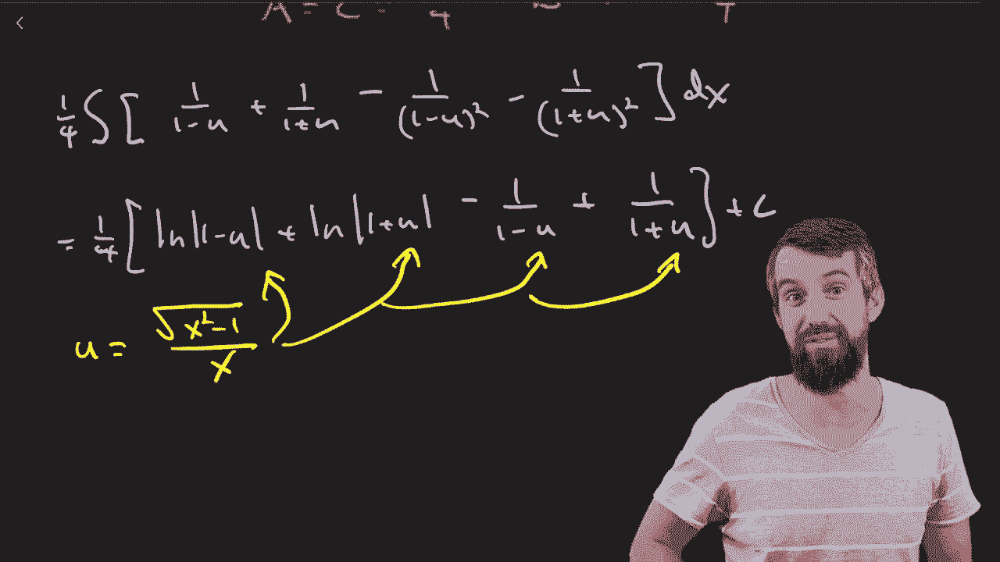

# 【双语字幕+资料下载】辛辛那提 MATH101 ｜ 微积分Ⅱ(2019·完整版) - P12：L12-MATH PROF vs TRICKY INTEGRALS - ShowMeAI - BV1tq4y1U7Cv

As a math professor， I always like to make sure that my math superpowers are nice and sharp。

 I actually haven't taught firsty calculus in a couple years now。 So I want to find out。

 can I even do integrals any longer。 All of the integrals that we're gonna do today。

 have a little bit of spice to them， but still ultimately， I believe if I'm correct。

 will be able to be done by first year calculus methods and don't need any sort of more complex tools like contour integration in the complex plane or anything like that。

 So feel free to follow along， try the problems yourself and see if you can get to the same answers that I do。

 I'm going to begin here with this one。 This is the integral of arc sign squared of X。

 How do I even begin on a kind of tricky integral like this。 Now， when I look at this。

 there's not a lot of mess to it。 So of this one thing arc sign that it happens to be squared。

 So sort of simplifying substitution。 a U sub doesn't automatically apply。

 There's not some oddlylies as algebra I can do。 There's not any obvious the sort of trigoometric identities that I can apply。

 I just have this particular。😊，In and it somewhat to my eye。 Let's see if it works。

 Scs out that integration by parts is gonna work。 I'm going to say that the arc sine squared of x is going to be U and then the dx is going to be a Dv。

 and the formula that I'm going to try to use is that the integral of U DV is equal to u times v minus the integral of V D。

 That's the integration by parts formula。 I specify the U。

 And thus I can figure out what my D is going to be is going to be two times arc sine of x。

 And then by chain rule， the derivative of the inside。 the derivative a signine。

 And I do know what the derivative of a signine of x is one over square root of1 minus x squared。

 can imagine some restriction on the domain， but nevertheless we have this result。

 If Dv is just going to be dx， then I can say it pretty easily V is just going to be equal to x。

 so I'm going put those things into my formula。 So this tells me that it's going to be U times v。

 which is X times a sign。Squared of x。And then I need to subtract off the integral of the du U。

 So I'm going to subtract off the integral of I'll put the two on the outside。

 and then it's going to have an x up here。 and then finally arc sign of x。

 all divided by square root of 1 minus x squared and d X。 Now， with integration。

 you sometimes don't know whether you made a lot of progress or you haven't made a lot of progress。

 I look at this new tricky integral。 And it's got a sort of messier。 but perhaps it's quite nice。

 And I think it is here。 because if I look at the x and the one over square root of1 minus x squared。

 that I can actually integrate。 I can integrate it with the u substitution。

 So I'm going to call this part in a new integration of by part。 Now to confuse my old one。

 I'll call that one Dv。 And then the arc sign portion。 that's going to be my new U。

 And let me try and write down therefore what D is D is going to be one over square root of1 minus x squared dx。

 This reminds me I forgot a dx might。😊，Earlier formula， all that in。

 And then what about for V to integrate this one， I'm going to treat one minus x squared is one lump。

 No would call it U substitution。 maybe I'll call it a w substitution。 I'm already using U。

 But either way， it's the one minus x squared to the negative1 half。

 And then the x that I'm going need from the derivative of the inside that thankfully appears up on the top。

 And so if I put all this together。 then I'm going have a one minus x squared to the power of one half。

 I need to multiply by a2 because when you differentiate the power of one half that would bring it on one half。

 So I need a two to multiply that。 But then there's also a minus2 x from the inside So the twos cancel and I actually just have a minus sign。

 Okay so with that， I can now come all the way back down here and let's see what happens。 well。

 the first doesn't change x a sign squared of x。 I see I have one minus sign up there。

 I have a second minus sign down there。 if I put both of those together。

 I therefore get a plus times2 of U Dv。 So that's gonna be。

Arc sign of x multiplied by  one minus x squared to the power of one half。 And then finally。

 I'm going to have my  -2， and I have due to the integral of V D U。 What's the Vdu U。

 There's another minus sign。 So will become a plus now。

 square root of1 minus x squared up on the top here。 And then the D U is going to be， well。

 look at this square root of 1 minus x squared on the bottom D X。

 that is wonderful because that just cancels。 And so this whole thing here is just going become x。

 So the final answer will just be all of this。 But get rid of all that nonsense。

 And I can just put in an x。😊，And， of course， always important。 your final plus C。 All right。

 So that's our first integral done。 actually really wasn't so bad。

 It was just integration by parts twice in the end。

 It was just recognizing you how to use integration by parts because I could take the derivative of arc sign。

 and that was sort of all that I had in my integral hand。 It just made it pretty reasonable。 Now。

 I did that。 I think correctly。 But I very well may have made a mistake。

 So what I want to show you is my favorite app for actually solving integrals to show you what the answer is。

 and even all the steps to get there。 And that is the sponsor for today's video。

 which is maple calculator。 This is an app that you can download on your phone or your tablet。

 You take a picture of your hand drawnrawn equations or you can type it in。

 And maple calculator figures out that it is an integral。

 It tells you what the answer to that integral is。 It does it。 And more importantly。

 it shows you how to do it。 if you click the step buttons。

 It's gonna to show you a step by step process to evaluate this integral。

 And many other types of integrals and many other types。😊。

Of math problems。 This is what it looks like on my iPad。 And if I actually check out the solution。

 I think Ive made an error。 it says2 x。 Oh， and I did I put plus 2 x down。

 I see I missed the final negative when I did my final integration by parts。

 minus V to you as it supposed to be。 But let's imagine I didn't know how to do it。

 The favorite part is you click the steps button， which says show me how and it's actually going to tell me exactly all the different steps。

 And you can see it there's a couple different integration by parts。

 you can expand what one of those integration by parts are and it's gonna to tell you all the different steps you can follow along。

 if you're on a browser as opposed to your phone or your tablet， you can actually go to maple learn。

 this is their browserbased solution。 very similar to my calculator， but actually even more powerful。

 and it's gonna tell you all the steps to be able to solve these as well。 Now to be clear。

 I still think that there's a lot of value and being able to do integration by hand to have a lot of procedural fluency edit。

 It's just a really fun puzzles。 So even though there's these。😊。

Incredibly powerful tools to help you Any tool can't solve every type of integral。

 And in building up our skills will allow us to understand and interpret the results that computer systems like these are gonna give us。

 So it's important to still be able to sharpen those knives and do your integration basics。

 even though we have things like maple calculator and maple learn。

 regardless links are down in the description for both of those。

 So I definitely encourage you to check them out now， to the next。 This integral is a bit of an1。

 So when I first thought about it， I saw some tan squares And I thought， okay。

 I'm definitely do some tri identity here and everything's is gonna to work out and be really easy。

 But none of them actually work out very nicely。 they just allow you to convert it to other also seemingly challenging integrals。

 So I had to find some way to sort of clean it up。 And that makes me think I should do some type of U substitution。

 There's a couple candidate。 maybe U is tan of x or U is tan squared of x or I do110 squared of x。

 But if you use something like 1 squared。 its derivative is gonna be like 20。😊，And secant squared。

 it's getting messier and not simpler。 So let me try U is equal to tangent of x。

 And let's just see what happens if I do this substitution。 Okay， if I take D。

 this is going to be equal to secant squared of X D X。

 And this is nice because I do know how to relate secant and tangent。😊。

This is because one of the three Pythagorean identities is that 10 squared plus 1 is seccan squared。

 So this seccanant squared can really just be written as 10 squared plus 1 Dx。

 And that's convenient because I just said that tan0 of x was U， right。

 So this is the same thing as U squared plus1 Dx。😊，Okay。

 so that is quite promising that when I can take the derivative。

 I can get back my substitution inside of it。 So let's see if we can plug it in and I don't know。

 maybe this is going to be kind of nice。I can take an interval。

 And what do I have Well I have a one over one minus u squared， that's the 1 minus10 squared。

 But then when I take dx and say that that's equal to do U divided by one plus U squared。

 I'm going to have that factor as well。 So one over one plus U squared， all of that times D U。

So in some ways， I'm doing better that I have the sort of multiplication of two things。 That's nice。

 It's no longer got any trigonometry on it。 It's just a question of how do I deal with this rational integra。

 And for that， we have a different method that screams out to what which is。 Are you ready。

 partialial fractions。 Of course。 That is when I look at this inte。

 I don't immediately know what its integral is， however， if I stew this method of partial fractions。

 I can convert it into one over linear terms or one over quadratic terms。

 both of those I know how to integrate。 So this is actually a quattic on the bottom the U square times the U squares me a1 over U to the fourth is the highest power。

 But if I can separate that into partial fractions， then I should be golden them。 specifically。

 the question is going to be， can I write this as some a divided by1 minus u and some B divided by1 plus U。

 That's taking this first thing noting1 minus U squared is like 1 minus u 1 plus U so that I'm separating it out。

 And then finally。😊，Plus C U plus D divided out by one plus U squared。

 One plus U squared is an irreducible quadratic。 I can't factor that one into a product of two linears。

 It's okay if you want to skip this partial fractions bit actually。

 it's okay if you want to type the partial fractions into maple learn or maple calculator and let them evaluate it for it。

 I'm gonna do it pretty quickly here。 So let's just take the time lapse。Alright。

 so I came in here to my partial fractions， and I plugged in u equal to -1。

 which makes lots of nice terms disappear there， and u equal to 1。

 which makes lots of nice terms disappear there。 And I also did 0 and 2 as well。

 And I got that these four values for the A， the B， the C and the D。 Now。

 I can plug all these into my integral。 And then I should be able to evaluate that pretty simply。😊。

One of the things that makes partial fractions so nice is that I just get these linear or quadratic terms in the denominators after I execute the algorithm。

 And And that's really useful because I know how to integrate over those。

 like one over one minus U is just going to be， well， one quarter。

 And then it say logarithm of1 minus U。 and likewise， for the one over4 the logarithm of1 plus U。

 So those are really nice。 And then one over one plus u squared for these quadratic ones。

 They're often related。 Sometimes you have to complete the square。

 but we don't even have to do that here。 They're often related to arc tang。 So in this case。

 it's just going to be one half。 And this is exactly， it's just arc tangent of U directly plus C。

 final step。 we have to do this every time。 take those U' and put them back in terms of x's。😊。

The first two terms were easy。 I just did U equal to 10 x。

 but now I have arc tangent of tangent of x which just becomes x。

 So there's going to be x divided by 2 plus C。 This is actually only true when you appropriately restrict the domino X。

 No worries。 So all right， second method down here， ultimately。

 partial fractions was the thing that did the trick。

 But it was all about getting the right U substitution at the beginning that converted it into just being a partial fractions problem。

 Now， this integral has a lot of weird square roots。 And as you well know。

 square roots just really screw up a lot of ins。 So what can I do。 Often when I have a square root。

 I try to make the inside of that be just a U substitution， like， say U equal to x plus1， but。😊。

There's two different types of square roots appear in here。 If you try to make one of them that you。

 than the other one sort of just stays being messy。 I can't clean up both of them at the same time。

 I could divide out by either square root of x plus1， or I could divide out by square root of x -1。

 Those are options。 but an option that I like， I think best。

 And I think every time I see whole bunch of square roots is just to find the radical conjugate。

 What this is， is， let me just erase my D X for a moment。 I'm going to come up here。

 I'm gonna multiply by a very funky version of1。 and this is just sort of I have a bit of pattern recognition。

 integrals that have these kind of square roots who often try this little algebraic trickery。

 So the funny version of one that I'm gonna multiply I on the top。 It is square root of x plus one。😊。

inus square root of x plus 1。 And on the bottom is the exact same thing。

 square root of x plus 1 square root of x plus 1， all of that。

 And then I have my original Dx now stuck to the right。

 So I haven't done anything because I'm just multiplying by one。

 The same thing on the top on the bottom。 But what's relevant here is that in the bottom。

 it's the exact same expression， but I alternated the sign that gives us our conjugate here。

 And the reason I do this is it's gonna make my denominator really simple when I multiply it out。

 Indeed， if I do this。 Okay， let's do the denominator first， because that's gonna be nice。😊，Well。

 the first two terms are going to multiply out and just be， well， x plus1。

Then I have two cross terms that takes things that look different。

 One gets a plus 1 gets a minus They both cancel。 And then I get this square root of x -1 terms that multiply together。

 They get a sign。 And then it's going to be an x -1。 and that could all just be canceled out。

 And we could just replace this with just two。 The denominator here is just 2。

 See how nice an algebraic trick makes the denominator。

 It's not going to be quite so nice on the numerator。 But that's going to be okay。

 because what happens here。 So if I first look at those two terms。

 this is going to become an x plus 1。😊，If I look at the final two turns。

 So this is going to be minus minus is plus again。 So this is going to be a。

So that's going to be plus an x-1 this time。 So very similar， but slightly different。

 the plus1 and the -1 cancel。 and then we're going to switch it to2 x。

 And then we have the cross terms， but the cross terms don't cancel this way。

 So what we're going to have is a-2 times the square root of x -1 times the square root of x plus1 all of that dx。

Okay， so the hard part here is just over there。 The denominators nice。

 the left hand side and the numerator。 that's going to be nice Nothing to worry about here。

 What we have to deal with is this portion that's circled。Now。

 because that's multiplication of the two radicals opposed to added together。

 this actually is a little nicer than it was before。 I mean。

 what I could do here was treat this as just square root of x-1 x plus1 all underneath the radical。

 And then that cleans up a little bit。 This is just the same thing is square root of x squared-1。

 Okay， that is something I think I know how to deal with。

 So I don't know I'm feeling a little bit happy。 So let's just do the parts of the integral that we know are easy。

 I've got a two x on the top divides out by the two just become an x on the top。

 that's gonna to be integrate and just leave me with an x squared divided by 2 for the second term I have through on the top and the bottom。

 Those just cancel I have a minus sign。 I'm gonna to be subtracting off The integral of square root of x squared-1 D X。

 That's gonna be my answer。 if I can figure out that。 Okay， now challenge time again。

 square root of x squared-1。😊，This one is a trig substitution。

 And my heuristic for this is just that any time you have things that are involving little quadratic terms like x squared plus or -1 or or one plus or minus x squared。

 Those quadratic terms look a lot like the kind of Pythagorean formulas that we have for all the trig expressions。

 So if you introduce some trigonometry here， you can take advantage of that。

 And the specific one that we want to formula 4 is going to be x equal to which one's going to work。

 not tangent C cant。😊，Of theta。The reason for this is that secantant squared of theta -1 is 10 squared。

 So playing around with a sequence squared， -1 is going to work really nicely。 If it was plus one。

 you'd have to choose something different。 Okay， so let's continue if that's x than our d x。

 the derivative of secant last time I checked was secant of theta tangent of theta D theta。

 And so if I plug this in。 well， nothing happens to the x squared divided by two， of course。

 but I do get an integral of well， square root secantant squared of theta 1 times secant of theta times tangent of theta D theta。

 all that right stuff just being d X。😊，I get to use my tri identity。

 but sec can squared minus1 is just 10 squared square root or 10 squared is just 10。

 And then that allows me to rewrite this x squared divided by 2 minus the integral of tangent squared1 from the first one。

1 from into the D x times secant of theta d theta。 Now when I analyze 10 squared seccan。

 Unfortunately， there's not a lot that jumps out at me。

 as in I can't set you equal to tangent or you equal go a secant。

 neither of those sort of becomes trivial。 So I'm actually to convert it to sine and cosines。

 which sometimes is a little bit easier and see what I can do if I do that。

 So namely I'm going to rewrite this as x squared divided by 2 minus the integral of10 is sine over cosine。

 So there's a sine squared on the top sine squared of theta。 then on the bottom。

 there's a co squared coming from the10 squared， another cosine from the sec。

 which is one over co So it's a co cubed on the bottom。

 but I know that the pythagorean identities work really well。😊，Even powers of s and cosines。

 So I don't want co cubed on the bottom。 Instead， I'm going to come here。

 and I'm gonna put cos to the fourth of theta。 I can't just do really nily。

 I have to come in and cancel that。 So I'll put an extra co on the top。

 that gives me the co to the fourth on the bottom。 D theta。

 And now I think this is gonna work out a little bit nicer because I can do a little u sub here。

 if I set u equal to sine of theta。 Well， then I have the D U sitting right there。

 which is nice and convenient。 That's what that cosine is gonna do。 But in particular。

 in the denominator， I know that co squared is like1 minus sine squared in this case。

1 minus u squared because even powers I can do that twice。 And so what this is gonna give me is。

 well， the normal x squared divided by2 minus the integral of U squared D。

 that's what happens on the top。 then on the bottom。

 the co squared becomes1 minus sine squared Aka1 minus U squared。 And then all of。😊。

That is squared because it's co to the fourth on the bottoms of two different copies of co squared。

 And this is much nicer for us because this is a rational function。 And we know how to do with that。

 That is gonna be partial fractions。 So okay， let's try to figure out what that's gonna be。

 I want to take this in。 And I want to write it as a divided by1 minus u。

 I'll note that1 minus u squared can we written it as1 minus u times 1 plus u。

 So I've got an a over1 minus u。 And then because it's repeated， it's all this squared。

 there's also a B over1 minus u squared。 This is how we deal with repeated linear terms when we're doing partial fractions。

 Then I have a C term divided by1 plus U。 And finally a D term because it's repeated one plus U squared。

 I got an A A B and a C and a D， I have to solve them again。

 I'm gonna not put you all through it all like this。😊，I have to do it。 So let's put the time lapse。

 And I'll get those values for A， B，C and D。 or you can probably and try to figure them out yourselve if you're so inclined。

 Allright， so I've done a little bit of investigation here and A and C。

 it actually works out very nicely is just gonna be one quarter。

 And B And D is just gonna be negative one quarter。

 So what that means is that I'm trying to find the answer to I'll put this one quarter all the way out the front of one over one minus u plus1 over1 plus u and then one over one minus u squared and one over1 plus u squared。

 That's what I'm trying to integrate。ops forgot minus sign let me put them in there minus10 minus and the real beauty here is because they're all one over linear1 over quadratic。

 I can integrate all of those。 That's why partial fractions is just so nice。 Okay。

 so this gives me one quarter。😊，of logarithm of one minus u plus logarithm of one plus u。

And then plus one over one minus u。 if I take this derivative。

 that would give me a-1 and then another-1， oops， I got my minus is incorrect。

 it is supposed to be a minus sign there。 And this is the one that's going to be a plus plus one over one plus U。

😊，Oh， that's gonna to have a plus C。 Now I'm close to be done。 But the problem is。

 I've got it in terms of U。 I want it back in terms of the original。 I want it back in terms of x。

 So let's try to remember what it was that u is equal to U was equal to sine of theta。

 but theta is not equal to x。 So what was theta。 So sine of theta is what I'm trying to go to。

 here's what c canant of theta is。 And so the standard trick here is you draw a triangle and you say。

 okay， look， our definition is that sec canant， which is one divided by cosine is going be x。

 So let's say cosine of x would be like one over here and x dividedta by the。

 This would give cosine theta is1 over x and thus sec canant of theta is just equal to x。

 So by pythagoras， I I want to complete the other side of this。 this is going to be x squared minus1。

 And then that would work。 So if U is equal to sine of theta， sine of theta is going to be。😊。

The opposite over the hypotenus， then all the way back down at the bottom here。

 I can use the substitution that u is equal to square root of x squared minus1 divided out by x。

I put this into every single one of these spots here， everywhere you exists。

 and that is my final answer。Now， you can go check this if you so wish with Male calculator or Male learned。

 but I do want to caution the one little thing about any of these computer algebra systems is that sometimes when you integrate。

 they may use a different set of steps than we did。 because of so many tri identities。

 the result can look different than your result， which doesn't mean that you're wrong。

 And the real test for this is you can take your result and differentiate。

 use the maple calculator or maple learn to do the differentiation to save you the time if you so wish。

 But if you can differentiate and get back to your original answer。 then you're correct。 All right。

 I hope you've enjoyed this little review， I suppose on integration， some fun integration problems。

 if you like this video， please do give it a like for the YouTube algorithm。

 if you have any questions or you to find any mistakes I made in the video。

 lay them down in the comments below and we'll do some more math in the next video。😊。

