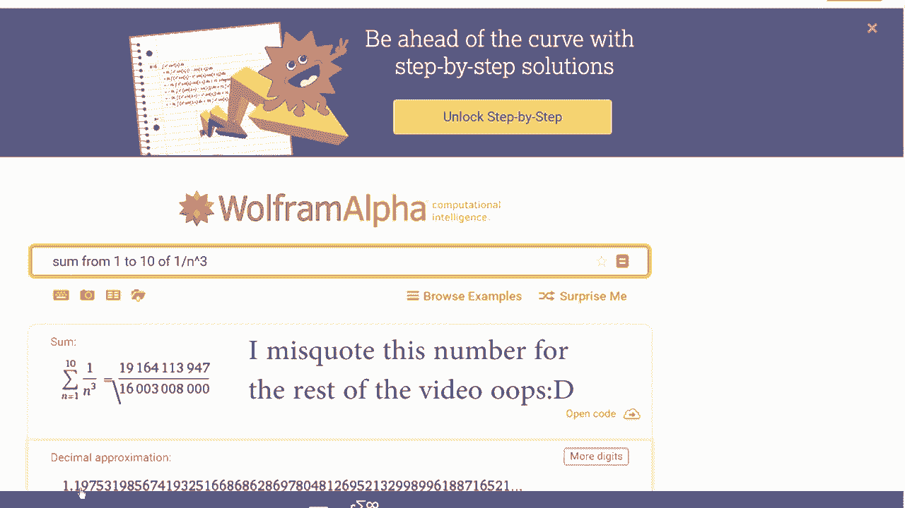

# 【双语字幕+资料下载】辛辛那提 MATH101 ｜ 微积分Ⅱ(2019·完整版) - P24：L24-Estimating the Remainder of a Series Approximation via the Integral Test - ShowMeAI - BV1tq4y1U7Cv

Consider this particular series the sum of the AIs。 And I've written it out in a bit of a funny way。

 I've read an A1 A2， a3 as normal。 But instead of just writing dot dot dot。

 I go a1 A2 all the way up to A N。 And then I write A N plus1。

 and it keeps on going A N plus 2 A N plus 3 n dot dot dot goes on forever。

 ast I've sort of pulled out the A N turn and written it explicitly。 Now。

 the reason I did this is that I want to talk about the n partial sum。

 and the n partial sum is just the sum of the first n terms。 indeed。

 when we define what it meant for a series to converge。

 what we talked about was that if the limit of the partial sums goes to a limit L。

 that's what we mean by a series converging to that value of L。

 So this n partial sum was very important to us。 But what about everything else。

 Like the partial sum goes up to A N。 Let's give a name to A N plus 1 all the way to the N。

 and I'll call it the remainder。 the。😊，Or subm。And then if I want to use sum major notation instead。

 I can sort of collapse this down to saying that the Sn here is the sum from one up to n and the remainder is a sum from n plus1 all the way up to infinity。

 We sometimes say that we're breaking the series up into a finite portion。

 the partial sum and then this infinite tail， the n plus1 all the way to infinity。 Indeed。

 I can rearrange this one more time， if we wish and we can say that the remainder term is the entire series subtracted off the partial sum。

 So the question that's really going to motivate us is how socal big is this error term。

 this remainder term。 Indeed， imagine you go when you compute out S 10 or S100。

 or you have a fast computer and you compute out S 1 million， you add out the first million terms。

 a computer can do that。 So then the question is you've got some value and is that value really close to the thing it converges to。

 or is it really far away。 And indeed， the answer to that question might depend on your specific discipline。

 what the standards and uncertainty that。You're allowed to have in your specific discipline。

 But we're going to try to come up with some formula that tells us how bad is this remainder term。

 How bad is our estimate going to be if we approximate by just taking， say， the 10 partial sum。 Now。

 the way we're going to talk about this is quite related to the integral test。 Indeed。

 I want you to consider some function that I have here in F of x。

 and I have a corresponding sequence which gives me points on that curve。😡，Notice， by the way。

 that I haven't put the Y axis on the graph。 I'm starting some ways out。 I'm starting at n。

 and then I'm going n N plus 1 n plus2 and so on。 I haven't shown you anything between1 and N。

 I'm only showing you n and so on。 Now， for these rectangles。

 I'm going to use a right end point to define the height of them。

 So on the interval from n to N plus 1。 The， the height of this is going to be A N plus 1。

 The width is one and so what you get is that the area of the first rectangle is A N plus 1。 area。

 the second one is A N plus 2。 A N plus 3 and so on。

So now what I have is this relationship between this geometric concept and my series。

 I can talk about the remainder， which was the series， but from n plus1 up to infinity。

 that's the area of the rectangles and the way I have drawn it with this positive decreasing and continuous function is that the area of this rectangles of the remainder is less than the improper integral from n up to infinity。

 so I have an equality here。😡，Okay， I want to do the same trick。

 But on the other side to get a different inequality to bound the remainder in the other way。

 So now what I'm going to do is not this， but I'm going to do left end points instead。

 And what this does if I do left endpoints it makes all of my rectangles bigger。

 The first one has an area， A N。 The second1 AM plus 1 is third A N plus 2 and so on。

 But if I look at my remainder formula。 My remainder formula only starts at A M plus 1。

 So this first rectangle that I've drawn。 the one with area A N。

 let's just get rid of that entirely because I just don't care about that。

 I care about starting A M plus1。But now， if I look at this series。

 this series is all bigger than the integral starting at n plus one up to infinity。

 So I have an inequality on the other side， namely that this remainder term is bigger than the integral from n plus one up to infinity。

 So it's， in a sense， squash， it's got the integral from n plus one up to infinity on one side。

 the integral of n up to infinity on the other and the remainder sits there in the middle of it。

 So this is a bound。 It tells me how bad could my remainder be。 Well。

 it has to be bigger then and less than these two different integrals。

 So if I want to estimate on my remainder， how bad it might be。

 I can compute these integrals and that doesn't tell me what my remainder is exactly But it gives me a reasonable bound that I can use to see whether my estimation is good enough for my particular application。

 So as an example， let's consider this series， the sum from one up to infinity of one over n cubed。

 Now， I know this series converges。 Indeed， if we go back to the first video on the。😊，In test。

 This is just a P series and the P series converges here because I relate it to the P integral1 over x cubed where P the3 here is greater than1。

 And so that we know this improper integral converges and so2 does the series。

 but what does it converge to we don't know the integral test only tells us doesn' it converge or does it diverge。

 It doesn't tell us what it converges2。 So let's suppose we go away and we compute the value of S 10。

 Okay so let me say that we go away and we're going to compute manually via a calculator via a computer the answer to S 10。

 the10th partial sum to compute this value of S 10。

 I'm going to go to a very useful website which is Wolf from alpha and Wolf from alpha is a calculator on steroids that allows you to compute an enormous number of things and it interprets what you say in a relatively clever way。

 So for example， we want to do the sum and we're doing this from the value of one up to 10。😊。

If I want to figure out the S 10， the10th partial sum and then of what function I doing1 over n cubed I hit enter and it's gonna to go away。

 It's going to think about it for a moment and it spits out that the value approximately is 1。198。

 And so that is the value that I'm going to use for my S 10 So we've got this approximation S 10 is approximately 1。

196 Now what about the remainder So by this business of comparing it to an integral。

 the formula we've got is that R 10 the remainder when you take 10 terms is something smaller than the integral from 10 up to infinity of 1 over x cube D I can do that integral。

 So let's just go and consider just that integral first it's an improper integral。

 So instead of the infinity， I have to pull it out and talk about a limit as t goes to infinity where I've got this integral from 10 up to t I can do this particular integral is just a power rule。

 So I keep the limit out the front and I integrated， I get1 over2 x squared。

I'm going to plug in the T I'm going to plug in the 10 and then because the T's in the denominator。

 if I take the limit as t goes to infinity， the first term goes away I just up of a second that is I just have one over 200 So that what tells me a bound on my error The remainder is something smaller than one over 200 So what do I know I'm beginning here with this example。

 the series that is adding up one over rank cube。😡，I have done the S 10。

 So my approximation by adding 10 terms。 and I've gotten the value of 1。196。 And then I asked。

 how bad is my remainder of my remainder is less than 0。005。 Now， my series is one of these positive。

 decreasing ones that requirement that makes all of this stuff work。 So in that case。

 as I add more terms。 if I added some terms from the remainder in， it would only get bigger。

 So what can I actually say about my final answer， The actual series。 Well。

 it's the approximation of the 1。196， the S 10。😊，But then it might be a little bit more than that。

 It might be all the way up to 0。005。 more than that。 That's what my remainder is going be。

 So I don't know exactly where it lies in that 0。005 range。

 the remainder estimate doesn't tell me that is just an estimate。

 But I do know that the series is less than the 1。196 plus the 0。005。 Now。

 whether that was good enough for your Pacific application would depend on what your application was。

 what kind of uncertainty or error was permissible。 But if you didn't like it， you could go better。

 instead of computing S 10， you could go and compute S 100 S1000 S1 billion if you had a really fast computer。

 that it all be something that you could choose to do and your remainder therefore would get substantially better as well。

 So you could get as accurate as you pleased with this kind of method。

