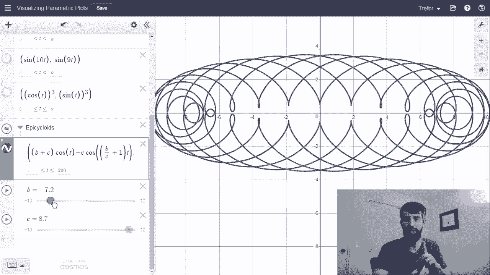

# 【双语字幕+资料下载】辛辛那提 MATH101 ｜ 微积分Ⅱ(2019·完整版) - P38：L38-Plotting Parametric Curves - ShowMeAI - BV1tq4y1U7Cv

In this video we're going to talk about parametric curves that make all kinds of interesting and beautiful curves like this particular one。

 this is called an epicyclchoid and the idea of a parametric curve is in some sense in contrast to a traditional function where you may have an independent variable X and then you have an F that depends on it。

 a y value that is y equal to F of X So the x is sort of your independent thing that you change and then your y is dragged along it by the formula y equal to f of x In the case of a parametric curve。

 both the X and the y are going to be functions of some third variable。

 a parameter that we often call T。

To illustrate how this works， let's begin simple Now I am on a website called Desmos I'm going to leave a link to this particular Desmos down in the description so that you can play around with that you can tweak the sliders。

 you can put in different functions， you can just sort of play around。😡，Now。

 what I'm going to begin with considering is a relatively simple parametric plot that is this is the parametric plot where the x coordinate is given by cosine of T and that the y is given by sine of T。

And then what I've done is created a table of values where t can be standard numbers like zero。

 power over 4， power over 2， and so on。I've plotted what do all the points cos of t sine of t look like indeed they sort of look like they're going around in a circle and I can come over here and click this little label button and it can tell me exactly what the coordinates of each of those are going be Now plotting a bunch of points can help you illustrate what it's going to be but what we can also do is graph the entire thing not just graph it at a list of points let me click out of this x which is going remove the restriction that they're only on this table and what we then get is a complete circle So the parametric curve where the x is given by cos of t and the y is given by s of t that plots out of circle and one thing that I can do is if you see down in this description it says that cosine and are being plotted for all values of t between 0 and a and then I have that a is at 6。

28 aka2 Now what happens if I drag this slider back a little you can see that less and less of this curve is going to be drawn and I really like this dynamic way of thinking about a parametric plot I start at0 and then I increase the value of how many points。

I include and it sort of traces out some particular curve。 Okay， very nice。

 Now let's do something a little bit more interesting。 So I' can take it all the way back down to0。

 I'm going to turn off the simple one and now I'm gonna do cos of t sine of2 t let's plot what that happens goes around but it actually turns out and it traces this kind of like kind of funky bow tie looking thing that was fine what about the next one cos of 10 t s of 9 t 10 t that means that between0 and2 pi now we're going between zero and 10 times two pi there's gonna be a lot of curve here let's turn it on and see what we get get this really cool expression it's always fun to go and drag these all the way back So how is co go sort of slowly it just whips around making this cool thing and really。

 really fills it up So you can try putting in different numbers I put in a 10 and a9 for my coefficient here you can try different things and see what they get。

😊，The next one I'm going to do is this one that's co cubed and sine cubed so let me turn it off and I'll turn this one on and this is kind of cool because this one has corner points It's got these little cuffs Now in this video we're just plotting stuff but what happens in the future Well we're going to be doing in future videos a lot of calculus to parametric curves。

 So for example we're going to want to have equations of tangent lines or we might want to know what the arc length of a region of curve is or what the area enclosed by this region might be and we should anticipate that these kind of cus points here might be problematic for taking derivatives。

Alright， the last one I want to show you is actually not a single thing。 It is an entire class。

 These are called epicycloids。 I'm gonna zoom out a little bit so that you can view this large whole thing here and notice that an epicycloid if I look at my definition there's some parameter in it themselves a B and a C here So T is sort of the parameter that I'm going take between0 and plugged in 200 but I could see what it looks like for different values of B and C as I scroll along here And so while for these choices of B and C that I've selected。

 you get this particular graph， let me change the B here So I'm going slowly slide it around and you just get all these really really。

 really interesting behavior and then if I want you I could go down and change the C slider as well so I could take that and move this around and again all sorts of sometimes simpler sometimes more complicated one I think that's a cool one to finish on。

 I think these are really， really cool and also a little bit beautiful if I may add So this is just how to visualize some parametric plots。

😊。

Feel free to play around them， plug in some the parameters， slide these things。

 see if you can get something really cool and in future videos we're going to talk about how do we actually do calculus to these things。

